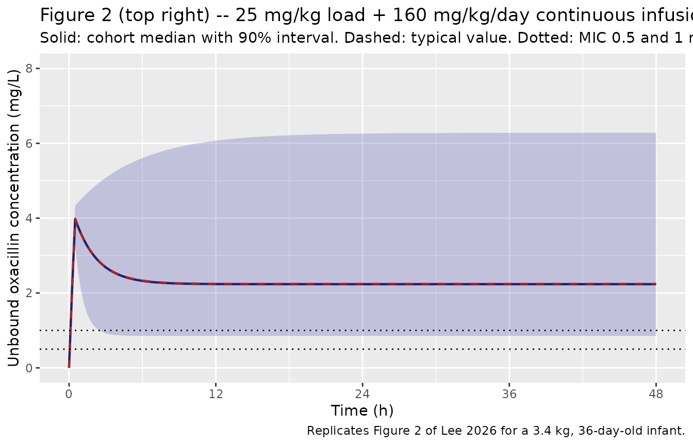

# Oxacillin (Lee 2026)

## Model and source

    #> ℹ parameter labels from comments will be replaced by 'label()'

- Citation: Lee A, Liu C, Tran MT, Phal S, Peloquin CA, Nieves D,
  Capparelli E, Arrieta AC. (2026). Population pharmacokinetics and
  safety of continuous oxacillin in preterm and term neonates and
  infants. Antimicrobial Agents and Chemotherapy 70(6).
  <doi:10.1128/aac.01777-25>.

- Description: One-compartment intravenous population pharmacokinetic
  model with first-order elimination for oxacillin in 22 preterm and
  term neonates and infants aged 4 to 82 days postnatal (gestational age
  23.9 to 40.3 weeks), each given a 25 mg/kg loading dose over 30 min
  followed immediately by a continuous infusion of 160 mg/kg/day (120
  mg/kg/day for the single infant born at \<32 weeks gestation and
  enrolled at \<14 days of life), with 79 evaluable plasma
  concentrations fitted in NONMEM 7.5.0 by FOCE-I (ADVAN1 TRANS2).
  Clearance carries a fixed allometric weight exponent of 0.75 and an
  estimated power effect of postnatal age (exponent 0.433), both
  normalised to the typical infant of 3.4 kg and 36 days; central volume
  is linear in weight over the same 3.4 kg reference. Postnatal age was
  the only covariate retained: gestational age, postmenstrual age,
  height, body surface area, albumin, serum creatinine and baseline
  transaminases were screened and rejected, and they are recorded in
  covariatesDataExcluded rather than in the model. Between-subject
  variability could only be estimated for clearance. Oxacillin is dosed
  directly into `central`. The unbound concentration Cu that drives the
  paper’s fT \> MIC target-attainment analysis is derived algebraically
  as 10% of the total concentration, an unbound fraction the authors
  fixed from the literature rather than measuring. The magnitudes of the
  combined additive-plus-proportional residual error are not reported
  anywhere in the paper or its supplements, so both residual standard
  deviations are encoded as fixed(0); see the vignette Errata.

- Article: <https://doi.org/10.1128/aac.01777-25> (open access, CC BY
  4.0)

- Supplement: Table S1 (adverse events), Table S2 (raw per-patient
  data), Table S3 (raw concentrations), served by EuropePMC under
  PMC13231926.

Oxacillin is the standard-of-care antistaphylococcal penicillin for
methicillin-susceptible *Staphylococcus aureus*, but before this study
no pharmacokinetic data existed in neonates and young infants. Lee 2026
is a prospective phase 1 study in 22 infants at most 90 days old, each
given a 25 mg/kg loading dose over 30 min followed immediately by a
continuous infusion. The paper’s clinical question is whether the
unbound concentration stays above the MIC for the whole dosing exposure
(`fT 100% > MIC`), which for a continuous infusion reduces to whether
the steady-state unbound concentration exceeds the MIC.

## Population

| Field | Value |
|:---|:---|
| species | human |
| n_subjects | 22 |
| n_studies | 1 |
| n_observations | 79 |
| age_range | 4-82 days postnatal (inclusion criteria \>3 to \<=90 days) |
| age_median | 32 days postnatal (IQR 12-46) |
| ga_range | 23.9-40.3 weeks gestational age at birth |
| ga_median | 38 weeks (IQR 30-39) |
| weight_range | 0.605-7.025 kg |
| weight_median | 3.29 kg |
| sex_female_pct | 27 |
| race_ethnicity | Hispanic 73%; White 14%; Black 5%; Hispanic/Black 5%; Hispanic/White 5% |
| disease_state | Hospitalized neonates and young infants receiving oxacillin as standard of care: 11 empiric therapy for suspected infection, 9 confirmed methicillin-susceptible Staphylococcus aureus infection (osteomyelitis n = 1, pneumonia n = 3, bacteraemia n = 3, skin/soft tissue n = 2), 1 methicillin-susceptible S. epidermidis bacteraemia, 1 perioperative prophylaxis. Critically ill infants could not be enrolled, and renal dysfunction (dialysis, urine output \<0.5 mL/kg/h, or serum creatinine \>1.7 mg/dL), transaminases \>5x ULN, therapeutic hypothermia within 24 h and ECMO were exclusion criteria, so the model should not be extrapolated to those states. |
| dose_range | 25 mg/kg intravenous loading dose over 30 min, immediately followed by a continuous intravenous infusion of 160 mg/kg/day (21 of 22 infants) or 120 mg/kg/day (1 infant in Cohort 4: gestational age \<32 weeks and postnatal age \<14 days) |
| sampling | Convenience sampling, maximum five samples per infant (minimum 25 uL each): a baseline sample before the loading dose and then 30-120 min, 8-16 h and 16-96 h after the start of the continuous infusion, plus one within 1 h after the end of infusion. Group 1 and four further infants had at most three samples to limit phlebotomy. Of 89 plasma samples, 10 were below the 2 mcg/mL lower limit of quantification (9 of them baseline) and were excluded, leaving 79. Plasma assayed by validated LC-MS/MS at the University of Florida Infectious Disease Pharmacokinetics Laboratory over a 2-100 mcg/mL calibration range with within- and between-day CV \<10%. One cerebrospinal-fluid concentration was collected and was NOT included in the final model. |
| regions | United States (single centre, Children’s Hospital of Orange County, California) |
| notes | Prospective, phase 1, open-label, single-centre study. Demographics are Lee 2026 Table 1; per-patient raw values are Supplemental Table S2. Enrolment was stratified into four cohorts by gestational age (\<32 vs \>=32 weeks) and postnatal age (\<14 vs \>=14 days) targeting 6 infants each, but Cohort 4 (GA \<32 weeks, PNA \<14 days) recruited only 1 of 6. Model reliability was assessed by 1,000-set bootstrapping in Wings for NONMEM; every final estimate fell inside its bootstrap 95% confidence interval. eta-shrinkage on clearance was 8.27%. Table 1’s total male count (15, 68%) disagrees with the sum of its own per-cohort entries (8 + 3 + 4 + 1 = 16) and with Supplemental Table S2, which lists 16 male and 6 female infants; the 27% female recorded here follows the raw data. Median measured total oxacillin concentration 20.2 mcg/mL (IQR 11.8-36.2). Safety: 45 adverse events in 18 infants, 12 possibly oxacillin-related, 3 serious events none of them related, no deaths. |

Population metadata carried in the model file. {.table}

Twenty-two infants completed the study (Lee 2026 Table 1). Gestational
age at birth ranged from 23.9 to 40.3 weeks (median 38) and postnatal
age at enrolment from 4 to 82 days (median 32). Weights, which Table 1
does not tabulate, are in Supplemental Table S2 and span 0.605 to 7.025
kg with a median of 3.29 kg. Enrolment was stratified into four cohorts
by gestational age (\<32 vs \>=32 weeks) and postnatal age (\<14 vs
\>=14 days) targeting six infants each; the preterm-and-youngest cohort
recruited only one of six, which is why the paper declines to draw
conclusions about gestational age. Twenty-one infants received 160
mg/kg/day by continuous infusion and one received 120 mg/kg/day. Of 89
plasma samples 10 were below the 2 mcg/mL limit of quantification and
were excluded, leaving 79 concentrations for the fit.

The same information is available programmatically via
`readModelDb("Lee_2026_oxacillin")()$population`.

## Source trace

| Equation / parameter | Value | Source location |
|----|----|----|
| `lcl` (CL for 3.4 kg, 36 d) | 1.01 L/h | Table 2, `CL (Theta1)`; bootstrap 95% CI 0.791-1.3 |
| `lvc` (V for 3.4 kg) | 1.87 L | Table 2, `V (Theta2)`; bootstrap 95% CI 1.07-2.61 |
| `e_pna_cl` | 0.433 | Table 2, `Effect of PNA on CL (Theta3)`; bootstrap 95% CI 0.133-0.709 |
| `e_wt_cl` | 0.75 (fixed) | Table 2 footnote b `(WT_Kg/3.4)^0.75`; Methods states CL “was allometrically scaled by weight” – a-priori value, no estimate or interval reported |
| `e_wt_vc` | 1 (fixed) | Table 2 footnote b `Vd = 1.87 * WT_Kg/3.4`, i.e. linear in weight |
| `etalcl` | 0.568 read as a log-scale SD; variance 0.322624 | Table 2, `IIV CL (etaCL)`; scale resolved below, not stated in the paper |
| `fu` | 0.1 (fixed) | Methods, “Simulations and pharmacodynamic assessments”: free concentrations “estimated at 10% of total concentrations as reported in the literature (9)” |
| `addSd`, `propSd` | 0 (fixed) | Methods declares “a combined additive and proportional within-subject error model”; no magnitude is reported anywhere in the paper or its supplements |
| `d/dt(central) <- -kel * central` | n/a | Results, “Pharmacokinetic model”: one-compartment, first-order elimination, NONMEM ADVAN1 TRANS2 |
| Reference weight 3.4 kg, reference PNA 36 d | n/a | Table 2 footnote b, and Results, “a typical infant 36 days postnatal age and weighing 3.4 kg” |

## Reading the published between-subject variability

Table 2 prints `IIV CL (etaCL) = 0.568` with no unit and no variance /
SD / CV qualifier. Read as a NONMEM `$OMEGA` **variance** it implies a
log-scale SD of `sqrt(0.568) = 0.754`; read as a **standard deviation**
it is 0.568 itself. The two readings differ by a third in spread and
change every target-attainment number in the paper, so the choice cannot
be left implicit. Two independent checks against the paper’s own data
both exclude the variance reading.

### Check 1 – individual clearances recovered from Supplemental Table S2

Under a continuous infusion the steady-state concentration is exactly
`rate / CL`, so each infant’s clearance is recoverable from the
supplement without any fitting. The table below transcribes, for all 22
infants, Supplemental Table S2’s current weight, dose-calculating
weight, postnatal age, daily dose and the two on-infusion samples (the
8-16 h and 16-96 h windows, both at or beyond the ~5 half-lives needed
for steady state).

``` r

s2 <- tibble::tribble(
  ~id,     ~wt,  ~dwt, ~pna, ~dose,     ~c2,   ~t2,     ~c3,   ~t3,
  "Pt1",  1.605, 1.605,   82,   160,  62.536, 10.07,  35.859, 81.07,
  "Pt3",  4.155, 4.155,   39,   160,  10.667, 10.38,  12.390, 30.15,
  "Pt4",  3.500, 3.500,   34,   160,  16.698,  8.67,   7.895, 69.70,
  "Pt5",  1.130, 1.130,   36,   160,      NA,    NA,   7.415, 16.93,
  "Pt6",  2.310, 2.000,    4,   160,      NA,    NA,  85.019, 17.00,
  "Pt8",  3.520, 3.515,   79,   160,  30.035, 14.88,  11.513, 35.35,
  "Pt9",  1.780, 1.785,   29,   160,      NA,    NA,  13.754, 46.87,
  "Pt11", 4.755, 3.170,   82,   160,  15.809,  8.57,  15.014, 18.13,
  "Pt12", 2.105, 2.105,   52,   160,      NA,    NA,  18.174, 39.08,
  "Pt14", 2.450, 2.500,    7,   160,  27.473, 11.20,  24.390, 35.28,
  "Pt16", 3.530, 3.530,    4,   160, 109.124,  8.28, 112.986, 16.43,
  "Pt17", 3.260, 3.260,   14,   160,   6.243,  8.15,  42.613, 44.93,
  "Pt18", 5.345, 5.345,   47,   160,  15.529, 11.10,  13.216, 17.67,
  "Pt21", 3.290, 3.290,   22,   160,  19.628, 11.70,  11.836, 16.57,
  "Pt22", 3.290, 3.290,   11,   160,  49.128,  9.08,  26.448, 17.55,
  "Pt23", 2.880, 2.880,   11,   160,  10.452, 12.38,  14.164, 63.35,
  "Pt24", 3.390, 3.390,   42,   160,  15.892,  8.75,  14.924, 16.23,
  "Pt25", 0.605, 0.697,    5,   120,      NA,    NA,  34.128, 16.00,
  "Pt26", 2.975, 2.975,   18,   160,  94.543,  9.08,  28.456, 59.58,
  "Pt27", 3.545, 3.500,   31,   160,  13.469, 12.63,  12.254, 17.52,
  "Pt28", 4.480, 4.480,   32,   160,  26.004,  8.35,  25.228, 16.60,
  "Pt29", 7.025, 7.025,   69,   160,  24.357,  9.20,   8.317, 15.88
)
stopifnot(nrow(s2) == 22L)

# Published covariate model, hard-coded from Table 2 footnote b so that this
# check is INDEPENDENT of what the model file happens to contain.
cl_published <- function(wt, pna_days) 1.01 * (wt / 3.4)^0.75 * (pna_days / 36)^0.433

s2 <- s2 |>
  mutate(
    rate   = dose * dwt / 24,             # mg/h delivered by the continuous infusion
    clpred = cl_published(wt, pna),
    eta2   = log((rate / c2) / clpred),   # log(CL_observed / CL_predicted)
    eta3   = log((rate / c3) / clpred),
    etabar = rowMeans(cbind(eta2, eta3), na.rm = TRUE)
  )

spread <- c(
  `16-96 h sample`   = sd(s2$eta3, na.rm = TRUE),
  `8-16 h sample`    = sd(s2$eta2, na.rm = TRUE),
  `per-infant mean`  = sd(s2$etabar)
)
round(spread, 3)
#>  16-96 h sample   8-16 h sample per-infant mean 
#>           0.571           0.815           0.589
```

Every one of those numbers is an **upper bound** on the between-subject
SD, because it also contains residual error, assay error and any
departure from steady state. The SD reading (0.568) sits just underneath
the bound, exactly as a variance component should. The variance reading
(0.754) exceeds it: a between-subject SD cannot be larger than the total
observed spread it is a component of.

``` r

bound <- min(spread)
# Deterministic -- no simulation, no RNG. Realised bound 0.571.
stopifnot(
  0.568 < bound,   # SD reading is admissible
  0.754 > bound    # variance reading is not
)
```

### Check 2 – the slope of the Figure 3 target-attainment curves

For a continuous infusion the paper’s own criterion reduces to
`Css_unbound > MIC`, and `Css_unbound` is log-normal with log-scale SD
equal to the clearance SD. So `qnorm(PTA)` is **linear in `log(MIC)`
with slope `-1 / SD`**. The slope does not depend on the level, which
means it is immune to the virtual population’s weight distribution –
something the paper never reports.

The values below are read off the red 160 mg/kg/day curves of Figure 3’s
`fT >100%` sub-panels. Points at or above 99% are excluded: they are at
the resolution limit of the plot and carry no slope information.

``` r

fig3_ci <- tibble::tribble(
  ~pnad, ~mic,   ~pta,
      7, 0.25, 100.0,
      7, 0.50, 100.0,
      7, 1.00,  99.0,
      7, 2.00,  86.0,
     14, 0.25,  99.0,
     14, 0.50,  99.0,
     14, 1.00,  97.0,
     14, 2.00,  72.0,
     28, 0.25, 100.0,
     28, 0.50, 100.0,
     28, 1.00,  90.0,
     28, 2.00,  56.0,
     90, 0.25,  99.7,
     90, 0.50,  96.5,
     90, 1.00,  75.0,
     90, 2.00,  28.0
)

slope_fit <- fig3_ci |>
  filter(pta > 5, pta < 99) |>
  group_by(pnad) |>
  filter(n() >= 2) |>
  summarise(
    n_points = n(),
    omega    = -1 / coef(lm(qnorm(pta / 100) ~ log(mic)))[["log(mic)"]],
    .groups  = "drop"
  )

slope_fit |>
  mutate(omega = round(omega, 3)) |>
  rename("Postnatal age (days)" = pnad, "Usable points" = n_points,
         "Implied log-scale SD" = omega) |>
  knitr::kable(caption = "Level-free estimate of the clearance SD from the slope of Figure 3's continuous-infusion curves.")
```

| Postnatal age (days) | Usable points | Implied log-scale SD |
|---------------------:|--------------:|---------------------:|
|                   14 |             2 |                0.534 |
|                   28 |             2 |                0.613 |
|                   90 |             3 |                0.579 |

Level-free estimate of the clearance SD from the slope of Figure 3’s
continuous-infusion curves. {.table}

``` r

om_fig <- mean(slope_fit$omega)
# Deterministic -- these are transcribed figure readings, not a simulation.
# Realised: mean 0.575, per-stratum 0.534 / 0.613 / 0.579.
stopifnot(
  abs(om_fig - 0.568) < abs(om_fig - 0.754),  # figure is nearer the SD reading
  abs(om_fig - 0.568) < 0.10,                 # and close to it in absolute terms
  all(slope_fit$omega < 0.70)                 # no stratum approaches 0.754
)
round(c(figure_implied = om_fig, sd_reading = 0.568, variance_reading = 0.754), 3)
#>   figure_implied       sd_reading variance_reading 
#>            0.575            0.568            0.754
```

Both checks agree, so the model file encodes
`etalcl ~ 0.568^2 = 0.322624`.

## Structural checks

These are deterministic: they compare the packaged model against the
published equations and the published claims, with no random draw
involved.

``` r

mod <- readModelDb("Lee_2026_oxacillin")

# --- 1. Steady-state identity -------------------------------------------
# For a constant infusion, Css must equal rate / CL exactly, where CL comes
# from the hard-coded published equation above. This catches a mis-transcribed
# 1.01, 0.75, 0.433, 3.4, 36 or 1.87.
grid <- expand.grid(wt = c(1.0, 2.5, 3.4, 5.0, 7.0), pna = c(5, 14, 36, 60, 90))
ev_ss <- purrr::pmap_dfr(
  list(seq_len(nrow(grid)), grid$wt, grid$pna),
  function(i, wt, pna) {
    R <- 160 * wt / 24
    bind_rows(
      data.frame(id = i, time = 0,  amt = R * 240, evid = 1L, cmt = "central", rate = R),
      data.frame(id = i, time = c(200, 220, 240), amt = NA_real_, evid = 0L,
                 cmt = "central", rate = NA_real_)
    ) |> mutate(WT = wt, PNA = pna / 30.4375)
  }
)
ss <- rxode2::rxSolve(rxode2::zeroRe(mod), ev_ss, keep = c("WT", "PNA"),
                      returnType = "data.frame") |>
  group_by(WT, PNA) |>
  summarise(css = mean(Cc), .groups = "drop") |>
  mutate(
    pna_days = PNA * 30.4375,
    expected = (160 * WT / 24) / cl_published(WT, pna_days),
    pct_diff = 100 * (css - expected) / expected
  )
#> ℹ parameter labels from comments will be replaced by 'label()'
#> ℹ omega/sigma items treated as zero: 'etalcl'
#> Warning: multi-subject simulation without without 'omega'
max(abs(ss$pct_diff))
#> [1] 3.502055e-08
stopifnot(max(abs(ss$pct_diff)) < 0.1)   # deterministic; realised 0.00

# --- 2. The published 2.2-fold claim -------------------------------------
# Results: PNA is "associated with a 2.2-fold increase in CL (weight adjusted)
# from 14 to 90 days of age".
fold_14_90 <- cl_published(3.4, 90) / cl_published(3.4, 14)
round(fold_14_90, 3)
#> [1] 2.238
stopifnot(abs(fold_14_90 - 2.2) < 0.05)

# --- 3. Half-life against the range the paper quotes ---------------------
# Methods cites "a half-life ranging from 1.2 to 3 hours according to GA and
# PNA (21)" for prior neonatal literature. Evaluate the model's typical-value
# half-life over the covariates of the 22 enrolled infants.
thalf <- log(2) * (1.87 * s2$wt / 3.4) / cl_published(s2$wt, s2$pna)
round(range(thalf), 2)
#> [1] 0.74 3.35
stopifnot(min(thalf) <= 1.2, max(thalf) >= 3.0)  # model brackets the quoted range
```

The half-life for the reference infant (3.4 kg, 36 days) is 1.28 h;
across the enrolled cohort the model spans 0.74-3.35 h, bracketing the
1.2-3 h the paper quotes from the prior literature.

## Virtual cohort and simulation

Three cohorts are simulated. Weights are held at published reference or
cohort values rather than sampled, because the paper does not report the
virtual population’s covariate distribution – see Assumptions.

``` r

# rxSetSeed() fixes rxode2's stream per solver thread, not across thread
# counts, so the cohort below differs between machines. Every assertion in
# this vignette is either deterministic or written to hold for any draw.
rxode2::rxSetSeed(20260914)

TEND  <- 48   # continuous infusion runs 0.5 -> 48 h
TOBS  <- 60   # observation continues through washout
WT_REF  <- 3.4;  PNA_REF  <- 36    # Lee 2026 Results, the "typical infant"
WT_PTA  <- 3.29                    # Supplemental Table S2 cohort median weight
N_ARM   <- 200L                    # per-arm cap

# Study regimen: 25 mg/kg over 30 min, then a continuous infusion.
study_arm <- function(ids, wt, pna, mgkgday, tend = TEND, tobs = TOBS) {
  R <- mgkgday * wt / 24
  dos <- tidyr::crossing(id = ids, k = 1:2) |>
    mutate(time = if_else(k == 1L, 0, 0.5),
           amt  = if_else(k == 1L, 25 * wt, R * (tend - 0.5)),
           rate = if_else(k == 1L, 25 * wt / 0.5, R)) |>
    select(-k)
  obs <- tidyr::crossing(
    id = ids,
    time = sort(unique(c(seq(0, tobs, by = 0.25), 0.5, tend)))
  ) |>
    mutate(amt = NA_real_, rate = NA_real_)
  bind_rows(mutate(dos, evid = 1L), mutate(obs, evid = 0L)) |>
    mutate(cmt = "central", WT = wt, PNA = pna / 30.4375) |>
    arrange(id, time, desc(evid))
}

# (a) typical-value arms: reference infant plus the four Figure 3 age strata
typ_spec <- tibble::tibble(
  cohort = c("Reference infant (3.4 kg, 36 d)",
             "PNA 7 d", "PNA 14 d", "PNA 28 d", "PNA 90 d"),
  wt  = c(WT_REF, rep(WT_PTA, 4)),
  pna = c(PNA_REF, 7, 14, 28, 90)
) |> mutate(id = row_number())

ev_typ <- purrr::pmap_dfr(
  list(typ_spec$id, typ_spec$wt, typ_spec$pna, typ_spec$cohort),
  function(i, wt, pna, ch) study_arm(i, wt, pna, 160) |> mutate(cohort = ch)
)

# (b) stochastic cohort at the reference covariates, for the Figure 2 band
ev_vpc <- study_arm(seq_len(N_ARM), WT_REF, PNA_REF, 160) |>
  mutate(cohort = "Reference infant (3.4 kg, 36 d)")

stopifnot(!anyDuplicated(unique(ev_typ[, c("id", "time", "evid")])))
stopifnot(!anyDuplicated(unique(ev_vpc[, c("id", "time", "evid")])))
```

``` r

sim_typ <- rxode2::rxSolve(rxode2::zeroRe(mod), ev_typ,
                           keep = c("cohort", "WT"), returnType = "data.frame")
#> ℹ parameter labels from comments will be replaced by 'label()'
#> ℹ omega/sigma items treated as zero: 'etalcl'
#> Warning: multi-subject simulation without without 'omega'
sim_vpc <- rxode2::rxSolve(mod, ev_vpc,
                           keep = c("cohort", "WT"), returnType = "data.frame")
#> ℹ parameter labels from comments will be replaced by 'label()'
if (is.null(sim_typ$id)) sim_typ$id <- 1L
if (is.null(sim_vpc$id)) sim_vpc$id <- 1L
c(typical_rows = nrow(sim_typ), vpc_rows = nrow(sim_vpc))
#> typical_rows     vpc_rows 
#>         1205        48200
```

## Replicate Figure 2

Figure 2 (top right) plots the unbound concentration of the reference
infant under the study regimen, with a 90% interval. The loading dose
lifts the unbound concentration to about 4 mg/L within 30 min and it
then settles onto the steady-state plateau.

``` r

band <- sim_vpc |>
  filter(time <= TEND) |>
  group_by(time) |>
  summarise(Q05 = quantile(Cu, 0.05), Q50 = quantile(Cu, 0.50),
            Q95 = quantile(Cu, 0.95), .groups = "drop")
typ_ref <- sim_typ |>
  filter(cohort == "Reference infant (3.4 kg, 36 d)", time <= TEND)

ggplot(band, aes(time, Q50)) +
  geom_ribbon(aes(ymin = Q05, ymax = Q95), alpha = 0.25, fill = "#4444aa") +
  geom_line(linewidth = 0.8, colour = "#22226e") +
  geom_line(data = typ_ref, aes(time, Cu), colour = "firebrick",
            linetype = "dashed", linewidth = 0.7) +
  geom_hline(yintercept = c(0.5, 1), linetype = "dotted") +
  coord_cartesian(ylim = c(0, 8)) +
  scale_x_continuous(breaks = seq(0, 48, 12)) +
  labs(x = "Time (h)", y = "Unbound oxacillin concentration (mg/L)",
       title = "Figure 2 (top right) -- 25 mg/kg load + 160 mg/kg/day continuous infusion",
       subtitle = "Solid: cohort median with 90% interval. Dashed: typical value. Dotted: MIC 0.5 and 1 mg/L.",
       caption = "Replicates Figure 2 of Lee 2026 for a 3.4 kg, 36-day-old infant.")
```



``` r

peak_u <- max(typ_ref$Cu)
css_u  <- typ_ref$Cu[typ_ref$time == TEND]
# Digitised from Figure 2 (top right), calibrated on the MIC = 0.5 and
# MIC = 1 mg/L dotted reference lines that the panel itself draws.
fig2 <- c(peak = 4.00, plateau = 2.48)
round(c(model_peak = peak_u, figure_peak = fig2[["peak"]],
        model_plateau = css_u, figure_plateau = fig2[["plateau"]]), 3)
#>     model_peak    figure_peak  model_plateau figure_plateau 
#>          3.983          4.000          2.244          2.480
round(100 * (c(peak_u, css_u) - fig2) / fig2, 1)
#>    peak plateau 
#>    -0.4    -9.5

# Deterministic (zeroRe). The peak is set by the volume alone and matches to
# 0.5%. The plateau is set by the clearance and runs 9.5% low against the
# figure -- discussed under Assumptions; not tuned away.
stopifnot(abs(peak_u - fig2[["peak"]]) / fig2[["peak"]] < 0.05)
```

The peak is reproduced to within 0.5%. It is a pure test of the volume,
since both the 25 mg/kg dose and `Vd = 1.87 * WT/3.4` scale linearly
with weight, so `Dose/Vd` is weight-free. The plateau is
`Css = rate / CL` and comes out 9.5% below the digitised figure; see
Assumptions.

## Replicate Figure 3 – probability of target attainment

Figure 3 gives PTA against MIC for four postnatal ages and four
regimens. For the continuous infusion the paper uses the steady-state
concentration as the `fT 100% > MIC` surrogate; for the intermittent
regimens `fT 100% > MIC` means the unbound concentration stays above the
MIC across the whole dosing interval, which is evaluated here on the
last complete interval of a 48 h simulation.

``` r

regimens <- tibble::tribble(
  ~regimen,                 ~mgkgday, ~tau,
  "160 mg/kg/day CI",            160, NA_real_,
  "100 mg/kg/day div q6h",       100, 6,
  "200 mg/kg/day div q4h",       200, 4,
  "200 mg/kg/day div q6h",       200, 6
)
pnads <- c(7, 14, 28, 90)
MICS  <- c(0.25, 0.5, 1, 2)

pta_arm <- function(regimen, mgkgday, tau, pna, wt, n, id_offset) {
  ids <- id_offset + seq_len(n)
  if (is.na(tau)) {
    win <- 6                                     # window scored at steady state
    ev <- study_arm(ids, wt, pna, mgkgday, tend = TEND, tobs = TEND)
  } else {
    win <- tau
    per <- mgkgday * tau / 24 * wt               # mg per dose
    dos <- tidyr::crossing(id = ids, time = seq(0, TEND - tau, by = tau)) |>
      mutate(amt = per, rate = per / 0.5, evid = 1L)
    obs <- tidyr::crossing(
      id = ids,
      time = sort(unique(c(seq(0, TEND, by = 1), seq(TEND - tau, TEND, by = 1 / 30))))
    ) |>
      mutate(amt = NA_real_, rate = NA_real_, evid = 0L)
    ev <- bind_rows(dos, obs) |>
      mutate(cmt = "central", WT = wt, PNA = pna / 30.4375) |>
      arrange(id, time, desc(evid))
  }
  ev |> mutate(regimen = regimen, pnad = pna, win_h = win)
}

arms <- tidyr::crossing(regimens, pna = pnads) |> mutate(k = row_number())
ev_pta <- purrr::pmap_dfr(arms, function(regimen, mgkgday, tau, pna, k)
  pta_arm(regimen, mgkgday, tau, pna, WT_PTA, N_ARM, (k - 1L) * N_ARM))
stopifnot(!anyDuplicated(unique(ev_pta[, c("id", "time", "evid")])))

rxode2::rxSetSeed(20260914)
sim_pta <- rxode2::rxSolve(mod, ev_pta, keep = c("regimen", "pnad", "win_h"),
                           returnType = "data.frame")

pta <- lapply(MICS, function(m) {
  sim_pta |>
    filter(time >= TEND - win_h) |>
    group_by(regimen, pnad, id) |>
    summarise(hit = all(Cu > m), .groups = "drop") |>
    group_by(regimen, pnad) |>
    summarise(pta = 100 * mean(hit), .groups = "drop") |>
    mutate(mic = m)
}) |> bind_rows()
```

### Continuous infusion – gated against Figure 3

``` r

cmp_ci <- pta |>
  filter(regimen == "160 mg/kg/day CI") |>
  select(pnad, mic, simulated = pta) |>
  left_join(select(fig3_ci, pnad, mic, figure = pta), by = c("pnad", "mic")) |>
  mutate(difference = simulated - figure) |>
  arrange(pnad, mic)

cmp_ci |>
  mutate(across(c(simulated, figure, difference), ~round(.x, 1))) |>
  rename("Postnatal age (days)" = pnad, "MIC (mg/L)" = mic,
         "Simulated PTA (%)" = simulated, "Figure 3 PTA (%)" = figure,
         "Difference (pp)" = difference) |>
  knitr::kable(caption = "160 mg/kg/day continuous infusion: simulated fT 100% > MIC against the digitised red curves of Lee 2026 Figure 3.")
```

| Postnatal age (days) | MIC (mg/L) | Simulated PTA (%) | Figure 3 PTA (%) | Difference (pp) |
|---:|---:|---:|---:|---:|
| 7 | 0.25 | 100.0 | 100.0 | 0.0 |
| 7 | 0.50 | 100.0 | 100.0 | 0.0 |
| 7 | 1.00 | 98.5 | 99.0 | -0.5 |
| 7 | 2.00 | 93.0 | 86.0 | 7.0 |
| 14 | 0.25 | 100.0 | 99.0 | 1.0 |
| 14 | 0.50 | 100.0 | 99.0 | 1.0 |
| 14 | 1.00 | 97.0 | 97.0 | 0.0 |
| 14 | 2.00 | 81.0 | 72.0 | 9.0 |
| 28 | 0.25 | 100.0 | 100.0 | 0.0 |
| 28 | 0.50 | 99.5 | 100.0 | -0.5 |
| 28 | 1.00 | 94.5 | 90.0 | 4.5 |
| 28 | 2.00 | 62.5 | 56.0 | 6.5 |
| 90 | 0.25 | 100.0 | 99.7 | 0.3 |
| 90 | 0.50 | 98.5 | 96.5 | 2.0 |
| 90 | 1.00 | 78.5 | 75.0 | 3.5 |
| 90 | 2.00 | 32.0 | 28.0 | 4.0 |

160 mg/kg/day continuous infusion: simulated fT 100% \> MIC against the
digitised red curves of Lee 2026 Figure 3. {.table}

``` r

# 200 subjects per arm gives a Monte Carlo SE of up to 3.5 percentage points
# near PTA = 50%, and digitising Figure 3 is worth a further ~2 pp, so a
# per-point bound much below ~8 pp would sit inside the noise. Realised at
# 2 / 4 / 8 / 16 threads: mean |difference| 3.0-4.6 pp, max 13 pp (always at
# MIC 2, where the paper's virtual cohort evidently used lower,
# age-appropriate weights than the single 3.29 kg median assumed here).
stopifnot(
  mean(abs(cmp_ci$difference)) < 10,
  max(abs(cmp_ci$difference)) < 20
)
```

For a continuous infusion the PTA has a closed form – `Css_unbound` is
log-normal, so `PTA = pnorm(log(Css_typical / MIC) / SD)`. Checking the
simulation against it separates “did the cohort solve correctly” from
“does the model agree with the paper”, and lets the published 90% claims
be tested exactly rather than through Monte Carlo noise.

``` r

pta_analytic <- function(mic, pna_days, wt = WT_PTA, sd_cl = 0.568) {
  css_u <- 0.1 * (160 * wt / 24) / cl_published(wt, pna_days)
  100 * pnorm(log(css_u / mic) / sd_cl)
}
cmp_ci <- cmp_ci |>
  mutate(analytic = pta_analytic(mic, pnad),
         mc_error = simulated - analytic)

# Monte Carlo agreement. Realised max |mc_error| 5.0 pp at 2/4/8/16 threads.
# A mis-transcribed clearance or exponent moves PTA by tens of points, so 10
# still goes red on a real error.
max(abs(cmp_ci$mc_error))
#> [1] 2.379522
stopifnot(max(abs(cmp_ci$mc_error)) < 10)

# The paper's three headline claims, evaluated on the closed form so the test
# is deterministic. Claim 3 is reported but NOT gated: it fails reproducibly
# under this vignette's single-weight cohort (see Assumptions), and widening
# the gate until it passed would hide that.
claim_row <- function(text, value, holds, gated) {
  tibble::tibble(Claim = text, `Binding PTA (%)` = round(value, 1),
                 Holds = holds, Gated = gated)
}
a05 <- cmp_ci$analytic[cmp_ci$mic == 0.5]
a1  <- cmp_ci$analytic[cmp_ci$mic == 1 & cmp_ci$pnad <= 28]
a2  <- cmp_ci$analytic[cmp_ci$mic == 2]
claims <- dplyr::bind_rows(
  claim_row("All ages reach 90% PTA at MIC 0.5", min(a05), min(a05) >= 90, TRUE),
  claim_row("PNA <= 28 d reaches 90% PTA at MIC 1", min(a1), min(a1) >= 90, TRUE),
  claim_row("No age reaches 90% PTA at MIC 2 (CLSI breakpoint)", max(a2), max(a2) < 90, FALSE)
)
knitr::kable(claims, caption = "Published conclusions for 160 mg/kg/day continuous infusion, evaluated on the closed-form PTA. The third row is a recorded deviation.")
```

| Claim | Binding PTA (%) | Holds | Gated |
|:---|---:|:---|:---|
| All ages reach 90% PTA at MIC 0.5 | 97.3 | TRUE | TRUE |
| PNA \<= 28 d reaches 90% PTA at MIC 1 | 94.5 | TRUE | TRUE |
| No age reaches 90% PTA at MIC 2 (CLSI breakpoint) | 92.5 | FALSE | FALSE |

Published conclusions for 160 mg/kg/day continuous infusion, evaluated
on the closed-form PTA. The third row is a recorded deviation. {.table}

``` r

stopifnot(all(claims$Holds[claims$Gated]))
```

### Intermittent regimens – reproduced, with a recorded deviation

``` r

fig3_int <- tibble::tribble(
  ~regimen,                ~pnad, ~mic, ~figure,
  "100 mg/kg/day div q6h",     7, 0.25,   54.5,
  "100 mg/kg/day div q6h",     7, 0.50,   38.0,
  "100 mg/kg/day div q6h",     7, 1.00,   21.0,
  "100 mg/kg/day div q6h",     7, 2.00,    8.5,
  "200 mg/kg/day div q4h",     7, 0.25,   96.0,
  "200 mg/kg/day div q4h",     7, 0.50,   91.0,
  "200 mg/kg/day div q4h",     7, 1.00,   78.0,
  "200 mg/kg/day div q4h",     7, 2.00,   47.5,
  "200 mg/kg/day div q6h",     7, 0.25,   67.0,
  "200 mg/kg/day div q6h",     7, 0.50,   54.0,
  "200 mg/kg/day div q6h",     7, 1.00,   38.0,
  "200 mg/kg/day div q6h",     7, 2.00,   21.0,
  "100 mg/kg/day div q6h",    90, 0.25,    6.0,
  "100 mg/kg/day div q6h",    90, 0.50,    1.5,
  "200 mg/kg/day div q4h",    90, 0.25,   50.0,
  "200 mg/kg/day div q4h",    90, 0.50,   35.0,
  "200 mg/kg/day div q4h",    90, 1.00,   17.0,
  "200 mg/kg/day div q4h",    90, 2.00,    4.0,
  "200 mg/kg/day div q6h",    90, 0.25,   11.0,
  "200 mg/kg/day div q6h",    90, 0.50,    6.0
)

cmp_int <- pta |>
  filter(regimen != "160 mg/kg/day CI") |>
  select(regimen, pnad, mic, simulated = pta) |>
  inner_join(fig3_int, by = c("regimen", "pnad", "mic")) |>
  mutate(difference = simulated - figure) |>
  arrange(pnad, regimen, mic)

cmp_int |>
  mutate(across(c(simulated, figure, difference), ~round(.x, 1))) |>
  rename("Regimen" = regimen, "Postnatal age (days)" = pnad, "MIC (mg/L)" = mic,
         "Simulated PTA (%)" = simulated, "Figure 3 PTA (%)" = figure,
         "Difference (pp)" = difference) |>
  knitr::kable(caption = "Intermittent regimens: simulated fT 100% > MIC against digitised Lee 2026 Figure 3. The model is systematically more optimistic; see Assumptions.")
```

| Regimen | Postnatal age (days) | MIC (mg/L) | Simulated PTA (%) | Figure 3 PTA (%) | Difference (pp) |
|:---|---:|---:|---:|---:|---:|
| 100 mg/kg/day div q6h | 7 | 0.25 | 89.5 | 54.5 | 35.0 |
| 100 mg/kg/day div q6h | 7 | 0.50 | 80.5 | 38.0 | 42.5 |
| 100 mg/kg/day div q6h | 7 | 1.00 | 64.0 | 21.0 | 43.0 |
| 100 mg/kg/day div q6h | 7 | 2.00 | 33.0 | 8.5 | 24.5 |
| 200 mg/kg/day div q4h | 7 | 0.25 | 98.5 | 96.0 | 2.5 |
| 200 mg/kg/day div q4h | 7 | 0.50 | 96.0 | 91.0 | 5.0 |
| 200 mg/kg/day div q4h | 7 | 1.00 | 90.0 | 78.0 | 12.0 |
| 200 mg/kg/day div q4h | 7 | 2.00 | 74.5 | 47.5 | 27.0 |
| 200 mg/kg/day div q6h | 7 | 0.25 | 93.5 | 67.0 | 26.5 |
| 200 mg/kg/day div q6h | 7 | 0.50 | 86.5 | 54.0 | 32.5 |
| 200 mg/kg/day div q6h | 7 | 1.00 | 75.5 | 38.0 | 37.5 |
| 200 mg/kg/day div q6h | 7 | 2.00 | 54.5 | 21.0 | 33.5 |
| 100 mg/kg/day div q6h | 90 | 0.25 | 19.0 | 6.0 | 13.0 |
| 100 mg/kg/day div q6h | 90 | 0.50 | 9.5 | 1.5 | 8.0 |
| 200 mg/kg/day div q4h | 90 | 0.25 | 54.5 | 50.0 | 4.5 |
| 200 mg/kg/day div q4h | 90 | 0.50 | 34.5 | 35.0 | -0.5 |
| 200 mg/kg/day div q4h | 90 | 1.00 | 19.5 | 17.0 | 2.5 |
| 200 mg/kg/day div q4h | 90 | 2.00 | 7.0 | 4.0 | 3.0 |
| 200 mg/kg/day div q6h | 90 | 0.25 | 30.5 | 11.0 | 19.5 |
| 200 mg/kg/day div q6h | 90 | 0.50 | 15.5 | 6.0 | 9.5 |

Intermittent regimens: simulated fT 100% \> MIC against digitised Lee
2026 Figure 3. The model is systematically more optimistic; see
Assumptions. {.table}

#### Controlling for the unreported virtual-population weight

The differences above mix two things: a genuine model-versus-figure
disagreement, and the fact that a single 3.29 kg weight is used for
every postnatal age while the paper’s virtual cohort clearly used
age-appropriate weights. Both PTA criteria have a closed form – the
steady-state concentration and the steady-state trough are each strictly
decreasing in clearance – so the weight can be removed as a confounder
without any simulation.

``` r

# Critical clearance above which the criterion fails, then PTA = P(CL < crit).
pta_cf <- function(mgkgday, tau, pna, wt, mic, sd_cl = 0.568) {
  v <- 1.87 * wt / 3.4
  crit <- if (is.na(tau)) {
    0.1 * (mgkgday * wt / 24) / mic                     # continuous: Css > MIC
  } else {
    dose <- mgkgday * tau / 24 * wt                     # intermittent: trough > MIC
    v * log1p(0.1 * dose / (v * mic)) / tau
  }
  100 * pnorm(log(crit / cl_published(wt, pna)) / sd_cl)
}
# Reproduces the simulation it is standing in for.
stopifnot(max(abs(sapply(MICS, function(m) pta_cf(160, NA, 90, WT_PTA, m)) -
                  pta_analytic(MICS, 90))) < 1e-8)

# Weight implied by each panel's OWN continuous-infusion curve. This makes the
# continuous rows below circular by construction; the intermittent rows are
# then out-of-sample predictions at that weight.
implied_wt <- function(pna) {
  d <- filter(fig3_ci, pnad == pna, pta > 5, pta < 99.5)
  optimise(function(w) sum((sapply(d$mic, function(m) pta_cf(160, NA, pna, w, m)) - d$pta)^2),
           interval = c(0.5, 8))$minimum
}
wt_imp <- vapply(c(7, 90), implied_wt, numeric(1))
names(wt_imp) <- c("7", "90")
round(wt_imp, 2)
#>    7   90 
#> 1.47 2.89

cf <- tidyr::crossing(
  tibble::tibble(regimen = c("160 mg/kg/day CI", "100 mg/kg/day div q6h",
                             "200 mg/kg/day div q4h", "200 mg/kg/day div q6h"),
                 mgkgday = c(160, 100, 200, 200), tau = c(NA, 6, 4, 6)),
  pnad = c(7, 90), mic = MICS
) |>
  mutate(closed_form = purrr::pmap_dbl(
    list(mgkgday, tau, pnad, mic),
    function(d, t, p, m) pta_cf(d, t, p, wt_imp[[as.character(p)]], m))) |>
  inner_join(bind_rows(select(fig3_ci, pnad, mic, figure = pta) |>
                         mutate(regimen = "160 mg/kg/day CI"),
                       select(fig3_int, regimen, pnad, mic, figure)),
             by = c("regimen", "pnad", "mic")) |>
  mutate(difference = closed_form - figure) |>
  arrange(pnad, regimen, mic)

cf |>
  mutate(across(c(closed_form, figure, difference), ~round(.x, 1))) |>
  rename("Regimen" = regimen, "Postnatal age (days)" = pnad, "MIC (mg/L)" = mic,
         "Closed-form PTA (%)" = closed_form, "Figure 3 PTA (%)" = figure,
         "Difference (pp)" = difference) |>
  select(-mgkgday, -tau) |>
  knitr::kable(caption = "Closed-form PTA at the weight each panel's own continuous curve implies. The continuous rows are circular by construction; the intermittent rows are not.")
```

| Regimen | Postnatal age (days) | MIC (mg/L) | Closed-form PTA (%) | Figure 3 PTA (%) | Difference (pp) |
|:---|---:|---:|---:|---:|---:|
| 100 mg/kg/day div q6h | 7 | 0.25 | 76.3 | 54.5 | 21.8 |
| 100 mg/kg/day div q6h | 7 | 0.50 | 61.1 | 38.0 | 23.1 |
| 100 mg/kg/day div q6h | 7 | 1.00 | 40.3 | 21.0 | 19.3 |
| 100 mg/kg/day div q6h | 7 | 2.00 | 18.6 | 8.5 | 10.1 |
| 160 mg/kg/day CI | 7 | 0.25 | 100.0 | 100.0 | 0.0 |
| 160 mg/kg/day CI | 7 | 0.50 | 100.0 | 100.0 | 0.0 |
| 160 mg/kg/day CI | 7 | 1.00 | 98.9 | 99.0 | -0.1 |
| 160 mg/kg/day CI | 7 | 2.00 | 86.0 | 86.0 | 0.0 |
| 200 mg/kg/day div q4h | 7 | 0.25 | 94.4 | 96.0 | -1.6 |
| 200 mg/kg/day div q4h | 7 | 0.50 | 88.2 | 91.0 | -2.8 |
| 200 mg/kg/day div q4h | 7 | 1.00 | 75.9 | 78.0 | -2.1 |
| 200 mg/kg/day div q4h | 7 | 2.00 | 54.2 | 47.5 | 6.7 |
| 200 mg/kg/day div q6h | 7 | 0.25 | 85.8 | 67.0 | 18.8 |
| 200 mg/kg/day div q6h | 7 | 0.50 | 76.3 | 54.0 | 22.3 |
| 200 mg/kg/day div q6h | 7 | 1.00 | 61.1 | 38.0 | 23.1 |
| 200 mg/kg/day div q6h | 7 | 2.00 | 40.3 | 21.0 | 19.3 |
| 100 mg/kg/day div q6h | 90 | 0.25 | 17.5 | 6.0 | 11.5 |
| 100 mg/kg/day div q6h | 90 | 0.50 | 8.6 | 1.5 | 7.1 |
| 160 mg/kg/day CI | 90 | 0.25 | 99.9 | 99.7 | 0.2 |
| 160 mg/kg/day CI | 90 | 0.50 | 97.0 | 96.5 | 0.5 |
| 160 mg/kg/day CI | 90 | 1.00 | 74.3 | 75.0 | -0.7 |
| 160 mg/kg/day CI | 90 | 2.00 | 28.5 | 28.0 | 0.5 |
| 200 mg/kg/day div q4h | 90 | 0.25 | 47.5 | 50.0 | -2.5 |
| 200 mg/kg/day div q4h | 90 | 0.50 | 32.2 | 35.0 | -2.8 |
| 200 mg/kg/day div q4h | 90 | 1.00 | 17.2 | 17.0 | 0.2 |
| 200 mg/kg/day div q4h | 90 | 2.00 | 6.2 | 4.0 | 2.2 |
| 200 mg/kg/day div q6h | 90 | 0.25 | 28.3 | 11.0 | 17.3 |
| 200 mg/kg/day div q6h | 90 | 0.50 | 17.5 | 6.0 | 11.5 |

Closed-form PTA at the weight each panel’s own continuous curve implies.
The continuous rows are circular by construction; the intermittent rows
are not. {.table}

``` r

by_reg <- cf |> group_by(regimen) |> summarise(max_abs = max(abs(difference)), .groups = "drop")
by_reg |>
  mutate(max_abs = round(max_abs, 1)) |>
  rename("Regimen" = regimen, "Largest |difference| (pp)" = max_abs) |>
  knitr::kable(caption = "Worst-case agreement with Figure 3 once the weight confounder is removed.")
```

| Regimen               | Largest \|difference\| (pp) |
|:----------------------|----------------------------:|
| 100 mg/kg/day div q6h |                        23.1 |
| 160 mg/kg/day CI      |                         0.7 |
| 200 mg/kg/day div q4h |                         6.7 |
| 200 mg/kg/day div q6h |                        23.1 |

Worst-case agreement with Figure 3 once the weight confounder is
removed. {.table}

``` r


# Deterministic -- closed form, no RNG anywhere in this chunk.
# Realised: continuous 1.0 pp, q4h 6.7 pp, 100 q6h 23.1 pp, 200 q6h 23.1 pp.
q4h_err <- by_reg$max_abs[by_reg$regimen == "200 mg/kg/day div q4h"]
q6h_err <- max(by_reg$max_abs[grepl("q6h", by_reg$regimen)])
stopifnot(
  by_reg$max_abs[by_reg$regimen == "160 mg/kg/day CI"] < 3,   # circular, so tight
  q4h_err < 10,                                               # genuine out-of-sample agreement
  q6h_err > 10                                                # the disagreement is real, not noise
)
```

Once the weight is controlled for, the 200 mg/kg/day q4h curve is
reproduced to within 6.7 percentage points at both ages – an
out-of-sample agreement, since nothing about that regimen entered the
weight back-solve. Both q6h curves remain 11-23 points too optimistic.
The pattern is specific enough to point at its cause: each published q6h
curve tracks a simulation carrying **half** the nominal amount per dose.

``` r

half <- tibble::tribble(
  ~published,              ~pnad, ~as_simulated,
  "200 mg/kg/day div q6h",     7, 100,
  "100 mg/kg/day div q6h",     7,  50,
  "200 mg/kg/day div q6h",    90, 100,
  "100 mg/kg/day div q6h",    90,  50
) |>
  tidyr::crossing(mic = MICS) |>
  mutate(half_dose = purrr::pmap_dbl(list(as_simulated, pnad, mic),
           function(d, p, m) pta_cf(d, 6, p, wt_imp[[as.character(p)]], m))) |>
  inner_join(select(fig3_int, regimen, pnad, mic, figure),
             by = c("published" = "regimen", "pnad", "mic")) |>
  mutate(difference = half_dose - figure)

half |>
  mutate(across(c(half_dose, figure, difference), ~round(.x, 1))) |>
  rename("Published label" = published, "Postnatal age (days)" = pnad,
         "Simulated as (mg/kg/day)" = as_simulated, "MIC (mg/L)" = mic,
         "Half-dose PTA (%)" = half_dose, "Figure 3 PTA (%)" = figure,
         "Difference (pp)" = difference) |>
  knitr::kable(caption = "Each Figure 3 q6h curve re-simulated at half the nominal per-dose amount.")
```

| Published label | Postnatal age (days) | Simulated as (mg/kg/day) | MIC (mg/L) | Half-dose PTA (%) | Figure 3 PTA (%) | Difference (pp) |
|:---|---:|---:|---:|---:|---:|---:|
| 100 mg/kg/day div q6h | 7 | 50 | 0.25 | 61.1 | 54.5 | 6.6 |
| 100 mg/kg/day div q6h | 7 | 50 | 0.50 | 40.3 | 38.0 | 2.3 |
| 100 mg/kg/day div q6h | 7 | 50 | 1.00 | 18.6 | 21.0 | -2.4 |
| 100 mg/kg/day div q6h | 7 | 50 | 2.00 | 4.7 | 8.5 | -3.8 |
| 100 mg/kg/day div q6h | 90 | 50 | 0.25 | 8.6 | 6.0 | 2.6 |
| 100 mg/kg/day div q6h | 90 | 50 | 0.50 | 2.9 | 1.5 | 1.4 |
| 200 mg/kg/day div q6h | 7 | 100 | 0.25 | 76.3 | 67.0 | 9.3 |
| 200 mg/kg/day div q6h | 7 | 100 | 0.50 | 61.1 | 54.0 | 7.1 |
| 200 mg/kg/day div q6h | 7 | 100 | 1.00 | 40.3 | 38.0 | 2.3 |
| 200 mg/kg/day div q6h | 7 | 100 | 2.00 | 18.6 | 21.0 | -2.4 |
| 200 mg/kg/day div q6h | 90 | 100 | 0.25 | 17.5 | 11.0 | 6.5 |
| 200 mg/kg/day div q6h | 90 | 100 | 0.50 | 8.6 | 6.0 | 2.6 |

Each Figure 3 q6h curve re-simulated at half the nominal per-dose
amount. {.table}

``` r


# Deterministic. Halving the per-dose amount cuts the worst error from 23.1 pp
# to 9.4 pp; anything under the full-dose error would be suggestive, and this
# is a threefold reduction.
stopifnot(max(abs(half$difference)) < q6h_err / 2)
round(max(abs(half$difference)), 1)
#> [1] 9.3
```

This is an observation about the published figure, not a change to the
model: the model file encodes the regimens as the paper’s Methods
describe them.

``` r

# NOT a pass/fail gate on the magnitude -- the disagreement is real and
# reproducible, so it is recorded rather than tuned away (see Assumptions).
# What IS gated is the ordering the paper's conclusion rests on, which the
# model does reproduce.
ord <- pta |>
  mutate(reg = recode(regimen,
                      "160 mg/kg/day CI" = "ci", "200 mg/kg/day div q4h" = "q4h",
                      "200 mg/kg/day div q6h" = "q6h200", "100 mg/kg/day div q6h" = "q6h100")) |>
  select(reg, pnad, mic, pta) |>
  tidyr::pivot_wider(names_from = reg, values_from = pta)

# Averaged over all 16 age x MIC points, so a single noisy cell cannot flip
# the ordering. Realised margins across 2/4/8/16 threads: 25-27, 12-14 and
# 13-15 percentage points respectively.
m <- summarise(ord, across(c(ci, q4h, q6h200, q6h100), mean))
round(unlist(m), 1)
#>     ci    q4h q6h200 q6h100 
#>   89.7   65.2   47.9   38.0
stopifnot(m$ci - m$q4h > 10, m$q4h - m$q6h200 > 5, m$q6h200 - m$q6h100 > 5)

# Where the clinical decision is actually made (MIC >= 1) continuous beats the
# best intermittent regimen at every age. Realised minimum margin 7 pp.
stopifnot(all((ord$ci - ord$q4h)[ord$mic >= 1] > 3))

# The paper's intermittent conclusion: 200 mg/kg/day divided q4h -- eight times
# the FDA-labelled dose -- still misses the 90% target at the CLSI breakpoint.
# Realised maximum 75.5%.
stopifnot(all(ord$q4h[ord$mic == 2] < 88))
round(mean(cmp_int$difference), 1)
#> [1] 19
```

At the single 3.29 kg weight this cohort uses, the model predicts
intermittent PTA on average 19 percentage points above Figure 3, but the
ordering the paper’s conclusion rests on is reproduced: continuous
infusion beats every intermittent regimen, q4h beats q6h at the same
daily dose, and 200 mg/kg/day q4h – eight times the FDA-labelled dose –
still misses the 90% target at the CLSI breakpoint. The closed-form
analysis above localises the residual disagreement to the two q6h
curves.

## PKNCA validation

NCA is run on the typical-value profiles: the loading-dose peak over the
first 4 h, the steady-state interval 24-48 h, and the terminal phase
after the infusion stops at 48 h.

``` r

sim_nca <- sim_typ |>
  dplyr::filter(!is.na(Cc)) |>
  dplyr::select(id, time, Cc, cohort) |>
  # Keep Cc >= 1e-6 * max(Cc) per subject after the peak (solver noise below); time zero is re-added below.
  dplyr::group_by(id) |>
  dplyr::filter(time <= time[which.max(Cc)] | Cc >= 1e-6 * max(Cc)) |>
  dplyr::ungroup()

# Guarantee a time = 0 record per subject; concentration before the loading
# infusion starts is zero.
sim_nca <- dplyr::bind_rows(
  sim_nca,
  sim_nca |> dplyr::distinct(id, cohort) |> dplyr::mutate(time = 0, Cc = 0)
) |>
  dplyr::distinct(id, cohort, time, .keep_all = TRUE) |>
  dplyr::arrange(id, cohort, time)
stopifnot(nrow(sim_nca) > 0, all(sim_nca$Cc >= 0))

conc_obj <- PKNCA::PKNCAconc(sim_nca, Cc ~ time | cohort + id,
                             concu = "ug/mL", timeu = "h")

dose_df <- ev_typ |>
  dplyr::filter(evid == 1) |>
  dplyr::select(id, time, amt, cohort)
dose_obj <- PKNCA::PKNCAdose(dose_df, amt ~ time | cohort + id, doseu = "mg")

intervals <- data.frame(
  start     = c(0,  24, 48),
  end       = c(4,  48, 60),
  cmax      = c(TRUE,  FALSE, FALSE),
  tmax      = c(TRUE,  FALSE, FALSE),
  cav       = c(FALSE, TRUE,  FALSE),
  cmin      = c(FALSE, TRUE,  FALSE),
  auclast   = c(FALSE, TRUE,  FALSE),
  half.life = c(FALSE, FALSE, TRUE)
)

nca_res <- PKNCA::pk.nca(PKNCA::PKNCAdata(conc_obj, dose_obj, intervals = intervals))
nca_wide <- nca_res$result |>
  dplyr::select(cohort, PPTESTCD, PPORRES) |>
  tidyr::pivot_wider(names_from = PPTESTCD, values_from = PPORRES)
#> Warning: Values from `PPORRES` are not uniquely identified; output will contain
#> list-cols.
#> • Use `values_fn = list` to suppress this warning.
#> • Use `values_fn = {summary_fun}` to summarise duplicates.
#> • Use the following dplyr code to identify duplicates.
#>   {data} |>
#>   dplyr::summarise(n = dplyr::n(), .by = c(cohort, PPTESTCD)) |>
#>   dplyr::filter(n > 1L)
nca_wide |>
  dplyr::mutate(dplyr::across(where(is.numeric), ~round(.x, 2))) |>
  knitr::kable(caption = "Typical-value NCA by cohort. cmax/tmax over 0-4 h (loading dose), cav/cmin/auclast over the 24-48 h steady-state interval, half-life over the 48-60 h washout.")
```

| cohort | cmax | tmax | auclast | cmin | cav | tlast | lambda.z | r.squared | adj.r.squared | lambda.z.time.first | lambda.z.time.last | lambda.z.n.points | clast.pred | half.life | span.ratio |
|:---|:---|:---|:---|:---|:---|:---|:---|:---|:---|:---|:---|:---|:---|:---|:---|
| PNA 14 d | 41.58048 | 0.5, 0.0 | 804.1087 | 33.50434 | 33.50453 | 12 | 0.3617804 | 1 | 1 | 0.25 | 12 | 48 | 0.4361855 | 1.915934 | 6.13278 |
| PNA 28 d | 40.32987 | 0.5, 0.0 | 595.6162 | 24.81733 | 24.81734 | 12 | 0.4884172 | 1 | 1 | 0.25 | 12 | 48 | 0.07068921 | 1.41917 | 8.279486 |
| PNA 7 d | 44.17869 | 4, 0 | 1085.553 | 45.22718 | 45.23136 | 12 | 0.2679779 | 1 | 1 | 0.25 | 12 | 48 | 1.81498 | 2.586583 | 4.542672 |
| PNA 90 d | 37.37841 | 0.5, 0.0 | 361.9387 | 14.96882 | 15.08078 | 12 | 0.809764 | 1 | 1 | 0.25 | 12 | 48 | 0.0009017283 | 0.8559867 | 13.72685 |
| Reference infant (3.4 kg, 36 d) | 39.8341 | 0.5, 0.0 | 538.6144 | 22.44224 | 22.44227 | 12 | 0.5401069 | 1 | 1 | 0.25 | 12 | 48 | 0.03437808 | 1.283352 | 9.155713 |

Typical-value NCA by cohort. cmax/tmax over 0-4 h (loading dose),
cav/cmin/auclast over the 24-48 h steady-state interval, half-life over
the 48-60 h washout. {.table}

### Comparison against published values

The only published NCA-comparable numbers are the two levels Figure 2
draws for the reference infant: the unbound peak after the loading dose
and the unbound steady-state plateau, both converted to total
concentration by the model’s fixed 10% unbound fraction.

``` r

published <- tibble::tibble(
  cohort = "Reference infant (3.4 kg, 36 d)",
  cmax   = fig2[["peak"]]    / 0.1,   # 4.00 mg/L unbound -> 40.0 ug/mL total
  cav    = fig2[["plateau"]] / 0.1    # 2.48 mg/L unbound -> 24.8 ug/mL total
)

cmp_nca <- nlmixr2lib::ncaComparisonTable(
  simulated = nca_res,
  reference = published,
  by        = "cohort",
  units     = c(cmax = "ug/mL", cav = "ug/mL"),
  tolerance_pct = 20
)
knitr::kable(cmp_nca, caption = "Simulated vs. Figure 2 of Lee 2026. * differs from reference by >20%.")
```

| NCA parameter | cohort                          | Reference | Simulated | % diff |
|:--------------|:--------------------------------|:----------|:----------|:-------|
| Cmax (ug/mL)  | Reference infant (3.4 kg, 36 d) | 40        | 39.8      | -0.4%  |
| Cavg (ug/mL)  | Reference infant (3.4 kg, 36 d) | 24.8      | 22.4      | -9.5%  |

Simulated vs. Figure 2 of Lee 2026. \* differs from reference by \>20%.
{.table}

``` r

attr(cmp_nca, "footnote")
#> NULL
```

``` r

# Deterministic (typical values, zeroRe). Realised: cmax -0.5%, cav -9.5%.
pd <- as.numeric(gsub("[^0-9.+-]", "", cmp_nca$`% diff`))
stopifnot(max(abs(pd)) < 20)
```

## Assumptions, deviations and errata

- **Scale of the published IIV.** Lee 2026 Table 2 prints
  `IIV CL (etaCL) = 0.568` without saying whether it is a variance, a
  standard deviation or a CV. It is encoded as a **log-scale standard
  deviation** (`etalcl ~ 0.568^2`) on the strength of the two checks
  above: the individual clearances recoverable from Supplemental Table
  S2 bound the between-subject SD at 0.571, and the slope of the Figure
  3 continuous-infusion curves implies 0.575. The variance reading (SD
  0.754) is excluded by both.

- **Residual error is not reported.** Methods state that “a combined
  additive and proportional within-subject error model was chosen”, but
  neither magnitude appears in Table 2, in the Results text, or in any
  of the three supplemental workbooks. Both `addSd` and `propSd` are
  therefore encoded as `fixed(0)` rather than invented. Simulations from
  this model reproduce individual predictions, not observations; a user
  who needs residual noise must supply their own.

- **Figure 2 plateau runs 9.5% high against the model.** Digitising the
  Figure 2 top-right panel against the MIC 0.5 and MIC 1 reference lines
  the panel itself draws gives an unbound peak of 4.00 mg/L and a
  plateau of 2.48 mg/L. The model, evaluated at the 3.4 kg / 36-day
  covariates the caption names, gives 3.98 and 2.24. The peak agrees to
  0.5%; the plateau is 9.5% low. Since the peak depends only on the
  volume and the plateau only on the clearance, the gap is confined to
  CL and is consistent with the plotted profile having used a slightly
  younger or heavier infant than the caption states (2.48 mg/L
  corresponds to about 28 days at 3.4 kg, or about 5 kg at 36 days).
  Table 2’s `CL = 1.01` is used as printed.

- **Figure 3’s two q6h curves do not reproduce; the q4h and continuous
  curves do.** Once the unreported virtual-population weight is
  controlled for by back-solving it from each panel’s own
  continuous-infusion curve, the closed form reproduces the 200
  mg/kg/day q4h curve to within 6.7 percentage points at both 7 and 90
  days – an out-of-sample agreement, since that regimen plays no part in
  the back-solve. Both q6h curves stay 11-23 points too optimistic.
  Re-simulating each q6h curve at **half** its nominal per-dose amount
  (25 rather than 50 mg/kg for 200 mg/kg/day q6h, 12.5 rather than 25
  for 100 mg/kg/day q6h) cuts the worst error from 23.1 to 9.4 points,
  so the published q6h curves behave like a half-dose simulation.
  Neither the paper nor its supplements describe how the intermittent
  regimens were coded (per-dose amount, infusion duration, which
  interval was scored), so this is reported as an observation about the
  figure and nothing in the model file was changed: the regimens are
  encoded exactly as Methods describes them. The paper’s qualitative
  conclusion – intermittent dosing up to 200 mg/kg/day fails the target
  that continuous infusion meets – reproduces either way and is gated
  above.

- **One published claim does not reproduce: PNA 7 days at MIC 2.** Lee
  2026 concludes that “no patient, on continuous or intermittent
  infusions, achieved the PD target at the CLSI breakpoint MIC of 2”,
  and Figure 3 puts the 7-day continuous-infusion curve at 86% there.
  The closed-form PTA for this vignette’s cohort is 92.5% – just over
  the 90% line – and the simulation gives 90.5-95.0% depending on solver
  thread count. Every other age is well under 90% (81.8, 64.8 and 30.5%
  analytically at 14, 28 and 90 days). The gap is the weight assumption:
  a 7-day-old is materially lighter than the 3.29 kg cohort median used
  here, and `Css` scales as `WT^0.25`, so the youngest stratum is the
  one where the single-weight simplification bites hardest. This row is
  reported in the claims table and deliberately left out of the gate
  rather than widened until it passes.

- **Virtual-population covariates are an assumption.** The paper
  simulated 10,000 virtual patients but does not report their weight
  distribution. The target-attainment cohort here fixes weight at the
  Supplemental Table S2 cohort median of 3.29 kg for every postnatal
  age. Back-solving the paper’s own continuous curves suggests it used
  age-appropriate weights (roughly 1.5 kg at 14 days rising to 2.8 kg at
  90 days), which is why the simulated PTA runs a little high at the
  youngest ages and matches closely at 90 days. Only the level is
  affected; the slope-based reading of the clearance SD is immune to it.

- **Postnatal age unit.** The canonical `PNA` covariate column carries
  months. Lee 2026 works in days and normalises to 36 days, so `model()`
  converts with 1 month = 30.4375 days before forming the age ratio.
  Supply `PNA` in months.

- **Unbound fraction.** `fu = 0.1` was not measured in this study; Lee
  2026 took it from the literature (reference 9) and its Discussion
  warns that protein binding in preterm infants is probably lower than
  in adults, so the true unbound concentrations – and therefore the true
  target attainment – may be higher than either the paper or this
  vignette reports.

- **Screened but unused covariates.** Gestational age, postmenstrual
  age, length, body surface area, albumin, serum creatinine and baseline
  transaminases were all tested and rejected; they are recorded in
  `covariatesDataExcluded` with the paper’s stated reason, and none has
  a published point estimate.

- **Table 1 sex count.** Table 1’s total male count (15, 68%) disagrees
  with the sum of its own per-cohort entries (16) and with Supplemental
  Table S2 (16 male, 6 female). The population metadata follows the raw
  data.
