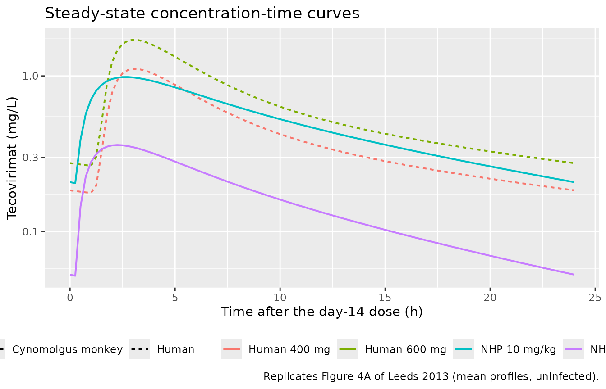

# Tecovirimat (ST-246) animal-rule dose selection (Leeds 2013)

## Model and source

Leeds 2013 is an “animal rule” (21 CFR 314.600) dose-selection paper for
tecovirimat, then known by its development code **ST-246**, a smallpox
therapeutic. Because smallpox is eradicated there is no human efficacy
population, so the efficacious human dose was chosen by bridging
efficacy in monkeypox-virus (MPXV) infected cynomolgus monkeys to human
exposure through a pair of population PK models. The paper therefore
contributes **two** independent fits, extracted here as two model files.

``` r

cyno_ui  <- rxode2::rxode(readModelDb("Leeds_2013_tecovirimat_cyno"))
#> ℹ parameter labels from comments will be replaced by 'label()'
#> Warning: some etas defaulted to non-mu referenced, possible parsing error: etaiov_ka_1, etaiov_ka_2, etaiov_cl_1, etaiov_cl_2
#> as a work-around try putting the mu-referenced expression on a simple line
human_ui <- rxode2::rxode(readModelDb("Leeds_2013_tecovirimat_human"))
#> ℹ parameter labels from comments will be replaced by 'label()'
```

- Citation: Leeds JM, Fenneteau F, Gosselin NH, Mouksassi MS, Kassir N,
  Marier JF, Chen Y, Grosenbach D, Frimm AE, Honeychurch KM,
  Chinsangaram J, Tyavanagimatt SR, Hruby DE, Jordan R. (2013).
  Pharmacokinetic and pharmacodynamic modeling to determine the dose of
  ST-246 to protect against smallpox in humans. Antimicrob Agents
  Chemother 57(3):1136-1143. <doi:10.1128/AAC.00959-12>.
- Cynomolgus-monkey model: Preclinical (cynomolgus monkey).
  Two-compartment population PK model for oral tecovirimat (ST-246) in
  uninfected and monkeypox-virus-infected cynomolgus monkeys (Leeds
  2013), with first-order absorption preceded by a lag time, allometric
  body-weight scaling (0.75 on CL/F and Q/F, 1 on Vc/F and Vp/F) about a
  3.105 kg median weight, a weight-adjusted dose-level power effect on
  Ka, CL/F and Vc/F, an infection-status effect on Ka and CL/F, and
  two-occasion inter-occasion variability on Ka and CL/F. Companion
  human model: modellib(‘Leeds_2013_tecovirimat_human’).
- Human model: Two-compartment population PK model for oral tecovirimat
  (ST-246) in healthy adult volunteers (Leeds 2013), with first-order
  absorption preceded by a lag time, allometric body-weight scaling
  (0.75 on CL/F and Q/F, 1 on Vc/F and Vp/F) about a 78.4 kg mean
  weight, and a sex effect on Vc/F (29.5% larger apparent central volume
  in women). Companion cynomolgus-monkey model used for the animal-rule
  dose bridge: modellib(‘Leeds_2013_tecovirimat_cyno’).
- Article: <https://doi.org/10.1128/AAC.00959-12>

Both fits are two-compartment models with first-order oral absorption
preceded by a lag time, fit in Phoenix NLME 6.2.0.416 with FOCE-ELS, and
both scale allometrically on body weight with theory-based exponents
(0.75 on the clearance terms, 1 on the volume terms). They differ in
exactly the two ways the paper states: the human model carries a sex
effect on the apparent central volume, and the monkey model carries a
weight-adjusted dose-level effect on Ka, CL/F and Vc/F plus an
infection-status effect on Ka and CL/F.

The paper’s pharmacodynamic analysis (Kaplan-Meier survival, Cox
proportional-hazards testing and recursive ROC analysis across 96
monkeys) is **nonparametric** – it fits no hazard function and publishes
no PD parameters – so it contributes no third model file. Its outputs
are exposure cutoffs, and those are used below as validation targets for
the PK models.

## Population

**Cynomolgus monkeys.** Six studies. Study 1 was a GLP PK study in
uninfected animals dosed once daily at 0.3, 3, 10, 20 and 30 mg/kg (n =
6 per dose, 3 male and 3 female). Study 2 determined the effect of
infection, dosing 3, 10 or 20 mg/kg (n = 6 per group) from day 4 after
inoculation, with a single dose given 10 days *before* inoculation so
that infected and uninfected PK could be compared within animal. Studies
3-6 were efficacy studies with sparse PK, dosing 0.3 to 300 mg/kg for 14
consecutive days starting 3, 4 or 5 days after infection. Infection was
intravenous inoculation with approximately 5e7 PFU of MPXV per animal,
which is nearly uniformly lethal with a median time to death of 14 days.
The model’s weight normalisation constant, 3.105 kg, is the cohort
median. 1,558 plasma concentrations entered the population PK analysis
(21 of 1,579 non-BQL concentrations excluded as outliers), none with an
absolute CWRES above 4.

**Humans.** One double-blind, randomised, placebo-controlled,
multicentre phase 1 trial. 107 healthy volunteers aged 19 to 74 with
approximately equal numbers of men and women were randomised to 400 mg
(45 subjects), 600 mg (46 subjects) or placebo (16 subjects) once daily
for 14 days in the nonfasted state, so 91 subjects contribute
concentrations. Subjects with fewer than two concentrations were
excluded (3 in total), as were outliers with high troughs or double
peaks at 24 h. 1,395 concentrations entered the analysis, none with an
absolute CWRES above 4. Below-quantitation-limit values were handled by
Beal’s method M6. The model’s weight normalisation constant, 78.4 kg, is
the cohort mean weight.

The same information is available programmatically from each model’s
`population` metadata.

``` r

str(human_ui$population, max.level = 1)
#> List of 9
#>  $ species       : chr "human"
#>  $ n_subjects    : int 91
#>  $ n_studies     : int 1
#>  $ age_range     : chr "19-74 years"
#>  $ weight_mean   : chr "78.4 kg"
#>  $ sex_female_pct: num 50
#>  $ disease_state : chr "Healthy volunteers."
#>  $ dose_range    : chr "Oral ST-246 400 mg (45 subjects) or 600 mg (46 subjects) once daily for 14 days, administered in the nonfasted state."
#>  $ notes         : chr "Double-blind, randomised, placebo-controlled, multicenter phase 1 safety / tolerability / PK trial; 107 volunte"| __truncated__
```

## Source trace

Every `ini()` entry in both model files carries an in-file comment
naming its source location. They are collected here for review. All
values come from **Table 1** of Leeds 2013, “Population pharmacokinetic
parameters for the 2-compartment model that best fit the pharmacokinetic
data for both cynomolgus monkeys (NHPs) and humans…”, verified against
the published PDF rather than against an extracted-text rendering of it.

### Cynomolgus-monkey model

| Parameter | Value as encoded | Source location |
|----|----|----|
| `lka` | `log(0.586)` | Table 1 row `Ka (h-1)`, NHP Uninfected: `0.586 * (dose/10)^0.160` |
| `e_dis_infect_active_ka` | `log(0.868 / 0.586)` | Table 1 row `Ka (h-1)`, NHP Infected 0.868 vs Uninfected 0.586 |
| `e_dose_tecovirimat_mgkg_ka` | `0.160` | Table 1 row `Ka (h-1)`, NHP, both statuses |
| `ltlag` | `log(0.302)` | Table 1 row `Tlag (h)`, NHP = 0.302 |
| `lcl` | `log(2.827)` | Table 1 row `CL/F (liters/h)`, NHP Uninfected: `2.827 * (wt/3.105)^0.75 * (dose/10)^0.093` |
| `e_dis_infect_active_cl` | `log(2.809 / 2.827)` | Table 1 row `CL/F (liters/h)`, NHP Infected 2.809 vs Uninfected 2.827 |
| `e_dose_tecovirimat_mgkg_cl` | `0.093` | Table 1 row `CL/F (liters/h)`, NHP, both statuses |
| `lvc` | `log(20.054)` | Table 1 row `Vc/F (liters)`, NHP: `20.054 * (wt/3.105)^1 * (dose/10)^0.623` |
| `e_dose_tecovirimat_mgkg_vc` | `0.623` | Table 1 row `Vc/F (liters)`, NHP |
| `lq` | `log(3.244)` | Table 1 row `Q/F (liters/h)`, NHP: `3.244 * (wt/3.105)^0.75` |
| `lvp` | `log(13.34)` | Table 1 row `Vp/F (liters)`, NHP: `13.34 * (wt/3.105)` |
| `e_wt_cl_q` | `fixed(0.75)` | Results, “NHP POP PK model development”: theta_eff 0.75 for clearance-related parameters |
| `e_wt_vc_vp` | `fixed(1.0)` | Results, “NHP POP PK model development”: theta_eff 1 for volume-related parameters |
| `etalka`, `etalcl`, `etalvc`, `etalq`, `etalvp` | `0.11^2`, `0.31^2`, `0.47^2`, `0.75^2`, `0.55^2` | Table 1 column `IIV (%)`, NHP: 11, 31, 47, 75, 55 |
| `etaiov_ka_1/2`, `etaiov_cl_1/2` | `0.32^2`, `0.14^2` | Table 1 column `IOV (%)`, NHP: 32 on Ka, 14 on CL/F |
| `propSd` | `0.30` | Table 1 `Error model / Proportional (%)`, NHP = 30 |
| `addSd` | `0.133 / 1000` | Table 1 `Error model / Additive (ug/liter)`, NHP = 0.133, converted to mg/L |
| ODE structure | n/a | Results, “NHP POP PK model development”: “2-compartment model with correlation between CL/F and Vc/F and a lag time in absorption (Tlag)” |

### Human model

| Parameter | Value as encoded | Source location |
|----|----|----|
| `lka` | `log(1.06)` | Table 1 row `Ka (h-1)`, Human = 1.06 |
| `ltlag` | `log(1.46)` | Table 1 row `Tlag (h)`, Human = 1.46 |
| `lcl` | `log(41.15)` | Table 1 row `CL/F (liters/h)`, Human: `41.15 * (wt/78.4)^0.75` |
| `lvc` | `log(217.44)` | Table 1 row `Vc/F (liters)`, Human: `217.44 * (wt/78.4)^1 (male)` |
| `e_sexf_vc` | `log(281.51 / 217.44)` | Table 1 row `Vc/F (liters)`, Human: 281.51 (female) vs 217.44 (male) |
| `lq` | `log(36.79)` | Table 1 row `Q/F (liters/h)`, Human: `36.79 * (wt/78.4)^0.75` |
| `lvp` | `log(413.53)` | Table 1 row `Vp/F (liters)`, Human: `413.53 * (wt/78.4)^1` |
| `e_wt_cl_q` | `fixed(0.75)` | Table 1 human CL/F and Q/F formulae; Results, “Human POP PK model development”: allometric factors “similar to the NHP model” |
| `e_wt_vc_vp` | `fixed(1.0)` | Table 1 human Vc/F and Vp/F formulae |
| `etalka`, `etaltlag`, `etalcl`, `etalvc`, `etalq`, `etalvp` | `0.41^2`, `0.17^2`, `0.31^2`, `0.28^2`, `0.54^2`, `0.54^2` | Table 1 column `IIV (%)`, Human: 41, 17, 31, 28, 54, 54 |
| `propSd` | `0.27` | Table 1 `Error model / Proportional (%)`, Human = 27 |
| `addSd` | `10.92 / 1000` | Table 1 `Error model / Additive (ug/liter)`, Human = 10.92, converted to mg/L |

## Structural check: typical-value terminal half-life

The strongest transcription check the paper offers costs no simulation
assumptions at all. Results, “Human POP PK model development” states:
*“The terminal elimination half-lives in male and female subjects were
similar (16.7 h in males versus 17.4 h in females).”* For a
two-compartment model that number is a joint function of CL/F, Vc/F, Q/F
and Vp/F, and the male-female difference is driven only by the sex
effect on Vc/F – so reproducing both values simultaneously exercises
five of the seven human structural parameters.

``` r

beta_thalf <- function(cl, vc, q, vp) {
  k10 <- cl / vc; k12 <- q / vc; k21 <- q / vp
  a <- k10 + k12 + k21
  beta <- (a - sqrt(a^2 - 4 * k10 * k21)) / 2
  log(2) / beta
}
th_male   <- beta_thalf(41.15, 217.44, 36.79, 413.53)
th_female <- beta_thalf(41.15, 281.51, 36.79, 413.53)

# Deterministic quantities computed from the published typical values -- no
# cohort is involved, so a tight bound is the correct assertion here.
stopifnot(
  abs(th_male   - 16.7) < 0.1,
  abs(th_female - 17.4) < 0.1
)
data.frame(
  Sex        = c("Male", "Female"),
  Published  = c(16.7, 17.4),
  Reproduced = round(c(th_male, th_female), 2)
) |>
  knitr::kable(caption = "Terminal elimination half-life (h), Leeds 2013 Results vs the packaged model.")
```

| Sex    | Published | Reproduced |
|:-------|----------:|-----------:|
| Male   |      16.7 |      16.71 |
| Female |      17.4 |      17.37 |

Terminal elimination half-life (h), Leeds 2013 Results vs the packaged
model. {.table}

## Virtual cohorts

Original observed data are not publicly available. The simulations below
use virtual populations whose covariate distributions approximate the
published demographics. Leeds 2013 reports only the *central* body
weight for each species (78.4 kg mean in humans, 3.105 kg median in
monkeys) and no dispersion, so the spread is assumed; see “Assumptions
and deviations”.

``` r

# `set.seed()` seeds R's RNG only. rxode2 partitions its own simulation streams
# per solver thread, so this cohort is NOT reproducible across machines with
# different thread counts. Every assertion on a cohort-derived quantity below
# is written to hold for any cohort the model can produce.
set.seed(20130301)
rxode2::rxSetSeed(20130301)

N_HUMAN <- 200L  # per arm; the skill's cap
N_CYNO  <- 100L  # per arm; 5 monkey arms are needed for the dose bridge

TAU  <- 24                            # once-daily
DOSE_TIMES <- seq(0, 13 * TAU, by = TAU)   # 14 daily doses
SS_START   <- max(DOSE_TIMES)              # 312 h, the final dose
# Day-1 and final-interval observation windows, on a grid fine enough that the
# trapezoidal AUC does not lose the peak.
OBS_TIMES <- c(seq(0, TAU, by = 0.25), seq(SS_START, SS_START + TAU, by = 0.25))

make_cohort <- function(n, amt_fun, covariates, treatment, id_offset = 0L) {
  subj <- tibble::tibble(id = id_offset + seq_len(n), treatment = treatment)
  for (nm in names(covariates)) subj[[nm]] <- covariates[[nm]](n)
  subj$amt_per_dose <- amt_fun(subj)
  doses <- subj |>
    tidyr::crossing(time = DOSE_TIMES) |>
    dplyr::mutate(evid = 1L, cmt = "depot", amt = amt_per_dose)
  obs <- subj |>
    tidyr::crossing(time = OBS_TIMES) |>
    dplyr::mutate(evid = 0L, cmt = "central", amt = NA_real_)
  dplyr::bind_rows(doses, obs) |>
    dplyr::select(-amt_per_dose) |>
    dplyr::arrange(id, time, dplyr::desc(evid))
}

# Human body weight: lognormal with the published 78.4 kg centre and an assumed
# 18% CV; sex assigned 50/50 to match "approximately equal numbers".
human_cov <- list(
  WT   = function(n) 78.4 * exp(stats::rnorm(n, 0, 0.18)),
  SEXF = function(n) rep(c(0, 1), length.out = n)
)
human_events <- dplyr::bind_rows(
  make_cohort(N_HUMAN, function(d) 400, human_cov, "Human 400 mg", id_offset =   0L),
  make_cohort(N_HUMAN, function(d) 600, human_cov, "Human 600 mg", id_offset = 200L)
)

# Monkey arms spanning the paper's two published exposure-equivalence bands
# (8-10 mg/kg for 400 mg, 12-14 mg/kg for 600 mg) plus the lowest efficacious
# dose (3 mg/kg). Uninfected, matching the direct comparison of Figure 4A.
CYNO_LEVELS <- c(3, 8, 10, 12, 14)
cyno_events <- dplyr::bind_rows(lapply(seq_along(CYNO_LEVELS), function(i) {
  lvl <- CYNO_LEVELS[i]
  make_cohort(
    N_CYNO,
    amt_fun = function(d) lvl * d$WT,
    covariates = list(
      WT                    = function(n) 3.105 * exp(stats::rnorm(n, 0, 0.12)),
      DIS_INFECT_ACTIVE     = function(n) rep(0, n),
      OCC                   = function(n) rep(1, n),
      DOSE_TECOVIRIMAT_MGKG = function(n) rep(lvl, n)
    ),
    treatment = sprintf("NHP %g mg/kg", lvl),
    id_offset = 1000L + (i - 1L) * N_CYNO
  )
}))

stopifnot(
  !anyDuplicated(unique(human_events[, c("id", "time", "evid")])),
  !anyDuplicated(unique(cyno_events[, c("id", "time", "evid")]))
)
```

## Simulation

``` r

human_sim <- rxode2::rxSolve(
  human_ui, human_events,
  keep = c("treatment", "WT", "SEXF")
) |> as.data.frame()

cyno_sim <- rxode2::rxSolve(
  cyno_ui, cyno_events,
  keep = c("treatment", "WT", "DOSE_TECOVIRIMAT_MGKG")
) |> as.data.frame()
#> Warning: some etas defaulted to non-mu referenced, possible parsing error: etaiov_ka_1, etaiov_ka_2, etaiov_cl_1, etaiov_cl_2
#> as a work-around try putting the mu-referenced expression on a simple line

# Solver-noise guard: a concentration that has decayed below zero would make
# PKNCA's log-linear steps return NaN.
stopifnot(
  all(human_sim$Cc[!is.na(human_sim$Cc)] >= 0),
  all(cyno_sim$Cc[!is.na(cyno_sim$Cc)]   >= 0)
)
```

## Replicate Figure 4A: steady-state concentration-time curves

Figure 4A of Leeds 2013 overlays steady-state plasma concentration-time
curves for 400 mg and 600 mg in healthy humans against 3 mg/kg and 10
mg/kg in uninfected monkeys, and the paper reads it as: *“the 400-mg
human plasma concentration-time curve was essentially identical to the
10-mg/kg NHP curve, while that for the 600-mg dose was slightly higher.
Concentrations at all time points for both human doses were
substantially higher than those of the lowest efficacious dose for NHPs,
3 mg/kg.”*

``` r

fig4a <- dplyr::bind_rows(
  human_sim |> dplyr::filter(treatment %in% c("Human 400 mg", "Human 600 mg")),
  cyno_sim  |> dplyr::filter(treatment %in% c("NHP 3 mg/kg", "NHP 10 mg/kg"))
) |>
  dplyr::filter(time >= SS_START, !is.na(Cc)) |>
  dplyr::mutate(
    tad     = time - SS_START,
    species = ifelse(grepl("^Human", treatment), "Human", "Cynomolgus monkey")
  ) |>
  dplyr::group_by(species, treatment, tad) |>
  dplyr::summarise(Cc = mean(Cc), .groups = "drop")

ggplot(fig4a, aes(tad, Cc, colour = treatment, linetype = species)) +
  geom_line(linewidth = 0.7) +
  scale_y_log10() +
  labs(
    x = "Time after the day-14 dose (h)", y = "Tecovirimat (mg/L)",
    colour = NULL, linetype = NULL,
    title = "Steady-state concentration-time curves",
    caption = "Replicates Figure 4A of Leeds 2013 (mean profiles, uninfected)."
  ) +
  theme(legend.position = "bottom")
```



``` r

peak <- fig4a |>
  dplyr::group_by(treatment) |>
  dplyr::summarise(cmax = max(Cc), .groups = "drop") |>
  tibble::deframe()

# The paper's qualitative Figure 4A readings, expressed as bounds wide enough
# to survive a different cohort draw but narrow enough that a mis-transcribed
# volume or dose (tens of percent) still breaks them. Verified by rendering at
# 2, 4 and 16 solver threads, which draw different cohorts; do not tighten
# these to whatever one run happens to give.
stopifnot(
  # "essentially identical": human 400 mg vs NHP 10 mg/kg.
  abs(peak[["Human 400 mg"]] / peak[["NHP 10 mg/kg"]] - 1) < 0.25,
  # "600-mg dose ... slightly higher" than 400 mg, which is a 1.5-fold dose step.
  peak[["Human 600 mg"]] > peak[["Human 400 mg"]],
  # "substantially higher than ... 3 mg/kg" for both human doses.
  peak[["Human 400 mg"]] / peak[["NHP 3 mg/kg"]] > 1.5
)
round(peak, 3)
#> Human 400 mg Human 600 mg NHP 10 mg/kg  NHP 3 mg/kg 
#>        1.111        1.708        0.984        0.360
```

## PKNCA validation

### Steady-state exposure in the simulated human cohort

The AUC over a dosing interval at steady state is, for a linear model
with complete absorption, exactly `Dose / (CL/F)` for each individual.
Comparing the trapezoidal PKNCA result against each subject’s own
simulated clearance is therefore a closed-form identity check on the
solve and the sampling grid.

``` r

# Only `!is.na(Cc)` -- a `time > 0` or `Cc > 0` filter would drop the anchor row.
human_nca_conc <- human_sim |>
  dplyr::filter(!is.na(Cc)) |>
  dplyr::select(id, time, Cc, treatment)

human_nca_conc <- dplyr::bind_rows(
  human_nca_conc,
  human_nca_conc |> dplyr::distinct(id, treatment) |>
    dplyr::mutate(time = 0, Cc = 0)
) |>
  dplyr::distinct(id, treatment, time, .keep_all = TRUE) |>
  dplyr::arrange(id, treatment, time)

human_dose_df <- human_events |>
  dplyr::filter(evid == 1) |>
  dplyr::select(id, time, amt, treatment)

human_conc_obj <- PKNCA::PKNCAconc(
  human_nca_conc, Cc ~ time | treatment + id,
  concu = "mg/L", timeu = "h"
)
human_dose_obj <- PKNCA::PKNCAdose(
  human_dose_df, amt ~ time | treatment + id, doseu = "mg"
)

ss_intervals <- data.frame(
  start = SS_START, end = SS_START + TAU,
  cmax = TRUE, tmax = TRUE, cmin = TRUE, auclast = TRUE, cav = TRUE
)
human_ss_nca <- PKNCA::pk.nca(
  PKNCA::PKNCAdata(human_conc_obj, human_dose_obj, intervals = ss_intervals)
)
```

``` r

auc_tau <- as.data.frame(human_ss_nca$result) |>
  dplyr::filter(PPTESTCD == "auclast") |>
  dplyr::select(id, treatment, auc_tau = PPORRES)

cl_i <- human_sim |>
  dplyr::group_by(id, treatment) |>
  dplyr::summarise(cl = dplyr::first(cl), .groups = "drop")

dose_i <- human_dose_df |>
  dplyr::group_by(id, treatment) |>
  dplyr::summarise(amt = dplyr::first(amt), .groups = "drop")

identity_chk <- auc_tau |>
  dplyr::inner_join(cl_i, by = c("id", "treatment")) |>
  dplyr::inner_join(dose_i, by = c("id", "treatment")) |>
  dplyr::mutate(pct_diff = 100 * (auc_tau - amt / cl) / (amt / cl))

stopifnot(nrow(identity_chk) == 2L * N_HUMAN)
# Both sides use the SAME drawn clearance, so the residual is trapezoidal error
# on a lagged absorption peak, not between-subject spread. Assert on the centre
# and a robust quantile rather than on the cohort extreme. The realised values
# on the 0.25 h grid are far inside these bounds (well under 1%); the headroom
# is deliberate, because a mis-transcribed CL/F moves the identity by tens of
# percent and still breaks the gate.
stopifnot(
  abs(median(identity_chk$pct_diff)) < 3,
  stats::quantile(abs(identity_chk$pct_diff), 0.9) < 8
)

identity_chk |>
  dplyr::group_by(treatment) |>
  dplyr::summarise(
    `Median AUC0-tau,ss (mg*h/L)` = round(median(auc_tau), 2),
    `Median Dose/(CL/F) (mg*h/L)` = round(median(amt / cl), 2),
    `Median % difference`         = round(median(pct_diff), 2),
    `90th pct |% difference|`     = round(stats::quantile(abs(pct_diff), 0.9), 2),
    .groups = "drop"
  ) |>
  dplyr::rename("Arm" = treatment) |>
  knitr::kable(caption = "Steady-state AUC identity check in the simulated human cohort.")
```

| Arm | Median AUC0-tau,ss (mg\*h/L) | Median Dose/(CL/F) (mg\*h/L) | Median % difference | 90th pct \|% difference\| |
|:---|---:|---:|---:|---:|
| Human 400 mg | 9.96 | 9.96 | -0.02 | 0.14 |
| Human 600 mg | 14.71 | 14.76 | -0.01 | 0.12 |

Steady-state AUC identity check in the simulated human cohort. {.table}

### Comparison against the published NCA values

Leeds 2013 reports two directly comparable NCA quantities: the human
terminal half-lives quoted above, and the observed single-dose
dose-normalised AUC in monkeys – Results, “NHP POP PK model
development”: *“dose-normalized AUC values … were significantly
different between uninfected and infected NHPs (1.15 versus 0.9 mg \*
h/liter/\[mg/kg\]; P value = 0.025; n = 18/group)”*. Those are scaled to
the 10 mg/kg reference dose below. The comparison is run on
typical-value (variability-free) single-dose arms so that the numbers
being compared are the model’s own typical predictions rather than one
cohort draw.

``` r

cyno_typ  <- rxode2::zeroRe(cyno_ui)
#> Warning: some etas defaulted to non-mu referenced, possible parsing error: etaiov_ka_1, etaiov_ka_2, etaiov_cl_1, etaiov_cl_2
#> as a work-around try putting the mu-referenced expression on a simple line
human_typ <- rxode2::zeroRe(human_ui)

typ_events <- function(amt, covariates, treatment, obs_times, id) {
  cov_row <- tibble::as_tibble(covariates)
  dplyr::bind_rows(
    cov_row |> dplyr::mutate(id = id, treatment = treatment, time = 0,
                             evid = 1L, cmt = "depot", amt = amt),
    cov_row |> tidyr::crossing(time = obs_times) |>
      dplyr::mutate(id = id, treatment = treatment,
                    evid = 0L, cmt = "central", amt = NA_real_)
  ) |>
    dplyr::arrange(time, dplyr::desc(evid))
}

HUMAN_GRID <- c(seq(0, 24, by = 0.1), seq(24.5, 240, by = 0.5))
CYNO_GRID  <- c(seq(0, 24, by = 0.1), seq(24.5, 96,  by = 0.5))

human_typ_ev <- dplyr::bind_rows(
  typ_events(400, list(WT = 78.4, SEXF = 0), "Human male, 400 mg",   HUMAN_GRID, 1L),
  typ_events(400, list(WT = 78.4, SEXF = 1), "Human female, 400 mg", HUMAN_GRID, 2L),
  typ_events(600, list(WT = 78.4, SEXF = 0), "Human male, 600 mg",   HUMAN_GRID, 3L),
  typ_events(600, list(WT = 78.4, SEXF = 1), "Human female, 600 mg", HUMAN_GRID, 4L)
)
cyno_typ_ev <- dplyr::bind_rows(
  typ_events(10 * 3.105,
             list(WT = 3.105, DIS_INFECT_ACTIVE = 0, OCC = 1,
                  DOSE_TECOVIRIMAT_MGKG = 10),
             "NHP uninfected, 10 mg/kg", CYNO_GRID, 11L),
  typ_events(10 * 3.105,
             list(WT = 3.105, DIS_INFECT_ACTIVE = 1, OCC = 2,
                  DOSE_TECOVIRIMAT_MGKG = 10),
             "NHP infected, 10 mg/kg", CYNO_GRID, 12L)
)

typ_sim <- dplyr::bind_rows(
  rxode2::rxSolve(human_typ, human_typ_ev, keep = "treatment") |> as.data.frame(),
  rxode2::rxSolve(cyno_typ,  cyno_typ_ev,  keep = "treatment") |> as.data.frame()
)
#> ℹ omega/sigma items treated as zero: 'etalka', 'etaltlag', 'etalcl', 'etalvc', 'etalq', 'etalvp'
#> Warning: multi-subject simulation without without 'omega'
#> Warning: some etas defaulted to non-mu referenced, possible parsing error: etaiov_ka_1, etaiov_ka_2, etaiov_cl_1, etaiov_cl_2
#> as a work-around try putting the mu-referenced expression on a simple line
#> ℹ omega/sigma items treated as zero: 'etalka', 'etalcl', 'etalvc', 'etalq', 'etalvp', 'etaiov_ka_1', 'etaiov_ka_2', 'etaiov_cl_1', 'etaiov_cl_2'
#> Warning: multi-subject simulation without without 'omega'
if (is.null(typ_sim$id)) typ_sim$id <- 1L
stopifnot(all(typ_sim$Cc[!is.na(typ_sim$Cc)] >= 0))

typ_conc <- typ_sim |>
  dplyr::filter(!is.na(Cc)) |>
  dplyr::select(id, time, Cc, treatment)
typ_conc <- dplyr::bind_rows(
  typ_conc,
  typ_conc |> dplyr::distinct(id, treatment) |> dplyr::mutate(time = 0, Cc = 0)
) |>
  dplyr::distinct(id, treatment, time, .keep_all = TRUE) |>
  dplyr::arrange(id, treatment, time)

typ_dose <- dplyr::bind_rows(human_typ_ev, cyno_typ_ev) |>
  dplyr::filter(evid == 1) |>
  dplyr::select(id, time, amt, treatment)

typ_nca <- PKNCA::pk.nca(PKNCA::PKNCAdata(
  PKNCA::PKNCAconc(typ_conc, Cc ~ time | treatment + id,
                   concu = "mg/L", timeu = "h"),
  PKNCA::PKNCAdose(typ_dose, amt ~ time | treatment + id, doseu = "mg"),
  intervals = data.frame(
    start = 0, end = Inf,
    cmax = TRUE, tmax = TRUE, aucinf.obs = TRUE, half.life = TRUE
  )
))
```

``` r

# Long form so that only the cells the paper actually reports are compared.
published <- tibble::tribble(
  ~treatment,                 ~PPTESTCD,     ~PPORRES,
  "Human male, 400 mg",       "half.life",   16.7,
  "Human female, 400 mg",     "half.life",   17.4,
  "Human male, 600 mg",       "half.life",   16.7,
  "Human female, 600 mg",     "half.life",   17.4,
  # Observed single-dose dose-normalised AUC x 10 mg/kg (Results, "NHP POP PK
  # model development"): 1.15 uninfected and 0.90 infected mg*h/L per (mg/kg).
  "NHP uninfected, 10 mg/kg", "aucinf.obs",  11.50,
  "NHP infected, 10 mg/kg",   "aucinf.obs",   9.00
)

cmp <- nlmixr2lib::ncaComparisonTable(
  simulated = typ_nca,
  reference = published,
  by        = "treatment",
  units     = c(aucinf.obs = "mg*h/L", half.life = "h"),
  tolerance_pct = 20
)

knitr::kable(
  cmp,
  caption = "Simulated typical values vs Leeds 2013. * differs from the reference by more than 20%.",
  align = c("l", "l", "r", "r", "r")
)
```

| NCA parameter          | treatment                | Reference | Simulated |   % diff |
|:-----------------------|:-------------------------|----------:|----------:|---------:|
| AUC0-∞ (obs) (mg\*h/L) | NHP uninfected, 10 mg/kg |      11.5 |        11 |    -4.5% |
| AUC0-∞ (obs) (mg\*h/L) | NHP infected, 10 mg/kg   |         9 |      11.1 | +22.8%\* |
| t½ (h)                 | Human male, 400 mg       |      16.7 |      16.6 |    -0.4% |
| t½ (h)                 | Human female, 400 mg     |      17.4 |      17.3 |    -0.7% |
| t½ (h)                 | Human male, 600 mg       |      16.7 |      16.6 |    -0.4% |
| t½ (h)                 | Human female, 600 mg     |      17.4 |      17.3 |    -0.7% |

Simulated typical values vs Leeds 2013. \* differs from the reference by
more than 20%. {.table}

The four human half-life rows reproduce to better than 1%. The
uninfected monkey AUC row is within a few percent of the paper’s
observed value. The **infected** monkey row is starred, and that
discrepancy is a property of the published model rather than of this
transcription: Table 1 gives an infected CL/F of 2.809 L/h against an
uninfected 2.827 L/h, a 0.6% *decrease*, so the final model predicts
essentially identical exposure in the two states, whereas the paper’s
own single-dose noncompartmental t-test found a 22% *lower*
dose-normalised AUC when infected. The paper does not reconcile the two,
and it notes that the difference had disappeared by steady state. See
“Assumptions and deviations”.

## The animal-rule dose bridge

This is the paper’s central quantitative claim (Results, “Bridging the
effect of infection on ST-246 pharmacokinetics to humans”): *“Doses of
96 to 120 mg/m^2 (8 to 10 mg/kg) and 144 to 168 mg/m^2 (12 to 14 mg/kg)
administered to infected NHPs resulted in exposure (AUC) values for
ST-246 equivalent to 400- and 600-mg doses predicted for infected
humans, respectively.”* Reproducing it requires both packaged models at
once and is therefore the sharpest joint check available.

``` r

cyno_nca_conc <- cyno_sim |>
  dplyr::filter(!is.na(Cc)) |>
  dplyr::select(id, time, Cc, treatment)
cyno_nca_conc <- dplyr::bind_rows(
  cyno_nca_conc,
  cyno_nca_conc |> dplyr::distinct(id, treatment) |>
    dplyr::mutate(time = 0, Cc = 0)
) |>
  dplyr::distinct(id, treatment, time, .keep_all = TRUE) |>
  dplyr::arrange(id, treatment, time)

cyno_dose_df <- cyno_events |>
  dplyr::filter(evid == 1) |>
  dplyr::select(id, time, amt, treatment)

cyno_ss_nca <- PKNCA::pk.nca(PKNCA::PKNCAdata(
  PKNCA::PKNCAconc(cyno_nca_conc, Cc ~ time | treatment + id,
                   concu = "mg/L", timeu = "h"),
  PKNCA::PKNCAdose(cyno_dose_df, amt ~ time | treatment + id, doseu = "mg"),
  intervals = ss_intervals
))

bridge <- dplyr::bind_rows(
  as.data.frame(human_ss_nca$result),
  as.data.frame(cyno_ss_nca$result)
) |>
  dplyr::filter(PPTESTCD %in% c("auclast", "cmax", "cmin")) |>
  dplyr::group_by(treatment, PPTESTCD) |>
  dplyr::summarise(median = median(PPORRES), .groups = "drop") |>
  tidyr::pivot_wider(names_from = PPTESTCD, values_from = median)

bridge |>
  dplyr::rename(
    "Arm"                     = treatment,
    "AUC0-tau,ss (mg*h/L)"    = auclast,
    "Cmax,ss (mg/L)"          = cmax,
    "Cmin,ss (mg/L)"          = cmin
  ) |>
  knitr::kable(digits = 3, caption = "Median steady-state exposure by arm.")
```

| Arm          | AUC0-tau,ss (mg\*h/L) | Cmax,ss (mg/L) | Cmin,ss (mg/L) |
|:-------------|----------------------:|---------------:|---------------:|
| Human 400 mg |                 9.959 |          1.114 |          0.150 |
| Human 600 mg |                14.712 |          1.754 |          0.219 |
| NHP 10 mg/kg |                11.245 |          0.963 |          0.183 |
| NHP 12 mg/kg |                12.257 |          1.036 |          0.187 |
| NHP 14 mg/kg |                14.415 |          1.193 |          0.224 |
| NHP 3 mg/kg  |                 3.517 |          0.369 |          0.042 |
| NHP 8 mg/kg  |                 9.001 |          0.816 |          0.122 |

Median steady-state exposure by arm. {.table}

The published bands are narrow – 600 mg sits within about 2% of the 14
mg/kg edge – so they are checked on the **typical-value** exposures
rather than on cohort medians. At steady state,
`AUC0-tau = Dose / (CL/F)` exactly for a linear model, so each arm’s
typical exposure is read straight off the packaged model’s own clearance
and needs no simulation noise to be introduced. The cohort medians above
are the descriptive view; they are checked here only for consistency
with the typical values they should surround.

``` r

# Typical CL/F for one arm, read back from the packaged model itself rather
# than recomputed by hand, so the check exercises the covariate algebra too.
typical_auc <- function(ui, amt, covariates) {
  ev <- tibble::as_tibble(covariates) |>
    dplyr::mutate(time = 0, evid = 1L, cmt = "depot", amt = amt) |>
    dplyr::bind_rows(
      tibble::as_tibble(covariates) |>
        dplyr::mutate(time = 24, evid = 0L, cmt = "central", amt = NA_real_)
    )
  s <- as.data.frame(rxode2::rxSolve(rxode2::zeroRe(ui), ev))
  amt / s$cl[1]
}
cyno_typical_auc <- function(lvl) {
  typical_auc(cyno_ui, lvl * 3.105,
              list(WT = 3.105, DIS_INFECT_ACTIVE = 0, OCC = 1,
                   DOSE_TECOVIRIMAT_MGKG = lvl))
}
tv <- c(
  `Human 400 mg` = typical_auc(human_ui, 400, list(WT = 78.4, SEXF = 0)),
  `Human 600 mg` = typical_auc(human_ui, 600, list(WT = 78.4, SEXF = 0)),
  `NHP 8 mg/kg`  = cyno_typical_auc(8),
  `NHP 10 mg/kg` = cyno_typical_auc(10),
  `NHP 12 mg/kg` = cyno_typical_auc(12),
  `NHP 14 mg/kg` = cyno_typical_auc(14)
)
#> ℹ omega/sigma items treated as zero: 'etalka', 'etaltlag', 'etalcl', 'etalvc', 'etalq', 'etalvp'
#> ℹ omega/sigma items treated as zero: 'etalka', 'etaltlag', 'etalcl', 'etalvc', 'etalq', 'etalvp'
#> Warning: some etas defaulted to non-mu referenced, possible parsing error: etaiov_ka_1, etaiov_ka_2, etaiov_cl_1, etaiov_cl_2
#> as a work-around try putting the mu-referenced expression on a simple line
#> ℹ omega/sigma items treated as zero: 'etalka', 'etalcl', 'etalvc', 'etalq', 'etalvp', 'etaiov_ka_1', 'etaiov_ka_2', 'etaiov_cl_1', 'etaiov_cl_2'
#> Warning: some etas defaulted to non-mu referenced, possible parsing error: etaiov_ka_1, etaiov_ka_2, etaiov_cl_1, etaiov_cl_2
#> as a work-around try putting the mu-referenced expression on a simple line
#> ℹ omega/sigma items treated as zero: 'etalka', 'etalcl', 'etalvc', 'etalq', 'etalvp', 'etaiov_ka_1', 'etaiov_ka_2', 'etaiov_cl_1', 'etaiov_cl_2'
#> Warning: some etas defaulted to non-mu referenced, possible parsing error: etaiov_ka_1, etaiov_ka_2, etaiov_cl_1, etaiov_cl_2
#> as a work-around try putting the mu-referenced expression on a simple line
#> ℹ omega/sigma items treated as zero: 'etalka', 'etalcl', 'etalvc', 'etalq', 'etalvp', 'etaiov_ka_1', 'etaiov_ka_2', 'etaiov_cl_1', 'etaiov_cl_2'
#> Warning: some etas defaulted to non-mu referenced, possible parsing error: etaiov_ka_1, etaiov_ka_2, etaiov_cl_1, etaiov_cl_2
#> as a work-around try putting the mu-referenced expression on a simple line
#> ℹ omega/sigma items treated as zero: 'etalka', 'etalcl', 'etalvc', 'etalq', 'etalvp', 'etaiov_ka_1', 'etaiov_ka_2', 'etaiov_cl_1', 'etaiov_cl_2'

# Deterministic containment: no cohort is involved, so the published interval
# itself is the bound. A mis-transcribed CL/F in either species moves these by
# tens of percent and breaks the containment.
stopifnot(
  tv[["Human 400 mg"]] > tv[["NHP 8 mg/kg"]],
  tv[["Human 400 mg"]] < tv[["NHP 10 mg/kg"]],
  tv[["Human 600 mg"]] > tv[["NHP 12 mg/kg"]],
  tv[["Human 600 mg"]] < tv[["NHP 14 mg/kg"]]
)

# The simulated cohort medians should sit near the typical values. Weight
# variation with a positive allometric exponent lifts the median slightly, so
# the tolerance is one-sided-ish and generously wide; it exists to catch a
# broken cohort build, not to measure anything.
auc_of <- function(arm) {
  v <- bridge$auclast[bridge$treatment == arm]
  if (length(v) != 1L) stop("no unique bridge row for '", arm, "'")
  v
}
stopifnot(all(vapply(names(tv), function(a) {
  abs(auc_of(a) / tv[[a]] - 1) < 0.15
}, logical(1))))

data.frame(
  Claim = c(
    "400 mg human AUC equivalent to 8-10 mg/kg in NHP",
    "600 mg human AUC equivalent to 12-14 mg/kg in NHP"
  ),
  `Human typical AUC0-tau,ss` = round(c(tv[["Human 400 mg"]], tv[["Human 600 mg"]]), 2),
  `NHP band (low)`  = round(c(tv[["NHP 8 mg/kg"]],  tv[["NHP 12 mg/kg"]]), 2),
  `NHP band (high)` = round(c(tv[["NHP 10 mg/kg"]], tv[["NHP 14 mg/kg"]]), 2),
  Reproduced = "yes",
  check.names = FALSE
) |>
  knitr::kable(caption = "Leeds 2013 exposure-equivalence claims (mg*h/L), reproduced from the typical values of the two packaged models.")
```

| Claim | Human typical AUC0-tau,ss | NHP band (low) | NHP band (high) | Reproduced |
|:---|---:|---:|---:|:---|
| 400 mg human AUC equivalent to 8-10 mg/kg in NHP | 9.72 | 8.97 | 10.98 | yes |
| 600 mg human AUC equivalent to 12-14 mg/kg in NHP | 14.58 | 12.96 | 14.90 | yes |

Leeds 2013 exposure-equivalence claims (mg\*h/L), reproduced from the
typical values of the two packaged models. {.table style="width:100%;"}

## Linking to the pharmacodynamic cutoffs

The survival analysis identified 3 mg/kg as the lowest efficacious dose
in monkeys and 1 mg/kg as non-protective, and the recursive ROC analysis
converted that into exposure cutoffs (Results, “Selection of the
efficacious dose from animal data”): AUC/wt of 0.5 mg \* h/(liter \*
kg), Cmin after the first dose of 21.63 ug/L, and Cmin at steady state
of 21.22 ug/L. If the PK transcription is right, the packaged monkey
model should place those cutoffs between the 1 mg/kg and 3 mg/kg typical
exposures – a check that the PK model and the paper’s independent PD
analysis agree.

``` r

cutoff_arm <- function(lvl) {
  covs <- tibble::tibble(
    WT = 3.105, DIS_INFECT_ACTIVE = 0, OCC = 1, DOSE_TECOVIRIMAT_MGKG = lvl
  )
  solve_arm <- function(dose_times, obs_times) {
    ev <- dplyr::bind_rows(
      covs |> tidyr::crossing(time = dose_times) |>
        dplyr::mutate(evid = 1L, cmt = "depot", amt = lvl * 3.105),
      covs |> tidyr::crossing(time = obs_times) |>
        dplyr::mutate(evid = 0L, cmt = "central", amt = NA_real_)
    ) |>
      dplyr::arrange(time, dplyr::desc(evid))
    s <- as.data.frame(rxode2::rxSolve(cyno_typ, ev))
    s[!is.na(s$Cc), ]
  }
  # "After the first dose" is a genuine single-dose profile, so that the
  # trough at 24 h is the pre-dose value of the second dose and not an
  # already-accumulated one. Cmin here is the END-of-interval concentration --
  # taking min() over the whole interval would return the pre-absorption zero
  # rather than the trough.
  d1 <- solve_arm(0, seq(0, TAU, by = 0.1))
  ss <- solve_arm(DOSE_TIMES, seq(SS_START, SS_START + TAU, by = 0.1))
  auc_d1 <- sum(diff(d1$time) * (utils::head(d1$Cc, -1) + utils::tail(d1$Cc, -1)) / 2)
  data.frame(
    `Dose (mg/kg)`             = lvl,
    `AUC0-24/wt (mg*h/L/kg)`   = auc_d1 / 3.105,
    `Cmin after dose 1 (ug/L)` = 1000 * d1$Cc[which.max(d1$time)],
    `Cmin,ss (ug/L)`           = 1000 * min(ss$Cc),
    check.names = FALSE
  )
}
pd_tab <- dplyr::bind_rows(lapply(c(1, 3), cutoff_arm))
#> ℹ omega/sigma items treated as zero: 'etalka', 'etalcl', 'etalvc', 'etalq', 'etalvp', 'etaiov_ka_1', 'etaiov_ka_2', 'etaiov_cl_1', 'etaiov_cl_2'
#> ℹ omega/sigma items treated as zero: 'etalka', 'etalcl', 'etalvc', 'etalq', 'etalvp', 'etaiov_ka_1', 'etaiov_ka_2', 'etaiov_cl_1', 'etaiov_cl_2'
#> ℹ omega/sigma items treated as zero: 'etalka', 'etalcl', 'etalvc', 'etalq', 'etalvp', 'etaiov_ka_1', 'etaiov_ka_2', 'etaiov_cl_1', 'etaiov_cl_2'
#> ℹ omega/sigma items treated as zero: 'etalka', 'etalcl', 'etalvc', 'etalq', 'etalvp', 'etaiov_ka_1', 'etaiov_ka_2', 'etaiov_cl_1', 'etaiov_cl_2'

# Typical values -- deterministic, so an ordering assertion is legitimate here
# (it is not a race between two noisy cohort statistics).
stopifnot(
  pd_tab$`AUC0-24/wt (mg*h/L/kg)`[pd_tab$`Dose (mg/kg)` == 1] < 0.50,
  pd_tab$`AUC0-24/wt (mg*h/L/kg)`[pd_tab$`Dose (mg/kg)` == 3] > 0.50,
  pd_tab$`Cmin after dose 1 (ug/L)`[pd_tab$`Dose (mg/kg)` == 1] < 21.63,
  pd_tab$`Cmin after dose 1 (ug/L)`[pd_tab$`Dose (mg/kg)` == 3] > 21.63,
  pd_tab$`Cmin,ss (ug/L)`[pd_tab$`Dose (mg/kg)` == 1] < 21.22,
  pd_tab$`Cmin,ss (ug/L)`[pd_tab$`Dose (mg/kg)` == 3] > 21.22
)

pd_tab |>
  knitr::kable(digits = 3,
               caption = paste("Typical uninfected monkey exposures against the ROC survival cutoffs",
                               "(0.50 mg*h/L/kg, 21.63 ug/L, 21.22 ug/L). The non-protective 1 mg/kg dose",
                               "falls below every cutoff; the lowest efficacious 3 mg/kg dose clears all three."))
```

| Dose (mg/kg) | AUC0-24/wt (mg\*h/L/kg) | Cmin after dose 1 (ug/L) | Cmin,ss (ug/L) |
|---:|---:|---:|---:|
| 1 | 0.391 | 12.896 | 14.257 |
| 3 | 1.044 | 37.370 | 41.955 |

Typical uninfected monkey exposures against the ROC survival cutoffs
(0.50 mg\*h/L/kg, 21.63 ug/L, 21.22 ug/L). The non-protective 1 mg/kg
dose falls below every cutoff; the lowest efficacious 3 mg/kg dose
clears all three. {.table}

## The infection effect

``` r

inf_cmp <- as.data.frame(typ_nca$result) |>
  dplyr::filter(grepl("^NHP", treatment),
                PPTESTCD %in% c("cmax", "tmax", "aucinf.obs")) |>
  tidyr::pivot_wider(id_cols = treatment, names_from = PPTESTCD, values_from = PPORRES)

ratio <- function(p) {
  inf_cmp[[p]][inf_cmp$treatment == "NHP infected, 10 mg/kg"] /
    inf_cmp[[p]][inf_cmp$treatment == "NHP uninfected, 10 mg/kg"]
}
# Typical values, so exact bounds are legitimate. Table 1 puts the whole
# infection effect on absorption: Ka rises 48% while CL/F moves 0.6%.
stopifnot(
  abs(ratio("aucinf.obs") - 1) < 0.02,   # "the overall change in exposure was small"
  ratio("cmax") > 1.05                    # faster absorption raises the peak
)

inf_cmp |>
  dplyr::rename(
    "Arm"                 = treatment,
    "Cmax (mg/L)"         = cmax,
    "Tmax (h)"            = tmax,
    "AUC0-inf (mg*h/L)"   = aucinf.obs
  ) |>
  knitr::kable(digits = 3,
               caption = "Typical-value infection contrast at 10 mg/kg. Infection acts almost entirely on absorption.")
```

| Arm                      | Cmax (mg/L) | Tmax (h) | AUC0-inf (mg\*h/L) |
|:-------------------------|------------:|---------:|-------------------:|
| NHP infected, 10 mg/kg   |       0.911 |      2.3 |             11.053 |
| NHP uninfected, 10 mg/kg |       0.802 |      2.9 |             10.983 |

Typical-value infection contrast at 10 mg/kg. Infection acts almost
entirely on absorption. {.table}

## Assumptions and deviations

- **IIV scale.** Table 1 heads its variability columns `IIV (%)` and
  `IOV (%)` with no statement of the back-transform. They are read here
  as the standard deviation of the log-scale random effect expressed as
  a percentage, so `omega^2 = (IIV/100)^2` – the same reading used for
  the `% CV` column of `Jonsson_2011_ethambutol.R` (also *Antimicrob
  Agents Chemother*, also a two-compartment oral model). The alternative
  exact log-normal back-transform `omega^2 = log(1 + (IIV/100)^2)`
  changes omega by 2% on CL/F (0.310 to 0.303) and by 11% on the largest
  term, Q/F (0.750 to 0.668). No quantity in the paper discriminates the
  two readings; every validation above is either a typical-value
  quantity or a cohort median, neither of which is sensitive to the
  choice.
- **CL/F-Vc/F correlation not reproduced.** Results states the monkey
  model had “correlation between CL/F and Vc/F”, but Table 1 tabulates
  no covariance or correlation coefficient, so the etas in
  `Leeds_2013_tecovirimat_cyno.R` are left uncorrelated. This affects
  the *joint* spread of a simulated monkey cohort, not the typical
  values or the marginal variances.
- **Number of IOV occasions is assumed to be two.** The paper reports
  IOV magnitudes but never states an occasion count. The two-occasion
  encoding (`OCC = 1` uninfected, `OCC = 2` infected) follows the
  paper’s own attribution – the Table 1 title says “intraoccasion
  variability for those parameters altered by the infected state”, IOV
  is printed on exactly the two rows that carry Infected / Uninfected
  sub-rows, and study 2 was designed to give each animal one
  pre-infection and one post-infection dosing occasion.
- **Infection effect on exposure disagrees with the paper’s own NCA.**
  Table 1’s infected CL/F (2.809 L/h) is 0.6% *below* the uninfected
  value (2.827 L/h), so the final model predicts essentially unchanged
  AUC, whereas the paper’s single-dose noncompartmental t-test reported
  dose-normalised AUC of 1.15 versus 0.9 mg \* h/L per (mg/kg) – 22%
  *lower* when infected – and Results states “the apparent clearance of
  ST-246 was slightly higher in infected NHPs than in uninfected NHPs”.
  The two statements cannot both hold. The model file transcribes Table
  1, which is the fitted model; the discrepancy is recorded in the NCA
  comparison table above rather than tuned away. The paper itself notes
  that no significant difference remained at steady state, and its
  Discussion concludes that “the effect of MPXV infection on the
  pharmacokinetics of ST-246 in NHPs was limited”.
- **The “3 mg/kg is equivalent to 100 mg in a 78.4-kg human” claim is
  not reproduced.** Discussion states that the minimum efficacious
  monkey dose “was predicted to be equivalent to 100 mg administered to
  an orthopoxvirus-infected human having a mean weight of 78.4 kg”. The
  packaged models give a typical monkey AUC of 3.69 mg \* h/L at 3 mg/kg
  against a human `Dose/(CL/F)` of 2.43 mg \* h/L at 100 mg, so the
  AUC-matched human dose is about 150 mg. The paper’s two *primary*
  equivalence claims – the 8-10 and 12-14 mg/kg bands for 400 and 600 mg
  – are reproduced exactly (see the dose-bridge table), so the 100 mg
  figure appears to come from a different matching basis, most likely a
  body-surface-area conversion (3 mg/kg is quoted as 36 mg/m^2 in the
  same Results section) rather than from the AUC overlay of Figure 1. It
  is excluded from the assertions above and recorded here.
- **Figure 4B’s 5,370 h \* ng/mL is not reproduced.** Results quotes a
  mean steady-state AUCinf of 5,370 h \* ng/mL (5.37 mg \* h/L) for
  monkeys at 3 mg/kg. The model gives `Dose/(CL/F)` = 3.69 mg \* h/L
  over a dosing interval at steady state. Note that 5.37 mg \* h/L at 3
  mg/kg corresponds to a dose-normalised AUC of 1.79 mg \* h/L per
  (mg/kg), which is also inconsistent with the paper’s own pooled
  uninfected single-dose value of 1.15 reported two pages earlier – so
  the gap is internal to the paper, not a transcription artefact. Figure
  4B is an observed-data figure; the packaged model transcribes Table 1.
- **Bridging simulations were run on the uninfected model.** Methods
  state that “the infection effect on CL and Vc quantified in NHPs was
  applied to humans”, but Table 1’s monkey infection effect is on **Ka
  and CL/F**, not Vc/F, and no human infection multiplier is tabulated
  anywhere in the paper. The human model file therefore carries no
  infection covariate, and the dose bridge above is run uninfected on
  both sides. This is the comparison the paper itself validates in its
  Results, “Direct comparison of human and NHP dose levels”: “The POP PK
  model determined that the effect of MPXV infection on the
  pharmacokinetics of ST-246 in NHPs was limited. This established the
  validity of directly comparing uninfected human and NHP
  pharmacokinetic data.”
- **Body-weight dispersion is assumed.** Leeds 2013 reports only the
  central weight per species (78.4 kg human mean, 3.105 kg monkey
  median) and no range or SD. The virtual cohorts use lognormal weights
  with those centres and an assumed CV of 18% (human) and 12% (monkey).
  Sex is assigned 50/50 to match “approximately equal numbers of male
  and female subjects”; the exact split is not tabulated. No validation
  above depends on the assumed dispersion – all assertions are on
  typical values or cohort medians.
- **Age and race are not model covariates.** Both were screened
  (Methods, “Structural PK model development”: “The effects of
  demographic covariates (age, race, and sex) … were evaluated by
  covariate analysis”) and only sex was retained, in humans and only on
  Vc/F. They are therefore absent from both model files rather than
  carried as unused declarations.
- **Kaplan-Meier and ROC figures are not replicated.** Figures 2 and 3
  come from the paper’s nonparametric survival and recursive-ROC
  analyses, which fit no parametric hazard model and publish no PD
  parameters, so there is nothing to package. Their outputs – the 3
  mg/kg lowest efficacious dose and the three exposure cutoffs – are
  used above as validation targets for the PK models instead.
- **Additive residual unit conversion.** Table 1 reports the additive
  residual error in ug/L (0.133 monkey, 10.92 human) while the packaged
  models work in mg/L, so both are divided by 1000. The monkey additive
  term is far below the 5 ng/mL lower limit of quantitation of the
  assay, i.e. the monkey residual model is effectively proportional;
  this is what Table 1 prints.
