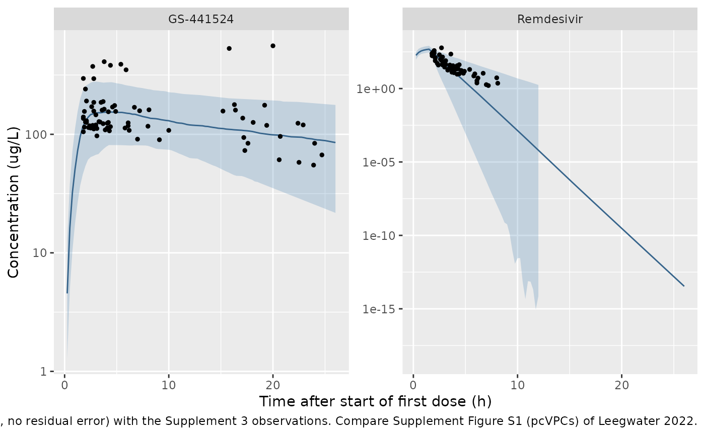
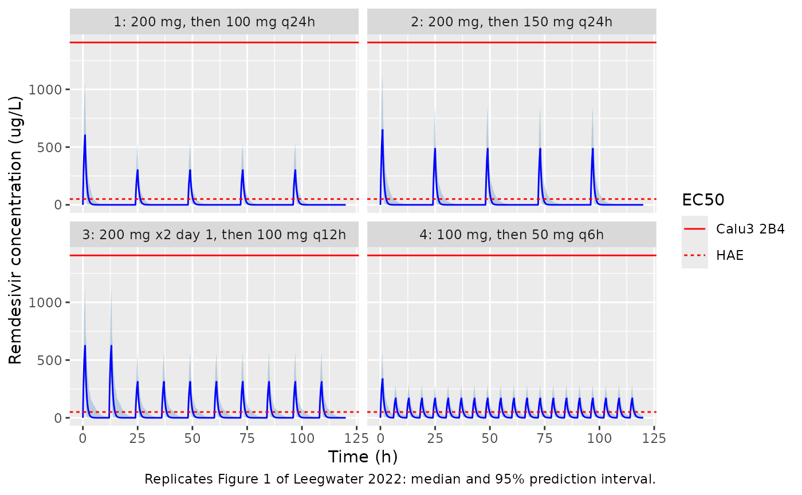
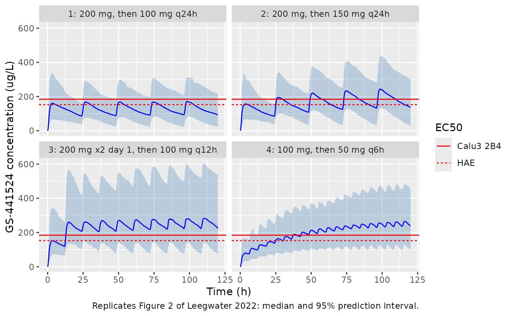
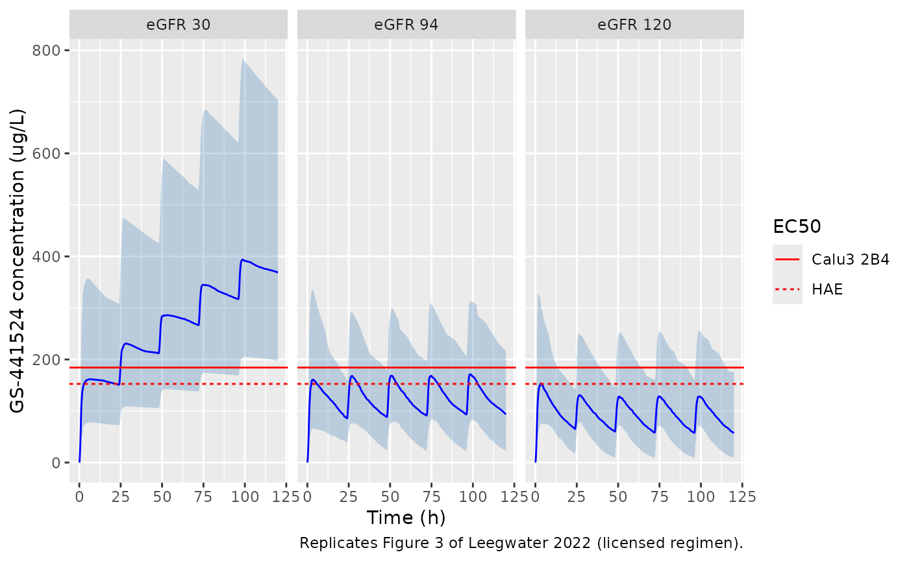

# Remdesivir and GS-441524 (Leegwater 2022)

## Model and source

- Citation: Leegwater E, Moes DJAR, Bosma LBE, Ottens TH, van der Meer
  IM, van Nieuwkoop C, Wilms EB. Population Pharmacokinetics of
  Remdesivir and GS-441524 in Hospitalized COVID-19 Patients. Antimicrob
  Agents Chemother. 2022;66(6):e00254-22. <doi:10.1128/aac.00254-22>.
  Final estimates from Table 2; the compartment structure, the 0.1 x
  metabolic-clearance renal arm, the eGFR power term, the OMEGA
  variances and the additive residual-error form from the NONMEM control
  stream in Supplement 2 (‘FINAL model RDV+ GS-441524’, ADVAN5 TRANS1).
- Description: Integrated parent-metabolite population PK model for
  intravenous remdesivir and its circulating nucleoside metabolite
  GS-441524 in non-critically ill hospitalized adults with COVID-19 and
  hypoxemia (Leegwater 2022). One compartment for each analyte, coupled
  in series (NONMEM ADVAN5). The estimated remdesivir clearance is the
  metabolic arm that forms GS-441524; renal excretion of unchanged
  remdesivir is fixed at 10% of that metabolic clearance, so total
  remdesivir clearance is 1.1 times the metabolic clearance and the two
  arms share one random effect. BSA-normalized eGFR (CKD-EPI) enters
  GS-441524 clearance as a power function referenced to 94 mL/min/1.73
  m^2. The parent-to-metabolite transfer is mass for mass with no
  molecular-weight correction, as in the source control stream, so the
  GS-441524 volume and clearance are apparent values that absorb the
  molar-mass ratio and any unformed fraction. Residual error is additive
  on the linear concentration scale for each analyte.
- Article: <https://doi.org/10.1128/aac.00254-22> (open access,
  PMC9211420)
- Supplement (goodness-of-fit plots, pcVPCs, the final NONMEM control
  stream and the individual concentrations): available from the article
  page.

Leegwater et al. sampled 17 hospitalized COVID-19 patients six times on
the first day of remdesivir therapy and fitted an integrated
parent-metabolite model to remdesivir and GS-441524 plasma
concentrations. They then used Monte Carlo simulation to compare four
dosing regimens and three renal-function levels by the probability of
reaching the in vitro EC50 of each analyte.

## Population

Seventeen adults (one woman, 5.9%) hospitalized on the general ward of
the Haga Teaching Hospital, The Hague, between January and July 2021
with RT-PCR-confirmed COVID-19 and a need for supplemental oxygen; all
scored 5 on the WHO ordinal scale and all received dexamethasone (Table
1). Median age was 55 years (range 31-74), median body weight 92 kg
(65-122), median BMI 30.9 kg/m^2 and median CKD-EPI eGFR 94 mL/min/1.73
m^2 (8-119). Thirty-five percent had diabetes mellitus and 29%
cardiovascular disease. Patients received the licensed regimen: 200 mg
intravenously on day 1 followed by 100 mg daily, each infused over 1 to
2 h. Six samples were scheduled 0.5, 1.5, 2.5, 6, 12 and 23 h after the
end of the first infusion; 84 samples were obtained.

The same information is available programmatically via
`readModelDb("Leegwater_2022_remdesivir")()$population`.

## Source trace

The per-parameter origin is recorded as an in-file comment next to each
`ini()` entry in
`inst/modeldb/specificDrugs/Leegwater_2022_remdesivir.R`. The table
below collects them. “S2” is the NONMEM control stream printed in
Supplement 2.

| Equation / parameter | Value | Source location |
|----|----|----|
| `lcl_met` (remdesivir metabolic CL) | log(207) L/h | Table 2 ‘Metabolic CL’; S2 `$THETA(1)`, `CLtoM = TVCL*EXP(ETA(1))` |
| `lvc` (remdesivir V) | log(157) L | Table 2; S2 `$THETA(2)` |
| `clrat_gs441524` (metabolic / renal CL) | 10, fixed | S2 `CL = 0.1 * CLtoM`; Table 2 ‘Renal CL 20.7 fixed’ |
| `lcl_gs441524` (GS-441524 CL at eGFR 94) | log(27.6) L/h | Table 2; S2 `$THETA(3)` |
| `lvc_gs441524` (GS-441524 V) | log(1060) L | Table 2; S2 `$THETA(4)` |
| `e_crcl_cl_gs441524` | 1.76 | Table 2 ‘eGFR on CL’; S2 `$THETA(7)`, `(GFR/94)**THETA(7)` |
| `etalcl_met` | 0.151 | S2 `$OMEGA(1)`; Table 2 38.9% = sqrt(0.151) |
| `etalvc` | 0.229 | S2 `$OMEGA(2)`; Table 2 47.9% = sqrt(0.229) |
| `etalcl_gs441524` | 0.225 | S2 `$OMEGA(3)`; Table 2 47.4% = sqrt(0.225) |
| `etalvc_gs441524` | 0.184 | S2 `$OMEGA(4)`; Table 2 42.9% = sqrt(0.184) |
| `addSd` (remdesivir) | 0.0294 mg/L | Table 2; S2 `$THETA(5)`, `Y = IPRED + W*EPS(1)`, `$SIGMA 1 FIX` |
| `addSd_gs441524` | 0.0140 mg/L | Table 2; S2 `$THETA(6)` |
| `d/dt(central)`, `d/dt(central_gs441524)` | n/a | S2 `$SUBROUTINES ADVAN5 TRANS1`, `K10 = CL/V1`, `K12 = CLtoM/V1`, `K20 = CLm/V2` |
| `Cc`, `Cc_gs441524` | n/a | S2 `$ERROR`, `IPRED = A(1)/V1` and `A(2)/V2` |

## Structural checks against the reported half-lives

The paper reports an average elimination half-life of about 0.48 h for
remdesivir and 26.6 h for GS-441524 (Results, ‘Pharmacokinetics’). With
the renal arm at one tenth of the metabolic arm, total remdesivir
clearance is 1.1 x 207 = 227.7 L/h; the closed-form half-lives from the
typical values reproduce both numbers, which confirms that the 10% renal
arm is added to, not carved out of, the 207 L/h.

``` r

mod <- readModelDb("Leegwater_2022_remdesivir")
ini_val <- function(name) {
  df <- rxode2::rxode(mod)$iniDf
  df$est[df$name == name]
}
cl_met <- exp(ini_val("lcl_met"))
#> ℹ parameter labels from comments will be replaced by 'label()'
cl_tot <- cl_met * (1 + 1 / ini_val("clrat_gs441524"))
#> ℹ parameter labels from comments will be replaced by 'label()'
t12_rdv <- log(2) * exp(ini_val("lvc")) / cl_tot
#> ℹ parameter labels from comments will be replaced by 'label()'
t12_gs <- log(2) * exp(ini_val("lvc_gs441524")) / exp(ini_val("lcl_gs441524"))
#> ℹ parameter labels from comments will be replaced by 'label()'
#> ℹ parameter labels from comments will be replaced by 'label()'
tibble(
  Quantity = c("Remdesivir renal CL (L/h)", "Remdesivir total CL (L/h)",
               "Remdesivir t1/2 (h)", "GS-441524 t1/2 (h)"),
  Model = signif(c(cl_met / ini_val("clrat_gs441524"), cl_tot, t12_rdv, t12_gs), 4),
  Paper = c(20.7, NA, 0.48, 26.6)
) |>
  knitr::kable(caption = "Typical-value clearance and half-lives.")
#> ℹ parameter labels from comments will be replaced by 'label()'
```

| Quantity                  |    Model | Paper |
|:--------------------------|---------:|------:|
| Remdesivir renal CL (L/h) |  20.7000 | 20.70 |
| Remdesivir total CL (L/h) | 227.7000 |    NA |
| Remdesivir t1/2 (h)       |   0.4779 |  0.48 |
| GS-441524 t1/2 (h)        |  26.6200 | 26.60 |

Typical-value clearance and half-lives. {.table}

``` r


# Deterministic: these are closed-form functions of the ini() values.
stopifnot(
  abs(cl_met / ini_val("clrat_gs441524") - 20.7) < 1e-9,
  abs(t12_rdv - 0.48) < 0.005,
  abs(t12_gs - 26.6) < 0.05
)
#> ℹ parameter labels from comments will be replaced by 'label()'
```

## Typical first-dose profile

The paper reports that GS-441524 reached its maximum 3.7 h after the
start of treatment, averaging 173 ug/L during the first 24 h (Results,
‘Pharmacokinetics’). Infusion length in the study was 1 to 2 h and is
not stated for the simulations, so the typical-value profile is solved
for 1, 1.5 and 2 h infusions. The reported 3.7 h sits inside the bracket
the three durations span.

``` r

make_events <- function(id, dose_times, doses, dur, crcl, obs_times) {
  dosing <- data.frame(
    id = id, time = dose_times, amt = doses, dur = dur, evid = 1L,
    cmt = "central", dvid = NA_integer_
  )
  obs <- data.frame(
    id = id, time = obs_times, amt = 0, dur = 0, evid = 0L,
    cmt = "central", dvid = 1L
  )
  dplyr::bind_rows(dosing, obs) |>
    dplyr::mutate(CRCL = crcl) |>
    dplyr::arrange(id, time, dplyr::desc(evid))
}

typ <- lapply(c(1, 1.5, 2), function(d) {
  ev <- make_events(1L, 0, 200, d, 94, seq(0, 24, by = 0.01))
  s <- as.data.frame(rxode2::rxSolve(mod, ev, omega = NA, sigma = NA))
  tibble(
    infusion_h = d,
    rdv_cmax_ugL = 1000 * max(s$Cc),
    gs_cmax_ugL = 1000 * max(s$Cc_gs441524),
    gs_tmax_h = s$time[which.max(s$Cc_gs441524)]
  )
}) |>
  dplyr::bind_rows()
#> ℹ parameter labels from comments will be replaced by 'label()'

typ |>
  dplyr::rename(
    "Infusion (h)" = infusion_h,
    "Remdesivir Cmax (ug/L)" = rdv_cmax_ugL,
    "GS-441524 Cmax (ug/L)" = gs_cmax_ugL,
    "GS-441524 Tmax (h)" = gs_tmax_h
  ) |>
  knitr::kable(digits = 2, caption = "Typical patient (eGFR 94), 200 mg first dose.")
```

| Infusion (h) | Remdesivir Cmax (ug/L) | GS-441524 Cmax (ug/L) | GS-441524 Tmax (h) |
|---:|---:|---:|---:|
| 1.0 | 672.38 | 159.13 | 3.38 |
| 1.5 | 519.07 | 158.83 | 3.71 |
| 2.0 | 415.02 | 158.44 | 4.05 |

Typical patient (eGFR 94), 200 mg first dose. {.table}

``` r


# Deterministic: the reported Tmax lies between the 1-h and 2-h solutions.
stopifnot(min(typ$gs_tmax_h) < 3.7, max(typ$gs_tmax_h) > 3.7)
```

## Virtual cohort and first-day VPC against the published concentrations

Supplement 3 lists every measured concentration (time after the start of
the first dose, mg/L; ‘BLD’ = below the limit of detection). The VPC
below simulates 200 virtual patients receiving 200 mg over 1.5 h, with
eGFR sampled from the cohort’s median and range (log-normal around 94
mL/min/1.73 m^2, truncated to 8-119), and overlays the observations.

``` r

obs_txt <- "
id time rdv gs
1 2.0 0.387 0.241
1 2.8 0.141 0.295
1 4.4 0.042 0.382
1 5.4 0.02 0.39
1 15.8 NA 0.53
1 20.0 NA 0.558
2 1.8 0.249 0.136
3 3.1 0.045 0.097
3 7.0 0.00185 0.091
3 9.1 NA 0.090
3 23.9 NA 0.055
4 1.8 0.246 0.105
4 2.8 0.05 0.111
4 4.1 0.021 0.124
4 8.0 0.0054 0.117
4 10.0 NA 0.108
4 24.7 NA 0.067
5 2.4 0.04 0.118
5 3.7 0.013 0.123
5 6.1 0.0034 0.125
5 20.7 NA 0.096
5 24.0 NA 0.084
6 2.3 0.052 0.114
6 3.3 0.018 0.128
6 4.2 0.0095 0.126
6 6.1 0.0024 0.118
6 17.2 NA 0.094
7 2.1 0.078 0.13
7 3.4 0.022 0.127
7 4.4 0.01 0.116
7 6.2 0.0052 0.108
7 17.3 NA 0.073
7 20.6 NA 0.061
8 1.8 0.171 0.14
8 2.8 0.044 0.157
8 3.8 0.023 0.163
8 4.8 0.011 0.175
8 15.2 NA 0.157
8 19.4 NA 0.119
9 2.0 0.261 0.127
9 3.0 0.069 0.115
9 4.3 0.022 0.107
10 2.1 0.118 0.126
10 3.0 0.029 0.12
10 3.9 0.012 0.109
11 2.1 0.128 0.191
11 2.8 0.041 0.186
11 3.7 0.023 0.189
11 7.2 0.0016 0.158
11 16.4 NA 0.16
11 22.9 NA 0.12
12 1.9 0.227 0.156
12 2.6 0.098 0.171
12 3.5 0.04 0.186
12 6.7 0.011 0.169
12 16.3 NA 0.178
12 22.4 NA 0.124
13 2.7 0.595 0.119
13 3.6 0.224 0.16
13 4.6 0.017 0.17
13 8.1 0.0023 0.161
13 17.1 NA 0.137
15 1.9 0.303 0.115
15 3.0 0.06 0.146
15 4.2 0.036 0.155
15 4.9 0.015 0.156
15 18.1 NA 0.126
16 1.8 0.224 0.296
16 2.7 0.084 0.374
16 3.8 0.036 0.41
16 5.9 0.01 0.35
16 19.2 NA 0.176
17 2.5 0.199 0.113
17 3.1 0.079 0.112
17 4.1 0.022 0.113
17 5.8 0.0072 0.113
17 17.6 NA 0.084
17 22.5 NA 0.058
"
observed <- read.table(text = obs_txt, header = TRUE) |>
  tidyr::pivot_longer(c(rdv, gs), names_to = "analyte", values_to = "conc") |>
  dplyr::mutate(
    analyte = dplyr::recode(analyte, rdv = "Remdesivir", gs = "GS-441524"),
    conc_ugL = 1000 * conc
  )
# Supplement 3 lists 78 sampling times from 16 patients (no rows for
# patient 14), although the Results report 84 samples.
stopifnot(nrow(observed) == 2 * 78)
```

``` r

rxode2::rxSetSeed(20220601)
set.seed(20220601)
n_vpc <- 200L
crcl_vpc <- pmin(pmax(exp(rnorm(n_vpc, log(94), 0.35)), 8), 119)
ev_vpc <- dplyr::bind_rows(lapply(seq_len(n_vpc), function(i) {
  make_events(i, 0, 200, 1.5, crcl_vpc[i], c(0, seq(0.25, 26, by = 0.25)))
}))
sim_vpc <- as.data.frame(rxode2::rxSolve(mod, ev_vpc))

vpc <- sim_vpc |>
  dplyr::select(id, time, Cc, Cc_gs441524) |>
  tidyr::pivot_longer(c(Cc, Cc_gs441524), names_to = "analyte", values_to = "conc") |>
  dplyr::mutate(analyte = ifelse(analyte == "Cc", "Remdesivir", "GS-441524")) |>
  dplyr::filter(time > 0) |>
  dplyr::group_by(analyte, time) |>
  dplyr::summarise(
    lo = 1000 * quantile(conc, 0.05),
    med = 1000 * median(conc),
    hi = 1000 * quantile(conc, 0.95),
    .groups = "drop"
  )

ggplot(vpc, aes(time, med)) +
  geom_ribbon(aes(ymin = lo, ymax = hi), fill = "steelblue", alpha = 0.25) +
  geom_line(colour = "steelblue4") +
  geom_point(
    data = dplyr::filter(observed, !is.na(conc_ugL)),
    aes(time, conc_ugL), inherit.aes = FALSE, size = 1
  ) +
  facet_wrap(~analyte, scales = "free_y") +
  scale_y_log10() +
  labs(
    x = "Time after start of first dose (h)", y = "Concentration (ug/L)",
    caption = paste(
      "Simulated median and 90% interval (individual predictions, no",
      "residual error) with the Supplement 3 observations. Compare",
      "Supplement Figure S1 (pcVPCs) of Leegwater 2022."
    )
  )
#> Warning in transformation$transform(x): NaNs produced
#> Warning in scale_y_log10(): log-10 transformation introduced infinite values.
#> Warning: Removed 51 rows containing missing values or values outside the scale range
#> (`geom_ribbon()`).
```



``` r

# The observed GS-441524 concentrations should sit mostly inside the
# simulated 90% interval at their sampling times. A mis-specified clearance,
# volume or unit moves the band by tens of percent and fails this; the bound
# is wide because there are only 78 GS-441524 observations from 16 patients.
gs_band <- vpc |> dplyr::filter(analyte == "GS-441524")
gs_obs <- observed |>
  dplyr::filter(analyte == "GS-441524") |>
  dplyr::mutate(
    lo = approx(gs_band$time, gs_band$lo, time)$y,
    hi = approx(gs_band$time, gs_band$hi, time)$y,
    inside = conc_ugL >= lo & conc_ugL <= hi
  )
frac_inside <- mean(gs_obs$inside)
frac_inside
#> [1] 0.8846154
stopifnot(frac_inside > 0.7)
```

## PKNCA: first dose of 200 mg

Non-compartmental analysis of a single 200-mg dose (1.5-h infusion) for
each analyte, observed for 168 h so that the GS-441524 terminal phase is
captured. The published values are the half-lives (0.48 h and 26.6 h),
the GS-441524 Tmax (3.7 h) and the first-24-h average GS-441524 maximum
(173 ug/L).

``` r

rxode2::rxSetSeed(1)
set.seed(1)
n_nca <- 200L
nca_times <- c(0, seq(0.1, 4, by = 0.1), seq(4.25, 12, by = 0.25), seq(13, 168, by = 1))
ev_nca <- dplyr::bind_rows(lapply(seq_len(n_nca), function(i) {
  make_events(i, 0, 200, 1.5, 94, nca_times)
}))
sim_nca <- as.data.frame(rxode2::rxSolve(mod, ev_nca))

conc_long <- sim_nca |>
  dplyr::select(id, time, Cc, Cc_gs441524) |>
  tidyr::pivot_longer(c(Cc, Cc_gs441524), names_to = "treatment", values_to = "Cc") |>
  dplyr::mutate(treatment = ifelse(treatment == "Cc", "Remdesivir", "GS-441524")) |>
  dplyr::filter(!is.na(Cc))

# Integrator noise: remdesivir decays by ~e^-200 over 168 h, so its tail is
# numerically zero. Assert any undershoot is noise, floor it, and drop the
# numerically-zero tail after the peak so the half-life fit does not follow it.
stopifnot(all(conc_long$Cc >= -1e-6 * max(conc_long$Cc)))
conc_long <- conc_long |>
  dplyr::mutate(Cc = pmax(Cc, 0)) |>
  dplyr::group_by(treatment, id) |>
  dplyr::filter(time <= time[which.max(Cc)] | Cc >= 1e-6 * max(Cc)) |>
  dplyr::ungroup()

conc_long <- dplyr::bind_rows(
  conc_long,
  conc_long |> dplyr::distinct(treatment, id) |> dplyr::mutate(time = 0, Cc = 0)
) |>
  dplyr::distinct(treatment, id, time, .keep_all = TRUE) |>
  dplyr::arrange(treatment, id, time)

dose_df <- ev_nca |>
  dplyr::filter(evid == 1) |>
  dplyr::select(id, time, amt, dur) |>
  tidyr::crossing(treatment = c("Remdesivir", "GS-441524"))

conc_obj <- PKNCA::PKNCAconc(conc_long, Cc ~ time | treatment + id)
dose_obj <- PKNCA::PKNCAdose(dose_df, amt ~ time | treatment + id,
                             route = "intravascular", duration = "dur")
intervals <- data.frame(
  start = 0, end = Inf,
  cmax = TRUE, tmax = TRUE, half.life = TRUE, aucinf.obs = TRUE
)
nca_res <- PKNCA::pk.nca(PKNCA::PKNCAdata(conc_obj, dose_obj, intervals = intervals))
```

``` r

published <- tibble::tribble(
  ~treatment,   ~cmax, ~tmax, ~half.life,
  "Remdesivir", NA,    NA,    0.48,
  "GS-441524",  0.173, 3.7,   26.6
)
cmp <- nlmixr2lib::ncaComparisonTable(
  simulated = nca_res,
  reference = published,
  by = "treatment",
  units = c(cmax = "mg/L", tmax = "h", half.life = "h"),
  tolerance_pct = 20
)
knitr::kable(cmp, caption = "Simulated (median) vs. published NCA. * differs from reference by >20%.")
```

| NCA parameter | treatment  | Reference | Simulated | % diff |
|:--------------|:-----------|:----------|:----------|:-------|
| Cmax (mg/L)   | Remdesivir | —         | 0.482     | —      |
| Cmax (mg/L)   | GS-441524  | 0.173     | 0.156     | -9.9%  |
| Tmax (h)      | Remdesivir | —         | 1.5       | —      |
| Tmax (h)      | GS-441524  | 3.7       | 3.95      | +6.8%  |
| t½ (h)        | Remdesivir | 0.48      | 0.547     | +14.0% |
| t½ (h)        | GS-441524  | 26.6      | 27.7      | +4.2%  |

Simulated (median) vs. published NCA. \* differs from reference by
\>20%. {.table}

The paper’s 173 ug/L is described as the *average* first-day GS-441524
maximum; the table above pools by median. The mean of the simulated
individual maxima is checked directly below. With 42.9% IIV on the
GS-441524 volume, the mean of the maxima exceeds their median by about
exp(0.184 / 2) - 1 = 10%, which is the gap between the two.

``` r

nca_df <- as.data.frame(nca_res)
pp <- function(trt, param) {
  v <- nca_df$PPORRES[nca_df$treatment == trt & nca_df$PPTESTCD == param]
  stopifnot(length(v) == n_nca)
  v
}
gs_cmax_24 <- sim_nca |>
  dplyr::filter(time <= 24) |>
  dplyr::group_by(id) |>
  dplyr::summarise(cmax = max(Cc_gs441524), .groups = "drop")
c(
  mean_gs_cmax_ugL = 1000 * mean(gs_cmax_24$cmax),
  median_rdv_t12 = median(pp("Remdesivir", "half.life")),
  median_gs_t12 = median(pp("GS-441524", "half.life"))
)
#> mean_gs_cmax_ugL   median_rdv_t12    median_gs_t12 
#>       170.689855         0.547079        27.714117
# Instrument check: PKNCA's terminal half-life against each subject's own
# log(2) / k from the same drawn parameters. Same draw on both sides, so the
# difference is numerical only and a tight bound is correct.
true_t12 <- sim_nca |>
  dplyr::group_by(id) |>
  dplyr::summarise(
    rdv = log(2) / (kel[1] + kform[1]),
    gs = log(2) / kel_gs441524[1],
    .groups = "drop"
  )
stopifnot(
  max(abs(pp("Remdesivir", "half.life") / true_t12$rdv - 1)) < 0.01,
  max(abs(pp("GS-441524", "half.life") / true_t12$gs - 1)) < 0.01
)

# Centre-of-distribution checks against the paper. MC standard error of the
# mean Cmax with n = 200 and ~45% CV is about 3%, so 12% leaves >3 SE while a
# mis-transcribed volume or dose still fails it. The median individual
# half-life has a combined eta SD of ~0.62 on the log scale for both
# analytes, so its n = 200 standard error is ~6%; one 16-thread draw landed
# 14% above 0.48 h (2.5 SE), so the bound is 25% (> 3 SE). The typical-value
# half-lives are already pinned tightly in the structural-check chunk.
stopifnot(
  abs(1000 * mean(gs_cmax_24$cmax) / 173 - 1) < 0.12,
  abs(median(pp("Remdesivir", "half.life")) / 0.48 - 1) < 0.25,
  abs(median(pp("GS-441524", "half.life")) / 26.6 - 1) < 0.25
)
```

A gap of 10-15% in a half-life row of the table reflects which 200
subjects were drawn, not the model: the PKNCA estimate matches each
subject’s own `log(2) / k`, and the typical-value half-lives (0.478 h
and 26.6 h) match the paper.

## Monte Carlo dosing simulations (Figures 1-3)

The paper simulated four 5-day regimens in a typical patient with eGFR
94 mL/min/1.73 m^2 (Methods, ‘Probability of target attainment’):

1.  200 mg on day 1, then 100 mg once daily (licensed regimen);
2.  200 mg on day 1, then 150 mg once daily for 4 days;
3.  200 mg twice on day 1, then 100 mg every 12 h, 5 days in total;
4.  100 mg loading dose, then 50 mg every 6 h, 5 days in total.

and the licensed regimen at eGFR 30, 94 and 120 mL/min/1.73 m^2. The
target was reaching the protein-binding-corrected in vitro EC50 at any
time during therapy: 1,406 ug/L (Calu3 2B4 cells) and 50.2 ug/L (human
airway epithelial cells) for remdesivir; 184.3 ug/L and 152.6 ug/L,
respectively, for GS-441524. The paper used 1,000 virtual patients per
scenario; this vignette uses 200 per scenario and a 1-h infusion.

``` r

regimens <- list(
  "1: 200 mg, then 100 mg q24h" = list(t = c(0, 24, 48, 72, 96), a = c(200, rep(100, 4))),
  "2: 200 mg, then 150 mg q24h" = list(t = c(0, 24, 48, 72, 96), a = c(200, rep(150, 4))),
  "3: 200 mg x2 day 1, then 100 mg q12h" = list(t = c(0, 12, seq(24, 108, by = 12)), a = c(200, 200, rep(100, 8))),
  "4: 100 mg, then 50 mg q6h" = list(t = seq(0, 114, by = 6), a = c(100, rep(50, 19)))
)
scenarios <- dplyr::bind_rows(
  tibble(scenario = names(regimens), regimen = names(regimens), crcl = 94),
  tibble(scenario = paste0("eGFR ", c(30, 120)), regimen = names(regimens)[1], crcl = c(30, 120))
)
n_mc <- 200L
mc_times <- seq(0, 120, by = 0.1)
ev_mc <- dplyr::bind_rows(lapply(seq_len(nrow(scenarios)), function(k) {
  r <- regimens[[scenarios$regimen[k]]]
  dplyr::bind_rows(lapply(seq_len(n_mc), function(i) {
    make_events((k - 1L) * n_mc + i, r$t, r$a, 1, scenarios$crcl[k], mc_times)
  })) |>
    dplyr::mutate(scenario = scenarios$scenario[k])
}))
stopifnot(!anyDuplicated(unique(ev_mc[, c("id", "time", "evid")])))

rxode2::rxSetSeed(2022)
sim_mc <- as.data.frame(rxode2::rxSolve(mod, ev_mc, keep = "scenario"))
```

``` r

ec50 <- tibble::tribble(
  ~analyte,     ~ec50_ugL, ~cell,
  "Remdesivir", 1406,      "Calu3 2B4",
  "Remdesivir", 50.2,      "HAE",
  "GS-441524",  184.3,     "Calu3 2B4",
  "GS-441524",  152.6,     "HAE"
)
band <- sim_mc |>
  dplyr::filter(scenario %in% names(regimens)) |>
  dplyr::select(scenario, id, time, Cc, Cc_gs441524) |>
  tidyr::pivot_longer(c(Cc, Cc_gs441524), names_to = "analyte", values_to = "conc") |>
  dplyr::mutate(analyte = ifelse(analyte == "Cc", "Remdesivir", "GS-441524")) |>
  dplyr::group_by(scenario, analyte, time) |>
  dplyr::summarise(
    lo = 1000 * quantile(conc, 0.025),
    med = 1000 * median(conc),
    hi = 1000 * quantile(conc, 0.975),
    .groups = "drop"
  )

for (a in c("Remdesivir", "GS-441524")) {
  p <- ggplot(dplyr::filter(band, analyte == a), aes(time, med)) +
    geom_ribbon(aes(ymin = lo, ymax = hi), fill = "steelblue", alpha = 0.3) +
    geom_line(colour = "blue") +
    geom_hline(
      data = dplyr::filter(ec50, analyte == a),
      aes(yintercept = ec50_ugL, linetype = cell), colour = "red"
    ) +
    facet_wrap(~scenario) +
    labs(
      x = "Time (h)", y = paste(a, "concentration (ug/L)"), linetype = "EC50",
      caption = sprintf(
        "Replicates Figure %d of Leegwater 2022: median and 95%% prediction interval.",
        ifelse(a == "Remdesivir", 1, 2)
      )
    )
  print(p)
}
```



``` r

sim_mc |>
  dplyr::filter(scenario %in% c("eGFR 30", names(regimens)[1], "eGFR 120")) |>
  dplyr::mutate(
    egfr = factor(
      ifelse(scenario == names(regimens)[1], "eGFR 94", scenario),
      levels = c("eGFR 30", "eGFR 94", "eGFR 120")
    )
  ) |>
  dplyr::group_by(egfr, time) |>
  dplyr::summarise(
    lo = 1000 * quantile(Cc_gs441524, 0.025),
    med = 1000 * median(Cc_gs441524),
    hi = 1000 * quantile(Cc_gs441524, 0.975),
    .groups = "drop"
  ) |>
  ggplot(aes(time, med)) +
  geom_ribbon(aes(ymin = lo, ymax = hi), fill = "steelblue", alpha = 0.3) +
  geom_line(colour = "blue") +
  geom_hline(
    data = dplyr::filter(ec50, analyte == "GS-441524"),
    aes(yintercept = ec50_ugL, linetype = cell), colour = "red"
  ) +
  facet_wrap(~egfr) +
  labs(
    x = "Time (h)", y = "GS-441524 concentration (ug/L)", linetype = "EC50",
    caption = "Replicates Figure 3 of Leegwater 2022 (licensed regimen)."
  )
```



### Probability of target attainment

``` r

pta_sim <- sim_mc |>
  dplyr::group_by(scenario, id) |>
  dplyr::summarise(
    rdv_max = 1000 * max(Cc), gs_max = 1000 * max(Cc_gs441524),
    .groups = "drop"
  ) |>
  dplyr::group_by(scenario) |>
  dplyr::summarise(
    `Remdesivir 1406` = 100 * mean(rdv_max >= 1406),
    `Remdesivir 50.2` = 100 * mean(rdv_max >= 50.2),
    `GS-441524 184.3` = 100 * mean(gs_max >= 184.3),
    `GS-441524 152.6` = 100 * mean(gs_max >= 152.6),
    .groups = "drop"
  ) |>
  tidyr::pivot_longer(-scenario, names_to = "target", values_to = "simulated")

# Results, 'Monte Carlo simulations'. The paper prints GS-441524 PTAs at
# both EC50s for regimens 1-4, but only the 184.3 ug/L PTA for the eGFR
# scenarios.
r <- names(regimens)
pta_paper <- tibble::tribble(
  ~scenario,   ~target,           ~paper,
  r[1],        "Remdesivir 1406", 0.7,
  r[1],        "Remdesivir 50.2", 100,
  r[2],        "Remdesivir 1406", 0.7,
  r[2],        "Remdesivir 50.2", 100,
  r[3],        "Remdesivir 1406", 0.7,
  r[3],        "Remdesivir 50.2", 100,
  r[4],        "Remdesivir 1406", 0.0,
  r[4],        "Remdesivir 50.2", 100,
  r[1],        "GS-441524 152.6", 74.8,
  r[1],        "GS-441524 184.3", 51.9,
  r[2],        "GS-441524 152.6", 93.8,
  r[2],        "GS-441524 184.3", 81.6,
  r[3],        "GS-441524 152.6", 99.3,
  r[3],        "GS-441524 184.3", 94.7,
  r[4],        "GS-441524 152.6", 89.0,
  r[4],        "GS-441524 184.3", 78.7,
  "eGFR 30",   "GS-441524 184.3", 99.4,
  "eGFR 120",  "GS-441524 184.3", 35.9
)
pta_cmp <- pta_paper |>
  dplyr::left_join(pta_sim, by = c("scenario", "target")) |>
  dplyr::mutate(difference = simulated - paper)
stopifnot(nrow(pta_cmp) == 18L, !anyNA(pta_cmp$simulated))

pta_cmp |>
  dplyr::rename(
    "Scenario" = scenario, "Target (ug/L)" = target,
    "Paper PTA (%)" = paper, "Simulated PTA (%)" = simulated,
    "Difference (points)" = difference
  ) |>
  knitr::kable(digits = 1, caption = "Probability of reaching the EC50 at any time during 5 days of therapy.")
```

| Scenario | Target (ug/L) | Paper PTA (%) | Simulated PTA (%) | Difference (points) |
|:---|:---|---:|---:|---:|
| 1: 200 mg, then 100 mg q24h | Remdesivir 1406 | 0.7 | 0.5 | -0.2 |
| 1: 200 mg, then 100 mg q24h | Remdesivir 50.2 | 100.0 | 100.0 | 0.0 |
| 2: 200 mg, then 150 mg q24h | Remdesivir 1406 | 0.7 | 0.5 | -0.2 |
| 2: 200 mg, then 150 mg q24h | Remdesivir 50.2 | 100.0 | 100.0 | 0.0 |
| 3: 200 mg x2 day 1, then 100 mg q12h | Remdesivir 1406 | 0.7 | 0.0 | -0.7 |
| 3: 200 mg x2 day 1, then 100 mg q12h | Remdesivir 50.2 | 100.0 | 100.0 | 0.0 |
| 4: 100 mg, then 50 mg q6h | Remdesivir 1406 | 0.0 | 0.0 | 0.0 |
| 4: 100 mg, then 50 mg q6h | Remdesivir 50.2 | 100.0 | 100.0 | 0.0 |
| 1: 200 mg, then 100 mg q24h | GS-441524 152.6 | 74.8 | 75.0 | 0.2 |
| 1: 200 mg, then 100 mg q24h | GS-441524 184.3 | 51.9 | 54.0 | 2.1 |
| 2: 200 mg, then 150 mg q24h | GS-441524 152.6 | 93.8 | 92.5 | -1.3 |
| 2: 200 mg, then 150 mg q24h | GS-441524 184.3 | 81.6 | 82.5 | 0.9 |
| 3: 200 mg x2 day 1, then 100 mg q12h | GS-441524 152.6 | 99.3 | 99.5 | 0.2 |
| 3: 200 mg x2 day 1, then 100 mg q12h | GS-441524 184.3 | 94.7 | 95.0 | 0.3 |
| 4: 100 mg, then 50 mg q6h | GS-441524 152.6 | 89.0 | 90.5 | 1.5 |
| 4: 100 mg, then 50 mg q6h | GS-441524 184.3 | 78.7 | 81.0 | 2.3 |
| eGFR 30 | GS-441524 184.3 | 99.4 | 98.5 | -0.9 |
| eGFR 120 | GS-441524 184.3 | 35.9 | 39.0 | 3.1 |

Probability of reaching the EC50 at any time during 5 days of therapy.
{.table}

``` r


# Binomial SE of a PTA near 50% is 3.5 points at n = 200 and 1.6 points
# for the paper's n = 1,000; with 1,000-2,000 subjects per scenario the
# model reproduces every published cell within about 4 points (largest gap
# regimen 4, where the paper's numbers sit ~3-4 points below). 15 points
# per cell is > 3 combined SE beyond that, and 7 points on the mean
# absolute difference catches a shifted clearance, volume or eGFR exponent,
# which moves these PTAs by tens of points.
stopifnot(
  max(abs(pta_cmp$difference)) < 15,
  mean(abs(pta_cmp$difference)) < 7
)
```

## Assumptions and deviations

- **Renal arm added to, not carved out of, the metabolic clearance.**
  The Results describe nonmetabolic remdesivir clearance as fixed to
  “10% of the total remdesivir clearance”, but the control stream codes
  `CL = 0.1 * CLtoM`, i.e. 10% of the *metabolic* clearance, so total
  clearance is 1.1 x 207 = 227.7 L/h and the renal arm is 9.1% of the
  total. The code is what was fitted, and it is the reading that
  reproduces the reported 0.48 h half-life (the alternative, 207 L/h
  total, gives 0.53 h). The model therefore estimates `lcl_met` and
  fixes the ratio `clrat_gs441524 = 10`; the single remdesivir eta
  scales both arms, as in the control stream.
- **Parameter labels in the control stream.** The control stream’s
  comments call `THETA(1)` and `OMEGA(1)` the “non metabolism”
  clearance, but the code uses them for the metabolic
  (GS-441524-forming) arm and Table 2 labels them ‘Metabolic CL’ and
  ‘Remdesivir nonrenal CL’. The model follows the code and Table 2.
- **No molecular-weight conversion.** The source transfers remdesivir
  mass directly into the GS-441524 compartment (ADVAN5 `K12`) and fits
  GS-441524 in mg/L, so the GS-441524 volume and clearance are apparent
  values that absorb the molar-mass ratio (602.6 / 291.3 g/mol) and any
  fraction not converted. GS-441524 concentrations are predicted
  correctly in mass units; the GS-441524 amount state is not a true
  amount. A dose must be given in mg of remdesivir.
- **Residual error is additive on the linear scale**, per the control
  stream (`Y = IPRED + W*EPS(1)`, `$SIGMA 1 FIX`), although the Methods
  state that residual variability was assumed log-normal. The Results
  also say “an additive-error model was used”, consistent with the code.
- **Infusion duration.** Patients were infused over 1 to 2 h; the paper
  does not state the duration used in the Monte Carlo simulations. The
  dosing simulations here use 1 h; the GS-441524 PTAs change by less
  than one point between 1 and 2 h, and the remdesivir 1,406 ug/L PTA,
  already below 1%, falls to zero with longer infusions.
- **PTA definition.** The target is read as the individual maximum (no
  residual error) over 5 days reaching the protein-binding-corrected
  EC50, per the Methods (“reaching the EC50 at any point during therapy
  was sufficient”). The paper’s EC50s are already corrected to total
  plasma concentrations, so they are compared to `Cc` and `Cc_gs441524`
  directly.
- **Virtual cohort.** The paper’s simulations used a typical patient’s
  covariates (eGFR fixed) with between-subject variability; this
  vignette does the same, with 200 rather than 1,000 subjects per
  scenario. The first-day VPC samples eGFR log-normally around the
  median (94) within the observed range (8-119), as a stand-in for the
  unpublished individual covariates.
- **Covariates tested but not retained** (age, weight with and without
  allometric scaling, BSA, BMI, CRP, ALT) are listed in the model’s
  `covariatesDataExcluded` metadata.
- **Observed data.** Supplement 3 lists 78 sampling times from 16
  patients (patient 14 has no rows) where the Results report 84 samples
  from 17 patients; the 78 listed rows are used as published.
- **Below-quantification data.** The paper modelled remdesivir below-LOQ
  data with the all-data method; this has no bearing on simulation.
  Supplement 3 values marked ‘BLD’ are omitted from the VPC overlay.
- No erratum or correction notice was found for this article (Europe
  PMC, checked 2026-10-01).
