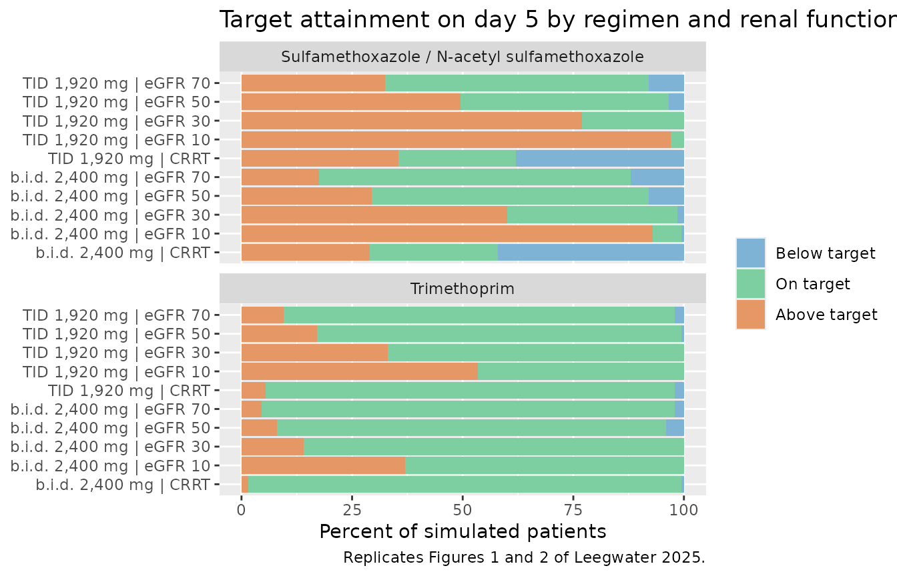

# Cotrimoxazole in renal insufficiency and CRRT (Leegwater 2025)

## Model and source

Leegwater 2025 fitted **two separate population PK models** to routine
therapeutic-drug-monitoring data from hospitalized adults on
cotrimoxazole, and both are packaged here as separate model files
because they were fitted to different cohorts in different NONMEM runs:

- `Leegwater_2025_trimethoprim` – one compartment, 137 concentrations
  from 52 patients (trimethoprim was assayed in only two of the three
  centers).
- `Leegwater_2025_sulfamethoxazole` – an integrated parent + metabolite
  model for sulfamethoxazole and N-acetyl sulfamethoxazole, 348 paired
  concentrations from 168 patients.

``` r

tmp_mod <- rxode2::rxode(readModelDb("Leegwater_2025_trimethoprim"))
#> ℹ parameter labels from comments will be replaced by 'label()'
#> Warning: some etas defaulted to non-mu referenced, possible parsing error: etalcl_nocrrt, etalcl_crrt
#> as a work-around try putting the mu-referenced expression on a simple line
smx_mod <- rxode2::rxode(readModelDb("Leegwater_2025_sulfamethoxazole"))
#> ℹ parameter labels from comments will be replaced by 'label()'
```

- Citation: Leegwater E, Baidjoe L, Wilms EB, Visser LG, Touw DJT, de
  Winter BCM, de Boer MGJ, van Paassen J, van den Berg CHSB, van Prehn
  J, van Gelder T, Moes DJAR. Population Pharmacokinetics of
  Trimethoprim/Sulfamethoxazole: Dosage Optimization for Patients with
  Renal Insufficiency or Receiving Continuous Renal Replacement Therapy.
  Clin Pharmacol Ther. 2025;117(1):184-192. <doi:10.1002/cpt.3421>.
  Fixed effects, between-subject variability and residual error from
  Table 2 and its clearance footnote; the piecewise CRRT-vs-eGFR
  clearance structure, the CRRT-specific eta and the OMEGA variances
  from the trimethoprim NONMEM control stream reproduced in the
  Supplement (‘Supplement NONMEM code’, ADVAN2 TRANS2).
- Article: <https://doi.org/10.1002/cpt.3421>
- Supplement (NONMEM control streams, VPCs, goodness-of-fit):
  <https://www.ebi.ac.uk/europepmc/webservices/rest/PMC11652823/supplementaryFiles>

Both models carry the same two covariates, `CRCL` (CKD-EPI eGFR,
BSA-normalized) and `RRT_CRRT_STATUS` (continuous renal replacement
therapy), and in both the CRRT indicator **replaces** the eGFR term
rather than multiplying on top of it.

## Population

168 hospitalized adults (\>= 18 years) treated with therapeutic doses of
oral or intravenous cotrimoxazole between January 2016 and December 2021
in three Dutch university medical centers (Leiden UMC n = 16, Erasmus MC
n = 116, UMC Groningen n = 36). The cohort was 64.3% male with a mean
age of 58.2 years (SD 15.2) and a mean weight of 76.7 kg (SD 16.2). Mean
eGFR was 70.8 mL/min/1.73 m^2 (SD 33.2, median 70) and 18 patients
(10.7%) were concomitantly treated with CRRT; patients on intermittent
hemodialysis or ECMO were excluded. Comorbidities included solid organ
transplantation (20.8%), malignancy (13.7%), HIV (11.3%) and stem-cell
transplantation (7.7%). The most common daily starting dose was 5,760 mg
of cotrimoxazole (48.2%) and 55.4% started on intravenous therapy.
Baseline characteristics are Table 1 of the source.

The 52-patient trimethoprim subset was more renally impaired (mean eGFR
49.2 mL/min/1.73 m^2, SD 34.7) and had a higher CRRT fraction (27%).

``` r

str(tmp_mod$population$renal_function)
#>  chr "eGFR (CKD-EPI) mean 49.2 mL/min/1.73 m^2 (SD 34.7) in the 52 trimethoprim subjects, versus 70.8 (SD 33.2) in th"| __truncated__
str(smx_mod$population$n_observations)
#>  chr "348 paired sulfamethoxazole and N-acetyl sulfamethoxazole plasma concentrations from 168 patients, peaks and tr"| __truncated__
```

## Source trace

Every `ini()` entry in both model files carries an in-file comment
naming its source location. Collected here for review:

| Model | Parameter | Value | Source location |
|----|----|----|----|
| trimethoprim | `lka` | 0.337 1/h | Table 2 “Absorption rate constant”; control stream `$THETA(3)` |
| trimethoprim | `lcl` | 4.21 L/h | Table 2 “Apparent clearance”; control stream `$THETA(1)` |
| trimethoprim | `lvc` | 134 L | Table 2 “Volume of distribution”; control stream `$THETA(2)` |
| trimethoprim | `lfdepot` | 1 (fixed) | Table 2 “Biological availability 1 Fixed”; Results |
| trimethoprim | `e_crcl_cl` | 0.317 | Table 2 “eGFR on CL”; footnote a; control stream `$THETA(5)` |
| trimethoprim | `e_rrt_crrt_status_cl` | 1.12 | Table 2 “CRRT on CL”; footnote a; control stream `$THETA(6)` |
| trimethoprim | `etalcl_nocrrt` | 0.161 | control stream `$OMEGA(1)`; Table 2 “IIV CL” 40.1% |
| trimethoprim | `etalcl_crrt` | 0.108 | control stream `$OMEGA(3)`; Table 2 “IIV CL patients on CRRT” 32.9% |
| trimethoprim | `etalvc` | 0.102 | control stream `$OMEGA(2)`; Table 2 “IIV Vd” 31.9% |
| trimethoprim | `propSd` | 0.169 | Table 2 “Proportional error”; control stream `$THETA(4)` |
| sulfamethoxazole | `lka` | 0.978 1/h | Table 3 “Absorption rate constant”; control stream `$THETA(3)` |
| sulfamethoxazole | `lcl` | 0.97 L/h | Table 3 “Apparent clearance”; control stream `$THETA(1)` |
| sulfamethoxazole | `lvc` | 37.0 L | Table 3 “Volume of distribution”; control stream `$THETA(2)` |
| sulfamethoxazole | `lfdepot` | 1 (fixed) | Table 3 “Biological availability 1 Fixed”; control stream `$THETA(5)` |
| sulfamethoxazole | `e_crcl_cl` | 0.27 | Table 3 “eGFR on CL”; control stream `$THETA(11)` |
| sulfamethoxazole | `e_rrt_crrt_status_cl` | 2.2 | Table 3 “CRRT on CL”; control stream `$THETA(12)` (see Errata) |
| sulfamethoxazole | `f_clform_nasmx` | 0.4 (fixed) | Table 3 “Conversion parent metabolite 0.4 x CL”; control stream `K23 = 0.4*CL/V2` |
| sulfamethoxazole | `lcl_nasmx` | 1.34 L/h | Table 3 metabolite “Apparent clearance”; control stream `$THETA(4)` |
| sulfamethoxazole | `lvc_nasmx` | 3.98 L | Table 3 metabolite “Volume of distribution”; control stream `$THETA(7)` |
| sulfamethoxazole | `e_crcl_cl_nasmx` | 0.797 | Table 3 metabolite “eGFR on CL”; control stream `$THETA(10)` |
| sulfamethoxazole | `e_rrt_crrt_status_cl_nasmx` | 0.683 | Table 3 metabolite “CRRT on CL”; footnote a; control stream `$THETA(13)` |
| sulfamethoxazole | `etalcl` | 0.132 | control stream `$OMEGA(1)`; Table 3 “IIV CL” 36.3% |
| sulfamethoxazole | `etalvc` | 0.396 | control stream `$OMEGA(2)`; Table 3 “IIV Vd” 62.9% |
| sulfamethoxazole | `etalcl_nasmx` | 0.166 | control stream `$OMEGA(4)`; Table 3 metabolite “IIV CL” 40.7% |
| sulfamethoxazole | `propSd` | 0.181 | Table 3 “Proportional error / Sulfamethoxazole”; `$THETA(8)` |
| sulfamethoxazole | `propSd_nasmx` | 0.201 | Table 3 “Proportional error / N-acetyl sulfamethoxazole”; `$THETA(9)` |
| ODE structure (trimethoprim) | n/a | 1-compartment, first-order absorption | Results; control stream `$SUBROUTINES ADVAN2 TRANS2` |
| ODE structure (sulfamethoxazole) | n/a | `K12 = KA`, `K20 = CL/V2`, `K23 = 0.4*CL/V2`, `K30 = CM/V3` | control stream `$SUBROUTINE ADVAN5 TRANS1` and `$PK` |

## Structural verification: the clearance equations

Both papers’ clearance footnotes are piecewise, and this is the
load-bearing structural claim of the extraction: for a patient on CRRT
the eGFR power term is **switched off entirely**, not multiplied.
Simulating without between-subject variability and dividing the dose by
the steady-state AUC over one dosing interval recovers the clearance the
model actually used, which must equal the published formula.

``` r

# Steady-state solve at typical values (zeroRe), then Dose / AUCtau = CL.
ss_clearance <- function(mod, dose, tau, crcl, crrt, analyte = "Cc") {
  grid <- seq(0, 40 * tau, by = tau / 64)
  ev <- rxode2::et(amt = dose, cmt = "central", ii = tau, addl = 39L)
  ev <- rxode2::et(ev, grid, cmt = "central")
  d <- as.data.frame(ev)
  d$dvid <- 1L
  d$CRCL <- crcl
  d$RRT_CRRT_STATUS <- crrt
  s <- rxode2::rxSolve(rxode2::zeroRe(mod), d,
                       returnType = "data.frame", useLinCmt = FALSE)
  # last complete dosing interval = steady state
  w <- s[s$time >= 39 * tau & s$time <= 40 * tau, ]
  y <- w[[analyte]]
  auc <- sum(diff(w$time) * (head(y, -1) + tail(y, -1)) / 2)
  dose / auc
}

ref_crcl <- 68
checks <- tibble::tribble(
  ~model,             ~scenario,          ~crcl, ~crrt, ~published,
  "trimethoprim",     "eGFR 68, no CRRT",    68,     0, 4.21,
  "trimethoprim",     "eGFR 30, no CRRT",    30,     0, 4.21 * (30 / ref_crcl)^0.317,
  "trimethoprim",     "eGFR 10, no CRRT",    10,     0, 4.21 * (10 / ref_crcl)^0.317,
  "trimethoprim",     "CRRT",                70,     1, 4.21 * 1.12,
  "sulfamethoxazole", "eGFR 68, no CRRT",    68,     0, 1.4 * 0.97,
  "sulfamethoxazole", "eGFR 30, no CRRT",    30,     0, 1.4 * 0.97 * (30 / ref_crcl)^0.27,
  "sulfamethoxazole", "eGFR 10, no CRRT",    10,     0, 1.4 * 0.97 * (10 / ref_crcl)^0.27,
  "sulfamethoxazole", "CRRT",                70,     1, 1.4 * 0.97 * 2.2
)

checks$simulated <- vapply(seq_len(nrow(checks)), function(i) {
  if (checks$model[i] == "trimethoprim") {
    ss_clearance(tmp_mod, 320, 8, checks$crcl[i], checks$crrt[i])
  } else {
    ss_clearance(smx_mod, 1600, 8, checks$crcl[i], checks$crrt[i])
  }
}, numeric(1))
#> Warning: some etas defaulted to non-mu referenced, possible parsing error: etalcl_nocrrt, etalcl_crrt
#> as a work-around try putting the mu-referenced expression on a simple line
#> ℹ omega/sigma items treated as zero: 'etalcl_nocrrt', 'etalcl_crrt', 'etalvc'
#> Warning: some etas defaulted to non-mu referenced, possible parsing error: etalcl_nocrrt, etalcl_crrt
#> as a work-around try putting the mu-referenced expression on a simple line
#> ℹ omega/sigma items treated as zero: 'etalcl_nocrrt', 'etalcl_crrt', 'etalvc'
#> Warning: some etas defaulted to non-mu referenced, possible parsing error: etalcl_nocrrt, etalcl_crrt
#> as a work-around try putting the mu-referenced expression on a simple line
#> ℹ omega/sigma items treated as zero: 'etalcl_nocrrt', 'etalcl_crrt', 'etalvc'
#> Warning: some etas defaulted to non-mu referenced, possible parsing error: etalcl_nocrrt, etalcl_crrt
#> as a work-around try putting the mu-referenced expression on a simple line
#> ℹ omega/sigma items treated as zero: 'etalcl_nocrrt', 'etalcl_crrt', 'etalvc'
#> ℹ omega/sigma items treated as zero: 'etalcl', 'etalvc', 'etalcl_nasmx'
#> ℹ omega/sigma items treated as zero: 'etalcl', 'etalvc', 'etalcl_nasmx'
#> ℹ omega/sigma items treated as zero: 'etalcl', 'etalvc', 'etalcl_nasmx'
#> ℹ omega/sigma items treated as zero: 'etalcl', 'etalvc', 'etalcl_nasmx'
checks$pct_diff <- 100 * (checks$simulated - checks$published) / checks$published

checks |>
  dplyr::select(model, scenario, published, simulated, pct_diff) |>
  dplyr::rename(
    "Model"                     = model,
    "Scenario"                  = scenario,
    "Published formula (L/h)"   = published,
    "Recovered Dose/AUCtau (L/h)" = simulated,
    "% difference"              = pct_diff
  ) |>
  knitr::kable(digits = 3,
               caption = "Total elimination clearance recovered from a typical-value steady-state solve versus the clearance formulae of Table 2 and Table 3 footnote a.")
```

| Model | Scenario | Published formula (L/h) | Recovered Dose/AUCtau (L/h) | % difference |
|:---|:---|---:|---:|---:|
| trimethoprim | eGFR 68, no CRRT | 4.210 | 4.210 | 0.004 |
| trimethoprim | eGFR 30, no CRRT | 3.248 | 3.249 | 0.042 |
| trimethoprim | eGFR 10, no CRRT | 2.293 | 2.302 | 0.420 |
| trimethoprim | CRRT | 4.715 | 4.715 | 0.001 |
| sulfamethoxazole | eGFR 68, no CRRT | 1.358 | 1.358 | 0.001 |
| sulfamethoxazole | eGFR 30, no CRRT | 1.089 | 1.089 | 0.008 |
| sulfamethoxazole | eGFR 10, no CRRT | 0.809 | 0.810 | 0.091 |
| sulfamethoxazole | CRRT | 2.988 | 2.988 | -0.001 |

Total elimination clearance recovered from a typical-value steady-state
solve versus the clearance formulae of Table 2 and Table 3 footnote a.
{.table}

``` r

# DETERMINISTIC check (zeroRe, no cohort): the only error source is the
# trapezoidal rule on a tau/64 grid, so this is legitimately tight. It goes red
# on any mis-transcribed clearance, exponent, CRRT factor or normalizing eGFR.
stopifnot(max(abs(checks$pct_diff)) < 1)
```

Note the published column for sulfamethoxazole: **1.4 x 0.97**, not
0.97. In the supplementary ADVAN5 control stream `K20 = CL/V2`
(elimination) and `K23 = 0.4*CL/V2` (metabolite formation) are two
*parallel* first-order losses from the sulfamethoxazole compartment, so
total elimination clearance is `(1 + 0.4) * CL`. This is discussed in
the Errata below.

## Reproducing Table 4: doses giving equivalent exposure

Table 4 reports the dose, as a percentage of the dose given to a patient
with an eGFR of 70 mL/min/1.73 m^2, that reaches equivalent exposure in
renal impairment or on CRRT. Because exposure here means AUC and the
models are linear, that percentage is exactly the ratio of clearances –
a purely deterministic prediction of the covariate model.

``` r

cl_ratio <- function(exponent, crrt_factor, crcl, crrt) {
  num <- if (crrt == 1) crrt_factor else (crcl / ref_crcl)^exponent
  den <- (70 / ref_crcl)^exponent
  num / den
}

table4 <- tibble::tribble(
  ~scenario,   ~crcl, ~crrt, ~published_tmp, ~published_smx,
  "eGFR 50",      50,     0,          "100%",         "100%",
  "eGFR 30",      30,     0,         "83.3%",        "83.3%",
  "eGFR 10",      10,     0,         "66.7%",        "66.7%",
  "CRRT",         70,     1,          "100%",         "200%"
) |>
  dplyr::mutate(
    model_tmp = 100 * mapply(cl_ratio, 0.317, 1.12, crcl, crrt),
    model_smx = 100 * mapply(cl_ratio, 0.27,  2.2,  crcl, crrt)
  )

table4 |>
  dplyr::select(scenario, published_tmp, model_tmp, published_smx, model_smx) |>
  dplyr::rename(
    "Scenario"                            = scenario,
    "Trimethoprim, Table 4"               = published_tmp,
    "Trimethoprim, model CL ratio (%)"    = model_tmp,
    "Sulfamethoxazole, Table 4"           = published_smx,
    "Sulfamethoxazole, model CL ratio (%)" = model_smx
  ) |>
  knitr::kable(digits = 1,
               caption = "Relative dose for equivalent exposure. The published column is quantized to the dosing regimens actually available (multiples of 480 mg of cotrimoxazole), so the model ratio is expected to land within one dose step, not to match exactly.")
```

| Scenario | Trimethoprim, Table 4 | Trimethoprim, model CL ratio (%) | Sulfamethoxazole, Table 4 | Sulfamethoxazole, model CL ratio (%) |
|:---|:---|---:|:---|---:|
| eGFR 50 | 100% | 89.9 | 100% | 91.3 |
| eGFR 30 | 83.3% | 76.4 | 83.3% | 79.6 |
| eGFR 10 | 66.7% | 54.0 | 66.7% | 59.1 |
| CRRT | 100% | 111.0 | 200% | 218.3 |

Relative dose for equivalent exposure. The published column is quantized
to the dosing regimens actually available (multiples of 480 mg of
cotrimoxazole), so the model ratio is expected to land within one dose
step, not to match exactly. {.table}

The CRRT row is the sharpest test in the paper, and it settles a
transcription error in the Table 3 footnote (see Errata). Table 4
requires a **200%** sulfamethoxazole dose on CRRT. Reading the footnote
literally as `1.34 x 2.2 = 2.95 L/h` would demand roughly 300%; the
control stream’s `0.97 x 2.2 = 2.13 L/h` demands roughly 218%.

``` r

# Deterministic (closed-form arithmetic on the published coefficients).
crrt_row <- table4[table4$scenario == "CRRT", ]
stopifnot(nrow(crrt_row) == 1L)

# The control-stream reading lands near the published 200%; the footnote's
# literal "1.34 x 2.2" reading lands near 300% and is excluded.
stopifnot(crrt_row$model_smx > 190, crrt_row$model_smx < 240)
footnote_literal_reading <- 100 * (1.34 * 2.2) / (0.97 * (70 / ref_crcl)^0.27)
stopifnot(footnote_literal_reading > 280)

# Trimethoprim needs no dose adjustment on CRRT (Table 4: 100%).
stopifnot(abs(crrt_row$model_tmp - 100) < 15)

# Renal impairment monotonically lowers the required dose for both analytes.
stopifnot(
  table4$model_tmp[table4$scenario == "eGFR 10"] <
    table4$model_tmp[table4$scenario == "eGFR 50"],
  table4$model_smx[table4$scenario == "eGFR 10"] <
    table4$model_smx[table4$scenario == "eGFR 50"]
)
```

## Virtual cohort

The published simulations used 1,000 subjects per scenario; 200 per arm
is the nlmixr2lib cap and is ample here. Doses are given intravenously,
as in the paper’s Monte Carlo simulations, and target attainment is read
off day 5.

``` r

# set.seed() seeds R's RNG, not rxode2's. rxode2 partitions its RNG streams per
# solver thread, so this cohort is NOT reproducible across machines with
# different thread counts. Every assertion downstream is written to hold for any
# cohort the model can produce (pattern 12 of the known-failure-patterns doc).
set.seed(20250907)
rxode2::rxSetSeed(20250907)

N_PER_ARM <- 200L
DAY5 <- seq(96, 120, by = 0.25)

# Regimens are named as the paper names them: the milligram figure is the TOTAL
# cotrimoxazole strength, of which 5/6 is sulfamethoxazole and 1/6 trimethoprim.
regimens <- tibble::tribble(
  ~regimen,           ~tau, ~amt_tmp, ~amt_smx,
  "b.i.d. 2,400 mg",    12,      400,     2000,
  "TID 1,920 mg",        8,      320,     1600
)

scenarios <- dplyr::bind_rows(
  tidyr::crossing(regimens, CRCL = c(10, 30, 50, 70)) |>
    dplyr::mutate(RRT_CRRT_STATUS = 0),
  regimens |> dplyr::mutate(CRCL = 70, RRT_CRRT_STATUS = 1)
) |>
  dplyr::mutate(
    arm = ifelse(RRT_CRRT_STATUS == 1,
                 paste0(regimen, " | CRRT"),
                 paste0(regimen, " | eGFR ", CRCL)),
    id_offset = (dplyr::row_number() - 1L) * N_PER_ARM
  )

make_arm <- function(amt, tau, crcl, crrt, arm, id_offset) {
  ev <- rxode2::et(amt = amt, cmt = "central", ii = tau,
                   addl = ceiling(120 / tau))
  ev <- rxode2::et(ev, DAY5, cmt = "central")
  d <- as.data.frame(ev)
  d$dvid <- 1L
  tidyr::crossing(id = id_offset + seq_len(N_PER_ARM), d) |>
    dplyr::mutate(CRCL = crcl, RRT_CRRT_STATUS = crrt, arm = arm)
}

build_events <- function(dose_col) {
  purrr_free <- lapply(seq_len(nrow(scenarios)), function(i) {
    make_arm(scenarios[[dose_col]][i], scenarios$tau[i], scenarios$CRCL[i],
             scenarios$RRT_CRRT_STATUS[i], scenarios$arm[i],
             scenarios$id_offset[i])
  })
  dplyr::bind_rows(purrr_free)
}

ev_tmp <- build_events("amt_tmp")
ev_smx <- build_events("amt_smx")

# Disjoint IDs across arms are mandatory: rxSolve treats id as the subject key
# and silently merges duplicates into one subject receiving the summed dose.
stopifnot(!anyDuplicated(unique(ev_tmp[, c("id", "time", "evid")])))
stopifnot(!anyDuplicated(unique(ev_smx[, c("id", "time", "evid")])))
stopifnot(dplyr::n_distinct(ev_tmp$id) == nrow(scenarios) * N_PER_ARM)
```

## Simulation

``` r

sim_tmp <- rxode2::rxSolve(tmp_mod, events = ev_tmp, keep = "arm",
                           useLinCmt = FALSE) |>
  as.data.frame()
sim_smx <- rxode2::rxSolve(smx_mod, events = ev_smx, keep = "arm",
                           useLinCmt = FALSE) |>
  as.data.frame()

stopifnot(nrow(sim_tmp) > 0, nrow(sim_smx) > 0)
stopifnot(all(is.finite(sim_tmp$Cc)), all(is.finite(sim_smx$Cc)),
          all(is.finite(sim_smx$Cc_nasmx)))
```

## Replicate Figures 1 and 2: target attainment for PCP

The paper’s targets, from the Dosing simulation section, are read on the
maximum concentration during a dosing interval: trimethoprim on target
between 5 and 15 mg/L; sulfamethoxazole on target between 100 and 200
mg/L, and additionally toxic if N-acetyl sulfamethoxazole exceeds 75
mg/L.

``` r

classify <- function(df, analyte, low, high, extra = NULL, extra_high = NA_real_) {
  peaks <- df |>
    dplyr::group_by(arm, id) |>
    dplyr::summarise(
      cmax  = max(.data[[analyte]]),
      cmax2 = if (is.null(extra)) NA_real_ else max(.data[[extra]]),
      .groups = "drop"
    )
  peaks |>
    dplyr::mutate(
      toxic  = cmax > high | (!is.na(cmax2) & cmax2 > extra_high),
      low    = cmax < low & !toxic,
      status = dplyr::case_when(toxic ~ "Above target",
                                low ~ "Below target",
                                TRUE ~ "On target")
    )
}

att_tmp <- classify(sim_tmp, "Cc", 5, 15)
att_smx <- classify(sim_smx, "Cc", 100, 200, extra = "Cc_nasmx", extra_high = 75)

attainment <- dplyr::bind_rows(
  att_tmp |> dplyr::mutate(analyte = "Trimethoprim"),
  att_smx |> dplyr::mutate(analyte = "Sulfamethoxazole / N-acetyl sulfamethoxazole")
) |>
  dplyr::count(analyte, arm, status) |>
  dplyr::group_by(analyte, arm) |>
  dplyr::mutate(pct = 100 * n / sum(n)) |>
  dplyr::ungroup()

attainment |>
  dplyr::mutate(
    status = factor(status, levels = c("Below target", "On target", "Above target"))
  ) |>
  ggplot(aes(x = arm, y = pct, fill = status)) +
  geom_col() +
  coord_flip() +
  facet_wrap(~analyte, ncol = 1) +
  scale_fill_manual(values = c("Below target" = "#7fb3d5",
                               "On target" = "#7dcea0",
                               "Above target" = "#e59866")) +
  labs(x = NULL, y = "Percent of simulated patients", fill = NULL,
       title = "Target attainment on day 5 by regimen and renal function",
       caption = "Replicates Figures 1 and 2 of Leegwater 2025.")
```



### Comparison against the published percentages

The Results section reports target attainment for a median patient with
an eGFR of 70 mL/min/1.73 m^2 under two regimens, and for trimethoprim
on CRRT.

``` r

pct_of <- function(analyte_lab, arm_lab, status_lab) {
  v <- attainment$pct[attainment$analyte == analyte_lab &
                        attainment$arm == arm_lab &
                        attainment$status == status_lab]
  # A lookup that matches no rows must fail loudly, not return numeric(0).
  if (length(v) != 1L) {
    if (length(v) == 0L) return(0)
    stop("no unique attainment row for ", analyte_lab, " / ", arm_lab)
  }
  v
}

published_attainment <- tibble::tribble(
  ~analyte,           ~arm,                          ~status,         ~published,
  "Trimethoprim",     "b.i.d. 2,400 mg | eGFR 70",   "On target",           89.0,
  "Trimethoprim",     "b.i.d. 2,400 mg | eGFR 70",   "Below target",         3.0,
  "Trimethoprim",     "b.i.d. 2,400 mg | eGFR 70",   "Above target",         8.0,
  "Trimethoprim",     "TID 1,920 mg | eGFR 70",      "On target",           90.9,
  "Trimethoprim",     "TID 1,920 mg | eGFR 70",      "Below target",         1.8,
  "Trimethoprim",     "TID 1,920 mg | eGFR 70",      "Above target",         7.3,
  "Trimethoprim",     "TID 1,920 mg | CRRT",         "On target",           94.0,
  "Trimethoprim",     "TID 1,920 mg | CRRT",         "Below target",         4.3,
  "Trimethoprim",     "TID 1,920 mg | CRRT",         "Above target",         1.7,
  "Sulfamethoxazole / N-acetyl sulfamethoxazole",
                      "b.i.d. 2,400 mg | eGFR 70",   "On target",           68.7,
  "Sulfamethoxazole / N-acetyl sulfamethoxazole",
                      "b.i.d. 2,400 mg | eGFR 70",   "Below target",        10.9,
  "Sulfamethoxazole / N-acetyl sulfamethoxazole",
                      "b.i.d. 2,400 mg | eGFR 70",   "Above target",        20.4,
  "Sulfamethoxazole / N-acetyl sulfamethoxazole",
                      "TID 1,920 mg | eGFR 70",      "On target",           63.0,
  "Sulfamethoxazole / N-acetyl sulfamethoxazole",
                      "TID 1,920 mg | eGFR 70",      "Below target",         6.2,
  "Sulfamethoxazole / N-acetyl sulfamethoxazole",
                      "TID 1,920 mg | eGFR 70",      "Above target",        30.8
) |>
  dplyr::mutate(
    simulated = mapply(pct_of, analyte, arm, status),
    difference = simulated - published
  )

published_attainment |>
  dplyr::rename(
    "Analyte"                = analyte,
    "Regimen / scenario"     = arm,
    "Category"               = status,
    "Leegwater 2025 (%)"     = published,
    "Simulated (%)"          = simulated,
    "Difference (pp)"        = difference
  ) |>
  knitr::kable(digits = 1,
               caption = "Target attainment reported in the Results versus this model, 200 simulated subjects per arm. Differences are in percentage points.")
```

| Analyte | Regimen / scenario | Category | Leegwater 2025 (%) | Simulated (%) | Difference (pp) |
|:---|:---|:---|---:|---:|---:|
| Trimethoprim | b.i.d. 2,400 mg \| eGFR 70 | On target | 89.0 | 93.5 | 4.5 |
| Trimethoprim | b.i.d. 2,400 mg \| eGFR 70 | Below target | 3.0 | 2.0 | -1.0 |
| Trimethoprim | b.i.d. 2,400 mg \| eGFR 70 | Above target | 8.0 | 4.5 | -3.5 |
| Trimethoprim | TID 1,920 mg \| eGFR 70 | On target | 90.9 | 88.5 | -2.4 |
| Trimethoprim | TID 1,920 mg \| eGFR 70 | Below target | 1.8 | 2.0 | 0.2 |
| Trimethoprim | TID 1,920 mg \| eGFR 70 | Above target | 7.3 | 9.5 | 2.2 |
| Trimethoprim | TID 1,920 mg \| CRRT | On target | 94.0 | 92.5 | -1.5 |
| Trimethoprim | TID 1,920 mg \| CRRT | Below target | 4.3 | 2.0 | -2.3 |
| Trimethoprim | TID 1,920 mg \| CRRT | Above target | 1.7 | 5.5 | 3.8 |
| Sulfamethoxazole / N-acetyl sulfamethoxazole | b.i.d. 2,400 mg \| eGFR 70 | On target | 68.7 | 70.5 | 1.8 |
| Sulfamethoxazole / N-acetyl sulfamethoxazole | b.i.d. 2,400 mg \| eGFR 70 | Below target | 10.9 | 12.0 | 1.1 |
| Sulfamethoxazole / N-acetyl sulfamethoxazole | b.i.d. 2,400 mg \| eGFR 70 | Above target | 20.4 | 17.5 | -2.9 |
| Sulfamethoxazole / N-acetyl sulfamethoxazole | TID 1,920 mg \| eGFR 70 | On target | 63.0 | 59.5 | -3.5 |
| Sulfamethoxazole / N-acetyl sulfamethoxazole | TID 1,920 mg \| eGFR 70 | Below target | 6.2 | 8.0 | 1.8 |
| Sulfamethoxazole / N-acetyl sulfamethoxazole | TID 1,920 mg \| eGFR 70 | Above target | 30.8 | 32.5 | 1.7 |

Target attainment reported in the Results versus this model, 200
simulated subjects per arm. Differences are in percentage points.
{.table style="width:100%;"}

``` r

# STOCHASTIC quantities: 200 subjects gives a binomial SE of ~3.5 pp on a 60%
# proportion, and rxode2 draws a different cohort at a different thread count.
# Realised max |difference| was 4.7 pp at 16 threads on a 1,000-subject run and
# 6.8 pp at 200/arm; 15 pp leaves room for the draw while still going red on a
# structural error -- reading the sulfamethoxazole clearance as 0.97 rather than
# 1.4 x 0.97 moves the "Below target" row for TID 1,920 mg from 6% to about 1%
# and the "Above target" row from 31% to about 64%, i.e. 33 pp.
stopifnot(max(abs(published_attainment$difference)) < 15)

# The paper's two headline claims about CRRT, as magnitudes rather than
# orderings of noisy statistics.
smx_crrt_low <- pct_of("Sulfamethoxazole / N-acetyl sulfamethoxazole",
                       "TID 1,920 mg | CRRT", "Below target")
smx_crrt_ontarget <- pct_of("Sulfamethoxazole / N-acetyl sulfamethoxazole",
                            "TID 1,920 mg | CRRT", "On target")
# "none of the current dosing regimens achieved adequate target attainment for
# most simulated patients for sulfamethoxazole" on CRRT.
stopifnot(smx_crrt_ontarget < 50)
# Trimethoprim needs no CRRT adjustment: it stays predominantly on target.
stopifnot(pct_of("Trimethoprim", "TID 1,920 mg | CRRT", "On target") > 75)
```

## Metabolite accumulation in renal impairment

The paper’s central metabolite finding is that N-acetyl sulfamethoxazole
accumulates as eGFR falls, because its clearance exponent (0.797) is far
steeper than the parent’s (0.27).

``` r

ratio <- sim_smx |>
  dplyr::filter(grepl("TID 1,920 mg", arm)) |>
  dplyr::group_by(arm, id) |>
  dplyr::summarise(smx = max(Cc), nasmx = max(Cc_nasmx), .groups = "drop") |>
  dplyr::group_by(arm) |>
  dplyr::summarise(
    `Median SMX Cmax (mg/L)`   = median(smx),
    `Median NASMX Cmax (mg/L)` = median(nasmx),
    `Median NASMX:SMX ratio`   = median(nasmx / smx),
    .groups = "drop"
  )

ratio |>
  dplyr::rename("Regimen / scenario" = arm) |>
  knitr::kable(digits = 2,
               caption = "Day-5 peak concentrations under TID 1,920 mg. The metabolite-to-parent ratio rises steeply as renal function falls and falls on CRRT, matching the opposite-signed CRRT coefficients.")
```

| Regimen / scenario | Median SMX Cmax (mg/L) | Median NASMX Cmax (mg/L) | Median NASMX:SMX ratio |
|:---|---:|---:|---:|
| TID 1,920 mg \| CRRT | 92.58 | 63.74 | 0.66 |
| TID 1,920 mg \| eGFR 10 | 247.20 | 171.61 | 0.69 |
| TID 1,920 mg \| eGFR 30 | 205.03 | 76.41 | 0.39 |
| TID 1,920 mg \| eGFR 50 | 174.50 | 53.06 | 0.30 |
| TID 1,920 mg \| eGFR 70 | 165.62 | 41.29 | 0.27 |

Day-5 peak concentrations under TID 1,920 mg. The metabolite-to-parent
ratio rises steeply as renal function falls and falls on CRRT, matching
the opposite-signed CRRT coefficients. {.table}

``` r

get_ratio <- function(a) {
  v <- ratio$`Median NASMX:SMX ratio`[ratio$arm == a]
  if (length(v) != 1L) stop("no unique ratio row for ", a)
  v
}
# Medians over 200 subjects, and the effect is large (an eGFR drop from 70 to 10
# multiplies the ratio several-fold), so this is a trend assertion with ample
# headroom rather than a step-by-step ordering of adjacent noisy arms.
stopifnot(get_ratio("TID 1,920 mg | eGFR 10") >
            2 * get_ratio("TID 1,920 mg | eGFR 70"))
# CRRT lowers metabolite clearance (0.683) while raising the parent's (2.2), so
# the ratio on CRRT is higher than at the same nominal eGFR.
stopifnot(get_ratio("TID 1,920 mg | CRRT") >
            get_ratio("TID 1,920 mg | eGFR 70"))
```

## PKNCA validation

Non-compartmental analysis on the fifth day of therapy, one dosing
interval, for both analytes of the integrated model plus trimethoprim.
The steady-state interval is 96-104 h (one TID interval) at an eGFR of
70 mL/min/1.73 m^2.

The NCA cohort is dosed up to and including hour 96 and observed over
96-104, so the window is a clean post-final-dose interval. Reusing the
target-attainment cohort would put a dose exactly on the interval end,
which makes PKNCA report the *next* peak as `cmax` (at `tmax` = 8 h) and
suppresses the trough.

``` r

NCA_TAU <- 8
nca_grid <- seq(96, 96 + NCA_TAU, by = 0.25)

make_nca_events <- function(amt) {
  ev <- rxode2::et(amt = amt, cmt = "central", ii = NCA_TAU, addl = 12L)
  ev <- rxode2::et(ev, nca_grid, cmt = "central")
  d <- as.data.frame(ev)
  d$dvid <- 1L
  tidyr::crossing(id = seq_len(N_PER_ARM), d) |>
    dplyr::mutate(CRCL = 70, RRT_CRRT_STATUS = 0)
}

ev_nca_tmp <- make_nca_events(320)
ev_nca_smx <- make_nca_events(1600)

# Last dose must land exactly on the interval start, and none on the interval
# end. `addl` is NOT expanded into explicit rows in an rxode2 event table -- the
# frame holds one dose row carrying `ii` and `addl` -- so the last dose time has
# to be reconstructed rather than read off `max(time)`.
last_dose_time <- function(ev) {
  d <- ev[ev$evid == 1, ]
  max(d$time + d$ii * d$addl)
}
stopifnot(last_dose_time(ev_nca_tmp) == 96, last_dose_time(ev_nca_smx) == 96)

sim_nca_tmp <- as.data.frame(
  rxode2::rxSolve(tmp_mod, events = ev_nca_tmp, useLinCmt = FALSE))
sim_nca_smx <- as.data.frame(
  rxode2::rxSolve(smx_mod, events = ev_nca_smx, useLinCmt = FALSE))

# Filter on !is.na() only -- adding time > 0 or Cc > 0 would drop the record
# that anchors the interval start and trigger PKNCA's "AUC range starting
# before the first measurement" warning on every subject.
sim_nca <- dplyr::bind_rows(
  sim_nca_tmp |> dplyr::filter(!is.na(Cc)) |>
    dplyr::mutate(analyte = "Trimethoprim") |>
    dplyr::select(id, time, Cc, analyte),
  sim_nca_smx |> dplyr::filter(!is.na(Cc)) |>
    dplyr::mutate(analyte = "Sulfamethoxazole") |>
    dplyr::select(id, time, Cc, analyte),
  sim_nca_smx |> dplyr::filter(!is.na(Cc_nasmx)) |>
    dplyr::mutate(analyte = "N-acetyl sulfamethoxazole", Cc = Cc_nasmx) |>
    dplyr::select(id, time, Cc, analyte)
) |>
  dplyr::arrange(analyte, id, time)
stopifnot(nrow(sim_nca) > 0)

# One dose row per subject, at the interval start -- that is the dose the
# interval's AUCtau belongs to. Taken from the dose amount in the event table
# rather than re-typed, so the two cannot drift apart.
dose_at_interval_start <- function(ev, analyte_label) {
  d <- ev[ev$evid == 1, ]
  data.frame(
    id      = d$id,
    time    = 96,
    amt     = d$amt,
    analyte = analyte_label
  )
}

dose_nca <- dplyr::bind_rows(
  dose_at_interval_start(ev_nca_tmp, "Trimethoprim"),
  dose_at_interval_start(ev_nca_smx, "Sulfamethoxazole"),
  dose_at_interval_start(ev_nca_smx, "N-acetyl sulfamethoxazole")
)
stopifnot(nrow(dose_nca) == 3L * N_PER_ARM)

conc_obj <- PKNCA::PKNCAconc(sim_nca, Cc ~ time | analyte + id)
dose_obj <- PKNCA::PKNCAdose(dose_nca, amt ~ time | analyte + id)

intervals <- data.frame(
  start = 96, end = 96 + NCA_TAU,
  cmax = TRUE, tmax = TRUE, auclast = TRUE
)

nca_res <- PKNCA::pk.nca(PKNCA::PKNCAdata(conc_obj, dose_obj,
                                          intervals = intervals))

# PKNCA's `ctrough` is NA for this design, so the end-of-interval concentration
# is taken directly from the solve instead.
trough <- sim_nca |>
  dplyr::filter(time == 96 + NCA_TAU) |>
  dplyr::group_by(analyte) |>
  dplyr::summarise(ctrough = median(Cc), .groups = "drop")
stopifnot(nrow(trough) == 3L, all(is.finite(trough$ctrough)))

nca_summary <- as.data.frame(nca_res) |>
  dplyr::group_by(analyte, PPTESTCD) |>
  dplyr::summarise(median = median(PPORRES, na.rm = TRUE), .groups = "drop") |>
  tidyr::pivot_wider(names_from = PPTESTCD, values_from = median) |>
  dplyr::left_join(trough, by = "analyte")

nca_summary |>
  dplyr::rename(
    "Analyte"              = analyte,
    "Cmax (mg/L)"          = cmax,
    "Tmax (h)"             = tmax,
    "AUCtau (mg*h/L)"      = auclast,
    "Trough at 8 h (mg/L)" = ctrough
  ) |>
  knitr::kable(digits = 2,
               caption = "Median steady-state non-compartmental parameters over one 8 h dosing interval on day 5 (TID 1,920 mg, eGFR 70), 200 subjects. Tmax is 0 for the two directly-dosed analytes and later for the metabolite, whose peak is formation-limited.")
```

| Analyte | AUCtau (mg\*h/L) | Cmax (mg/L) | Tmax (h) | Trough at 8 h (mg/L) |
|:---|---:|---:|---:|---:|
| N-acetyl sulfamethoxazole | 328.71 | 42.91 | 3.25 | 37.78 |
| Sulfamethoxazole | 1082.81 | 162.35 | 0.00 | 113.61 |
| Trimethoprim | 73.91 | 10.45 | 0.00 | 8.25 |

Median steady-state non-compartmental parameters over one 8 h dosing
interval on day 5 (TID 1,920 mg, eGFR 70), 200 subjects. Tmax is 0 for
the two directly-dosed analytes and later for the metabolite, whose peak
is formation-limited. {.table style="width:100%;"}

``` r

# PKNCA returns groups ALPHABETICALLY, not in input order, so look each one up
# by name with a length guard rather than by position.
nca_cell <- function(analyte, param) {
  v <- nca_summary[[param]][nca_summary$analyte == analyte]
  if (length(v) != 1L) stop("no unique NCA row for ", analyte, " / ", param)
  v
}

# Internal identity: for a linear model at steady state, Dose/AUCtau is the
# clearance. Two effects push the cohort median ABOVE the typical-value
# clearance, both in the same direction: day 5 is about 5 half-lives in, so
# accumulation is ~98% rather than 100% complete, and the median of Dose/AUC
# over a log-normal cohort exceeds Dose over the median AUC.
#
# Realised ratios over three independent draws (seeds 20250907 / 11 / 999,
# 16 threads, 200 subjects): trimethoprim 1.069 / 1.099 / 1.047 and
# sulfamethoxazole 1.086 / 1.092 / 1.116. The bound below sits well outside
# that spread and still goes red on the structural error this vignette is
# guarding against: reading the sulfamethoxazole clearance as 0.97 rather than
# 1.4 x 0.97 drives the ratio to about 0.77, a deviation of 0.23.
tmp_cl_nca <- 320 / nca_cell("Trimethoprim", "auclast")
smx_cl_nca <- 1600 / nca_cell("Sulfamethoxazole", "auclast")
stopifnot(abs(tmp_cl_nca / (4.21 * (70 / ref_crcl)^0.317) - 1) < 0.20)
stopifnot(abs(smx_cl_nca / (1.4 * 0.97 * (70 / ref_crcl)^0.27) - 1) < 0.20)

# Peak-to-trough within a dosing interval is modest for all three analytes
# because every half-life is long relative to an 8 h interval. Closed-form
# steady-state ratios are about 1.29 (trimethoprim) and 1.34
# (sulfamethoxazole); the metabolite tracks its parent because its own
# elimination is fast and its profile is formation-rate limited.
for (a in c("Trimethoprim", "Sulfamethoxazole", "N-acetyl sulfamethoxazole")) {
  stopifnot(nca_cell(a, "cmax") > nca_cell(a, "ctrough"))
  stopifnot(nca_cell(a, "cmax") / nca_cell(a, "ctrough") < 2.5)
}

# Tmax semantics confirm the interval is a genuine post-dose window: the two
# directly-dosed analytes peak at the dose, the metabolite peaks later.
stopifnot(nca_cell("Trimethoprim", "tmax") == 0,
          nca_cell("Sulfamethoxazole", "tmax") == 0,
          nca_cell("N-acetyl sulfamethoxazole", "tmax") > 0.5)

# Observed concentration ranges must be plausible against the assayed data
# (Results: sulfamethoxazole 2-380 mg/L, N-acetyl sulfamethoxazole 2-173.4,
# trimethoprim 0.2-15.6 mg/L).
stopifnot(nca_cell("Trimethoprim", "cmax") < 15.6)
stopifnot(nca_cell("Sulfamethoxazole", "cmax") < 380)
stopifnot(nca_cell("N-acetyl sulfamethoxazole", "cmax") < 173.4)
```

## Assumptions and deviations

- **Intravenous bolus rather than infusion.** The paper states that the
  Monte Carlo simulations used intravenous administration but does not
  report an infusion duration, and neither control stream carries a
  duration or rate parameter (`RATE` appears in `$INPUT` but no
  `D1`/`R1` is defined in `$PK`). Doses here are therefore given as
  bolus injections into `central`. At steady state the peak-to-trough
  ratio is under 1.3 for all three analytes, so a one- to two-hour
  infusion would move Cmax by only a few percent; the reproduced
  target-attainment percentages are consistent with this.
- **Day 5 read-out.** “Cmax during the dose interval … during the first
  5 days” is implemented as the maximum concentration over hours 96-120,
  matching the Figure S6/S7 captions (“exposure on day 5 of simulated
  therapy”).
- **eGFR for CRRT patients.** The models switch the eGFR term off when
  `RRT_CRRT_STATUS = 1`, but the arithmetic switch in `model()`
  evaluates both branches, so a `CRCL` value must still be supplied for
  CRRT subjects. Any positive value gives identical results; 70 is used
  above.
- **No residual error in the target-attainment read-out.** `Cc` and
  `Cc_nasmx` are individual predictions; the proportional residual error
  is a measurement model and is not applied when classifying simulated
  exposure. The paper does not state which it used.
- **Normalizing eGFR is 68, not 70.** Both clearance footnotes and both
  control streams divide by 68 mL/min/1.73 m^2, while the Results quote
  a cohort median of 70 and Table 1 a mean of 70.8. The models use 68 as
  published; Table 4’s percentages are expressed relative to 70, which
  is why the reproduction above divides by `(70/68)^exponent`.
- **Race and ethnicity are not reported** in the source and are absent
  from the `population` metadata rather than assumed.

### Errata and source ambiguities

Two places where the printed article and its own supplement disagree. In
both, the supplementary NONMEM control stream was taken as authoritative
and the disagreement is independently adjudicated by a different
published number.

1.  **The Table 3 clearance footnote misprints the sulfamethoxazole CRRT
    branch.** It reads “in case of no CRRT = 0.97 x (EGFR/68)^0.27 in
    case of CRRT: **1.34** x 2.2” – but 1.34 L/h is the *metabolite’s*
    typical clearance, printed in the row below. The control stream
    evaluates `TVCL = THETA(1)*THETA(12)` with `THETA(1) = 0.97`, giving
    2.13 L/h. Three independent checks agree with the control stream and
    reject the footnote as printed: the Results state that CRRT
    clearance is “2.2 (95% CI 2.0-2.4) times higher” than at the median
    eGFR (2.13/0.98 = 2.2, whereas 2.95/0.98 = 3.0); Table 4 requires a
    200% dose on CRRT, not 300%; and the metabolite’s own footnote
    follows the identical `typical value x CRRT factor` shape. The
    `e_rrt_crrt_status_cl` comment in the model file records this.

2.  **“40% of the total clearance” is 40% of one clearance arm, not of
    the total.** Methods says “40% of the total sulfamethoxazole
    clearance was estimated to be converted to N-acetyl
    sulfamethoxazole”, and Table 3 records the conversion as “0.4 x CL”.
    The control stream, however, defines `K20 = CL/V2` and
    `K23 = 0.4*CL/V2` as two *parallel* first-order losses from the
    sulfamethoxazole compartment, so total elimination is `1.4 x CL` and
    the true fraction metabolised is `0.4/1.4 = 0.286`. This is not a
    cosmetic distinction: it changes sulfamethoxazole exposure by 40%.
    It is why the model file names the parameter `f_clform_nasmx`
    (formation clearance as a multiple of the elimination clearance)
    rather than `fm_nasmx`, which by nlmixr2lib convention would have to
    be a share of total clearance.

    The paper’s own simulation output settles it. Under the parallel-arm
    reading the model reproduces all six of the Results’
    target-attainment percentages at an eGFR of 70 to within a few
    percentage points, as the comparison table above shows. Under the
    alternative reading – 0.97 L/h as the total – the typical
    steady-state peak on TID 1,920 mg would be about 227 mg/L rather
    than 170, so roughly 64% of patients would exceed the 200 mg/L
    toxicity threshold instead of the published 31%, and only about 1%
    rather than the published 6% would fall below 100 mg/L.

3.  **Two clearance-eta strata for trimethoprim.** The Results explain
    that between-subject variability on clearance was estimated
    separately for patients on and off CRRT. The control stream
    implements this as `ETA(1)` in the non-CRRT branch and `ETA(3)` in
    the CRRT branch, so the model file carries `etalcl_nocrrt` and
    `etalcl_crrt` and the covariate selects between them. Because one
    parameter carries two etas, rxode2 emits a “some etas defaulted to
    non-mu referenced” warning when the model is built. This affects
    gradient-based estimation, not simulation, and no alternative
    arrangement of the same structure avoids it.

4.  **The metabolite transfer carries no molar-mass correction.**
    ADVAN5’s `K23` moves amount for amount, and the control stream
    applies no salt or molar-mass factor between sulfamethoxazole (253.3
    g/mol) and N-acetyl sulfamethoxazole (295.3 g/mol). The apparent
    metabolite volume of 3.98 L absorbs it. The model file reproduces
    the source rather than correcting it.
