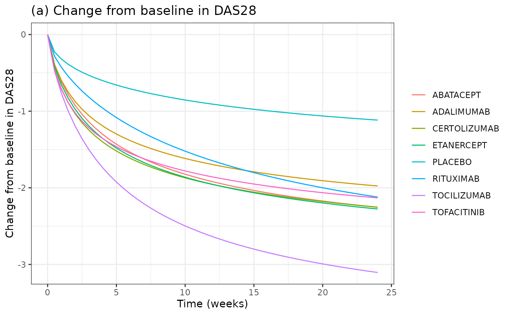
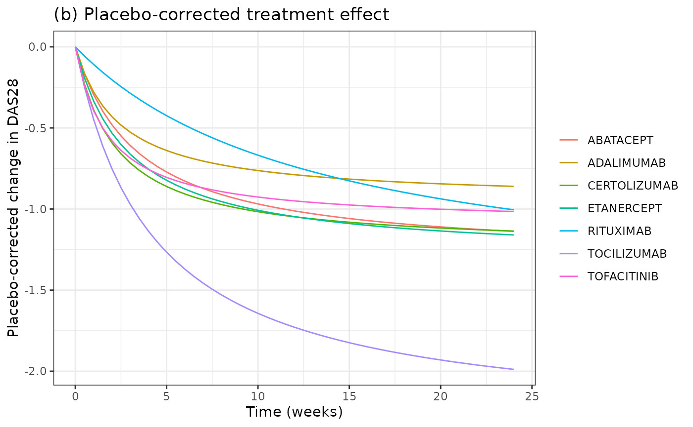
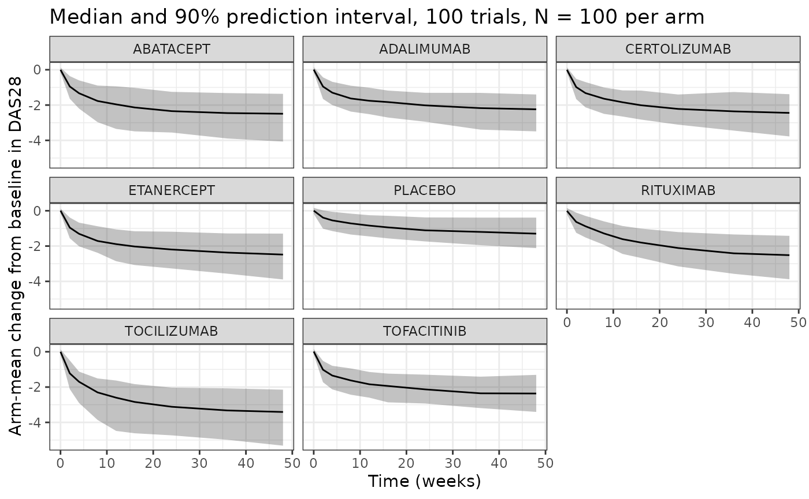

# Rheumatoid arthritis DAS28 MBMA of seven approved drugs (Leil 2021)

## Model and source

- Citation: Leil TA, Lu Y, Bouillon-Pichault M, Wong R, Nowak M.
  Model-Based Meta-Analysis Compares DAS28 Rheumatoid Arthritis
  Treatment Effects and Suggests an Expedited Trial Design for Early
  Clinical Development. Clin Pharmacol Ther. 2021;109(2):517-527.
  <doi:10.1002/cpt.2023>. Parameter estimates are in Supplementary Table
  S3 (CPT-109-517-s001.docx); the structural model is main-text
  Equations 6-10 and 12.
- Description: MBMA. Longitudinal model-based meta-analysis of the
  change from baseline in the 28-joint Disease Activity Score (DAS28, on
  the DAS28-CRP scale) for seven approved rheumatoid arthritis drugs
  (abatacept, adalimumab, certolizumab, etanercept, rituximab,
  tocilizumab, tofacitinib) on a background of conventional synthetic
  DMARDs, fitted in NONMEM 7.3 to 994 study-arm-mean records from 130
  randomized trials (197 arms, 27,355 patients). The arm-mean change
  from baseline is the sum of a sigmoid Hill-in-time placebo
  (background-therapy) response, a hyperbolic drug-specific Emax-in-time
  treatment effect and a linear disease-progression term. Placebo Emax
  depends on baseline DAS28 and disease duration, placebo ET50 on
  baseline DAS28, the placebo Hill coefficient on a low-male-proportion
  indicator (male \< 18.5 percent) and the progression slope on the
  trial year. Between-trial and between-arm random effects and the
  residual error are all scaled by sqrt(100 / N_ARM). Drug arms are
  selected with per-drug arm indicators (all zero = background-therapy
  placebo arm). Suitable simulation scope is study-arm-mean DAS28
  change-from-baseline trajectories, NOT individual patients.
- Article: <https://doi.org/10.1002/cpt.2023> (open access, PMC7894503)
- Supplement: Supporting Information of the article (Supplementary
  Tables S1-S3, Figures S1-S3); the parameter estimates are in Table S3.

Leil et al. pooled longitudinal, study-arm-mean change from baseline in
the 28-joint Disease Activity Score (DAS28) for seven approved
rheumatoid arthritis (RA) drugs and the background-therapy (placebo)
control arms of their trials. DAS28-ESR records were first converted to
the DAS28-CRP scale with a linear mixed-effects regression (Eq. 1;
DAS28-CRP = 0.899 x DAS28-ESR - 0.194), so the model output is on the
DAS28-CRP scale.

## Population

The analysis used the Quantify RA Clinical Outcomes Database (Certara,
version 03/08/2018). The MBMA data set had 994 arm-mean records from 197
arms of 130 randomized controlled trials in 27,355 patients with active
RA on stable background csDMARDs (mostly methotrexate): 91 active arms
of seven drugs at their approved maintenance regimens, and 106
background-therapy control arms. Trial-mean baseline characteristics
(Leil 2021 Table 2, weighted means of arm means) were: baseline
DAS28-CRP 4.9-5.9 by drug (range 3.7-6.5), age 51-53 years, 17-21
percent male, disease duration 5.3-9.9 years. Most arms enrolled
methotrexate inadequate responders; prior biologic exposure was allowed.

``` r

str(readModelDb("Leil_2021_rheumatoidArthritis_das28_mbma")()$population)
#> Warning: some etas defaulted to non-mu referenced, possible parsing error: eta_study_emax_pbo, eta_study_hill_pbo, eta_study_emax_drug, eta_study_hill_drug, eta_study_slope, eta_arm_emax_drug
#> as a work-around try putting the mu-referenced expression on a simple line
#> List of 12
#>  $ species       : chr "human"
#>  $ n_subjects    : int 27355
#>  $ n_studies     : int 130
#>  $ age_range     : chr "trial-mean age 45-61 years (weighted mean of arm means 51-53 by drug; Leil 2021 Table 2)"
#>  $ weight_range  : chr "not reported"
#>  $ sex_female_pct: num 81
#>  $ race_ethnicity: chr "not reported"
#>  $ disease_state : chr "adults with active moderate-to-severe rheumatoid arthritis on stable background csDMARDs (predominantly methotr"| __truncated__
#>  $ dose_range    : chr "approved maintenance regimens only: abatacept 10 mg/kg IV q4w or 125 mg SC qw; adalimumab 40 mg SC q2w; certoli"| __truncated__
#>  $ regions       : chr "multinational (published trials 1994-2018, Quantify RA Clinical Outcomes Database v03/08/2018)"
#>  $ baseline      : chr "trial-mean baseline DAS28-CRP 3.7-6.5 (weighted mean 4.9-5.9 by drug); disease duration 0.24-14 years; 0-45 per"| __truncated__
#>  $ notes         : chr "Study-arm-level MBMA: 994 arm-mean DAS28 change-from-baseline records from 197 arms (91 active, 106 background-"| __truncated__
```

## Model structure

For trial *i*, arm *j* and time *t* (weeks), Leil 2021 Equation 12 is

dDAS28(t) = -\[ Emax,pbo x t^g / (ET50,pbo^g + t^g) + Emax,drug x
t^g,drug / (ET50,drug^g,drug + t^g,drug) \] + PROG x t + (N/100)^-0.5 x
eps

with a Hill-in-time placebo response, a drug-specific Emax-in-time
treatment effect (the placebo-corrected effect), and a linear
progression (worsening) term. Placebo Emax and the residual error are
additive-normal, the other parameters log-normal. Every random effect is
scaled by (N/100)^-0.5 (Equations 7 and 8), so arms and trials with more
patients vary less. In the packaged model this is
`wN = sqrt(100 / N_ARM)`.

Continuous covariates enter as theta x log(COV / COVmed) (Eq. 9) and
binary ones as theta x IND (Eq. 10), added on the parameter scale for
placebo Emax and in the exponent for the log-normal parameters.

The model is algebraic in time. The arms of one trial can therefore be
entered as rows of a single `id`, one row per arm and time point, which
gives them the same between-trial random effects. The simulations below
use this layout.

## Source trace

| Equation / parameter | Value | Source location |
|----|----|----|
| Structural model (Hill placebo + Emax drug + progression) | n/a | Eqs. 6 and 12; Results (‘A term for progression … was added’) |
| Inter-trial variability forms, (N/100)^-0.5 weighting | n/a | Eqs. 7, 8; Methods |
| Covariate forms | n/a | Eqs. 9, 10; Methods |
| `emax_pbo` | 2.4 | Table S3, Emax Placebo |
| `let50_pbo` | log(26.7) | Table S3, ET50 Placebo |
| `lhill_pbo` | log(0.568) | Table S3, gamma_placebo |
| `lslope` | log(0.103) | Table S3, Slope of DAS28 progression (DAS28 units/year) |
| `lemax_abatacept` … `lemax_tofacitinib` | log(1.3), log(0.946), log(1.24), log(1.3), log(1.57), log(2.34), log(1.09) | Table S3, Emax per drug |
| `let50_abatacept` … `let50_tofacitinib` | log(3.42), log(2.4), log(2.2), log(2.9), log(13.5), log(4.24), log(1.77) | Table S3, ET50 per drug |
| `lhill_drug` | fixed(log(1)) | Not tabulated; inferred from Table 3 (see below) |
| `e_das28_emax_pbo` | 1.60 | Table S3, Emax,placebo ~ baseline DAS28 |
| `e_tdiag_emax_pbo` | -0.133 | Table S3, Emax,placebo ~ disease duration |
| `e_das28_et50_pbo` | 1.30 | Table S3, ET50,placebo ~ baseline DAS28 |
| `e_lowmale_hill_pbo` | -0.176 | Table S3, gamma_placebo ~ male participants \< 18.5% |
| `e_year_slope` | -397 | Table S3, Slope of DAS28 progression ~ trial year |
| `eta_study_emax_pbo` | 0.828^2 | Table S3 between-study SD (additive) |
| `eta_study_hill_pbo` | 0.617^2 | Table S3 between-study SD (proportional) |
| `eta_study_emax_drug` | 0.272^2 | Table S3 between-study SD (proportional) |
| `eta_study_hill_drug` | 0.555^2 | Table S3 between-study SD (proportional) |
| `eta_study_slope` | 1.00^2 | Table S3 between-study SD (proportional) |
| `eta_arm_emax_drug` | 0.231^2 | Table S3 between-arm SD in Emax,drug (proportional) |
| `addSd` | 0.101 | Table S3 residual within-arm SD (additive) |
| Covariate centring 6.2 (DAS28), 8.2 years, 19 percent male | n/a | Table 3 footnote b / Figure 3 caption (typical trial) |
| Covariate centring 2013 (trial year) | n/a | Median publication year of the 130 trials in Table S1 |

## Typical-trial replication of Table 3

Table 3 of the paper gives the estimated decrease from baseline in DAS28
at 4, 12, 24 and 48 weeks for a typical trial (19 percent male, 53
years, disease duration 8.2 years, baseline DAS28 6.2): the placebo
value is corrected for baseline only, and the drug values are also
placebo-corrected. The typical trial is simulated here with the random
effects set to zero, each drug arm sharing a trial `id` with its own
placebo arm.

``` r

mod <- rxode2::rxode2(readModelDb("Leil_2021_rheumatoidArthritis_das28_mbma"))
#> ℹ parameter labels from comments will be replaced by 'label()'
#> Warning: some etas defaulted to non-mu referenced, possible parsing error: eta_study_emax_pbo, eta_study_hill_pbo, eta_study_emax_drug, eta_study_hill_drug, eta_study_slope, eta_arm_emax_drug
#> as a work-around try putting the mu-referenced expression on a simple line
drugs <- c(
  "ABATACEPT", "ADALIMUMAB", "CERTOLIZUMAB", "ETANERCEPT",
  "RITUXIMAB", "TOCILIZUMAB", "TOFACITINIB"
)

# One trial per drug; each trial has a placebo arm and one drug arm.
make_trials <- function(times, drug_set, n_arm = 100) {
  expand_grid(drug = drug_set, arm = c("PLACEBO", "DRUG"), time = times) |>
    mutate(
      id = match(drug, drug_set),
      evid = 0L,
      N_ARM = n_arm,
      SCORE_DAS28CRP = 6.2,
      T_DIAG_RA = 8.2,
      SEXF_PCT = 81,
      YEAR_PUB = 2013
    ) |>
    arrange(id, time, arm)
}
add_arm_indicators <- function(d) {
  for (x in drugs) d[[x]] <- as.integer(d$arm == "DRUG" & d$drug == x)
  d
}

ev_typ <- make_trials(c(0, 4, 12, 24, 48), drugs) |> add_arm_indicators()
sim_typ <- rxSolve(
  zeroRe(mod), ev_typ,
  keep = c("drug", "arm"), returnType = "data.frame"
)
#> Warning: No sigma parameters in the model
#> some etas defaulted to non-mu referenced, possible parsing error: eta_study_emax_pbo, eta_study_hill_pbo, eta_study_emax_drug, eta_study_hill_drug, eta_study_slope, eta_arm_emax_drug
#> as a work-around try putting the mu-referenced expression on a simple line
#> ℹ omega/sigma items treated as zero: 'eta_study_emax_pbo', 'eta_study_hill_pbo', 'eta_study_emax_drug', 'eta_study_hill_drug', 'eta_study_slope', 'eta_arm_emax_drug'
#> Warning: multi-subject simulation without without 'omega'

typ <- sim_typ |>
  select(drug, arm, time, das28cfb) |>
  pivot_wider(names_from = arm, values_from = das28cfb) |>
  mutate(effect = PLACEBO - DRUG)

published <- tribble(
  ~drug, ~`4`, ~`12`, ~`24`, ~`48`,
  "ABATACEPT", 0.715, 1.02, 1.14, 1.22,
  "ADALIMUMAB", 0.607, 0.801, 0.871, 0.911,
  "CERTOLIZUMAB", 0.802, 1.04, 1.13, 1.18,
  "ETANERCEPT", 0.794, 1.06, 1.17, 1.23,
  "RITUXIMAB", 0.368, 0.75, 1.02, 1.24,
  "TOCILIZUMAB", 1.14, 1.73, 1.99, 2.15,
  "TOFACITINIB", 0.756, 0.949, 1.01, 1.05,
  "Placebo", 0.576, 0.872, 1.07, 1.25
) |>
  pivot_longer(-drug, names_to = "time", values_to = "published") |>
  mutate(time = as.numeric(time))

sim_tab <- bind_rows(
  typ |> filter(time > 0) |> transmute(drug, time, simulated = effect),
  typ |>
    filter(time > 0, drug == drugs[1]) |>
    transmute(drug = "Placebo", time, simulated = -PLACEBO)
)
cmp <- inner_join(sim_tab, published, by = c("drug", "time")) |>
  mutate(pct_diff = 100 * (simulated - published) / published)

cmp |>
  mutate(simulated = signif(simulated, 3), pct_diff = round(pct_diff, 1)) |>
  rename(
    "Arm" = drug, "Week" = time, "Simulated decrease" = simulated,
    "Table 3 median" = published, "Difference (%)" = pct_diff
  ) |>
  knitr::kable()
```

| Arm          | Week | Simulated decrease | Table 3 median | Difference (%) |
|:-------------|-----:|-------------------:|---------------:|---------------:|
| ABATACEPT    |    4 |              0.701 |          0.715 |           -2.0 |
| ABATACEPT    |   12 |              1.010 |          1.020 |           -0.8 |
| ABATACEPT    |   24 |              1.140 |          1.140 |           -0.2 |
| ABATACEPT    |   48 |              1.210 |          1.220 |           -0.5 |
| ADALIMUMAB   |    4 |              0.591 |          0.607 |           -2.6 |
| ADALIMUMAB   |   12 |              0.788 |          0.801 |           -1.6 |
| ADALIMUMAB   |   24 |              0.860 |          0.871 |           -1.3 |
| ADALIMUMAB   |   48 |              0.901 |          0.911 |           -1.1 |
| CERTOLIZUMAB |    4 |              0.800 |          0.802 |           -0.2 |
| CERTOLIZUMAB |   12 |              1.050 |          1.040 |            0.8 |
| CERTOLIZUMAB |   24 |              1.140 |          1.130 |            0.5 |
| CERTOLIZUMAB |   48 |              1.190 |          1.180 |            0.5 |
| ETANERCEPT   |    4 |              0.754 |          0.794 |           -5.1 |
| ETANERCEPT   |   12 |              1.050 |          1.060 |           -1.2 |
| ETANERCEPT   |   24 |              1.160 |          1.170 |           -0.9 |
| ETANERCEPT   |   48 |              1.230 |          1.230 |           -0.3 |
| RITUXIMAB    |    4 |              0.359 |          0.368 |           -2.5 |
| RITUXIMAB    |   12 |              0.739 |          0.750 |           -1.5 |
| RITUXIMAB    |   24 |              1.000 |          1.020 |           -1.5 |
| RITUXIMAB    |   48 |              1.230 |          1.240 |           -1.2 |
| TOCILIZUMAB  |    4 |              1.140 |          1.140 |           -0.4 |
| TOCILIZUMAB  |   12 |              1.730 |          1.730 |           -0.1 |
| TOCILIZUMAB  |   24 |              1.990 |          1.990 |           -0.1 |
| TOCILIZUMAB  |   48 |              2.150 |          2.150 |            0.0 |
| TOFACITINIB  |    4 |              0.756 |          0.756 |            0.0 |
| TOFACITINIB  |   12 |              0.950 |          0.949 |            0.1 |
| TOFACITINIB  |   24 |              1.020 |          1.010 |            0.5 |
| TOFACITINIB  |   48 |              1.050 |          1.050 |            0.1 |
| Placebo      |    4 |              0.601 |          0.576 |            4.4 |
| Placebo      |   12 |              0.908 |          0.872 |            4.2 |
| Placebo      |   24 |              1.120 |          1.070 |            4.3 |
| Placebo      |   48 |              1.300 |          1.250 |            4.3 |

``` r

drug_cmp <- filter(cmp, drug != "Placebo")
stopifnot(
  # Tocilizumab: the gamma_drug = 1 reading reproduces all four printed
  # digits, which is what pins the untabulated drug Hill coefficient.
  all(abs(filter(drug_cmp, drug == "TOCILIZUMAB")$pct_diff) < 0.5),
  # Every drug and time point within 6 % of the Table 3 median (Table 3
  # summarises a distribution that includes parameter uncertainty, so the
  # typical value and the median need not coincide exactly).
  all(abs(drug_cmp$pct_diff) < 6),
  # Placebo: within 6 % at every time point.
  all(abs(filter(cmp, drug == "Placebo")$pct_diff) < 6)
)
```

The drug effects agree with Table 3 to within about 5 percent and the
tocilizumab row to all printed digits. The typical placebo response is
about 4 percent larger than the Table 3 medians at every time point,
i.e. a constant factor: the time course is right but the typical-trial
placebo Emax comes out about 2.40 rather than about 2.31. The data-set
medians used to centre the covariates are not printed, so the Table 3
typical trial may sit slightly away from the centring values (see
Assumptions and deviations).

## Figure 3: 24-week time courses

Replicates Figure 3 of Leil 2021: (a) the change from baseline in DAS28
for each drug arm and placebo, and (b) the placebo-corrected treatment
effect, in the typical trial.

``` r

ev_fig3 <- make_trials(seq(0, 24, by = 0.5), drugs) |> add_arm_indicators()
sim_fig3 <- rxSolve(
  zeroRe(mod), ev_fig3,
  keep = c("drug", "arm"), returnType = "data.frame"
)
#> Warning: No sigma parameters in the model
#> Warning: some etas defaulted to non-mu referenced, possible parsing error: eta_study_emax_pbo, eta_study_hill_pbo, eta_study_emax_drug, eta_study_hill_drug, eta_study_slope, eta_arm_emax_drug
#> as a work-around try putting the mu-referenced expression on a simple line
#> ℹ omega/sigma items treated as zero: 'eta_study_emax_pbo', 'eta_study_hill_pbo', 'eta_study_emax_drug', 'eta_study_hill_drug', 'eta_study_slope', 'eta_arm_emax_drug'
#> Warning: multi-subject simulation without without 'omega'

fig3 <- sim_fig3 |>
  select(drug, arm, time, das28cfb) |>
  pivot_wider(names_from = arm, values_from = das28cfb)

fig3a <- bind_rows(
  fig3 |> transmute(arm = drug, time, value = DRUG),
  fig3 |> filter(drug == drugs[1]) |> transmute(arm = "PLACEBO", time, value = PLACEBO)
)
ggplot(fig3a, aes(time, value, colour = arm)) +
  geom_line() +
  labs(
    x = "Time (weeks)", y = "Change from baseline in DAS28",
    colour = NULL, title = "(a) Change from baseline in DAS28"
  ) +
  theme_bw()
```



``` r


ggplot(fig3, aes(time, DRUG - PLACEBO, colour = drug)) +
  geom_line() +
  labs(
    x = "Time (weeks)", y = "Placebo-corrected change in DAS28",
    colour = NULL, title = "(b) Placebo-corrected treatment effect"
  ) +
  theme_bw()
```



## Between-trial variability (Figure 2)

Figure 2 of the paper shows the observed trial means with the model’s 90
percent prediction interval. A stochastic simulation of 100 trials per
drug, each with a placebo arm and a drug arm of 100 patients, gives the
spread of arm-mean responses implied by the between-trial, between-arm
and residual variability.

``` r

rxSetSeed(20210202)
n_trial <- 100
ev_sto <- make_trials(c(0, 2, 4, 8, 12, 16, 24, 36, 48), drugs) |>
  add_arm_indicators()
ev_sto <- bind_rows(lapply(seq_len(n_trial), function(k) {
  mutate(ev_sto, trial = k, id = (k - 1L) * length(drugs) + id)
})) |>
  arrange(id, time, arm)

sim_sto <- rxSolve(
  mod, ev_sto,
  keep = c("drug", "arm", "trial"), returnType = "data.frame"
)

sto_sum <- sim_sto |>
  mutate(group = ifelse(arm == "PLACEBO", "PLACEBO", drug)) |>
  group_by(group, time) |>
  summarise(
    median = median(sim),
    lo = quantile(sim, 0.05),
    hi = quantile(sim, 0.95),
    .groups = "drop"
  )

ggplot(sto_sum, aes(time, median)) +
  geom_ribbon(aes(ymin = lo, ymax = hi), alpha = 0.3) +
  geom_line() +
  facet_wrap(~group) +
  labs(
    x = "Time (weeks)", y = "Arm-mean change from baseline in DAS28",
    title = "Median and 90% prediction interval, 100 trials, N = 100 per arm"
  ) +
  theme_bw()
```



``` r

# Centre of the stochastic placebo-corrected effect at week 24 against the
# deterministic typical value. Placebo Emax is additive-normal and the drug
# Emax log-normal, so the medians should sit close to the typical values;
# the check is on the median, not on the extremes, of the simulated trials.
sto_eff <- sim_sto |>
  filter(time == 24) |>
  select(id, drug, arm, das28cfb) |>
  pivot_wider(names_from = arm, values_from = das28cfb) |>
  group_by(drug) |>
  summarise(median_effect = median(PLACEBO - DRUG), .groups = "drop") |>
  inner_join(
    typ |> filter(time == 24) |> select(drug, typical = effect),
    by = "drug"
  )
knitr::kable(sto_eff, digits = 3)
```

| drug         | median_effect | typical |
|:-------------|--------------:|--------:|
| ABATACEPT    |         1.131 |   1.138 |
| ADALIMUMAB   |         0.893 |   0.860 |
| CERTOLIZUMAB |         1.046 |   1.136 |
| ETANERCEPT   |         1.106 |   1.160 |
| RITUXIMAB    |         1.066 |   1.005 |
| TOCILIZUMAB  |         2.004 |   1.989 |
| TOFACITINIB  |         0.965 |   1.015 |

``` r

stopifnot(all(abs(sto_eff$median_effect / sto_eff$typical - 1) < 0.15))
```

## Covariate effects

The Discussion quantifies the placebo-response covariates in words. The
baseline-DAS28 effect on the time to maximum placebo response (‘~24
percent per DAS28 unit’) follows from the exponent 1.30:

``` r

et50_ratio <- (7.2 / 6.2)^1.30
et50_ratio
#> [1] 1.214571
stopifnot(abs(et50_ratio - 1.24) < 0.03)

# Progression slope versus trial year (DAS28 units per year).
data.frame(year = c(2000, 2005, 2010, 2013, 2016)) |>
  mutate(slope = 0.103 * (year / 2013)^-397) |>
  knitr::kable(digits = 4)
```

| year |  slope |
|-----:|-------:|
| 2000 | 1.3487 |
| 2005 | 0.5005 |
| 2010 | 0.1862 |
| 2013 | 0.1030 |
| 2016 | 0.0570 |

## PKNCA

Not applicable: the model has no drug concentrations. It is an arm-level
MBMA of a disease-activity score driven by time since the start of
treatment, and the validation above compares against the paper’s own
model-derived Table 3 and Figure 3.

## Assumptions and deviations

- **Drug Hill coefficient.** Equations 6 and 12 contain gamma_drug and
  Table S3 gives its between-trial SD (0.555), but no typical value is
  listed among the fixed effects. A typical value of 1 reproduces the
  tocilizumab row of Table 3 to all printed digits at 4, 12, 24 and 48
  weeks and the other drugs to within about 5 percent, so `lhill_drug`
  is fixed at log(1).
- **Emax units.** Table S3 footnote a calls Emax ‘maximum reduction in
  DAS28 as a proportion of the baseline value’, but the values (placebo
  2.4, tocilizumab 2.34) cannot be fractions of a baseline near 6, and
  absolute DAS28 units reproduce Table 3. Encoded in DAS28 units.
- **Covariate centring.** Equation 9 centres continuous covariates on
  the data-set median, which is not printed. Baseline DAS28 (6.2),
  disease duration (8.2 years) and percent male (19) are centred on the
  typical trial of Table 3 footnote b and Figure 3, which the Methods
  describe as based on the median values across trials. The Table 3 time
  course confirms the baseline-DAS28 centre (the placebo ET50 is
  unchanged there), but the constant 4 percent excess of the typical
  placebo response suggests the disease-duration centre (or the Table 3
  summary) differs slightly.
- **Trial-year centring and magnitude.** The trial-year centre is not
  printed. 2013, the median publication year of the 130 trials of Table
  S1, is used. The estimated exponent (-397) makes the slope change
  about 2.7-fold per 5 years around the centre. The Discussion’s ‘~0.31
  DAS28 units/year in 2000 vs ~0.0025 DAS28 units/year in 2016’ implies
  a 124-fold change over 16 years, which no centring year reproduces
  with the Table S3 exponent (it gives a fixed 23.6-fold ratio). The
  Table S3 estimate and Equation 9 are used as printed.
- **Low-male indicator.** The Methods parenthetical codes percent male
  ‘\< 18.5% = 0; \>= 18.5% = 1’, but Table S3 labels the effect
  ‘gamma_placebo ~ male participants \< 18.5%’, and the Table 3 typical
  trial (19 percent male) is reproduced only with the unmodified
  gamma_placebo. The indicator is therefore 1 for arms with fewer than
  18.5 percent men.
- **Discussion percentages for placebo Emax.** The Discussion’s ‘~0.7
  percent per DAS28 unit’ (baseline DAS28) and ‘~0.8 percent per 5
  years’ (disease duration) are not reproduced by the Table S3
  coefficients under the stated equation (1.60 x log(7.2/6.2) = 0.24
  DAS28 units, about 10 percent of the placebo Emax). The estimates are
  used as printed.
- **Sample-size weighting.** The paper scales between-trial effects by
  the trial’s mean arm size and between-arm and residual terms by the
  arm’s own size; the packaged model uses `N_ARM` for both, which is
  exact for trials with equal-sized arms.
- **Shared drug-Emax random effects.** The between-trial and between-arm
  random effects on the drug Emax (`eta_study_emax_drug`,
  `eta_arm_emax_drug`) act on whichever of the seven per-drug Emax
  values the arm selects, as in the paper, so they have no single
  matching fixed effect;
  [`checkModelConventions()`](https://nlmixr2.github.io/nlmixr2lib/reference/checkModelConventions.md)
  reports this as two naming warnings.
- **Progression time unit.** The slope is reported in DAS28 units per
  year and ET50 in weeks; time in weeks is converted with 365.25 / 7
  weeks per year.
- **Not packaged.** The DAS28-ESR to DAS28-CRP regression (Eq. 1), the
  CRP vs ESR regression (Eq. 4) and the within-arm SD model used for the
  clinical trial simulations of Figure 4 (Eq. 11; only partially
  reported) are not part of the model file. Figure 4 is therefore not
  replicated.
- The model describes arm-mean trajectories, not individual patients.
