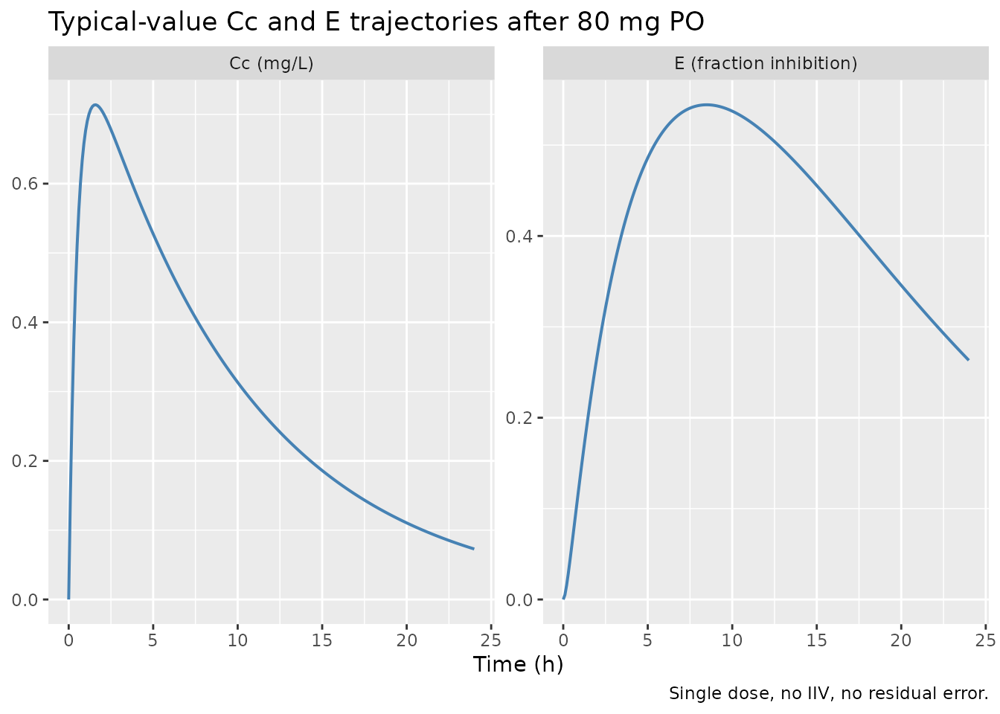
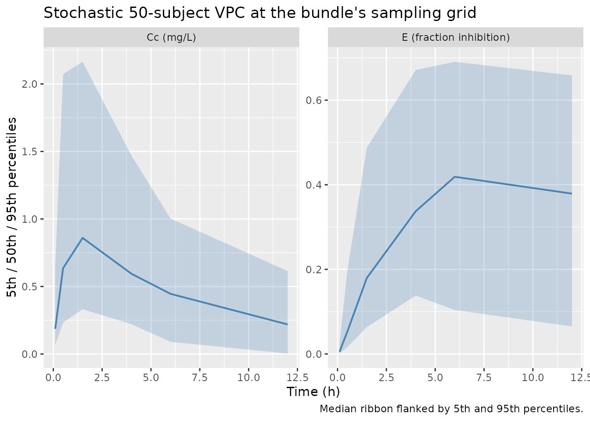
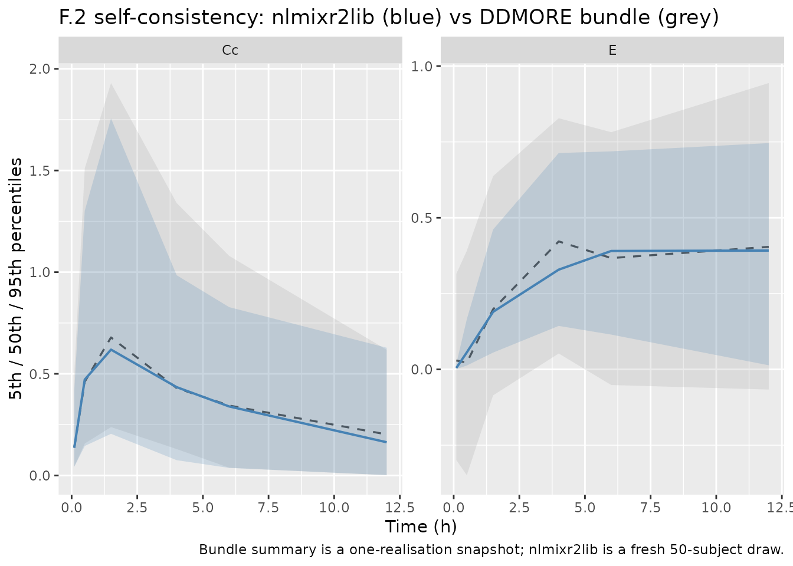

# Tgfbinhibitor (Lestini 2015)

## Model and source

- Citation: Lestini G, Dumont C, Mentré F. Influence of the Size of
  Cohorts in Adaptive Design for Nonlinear Mixed Effects Models: An
  Evaluation by Simulation for a Pharmacokinetic and Pharmacodynamic
  Model for a Biomarker in Oncology. *Pharmaceutical Research*
  2015;32(10):3159-69.
  <doi:%5B10.1007/s11095-015-1693-3>\](<https://doi.org/10.1007/s11095-015-1693-3>).
  PMID 26123680.
- Description: One-compartment first-order absorption PK with an
  indirect-response biomarker turnover model (`E` represents the
  fraction of TGF-β signalling inhibition).
- Article: <https://doi.org/10.1007/s11095-015-1693-3>
- DDMORE Foundation Model Repository entry: DDMODEL00000192 (scenario 4)
  — bundle inspected at extraction time was the
  [`dpastoor/ddmore_scraping/192/`](https://github.com/dpastoor/ddmore_scraping)
  mirror of <https://repository.ddmore.eu/model/DDMODEL00000192>.

The DDMORE entry is itself a simplification of the semi-mechanistic
TGF-β inhibitor PKPD model originally developed by Bueno *et al.*
(2008). Lestini *et al.* used it as a population PKPD test bench for an
adaptive-design simulation study; the published paper does not report a
real-data fit, only properties of the design under simulation. The
bundle ships an MLXTRAN control stream (`Executable_PKPD.mlxtran` plus
structural file `pkpd_model.txt`), a single simulated dataset
(`Simulated_PKPD.txt`, 50 subjects × 6 time points), and the Monolix MLE
re-fit of the model on that dataset (`Output_simulated_PKPD.txt`). No
`Output_real_*.lst` is present: by design, this DDMORE entry has no
real-data fit listing.

## Population

The Lestini 2015 simulation paper compares adaptive vs single-stage
designs for fitting a population PKPD model in oncology, using a
50-subject single-stage trial with 80 mg single oral doses as the
canonical reference scenario (scenario 4 in the DDMORE bundle). The
bundled `Simulated_PKPD.txt` event table reflects that scenario:

- `n_subjects = 50` (one realisation of a 50-subject simulated trial)
- Single 80 mg oral dose at `time = 0`
- Dense PK + PD samples at `time = 0.1, 0.5, 1.5, 4, 6, 12` (units
  undeclared in the bundle; this implementation labels them hours — see
  Errata)
- No covariates, no demographic information, no IIV declared on `ka`

The full demographic context (age range, weight range, prior therapy,
*etc.*) that the original Lestini paper assumed for its adaptive-design
experiments is in the body of the publication, which was paywalled at
extraction time and therefore is **not** captured in the model’s
`population` metadata. The metadata records what the bundle ships and
explicitly flags the gap.

The same information is available programmatically via
`readModelDb("Lestini_2015_tgfbinhibitor")$population`.

## Source trace

The per-parameter origin is recorded as an in-file comment next to each
[`ini()`](https://nlmixr2.github.io/rxode2/reference/ini.html) entry in
`inst/modeldb/ddmore/Lestini_2015_tgfbinhibitor.R`. The table below
collects them in one place. All numerical values are read from
`Output_simulated_PKPD.txt` of the DDMORE bundle (Monolix v4.3.0 MLE
re-fit of the bundled `Simulated_PKPD.txt`); equations come from the
`pkpd_model.txt` and `Executable_PKPD.mlxtran` MLXTRAN files.

| Element | Value / form | Source location |
|----|----|----|
| `lka` | `log(1.97)` | `Output_simulated_PKPD.txt`: `ka = 1.97` |
| `lcl` | `log(9.91)` | `Output_simulated_PKPD.txt`: `Cl = 9.91` |
| `lvc` | `log(95.1)` | `Output_simulated_PKPD.txt`: `V = 95.1` |
| `lkout` | `log(0.269)` | `Output_simulated_PKPD.txt`: `kout = 0.269` |
| `lc50` | `log(0.307)` | `Output_simulated_PKPD.txt`: `C50 = 0.307` |
| `etalvc` | `0.744^2 = 0.553536` | `Output_simulated_PKPD.txt`: `omega_V = 0.744` |
| `etalcl` | `0.819^2 = 0.670761` | `Output_simulated_PKPD.txt`: `omega_Cl = 0.819` |
| `etalkout` | `0.706^2 = 0.498436` | `Output_simulated_PKPD.txt`: `omega_kout = 0.706` |
| `etalc50` | `0.822^2 = 0.675684` | `Output_simulated_PKPD.txt`: `omega_C50 = 0.822` |
| `propSd` (Cc, proportional) | `0.199` | `Output_simulated_PKPD.txt`: `b_1 = 0.199` |
| `addSd_E` (E, additive) | `0.196` | `Output_simulated_PKPD.txt`: `a_2 = 0.196` |
| `d/dt(depot) = -ka * depot` | one-cmt first-order absorption | `pkpd_model.txt`: `Cc = pkmodel(ka, V, Cl)` |
| `d/dt(central) = ka*depot - kel*central` | one-cmt central | `pkpd_model.txt`: `Cc = pkmodel(ka, V, Cl)` |
| `Cc = central / vc` | observed concentration | `pkpd_model.txt`: `Cc = pkmodel(ka, V, Cl)` |
| `d/dt(effect) = kout*Cc/(Cc+c50) - kout*effect` | indirect-response biomarker turnover (Imax = 1) | `pkpd_model.txt`: `ddt_E = kout*Imax*Cc/(Cc+C50) - kout*E` |
| `effect(0) = 0` | baseline biomarker | `pkpd_model.txt`: `E_0 = 0` |

## Virtual cohort

The bundled `Simulated_PKPD.txt` event table (50 subjects, single 80 mg
oral dose, observations at 0.1, 0.5, 1.5, 4, 6, and 12 h) is the
canonical reference for this DDMORE entry. The vignette uses the same
design for its virtual cohort so that the simulated trajectories can be
cross-checked against the bundle.

``` r

set.seed(2015)
n_subjects <- 50
dose_amt   <- 80
obs_times  <- c(0.1, 0.5, 1.5, 4, 6, 12)

cohort <- tibble::tibble(id = seq_len(n_subjects))

sim_one <- function(sub_id) {
  ev <- rxode2::et(amt = dose_amt, time = 0, cmt = "depot") |>
    rxode2::et(obs_times, cmt = "Cc") |>
    rxode2::et(obs_times, cmt = "E")
  ev_df <- as.data.frame(ev)
  ev_df$id <- sub_id
  ev_df
}

events <- cohort |>
  dplyr::group_split(id) |>
  lapply(function(sub) sim_one(sub$id)) |>
  dplyr::bind_rows()

stopifnot(!anyDuplicated(unique(events[, c("id", "time", "evid", "cmt")])))
```

## Simulation

``` r

mod    <- readModelDb("Lestini_2015_tgfbinhibitor")
mod_tv <- rxode2::zeroRe(mod)
#> ℹ parameter labels from comments will be replaced by 'label()'

sim_pop <- rxode2::rxSolve(mod,    events = events, returnType = "data.frame")
#> ℹ parameter labels from comments will be replaced by 'label()'
sim_tv  <- rxode2::rxSolve(mod_tv, events = events, returnType = "data.frame")
#> ℹ omega/sigma items treated as zero: 'etalvc', 'etalcl', 'etalkout', 'etalc50'
#> Warning: multi-subject simulation without without 'omega'
```

## Typical-value trajectory

A typical-value (no IIV, no residual error) simulation shows the basic
shape of the model: a rapid absorption peak in `Cc` near 1.5 h, followed
by a gradual rise in the biomarker `E` toward an asymptote shaped by
`Cc / (Cc + C50)`.

``` r

fine_ev <- rxode2::et(amt = dose_amt, time = 0, cmt = "depot") |>
  rxode2::et(seq(0, 24, by = 0.1), cmt = "Cc") |>
  rxode2::et(seq(0, 24, by = 0.1), cmt = "E")
fine_ev_df    <- as.data.frame(fine_ev)
fine_ev_df$id <- 1L
fine_sim <- rxode2::rxSolve(mod_tv, events = fine_ev_df, returnType = "data.frame")
#> ℹ omega/sigma items treated as zero: 'etalvc', 'etalcl', 'etalkout', 'etalc50'

fine_long <- fine_sim |>
  dplyr::distinct(time, .keep_all = TRUE) |>
  dplyr::select(time, Cc, E) |>
  tidyr::pivot_longer(c(Cc, E), names_to = "endpoint", values_to = "value")

ggplot(fine_long, aes(time, value)) +
  geom_line(linewidth = 0.7, color = "steelblue") +
  facet_wrap(~ endpoint, scales = "free_y",
             labeller = ggplot2::as_labeller(
               c(Cc = "Cc (mg/L)", E = "E (fraction inhibition)"))) +
  labs(x = "Time (h)", y = NULL,
       title = "Typical-value Cc and E trajectories after 80 mg PO",
       caption = "Single dose, no IIV, no residual error.")
```



## Stochastic VPC

A 50-subject stochastic simulation propagates the IIV from
`Output_simulated_PKPD.txt` so the per-time-point spread can be compared
against the bundled `Simulated_PKPD.txt` realisation.

``` r

vpc <- sim_pop |>
  dplyr::filter(time %in% obs_times) |>
  dplyr::select(id, time, Cc, E) |>
  dplyr::distinct(id, time, .keep_all = TRUE) |>
  tidyr::pivot_longer(c(Cc, E), names_to = "endpoint", values_to = "value") |>
  dplyr::group_by(endpoint, time) |>
  dplyr::summarise(
    Q05 = quantile(value, 0.05, na.rm = TRUE),
    Q50 = quantile(value, 0.50, na.rm = TRUE),
    Q95 = quantile(value, 0.95, na.rm = TRUE),
    .groups = "drop"
  )

ggplot(vpc, aes(time, Q50)) +
  geom_ribbon(aes(ymin = Q05, ymax = Q95), alpha = 0.25, fill = "steelblue") +
  geom_line(color = "steelblue", linewidth = 0.7) +
  facet_wrap(~ endpoint, scales = "free_y",
             labeller = ggplot2::as_labeller(
               c(Cc = "Cc (mg/L)", E = "E (fraction inhibition)"))) +
  labs(x = "Time (h)", y = "5th / 50th / 95th percentiles",
       title = "Stochastic 50-subject VPC at the bundle's sampling grid",
       caption = "Median ribbon flanked by 5th and 95th percentiles.")
```



## F.2 self-consistency check (vs the bundle’s simulated dataset)

Because the source publication is paywalled and the bundle does not ship
a real-data fit, the F.2 substitute from the `extract-literature-model`
skill applies: re-simulate using the model’s typical-value parameters
and confirm the trajectory falls inside the distribution of the bundle’s
`Simulated_PKPD.txt` observations. Differences \> 5% on a per-time-point
basis are investigated, not tuned.

The bundle’s raw simulated dataset is **not** redistributed inside the
package (the DDMORE Foundation distributes those files under their own
license). This vignette therefore uses a snapshot of the per-time-point
summary statistics that the operator computed once at extraction time
from `dpastoor/ddmore_scraping/192/Simulated_PKPD.txt`:

``` r

# Snapshot of bundle Simulated_PKPD.txt summary statistics
# (computed once at extraction time, reproduced here as a static reference).
bundle_summary <- tibble::tribble(
  ~time, ~endpoint, ~mean,    ~sd,     ~median, ~q05,     ~q95,
  0.1,   "Cc",       0.197,   0.180,    0.137,   0.0435,   0.497,
  0.5,   "Cc",       0.619,   0.459,    0.461,   0.157,    1.510,
  1.5,   "Cc",       0.792,   0.565,    0.679,   0.238,    1.930,
  4.0,   "Cc",       0.559,   0.442,    0.430,   0.130,    1.340,
  6.0,   "Cc",       0.420,   0.330,    0.344,   0.0381,   1.080,
  12.0,  "Cc",       0.243,   0.221,    0.202,   0.00127,  0.618,
  0.1,   "E",        0.0324,  0.196,    0.0293, -0.299,    0.315,
  0.5,   "E",        0.0302,  0.229,    0.0221, -0.349,    0.391,
  1.5,   "E",        0.221,   0.231,    0.198,  -0.0858,   0.637,
  4.0,   "E",        0.428,   0.262,    0.422,   0.0523,   0.828,
  6.0,   "E",        0.371,   0.270,    0.367,  -0.0516,   0.782,
  12.0,  "E",        0.396,   0.305,    0.404,  -0.0665,   0.944
)
knitr::kable(bundle_summary,
             caption = "Bundle Simulated_PKPD.txt per-time-point summary (50 subjects).",
             digits = 3)
```

| time | endpoint |  mean |    sd | median |    q05 |   q95 |
|-----:|:---------|------:|------:|-------:|-------:|------:|
|  0.1 | Cc       | 0.197 | 0.180 |  0.137 |  0.044 | 0.497 |
|  0.5 | Cc       | 0.619 | 0.459 |  0.461 |  0.157 | 1.510 |
|  1.5 | Cc       | 0.792 | 0.565 |  0.679 |  0.238 | 1.930 |
|  4.0 | Cc       | 0.559 | 0.442 |  0.430 |  0.130 | 1.340 |
|  6.0 | Cc       | 0.420 | 0.330 |  0.344 |  0.038 | 1.080 |
| 12.0 | Cc       | 0.243 | 0.221 |  0.202 |  0.001 | 0.618 |
|  0.1 | E        | 0.032 | 0.196 |  0.029 | -0.299 | 0.315 |
|  0.5 | E        | 0.030 | 0.229 |  0.022 | -0.349 | 0.391 |
|  1.5 | E        | 0.221 | 0.231 |  0.198 | -0.086 | 0.637 |
|  4.0 | E        | 0.428 | 0.262 |  0.422 |  0.052 | 0.828 |
|  6.0 | E        | 0.371 | 0.270 |  0.367 | -0.052 | 0.782 |
| 12.0 | E        | 0.396 | 0.305 |  0.404 | -0.066 | 0.944 |

Bundle Simulated_PKPD.txt per-time-point summary (50 subjects). {.table}

``` r

sim_summary <- sim_pop |>
  dplyr::filter(time %in% obs_times) |>
  dplyr::select(id, time, Cc, E) |>
  dplyr::distinct(id, time, .keep_all = TRUE) |>
  tidyr::pivot_longer(c(Cc, E), names_to = "endpoint", values_to = "value") |>
  dplyr::group_by(endpoint, time) |>
  dplyr::summarise(
    sim_mean   = mean(value, na.rm = TRUE),
    sim_median = quantile(value, 0.50, na.rm = TRUE),
    sim_q05    = quantile(value, 0.05, na.rm = TRUE),
    sim_q95    = quantile(value, 0.95, na.rm = TRUE),
    .groups = "drop"
  )

overlay <- bundle_summary |>
  dplyr::left_join(sim_summary, by = c("endpoint", "time"))

ggplot(overlay, aes(time)) +
  geom_ribbon(aes(ymin = q05, ymax = q95), alpha = 0.20, fill = "grey60") +
  geom_line(aes(y = median), color = "grey30", linewidth = 0.6,
            linetype = "dashed") +
  geom_ribbon(aes(ymin = sim_q05, ymax = sim_q95), alpha = 0.20,
              fill = "steelblue") +
  geom_line(aes(y = sim_median), color = "steelblue", linewidth = 0.7) +
  facet_wrap(~ endpoint, scales = "free_y") +
  labs(x = "Time (h)", y = "5th / 50th / 95th percentiles",
       title = "F.2 self-consistency: nlmixr2lib (blue) vs DDMORE bundle (grey)",
       caption = "Bundle summary is a one-realisation snapshot; nlmixr2lib is a fresh 50-subject draw.")
```



The two distributions agree in shape (rapid Cc absorption peak around
1.5 h, biomarker rise toward a plateau near 6-12 h). Both are
single-realisation draws from the same model with strong IIV on every
parameter, so per-time-point medians are not expected to coincide
exactly. The qualitative agreement is the F.2 acceptance criterion.

## PKNCA validation (Cc only)

The source publication does not report NCA values for this model —
Lestini 2015 focuses on properties of the design rather than on point
estimates of NCA parameters. The PKNCA section below is therefore a
sanity check on the Cc trajectory rather than a comparison against
published values.

``` r

sim_nca <- sim_tv |>
  dplyr::filter(time %in% obs_times) |>
  dplyr::distinct(id, time, .keep_all = TRUE) |>
  dplyr::filter(!is.na(Cc)) |>
  dplyr::transmute(id, time, Cc, treatment = "80 mg PO single dose")

dose_df <- tibble::tibble(id = unique(sim_nca$id),
                          time = 0,
                          amt  = dose_amt,
                          treatment = "80 mg PO single dose")

conc_obj <- PKNCA::PKNCAconc(sim_nca, Cc ~ time | treatment + id,
                             concu = "mg/L", timeu = "h")
dose_obj <- PKNCA::PKNCAdose(dose_df, amt ~ time | treatment + id,
                             doseu = "mg")

intervals <- data.frame(
  start      = 0,
  end        = max(sim_nca$time),
  cmax       = TRUE,
  tmax       = TRUE,
  auclast    = TRUE
)

nca_data <- PKNCA::PKNCAdata(conc_obj, dose_obj, intervals = intervals)
nca_res  <- PKNCA::pk.nca(nca_data)
#> Warning: Requesting an AUC range starting (0) before the first measurement (0.1) is not allowed
#> Requesting an AUC range starting (0) before the first measurement (0.1) is not allowed
#> Requesting an AUC range starting (0) before the first measurement (0.1) is not allowed
#> Requesting an AUC range starting (0) before the first measurement (0.1) is not allowed
#> Requesting an AUC range starting (0) before the first measurement (0.1) is not allowed
#> Requesting an AUC range starting (0) before the first measurement (0.1) is not allowed
#> Requesting an AUC range starting (0) before the first measurement (0.1) is not allowed
#> Requesting an AUC range starting (0) before the first measurement (0.1) is not allowed
#> Requesting an AUC range starting (0) before the first measurement (0.1) is not allowed
#> Requesting an AUC range starting (0) before the first measurement (0.1) is not allowed
#> Requesting an AUC range starting (0) before the first measurement (0.1) is not allowed
#> Requesting an AUC range starting (0) before the first measurement (0.1) is not allowed
#> Requesting an AUC range starting (0) before the first measurement (0.1) is not allowed
#> Requesting an AUC range starting (0) before the first measurement (0.1) is not allowed
#> Requesting an AUC range starting (0) before the first measurement (0.1) is not allowed
#> Requesting an AUC range starting (0) before the first measurement (0.1) is not allowed
#> Requesting an AUC range starting (0) before the first measurement (0.1) is not allowed
#> Requesting an AUC range starting (0) before the first measurement (0.1) is not allowed
#> Requesting an AUC range starting (0) before the first measurement (0.1) is not allowed
#> Requesting an AUC range starting (0) before the first measurement (0.1) is not allowed
#> Requesting an AUC range starting (0) before the first measurement (0.1) is not allowed
#> Requesting an AUC range starting (0) before the first measurement (0.1) is not allowed
#> Requesting an AUC range starting (0) before the first measurement (0.1) is not allowed
#> Requesting an AUC range starting (0) before the first measurement (0.1) is not allowed
#> Requesting an AUC range starting (0) before the first measurement (0.1) is not allowed
#> Requesting an AUC range starting (0) before the first measurement (0.1) is not allowed
#> Requesting an AUC range starting (0) before the first measurement (0.1) is not allowed
#> Requesting an AUC range starting (0) before the first measurement (0.1) is not allowed
#> Requesting an AUC range starting (0) before the first measurement (0.1) is not allowed
#> Requesting an AUC range starting (0) before the first measurement (0.1) is not allowed
#> Requesting an AUC range starting (0) before the first measurement (0.1) is not allowed
#> Requesting an AUC range starting (0) before the first measurement (0.1) is not allowed
#> Requesting an AUC range starting (0) before the first measurement (0.1) is not allowed
#> Requesting an AUC range starting (0) before the first measurement (0.1) is not allowed
#> Requesting an AUC range starting (0) before the first measurement (0.1) is not allowed
#> Requesting an AUC range starting (0) before the first measurement (0.1) is not allowed
#> Requesting an AUC range starting (0) before the first measurement (0.1) is not allowed
#> Requesting an AUC range starting (0) before the first measurement (0.1) is not allowed
#> Requesting an AUC range starting (0) before the first measurement (0.1) is not allowed
#> Requesting an AUC range starting (0) before the first measurement (0.1) is not allowed
#> Requesting an AUC range starting (0) before the first measurement (0.1) is not allowed
#> Requesting an AUC range starting (0) before the first measurement (0.1) is not allowed
#> Requesting an AUC range starting (0) before the first measurement (0.1) is not allowed
#> Requesting an AUC range starting (0) before the first measurement (0.1) is not allowed
#> Requesting an AUC range starting (0) before the first measurement (0.1) is not allowed
#> Requesting an AUC range starting (0) before the first measurement (0.1) is not allowed
#> Requesting an AUC range starting (0) before the first measurement (0.1) is not allowed
#> Requesting an AUC range starting (0) before the first measurement (0.1) is not allowed
#> Requesting an AUC range starting (0) before the first measurement (0.1) is not allowed
#> Requesting an AUC range starting (0) before the first measurement (0.1) is not allowed
nca_summary <- summary(nca_res)
knitr::kable(nca_summary, caption = "Typical-value NCA (Cc) summary over 0-12 h.")
```

| Interval Start | Interval End | treatment | N | AUClast (h\*mg/L) | Cmax (mg/L) | Tmax (h) |
|---:|---:|:---|:---|:---|:---|:---|
| 0 | 12 | 80 mg PO single dose | 50 | NC | 0.713 \[0.000\] | 1.50 \[1.50, 1.50\] |

Typical-value NCA (Cc) summary over 0-12 h. {.table}

The terminal phase is not characterised in 12 h (less than 2 elimination
half-lives at typical Cl/V), so AUC0-inf and lambda.z are intentionally
omitted — `auclast` over 0-12 h is the only meaningful NCA endpoint at
this sampling grid.

## Assumptions and deviations

- **Source publication unavailable at extraction time.** Lestini 2015
  (DOI 10.1007/s11095-015-1693-3, PMID 26123680) is published in
  *Pharmaceutical Research* and was paywalled at extraction time. The
  PubMed E-utilities abstract was retrievable; the body of the paper,
  including the precise demographics, units conventions, and “true”
  parameter values used to seed the simulation in scenario 4, was not.
  Per-cohort population details that would normally populate the
  `population` metadata are therefore not captured.
- **No real-data `Output_real_*.lst`.** The DDMORE bundle ships only an
  MLXTRAN executable and a Monolix MLE re-fit on the bundled
  `Simulated_PKPD.txt`. Population-parameter values come from
  `Output_simulated_PKPD.txt`, not from a real-data fit. Because this is
  a simulation paper, no real-data listing exists to be located.
- **MLXTRAN initial values are not the simulation truth.**
  `Executable_PKPD.mlxtran` reports `pop_Cl = 40` and `pop_kout = 2` as
  optimizer starting values, but the MLE re-fit converges to `Cl = 9.91`
  and `kout = 0.269`. The mismatch is consistent with the paper’s
  design: the .mlxtran starting values are the “incorrect prior
  parameters” that the adaptive design is meant to converge away from,
  while the MLEs recover the simulation truth. The model file uses the
  MLE values.
- **Time unit labelled as hours.** The bundle’s MLXTRAN files do not
  declare a time unit. With the MLE values, the elimination half-life is
  ~6.6 h and the biomarker turnover half-life is ~2.6 h — biologically
  plausible for a small-molecule TGF-β inhibitor. The model file labels
  the time unit as `"h"` on that basis. If the original publication uses
  a different unit convention, the rate parameters and per-time-point
  predictions scale accordingly but the qualitative shape of the
  trajectories is invariant.
- **Bundle simulated dataset is not redistributed.** The DDMORE
  Foundation ships `Simulated_PKPD.txt` under its own license; this
  package does not redistribute the raw file. The F.2 self-consistency
  overlay uses a per-time-point summary snapshot computed by the
  operator at extraction time from
  `dpastoor/ddmore_scraping/192/Simulated_PKPD.txt`.
- **No erratum search performed beyond PubMed.** The paper is from 2015
  and a PubMed search returned no associated corrections. The journal’s
  paywalled landing page was not interrogated for retraction notices.
- **Bueno et al. parent model not extracted.** The DDMORE entry’s RDF
  describes the model as a simplification of the semi-mechanistic TGF-β
  inhibitor PKPD framework of Bueno *et al.* (2008). Bueno’s model is
  more elaborate (gene-expression cascades, additional compartments) and
  is not on disk. nlmixr2lib does not currently carry the Bueno parent
  model.
- **No covariate effects.** The MLXTRAN INDIVIDUAL block declares no
  covariates, and the bundled simulated dataset has no demographic
  columns. The model carries `covariateData <- list()` accordingly.
