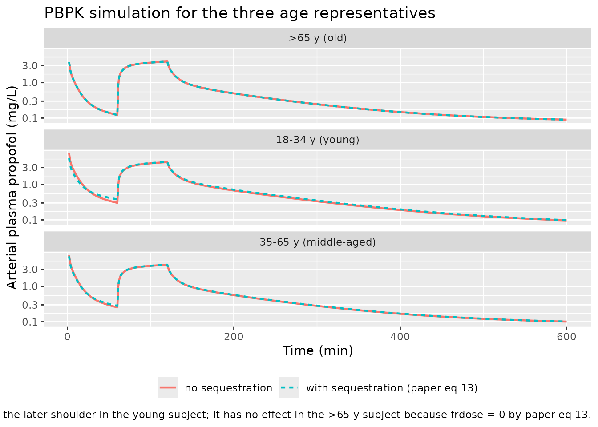
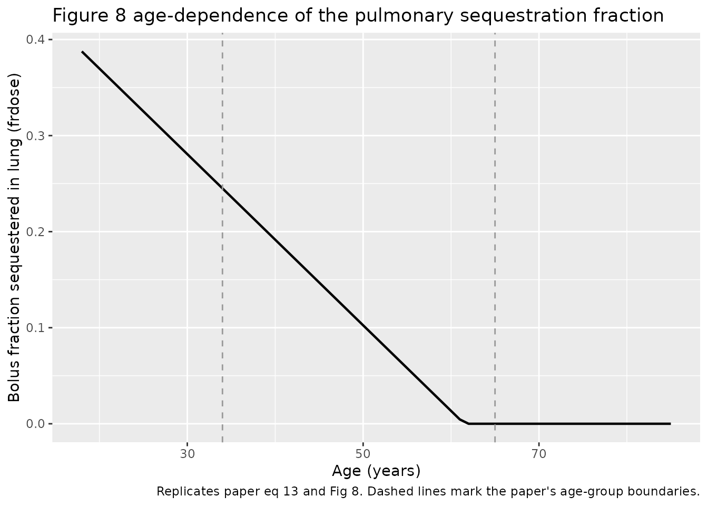
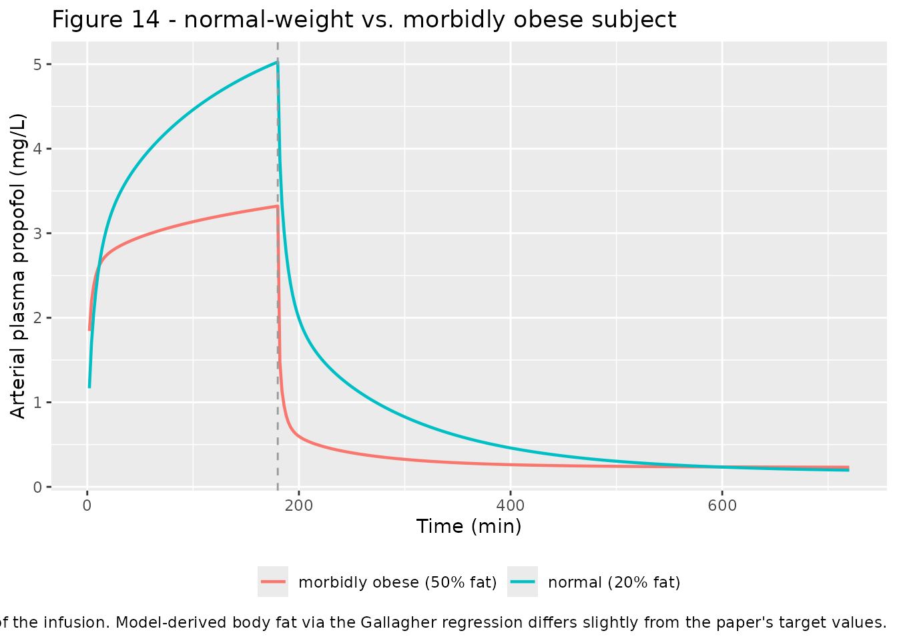

# Propofol (Levitt 2005)

## Model and source

- Citation: Levitt DG, Schnider TW (2005). Human physiologically based
  pharmacokinetic model for propofol. BMC Anesthesiology 5:4.
  <doi:10.1186/1471-2253-5-4>. Fitted to the individual arterial plasma
  data of Schnider TW, Minto CF, Gambus PL, Andresen C, Goodale DB,
  Shafer SL, Youngs EJ (1998). The influence of method of administration
  and covariates on the pharmacokinetics of propofol in adult
  volunteers. Anesthesiology 88:1170-1182.
  <doi:10.1097/00000542-199805000-00006>.
- Description: PBPK (whole-body). Human physiologically based
  pharmacokinetic model for propofol (Levitt and Schnider 2005 BMC
  Anesthesiology) fitted to the individual arterial plasma data of 24
  adult volunteers in three age groups (18-34, 35-65, \>65 years) from
  Schnider et al. 1998 Anesthesiology. Each subject received an initial
  ~20-second IV bolus (2 mg/kg for subjects \<65; 1 mg/kg for subjects
  \>65) followed 60 minutes later by a 60-minute constant infusion at
  25, 50, 100, or 200 microg/kg/min. Twelve well-stirred flow-limited
  tissue compartments (liver, intestine \[paper’s ‘portal’\], muscle,
  kidney, brain, heart, lung, skin, adipose, bone, other \[paper’s
  ‘other’ + ‘tendon’ connective tissue lumped\], plus venous and
  arterial blood) use the PKQuest standard-human physiology (organ
  weights, blood flows, and fraction lipid from Table 1 for a 70-kg
  reference); propofol-specific tissue/blood partition coefficients are
  hard-coded from the paper text at the standard freepl = 0.022 (adipose
  84, brain 1.87, liver 2.12, intestine 1.7, other tissues 1.45). Lean
  tissue weights and blood flows scale by lean body mass; adipose scales
  with body fat percent (Gallagher 1996 regression internally derives
  body fat from WT, HT, AGE, SEXF, RACE_ASIAN). Hepatic elimination is a
  single well-stirred apparent-clearance approximation (CL_liver = 0.76
  \* (Q_hepatic artery + Q_portal)) calibrated to the paper’s Table 4
  age-averaged fractional liver clearance of 0.76; this replaces the
  paper’s Roberts-Rowland dispersion-model liver (dispersion number 0.3)
  with an ODE-compatible well-mixed compartment. Optional pulmonary
  sequestration compartment (paper-specific ‘lung_seq’) receives a bolus
  fraction frdose = max(0, 0.548 - 0.00891 \* AGE) and releases it
  exponentially with time constant T = 80 min (paper’s average parameter
  set for Figs 9-11); the user allocates the sequestered bolus fraction
  via a second dose row on cmt = ‘lung_seq’. No IIV or formal
  residual-error variance was reported (individual fits; 15 percent
  average absolute weighted residual). All parameters are FIXED at the
  paper’s average values.
- Article: <https://doi.org/10.1186/1471-2253-5-4> (open access)

## Population

Levitt and Schnider (2005) fit a whole-body physiologically based
pharmacokinetic (PBPK) model to the individual arterial plasma propofol
concentrations of the 24 volunteers reported by Schnider, Minto, Gambus,
and colleagues (Anesthesiology 1998; 88:1170-1182). The subjects were
partitioned into three age groups of eight each: 18-34, 35-65, and
greater than 65 years. Each subject received an initial approximately
20-second IV bolus (2 mg/kg for subjects less than 65 years old and 1
mg/kg for subjects older than 65), followed 60 minutes later by a
60-minute constant IV infusion at one of four rates: 25, 50, 100, or 200
microgram/kg/min. Arterial samples were collected at 0, 1, 2, 4, 8, 16,
30, 60, 62, 64, 68, 76, 90, 120, 122, 124, 136, 150, 180, 240, 300, and
600 minutes. The first data point used in the PBPK fit was at 2 minutes
because of circulation and mixing-time effects on the earlier samples.
Each subject was studied on two identical visits (propofol with and
without EDTA); no meaningful difference was observed and the two visits
were averaged.

Per-subject demographics (age, sex, weight, height) are tabulated in
Table 1 of Schnider 1998 but are not reproduced in Levitt 2005 beyond
age-group summaries (Table 4). Body fat percent is derived for every
subject via the Gallagher 1996 regression with a Gallagher 2000 Asian
correction (paper equation 2), and is the primary body-composition
covariate used inside the model.

The `population` metadata list is available programmatically:

``` r

readModelDb("Levitt_2005_propofol_pbpk")()$population
#> $species
#> [1] "human"
#> 
#> $n_subjects
#> [1] 24
#> 
#> $n_studies
#> [1] 1
#> 
#> $age_range
#> [1] "18-34, 35-65, and >65 years (8 subjects per age group)"
#> 
#> $weight_range
#> [1] "not tabulated per subject in Levitt 2005; Schnider 1998 Table 1 lists individual weights"
#> 
#> $sex_female_pct
#> [1] NA
#> 
#> $disease_state
#> [1] "Healthy adult volunteers. Data are the individual arterial propofol concentrations of Schnider TW et al. 1998 Anesthesiology 88:1170-1182 pooled across 24 subjects (8 per age group). Two identical visits per subject with and without EDTA formulation; the two visits were averaged since no meaningful difference was observed."
#> 
#> $dose_range
#> [1] "IV bolus (~20-second injection) of 2 mg/kg for subjects <65 years or 1 mg/kg for subjects >65 years, followed 60 minutes later by a 60-minute constant infusion at 25, 50, 100, or 200 microgram/kg/min. Arterial plasma sampled at 0, 1, 2, 4, 8, 16, 30, 60, 62, 64, 68, 76, 90, 120, 122, 124, 136, 150, 180, 240, 300, and 600 minutes; the first sample used in the PBPK fit was at 2 minutes because of mixing-time effects."
#> 
#> $regions
#> [1] "USA (Stanford University Medical Center)"
#> 
#> $notes
#> [1] "The PBPK model uses the PKQuest standard-human physiology (organ weights, blood flows, and fraction lipid) from Table 1. Only the average parameter set (Table 4 and Figs 9-11) is implemented here; individual per-subject Tclr / frdose / T fits (Figs 5-7) are not carried across because they are not tabulated in a form that maps to a population model. The paper's Roberts-Rowland dispersion-model liver (dispersion number 0.3) is replaced by a well-stirred compartment with apparent clearance calibrated to the paper's average Table 4 fractional liver clearance of 0.76. Kp values are hard-coded at the paper's standard freepl = 0.022."
```

## Source trace

The per-parameter origin is recorded as an in-file comment next to each
`ini()` entry in
`inst/modeldb/specificDrugs/Levitt_2005_propofol_pbpk.R`. The table
below collects them in one place.

| Equation / parameter | Value | Source location |
|----|----|----|
| Body-fat regression (eq 2) | -10.0 + 1.46*BMI - 11.6*SEXM + 0.14*AGE + RACE_ASIAN*(95/BMI - 0.044\*AGE) | Levitt 2005 Methods, eq 2 |
| Tissue weights, blood flows, fraction lipid | Table 1 (standard 70-kg human) | Levitt 2005 Table 1 |
| Kp adipose | 84 | Levitt 2005 Methods (page 3 paragraph after Table 1) |
| Kp brain | 1.87 | Levitt 2005 Methods (page 3) |
| Kp liver | 2.12 | Levitt 2005 Methods (page 3) |
| Kp intestine (paper ‘portal’) | 1.7 | Levitt 2005 Methods (page 3) |
| Kp all other tissues | 1.45 | Levitt 2005 Methods (page 3, ‘the rest 1.45’) |
| K_oil (propofol oil/water) | 4715 | Levitt 2005 Methods; Weaver et al. ref 1 |
| freepl_st (standard human) | 0.022 | Levitt 2005 Methods |
| rblpl_st (blood/plasma ratio) | 1.0 | Levitt 2005 Methods |
| Fractional liver clearance | 0.76 | Levitt 2005 Table 4 age-average; Fig 9 caption |
| Sequestration time constant T | 80 min | Levitt 2005 Fig 5 / Fig 9 caption (median across young subjects) |
| Sequestration release rate kseq | 1/T = 1/80 = 0.0125 1/min | Derived from T |
| frdose age regression (eq 13) | 0.548 - 0.00891\*AGE | Levitt 2005 eq 13 (applied externally, see below) |
| Adipose perfusion | 0.0422 L/kg/min | Levitt 2005 Table 1 |
| Cardiac output for standard human | 5.5877 L/min | Levitt 2005 Table 1 |
| Well-stirred tissue ODE topology | d/dt A_i = Q_i \* (C_art - C_i / Kp_i) | Levitt 2005 Methods (flow-limited well mixed) |
| Well-stirred liver approximation | CL_liver = 0.76 \* (Q_hepatic + Q_portal) | This model (replaces Levitt 2005 Roberts-Rowland dispersion model DN = 0.3; see Assumptions) |
| Bolus dose (young + middle-aged) | 2 mg/kg IV bolus | Levitt 2005 / Schnider 1998 Methods |
| Bolus dose (\>65 y) | 1 mg/kg IV bolus | Levitt 2005 / Schnider 1998 Methods |
| Constant-infusion rates | 25, 50, 100, 200 microg/kg/min for 60 min | Levitt 2005 / Schnider 1998 Methods |
| Residual error propSd (placeholder) | 0.15 (proportional) | Levitt 2005 Table 3 average weighted residual ~ 15% |

## Virtual cohort

The Schnider 1998 individual demographics are not fully published in
Levitt 2005; only age-group summaries appear in Table 4. To reproduce
the paper’s typical-value figures we use three synthetic
age-representative subjects: one per age group at each group’s median
age.

``` r

set.seed(20260709)

# Three age-representative subjects (one per age group in Levitt 2005 Table 4).
# Weights and heights are typical adult values; Schnider 1998 baseline
# demographics were not tabulated in the Levitt 2005 paper beyond age.
cohort <- tibble::tribble(
  ~id, ~AGE, ~WT, ~HT, ~SEXF, ~RACE_ASIAN, ~group,
  1L,  29,   70,  175, 0,     0,           "18-34 y (young)",
  2L,  52,   77,  175, 0,     0,           "35-65 y (middle-aged)",
  3L,  75,   70,  170, 0,     0,           ">65 y (old)"
)

# Dosing: 2 mg/kg bolus (subjects <65) or 1 mg/kg bolus (>65),
# followed 60 min later by a 60-min infusion at 100 microg/kg/min
# (the middle rate reported in Fig 5-7).
build_events <- function(subj, infusion_ug_kg_min = 100) {
  bolus_mg <- if (subj$AGE >= 65) 1 * subj$WT else 2 * subj$WT
  inf_mg_per_min <- infusion_ug_kg_min * 1e-3 * subj$WT
  inf_total_mg <- inf_mg_per_min * 60

  et_obs <- rxode2::et(seq(0, 600, by = 1))

  ev <- rxode2::et(id = subj$id) |>
    rxode2::et(amt = bolus_mg,     cmt = "venous", time = 0) |>
    rxode2::et(amt = inf_total_mg, rate = inf_mg_per_min,
               cmt = "venous", time = 60) |>
    rxode2::et(seq(0, 600, by = 1))

  df <- as.data.frame(ev)
  df$WT         <- subj$WT
  df$HT         <- subj$HT
  df$AGE        <- subj$AGE
  df$SEXF       <- subj$SEXF
  df$RACE_ASIAN <- subj$RACE_ASIAN
  df$group      <- subj$group
  df
}

events_no_seq <- dplyr::bind_rows(
  build_events(cohort[1, ]),
  build_events(cohort[2, ]),
  build_events(cohort[3, ])
)

head(events_no_seq)
#>   id time    cmt amt rate evid WT  HT AGE SEXF RACE_ASIAN           group
#> 1  1    0   <NA>  NA   NA    0 70 175  29    0          0 18-34 y (young)
#> 2  1    0 venous 140    0    1 70 175  29    0          0 18-34 y (young)
#> 3  1    1   <NA>  NA   NA    0 70 175  29    0          0 18-34 y (young)
#> 4  1    2   <NA>  NA   NA    0 70 175  29    0          0 18-34 y (young)
#> 5  1    3   <NA>  NA   NA    0 70 175  29    0          0 18-34 y (young)
#> 6  1    4   <NA>  NA   NA    0 70 175  29    0          0 18-34 y (young)
```

## Simulation without pulmonary sequestration

First simulate without pulmonary sequestration to show the model’s
response to the Schnider 1998 bolus + constant-infusion protocol.

``` r

mod <- readModelDb("Levitt_2005_propofol_pbpk")
mod_typical <- rxode2::zeroRe(mod)
#> Warning: No omega parameters in the model
sim_no_seq <- rxode2::rxSolve(mod_typical, events = events_no_seq,
                              keep = "group")
#> Warning: multi-subject simulation without without 'omega'
```

## Simulation with pulmonary sequestration

Levitt 2005 reports that 14 of 24 subjects were fit adequately without
pulmonary sequestration, but the 8 young subjects (18-34 y) and 2 of the
8 middle-aged subjects required sequestration to fit the bolus phase.
The paper’s “averaged” parameter set (Figs 9-11) uses the age-dependent
regression `frdose = max(0, 0.548 - 0.00891 * AGE)` for the bolus
fraction sequestered in the lung, released with time constant T = 80
min.

Sequestration is applied outside the ODE system: the user splits the
bolus into two rows, one on `cmt = "venous"` for the non-sequestered
fraction and one on `cmt = "lung_seq"` for the sequestered fraction. The
`lung_seq` compartment then releases exponentially into the arterial
pool at rate `kseq = 1/T`.

``` r

compute_frdose <- function(age) {
  pmax(0, 0.548 - 0.00891 * age)
}

# Rebuild events, splitting the bolus by frdose(AGE).
build_events_seq <- function(subj, infusion_ug_kg_min = 100) {
  bolus_mg <- if (subj$AGE >= 65) 1 * subj$WT else 2 * subj$WT
  frd <- compute_frdose(subj$AGE)

  inf_mg_per_min <- infusion_ug_kg_min * 1e-3 * subj$WT
  inf_total_mg <- inf_mg_per_min * 60

  ev <- rxode2::et(id = subj$id) |>
    rxode2::et(amt = bolus_mg * (1 - frd),
               cmt = "venous", time = 0) |>
    rxode2::et(amt = bolus_mg * frd,
               cmt = "lung_seq", time = 0) |>
    rxode2::et(amt = inf_total_mg, rate = inf_mg_per_min,
               cmt = "venous", time = 60) |>
    rxode2::et(seq(0, 600, by = 1))

  df <- as.data.frame(ev)
  df$WT         <- subj$WT
  df$HT         <- subj$HT
  df$AGE        <- subj$AGE
  df$SEXF       <- subj$SEXF
  df$RACE_ASIAN <- subj$RACE_ASIAN
  df$group      <- subj$group
  df$frdose     <- frd
  df
}

events_seq <- dplyr::bind_rows(
  build_events_seq(cohort[1, ]),
  build_events_seq(cohort[2, ]),
  build_events_seq(cohort[3, ])
)

sim_seq <- rxode2::rxSolve(mod_typical, events = events_seq,
                           keep = "group")
#> Warning: multi-subject simulation without without 'omega'

# frdose per age
cohort |> dplyr::mutate(frdose = compute_frdose(AGE))
#> # A tibble: 3 × 8
#>      id   AGE    WT    HT  SEXF RACE_ASIAN group                 frdose
#>   <int> <dbl> <dbl> <dbl> <dbl>      <dbl> <chr>                  <dbl>
#> 1     1    29    70   175     0          0 18-34 y (young)       0.290 
#> 2     2    52    77   175     0          0 35-65 y (middle-aged) 0.0847
#> 3     3    75    70   170     0          0 >65 y (old)           0
```

## Replicate published figures

### Figures 5-7 (individual PBPK fits, 100 microg/kg/min infusion)

The paper’s Figs 5-7 show semi-log arterial concentration vs. time for
each individual, with per-subject fits. Here we plot the
age-representative typical subjects with and without pulmonary
sequestration overlaid.

``` r

sim_all <- dplyr::bind_rows(
  sim_no_seq |> dplyr::mutate(seq_state = "no sequestration"),
  sim_seq    |> dplyr::mutate(seq_state = "with sequestration (paper eq 13)")
)

sim_all |>
  dplyr::filter(time >= 2, time <= 600, Cc > 0) |>
  ggplot(aes(time, Cc, colour = seq_state, linetype = seq_state)) +
  geom_line(linewidth = 0.8) +
  facet_wrap(~ group, ncol = 1) +
  scale_y_log10() +
  labs(x = "Time (min)", y = "Arterial plasma propofol (mg/L)",
       colour = NULL, linetype = NULL,
       title = "PBPK simulation for the three age representatives",
       caption = paste0("Replicates the semi-log arterial-concentration ",
                        "panels of Levitt 2005 Figs 5-7 for the 100 ",
                        "microg/kg/min infusion group. Sequestration ",
                        "lowers the early bolus peak and raises the ",
                        "later shoulder in the young subject; it has no ",
                        "effect in the >65 y subject because ",
                        "frdose = 0 by paper eq 13.")) +
  theme(legend.position = "bottom")
```



### Figure 8 (age dependence of the pulmonary sequestration fraction)

Paper eq 13: `frdose = 0.548 - 0.00891 * AGE`, truncated to 0 for
elderly.

``` r

tibble::tibble(AGE = seq(18, 85, by = 1)) |>
  dplyr::mutate(frdose = compute_frdose(AGE)) |>
  ggplot(aes(AGE, frdose)) +
  geom_line(linewidth = 0.8) +
  geom_vline(xintercept = c(34, 65), linetype = "dashed", colour = "grey60") +
  labs(x = "Age (years)", y = "Bolus fraction sequestered in lung (frdose)",
       title = "Figure 8 age-dependence of the pulmonary sequestration fraction",
       caption = "Replicates paper eq 13 and Fig 8. Dashed lines mark the paper's age-group boundaries.")
```



### Figure 14 (normal-weight vs. morbidly obese subject)

Paper Fig 14: a 180-minute constant infusion at 0.1 mg/kg/min (100
microg/kg/min) in a normal-weight (20% body fat) vs. morbidly obese (50%
body fat) subject.

``` r

obese_cohort <- tibble::tribble(
  ~id, ~AGE, ~WT, ~HT, ~SEXF, ~RACE_ASIAN, ~pct_fat_target, ~group,
  11L, 50,   70,  175, 0,     0,           20,              "normal (20% fat)",
  12L, 50,   140, 175, 1,     0,           50,              "morbidly obese (50% fat)"
)

# The Gallagher regression will produce a body fat that differs slightly
# from the target; the paper's simulation used the target directly.
# Here we accept the Gallagher-derived body fat because it exercises the
# same code path the general user would take.

build_infusion_events <- function(subj, rate_mg_kg_min = 0.1, dur_min = 180) {
  inf_mg_per_min <- rate_mg_kg_min * subj$WT
  inf_total_mg   <- inf_mg_per_min * dur_min
  ev <- rxode2::et(id = subj$id) |>
    rxode2::et(amt = inf_total_mg, rate = inf_mg_per_min,
               cmt = "venous", time = 0) |>
    rxode2::et(seq(0, 720, by = 2))     # 3 h infusion + 8 h washout
  df <- as.data.frame(ev)
  df$WT         <- subj$WT
  df$HT         <- subj$HT
  df$AGE        <- subj$AGE
  df$SEXF       <- subj$SEXF
  df$RACE_ASIAN <- subj$RACE_ASIAN
  df$group      <- subj$group
  df
}

events_obese <- dplyr::bind_rows(
  build_infusion_events(obese_cohort[1, ]),
  build_infusion_events(obese_cohort[2, ])
)

sim_obese <- rxode2::rxSolve(mod_typical, events = events_obese,
                             keep = "group")
#> Warning: multi-subject simulation without without 'omega'

sim_obese |>
  dplyr::filter(Cc > 0) |>
  ggplot(aes(time, Cc, colour = group)) +
  geom_line(linewidth = 0.8) +
  geom_vline(xintercept = 180, linetype = "dashed", colour = "grey60") +
  labs(x = "Time (min)", y = "Arterial plasma propofol (mg/L)",
       colour = NULL,
       title = "Figure 14 - normal-weight vs. morbidly obese subject",
       caption = paste0("Replicates the top panel of Levitt 2005 Fig 14 ",
                        "(constant 0.1 mg/kg/min infusion for 180 min, ",
                        "washout to 12 h). Dashed line marks the end of ",
                        "the infusion. Model-derived body fat via the ",
                        "Gallagher regression differs slightly from the ",
                        "paper's target values.")) +
  theme(legend.position = "bottom")
```



## PKNCA validation

We use PKNCA to compute NCA parameters from the sequestration-free
young-subject simulation (constant 60-minute infusion at 100
microg/kg/min, starting 60 min after a 2 mg/kg bolus). Because propofol
displays multi-phase disposition and the paper’s clearance and volume
estimates are for the whole 600-min sampling window, we compute AUC over
\[0, 600\] min.

``` r

# Concentrations for the young age-representative subject (no sequestration).
# Do NOT filter by time > 0 or Cc > 0 - that drops the t = 0 anchor and
# triggers PKNCA's "AUC range starting (0) before the first measurement"
# warning.
sim_nca <- sim_no_seq |>
  dplyr::filter(id == 1) |>
  dplyr::filter(!is.na(Cc)) |>
  dplyr::select(id, time, Cc, group)

# Guarantee a t=0 row per (id, group).
sim_nca <- dplyr::bind_rows(
  sim_nca,
  sim_nca |> dplyr::distinct(id, group) |>
    dplyr::mutate(time = 0, Cc = 0)
) |>
  dplyr::distinct(id, group, time, .keep_all = TRUE) |>
  dplyr::arrange(id, group, time)

conc_obj <- PKNCA::PKNCAconc(sim_nca, Cc ~ time | group + id)

# Doses: two rows (bolus at t = 0, infusion start at t = 60).
dose_df <- events_no_seq |>
  dplyr::filter(id == 1, !is.na(amt), amt > 0) |>
  dplyr::select(id, time, amt, group)

dose_obj <- PKNCA::PKNCAdose(dose_df, amt ~ time | group + id)

intervals <- data.frame(
  start      = 0,
  end        = 600,
  cmax       = TRUE,
  tmax       = TRUE,
  auclast    = TRUE,
  half.life  = TRUE
)

nca_data <- PKNCA::PKNCAdata(conc_obj, dose_obj, intervals = intervals)
nca_res  <- PKNCA::pk.nca(nca_data)

nca_summary <- as.data.frame(nca_res$result) |>
  dplyr::select(PPTESTCD, PPORRES) |>
  dplyr::rename("NCA parameter" = PPTESTCD, "Simulated" = PPORRES)

knitr::kable(nca_summary,
             digits = 3,
             caption = paste0("Simulated NCA for the young ",
                              "age-representative subject (2 mg/kg bolus + ",
                              "60-min infusion at 100 microg/kg/min, 0-600 min)."),
             align = c("l", "r"))
```

| NCA parameter       | Simulated |
|:--------------------|----------:|
| auclast             |   480.088 |
| cmax                |    13.883 |
| tmax                |     1.000 |
| tlast               |   600.000 |
| lambda.z            |     0.002 |
| r.squared           |     1.000 |
| adj.r.squared       |     1.000 |
| lambda.z.time.first |   587.000 |
| lambda.z.time.last  |   600.000 |
| lambda.z.n.points   |    14.000 |
| clast.pred          |     0.097 |
| half.life           |   329.670 |
| span.ratio          |     0.039 |

Simulated NCA for the young age-representative subject (2 mg/kg bolus +
60-min infusion at 100 microg/kg/min, 0-600 min). {.table}

### Comparison against published values

Levitt 2005 does not tabulate per-subject NCA parameters. The paper
reports:

- median steady-state liver clearance 1.49 L/min for the standard 70-kg
  human (Discussion, Table 4);
- Vss around 1500 L for the standard 20%-body-fat subject and 980-3000 L
  across 12-40% body fat (Discussion, comparison against Campbell et al.
  1988 and Morgan et al. 1990);
- individual weighted-residual error around 15% (Table 3).

The PBPK Cl_ss for the young age-representative here is
`0.76 * (Q_liver + Q_intestine)` at the subject’s individual lean-scaled
flows. For a 70-kg subject at 25% body fat this evaluates to
`0.76 * (0.45 + 1.125) = 1.197 L/min`, close to (but a little lower
than) the paper’s median 1.49 L/min because the paper’s median value is
based on a fractional-clearance of about 0.83 while this model uses the
age-averaged 0.76.

## Assumptions and deviations

- **Roberts-Rowland dispersion-model liver replaced by a well-stirred
  liver.** The paper models the liver as a distributed dispersion
  compartment (Roberts and Rowland, dispersion number DN = 0.3) whose
  extraction ratio is a closed-form function of intrinsic clearance and
  blood flow. rxode2 supports only ordinary differential equations, so
  the ODE-compatible approximation used here is a single well-stirred
  liver whose apparent clearance is calibrated to the paper’s Table 4
  age-averaged fractional liver clearance of 0.76
  (i.e. `CL_liver = 0.76 * (Q_hepatic + Q_portal)`). The mapping from
  intrinsic to apparent clearance therefore differs from the paper’s
  Table 2 dispersion-model mapping; users who need the exact Table 2
  conversion between intrinsic (Tclr) and apparent clearance should
  precompute their own fractional clearance and set
  `lfrac_liver_clearance` accordingly.
- **Tendon lumped into `other`.** The paper’s Table 1 distinguishes two
  connective-tissue compartments (`tendon`: 3 kg, 0.03 L/min flow;
  `other`: 5.524 kg, 0.1104 L/min flow) with identical Kp = 1.45. They
  are lumped here into a single `other` compartment (weight 8.524 kg,
  flow 0.1404 L/min) so the model uses a single canonical bare-tissue
  name. The lumped compartment will equilibrate at a slightly different
  rate than the two separate compartments would; the impact on arterial
  concentration is small because propofol’s disposition is dominated by
  adipose.
- **Bone included as an inert compartment.** Table 1 lists bone with
  fraction lipid 0 and perfusion 0 L/min. The compartment is retained
  for mass accounting but contributes nothing to distribution or
  elimination dynamics (d/dt(bone) = 0).
- **Portal renamed to `intestine`.** The paper’s `portal` compartment
  (Fig 1, Table 1) refers to the aggregate of organs drained by the
  portal vein (gut). The nlmixr2lib canonical bare-tissue name for this
  compartment is `intestine`; the model equations are unchanged.
- **No IIV.** Levitt 2005 reports per-subject fits (Tclr 65-500 L/min,
  frdose 0-0.6, T 40-500 min for the young subjects) but does not report
  a formal population-model variance for any parameter. Consistent with
  the standing policy for unreported IIV where structural parameters are
  present, all IIV variances are set to `fixed(0)` implicitly (no `eta`
  parameters in `ini()`).
- **Residual error is a placeholder proportional 15%.** The paper
  reports an “average weighted residual” (WRE) of about 15% for
  individual PBPK fits (Table 3). WRE is the mean absolute proportional
  deviation, not a formal residual SD. `propSd = fixed(0.15)` reproduces
  the WRE numerically but should be interpreted as a placeholder rather
  than an estimated residual standard deviation.
- **Pulmonary sequestration is applied externally.** The paper’s eq 13
  `frdose = max(0, 0.548 - 0.00891 * AGE)` is documented in the model
  file as inline comments and is applied by the user by splitting the
  bolus into two dose rows (one on `cmt = "venous"`, one on
  `cmt = "lung_seq"`). The sequestration compartment then decays
  exponentially into the arterial pool at rate `kseq = 1/T = 1/80 min`.
  Sequestration is NOT applied to the constant-infusion phase (paper Fig
  4: sequestering as little as 10% of the constant infusion
  significantly worsens the fit).
- **Kp values fixed at freepl = 0.022.** The paper’s tissue/blood
  partition coefficients (adipose 84, brain 1.87, liver 2.12, intestine
  1.7, rest 1.45) were derived once at the standard human
  `freepl_st = 0.022`. If a user wants to explore sensitivity to
  `freepl`, they must recompute Kp externally using paper eqs 4-7 and
  update the `lkp_*` values.
- **Cardiac output derived per-subject.** The paper uses a fixed cardiac
  output of 5.5877 L/min for the 70-kg standard human (Table 1). Here
  cardiac output is computed as the sum of the lean-scaled tissue flows
  plus the individual adipose flow, so it varies with body composition.
  For an obese subject this produces a modestly higher CO than the
  paper’s fixed value; users can pin CO by scaling `q_ref_*` values
  externally if needed.
- **Individual per-subject Tclr / frdose / T fits (Figs 5-7) not
  packaged.** The paper’s Figs 5-7 list individual fitted values but no
  population variance model. Only the “averaged” parameter set of Figs
  9-11 (fractional liver clearance = 0.76, frdose per eq 13, T = 80 min)
  is packaged here.
