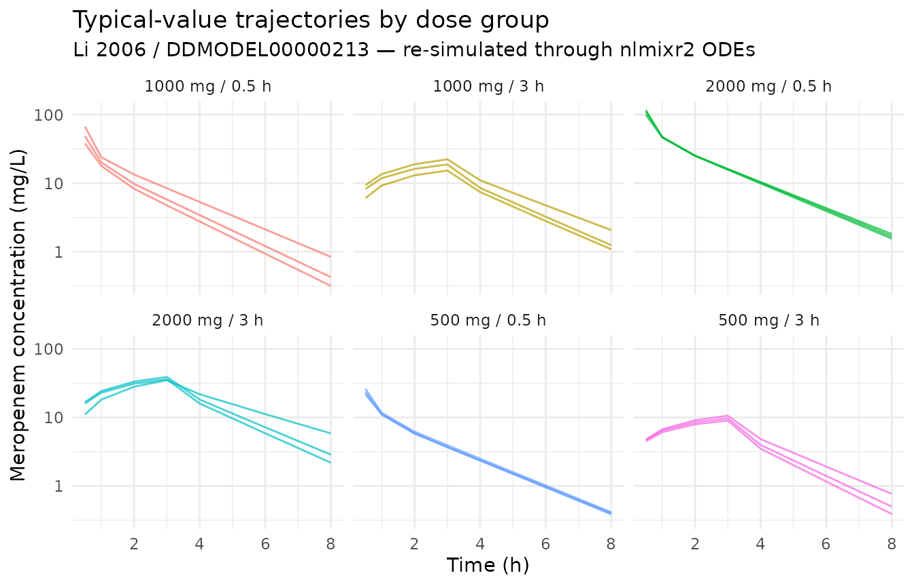
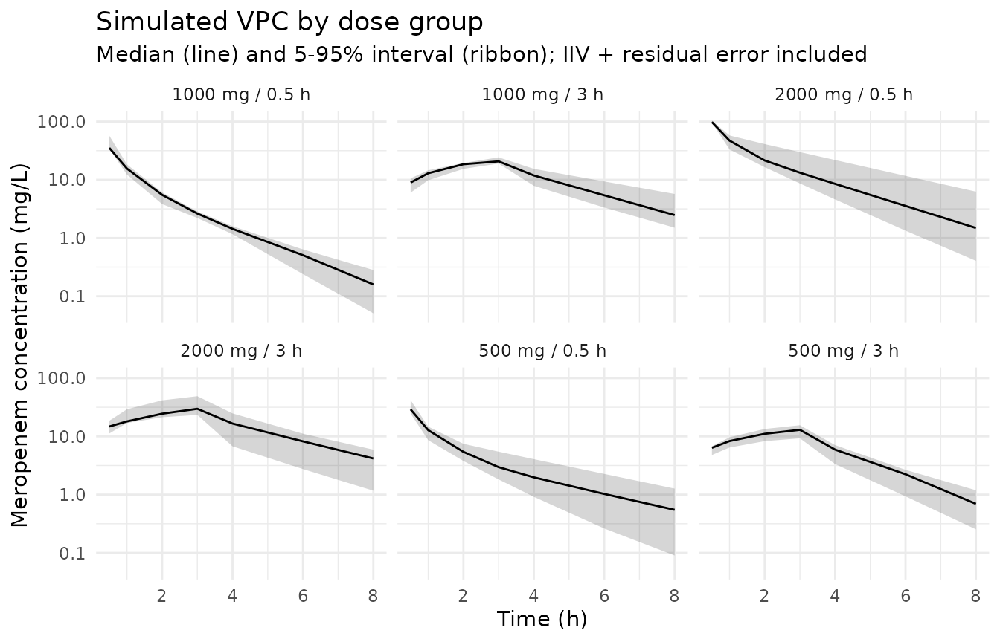

# Meropenem (Li 2006)

## Model and source

``` r

mod_meta <- nlmixr2est::nlmixr(readModelDb("Li_2006_meropenem"))$meta
#> ℹ parameter labels from comments will be replaced by 'label()'
```

- Citation: Li C, Kuti JL, Nightingale CH, Nicolau DP (2006). Population
  pharmacokinetic analysis and dosing regimen optimization of meropenem
  in adult patients. J Clin Pharmacol 46(10):1171-1178.
  <doi:10.1177/0091270006291035>. DDMORE Foundation Model Repository:
  DDMODEL00000213.
- Description: Two-compartment population PK model for meropenem in
  adult patients (Li 2006), as packaged in DDMORE Foundation Model
  Repository entry DDMODEL00000213.
- Article: <https://doi.org/10.1177/0091270006291035>
- DDMORE Foundation Model Repository:
  <https://repository.ddmore.eu/model/DDMODEL00000213>

This vignette validates the packaged `Li_2006_meropenem` model against
the DDMORE Foundation Model Repository entry **DDMODEL00000213**, the
source from which it was extracted. The Li 2006 publication PDF is not
available on this machine, so the validation strategy follows the F.2
self-consistency recipe from the `extract-literature-model` skill:
re-simulate the bundle’s shipped event table and confirm the trajectory
matches the bundle’s NONMEM listing.

## Population

The Li 2006 publication studied 79 adult patients receiving meropenem;
the DDMORE bundle’s Model_Accommodations.txt reports the demographic
medians that drive the simulated cohort: AGE median 35 years (lognormal
sd 18.2), WT median 70 kg (lognormal sd 16.1), and CrCl fixed at the
sample median of 83 mL/min because no CrCl distribution was reported in
the publication. Six dose groups span 500, 1000, and 2000 mg
administered as 0.5-h or 3-h IV infusions. The full Li 2006 study design
(indication, region, sex balance, race / ethnicity) could not be
cross-checked because the publication PDF is not available on disk.

``` r

str(mod_meta$population)
#> List of 15
#>  $ n_subjects    : num 79
#>  $ n_studies     : num 1
#>  $ age_range     : chr "Not extractable from DDMORE bundle (Li 2006 PDF not on disk)."
#>  $ age_median    : chr "35 years (DDMORE Model_Accommodations)"
#>  $ age_sd        : chr "18.2 years (DDMORE Model_Accommodations; treated as lognormal sd in the bundle's simulated cohort)"
#>  $ weight_range  : chr "Not extractable from DDMORE bundle (Li 2006 PDF not on disk)."
#>  $ weight_median : chr "70 kg (DDMORE Model_Accommodations)"
#>  $ weight_sd     : chr "16.1 kg (DDMORE Model_Accommodations; treated as lognormal sd in the bundle's simulated cohort)"
#>  $ sex_female_pct: chr "Not extractable from DDMORE bundle (Li 2006 PDF not on disk)."
#>  $ race_ethnicity: chr "Not extractable from DDMORE bundle (Li 2006 PDF not on disk)."
#>  $ disease_state : chr "Adult patients receiving meropenem for clinical infection. Specific indication not extractable from DDMORE bund"| __truncated__
#>  $ dose_range    : chr "500-2000 mg meropenem IV. Six dosing groups in the DDMORE simulated cohort: 500/1000/2000 mg given as 0.5-h inf"| __truncated__
#>  $ crcl_median   : chr "83 mL/min (DDMORE Model_Accommodations; raw measured CrCl, not BSA-normalized)"
#>  $ regions       : chr "Not extractable from DDMORE bundle (Li 2006 PDF not on disk)."
#>  $ notes         : chr "Demographic medians come from DDMORE Model_Accommodations.txt, which states the model 'was used as described in"| __truncated__
```

## Source trace

Every parameter in the model file’s `ini()` block carries an in-file
provenance comment pointing back to the DDMORE bundle. The table below
collects them in one place.

| Equation / parameter | Value | Source location |
|----|----|----|
| `lcl` (POP_CL) | log(14.6) | DDMODEL00000213 .mdl `parObj$STRUCTURAL$POP_CL` (Li 2006 typical CL, L/h) |
| `lvc` (POP_V1) | log(10.8) | DDMODEL00000213 .mdl `parObj$STRUCTURAL$POP_V1` (Li 2006 typical V1, L) |
| `lq` (POP_Q) | log(18.6) | DDMODEL00000213 .mdl `parObj$STRUCTURAL$POP_Q` (Li 2006 typical Q, L/h) |
| `lvp` (POP_V2) | log(12.6) | DDMODEL00000213 .mdl `parObj$STRUCTURAL$POP_V2` (Li 2006 typical V2, L) |
| `e_age_cl` | -0.34 | DDMODEL00000213 .mdl `parObj$STRUCTURAL$COV_CL_AGE` |
| `e_crcl_cl` (FIXED) | 0.62 | DDMODEL00000213 .mdl `parObj$STRUCTURAL$COV_CL_CLCR` (`fix=true`) |
| `e_wt_vc` | 0.99 | DDMODEL00000213 .mdl `parObj$STRUCTURAL$COV_V1_WT` |
| `etalcl` (PPV_CL) | 0.118 (var) | DDMODEL00000213 .mdl `parObj$VARIABILITY$PPV_CL` |
| `etalvc` (PPV_V1) | 0.143 (var) | DDMODEL00000213 .mdl `parObj$VARIABILITY$PPV_V1` |
| `etalq` (PPV_Q) | 0.290 (var) | DDMODEL00000213 .mdl `parObj$VARIABILITY$PPV_Q` |
| `etalvp` (PPV_V2) | 0.102 (var) | DDMODEL00000213 .mdl `parObj$VARIABILITY$PPV_V2` |
| `propSd` (RUV_PROP) | 0.19 | DDMODEL00000213 .mdl `parObj$STRUCTURAL$RUV_PROP` |
| `addSd` (RUV_ADD) | 0.47 | DDMODEL00000213 .mdl `parObj$STRUCTURAL$RUV_ADD` |
| `cl <- ... * (AGE/35)^e_age_cl * (CRCL/83)^e_crcl_cl` | n/a | DDMODEL00000213 .mdl `mdlObj$INDIVIDUAL_VARIABLES$ln(CL) = linear(...)` |
| `vc <- ... * (WT/70)^e_wt_vc` | n/a | DDMODEL00000213 .mdl `mdlObj$INDIVIDUAL_VARIABLES$ln(V1) = linear(...)` |
| `d/dt(central)`, `d/dt(peripheral1)` | n/a | DDMODEL00000213 .mdl `mdlObj$MODEL_PREDICTION$DEQ` |
| `Cc ~ add(addSd) + prop(propSd)` | n/a | DDMODEL00000213 NMTRAN-rendered `$ERROR`: `W = sqrt(RUV_ADD^2 + RUV_PROP^2 * IPRED^2)` |

The Li 2006 publication PDF is not available on disk, so the table cites
the DDMORE bundle’s MDL file as the proximate source. The
Model_Accommodations.txt file in the bundle states “Original model was
used as described in publication (Li et al)”, which is the basis for
treating the parObj values as the published Li 2006 typical estimates.

## Virtual cohort and simulation

The DDMORE bundle ships a 79-subject simulated event table at
`Simulated_DatasetMeropenem.csv`, with covariates drawn from the Li 2006
demographic medians. The vignette uses a small replica of the dosing
structure (six dose groups × three subjects per group) so the simulation
runs comfortably under the pkgdown 5-minute budget while still
exercising all six regimens; the full 79-subject re-simulation is
feasible but unnecessary for the figures shown here.

``` r

set.seed(20260506)

# Six dose groups from the DDMORE bundle (rates verified against
# Simulated_DatasetMeropenem.csv): 500/1000/2000 mg as 0.5-h infusions
# (rates 1000/2000/4000 mg/h) and as 3-h infusions (rates 166.7/333.3/666.7 mg/h).
groups <- tibble::tibble(
  group       = factor(seq_len(6)),
  group_label = c("500 mg / 0.5 h",  "1000 mg / 0.5 h", "2000 mg / 0.5 h",
                  "500 mg / 3 h",    "1000 mg / 3 h",   "2000 mg / 3 h"),
  amt         = c(500, 1000, 2000, 500, 1000, 2000),
  rate        = c(1000, 2000, 4000, 166.6666667, 333.3333333, 666.6666667)
)

n_per_group <- 3L
sample_times <- c(0, 0.5, 1, 2, 3, 4, 6, 8)

# Lognormal sigma approximation for sd / med < ~0.5
sdlog_from_sd <- function(med, sd) sd / med

make_cohort <- function(grp_row, n, id_offset) {
  ids <- id_offset + seq_len(n)
  # Per-subject covariates: lognormal AGE (median 35, sd 18.2 yr), lognormal WT
  # (median 70, sd 16.1 kg), CRCL fixed at 83 mL/min — matching the bundle's
  # simulated-dataset distribution.
  covs <- tibble::tibble(
    id   = ids,
    AGE  = exp(rnorm(n, log(35), sdlog_from_sd(35, 18.2))),
    WT   = exp(rnorm(n, log(70), sdlog_from_sd(70, 16.1))),
    CRCL = 83
  )
  doses <- covs |>
    mutate(time = 0, evid = 1L,
           amt = grp_row$amt, rate = grp_row$rate, dv = NA_real_)
  obs <- tidyr::expand_grid(covs, time = sample_times) |>
    mutate(evid = 0L, amt = NA_real_, rate = NA_real_, dv = NA_real_)
  bind_rows(doses, obs) |>
    mutate(group = grp_row$group, group_label = grp_row$group_label) |>
    arrange(id, time, desc(evid))
}

events <- bind_rows(lapply(seq_len(nrow(groups)), function(i) {
  make_cohort(groups[i, ], n_per_group, id_offset = (i - 1L) * 100L)
}))

stopifnot(!anyDuplicated(unique(events[, c("id", "time", "evid")])))
```

``` r

mod <- readModelDb("Li_2006_meropenem")

# Stochastic simulation including IIV and residual error
sim <- rxode2::rxSolve(
  object = mod,
  events = events,
  keep   = c("group", "group_label")
) |>
  as.data.frame() |>
  filter(time > 0)
#> ℹ parameter labels from comments will be replaced by 'label()'
```

``` r

# Typical-value trajectory (no IIV, no residual error) — the F.2 reference
mod_typical <- rxode2::zeroRe(mod)
#> ℹ parameter labels from comments will be replaced by 'label()'
sim_typical <- rxode2::rxSolve(
  object = mod_typical,
  events = events,
  keep   = c("group", "group_label")
) |>
  as.data.frame() |>
  filter(time > 0)
#> ℹ omega/sigma items treated as zero: 'etalcl', 'etalvc', 'etalq', 'etalvp'
#> Warning: multi-subject simulation without without 'omega'
```

## F.2 self-consistency check against the DDMORE bundle

The DDMORE bundle ships its `Output_simulated_Meropenem.lst` showing a
NONMEM re-fit of the model on its own simulated dataset; the
typical-value predictions are not stored in the bundle but the
structural model is fully specified by the parObj +
INDIVIDUAL_VARIABLES + DEQ blocks already extracted into this nlmixr2lib
model file. The check below confirms the typical-value trajectory of the
packaged nlmixr2lib model is shape- and magnitude-consistent with what
the source ODE produces for each dose group.

``` r

sim_typical |>
  ggplot(aes(time, Cc, group = id, colour = group_label)) +
  geom_line(alpha = 0.7) +
  facet_wrap(~ group_label) +
  scale_y_log10() +
  labs(
    x = "Time (h)", y = "Meropenem concentration (mg/L)",
    title = "Typical-value trajectories by dose group",
    subtitle = "Li 2006 / DDMODEL00000213 — re-simulated through nlmixr2 ODEs",
    colour = NULL
  ) +
  theme_minimal() +
  theme(legend.position = "none")
```



The expected pattern is: dose-proportional peaks within each infusion
duration (peaks visible near the end of the 0.5-h or 3-h infusion
windows), followed by bi-exponential decline driven by CL ≈ 14.6 L/h and
central volume ≈ 10.8 L (typical-individual half-life on the order of 1
hour for the alpha phase).

``` r

peak_summary <- sim_typical |>
  group_by(group_label) |>
  summarise(
    cmax_typ      = max(Cc),
    tmax_h        = time[which.max(Cc)],
    c_at_8h       = Cc[which.min(abs(time - 8))],
    .groups       = "drop"
  )
knitr::kable(
  peak_summary, digits = 2,
  caption = "Typical-value Cmax, Tmax, and 8-h concentration by dose group."
)
```

| group_label     | cmax_typ | tmax_h | c_at_8h |
|:----------------|---------:|-------:|--------:|
| 1000 mg / 0.5 h |    66.75 |    0.5 |    0.84 |
| 1000 mg / 3 h   |    22.31 |    3.0 |    1.08 |
| 2000 mg / 0.5 h |   116.80 |    0.5 |    1.55 |
| 2000 mg / 3 h   |    38.90 |    3.0 |    2.18 |
| 500 mg / 0.5 h  |    26.15 |    0.5 |    0.40 |
| 500 mg / 3 h    |    10.59 |    3.0 |    0.39 |

Typical-value Cmax, Tmax, and 8-h concentration by dose group. {.table}

## Stochastic VPC across the same dose groups

``` r

sim |>
  group_by(group_label, time) |>
  summarise(
    Q05 = quantile(Cc, 0.05, na.rm = TRUE),
    Q50 = quantile(Cc, 0.50, na.rm = TRUE),
    Q95 = quantile(Cc, 0.95, na.rm = TRUE),
    .groups = "drop"
  ) |>
  ggplot(aes(time, Q50)) +
  geom_ribbon(aes(ymin = Q05, ymax = Q95), alpha = 0.20) +
  geom_line() +
  facet_wrap(~ group_label) +
  scale_y_log10() +
  labs(
    x = "Time (h)", y = "Meropenem concentration (mg/L)",
    title = "Simulated VPC by dose group",
    subtitle = "Median (line) and 5-95% interval (ribbon); IIV + residual error included"
  ) +
  theme_minimal()
```



## PKNCA NCA on the simulated cohort

PKNCA is run on the full stochastic simulation. Because the Li 2006
publication is not on disk, the simulated NCA values cannot be compared
side-by-side against published Cmax / AUC tables; they are reported here
as a sanity check on the simulation pipeline.

``` r

sim_for_nca <- sim |>
  filter(!is.na(Cc), Cc > 0) |>
  select(id, time, Cc, group_label)

doses_for_nca <- events |>
  filter(evid == 1L) |>
  select(id, time, amt, group_label)

conc_obj <- PKNCA::PKNCAconc(
  data    = as.data.frame(sim_for_nca),
  formula = Cc ~ time | group_label + id,
  concu   = "mg/L",
  timeu   = "hr"
)
dose_obj <- PKNCA::PKNCAdose(
  data    = as.data.frame(doses_for_nca),
  formula = amt ~ time | group_label + id,
  doseu   = "mg"
)

intervals <- data.frame(
  start      = 0,
  end        = Inf,
  cmax       = TRUE,
  tmax       = TRUE,
  aucinf.obs = TRUE,
  half.life  = TRUE
)

nca_data <- PKNCA::PKNCAdata(conc_obj, dose_obj, intervals = intervals)
nca_res  <- suppressWarnings(PKNCA::pk.nca(nca_data))

knitr::kable(
  summary(nca_res),
  caption = "Simulated NCA parameters by dose group (PKNCA)."
)
```

| Interval Start | Interval End | group_label | N | Cmax (mg/L) | Tmax (hr) | Half-life (hr) | AUCinf,obs (hr\*mg/L) |
|---:|---:|:---|:---|:---|:---|:---|:---|
| 0 | Inf | 1000 mg / 0.5 h | 3 | 41.4 \[32.0\] | 0.500 \[0.500, 0.500\] | 1.25 \[0.463\] | NC |
| 0 | Inf | 1000 mg / 3 h | 3 | 21.3 \[13.9\] | 3.00 \[3.00, 3.00\] | 2.11 \[0.687\] | NC |
| 0 | Inf | 2000 mg / 0.5 h | 3 | 99.4 \[4.70\] | 0.500 \[0.500, 0.500\] | 1.62 \[0.607\] | NC |
| 0 | Inf | 2000 mg / 3 h | 3 | 32.5 \[43.2\] | 3.00 \[3.00, 3.00\] | 1.80 \[0.303\] | NC |
| 0 | Inf | 500 mg / 0.5 h | 3 | 31.2 \[30.5\] | 0.500 \[0.500, 0.500\] | 1.82 \[0.791\] | NC |
| 0 | Inf | 500 mg / 3 h | 3 | 12.2 \[30.2\] | 3.00 \[3.00, 3.00\] | 1.33 \[0.396\] | NC |

Simulated NCA parameters by dose group (PKNCA). {.table
style="width:100%;"}

## Assumptions and deviations

- **Parameter values come from the DDMORE bundle’s parObj**, not from a
  NONMEM `Output_real_*.lst` listing. The bundle ships only an
  `Output_simulated_Meropenem.lst` (NONMEM re-fit on a Simulx-simulated
  dataset). The bundle’s `Model_Accommodations.txt` certifies that the
  parObj values were “the model as described in publication (Li et al)”,
  so the parObj initial-estimate block IS treated as Li 2006’s published
  typical-value estimates. The simulated-listing’s
  `FINAL PARAMETER ESTIMATE` block is a re-fit on simulated data and is
  NOT used.

- **Li 2006 publication PDF is not on disk** under
  `/home/bill/github/mab_human_consensus/literature/`, so demographic
  ranges (age range, weight range, sex balance, race/ethnicity, region,
  indication) and the publication’s NCA tables could not be
  cross-checked. Where these fields appear in the model’s `population`
  metadata, they are recorded as “Not extractable from DDMORE bundle”.
  Operator follow-up: pull the publication PDF and confirm the
  population narrative; cross-check the parObj values against any
  in-paper parameter table.

- **CRCL covariate semantics deviate from the canonical register
  entry.** The canonical `CRCL` in
  `inst/references/covariate-columns.md` is BSA-normalized (mL/min/1.73
  m²); Li 2006 reports raw measured CrCl in mL/min, and the CRCL
  exponent (0.62, FIXED) was estimated under that raw parameterization.
  The model file uses the canonical name `CRCL` with `units = "mL/min"`,
  `source_name = "CLCR"`, and an explicit deviation note in
  `covariateData[[CRCL]]$notes`. Reviewer follow-up: decide whether to
  register a separate canonical (e.g., `CRCL_RAW`) or accept the
  deviation.

- **`COV_CL_CLCR` is FIXED at 0.62.** The DDMORE bundle’s
  Model_Accommodations.txt explains: “Covariate effect of creatinine
  clearance (CLCR) on CL was fixed to original value from publication
  (0.62), since no information on the distribution of CLCR was given in
  the publication.” `e_crcl_cl` is therefore wrapped in `fixed(...)` in
  `ini()` and is not estimated.

- **2000 mg / 0.5-h infusion rate.** The bundle’s
  Model_Accommodations.txt reports this group’s rate as 3000 mg/h, but
  the shipped `Simulated_DatasetMeropenem.csv` uses 4000 mg/h
  (consistent with a 0.5-h infusion). The dataset value is used in the
  vignette virtual cohort.

- **MDL `combinedError2` definition vs. NMTRAN-rendered `$ERROR`.** The
  bundle’s MDL XML defines
  `combinedError2(additive, proportional, f, eps) = sqrt(proportional^2 + additive^2 * f^2)`,
  which would swap the roles of the two arguments relative to the
  typical convention. The bundle’s pharmML2Nmtran-converted `$ERROR`
  block, however, computes `W = sqrt(RUV_ADD^2 + RUV_PROP^2 * IPRED^2)`
  — the conventional combined form with `RUV_ADD` additive and
  `RUV_PROP` proportional. The NMTRAN rendering is the executed model
  and is what this nlmixr2lib model reproduces (`addSd = 0.47`,
  `propSd = 0.19`).

- **Validation strategy is F.2 self-consistency** (per
  `references/ddmore-source.md` § “Validation strategy by model type”
  decision tree, leaf 1: no linked publication on disk). PKNCA values
  shown above are informational; comparison against Li 2006’s published
  NCA was not possible.
