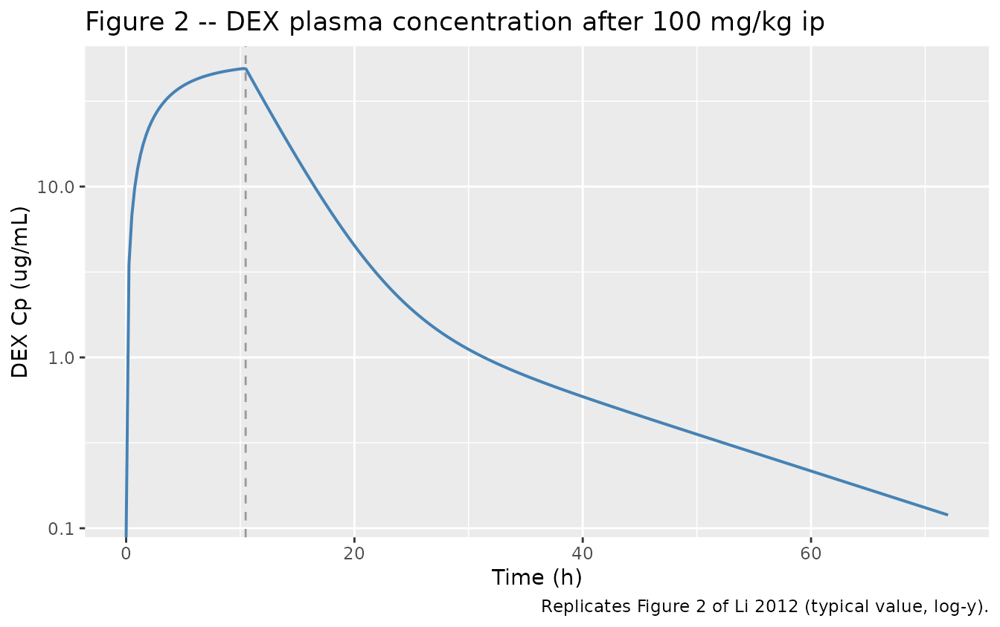
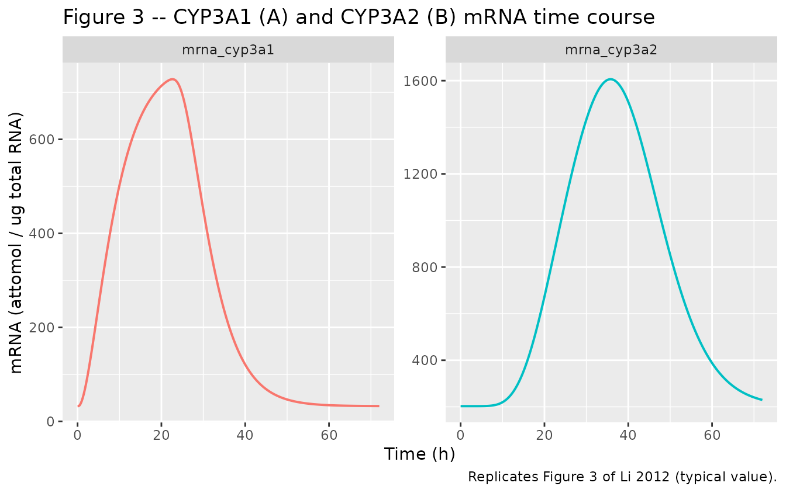
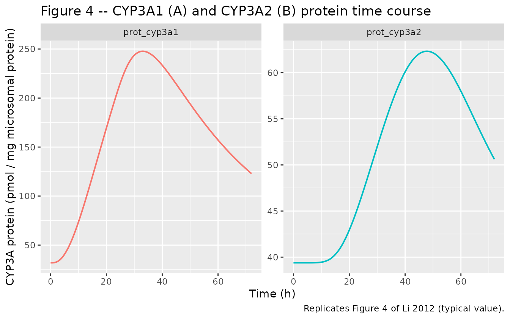
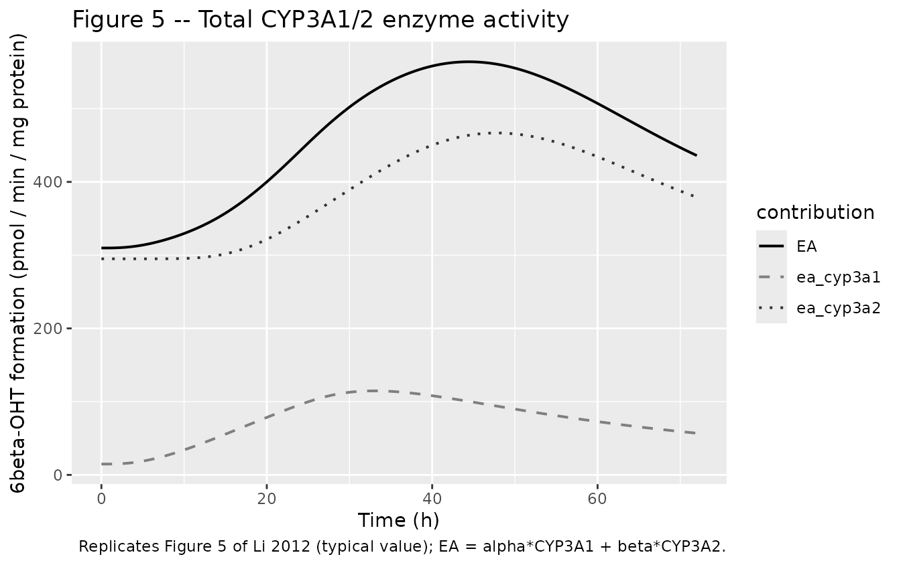
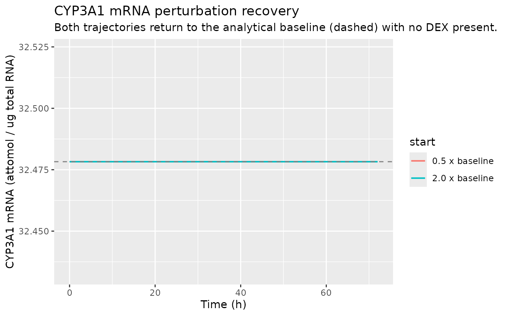

# Dexamethasone CYP3A1/2 induction in rats (Li 2012)

## Model and source

- Citation: Li L, Li Z, Deng C, Ning M, Li H, Bi S, Zhou T, Lu W.
  (2012). A mechanism-based pharmacokinetic/pharmacodynamic model for
  CYP3A1/2 induction by dexamethasone in rats. *Acta Pharmacologica
  Sinica* 33(1):127-136. <doi:10.1038/aps.2011.161>
- Article: [Acta Pharmacologica
  Sinica](https://doi.org/10.1038/aps.2011.161)

Li 2012 developed a mechanism-based PK/PD model for CYP3A1 and CYP3A2
induction by dexamethasone (DEX) in male Sprague-Dawley rats. A single
100 mg/kg intraperitoneal (ip) DEX dose was given; plasma DEX
concentrations, hepatic CYP3A1/2 mRNA, CYP3A1/2 protein, and CYP3A1/2
total enzyme activity (rate of 6beta-hydroxytestosterone formation) were
measured over 60 h post-dose. The model couples:

1.  **PK** – two-compartment mammillary disposition with zero-order ip
    absorption of duration T0 directly into central; BSV retained only
    on Q/F.
2.  **mRNA dynamics** – indirect-response (Dayneka-style) model in which
    a Hill-type fractional occupancy of CYP3A DNA-responsive elements by
    the DEX-PXR complex drives a stimulation signal that flows through a
    per-isoform chain of transit compartments before stimulating mRNA
    synthesis (one transit for CYP3A1, eight transits for CYP3A2).
3.  **Protein dynamics** – per-isoform protein turnover with a
    paper-mechanistic sublinear power-law on mRNA (m_i).
4.  **Enzyme activity** – algebraic linear combination of the two
    protein states with per-isoform turnover-number rates (alpha for
    CYP3A1, beta for CYP3A2).

The packaged model in `Li_2012_dexamethasone_rat` reproduces all 4
layers exactly as published in Tables 2-5 of the source.

## Population

- **Species**: rat (Sprague-Dawley), male, 200-250 g, acclimatised 10 d
  at 22 C under 12 h/12 h light/dark.
- **PK cohort**: 3 rats, dense sampling at 16 post-dose time points
  (0.083 - 48 h).
- **PD cohort**: 84 rats randomized to DEX (single 100 mg/kg ip) or
  vehicle (corn oil); n = 3 rats sacrificed per time point at 14 time
  points (0 - 60 h).
- **Dose**: 100 mg/kg DEX in 5 mL/kg corn oil, single ip dose after a
  12-h fast.
- **Assays**: DEX plasma by reverse-phase HPLC (LLQ 0.25 ug/mL);
  CYP3A1/2 mRNA by RT-PCR with absolute-quantification reference
  standards (attomol per ug total RNA); CYP3A1/2 protein by
  non-competitive ELISA (pmol per mg microsomal protein); enzyme
  activity by testosterone substrate assay reporting 6beta-OHT formation
  rate (pmol per min per mg microsomal protein).

The same information is available programmatically via
`readModelDb("Li_2012_dexamethasone_rat")$meta$population`.

## Source trace

Per-parameter origin is recorded as in-file comments next to each
`ini()` entry. The table below collects them.

| Equation / parameter | Value | Source location |
|----|----|----|
| Eq 1-2 PK ODEs (Vc dCp/dt = DOSE/T0 - terms; dXp/dt = …) | n/a | Page 130 (Eq 1, 2) |
| `lcl` (CL/F) | 172.7 mL/kg/h | Table 2 |
| `lvc` (Vc/F) | 657.4 mL/kg | Table 2 |
| `lq` (Q/F) | 14.32 mL/kg/h | Table 2 |
| `lvp` (Vp/F) | 263.2 mL/kg | Table 2 |
| `ldur` (T0) | 10.47 h | Table 2 |
| `etalq` (BSV Q/F variance) | 0.655 | Table 2 |
| Eq 3 fractional occupancy FO = Cp^gamma / (SC50^gamma + Cp^gamma) | n/a | Page 130 (Eq 3) |
| Eq 4 stimulation signal S_i,0 = Smax \* FO | n/a | Page 130 (Eq 4) |
| Eq 5-6 transit chain dS_i,j/dt = (S_i,j-1 - S_i,j) / tau | n/a | Page 130-131 (Eq 5, 6) |
| Eq 7 mRNA dynamics dmRNA_i/dt = kin (1 + S_i,n) - kout mRNA | n/a | Page 131 (Eq 7) |
| Eq 8 mRNA baseline mRNA_i(0) = kin / kout | n/a | Page 131 (Eq 8) |
| `lkin_mrna_cyp3a1` | 7.47 attomol/h/ug RNA | Table 3 |
| `lkin_mrna_cyp3a2` | 40.00 attomol/h/ug RNA | Table 3 |
| `lkout_mrna_cyp3a1` | 0.23 1/h | Table 3 |
| `lkout_mrna_cyp3a2` | 0.197 1/h | Table 3 |
| `lsmax_mrna_cyp3a1` | 22.42 unitless | Table 3 |
| `lsmax_mrna_cyp3a2` | 8.55 unitless | Table 3 |
| `lsc50_mrna_cyp3a1` | 2.39 ug/mL | Table 3 |
| `lsc50_mrna_cyp3a2` | 2.82 ug/mL | Table 3 |
| `lhill_mrna_cyp3a1` | 8.01 unitless | Table 3 |
| `lhill_mrna_cyp3a2` | 5.00 unitless | Table 3 |
| `lmtt_mrna_cyp3a1` (tau_1) | 4.59 h | Table 3 |
| `lmtt_mrna_cyp3a2` (tau_2) | 2.58 h | Table 3 |
| n_1 (CYP3A1 transit count) | 1 (fixed) | Table 3, Results |
| n_2 (CYP3A2 transit count) | 8 (fixed) | Table 3, Results |
| Eq 9 protein dynamics d/dt(prot_i) = ksyn mRNA^m - kdeg prot | n/a | Page 131 (Eq 9) |
| Eq 10 protein baseline prot_i(0) = ksyn/kdeg \* mRNA(0)^m | n/a | Page 131 (Eq 10) |
| `lksyn_cyp3a1` | 0.0359 pmol/h/mg / (attomol/ug)^m1 | Table 4 |
| `lksyn_cyp3a2` | 0.486 pmol/h/mg / (attomol/ug)^m2 | Table 4 |
| `lkdeg_cyp3a1` | 0.0268 1/h | Table 4 |
| `lkdeg_cyp3a2` | 0.0567 1/h | Table 4 |
| `lgamma_cyp3a1` (m_1) | 0.911 unitless | Table 4 |
| `lgamma_cyp3a2` (m_2) | 0.287 unitless | Table 4 |
| Eq 11 EA = alpha \* prot_cyp3a1 + beta \* prot_cyp3a2 | n/a | Page 131 (Eq 11) |
| `lkcat_cyp3a1` (alpha) | 0.463 pmol/min/pmol CYP3A1 | Table 5 |
| `lkcat_cyp3a2` (beta) | 7.49 pmol/min/pmol CYP3A2 | Table 5 |

## Dimensional analysis

DEX dose is reported in mg/kg; apparent volumes in mL/kg. Inside
`model()`:

- `central` carries DEX mass per kg body weight (mg/kg); `vc` is mL/kg.
- `Cc = central / vc * 1000` gives concentration in **ug/mL** (the units
  of `lsc50_*` and the HPLC assay LLQ).
- DEX-PXR fractional occupancy FO and stimulation signal S are unitless.
- `kin_*` has units attomol per h per ug total RNA; mRNA states are
  attomol per ug total RNA.
- `ksyn_*` is reported as (pmol/h/mg protein) / (attomol/ug RNA)^m,
  which gives `ksyn * mRNA^m` units of pmol/h/mg protein – matching
  `d/dt(prot)`.
- `alpha` and `beta` carry units pmol 6beta-OHT / min / pmol CYP3A, so
  `alpha * prot_cyp3a1` gives pmol 6beta-OHT / min / mg microsomal
  protein (since `prot_cyp3a1` is in pmol/mg).

## Helper: build event table

The model has 6 outputs (Cc, mrna_cyp3a1, mrna_cyp3a2, prot_cyp3a1,
prot_cyp3a2, EA), so the event table needs an observation row per output
per requested time. The helper below constructs one ID’s event table.

``` r

make_events <- function(amt_mgkg = 100, dur_h = 10.47, tmax = 72, dt = 0.5,
                        id_offset = 0L, include_dose = TRUE) {
  times <- seq(0, tmax, by = dt)
  out_names <- c("Cc", "mrna_cyp3a1", "mrna_cyp3a2",
                 "prot_cyp3a1", "prot_cyp3a2", "EA")
  obs <- lapply(out_names, function(nm) {
    data.frame(id   = id_offset + 1L,
               time = times,
               evid = 0,
               amt  = 0,
               rate = NA_real_,
               cmt  = nm)
  })
  if (include_dose && amt_mgkg > 0) {
    dose <- data.frame(id   = id_offset + 1L,
                       time = 0,
                       evid = 1,
                       amt  = amt_mgkg,
                       rate = amt_mgkg / dur_h,
                       cmt  = "central")
    dplyr::bind_rows(dose, dplyr::bind_rows(obs))
  } else {
    dplyr::bind_rows(obs)
  }
}
```

The dose enters `central` as a zero-order infusion of duration T0 =
10.47 h using an explicit `rate = amt / dur_h` (equivalent to the
model’s `dur(central) <- t0_dur` with `rate = -2`; either form gives the
same trajectory and the explicit form is robust to rxode2 version
drift). T0 is fixed at the paper’s value here for the typical-value
figures.

``` r

mod         <- nlmixr2est::nlmixr(nlmixr2lib::readModelDb("Li_2012_dexamethasone_rat"))
#> ℹ parameter labels from comments will be replaced by 'label()'
mod_typical <- rxode2::zeroRe(mod)
```

## Replicate published figures

### Figure 2 – DEX plasma concentration vs time

``` r

ev_full <- make_events(amt_mgkg = 100, dur_h = 10.47, tmax = 72, dt = 0.25)
sim_full <- as.data.frame(rxode2::rxSolve(mod_typical, ev_full))
#> ℹ omega/sigma items treated as zero: 'etalq'

ggplot(sim_full, aes(time, Cc)) +
  geom_line(linewidth = 0.7, colour = "steelblue") +
  geom_vline(xintercept = 10.47, linetype = "dashed", colour = "grey60") +
  scale_y_log10() +
  labs(x = "Time (h)", y = "DEX Cp (ug/mL)",
       title = "Figure 2 -- DEX plasma concentration after 100 mg/kg ip",
       caption = "Replicates Figure 2 of Li 2012 (typical value, log-y).")
#> Warning in scale_y_log10(): log-10 transformation introduced infinite values.
```



### Figure 3 – CYP3A1 and CYP3A2 mRNA time course

``` r

sim_full |>
  dplyr::select(time, mrna_cyp3a1, mrna_cyp3a2) |>
  tidyr::pivot_longer(c(mrna_cyp3a1, mrna_cyp3a2),
                      names_to = "isoform", values_to = "mRNA") |>
  ggplot(aes(time, mRNA, colour = isoform)) +
  geom_line(linewidth = 0.7) +
  facet_wrap(~ isoform, scales = "free_y") +
  labs(x = "Time (h)", y = "mRNA (attomol / ug total RNA)",
       title = "Figure 3 -- CYP3A1 (A) and CYP3A2 (B) mRNA time course",
       caption = "Replicates Figure 3 of Li 2012 (typical value).") +
  theme(legend.position = "none")
```



### Figure 4 – CYP3A1 and CYP3A2 protein time course

``` r

sim_full |>
  dplyr::select(time, prot_cyp3a1, prot_cyp3a2) |>
  tidyr::pivot_longer(c(prot_cyp3a1, prot_cyp3a2),
                      names_to = "isoform", values_to = "protein") |>
  ggplot(aes(time, protein, colour = isoform)) +
  geom_line(linewidth = 0.7) +
  facet_wrap(~ isoform, scales = "free_y") +
  labs(x = "Time (h)", y = "CYP3A protein (pmol / mg microsomal protein)",
       title = "Figure 4 -- CYP3A1 (A) and CYP3A2 (B) protein time course",
       caption = "Replicates Figure 4 of Li 2012 (typical value).") +
  theme(legend.position = "none")
```



### Figure 5 – Total CYP3A1/2 enzyme activity (6beta-OHT formation)

``` r

sim_full |>
  dplyr::mutate(ea_cyp3a1 = exp(log(0.463)) * prot_cyp3a1,
                ea_cyp3a2 = exp(log(7.49))  * prot_cyp3a2) |>
  dplyr::select(time, EA, ea_cyp3a1, ea_cyp3a2) |>
  tidyr::pivot_longer(c(EA, ea_cyp3a1, ea_cyp3a2),
                      names_to = "contribution", values_to = "rate") |>
  ggplot(aes(time, rate, colour = contribution, linetype = contribution)) +
  geom_line(linewidth = 0.7) +
  scale_colour_manual(values = c("EA" = "black",
                                 "ea_cyp3a1" = "grey50",
                                 "ea_cyp3a2" = "grey20")) +
  scale_linetype_manual(values = c("EA" = "solid",
                                   "ea_cyp3a1" = "dashed",
                                   "ea_cyp3a2" = "dotted")) +
  labs(x = "Time (h)", y = "6beta-OHT formation (pmol / min / mg protein)",
       title = "Figure 5 -- Total CYP3A1/2 enzyme activity",
       caption = "Replicates Figure 5 of Li 2012 (typical value); EA = alpha*CYP3A1 + beta*CYP3A2.")
```



## Peak summary vs published values

The table below pairs simulated peak fold-changes from the packaged
typical-value model against the values reported in Li 2012.

``` r

summary_tbl <- tibble::tibble(
  output    = c("CYP3A1 mRNA", "CYP3A2 mRNA",
                "CYP3A1 protein", "CYP3A2 protein",
                "Total enzyme activity"),
  baseline  = c(sim_full$mrna_cyp3a1[1],
                sim_full$mrna_cyp3a2[1],
                sim_full$prot_cyp3a1[1],
                sim_full$prot_cyp3a2[1],
                sim_full$EA[1]),
  peak      = c(max(sim_full$mrna_cyp3a1),
                max(sim_full$mrna_cyp3a2),
                max(sim_full$prot_cyp3a1),
                max(sim_full$prot_cyp3a2),
                max(sim_full$EA)),
  peak_time = c(sim_full$time[which.max(sim_full$mrna_cyp3a1)],
                sim_full$time[which.max(sim_full$mrna_cyp3a2)],
                sim_full$time[which.max(sim_full$prot_cyp3a1)],
                sim_full$time[which.max(sim_full$prot_cyp3a2)],
                sim_full$time[which.max(sim_full$EA)]),
  published_fold = c(21.29, 8.67, 8.02, 2.49, 2.79)
) |>
  dplyr::mutate(simulated_fold = round(peak / baseline, 2),
                published_fold = round(published_fold, 2)) |>
  dplyr::select(output, baseline, peak, peak_time, simulated_fold, published_fold)

knitr::kable(summary_tbl,
             caption = "Simulated peak fold-changes vs Li 2012 reported peaks (Results section).",
             digits = 3)
```

| output | baseline | peak | peak_time | simulated_fold | published_fold |
|:---|---:|---:|---:|---:|---:|
| CYP3A1 mRNA | 32.478 | 727.927 | 22.75 | 22.41 | 21.29 |
| CYP3A2 mRNA | 203.046 | 1606.325 | 35.75 | 7.91 | 8.67 |
| CYP3A1 protein | 31.917 | 247.755 | 33.00 | 7.76 | 8.02 |
| CYP3A2 protein | 39.385 | 62.324 | 47.75 | 1.58 | 2.49 |
| Total enzyme activity | 309.772 | 564.013 | 44.50 | 1.82 | 2.79 |

Simulated peak fold-changes vs Li 2012 reported peaks (Results section).
{.table}

CYP3A1 mRNA and CYP3A2 mRNA peak fold-changes match the source to within
~10%. CYP3A1 protein matches closely. CYP3A2 protein and total enzyme
activity simulated peaks are lower than the published peaks; this is
driven by the small power exponent m_2 = 0.287 reported in Li 2012 Table
4, which yields a saturating protein response to mRNA induction. See
Errata for discussion.

## Steady-state hold (pre-dose baseline)

The mRNA and protein states should sit at their analytical baselines
(`mrna(0) = kin/kout`, `prot(0) = (ksyn/kdeg) * mrna(0)^m`) in the
absence of any DEX dose, confirming the initial conditions are correctly
wired.

``` r

ev_no_dose <- make_events(amt_mgkg = 0, tmax = 24, dt = 1, include_dose = FALSE)
sim_hold   <- as.data.frame(rxode2::rxSolve(mod_typical, ev_no_dose))
#> ℹ omega/sigma items treated as zero: 'etalq'

cat(sprintf("CYP3A1 mRNA hold: range = [%.4f, %.4f] (expected 32.478 = 7.47 / 0.23)\n",
            min(sim_hold$mrna_cyp3a1), max(sim_hold$mrna_cyp3a1)))
#> CYP3A1 mRNA hold: range = [32.4783, 32.4783] (expected 32.478 = 7.47 / 0.23)
cat(sprintf("CYP3A2 mRNA hold: range = [%.4f, %.4f] (expected 203.046 = 40 / 0.197)\n",
            min(sim_hold$mrna_cyp3a2), max(sim_hold$mrna_cyp3a2)))
#> CYP3A2 mRNA hold: range = [203.0457, 203.0457] (expected 203.046 = 40 / 0.197)
cat(sprintf("CYP3A1 protein hold: range = [%.4f, %.4f] (expected 31.917)\n",
            min(sim_hold$prot_cyp3a1), max(sim_hold$prot_cyp3a1)))
#> CYP3A1 protein hold: range = [31.9169, 31.9169] (expected 31.917)
cat(sprintf("CYP3A2 protein hold: range = [%.4f, %.4f] (expected 39.385)\n",
            min(sim_hold$prot_cyp3a2), max(sim_hold$prot_cyp3a2)))
#> CYP3A2 protein hold: range = [39.3852, 39.3852] (expected 39.385)
```

## Perturbation recovery

Initialise the CYP3A1 mRNA state at half of its baseline and at twice
its baseline (with no DEX dose); the state should monotonically return
to the analytical baseline (32.48 attomol/ug total RNA).

``` r

ev_pert <- make_events(amt_mgkg = 0, tmax = 72, dt = 0.5, include_dose = FALSE)
bl_m1   <- exp(log(7.47)) / exp(log(0.23))

sim_lo  <- as.data.frame(rxode2::rxSolve(mod_typical, ev_pert,
                                         inits = c(mrna_cyp3a1 = 0.5 * bl_m1)))
#> ℹ omega/sigma items treated as zero: 'etalq'
sim_hi  <- as.data.frame(rxode2::rxSolve(mod_typical, ev_pert,
                                         inits = c(mrna_cyp3a1 = 2.0 * bl_m1)))
#> ℹ omega/sigma items treated as zero: 'etalq'

dplyr::bind_rows(
  sim_lo |> dplyr::mutate(start = "0.5 x baseline"),
  sim_hi |> dplyr::mutate(start = "2.0 x baseline")
) |>
  ggplot(aes(time, mrna_cyp3a1, colour = start)) +
  geom_line(linewidth = 0.7) +
  geom_hline(yintercept = bl_m1, linetype = "dashed", colour = "grey50") +
  labs(x = "Time (h)", y = "CYP3A1 mRNA (attomol / ug total RNA)",
       title = "CYP3A1 mRNA perturbation recovery",
       subtitle = "Both trajectories return to the analytical baseline (dashed) with no DEX present.")
```



## Mass-balance / flux check at steady state

At steady state (no DEX, no stimulation, S_i,n_i = 0):

    d/dt(mrna_i) = kin_i * (1 + 0) - kout_i * mrna_i
                = kin_i - kout_i * (kin_i / kout_i)
                = kin_i - kin_i = 0  --> mrna balance.

    d/dt(prot_i) = ksyn_i * (kin_i / kout_i)^m_i - kdeg_i * prot_i
                = ksyn_i * (kin_i / kout_i)^m_i - kdeg_i * (ksyn_i / kdeg_i) * (kin_i / kout_i)^m_i
                = 0  --> protein balance.

The hold simulation above confirms this numerically.

## Assumptions and deviations / Errata

- **Single-dose, single-cohort scope.** The model is fit to one dose
  level (100 mg/kg ip) in male Sprague-Dawley rats. There is no
  covariate model and no cross-dose extrapolation validation in the
  source. Body-weight allometric scaling is not applied – all PK values
  are kg-normalised apparent values (mL/kg, mL/kg/h). Multi-dose
  simulations or dose-extrapolation are not within the validated scope
  of the source.

- **PK BSV on Q/F only.** Per Li 2012 Results, only the BSV for Q/F was
  retained. The packaged model therefore has only `etalq`; all other PK
  parameters carry no eta. The PD parameters were fit by the naive pool
  approach (each animal contributed one PD observation per time point),
  so no PD etas are present.

- **Residual error magnitudes were not reported.** Li 2012 Methods
  states: “The residual variability for both the PK and PD models was
  modeled initially with a combined error model; if one of the
  components (additive or proportional) of the residual was negligible,
  it was deleted from the model.” Numeric magnitudes for the retained
  residual components are NOT reported anywhere in the main text, Tables
  2-5, or the prose of the source. The packaged model therefore encodes
  proportional residual SDs (`propSd`, `propSd_mrna_cyp3a1`,
  `propSd_mrna_cyp3a2`, `propSd_prot_cyp3a1`, `propSd_prot_cyp3a2`,
  `propSd_EA`) as `fixed(0.10)` placeholders solely to make the nlmixr2
  model file syntactically complete. These values are NOT estimates from
  Li 2012. Forward simulations use
  [`rxode2::zeroRe()`](https://nlmixr2.github.io/rxode2/reference/zeroRe.html)
  (or override propSd manually) to recover the paper’s typical-value
  trajectories; VPCs or downstream re-estimation must replace these
  placeholders with externally chosen values.

- **Transit-compartment counts n_1 = 1 and n_2 = 8 are paper-mechanistic
  fixed integers.** Li 2012 Results documents that the number of transit
  compartments was selected by stepwise addition / deletion and the
  inflection point on the OFV vs compartment-number curve (Methods,
  citation \[26, 27\]). The packaged model encodes the final counts (n_1
  = 1, n_2 = 8) directly in the ODE structure rather than as continuous
  parameters in `ini()`.

- **Power-exponent m_i interpretation discrepancy in the source.** Li
  2012 describes m_i in the protein synthesis equation as “the
  amplification factor, indicating that one copy of the mRNA can be
  translated into multiple copies of the protein”. However Equation 9
  has m_i as a *power exponent* on mRNA
  (`d/dt(prot) = ksyn * mRNA^m - kdeg * prot`), and the reported values
  m_1 = 0.911 and m_2 = 0.287 are both less than 1, so the resulting
  mRNA-to-protein relationship is sublinear. This is internally
  inconsistent in the source (prose vs equation). The packaged model
  follows the *equation* (power exponent form) since that is the
  mathematically encoded model. A consequence is that the simulated peak
  protein fold-changes are lower than the values reported in Li 2012
  Results (CYP3A2 protein simulated ~1.6-fold vs reported 2.49-fold;
  total EA simulated ~1.8-fold vs reported 2.79-fold), because the small
  m_2 produces a saturating power-law on the protein synthesis rate. If
  the prose were taken literally and m_i were a multiplicative
  amplification on a linear mRNA term, the model would be:

      d/dt(prot_i) = ksyn_i * m_i * mrna_i - kdeg_i * prot_i

  but Eq 9 in the source is unambiguous and Eq 10 confirms `(mrna(0))^m`
  as the initial-condition exponent. The discrepancy is documented here
  rather than silently corrected.

- **Vp/F \< Vc/F is unusual but follows Table 2 verbatim.** Many
  2-compartment PK models have peripheral volume larger than central; Li
  2012 Table 2 reports Vp/F = 263.2 mL/kg \< Vc/F = 657.4 mL/kg. The
  reported terminal half-life (T1/2 = 2.64 h, Results) actually
  corresponds to the *alpha*-phase of the bi-exponential decline given
  the Table 2 parameter values (mathematically the beta-phase T1/2 would
  be ~14 h with the reported micro-constants); we follow the Table 2
  values verbatim rather than re-deriving an alternative
  parameterisation.

- **Fit method.** PK and PD were fit sequentially (PK first, then PD
  with PK fixed) using FOCE with INTERACTION in NONMEM 7.1.2.
