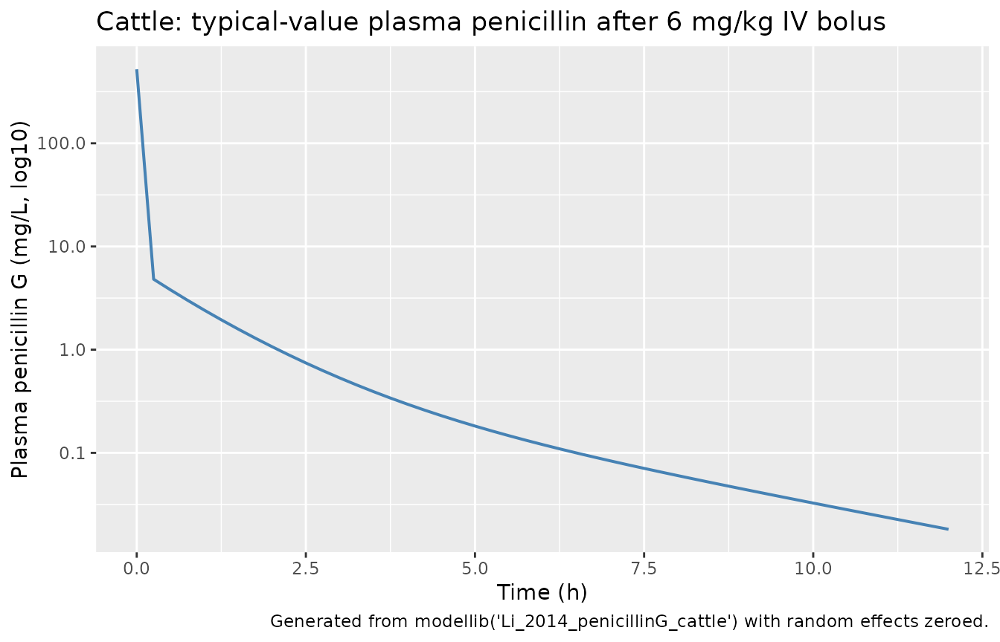
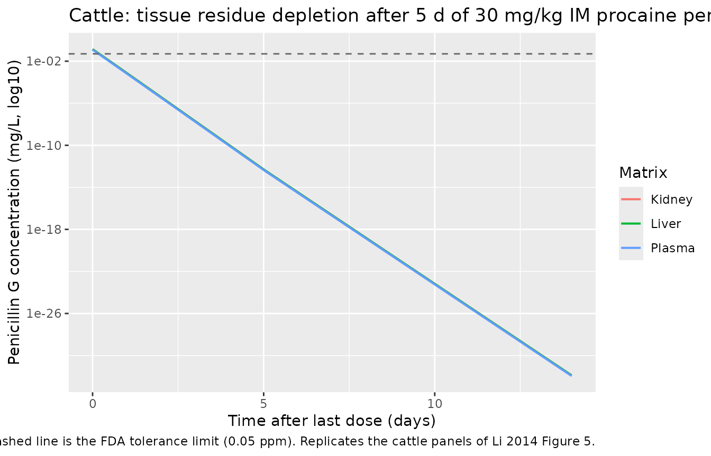
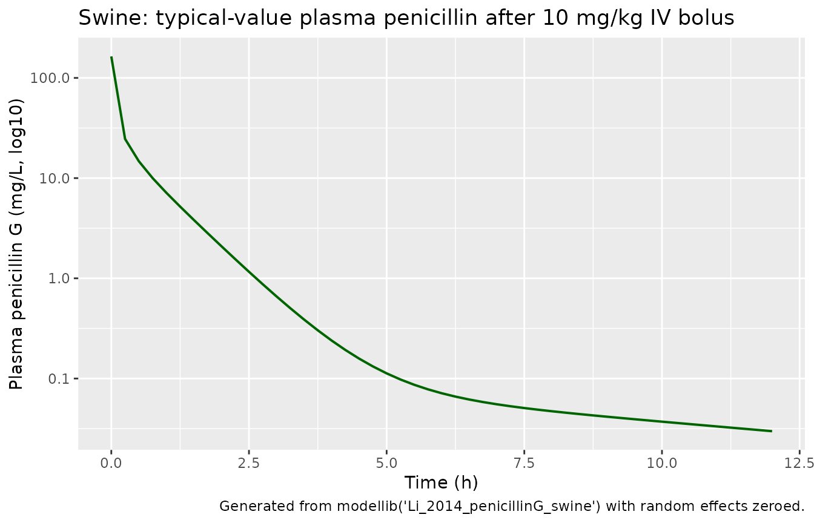
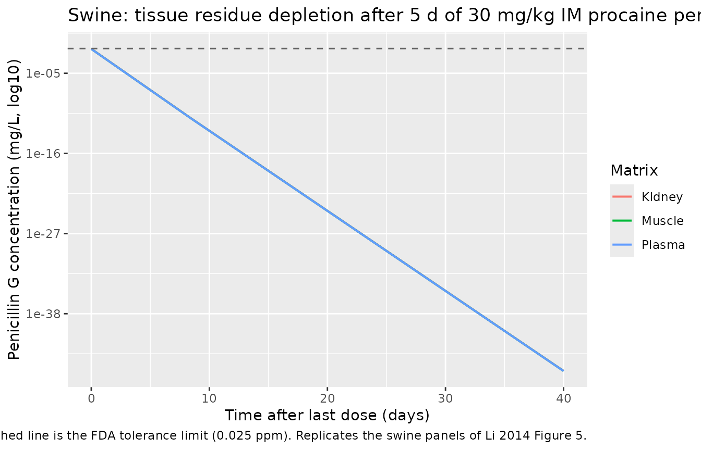

# Penicillin G in cattle and swine (Li 2014)

## Model and source

Li et al. (2014) developed two species-specific three-compartment
population PK models for penicillin G, fitted in parallel within a
single Phoenix NLME project but with separate Tables of parameter
estimates. This vignette covers both models:

- `modellib("Li_2014_penicillinG_cattle")` - cattle, with liver + kidney
  tissue compartments (Li 2014 Table 2).
- `modellib("Li_2014_penicillinG_swine")` - swine, with kidney + muscle
  tissue compartments (Li 2014 Table 3).

Citation:

    #> ℹ parameter labels from comments will be replaced by 'label()'

> Li M, Gehring R, Tell L, Baynes R, Huang Q, Riviere JE. Interspecies
> mixed-effect pharmacokinetic modeling of penicillin G in cattle and
> swine. Antimicrob Agents Chemother. 2014;58(8):4495-4503.
> <doi:10.1128/AAC.02806-14>

Article: <https://doi.org/10.1128/AAC.02806-14>

## Population

The model was fitted to a pooled meta-analysis dataset combining 100
cattle (368 plasma/serum concentrations, 26 liver and 13 kidney tissue
residue concentrations) drawn from 30 published studies and FARAD
records, plus 89 pigs (443 plasma concentrations, 97 kidney and 84
muscle tissue residue concentrations) drawn from 13 published studies
plus one unpublished FDA dataset (Shelver et al., n=126 pigs). Cattle
muscle data and swine liver data were too sparse to include in the
model. Animals in disease states were excluded; healthy steers, heifers,
cows, calves and piglets through grower pigs were pooled. Weights range
43.5-633 kg in cattle and 3.3-221 kg in swine. Ages span 0.01-5.8 years
in cattle and 0.02-0.259 years in swine (where reported). Formulations
include penicillin sodium (cattle IV/IM), penicillin potassium (swine
IV/IM), and procaine penicillin (cattle IM/SC/PO; swine IM); see Li 2014
Table 1 for the per-study breakdown.

The same information is available programmatically via the model’s
`population` metadata.

``` r

rxode2::rxode(readModelDb("Li_2014_penicillinG_cattle"))$population
rxode2::rxode(readModelDb("Li_2014_penicillinG_swine"))$population
```

## Source trace

Per-parameter origin is recorded as in-file `# Li 2014 Table N` comments
next to every `ini()` entry; the table below collects them for reviewer
audit.

| Component | Source |
|----|----|
| Structural ODE system | Li 2014 Equation 1 and surrounding equations on p. 4497 |
| Schematic of compartments and routes | Li 2014 Figure 1 |
| Cattle structural parameters (V1-VK, CL1-CLK, Kim1-Kpo, Fim1-Fpo) | Li 2014 Table 2 “Population mean” column |
| Cattle covariate effects (theta_1, theta_2, theta_3) | Li 2014 Table 2 “Covariate factors” rows |
| Cattle residual error (23%) | Li 2014 Table 2 “Residual errors (%)” row + Results |
| Swine structural parameters (V1-VM, CL1-CLM, Kim1-Kim2, Fim1-Fim2) | Li 2014 Table 3 “Population mean” column |
| Swine covariate effect (theta_1) | Li 2014 Table 3 “Covariate factor” row |
| Swine residual error (35%) | Li 2014 Table 3 “Residual errors (%)” row |
| IIV (omega squared) | Li 2014 Tables 2 and 3, “IIV” column |
| Tissue compartment structure (liver, kidney for cattle; kidney, muscle for swine) | Li 2014 Methods “Simultaneous modeling of plasma data and tissue data” |
| Oral procaine penicillin absorbed directly into liver | Li 2014 Methods: “it was assumed that penicillin was orally administered to the liver compartment directly” |
| Withdrawal interval simulation (30 mg/kg q24h IM x 5 days) | Li 2014 Methods “Model validation and simulation” + Figure 5 |

## Cattle simulation: typical-value plasma profile after IV bolus

For a clean typical-value comparison against the cattle structural
parameters, simulate a 6 mg/kg IV bolus in a 300 kg adult animal aged 1
year and follow plasma penicillin for 12 hours.
([`rxode2::zeroRe()`](https://nlmixr2.github.io/rxode2/reference/zeroRe.html)
strips random effects so only the typical population predictions are
shown - useful here because the cattle IIVs reported in Li 2014 Table 2
are unusually large; see Errata.)

``` r

mod_cattle <- rxode2::rxode(readModelDb("Li_2014_penicillinG_cattle"))
#> ℹ parameter labels from comments will be replaced by 'label()'
mod_cattle_typ <- mod_cattle |> rxode2::zeroRe()

WT_cattle <- 300
DOSE_iv_cattle_mg <- 6 * WT_cattle
sample_grid_iv_cattle <- seq(0, 12, by = 0.25)

# Multi-output model: observation rows use cmt = "Cc" (the plasma observable);
# rxode2 returns all three observables (Cc, Cliver, Ckidney) as columns.
build_events_iv <- function(n_id, amt, sample_grid, WT, AGE = NULL) {
  per_subj_rows <- 1 + length(sample_grid)
  df <- data.frame(
    id   = rep(seq_len(n_id), each = per_subj_rows),
    time = rep(c(0, sample_grid), n_id),
    cmt  = rep(c("central", rep("Cc", length(sample_grid))), n_id),
    amt  = rep(c(amt, rep(NA_real_, length(sample_grid))), n_id),
    evid = rep(c(1L,  rep(0L, length(sample_grid))), n_id),
    WT   = WT
  )
  if (!is.null(AGE)) df$AGE <- AGE
  df[order(df$id, df$time, df$evid), ]
}

ev_cattle_iv <- build_events_iv(n_id = 5, amt = DOSE_iv_cattle_mg,
                                sample_grid = sample_grid_iv_cattle,
                                WT = WT_cattle, AGE = 1)

sim_cattle_iv <- rxode2::rxSolve(
  mod_cattle_typ,
  events = ev_cattle_iv
)
#> ℹ omega/sigma items treated as zero: 'etalvc', 'etalvp', 'etalvp2', 'etalv_liver', 'etalv_kidney', 'etalcl', 'etalq', 'etalq_kidney', 'etalka_im_na', 'etalka_im_pro', 'etalfdepot_im_na', 'etalfdepot_im_pro', 'etalfdepot_sc', 'etalfdepot_oral'
#> Warning: multi-subject simulation without without 'omega'

ggplot(sim_cattle_iv, aes(time, Cc)) +
  geom_line(colour = "steelblue", linewidth = 0.7) +
  scale_y_log10() +
  labs(
    x = "Time (h)",
    y = "Plasma penicillin G (mg/L, log10)",
    title = "Cattle: typical-value plasma penicillin after 6 mg/kg IV bolus",
    caption = "Generated from modellib('Li_2014_penicillinG_cattle') with random effects zeroed."
  )
```



## Cattle simulation: tissue residue profile after 5-day IM regimen (replicates Figure 5)

Li 2014 simulated a withdrawal-interval scenario at 30 mg/kg/day IM for
5 consecutive days using 100 Monte Carlo replicates and read off the
time at which the upper 95% CI of the 99th percentile of tissue
concentration fell below the FDA tolerance limit (0.05 ppm for cattle,
0.025 ppm for swine). This vignette uses the same dosing scheme but with
random effects zeroed for a typical-value tissue depletion profile.
Stochastic VPCs are deliberately not shown because the Li 2014 cattle
IIVs are anomalously large (see Errata) and a 100-subject stochastic
simulation produces an uninterpretably wide band.

``` r

days <- 5
sample_grid_cattle <- seq(0, days * 24 + 14 * 24, by = 0.5)

build_events_im_qd <- function(n_id, amt_per_dose, n_doses, sample_grid, WT, AGE = NULL) {
  dose_times <- (0:(n_doses - 1)) * 24
  per_subj <- data.frame(
    time = c(dose_times, sample_grid),
    cmt  = c(rep("depot2", n_doses), rep("Cc", length(sample_grid))),
    amt  = c(rep(amt_per_dose, n_doses), rep(NA_real_, length(sample_grid))),
    evid = c(rep(1L, n_doses), rep(0L, length(sample_grid)))
  )
  per_subj <- per_subj[order(per_subj$time, -per_subj$evid), ]
  df <- per_subj[rep(seq_len(nrow(per_subj)), n_id), ]
  df$id <- rep(seq_len(n_id), each = nrow(per_subj))
  df$WT <- WT
  if (!is.null(AGE)) df$AGE <- AGE
  df[order(df$id, df$time, -df$evid), ]
}

ev_cattle_im <- build_events_im_qd(
  n_id = 5, amt_per_dose = 30 * WT_cattle, n_doses = days,
  sample_grid = sample_grid_cattle, WT = WT_cattle, AGE = 1
)

sim_cattle_im <- rxode2::rxSolve(
  mod_cattle_typ,
  events = ev_cattle_im
)
#> ℹ omega/sigma items treated as zero: 'etalvc', 'etalvp', 'etalvp2', 'etalv_liver', 'etalv_kidney', 'etalcl', 'etalq', 'etalq_kidney', 'etalka_im_na', 'etalka_im_pro', 'etalfdepot_im_na', 'etalfdepot_im_pro', 'etalfdepot_sc', 'etalfdepot_oral'
#> Warning: multi-subject simulation without without 'omega'

sim_cattle_long <- sim_cattle_im |>
  filter(time >= days * 24) |>
  mutate(time_post_dose_d = (time - days * 24) / 24) |>
  select(time_post_dose_d, Plasma = Cc, Liver = Cliver, Kidney = Ckidney) |>
  tidyr::pivot_longer(c(Plasma, Liver, Kidney), names_to = "matrix", values_to = "conc")

tolerance_cattle <- 0.05
ggplot(sim_cattle_long, aes(time_post_dose_d, conc, colour = matrix)) +
  geom_line(linewidth = 0.7) +
  geom_hline(yintercept = tolerance_cattle, linetype = "dashed", colour = "grey40") +
  scale_y_log10() +
  labs(
    x = "Time after last dose (days)",
    y = "Penicillin G concentration (mg/L, log10)",
    colour = "Matrix",
    title = "Cattle: tissue residue depletion after 5 d of 30 mg/kg IM procaine penicillin",
    caption = "Typical-value simulation; horizontal dashed line is the FDA tolerance limit (0.05 ppm). Replicates the cattle panels of Li 2014 Figure 5."
  )
```



## Swine simulation: typical-value plasma profile after IV bolus

Same scheme for swine, with a 50 kg pig receiving 10 mg/kg IV.

``` r

mod_swine <- rxode2::rxode(readModelDb("Li_2014_penicillinG_swine"))
#> ℹ parameter labels from comments will be replaced by 'label()'
mod_swine_typ <- mod_swine |> rxode2::zeroRe()

WT_swine <- 50
DOSE_iv_swine_mg <- 10 * WT_swine
sample_grid_iv_swine <- seq(0, 12, by = 0.25)

ev_swine_iv <- build_events_iv(n_id = 5, amt = DOSE_iv_swine_mg,
                               sample_grid = sample_grid_iv_swine,
                               WT = WT_swine)

sim_swine_iv <- rxode2::rxSolve(
  mod_swine_typ,
  events = ev_swine_iv
)
#> ℹ omega/sigma items treated as zero: 'etalvc', 'etalvp', 'etalv_kidney', 'etalv_muscle', 'etalcl', 'etalq_kidney', 'etalq_muscle', 'etalka_im_k', 'etalka_im_pro', 'etalfdepot_im_k', 'etalfdepot_im_pro'
#> Warning: multi-subject simulation without without 'omega'

ggplot(sim_swine_iv, aes(time, Cc)) +
  geom_line(colour = "darkgreen", linewidth = 0.7) +
  scale_y_log10() +
  labs(
    x = "Time (h)",
    y = "Plasma penicillin G (mg/L, log10)",
    title = "Swine: typical-value plasma penicillin after 10 mg/kg IV bolus",
    caption = "Generated from modellib('Li_2014_penicillinG_swine') with random effects zeroed."
  )
```



## Swine simulation: tissue residue profile after 5-day IM regimen (replicates Figure 5)

``` r

sample_grid_swine <- seq(0, days * 24 + 40 * 24, by = 0.5)

ev_swine_im <- build_events_im_qd(
  n_id = 5, amt_per_dose = 30 * WT_swine, n_doses = days,
  sample_grid = sample_grid_swine, WT = WT_swine
)

sim_swine_im <- rxode2::rxSolve(
  mod_swine_typ,
  events = ev_swine_im
)
#> ℹ omega/sigma items treated as zero: 'etalvc', 'etalvp', 'etalv_kidney', 'etalv_muscle', 'etalcl', 'etalq_kidney', 'etalq_muscle', 'etalka_im_k', 'etalka_im_pro', 'etalfdepot_im_k', 'etalfdepot_im_pro'
#> Warning: multi-subject simulation without without 'omega'

sim_swine_long <- sim_swine_im |>
  filter(time >= days * 24) |>
  mutate(time_post_dose_d = (time - days * 24) / 24) |>
  select(time_post_dose_d, Plasma = Cc, Kidney = Ckidney, Muscle = Cmuscle) |>
  tidyr::pivot_longer(c(Plasma, Kidney, Muscle), names_to = "matrix", values_to = "conc")

tolerance_swine <- 0.025
ggplot(sim_swine_long, aes(time_post_dose_d, conc, colour = matrix)) +
  geom_line(linewidth = 0.7) +
  geom_hline(yintercept = tolerance_swine, linetype = "dashed", colour = "grey40") +
  scale_y_log10() +
  labs(
    x = "Time after last dose (days)",
    y = "Penicillin G concentration (mg/L, log10)",
    colour = "Matrix",
    title = "Swine: tissue residue depletion after 5 d of 30 mg/kg IM procaine penicillin",
    caption = "Typical-value simulation; horizontal dashed line is the FDA tolerance limit (0.025 ppm). Replicates the swine panels of Li 2014 Figure 5."
  )
```



## PKNCA validation

Li 2014 does not report a side-by-side NCA table; the structural
parameters themselves (Vc, CL, peripheral volumes / clearances)
implicitly characterise the systemic exposure. To make the model’s
plasma profile concretely auditable, run PKNCA on the typical-value IV
bolus simulation in each species and report Cmax, AUC0-inf, AUC0-last,
and terminal half-life. The PKNCA outputs are not compared to a
published number; they are exposed for reviewer sanity-checking and to
confirm the typical-value pipeline runs cleanly.

``` r

sim_nca_cattle <- sim_cattle_iv |>
  filter(!is.na(Cc)) |>
  select(id, time, Cc) |>
  mutate(treatment = "cattle 6 mg/kg IV")
sim_nca_cattle <- bind_rows(
  sim_nca_cattle,
  sim_nca_cattle |> distinct(id, treatment) |> mutate(time = 0, Cc = 0)
) |>
  distinct(id, treatment, time, .keep_all = TRUE) |>
  arrange(id, treatment, time)

conc_cattle <- PKNCA::PKNCAconc(sim_nca_cattle, Cc ~ time | treatment + id)

dose_cattle <- tibble(
  id = 1:5,
  time = 0,
  amt = DOSE_iv_cattle_mg,
  treatment = "cattle 6 mg/kg IV"
)
dose_obj_cattle <- PKNCA::PKNCAdose(dose_cattle, amt ~ time | treatment + id)

intervals_cattle <- data.frame(
  start = 0, end = Inf,
  cmax = TRUE, tmax = TRUE,
  auclast = TRUE, aucinf.obs = TRUE,
  half.life = TRUE
)

nca_cattle <- PKNCA::pk.nca(PKNCA::PKNCAdata(conc_cattle, dose_obj_cattle, intervals = intervals_cattle))
knitr::kable(
  as.data.frame(nca_cattle$result) |>
    filter(id == 1) |>
    select(treatment, PPTESTCD, PPORRES),
  caption = "PKNCA on cattle typical-value IV simulation (1 representative animal).",
  align = c("l", "l", "r")
)
```

| treatment         | PPTESTCD            |     PPORRES |
|:------------------|:--------------------|------------:|
| cattle 6 mg/kg IV | auclast             |  33.6643886 |
| cattle 6 mg/kg IV | cmax                | 521.7391304 |
| cattle 6 mg/kg IV | tmax                |   0.0000000 |
| cattle 6 mg/kg IV | tlast               |  12.0000000 |
| cattle 6 mg/kg IV | clast.obs           |   0.0181621 |
| cattle 6 mg/kg IV | lambda.z            |   0.2965940 |
| cattle 6 mg/kg IV | r.squared           |   0.9999174 |
| cattle 6 mg/kg IV | adj.r.squared       |   0.9999110 |
| cattle 6 mg/kg IV | lambda.z.time.first |   8.5000000 |
| cattle 6 mg/kg IV | lambda.z.time.last  |  12.0000000 |
| cattle 6 mg/kg IV | lambda.z.n.points   |  15.0000000 |
| cattle 6 mg/kg IV | clast.pred          |   0.0180819 |
| cattle 6 mg/kg IV | half.life           |   2.3370237 |
| cattle 6 mg/kg IV | span.ratio          |   1.4976313 |
| cattle 6 mg/kg IV | aucinf.obs          |  33.7256241 |

PKNCA on cattle typical-value IV simulation (1 representative animal).
{.table}

``` r

sim_nca_swine <- sim_swine_iv |>
  filter(!is.na(Cc)) |>
  select(id, time, Cc) |>
  mutate(treatment = "swine 10 mg/kg IV")
sim_nca_swine <- bind_rows(
  sim_nca_swine,
  sim_nca_swine |> distinct(id, treatment) |> mutate(time = 0, Cc = 0)
) |>
  distinct(id, treatment, time, .keep_all = TRUE) |>
  arrange(id, treatment, time)

conc_swine <- PKNCA::PKNCAconc(sim_nca_swine, Cc ~ time | treatment + id)

dose_swine <- tibble(
  id = 1:5,
  time = 0,
  amt = DOSE_iv_swine_mg,
  treatment = "swine 10 mg/kg IV"
)
dose_obj_swine <- PKNCA::PKNCAdose(dose_swine, amt ~ time | treatment + id)

intervals_swine <- data.frame(
  start = 0, end = Inf,
  cmax = TRUE, tmax = TRUE,
  auclast = TRUE, aucinf.obs = TRUE,
  half.life = TRUE
)

nca_swine <- PKNCA::pk.nca(PKNCA::PKNCAdata(conc_swine, dose_obj_swine, intervals = intervals_swine))
knitr::kable(
  as.data.frame(nca_swine$result) |>
    filter(id == 1) |>
    select(treatment, PPTESTCD, PPORRES),
  caption = "PKNCA on swine typical-value IV simulation (1 representative animal).",
  align = c("l", "l", "r")
)
```

| treatment         | PPTESTCD            |     PPORRES |
|:------------------|:--------------------|------------:|
| swine 10 mg/kg IV | auclast             |  34.6016986 |
| swine 10 mg/kg IV | cmax                | 163.9344262 |
| swine 10 mg/kg IV | tmax                |   0.0000000 |
| swine 10 mg/kg IV | tlast               |  12.0000000 |
| swine 10 mg/kg IV | clast.obs           |   0.0298072 |
| swine 10 mg/kg IV | lambda.z            |   0.1102529 |
| swine 10 mg/kg IV | r.squared           |   0.9999444 |
| swine 10 mg/kg IV | adj.r.squared       |   0.9999388 |
| swine 10 mg/kg IV | lambda.z.time.first |   9.2500000 |
| swine 10 mg/kg IV | lambda.z.time.last  |  12.0000000 |
| swine 10 mg/kg IV | lambda.z.n.points   |  12.0000000 |
| swine 10 mg/kg IV | clast.pred          |   0.0297791 |
| swine 10 mg/kg IV | half.life           |   6.2868866 |
| swine 10 mg/kg IV | span.ratio          |   0.4374184 |
| swine 10 mg/kg IV | aucinf.obs          |  34.8720516 |

PKNCA on swine typical-value IV simulation (1 representative animal).
{.table}

## Assumptions and deviations

- **Tissue compartment ODEs interpreted with a single
  inter-compartmental clearance per tissue.** The printed differential
  equations in Li 2014 mix two notations: an inter-compartmental flow
  `Q_X * (C - C_X)` AND an additional tissue elimination term
  `- CL_X * C_X`. Yet Table 2 / 3 describe `CL_L`, `CL_K`, `CL_M` as
  “Clearance between the central and the X compartment”
  (i.e. inter-compartmental clearance), and the swine muscle equation as
  printed has only the inter-compartmental term. The packaged models
  interpret each `CL_X` as a single inter-compartmental clearance (Q_X =
  CL_X) and drop the `- CL_X * C_X` term as a typesetting artefact. The
  Methods support this: “CL of peripheral compartment 1 was consistent
  with the clearance of liver, muscle, and kidney compartments.”
- **Cattle IIV magnitudes are taken as printed (omega squared) but
  appear anomalously high for Vc (9.59), V_liver (2.76), V_kidney
  (2.91), Q_kidney (4.04), and the bioavailability terms (Fim1 1.24,
  Fim2 1.84, Fsc 2.31, Fpo 2.01).** Phoenix NLME default reports omega
  squared (variance of the log-normal random effect), so these values
  imply improbably wide between-animal variation. Comparable swine IIV
  values (Vc 0.13, Vp 0.03, V_kidney 0.02, V_muscle 0.03, CL1 0.12) are
  consistent with omega squared interpretation and yield realistic CVs.
  The vignette simulations therefore use
  [`rxode2::zeroRe()`](https://nlmixr2.github.io/rxode2/reference/zeroRe.html)
  to suppress random effects and show typical-value profiles. Users who
  want stochastic simulations against the cattle model should consider
  rescaling the larger IIV values (the swine table is the better-behaved
  reference). No values were modified in the packaged model file - the
  values printed in Li 2014 Table 2 are encoded verbatim.
- **Covariate reference values (300 kg WT for cattle, 1 year AGE for
  cattle, 50 kg WT for swine) are not stated in the paper.** Li 2014
  specifies the covariate model form `P_i = P_pop * (cov/mean)^theta`
  but does not report the actual numerical `mean`. The packaged models
  use rounded midrange values; the effect sizes are small enough
  (theta_1 = -0.005, theta_2 = 0.008, theta_3 = -0.011 in cattle;
  theta_1 = 0.132 in swine) that the choice of reference is numerically
  inconsequential for typical-value simulations.
- **Oral procaine penicillin (cattle depot4) absorbs directly into the
  liver compartment.** This is an explicit modelling assumption in Li
  2014 Methods (“it was assumed that penicillin was orally administered
  to the liver compartment directly”). It is not a bug.
- **Multi-output residual error encoded as three separate `propSd_*`
  parameters with the same numeric value.** Li 2014 reports a single
  residual error value per species (23% cattle, 35% swine) applied to
  plasma and all tissue outputs. nlmixr2 requires a distinct endpoint
  parameter per `~`-defined output, so the same value is repeated for
  `propSd`, `propSd_Cliver`, `propSd_Ckidney` (cattle) and `propSd`,
  `propSd_Ckidney`, `propSd_Cmuscle` (swine).
- **NCA values from the paper are not reported in tabular form.** Li
  2014 reports structural population PK parameters (Vc, CL, peripheral
  volumes and clearances) rather than Cmax / AUC / half-life tables, so
  the PKNCA section shows simulated NCA from the packaged model without
  a side-by-side numerical comparison against the paper. The withdrawal
  interval reported in Li 2014 Discussion (7 days cattle, at least 30
  days swine) is the published validation target for the tissue residue
  simulation; the depletion plots replicate the cattle and swine panels
  of Figure 5.
- **Sex covariate not extracted.** Li 2014 Table 1 records sex per
  contributing study, but sex was not retained as a covariate effect in
  the final cattle or swine models (Table 2 / 3 list only weight and age
  effects). It is therefore omitted from `covariateData`.
