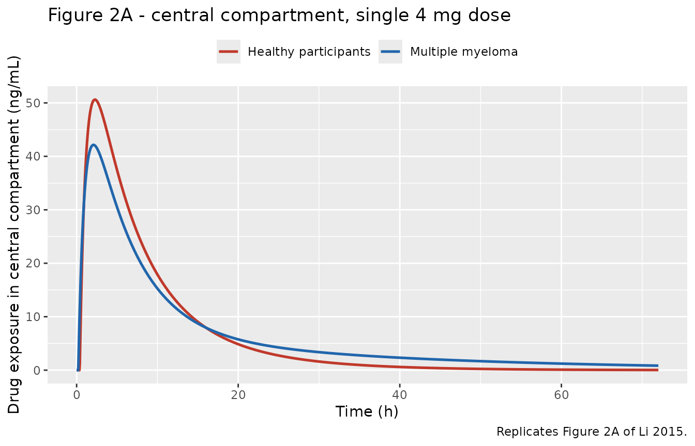
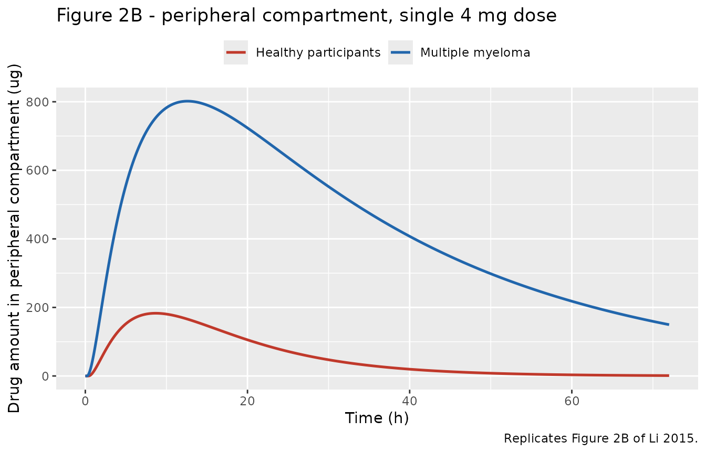
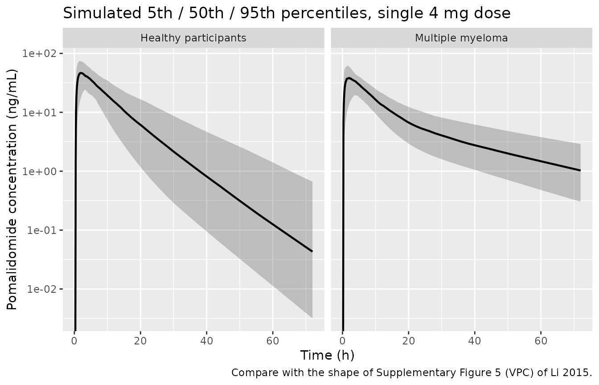

# Pomalidomide (Li 2015)

## Model and source

- Citation: Li Y, Xu Y, Liu L, Wang X, Palmisano M, Zhou S. Population
  pharmacokinetics of pomalidomide. The Journal of Clinical
  Pharmacology. 2015;55(5):563-572. <doi:10.1002/jcph.455>
- Description: Two-compartment population PK model with first-order
  absorption and an absorption lag for oral pomalidomide in healthy
  participants and patients with relapsed/refractory multiple myeloma
  (Li 2015). Apparent clearance and central volume are comparable
  between the two populations, but multiple myeloma raises apparent
  peripheral volume 8.46-fold and apparent intercompartmental clearance
  3.71-fold and shortens the lag time; covariates are body weight and
  total serum protein on V2/F and sex on CL/F, and the log-scale
  residual error is population-specific.
- Article: <https://doi.org/10.1002/jcph.455>
- Supplement (study designs, goodness-of-fit and VPC figures):
  <https://www.ebi.ac.uk/europepmc/webservices/rest/PMC4418344/supplementaryFiles>

Pomalidomide is an oral immunomodulatory agent for relapsed and
refractory multiple myeloma (RRMM). Li 2015 is the first published
population PK analysis of the drug. Its central finding is a
*distribution* effect rather than an elimination one: apparent clearance
and apparent central volume are essentially the same in healthy
participants and in patients with multiple myeloma, but the apparent
peripheral volume is about 8-fold larger and the apparent
intercompartmental clearance about 3.7-fold larger in the patients. The
authors read this as preferential uptake of pomalidomide by tumour
tissue, and support it by noting that a dedicated CYP3A4 / CYP1A2
inhibition study moved the initial (alpha) decline rather than the
terminal (beta) decline.

## Population

The analysis pooled 3,909 evaluable plasma concentrations from 240
participants across 6 studies: 96 healthy participants (CC-4047-CP-006
and -CP-007) and 144 patients with relapsed and refractory multiple
myeloma (CC-4047-MM-001, -002, -003 and -005). Doses spanned 0.5 to 10
mg of an oral solid dosage form, given once daily or on alternate days
(Supplementary Table 1).

Baseline characteristics (Table 1): median age 53.0 years (range
19.0-83.0), median body weight 78.1 kg (range 44.4-127.0), 25.8% female,
78.0% white. Median total serum protein was 75.0 g/L (range 56.0-148.0)
and median creatinine clearance 100.4 mL/min (range 20.8-188.2); 40
participants (17%) had CLcr 30-60 mL/min and 3 (1.3%) had CLcr below 30
mL/min. Plasma was assayed by LC-MS/MS with a lower limit of
quantification of 0.25 ng/mL, and the final model characterised
concentrations spanning 1.0-179 ng/mL.

The same information is available programmatically via the model’s
`population` metadata
(`readModelDb("Li_2015_pomalidomide")()$population`).

## Source trace

Every `ini()` entry in
`inst/modeldb/specificDrugs/Li_2015_pomalidomide.R` carries an in-file
comment naming its source location. They are collected here for review.

| Equation / parameter | Value | Source location |
|----|----|----|
| `lka` | 1.25 /h | Table 2, row `ka, h-1` |
| `lcl` | 8.52 L/h | Table 2, row `CL/F, L/h` |
| `lvc` | 58.3 L | Table 2, row `V2/F, L` |
| `lvp` | 8.45 L | Table 2, row `V3/F, L` |
| `lq` | 1.01 L/h | Table 2, row `Q/F, L/h` |
| `ltlag_hnp` | 0.385 h | Table 2, row `Alag1, h` |
| `ltlag_mm` | 0.206 h | Table 2, row `Alag1 MM patient, h` |
| `e_mm_cl` | 0.913 | Table 2, row `CL/F MM patient/HNP` |
| `e_mm_vc` | 1.20 | Table 2, row `V2/F MM patient/HNP` |
| `e_mm_vp` | 8.46 | Table 2, row `V3/F MM patient/HNP` |
| `e_mm_q` | 3.71 | Table 2, row `Q/F MM patient/HNP` |
| `e_wt_vc` | 0.686 | Table 2, row `Effect of weight on V2F`; Results “Covariate Analysis” final equation |
| `e_tpro_vc` | 0.00609 per g/L | Table 2, row `Effect of TPT on V2F`; same final equation |
| `e_sexf_cl` | -0.234 | Table 2, row `Effect of sex on CL/F`; Results “females had 23.4% lower CL/F” |
| `etalvc` variance | 0.0352 | Table 2, row `v2 V2/F` |
| `etalvc`:`etalcl` covariance | 0.0599 | Table 2, row `v V2/F : v CL/F` |
| `etalcl` variance | 0.168 | Table 2, row `v2 CL/F` |
| `etalka` variance | 0.976 | Table 2, row `v2 Ka` |
| `expSdHnp` | 0.200 | Table 2, row `sigma2 (HNP)` = 0.04; SD = sqrt(0.04) |
| `expSdMm` | 0.490 | Table 2, row `sigma2 (MM patients)` = 0.240; SD = sqrt(0.240) |
| IIV form `P_i = P * exp(eta_i)` | n/a | Methods Equation 1 |
| Residual form `ln(C_obs) = ln(C_pred) + eps` | n/a | Methods Equation 2 |
| Linear covariate form `theta * (1 + theta_cov * (COV - COV_median))` | n/a | Methods Equation 3 |
| Power covariate form `theta * (COV / COV_median)^theta_cov` | n/a | Methods Equation 4 |
| Categorical covariate form `theta * (1 + theta_cov * Z)` | n/a | Methods Equation 5 |
| Reference weight 78.3 kg, reference total protein 73.0 g/L | n/a | Results “Covariate Analysis” final covariate equation and the sentence immediately below it |
| Two-compartment structure, first-order absorption, population-specific lag and residual error | n/a | Results “Structural PK Model Characterization” |

The final covariate model is printed in Results “Covariate Analysis” as

    (CL/F)_TV = 8.45                            (male participants)
              = 8.45 * (1 - 0.234)              (female participants)

    (V2/F)_TV = 58.3 * (WT / 78.3)^0.686 * (1 + 0.00609 * (TPT - 73.0))

See “Assumptions and deviations” below for why this vignette uses 8.52
rather than the 8.45 printed in that equation.

## Load the model

``` r

mod <- readModelDb("Li_2015_pomalidomide")
mod_typical <- rxode2::zeroRe(mod)
#> ℹ parameter labels from comments will be replaced by 'label()'
#> Warning: No sigma parameters in the model
```

## Typical-value parameters reproduce Table 2 and the Discussion

The paper states typical values for each population in several places.
Solving the packaged model with the random effects zeroed, at the
covariate equation’s own reference values (male, 78.3 kg, 73.0 g/L total
protein), must return them.

``` r

ref_subject <- function(dis_mm, dose = 4, tmax = 72, dt = 0.05) {
  ev <- rxode2::et(amt = dose, cmt = "depot") |>
    rxode2::et(seq(0, tmax, by = dt), cmt = "central")
  out <- as.data.frame(ev)
  out$WT <- 78.3
  out$TPRO <- 73.0
  out$SEXF <- 0
  out$DIS_MM <- dis_mm
  out$cohort <- if (dis_mm == 1) "Multiple myeloma" else "Healthy participants"
  out
}

typ <- dplyr::bind_rows(
  rxode2::rxSolve(mod_typical, ref_subject(0), keep = "cohort") |> as.data.frame(),
  rxode2::rxSolve(mod_typical, ref_subject(1), keep = "cohort") |> as.data.frame()
) |>
  dplyr::filter(!is.na(Cc))
#> ℹ omega/sigma items treated as zero: 'etalvc', 'etalcl', 'etalka'
#> ℹ omega/sigma items treated as zero: 'etalvc', 'etalcl', 'etalka'

param_tab <- typ |>
  dplyr::group_by(cohort) |>
  dplyr::summarise(
    `CL/F (L/h)` = mean(cl),
    `V2/F (L)`   = mean(vc),
    `V3/F (L)`   = mean(vp),
    `Q/F (L/h)`  = mean(q),
    `Alag1 (h)`  = mean(tlag),
    .groups = "drop"
  )

knitr::kable(
  param_tab, digits = 3,
  caption = "Typical apparent PK parameters at the reference covariate values."
)
```

| cohort               | CL/F (L/h) | V2/F (L) | V3/F (L) | Q/F (L/h) | Alag1 (h) |
|:---------------------|-----------:|---------:|---------:|----------:|----------:|
| Healthy participants |      8.520 |    58.30 |    8.450 |     1.010 |     0.385 |
| Multiple myeloma     |      7.779 |    69.96 |   71.487 |     3.747 |     0.206 |

Typical apparent PK parameters at the reference covariate values.
{.table style="width:100%;"}

``` r

get_par <- function(coh, nm) {
  v <- param_tab[[nm]][param_tab$cohort == coh]
  if (length(v) != 1L) stop("no unique row for cohort '", coh, "'")
  v
}

# Published targets. Healthy values are Table 2 directly; multiple myeloma
# values are the products the paper itself quotes in Results and Discussion
# (8.52 * 0.913 = 7.78 L/h; 58.3 * 1.20 = 69.9 L; 8.45 * 8.46 = 71.5 L;
# 1.01 * 3.71 = 3.75 L/h).
published_typical <- tibble::tribble(
  ~cohort,                ~`CL/F (L/h)`, ~`V2/F (L)`, ~`V3/F (L)`, ~`Q/F (L/h)`, ~`Alag1 (h)`,
  "Healthy participants",         8.52,        58.3,        8.45,         1.01,        0.385,
  "Multiple myeloma",             7.78,        69.9,        71.5,         3.75,        0.206
)

# Deterministic (random effects zeroed), so these are exact up to the paper's
# own rounding of the published products -- 0.5% is generous for that and still
# goes red on any mis-transcribed value or ratio.
for (coh in published_typical$cohort) {
  for (nm in setdiff(names(published_typical), "cohort")) {
    got <- get_par(coh, nm)
    want <- published_typical[[nm]][published_typical$cohort == coh]
    stopifnot(length(want) == 1L, abs(got / want - 1) < 0.005)
  }
}
cat("All 10 typical-value parameters match the published values within 0.5%.\n")
#> All 10 typical-value parameters match the published values within 0.5%.
```

The interindividual variability reported in Table 2 is on the variance
scale; the paper’s own CV% figures confirm it.

``` r

ui <- rxode2::rxode(mod)
#> ℹ parameter labels from comments will be replaced by 'label()'
omega <- ui$omega
cv_pct <- sqrt(exp(diag(omega)) - 1) * 100

iiv_tab <- tibble::tibble(
  Parameter = c("CL/F", "V2/F", "ka"),
  eta       = c("etalcl", "etalvc", "etalka"),
  Variance  = diag(omega)[c("etalcl", "etalvc", "etalka")],
  `CV% from variance` = cv_pct[c("etalcl", "etalvc", "etalka")],
  `CV% reported`      = c(42.77, 18.9, NA_real_)
)
knitr::kable(iiv_tab, digits = c(0, 0, 4, 2, 2),
             caption = "IIV variances and the implied lognormal CV%.")
```

| Parameter | eta    | Variance | CV% from variance | CV% reported |
|:----------|:-------|---------:|------------------:|-------------:|
| CL/F      | etalcl |   0.1680 |             42.77 |        42.77 |
| V2/F      | etalvc |   0.0352 |             18.93 |        18.90 |
| ka        | etalka |   0.9760 |            128.60 |           NA |

IIV variances and the implied lognormal CV%. {.table}

``` r


# Results "Covariate Analysis": IIV in the final model is 42.77% for CL/F and
# 18.9% for V2/F. Reproducing both from the tabulated variances is what pins
# the omega scale as variance rather than SD or CV.
stopifnot(
  abs(cv_pct[["etalcl"]] - 42.77) < 0.2,
  abs(cv_pct[["etalvc"]] - 18.9) < 0.2,
  # Off-diagonal: correlation between the CL/F and V2/F etas.
  abs(omega["etalcl", "etalvc"] - 0.0599) < 1e-9
)

# Results: "female participants had 23.4% lower CL/F vs. male participants".
female <- ref_subject(0); female$SEXF <- 1
cl_female <- rxode2::rxSolve(mod_typical, female) |> as.data.frame() |>
  dplyr::pull(cl) |> mean()
#> ℹ omega/sigma items treated as zero: 'etalvc', 'etalcl', 'etalka'
stopifnot(abs((1 - cl_female / 8.52) - 0.234) < 1e-6)
cat(sprintf("Female CL/F = %.3f L/h, %.1f%% below the male value of 8.52 L/h.\n",
            cl_female, 100 * (1 - cl_female / 8.52)))
#> Female CL/F = 6.526 L/h, 23.4% below the male value of 8.52 L/h.
```

## Replicate Figure 2

Figure 2 of Li 2015 compares a typical healthy participant with a
typical patient after a single 4 mg dose: panel A is the concentration
in the central compartment, panel B the amount in the peripheral
compartment.

``` r

# Replicates Figure 2A of Li 2015: central-compartment concentration after a
# single 4 mg dose, healthy participants vs patients with RRMM.
ggplot(typ, aes(time, Cc, colour = cohort)) +
  geom_line(linewidth = 0.9) +
  scale_colour_manual(values = c("Healthy participants" = "#C0392B",
                                 "Multiple myeloma" = "#2166AC")) +
  labs(x = "Time (h)", y = "Drug exposure in central compartment (ng/mL)",
       colour = NULL, title = "Figure 2A - central compartment, single 4 mg dose",
       caption = "Replicates Figure 2A of Li 2015.") +
  theme(legend.position = "top")
```



``` r

# Replicates Figure 2B of Li 2015: peripheral-compartment amount. The model
# state `peripheral1` is an amount in mg; converted to ug here (see the
# Assumptions section on the published panel's axis label).
typ_periph <- typ |> dplyr::mutate(peripheral_ug = peripheral1 * 1000)

ggplot(typ_periph, aes(time, peripheral_ug, colour = cohort)) +
  geom_line(linewidth = 0.9) +
  scale_colour_manual(values = c("Healthy participants" = "#C0392B",
                                 "Multiple myeloma" = "#2166AC")) +
  labs(x = "Time (h)", y = "Drug amount in peripheral compartment (ug)",
       colour = NULL, title = "Figure 2B - peripheral compartment, single 4 mg dose",
       caption = "Replicates Figure 2B of Li 2015.") +
  theme(legend.position = "top")
```



``` r

peak <- typ_periph |>
  dplyr::group_by(cohort) |>
  dplyr::summarise(
    cmax_central = max(Cc),
    tmax_central = time[which.max(Cc)],
    peak_periph_ug = max(peripheral_ug),
    tpeak_periph = time[which.max(peripheral_ug)],
    .groups = "drop"
  )
knitr::kable(peak, digits = 2,
             caption = "Peak values of the two Figure 2 panels.")
```

| cohort               | cmax_central | tmax_central | peak_periph_ug | tpeak_periph |
|:---------------------|-------------:|-------------:|---------------:|-------------:|
| Healthy participants |        50.61 |         2.25 |         182.99 |          8.7 |
| Multiple myeloma     |        42.14 |         2.10 |         801.73 |         12.6 |

Peak values of the two Figure 2 panels. {.table}

``` r


pk <- function(coh, nm) {
  v <- peak[[nm]][peak$cohort == coh]
  if (length(v) != 1L) stop("no unique row for cohort '", coh, "'")
  v
}

# Targets read off the published panels. These are DIGITISED from a plot, so
# the tolerances below reflect the gridline resolution of the figure (panel A
# is gridded at 10 ng/mL, panel B at 200 units), not the precision of the
# model. The solve itself is deterministic.
stopifnot(
  # Panel A: red curve peaks just above 50 ng/mL near 2 h.
  abs(pk("Healthy participants", "cmax_central") - 50.5) < 4,
  abs(pk("Healthy participants", "tmax_central") - 2.0) < 0.6,
  # Panel A: blue curve peaks just above 42 ng/mL slightly earlier.
  abs(pk("Multiple myeloma", "cmax_central") - 42) < 4,
  abs(pk("Multiple myeloma", "tmax_central") - 1.9) < 0.6,
  # Panel A: the curves cross and the patient curve is the higher one at 72 h.
  tail(typ$Cc[typ$cohort == "Multiple myeloma"], 1) >
    10 * tail(typ$Cc[typ$cohort == "Healthy participants"], 1),
  # Panel B: peaks near 190 and 800 on the published axis, at roughly 8 h and
  # 12 h respectively.
  abs(pk("Healthy participants", "peak_periph_ug") - 190) < 25,
  abs(pk("Healthy participants", "tpeak_periph") - 8) < 2,
  abs(pk("Multiple myeloma", "peak_periph_ug") - 800) < 60,
  abs(pk("Multiple myeloma", "tpeak_periph") - 12) < 2.5,
  # The headline claim of the panel: far more drug reaches the tissues of
  # patients with multiple myeloma.
  pk("Multiple myeloma", "peak_periph_ug") /
    pk("Healthy participants", "peak_periph_ug") > 3.5
)
cat("Both Figure 2 panels reproduce within the figure's own read precision.\n")
#> Both Figure 2 panels reproduce within the figure's own read precision.
```

## Virtual cohort

Individual observed data are not publicly available. The cohort below
draws covariates from the pooled Table 1 distributions: body weight
lognormal with median 78.1 kg truncated to the observed 44.4-127.0 kg
range, total serum protein lognormal with median 75.0 g/L truncated to
56-148 g/L, and 25.8% female. The paper reports demographics for the
pooled dataset only, so the same distributions are used in both arms.

``` r

# `set.seed()` seeds R's RNG, not rxode2's; rxode2 partitions its streams per
# solver thread, so the cohort below differs between a 2-core CI runner and a
# 16-thread workstation. Every assertion downstream is written to hold for any
# cohort this model can produce.
set.seed(20150455)
rxode2::rxSetSeed(20150455)

n_per_arm <- 150L

rtrunc_lnorm <- function(n, med, sdlog, lo, hi) {
  x <- rlnorm(n, meanlog = log(med), sdlog = sdlog)
  pmin(pmax(x, lo), hi)
}

make_cohort <- function(n, dis_mm, label, dose = 4, id_offset = 0L) {
  subj <- tibble::tibble(
    id     = id_offset + seq_len(n),
    WT     = rtrunc_lnorm(n, 78.1, 0.18, 44.4, 127.0),
    TPRO   = rtrunc_lnorm(n, 75.0, 0.13, 56.0, 148.0),
    SEXF   = as.numeric(runif(n) < 0.258),
    DIS_MM = dis_mm,
    cohort = label
  )
  # Dense through the absorption and distribution phases so Cmax and Tmax are
  # resolved, thinning out over the terminal phase.
  obs_times <- c(seq(0, 6, by = 0.1), seq(6.25, 12, by = 0.25),
                 seq(12.5, 24, by = 0.5), seq(26, 72, by = 2))
  doses <- subj |>
    dplyr::mutate(time = 0, amt = dose, evid = 1L, cmt = "depot")
  obs <- subj |>
    tidyr::crossing(time = obs_times) |>
    dplyr::mutate(amt = NA_real_, evid = 0L, cmt = "central")
  dplyr::bind_rows(doses, obs) |>
    dplyr::arrange(id, time, dplyr::desc(evid))
}

events <- dplyr::bind_rows(
  make_cohort(n_per_arm, 0, "Healthy participants", id_offset = 0L),
  make_cohort(n_per_arm, 1, "Multiple myeloma",     id_offset = n_per_arm)
)
stopifnot(!anyDuplicated(unique(events[, c("id", "time", "evid")])))
```

## Simulation

``` r

sim <- rxode2::rxSolve(mod, events = events, keep = c("cohort", "WT", "TPRO", "SEXF")) |>
  as.data.frame()
#> ℹ parameter labels from comments will be replaced by 'label()'
stopifnot(nrow(sim) > 0, all(sim$Cc[!is.na(sim$Cc)] >= 0))
```

``` r

# Simulated prediction intervals after a single 4 mg dose, by population.
sim |>
  dplyr::filter(!is.na(Cc), time > 0) |>
  dplyr::group_by(cohort, time) |>
  dplyr::summarise(
    Q05 = quantile(Cc, 0.05),
    Q50 = quantile(Cc, 0.50),
    Q95 = quantile(Cc, 0.95),
    .groups = "drop"
  ) |>
  ggplot(aes(time, Q50)) +
  geom_ribbon(aes(ymin = Q05, ymax = Q95), alpha = 0.25) +
  geom_line(linewidth = 0.8) +
  facet_wrap(~cohort) +
  scale_y_log10() +
  labs(x = "Time (h)", y = "Pomalidomide concentration (ng/mL)",
       title = "Simulated 5th / 50th / 95th percentiles, single 4 mg dose",
       caption = "Compare with the shape of Supplementary Figure 5 (VPC) of Li 2015.")
#> Warning in scale_y_log10(): log-10 transformation introduced infinite values.
#> log-10 transformation introduced infinite values.
#> log-10 transformation introduced infinite values.
#> log-10 transformation introduced infinite values.
```



The terminal phase in the multiple myeloma arm lingers well above the
healthy arm, which is the observation in Figure 1 that motivated the
disease-specific Q/F and V3/F.

``` r

tail_ratio <- sim |>
  dplyr::filter(!is.na(Cc), time == 72) |>
  dplyr::group_by(cohort) |>
  dplyr::summarise(med = median(Cc), .groups = "drop")
knitr::kable(tail_ratio, digits = 4,
             caption = "Median simulated concentration at 72 h.")
```

| cohort               |    med |
|:---------------------|-------:|
| Healthy participants | 0.0431 |
| Multiple myeloma     | 1.0280 |

Median simulated concentration at 72 h. {.table}

``` r


mm72 <- tail_ratio$med[tail_ratio$cohort == "Multiple myeloma"]
hn72 <- tail_ratio$med[tail_ratio$cohort == "Healthy participants"]
stopifnot(length(mm72) == 1L, length(hn72) == 1L, mm72 > 5 * hn72)
```

## PKNCA validation

``` r

sim_nca <- sim |>
  dplyr::filter(!is.na(Cc)) |>
  dplyr::select(id, time, Cc, cohort)

# Guarantee a time = 0 row per (id, cohort); pomalidomide is given orally and
# every subject is dose-naive at time 0, so Cc = 0 is the correct pre-dose value.
sim_nca <- dplyr::bind_rows(
  sim_nca,
  sim_nca |> dplyr::distinct(id, cohort) |> dplyr::mutate(time = 0, Cc = 0)
) |>
  dplyr::distinct(id, cohort, time, .keep_all = TRUE) |>
  dplyr::arrange(id, cohort, time)

conc_obj <- PKNCA::PKNCAconc(sim_nca, Cc ~ time | cohort + id)

dose_df <- events |>
  dplyr::filter(evid == 1L) |>
  dplyr::select(id, time, amt, cohort)
dose_obj <- PKNCA::PKNCAdose(dose_df, amt ~ time | cohort + id)

intervals <- data.frame(
  start      = 0,
  end        = Inf,
  cmax       = TRUE,
  tmax       = TRUE,
  aucinf.obs = TRUE,
  half.life  = TRUE
)

nca_res <- PKNCA::pk.nca(PKNCA::PKNCAdata(conc_obj, dose_obj, intervals = intervals))
```

### Comparison against published values

Li 2015 reports no NCA table, so the reference column below is built
from the paper’s own printed quantities: the typical Cmax and Tmax read
off Figure 2A, and `AUC(0-inf) = Dose / (CL/F)` computed from the
*published* apparent clearances (8.52 L/h for healthy participants, 8.52
x 0.913 = 7.78 L/h for patients). Because the reference AUCs come from
the published numbers rather than from the fitted model object, this row
goes red if `lcl` or `e_mm_cl` is mis-transcribed.

``` r

# 4 mg / (L/h) -> ng*h/mL  (4 mg = 4e6 ng; 1 L = 1000 mL)
auc_ref <- function(cl_lh) 4 * 1000 / cl_lh

published <- tibble::tribble(
  ~cohort,                ~cmax, ~tmax, ~aucinf.obs,
  "Healthy participants",  50.5,  2.0,  auc_ref(8.52),
  "Multiple myeloma",      42.0,  1.9,  auc_ref(8.52 * 0.913)
)

cmp <- nlmixr2lib::ncaComparisonTable(
  simulated = nca_res,
  reference = published,
  by        = "cohort",
  units     = c(cmax = "ng/mL", tmax = "h", aucinf.obs = "ng*h/mL"),
  params    = c("cmax", "tmax", "aucinf.obs"),
  tolerance_pct = 20
)

knitr::kable(
  cmp,
  caption = "Simulated NCA (median across the virtual cohort) vs published / closed-form reference. * differs from reference by >20%.",
  align = c("l", "l", "r", "r", "r")
)
```

| NCA parameter           | cohort               | Reference | Simulated | % diff |
|:------------------------|:---------------------|----------:|----------:|-------:|
| Cmax (ng/mL)            | Healthy participants |      50.5 |      48.9 |  -3.1% |
| Cmax (ng/mL)            | Multiple myeloma     |        42 |      40.2 |  -4.2% |
| Tmax (h)                | Healthy participants |         2 |         2 |  +0.0% |
| Tmax (h)                | Multiple myeloma     |       1.9 |         2 |  +5.3% |
| AUC0-∞ (obs) (ng\*h/mL) | Healthy participants |       469 |       485 |  +3.2% |
| AUC0-∞ (obs) (ng\*h/mL) | Multiple myeloma     |       514 |       556 |  +8.2% |

Simulated NCA (median across the virtual cohort) vs published /
closed-form reference. \* differs from reference by \>20%. {.table
style="width:100%;"}

The reference column of that table describes a **typical** subject,
while the simulated column is a **cohort median**, and the two are not
the same statistic when the variability is large. Tmax is the row where
that shows: `ka` carries an IIV variance of 0.976, i.e. a lognormal CV
of about 129%, which is by far the largest random effect in the model
and is strongly right-skewed on the time axis. Slowly-absorbing subjects
push the median Tmax later than the typical-value Tmax without moving
the typical value at all, so that row may be starred on some cohorts.
The same mechanism pulls the median Cmax slightly below the typical
Cmax. Neither is a transcription problem, and nothing is tuned to remove
it; the gate below is therefore applied to the **typical-value**
profiles, where the mass-balance identity `AUC(0-inf) x CL/F = Dose`
must hold exactly.

``` r

typ_nca_in <- typ |>
  dplyr::select(cohort, time, Cc) |>
  dplyr::mutate(id = as.integer(factor(cohort)))

typ_conc <- PKNCA::PKNCAconc(typ_nca_in, Cc ~ time | cohort + id)
typ_dose <- PKNCA::PKNCAdose(
  typ_nca_in |> dplyr::distinct(cohort, id) |> dplyr::mutate(time = 0, amt = 4),
  amt ~ time | cohort + id
)
typ_nca <- PKNCA::pk.nca(PKNCA::PKNCAdata(typ_conc, typ_dose, intervals = intervals))

typ_res <- as.data.frame(typ_nca) |>
  dplyr::filter(PPTESTCD %in% c("cmax", "tmax", "aucinf.obs", "half.life")) |>
  dplyr::select(cohort, PPTESTCD, PPORRES) |>
  tidyr::pivot_wider(names_from = PPTESTCD, values_from = PPORRES)

typ_res <- typ_res |>
  dplyr::mutate(
    `CL/F published (L/h)` = unname(c(`Healthy participants` = 8.52,
                                      `Multiple myeloma` = 8.52 * 0.913)[cohort]),
    `AUC from Dose/CL (ng*h/mL)` = 4 * 1000 / `CL/F published (L/h)`,
    `AUC % difference` = 100 * (aucinf.obs / `AUC from Dose/CL (ng*h/mL)` - 1)
  )

typ_res |>
  dplyr::select(cohort, aucinf.obs, `AUC from Dose/CL (ng*h/mL)`,
                `AUC % difference`, cmax, tmax, half.life) |>
  dplyr::rename(
    "Population"                 = cohort,
    "AUC0-inf, PKNCA (ng*h/mL)"  = aucinf.obs,
    "Cmax (ng/mL)"               = cmax,
    "Tmax (h)"                   = tmax,
    "Terminal t1/2 (h)"          = half.life
  ) |>
  knitr::kable(digits = 2,
               caption = "Typical-value NCA against the closed-form Dose / (CL/F).")
```

| Population | AUC0-inf, PKNCA (ng\*h/mL) | AUC from Dose/CL (ng\*h/mL) | AUC % difference | Cmax (ng/mL) | Tmax (h) | Terminal t1/2 (h) |
|:---|---:|---:|---:|---:|---:|---:|
| Healthy participants | 469.48 | 469.48 | 0.00 | 50.61 | 2.25 | 7.46 |
| Multiple myeloma | 513.80 | 514.22 | -0.08 | 42.14 | 2.10 | 21.75 |

Typical-value NCA against the closed-form Dose / (CL/F). {.table}

``` r


# Exact identity for a linear model integrated to a long enough horizon; the
# only slack is PKNCA's log-linear extrapolation of the last 28 h of a 72 h
# grid. 2% goes red on any transcription error in CL/F or in the MM ratio,
# both of which move AUC by 8% or more.
stopifnot(all(abs(typ_res$`AUC % difference`) < 2))
cat("Typical-value AUC(0-inf) matches Dose / (CL/F) within 2% in both populations.\n")
#> Typical-value AUC(0-inf) matches Dose / (CL/F) within 2% in both populations.
```

The terminal half-life differs sharply between the two populations, and
that difference is the whole point of the paper.

``` r

hl <- setNames(typ_res$half.life, typ_res$cohort)
knitr::kable(
  tibble::tibble(Population = names(hl), `Terminal t1/2 (h)` = as.numeric(hl)),
  digits = 2,
  caption = "Model-derived terminal half-life by population."
)
```

| Population           | Terminal t1/2 (h) |
|:---------------------|------------------:|
| Healthy participants |              7.46 |
| Multiple myeloma     |             21.75 |

Model-derived terminal half-life by population. {.table}

``` r


# The MM terminal phase must be materially longer -- this is the observation in
# Figure 1 that the disease-specific V3/F and Q/F were introduced to capture.
stopifnot(hl[["Multiple myeloma"]] > 2 * hl[["Healthy participants"]])
```

Note that these terminal half-lives are *not* the roughly 7.5 h
non-compartmental half-life quoted for pomalidomide in the Introduction
of Li 2015 (and in the product label). A two-compartment terminal slope
estimated from a rich 72 h profile resolves the slow redistribution
phase that a conventional NCA window does not reach; the effective
half-life that governs accumulation on a daily regimen is dominated by
the much faster alpha phase. The paper makes exactly this argument when
it attributes the prolonged terminal phase in patients to tissue
redistribution rather than slower elimination.

## Assumptions and deviations

- **`CL/F` is taken as 8.52 L/h (Table 2), not the 8.45 L/h printed in
  the final covariate equation.** The paper is internally inconsistent
  here: Table 2 gives `CL/F = 8.52` (bootstrap 8.04-8.99) while the
  Results covariate equation and the sentence below it both print 8.45.
  The paper’s own arithmetic settles it. The Discussion states that
  healthy participants and patients had “comparable plasma CL/F (8.52
  and 7.78 L/h, respectively)”, and the tabulated MM/HNP ratio is 0.913:
  `8.52 x 0.913 = 7.78` reproduces the quoted patient value exactly,
  whereas `8.45 x 0.913 = 7.72` does not. 8.45 is also the tabulated
  value of `V3/F` two rows above `CL/F` in Table 2, which is the likely
  origin of the slip. Every other Table 2 product checks out against the
  text (`58.3 x 1.20 = 69.9`, `8.45 x 8.46 = 71.5`,
  `1.01 x 3.71 = 3.75`).
- **Covariate centering constants are taken from the printed equation,
  not from Table 1.** The final covariate equation divides weight by
  78.3 kg and centres total protein at 73.0 g/L, while Table 1 reports
  cohort medians of 78.1 kg and 75.0 g/L. The equation’s constants are
  what the reported `V2/F` of 58.3 L is conditioned on, so they are the
  ones encoded. The discrepancy is immaterial in size (0.2% on weight,
  and 1.2% on `V2/F` from the protein offset) but the two must not be
  mixed.
- **The multiple-myeloma ratios and the covariate effects are combined
  multiplicatively.** Table 2 reports the disease effects as MM/HNP
  ratios and the Results equation reports the weight, protein and sex
  effects as multiplicative factors on the same typical values; the
  paper never writes the two together. Multiplying them is the only
  reading consistent with both, and it reproduces every typical value
  the paper quotes.
- **Figure 2B’s y-axis is labelled “ng” but the plotted quantity is
  micrograms.** The packaged model, solved at the paper’s own reference
  covariates, gives a peripheral-compartment peak of about 183 ug in
  healthy participants and 802 ug in patients, at 8.7 h and 12.6 h. The
  published panel reads roughly 190 and 800 at roughly 8 h and 12 h.
  Both peak values, both peak times and the ratio agree; only the axis
  unit is off by a factor of 1000. A 4 mg dose is 4,000,000 ng, so the
  printed axis would place under 0.02% of the dose in the peripheral
  compartment of a patient whose apparent peripheral volume the same
  paper estimates at 71.5 L, which is not self-consistent. The vignette
  plots micrograms and gates on the published numeric values.
- **No interindividual variability was reported on `V3/F`, `Q/F` or the
  lag times**, and none is invented; those parameters are typical-value
  only. Table 2 reports IIV on `ka`, `V2/F` and `CL/F` only, the latter
  two as a correlated block.
- **Residual error is encoded as log-normal (`lnorm`).** Methods
  Equation 2 is additive on log-transformed concentrations,
  `ln(C_obs) = ln(C_pred) + eps`, which is exactly a log-normal
  residual. The `ini()` values are the square roots of the tabulated
  variances, and the SD is switched by `DIS_MM` because the paper fitted
  a separate magnitude for each population.
- **Screened but unretained covariates are documented, not modelled.**
  Age, body surface area, race, ethnicity, albumin, total bilirubin, AST
  and creatinine clearance were all tested and none was retained; they
  are recorded in the model file’s `covariatesDataExcluded` metadata.
  The renal-function result is a headline finding of the paper rather
  than an omission: geometric-mean `CL/F` was comparable across normal,
  mild and moderate renal-impairment strata, and a post hoc regression
  of `CL/F` on CLcr gave an intercept of 5.93 L/h (90%CI 4.45-7.41) and
  a slope of 0.019 (90%CI 0.0016-0.036), implying that non-renal routes
  account for about 77% of apparent clearance.
- **All parameters are apparent (`CL/F`, `V2/F`, `Q/F`, `V3/F`).**
  Pomalidomide was given only orally in the pooled dataset, so
  bioavailability is not separately identifiable and the model carries
  no `f(depot)` term.
- **Virtual-cohort covariate distributions are an assumption.** The
  paper reports baseline demographics for the pooled 240 participants
  only, not per population, so the same weight, total-protein and sex
  distributions are used for both arms. This affects the cohort-median
  NCA table but none of the typical-value gates, which are evaluated at
  the paper’s own reference covariates.
