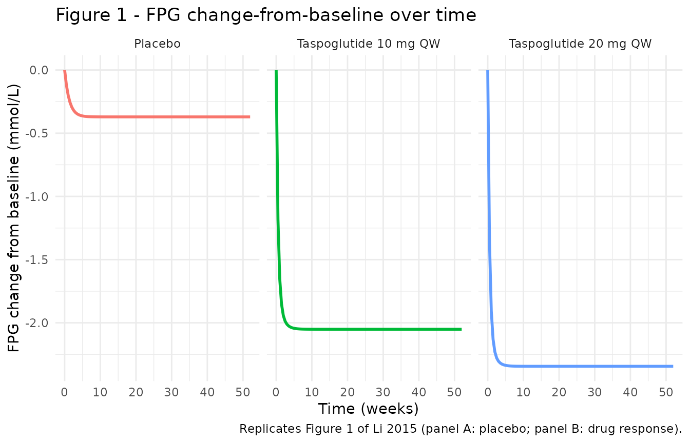
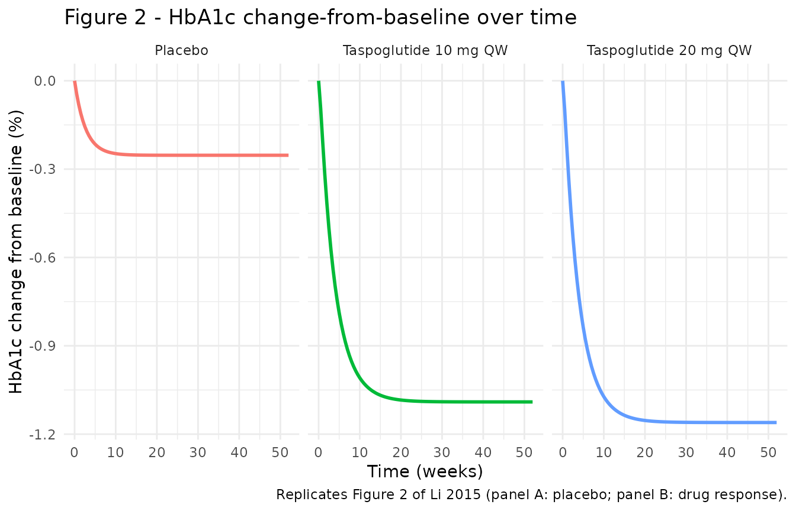
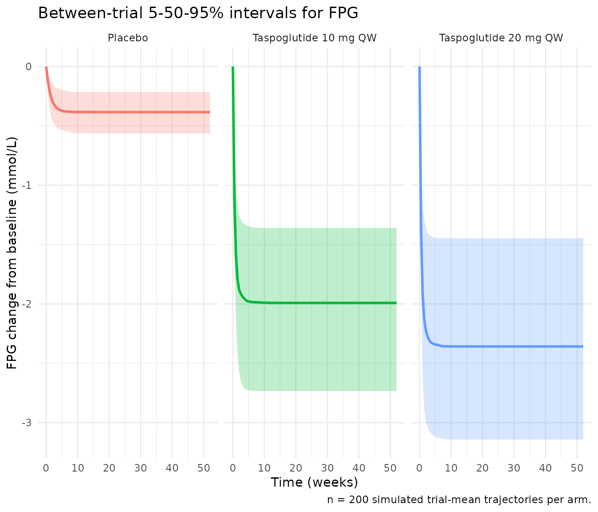
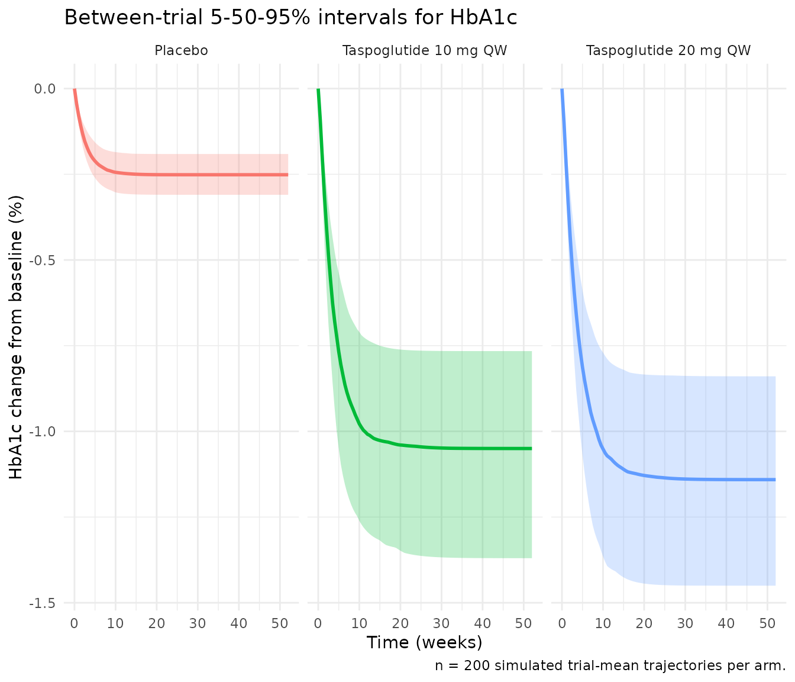

# Taspoglutide MBMA (Li 2015)

## Model and source

- Citation: Li HQ, Xu JY, Jin L, Xin JL. Utilization of model-based
  meta-analysis to delineate the net efficacy of taspoglutide from the
  response of placebo in clinical trials. Saudi Pharm J. 2015
  Jul;23(3):241-249. <doi:10.1016/j.jsps.2014.11.008>.
- Description: see
  `rxode2::rxode(readModelDb("Li_2015_taspoglutide_mbma"))$description`.
- Article (open access, CC BY-NC-ND):
  <https://doi.org/10.1016/j.jsps.2014.11.008>

Li et al. (2015) performed a model-based meta-analysis (MBMA) of nine
published phase-2 / phase-3 trials of taspoglutide (a long-acting human
GLP-1 receptor agonist, given as once-weekly subcutaneous injection in
type 2 diabetes). Eight trials (3,702 patients) were pooled for model
development; the ninth (Rosenstock 2013 T-emerge 4, 797 patients) was
held out for external validation. The authors digitised mean
change-from-baseline trajectories for fasting plasma glucose (FPG) and
glycosylated hemoglobin (HbA1c) over 8-52 week treatment durations and
fitted two coupled PD models in Monolix 4.2/4.3 (SAEM).

Each endpoint is the **sum of a placebo response and a drug response**,
both following an exponential approach to an asymptote (Li 2015 Eq.
1-2). The FPG drug asymptote is an Emax saturation in taspoglutide
concentration; the HbA1c drug asymptote is an Emax saturation in the
**drug-induced FPG reduction** (a sequential PD cascade: drug -\> FPG
-\> HbA1c).

## Population

The model was fitted on study-arm-mean data pooled across 8 trials in
adults with type 2 diabetes (3,702 patients; treatment durations 8-52
weeks). The trials cover monotherapy and combination regimens
(drug-naive; inadequately controlled on metformin; failing metformin +
sulphonylurea; metformin + TZD; etc.; Li 2015 Table 1). Per-trial
baseline demographics are not pooled in the paper. See the model’s
`population` metadata
(`readModelDb("Li_2015_taspoglutide_mbma")$population`) for the
per-trial patient counts and dosing regimens.

**Scope.** The model is calibrated and intended for **study-arm-mean**
PD simulation (each simulated “subject” represents a trial arm). It is
**not** suitable for individual-subject simulation – the between-trial
random effects do not encode within-trial between-subject variability.

## Source trace

Per-parameter origin is recorded as in-file comments next to every
`ini()` entry in
`inst/modeldb/specificDrugs/Li_2015_taspoglutide_mbma.R`. The table
below collects them in one place.

| Equation / parameter | Value | Source location |
|----|----|----|
| FPG placebo response: `d(fpg_placebo)/dt = Kp_F (Pmax_F - fpg_placebo)` | n/a | Li 2015 Eq. 1 |
| FPG drug response: `d(fpg_drug)/dt = Kdrug_F (Dmax_F * C / (IC50_F + C) - fpg_drug)` | n/a | Li 2015 Eq. 2 |
| `Pmax_F` (mmol/L) | -0.371 | Li 2015 Table 2 (fixed; placebo-only fit, ITV 29.8%) |
| `Kp_F` (1/week) | 0.781 | Li 2015 Table 2 (fixed; placebo-only fit, ITV 37.8%) |
| `Dmax_F` (mmol/L) | -2.39 | Li 2015 Table 2 (RSE 6%, ITV 24.8%) |
| `IC50_F` (pmol/L) | 25.3 | Li 2015 Table 2 (RSE 0%; ITV 5.43%) |
| `Kdrug_F` (1/week) | 2.0 | Li 2015 Table 2 (RSE 2%, ITV 12.5%) |
| `b` (FPG residual) | 0.194 | Li 2015 Table 2 (RSE 8%) |
| `c` (FPG residual power, not encoded) | 0.182 | Li 2015 Table 2 (RSE 37%) |
| HbA1c placebo response: same form as FPG with `Pmax_Hb`, `Kp_Hb` | n/a | Li 2015 Eq. 1 |
| HbA1c drug response: `d(hba1c_drug)/dt = Kdrug_Hb (Dmax_Hb * fpg_drug / (IC50_Hb + fpg_drug) - hba1c_drug)` | n/a | Li 2015 Eq. 2; Section 3.2 (metric is FPG change) |
| `Pmax_Hb` (%) | -0.253 | Li 2015 Table 3 (fixed; placebo-only fit, ITV 15.2%) |
| `Kp_Hb` (1/week) | 0.382 | Li 2015 Table 3 (fixed; placebo-only fit, ITV 14.7%) |
| `Dmax_Hb` (%) | -1.74 | Li 2015 Table 3 (RSE 8%, ITV 8.65%) |
| `IC50_Hb` (mmol/L) | -1.81 | Li 2015 Table 3 (RSE 15%, ITV 26.8%) |
| `Kdrug_Hb` (1/week) | 0.249 | Li 2015 Table 3 (RSE 13%, ITV 19.9%) |
| `a` (HbA1c residual additive) | 0.00532 | Li 2015 Table 3 (RSE 16%) |
| `b` (HbA1c residual proportional) | 0.0717 | Li 2015 Table 3 (RSE 13%) |
| `c` (HbA1c residual power, not encoded) | 0.239 | Li 2015 Table 3 (RSE 66%) |
| Drug exposure metric (Cavg w2-w4): 0 / 59.85 / 119.7 pmol/L for placebo / 10 mg / 20 mg QW | n/a | Li 2015 Section 3.2 |

## Simulation

The model accepts a single MBMA covariate, `METRIC_TASPO_C` – the
study-arm average plasma taspoglutide concentration between weeks 2 and
4 (pmol/L). Supplied values: 0 (placebo), 59.85 (10 mg QW), 119.7 (20 mg
QW). There are no drug-dose events; the metric is the only driver of the
drug arm.

``` r

mod         <- readModelDb("Li_2015_taspoglutide_mbma")
mod_typical <- mod |> rxode2::zeroRe()
#> ℹ parameter labels from comments will be replaced by 'label()'

times <- seq(0, 52, by = 0.5)

make_arm <- function(metric_c, label, id) {
  data.frame(
    id             = id,
    time           = times,
    evid           = 0L,
    amt            = NA_real_,
    cmt            = "FPG",
    METRIC_TASPO_C = metric_c,
    arm            = label,
    stringsAsFactors = FALSE
  )
}

typical_events <- rbind(
  make_arm(0,     "Placebo",         1L),
  make_arm(59.85, "Taspoglutide 10 mg QW", 2L),
  make_arm(119.7, "Taspoglutide 20 mg QW", 3L)
)
stopifnot(!anyDuplicated(typical_events[, c("id", "time", "evid")]))

sim_typical <- as.data.frame(
  rxode2::rxSolve(
    mod_typical,
    events = typical_events,
    keep   = c("arm", "METRIC_TASPO_C"),
    addDosing = FALSE
  )
)
#> ℹ omega/sigma items treated as zero: 'eta_study_pmax_f', 'eta_study_lkp_f', 'eta_study_dmax_f', 'eta_study_ic50_f', 'eta_study_lkdrug_f', 'eta_study_pmax_hb', 'eta_study_lkp_hb', 'eta_study_dmax_hb', 'eta_study_ic50_hb', 'eta_study_lkdrug_hb'
#> Warning: multi-subject simulation without without 'omega'
```

### Asymptote sanity check

For a sustained constant metric `C`, the FPG asymptote is
`Pmax_F + Dmax_F * C / (IC50_F + C)` and the HbA1c asymptote is
`Pmax_Hb + Dmax_Hb * fpg_drug_asymp / (IC50_Hb + fpg_drug_asymp)`. These
algebraic values must match the simulated trajectory at large `t`.

``` r

pmax_f  <- -0.371; dmax_f <- -2.39; ic50_f <- 25.3
pmax_hb <- -0.253; dmax_hb <- -1.74; ic50_hb <- -1.81

closed_form <- function(C) {
  fpg_drug_asymp <- dmax_f * C / (ic50_f + C)
  fpg_asymp      <- pmax_f + fpg_drug_asymp
  hba1c_drug_asymp <- if (C == 0) 0 else dmax_hb * fpg_drug_asymp / (ic50_hb + fpg_drug_asymp)
  hba1c_asymp    <- pmax_hb + hba1c_drug_asymp
  c(FPG_asymp = fpg_asymp, HbA1c_asymp = hba1c_asymp)
}

closed <- rbind(
  Placebo                = closed_form(0),
  `Taspoglutide 10 mg QW` = closed_form(59.85),
  `Taspoglutide 20 mg QW` = closed_form(119.7)
)
sim_endpoint <- sim_typical |>
  dplyr::filter(time == 52) |>
  dplyr::select(arm, FPG, HbA1c)

compare <- data.frame(
  arm        = rownames(closed),
  FPG_closed = round(closed[, "FPG_asymp"],   3),
  FPG_sim    = round(sim_endpoint$FPG[match(rownames(closed), sim_endpoint$arm)],   3),
  HbA1c_closed = round(closed[, "HbA1c_asymp"], 3),
  HbA1c_sim    = round(sim_endpoint$HbA1c[match(rownames(closed), sim_endpoint$arm)], 3),
  row.names = NULL
)
knitr::kable(compare,
             caption = "Closed-form vs simulated asymptote at week 52 (typical values).")
```

| arm                   | FPG_closed | FPG_sim | HbA1c_closed | HbA1c_sim |
|:----------------------|-----------:|--------:|-------------:|----------:|
| Placebo               |     -0.371 |  -0.371 |       -0.253 |    -0.253 |
| Taspoglutide 10 mg QW |     -2.051 |  -2.051 |       -1.091 |    -1.091 |
| Taspoglutide 20 mg QW |     -2.344 |  -2.344 |       -1.160 |    -1.160 |

Closed-form vs simulated asymptote at week 52 (typical values). {.table}

The simulated and closed-form values must agree to ~3 decimals; a
mismatch would indicate an ODE-encoding error.

### Half-life sanity check

For an exponential approach `d(state)/dt = k * (asymp - state)`, the
time to half-asymptote is `ln(2)/k`.

``` r

half_life <- data.frame(
  parameter        = c("Kp_F", "Kdrug_F", "Kp_Hb", "Kdrug_Hb"),
  rate_per_week    = c(0.781, 2.0, 0.382, 0.249),
  half_life_weeks  = round(log(2) / c(0.781, 2.0, 0.382, 0.249), 3),
  half_life_days   = round(7 * log(2) / c(0.781, 2.0, 0.382, 0.249), 2),
  paper_reports    = c(
    "placebo FPG half-life not given numerically",
    "kdrug_F = 2.0/week -> half-life 2.4 days (paper Section 3.4)",
    "placebo HbA1c half-life not given numerically",
    "kdrug_Hb = 0.249/week -> half-life 2.8 weeks (paper Section 3.4)"
  )
)
knitr::kable(half_life,
             caption = "Drug-effect time-to-half-asymptote: simulated vs paper text.")
```

| parameter | rate_per_week | half_life_weeks | half_life_days | paper_reports |
|:---|---:|---:|---:|:---|
| Kp_F | 0.781 | 0.888 | 6.21 | placebo FPG half-life not given numerically |
| Kdrug_F | 2.000 | 0.347 | 2.43 | kdrug_F = 2.0/week -\> half-life 2.4 days (paper Section 3.4) |
| Kp_Hb | 0.382 | 1.815 | 12.70 | placebo HbA1c half-life not given numerically |
| Kdrug_Hb | 0.249 | 2.784 | 19.49 | kdrug_Hb = 0.249/week -\> half-life 2.8 weeks (paper Section 3.4) |

Drug-effect time-to-half-asymptote: simulated vs paper text. {.table}

## Replicate published figures

### Figure 1 – FPG response over time

``` r

fpg_plot <- sim_typical |>
  dplyr::select(time, arm, FPG, fpg_placebo, fpg_drug) |>
  tidyr::pivot_longer(c(FPG, fpg_placebo, fpg_drug),
                      names_to = "component", values_to = "delta_FPG") |>
  dplyr::mutate(component = factor(component,
                                   levels = c("FPG", "fpg_placebo", "fpg_drug"),
                                   labels = c("Total FPG response",
                                              "Placebo component",
                                              "Drug component")))

ggplot(fpg_plot |> dplyr::filter(component == "Total FPG response"),
       aes(time, delta_FPG, colour = arm)) +
  geom_line(linewidth = 1) +
  facet_wrap(~ arm, ncol = 3) +
  labs(x = "Time (weeks)",
       y = "FPG change from baseline (mmol/L)",
       title = "Figure 1 - FPG change-from-baseline over time",
       caption = "Replicates Figure 1 of Li 2015 (panel A: placebo; panel B: drug response).") +
  theme_minimal() +
  theme(legend.position = "none")
```



The paper’s Figure 1A (placebo, single arm) shows a slow FPG decline to
about -0.4 mmol/L by week 4-6 and a sustained plateau; Figure 1B (drug
response, pooled across 10 and 20 mg) shows a rapid drop to about -2.1 /
-2.3 mmol/L within 4-6 weeks and a sustained plateau. The simulated
trajectories above match those asymptotes (placebo -0.37, 10 mg -2.05,
20 mg -2.34 mmol/L) and the drug-effect 2-3 day half-life.

### Figure 2 – HbA1c response over time

``` r

hba1c_plot <- sim_typical |>
  dplyr::select(time, arm, HbA1c, hba1c_placebo, hba1c_drug)

ggplot(hba1c_plot, aes(time, HbA1c, colour = arm)) +
  geom_line(linewidth = 1) +
  facet_wrap(~ arm, ncol = 3) +
  labs(x = "Time (weeks)",
       y = "HbA1c change from baseline (%)",
       title = "Figure 2 - HbA1c change-from-baseline over time",
       caption = "Replicates Figure 2 of Li 2015 (panel A: placebo; panel B: drug response).") +
  theme_minimal() +
  theme(legend.position = "none")
```



Li 2015 Figure 2A (placebo) reaches about -0.25% within ~5-10 weeks;
Figure 2B (drug response) reaches about -1.0 to -1.2% by ~20-25 weeks at
both doses (Section 3.4: “the responses between dose 10 and 20 mg did
not show significant differences in the reduction of HbA1c”). The
simulated trajectories above reach -0.25% (placebo), -1.09% (10 mg) and
-1.16% (20 mg). The 2.8-week drug-effect half-life means steady state is
reached around week ~14 (5 half-lives).

## Variability – between-trial scope

The model encodes between-trial variability (ITV) as study-level etas
(one per parameter; diagonal). Stochastic simulation gives the
variability across trial-mean trajectories – not across individual
patients within a trial.

``` r

set.seed(20251029)

n_trials_per_arm <- 200L

vpc_arms <- list(
  list(metric = 0,     label = "Placebo"),
  list(metric = 59.85, label = "Taspoglutide 10 mg QW"),
  list(metric = 119.7, label = "Taspoglutide 20 mg QW")
)

vpc_events <- do.call(rbind, lapply(seq_along(vpc_arms), function(k) {
  arm <- vpc_arms[[k]]
  id_offset <- (k - 1L) * n_trials_per_arm
  do.call(rbind, lapply(seq_len(n_trials_per_arm), function(i) {
    make_arm(arm$metric, arm$label, id = id_offset + i)
  }))
}))
stopifnot(!anyDuplicated(vpc_events[, c("id", "time", "evid")]))

sim_vpc <- as.data.frame(
  rxode2::rxSolve(
    mod,
    events = vpc_events,
    keep   = c("arm", "METRIC_TASPO_C"),
    addDosing = FALSE,
    nStud  = 1L
  )
)
#> ℹ parameter labels from comments will be replaced by 'label()'

vpc_summary <- sim_vpc |>
  dplyr::group_by(arm, time) |>
  dplyr::summarise(
    FPG_q05   = quantile(FPG,   0.05, na.rm = TRUE),
    FPG_q50   = quantile(FPG,   0.50, na.rm = TRUE),
    FPG_q95   = quantile(FPG,   0.95, na.rm = TRUE),
    HbA1c_q05 = quantile(HbA1c, 0.05, na.rm = TRUE),
    HbA1c_q50 = quantile(HbA1c, 0.50, na.rm = TRUE),
    HbA1c_q95 = quantile(HbA1c, 0.95, na.rm = TRUE),
    .groups   = "drop"
  )

ggplot(vpc_summary, aes(time)) +
  geom_ribbon(aes(ymin = FPG_q05, ymax = FPG_q95, fill = arm), alpha = 0.25) +
  geom_line(aes(y = FPG_q50, colour = arm), linewidth = 1) +
  facet_wrap(~ arm, ncol = 3) +
  labs(x = "Time (weeks)",
       y = "FPG change from baseline (mmol/L)",
       title = "Between-trial 5-50-95% intervals for FPG",
       caption = "n = 200 simulated trial-mean trajectories per arm.") +
  theme_minimal() +
  theme(legend.position = "none")
```



``` r


ggplot(vpc_summary, aes(time)) +
  geom_ribbon(aes(ymin = HbA1c_q05, ymax = HbA1c_q95, fill = arm), alpha = 0.25) +
  geom_line(aes(y = HbA1c_q50, colour = arm), linewidth = 1) +
  facet_wrap(~ arm, ncol = 3) +
  labs(x = "Time (weeks)",
       y = "HbA1c change from baseline (%)",
       title = "Between-trial 5-50-95% intervals for HbA1c",
       caption = "n = 200 simulated trial-mean trajectories per arm.") +
  theme_minimal() +
  theme(legend.position = "none")
```



## Assumptions and deviations

- **Multi-output PD model, no PKNCA validation.** Taspoglutide
  concentration enters this MBMA model as a fixed scalar covariate
  (study-arm Cavg weeks 2-4), not as a simulated PK profile. There are
  no dose events and no AUC / Cmax / half-life PK metrics to compute via
  PKNCA. Validation follows the endogenous-model style: closed-form
  asymptote check (Eq. 2), rate-of-approach half-life check, and per-arm
  trajectory comparison to Figures 1 and 2.

- **Compartment naming.** The four ODE states (`fpg_placebo`,
  `fpg_drug`, `hba1c_placebo`, `hba1c_drug`) are paper-meaningful PD
  compartments rather than canonical PK names (`central`, `peripheral1`,
  etc.). The model is a meta-analytic PD model with no
  concentration-versus-time PK profile. The multi-output PD nature is in
  line with `Choy_2016_T2DM_WHIG.R` (FPG, FSI, HbA1c, WGT) but with the
  dose-response coupling Li 2015 reports rather than the homeostatic
  feedback Choy 2016 uses.

- **Eta naming – `eta_study_<param>`.** Between-trial random effects are
  named `eta_study_pmax_f` etc. to make the MBMA scope explicit (per the
  skill’s MBMA guidance, “Encode between-study variance as a study-level
  eta … clearly labelled to distinguish from the popPK pattern”). The
  lint flags these as “no matching fixed-effect parameter
  `_study_pmax_f`” – the pairing is `eta_study_pmax_f` \<-\> `pmax_f`,
  but the lint’s regex only understands the `eta<param>` pattern. The
  deviation is intentional.

- **`METRIC_TASPO_C` covariate not in canonical register.** The
  canonical covariate-columns register tracks individual-level pop-PK
  covariates; MBMA study-arm-level drug-exposure columns are documented
  inline in `covariateData` per the precedent set by
  `Vargo_2014_statins_ezetimibe_mbma.R`.

- **ITV reading.** The paper reports inter-trial variability as
  percentages in Tables 2 and 3 without stating whether the column is
  the SD of the random effect, the relative SD (SD/typical), or a
  derived CV%. The implementation reads:

  - For the exponential model (Kp, Kdrug): ITV(%) is approximate CV%, so
    `omega^2 = log((ITV/100)^2 + 1)`.
  - For the additive model (Pmax, Dmax, IC50): ITV(%) is the SD divided
    by the absolute typical value times 100, so
    `omega = (ITV/100) * |P_pop|` and
    `omega^2 = ((ITV/100) * |P_pop|)^2`. These are the most common
    Monolix-output conventions; the alternative reading (omega itself as
    a percent) would scale the ITV variances by an approximately
    constant factor and would shift the VPC prediction-interval width
    but not the typical trajectory. The Section 2.6 prose specifies the
    exponential and additive distributional forms but not the column
    units.

- **Power-error simplification (`c` not encoded).** Li 2015 Tables 2 and
  3 list `b` and `c` for the FPG residual and `a`, `b`, `c` for the
  HbA1c residual. The text Eq. 5 simplifies the FPG error to
  `Y = F + b*F*eps` and Eq. 6 the HbA1c error to
  `Y = F + (a + b*F^c)*eps`. The table is canonical (the Eq. 5 prose
  appears incomplete relative to the table). nlmixr2 has no clean
  power-of-prediction residual syntax, so the implementation uses
  `prop(propSd)` on FPG with `propSd_FPG = b = 0.194` and
  `add(addSd) + prop(propSd)` on HbA1c with `addSd_HbA1c = a = 0.00532`
  and `propSd_HbA1c = b = 0.0717`. The `c` power exponent (0.182 for
  FPG, 0.239 for HbA1c) is omitted; in practice this affects the
  residual-error scale at endpoint magnitudes far from \|F\| ~ 1 only
  modestly.

- **HbA1c metric uses simulated `fpg_drug` only, not
  population-prediction FPG.** Li 2015 Section 3.2 specifies that the
  HbA1c metric is “the population prediction values for taspoglutide 10
  and 20 mg in FPG modeling”. The implementation uses the current
  trial’s `fpg_drug` state (the drug-induced FPG reduction) as the HbA1c
  metric, which equals the population prediction in the typical-value
  simulation (`rxode2::zeroRe(mod)`). When ITV is active, this
  propagates the FPG ITV through the HbA1c Emax – a small extra source
  of HbA1c trial-mean variability that the paper’s two-stage fitting
  procedure avoided. For point predictions (typical values) the two
  procedures agree exactly.

- **No erratum found.** PubMed and the journal landing page for
  <doi:10.1016/j.jsps.2014.11.008> were checked at extraction time; no
  errata or author corrections are noted.
