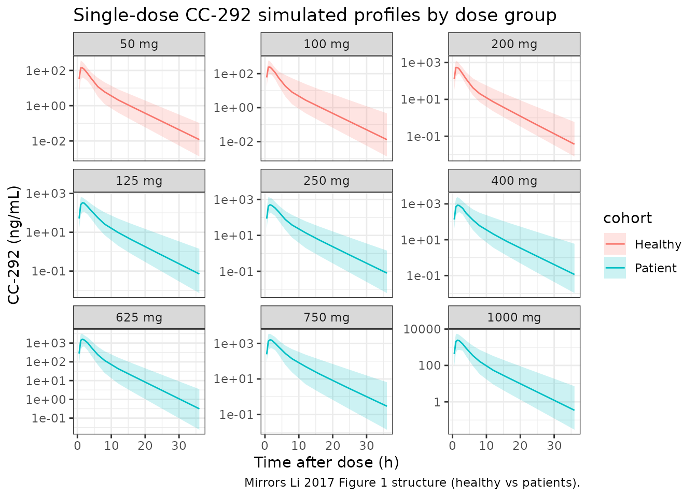
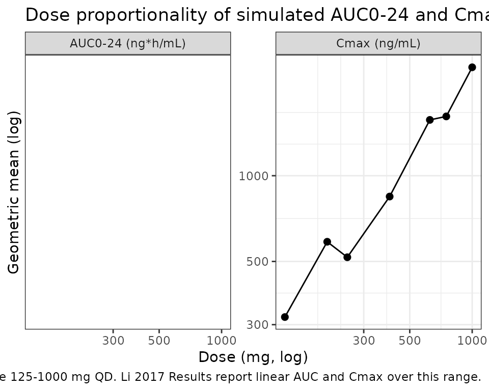

# CC-292 (Li 2017)

## Model and source

- Citation: Li Y, Ramirez-Valle F, Xue Y, Ventura JI, Gouedard O, Mei J,
  Takeshita K, Palmisano M, Zhou S. Population Pharmacokinetics and
  Exposure Response Assessment of CC-292, a Potent BTK Inhibitor, in
  Patients With Chronic Lymphocytic Leukemia. J Clin Pharmacol.
  2017;57(10):1279-1289. <doi:10.1002/jcph.923>
- Description: Two-compartment population PK model for oral CC-292
  (spebrutinib, a potent Bruton tyrosine kinase inhibitor) in 145 pooled
  subjects: 32 healthy adults (AVL-292-004) and 113 patients with
  relapsed and/or refractory B-cell malignancies including chronic
  lymphocytic leukemia (AVL-292-003). First-order absorption with a
  single absorption lag, linear elimination from the central
  compartment, with linear-deviation female-sex effect on apparent
  clearance (females have 26% lower CL/F) and a power age effect on
  apparent central volume (reference age 62 years). Residual variability
  is split into healthy-volunteer and patient strata.
- Article: <https://doi.org/10.1002/jcph.923>

## Population

The model was fit to 145 subjects contributing 3156 plasma observations:
32 healthy adults from study AVL-292-004 (Part 1, 7-day QD multiple-dose
at 50, 100, or 200 mg) and 113 patients with relapsed and/or refractory
B-cell malignancies from study AVL-292-003 (QD doses 125-1000 mg or BID
doses 375 or 500 mg in 28-day cycles). Median age 62 years (range
20-89), median body weight 79.5 kg (range 49.9-128.4), 60% male, 83.4%
white. 25 of 145 subjects (17.2%) had moderate renal impairment (CLcr
30-60 mL/min); no subjects had severe renal impairment. Baseline
demographics are summarised in Li 2017 Table 1.

The same information is available programmatically via
`readModelDb("Li_2017_CC292")$population`.

## Source trace

Parameter provenance for each
[`ini()`](https://nlmixr2.github.io/rxode2/reference/ini.html) entry
(also recorded as a comment beside the value in the model file):

| Equation / parameter | Value | Source location |
|----|----|----|
| `lka` (ka, 1/h) | log(0.974) | Table 2 |
| `lcl` (CL/F, L/h) | log(134) | Table 2 |
| `lvc` (V2/F, L) | log(158) | Table 2 |
| `lq` (Q/F, L/h) | log(18.7) | Table 2 |
| `lvp` (V3/F, L) | log(72) | Table 2 |
| `lalag` (Alag1, h) | log(0.427) | Table 2 |
| `e_sexf_cl` (female effect on CL/F) | -0.26 | Table 2 (magnitude 0.26); page 1283 covariate equations |
| `e_age_vc` (power exponent (AGE/62) on V2/F) | 0.946 | Table 2; page 1283 covariate equations |
| `etalcl` (var of eta on log CL/F) | 0.317 | Table 2 (omega^2 CL/F) |
| `etalvc` (var of eta on log V2/F) | 0.755 | Table 2 (omega^2 V2/F) |
| `eta` block covariance | 0.328 | Table 2 (omega(V2/F):omega(CL/F)) |
| `propSd_hv` (HNP residual SD) | sqrt(0.234) | Table 2 (HNP variance row) |
| `propSd_pt` (Patients residual SD) | sqrt(0.659) | Table 2 (Patients variance row) |
| 2-compartment ODE with first-order absorption + lag | – | Methods, Population Pharmacokinetic Model Building |
| Stratified residual (HNP vs Patients) | – | Methods, Population Pharmacokinetic Model Building |
| Sex linear-deviation effect form | – | Methods, Categorical covariates equation |
| Age power-equation effect form | – | Methods, Power equation |

## Load the model

``` r

mod <- readModelDb("Li_2017_CC292")
```

## Virtual cohort – pooled healthy + patient design

The simulation below mimics the dose levels actually studied in
AVL-292-004 and AVL-292-003, with a 60/40 male/female split and an age
distribution roughly approximating Li 2017 Table 1 (median 62 years;
healthy subjects were younger, patients older). Each subject receives a
single oral dose followed by 36-hour sampling so PKNCA can compute Cmax
/ Tmax / AUC over a full 24-hour interval; multiple-dose results are
checked separately below.

``` r

set.seed(2017)

dose_levels <- c(50, 100, 200, 125, 250, 400, 625, 750, 1000)
labels      <- paste0(dose_levels, " mg")

# n per dose group; keep small so the vignette finishes well under 5 min
n_per <- 50

make_cohort <- function(dose_mg, label, id_offset) {
  n   <- n_per
  ids <- id_offset + seq_len(n)
  # First three doses correspond to AVL-292-004 healthy adults; the rest are
  # patients from AVL-292-003. SEXF, AGE, DIS_HEALTHY drawn to roughly mirror
  # Li 2017 Table 1.
  is_healthy <- as.integer(dose_mg %in% c(50, 100, 200))
  age_mean   <- if (is_healthy == 1) 40 else 65
  ages       <- pmin(pmax(round(rnorm(n, age_mean, 12)), 20), 89)
  sexf       <- rbinom(n, 1, if (is_healthy == 1) 0.28 else 0.43)
  cov_df <- tibble::tibble(id = ids, SEXF = sexf, AGE = ages,
                           DIS_HEALTHY = is_healthy, dose_group = label)
  dose_df <- tibble::tibble(
    id   = ids, time = 0, evid = 1L, amt = dose_mg, cmt = "depot"
  ) |> dplyr::left_join(cov_df, by = "id")
  obs_times <- c(0.5, 1, 1.5, 2, 3, 4, 6, 8, 12, 16, 24, 30, 36)
  obs_df <- tidyr::expand_grid(id = ids, time = obs_times) |>
    dplyr::mutate(evid = 0L, amt = 0, cmt = "central") |>
    dplyr::left_join(cov_df, by = "id")
  dplyr::bind_rows(dose_df, obs_df) |>
    dplyr::arrange(id, time, dplyr::desc(evid))
}

events <- dplyr::bind_rows(
  lapply(seq_along(dose_levels), function(i) {
    make_cohort(dose_levels[i], labels[i],
                id_offset = (i - 1L) * n_per)
  })
)

# Disjoint-ID assertion (vignette-template.md guidance for multi-cohort
# bind_rows simulations).
stopifnot(!anyDuplicated(unique(events[, c("id", "time", "evid")])))
```

## Simulate

``` r

sim <- rxode2::rxSolve(
  mod,
  events = events,
  keep   = c("dose_group", "DIS_HEALTHY", "SEXF", "AGE")
)
#> ℹ parameter labels from comments will be replaced by 'label()'
sim_df <- as.data.frame(sim) |> dplyr::filter(time > 0)
```

## Figure – single-dose concentration profiles by dose group

A VPC-style summary by dose group (median and 5/95 percentiles) after a
single oral dose. Replicates the structure of Li 2017 Figure 1
(individual dose-normalized concentration-vs-time profiles, healthy vs
patients).

``` r

sim_df |>
  dplyr::group_by(dose_group, time, DIS_HEALTHY) |>
  dplyr::summarise(
    Q05 = quantile(Cc, 0.05, na.rm = TRUE),
    Q50 = quantile(Cc, 0.50, na.rm = TRUE),
    Q95 = quantile(Cc, 0.95, na.rm = TRUE),
    .groups = "drop"
  ) |>
  dplyr::mutate(
    cohort = ifelse(DIS_HEALTHY == 1, "Healthy", "Patient"),
    dose_group = factor(
      dose_group,
      levels = paste0(c(50, 100, 200, 125, 250, 400, 625, 750, 1000), " mg")
    )
  ) |>
  ggplot(aes(time, Q50, colour = cohort, fill = cohort)) +
  geom_ribbon(aes(ymin = Q05, ymax = Q95), alpha = 0.2, colour = NA) +
  geom_line() +
  facet_wrap(~ dose_group, scales = "free_y") +
  scale_y_log10() +
  labs(x = "Time after dose (h)", y = "CC-292 (ng/mL)",
       title = "Single-dose CC-292 simulated profiles by dose group",
       caption = "Mirrors Li 2017 Figure 1 structure (healthy vs patients).") +
  theme_bw()
```



## PKNCA validation

Single-dose NCA over the 0-24 h interval per dose group:

``` r

sim_nca <- sim_df |>
  dplyr::filter(time <= 24, !is.na(Cc)) |>
  dplyr::select(id, time, Cc, dose_group)

dose_nca <- events |>
  dplyr::filter(evid == 1L) |>
  dplyr::select(id, time, amt, dose_group)

conc_obj <- PKNCA::PKNCAconc(sim_nca, Cc ~ time | dose_group + id,
                             concu = "ng/mL", timeu = "h")
dose_obj <- PKNCA::PKNCAdose(dose_nca, amt ~ time | dose_group + id,
                             doseu = "mg")

intervals <- data.frame(
  start      = 0,
  end        = 24,
  cmax       = TRUE,
  tmax       = TRUE,
  auclast    = TRUE,
  half.life  = TRUE
)

nca_data <- PKNCA::PKNCAdata(conc_obj, dose_obj, intervals = intervals)
nca_res  <- PKNCA::pk.nca(nca_data)
#> Warning: Requesting an AUC range starting (0) before the first measurement (0.5) is not allowed
#> Requesting an AUC range starting (0) before the first measurement (0.5) is not allowed
#> Requesting an AUC range starting (0) before the first measurement (0.5) is not allowed
#> Requesting an AUC range starting (0) before the first measurement (0.5) is not allowed
#> Requesting an AUC range starting (0) before the first measurement (0.5) is not allowed
#> Requesting an AUC range starting (0) before the first measurement (0.5) is not allowed
#> Requesting an AUC range starting (0) before the first measurement (0.5) is not allowed
#> Requesting an AUC range starting (0) before the first measurement (0.5) is not allowed
#> Requesting an AUC range starting (0) before the first measurement (0.5) is not allowed
#> Requesting an AUC range starting (0) before the first measurement (0.5) is not allowed
#> Requesting an AUC range starting (0) before the first measurement (0.5) is not allowed
#> Requesting an AUC range starting (0) before the first measurement (0.5) is not allowed
#> Requesting an AUC range starting (0) before the first measurement (0.5) is not allowed
#> Requesting an AUC range starting (0) before the first measurement (0.5) is not allowed
#> Requesting an AUC range starting (0) before the first measurement (0.5) is not allowed
#> Requesting an AUC range starting (0) before the first measurement (0.5) is not allowed
#> Requesting an AUC range starting (0) before the first measurement (0.5) is not allowed
#> Requesting an AUC range starting (0) before the first measurement (0.5) is not allowed
#> Requesting an AUC range starting (0) before the first measurement (0.5) is not allowed
#> Requesting an AUC range starting (0) before the first measurement (0.5) is not allowed
#> Requesting an AUC range starting (0) before the first measurement (0.5) is not allowed
#> Requesting an AUC range starting (0) before the first measurement (0.5) is not allowed
#> Requesting an AUC range starting (0) before the first measurement (0.5) is not allowed
#> Requesting an AUC range starting (0) before the first measurement (0.5) is not allowed
#> Requesting an AUC range starting (0) before the first measurement (0.5) is not allowed
#> Requesting an AUC range starting (0) before the first measurement (0.5) is not allowed
#> Requesting an AUC range starting (0) before the first measurement (0.5) is not allowed
#> Requesting an AUC range starting (0) before the first measurement (0.5) is not allowed
#> Requesting an AUC range starting (0) before the first measurement (0.5) is not allowed
#> Requesting an AUC range starting (0) before the first measurement (0.5) is not allowed
#> Requesting an AUC range starting (0) before the first measurement (0.5) is not allowed
#> Requesting an AUC range starting (0) before the first measurement (0.5) is not allowed
#> Requesting an AUC range starting (0) before the first measurement (0.5) is not allowed
#> Requesting an AUC range starting (0) before the first measurement (0.5) is not allowed
#> Requesting an AUC range starting (0) before the first measurement (0.5) is not allowed
#> Requesting an AUC range starting (0) before the first measurement (0.5) is not allowed
#> Requesting an AUC range starting (0) before the first measurement (0.5) is not allowed
#> Requesting an AUC range starting (0) before the first measurement (0.5) is not allowed
#> Requesting an AUC range starting (0) before the first measurement (0.5) is not allowed
#> Requesting an AUC range starting (0) before the first measurement (0.5) is not allowed
#> Requesting an AUC range starting (0) before the first measurement (0.5) is not allowed
#> Requesting an AUC range starting (0) before the first measurement (0.5) is not allowed
#> Requesting an AUC range starting (0) before the first measurement (0.5) is not allowed
#> Requesting an AUC range starting (0) before the first measurement (0.5) is not allowed
#> Requesting an AUC range starting (0) before the first measurement (0.5) is not allowed
#> Requesting an AUC range starting (0) before the first measurement (0.5) is not allowed
#> Requesting an AUC range starting (0) before the first measurement (0.5) is not allowed
#> Requesting an AUC range starting (0) before the first measurement (0.5) is not allowed
#> Requesting an AUC range starting (0) before the first measurement (0.5) is not allowed
#> Requesting an AUC range starting (0) before the first measurement (0.5) is not allowed
#> Requesting an AUC range starting (0) before the first measurement (0.5) is not allowed
#> Requesting an AUC range starting (0) before the first measurement (0.5) is not allowed
#> Requesting an AUC range starting (0) before the first measurement (0.5) is not allowed
#> Requesting an AUC range starting (0) before the first measurement (0.5) is not allowed
#> Requesting an AUC range starting (0) before the first measurement (0.5) is not allowed
#> Requesting an AUC range starting (0) before the first measurement (0.5) is not allowed
#> Requesting an AUC range starting (0) before the first measurement (0.5) is not allowed
#> Requesting an AUC range starting (0) before the first measurement (0.5) is not allowed
#> Requesting an AUC range starting (0) before the first measurement (0.5) is not allowed
#> Requesting an AUC range starting (0) before the first measurement (0.5) is not allowed
#> Requesting an AUC range starting (0) before the first measurement (0.5) is not allowed
#> Requesting an AUC range starting (0) before the first measurement (0.5) is not allowed
#> Requesting an AUC range starting (0) before the first measurement (0.5) is not allowed
#> Requesting an AUC range starting (0) before the first measurement (0.5) is not allowed
#> Requesting an AUC range starting (0) before the first measurement (0.5) is not allowed
#> Requesting an AUC range starting (0) before the first measurement (0.5) is not allowed
#> Requesting an AUC range starting (0) before the first measurement (0.5) is not allowed
#> Requesting an AUC range starting (0) before the first measurement (0.5) is not allowed
#> Requesting an AUC range starting (0) before the first measurement (0.5) is not allowed
#> Requesting an AUC range starting (0) before the first measurement (0.5) is not allowed
#> Requesting an AUC range starting (0) before the first measurement (0.5) is not allowed
#> Requesting an AUC range starting (0) before the first measurement (0.5) is not allowed
#> Requesting an AUC range starting (0) before the first measurement (0.5) is not allowed
#> Requesting an AUC range starting (0) before the first measurement (0.5) is not allowed
#> Requesting an AUC range starting (0) before the first measurement (0.5) is not allowed
#> Requesting an AUC range starting (0) before the first measurement (0.5) is not allowed
#> Requesting an AUC range starting (0) before the first measurement (0.5) is not allowed
#> Requesting an AUC range starting (0) before the first measurement (0.5) is not allowed
#> Requesting an AUC range starting (0) before the first measurement (0.5) is not allowed
#> Requesting an AUC range starting (0) before the first measurement (0.5) is not allowed
#> Requesting an AUC range starting (0) before the first measurement (0.5) is not allowed
#> Requesting an AUC range starting (0) before the first measurement (0.5) is not allowed
#> Requesting an AUC range starting (0) before the first measurement (0.5) is not allowed
#> Requesting an AUC range starting (0) before the first measurement (0.5) is not allowed
#> Requesting an AUC range starting (0) before the first measurement (0.5) is not allowed
#>  ■■■■■■■                           19% |  ETA:  5s
#> Warning: Requesting an AUC range starting (0) before the first measurement (0.5) is not allowed
#> Requesting an AUC range starting (0) before the first measurement (0.5) is not allowed
#> Requesting an AUC range starting (0) before the first measurement (0.5) is not allowed
#> Requesting an AUC range starting (0) before the first measurement (0.5) is not allowed
#> Requesting an AUC range starting (0) before the first measurement (0.5) is not allowed
#> Requesting an AUC range starting (0) before the first measurement (0.5) is not allowed
#> Requesting an AUC range starting (0) before the first measurement (0.5) is not allowed
#> Requesting an AUC range starting (0) before the first measurement (0.5) is not allowed
#> Requesting an AUC range starting (0) before the first measurement (0.5) is not allowed
#> Requesting an AUC range starting (0) before the first measurement (0.5) is not allowed
#> Requesting an AUC range starting (0) before the first measurement (0.5) is not allowed
#> Requesting an AUC range starting (0) before the first measurement (0.5) is not allowed
#> Requesting an AUC range starting (0) before the first measurement (0.5) is not allowed
#> Requesting an AUC range starting (0) before the first measurement (0.5) is not allowed
#> Requesting an AUC range starting (0) before the first measurement (0.5) is not allowed
#> Requesting an AUC range starting (0) before the first measurement (0.5) is not allowed
#> Requesting an AUC range starting (0) before the first measurement (0.5) is not allowed
#> Requesting an AUC range starting (0) before the first measurement (0.5) is not allowed
#> Requesting an AUC range starting (0) before the first measurement (0.5) is not allowed
#> Requesting an AUC range starting (0) before the first measurement (0.5) is not allowed
#> Requesting an AUC range starting (0) before the first measurement (0.5) is not allowed
#> Requesting an AUC range starting (0) before the first measurement (0.5) is not allowed
#> Requesting an AUC range starting (0) before the first measurement (0.5) is not allowed
#> Requesting an AUC range starting (0) before the first measurement (0.5) is not allowed
#> Requesting an AUC range starting (0) before the first measurement (0.5) is not allowed
#> Requesting an AUC range starting (0) before the first measurement (0.5) is not allowed
#> Requesting an AUC range starting (0) before the first measurement (0.5) is not allowed
#> Requesting an AUC range starting (0) before the first measurement (0.5) is not allowed
#> Requesting an AUC range starting (0) before the first measurement (0.5) is not allowed
#> Requesting an AUC range starting (0) before the first measurement (0.5) is not allowed
#> Requesting an AUC range starting (0) before the first measurement (0.5) is not allowed
#> Requesting an AUC range starting (0) before the first measurement (0.5) is not allowed
#> Requesting an AUC range starting (0) before the first measurement (0.5) is not allowed
#> Requesting an AUC range starting (0) before the first measurement (0.5) is not allowed
#> Requesting an AUC range starting (0) before the first measurement (0.5) is not allowed
#> Requesting an AUC range starting (0) before the first measurement (0.5) is not allowed
#> Requesting an AUC range starting (0) before the first measurement (0.5) is not allowed
#> Requesting an AUC range starting (0) before the first measurement (0.5) is not allowed
#> Requesting an AUC range starting (0) before the first measurement (0.5) is not allowed
#> Requesting an AUC range starting (0) before the first measurement (0.5) is not allowed
#> Requesting an AUC range starting (0) before the first measurement (0.5) is not allowed
#> Requesting an AUC range starting (0) before the first measurement (0.5) is not allowed
#> Requesting an AUC range starting (0) before the first measurement (0.5) is not allowed
#> Requesting an AUC range starting (0) before the first measurement (0.5) is not allowed
#> Requesting an AUC range starting (0) before the first measurement (0.5) is not allowed
#> Requesting an AUC range starting (0) before the first measurement (0.5) is not allowed
#> Requesting an AUC range starting (0) before the first measurement (0.5) is not allowed
#> Requesting an AUC range starting (0) before the first measurement (0.5) is not allowed
#> Requesting an AUC range starting (0) before the first measurement (0.5) is not allowed
#> Requesting an AUC range starting (0) before the first measurement (0.5) is not allowed
#> Requesting an AUC range starting (0) before the first measurement (0.5) is not allowed
#> Requesting an AUC range starting (0) before the first measurement (0.5) is not allowed
#> Requesting an AUC range starting (0) before the first measurement (0.5) is not allowed
#> Requesting an AUC range starting (0) before the first measurement (0.5) is not allowed
#> Requesting an AUC range starting (0) before the first measurement (0.5) is not allowed
#> Requesting an AUC range starting (0) before the first measurement (0.5) is not allowed
#> Requesting an AUC range starting (0) before the first measurement (0.5) is not allowed
#> Requesting an AUC range starting (0) before the first measurement (0.5) is not allowed
#> Requesting an AUC range starting (0) before the first measurement (0.5) is not allowed
#> Requesting an AUC range starting (0) before the first measurement (0.5) is not allowed
#> Requesting an AUC range starting (0) before the first measurement (0.5) is not allowed
#> Requesting an AUC range starting (0) before the first measurement (0.5) is not allowed
#> Requesting an AUC range starting (0) before the first measurement (0.5) is not allowed
#> Requesting an AUC range starting (0) before the first measurement (0.5) is not allowed
#> Requesting an AUC range starting (0) before the first measurement (0.5) is not allowed
#> Requesting an AUC range starting (0) before the first measurement (0.5) is not allowed
#> Requesting an AUC range starting (0) before the first measurement (0.5) is not allowed
#> Requesting an AUC range starting (0) before the first measurement (0.5) is not allowed
#> Requesting an AUC range starting (0) before the first measurement (0.5) is not allowed
#> Requesting an AUC range starting (0) before the first measurement (0.5) is not allowed
#> Requesting an AUC range starting (0) before the first measurement (0.5) is not allowed
#> Requesting an AUC range starting (0) before the first measurement (0.5) is not allowed
#> Requesting an AUC range starting (0) before the first measurement (0.5) is not allowed
#> Requesting an AUC range starting (0) before the first measurement (0.5) is not allowed
#> Requesting an AUC range starting (0) before the first measurement (0.5) is not allowed
#> Requesting an AUC range starting (0) before the first measurement (0.5) is not allowed
#> Requesting an AUC range starting (0) before the first measurement (0.5) is not allowed
#> Requesting an AUC range starting (0) before the first measurement (0.5) is not allowed
#> Requesting an AUC range starting (0) before the first measurement (0.5) is not allowed
#> Requesting an AUC range starting (0) before the first measurement (0.5) is not allowed
#> Requesting an AUC range starting (0) before the first measurement (0.5) is not allowed
#> Requesting an AUC range starting (0) before the first measurement (0.5) is not allowed
#> Requesting an AUC range starting (0) before the first measurement (0.5) is not allowed
#> Requesting an AUC range starting (0) before the first measurement (0.5) is not allowed
#> Requesting an AUC range starting (0) before the first measurement (0.5) is not allowed
#> Requesting an AUC range starting (0) before the first measurement (0.5) is not allowed
#> Requesting an AUC range starting (0) before the first measurement (0.5) is not allowed
#> Requesting an AUC range starting (0) before the first measurement (0.5) is not allowed
#> Requesting an AUC range starting (0) before the first measurement (0.5) is not allowed
#> Requesting an AUC range starting (0) before the first measurement (0.5) is not allowed
#> Requesting an AUC range starting (0) before the first measurement (0.5) is not allowed
#> Requesting an AUC range starting (0) before the first measurement (0.5) is not allowed
#> Requesting an AUC range starting (0) before the first measurement (0.5) is not allowed
#> Requesting an AUC range starting (0) before the first measurement (0.5) is not allowed
#> Requesting an AUC range starting (0) before the first measurement (0.5) is not allowed
#> Requesting an AUC range starting (0) before the first measurement (0.5) is not allowed
#> Requesting an AUC range starting (0) before the first measurement (0.5) is not allowed
#> Requesting an AUC range starting (0) before the first measurement (0.5) is not allowed
#> Requesting an AUC range starting (0) before the first measurement (0.5) is not allowed
#> Requesting an AUC range starting (0) before the first measurement (0.5) is not allowed
#> Requesting an AUC range starting (0) before the first measurement (0.5) is not allowed
#> Requesting an AUC range starting (0) before the first measurement (0.5) is not allowed
#> Requesting an AUC range starting (0) before the first measurement (0.5) is not allowed
#> Requesting an AUC range starting (0) before the first measurement (0.5) is not allowed
#> Requesting an AUC range starting (0) before the first measurement (0.5) is not allowed
#> Requesting an AUC range starting (0) before the first measurement (0.5) is not allowed
#> Requesting an AUC range starting (0) before the first measurement (0.5) is not allowed
#> Requesting an AUC range starting (0) before the first measurement (0.5) is not allowed
#> Requesting an AUC range starting (0) before the first measurement (0.5) is not allowed
#> Requesting an AUC range starting (0) before the first measurement (0.5) is not allowed
#> Requesting an AUC range starting (0) before the first measurement (0.5) is not allowed
#> Requesting an AUC range starting (0) before the first measurement (0.5) is not allowed
#> Requesting an AUC range starting (0) before the first measurement (0.5) is not allowed
#> Requesting an AUC range starting (0) before the first measurement (0.5) is not allowed
#> Requesting an AUC range starting (0) before the first measurement (0.5) is not allowed
#> Requesting an AUC range starting (0) before the first measurement (0.5) is not allowed
#> Requesting an AUC range starting (0) before the first measurement (0.5) is not allowed
#> Requesting an AUC range starting (0) before the first measurement (0.5) is not allowed
#> Requesting an AUC range starting (0) before the first measurement (0.5) is not allowed
#> Requesting an AUC range starting (0) before the first measurement (0.5) is not allowed
#> Requesting an AUC range starting (0) before the first measurement (0.5) is not allowed
#> Requesting an AUC range starting (0) before the first measurement (0.5) is not allowed
#> Requesting an AUC range starting (0) before the first measurement (0.5) is not allowed
#> Requesting an AUC range starting (0) before the first measurement (0.5) is not allowed
#> Requesting an AUC range starting (0) before the first measurement (0.5) is not allowed
#> Requesting an AUC range starting (0) before the first measurement (0.5) is not allowed
#> Requesting an AUC range starting (0) before the first measurement (0.5) is not allowed
#> Requesting an AUC range starting (0) before the first measurement (0.5) is not allowed
#> Requesting an AUC range starting (0) before the first measurement (0.5) is not allowed
#> Requesting an AUC range starting (0) before the first measurement (0.5) is not allowed
#> Requesting an AUC range starting (0) before the first measurement (0.5) is not allowed
#> Requesting an AUC range starting (0) before the first measurement (0.5) is not allowed
#> Requesting an AUC range starting (0) before the first measurement (0.5) is not allowed
#> Requesting an AUC range starting (0) before the first measurement (0.5) is not allowed
#> Requesting an AUC range starting (0) before the first measurement (0.5) is not allowed
#> Requesting an AUC range starting (0) before the first measurement (0.5) is not allowed
#> Requesting an AUC range starting (0) before the first measurement (0.5) is not allowed
#> Requesting an AUC range starting (0) before the first measurement (0.5) is not allowed
#> Requesting an AUC range starting (0) before the first measurement (0.5) is not allowed
#> Requesting an AUC range starting (0) before the first measurement (0.5) is not allowed
#> Requesting an AUC range starting (0) before the first measurement (0.5) is not allowed
#> Requesting an AUC range starting (0) before the first measurement (0.5) is not allowed
#> Requesting an AUC range starting (0) before the first measurement (0.5) is not allowed
#> Requesting an AUC range starting (0) before the first measurement (0.5) is not allowed
#> Requesting an AUC range starting (0) before the first measurement (0.5) is not allowed
#> Requesting an AUC range starting (0) before the first measurement (0.5) is not allowed
#> Requesting an AUC range starting (0) before the first measurement (0.5) is not allowed
#> Requesting an AUC range starting (0) before the first measurement (0.5) is not allowed
#> Requesting an AUC range starting (0) before the first measurement (0.5) is not allowed
#> Requesting an AUC range starting (0) before the first measurement (0.5) is not allowed
#> Requesting an AUC range starting (0) before the first measurement (0.5) is not allowed
#> Requesting an AUC range starting (0) before the first measurement (0.5) is not allowed
#> Requesting an AUC range starting (0) before the first measurement (0.5) is not allowed
#> Requesting an AUC range starting (0) before the first measurement (0.5) is not allowed
#> Requesting an AUC range starting (0) before the first measurement (0.5) is not allowed
#> Requesting an AUC range starting (0) before the first measurement (0.5) is not allowed
#> Requesting an AUC range starting (0) before the first measurement (0.5) is not allowed
#> Requesting an AUC range starting (0) before the first measurement (0.5) is not allowed
#> Requesting an AUC range starting (0) before the first measurement (0.5) is not allowed
#> Requesting an AUC range starting (0) before the first measurement (0.5) is not allowed
#> Requesting an AUC range starting (0) before the first measurement (0.5) is not allowed
#> Requesting an AUC range starting (0) before the first measurement (0.5) is not allowed
#> Requesting an AUC range starting (0) before the first measurement (0.5) is not allowed
#> Requesting an AUC range starting (0) before the first measurement (0.5) is not allowed
#> Requesting an AUC range starting (0) before the first measurement (0.5) is not allowed
#> Requesting an AUC range starting (0) before the first measurement (0.5) is not allowed
#> Requesting an AUC range starting (0) before the first measurement (0.5) is not allowed
#> Requesting an AUC range starting (0) before the first measurement (0.5) is not allowed
#> Requesting an AUC range starting (0) before the first measurement (0.5) is not allowed
#> Requesting an AUC range starting (0) before the first measurement (0.5) is not allowed
#> Requesting an AUC range starting (0) before the first measurement (0.5) is not allowed
#> Requesting an AUC range starting (0) before the first measurement (0.5) is not allowed
#> Requesting an AUC range starting (0) before the first measurement (0.5) is not allowed
#> Requesting an AUC range starting (0) before the first measurement (0.5) is not allowed
#> Requesting an AUC range starting (0) before the first measurement (0.5) is not allowed
#> Requesting an AUC range starting (0) before the first measurement (0.5) is not allowed
#> Requesting an AUC range starting (0) before the first measurement (0.5) is not allowed
#> Requesting an AUC range starting (0) before the first measurement (0.5) is not allowed
#> Requesting an AUC range starting (0) before the first measurement (0.5) is not allowed
#> Requesting an AUC range starting (0) before the first measurement (0.5) is not allowed
#> Requesting an AUC range starting (0) before the first measurement (0.5) is not allowed
#> Requesting an AUC range starting (0) before the first measurement (0.5) is not allowed
#> Requesting an AUC range starting (0) before the first measurement (0.5) is not allowed
#> Requesting an AUC range starting (0) before the first measurement (0.5) is not allowed
#> Requesting an AUC range starting (0) before the first measurement (0.5) is not allowed
#> Requesting an AUC range starting (0) before the first measurement (0.5) is not allowed
#> Requesting an AUC range starting (0) before the first measurement (0.5) is not allowed
#> Requesting an AUC range starting (0) before the first measurement (0.5) is not allowed
#> Requesting an AUC range starting (0) before the first measurement (0.5) is not allowed
#> Requesting an AUC range starting (0) before the first measurement (0.5) is not allowed
#> Requesting an AUC range starting (0) before the first measurement (0.5) is not allowed
#> Requesting an AUC range starting (0) before the first measurement (0.5) is not allowed
#> Requesting an AUC range starting (0) before the first measurement (0.5) is not allowed
#> Requesting an AUC range starting (0) before the first measurement (0.5) is not allowed
#> Requesting an AUC range starting (0) before the first measurement (0.5) is not allowed
#> Requesting an AUC range starting (0) before the first measurement (0.5) is not allowed
#> Requesting an AUC range starting (0) before the first measurement (0.5) is not allowed
#> Requesting an AUC range starting (0) before the first measurement (0.5) is not allowed
#> Requesting an AUC range starting (0) before the first measurement (0.5) is not allowed
#> Requesting an AUC range starting (0) before the first measurement (0.5) is not allowed
#> Requesting an AUC range starting (0) before the first measurement (0.5) is not allowed
#> Requesting an AUC range starting (0) before the first measurement (0.5) is not allowed
#> Requesting an AUC range starting (0) before the first measurement (0.5) is not allowed
#> Requesting an AUC range starting (0) before the first measurement (0.5) is not allowed
#>  ■■■■■■■■■■■■■■■■■■■■              64% |  ETA:  2s
#> Warning: Requesting an AUC range starting (0) before the first measurement (0.5) is not allowed
#> Requesting an AUC range starting (0) before the first measurement (0.5) is not allowed
#> Requesting an AUC range starting (0) before the first measurement (0.5) is not allowed
#> Requesting an AUC range starting (0) before the first measurement (0.5) is not allowed
#> Requesting an AUC range starting (0) before the first measurement (0.5) is not allowed
#> Requesting an AUC range starting (0) before the first measurement (0.5) is not allowed
#> Requesting an AUC range starting (0) before the first measurement (0.5) is not allowed
#> Requesting an AUC range starting (0) before the first measurement (0.5) is not allowed
#> Requesting an AUC range starting (0) before the first measurement (0.5) is not allowed
#> Requesting an AUC range starting (0) before the first measurement (0.5) is not allowed
#> Requesting an AUC range starting (0) before the first measurement (0.5) is not allowed
#> Requesting an AUC range starting (0) before the first measurement (0.5) is not allowed
#> Requesting an AUC range starting (0) before the first measurement (0.5) is not allowed
#> Requesting an AUC range starting (0) before the first measurement (0.5) is not allowed
#> Requesting an AUC range starting (0) before the first measurement (0.5) is not allowed
#> Requesting an AUC range starting (0) before the first measurement (0.5) is not allowed
#> Requesting an AUC range starting (0) before the first measurement (0.5) is not allowed
#> Requesting an AUC range starting (0) before the first measurement (0.5) is not allowed
#> Requesting an AUC range starting (0) before the first measurement (0.5) is not allowed
#> Requesting an AUC range starting (0) before the first measurement (0.5) is not allowed
#> Requesting an AUC range starting (0) before the first measurement (0.5) is not allowed
#> Requesting an AUC range starting (0) before the first measurement (0.5) is not allowed
#> Requesting an AUC range starting (0) before the first measurement (0.5) is not allowed
#> Requesting an AUC range starting (0) before the first measurement (0.5) is not allowed
#> Requesting an AUC range starting (0) before the first measurement (0.5) is not allowed
#> Requesting an AUC range starting (0) before the first measurement (0.5) is not allowed
#> Requesting an AUC range starting (0) before the first measurement (0.5) is not allowed
#> Requesting an AUC range starting (0) before the first measurement (0.5) is not allowed
#> Requesting an AUC range starting (0) before the first measurement (0.5) is not allowed
#> Requesting an AUC range starting (0) before the first measurement (0.5) is not allowed
#> Requesting an AUC range starting (0) before the first measurement (0.5) is not allowed
#> Requesting an AUC range starting (0) before the first measurement (0.5) is not allowed
#> Requesting an AUC range starting (0) before the first measurement (0.5) is not allowed
#> Requesting an AUC range starting (0) before the first measurement (0.5) is not allowed
#> Requesting an AUC range starting (0) before the first measurement (0.5) is not allowed
#> Requesting an AUC range starting (0) before the first measurement (0.5) is not allowed
#> Requesting an AUC range starting (0) before the first measurement (0.5) is not allowed
#> Requesting an AUC range starting (0) before the first measurement (0.5) is not allowed
#> Requesting an AUC range starting (0) before the first measurement (0.5) is not allowed
#> Requesting an AUC range starting (0) before the first measurement (0.5) is not allowed
#> Requesting an AUC range starting (0) before the first measurement (0.5) is not allowed
#> Requesting an AUC range starting (0) before the first measurement (0.5) is not allowed
#> Requesting an AUC range starting (0) before the first measurement (0.5) is not allowed
#> Requesting an AUC range starting (0) before the first measurement (0.5) is not allowed
#> Requesting an AUC range starting (0) before the first measurement (0.5) is not allowed
#> Requesting an AUC range starting (0) before the first measurement (0.5) is not allowed
#> Requesting an AUC range starting (0) before the first measurement (0.5) is not allowed
#> Requesting an AUC range starting (0) before the first measurement (0.5) is not allowed
#> Requesting an AUC range starting (0) before the first measurement (0.5) is not allowed
#> Requesting an AUC range starting (0) before the first measurement (0.5) is not allowed
#> Requesting an AUC range starting (0) before the first measurement (0.5) is not allowed
#> Requesting an AUC range starting (0) before the first measurement (0.5) is not allowed
#> Requesting an AUC range starting (0) before the first measurement (0.5) is not allowed
#> Requesting an AUC range starting (0) before the first measurement (0.5) is not allowed
#> Requesting an AUC range starting (0) before the first measurement (0.5) is not allowed
#> Requesting an AUC range starting (0) before the first measurement (0.5) is not allowed
#> Requesting an AUC range starting (0) before the first measurement (0.5) is not allowed
#> Requesting an AUC range starting (0) before the first measurement (0.5) is not allowed
#> Requesting an AUC range starting (0) before the first measurement (0.5) is not allowed
#> Requesting an AUC range starting (0) before the first measurement (0.5) is not allowed
#> Requesting an AUC range starting (0) before the first measurement (0.5) is not allowed
#> Requesting an AUC range starting (0) before the first measurement (0.5) is not allowed
#> Requesting an AUC range starting (0) before the first measurement (0.5) is not allowed
#> Requesting an AUC range starting (0) before the first measurement (0.5) is not allowed
#> Requesting an AUC range starting (0) before the first measurement (0.5) is not allowed
#> Requesting an AUC range starting (0) before the first measurement (0.5) is not allowed
#> Requesting an AUC range starting (0) before the first measurement (0.5) is not allowed
#> Requesting an AUC range starting (0) before the first measurement (0.5) is not allowed
#> Requesting an AUC range starting (0) before the first measurement (0.5) is not allowed
#> Requesting an AUC range starting (0) before the first measurement (0.5) is not allowed
#> Requesting an AUC range starting (0) before the first measurement (0.5) is not allowed
#> Requesting an AUC range starting (0) before the first measurement (0.5) is not allowed
#> Requesting an AUC range starting (0) before the first measurement (0.5) is not allowed
#> Requesting an AUC range starting (0) before the first measurement (0.5) is not allowed
#> Requesting an AUC range starting (0) before the first measurement (0.5) is not allowed
#> Requesting an AUC range starting (0) before the first measurement (0.5) is not allowed
#> Requesting an AUC range starting (0) before the first measurement (0.5) is not allowed
#> Requesting an AUC range starting (0) before the first measurement (0.5) is not allowed
#> Requesting an AUC range starting (0) before the first measurement (0.5) is not allowed
#> Requesting an AUC range starting (0) before the first measurement (0.5) is not allowed
#> Requesting an AUC range starting (0) before the first measurement (0.5) is not allowed
#> Requesting an AUC range starting (0) before the first measurement (0.5) is not allowed
#> Requesting an AUC range starting (0) before the first measurement (0.5) is not allowed
#> Requesting an AUC range starting (0) before the first measurement (0.5) is not allowed
#> Requesting an AUC range starting (0) before the first measurement (0.5) is not allowed
#> Requesting an AUC range starting (0) before the first measurement (0.5) is not allowed
#> Requesting an AUC range starting (0) before the first measurement (0.5) is not allowed
#> Requesting an AUC range starting (0) before the first measurement (0.5) is not allowed
#> Requesting an AUC range starting (0) before the first measurement (0.5) is not allowed
#> Requesting an AUC range starting (0) before the first measurement (0.5) is not allowed
#> Requesting an AUC range starting (0) before the first measurement (0.5) is not allowed
#> Requesting an AUC range starting (0) before the first measurement (0.5) is not allowed
#> Requesting an AUC range starting (0) before the first measurement (0.5) is not allowed
#> Requesting an AUC range starting (0) before the first measurement (0.5) is not allowed
#> Requesting an AUC range starting (0) before the first measurement (0.5) is not allowed
#> Requesting an AUC range starting (0) before the first measurement (0.5) is not allowed
#> Requesting an AUC range starting (0) before the first measurement (0.5) is not allowed
#> Requesting an AUC range starting (0) before the first measurement (0.5) is not allowed
#> Requesting an AUC range starting (0) before the first measurement (0.5) is not allowed
#> Requesting an AUC range starting (0) before the first measurement (0.5) is not allowed
#> Requesting an AUC range starting (0) before the first measurement (0.5) is not allowed
#> Requesting an AUC range starting (0) before the first measurement (0.5) is not allowed
#> Requesting an AUC range starting (0) before the first measurement (0.5) is not allowed
#> Requesting an AUC range starting (0) before the first measurement (0.5) is not allowed
#> Requesting an AUC range starting (0) before the first measurement (0.5) is not allowed
#> Requesting an AUC range starting (0) before the first measurement (0.5) is not allowed
#> Requesting an AUC range starting (0) before the first measurement (0.5) is not allowed
#> Requesting an AUC range starting (0) before the first measurement (0.5) is not allowed
#> Requesting an AUC range starting (0) before the first measurement (0.5) is not allowed
#> Requesting an AUC range starting (0) before the first measurement (0.5) is not allowed
#> Requesting an AUC range starting (0) before the first measurement (0.5) is not allowed
#> Requesting an AUC range starting (0) before the first measurement (0.5) is not allowed
#> Requesting an AUC range starting (0) before the first measurement (0.5) is not allowed
#> Requesting an AUC range starting (0) before the first measurement (0.5) is not allowed
#> Requesting an AUC range starting (0) before the first measurement (0.5) is not allowed
#> Requesting an AUC range starting (0) before the first measurement (0.5) is not allowed
#> Requesting an AUC range starting (0) before the first measurement (0.5) is not allowed
#> Requesting an AUC range starting (0) before the first measurement (0.5) is not allowed
#> Requesting an AUC range starting (0) before the first measurement (0.5) is not allowed
#> Requesting an AUC range starting (0) before the first measurement (0.5) is not allowed
#> Requesting an AUC range starting (0) before the first measurement (0.5) is not allowed
#> Requesting an AUC range starting (0) before the first measurement (0.5) is not allowed
#> Requesting an AUC range starting (0) before the first measurement (0.5) is not allowed
#> Requesting an AUC range starting (0) before the first measurement (0.5) is not allowed
#> Requesting an AUC range starting (0) before the first measurement (0.5) is not allowed
#> Requesting an AUC range starting (0) before the first measurement (0.5) is not allowed
#> Requesting an AUC range starting (0) before the first measurement (0.5) is not allowed
#> Requesting an AUC range starting (0) before the first measurement (0.5) is not allowed
#> Requesting an AUC range starting (0) before the first measurement (0.5) is not allowed
#> Requesting an AUC range starting (0) before the first measurement (0.5) is not allowed
#> Requesting an AUC range starting (0) before the first measurement (0.5) is not allowed
#> Requesting an AUC range starting (0) before the first measurement (0.5) is not allowed
#> Requesting an AUC range starting (0) before the first measurement (0.5) is not allowed
#> Requesting an AUC range starting (0) before the first measurement (0.5) is not allowed
#> Requesting an AUC range starting (0) before the first measurement (0.5) is not allowed
#> Requesting an AUC range starting (0) before the first measurement (0.5) is not allowed
#> Requesting an AUC range starting (0) before the first measurement (0.5) is not allowed
#> Requesting an AUC range starting (0) before the first measurement (0.5) is not allowed
#> Requesting an AUC range starting (0) before the first measurement (0.5) is not allowed
#> Requesting an AUC range starting (0) before the first measurement (0.5) is not allowed
#> Requesting an AUC range starting (0) before the first measurement (0.5) is not allowed
#> Requesting an AUC range starting (0) before the first measurement (0.5) is not allowed
#> Requesting an AUC range starting (0) before the first measurement (0.5) is not allowed
#> Requesting an AUC range starting (0) before the first measurement (0.5) is not allowed
#> Requesting an AUC range starting (0) before the first measurement (0.5) is not allowed
#> Requesting an AUC range starting (0) before the first measurement (0.5) is not allowed
#> Requesting an AUC range starting (0) before the first measurement (0.5) is not allowed
#> Requesting an AUC range starting (0) before the first measurement (0.5) is not allowed
#> Requesting an AUC range starting (0) before the first measurement (0.5) is not allowed
#> Requesting an AUC range starting (0) before the first measurement (0.5) is not allowed
#> Requesting an AUC range starting (0) before the first measurement (0.5) is not allowed
#> Requesting an AUC range starting (0) before the first measurement (0.5) is not allowed
#> Requesting an AUC range starting (0) before the first measurement (0.5) is not allowed
#> Requesting an AUC range starting (0) before the first measurement (0.5) is not allowed
#> Requesting an AUC range starting (0) before the first measurement (0.5) is not allowed
#> Requesting an AUC range starting (0) before the first measurement (0.5) is not allowed
#> Requesting an AUC range starting (0) before the first measurement (0.5) is not allowed
#> Requesting an AUC range starting (0) before the first measurement (0.5) is not allowed
#> Requesting an AUC range starting (0) before the first measurement (0.5) is not allowed
#> Requesting an AUC range starting (0) before the first measurement (0.5) is not allowed
#> Requesting an AUC range starting (0) before the first measurement (0.5) is not allowed

knitr::kable(summary(nca_res),
             caption = "Simulated single-dose NCA over 0-24 h per dose group (Cmax in ng/mL, AUC0-24 in ng*h/mL, half-life in h).")
```

| Interval Start | Interval End | dose_group | N | AUClast (h\*ng/mL) | Cmax (ng/mL) | Tmax (h) | Half-life (h) |
|---:|---:|:---|:---|:---|:---|:---|:---|
| 0 | 24 | 100 mg | 50 | NC | 248 \[59.8\] | 1.50 \[1.00, 2.00\] | 3.22 \[0.434\] |
| 0 | 24 | 1000 mg | 50 | NC | 2400 \[73.5\] | 1.50 \[1.00, 2.00\] | 3.41 \[0.516\] |
| 0 | 24 | 125 mg | 50 | NC | 319 \[60.7\] | 1.50 \[1.00, 2.00\] | 3.56 \[0.691\] |
| 0 | 24 | 200 mg | 50 | NC | 586 \[53.9\] | 1.50 \[1.00, 3.00\] | 3.26 \[0.328\] |
| 0 | 24 | 250 mg | 50 | NC | 517 \[78.6\] | 1.50 \[1.00, 3.00\] | 3.31 \[0.506\] |
| 0 | 24 | 400 mg | 50 | NC | 845 \[69.4\] | 1.50 \[1.00, 3.00\] | 3.52 \[0.872\] |
| 0 | 24 | 50 mg | 50 | NC | 143 \[75.3\] | 1.50 \[1.00, 2.00\] | 3.27 \[0.348\] |
| 0 | 24 | 625 mg | 50 | NC | 1570 \[58.1\] | 1.50 \[1.00, 2.00\] | 3.39 \[0.427\] |
| 0 | 24 | 750 mg | 50 | NC | 1610 \[74.6\] | 1.50 \[1.00, 3.00\] | 3.35 \[0.574\] |

Simulated single-dose NCA over 0-24 h per dose group (Cmax in ng/mL,
AUC0-24 in ng\*h/mL, half-life in h). {.table}

## Comparison against published values

Li 2017 reports the following plasma-PK characteristics:

- **Mean apparent elimination half-life: 2 to 3 hours** across all dose
  levels tested in AVL-292-003 (Li 2017 Methods / Results).
- **Dose-proportional AUC and Cmax** over the 125-1000 mg dose range (Li
  2017 Results, Pharmacokinetic results in patients).
- \*\*CLL AUC range observed in AVL-292-003: 3875-20 533 ng\*h/mL\*\*
  (first to fourth quartile of average AUC in patients with CLL/SLL
  receiving 750 mg QD, 1000 mg QD, 375 mg BID, or 500 mg BID; Li 2017
  Results, Exposure-Response Assessment).

The simulated half-life from a typical-male, age-62, healthy-cohort
trajectory is computed below:

``` r

typ_events <- tibble::tibble(
  id = 1L, time = c(0, seq(0.5, 24, by = 0.5)),
  evid = c(1L, rep(0L, 48)),
  amt  = c(200, rep(0, 48)),
  cmt  = c("depot", rep("central", 48)),
  SEXF = 0, AGE = 62, DIS_HEALTHY = 1
)
typ <- rxode2::rxSolve(mod |> rxode2::zeroRe(), events = typ_events,
                       returnType = "data.frame") |>
  dplyr::filter(time > 0)
#> ℹ parameter labels from comments will be replaced by 'label()'
#> Warning: No sigma parameters in the model
#> ℹ omega/sigma items treated as zero: 'etalcl', 'etalvc'

# Empirical terminal slope between 6 and 12 h after dosing
tail_df <- typ |> dplyr::filter(time >= 6, time <= 12, Cc > 0)
slope   <- coef(lm(log(Cc) ~ time, data = tail_df))[2]
t_half  <- -log(2) / slope
sprintf("Simulated typical t1/2 (6-12 h window): %.2f h (Li 2017 reports 2-3 h)",
        t_half)
#> [1] "Simulated typical t1/2 (6-12 h window): 2.13 h (Li 2017 reports 2-3 h)"
```

Dose proportionality of AUC0-24 across the 125-1000 mg QD patient dose
range, from the simulated NCA above:

``` r

ncadf <- as.data.frame(nca_res$result) |>
  dplyr::filter(PPTESTCD %in% c("auclast", "cmax")) |>
  dplyr::mutate(dose_mg = as.numeric(sub(" mg", "", dose_group))) |>
  dplyr::group_by(dose_mg, PPTESTCD) |>
  dplyr::summarise(geo_mean = exp(mean(log(PPORRES), na.rm = TRUE)),
                   .groups = "drop") |>
  dplyr::filter(dose_mg >= 125, dose_mg <= 1000)

ggplot(ncadf, aes(dose_mg, geo_mean)) +
  geom_point(size = 2) +
  geom_line() +
  facet_wrap(~ PPTESTCD, scales = "free_y",
             labeller = labeller(PPTESTCD = c(auclast = "AUC0-24 (ng*h/mL)",
                                              cmax    = "Cmax (ng/mL)"))) +
  scale_x_log10() + scale_y_log10() +
  labs(x = "Dose (mg, log)", y = "Geometric mean (log)",
       title = "Dose proportionality of simulated AUC0-24 and Cmax",
       caption = "Patient dose range 125-1000 mg QD. Li 2017 Results report linear AUC and Cmax over this range.") +
  theme_bw()
#> Warning: Removed 7 rows containing missing values or values outside the scale range
#> (`geom_point()`).
#> Warning: Removed 7 rows containing missing values or values outside the scale range
#> (`geom_line()`).
```



## Threshold-coverage analysis (Li 2017 Figure 4)

Li 2017 Figure 4 reports that the time during which CC-292 plasma
concentration remains at or above the 300 ng/mL threshold over a 24 h
period is ~6.6 h for the 750 mg QD regimen and ~10.4 h for the 375 mg
BID regimen (same total daily dose of 750 mg). The simulation below
replicates that comparison.

``` r

make_threshold_cohort <- function(label, doses, dose_times, id_offset) {
  n   <- 100L
  ids <- id_offset + seq_len(n)
  ages <- pmin(pmax(round(rnorm(n, 65, 12)), 20), 89)
  sexf <- rbinom(n, 1, 0.43)
  cov_df <- tibble::tibble(id = ids, SEXF = sexf, AGE = ages,
                           DIS_HEALTHY = 0L, regimen = label)
  dose_df <- tidyr::expand_grid(id = ids,
                                d_idx = seq_along(doses)) |>
    dplyr::mutate(
      time = dose_times[d_idx],
      amt  = doses[d_idx],
      evid = 1L,
      cmt  = "depot"
    ) |>
    dplyr::select(-d_idx) |>
    dplyr::left_join(cov_df, by = "id")
  obs_times <- seq(0.1, 24, by = 0.1)
  obs_df <- tidyr::expand_grid(id = ids, time = obs_times) |>
    dplyr::mutate(evid = 0L, amt = 0, cmt = "central") |>
    dplyr::left_join(cov_df, by = "id")
  dplyr::bind_rows(dose_df, obs_df) |>
    dplyr::arrange(id, time, dplyr::desc(evid))
}

th_events <- dplyr::bind_rows(
  make_threshold_cohort("750 mg QD", doses = 750,           dose_times = 0,
                        id_offset =   0L),
  make_threshold_cohort("375 mg BID", doses = c(375, 375), dose_times = c(0, 12),
                        id_offset = 200L)
)
stopifnot(!anyDuplicated(unique(th_events[, c("id", "time", "evid")])))

th_sim <- rxode2::rxSolve(mod |> rxode2::zeroRe(), events = th_events,
                          keep = c("regimen"),
                          returnType = "data.frame") |>
  dplyr::filter(time > 0, !is.na(Cc))
#> ℹ parameter labels from comments will be replaced by 'label()'
#> Warning: No sigma parameters in the model
#> ℹ omega/sigma items treated as zero: 'etalcl', 'etalvc'
#> Warning: multi-subject simulation without without 'omega'

th_summary <- th_sim |>
  dplyr::group_by(regimen, id) |>
  dplyr::arrange(time) |>
  dplyr::summarise(
    coverage_h = sum(diff(time) * (head(Cc, -1) + tail(Cc, -1)) / 2 * 0 +
                       diff(time) * (head(Cc, -1) >= 300 & tail(Cc, -1) >= 300)),
    .groups = "drop"
  ) |>
  dplyr::group_by(regimen) |>
  dplyr::summarise(mean_coverage_h = mean(coverage_h), .groups = "drop")

knitr::kable(th_summary, digits = 2,
             caption = "Simulated typical-subject 24-hour coverage above 300 ng/mL: Li 2017 Figure 4 reports ~6.6 h for 750 mg QD and ~10.4 h for 375 mg BID.")
```

| regimen    | mean_coverage_h |
|:-----------|----------------:|
| 375 mg BID |            7.47 |
| 750 mg QD  |            5.18 |

Simulated typical-subject 24-hour coverage above 300 ng/mL: Li 2017
Figure 4 reports ~6.6 h for 750 mg QD and ~10.4 h for 375 mg BID.
{.table}

## Assumptions and deviations

- **Single residual error stratifier.** Li 2017 reports a single
  residual variance per study population (HNP versus Patients) rather
  than a parameter-dependent residual structure. The `propSdEff` switch
  in the model file uses the `DIS_HEALTHY` covariate to select between
  the two SDs; downstream consumers must supply `DIS_HEALTHY` for every
  record.
- **Female sex effect sign.** Li 2017 Table 2 reports the magnitude
  “Effect of sex on CL/F = 0.26” (positive). The Discussion paragraph
  states that “female subjects had 26% lower CL/F compared to male
  subjects”, which implies a negative effect when SEXF = 1. The model
  encodes `e_sexf_cl = -0.26` with a linear-deviation form
  `(1 + e_sexf_cl * SEXF)` so that the reference (male) subject
  reproduces the published typical value CL/F = 134 L/h and females have
  CL/F = 99.16 L/h.
- **Age reference 62 years.** The published typical V2/F = 158 L is for
  the cohort median age 62 years. The model encodes V2/F at the
  reference age and scales by `(AGE / 62)^0.946`. Subjects far outside
  the studied range (20-89 years) should not rely on this power
  extrapolation.
- **Race covariate omitted.** Li 2017 grouped all non-white subjects
  together for race testing and ultimately did not retain race as a
  covariate in the final model. Race columns are therefore not part of
  the model’s `covariateData`.
- **Per-cohort virtual demographics.** Vignette covariate distributions
  (age means, SEXF probabilities) are approximate matches to Li 2017
  Table 1 across the pooled healthy-vs-patient stratification, but the
  exact per-dose-cohort demographics are not reproduced from the paper.
- **Threshold-coverage timing comparison.** Li 2017 Figure 4 was
  generated from observed concentration data (with shaded 90% confidence
  intervals) in patients dosed 750 mg QD or 375 mg BID. The vignette’s
  coverage numbers come from a typical-value simulation (`zeroRe`) at
  the patient- cohort reference covariates and so reproduce the
  deterministic expectation rather than an empirical mean. The Li 2017
  reported 6.6 h (QD) vs 10.4 h (BID) durations are the comparison
  target.
- **Log-vs-linear residual.** The source data were ln-transformed before
  fitting, so the residuals are reported as variance on the log scale.
  The proportional-error parameterisation used here applies
  `propSd = sqrt(variance)` to the linear-scale prop() form, which is
  the small-residual linearisation of additive-on-log-scale. At the
  patient cohort’s sigma_log ~ 0.81 this approximation overstates the
  linear- scale CV moderately; consumers preferring the exact
  lognormal-residual form should refit with `~ lnorm()`.
