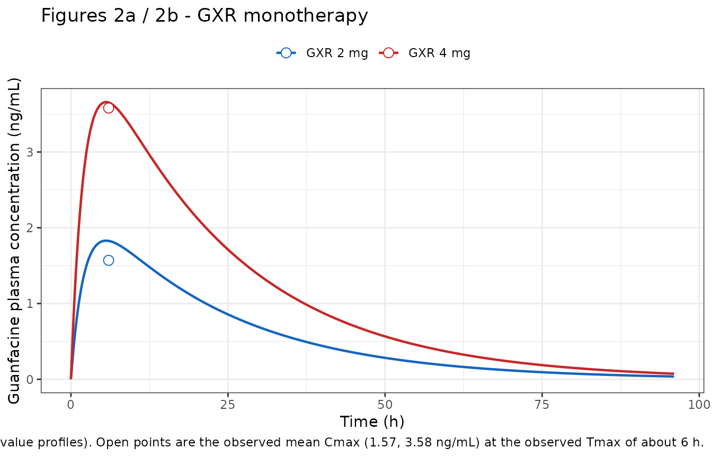
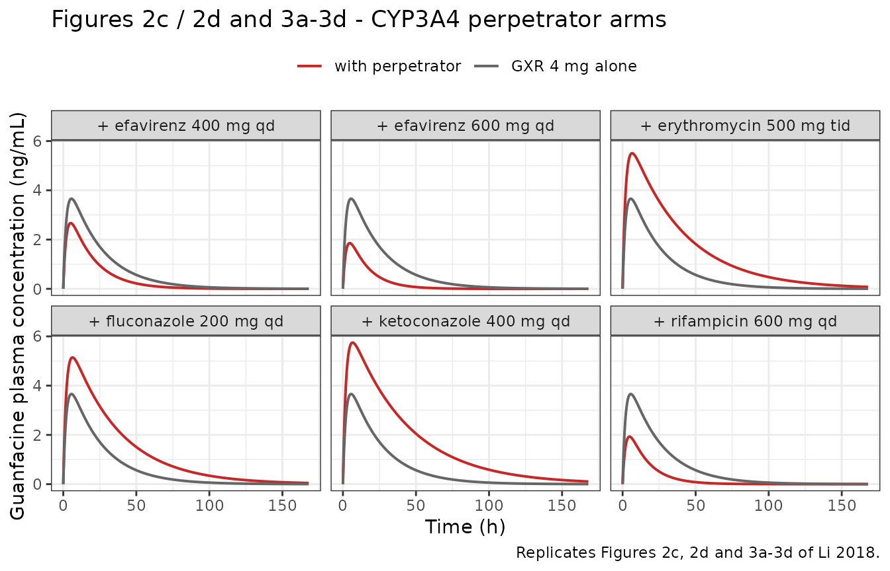
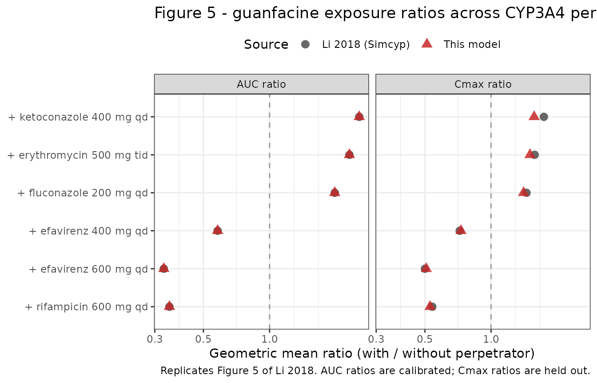

# Guanfacine extended-release (Li 2018)

## Model and source

- Citation: Li A, Yeo K, Welty D, Rong H. (2018). Development of
  Guanfacine Extended-Release Dosing Strategies in Children and
  Adolescents with ADHD Using a Physiologically Based Pharmacokinetic
  Model to Predict Drug-Drug Interactions with Moderate CYP3A4
  Inhibitors or Inducers. Paediatr Drugs 20(1):19-28.
  <doi:10.1007/s40272-017-0270-0>.
- Article: <https://doi.org/10.1007/s40272-017-0270-0>
- Open access via Europe PMC:
  <https://europepmc.org/article/MED/29098657>

Guanfacine is a selective alpha-2A-adrenergic agonist licensed as a
non-stimulant treatment for attention-deficit/hyperactivity disorder in
children and adolescents, given as an extended-release matrix tablet
(GXR). About half its clearance is renal and about half is
CYP3A4-mediated metabolism, which makes it sensitive to CYP3A4 drug-drug
interactions. Li 2018 built a physiologically based pharmacokinetic
model in the Simcyp Population-based Simulator (version 14), validated
it against two clinical DDI studies with *strong* CYP3A4 perpetrators,
and then used it to predict the interactions with *moderate*
perpetrators that had never been studied clinically. Those predictions
became US labeling dose recommendations without any further clinical
study.

### What this model file is, and what it is not

This is a **reduction** of the published Simcyp model, not a port of it.

What is reproducible from published information, and is encoded here:

- the guanfacine disposition, as a one-compartment oral model. Every
  structural parameter is a verbatim Table 1 input or an arithmetic
  consequence of the derivation chain printed in Section 2.2.1.
  **Nothing was fitted.**
- first-pass extraction split into gut-wall and hepatic components,
  pinned by the paper’s own well-stirred arithmetic;
- the six CYP3A4-perpetrator arms, each entering through a single
  relative-CYP3A4 activity term back-solved from that arm’s published
  AUC ratio.

What is **not** reproducible, and is therefore absent:

- the Simcyp whole-body structure itself – the virtual North European
  Caucasian population file, per-organ physiology, and the CYP3A4
  abundance distribution;
- the *mechanism* of each interaction. Every perpetrator in this paper
  is a Simcyp version 14 compound-file default: no inhibition constant,
  no `kinact`, no `KI` is printed for ketoconazole, fluconazole or
  erythromycin; rifampicin contributes only a maximum fold induction
  (`Indmax`); and the efavirenz model comes from an external publication
  (Ke et al.) with only its oral clearance quoted. The perpetrator
  coefficients here are therefore **empirical relative activities**, not
  transcribed inhibition constants;
- the Simcyp virtual-population variability visible as the grey trial
  lines in Figures 2-4. It is driven by unpublished demographic and
  enzyme-abundance distributions, so this is a **typical-value** model:
  no etas, `propSd` fixed at 0.

Read the “Assumptions and deviations” section at the end before using
the model; in particular, this is an **adult** model, despite the
paper’s pediatric title.

## Population

- Species: human
- Subjects: 49 (across 3 clinical studies)
- Age range: 18-54 years (model-development study); 18-53 years across
  the validation studies
- Doses: Single oral doses of guanfacine extended-release 2 mg and 4 mg
- Region / virtual population: North European Caucasian virtual
  population (Simcyp version 14 default, Howgate 2006), demographics
  matched per trial

Model development used the Swearingen crossover study (reference 19): 52
healthy adults aged 18-54 years, 46.2% women, of whom 49 completed, each
receiving a single oral dose of GXR 2 mg or 4 mg once a week for four
weeks with sampling to 96 h. That study supplied the observed Cmax, AUC
and apparent oral clearance the compound file was optimized against.
Validation used two Shire data-on-file DDI studies: SPD503-106
(ketoconazole, n = 20, 19-50 years, 65% women) and SPD503-108
(rifampicin, n = 20, 18-53 years, 40% women). Renal and total
intravenous clearance came from a separate intravenous study (reference
20).

**No pediatric data were used anywhere.** Section 4 states this as the
first of three limitations: the pivotal pediatric studies sampled only
to 8 or 24 h, against a guanfacine half-life of about 17 h, so the adult
study was judged the more robust basis. The pediatric dose
recommendations rest on a separate published population-PK analysis
(reference 18) finding weight-scaled adult and pediatric parameters to
be similar. That analysis is not reproduced here.

The same information is available programmatically via
`readModelDb("Li_2018_guanfacine")()$population`.

## Source trace

Every `ini()` entry carries an in-file comment naming its origin.
Collected here for review. All references are to the main article; there
is no supplement.

| Parameter | Value | Source |
|----|----|----|
| `lka` | 0.465 1/h | Table 1, row `First-order absorption rate constant (ka)`. Chosen by the authors via sensitivity analysis to recover the observed Tmax of about 6 h. See the erratum note below on the 0.459 that appears in Section 2.2.1. |
| `fa` | 1 | Table 1, row `Fraction absorbed (fa)`, from a Caco-2 permeability of 26e-6 cm/s. |
| `lvc` | 560 L | Table 1 `Vss` = 8.0 L/kg times an assumed 70 kg reference weight. Footnote a: 8.0 L/kg was chosen to recover the observed Cmax of 1.57 and 3.58 ng/mL, and is consistent with a Rodgers-Rowland prediction of 9.08 L/kg and in vivo values of 6.3-8.6 L/kg. |
| `lcl_renal` | 12.6 L/h | Table 1, row `Mean renal clearance (CL_R)`. |
| `lcl_nonren` | 12.2 L/h | Section 2.2.1: CL_IV = 24.8 L/h with equal metabolic and renal contributions, so 24.8 - 12.6. Section 4 attributes the metabolic half to CYP3A4. |
| `eh` | 0.093487 | Derived: Section 2.2.1 gives CL_H,B = (24.8 - 12.6)/1.45 = 8.41 L/h and F_H = 1 - 8.41/90 = 0.91. |
| `egut` | 0.276255 | Derived: F = CL_IV/(CL/F) = 24.8/37.8 = 0.65608, and F = fa \* F_G \* F_H gives F_G = 0.72375. This is the quantity Section 2.2.1 says Q_G was refined to 1 L/h to produce. |
| `e_conmed_ketoconazole_cyp3a4` | log(0.1074) | Back-solved from the Table 2 predicted AUC ratio 2.56. |
| `e_conmed_rifampicin_cyp3a4` | log(2.7300) | Back-solved from the Table 2 predicted AUC ratio 0.35 (the `Indmax = 8` model the authors adopted). |
| `e_conmed_fluconazole_cyp3a4` | log(0.3050) | Back-solved from the Table 3 predicted AUC ratio 1.98. |
| `e_conmed_erythromycin_cyp3a4` | log(0.1827) | Back-solved from the Table 3 predicted AUC ratio 2.31. |
| `e_conmed_efv_cyp3a4` | log(1.7774) | Back-solved from the Table 3 predicted AUC ratio 0.58 (efavirenz 400 mg). |
| `e_dose_efavirenz_mg_cyp3a4` | log(2.8582) - log(1.7774) | Increment to the 600 mg level, back-solved from the Table 3 predicted AUC ratio 0.33. |
| `propSd` | fixed(0) | No residual-error model is reported; this is a simulation model. |
| ODE structure | n/a | Figure 1b (Simcyp schematic) and Section 2.2.1. |

Un-printed constants used in the derivations: body weight 70 kg (the
Simcyp population mean is not published) and the free fraction in the
enterocyte `fu_G` = 1, which Section 2.2.1 states explicitly as the
default. Hepatic blood flow (90 L/h) and the blood:plasma ratio (1.45)
*are* printed.

## The derivation chain closes exactly

This is the load-bearing check of the whole extraction. Section 2.2.1
prints two intermediate results – a hepatic blood clearance of 8.41 L/h
and a hepatic availability of 0.91 – that are consequences of four other
printed numbers. If the transcription of CL_IV, CL_R, the blood:plasma
ratio and hepatic blood flow were wrong, these would not reproduce.

``` r

CL_iv <- 24.8 # Section 2.2.1, from reference 20
CL_r <- 12.6 # Table 1
BP <- 1.45 # Table 1
Q_h <- 90 # Section 2.2.1
CL_F <- 37.8 # Section 2.2.1, observed, from reference 19
f_a <- 1 # Table 1

CL_hb <- (CL_iv - CL_r) / BP
F_h <- 1 - CL_hb / Q_h
F_bio <- CL_iv / CL_F
F_g <- F_bio / (f_a * F_h)

chain <- tibble::tibble(
  Quantity = c(
    "CL_H,B = (CL_IV - CL_R) / [B:P]",
    "F_H = 1 - CL_H,B / Q_H",
    "F = CL_IV / (CL/F)",
    "F_G = F / (f_a * F_H)"
  ),
  Computed = c(CL_hb, F_h, F_bio, F_g),
  `Printed by Li 2018` = c(8.41, 0.91, NA, NA)
)

# The two printed intermediates must reproduce to their printed precision.
stopifnot(
  round(CL_hb, 2) == 8.41,
  round(F_h, 2) == 0.91
)

knitr::kable(
  chain,
  digits = 4,
  caption = paste(
    "Li 2018 Section 2.2.1 derivation chain. The first two rows are printed",
    "in the paper and reproduce exactly; the last two are the extraction",
    "ratios this model carries."
  )
)
```

| Quantity                          | Computed | Printed by Li 2018 |
|:----------------------------------|---------:|-------------------:|
| CL_H,B = (CL_IV - CL_R) / \[B:P\] |   8.4138 |               8.41 |
| F_H = 1 - CL_H,B / Q_H            |   0.9065 |               0.91 |
| F = CL_IV / (CL/F)                |   0.6561 |                 NA |
| F_G = F / (f_a \* F_H)            |   0.7237 |                 NA |

Li 2018 Section 2.2.1 derivation chain. The first two rows are printed
in the paper and reproduce exactly; the last two are the extraction
ratios this model carries. {.table}

The model’s `eh` and `egut` are just `1 - F_H` and `1 - F_G` from this
table:

``` r

ini_vals <- ui$theta
stopifnot(
  abs(ini_vals[["eh"]] - (1 - F_h)) < 1e-9,
  abs(ini_vals[["egut"]] - (1 - F_g)) < 1e-9
)
c(eh = ini_vals[["eh"]], egut = ini_vals[["egut"]])
#>         eh       egut 
#> 0.09348659 0.27625488
```

## Virtual cohort and simulation

The model carries no random effects, so a cohort is one representative
subject per arm; simulating more would return identical profiles. Eight
arms: the two monotherapy doses used for model development, and the six
perpetrator arms against the 4 mg control.

``` r

set.seed(20260917)

conmed_cols <- c(
  "CONMED_KETOCONAZOLE", "CONMED_RIFAMPICIN", "CONMED_FLUCONAZOLE",
  "CONMED_ERYTHROMYCIN", "CONMED_EFV"
)

arms <- tibble::tribble(
  ~arm,                      ~dose, ~perpetrator,            ~efv_mg,
  "GXR 2 mg",                    2, NA_character_,                 0,
  "GXR 4 mg",                    4, NA_character_,                 0,
  "+ ketoconazole 400 mg qd",    4, "CONMED_KETOCONAZOLE",         0,
  "+ rifampicin 600 mg qd",      4, "CONMED_RIFAMPICIN",           0,
  "+ fluconazole 200 mg qd",     4, "CONMED_FLUCONAZOLE",          0,
  "+ erythromycin 500 mg tid",   4, "CONMED_ERYTHROMYCIN",         0,
  "+ efavirenz 400 mg qd",       4, "CONMED_EFV",                400,
  "+ efavirenz 600 mg qd",       4, "CONMED_EFV",                600
)

# One event table per arm. Observations go on the `central` ODE state; rxode2
# returns the algebraic observable Cc as a column at those rows. The grid is
# fine through absorption so Tmax is not quantised coarsely, and runs to 480 h
# so that AUC extrapolation is negligible even for the ketoconazole arm, whose
# half-life is roughly 28 h.
make_arm <- function(i) {
  a <- arms[i, ]
  tgrid <- sort(unique(c(seq(0, 24, by = 0.05), seq(24, 480, by = 0.5))))
  ev <- rxode2::et(amt = a$dose, cmt = "depot") |>
    rxode2::et(tgrid, cmt = "central")
  d <- as.data.frame(ev)
  d$id <- i
  for (nm in conmed_cols) {
    d[[nm]] <- if (!is.na(a$perpetrator) && nm == a$perpetrator) 1 else 0
  }
  d$DOSE_EFAVIRENZ_MG <- a$efv_mg
  d$arm <- a$arm
  d$dose <- a$dose
  d
}

events <- dplyr::bind_rows(lapply(seq_len(nrow(arms)), make_arm))
stopifnot(
  nrow(arms) == 8L,
  !anyDuplicated(unique(events[, c("id", "time", "evid")]))
)
```

``` r

mod <- readModelDb("Li_2018_guanfacine")
sim <- rxode2::rxSolve(mod, events, keep = c("arm", "dose")) |>
  as.data.frame()
#> Warning: multi-subject simulation without without 'omega'

# Guard against a solve that silently produced nothing usable.
stopifnot(nrow(sim) > 0, !all(is.na(sim$Cc)), all(sim$Cc >= 0, na.rm = TRUE))
```

## Replicate published figures

``` r

# Replicates Figures 2a and 2b of Li 2018: mean guanfacine plasma
# concentration-time profiles after single oral doses of GXR 2 mg and 4 mg in
# healthy adults, with the observed mean Cmax from Table 1 footnote a overlaid.
obs_cmax <- tibble::tibble(
  arm = c("GXR 2 mg", "GXR 4 mg"),
  Cc = c(1.57, 3.58),
  time = 6
)

sim |>
  dplyr::filter(arm %in% c("GXR 2 mg", "GXR 4 mg"), time <= 96) |>
  ggplot(aes(time, Cc, colour = arm)) +
  geom_line(linewidth = 0.8) +
  geom_point(data = obs_cmax, size = 3, shape = 21, fill = "white") +
  scale_colour_manual(values = c("GXR 2 mg" = "#1565C0", "GXR 4 mg" = "#C62828")) +
  labs(
    x = "Time (h)", y = "Guanfacine plasma concentration (ng/mL)",
    colour = NULL, title = "Figures 2a / 2b - GXR monotherapy",
    caption = paste(
      "Replicates Figures 2a and 2b of Li 2018 (typical-value profiles).",
      "Open points are the observed mean Cmax (1.57, 3.58 ng/mL) at the",
      "observed Tmax of about 6 h."
    )
  ) +
  theme_bw() +
  theme(legend.position = "top")
```



``` r

# Replicates Figures 2c, 2d and 3a-3d of Li 2018: guanfacine profiles after a
# single oral dose of GXR 4 mg in the absence and presence of each CYP3A4
# perpetrator.
sim |>
  dplyr::filter(dose == 4, time <= 168) |>
  dplyr::mutate(
    panel = ifelse(arm == "GXR 4 mg", "GXR alone", arm),
    is_control = arm == "GXR 4 mg"
  ) |>
  dplyr::filter(!is_control) |>
  dplyr::bind_rows(
    sim |>
      dplyr::filter(arm == "GXR 4 mg", time <= 168) |>
      tidyr::expand_grid(panel = setdiff(arms$arm, c("GXR 2 mg", "GXR 4 mg"))) |>
      dplyr::mutate(arm = "GXR 4 mg alone", is_control = TRUE)
  ) |>
  ggplot(aes(time, Cc, colour = is_control)) +
  geom_line(linewidth = 0.7) +
  facet_wrap(~panel, ncol = 3) +
  scale_colour_manual(
    values = c("TRUE" = "grey40", "FALSE" = "#C62828"),
    labels = c("TRUE" = "GXR 4 mg alone", "FALSE" = "with perpetrator"),
    name = NULL
  ) +
  labs(
    x = "Time (h)", y = "Guanfacine plasma concentration (ng/mL)",
    title = "Figures 2c / 2d and 3a-3d - CYP3A4 perpetrator arms",
    caption = "Replicates Figures 2c, 2d and 3a-3d of Li 2018."
  ) +
  theme_bw() +
  theme(legend.position = "top")
```



## PKNCA validation

``` r

sim_nca <- sim |>
  dplyr::filter(!is.na(Cc)) |>
  dplyr::select(id, time, Cc, arm, dose)

# Guarantee a time-zero record per arm (pre-dose Cc = 0 for an extravascular
# dose); without it PKNCA warns about an AUC range starting before the first
# measurement.
sim_nca <- dplyr::bind_rows(
  sim_nca,
  sim_nca |> dplyr::distinct(id, arm, dose) |> dplyr::mutate(time = 0, Cc = 0)
) |>
  dplyr::distinct(id, arm, time, .keep_all = TRUE) |>
  dplyr::arrange(id, time)

conc_obj <- PKNCA::PKNCAconc(sim_nca, Cc ~ time | arm + id)

dose_df <- events |>
  dplyr::filter(evid == 1) |>
  dplyr::select(id, time, amt, arm, dose)
dose_obj <- PKNCA::PKNCAdose(dose_df, amt ~ time | arm + id)

intervals <- data.frame(
  start = 0,
  end = Inf,
  cmax = TRUE,
  tmax = TRUE,
  auclast = TRUE,
  aucinf.obs = TRUE,
  half.life = TRUE,
  aucpext.obs = TRUE
)

nca_res <- PKNCA::pk.nca(PKNCA::PKNCAdata(conc_obj, dose_obj, intervals = intervals))

nca_wide <- as.data.frame(nca_res) |>
  dplyr::select(arm, PPTESTCD, PPORRES) |>
  tidyr::pivot_wider(names_from = PPTESTCD, values_from = PPORRES) |>
  dplyr::left_join(arms |> dplyr::select(arm, dose), by = "arm")

# The NCA window must be long enough that extrapolation is negligible in every
# arm, otherwise the AUC comparisons below measure the window, not the model.
stopifnot(max(nca_wide$aucpext.obs, na.rm = TRUE) < 1)
```

### Comparison against the paper’s predicted exposures

``` r

published <- tibble::tribble(
  ~arm,                         ~cmax, ~tmax, ~aucinf.obs,
  "GXR 2 mg",                    1.69,    NA,        43.6,
  "GXR 4 mg",                    3.37,    NA,        87.3,
  "+ ketoconazole 400 mg qd",    6.17,    NA,         238,
  "+ rifampicin 600 mg qd",      2.03,    NA,        37.7,
  "+ fluconazole 200 mg qd",     5.08,    NA,         186,
  "+ erythromycin 500 mg tid",   5.60,    NA,         217,
  "+ efavirenz 400 mg qd",       2.47,    NA,        52.6,
  "+ efavirenz 600 mg qd",       1.73,    NA,        31.8
)

cmp <- nlmixr2lib::ncaComparisonTable(
  simulated = nca_res,
  reference = published,
  by = "arm",
  params = c("cmax", "aucinf.obs"),
  units = c(cmax = "ng/mL", aucinf.obs = "ng*h/mL"),
  tolerance_pct = 20
)

knitr::kable(
  cmp,
  caption = paste(
    "Simulated vs the values Li 2018 predicted with the Simcyp model.",
    "Monotherapy rows are Section 3.1; perpetrator rows are Tables 2 and 3",
    "(rifampicin is the Indmax = 8 model). * marks a difference over 20%."
  )
)
```

| NCA parameter | arm | Reference | Simulated | % diff |
|:---|:---|:---|:---|:---|
| Cmax (ng/mL) | GXR 2 mg | 1.69 | 1.83 | +8.2% |
| Cmax (ng/mL) | GXR 4 mg | 3.37 | 3.66 | +8.6% |
| Cmax (ng/mL) | \+ ketoconazole 400 mg qd | 6.17 | 5.75 | -6.9% |
| Cmax (ng/mL) | \+ rifampicin 600 mg qd | 2.03 | 1.93 | -5.0% |
| Cmax (ng/mL) | \+ fluconazole 200 mg qd | 5.08 | 5.14 | +1.3% |
| Cmax (ng/mL) | \+ erythromycin 500 mg tid | 5.6 | 5.5 | -1.7% |
| Cmax (ng/mL) | \+ efavirenz 400 mg qd | 2.47 | 2.67 | +8.0% |
| Cmax (ng/mL) | \+ efavirenz 600 mg qd | 1.73 | 1.85 | +7.2% |
| AUC0-∞ (obs) (ng\*h/mL) | GXR 2 mg | 43.6 | 52.9 | +21.4%\* |
| AUC0-∞ (obs) (ng\*h/mL) | GXR 4 mg | 87.3 | 106 | +21.2%\* |
| AUC0-∞ (obs) (ng\*h/mL) | \+ ketoconazole 400 mg qd | 238 | 271 | +13.8% |
| AUC0-∞ (obs) (ng\*h/mL) | \+ rifampicin 600 mg qd | 37.7 | 37 | -1.8% |
| AUC0-∞ (obs) (ng\*h/mL) | \+ fluconazole 200 mg qd | 186 | 210 | +12.6% |
| AUC0-∞ (obs) (ng\*h/mL) | \+ erythromycin 500 mg tid | 217 | 244 | +12.6% |
| AUC0-∞ (obs) (ng\*h/mL) | \+ efavirenz 400 mg qd | 52.6 | 61.4 | +16.7% |
| AUC0-∞ (obs) (ng\*h/mL) | \+ efavirenz 600 mg qd | 31.8 | 34.9 | +9.8% |

Simulated vs the values Li 2018 predicted with the Simcyp model.
Monotherapy rows are Section 3.1; perpetrator rows are Tables 2 and 3
(rifampicin is the Indmax = 8 model). \* marks a difference over 20%.
{.table}

**Which of these agreements is informative, and which is not.** The
table above mixes three quite different kinds of row, and reading it as
eight independent successes would overstate the evidence:

| Quantity | Calibrated? | What it tests |
|----|----|----|
| Monotherapy Cmax | Inherited calibration – Table 1 footnote a says `Vss` was *chosen* to recover the observed Cmax. | Only that `Vss` and `ka` were transcribed correctly. |
| Monotherapy AUC | Tautological – bioavailability was back-solved from the observed CL/F of 37.8 L/h, so AUC = Dose/(CL/F) by construction. | Nothing. See the internal-inconsistency check below. |
| Monotherapy Tmax | Inherited calibration – `ka` was chosen to recover the observed Tmax. | Only transcription. |
| Monotherapy half-life | **Free.** Neither `Vss` nor CL_IV was chosen with reference to half-life. | The volume/clearance pair jointly. |
| Perpetrator AUC ratios | Calibrated – each activity was back-solved from exactly this number. | Nothing. |
| Perpetrator **Cmax ratios** | **Free, held out.** | Whether the reduction has the right *shape*: how a CYP3A4 perturbation partitions between first-pass availability and systemic clearance. |

The two free checks are done next.

### Free check 1: terminal half-life

``` r

t_half_model <- nca_wide$half.life[nca_wide$arm == "GXR 4 mg"]

# Li 2018 Section 4: "The half-life of guanfacine from GXR is ~17 h".
stopifnot(abs(t_half_model / 17 - 1) < 0.15)

sprintf(
  "Model terminal half-life %.2f h vs the observed ~17 h reported in Section 4 (%+.1f%%)",
  t_half_model, 100 * (t_half_model / 17 - 1)
)
#> [1] "Model terminal half-life 15.66 h vs the observed ~17 h reported in Section 4 (-7.9%)"
```

### Free check 2: held-out perpetrator Cmax ratios

Each perpetrator’s relative CYP3A4 activity was back-solved from its
published **AUC** ratio alone. The published **Cmax** ratio was never
used. It is a genuinely free gate, because Cmax responds to a CYP3A4
perturbation through a different mixture of mechanisms than AUC does:
AUC depends only on the product of bioavailability and clearance,
whereas Cmax additionally depends on how the perturbed elimination rate
interacts with the unchanged absorption rate. A lumped clearance-only
encoding of the same AUC ratios would predict a Cmax ratio of only 1.12
for erythromycin against the published 1.58; splitting the effect across
gut wall, liver and systemic clearance the way the paper’s own
well-stirred arithmetic requires is what recovers it.

``` r

control <- nca_wide |> dplyr::filter(arm == "GXR 4 mg")

published_ratios <- tibble::tribble(
  ~arm,                         ~class,                ~aucr_pub, ~cmaxr_pub,
  "+ ketoconazole 400 mg qd",   "Strong inhibitor",         2.56,       1.74,
  "+ erythromycin 500 mg tid",  "Moderate inhibitor",       2.31,       1.58,
  "+ fluconazole 200 mg qd",    "Moderate inhibitor",       1.98,       1.45,
  "+ efavirenz 400 mg qd",      "Moderate inducer",         0.58,       0.72,
  "+ efavirenz 600 mg qd",      "Moderate inducer",         0.33,       0.50,
  "+ rifampicin 600 mg qd",     "Strong inducer",           0.35,       0.54
)

ratios <- nca_wide |>
  dplyr::inner_join(published_ratios, by = "arm") |>
  dplyr::mutate(
    aucr_model = aucinf.obs / control$aucinf.obs,
    cmaxr_model = cmax / control$cmax,
    cmaxr_pct_diff = 100 * (cmaxr_model / cmaxr_pub - 1)
  )

# The AUC ratios are what the coefficients were solved from, so they must come
# back essentially exactly; anything else means the encoding is wrong.
stopifnot(max(abs(ratios$aucr_model / ratios$aucr_pub - 1)) < 0.01)

# The Cmax ratios were held out. This is the out-of-sample gate, and it is
# deterministic (no random effects anywhere in the model), so a tight bound is
# appropriate rather than a quantile.
stopifnot(max(abs(ratios$cmaxr_pct_diff)) < 10)

ratios |>
  dplyr::select(
    arm, class, aucr_pub, aucr_model, cmaxr_pub, cmaxr_model, cmaxr_pct_diff
  ) |>
  dplyr::rename(
    "Arm" = arm,
    "FDA class" = class,
    "AUC ratio (published)" = aucr_pub,
    "AUC ratio (model, calibrated)" = aucr_model,
    "Cmax ratio (published)" = cmaxr_pub,
    "Cmax ratio (model, HELD OUT)" = cmaxr_model,
    "Cmax % difference" = cmaxr_pct_diff
  ) |>
  knitr::kable(
    digits = c(0, 0, 3, 3, 3, 3, 1),
    caption = paste(
      "Li 2018 Tables 2 and 3. The AUC-ratio columns agree by construction;",
      "the Cmax-ratio columns are out-of-sample."
    )
  )
```

| Arm | FDA class | AUC ratio (published) | AUC ratio (model, calibrated) | Cmax ratio (published) | Cmax ratio (model, HELD OUT) | Cmax % difference |
|:---|:---|---:|---:|---:|---:|---:|
| \+ efavirenz 400 mg qd | Moderate inducer | 0.58 | 0.58 | 0.72 | 0.729 | 1.3 |
| \+ efavirenz 600 mg qd | Moderate inducer | 0.33 | 0.33 | 0.50 | 0.507 | 1.4 |
| \+ erythromycin 500 mg tid | Moderate inhibitor | 2.31 | 2.31 | 1.58 | 1.504 | -4.8 |
| \+ fluconazole 200 mg qd | Moderate inhibitor | 1.98 | 1.98 | 1.45 | 1.406 | -3.0 |
| \+ ketoconazole 400 mg qd | Strong inhibitor | 2.56 | 2.56 | 1.74 | 1.571 | -9.7 |
| \+ rifampicin 600 mg qd | Strong inducer | 0.35 | 0.35 | 0.54 | 0.527 | -2.3 |

Li 2018 Tables 2 and 3. The AUC-ratio columns agree by construction; the
Cmax-ratio columns are out-of-sample. {.table}

The six held-out Cmax ratios are reproduced with a worst-case error of
9.7% and a median of 2.7%.

``` r

# Replicates Figure 5 of Li 2018: simulated guanfacine Cmax and AUC geometric
# mean ratios across the moderate and strong CYP3A4 perpetrators.
ratios |>
  dplyr::select(arm, class, aucr_pub, aucr_model, cmaxr_pub, cmaxr_model) |>
  tidyr::pivot_longer(
    c(aucr_pub, aucr_model, cmaxr_pub, cmaxr_model),
    names_to = "key", values_to = "ratio"
  ) |>
  dplyr::mutate(
    Parameter = ifelse(grepl("^auc", key), "AUC ratio", "Cmax ratio"),
    Source = ifelse(grepl("_pub$", key), "Li 2018 (Simcyp)", "This model"),
    arm = factor(arm, levels = rev(published_ratios$arm))
  ) |>
  ggplot(aes(ratio, arm, colour = Source, shape = Source)) +
  geom_vline(xintercept = 1, linetype = 2, colour = "grey60") +
  geom_point(size = 3, alpha = 0.85) +
  facet_wrap(~Parameter) +
  scale_x_log10() +
  scale_colour_manual(values = c("Li 2018 (Simcyp)" = "grey30", "This model" = "#C62828")) +
  labs(
    x = "Geometric mean ratio (with / without perpetrator)", y = NULL,
    title = "Figure 5 - guanfacine exposure ratios across CYP3A4 perpetrators",
    caption = "Replicates Figure 5 of Li 2018. AUC ratios are calibrated; Cmax ratios are held out."
  ) +
  theme_bw() +
  theme(legend.position = "top")
```



### Dose linearity

Li 2018 Section 3.1 reports that the model recovered the relatively
linear guanfacine profile across 2-4 mg. This reduction is exactly
linear by construction (no saturable term anywhere), which matches what
the source’s own *predictions* do, though not quite what was *observed*.

``` r

lin <- nca_wide |>
  dplyr::filter(arm %in% c("GXR 2 mg", "GXR 4 mg")) |>
  dplyr::arrange(dose)

tibble::tibble(
  Source = c("Observed (Section 4)", "Li 2018 predicted (Section 3.1)", "This model"),
  `Cmax 4 mg / 2 mg` = c(2.28, 3.37 / 1.69, lin$cmax[2] / lin$cmax[1]),
  `AUC 4 mg / 2 mg` = c(2.18, 87.3 / 43.6, lin$aucinf.obs[2] / lin$aucinf.obs[1])
) |>
  knitr::kable(
    digits = 3,
    caption = "Dose linearity from 2 mg to 4 mg."
  )
```

| Source                          | Cmax 4 mg / 2 mg | AUC 4 mg / 2 mg |
|:--------------------------------|-----------------:|----------------:|
| Observed (Section 4)            |            2.280 |           2.180 |
| Li 2018 predicted (Section 3.1) |            1.994 |           2.002 |
| This model                      |            2.000 |           2.000 |

Dose linearity from 2 mg to 4 mg. {.table}

## An internal inconsistency in the source

The monotherapy AUC row of the comparison table above is worth pausing
on, because the disagreement is the source’s, not the reduction’s.

Li 2018 calibrated the gut blood flow `Q_G` specifically so the model
would recover the observed apparent oral clearance of 37.8 L/h (Section
2.2.1). A 4 mg dose with CL/F = 37.8 L/h gives an AUC of 105.8 ng*h/mL,
which is what this reduction returns because bioavailability was
back-solved from exactly that number. But Section 3.1 reports a*
predicted\* AUC of 87.3 ng\*h/mL for the same 4 mg dose, which implies a
CL/F of 45.8 L/h – 21% above the value the model was calibrated to
reproduce.

``` r

inconsistency <- tibble::tibble(
  Quantity = c(
    "CL/F the model was calibrated to recover (Section 2.2.1)",
    "CL/F implied by the predicted 4 mg AUC of 87.3 (Section 3.1)",
    "CL/F implied by the observed 4 mg AUC of 119.0 (Section 3.1)"
  ),
  `CL/F (L/h)` = c(37.8, 4 * 1e3 / 87.3, 4 * 1e3 / 119.0)
)

knitr::kable(inconsistency, digits = 2, caption = "Three mutually inconsistent apparent clearances in Li 2018.")
```

| Quantity                                                     | CL/F (L/h) |
|:-------------------------------------------------------------|-----------:|
| CL/F the model was calibrated to recover (Section 2.2.1)     |      37.80 |
| CL/F implied by the predicted 4 mg AUC of 87.3 (Section 3.1) |      45.82 |
| CL/F implied by the observed 4 mg AUC of 119.0 (Section 3.1) |      33.61 |

Three mutually inconsistent apparent clearances in Li 2018. {.table}

A consequence worth stating plainly: because this reduction is anchored
to the *observed* CL/F rather than to the Simcyp model’s own output, it
reproduces the **observed** monotherapy AUC better than the source model
does – 52.9 against an observed 54.5 at 2 mg (-2.9%) and 105.8 against
119.0 at 4 mg (-11.1%), versus the source’s -20.0% and -26.6%. That is
not a claim of superiority; it simply reflects which quantity each model
was pinned to.

``` r

obs_cmp <- tibble::tibble(
  Dose = c("2 mg", "4 mg"),
  `Observed AUC` = c(54.5, 119.0),
  `Li 2018 predicted` = c(43.6, 87.3),
  `This model` = nca_wide$aucinf.obs[match(c("GXR 2 mg", "GXR 4 mg"), nca_wide$arm)]
) |>
  dplyr::mutate(
    `Li 2018 % diff` = 100 * (`Li 2018 predicted` / `Observed AUC` - 1),
    `This model % diff` = 100 * (`This model` / `Observed AUC` - 1)
  )

knitr::kable(obs_cmp, digits = c(0, 1, 1, 1, 1, 1),
             caption = "Monotherapy AUC (ng*h/mL) against the observed values of Section 3.1.")
```

| Dose | Observed AUC | Li 2018 predicted | This model | Li 2018 % diff | This model % diff |
|:---|---:|---:|---:|---:|---:|
| 2 mg | 54.5 | 43.6 | 52.9 | -20.0 | -2.9 |
| 4 mg | 119.0 | 87.3 | 105.8 | -26.6 | -11.1 |

Monotherapy AUC (ng\*h/mL) against the observed values of Section 3.1.
{.table}

## Assumptions and deviations

**This is an adult model, despite the paper’s pediatric title.** Section
4 states that no pediatric pharmacokinetic data were used in model
development or validation, and that no pediatric DDI study has ever been
conducted. `WT` is therefore *not* carried as a covariate even though
Table 1 reports `Vss` in L/kg: scaling volume with weight while leaving
clearance fixed – the only thing the published numbers support, since
Simcyp derives hepatic clearance from liver weight and microsomal
protein content that are population-file content – would shorten the
half-life in a lighter subject with no support from the paper. The
weight-scaling claim behind the pediatric labeling rests on a separate
population-PK analysis (reference 18) that is not reproduced here. Both
`WT` and `SEXF` are recorded in `covariatesDataExcluded` with this
reasoning.

**A 70 kg reference weight is assumed.** Table 1 gives `Vss` in L/kg and
the Simcyp North European Caucasian population’s mean weight is not
published, so the standard 70 kg is used to obtain the 560 L central
volume.

**`ka` is reported twice, with different values.** Table 1 gives 0.465
1/h and Section 2.2.1 gives 0.459 1/h for the same quantity. The
discrepancy is real in the published PDF, not a text-extraction
artifact. Table 1 is titled *Input parameters for the guanfacine
compound file in Simcyp version 14*, so 0.465 is the value the
simulations actually used and is the one carried here. The choice is
immaterial – it moves Tmax from 5.59 h to 5.64 h – but it is recorded
rather than silently resolved.

**Perpetrator coefficients are empirical relative activities, not
inhibition constants.** No `Ki`, `kinact` or `KI` is printed anywhere in
the paper for ketoconazole, fluconazole or erythromycin: all three are
Simcyp version 14 compound-file defaults. Rifampicin contributes only
`Indmax`, and efavirenz comes from Ke et al. with only an oral clearance
quoted. Each coefficient here was back-solved from its arm’s published
AUC ratio, so it lumps every mechanism that perpetrator exerts –
competitive inhibition, mechanism-based inactivation, induction, and any
time-course over the dosing schedule – into one static number. Do not
read `exp(e_conmed_ketoconazole_cyp3a4)` as a CYP3A4 inhibition
magnitude, and do not transfer these coefficients to another victim
drug.

**The rifampicin coefficient encodes the `Indmax = 8` model.** Li 2018
ran two rifampicin simulations. With the Simcyp default `Indmax = 16`
the predicted AUC ratio was 0.16 against an observed 0.31, which Section
3.2 describes as overpredicting induction; with `Indmax = 8` it was
0.35, and Section 4 and Figure 5 adopt that model. The rejected
`Indmax = 16` variant is not encoded. For the record, the same
back-solving applied to it gives a relative activity of 4.799 and
reproduces its published Cmax ratio of 0.31 to within 2.3%.

**Perpetrators are simulated as steady-state, not as a time course.** In
the source each GXR dose was given partway through a multi-day
perpetrator regimen – day 3 of 6 for ketoconazole, fluconazole and
erythromycin, day 8 of 11 for rifampicin, day 10 of 14 for efavirenz –
so the perpetrator’s own concentration and the resulting enzyme
perturbation vary over the guanfacine profile. This reduction holds the
relative CYP3A4 activity constant. That simplification is the most
likely source of the largest held-out residual, the ketoconazole Cmax
ratio (predicted 1.57 against a published 1.74).

**The two efavirenz dose levels are selected, not interpolated.**
`DOSE_EFAVIRENZ_MG` is used only to choose between the two published
coefficients: a value of 500 mg or more selects the 600 mg coefficient,
any lower nonzero value the 400 mg one. Li 2018 gives no dose-response
function linking them, and the 400 mg perpetrator model was built by
re-estimating efavirenz oral clearance to 17.7 L/h rather than by
scaling the 600 mg model, so interpolation would have no basis.

**No variability of any kind is encoded.** The source reports no
inter-individual variance components and no residual-error model; the
grey trial-to-trial lines in Figures 2-4 are Simcyp virtual-population
output driven by unpublished demographic and CYP3A4-abundance
distributions. `propSd` is fixed at 0 and there are no etas, so
`rxSolve` returns typical-value profiles. Do not use this model for a
VPC.

**The Simcyp model itself is not encoded.** Only the compound layer is
published. The whole-body structure, the per-organ physiology, the
CYP3A4 abundance of 137 pmol/mg in liver and 70,000 pmol in whole gut
used to split intrinsic clearance, and the `k_deg` values of 0.019 and
0.03 1/h are all inputs to machinery that is not reproducible outside
the platform. The extraction-ratio parameterisation used here is
algebraically equivalent to the paper’s Equation 1 for the gut and to
the well-stirred liver model, but it reaches those availabilities from
the printed `F_H`, `CL/F` and `CL_IV` rather than from the unpublished
intrinsic clearances.

**No supplement and no erratum with model content.** The article carries
a correction notice, but it is a retrospective open-access order
affecting licensing only and changes no value used here; it is noted in
the article front matter as *The original version of this article was
revised due to retrospective open access order.* No supplementary
information accompanies the paper.
