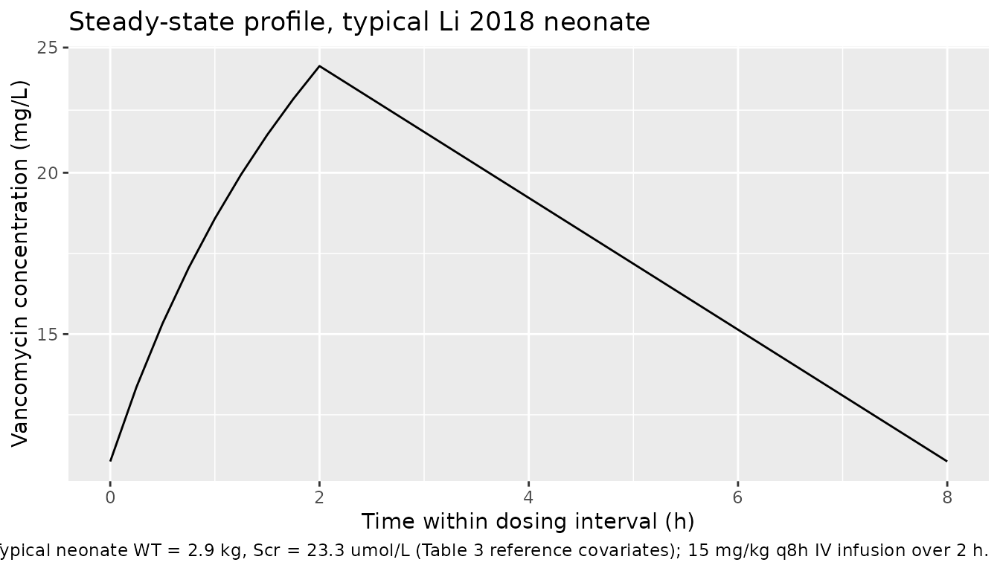

# Vancomycin (Li 2018)

## Model and source

- Citation: Li Z, Liu Y, Jiao Z, Qiu G, Huang J, Xiao Y, Wu S, Wang C,
  Hu W, Sun H. Population Pharmacokinetics of Vancomycin in Chinese ICU
  Neonates: Initial Dosage Recommendations. Front Pharmacol. 2018;9:603.
  <doi:10.3389/fphar.2018.00603>
- Description: One-compartment IV-infusion population PK model for
  vancomycin in critically ill Chinese ICU neonates (Li 2018). CL scales
  allometrically with body weight (reference 2.9 kg, exponent 1.55) and
  as an inverse power of serum creatinine (reference 23.3 umol/L,
  exponent 0.337 on the SCr_ref/SCr ratio). V scales allometrically with
  body weight (reference 2.9 kg, exponent 1.05). IIV is on CL only;
  residual error is proportional.
- Article: [Front Pharmacol
  2018;9:603](https://doi.org/10.3389/fphar.2018.00603)

## Population

The model was developed from 165 vancomycin concentrations (75 trough
and 90 peak) in 80 critically ill Chinese neonates admitted to the
neonatal ICU at Shanghai Children’s Hospital between January 2013 and
December 2016 (Li 2018 Table 1). The cohort was 32.5% female and
predominantly preterm (59%), with 57% being treated for respiratory
tract infections. Median postnatal age (PNA) was 24 days (range 4-126),
median gestational age at birth (GA) was 34 weeks (range 25.7-41.1), and
median postmenstrual age (PMA) was 40 weeks (range 29-47.1). Median body
weight was 2.74 kg (range 1.4-5.6) and median serum creatinine was 28.3
umol/L (range 5.85-61.6). Vancomycin (Vancocin, Lilly) was administered
intravenously at 10-15 mg/kg every 8 or 12 hours as a 2-hour infusion;
plasma samples were collected 1 h after the end of the infusion (peak)
and 30 min before the next dose (trough), each after at least four
repeated doses. The same information is available programmatically via
`readModelDb("Li_2018_vancomycin")$population`.

## Source trace

Every numeric value in `ini()` carries an in-file comment pointing to
the Li 2018 source location. The table below collects them in one place
for review.

| Equation / parameter | Value | Source location |
|----|----|----|
| `lcl` (theta1) | 0.309 L/h | Table 3, row “theta_1” |
| `lvc` (theta4) | 2.63 L | Table 3, row “theta_4” |
| `e_wt_cl` (theta2) | 1.55 (unitless) | Table 3, row “theta_2” |
| `e_creat_cl` (theta3) | 0.337 (unitless) | Table 3, row “theta_3” |
| `e_wt_vc` (theta5) | 1.05 (unitless) | Table 3, row “theta_5” |
| `etalcl` (37.9% CV) | 0.1343 | Table 3, row “CL %CV” (Inter-individual variability) |
| `propSd` | 0.375 (37.5%) | Table 3, row “Proportional %CV” |
| WT reference (2.9) | 2.9 kg | Table 3 final-model footnote |
| CREAT reference (23.3) | 23.3 umol/L | Table 3 final-model footnote |
| TVCL covariate eq. | n/a | Results “Model Building” Equation 15 / Table 3 footnote |
| TVV covariate eq. | n/a | Results “Model Building” Equation 16 / Table 3 footnote |
| 1-cmt IV-infusion | n/a | Methods “Base Model” (ADVAN1-TRANS2) |
| Proportional residual | n/a | Results “Model Building”; Table 3 footnote |
| V IIV not estimated | n/a | Results “Model Building” paragraph 1 |

## Virtual cohort

Original observed data are not publicly available. The cohort below
covers five typical-patient scenarios drawn from Li 2018 Table 4 (one
row per weight / PMA stratum at the table’s representative Scr = 25
umol/L), so the simulated regimens can be checked against the paper’s
dosing recommendations. Each cohort contains `n_sub` virtual subjects so
the stochastic ribbons reflect inter-individual variability under the
published 37.9% CV on CL.

``` r

set.seed(20260520)

n_sub <- 50L

# Build one cohort as a self-contained event table for a typical neonate
# (constant WT and CREAT across the dosing window; weight gain over the
# short treatment window is small relative to the dose-rate scaling).
# `dose_mg_per_kg` is the mg/kg dose, `tau_h` is the dosing interval,
# `n_doses` is the number of repeat doses (set large enough to approach
# steady state for the lowest-CL strata).
build_arm <- function(label, wt_kg, creat_umol, dose_mg_per_kg, tau_h,
                      n_doses = 12L, infusion_h = 2, id_offset = 0L) {
  ids <- id_offset + seq_len(n_sub)
  dose_amt_mg <- dose_mg_per_kg * wt_kg

  dose_times <- seq(0, by = tau_h, length.out = n_doses)
  dose_rows <- tidyr::expand_grid(id = ids, time = dose_times) |>
    mutate(
      evid   = 1L,
      amt    = dose_amt_mg,
      cmt    = "central",
      rate   = dose_amt_mg / infusion_h,
      cohort = label,
      WT     = wt_kg,
      CREAT  = creat_umol
    )

  # Coarse mid-run grid plus a dense interval after the last dose to
  # resolve Cmax / Cmin in the final dosing interval.
  obs_times <- sort(unique(c(
    seq(0, infusion_h, by = 0.25),
    seq(infusion_h, max(dose_times), by = 1),
    seq(max(dose_times), max(dose_times) + tau_h, by = 0.25)
  )))
  obs_rows <- tidyr::expand_grid(id = ids, time = obs_times) |>
    mutate(
      evid   = 0L,
      amt    = 0,
      cmt    = NA_character_,
      rate   = 0,
      cohort = label,
      WT     = wt_kg,
      CREAT  = creat_umol
    )

  bind_rows(dose_rows, obs_rows) |> arrange(id, time, desc(evid))
}

# Five typical-patient scenarios from Li 2018 Table 4 at Scr = 25 umol/L.
# Dose / interval pairs are the midpoint of the recommended range.
events <- bind_rows(
  build_arm("WT_1.25_PMA_29",  1.25, 25, dose_mg_per_kg = 13.75, tau_h = 12, id_offset =    0L),
  build_arm("WT_2.0_PMA_32.5", 2.00, 25, dose_mg_per_kg = 17.50, tau_h = 12, id_offset = 1000L),
  build_arm("WT_3.0_PMA_36.5", 3.00, 25, dose_mg_per_kg = 13.75, tau_h =  8, id_offset = 2000L),
  build_arm("WT_4.0_PMA_40.5", 4.00, 25, dose_mg_per_kg = 11.25, tau_h =  6, id_offset = 3000L),
  build_arm("WT_5.0_PMA_44",   5.00, 25, dose_mg_per_kg = 13.75, tau_h =  6, id_offset = 4000L)
)

stopifnot(!anyDuplicated(unique(events[, c("id", "time", "evid")])))
```

## Simulation

``` r

mod <- readModelDb("Li_2018_vancomycin")

sim <- rxode2::rxSolve(
  mod,
  events = events,
  keep   = c("cohort", "WT", "CREAT")
) |> as.data.frame()
#> ℹ parameter labels from comments will be replaced by 'label()'
```

For the typical-value comparisons against Li 2018’s Table 3 typical
clearance and the AUC24/MIC target, also simulate with the random
effects zeroed.

``` r

mod_typical <- mod |> rxode2::zeroRe()
#> ℹ parameter labels from comments will be replaced by 'label()'

sim_typical <- rxode2::rxSolve(
  mod_typical,
  events = events,
  keep   = c("cohort", "WT", "CREAT")
) |> as.data.frame()
#> ℹ omega/sigma items treated as zero: 'etalcl'
#> Warning: multi-subject simulation without without 'omega'
```

## Replicate published figures

The Li 2018 PDF contains three figures (goodness-of-fit, NPDE, dosing
ribbon vs guideline overlays). None are individual concentration-time
profiles per se; the dosing-regimen ribbon in Figure 3 is a Monte Carlo
summary, not a profile. The check below therefore reproduces the
typical-value steady-state profile at the median-Scr representative
patient (WT = 2.9 kg, Scr = 23.3 umol/L), which corresponds to the
typical-CL value tabulated in Table 3 (CL = 0.309 L/h).

``` r

ref_arm <- build_arm("typical_ref", wt_kg = 2.9, creat_umol = 23.3,
                     dose_mg_per_kg = 15, tau_h = 8, n_doses = 12L,
                     id_offset = 9000L)

sim_ref <- rxode2::rxSolve(mod_typical, events = ref_arm,
                           keep = c("cohort", "WT", "CREAT")) |>
  as.data.frame()
#> ℹ omega/sigma items treated as zero: 'etalcl'
#> Warning: multi-subject simulation without without 'omega'

ss_window_ref <- range(ref_arm$time[ref_arm$evid == 1]) |>
  (\(r) c(r[2], r[2] + 8))()

sim_ref |>
  filter(time >= ss_window_ref[1], time <= ss_window_ref[2]) |>
  mutate(time_in_tau = time - ss_window_ref[1]) |>
  ggplot(aes(time_in_tau, Cc)) +
  geom_line() +
  scale_y_log10() +
  labs(
    x = "Time within dosing interval (h)",
    y = "Vancomycin concentration (mg/L)",
    title = "Steady-state profile, typical Li 2018 neonate",
    caption = "Typical neonate WT = 2.9 kg, Scr = 23.3 umol/L (Table 3 reference covariates); 15 mg/kg q8h IV infusion over 2 h."
  )
```



## PKNCA validation

The block below computes steady-state Cmin, Cmax, AUC0-tau and Cavg for
each Table 4 cohort over the final dosing interval, then derives the
24-hour AUC and the AUC24/MIC ratio at MIC = 1 mg/L. Li 2018’s design
target is AUC24/MIC \>= 400 (Methods “Dosing Regimen Design”; Results /
Discussion). The treatment grouping is `cohort`, matching the five
weight / PMA strata from Table 4.

``` r

# For each cohort, compute the steady-state interval as [last_dose,
# last_dose + tau].
cohort_meta <- tibble::tribble(
  ~cohort,             ~tau_h,
  "WT_1.25_PMA_29",    12,
  "WT_2.0_PMA_32.5",   12,
  "WT_3.0_PMA_36.5",    8,
  "WT_4.0_PMA_40.5",    6,
  "WT_5.0_PMA_44",      6
)

ss_windows <- events |>
  filter(evid == 1) |>
  group_by(cohort) |>
  summarise(last_dose = max(time), .groups = "drop") |>
  left_join(cohort_meta, by = "cohort") |>
  mutate(end_ss = last_dose + tau_h)

# Filter sim to the per-cohort steady-state window.
sim_nca <- sim |>
  inner_join(ss_windows, by = "cohort") |>
  filter(!is.na(Cc), time >= last_dose, time <= end_ss) |>
  select(id, time, Cc, cohort)

dose_df <- events |>
  filter(evid == 1) |>
  inner_join(ss_windows, by = "cohort") |>
  filter(time == last_dose) |>
  select(id, time, amt, cohort)

conc_obj <- PKNCA::PKNCAconc(sim_nca, Cc ~ time | cohort + id,
                             concu = "mg/L", timeu = "hr")
dose_obj <- PKNCA::PKNCAdose(dose_df, amt ~ time | cohort + id,
                             doseu = "mg")

intervals <- ss_windows |>
  transmute(start = last_dose, end = end_ss,
            cmax = TRUE, tmax = TRUE, cmin = TRUE,
            auclast = TRUE, cav = TRUE)

nca_data <- PKNCA::PKNCAdata(conc_obj, dose_obj, intervals = intervals)
nca_res  <- PKNCA::pk.nca(nca_data)
#> Warning in .f(data_conc = .l[[1L]][[i]], data_dose = .l[[2L]][[i]],
#> data_intervals = .l[[3L]][[i]], : Error with interval start=88, end=96: No data
#> for interval
#> Warning in .f(data_conc = .l[[1L]][[i]], data_dose = .l[[2L]][[i]],
#> data_intervals = .l[[3L]][[i]], : Error with interval start=66, end=72: No data
#> for interval
#> Warning in .f(data_conc = .l[[1L]][[i]], data_dose = .l[[2L]][[i]],
#> data_intervals = .l[[3L]][[i]], : Error with interval start=66, end=72: No data
#> for interval
#> Warning in .f(data_conc = .l[[1L]][[i]], data_dose = .l[[2L]][[i]],
#> data_intervals = .l[[3L]][[i]], : Error with interval start=88, end=96: No data
#> for interval
#> Warning in .f(data_conc = .l[[1L]][[i]], data_dose = .l[[2L]][[i]],
#> data_intervals = .l[[3L]][[i]], : Error with interval start=66, end=72: No data
#> for interval
#> Warning in .f(data_conc = .l[[1L]][[i]], data_dose = .l[[2L]][[i]],
#> data_intervals = .l[[3L]][[i]], : Error with interval start=66, end=72: No data
#> for interval
#> Warning in .f(data_conc = .l[[1L]][[i]], data_dose = .l[[2L]][[i]],
#> data_intervals = .l[[3L]][[i]], : Error with interval start=88, end=96: No data
#> for interval
#> Warning in .f(data_conc = .l[[1L]][[i]], data_dose = .l[[2L]][[i]],
#> data_intervals = .l[[3L]][[i]], : Error with interval start=66, end=72: No data
#> for interval
#> Warning in .f(data_conc = .l[[1L]][[i]], data_dose = .l[[2L]][[i]],
#> data_intervals = .l[[3L]][[i]], : Error with interval start=66, end=72: No data
#> for interval
#> Warning in .f(data_conc = .l[[1L]][[i]], data_dose = .l[[2L]][[i]],
#> data_intervals = .l[[3L]][[i]], : Error with interval start=88, end=96: No data
#> for interval
#> Warning in .f(data_conc = .l[[1L]][[i]], data_dose = .l[[2L]][[i]],
#> data_intervals = .l[[3L]][[i]], : Error with interval start=66, end=72: No data
#> for interval
#> Warning in .f(data_conc = .l[[1L]][[i]], data_dose = .l[[2L]][[i]],
#> data_intervals = .l[[3L]][[i]], : Error with interval start=66, end=72: No data
#> for interval
#> Warning in .f(data_conc = .l[[1L]][[i]], data_dose = .l[[2L]][[i]],
#> data_intervals = .l[[3L]][[i]], : Error with interval start=88, end=96: No data
#> for interval
#> Warning in .f(data_conc = .l[[1L]][[i]], data_dose = .l[[2L]][[i]],
#> data_intervals = .l[[3L]][[i]], : Error with interval start=66, end=72: No data
#> for interval
#> Warning in .f(data_conc = .l[[1L]][[i]], data_dose = .l[[2L]][[i]],
#> data_intervals = .l[[3L]][[i]], : Error with interval start=66, end=72: No data
#> for interval
#> Warning in .f(data_conc = .l[[1L]][[i]], data_dose = .l[[2L]][[i]],
#> data_intervals = .l[[3L]][[i]], : Error with interval start=88, end=96: No data
#> for interval
#> Warning in .f(data_conc = .l[[1L]][[i]], data_dose = .l[[2L]][[i]],
#> data_intervals = .l[[3L]][[i]], : Error with interval start=66, end=72: No data
#> for interval
#> Warning in .f(data_conc = .l[[1L]][[i]], data_dose = .l[[2L]][[i]],
#> data_intervals = .l[[3L]][[i]], : Error with interval start=66, end=72: No data
#> for interval
#> Warning in .f(data_conc = .l[[1L]][[i]], data_dose = .l[[2L]][[i]],
#> data_intervals = .l[[3L]][[i]], : Error with interval start=88, end=96: No data
#> for interval
#> Warning in .f(data_conc = .l[[1L]][[i]], data_dose = .l[[2L]][[i]],
#> data_intervals = .l[[3L]][[i]], : Error with interval start=66, end=72: No data
#> for interval
#> Warning in .f(data_conc = .l[[1L]][[i]], data_dose = .l[[2L]][[i]],
#> data_intervals = .l[[3L]][[i]], : Error with interval start=66, end=72: No data
#> for interval
#> Warning in .f(data_conc = .l[[1L]][[i]], data_dose = .l[[2L]][[i]],
#> data_intervals = .l[[3L]][[i]], : Error with interval start=88, end=96: No data
#> for interval
#> Warning in .f(data_conc = .l[[1L]][[i]], data_dose = .l[[2L]][[i]],
#> data_intervals = .l[[3L]][[i]], : Error with interval start=66, end=72: No data
#> for interval
#> Warning in .f(data_conc = .l[[1L]][[i]], data_dose = .l[[2L]][[i]],
#> data_intervals = .l[[3L]][[i]], : Error with interval start=66, end=72: No data
#> for interval
#> Warning in .f(data_conc = .l[[1L]][[i]], data_dose = .l[[2L]][[i]],
#> data_intervals = .l[[3L]][[i]], : Error with interval start=88, end=96: No data
#> for interval
#> Warning in .f(data_conc = .l[[1L]][[i]], data_dose = .l[[2L]][[i]],
#> data_intervals = .l[[3L]][[i]], : Error with interval start=66, end=72: No data
#> for interval
#> Warning in .f(data_conc = .l[[1L]][[i]], data_dose = .l[[2L]][[i]],
#> data_intervals = .l[[3L]][[i]], : Error with interval start=66, end=72: No data
#> for interval
#> Warning in .f(data_conc = .l[[1L]][[i]], data_dose = .l[[2L]][[i]],
#> data_intervals = .l[[3L]][[i]], : Error with interval start=88, end=96: No data
#> for interval
#> Warning in .f(data_conc = .l[[1L]][[i]], data_dose = .l[[2L]][[i]],
#> data_intervals = .l[[3L]][[i]], : Error with interval start=66, end=72: No data
#> for interval
#> Warning in .f(data_conc = .l[[1L]][[i]], data_dose = .l[[2L]][[i]],
#> data_intervals = .l[[3L]][[i]], : Error with interval start=66, end=72: No data
#> for interval
#> Warning in .f(data_conc = .l[[1L]][[i]], data_dose = .l[[2L]][[i]],
#> data_intervals = .l[[3L]][[i]], : Error with interval start=88, end=96: No data
#> for interval
#> Warning in .f(data_conc = .l[[1L]][[i]], data_dose = .l[[2L]][[i]],
#> data_intervals = .l[[3L]][[i]], : Error with interval start=66, end=72: No data
#> for interval
#> Warning in .f(data_conc = .l[[1L]][[i]], data_dose = .l[[2L]][[i]],
#> data_intervals = .l[[3L]][[i]], : Error with interval start=66, end=72: No data
#> for interval
#> Warning in .f(data_conc = .l[[1L]][[i]], data_dose = .l[[2L]][[i]],
#> data_intervals = .l[[3L]][[i]], : Error with interval start=88, end=96: No data
#> for interval
#> Warning in .f(data_conc = .l[[1L]][[i]], data_dose = .l[[2L]][[i]],
#> data_intervals = .l[[3L]][[i]], : Error with interval start=66, end=72: No data
#> for interval
#> Warning in .f(data_conc = .l[[1L]][[i]], data_dose = .l[[2L]][[i]],
#> data_intervals = .l[[3L]][[i]], : Error with interval start=66, end=72: No data
#> for interval
#> Warning in .f(data_conc = .l[[1L]][[i]], data_dose = .l[[2L]][[i]],
#> data_intervals = .l[[3L]][[i]], : Error with interval start=88, end=96: No data
#> for interval
#> Warning in .f(data_conc = .l[[1L]][[i]], data_dose = .l[[2L]][[i]],
#> data_intervals = .l[[3L]][[i]], : Error with interval start=66, end=72: No data
#> for interval
#> Warning in .f(data_conc = .l[[1L]][[i]], data_dose = .l[[2L]][[i]],
#> data_intervals = .l[[3L]][[i]], : Error with interval start=66, end=72: No data
#> for interval
#> Warning in .f(data_conc = .l[[1L]][[i]], data_dose = .l[[2L]][[i]],
#> data_intervals = .l[[3L]][[i]], : Error with interval start=88, end=96: No data
#> for interval
#> Warning in .f(data_conc = .l[[1L]][[i]], data_dose = .l[[2L]][[i]],
#> data_intervals = .l[[3L]][[i]], : Error with interval start=66, end=72: No data
#> for interval
#> Warning in .f(data_conc = .l[[1L]][[i]], data_dose = .l[[2L]][[i]],
#> data_intervals = .l[[3L]][[i]], : Error with interval start=66, end=72: No data
#> for interval
#> Warning in .f(data_conc = .l[[1L]][[i]], data_dose = .l[[2L]][[i]],
#> data_intervals = .l[[3L]][[i]], : Error with interval start=88, end=96: No data
#> for interval
#> Warning in .f(data_conc = .l[[1L]][[i]], data_dose = .l[[2L]][[i]],
#> data_intervals = .l[[3L]][[i]], : Error with interval start=66, end=72: No data
#> for interval
#> Warning in .f(data_conc = .l[[1L]][[i]], data_dose = .l[[2L]][[i]],
#> data_intervals = .l[[3L]][[i]], : Error with interval start=66, end=72: No data
#> for interval
#> Warning in .f(data_conc = .l[[1L]][[i]], data_dose = .l[[2L]][[i]],
#> data_intervals = .l[[3L]][[i]], : Error with interval start=88, end=96: No data
#> for interval
#> Warning in .f(data_conc = .l[[1L]][[i]], data_dose = .l[[2L]][[i]],
#> data_intervals = .l[[3L]][[i]], : Error with interval start=66, end=72: No data
#> for interval
#> Warning in .f(data_conc = .l[[1L]][[i]], data_dose = .l[[2L]][[i]],
#> data_intervals = .l[[3L]][[i]], : Error with interval start=66, end=72: No data
#> for interval
#> Warning in .f(data_conc = .l[[1L]][[i]], data_dose = .l[[2L]][[i]],
#> data_intervals = .l[[3L]][[i]], : Error with interval start=88, end=96: No data
#> for interval
#> Warning in .f(data_conc = .l[[1L]][[i]], data_dose = .l[[2L]][[i]],
#> data_intervals = .l[[3L]][[i]], : Error with interval start=66, end=72: No data
#> for interval
#> Warning in .f(data_conc = .l[[1L]][[i]], data_dose = .l[[2L]][[i]],
#> data_intervals = .l[[3L]][[i]], : Error with interval start=66, end=72: No data
#> for interval
#> Warning in .f(data_conc = .l[[1L]][[i]], data_dose = .l[[2L]][[i]],
#> data_intervals = .l[[3L]][[i]], : Error with interval start=88, end=96: No data
#> for interval
#> Warning in .f(data_conc = .l[[1L]][[i]], data_dose = .l[[2L]][[i]],
#> data_intervals = .l[[3L]][[i]], : Error with interval start=66, end=72: No data
#> for interval
#> Warning in .f(data_conc = .l[[1L]][[i]], data_dose = .l[[2L]][[i]],
#> data_intervals = .l[[3L]][[i]], : Error with interval start=66, end=72: No data
#> for interval
#> Warning in .f(data_conc = .l[[1L]][[i]], data_dose = .l[[2L]][[i]],
#> data_intervals = .l[[3L]][[i]], : Error with interval start=88, end=96: No data
#> for interval
#> Warning in .f(data_conc = .l[[1L]][[i]], data_dose = .l[[2L]][[i]],
#> data_intervals = .l[[3L]][[i]], : Error with interval start=66, end=72: No data
#> for interval
#> Warning in .f(data_conc = .l[[1L]][[i]], data_dose = .l[[2L]][[i]],
#> data_intervals = .l[[3L]][[i]], : Error with interval start=66, end=72: No data
#> for interval
#> Warning in .f(data_conc = .l[[1L]][[i]], data_dose = .l[[2L]][[i]],
#> data_intervals = .l[[3L]][[i]], : Error with interval start=88, end=96: No data
#> for interval
#> Warning in .f(data_conc = .l[[1L]][[i]], data_dose = .l[[2L]][[i]],
#> data_intervals = .l[[3L]][[i]], : Error with interval start=66, end=72: No data
#> for interval
#> Warning in .f(data_conc = .l[[1L]][[i]], data_dose = .l[[2L]][[i]],
#> data_intervals = .l[[3L]][[i]], : Error with interval start=66, end=72: No data
#> for interval
#> Warning in .f(data_conc = .l[[1L]][[i]], data_dose = .l[[2L]][[i]],
#> data_intervals = .l[[3L]][[i]], : Error with interval start=88, end=96: No data
#> for interval
#> Warning in .f(data_conc = .l[[1L]][[i]], data_dose = .l[[2L]][[i]],
#> data_intervals = .l[[3L]][[i]], : Error with interval start=66, end=72: No data
#> for interval
#> Warning in .f(data_conc = .l[[1L]][[i]], data_dose = .l[[2L]][[i]],
#> data_intervals = .l[[3L]][[i]], : Error with interval start=66, end=72: No data
#> for interval
#> Warning in .f(data_conc = .l[[1L]][[i]], data_dose = .l[[2L]][[i]],
#> data_intervals = .l[[3L]][[i]], : Error with interval start=88, end=96: No data
#> for interval
#> Warning in .f(data_conc = .l[[1L]][[i]], data_dose = .l[[2L]][[i]],
#> data_intervals = .l[[3L]][[i]], : Error with interval start=66, end=72: No data
#> for interval
#> Warning in .f(data_conc = .l[[1L]][[i]], data_dose = .l[[2L]][[i]],
#> data_intervals = .l[[3L]][[i]], : Error with interval start=66, end=72: No data
#> for interval
#> Warning in .f(data_conc = .l[[1L]][[i]], data_dose = .l[[2L]][[i]],
#> data_intervals = .l[[3L]][[i]], : Error with interval start=88, end=96: No data
#> for interval
#> Warning in .f(data_conc = .l[[1L]][[i]], data_dose = .l[[2L]][[i]],
#> data_intervals = .l[[3L]][[i]], : Error with interval start=66, end=72: No data
#> for interval
#> Warning in .f(data_conc = .l[[1L]][[i]], data_dose = .l[[2L]][[i]],
#> data_intervals = .l[[3L]][[i]], : Error with interval start=66, end=72: No data
#> for interval
#> Warning in .f(data_conc = .l[[1L]][[i]], data_dose = .l[[2L]][[i]],
#> data_intervals = .l[[3L]][[i]], : Error with interval start=88, end=96: No data
#> for interval
#> Warning in .f(data_conc = .l[[1L]][[i]], data_dose = .l[[2L]][[i]],
#> data_intervals = .l[[3L]][[i]], : Error with interval start=66, end=72: No data
#> for interval
#> Warning in .f(data_conc = .l[[1L]][[i]], data_dose = .l[[2L]][[i]],
#> data_intervals = .l[[3L]][[i]], : Error with interval start=66, end=72: No data
#> for interval
#> Warning in .f(data_conc = .l[[1L]][[i]], data_dose = .l[[2L]][[i]],
#> data_intervals = .l[[3L]][[i]], : Error with interval start=88, end=96: No data
#> for interval
#> Warning in .f(data_conc = .l[[1L]][[i]], data_dose = .l[[2L]][[i]],
#> data_intervals = .l[[3L]][[i]], : Error with interval start=66, end=72: No data
#> for interval
#> Warning in .f(data_conc = .l[[1L]][[i]], data_dose = .l[[2L]][[i]],
#> data_intervals = .l[[3L]][[i]], : Error with interval start=66, end=72: No data
#> for interval
#> Warning in .f(data_conc = .l[[1L]][[i]], data_dose = .l[[2L]][[i]],
#> data_intervals = .l[[3L]][[i]], : Error with interval start=88, end=96: No data
#> for interval
#> Warning in .f(data_conc = .l[[1L]][[i]], data_dose = .l[[2L]][[i]],
#> data_intervals = .l[[3L]][[i]], : Error with interval start=66, end=72: No data
#> for interval
#> Warning in .f(data_conc = .l[[1L]][[i]], data_dose = .l[[2L]][[i]],
#> data_intervals = .l[[3L]][[i]], : Error with interval start=66, end=72: No data
#> for interval
#> Warning in .f(data_conc = .l[[1L]][[i]], data_dose = .l[[2L]][[i]],
#> data_intervals = .l[[3L]][[i]], : Error with interval start=88, end=96: No data
#> for interval
#> Warning in .f(data_conc = .l[[1L]][[i]], data_dose = .l[[2L]][[i]],
#> data_intervals = .l[[3L]][[i]], : Error with interval start=66, end=72: No data
#> for interval
#> Warning in .f(data_conc = .l[[1L]][[i]], data_dose = .l[[2L]][[i]],
#> data_intervals = .l[[3L]][[i]], : Error with interval start=66, end=72: No data
#> for interval
#> Warning in .f(data_conc = .l[[1L]][[i]], data_dose = .l[[2L]][[i]],
#> data_intervals = .l[[3L]][[i]], : Error with interval start=88, end=96: No data
#> for interval
#> Warning in .f(data_conc = .l[[1L]][[i]], data_dose = .l[[2L]][[i]],
#> data_intervals = .l[[3L]][[i]], : Error with interval start=66, end=72: No data
#> for interval
#> Warning in .f(data_conc = .l[[1L]][[i]], data_dose = .l[[2L]][[i]],
#> data_intervals = .l[[3L]][[i]], : Error with interval start=66, end=72: No data
#> for interval
#> Warning in .f(data_conc = .l[[1L]][[i]], data_dose = .l[[2L]][[i]],
#> data_intervals = .l[[3L]][[i]], : Error with interval start=88, end=96: No data
#> for interval
#> Warning in .f(data_conc = .l[[1L]][[i]], data_dose = .l[[2L]][[i]],
#> data_intervals = .l[[3L]][[i]], : Error with interval start=66, end=72: No data
#> for interval
#> Warning in .f(data_conc = .l[[1L]][[i]], data_dose = .l[[2L]][[i]],
#> data_intervals = .l[[3L]][[i]], : Error with interval start=66, end=72: No data
#> for interval
#> Warning in .f(data_conc = .l[[1L]][[i]], data_dose = .l[[2L]][[i]],
#> data_intervals = .l[[3L]][[i]], : Error with interval start=88, end=96: No data
#> for interval
#> Warning in .f(data_conc = .l[[1L]][[i]], data_dose = .l[[2L]][[i]],
#> data_intervals = .l[[3L]][[i]], : Error with interval start=66, end=72: No data
#> for interval
#> Warning in .f(data_conc = .l[[1L]][[i]], data_dose = .l[[2L]][[i]],
#> data_intervals = .l[[3L]][[i]], : Error with interval start=66, end=72: No data
#> for interval
#> Warning in .f(data_conc = .l[[1L]][[i]], data_dose = .l[[2L]][[i]],
#> data_intervals = .l[[3L]][[i]], : Error with interval start=88, end=96: No data
#> for interval
#> Warning in .f(data_conc = .l[[1L]][[i]], data_dose = .l[[2L]][[i]],
#> data_intervals = .l[[3L]][[i]], : Error with interval start=66, end=72: No data
#> for interval
#> Warning in .f(data_conc = .l[[1L]][[i]], data_dose = .l[[2L]][[i]],
#> data_intervals = .l[[3L]][[i]], : Error with interval start=66, end=72: No data
#> for interval
#> Warning in .f(data_conc = .l[[1L]][[i]], data_dose = .l[[2L]][[i]],
#> data_intervals = .l[[3L]][[i]], : Error with interval start=88, end=96: No data
#> for interval
#> Warning in .f(data_conc = .l[[1L]][[i]], data_dose = .l[[2L]][[i]],
#> data_intervals = .l[[3L]][[i]], : Error with interval start=66, end=72: No data
#> for interval
#> Warning in .f(data_conc = .l[[1L]][[i]], data_dose = .l[[2L]][[i]],
#> data_intervals = .l[[3L]][[i]], : Error with interval start=66, end=72: No data
#> for interval
#> Warning in .f(data_conc = .l[[1L]][[i]], data_dose = .l[[2L]][[i]],
#> data_intervals = .l[[3L]][[i]], : Error with interval start=88, end=96: No data
#> for interval
#> Warning in .f(data_conc = .l[[1L]][[i]], data_dose = .l[[2L]][[i]],
#> data_intervals = .l[[3L]][[i]], : Error with interval start=66, end=72: No data
#> for interval
#> Warning in .f(data_conc = .l[[1L]][[i]], data_dose = .l[[2L]][[i]],
#> data_intervals = .l[[3L]][[i]], : Error with interval start=66, end=72: No data
#> for interval
#> Warning in .f(data_conc = .l[[1L]][[i]], data_dose = .l[[2L]][[i]],
#> data_intervals = .l[[3L]][[i]], : Error with interval start=88, end=96: No data
#> for interval
#> Warning in .f(data_conc = .l[[1L]][[i]], data_dose = .l[[2L]][[i]],
#> data_intervals = .l[[3L]][[i]], : Error with interval start=66, end=72: No data
#> for interval
#> Warning in .f(data_conc = .l[[1L]][[i]], data_dose = .l[[2L]][[i]],
#> data_intervals = .l[[3L]][[i]], : Error with interval start=66, end=72: No data
#> for interval
#> Warning in .f(data_conc = .l[[1L]][[i]], data_dose = .l[[2L]][[i]],
#> data_intervals = .l[[3L]][[i]], : Error with interval start=88, end=96: No data
#> for interval
#> Warning in .f(data_conc = .l[[1L]][[i]], data_dose = .l[[2L]][[i]],
#> data_intervals = .l[[3L]][[i]], : Error with interval start=66, end=72: No data
#> for interval
#> Warning in .f(data_conc = .l[[1L]][[i]], data_dose = .l[[2L]][[i]],
#> data_intervals = .l[[3L]][[i]], : Error with interval start=66, end=72: No data
#> for interval
#> Warning in .f(data_conc = .l[[1L]][[i]], data_dose = .l[[2L]][[i]],
#> data_intervals = .l[[3L]][[i]], : Error with interval start=88, end=96: No data
#> for interval
#> Warning in .f(data_conc = .l[[1L]][[i]], data_dose = .l[[2L]][[i]],
#> data_intervals = .l[[3L]][[i]], : Error with interval start=66, end=72: No data
#> for interval
#> Warning in .f(data_conc = .l[[1L]][[i]], data_dose = .l[[2L]][[i]],
#> data_intervals = .l[[3L]][[i]], : Error with interval start=66, end=72: No data
#> for interval
#> Warning in .f(data_conc = .l[[1L]][[i]], data_dose = .l[[2L]][[i]],
#> data_intervals = .l[[3L]][[i]], : Error with interval start=88, end=96: No data
#> for interval
#> Warning in .f(data_conc = .l[[1L]][[i]], data_dose = .l[[2L]][[i]],
#> data_intervals = .l[[3L]][[i]], : Error with interval start=66, end=72: No data
#> for interval
#> Warning in .f(data_conc = .l[[1L]][[i]], data_dose = .l[[2L]][[i]],
#> data_intervals = .l[[3L]][[i]], : Error with interval start=66, end=72: No data
#> for interval
#> Warning in .f(data_conc = .l[[1L]][[i]], data_dose = .l[[2L]][[i]],
#> data_intervals = .l[[3L]][[i]], : Error with interval start=88, end=96: No data
#> for interval
#> Warning in .f(data_conc = .l[[1L]][[i]], data_dose = .l[[2L]][[i]],
#> data_intervals = .l[[3L]][[i]], : Error with interval start=66, end=72: No data
#> for interval
#> Warning in .f(data_conc = .l[[1L]][[i]], data_dose = .l[[2L]][[i]],
#> data_intervals = .l[[3L]][[i]], : Error with interval start=66, end=72: No data
#> for interval
#> Warning in .f(data_conc = .l[[1L]][[i]], data_dose = .l[[2L]][[i]],
#> data_intervals = .l[[3L]][[i]], : Error with interval start=88, end=96: No data
#> for interval
#> Warning in .f(data_conc = .l[[1L]][[i]], data_dose = .l[[2L]][[i]],
#> data_intervals = .l[[3L]][[i]], : Error with interval start=66, end=72: No data
#> for interval
#> Warning in .f(data_conc = .l[[1L]][[i]], data_dose = .l[[2L]][[i]],
#> data_intervals = .l[[3L]][[i]], : Error with interval start=66, end=72: No data
#> for interval
#> Warning in .f(data_conc = .l[[1L]][[i]], data_dose = .l[[2L]][[i]],
#> data_intervals = .l[[3L]][[i]], : Error with interval start=88, end=96: No data
#> for interval
#> Warning in .f(data_conc = .l[[1L]][[i]], data_dose = .l[[2L]][[i]],
#> data_intervals = .l[[3L]][[i]], : Error with interval start=66, end=72: No data
#> for interval
#> Warning in .f(data_conc = .l[[1L]][[i]], data_dose = .l[[2L]][[i]],
#> data_intervals = .l[[3L]][[i]], : Error with interval start=66, end=72: No data
#> for interval
#> Warning in .f(data_conc = .l[[1L]][[i]], data_dose = .l[[2L]][[i]],
#> data_intervals = .l[[3L]][[i]], : Error with interval start=88, end=96: No data
#> for interval
#> Warning in .f(data_conc = .l[[1L]][[i]], data_dose = .l[[2L]][[i]],
#> data_intervals = .l[[3L]][[i]], : Error with interval start=66, end=72: No data
#> for interval
#> Warning in .f(data_conc = .l[[1L]][[i]], data_dose = .l[[2L]][[i]],
#> data_intervals = .l[[3L]][[i]], : Error with interval start=66, end=72: No data
#> for interval
#> Warning in .f(data_conc = .l[[1L]][[i]], data_dose = .l[[2L]][[i]],
#> data_intervals = .l[[3L]][[i]], : Error with interval start=88, end=96: No data
#> for interval
#> Warning in .f(data_conc = .l[[1L]][[i]], data_dose = .l[[2L]][[i]],
#> data_intervals = .l[[3L]][[i]], : Error with interval start=66, end=72: No data
#> for interval
#> Warning in .f(data_conc = .l[[1L]][[i]], data_dose = .l[[2L]][[i]],
#> data_intervals = .l[[3L]][[i]], : Error with interval start=66, end=72: No data
#> for interval
#> Warning in .f(data_conc = .l[[1L]][[i]], data_dose = .l[[2L]][[i]],
#> data_intervals = .l[[3L]][[i]], : Error with interval start=88, end=96: No data
#> for interval
#> Warning in .f(data_conc = .l[[1L]][[i]], data_dose = .l[[2L]][[i]],
#> data_intervals = .l[[3L]][[i]], : Error with interval start=66, end=72: No data
#> for interval
#> Warning in .f(data_conc = .l[[1L]][[i]], data_dose = .l[[2L]][[i]],
#> data_intervals = .l[[3L]][[i]], : Error with interval start=66, end=72: No data
#> for interval
#> Warning in .f(data_conc = .l[[1L]][[i]], data_dose = .l[[2L]][[i]],
#> data_intervals = .l[[3L]][[i]], : Error with interval start=88, end=96: No data
#> for interval
#> Warning in .f(data_conc = .l[[1L]][[i]], data_dose = .l[[2L]][[i]],
#> data_intervals = .l[[3L]][[i]], : Error with interval start=66, end=72: No data
#> for interval
#> Warning in .f(data_conc = .l[[1L]][[i]], data_dose = .l[[2L]][[i]],
#> data_intervals = .l[[3L]][[i]], : Error with interval start=66, end=72: No data
#> for interval
#> Warning in .f(data_conc = .l[[1L]][[i]], data_dose = .l[[2L]][[i]],
#> data_intervals = .l[[3L]][[i]], : Error with interval start=88, end=96: No data
#> for interval
#> Warning in .f(data_conc = .l[[1L]][[i]], data_dose = .l[[2L]][[i]],
#> data_intervals = .l[[3L]][[i]], : Error with interval start=66, end=72: No data
#> for interval
#> Warning in .f(data_conc = .l[[1L]][[i]], data_dose = .l[[2L]][[i]],
#> data_intervals = .l[[3L]][[i]], : Error with interval start=66, end=72: No data
#> for interval
#> Warning in .f(data_conc = .l[[1L]][[i]], data_dose = .l[[2L]][[i]],
#> data_intervals = .l[[3L]][[i]], : Error with interval start=88, end=96: No data
#> for interval
#> Warning in .f(data_conc = .l[[1L]][[i]], data_dose = .l[[2L]][[i]],
#> data_intervals = .l[[3L]][[i]], : Error with interval start=66, end=72: No data
#> for interval
#> Warning in .f(data_conc = .l[[1L]][[i]], data_dose = .l[[2L]][[i]],
#> data_intervals = .l[[3L]][[i]], : Error with interval start=66, end=72: No data
#> for interval
#> Warning in .f(data_conc = .l[[1L]][[i]], data_dose = .l[[2L]][[i]],
#> data_intervals = .l[[3L]][[i]], : Error with interval start=88, end=96: No data
#> for interval
#> Warning in .f(data_conc = .l[[1L]][[i]], data_dose = .l[[2L]][[i]],
#> data_intervals = .l[[3L]][[i]], : Error with interval start=66, end=72: No data
#> for interval
#> Warning in .f(data_conc = .l[[1L]][[i]], data_dose = .l[[2L]][[i]],
#> data_intervals = .l[[3L]][[i]], : Error with interval start=66, end=72: No data
#> for interval
#> Warning in .f(data_conc = .l[[1L]][[i]], data_dose = .l[[2L]][[i]],
#> data_intervals = .l[[3L]][[i]], : Error with interval start=88, end=96: No data
#> for interval
#> Warning in .f(data_conc = .l[[1L]][[i]], data_dose = .l[[2L]][[i]],
#> data_intervals = .l[[3L]][[i]], : Error with interval start=66, end=72: No data
#> for interval
#> Warning in .f(data_conc = .l[[1L]][[i]], data_dose = .l[[2L]][[i]],
#> data_intervals = .l[[3L]][[i]], : Error with interval start=66, end=72: No data
#> for interval
#> Warning in .f(data_conc = .l[[1L]][[i]], data_dose = .l[[2L]][[i]],
#> data_intervals = .l[[3L]][[i]], : Error with interval start=88, end=96: No data
#> for interval
#> Warning in .f(data_conc = .l[[1L]][[i]], data_dose = .l[[2L]][[i]],
#> data_intervals = .l[[3L]][[i]], : Error with interval start=66, end=72: No data
#> for interval
#> Warning in .f(data_conc = .l[[1L]][[i]], data_dose = .l[[2L]][[i]],
#> data_intervals = .l[[3L]][[i]], : Error with interval start=66, end=72: No data
#> for interval
#> Warning in .f(data_conc = .l[[1L]][[i]], data_dose = .l[[2L]][[i]],
#> data_intervals = .l[[3L]][[i]], : Error with interval start=88, end=96: No data
#> for interval
#> Warning in .f(data_conc = .l[[1L]][[i]], data_dose = .l[[2L]][[i]],
#> data_intervals = .l[[3L]][[i]], : Error with interval start=66, end=72: No data
#> for interval
#> Warning in .f(data_conc = .l[[1L]][[i]], data_dose = .l[[2L]][[i]],
#> data_intervals = .l[[3L]][[i]], : Error with interval start=66, end=72: No data
#> for interval
#> Warning in .f(data_conc = .l[[1L]][[i]], data_dose = .l[[2L]][[i]],
#> data_intervals = .l[[3L]][[i]], : Error with interval start=88, end=96: No data
#> for interval
#> Warning in .f(data_conc = .l[[1L]][[i]], data_dose = .l[[2L]][[i]],
#> data_intervals = .l[[3L]][[i]], : Error with interval start=66, end=72: No data
#> for interval
#> Warning in .f(data_conc = .l[[1L]][[i]], data_dose = .l[[2L]][[i]],
#> data_intervals = .l[[3L]][[i]], : Error with interval start=66, end=72: No data
#> for interval
#> Warning in .f(data_conc = .l[[1L]][[i]], data_dose = .l[[2L]][[i]],
#> data_intervals = .l[[3L]][[i]], : Error with interval start=88, end=96: No data
#> for interval
#> Warning in .f(data_conc = .l[[1L]][[i]], data_dose = .l[[2L]][[i]],
#> data_intervals = .l[[3L]][[i]], : Error with interval start=66, end=72: No data
#> for interval
#> Warning in .f(data_conc = .l[[1L]][[i]], data_dose = .l[[2L]][[i]],
#> data_intervals = .l[[3L]][[i]], : Error with interval start=66, end=72: No data
#> for interval
#> Warning in .f(data_conc = .l[[1L]][[i]], data_dose = .l[[2L]][[i]],
#> data_intervals = .l[[3L]][[i]], : Error with interval start=88, end=96: No data
#> for interval
#> Warning in .f(data_conc = .l[[1L]][[i]], data_dose = .l[[2L]][[i]],
#> data_intervals = .l[[3L]][[i]], : Error with interval start=66, end=72: No data
#> for interval
#> Warning in .f(data_conc = .l[[1L]][[i]], data_dose = .l[[2L]][[i]],
#> data_intervals = .l[[3L]][[i]], : Error with interval start=66, end=72: No data
#> for interval
#> Warning in .f(data_conc = .l[[1L]][[i]], data_dose = .l[[2L]][[i]],
#> data_intervals = .l[[3L]][[i]], : Error with interval start=88, end=96: No data
#> for interval
#> Warning in .f(data_conc = .l[[1L]][[i]], data_dose = .l[[2L]][[i]],
#> data_intervals = .l[[3L]][[i]], : Error with interval start=66, end=72: No data
#> for interval
#> Warning in .f(data_conc = .l[[1L]][[i]], data_dose = .l[[2L]][[i]],
#> data_intervals = .l[[3L]][[i]], : Error with interval start=66, end=72: No data
#> for interval
#> Warning in .f(data_conc = .l[[1L]][[i]], data_dose = .l[[2L]][[i]],
#> data_intervals = .l[[3L]][[i]], : Error with interval start=88, end=96: No data
#> for interval
#> Warning in .f(data_conc = .l[[1L]][[i]], data_dose = .l[[2L]][[i]],
#> data_intervals = .l[[3L]][[i]], : Error with interval start=66, end=72: No data
#> for interval
#> Warning in .f(data_conc = .l[[1L]][[i]], data_dose = .l[[2L]][[i]],
#> data_intervals = .l[[3L]][[i]], : Error with interval start=66, end=72: No data
#> for interval
#> Warning in .f(data_conc = .l[[1L]][[i]], data_dose = .l[[2L]][[i]],
#> data_intervals = .l[[3L]][[i]], : Error with interval start=88, end=96: No data
#> for interval
#> Warning in .f(data_conc = .l[[1L]][[i]], data_dose = .l[[2L]][[i]],
#> data_intervals = .l[[3L]][[i]], : Error with interval start=66, end=72: No data
#> for interval
#> Warning in .f(data_conc = .l[[1L]][[i]], data_dose = .l[[2L]][[i]],
#> data_intervals = .l[[3L]][[i]], : Error with interval start=66, end=72: No data
#> for interval
#> Warning in .f(data_conc = .l[[1L]][[i]], data_dose = .l[[2L]][[i]],
#> data_intervals = .l[[3L]][[i]], : Error with interval start=88, end=96: No data
#> for interval
#> Warning in .f(data_conc = .l[[1L]][[i]], data_dose = .l[[2L]][[i]],
#> data_intervals = .l[[3L]][[i]], : Error with interval start=66, end=72: No data
#> for interval
#> Warning in .f(data_conc = .l[[1L]][[i]], data_dose = .l[[2L]][[i]],
#> data_intervals = .l[[3L]][[i]], : Error with interval start=66, end=72: No data
#> for interval
#> Warning in .f(data_conc = .l[[1L]][[i]], data_dose = .l[[2L]][[i]],
#> data_intervals = .l[[3L]][[i]], : Error with interval start=88, end=96: No data
#> for interval
#> Warning in .f(data_conc = .l[[1L]][[i]], data_dose = .l[[2L]][[i]],
#> data_intervals = .l[[3L]][[i]], : Error with interval start=66, end=72: No data
#> for interval
#> Warning in .f(data_conc = .l[[1L]][[i]], data_dose = .l[[2L]][[i]],
#> data_intervals = .l[[3L]][[i]], : Error with interval start=66, end=72: No data
#> for interval
#> Warning in .f(data_conc = .l[[1L]][[i]], data_dose = .l[[2L]][[i]],
#> data_intervals = .l[[3L]][[i]], : Error with interval start=88, end=96: No data
#> for interval
#> Warning in .f(data_conc = .l[[1L]][[i]], data_dose = .l[[2L]][[i]],
#> data_intervals = .l[[3L]][[i]], : Error with interval start=66, end=72: No data
#> for interval
#> Warning in .f(data_conc = .l[[1L]][[i]], data_dose = .l[[2L]][[i]],
#> data_intervals = .l[[3L]][[i]], : Error with interval start=66, end=72: No data
#> for interval
#> Warning in .f(data_conc = .l[[1L]][[i]], data_dose = .l[[2L]][[i]],
#> data_intervals = .l[[3L]][[i]], : Error with interval start=88, end=96: No data
#> for interval
#> Warning in .f(data_conc = .l[[1L]][[i]], data_dose = .l[[2L]][[i]],
#> data_intervals = .l[[3L]][[i]], : Error with interval start=66, end=72: No data
#> for interval
#> Warning in .f(data_conc = .l[[1L]][[i]], data_dose = .l[[2L]][[i]],
#> data_intervals = .l[[3L]][[i]], : Error with interval start=66, end=72: No data
#> for interval
#> Warning in .f(data_conc = .l[[1L]][[i]], data_dose = .l[[2L]][[i]],
#> data_intervals = .l[[3L]][[i]], : Error with interval start=88, end=96: No data
#> for interval
#> Warning in .f(data_conc = .l[[1L]][[i]], data_dose = .l[[2L]][[i]],
#> data_intervals = .l[[3L]][[i]], : Error with interval start=66, end=72: No data
#> for interval
#> Warning in .f(data_conc = .l[[1L]][[i]], data_dose = .l[[2L]][[i]],
#> data_intervals = .l[[3L]][[i]], : Error with interval start=66, end=72: No data
#> for interval
#> Warning in .f(data_conc = .l[[1L]][[i]], data_dose = .l[[2L]][[i]],
#> data_intervals = .l[[3L]][[i]], : Error with interval start=88, end=96: No data
#> for interval
#> Warning in .f(data_conc = .l[[1L]][[i]], data_dose = .l[[2L]][[i]],
#> data_intervals = .l[[3L]][[i]], : Error with interval start=66, end=72: No data
#> for interval
#> Warning in .f(data_conc = .l[[1L]][[i]], data_dose = .l[[2L]][[i]],
#> data_intervals = .l[[3L]][[i]], : Error with interval start=66, end=72: No data
#> for interval
#> Warning in .f(data_conc = .l[[1L]][[i]], data_dose = .l[[2L]][[i]],
#> data_intervals = .l[[3L]][[i]], : Error with interval start=88, end=96: No data
#> for interval
#> Warning in .f(data_conc = .l[[1L]][[i]], data_dose = .l[[2L]][[i]],
#> data_intervals = .l[[3L]][[i]], : Error with interval start=66, end=72: No data
#> for interval
#> Warning in .f(data_conc = .l[[1L]][[i]], data_dose = .l[[2L]][[i]],
#> data_intervals = .l[[3L]][[i]], : Error with interval start=66, end=72: No data
#> for interval
#> Warning in .f(data_conc = .l[[1L]][[i]], data_dose = .l[[2L]][[i]],
#> data_intervals = .l[[3L]][[i]], : Error with interval start=88, end=96: No data
#> for interval
#> Warning in .f(data_conc = .l[[1L]][[i]], data_dose = .l[[2L]][[i]],
#> data_intervals = .l[[3L]][[i]], : Error with interval start=66, end=72: No data
#> for interval
#> Warning in .f(data_conc = .l[[1L]][[i]], data_dose = .l[[2L]][[i]],
#> data_intervals = .l[[3L]][[i]], : Error with interval start=66, end=72: No data
#> for interval
#> Warning in .f(data_conc = .l[[1L]][[i]], data_dose = .l[[2L]][[i]],
#> data_intervals = .l[[3L]][[i]], : Error with interval start=88, end=96: No data
#> for interval
#> Warning in .f(data_conc = .l[[1L]][[i]], data_dose = .l[[2L]][[i]],
#> data_intervals = .l[[3L]][[i]], : Error with interval start=66, end=72: No data
#> for interval
#> Warning in .f(data_conc = .l[[1L]][[i]], data_dose = .l[[2L]][[i]],
#> data_intervals = .l[[3L]][[i]], : Error with interval start=66, end=72: No data
#> for interval
#> Warning in .f(data_conc = .l[[1L]][[i]], data_dose = .l[[2L]][[i]],
#> data_intervals = .l[[3L]][[i]], : Error with interval start=88, end=96: No data
#> for interval
#> Warning in .f(data_conc = .l[[1L]][[i]], data_dose = .l[[2L]][[i]],
#> data_intervals = .l[[3L]][[i]], : Error with interval start=66, end=72: No data
#> for interval
#> Warning in .f(data_conc = .l[[1L]][[i]], data_dose = .l[[2L]][[i]],
#> data_intervals = .l[[3L]][[i]], : Error with interval start=66, end=72: No data
#> for interval
#> Warning in .f(data_conc = .l[[1L]][[i]], data_dose = .l[[2L]][[i]],
#> data_intervals = .l[[3L]][[i]], : Error with interval start=88, end=96: No data
#> for interval
#> Warning in .f(data_conc = .l[[1L]][[i]], data_dose = .l[[2L]][[i]],
#> data_intervals = .l[[3L]][[i]], : Error with interval start=66, end=72: No data
#> for interval
#> Warning in .f(data_conc = .l[[1L]][[i]], data_dose = .l[[2L]][[i]],
#> data_intervals = .l[[3L]][[i]], : Error with interval start=66, end=72: No data
#> for interval
#> Warning in .f(data_conc = .l[[1L]][[i]], data_dose = .l[[2L]][[i]],
#> data_intervals = .l[[3L]][[i]], : Error with interval start=88, end=96: No data
#> for interval
#> Warning in .f(data_conc = .l[[1L]][[i]], data_dose = .l[[2L]][[i]],
#> data_intervals = .l[[3L]][[i]], : Error with interval start=66, end=72: No data
#> for interval
#> Warning in .f(data_conc = .l[[1L]][[i]], data_dose = .l[[2L]][[i]],
#> data_intervals = .l[[3L]][[i]], : Error with interval start=66, end=72: No data
#> for interval
#> Warning in .f(data_conc = .l[[1L]][[i]], data_dose = .l[[2L]][[i]],
#> data_intervals = .l[[3L]][[i]], : Error with interval start=88, end=96: No data
#> for interval
#> Warning in .f(data_conc = .l[[1L]][[i]], data_dose = .l[[2L]][[i]],
#> data_intervals = .l[[3L]][[i]], : Error with interval start=66, end=72: No data
#> for interval
#> Warning in .f(data_conc = .l[[1L]][[i]], data_dose = .l[[2L]][[i]],
#> data_intervals = .l[[3L]][[i]], : Error with interval start=66, end=72: No data
#> for interval
#> Warning in .f(data_conc = .l[[1L]][[i]], data_dose = .l[[2L]][[i]],
#> data_intervals = .l[[3L]][[i]], : Error with interval start=88, end=96: No data
#> for interval
#> Warning in .f(data_conc = .l[[1L]][[i]], data_dose = .l[[2L]][[i]],
#> data_intervals = .l[[3L]][[i]], : Error with interval start=66, end=72: No data
#> for interval
#> Warning in .f(data_conc = .l[[1L]][[i]], data_dose = .l[[2L]][[i]],
#> data_intervals = .l[[3L]][[i]], : Error with interval start=66, end=72: No data
#> for interval
#> Warning in .f(data_conc = .l[[1L]][[i]], data_dose = .l[[2L]][[i]],
#> data_intervals = .l[[3L]][[i]], : Error with interval start=88, end=96: No data
#> for interval
#> Warning in .f(data_conc = .l[[1L]][[i]], data_dose = .l[[2L]][[i]],
#> data_intervals = .l[[3L]][[i]], : Error with interval start=66, end=72: No data
#> for interval
#> Warning in .f(data_conc = .l[[1L]][[i]], data_dose = .l[[2L]][[i]],
#> data_intervals = .l[[3L]][[i]], : Error with interval start=66, end=72: No data
#> for interval
#> Warning in .f(data_conc = .l[[1L]][[i]], data_dose = .l[[2L]][[i]],
#> data_intervals = .l[[3L]][[i]], : Error with interval start=88, end=96: No data
#> for interval
#> Warning in .f(data_conc = .l[[1L]][[i]], data_dose = .l[[2L]][[i]],
#> data_intervals = .l[[3L]][[i]], : Error with interval start=66, end=72: No data
#> for interval
#> Warning in .f(data_conc = .l[[1L]][[i]], data_dose = .l[[2L]][[i]],
#> data_intervals = .l[[3L]][[i]], : Error with interval start=66, end=72: No data
#> for interval
#> Warning in .f(data_conc = .l[[1L]][[i]], data_dose = .l[[2L]][[i]],
#> data_intervals = .l[[3L]][[i]], : Error with interval start=88, end=96: No data
#> for interval
#> Warning in .f(data_conc = .l[[1L]][[i]], data_dose = .l[[2L]][[i]],
#> data_intervals = .l[[3L]][[i]], : Error with interval start=66, end=72: No data
#> for interval
#> Warning in .f(data_conc = .l[[1L]][[i]], data_dose = .l[[2L]][[i]],
#> data_intervals = .l[[3L]][[i]], : Error with interval start=66, end=72: No data
#> for interval
#> Warning in .f(data_conc = .l[[1L]][[i]], data_dose = .l[[2L]][[i]],
#> data_intervals = .l[[3L]][[i]], : Error with interval start=88, end=96: No data
#> for interval
#> Warning in .f(data_conc = .l[[1L]][[i]], data_dose = .l[[2L]][[i]],
#> data_intervals = .l[[3L]][[i]], : Error with interval start=66, end=72: No data
#> for interval
#> Warning in .f(data_conc = .l[[1L]][[i]], data_dose = .l[[2L]][[i]],
#> data_intervals = .l[[3L]][[i]], : Error with interval start=66, end=72: No data
#> for interval
#> Warning in .f(data_conc = .l[[1L]][[i]], data_dose = .l[[2L]][[i]],
#> data_intervals = .l[[3L]][[i]], : Error with interval start=88, end=96: No data
#> for interval
#> Warning in .f(data_conc = .l[[1L]][[i]], data_dose = .l[[2L]][[i]],
#> data_intervals = .l[[3L]][[i]], : Error with interval start=66, end=72: No data
#> for interval
#> Warning in .f(data_conc = .l[[1L]][[i]], data_dose = .l[[2L]][[i]],
#> data_intervals = .l[[3L]][[i]], : Error with interval start=66, end=72: No data
#> for interval
#> Warning in .f(data_conc = .l[[1L]][[i]], data_dose = .l[[2L]][[i]],
#> data_intervals = .l[[3L]][[i]], : Error with interval start=88, end=96: No data
#> for interval
#> Warning in .f(data_conc = .l[[1L]][[i]], data_dose = .l[[2L]][[i]],
#> data_intervals = .l[[3L]][[i]], : Error with interval start=66, end=72: No data
#> for interval
#> Warning in .f(data_conc = .l[[1L]][[i]], data_dose = .l[[2L]][[i]],
#> data_intervals = .l[[3L]][[i]], : Error with interval start=66, end=72: No data
#> for interval
#> Warning in .f(data_conc = .l[[1L]][[i]], data_dose = .l[[2L]][[i]],
#> data_intervals = .l[[3L]][[i]], : Error with interval start=88, end=96: No data
#> for interval
#> Warning in .f(data_conc = .l[[1L]][[i]], data_dose = .l[[2L]][[i]],
#> data_intervals = .l[[3L]][[i]], : Error with interval start=66, end=72: No data
#> for interval
#> Warning in .f(data_conc = .l[[1L]][[i]], data_dose = .l[[2L]][[i]],
#> data_intervals = .l[[3L]][[i]], : Error with interval start=66, end=72: No data
#> for interval
#> Warning in .f(data_conc = .l[[1L]][[i]], data_dose = .l[[2L]][[i]],
#> data_intervals = .l[[3L]][[i]], : Error with interval start=88, end=96: No data
#> for interval
#> Warning in .f(data_conc = .l[[1L]][[i]], data_dose = .l[[2L]][[i]],
#> data_intervals = .l[[3L]][[i]], : Error with interval start=66, end=72: No data
#> for interval
#> Warning in .f(data_conc = .l[[1L]][[i]], data_dose = .l[[2L]][[i]],
#> data_intervals = .l[[3L]][[i]], : Error with interval start=66, end=72: No data
#> for interval
#> Warning in .f(data_conc = .l[[1L]][[i]], data_dose = .l[[2L]][[i]],
#> data_intervals = .l[[3L]][[i]], : Error with interval start=88, end=96: No data
#> for interval
#> Warning in .f(data_conc = .l[[1L]][[i]], data_dose = .l[[2L]][[i]],
#> data_intervals = .l[[3L]][[i]], : Error with interval start=66, end=72: No data
#> for interval
#> Warning in .f(data_conc = .l[[1L]][[i]], data_dose = .l[[2L]][[i]],
#> data_intervals = .l[[3L]][[i]], : Error with interval start=66, end=72: No data
#> for interval
#> Warning in .f(data_conc = .l[[1L]][[i]], data_dose = .l[[2L]][[i]],
#> data_intervals = .l[[3L]][[i]], : Error with interval start=88, end=96: No data
#> for interval
#> Warning in .f(data_conc = .l[[1L]][[i]], data_dose = .l[[2L]][[i]],
#> data_intervals = .l[[3L]][[i]], : Error with interval start=66, end=72: No data
#> for interval
#> Warning in .f(data_conc = .l[[1L]][[i]], data_dose = .l[[2L]][[i]],
#> data_intervals = .l[[3L]][[i]], : Error with interval start=66, end=72: No data
#> for interval
#> Warning in .f(data_conc = .l[[1L]][[i]], data_dose = .l[[2L]][[i]],
#> data_intervals = .l[[3L]][[i]], : Error with interval start=88, end=96: No data
#> for interval
#> Warning in .f(data_conc = .l[[1L]][[i]], data_dose = .l[[2L]][[i]],
#> data_intervals = .l[[3L]][[i]], : Error with interval start=66, end=72: No data
#> for interval
#> Warning in .f(data_conc = .l[[1L]][[i]], data_dose = .l[[2L]][[i]],
#> data_intervals = .l[[3L]][[i]], : Error with interval start=66, end=72: No data
#> for interval
#> Warning in .f(data_conc = .l[[1L]][[i]], data_dose = .l[[2L]][[i]],
#> data_intervals = .l[[3L]][[i]], : Error with interval start=88, end=96: No data
#> for interval
#> Warning in .f(data_conc = .l[[1L]][[i]], data_dose = .l[[2L]][[i]],
#> data_intervals = .l[[3L]][[i]], : Error with interval start=66, end=72: No data
#> for interval
#> Warning in .f(data_conc = .l[[1L]][[i]], data_dose = .l[[2L]][[i]],
#> data_intervals = .l[[3L]][[i]], : Error with interval start=66, end=72: No data
#> for interval
#> Warning in .f(data_conc = .l[[1L]][[i]], data_dose = .l[[2L]][[i]],
#> data_intervals = .l[[3L]][[i]], : Error with interval start=88, end=96: No data
#> for interval
#> Warning in .f(data_conc = .l[[1L]][[i]], data_dose = .l[[2L]][[i]],
#> data_intervals = .l[[3L]][[i]], : Error with interval start=66, end=72: No data
#> for interval
#> Warning in .f(data_conc = .l[[1L]][[i]], data_dose = .l[[2L]][[i]],
#> data_intervals = .l[[3L]][[i]], : Error with interval start=66, end=72: No data
#> for interval
#> Warning in .f(data_conc = .l[[1L]][[i]], data_dose = .l[[2L]][[i]],
#> data_intervals = .l[[3L]][[i]], : Error with interval start=88, end=96: No data
#> for interval
#> Warning in .f(data_conc = .l[[1L]][[i]], data_dose = .l[[2L]][[i]],
#> data_intervals = .l[[3L]][[i]], : Error with interval start=66, end=72: No data
#> for interval
#> Warning in .f(data_conc = .l[[1L]][[i]], data_dose = .l[[2L]][[i]],
#> data_intervals = .l[[3L]][[i]], : Error with interval start=66, end=72: No data
#> for interval
#> Warning in .f(data_conc = .l[[1L]][[i]], data_dose = .l[[2L]][[i]],
#> data_intervals = .l[[3L]][[i]], : Error with interval start=88, end=96: No data
#> for interval
#> Warning in .f(data_conc = .l[[1L]][[i]], data_dose = .l[[2L]][[i]],
#> data_intervals = .l[[3L]][[i]], : Error with interval start=66, end=72: No data
#> for interval
#> Warning in .f(data_conc = .l[[1L]][[i]], data_dose = .l[[2L]][[i]],
#> data_intervals = .l[[3L]][[i]], : Error with interval start=66, end=72: No data
#> for interval
#> Warning in .f(data_conc = .l[[1L]][[i]], data_dose = .l[[2L]][[i]],
#> data_intervals = .l[[3L]][[i]], : Error with interval start=88, end=96: No data
#> for interval
#> Warning in .f(data_conc = .l[[1L]][[i]], data_dose = .l[[2L]][[i]],
#> data_intervals = .l[[3L]][[i]], : Error with interval start=66, end=72: No data
#> for interval
#> Warning in .f(data_conc = .l[[1L]][[i]], data_dose = .l[[2L]][[i]],
#> data_intervals = .l[[3L]][[i]], : Error with interval start=66, end=72: No data
#> for interval
#> Warning in .f(data_conc = .l[[1L]][[i]], data_dose = .l[[2L]][[i]],
#> data_intervals = .l[[3L]][[i]], : Error with interval start=88, end=96: No data
#> for interval
#> Warning in .f(data_conc = .l[[1L]][[i]], data_dose = .l[[2L]][[i]],
#> data_intervals = .l[[3L]][[i]], : Error with interval start=66, end=72: No data
#> for interval
#> Warning in .f(data_conc = .l[[1L]][[i]], data_dose = .l[[2L]][[i]],
#> data_intervals = .l[[3L]][[i]], : Error with interval start=66, end=72: No data
#> for interval
#> Warning in .f(data_conc = .l[[1L]][[i]], data_dose = .l[[2L]][[i]],
#> data_intervals = .l[[3L]][[i]], : Error with interval start=88, end=96: No data
#> for interval
#> Warning in .f(data_conc = .l[[1L]][[i]], data_dose = .l[[2L]][[i]],
#> data_intervals = .l[[3L]][[i]], : Error with interval start=66, end=72: No data
#> for interval
#> Warning in .f(data_conc = .l[[1L]][[i]], data_dose = .l[[2L]][[i]],
#> data_intervals = .l[[3L]][[i]], : Error with interval start=66, end=72: No data
#> for interval
#> Warning in .f(data_conc = .l[[1L]][[i]], data_dose = .l[[2L]][[i]],
#> data_intervals = .l[[3L]][[i]], : Error with interval start=88, end=96: No data
#> for interval
#> Warning in .f(data_conc = .l[[1L]][[i]], data_dose = .l[[2L]][[i]],
#> data_intervals = .l[[3L]][[i]], : Error with interval start=66, end=72: No data
#> for interval
#> Warning in .f(data_conc = .l[[1L]][[i]], data_dose = .l[[2L]][[i]],
#> data_intervals = .l[[3L]][[i]], : Error with interval start=66, end=72: No data
#> for interval
#> Warning in .f(data_conc = .l[[1L]][[i]], data_dose = .l[[2L]][[i]],
#> data_intervals = .l[[3L]][[i]], : Error with interval start=88, end=96: No data
#> for interval
#> Warning in .f(data_conc = .l[[1L]][[i]], data_dose = .l[[2L]][[i]],
#> data_intervals = .l[[3L]][[i]], : Error with interval start=66, end=72: No data
#> for interval
#> Warning in .f(data_conc = .l[[1L]][[i]], data_dose = .l[[2L]][[i]],
#> data_intervals = .l[[3L]][[i]], : Error with interval start=66, end=72: No data
#> for interval
#> Warning in .f(data_conc = .l[[1L]][[i]], data_dose = .l[[2L]][[i]],
#> data_intervals = .l[[3L]][[i]], : Error with interval start=88, end=96: No data
#> for interval
#> Warning in .f(data_conc = .l[[1L]][[i]], data_dose = .l[[2L]][[i]],
#> data_intervals = .l[[3L]][[i]], : Error with interval start=66, end=72: No data
#> for interval
#> Warning in .f(data_conc = .l[[1L]][[i]], data_dose = .l[[2L]][[i]],
#> data_intervals = .l[[3L]][[i]], : Error with interval start=66, end=72: No data
#> for interval
#> Warning in .f(data_conc = .l[[1L]][[i]], data_dose = .l[[2L]][[i]],
#> data_intervals = .l[[3L]][[i]], : Error with interval start=88, end=96: No data
#> for interval
#> Warning in .f(data_conc = .l[[1L]][[i]], data_dose = .l[[2L]][[i]],
#> data_intervals = .l[[3L]][[i]], : Error with interval start=66, end=72: No data
#> for interval
#> Warning in .f(data_conc = .l[[1L]][[i]], data_dose = .l[[2L]][[i]],
#> data_intervals = .l[[3L]][[i]], : Error with interval start=66, end=72: No data
#> for interval
#> Warning in .f(data_conc = .l[[1L]][[i]], data_dose = .l[[2L]][[i]],
#> data_intervals = .l[[3L]][[i]], : Error with interval start=88, end=96: No data
#> for interval
#> Warning in .f(data_conc = .l[[1L]][[i]], data_dose = .l[[2L]][[i]],
#> data_intervals = .l[[3L]][[i]], : Error with interval start=66, end=72: No data
#> for interval
#> Warning in .f(data_conc = .l[[1L]][[i]], data_dose = .l[[2L]][[i]],
#> data_intervals = .l[[3L]][[i]], : Error with interval start=66, end=72: No data
#> for interval
#> Warning in .f(data_conc = .l[[1L]][[i]], data_dose = .l[[2L]][[i]],
#> data_intervals = .l[[3L]][[i]], : Error with interval start=88, end=96: No data
#> for interval
#> Warning in .f(data_conc = .l[[1L]][[i]], data_dose = .l[[2L]][[i]],
#> data_intervals = .l[[3L]][[i]], : Error with interval start=66, end=72: No data
#> for interval
#> Warning in .f(data_conc = .l[[1L]][[i]], data_dose = .l[[2L]][[i]],
#> data_intervals = .l[[3L]][[i]], : Error with interval start=66, end=72: No data
#> for interval
#> Warning in .f(data_conc = .l[[1L]][[i]], data_dose = .l[[2L]][[i]],
#> data_intervals = .l[[3L]][[i]], : Error with interval start=88, end=96: No data
#> for interval
#> Warning in .f(data_conc = .l[[1L]][[i]], data_dose = .l[[2L]][[i]],
#> data_intervals = .l[[3L]][[i]], : Error with interval start=66, end=72: No data
#> for interval
#> Warning in .f(data_conc = .l[[1L]][[i]], data_dose = .l[[2L]][[i]],
#> data_intervals = .l[[3L]][[i]], : Error with interval start=66, end=72: No data
#> for interval
#> Warning in .f(data_conc = .l[[1L]][[i]], data_dose = .l[[2L]][[i]],
#> data_intervals = .l[[3L]][[i]], : Error with interval start=88, end=96: No data
#> for interval
#> Warning in .f(data_conc = .l[[1L]][[i]], data_dose = .l[[2L]][[i]],
#> data_intervals = .l[[3L]][[i]], : Error with interval start=66, end=72: No data
#> for interval
#> Warning in .f(data_conc = .l[[1L]][[i]], data_dose = .l[[2L]][[i]],
#> data_intervals = .l[[3L]][[i]], : Error with interval start=66, end=72: No data
#> for interval
#> Warning in .f(data_conc = .l[[1L]][[i]], data_dose = .l[[2L]][[i]],
#> data_intervals = .l[[3L]][[i]], : Error with interval start=88, end=96: No data
#> for interval
#> Warning in .f(data_conc = .l[[1L]][[i]], data_dose = .l[[2L]][[i]],
#> data_intervals = .l[[3L]][[i]], : Error with interval start=66, end=72: No data
#> for interval
#> Warning in .f(data_conc = .l[[1L]][[i]], data_dose = .l[[2L]][[i]],
#> data_intervals = .l[[3L]][[i]], : Error with interval start=66, end=72: No data
#> for interval
#> Warning in .f(data_conc = .l[[1L]][[i]], data_dose = .l[[2L]][[i]],
#> data_intervals = .l[[3L]][[i]], : Error with interval start=88, end=96: No data
#> for interval
#> Warning in .f(data_conc = .l[[1L]][[i]], data_dose = .l[[2L]][[i]],
#> data_intervals = .l[[3L]][[i]], : Error with interval start=66, end=72: No data
#> for interval
#> Warning in .f(data_conc = .l[[1L]][[i]], data_dose = .l[[2L]][[i]],
#> data_intervals = .l[[3L]][[i]], : Error with interval start=66, end=72: No data
#> for interval
#> Warning in .f(data_conc = .l[[1L]][[i]], data_dose = .l[[2L]][[i]],
#> data_intervals = .l[[3L]][[i]], : Error with interval start=88, end=96: No data
#> for interval
#> Warning in .f(data_conc = .l[[1L]][[i]], data_dose = .l[[2L]][[i]],
#> data_intervals = .l[[3L]][[i]], : Error with interval start=66, end=72: No data
#> for interval
#> Warning in .f(data_conc = .l[[1L]][[i]], data_dose = .l[[2L]][[i]],
#> data_intervals = .l[[3L]][[i]], : Error with interval start=66, end=72: No data
#> for interval
#> Warning in .f(data_conc = .l[[1L]][[i]], data_dose = .l[[2L]][[i]],
#> data_intervals = .l[[3L]][[i]], : Error with interval start=88, end=96: No data
#> for interval
#> Warning in .f(data_conc = .l[[1L]][[i]], data_dose = .l[[2L]][[i]],
#> data_intervals = .l[[3L]][[i]], : Error with interval start=66, end=72: No data
#> for interval
#> Warning in .f(data_conc = .l[[1L]][[i]], data_dose = .l[[2L]][[i]],
#> data_intervals = .l[[3L]][[i]], : Error with interval start=66, end=72: No data
#> for interval
#> Warning in .f(data_conc = .l[[1L]][[i]], data_dose = .l[[2L]][[i]],
#> data_intervals = .l[[3L]][[i]], : Error with interval start=132, end=144: No
#> data for interval
#> Warning in .f(data_conc = .l[[1L]][[i]], data_dose = .l[[2L]][[i]],
#> data_intervals = .l[[3L]][[i]], : Error with interval start=132, end=144: No
#> data for interval
#> Warning in .f(data_conc = .l[[1L]][[i]], data_dose = .l[[2L]][[i]],
#> data_intervals = .l[[3L]][[i]], : Error with interval start=66, end=72: No data
#> for interval
#> Warning in .f(data_conc = .l[[1L]][[i]], data_dose = .l[[2L]][[i]],
#> data_intervals = .l[[3L]][[i]], : Error with interval start=66, end=72: No data
#> for interval
#> Warning in .f(data_conc = .l[[1L]][[i]], data_dose = .l[[2L]][[i]],
#> data_intervals = .l[[3L]][[i]], : Error with interval start=132, end=144: No
#> data for interval
#> Warning in .f(data_conc = .l[[1L]][[i]], data_dose = .l[[2L]][[i]],
#> data_intervals = .l[[3L]][[i]], : Error with interval start=132, end=144: No
#> data for interval
#> Warning in .f(data_conc = .l[[1L]][[i]], data_dose = .l[[2L]][[i]],
#> data_intervals = .l[[3L]][[i]], : Error with interval start=66, end=72: No data
#> for interval
#> Warning in .f(data_conc = .l[[1L]][[i]], data_dose = .l[[2L]][[i]],
#> data_intervals = .l[[3L]][[i]], : Error with interval start=66, end=72: No data
#> for interval
#> Warning in .f(data_conc = .l[[1L]][[i]], data_dose = .l[[2L]][[i]],
#> data_intervals = .l[[3L]][[i]], : Error with interval start=132, end=144: No
#> data for interval
#> Warning in .f(data_conc = .l[[1L]][[i]], data_dose = .l[[2L]][[i]],
#> data_intervals = .l[[3L]][[i]], : Error with interval start=132, end=144: No
#> data for interval
#> Warning in .f(data_conc = .l[[1L]][[i]], data_dose = .l[[2L]][[i]],
#> data_intervals = .l[[3L]][[i]], : Error with interval start=66, end=72: No data
#> for interval
#> Warning in .f(data_conc = .l[[1L]][[i]], data_dose = .l[[2L]][[i]],
#> data_intervals = .l[[3L]][[i]], : Error with interval start=66, end=72: No data
#> for interval
#> Warning in .f(data_conc = .l[[1L]][[i]], data_dose = .l[[2L]][[i]],
#> data_intervals = .l[[3L]][[i]], : Error with interval start=132, end=144: No
#> data for interval
#> Warning in .f(data_conc = .l[[1L]][[i]], data_dose = .l[[2L]][[i]],
#> data_intervals = .l[[3L]][[i]], : Error with interval start=132, end=144: No
#> data for interval
#> Warning in .f(data_conc = .l[[1L]][[i]], data_dose = .l[[2L]][[i]],
#> data_intervals = .l[[3L]][[i]], : Error with interval start=66, end=72: No data
#> for interval
#> Warning in .f(data_conc = .l[[1L]][[i]], data_dose = .l[[2L]][[i]],
#> data_intervals = .l[[3L]][[i]], : Error with interval start=66, end=72: No data
#> for interval
#> Warning in .f(data_conc = .l[[1L]][[i]], data_dose = .l[[2L]][[i]],
#> data_intervals = .l[[3L]][[i]], : Error with interval start=132, end=144: No
#> data for interval
#> Warning in .f(data_conc = .l[[1L]][[i]], data_dose = .l[[2L]][[i]],
#> data_intervals = .l[[3L]][[i]], : Error with interval start=132, end=144: No
#> data for interval
#> Warning in .f(data_conc = .l[[1L]][[i]], data_dose = .l[[2L]][[i]],
#> data_intervals = .l[[3L]][[i]], : Error with interval start=66, end=72: No data
#> for interval
#> Warning in .f(data_conc = .l[[1L]][[i]], data_dose = .l[[2L]][[i]],
#> data_intervals = .l[[3L]][[i]], : Error with interval start=66, end=72: No data
#> for interval
#> Warning in .f(data_conc = .l[[1L]][[i]], data_dose = .l[[2L]][[i]],
#> data_intervals = .l[[3L]][[i]], : Error with interval start=132, end=144: No
#> data for interval
#> Warning in .f(data_conc = .l[[1L]][[i]], data_dose = .l[[2L]][[i]],
#> data_intervals = .l[[3L]][[i]], : Error with interval start=132, end=144: No
#> data for interval
#> Warning in .f(data_conc = .l[[1L]][[i]], data_dose = .l[[2L]][[i]],
#> data_intervals = .l[[3L]][[i]], : Error with interval start=66, end=72: No data
#> for interval
#> Warning in .f(data_conc = .l[[1L]][[i]], data_dose = .l[[2L]][[i]],
#> data_intervals = .l[[3L]][[i]], : Error with interval start=66, end=72: No data
#> for interval
#> Warning in .f(data_conc = .l[[1L]][[i]], data_dose = .l[[2L]][[i]],
#> data_intervals = .l[[3L]][[i]], : Error with interval start=132, end=144: No
#> data for interval
#> Warning in .f(data_conc = .l[[1L]][[i]], data_dose = .l[[2L]][[i]],
#> data_intervals = .l[[3L]][[i]], : Error with interval start=132, end=144: No
#> data for interval
#> Warning in .f(data_conc = .l[[1L]][[i]], data_dose = .l[[2L]][[i]],
#> data_intervals = .l[[3L]][[i]], : Error with interval start=66, end=72: No data
#> for interval
#> Warning in .f(data_conc = .l[[1L]][[i]], data_dose = .l[[2L]][[i]],
#> data_intervals = .l[[3L]][[i]], : Error with interval start=66, end=72: No data
#> for interval
#> Warning in .f(data_conc = .l[[1L]][[i]], data_dose = .l[[2L]][[i]],
#> data_intervals = .l[[3L]][[i]], : Error with interval start=132, end=144: No
#> data for interval
#> Warning in .f(data_conc = .l[[1L]][[i]], data_dose = .l[[2L]][[i]],
#> data_intervals = .l[[3L]][[i]], : Error with interval start=132, end=144: No
#> data for interval
#> Warning in .f(data_conc = .l[[1L]][[i]], data_dose = .l[[2L]][[i]],
#> data_intervals = .l[[3L]][[i]], : Error with interval start=66, end=72: No data
#> for interval
#> Warning in .f(data_conc = .l[[1L]][[i]], data_dose = .l[[2L]][[i]],
#> data_intervals = .l[[3L]][[i]], : Error with interval start=66, end=72: No data
#> for interval
#> Warning in .f(data_conc = .l[[1L]][[i]], data_dose = .l[[2L]][[i]],
#> data_intervals = .l[[3L]][[i]], : Error with interval start=132, end=144: No
#> data for interval
#> Warning in .f(data_conc = .l[[1L]][[i]], data_dose = .l[[2L]][[i]],
#> data_intervals = .l[[3L]][[i]], : Error with interval start=132, end=144: No
#> data for interval
#> Warning in .f(data_conc = .l[[1L]][[i]], data_dose = .l[[2L]][[i]],
#> data_intervals = .l[[3L]][[i]], : Error with interval start=66, end=72: No data
#> for interval
#> Warning in .f(data_conc = .l[[1L]][[i]], data_dose = .l[[2L]][[i]],
#> data_intervals = .l[[3L]][[i]], : Error with interval start=66, end=72: No data
#> for interval
#> Warning in .f(data_conc = .l[[1L]][[i]], data_dose = .l[[2L]][[i]],
#> data_intervals = .l[[3L]][[i]], : Error with interval start=132, end=144: No
#> data for interval
#> Warning in .f(data_conc = .l[[1L]][[i]], data_dose = .l[[2L]][[i]],
#> data_intervals = .l[[3L]][[i]], : Error with interval start=132, end=144: No
#> data for interval
#> Warning in .f(data_conc = .l[[1L]][[i]], data_dose = .l[[2L]][[i]],
#> data_intervals = .l[[3L]][[i]], : Error with interval start=66, end=72: No data
#> for interval
#> Warning in .f(data_conc = .l[[1L]][[i]], data_dose = .l[[2L]][[i]],
#> data_intervals = .l[[3L]][[i]], : Error with interval start=66, end=72: No data
#> for interval
#> Warning in .f(data_conc = .l[[1L]][[i]], data_dose = .l[[2L]][[i]],
#> data_intervals = .l[[3L]][[i]], : Error with interval start=132, end=144: No
#> data for interval
#> Warning in .f(data_conc = .l[[1L]][[i]], data_dose = .l[[2L]][[i]],
#> data_intervals = .l[[3L]][[i]], : Error with interval start=132, end=144: No
#> data for interval
#> Warning in .f(data_conc = .l[[1L]][[i]], data_dose = .l[[2L]][[i]],
#> data_intervals = .l[[3L]][[i]], : Error with interval start=66, end=72: No data
#> for interval
#> Warning in .f(data_conc = .l[[1L]][[i]], data_dose = .l[[2L]][[i]],
#> data_intervals = .l[[3L]][[i]], : Error with interval start=66, end=72: No data
#> for interval
#> Warning in .f(data_conc = .l[[1L]][[i]], data_dose = .l[[2L]][[i]],
#> data_intervals = .l[[3L]][[i]], : Error with interval start=132, end=144: No
#> data for interval
#> Warning in .f(data_conc = .l[[1L]][[i]], data_dose = .l[[2L]][[i]],
#> data_intervals = .l[[3L]][[i]], : Error with interval start=132, end=144: No
#> data for interval
#> Warning in .f(data_conc = .l[[1L]][[i]], data_dose = .l[[2L]][[i]],
#> data_intervals = .l[[3L]][[i]], : Error with interval start=66, end=72: No data
#> for interval
#> Warning in .f(data_conc = .l[[1L]][[i]], data_dose = .l[[2L]][[i]],
#> data_intervals = .l[[3L]][[i]], : Error with interval start=66, end=72: No data
#> for interval
#> Warning in .f(data_conc = .l[[1L]][[i]], data_dose = .l[[2L]][[i]],
#> data_intervals = .l[[3L]][[i]], : Error with interval start=132, end=144: No
#> data for interval
#> Warning in .f(data_conc = .l[[1L]][[i]], data_dose = .l[[2L]][[i]],
#> data_intervals = .l[[3L]][[i]], : Error with interval start=132, end=144: No
#> data for interval
#> Warning in .f(data_conc = .l[[1L]][[i]], data_dose = .l[[2L]][[i]],
#> data_intervals = .l[[3L]][[i]], : Error with interval start=66, end=72: No data
#> for interval
#> Warning in .f(data_conc = .l[[1L]][[i]], data_dose = .l[[2L]][[i]],
#> data_intervals = .l[[3L]][[i]], : Error with interval start=66, end=72: No data
#> for interval
#> Warning in .f(data_conc = .l[[1L]][[i]], data_dose = .l[[2L]][[i]],
#> data_intervals = .l[[3L]][[i]], : Error with interval start=132, end=144: No
#> data for interval
#> Warning in .f(data_conc = .l[[1L]][[i]], data_dose = .l[[2L]][[i]],
#> data_intervals = .l[[3L]][[i]], : Error with interval start=132, end=144: No
#> data for interval
#> Warning in .f(data_conc = .l[[1L]][[i]], data_dose = .l[[2L]][[i]],
#> data_intervals = .l[[3L]][[i]], : Error with interval start=66, end=72: No data
#> for interval
#> Warning in .f(data_conc = .l[[1L]][[i]], data_dose = .l[[2L]][[i]],
#> data_intervals = .l[[3L]][[i]], : Error with interval start=66, end=72: No data
#> for interval
#> Warning in .f(data_conc = .l[[1L]][[i]], data_dose = .l[[2L]][[i]],
#> data_intervals = .l[[3L]][[i]], : Error with interval start=132, end=144: No
#> data for interval
#> Warning in .f(data_conc = .l[[1L]][[i]], data_dose = .l[[2L]][[i]],
#> data_intervals = .l[[3L]][[i]], : Error with interval start=132, end=144: No
#> data for interval
#> Warning in .f(data_conc = .l[[1L]][[i]], data_dose = .l[[2L]][[i]],
#> data_intervals = .l[[3L]][[i]], : Error with interval start=66, end=72: No data
#> for interval
#> Warning in .f(data_conc = .l[[1L]][[i]], data_dose = .l[[2L]][[i]],
#> data_intervals = .l[[3L]][[i]], : Error with interval start=66, end=72: No data
#> for interval
#> Warning in .f(data_conc = .l[[1L]][[i]], data_dose = .l[[2L]][[i]],
#> data_intervals = .l[[3L]][[i]], : Error with interval start=132, end=144: No
#> data for interval
#> Warning in .f(data_conc = .l[[1L]][[i]], data_dose = .l[[2L]][[i]],
#> data_intervals = .l[[3L]][[i]], : Error with interval start=132, end=144: No
#> data for interval
#> Warning in .f(data_conc = .l[[1L]][[i]], data_dose = .l[[2L]][[i]],
#> data_intervals = .l[[3L]][[i]], : Error with interval start=66, end=72: No data
#> for interval
#> Warning in .f(data_conc = .l[[1L]][[i]], data_dose = .l[[2L]][[i]],
#> data_intervals = .l[[3L]][[i]], : Error with interval start=66, end=72: No data
#> for interval
#> Warning in .f(data_conc = .l[[1L]][[i]], data_dose = .l[[2L]][[i]],
#> data_intervals = .l[[3L]][[i]], : Error with interval start=132, end=144: No
#> data for interval
#> Warning in .f(data_conc = .l[[1L]][[i]], data_dose = .l[[2L]][[i]],
#> data_intervals = .l[[3L]][[i]], : Error with interval start=132, end=144: No
#> data for interval
#> Warning in .f(data_conc = .l[[1L]][[i]], data_dose = .l[[2L]][[i]],
#> data_intervals = .l[[3L]][[i]], : Error with interval start=66, end=72: No data
#> for interval
#> Warning in .f(data_conc = .l[[1L]][[i]], data_dose = .l[[2L]][[i]],
#> data_intervals = .l[[3L]][[i]], : Error with interval start=66, end=72: No data
#> for interval
#> Warning in .f(data_conc = .l[[1L]][[i]], data_dose = .l[[2L]][[i]],
#> data_intervals = .l[[3L]][[i]], : Error with interval start=132, end=144: No
#> data for interval
#> Warning in .f(data_conc = .l[[1L]][[i]], data_dose = .l[[2L]][[i]],
#> data_intervals = .l[[3L]][[i]], : Error with interval start=132, end=144: No
#> data for interval
#> Warning in .f(data_conc = .l[[1L]][[i]], data_dose = .l[[2L]][[i]],
#> data_intervals = .l[[3L]][[i]], : Error with interval start=66, end=72: No data
#> for interval
#> Warning in .f(data_conc = .l[[1L]][[i]], data_dose = .l[[2L]][[i]],
#> data_intervals = .l[[3L]][[i]], : Error with interval start=66, end=72: No data
#> for interval
#> Warning in .f(data_conc = .l[[1L]][[i]], data_dose = .l[[2L]][[i]],
#> data_intervals = .l[[3L]][[i]], : Error with interval start=132, end=144: No
#> data for interval
#> Warning in .f(data_conc = .l[[1L]][[i]], data_dose = .l[[2L]][[i]],
#> data_intervals = .l[[3L]][[i]], : Error with interval start=132, end=144: No
#> data for interval
#> Warning in .f(data_conc = .l[[1L]][[i]], data_dose = .l[[2L]][[i]],
#> data_intervals = .l[[3L]][[i]], : Error with interval start=66, end=72: No data
#> for interval
#> Warning in .f(data_conc = .l[[1L]][[i]], data_dose = .l[[2L]][[i]],
#> data_intervals = .l[[3L]][[i]], : Error with interval start=66, end=72: No data
#> for interval
#> Warning in .f(data_conc = .l[[1L]][[i]], data_dose = .l[[2L]][[i]],
#> data_intervals = .l[[3L]][[i]], : Error with interval start=132, end=144: No
#> data for interval
#> Warning in .f(data_conc = .l[[1L]][[i]], data_dose = .l[[2L]][[i]],
#> data_intervals = .l[[3L]][[i]], : Error with interval start=132, end=144: No
#> data for interval
#> Warning in .f(data_conc = .l[[1L]][[i]], data_dose = .l[[2L]][[i]],
#> data_intervals = .l[[3L]][[i]], : Error with interval start=66, end=72: No data
#> for interval
#> Warning in .f(data_conc = .l[[1L]][[i]], data_dose = .l[[2L]][[i]],
#> data_intervals = .l[[3L]][[i]], : Error with interval start=66, end=72: No data
#> for interval
#> Warning in .f(data_conc = .l[[1L]][[i]], data_dose = .l[[2L]][[i]],
#> data_intervals = .l[[3L]][[i]], : Error with interval start=132, end=144: No
#> data for interval
#> Warning in .f(data_conc = .l[[1L]][[i]], data_dose = .l[[2L]][[i]],
#> data_intervals = .l[[3L]][[i]], : Error with interval start=132, end=144: No
#> data for interval
#> Warning in .f(data_conc = .l[[1L]][[i]], data_dose = .l[[2L]][[i]],
#> data_intervals = .l[[3L]][[i]], : Error with interval start=66, end=72: No data
#> for interval
#> Warning in .f(data_conc = .l[[1L]][[i]], data_dose = .l[[2L]][[i]],
#> data_intervals = .l[[3L]][[i]], : Error with interval start=66, end=72: No data
#> for interval
#> Warning in .f(data_conc = .l[[1L]][[i]], data_dose = .l[[2L]][[i]],
#> data_intervals = .l[[3L]][[i]], : Error with interval start=132, end=144: No
#> data for interval
#> Warning in .f(data_conc = .l[[1L]][[i]], data_dose = .l[[2L]][[i]],
#> data_intervals = .l[[3L]][[i]], : Error with interval start=132, end=144: No
#> data for interval
#> Warning in .f(data_conc = .l[[1L]][[i]], data_dose = .l[[2L]][[i]],
#> data_intervals = .l[[3L]][[i]], : Error with interval start=66, end=72: No data
#> for interval
#> Warning in .f(data_conc = .l[[1L]][[i]], data_dose = .l[[2L]][[i]],
#> data_intervals = .l[[3L]][[i]], : Error with interval start=66, end=72: No data
#> for interval
#> Warning in .f(data_conc = .l[[1L]][[i]], data_dose = .l[[2L]][[i]],
#> data_intervals = .l[[3L]][[i]], : Error with interval start=132, end=144: No
#> data for interval
#> Warning in .f(data_conc = .l[[1L]][[i]], data_dose = .l[[2L]][[i]],
#> data_intervals = .l[[3L]][[i]], : Error with interval start=132, end=144: No
#> data for interval
#> Warning in .f(data_conc = .l[[1L]][[i]], data_dose = .l[[2L]][[i]],
#> data_intervals = .l[[3L]][[i]], : Error with interval start=66, end=72: No data
#> for interval
#> Warning in .f(data_conc = .l[[1L]][[i]], data_dose = .l[[2L]][[i]],
#> data_intervals = .l[[3L]][[i]], : Error with interval start=66, end=72: No data
#> for interval
#> Warning in .f(data_conc = .l[[1L]][[i]], data_dose = .l[[2L]][[i]],
#> data_intervals = .l[[3L]][[i]], : Error with interval start=132, end=144: No
#> data for interval
#> Warning in .f(data_conc = .l[[1L]][[i]], data_dose = .l[[2L]][[i]],
#> data_intervals = .l[[3L]][[i]], : Error with interval start=132, end=144: No
#> data for interval
#> Warning in .f(data_conc = .l[[1L]][[i]], data_dose = .l[[2L]][[i]],
#> data_intervals = .l[[3L]][[i]], : Error with interval start=66, end=72: No data
#> for interval
#> Warning in .f(data_conc = .l[[1L]][[i]], data_dose = .l[[2L]][[i]],
#> data_intervals = .l[[3L]][[i]], : Error with interval start=66, end=72: No data
#> for interval
#> Warning in .f(data_conc = .l[[1L]][[i]], data_dose = .l[[2L]][[i]],
#> data_intervals = .l[[3L]][[i]], : Error with interval start=132, end=144: No
#> data for interval
#> Warning in .f(data_conc = .l[[1L]][[i]], data_dose = .l[[2L]][[i]],
#> data_intervals = .l[[3L]][[i]], : Error with interval start=132, end=144: No
#> data for interval
#> Warning in .f(data_conc = .l[[1L]][[i]], data_dose = .l[[2L]][[i]],
#> data_intervals = .l[[3L]][[i]], : Error with interval start=66, end=72: No data
#> for interval
#> Warning in .f(data_conc = .l[[1L]][[i]], data_dose = .l[[2L]][[i]],
#> data_intervals = .l[[3L]][[i]], : Error with interval start=66, end=72: No data
#> for interval
#> Warning in .f(data_conc = .l[[1L]][[i]], data_dose = .l[[2L]][[i]],
#> data_intervals = .l[[3L]][[i]], : Error with interval start=132, end=144: No
#> data for interval
#> Warning in .f(data_conc = .l[[1L]][[i]], data_dose = .l[[2L]][[i]],
#> data_intervals = .l[[3L]][[i]], : Error with interval start=132, end=144: No
#> data for interval
#> Warning in .f(data_conc = .l[[1L]][[i]], data_dose = .l[[2L]][[i]],
#> data_intervals = .l[[3L]][[i]], : Error with interval start=66, end=72: No data
#> for interval
#> Warning in .f(data_conc = .l[[1L]][[i]], data_dose = .l[[2L]][[i]],
#> data_intervals = .l[[3L]][[i]], : Error with interval start=66, end=72: No data
#> for interval
#> Warning in .f(data_conc = .l[[1L]][[i]], data_dose = .l[[2L]][[i]],
#> data_intervals = .l[[3L]][[i]], : Error with interval start=132, end=144: No
#> data for interval
#> Warning in .f(data_conc = .l[[1L]][[i]], data_dose = .l[[2L]][[i]],
#> data_intervals = .l[[3L]][[i]], : Error with interval start=132, end=144: No
#> data for interval
#> Warning in .f(data_conc = .l[[1L]][[i]], data_dose = .l[[2L]][[i]],
#> data_intervals = .l[[3L]][[i]], : Error with interval start=66, end=72: No data
#> for interval
#> Warning in .f(data_conc = .l[[1L]][[i]], data_dose = .l[[2L]][[i]],
#> data_intervals = .l[[3L]][[i]], : Error with interval start=66, end=72: No data
#> for interval
#> Warning in .f(data_conc = .l[[1L]][[i]], data_dose = .l[[2L]][[i]],
#> data_intervals = .l[[3L]][[i]], : Error with interval start=132, end=144: No
#> data for interval
#> Warning in .f(data_conc = .l[[1L]][[i]], data_dose = .l[[2L]][[i]],
#> data_intervals = .l[[3L]][[i]], : Error with interval start=132, end=144: No
#> data for interval
#> Warning in .f(data_conc = .l[[1L]][[i]], data_dose = .l[[2L]][[i]],
#> data_intervals = .l[[3L]][[i]], : Error with interval start=66, end=72: No data
#> for interval
#> Warning in .f(data_conc = .l[[1L]][[i]], data_dose = .l[[2L]][[i]],
#> data_intervals = .l[[3L]][[i]], : Error with interval start=66, end=72: No data
#> for interval
#> Warning in .f(data_conc = .l[[1L]][[i]], data_dose = .l[[2L]][[i]],
#> data_intervals = .l[[3L]][[i]], : Error with interval start=132, end=144: No
#> data for interval
#> Warning in .f(data_conc = .l[[1L]][[i]], data_dose = .l[[2L]][[i]],
#> data_intervals = .l[[3L]][[i]], : Error with interval start=132, end=144: No
#> data for interval
#> Warning in .f(data_conc = .l[[1L]][[i]], data_dose = .l[[2L]][[i]],
#> data_intervals = .l[[3L]][[i]], : Error with interval start=66, end=72: No data
#> for interval
#> Warning in .f(data_conc = .l[[1L]][[i]], data_dose = .l[[2L]][[i]],
#> data_intervals = .l[[3L]][[i]], : Error with interval start=66, end=72: No data
#> for interval
#> Warning in .f(data_conc = .l[[1L]][[i]], data_dose = .l[[2L]][[i]],
#> data_intervals = .l[[3L]][[i]], : Error with interval start=132, end=144: No
#> data for interval
#> Warning in .f(data_conc = .l[[1L]][[i]], data_dose = .l[[2L]][[i]],
#> data_intervals = .l[[3L]][[i]], : Error with interval start=132, end=144: No
#> data for interval
#> Warning in .f(data_conc = .l[[1L]][[i]], data_dose = .l[[2L]][[i]],
#> data_intervals = .l[[3L]][[i]], : Error with interval start=66, end=72: No data
#> for interval
#> Warning in .f(data_conc = .l[[1L]][[i]], data_dose = .l[[2L]][[i]],
#> data_intervals = .l[[3L]][[i]], : Error with interval start=66, end=72: No data
#> for interval
#> Warning in .f(data_conc = .l[[1L]][[i]], data_dose = .l[[2L]][[i]],
#> data_intervals = .l[[3L]][[i]], : Error with interval start=132, end=144: No
#> data for interval
#> Warning in .f(data_conc = .l[[1L]][[i]], data_dose = .l[[2L]][[i]],
#> data_intervals = .l[[3L]][[i]], : Error with interval start=132, end=144: No
#> data for interval
#> Warning in .f(data_conc = .l[[1L]][[i]], data_dose = .l[[2L]][[i]],
#> data_intervals = .l[[3L]][[i]], : Error with interval start=66, end=72: No data
#> for interval
#> Warning in .f(data_conc = .l[[1L]][[i]], data_dose = .l[[2L]][[i]],
#> data_intervals = .l[[3L]][[i]], : Error with interval start=66, end=72: No data
#> for interval
#> Warning in .f(data_conc = .l[[1L]][[i]], data_dose = .l[[2L]][[i]],
#> data_intervals = .l[[3L]][[i]], : Error with interval start=132, end=144: No
#> data for interval
#> Warning in .f(data_conc = .l[[1L]][[i]], data_dose = .l[[2L]][[i]],
#> data_intervals = .l[[3L]][[i]], : Error with interval start=132, end=144: No
#> data for interval
#> Warning in .f(data_conc = .l[[1L]][[i]], data_dose = .l[[2L]][[i]],
#> data_intervals = .l[[3L]][[i]], : Error with interval start=66, end=72: No data
#> for interval
#> Warning in .f(data_conc = .l[[1L]][[i]], data_dose = .l[[2L]][[i]],
#> data_intervals = .l[[3L]][[i]], : Error with interval start=66, end=72: No data
#> for interval
#> Warning in .f(data_conc = .l[[1L]][[i]], data_dose = .l[[2L]][[i]],
#> data_intervals = .l[[3L]][[i]], : Error with interval start=132, end=144: No
#> data for interval
#> Warning in .f(data_conc = .l[[1L]][[i]], data_dose = .l[[2L]][[i]],
#> data_intervals = .l[[3L]][[i]], : Error with interval start=132, end=144: No
#> data for interval
#> Warning in .f(data_conc = .l[[1L]][[i]], data_dose = .l[[2L]][[i]],
#> data_intervals = .l[[3L]][[i]], : Error with interval start=66, end=72: No data
#> for interval
#> Warning in .f(data_conc = .l[[1L]][[i]], data_dose = .l[[2L]][[i]],
#> data_intervals = .l[[3L]][[i]], : Error with interval start=66, end=72: No data
#> for interval
#> Warning in .f(data_conc = .l[[1L]][[i]], data_dose = .l[[2L]][[i]],
#> data_intervals = .l[[3L]][[i]], : Error with interval start=132, end=144: No
#> data for interval
#> Warning in .f(data_conc = .l[[1L]][[i]], data_dose = .l[[2L]][[i]],
#> data_intervals = .l[[3L]][[i]], : Error with interval start=132, end=144: No
#> data for interval
#> Warning in .f(data_conc = .l[[1L]][[i]], data_dose = .l[[2L]][[i]],
#> data_intervals = .l[[3L]][[i]], : Error with interval start=66, end=72: No data
#> for interval
#> Warning in .f(data_conc = .l[[1L]][[i]], data_dose = .l[[2L]][[i]],
#> data_intervals = .l[[3L]][[i]], : Error with interval start=66, end=72: No data
#> for interval
#> Warning in .f(data_conc = .l[[1L]][[i]], data_dose = .l[[2L]][[i]],
#> data_intervals = .l[[3L]][[i]], : Error with interval start=132, end=144: No
#> data for interval
#> Warning in .f(data_conc = .l[[1L]][[i]], data_dose = .l[[2L]][[i]],
#> data_intervals = .l[[3L]][[i]], : Error with interval start=132, end=144: No
#> data for interval
#> Warning in .f(data_conc = .l[[1L]][[i]], data_dose = .l[[2L]][[i]],
#> data_intervals = .l[[3L]][[i]], : Error with interval start=66, end=72: No data
#> for interval
#> Warning in .f(data_conc = .l[[1L]][[i]], data_dose = .l[[2L]][[i]],
#> data_intervals = .l[[3L]][[i]], : Error with interval start=66, end=72: No data
#> for interval
#> Warning in .f(data_conc = .l[[1L]][[i]], data_dose = .l[[2L]][[i]],
#> data_intervals = .l[[3L]][[i]], : Error with interval start=132, end=144: No
#> data for interval
#> Warning in .f(data_conc = .l[[1L]][[i]], data_dose = .l[[2L]][[i]],
#> data_intervals = .l[[3L]][[i]], : Error with interval start=132, end=144: No
#> data for interval
#> Warning in .f(data_conc = .l[[1L]][[i]], data_dose = .l[[2L]][[i]],
#> data_intervals = .l[[3L]][[i]], : Error with interval start=66, end=72: No data
#> for interval
#> Warning in .f(data_conc = .l[[1L]][[i]], data_dose = .l[[2L]][[i]],
#> data_intervals = .l[[3L]][[i]], : Error with interval start=66, end=72: No data
#> for interval
#> Warning in .f(data_conc = .l[[1L]][[i]], data_dose = .l[[2L]][[i]],
#> data_intervals = .l[[3L]][[i]], : Error with interval start=132, end=144: No
#> data for interval
#> Warning in .f(data_conc = .l[[1L]][[i]], data_dose = .l[[2L]][[i]],
#> data_intervals = .l[[3L]][[i]], : Error with interval start=132, end=144: No
#> data for interval
#> Warning in .f(data_conc = .l[[1L]][[i]], data_dose = .l[[2L]][[i]],
#> data_intervals = .l[[3L]][[i]], : Error with interval start=66, end=72: No data
#> for interval
#> Warning in .f(data_conc = .l[[1L]][[i]], data_dose = .l[[2L]][[i]],
#> data_intervals = .l[[3L]][[i]], : Error with interval start=66, end=72: No data
#> for interval
#> Warning in .f(data_conc = .l[[1L]][[i]], data_dose = .l[[2L]][[i]],
#> data_intervals = .l[[3L]][[i]], : Error with interval start=132, end=144: No
#> data for interval
#> Warning in .f(data_conc = .l[[1L]][[i]], data_dose = .l[[2L]][[i]],
#> data_intervals = .l[[3L]][[i]], : Error with interval start=132, end=144: No
#> data for interval
#> Warning in .f(data_conc = .l[[1L]][[i]], data_dose = .l[[2L]][[i]],
#> data_intervals = .l[[3L]][[i]], : Error with interval start=66, end=72: No data
#> for interval
#> Warning in .f(data_conc = .l[[1L]][[i]], data_dose = .l[[2L]][[i]],
#> data_intervals = .l[[3L]][[i]], : Error with interval start=66, end=72: No data
#> for interval
#> Warning in .f(data_conc = .l[[1L]][[i]], data_dose = .l[[2L]][[i]],
#> data_intervals = .l[[3L]][[i]], : Error with interval start=132, end=144: No
#> data for interval
#> Warning in .f(data_conc = .l[[1L]][[i]], data_dose = .l[[2L]][[i]],
#> data_intervals = .l[[3L]][[i]], : Error with interval start=132, end=144: No
#> data for interval
#> Warning in .f(data_conc = .l[[1L]][[i]], data_dose = .l[[2L]][[i]],
#> data_intervals = .l[[3L]][[i]], : Error with interval start=66, end=72: No data
#> for interval
#> Warning in .f(data_conc = .l[[1L]][[i]], data_dose = .l[[2L]][[i]],
#> data_intervals = .l[[3L]][[i]], : Error with interval start=66, end=72: No data
#> for interval
#> Warning in .f(data_conc = .l[[1L]][[i]], data_dose = .l[[2L]][[i]],
#> data_intervals = .l[[3L]][[i]], : Error with interval start=132, end=144: No
#> data for interval
#> Warning in .f(data_conc = .l[[1L]][[i]], data_dose = .l[[2L]][[i]],
#> data_intervals = .l[[3L]][[i]], : Error with interval start=132, end=144: No
#> data for interval
#> Warning in .f(data_conc = .l[[1L]][[i]], data_dose = .l[[2L]][[i]],
#> data_intervals = .l[[3L]][[i]], : Error with interval start=66, end=72: No data
#> for interval
#> Warning in .f(data_conc = .l[[1L]][[i]], data_dose = .l[[2L]][[i]],
#> data_intervals = .l[[3L]][[i]], : Error with interval start=66, end=72: No data
#> for interval
#> Warning in .f(data_conc = .l[[1L]][[i]], data_dose = .l[[2L]][[i]],
#> data_intervals = .l[[3L]][[i]], : Error with interval start=132, end=144: No
#> data for interval
#> Warning in .f(data_conc = .l[[1L]][[i]], data_dose = .l[[2L]][[i]],
#> data_intervals = .l[[3L]][[i]], : Error with interval start=132, end=144: No
#> data for interval
#> Warning in .f(data_conc = .l[[1L]][[i]], data_dose = .l[[2L]][[i]],
#> data_intervals = .l[[3L]][[i]], : Error with interval start=66, end=72: No data
#> for interval
#> Warning in .f(data_conc = .l[[1L]][[i]], data_dose = .l[[2L]][[i]],
#> data_intervals = .l[[3L]][[i]], : Error with interval start=66, end=72: No data
#> for interval
#> Warning in .f(data_conc = .l[[1L]][[i]], data_dose = .l[[2L]][[i]],
#> data_intervals = .l[[3L]][[i]], : Error with interval start=132, end=144: No
#> data for interval
#> Warning in .f(data_conc = .l[[1L]][[i]], data_dose = .l[[2L]][[i]],
#> data_intervals = .l[[3L]][[i]], : Error with interval start=132, end=144: No
#> data for interval
#> Warning in .f(data_conc = .l[[1L]][[i]], data_dose = .l[[2L]][[i]],
#> data_intervals = .l[[3L]][[i]], : Error with interval start=66, end=72: No data
#> for interval
#> Warning in .f(data_conc = .l[[1L]][[i]], data_dose = .l[[2L]][[i]],
#> data_intervals = .l[[3L]][[i]], : Error with interval start=66, end=72: No data
#> for interval
#> Warning in .f(data_conc = .l[[1L]][[i]], data_dose = .l[[2L]][[i]],
#> data_intervals = .l[[3L]][[i]], : Error with interval start=132, end=144: No
#> data for interval
#> Warning in .f(data_conc = .l[[1L]][[i]], data_dose = .l[[2L]][[i]],
#> data_intervals = .l[[3L]][[i]], : Error with interval start=132, end=144: No
#> data for interval
#> Warning in .f(data_conc = .l[[1L]][[i]], data_dose = .l[[2L]][[i]],
#> data_intervals = .l[[3L]][[i]], : Error with interval start=66, end=72: No data
#> for interval
#> Warning in .f(data_conc = .l[[1L]][[i]], data_dose = .l[[2L]][[i]],
#> data_intervals = .l[[3L]][[i]], : Error with interval start=66, end=72: No data
#> for interval
#> Warning in .f(data_conc = .l[[1L]][[i]], data_dose = .l[[2L]][[i]],
#> data_intervals = .l[[3L]][[i]], : Error with interval start=132, end=144: No
#> data for interval
#> Warning in .f(data_conc = .l[[1L]][[i]], data_dose = .l[[2L]][[i]],
#> data_intervals = .l[[3L]][[i]], : Error with interval start=132, end=144: No
#> data for interval
#> Warning in .f(data_conc = .l[[1L]][[i]], data_dose = .l[[2L]][[i]],
#> data_intervals = .l[[3L]][[i]], : Error with interval start=66, end=72: No data
#> for interval
#> Warning in .f(data_conc = .l[[1L]][[i]], data_dose = .l[[2L]][[i]],
#> data_intervals = .l[[3L]][[i]], : Error with interval start=66, end=72: No data
#> for interval
#> Warning in .f(data_conc = .l[[1L]][[i]], data_dose = .l[[2L]][[i]],
#> data_intervals = .l[[3L]][[i]], : Error with interval start=132, end=144: No
#> data for interval
#> Warning in .f(data_conc = .l[[1L]][[i]], data_dose = .l[[2L]][[i]],
#> data_intervals = .l[[3L]][[i]], : Error with interval start=132, end=144: No
#> data for interval
#> Warning in .f(data_conc = .l[[1L]][[i]], data_dose = .l[[2L]][[i]],
#> data_intervals = .l[[3L]][[i]], : Error with interval start=66, end=72: No data
#> for interval
#> Warning in .f(data_conc = .l[[1L]][[i]], data_dose = .l[[2L]][[i]],
#> data_intervals = .l[[3L]][[i]], : Error with interval start=66, end=72: No data
#> for interval
#> Warning in .f(data_conc = .l[[1L]][[i]], data_dose = .l[[2L]][[i]],
#> data_intervals = .l[[3L]][[i]], : Error with interval start=132, end=144: No
#> data for interval
#> Warning in .f(data_conc = .l[[1L]][[i]], data_dose = .l[[2L]][[i]],
#> data_intervals = .l[[3L]][[i]], : Error with interval start=132, end=144: No
#> data for interval
#> Warning in .f(data_conc = .l[[1L]][[i]], data_dose = .l[[2L]][[i]],
#> data_intervals = .l[[3L]][[i]], : Error with interval start=66, end=72: No data
#> for interval
#> Warning in .f(data_conc = .l[[1L]][[i]], data_dose = .l[[2L]][[i]],
#> data_intervals = .l[[3L]][[i]], : Error with interval start=66, end=72: No data
#> for interval
#> Warning in .f(data_conc = .l[[1L]][[i]], data_dose = .l[[2L]][[i]],
#> data_intervals = .l[[3L]][[i]], : Error with interval start=132, end=144: No
#> data for interval
#> Warning in .f(data_conc = .l[[1L]][[i]], data_dose = .l[[2L]][[i]],
#> data_intervals = .l[[3L]][[i]], : Error with interval start=132, end=144: No
#> data for interval
#> Warning in .f(data_conc = .l[[1L]][[i]], data_dose = .l[[2L]][[i]],
#> data_intervals = .l[[3L]][[i]], : Error with interval start=66, end=72: No data
#> for interval
#> Warning in .f(data_conc = .l[[1L]][[i]], data_dose = .l[[2L]][[i]],
#> data_intervals = .l[[3L]][[i]], : Error with interval start=66, end=72: No data
#> for interval
#> Warning in .f(data_conc = .l[[1L]][[i]], data_dose = .l[[2L]][[i]],
#> data_intervals = .l[[3L]][[i]], : Error with interval start=132, end=144: No
#> data for interval
#> Warning in .f(data_conc = .l[[1L]][[i]], data_dose = .l[[2L]][[i]],
#> data_intervals = .l[[3L]][[i]], : Error with interval start=132, end=144: No
#> data for interval
#> Warning in .f(data_conc = .l[[1L]][[i]], data_dose = .l[[2L]][[i]],
#> data_intervals = .l[[3L]][[i]], : Error with interval start=66, end=72: No data
#> for interval
#> Warning in .f(data_conc = .l[[1L]][[i]], data_dose = .l[[2L]][[i]],
#> data_intervals = .l[[3L]][[i]], : Error with interval start=66, end=72: No data
#> for interval
#> Warning in .f(data_conc = .l[[1L]][[i]], data_dose = .l[[2L]][[i]],
#> data_intervals = .l[[3L]][[i]], : Error with interval start=132, end=144: No
#> data for interval
#> Warning in .f(data_conc = .l[[1L]][[i]], data_dose = .l[[2L]][[i]],
#> data_intervals = .l[[3L]][[i]], : Error with interval start=132, end=144: No
#> data for interval
#> Warning in .f(data_conc = .l[[1L]][[i]], data_dose = .l[[2L]][[i]],
#> data_intervals = .l[[3L]][[i]], : Error with interval start=66, end=72: No data
#> for interval
#> Warning in .f(data_conc = .l[[1L]][[i]], data_dose = .l[[2L]][[i]],
#> data_intervals = .l[[3L]][[i]], : Error with interval start=66, end=72: No data
#> for interval
#> Warning in .f(data_conc = .l[[1L]][[i]], data_dose = .l[[2L]][[i]],
#> data_intervals = .l[[3L]][[i]], : Error with interval start=132, end=144: No
#> data for interval
#> Warning in .f(data_conc = .l[[1L]][[i]], data_dose = .l[[2L]][[i]],
#> data_intervals = .l[[3L]][[i]], : Error with interval start=132, end=144: No
#> data for interval
#> Warning in .f(data_conc = .l[[1L]][[i]], data_dose = .l[[2L]][[i]],
#> data_intervals = .l[[3L]][[i]], : Error with interval start=66, end=72: No data
#> for interval
#> Warning in .f(data_conc = .l[[1L]][[i]], data_dose = .l[[2L]][[i]],
#> data_intervals = .l[[3L]][[i]], : Error with interval start=66, end=72: No data
#> for interval
#> Warning in .f(data_conc = .l[[1L]][[i]], data_dose = .l[[2L]][[i]],
#> data_intervals = .l[[3L]][[i]], : Error with interval start=132, end=144: No
#> data for interval
#> Warning in .f(data_conc = .l[[1L]][[i]], data_dose = .l[[2L]][[i]],
#> data_intervals = .l[[3L]][[i]], : Error with interval start=132, end=144: No
#> data for interval
#> Warning in .f(data_conc = .l[[1L]][[i]], data_dose = .l[[2L]][[i]],
#> data_intervals = .l[[3L]][[i]], : Error with interval start=88, end=96: No data
#> for interval
#> Warning in .f(data_conc = .l[[1L]][[i]], data_dose = .l[[2L]][[i]],
#> data_intervals = .l[[3L]][[i]], : Error with interval start=132, end=144: No
#> data for interval
#> Warning in .f(data_conc = .l[[1L]][[i]], data_dose = .l[[2L]][[i]],
#> data_intervals = .l[[3L]][[i]], : Error with interval start=132, end=144: No
#> data for interval
#> Warning in .f(data_conc = .l[[1L]][[i]], data_dose = .l[[2L]][[i]],
#> data_intervals = .l[[3L]][[i]], : Error with interval start=88, end=96: No data
#> for interval
#> Warning in .f(data_conc = .l[[1L]][[i]], data_dose = .l[[2L]][[i]],
#> data_intervals = .l[[3L]][[i]], : Error with interval start=132, end=144: No
#> data for interval
#> Warning in .f(data_conc = .l[[1L]][[i]], data_dose = .l[[2L]][[i]],
#> data_intervals = .l[[3L]][[i]], : Error with interval start=132, end=144: No
#> data for interval
#> Warning in .f(data_conc = .l[[1L]][[i]], data_dose = .l[[2L]][[i]],
#> data_intervals = .l[[3L]][[i]], : Error with interval start=88, end=96: No data
#> for interval
#> Warning in .f(data_conc = .l[[1L]][[i]], data_dose = .l[[2L]][[i]],
#> data_intervals = .l[[3L]][[i]], : Error with interval start=132, end=144: No
#> data for interval
#> Warning in .f(data_conc = .l[[1L]][[i]], data_dose = .l[[2L]][[i]],
#> data_intervals = .l[[3L]][[i]], : Error with interval start=132, end=144: No
#> data for interval
#> Warning in .f(data_conc = .l[[1L]][[i]], data_dose = .l[[2L]][[i]],
#> data_intervals = .l[[3L]][[i]], : Error with interval start=88, end=96: No data
#> for interval
#> Warning in .f(data_conc = .l[[1L]][[i]], data_dose = .l[[2L]][[i]],
#> data_intervals = .l[[3L]][[i]], : Error with interval start=132, end=144: No
#> data for interval
#> Warning in .f(data_conc = .l[[1L]][[i]], data_dose = .l[[2L]][[i]],
#> data_intervals = .l[[3L]][[i]], : Error with interval start=132, end=144: No
#> data for interval
#> Warning in .f(data_conc = .l[[1L]][[i]], data_dose = .l[[2L]][[i]],
#> data_intervals = .l[[3L]][[i]], : Error with interval start=88, end=96: No data
#> for interval
#> Warning in .f(data_conc = .l[[1L]][[i]], data_dose = .l[[2L]][[i]],
#> data_intervals = .l[[3L]][[i]], : Error with interval start=132, end=144: No
#> data for interval
#> Warning in .f(data_conc = .l[[1L]][[i]], data_dose = .l[[2L]][[i]],
#> data_intervals = .l[[3L]][[i]], : Error with interval start=132, end=144: No
#> data for interval
#> Warning in .f(data_conc = .l[[1L]][[i]], data_dose = .l[[2L]][[i]],
#> data_intervals = .l[[3L]][[i]], : Error with interval start=88, end=96: No data
#> for interval
#> Warning in .f(data_conc = .l[[1L]][[i]], data_dose = .l[[2L]][[i]],
#> data_intervals = .l[[3L]][[i]], : Error with interval start=132, end=144: No
#> data for interval
#> Warning in .f(data_conc = .l[[1L]][[i]], data_dose = .l[[2L]][[i]],
#> data_intervals = .l[[3L]][[i]], : Error with interval start=132, end=144: No
#> data for interval
#> Warning in .f(data_conc = .l[[1L]][[i]], data_dose = .l[[2L]][[i]],
#> data_intervals = .l[[3L]][[i]], : Error with interval start=88, end=96: No data
#> for interval
#> Warning in .f(data_conc = .l[[1L]][[i]], data_dose = .l[[2L]][[i]],
#> data_intervals = .l[[3L]][[i]], : Error with interval start=132, end=144: No
#> data for interval
#> Warning in .f(data_conc = .l[[1L]][[i]], data_dose = .l[[2L]][[i]],
#> data_intervals = .l[[3L]][[i]], : Error with interval start=132, end=144: No
#> data for interval
#> Warning in .f(data_conc = .l[[1L]][[i]], data_dose = .l[[2L]][[i]],
#> data_intervals = .l[[3L]][[i]], : Error with interval start=88, end=96: No data
#> for interval
#> Warning in .f(data_conc = .l[[1L]][[i]], data_dose = .l[[2L]][[i]],
#> data_intervals = .l[[3L]][[i]], : Error with interval start=132, end=144: No
#> data for interval
#> Warning in .f(data_conc = .l[[1L]][[i]], data_dose = .l[[2L]][[i]],
#> data_intervals = .l[[3L]][[i]], : Error with interval start=132, end=144: No
#> data for interval
#> Warning in .f(data_conc = .l[[1L]][[i]], data_dose = .l[[2L]][[i]],
#> data_intervals = .l[[3L]][[i]], : Error with interval start=88, end=96: No data
#> for interval
#> Warning in .f(data_conc = .l[[1L]][[i]], data_dose = .l[[2L]][[i]],
#> data_intervals = .l[[3L]][[i]], : Error with interval start=132, end=144: No
#> data for interval
#> Warning in .f(data_conc = .l[[1L]][[i]], data_dose = .l[[2L]][[i]],
#> data_intervals = .l[[3L]][[i]], : Error with interval start=132, end=144: No
#> data for interval
#> Warning in .f(data_conc = .l[[1L]][[i]], data_dose = .l[[2L]][[i]],
#> data_intervals = .l[[3L]][[i]], : Error with interval start=88, end=96: No data
#> for interval
#> Warning in .f(data_conc = .l[[1L]][[i]], data_dose = .l[[2L]][[i]],
#> data_intervals = .l[[3L]][[i]], : Error with interval start=132, end=144: No
#> data for interval
#> Warning in .f(data_conc = .l[[1L]][[i]], data_dose = .l[[2L]][[i]],
#> data_intervals = .l[[3L]][[i]], : Error with interval start=132, end=144: No
#> data for interval
#> Warning in .f(data_conc = .l[[1L]][[i]], data_dose = .l[[2L]][[i]],
#> data_intervals = .l[[3L]][[i]], : Error with interval start=88, end=96: No data
#> for interval
#> Warning in .f(data_conc = .l[[1L]][[i]], data_dose = .l[[2L]][[i]],
#> data_intervals = .l[[3L]][[i]], : Error with interval start=132, end=144: No
#> data for interval
#> Warning in .f(data_conc = .l[[1L]][[i]], data_dose = .l[[2L]][[i]],
#> data_intervals = .l[[3L]][[i]], : Error with interval start=132, end=144: No
#> data for interval
#> Warning in .f(data_conc = .l[[1L]][[i]], data_dose = .l[[2L]][[i]],
#> data_intervals = .l[[3L]][[i]], : Error with interval start=88, end=96: No data
#> for interval
#> Warning in .f(data_conc = .l[[1L]][[i]], data_dose = .l[[2L]][[i]],
#> data_intervals = .l[[3L]][[i]], : Error with interval start=132, end=144: No
#> data for interval
#> Warning in .f(data_conc = .l[[1L]][[i]], data_dose = .l[[2L]][[i]],
#> data_intervals = .l[[3L]][[i]], : Error with interval start=132, end=144: No
#> data for interval
#> Warning in .f(data_conc = .l[[1L]][[i]], data_dose = .l[[2L]][[i]],
#> data_intervals = .l[[3L]][[i]], : Error with interval start=88, end=96: No data
#> for interval
#> Warning in .f(data_conc = .l[[1L]][[i]], data_dose = .l[[2L]][[i]],
#> data_intervals = .l[[3L]][[i]], : Error with interval start=132, end=144: No
#> data for interval
#> Warning in .f(data_conc = .l[[1L]][[i]], data_dose = .l[[2L]][[i]],
#> data_intervals = .l[[3L]][[i]], : Error with interval start=132, end=144: No
#> data for interval
#> Warning in .f(data_conc = .l[[1L]][[i]], data_dose = .l[[2L]][[i]],
#> data_intervals = .l[[3L]][[i]], : Error with interval start=88, end=96: No data
#> for interval
#> Warning in .f(data_conc = .l[[1L]][[i]], data_dose = .l[[2L]][[i]],
#> data_intervals = .l[[3L]][[i]], : Error with interval start=132, end=144: No
#> data for interval
#> Warning in .f(data_conc = .l[[1L]][[i]], data_dose = .l[[2L]][[i]],
#> data_intervals = .l[[3L]][[i]], : Error with interval start=132, end=144: No
#> data for interval
#> Warning in .f(data_conc = .l[[1L]][[i]], data_dose = .l[[2L]][[i]],
#> data_intervals = .l[[3L]][[i]], : Error with interval start=88, end=96: No data
#> for interval
#> Warning in .f(data_conc = .l[[1L]][[i]], data_dose = .l[[2L]][[i]],
#> data_intervals = .l[[3L]][[i]], : Error with interval start=132, end=144: No
#> data for interval
#> Warning in .f(data_conc = .l[[1L]][[i]], data_dose = .l[[2L]][[i]],
#> data_intervals = .l[[3L]][[i]], : Error with interval start=132, end=144: No
#> data for interval
#> Warning in .f(data_conc = .l[[1L]][[i]], data_dose = .l[[2L]][[i]],
#> data_intervals = .l[[3L]][[i]], : Error with interval start=88, end=96: No data
#> for interval
#> Warning in .f(data_conc = .l[[1L]][[i]], data_dose = .l[[2L]][[i]],
#> data_intervals = .l[[3L]][[i]], : Error with interval start=132, end=144: No
#> data for interval
#> Warning in .f(data_conc = .l[[1L]][[i]], data_dose = .l[[2L]][[i]],
#> data_intervals = .l[[3L]][[i]], : Error with interval start=132, end=144: No
#> data for interval
#> Warning in .f(data_conc = .l[[1L]][[i]], data_dose = .l[[2L]][[i]],
#> data_intervals = .l[[3L]][[i]], : Error with interval start=88, end=96: No data
#> for interval
#> Warning in .f(data_conc = .l[[1L]][[i]], data_dose = .l[[2L]][[i]],
#> data_intervals = .l[[3L]][[i]], : Error with interval start=132, end=144: No
#> data for interval
#> Warning in .f(data_conc = .l[[1L]][[i]], data_dose = .l[[2L]][[i]],
#> data_intervals = .l[[3L]][[i]], : Error with interval start=132, end=144: No
#> data for interval
#> Warning in .f(data_conc = .l[[1L]][[i]], data_dose = .l[[2L]][[i]],
#> data_intervals = .l[[3L]][[i]], : Error with interval start=88, end=96: No data
#> for interval
#> Warning in .f(data_conc = .l[[1L]][[i]], data_dose = .l[[2L]][[i]],
#> data_intervals = .l[[3L]][[i]], : Error with interval start=132, end=144: No
#> data for interval
#> Warning in .f(data_conc = .l[[1L]][[i]], data_dose = .l[[2L]][[i]],
#> data_intervals = .l[[3L]][[i]], : Error with interval start=132, end=144: No
#> data for interval
#> Warning in .f(data_conc = .l[[1L]][[i]], data_dose = .l[[2L]][[i]],
#> data_intervals = .l[[3L]][[i]], : Error with interval start=88, end=96: No data
#> for interval
#> Warning in .f(data_conc = .l[[1L]][[i]], data_dose = .l[[2L]][[i]],
#> data_intervals = .l[[3L]][[i]], : Error with interval start=132, end=144: No
#> data for interval
#> Warning in .f(data_conc = .l[[1L]][[i]], data_dose = .l[[2L]][[i]],
#> data_intervals = .l[[3L]][[i]], : Error with interval start=132, end=144: No
#> data for interval
#> Warning in .f(data_conc = .l[[1L]][[i]], data_dose = .l[[2L]][[i]],
#> data_intervals = .l[[3L]][[i]], : Error with interval start=88, end=96: No data
#> for interval
#> Warning in .f(data_conc = .l[[1L]][[i]], data_dose = .l[[2L]][[i]],
#> data_intervals = .l[[3L]][[i]], : Error with interval start=132, end=144: No
#> data for interval
#> Warning in .f(data_conc = .l[[1L]][[i]], data_dose = .l[[2L]][[i]],
#> data_intervals = .l[[3L]][[i]], : Error with interval start=132, end=144: No
#> data for interval
#> Warning in .f(data_conc = .l[[1L]][[i]], data_dose = .l[[2L]][[i]],
#> data_intervals = .l[[3L]][[i]], : Error with interval start=88, end=96: No data
#> for interval
#> Warning in .f(data_conc = .l[[1L]][[i]], data_dose = .l[[2L]][[i]],
#> data_intervals = .l[[3L]][[i]], : Error with interval start=132, end=144: No
#> data for interval
#> Warning in .f(data_conc = .l[[1L]][[i]], data_dose = .l[[2L]][[i]],
#> data_intervals = .l[[3L]][[i]], : Error with interval start=132, end=144: No
#> data for interval
#> Warning in .f(data_conc = .l[[1L]][[i]], data_dose = .l[[2L]][[i]],
#> data_intervals = .l[[3L]][[i]], : Error with interval start=88, end=96: No data
#> for interval
#> Warning in .f(data_conc = .l[[1L]][[i]], data_dose = .l[[2L]][[i]],
#> data_intervals = .l[[3L]][[i]], : Error with interval start=132, end=144: No
#> data for interval
#> Warning in .f(data_conc = .l[[1L]][[i]], data_dose = .l[[2L]][[i]],
#> data_intervals = .l[[3L]][[i]], : Error with interval start=132, end=144: No
#> data for interval
#> Warning in .f(data_conc = .l[[1L]][[i]], data_dose = .l[[2L]][[i]],
#> data_intervals = .l[[3L]][[i]], : Error with interval start=88, end=96: No data
#> for interval
#> Warning in .f(data_conc = .l[[1L]][[i]], data_dose = .l[[2L]][[i]],
#> data_intervals = .l[[3L]][[i]], : Error with interval start=132, end=144: No
#> data for interval
#> Warning in .f(data_conc = .l[[1L]][[i]], data_dose = .l[[2L]][[i]],
#> data_intervals = .l[[3L]][[i]], : Error with interval start=132, end=144: No
#> data for interval
#> Warning in .f(data_conc = .l[[1L]][[i]], data_dose = .l[[2L]][[i]],
#> data_intervals = .l[[3L]][[i]], : Error with interval start=88, end=96: No data
#> for interval
#> Warning in .f(data_conc = .l[[1L]][[i]], data_dose = .l[[2L]][[i]],
#> data_intervals = .l[[3L]][[i]], : Error with interval start=132, end=144: No
#> data for interval
#> Warning in .f(data_conc = .l[[1L]][[i]], data_dose = .l[[2L]][[i]],
#> data_intervals = .l[[3L]][[i]], : Error with interval start=132, end=144: No
#> data for interval
#> Warning in .f(data_conc = .l[[1L]][[i]], data_dose = .l[[2L]][[i]],
#> data_intervals = .l[[3L]][[i]], : Error with interval start=88, end=96: No data
#> for interval
#> Warning in .f(data_conc = .l[[1L]][[i]], data_dose = .l[[2L]][[i]],
#> data_intervals = .l[[3L]][[i]], : Error with interval start=132, end=144: No
#> data for interval
#> Warning in .f(data_conc = .l[[1L]][[i]], data_dose = .l[[2L]][[i]],
#> data_intervals = .l[[3L]][[i]], : Error with interval start=132, end=144: No
#> data for interval
#> Warning in .f(data_conc = .l[[1L]][[i]], data_dose = .l[[2L]][[i]],
#> data_intervals = .l[[3L]][[i]], : Error with interval start=88, end=96: No data
#> for interval
#> Warning in .f(data_conc = .l[[1L]][[i]], data_dose = .l[[2L]][[i]],
#> data_intervals = .l[[3L]][[i]], : Error with interval start=132, end=144: No
#> data for interval
#> Warning in .f(data_conc = .l[[1L]][[i]], data_dose = .l[[2L]][[i]],
#> data_intervals = .l[[3L]][[i]], : Error with interval start=132, end=144: No
#> data for interval
#> Warning in .f(data_conc = .l[[1L]][[i]], data_dose = .l[[2L]][[i]],
#> data_intervals = .l[[3L]][[i]], : Error with interval start=88, end=96: No data
#> for interval
#> Warning in .f(data_conc = .l[[1L]][[i]], data_dose = .l[[2L]][[i]],
#> data_intervals = .l[[3L]][[i]], : Error with interval start=132, end=144: No
#> data for interval
#> Warning in .f(data_conc = .l[[1L]][[i]], data_dose = .l[[2L]][[i]],
#> data_intervals = .l[[3L]][[i]], : Error with interval start=132, end=144: No
#> data for interval
#> Warning in .f(data_conc = .l[[1L]][[i]], data_dose = .l[[2L]][[i]],
#> data_intervals = .l[[3L]][[i]], : Error with interval start=88, end=96: No data
#> for interval
#> Warning in .f(data_conc = .l[[1L]][[i]], data_dose = .l[[2L]][[i]],
#> data_intervals = .l[[3L]][[i]], : Error with interval start=132, end=144: No
#> data for interval
#> Warning in .f(data_conc = .l[[1L]][[i]], data_dose = .l[[2L]][[i]],
#> data_intervals = .l[[3L]][[i]], : Error with interval start=132, end=144: No
#> data for interval
#> Warning in .f(data_conc = .l[[1L]][[i]], data_dose = .l[[2L]][[i]],
#> data_intervals = .l[[3L]][[i]], : Error with interval start=88, end=96: No data
#> for interval
#> Warning in .f(data_conc = .l[[1L]][[i]], data_dose = .l[[2L]][[i]],
#> data_intervals = .l[[3L]][[i]], : Error with interval start=132, end=144: No
#> data for interval
#> Warning in .f(data_conc = .l[[1L]][[i]], data_dose = .l[[2L]][[i]],
#> data_intervals = .l[[3L]][[i]], : Error with interval start=132, end=144: No
#> data for interval
#> Warning in .f(data_conc = .l[[1L]][[i]], data_dose = .l[[2L]][[i]],
#> data_intervals = .l[[3L]][[i]], : Error with interval start=88, end=96: No data
#> for interval
#> Warning in .f(data_conc = .l[[1L]][[i]], data_dose = .l[[2L]][[i]],
#> data_intervals = .l[[3L]][[i]], : Error with interval start=132, end=144: No
#> data for interval
#> Warning in .f(data_conc = .l[[1L]][[i]], data_dose = .l[[2L]][[i]],
#> data_intervals = .l[[3L]][[i]], : Error with interval start=132, end=144: No
#> data for interval
#> Warning in .f(data_conc = .l[[1L]][[i]], data_dose = .l[[2L]][[i]],
#> data_intervals = .l[[3L]][[i]], : Error with interval start=88, end=96: No data
#> for interval
#> Warning in .f(data_conc = .l[[1L]][[i]], data_dose = .l[[2L]][[i]],
#> data_intervals = .l[[3L]][[i]], : Error with interval start=132, end=144: No
#> data for interval
#> Warning in .f(data_conc = .l[[1L]][[i]], data_dose = .l[[2L]][[i]],
#> data_intervals = .l[[3L]][[i]], : Error with interval start=132, end=144: No
#> data for interval
#> Warning in .f(data_conc = .l[[1L]][[i]], data_dose = .l[[2L]][[i]],
#> data_intervals = .l[[3L]][[i]], : Error with interval start=88, end=96: No data
#> for interval
#> Warning in .f(data_conc = .l[[1L]][[i]], data_dose = .l[[2L]][[i]],
#> data_intervals = .l[[3L]][[i]], : Error with interval start=132, end=144: No
#> data for interval
#> Warning in .f(data_conc = .l[[1L]][[i]], data_dose = .l[[2L]][[i]],
#> data_intervals = .l[[3L]][[i]], : Error with interval start=132, end=144: No
#> data for interval
#> Warning in .f(data_conc = .l[[1L]][[i]], data_dose = .l[[2L]][[i]],
#> data_intervals = .l[[3L]][[i]], : Error with interval start=88, end=96: No data
#> for interval
#> Warning in .f(data_conc = .l[[1L]][[i]], data_dose = .l[[2L]][[i]],
#> data_intervals = .l[[3L]][[i]], : Error with interval start=132, end=144: No
#> data for interval
#> Warning in .f(data_conc = .l[[1L]][[i]], data_dose = .l[[2L]][[i]],
#> data_intervals = .l[[3L]][[i]], : Error with interval start=132, end=144: No
#> data for interval
#> Warning in .f(data_conc = .l[[1L]][[i]], data_dose = .l[[2L]][[i]],
#> data_intervals = .l[[3L]][[i]], : Error with interval start=88, end=96: No data
#> for interval
#> Warning in .f(data_conc = .l[[1L]][[i]], data_dose = .l[[2L]][[i]],
#> data_intervals = .l[[3L]][[i]], : Error with interval start=132, end=144: No
#> data for interval
#> Warning in .f(data_conc = .l[[1L]][[i]], data_dose = .l[[2L]][[i]],
#> data_intervals = .l[[3L]][[i]], : Error with interval start=132, end=144: No
#> data for interval
#> Warning in .f(data_conc = .l[[1L]][[i]], data_dose = .l[[2L]][[i]],
#> data_intervals = .l[[3L]][[i]], : Error with interval start=88, end=96: No data
#> for interval
#> Warning in .f(data_conc = .l[[1L]][[i]], data_dose = .l[[2L]][[i]],
#> data_intervals = .l[[3L]][[i]], : Error with interval start=132, end=144: No
#> data for interval
#> Warning in .f(data_conc = .l[[1L]][[i]], data_dose = .l[[2L]][[i]],
#> data_intervals = .l[[3L]][[i]], : Error with interval start=132, end=144: No
#> data for interval
#> Warning in .f(data_conc = .l[[1L]][[i]], data_dose = .l[[2L]][[i]],
#> data_intervals = .l[[3L]][[i]], : Error with interval start=88, end=96: No data
#> for interval
#> Warning in .f(data_conc = .l[[1L]][[i]], data_dose = .l[[2L]][[i]],
#> data_intervals = .l[[3L]][[i]], : Error with interval start=132, end=144: No
#> data for interval
#> Warning in .f(data_conc = .l[[1L]][[i]], data_dose = .l[[2L]][[i]],
#> data_intervals = .l[[3L]][[i]], : Error with interval start=132, end=144: No
#> data for interval
#> Warning in .f(data_conc = .l[[1L]][[i]], data_dose = .l[[2L]][[i]],
#> data_intervals = .l[[3L]][[i]], : Error with interval start=88, end=96: No data
#> for interval
#> Warning in .f(data_conc = .l[[1L]][[i]], data_dose = .l[[2L]][[i]],
#> data_intervals = .l[[3L]][[i]], : Error with interval start=132, end=144: No
#> data for interval
#> Warning in .f(data_conc = .l[[1L]][[i]], data_dose = .l[[2L]][[i]],
#> data_intervals = .l[[3L]][[i]], : Error with interval start=132, end=144: No
#> data for interval
#> Warning in .f(data_conc = .l[[1L]][[i]], data_dose = .l[[2L]][[i]],
#> data_intervals = .l[[3L]][[i]], : Error with interval start=88, end=96: No data
#> for interval
#> Warning in .f(data_conc = .l[[1L]][[i]], data_dose = .l[[2L]][[i]],
#> data_intervals = .l[[3L]][[i]], : Error with interval start=132, end=144: No
#> data for interval
#> Warning in .f(data_conc = .l[[1L]][[i]], data_dose = .l[[2L]][[i]],
#> data_intervals = .l[[3L]][[i]], : Error with interval start=132, end=144: No
#> data for interval
#> Warning in .f(data_conc = .l[[1L]][[i]], data_dose = .l[[2L]][[i]],
#> data_intervals = .l[[3L]][[i]], : Error with interval start=88, end=96: No data
#> for interval
#> Warning in .f(data_conc = .l[[1L]][[i]], data_dose = .l[[2L]][[i]],
#> data_intervals = .l[[3L]][[i]], : Error with interval start=132, end=144: No
#> data for interval
#> Warning in .f(data_conc = .l[[1L]][[i]], data_dose = .l[[2L]][[i]],
#> data_intervals = .l[[3L]][[i]], : Error with interval start=132, end=144: No
#> data for interval
#> Warning in .f(data_conc = .l[[1L]][[i]], data_dose = .l[[2L]][[i]],
#> data_intervals = .l[[3L]][[i]], : Error with interval start=88, end=96: No data
#> for interval
#> Warning in .f(data_conc = .l[[1L]][[i]], data_dose = .l[[2L]][[i]],
#> data_intervals = .l[[3L]][[i]], : Error with interval start=132, end=144: No
#> data for interval
#> Warning in .f(data_conc = .l[[1L]][[i]], data_dose = .l[[2L]][[i]],
#> data_intervals = .l[[3L]][[i]], : Error with interval start=132, end=144: No
#> data for interval
#> Warning in .f(data_conc = .l[[1L]][[i]], data_dose = .l[[2L]][[i]],
#> data_intervals = .l[[3L]][[i]], : Error with interval start=88, end=96: No data
#> for interval
#> Warning in .f(data_conc = .l[[1L]][[i]], data_dose = .l[[2L]][[i]],
#> data_intervals = .l[[3L]][[i]], : Error with interval start=132, end=144: No
#> data for interval
#> Warning in .f(data_conc = .l[[1L]][[i]], data_dose = .l[[2L]][[i]],
#> data_intervals = .l[[3L]][[i]], : Error with interval start=132, end=144: No
#> data for interval
#> Warning in .f(data_conc = .l[[1L]][[i]], data_dose = .l[[2L]][[i]],
#> data_intervals = .l[[3L]][[i]], : Error with interval start=88, end=96: No data
#> for interval
#> Warning in .f(data_conc = .l[[1L]][[i]], data_dose = .l[[2L]][[i]],
#> data_intervals = .l[[3L]][[i]], : Error with interval start=132, end=144: No
#> data for interval
#> Warning in .f(data_conc = .l[[1L]][[i]], data_dose = .l[[2L]][[i]],
#> data_intervals = .l[[3L]][[i]], : Error with interval start=132, end=144: No
#> data for interval
#> Warning in .f(data_conc = .l[[1L]][[i]], data_dose = .l[[2L]][[i]],
#> data_intervals = .l[[3L]][[i]], : Error with interval start=88, end=96: No data
#> for interval
#> Warning in .f(data_conc = .l[[1L]][[i]], data_dose = .l[[2L]][[i]],
#> data_intervals = .l[[3L]][[i]], : Error with interval start=132, end=144: No
#> data for interval
#> Warning in .f(data_conc = .l[[1L]][[i]], data_dose = .l[[2L]][[i]],
#> data_intervals = .l[[3L]][[i]], : Error with interval start=132, end=144: No
#> data for interval
#> Warning in .f(data_conc = .l[[1L]][[i]], data_dose = .l[[2L]][[i]],
#> data_intervals = .l[[3L]][[i]], : Error with interval start=88, end=96: No data
#> for interval
#> Warning in .f(data_conc = .l[[1L]][[i]], data_dose = .l[[2L]][[i]],
#> data_intervals = .l[[3L]][[i]], : Error with interval start=132, end=144: No
#> data for interval
#> Warning in .f(data_conc = .l[[1L]][[i]], data_dose = .l[[2L]][[i]],
#> data_intervals = .l[[3L]][[i]], : Error with interval start=132, end=144: No
#> data for interval
#> Warning in .f(data_conc = .l[[1L]][[i]], data_dose = .l[[2L]][[i]],
#> data_intervals = .l[[3L]][[i]], : Error with interval start=88, end=96: No data
#> for interval
#> Warning in .f(data_conc = .l[[1L]][[i]], data_dose = .l[[2L]][[i]],
#> data_intervals = .l[[3L]][[i]], : Error with interval start=132, end=144: No
#> data for interval
#> Warning in .f(data_conc = .l[[1L]][[i]], data_dose = .l[[2L]][[i]],
#> data_intervals = .l[[3L]][[i]], : Error with interval start=132, end=144: No
#> data for interval
#> Warning in .f(data_conc = .l[[1L]][[i]], data_dose = .l[[2L]][[i]],
#> data_intervals = .l[[3L]][[i]], : Error with interval start=88, end=96: No data
#> for interval
#> Warning in .f(data_conc = .l[[1L]][[i]], data_dose = .l[[2L]][[i]],
#> data_intervals = .l[[3L]][[i]], : Error with interval start=132, end=144: No
#> data for interval
#> Warning in .f(data_conc = .l[[1L]][[i]], data_dose = .l[[2L]][[i]],
#> data_intervals = .l[[3L]][[i]], : Error with interval start=132, end=144: No
#> data for interval
#> Warning in .f(data_conc = .l[[1L]][[i]], data_dose = .l[[2L]][[i]],
#> data_intervals = .l[[3L]][[i]], : Error with interval start=88, end=96: No data
#> for interval
#> Warning in .f(data_conc = .l[[1L]][[i]], data_dose = .l[[2L]][[i]],
#> data_intervals = .l[[3L]][[i]], : Error with interval start=132, end=144: No
#> data for interval
#> Warning in .f(data_conc = .l[[1L]][[i]], data_dose = .l[[2L]][[i]],
#> data_intervals = .l[[3L]][[i]], : Error with interval start=132, end=144: No
#> data for interval
#> Warning in .f(data_conc = .l[[1L]][[i]], data_dose = .l[[2L]][[i]],
#> data_intervals = .l[[3L]][[i]], : Error with interval start=88, end=96: No data
#> for interval
#> Warning in .f(data_conc = .l[[1L]][[i]], data_dose = .l[[2L]][[i]],
#> data_intervals = .l[[3L]][[i]], : Error with interval start=132, end=144: No
#> data for interval
#> Warning in .f(data_conc = .l[[1L]][[i]], data_dose = .l[[2L]][[i]],
#> data_intervals = .l[[3L]][[i]], : Error with interval start=132, end=144: No
#> data for interval
#> Warning in .f(data_conc = .l[[1L]][[i]], data_dose = .l[[2L]][[i]],
#> data_intervals = .l[[3L]][[i]], : Error with interval start=88, end=96: No data
#> for interval
#> Warning in .f(data_conc = .l[[1L]][[i]], data_dose = .l[[2L]][[i]],
#> data_intervals = .l[[3L]][[i]], : Error with interval start=132, end=144: No
#> data for interval
#> Warning in .f(data_conc = .l[[1L]][[i]], data_dose = .l[[2L]][[i]],
#> data_intervals = .l[[3L]][[i]], : Error with interval start=132, end=144: No
#> data for interval
#> Warning in .f(data_conc = .l[[1L]][[i]], data_dose = .l[[2L]][[i]],
#> data_intervals = .l[[3L]][[i]], : Error with interval start=88, end=96: No data
#> for interval
#> Warning in .f(data_conc = .l[[1L]][[i]], data_dose = .l[[2L]][[i]],
#> data_intervals = .l[[3L]][[i]], : Error with interval start=132, end=144: No
#> data for interval
#> Warning in .f(data_conc = .l[[1L]][[i]], data_dose = .l[[2L]][[i]],
#> data_intervals = .l[[3L]][[i]], : Error with interval start=132, end=144: No
#> data for interval
#> Warning in .f(data_conc = .l[[1L]][[i]], data_dose = .l[[2L]][[i]],
#> data_intervals = .l[[3L]][[i]], : Error with interval start=88, end=96: No data
#> for interval
#> Warning in .f(data_conc = .l[[1L]][[i]], data_dose = .l[[2L]][[i]],
#> data_intervals = .l[[3L]][[i]], : Error with interval start=132, end=144: No
#> data for interval
#> Warning in .f(data_conc = .l[[1L]][[i]], data_dose = .l[[2L]][[i]],
#> data_intervals = .l[[3L]][[i]], : Error with interval start=132, end=144: No
#> data for interval
#> Warning in .f(data_conc = .l[[1L]][[i]], data_dose = .l[[2L]][[i]],
#> data_intervals = .l[[3L]][[i]], : Error with interval start=88, end=96: No data
#> for interval
#> Warning in .f(data_conc = .l[[1L]][[i]], data_dose = .l[[2L]][[i]],
#> data_intervals = .l[[3L]][[i]], : Error with interval start=132, end=144: No
#> data for interval
#> Warning in .f(data_conc = .l[[1L]][[i]], data_dose = .l[[2L]][[i]],
#> data_intervals = .l[[3L]][[i]], : Error with interval start=132, end=144: No
#> data for interval
#> Warning in .f(data_conc = .l[[1L]][[i]], data_dose = .l[[2L]][[i]],
#> data_intervals = .l[[3L]][[i]], : Error with interval start=88, end=96: No data
#> for interval
#> Warning in .f(data_conc = .l[[1L]][[i]], data_dose = .l[[2L]][[i]],
#> data_intervals = .l[[3L]][[i]], : Error with interval start=132, end=144: No
#> data for interval
#> Warning in .f(data_conc = .l[[1L]][[i]], data_dose = .l[[2L]][[i]],
#> data_intervals = .l[[3L]][[i]], : Error with interval start=132, end=144: No
#> data for interval
#> Warning in .f(data_conc = .l[[1L]][[i]], data_dose = .l[[2L]][[i]],
#> data_intervals = .l[[3L]][[i]], : Error with interval start=88, end=96: No data
#> for interval
#> Warning in .f(data_conc = .l[[1L]][[i]], data_dose = .l[[2L]][[i]],
#> data_intervals = .l[[3L]][[i]], : Error with interval start=132, end=144: No
#> data for interval
#> Warning in .f(data_conc = .l[[1L]][[i]], data_dose = .l[[2L]][[i]],
#> data_intervals = .l[[3L]][[i]], : Error with interval start=132, end=144: No
#> data for interval
#> Warning in .f(data_conc = .l[[1L]][[i]], data_dose = .l[[2L]][[i]],
#> data_intervals = .l[[3L]][[i]], : Error with interval start=88, end=96: No data
#> for interval
#> Warning in .f(data_conc = .l[[1L]][[i]], data_dose = .l[[2L]][[i]],
#> data_intervals = .l[[3L]][[i]], : Error with interval start=132, end=144: No
#> data for interval
#> Warning in .f(data_conc = .l[[1L]][[i]], data_dose = .l[[2L]][[i]],
#> data_intervals = .l[[3L]][[i]], : Error with interval start=132, end=144: No
#> data for interval
#> Warning in .f(data_conc = .l[[1L]][[i]], data_dose = .l[[2L]][[i]],
#> data_intervals = .l[[3L]][[i]], : Error with interval start=88, end=96: No data
#> for interval
#> Warning in .f(data_conc = .l[[1L]][[i]], data_dose = .l[[2L]][[i]],
#> data_intervals = .l[[3L]][[i]], : Error with interval start=132, end=144: No
#> data for interval
#> Warning in .f(data_conc = .l[[1L]][[i]], data_dose = .l[[2L]][[i]],
#> data_intervals = .l[[3L]][[i]], : Error with interval start=132, end=144: No
#> data for interval
#> Warning in .f(data_conc = .l[[1L]][[i]], data_dose = .l[[2L]][[i]],
#> data_intervals = .l[[3L]][[i]], : Error with interval start=88, end=96: No data
#> for interval
#> Warning in .f(data_conc = .l[[1L]][[i]], data_dose = .l[[2L]][[i]],
#> data_intervals = .l[[3L]][[i]], : Error with interval start=132, end=144: No
#> data for interval
#> Warning in .f(data_conc = .l[[1L]][[i]], data_dose = .l[[2L]][[i]],
#> data_intervals = .l[[3L]][[i]], : Error with interval start=132, end=144: No
#> data for interval
#> Warning in .f(data_conc = .l[[1L]][[i]], data_dose = .l[[2L]][[i]],
#> data_intervals = .l[[3L]][[i]], : Error with interval start=88, end=96: No data
#> for interval
#> Warning in .f(data_conc = .l[[1L]][[i]], data_dose = .l[[2L]][[i]],
#> data_intervals = .l[[3L]][[i]], : Error with interval start=132, end=144: No
#> data for interval
#> Warning in .f(data_conc = .l[[1L]][[i]], data_dose = .l[[2L]][[i]],
#> data_intervals = .l[[3L]][[i]], : Error with interval start=132, end=144: No
#> data for interval
#> Warning in .f(data_conc = .l[[1L]][[i]], data_dose = .l[[2L]][[i]],
#> data_intervals = .l[[3L]][[i]], : Error with interval start=88, end=96: No data
#> for interval
#> Warning in .f(data_conc = .l[[1L]][[i]], data_dose = .l[[2L]][[i]],
#> data_intervals = .l[[3L]][[i]], : Error with interval start=132, end=144: No
#> data for interval
#> Warning in .f(data_conc = .l[[1L]][[i]], data_dose = .l[[2L]][[i]],
#> data_intervals = .l[[3L]][[i]], : Error with interval start=132, end=144: No
#> data for interval
#> Warning in .f(data_conc = .l[[1L]][[i]], data_dose = .l[[2L]][[i]],
#> data_intervals = .l[[3L]][[i]], : Error with interval start=88, end=96: No data
#> for interval
#> Warning in .f(data_conc = .l[[1L]][[i]], data_dose = .l[[2L]][[i]],
#> data_intervals = .l[[3L]][[i]], : Error with interval start=132, end=144: No
#> data for interval
#> Warning in .f(data_conc = .l[[1L]][[i]], data_dose = .l[[2L]][[i]],
#> data_intervals = .l[[3L]][[i]], : Error with interval start=132, end=144: No
#> data for interval
#> Warning in .f(data_conc = .l[[1L]][[i]], data_dose = .l[[2L]][[i]],
#> data_intervals = .l[[3L]][[i]], : Error with interval start=88, end=96: No data
#> for interval
#> Warning in .f(data_conc = .l[[1L]][[i]], data_dose = .l[[2L]][[i]],
#> data_intervals = .l[[3L]][[i]], : Error with interval start=132, end=144: No
#> data for interval
#> Warning in .f(data_conc = .l[[1L]][[i]], data_dose = .l[[2L]][[i]],
#> data_intervals = .l[[3L]][[i]], : Error with interval start=132, end=144: No
#> data for interval
#> Warning in .f(data_conc = .l[[1L]][[i]], data_dose = .l[[2L]][[i]],
#> data_intervals = .l[[3L]][[i]], : Error with interval start=88, end=96: No data
#> for interval
#> Warning in .f(data_conc = .l[[1L]][[i]], data_dose = .l[[2L]][[i]],
#> data_intervals = .l[[3L]][[i]], : Error with interval start=132, end=144: No
#> data for interval
#> Warning in .f(data_conc = .l[[1L]][[i]], data_dose = .l[[2L]][[i]],
#> data_intervals = .l[[3L]][[i]], : Error with interval start=132, end=144: No
#> data for interval
#> Warning in .f(data_conc = .l[[1L]][[i]], data_dose = .l[[2L]][[i]],
#> data_intervals = .l[[3L]][[i]], : Error with interval start=88, end=96: No data
#> for interval
#> Warning in .f(data_conc = .l[[1L]][[i]], data_dose = .l[[2L]][[i]],
#> data_intervals = .l[[3L]][[i]], : Error with interval start=132, end=144: No
#> data for interval
#> Warning in .f(data_conc = .l[[1L]][[i]], data_dose = .l[[2L]][[i]],
#> data_intervals = .l[[3L]][[i]], : Error with interval start=132, end=144: No
#> data for interval
#> Warning in .f(data_conc = .l[[1L]][[i]], data_dose = .l[[2L]][[i]],
#> data_intervals = .l[[3L]][[i]], : Error with interval start=88, end=96: No data
#> for interval
#> Warning in .f(data_conc = .l[[1L]][[i]], data_dose = .l[[2L]][[i]],
#> data_intervals = .l[[3L]][[i]], : Error with interval start=132, end=144: No
#> data for interval
#> Warning in .f(data_conc = .l[[1L]][[i]], data_dose = .l[[2L]][[i]],
#> data_intervals = .l[[3L]][[i]], : Error with interval start=132, end=144: No
#> data for interval
#> Warning in .f(data_conc = .l[[1L]][[i]], data_dose = .l[[2L]][[i]],
#> data_intervals = .l[[3L]][[i]], : Error with interval start=88, end=96: No data
#> for interval
#> Warning in .f(data_conc = .l[[1L]][[i]], data_dose = .l[[2L]][[i]],
#> data_intervals = .l[[3L]][[i]], : Error with interval start=132, end=144: No
#> data for interval
#> Warning in .f(data_conc = .l[[1L]][[i]], data_dose = .l[[2L]][[i]],
#> data_intervals = .l[[3L]][[i]], : Error with interval start=132, end=144: No
#> data for interval
#> Warning in .f(data_conc = .l[[1L]][[i]], data_dose = .l[[2L]][[i]],
#> data_intervals = .l[[3L]][[i]], : Error with interval start=88, end=96: No data
#> for interval
#> Warning in .f(data_conc = .l[[1L]][[i]], data_dose = .l[[2L]][[i]],
#> data_intervals = .l[[3L]][[i]], : Error with interval start=132, end=144: No
#> data for interval
#> Warning in .f(data_conc = .l[[1L]][[i]], data_dose = .l[[2L]][[i]],
#> data_intervals = .l[[3L]][[i]], : Error with interval start=132, end=144: No
#> data for interval
#> Warning in .f(data_conc = .l[[1L]][[i]], data_dose = .l[[2L]][[i]],
#> data_intervals = .l[[3L]][[i]], : Error with interval start=88, end=96: No data
#> for interval
#> Warning in .f(data_conc = .l[[1L]][[i]], data_dose = .l[[2L]][[i]],
#> data_intervals = .l[[3L]][[i]], : Error with interval start=132, end=144: No
#> data for interval
#> Warning in .f(data_conc = .l[[1L]][[i]], data_dose = .l[[2L]][[i]],
#> data_intervals = .l[[3L]][[i]], : Error with interval start=132, end=144: No
#> data for interval
#> Warning in .f(data_conc = .l[[1L]][[i]], data_dose = .l[[2L]][[i]],
#> data_intervals = .l[[3L]][[i]], : Error with interval start=88, end=96: No data
#> for interval
#> Warning in .f(data_conc = .l[[1L]][[i]], data_dose = .l[[2L]][[i]],
#> data_intervals = .l[[3L]][[i]], : Error with interval start=132, end=144: No
#> data for interval
#> Warning in .f(data_conc = .l[[1L]][[i]], data_dose = .l[[2L]][[i]],
#> data_intervals = .l[[3L]][[i]], : Error with interval start=132, end=144: No
#> data for interval
#> Warning in .f(data_conc = .l[[1L]][[i]], data_dose = .l[[2L]][[i]],
#> data_intervals = .l[[3L]][[i]], : Error with interval start=88, end=96: No data
#> for interval
#> Warning in .f(data_conc = .l[[1L]][[i]], data_dose = .l[[2L]][[i]],
#> data_intervals = .l[[3L]][[i]], : Error with interval start=132, end=144: No
#> data for interval
#> Warning in .f(data_conc = .l[[1L]][[i]], data_dose = .l[[2L]][[i]],
#> data_intervals = .l[[3L]][[i]], : Error with interval start=132, end=144: No
#> data for interval
#> Warning in .f(data_conc = .l[[1L]][[i]], data_dose = .l[[2L]][[i]],
#> data_intervals = .l[[3L]][[i]], : Error with interval start=88, end=96: No data
#> for interval
#> Warning in .f(data_conc = .l[[1L]][[i]], data_dose = .l[[2L]][[i]],
#> data_intervals = .l[[3L]][[i]], : Error with interval start=132, end=144: No
#> data for interval
#> Warning in .f(data_conc = .l[[1L]][[i]], data_dose = .l[[2L]][[i]],
#> data_intervals = .l[[3L]][[i]], : Error with interval start=132, end=144: No
#> data for interval
#> Warning in .f(data_conc = .l[[1L]][[i]], data_dose = .l[[2L]][[i]],
#> data_intervals = .l[[3L]][[i]], : Error with interval start=88, end=96: No data
#> for interval
#> Warning in .f(data_conc = .l[[1L]][[i]], data_dose = .l[[2L]][[i]],
#> data_intervals = .l[[3L]][[i]], : Error with interval start=132, end=144: No
#> data for interval
#> Warning in .f(data_conc = .l[[1L]][[i]], data_dose = .l[[2L]][[i]],
#> data_intervals = .l[[3L]][[i]], : Error with interval start=132, end=144: No
#> data for interval
#> Warning in .f(data_conc = .l[[1L]][[i]], data_dose = .l[[2L]][[i]],
#> data_intervals = .l[[3L]][[i]], : Error with interval start=88, end=96: No data
#> for interval
#> Warning in .f(data_conc = .l[[1L]][[i]], data_dose = .l[[2L]][[i]],
#> data_intervals = .l[[3L]][[i]], : Error with interval start=132, end=144: No
#> data for interval
#> Warning in .f(data_conc = .l[[1L]][[i]], data_dose = .l[[2L]][[i]],
#> data_intervals = .l[[3L]][[i]], : Error with interval start=132, end=144: No
#> data for interval
#> Warning in .f(data_conc = .l[[1L]][[i]], data_dose = .l[[2L]][[i]],
#> data_intervals = .l[[3L]][[i]], : Error with interval start=88, end=96: No data
#> for interval
#> Warning in .f(data_conc = .l[[1L]][[i]], data_dose = .l[[2L]][[i]],
#> data_intervals = .l[[3L]][[i]], : Error with interval start=132, end=144: No
#> data for interval
#> Warning in .f(data_conc = .l[[1L]][[i]], data_dose = .l[[2L]][[i]],
#> data_intervals = .l[[3L]][[i]], : Error with interval start=132, end=144: No
#> data for interval
#> Warning in .f(data_conc = .l[[1L]][[i]], data_dose = .l[[2L]][[i]],
#> data_intervals = .l[[3L]][[i]], : Error with interval start=88, end=96: No data
#> for interval
#> Warning in .f(data_conc = .l[[1L]][[i]], data_dose = .l[[2L]][[i]],
#> data_intervals = .l[[3L]][[i]], : Error with interval start=132, end=144: No
#> data for interval
#> Warning in .f(data_conc = .l[[1L]][[i]], data_dose = .l[[2L]][[i]],
#> data_intervals = .l[[3L]][[i]], : Error with interval start=132, end=144: No
#> data for interval
#> Warning in .f(data_conc = .l[[1L]][[i]], data_dose = .l[[2L]][[i]],
#> data_intervals = .l[[3L]][[i]], : Error with interval start=88, end=96: No data
#> for interval
#> Warning in .f(data_conc = .l[[1L]][[i]], data_dose = .l[[2L]][[i]],
#> data_intervals = .l[[3L]][[i]], : Error with interval start=132, end=144: No
#> data for interval
#> Warning in .f(data_conc = .l[[1L]][[i]], data_dose = .l[[2L]][[i]],
#> data_intervals = .l[[3L]][[i]], : Error with interval start=132, end=144: No
#> data for interval
#> Warning in .f(data_conc = .l[[1L]][[i]], data_dose = .l[[2L]][[i]],
#> data_intervals = .l[[3L]][[i]], : Error with interval start=88, end=96: No data
#> for interval
#> Warning in .f(data_conc = .l[[1L]][[i]], data_dose = .l[[2L]][[i]],
#> data_intervals = .l[[3L]][[i]], : Error with interval start=132, end=144: No
#> data for interval
#> Warning in .f(data_conc = .l[[1L]][[i]], data_dose = .l[[2L]][[i]],
#> data_intervals = .l[[3L]][[i]], : Error with interval start=132, end=144: No
#> data for interval
#> Warning in .f(data_conc = .l[[1L]][[i]], data_dose = .l[[2L]][[i]],
#> data_intervals = .l[[3L]][[i]], : Error with interval start=88, end=96: No data
#> for interval
#> Warning in .f(data_conc = .l[[1L]][[i]], data_dose = .l[[2L]][[i]],
#> data_intervals = .l[[3L]][[i]], : Error with interval start=132, end=144: No
#> data for interval
#> Warning in .f(data_conc = .l[[1L]][[i]], data_dose = .l[[2L]][[i]],
#> data_intervals = .l[[3L]][[i]], : Error with interval start=132, end=144: No
#> data for interval
#> Warning in .f(data_conc = .l[[1L]][[i]], data_dose = .l[[2L]][[i]],
#> data_intervals = .l[[3L]][[i]], : Error with interval start=88, end=96: No data
#> for interval
#> Warning in .f(data_conc = .l[[1L]][[i]], data_dose = .l[[2L]][[i]],
#> data_intervals = .l[[3L]][[i]], : Error with interval start=132, end=144: No
#> data for interval
#> Warning in .f(data_conc = .l[[1L]][[i]], data_dose = .l[[2L]][[i]],
#> data_intervals = .l[[3L]][[i]], : Error with interval start=132, end=144: No
#> data for interval
#> Warning in .f(data_conc = .l[[1L]][[i]], data_dose = .l[[2L]][[i]],
#> data_intervals = .l[[3L]][[i]], : Error with interval start=88, end=96: No data
#> for interval
#> Warning in .f(data_conc = .l[[1L]][[i]], data_dose = .l[[2L]][[i]],
#> data_intervals = .l[[3L]][[i]], : Error with interval start=132, end=144: No
#> data for interval
#> Warning in .f(data_conc = .l[[1L]][[i]], data_dose = .l[[2L]][[i]],
#> data_intervals = .l[[3L]][[i]], : Error with interval start=132, end=144: No
#> data for interval
#> Warning in .f(data_conc = .l[[1L]][[i]], data_dose = .l[[2L]][[i]],
#> data_intervals = .l[[3L]][[i]], : Error with interval start=88, end=96: No data
#> for interval
#> Warning in .f(data_conc = .l[[1L]][[i]], data_dose = .l[[2L]][[i]],
#> data_intervals = .l[[3L]][[i]], : Error with interval start=132, end=144: No
#> data for interval
#> Warning in .f(data_conc = .l[[1L]][[i]], data_dose = .l[[2L]][[i]],
#> data_intervals = .l[[3L]][[i]], : Error with interval start=132, end=144: No
#> data for interval
#> Warning in .f(data_conc = .l[[1L]][[i]], data_dose = .l[[2L]][[i]],
#> data_intervals = .l[[3L]][[i]], : Error with interval start=88, end=96: No data
#> for interval
#> Warning in .f(data_conc = .l[[1L]][[i]], data_dose = .l[[2L]][[i]],
#> data_intervals = .l[[3L]][[i]], : Error with interval start=132, end=144: No
#> data for interval
#> Warning in .f(data_conc = .l[[1L]][[i]], data_dose = .l[[2L]][[i]],
#> data_intervals = .l[[3L]][[i]], : Error with interval start=132, end=144: No
#> data for interval
#> Warning in .f(data_conc = .l[[1L]][[i]], data_dose = .l[[2L]][[i]],
#> data_intervals = .l[[3L]][[i]], : Error with interval start=88, end=96: No data
#> for interval
#> Warning in .f(data_conc = .l[[1L]][[i]], data_dose = .l[[2L]][[i]],
#> data_intervals = .l[[3L]][[i]], : Error with interval start=132, end=144: No
#> data for interval
#> Warning in .f(data_conc = .l[[1L]][[i]], data_dose = .l[[2L]][[i]],
#> data_intervals = .l[[3L]][[i]], : Error with interval start=132, end=144: No
#> data for interval
#> Warning in .f(data_conc = .l[[1L]][[i]], data_dose = .l[[2L]][[i]],
#> data_intervals = .l[[3L]][[i]], : Error with interval start=88, end=96: No data
#> for interval
#> Warning in .f(data_conc = .l[[1L]][[i]], data_dose = .l[[2L]][[i]],
#> data_intervals = .l[[3L]][[i]], : Error with interval start=132, end=144: No
#> data for interval
#> Warning in .f(data_conc = .l[[1L]][[i]], data_dose = .l[[2L]][[i]],
#> data_intervals = .l[[3L]][[i]], : Error with interval start=132, end=144: No
#> data for interval
#> Warning in .f(data_conc = .l[[1L]][[i]], data_dose = .l[[2L]][[i]],
#> data_intervals = .l[[3L]][[i]], : Error with interval start=88, end=96: No data
#> for interval
#> Warning in .f(data_conc = .l[[1L]][[i]], data_dose = .l[[2L]][[i]],
#> data_intervals = .l[[3L]][[i]], : Error with interval start=132, end=144: No
#> data for interval
#> Warning in .f(data_conc = .l[[1L]][[i]], data_dose = .l[[2L]][[i]],
#> data_intervals = .l[[3L]][[i]], : Error with interval start=132, end=144: No
#> data for interval
#> Warning in .f(data_conc = .l[[1L]][[i]], data_dose = .l[[2L]][[i]],
#> data_intervals = .l[[3L]][[i]], : Error with interval start=88, end=96: No data
#> for interval
#> Warning in .f(data_conc = .l[[1L]][[i]], data_dose = .l[[2L]][[i]],
#> data_intervals = .l[[3L]][[i]], : Error with interval start=132, end=144: No
#> data for interval
#> Warning in .f(data_conc = .l[[1L]][[i]], data_dose = .l[[2L]][[i]],
#> data_intervals = .l[[3L]][[i]], : Error with interval start=132, end=144: No
#> data for interval
#> Warning in .f(data_conc = .l[[1L]][[i]], data_dose = .l[[2L]][[i]],
#> data_intervals = .l[[3L]][[i]], : Error with interval start=88, end=96: No data
#> for interval
#> Warning in .f(data_conc = .l[[1L]][[i]], data_dose = .l[[2L]][[i]],
#> data_intervals = .l[[3L]][[i]], : Error with interval start=132, end=144: No
#> data for interval
#> Warning in .f(data_conc = .l[[1L]][[i]], data_dose = .l[[2L]][[i]],
#> data_intervals = .l[[3L]][[i]], : Error with interval start=132, end=144: No
#> data for interval
#> Warning in .f(data_conc = .l[[1L]][[i]], data_dose = .l[[2L]][[i]],
#> data_intervals = .l[[3L]][[i]], : Error with interval start=88, end=96: No data
#> for interval
#> Warning in .f(data_conc = .l[[1L]][[i]], data_dose = .l[[2L]][[i]],
#> data_intervals = .l[[3L]][[i]], : Error with interval start=132, end=144: No
#> data for interval
#> Warning in .f(data_conc = .l[[1L]][[i]], data_dose = .l[[2L]][[i]],
#> data_intervals = .l[[3L]][[i]], : Error with interval start=132, end=144: No
#> data for interval
#> Warning in .f(data_conc = .l[[1L]][[i]], data_dose = .l[[2L]][[i]],
#> data_intervals = .l[[3L]][[i]], : Error with interval start=88, end=96: No data
#> for interval
#> Warning in .f(data_conc = .l[[1L]][[i]], data_dose = .l[[2L]][[i]],
#> data_intervals = .l[[3L]][[i]], : Error with interval start=132, end=144: No
#> data for interval
#> Warning in .f(data_conc = .l[[1L]][[i]], data_dose = .l[[2L]][[i]],
#> data_intervals = .l[[3L]][[i]], : Error with interval start=132, end=144: No
#> data for interval
#> Warning in .f(data_conc = .l[[1L]][[i]], data_dose = .l[[2L]][[i]],
#> data_intervals = .l[[3L]][[i]], : Error with interval start=88, end=96: No data
#> for interval
#> Warning in .f(data_conc = .l[[1L]][[i]], data_dose = .l[[2L]][[i]],
#> data_intervals = .l[[3L]][[i]], : Error with interval start=132, end=144: No
#> data for interval
#> Warning in .f(data_conc = .l[[1L]][[i]], data_dose = .l[[2L]][[i]],
#> data_intervals = .l[[3L]][[i]], : Error with interval start=132, end=144: No
#> data for interval
#> Warning in .f(data_conc = .l[[1L]][[i]], data_dose = .l[[2L]][[i]],
#> data_intervals = .l[[3L]][[i]], : Error with interval start=88, end=96: No data
#> for interval
#> Warning in .f(data_conc = .l[[1L]][[i]], data_dose = .l[[2L]][[i]],
#> data_intervals = .l[[3L]][[i]], : Error with interval start=132, end=144: No
#> data for interval
#> Warning in .f(data_conc = .l[[1L]][[i]], data_dose = .l[[2L]][[i]],
#> data_intervals = .l[[3L]][[i]], : Error with interval start=132, end=144: No
#> data for interval
#> Warning in .f(data_conc = .l[[1L]][[i]], data_dose = .l[[2L]][[i]],
#> data_intervals = .l[[3L]][[i]], : Error with interval start=88, end=96: No data
#> for interval
#> Warning in .f(data_conc = .l[[1L]][[i]], data_dose = .l[[2L]][[i]],
#> data_intervals = .l[[3L]][[i]], : Error with interval start=132, end=144: No
#> data for interval
#> Warning in .f(data_conc = .l[[1L]][[i]], data_dose = .l[[2L]][[i]],
#> data_intervals = .l[[3L]][[i]], : Error with interval start=132, end=144: No
#> data for interval
#> Warning in .f(data_conc = .l[[1L]][[i]], data_dose = .l[[2L]][[i]],
#> data_intervals = .l[[3L]][[i]], : Error with interval start=88, end=96: No data
#> for interval
#> Warning in .f(data_conc = .l[[1L]][[i]], data_dose = .l[[2L]][[i]],
#> data_intervals = .l[[3L]][[i]], : Error with interval start=132, end=144: No
#> data for interval
#> Warning in .f(data_conc = .l[[1L]][[i]], data_dose = .l[[2L]][[i]],
#> data_intervals = .l[[3L]][[i]], : Error with interval start=132, end=144: No
#> data for interval
#> Warning in .f(data_conc = .l[[1L]][[i]], data_dose = .l[[2L]][[i]],
#> data_intervals = .l[[3L]][[i]], : Error with interval start=88, end=96: No data
#> for interval
#> Warning in .f(data_conc = .l[[1L]][[i]], data_dose = .l[[2L]][[i]],
#> data_intervals = .l[[3L]][[i]], : Error with interval start=132, end=144: No
#> data for interval
#> Warning in .f(data_conc = .l[[1L]][[i]], data_dose = .l[[2L]][[i]],
#> data_intervals = .l[[3L]][[i]], : Error with interval start=132, end=144: No
#> data for interval
#> Warning in .f(data_conc = .l[[1L]][[i]], data_dose = .l[[2L]][[i]],
#> data_intervals = .l[[3L]][[i]], : Error with interval start=88, end=96: No data
#> for interval
#> Warning in .f(data_conc = .l[[1L]][[i]], data_dose = .l[[2L]][[i]],
#> data_intervals = .l[[3L]][[i]], : Error with interval start=132, end=144: No
#> data for interval
#> Warning in .f(data_conc = .l[[1L]][[i]], data_dose = .l[[2L]][[i]],
#> data_intervals = .l[[3L]][[i]], : Error with interval start=132, end=144: No
#> data for interval
#> Warning in .f(data_conc = .l[[1L]][[i]], data_dose = .l[[2L]][[i]],
#> data_intervals = .l[[3L]][[i]], : Error with interval start=88, end=96: No data
#> for interval
#> Warning in .f(data_conc = .l[[1L]][[i]], data_dose = .l[[2L]][[i]],
#> data_intervals = .l[[3L]][[i]], : Error with interval start=132, end=144: No
#> data for interval
#> Warning in .f(data_conc = .l[[1L]][[i]], data_dose = .l[[2L]][[i]],
#> data_intervals = .l[[3L]][[i]], : Error with interval start=132, end=144: No
#> data for interval
#> Warning in .f(data_conc = .l[[1L]][[i]], data_dose = .l[[2L]][[i]],
#> data_intervals = .l[[3L]][[i]], : Error with interval start=88, end=96: No data
#> for interval
#> Warning in .f(data_conc = .l[[1L]][[i]], data_dose = .l[[2L]][[i]],
#> data_intervals = .l[[3L]][[i]], : Error with interval start=132, end=144: No
#> data for interval
#> Warning in .f(data_conc = .l[[1L]][[i]], data_dose = .l[[2L]][[i]],
#> data_intervals = .l[[3L]][[i]], : Error with interval start=132, end=144: No
#> data for interval
#> Warning in .f(data_conc = .l[[1L]][[i]], data_dose = .l[[2L]][[i]],
#> data_intervals = .l[[3L]][[i]], : Error with interval start=88, end=96: No data
#> for interval
#> Warning in .f(data_conc = .l[[1L]][[i]], data_dose = .l[[2L]][[i]],
#> data_intervals = .l[[3L]][[i]], : Error with interval start=132, end=144: No
#> data for interval
#> Warning in .f(data_conc = .l[[1L]][[i]], data_dose = .l[[2L]][[i]],
#> data_intervals = .l[[3L]][[i]], : Error with interval start=132, end=144: No
#> data for interval
#> Warning in .f(data_conc = .l[[1L]][[i]], data_dose = .l[[2L]][[i]],
#> data_intervals = .l[[3L]][[i]], : Error with interval start=88, end=96: No data
#> for interval
#> Warning in .f(data_conc = .l[[1L]][[i]], data_dose = .l[[2L]][[i]],
#> data_intervals = .l[[3L]][[i]], : Error with interval start=132, end=144: No
#> data for interval
#> Warning in .f(data_conc = .l[[1L]][[i]], data_dose = .l[[2L]][[i]],
#> data_intervals = .l[[3L]][[i]], : Error with interval start=132, end=144: No
#> data for interval
#> Warning in .f(data_conc = .l[[1L]][[i]], data_dose = .l[[2L]][[i]],
#> data_intervals = .l[[3L]][[i]], : Error with interval start=88, end=96: No data
#> for interval
#> Warning in .f(data_conc = .l[[1L]][[i]], data_dose = .l[[2L]][[i]],
#> data_intervals = .l[[3L]][[i]], : Error with interval start=132, end=144: No
#> data for interval
#> Warning in .f(data_conc = .l[[1L]][[i]], data_dose = .l[[2L]][[i]],
#> data_intervals = .l[[3L]][[i]], : Error with interval start=132, end=144: No
#> data for interval
#> Warning in .f(data_conc = .l[[1L]][[i]], data_dose = .l[[2L]][[i]],
#> data_intervals = .l[[3L]][[i]], : Error with interval start=88, end=96: No data
#> for interval
nca_summary <- summary(nca_res)
#> Warning in summarize_PKNCAresults_parameter(data = current_data, subject_col =
#> subject_col, : Some subjects may have more than one result for auclast
#> Warning in summarize_PKNCAresults_parameter(data = current_data, subject_col =
#> subject_col, : Some subjects may have more than one result for cmax
#> Warning in summarize_PKNCAresults_parameter(data = current_data, subject_col =
#> subject_col, : Some subjects may have more than one result for cmin
#> Warning in summarize_PKNCAresults_parameter(data = current_data, subject_col =
#> subject_col, : Some subjects may have more than one result for tmax
#> Warning in summarize_PKNCAresults_parameter(data = current_data, subject_col =
#> subject_col, : Some subjects may have more than one result for cav
#> Warning in summarize_PKNCAresults_parameter(data = current_data, subject_col =
#> subject_col, : Some subjects may have more than one result for auclast
#> Warning in summarize_PKNCAresults_parameter(data = current_data, subject_col =
#> subject_col, : Some subjects may have more than one result for cmax
#> Warning in summarize_PKNCAresults_parameter(data = current_data, subject_col =
#> subject_col, : Some subjects may have more than one result for cmin
#> Warning in summarize_PKNCAresults_parameter(data = current_data, subject_col =
#> subject_col, : Some subjects may have more than one result for tmax
#> Warning in summarize_PKNCAresults_parameter(data = current_data, subject_col =
#> subject_col, : Some subjects may have more than one result for cav
#> Warning in summarize_PKNCAresults_parameter(data = current_data, subject_col =
#> subject_col, : Some subjects may have more than one result for auclast
#> Warning in summarize_PKNCAresults_parameter(data = current_data, subject_col =
#> subject_col, : Some subjects may have more than one result for cmax
#> Warning in summarize_PKNCAresults_parameter(data = current_data, subject_col =
#> subject_col, : Some subjects may have more than one result for cmin
#> Warning in summarize_PKNCAresults_parameter(data = current_data, subject_col =
#> subject_col, : Some subjects may have more than one result for tmax
#> Warning in summarize_PKNCAresults_parameter(data = current_data, subject_col =
#> subject_col, : Some subjects may have more than one result for cav
#> Warning in summarize_PKNCAresults_parameter(data = current_data, subject_col =
#> subject_col, : Some subjects may have more than one result for auclast
#> Warning in summarize_PKNCAresults_parameter(data = current_data, subject_col =
#> subject_col, : Some subjects may have more than one result for cmax
#> Warning in summarize_PKNCAresults_parameter(data = current_data, subject_col =
#> subject_col, : Some subjects may have more than one result for cmin
#> Warning in summarize_PKNCAresults_parameter(data = current_data, subject_col =
#> subject_col, : Some subjects may have more than one result for tmax
#> Warning in summarize_PKNCAresults_parameter(data = current_data, subject_col =
#> subject_col, : Some subjects may have more than one result for cav
knitr::kable(nca_summary,
             caption = "Simulated steady-state NCA parameters by Li 2018 Table 4 weight / PMA cohort (Scr = 25 umol/L; final dosing interval).")
```

| Interval Start | Interval End | cohort | N | AUClast (hr\*mg/L) | Cmax (mg/L) | Cmin (mg/L) | Tmax (hr) | Cav (mg/L) |
|---:|---:|:---|:---|:---|:---|:---|:---|:---|
| 132 | 144 | WT_1.25_PMA_29 | 50 | 210 \[31.2\], n=100 | 25.0 \[20.8\], n=100 | 11.3 \[48.2\], n=100 | 2.00 \[2.00, 2.00\], n=100 | 17.5 \[31.2\], n=100 |
| 132 | 144 | WT_2.0_PMA_32.5 | 50 | 210 \[35.4\], n=100 | 27.0 \[22.3\], n=100 | 10.0 \[58.8\], n=100 | 2.00 \[2.00, 2.00\], n=100 | 17.5 \[35.4\], n=100 |
| 88 | 96 | WT_3.0_PMA_36.5 | 50 | 125 \[35.4\] | 21.9 \[24.8\] | 10.2 \[53.3\] | 2.00 \[2.00, 2.00\] | 15.6 \[35.4\] |
| 66 | 72 | WT_4.0_PMA_40.5 | 50 | 92.1 \[39.6\], n=100 | 19.8 \[29.9\], n=100 | 11.2 \[55.9\], n=100 | 2.00 \[2.00, 2.00\], n=100 | 15.3 \[39.6\], n=100 |
| 66 | 72 | WT_5.0_PMA_44 | 50 | 92.6 \[36.3\], n=100 | 20.8 \[26.3\], n=100 | 10.5 \[54.4\], n=100 | 2.00 \[2.00, 2.00\], n=100 | 15.4 \[36.3\], n=100 |

Simulated steady-state NCA parameters by Li 2018 Table 4 weight / PMA
cohort (Scr = 25 umol/L; final dosing interval). {.table}

### AUC24/MIC target comparison

Li 2018 designs dosing regimens to reach AUC24/MIC \>= 400 at MIC = 1
mg/L (Methods “Dosing Regimen Design”). For each cohort the steady state
Cavg over one dosing interval equals AUC_tau / tau, so the 24-hour
steady-state AUC is `Cavg * 24` mg/L \* h regardless of `tau`. The table
below derives AUC24/MIC and flags cohorts that fall short of 400.

``` r

typ_lookup <- sim_typical |>
  inner_join(ss_windows, by = "cohort") |>
  filter(time >= last_dose, time <= end_ss) |>
  group_by(cohort, tau_h) |>
  summarise(
    Cmin_simulated = min(Cc, na.rm = TRUE),
    Cmax_simulated = max(Cc, na.rm = TRUE),
    Cavg_simulated = mean(Cc, na.rm = TRUE),
    .groups = "drop"
  ) |>
  mutate(AUC24_simulated = Cavg_simulated * 24,
         AUC24_over_MIC1 = AUC24_simulated,
         meets_target    = AUC24_over_MIC1 >= 400)

knitr::kable(typ_lookup, digits = 2,
             caption = "Typical-value steady-state Cmin / Cmax / Cavg and AUC24/MIC=1 for each Li 2018 Table 4 cohort. The paper's AUC24/MIC >= 400 target should be met at the recommended midpoint dose.")
```

| cohort | tau_h | Cmin_simulated | Cmax_simulated | Cavg_simulated | AUC24_simulated | AUC24_over_MIC1 | meets_target |
|:---|---:|---:|---:|---:|---:|---:|:---|
| WT_1.25_PMA_29 | 12 | 11.62 | 24.67 | 17.37 | 416.97 | 416.97 | TRUE |
| WT_2.0_PMA_32.5 | 12 | 10.13 | 26.27 | 17.05 | 409.18 | 409.18 | TRUE |
| WT_3.0_PMA_36.5 | 8 | 11.04 | 22.24 | 16.06 | 385.35 | 385.35 | FALSE |
| WT_4.0_PMA_40.5 | 6 | 11.26 | 19.30 | 14.94 | 358.65 | 358.65 | FALSE |
| WT_5.0_PMA_44 | 6 | 11.72 | 21.41 | 16.14 | 387.31 | 387.31 | FALSE |

Typical-value steady-state Cmin / Cmax / Cavg and AUC24/MIC=1 for each
Li 2018 Table 4 cohort. The paper’s AUC24/MIC \>= 400 target should be
met at the recommended midpoint dose. {.table}

### Typical-patient clearance check

As an additional cross-check on the structural-parameter encoding, the
typical-value clearance for a neonate at the Table 3 reference
covariates (WT = 2.9 kg, Scr = 23.3 umol/L) should equal 0.309 L/h
verbatim. Back-calculation from the steady-state profile at 15 mg/kg q8h
gives:

``` r

ref_summary <- sim_ref |>
  filter(time >= ss_window_ref[1], time <= ss_window_ref[2]) |>
  summarise(
    Cavg = mean(Cc, na.rm = TRUE),
    .groups = "drop"
  ) |>
  mutate(
    daily_dose_mg = 15 * 2.9 * (24 / 8),
    CL_back_calc  = daily_dose_mg / (Cavg * 24)
  )

knitr::kable(ref_summary, digits = 3,
             caption = "Back-calculated CL from steady-state Cavg should equal 0.309 L/h (Li 2018 Table 3 theta_1).")
```

|   Cavg | daily_dose_mg | CL_back_calc |
|-------:|--------------:|-------------:|
| 17.426 |         130.5 |        0.312 |

Back-calculated CL from steady-state Cavg should equal 0.309 L/h (Li
2018 Table 3 theta_1). {.table}

## Assumptions and deviations

- **Volume-of-distribution IIV not in the model.** Li 2018 reports
  (Results “Model Building” paragraph 1) that “the relative standard
  error (RSE) of the IIV of the volume of distribution was poor (\> 50%)
  and was not estimated” because only peak and trough concentrations
  were collected. The packaged model therefore carries IIV only on CL
  (37.9% CV); downstream users who need stochastic volumes should sample
  V from an external distribution rather than relying on the published
  model.
- **Time-varying body weight held constant per virtual subject.** Li
  2018 entered WT as a time-varying covariate via the standard
  allometric scaling form; the vignette’s virtual cohort holds WT
  constant across the simulated dosing window because the treatment
  duration (12 doses across ~1-3 days) is short relative to neonatal
  weight gain. Downstream simulation users who need to capture the
  weight trajectory should supply a time-varying WT column to `rxSolve`.
- **Time-varying Scr held constant per virtual subject.** Same rationale
  as WT: Scr can move during NICU treatment but the packaged model is
  intended for typical-value steady-state predictions over a single
  dosing-regimen window, so the cohort assigns a single representative
  Scr per subject.
- **PMA / PNA / GA not in the structural model.** Li 2018 tested four
  maturation models (Methods “Covariate Models” Step 1: simple exponent,
  sigmoidal maturation, WT-dependent exponent, age-dependent exponent)
  and selected the simple-exponent model on WT (Results “Model
  Building”). PMA / PNA / GA were screened but did not enter the final
  model; the population metadata documents the baseline age distribution
  for descriptive context only.
- **Race / ethnicity.** Li 2018 enrolled exclusively Chinese neonates at
  a single Shanghai site. The model does not include race as a
  covariate. The Discussion explicitly compares the estimated clearance
  against Mehrotra 2012, Frymoyer 2014 (both US) and Kimura 2002 (Japan)
  and concludes “no obvious differences in the clearance of vancomycin
  between Chinese and Caucasians” within the Mehrotra / Frymoyer
  comparisons; downstream users applying the model to non-Chinese
  neonates should note that race was not formally screened.
- **Sparse-design caveats.** The sampling design used a single trough
  and a single peak per subject after at least four repeated doses
  (Methods “Patients”); the paper’s sparse-design discussion (Results
  “Model Building” + Discussion) notes that the V IIV could not be
  resolved. Stochastic ribbons from this packaged model therefore
  reflect only the CL IIV magnitude.
- **One-compartment simplification.** Li 2018 Discussion notes that
  vancomycin is usually described by a two-compartment model and that
  the one-compartment simplification may introduce a small bias in CL
  estimation (paper cites Ling 2014: typically \< 20%). The packaged
  model preserves the one-compartment structure verbatim from the source
  paper; users wanting two-compartment behaviour should select a
  different packaged vancomycin model (`Chung_2013_vancomycin`,
  `Goti_2018_vancomycin`, `Moore_2016_vancomycin`,
  `Wicha_2017_linezolid_meropenem_vancomycin`).
- **Scr units.** Li 2018 reports Scr in umol/L throughout. The packaged
  model preserves these units verbatim; users with mg/dL Scr must
  convert (1 mg/dL = 88.4 umol/L) before applying the model.
