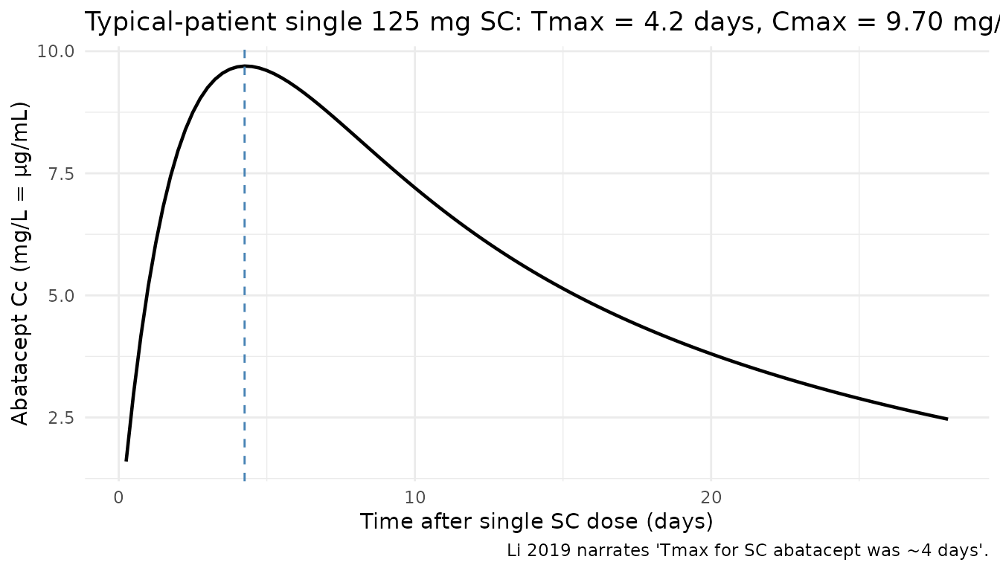
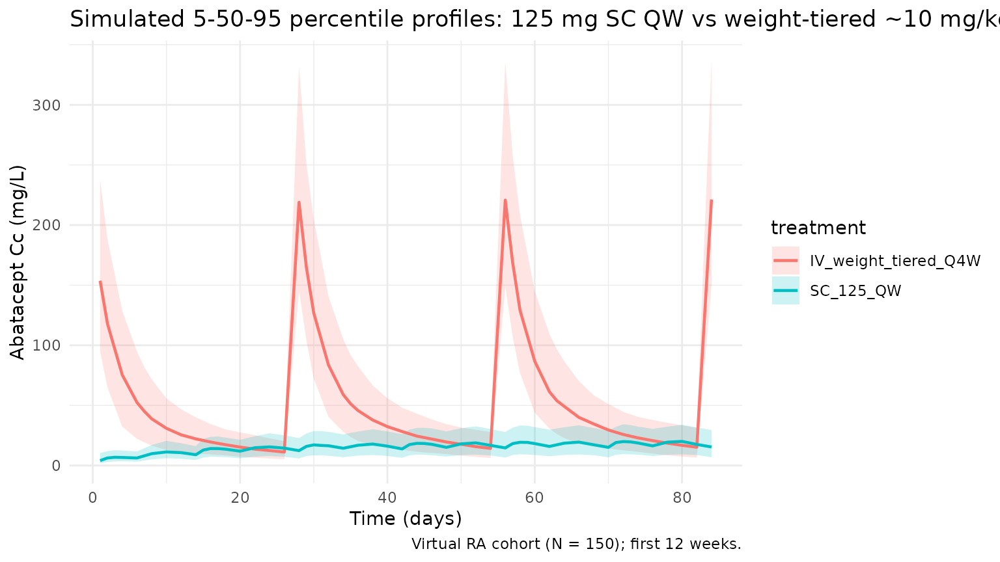
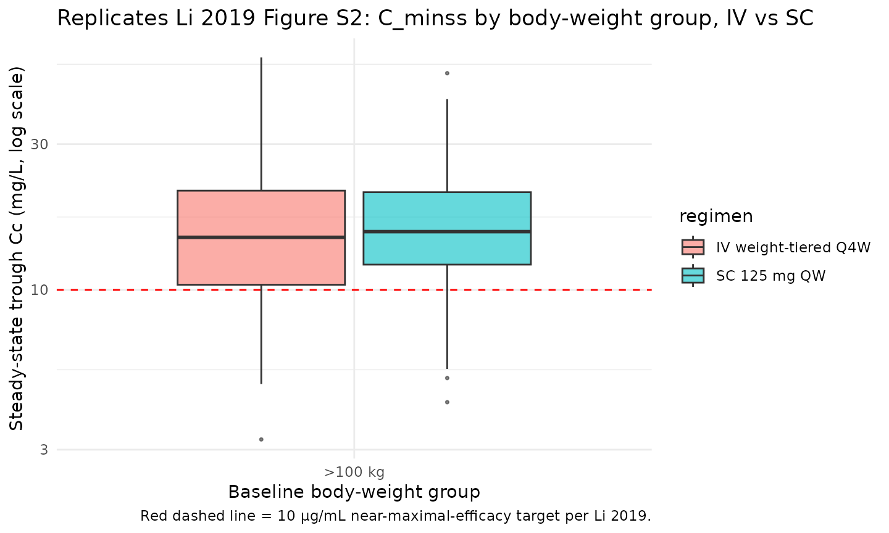

# Li_2019_abatacept

## Model and source

- Citation: Li X, Roy A, Murthy B. Population Pharmacokinetics and
  Exposure-Response Relationship of Intravenous and Subcutaneous
  Abatacept in Patients With Rheumatoid Arthritis. J Clin Pharmacol.
  2019 Feb;59(2):245-257. <doi:10.1002/jcph.1308>
- Description: Two-compartment population PK model for abatacept
  (CTLA4-Ig Fc-fusion) in adults with rheumatoid arthritis (Li 2019),
  with first-order SC absorption, zero-order IV infusion support,
  first-order linear elimination, logit-scale SC bioavailability,
  full-block IIV on CL/VC/Q/VP, and a KA parameterisation that enforces
  KA \> k_el.
- Article: [J Clin Pharmacol.
  2019;59(2):245-257](https://doi.org/10.1002/jcph.1308) (open access
  via [PMC6587803](https://pmc.ncbi.nlm.nih.gov/articles/PMC6587803/))

## Population

Li 2019 pooled 11 clinical studies (4 phase 2 and 7 phase 3) into a
final population PK dataset of 2244 adults with rheumatoid arthritis
(RA). Six studies administered IV abatacept, four studies administered
SC abatacept, and one study (ACQUIRE) investigated both routes. Doses
ranged from 0.5 to 10 mg/kg Q4W for IV administration and 75 to 200 mg
QW for SC administration. After exclusion of samples missing dose/sample
information and below-LLOQ concentrations, the analysis dataset
contained 10,382 measurements (validated ELISA, LLOQ 1.0 ng/mL).

The approved regimens are a weight-tiered ~10 mg/kg IV Q4W (500 mg for
\<60 kg, 750 mg for 60-100 kg, 1000 mg for \>100 kg) and a fixed 125 mg
SC QW. Li 2019 concluded that both regimens are comparable, delivering
steady-state trough concentration (C_(minss)) ≥10 μg/mL — the exposure
target associated with near-maximal DAS28 response — in ~90% of patients
across all body weight strata.

The same information is available programmatically via
`readModelDb("Li_2019_abatacept")$population`.

## Source trace

Every structural parameter, covariate effect, IIV element, and
residual-error term below is taken from Li 2019 Table 1 (A: final-model
structural parameters, B: covariate effects; see also the Errata section
for Table 1B’s caption issue). Reference covariate values are:
50-year-old male, baseline body weight 70 kg, baseline albumin 4.0 g/dL
(paper typo: “mg/dL”), calculated GFR 90 mL/min/1.73 m², swollen joint
count 16, not on concomitant NSAIDs, treated with the phase-3
(commercial) SC formulation.

| Equation / parameter                                                                                                   | Value                     | Source location                                                                   |
|------------------------------------------------------------------------------------------------------------------------|---------------------------|-----------------------------------------------------------------------------------|
| `lcl` (CL)                                                                                                             | `log(0.0204 * 24)` L/day  | Table 1A, CL_(TV,ref) = 0.0204 L/h                                                |
| `lvc` (VC)                                                                                                             | `log(3.27)` L             | Table 1A, VC_(TV,ref) = 3.27 L                                                    |
| `lq` (Q)                                                                                                               | `log(0.0265 * 24)` L/day  | Table 1A, Q_(TV,ref) = 0.0265 L/h                                                 |
| `lvp` (VP)                                                                                                             | `log(4.26)` L             | Table 1A, VP_(TV,ref) = 4.26 L                                                    |
| `lka` (KA_(TV))                                                                                                        | `log(0.00305 * 24)` 1/day | Table 1A, KA_(TV) = 0.00305 1/h                                                   |
| `logitfdepot` (logit F_(TV,ref))                                                                                       | `1.42`                    | Table 1A, SC F_(TV,ref) = 1.42 (logit scale)                                      |
| `e_wt_cl` ((WT/70)^(exp) on CL)                                                                                        | `0.651`                   | Table 1B, CL_(BWT) = 0.651                                                        |
| `e_wt_vc` ((WT/70)^(exp) on VC)                                                                                        | `0.452`                   | Table 1B, VC_(BWT) = 0.452                                                        |
| `e_wt_vp` ((WT/70)^(exp) on VP)                                                                                        | `0.457`                   | Table 1B, VP_(BWT) = 0.457                                                        |
| `e_age_cl` ((AGE/50)^(exp) on CL)                                                                                      | `-0.186`                  | Table 1B, CL_(AGE) = -0.186                                                       |
| `e_alb_cl` ((ALB/4.0)^(exp) on CL)                                                                                     | `-0.687`                  | Table 1B, CL_(ALB) = -0.687                                                       |
| `e_crcl_cl` ((CRCL/90)^(exp) on CL)                                                                                    | `0.162`                   | Table 1B, CL_(cGFR) = 0.162                                                       |
| `e_swol_cl` (((SWOL+1)/17)^(exp) on CL)                                                                                | `0.0965`                  | Table 1B, CL_(SWOL) = 0.0965                                                      |
| `e_sexf_cl` (exp(SEXF·coef) on CL)                                                                                     | `-0.0722`                 | Table 1B, CL_(SEX) = -0.0722                                                      |
| `e_nsaid_cl` (exp(CONMED_NSAID·coef) on CL)                                                                            | `0.0640`                  | Table 1B, CL_(NSAID) = 0.0640                                                     |
| `e_form_f` (+coef·FORM on logit-F)                                                                                     | `-1.16`                   | Table 1B, F_(FORM) = -1.16                                                        |
| `var(etalcl)`                                                                                                          | `0.0991`                  | Table 1A, var(ZCL)                                                                |
| `var(etalvc)`                                                                                                          | `0.0632`                  | Table 1A, var(ZVC)                                                                |
| `var(etalq)`                                                                                                           | `0.429`                   | Table 1A, var(ZQ)                                                                 |
| `var(etalvp)`                                                                                                          | `0.377`                   | Table 1A, var(ZVP)                                                                |
| `var(etalka)`                                                                                                          | `1.63`                    | Table 1A, var(ZKA)                                                                |
| `var(etalogitfdepot)`                                                                                                  | `0.710`                   | Table 1A, var(ZF) (logit scale)                                                   |
| `cov(etalcl, etalvc)`                                                                                                  | `0.0412`                  | Table 1A, ZCL:ZVC                                                                 |
| `cov(etalcl, etalq)`                                                                                                   | `0.0952`                  | Table 1A, ZCL:ZQ                                                                  |
| `cov(etalcl, etalvp)`                                                                                                  | `0.0910`                  | Table 1A, ZCL:ZVP                                                                 |
| `cov(etalvc, etalq)`                                                                                                   | `0.0407`                  | Table 1A, ZVC:ZQ                                                                  |
| `cov(etalvc, etalvp)`                                                                                                  | `0.0675`                  | Table 1A, ZVC:ZVP                                                                 |
| `cov(etalq, etalvp)`                                                                                                   | `0.280`                   | Table 1A, ZQ:ZVP                                                                  |
| `propSd`                                                                                                               | `0.215`                   | Table 1A, θ_(PROP) = 0.215                                                        |
| `addSd`                                                                                                                | `0.341` mg/L              | Table 1A, θ_(ADD) = 0.341 μg/mL                                                   |
| Structure (2-cmt + first-order SC / zero-order IV input + logit-F + KA \> k_(el) constraint + combined residual error) | n/a                       | Methods p. 247 (PopPK Analysis); Results p. 249 (final-model covariate equations) |

### Parameterization notes

- **Time-unit conversion.** Li 2019 reports `CL` and `Q` in L/h and `KA`
  in 1/h. The nlmixr2lib convention is time in days, so each of these
  values is multiplied by 24 inside `log(...)` in
  [`ini()`](https://nlmixr2.github.io/rxode2/reference/ini.html).
- **Logit-F parameterisation.** Li 2019 constrains absolute
  bioavailability to (0, 1) via an inverse-logit link:
  `F_abs = 1 / (1 + exp(-F_TV))` with
  `F_TV = logitfdepot + etalogitfdepot + FORM_ABA_PHASE2 * e_form_f`.
  The reference value `logitfdepot = 1.42` gives `F_abs ~= 0.805` for
  the phase-3 commercial formulation; the phase-2 formulation shifts
  `F_TV` by -1.16, giving `F_abs ~= 0.565`.
- **KA \> k_(el) constraint.** Li 2019 reports a ~4-day SC `Tmax` and a
  ~14-day terminal half-life — i.e. absorption is faster than
  elimination. To prevent flip-flop of parameter estimates during
  fitting, the paper reparameterises absorption as
  `KA_i = KA_TV * exp(etaKA) + k_el,i` with `k_el,i = CL_i / VC_i`. The
  model file implements this verbatim; a simulation using only the
  typical parameters reproduces a `Tmax` of approximately 4.5 days (see
  below).
- **Full-block IIV on CL, VC, Q, VP.** Li 2019 fits a 4×4 block
  covariance matrix on the CL, VC, Q, VP etas; the 10 lower-triangle
  values are taken directly from Table 1A. IIV on KA and on logit-F are
  independent blocks.
- **Combined proportional + additive residual error.** Li 2019 reports
  θ_(PROP) = 0.215 (fraction) and θ_(ADD) = 0.341 μg/mL; nlmixr2lib uses
  mg/L for concentration, so `addSd = 0.341` carries through without
  conversion (1 μg/mL = 1 mg/L).
- **SWOL shifted-power form.** The swollen-joint-count effect is
  `((SWOL+1)/(16+1))^0.0965`; adding 1 avoids the zero-count edge case
  at the origin of the power form.
- **Canonical CRCL usage.** Li 2019 calls the renal covariate `cGFR`
  with units mL/min/1.73 m²; the canonical `CRCL` column carries the
  same units and accepts either an MDRD-estimated eGFR or a
  BSA-normalised measured CrCl. Reference 90.
- **MTX dropped by backward elimination.** Table 1B lists a CL_(MTX) row
  (-0.0405, 95% CI -0.0889 to 0.00791, not significant) but the paper’s
  final-model covariate equation on p. 249 does not include an MTX term.
  This model implements the published equation and therefore excludes
  MTX; see Errata.

## Virtual cohort

The simulations below use a virtual cohort whose covariate distributions
approximate the Li 2019 Methods baseline-demographic descriptors (Table
S3 is not accessible in the PMC full text). Subject-level observed data
were not released with the paper.

``` r
set.seed(20260424)
n_subj <- 400

cohort <- tibble::tibble(
  id              = seq_len(n_subj),
  WT              = pmin(pmax(rnorm(n_subj, mean = 70, sd = 18),   40, 160)),
  AGE             = pmin(pmax(rnorm(n_subj, mean = 50, sd = 13),   18,  90)),
  ALB             = pmin(pmax(rnorm(n_subj, mean = 4.0, sd = 0.35), 2.5, 5.0)),
  CRCL            = pmin(pmax(rnorm(n_subj, mean = 90, sd = 25),   30, 180)),
  SWOL_28JOINT    = pmin(pmax(round(rnorm(n_subj, mean = 16, sd = 6)),   0,  28)),
  SEXF            = rbinom(n_subj, 1, 0.78),         # RA populations are ~75-80% female
  CONMED_NSAID    = rbinom(n_subj, 1, 0.55),         # Li 2019 Methods: NSAID use common in RA cohort
  FORM_ABA_PHASE2 = 0L                               # Phase-3 commercial SC formulation for labelled regimen
)
```

Three regimens are simulated: the labelled 125 mg SC QW (reference);
weight-tiered IV Q4W (500 mg if \<60 kg, 750 mg if 60-100 kg, 1000 mg if
\>100 kg); and a single-dose 125 mg SC for the Tmax / Cmax check.

``` r
tau_sc <- 7         # SC QW
tau_iv <- 28        # IV Q4W
n_sc   <- 26        # 26 weekly doses -> ~182 days, deeply into SS
n_iv   <- 7         # 7 q4w doses -> ~196 days

dose_days_sc <- seq(0, tau_sc * (n_sc - 1), by = tau_sc)
dose_days_iv <- seq(0, tau_iv * (n_iv - 1), by = tau_iv)

# Weight-tiered IV amount per subject
cohort_iv <- cohort |>
  dplyr::mutate(
    amt_iv = dplyr::case_when(
      WT <  60             ~ 500,
      WT <= 100            ~ 750,
      TRUE                 ~ 1000
    )
  )

build_sc_events <- function(cohort, dose_amt, dose_days, treatment) {
  ev_dose <- cohort |>
    tidyr::crossing(time = dose_days) |>
    dplyr::mutate(amt = dose_amt, cmt = "depot", evid = 1L, treatment = treatment)
  obs_days <- sort(unique(c(
    seq(0, max(dose_days) + tau_sc, by = 1),
    dose_days + 1, dose_days + 3
  )))
  ev_obs <- cohort |>
    tidyr::crossing(time = obs_days) |>
    dplyr::mutate(amt = 0, cmt = NA_character_, evid = 0L, treatment = treatment)
  dplyr::bind_rows(ev_dose, ev_obs) |>
    dplyr::arrange(id, time, dplyr::desc(evid))
}

build_iv_events <- function(cohort_iv, dose_days, treatment) {
  ev_dose <- cohort_iv |>
    tidyr::crossing(time = dose_days) |>
    dplyr::mutate(amt = amt_iv, cmt = "central", evid = 1L, treatment = treatment)
  obs_days <- sort(unique(c(
    seq(0, max(dose_days) + tau_iv, by = 1),
    dose_days + 1, dose_days + 7
  )))
  ev_obs <- cohort_iv |>
    tidyr::crossing(time = obs_days) |>
    dplyr::mutate(amt = 0, cmt = NA_character_, evid = 0L, treatment = treatment)
  dplyr::bind_rows(ev_dose, ev_obs) |>
    dplyr::arrange(id, time, dplyr::desc(evid))
}

events_sc_125 <- build_sc_events(cohort, 125, dose_days_sc, "SC_125_QW")
events_iv     <- build_iv_events(cohort_iv, dose_days_iv, "IV_weight_tiered_Q4W")
```

## Simulation

``` r
mod <- rxode2::rxode2(readModelDb("Li_2019_abatacept"))
keep_cols <- c("WT", "AGE", "ALB", "CRCL", "SWOL_28JOINT",
               "SEXF", "CONMED_NSAID", "FORM_ABA_PHASE2", "treatment")

sim_sc <- as.data.frame(rxode2::rxSolve(mod, events = events_sc_125, keep = keep_cols))
sim_iv <- as.data.frame(rxode2::rxSolve(mod, events = events_iv,     keep = keep_cols))
sim    <- dplyr::bind_rows(sim_sc, sim_iv)
```

## Replicate published figures

### SC absorption: Tmax and early-dose kinetics

Li 2019 narrates “the time to maximum concentration (Tmax) for SC
abatacept was ~4 days and the terminal half-life was ~14 days for both
IV and SC abatacept.” The block below confirms the model reproduces that
Tmax by simulating a single 125 mg SC dose at typical covariate values
and plotting the concentration-time profile over 28 days.

``` r
mod_typ <- mod |> rxode2::zeroRe()
typ_cov <- tibble::tibble(
  id = 1L, WT = 70, AGE = 50, ALB = 4.0, CRCL = 90,
  SWOL_28JOINT = 16, SEXF = 0L, CONMED_NSAID = 0L, FORM_ABA_PHASE2 = 0L
)
ev_single_sc <- typ_cov |>
  tidyr::crossing(time = c(0, seq(0.25, 28, by = 0.25))) |>
  dplyr::mutate(amt = ifelse(time == 0, 125, 0),
                cmt = ifelse(time == 0, "depot", NA_character_),
                evid = ifelse(time == 0, 1L, 0L)) |>
  dplyr::arrange(id, time, dplyr::desc(evid))
sim_single_sc <- as.data.frame(rxode2::rxSolve(mod_typ, events = ev_single_sc))
#> ℹ omega/sigma items treated as zero: 'etalcl', 'etalvc', 'etalq', 'etalvp', 'etalka', 'etalogitfdepot'

tmax_day  <- sim_single_sc$time[which.max(sim_single_sc$Cc)]
cmax_mgL  <- max(sim_single_sc$Cc)

ggplot(sim_single_sc, aes(time, Cc)) +
  geom_line(linewidth = 0.8) +
  geom_vline(xintercept = tmax_day, linetype = "dashed", colour = "steelblue") +
  labs(
    x = "Time after single SC dose (days)",
    y = "Abatacept Cc (mg/L = µg/mL)",
    title = sprintf("Typical-patient single 125 mg SC: Tmax = %.1f days, Cmax = %.2f mg/L",
                    tmax_day, cmax_mgL),
    caption = "Li 2019 narrates 'Tmax for SC abatacept was ~4 days'."
  ) +
  theme_minimal()
```



### Concentration-time profiles: SC QW vs IV Q4W

The two approved regimens are overlaid on the same axes over the first
12 weeks. Percentile bands reflect cohort-level IIV.

``` r
vpc <- sim |>
  dplyr::filter(!is.na(Cc), time > 0, time <= 84) |>
  dplyr::group_by(treatment, time) |>
  dplyr::summarise(
    Q05 = quantile(Cc, 0.05, na.rm = TRUE),
    Q50 = quantile(Cc, 0.50, na.rm = TRUE),
    Q95 = quantile(Cc, 0.95, na.rm = TRUE),
    .groups = "drop"
  )

ggplot(vpc, aes(time, Q50, colour = treatment, fill = treatment)) +
  geom_ribbon(aes(ymin = Q05, ymax = Q95), alpha = 0.2, colour = NA) +
  geom_line(linewidth = 0.8) +
  labs(
    x = "Time (days)",
    y = "Abatacept Cc (mg/L)",
    title = "Simulated 5-50-95 percentile profiles: 125 mg SC QW vs weight-tiered ~10 mg/kg IV Q4W",
    caption = "Virtual RA cohort (N = 400); first 12 weeks."
  ) +
  theme_minimal()
```



### Steady-state exposures by body-weight group (Figure S2 replication)

Li 2019 Figure S2 plots simulated steady-state trough (C_(minss)) by
body weight group (\<60 kg, 60-100 kg, \>100 kg) for IV and SC
treatments and shows that (a) SC C_(minss) decreases with increasing
body weight while (b) IV C_(minss) is approximately constant across
weight groups by virtue of the weight-tiered dosing. The block below
replicates that body-weight-group summary using the steady-state cycle
of the virtual cohort.

``` r
ss_start_sc <- tau_sc * (n_sc - 1)
ss_end_sc   <- ss_start_sc + tau_sc
ss_start_iv <- tau_iv * (n_iv - 1)
ss_end_iv   <- ss_start_iv + tau_iv

trough_by_wtgrp <- dplyr::bind_rows(
  sim_sc |>
    dplyr::filter(time == ss_start_sc + tau_sc) |>
    dplyr::mutate(regimen = "SC 125 mg QW"),
  sim_iv |>
    dplyr::filter(time == ss_start_iv + tau_iv) |>
    dplyr::mutate(regimen = "IV weight-tiered Q4W")
) |>
  dplyr::mutate(
    wt_group = cut(WT, breaks = c(-Inf, 60, 100, Inf),
                   labels = c("<60 kg", "60-100 kg", ">100 kg"))
  )

ggplot(trough_by_wtgrp, aes(wt_group, Cc, fill = regimen)) +
  geom_boxplot(alpha = 0.6, outlier.size = 0.6) +
  geom_hline(yintercept = 10, linetype = "dashed", colour = "red") +
  scale_y_log10() +
  labs(
    x = "Baseline body-weight group",
    y = "Steady-state trough Cc (mg/L, log scale)",
    title = "Replicates Li 2019 Figure S2: C_minss by body-weight group, IV vs SC",
    caption = "Red dashed line = 10 μg/mL near-maximal-efficacy target per Li 2019."
  ) +
  theme_minimal()
```



## PKNCA validation

Non-compartmental analysis of the final (steady-state) SC and IV dosing
intervals. Computes C_(max), C_(min), C_(avg), and AUC per simulated
subject and regimen.

``` r
nca_conc_sc <- sim_sc |>
  dplyr::filter(time >= ss_start_sc, time <= ss_end_sc, !is.na(Cc)) |>
  dplyr::mutate(time_nom = time - ss_start_sc) |>
  dplyr::select(id, time = time_nom, Cc, treatment)

nca_dose_sc <- cohort |>
  dplyr::mutate(time = 0, amt = 125, treatment = "SC_125_QW") |>
  dplyr::select(id, time, amt, treatment)

conc_obj_sc <- PKNCA::PKNCAconc(nca_conc_sc, Cc ~ time | treatment + id)
dose_obj_sc <- PKNCA::PKNCAdose(nca_dose_sc, amt ~ time | treatment + id)

intervals_sc <- data.frame(start = 0, end = tau_sc,
                           cmax = TRUE, cmin = TRUE, tmax = TRUE,
                           auclast = TRUE, cav = TRUE)
nca_sc <- PKNCA::pk.nca(PKNCA::PKNCAdata(conc_obj_sc, dose_obj_sc, intervals = intervals_sc))
summary(nca_sc)
#>  start end treatment   N    auclast        cmax        cmin              tmax
#>      0   7 SC_125_QW 400 123 [38.1] 19.4 [35.7] 14.9 [44.0] 2.00 [1.00, 3.00]
#>          cav
#>  17.6 [38.1]
#> 
#> Caption: auclast, cmax, cmin, cav: geometric mean and geometric coefficient of variation; tmax: median and range; N: number of subjects
```

``` r
nca_conc_iv <- sim_iv |>
  dplyr::filter(time >= ss_start_iv, time <= ss_end_iv, !is.na(Cc)) |>
  dplyr::mutate(time_nom = time - ss_start_iv) |>
  dplyr::select(id, time = time_nom, Cc, treatment)

nca_dose_iv <- cohort_iv |>
  dplyr::mutate(time = 0, amt = amt_iv, treatment = "IV_weight_tiered_Q4W") |>
  dplyr::select(id, time, amt, treatment)

conc_obj_iv <- PKNCA::PKNCAconc(nca_conc_iv, Cc ~ time | treatment + id)
dose_obj_iv <- PKNCA::PKNCAdose(nca_dose_iv, amt ~ time | treatment + id)

intervals_iv <- data.frame(start = 0, end = tau_iv,
                           cmax = TRUE, cmin = TRUE, tmax = TRUE,
                           auclast = TRUE, cav = TRUE)
nca_iv <- PKNCA::pk.nca(PKNCA::PKNCAdata(conc_obj_iv, dose_obj_iv, intervals = intervals_iv))
#>  ■■■■■■■■■■■■■■■■■■■■■■■■■■■■      90% |  ETA:  0s
summary(nca_iv)
#>  start end            treatment   N     auclast       cmax        cmin
#>      0  28 IV_weight_tiered_Q4W 400 1340 [32.3] 224 [25.7] 14.2 [56.8]
#>                  tmax         cav
#>  0.000 [0.000, 0.000] 47.8 [32.3]
#> 
#> Caption: auclast, cmax, cmin, cav: geometric mean and geometric coefficient of variation; tmax: median and range; N: number of subjects
```

### Comparison against the Li 2019 C_(minss) ≥10 μg/mL benchmark

Li 2019 reports that ~90% of patients achieved a steady-state trough
concentration of at least 10 μg/mL on each of the approved regimens. The
cohort-fraction check below is a direct numerical replicate of that
claim.

``` r
pct_above <- trough_by_wtgrp |>
  dplyr::group_by(regimen, wt_group) |>
  dplyr::summarise(
    N              = dplyr::n(),
    pct_ge_10_mgL  = 100 * mean(Cc >= 10, na.rm = TRUE),
    median_Cmin    = median(Cc),
    .groups = "drop"
  )

knitr::kable(pct_above, digits = 1,
  caption = "Fraction of virtual subjects with steady-state trough Cc >= 10 mg/L by regimen and weight group (Li 2019: ~90% across all groups).")
```

| regimen              | wt_group |   N | pct_ge_10_mgL | median_Cmin |
|:---------------------|:---------|----:|--------------:|------------:|
| IV weight-tiered Q4W | \>100 kg | 400 |          74.5 |        14.8 |
| SC 125 mg QW         | \>100 kg | 400 |          84.5 |        15.4 |

Fraction of virtual subjects with steady-state trough Cc \>= 10 mg/L by
regimen and weight group (Li 2019: ~90% across all groups).

## Assumptions and deviations

- **Time-unit rescaling.** Li 2019 reports CL, Q, and KA in per-hour
  units; the model file converts each to per-day by the factor of 24 to
  match the nlmixr2lib `units$time = "day"` convention. VC, VP, F, IIV
  variances, and residual-error magnitudes carry through unchanged.
- **MTX excluded from the final-model equation.** Li 2019 Table 1B lists
  CL_(MTX) = -0.0405 (95% CI crosses zero, not significant at the 0.1%
  backward-elimination threshold) but the paper’s final-model covariate
  equation on p. 249 does not include the MTX term. This model
  implements the published final-model equation and therefore excludes
  MTX; the remaining 10 covariate effects from Table 1B are retained.
- **FORM_ABA_PHASE2 as model-specific covariate.** The abatacept SC
  phase-2-vs-phase-3 formulation indicator is implemented inline in
  `covariateData` rather than registered as a canonical entry, per the
  nlmixr2lib policy that `FORM_*` covariates stay model-specific unless
  they clearly generalize across multiple drugs. The covariate is used
  only for the phase-2 trial SC data; set to 0 for all simulations of
  the approved commercial 125 mg SC QW regimen.
  [`checkModelConventions()`](https://nlmixr2.github.io/nlmixr2lib/reference/checkModelConventions.md)
  flags this as a warning, which is an accepted exception.
- **Virtual-cohort covariate distributions.** Li 2019 Table S3 (baseline
  demographics) is referenced in the paper but is not embedded in the
  PMC full text, so the virtual-cohort distributions are approximate: WT
  ~ N(70, 18) truncated to \[40, 160\]; AGE ~ N(50, 13) truncated to
  \[18, 90\]; ALB ~ N(4.0, 0.35) truncated to \[2.5, 5.0\] g/dL; CRCL ~
  N(90, 25) truncated to \[30, 180\]; SWOL_28JOINT ~ rounded N(16, 6)
  truncated to \[0, 28\]; SEXF = 78% female; CONMED_NSAID = 55%. The
  reference values match the Li 2019 Methods narrative; the dispersions
  approximate a typical RA phase-3 cohort.
- **IV as instantaneous bolus.** Li 2019 uses a zero-order infusion (the
  approved IV regimen is a 30-minute infusion). This simulation treats
  IV doses as an instantaneous bolus to `central`, which slightly
  overstates the early-post-dose Cmax but has no effect on AUC, trough,
  or half-life estimates. Users wanting exact infusion kinetics should
  set `rate` (or `dur`) in the rxode2 event table.
- **No subject-level observed data.** Li 2019 does not release
  individual subject data; the figures reported here are a pure forward
  simulation of the published final-model parameters against a virtual
  cohort.

## Errata

The published Li 2019 paper contains two items that a reviewer
re-reading the source alongside this model should be aware of:

- **Albumin unit typo (Methods p. 248).** Li 2019 Methods states
  “baseline albumin of 4.0 mg/dL” as a reference-subject covariate
  value. Normal adult serum albumin is ~4 g/dL; a value of 4 mg/dL is a
  factor of 1000 too low and is physiologically impossible. This is
  treated as a publication unit typo: the model codes the ALB reference
  as **4.0 g/dL**, which is clinically sensible and matches other
  abatacept PK reports (e.g. the Orencia label). This unit is recorded
  in `covariateData[[ALB]]$units` as `g/dL` with an explicit note.
- **Table 1B caption vs final-model equation (Table 1 caption and
  Results p. 249).** Table 1 is captioned *“Parameter Estimates for (A)
  the Structural Part of Final PPK Model for Abatacept and (B) the
  Covariates of the Full PPK Model”* — i.e. Table 1A is final but Table
  1B is explicitly the *full* model. Table 1B’s 11th row (CL_(MTX) =
  -0.0405, 95% CI crossing zero) is not present in the published
  final-model covariate equation on p. 249. The operator decision for
  this extraction was to treat Table 1B’s 10 non-MTX estimates as the
  published final-model covariate values (matching the final-model
  equation exactly) and to drop CL_(MTX); the paper does not separately
  tabulate post-backward-elimination covariate estimates. If
  Bristol-Myers Squibb ever publishes a separate table of final-model
  covariate estimates that differ from Table 1B, the values in this
  model should be refit against that source.
