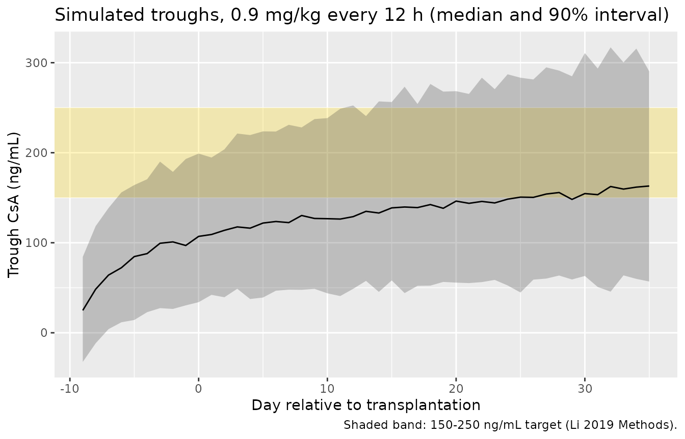

# Cyclosporine (Li 2019)

## Model and source

    #> ℹ parameter labels from comments will be replaced by 'label()'

- Citation: Li TF, Hu L, Ma XL, Huang L, Liu XM, Luo XX, Feng WY, Wu CF.
  Population pharmacokinetics of cyclosporine in Chinese children
  receiving hematopoietic stem cell transplantation. Acta Pharmacol Sin.
  2019;40(12):1603-1610. <doi:10.1038/s41401-019-0277-x>
- Description: One-compartment intravenous population PK model for
  cyclosporine A in Chinese children receiving allogeneic haematopoietic
  stem cell transplantation (Li 2019), with allometric body-weight
  scaling on CL and V, linear post-operative-day effects on CL and V, a
  power eGFR effect and a fractional triazole-antifungal effect on CL,
  CYP3A4\*1G (rs2242480) genotype multipliers on CL, and combined
  proportional plus additive residual error.
- Article: <https://doi.org/10.1038/s41401-019-0277-x>

Li and colleagues fitted a one-compartment model with first-order
elimination to 1010 whole-blood cyclosporine A (CsA) trough
concentrations from 86 Chinese children who received intravenous CsA (2
h infusion every 12 h) around allogeneic haematopoietic stem cell
transplantation (allo-HSCT). Clearance carries allometric weight
scaling, a linear post-operative-day (POD) effect, a power effect of
eGFR, a fractional reduction with concomitant triazole antifungals
(TAF), and CYP3A4\*1G (rs2242480) genotype multipliers; volume carries
allometric weight scaling and a linear POD effect.

``` r

mod <- readModelDb("Li_2019_cyclosporine")
mod
#> function() {
#>   description <- "One-compartment intravenous population PK model for cyclosporine A in Chinese children receiving allogeneic haematopoietic stem cell transplantation (Li 2019), with allometric body-weight scaling on CL and V, linear post-operative-day effects on CL and V, a power eGFR effect and a fractional triazole-antifungal effect on CL, CYP3A4*1G (rs2242480) genotype multipliers on CL, and combined proportional plus additive residual error."
#>   reference <- "Li TF, Hu L, Ma XL, Huang L, Liu XM, Luo XX, Feng WY, Wu CF. Population pharmacokinetics of cyclosporine in Chinese children receiving hematopoietic stem cell transplantation. Acta Pharmacol Sin. 2019;40(12):1603-1610. doi:10.1038/s41401-019-0277-x"
#>   vignette <- "Li_2019_cyclosporine"
#>   units <- list(time = "h", dosing = "mg", concentration = "ng/mL")
#> 
#>   compartmentData <- list(
#>     # Li 2019 Abstract: "Whole blood samples were collected" and the CMIA
#>     # (Architect i2000SR) cyclosporine assay is a whole-blood assay, so the
#>     # modelled matrix is whole blood.
#>     central = list(analyte = "cyclosporine", units = "mg", specimen = "whole blood", verified = TRUE)
#>   )
#> 
#>   covariateData <- list(
#>     WT = list(
#>       description = "Body weight",
#>       units = "kg",
#>       type = "continuous",
#>       reference_category = NULL,
#>       notes = paste(
#>         "Allometric scaling (WT / 70)^0.75 on CL and (WT / 70)^1 on V, both",
#>         "exponents fixed (Li 2019 Eq. 3 and text: 'PWR is the allometric",
#>         "coefficient fixed at a value of 0.75 for clearance and a value of 1",
#>         "for distribution volume'). Cohort mean 31.93 kg, median 28.8 kg",
#>         "(Table 1). The Results text gives the range 6.5-69.0 kg while",
#>         "Table 1 gives 9.4-78.5 kg; the source does not resolve the",
#>         "discrepancy."
#>       ),
#>       source_name = "WT"
#>     ),
#>     POD = list(
#>       description = "Post-operative day (days since allogeneic HSCT)",
#>       units = "days",
#>       type = "continuous",
#>       reference_category = NULL,
#>       notes = paste(
#>         "Time-varying. Enters CL and V as the linear deviation",
#>         "(1 - (POD - 9) * theta) (Li 2019 Eq. 4 and Eq. 5), so both",
#>         "parameters decline linearly with POD; the centring value 9 days is",
#>         "printed in the equations. Table 1: mean 29.7, median 25, range",
#>         "0-67 days. Cyclosporine was started on Day -7 or -10; how the",
#>         "pre-transplant troughs were coded is not stated, but Table 1's",
#>         "lower bound of 0 suggests they carried POD = 0. The V factor reaches",
#>         "zero at POD = 9 + 1 / 0.0197 = 59.8 days and is negative beyond, so",
#>         "the published equation is only usable for POD below about 50 days",
#>         "(the model does not truncate it)."
#>       ),
#>       source_name = "POD"
#>     ),
#>     CRCL = list(
#>       description = "Estimated glomerular filtration rate, BSA-normalised",
#>       units = "mL/min/1.73 m^2",
#>       type = "continuous",
#>       reference_category = NULL,
#>       notes = paste(
#>         "Power effect (eGFR / 172.46)^0.545 on CL (Li 2019 Eq. 4); 172.46 is",
#>         "the Table 1 cohort median (mean 179.4, range 24.93-377.54). The",
#>         "estimating equation for eGFR is not stated in the paper (a",
#>         "creatinine-based paediatric equation such as bedside Schwartz is",
#>         "the usual choice; Table 1 reports serum creatinine in umol/L)."
#>       ),
#>       source_name = "eGFR"
#>     ),
#>     CONMED_AZOLE = list(
#>       description = "Concomitant triazole antifungal (1 = yes, 0 = no)",
#>       units = "(binary)",
#>       type = "binary",
#>       reference_category = "0 (no triazole antifungal)",
#>       notes = paste(
#>         "Li 2019 'TAF' indicator ('patients were coadministered of TAF, the",
#>         "TAF = 1, otherwise TAF = 0'); fractional effect (1 - 0.36 * TAF) on",
#>         "CL (Eq. 4). The pooled triazoles were voriconazole (61 children),",
#>         "itraconazole (19), posaconazole (6) and fluconazole (1); only 4",
#>         "children never received one (Table 1). The paper does not say",
#>         "whether TAF was coded per record (time-varying) or per subject."
#>       ),
#>       source_name = "TAF"
#>     ),
#>     SNP_CYP3A4_RS2242480_VAR_COUNT = list(
#>       description = "CYP3A4*1G (rs2242480) variant (T) allele count: 0 = CC, 1 = CT, 2 = TT",
#>       units = "(count, 0/1/2 alleles per subject)",
#>       type = "continuous",
#>       reference_category = NULL,
#>       notes = paste(
#>         "Li 2019 codes the genotype as 'Gene' = 1 for CC, 2 for TT and 3 for",
#>         "CT (Table 3 footnote) and multiplies CL by 0.984 for Gene = 1 and by",
#>         "1.22 for Gene = 2 or 3 (Results text below Eq. 5; Table 3 rows",
#>         "'Gene-1/2/3 ON CL'). Canonical mapping: CC -> 0, CT -> 1, TT -> 2.",
#>         "Table 2: CC 50 (61.0%), CT 26 (31.7%), TT 6 (7.3%); the T allele is",
#>         "the minor allele (frequency 23.2%). 82 of 86 children were",
#>         "genotyped; how the 4 ungenotyped children were coded is not",
#>         "reported, so no missing-genotype indicator is carried."
#>       ),
#>       source_name = "Gene"
#>     )
#>   )
#> 
#>   covariatesDataExcluded <- list(
#>     AGE = list(
#>       description = "Age",
#>       units = "years",
#>       type = "continuous",
#>       notes = "Table 1 mean 8.38 (1.1-16.8). Screened; the age trend in CL disappeared after allometric weight scaling (Fig. 1)."
#>     ),
#>     SEXF = list(
#>       description = "Female sex indicator",
#>       units = "(binary)",
#>       type = "binary",
#>       reference_category = "0 (male)",
#>       notes = "30 of 86 female (Table 1). Screened, not retained."
#>     ),
#>     HGB = list(
#>       description = "Haemoglobin",
#>       units = "g/L",
#>       type = "continuous",
#>       notes = "Table 1 mean 85.49 g/L. Screened, not retained."
#>     ),
#>     HCT = list(
#>       description = "Haematocrit",
#>       units = "%",
#>       type = "continuous",
#>       notes = "Table 1 mean 24.42%. Screened, not retained."
#>     ),
#>     ALB = list(
#>       description = "Serum albumin",
#>       units = "g/L",
#>       type = "continuous",
#>       notes = "Table 1 mean 34.98 (printed with the unit 'U/L'). Screened, not retained."
#>     ),
#>     SNP_CYP3A5_RS776746 = list(
#>       description = "CYP3A5*3 (rs776746) genotype",
#>       units = "(genotype)",
#>       type = "categorical",
#>       notes = "Table 2: CC 42 / CT 34 / TT 5. Screened, not significant (Discussion)."
#>     )
#>   )
#> 
#>   population <- list(
#>     species = "human",
#>     n_subjects = 86L,
#>     n_studies = 1L,
#>     n_observations = 1010L,
#>     age_range = "1.1-16.8 years",
#>     age_mean = "8.38 years (SD 3.78; median 8.35)",
#>     weight_range = "9.4-78.5 kg (Table 1; the Results text gives 6.5-69.0 kg)",
#>     weight_median = "28.8 kg (mean 31.93, SD 16.75)",
#>     sex_female_pct = 34.9,
#>     race_ethnicity = "Chinese (single centre, Beijing)",
#>     disease_state = "Children with malignant haematological disorders (ALL 33.7%, AA 26.7%, AML 25.6%, NHL 5.8%, MDS 4.7%, other 3.5%) receiving allogeneic haematopoietic stem cell transplantation",
#>     dose_range = "Intravenous cyclosporine as a 2 h infusion every 12 h from Day -7 or -10, initial 2-3 mg/kg, then adjusted to a trough target of 150-250 ng/mL; per-dose amount mean 28.6 mg (median 25, range 5-125 mg)",
#>     regions = "China (Peking University People's Hospital, Beijing)",
#>     cyp3a4_1g_distribution = "rs2242480 CC 50 (61.0%), CT 26 (31.7%), TT 6 (7.3%) of 82 genotyped",
#>     pod_range = "0-67 days (mean 29.7, median 25)",
#>     egfr_median = "172.46 mL/min/1.73 m^2 (range 24.93-377.54)",
#>     notes = "Retrospective therapeutic-drug-monitoring data: 1010 whole-blood troughs (mean 12 per child) drawn before the morning intravenous infusion and measured by chemiluminescent microparticle immunoassay (LLOQ 30 ng/mL). Fit by NONMEM VII FOCE-I."
#>   )
#> 
#>   ini({
#>     # Structural parameters at the Eq. 4 / Eq. 5 reference subject: 70 kg,
#>     # POD 9 days, eGFR 172.46 mL/min/1.73 m^2, no triazole antifungal. The
#>     # CYP3A4*1G multiplier (0.984 CC / 1.22 T carrier) is applied on top of
#>     # the printed CL for every genotype, so no genotype reproduces CL = 42.3
#>     # exactly. Li 2019 Table 3 'Final model Estimate (RSE%)'.
#>     #
#>     # The data are trough-only, so V is identified from accumulation across
#>     # days; the resulting typical half-life is long (about 50 h at 70 kg),
#>     # as in the sibling Feng 2023 cyclosporine model.
#>     lcl <- log(42.3); label("Typical clearance CL at 70 kg, POD 9 d, eGFR 172.46, no triazole (L/h)") # Li 2019 Table 3: CL = 42.3 L/h (RSE 10.6%)
#>     lvc <- log(3100); label("Typical volume of distribution V at 70 kg, POD 9 d (L)") # Li 2019 Table 3: V = 3100 L (RSE 13.1%)
#> 
#>     # Allometric exponents fixed (Li 2019 Eq. 3 and text).
#>     e_wt_cl <- fixed(0.75); label("Allometric exponent of (WT / 70) on CL (unitless)") # Li 2019 Methods 'Covariate analysis': PWR fixed at 0.75 for clearance
#>     e_wt_vc <- fixed(1); label("Allometric exponent of (WT / 70) on V (unitless)") # Li 2019 Methods 'Covariate analysis': PWR fixed at 1 for distribution volume
#> 
#>     # Covariate effects, Li 2019 Eq. 4 and Eq. 5:
#>     #   CL = CLpop * (WT/70)^0.75 * (1 - theta_TAF * TAF) * (1 - (POD - 9) * theta_POD_CL)
#>     #        * (eGFR / 172.46)^theta_eGFR * exp(eta), then * 0.984 (CC) or * 1.22 (CT, TT)
#>     #   V  = Vpop * (WT/70) * (1 - (POD - 9) * theta_POD_V) * exp(eta)
#>     e_azole_cl <- 0.36; label("Fractional decrease in CL with a concomitant triazole antifungal (unitless)") # Li 2019 Table 3: theta TAF-CL = 0.36 (RSE 16.3%)
#>     e_pod_cl <- 0.00703; label("Fractional decrease in CL per post-operative day above 9 d (1/day)") # Li 2019 Table 3: theta POD-CL = 0.00703 (RSE 21.5%)
#>     e_pod_vc <- 0.0197; label("Fractional decrease in V per post-operative day above 9 d (1/day)") # Li 2019 Table 3: theta POD-V = 0.0197 (RSE 29.8%)
#>     e_crcl_cl <- 0.545; label("Power exponent of (eGFR / 172.46) on CL (unitless)") # Li 2019 Table 3: theta eGFR-CL = 0.545 (RSE 29.9%)
#>     e_cyp3a4_wild_cl <- 0.984; label("CL multiplier for CYP3A4*1G (rs2242480) CC (unitless)") # Li 2019 Table 3: Gene-1 ON CL = 0.984 (RSE 8.1%); Gene 1 = CC
#>     e_cyp3a4_varhom_cl <- 1.22; label("CL multiplier for CYP3A4*1G (rs2242480) TT (unitless)") # Li 2019 Table 3: Gene-2 ON CL = 1.22 (RSE 10.1%); Gene 2 = TT
#>     e_cyp3a4_het_cl <- 1.22; label("CL multiplier for CYP3A4*1G (rs2242480) CT (unitless)") # Li 2019 Table 3: Gene-3 ON CL = 1.22 (RSE 8.9%); Gene 3 = CT
#> 
#>     # Inter-individual variability, exponential (Li 2019 Eq. 1). Table 3
#>     # labels the rows 'omega^2', so they are variances:
#>     #   CL 0.0744 -> CV 27.8%;  V 0.454 -> CV 73.6%
#>     etalcl ~ 0.0744 # Li 2019 Table 3: omega^2 CL = 0.0744 (RSE 19.5%, shrinkage 8.4%)
#>     etalvc ~ 0.454 # Li 2019 Table 3: omega^2 V = 0.454 (RSE 24%, shrinkage 27.2%)
#> 
#>     # Residual error, Li 2019 Eq. 2: Cobs = Cpred * (1 + eps1) + eps2. Table 3
#>     # heads the rows 'sigma^2 1 (%)' = 0.154 and 'sigma^2 2 (ng/mL)' = 30.3.
#>     # The units printed (ng/mL, not (ng/mL)^2) and the Results text ('the
#>     # additive error was 30.3 ng/mL') identify these as standard deviations;
#>     # the text's 'proportional error was 22.9%' is the RSE column of the same
#>     # row. See the vignette for the scale decision and the Figure 2b check.
#>     propSd <- 0.154; label("Proportional residual error (fraction)") # Li 2019 Table 3: sigma 1 = 0.154 (RSE 22.9%); read as an SD
#>     addSd <- 30.3; label("Additive residual error (ng/mL)") # Li 2019 Table 3: sigma 2 = 30.3 ng/mL (RSE 21.7%); Results text 'additive error was 30.3 ng/mL'
#>   })
#>   model({
#>     # 1. CYP3A4*1G genotype multiplier (Li 2019 Results text below Eq. 5):
#>     # CC -> 0.984, CT or TT -> 1.22.
#>     cyp3a4_cl <- e_cyp3a4_wild_cl * (SNP_CYP3A4_RS2242480_VAR_COUNT == 0) +
#>       e_cyp3a4_het_cl * (SNP_CYP3A4_RS2242480_VAR_COUNT == 1) +
#>       e_cyp3a4_varhom_cl * (SNP_CYP3A4_RS2242480_VAR_COUNT == 2)
#> 
#>     # 2. Individual parameters (Li 2019 Eq. 4 and Eq. 5)
#>     cl <- exp(lcl + etalcl) * (WT / 70)^e_wt_cl * (1 - e_azole_cl * CONMED_AZOLE) *
#>       (1 - (POD - 9) * e_pod_cl) * (CRCL / 172.46)^e_crcl_cl * cyp3a4_cl
#>     vc <- exp(lvc + etalvc) * (WT / 70)^e_wt_vc * (1 - (POD - 9) * e_pod_vc)
#> 
#>     # 3. Micro-constant and ODE. All modelled troughs followed intravenous
#>     # 2 h infusions (Li 2019 'CsA administration'), so doses enter central.
#>     kel <- cl / vc
#>     d/dt(central) <- -kel * central
#> 
#>     # 4. Observation: mg / L * 1000 = ng/mL
#>     Cc <- 1000 * central / vc
#>     Cc ~ add(addSd) + prop(propSd)
#>   })
#> }
#> <environment: 0x55aa128f43d8>
```

## Population

| Field | Value |
|:---|:---|
| species | human |
| n_subjects | 86 |
| n_studies | 1 |
| n_observations | 1010 |
| age_range | 1.1-16.8 years |
| age_mean | 8.38 years (SD 3.78; median 8.35) |
| weight_range | 9.4-78.5 kg (Table 1; the Results text gives 6.5-69.0 kg) |
| weight_median | 28.8 kg (mean 31.93, SD 16.75) |
| sex_female_pct | 34.9 |
| race_ethnicity | Chinese (single centre, Beijing) |
| disease_state | Children with malignant haematological disorders (ALL 33.7%, AA 26.7%, AML 25.6%, NHL 5.8%, MDS 4.7%, other 3.5%) receiving allogeneic haematopoietic stem cell transplantation |
| dose_range | Intravenous cyclosporine as a 2 h infusion every 12 h from Day -7 or -10, initial 2-3 mg/kg, then adjusted to a trough target of 150-250 ng/mL; per-dose amount mean 28.6 mg (median 25, range 5-125 mg) |
| regions | China (Peking University People’s Hospital, Beijing) |
| cyp3a4_1g_distribution | rs2242480 CC 50 (61.0%), CT 26 (31.7%), TT 6 (7.3%) of 82 genotyped |
| pod_range | 0-67 days (mean 29.7, median 25) |
| egfr_median | 172.46 mL/min/1.73 m^2 (range 24.93-377.54) |
| notes | Retrospective therapeutic-drug-monitoring data: 1010 whole-blood troughs (mean 12 per child) drawn before the morning intravenous infusion and measured by chemiluminescent microparticle immunoassay (LLOQ 30 ng/mL). Fit by NONMEM VII FOCE-I. |

Population metadata carried on the model (Li 2019 Table 1, Table 2 and
Methods). {.table}

The cohort was 86 children (56 boys, 30 girls) aged 1.1-16.8 years (mean
8.38) at Peking University People’s Hospital, transplanted for acute
lymphocytic leukaemia (33.7 %), aplastic anaemia (26.7 %), acute myeloid
leukaemia (25.6 %) and other haematological disorders. Median body
weight was 28.8 kg and median eGFR 172.46 mL/min/1.73 m^2. Almost every
child received a triazole antifungal at some point (voriconazole 61,
itraconazole 19, posaconazole 6, fluconazole 1; none in 4). CYP3A4\*1G
genotypes among the 82 genotyped children were CC 50, CT 26 and TT 6 (Li
2019 Tables 1-2).

## Source trace

| Equation / parameter | Value | Source location |
|----|----|----|
| `lcl` | 42.3 L/h | Table 3 ‘CL (L/h)’ (RSE 10.6 %) |
| `lvc` | 3100 L | Table 3 ‘V (L)’ (RSE 13.1 %) |
| `e_wt_cl` | 0.75 (fixed) | Methods ‘Covariate analysis’, Eq. 3 |
| `e_wt_vc` | 1 (fixed) | Methods ‘Covariate analysis’, Eq. 3 |
| `e_azole_cl` | 0.36 | Table 3 ‘theta TAF-CL’ (RSE 16.3 %); Eq. 4 |
| `e_pod_cl` | 0.00703 /day | Table 3 ‘theta POD-CL’ (RSE 21.5 %); Eq. 4 |
| `e_pod_vc` | 0.0197 /day | Table 3 ‘theta POD-V’ (RSE 29.8 %); Eq. 5 |
| `e_crcl_cl` | 0.545 | Table 3 ‘theta eGFR-CL’ (RSE 29.9 %); Eq. 4 |
| `e_cyp3a4_wild_cl` | 0.984 | Table 3 ‘Gene-1 ON CL’ (RSE 8.1 %); Gene 1 = CC (Table 3 footnote) |
| `e_cyp3a4_varhom_cl` | 1.22 | Table 3 ‘Gene-2 ON CL’ (RSE 10.1 %); Gene 2 = TT |
| `e_cyp3a4_het_cl` | 1.22 | Table 3 ‘Gene-3 ON CL’ (RSE 8.9 %); Gene 3 = CT |
| `etalcl` | 0.0744 | Table 3 ‘omega^2 CL’ (shrinkage 8.4 %) |
| `etalvc` | 0.454 | Table 3 ‘omega^2 V’ (shrinkage 27.2 %) |
| `propSd` | 0.154 | Table 3 ‘sigma^2 1 (%)’ (see Assumptions) |
| `addSd` | 30.3 ng/mL | Table 3 ‘sigma^2 2 (ng/mL)’; Results ‘the additive error was 30.3 ng/mL’ |
| `cl <- ...` | n/a | Eq. 4 and the genotype sentence below Eq. 5 |
| `vc <- ...` | n/a | Eq. 5 |
| Exponential IIV | n/a | Eq. 1 |
| `Cc ~ add(addSd) + prop(propSd)` | n/a | Eq. 2, `Cobs = Cpred * (1 + eps1) + eps2` |
| One compartment, IV dosing into `central` | n/a | Results; Methods ‘CsA administration’ |
| `Cc <- 1000 * central / vc` | n/a | Unit conversion mg/L to ng/mL |

Equations 4 and 5 are typeset as display maths; they read

    CL_i = CL_pop * (WT_i/70)^0.75 * (1 - theta_TAF-CL * TAF)
           * (1 - (POD - 9) * theta_POD-CL) * (eGFR/172.46)^theta_eGFR-CL * exp(eta_i)
    V_i  = V_pop * (WT_i/70) * (1 - (POD - 9) * theta_POD-V) * exp(eta_i)

followed by “If the gene is 1, CL_i = CL_i\*0.984; If the gene is 2 or
3, CL_i = CL_i\*1.22”.

## Structural checks

These checks use typical values only (`zeroRe()`), so they are
deterministic.

``` r

mod_typ <- rxode2::zeroRe(mod)
#> ℹ parameter labels from comments will be replaced by 'label()'

probe_params <- function(WT, POD, CRCL, AZOLE, GENO) {
  d <- data.frame(
    id = 1L, time = c(0, 1), evid = c(1L, 0L), amt = c(1, NA_real_),
    cmt = "central", WT = WT, POD = POD, CRCL = CRCL,
    CONMED_AZOLE = AZOLE, SNP_CYP3A4_RS2242480_VAR_COUNT = GENO
  )
  out <- as.data.frame(rxode2::rxSolve(mod_typ, d))
  c(cl = out$cl[1], vc = out$vc[1])
}

# 1. At the Eq. 4/5 reference (70 kg, POD 9, eGFR 172.46, no TAF) the model
#    returns the printed CL times the genotype multiplier, and the printed V.
ref_cc <- probe_params(70, 9, 172.46, 0, 0)
#> ℹ omega/sigma items treated as zero: 'etalcl', 'etalvc'
ref_ct <- probe_params(70, 9, 172.46, 0, 1)
#> ℹ omega/sigma items treated as zero: 'etalcl', 'etalvc'
ref_tt <- probe_params(70, 9, 172.46, 0, 2)
#> ℹ omega/sigma items treated as zero: 'etalcl', 'etalvc'
stopifnot(
  abs(ref_cc[["cl"]] - 42.3 * 0.984) < 1e-8,
  abs(ref_ct[["cl"]] - 42.3 * 1.22) < 1e-8,
  abs(ref_tt[["cl"]] - 42.3 * 1.22) < 1e-8,
  abs(ref_cc[["vc"]] - 3100) < 1e-8
)

# 2. Discussion: CL in T-allele carriers 'increased by 24.5% compared with
#    that in CYP3A4*1G CC carriers'. The rounded Table 3 multipliers give
#    1.22 / 0.984 = 1.240.
t_vs_cc <- ref_ct[["cl"]] / ref_cc[["cl"]]
stopifnot(abs(t_vs_cc - 1.245) < 0.01)

# 3. Results: 'The weight-normalized clearance was 0.75 L/h/kg'. Evaluated at
#    the Table 1 median weight (28.8 kg) and the Eq. 4 reference covariates.
med_cc <- probe_params(28.8, 9, 172.46, 0, 0)
#> ℹ omega/sigma items treated as zero: 'etalcl', 'etalvc'
cl_per_kg <- c(
  `no genotype factor` = 42.3 * (28.8 / 70)^0.75 / 28.8,
  `CC (model)` = med_cc[["cl"]] / 28.8
)
stopifnot(all(abs(cl_per_kg / 0.75 - 1) < 0.02))
round(c(t_vs_cc = t_vs_cc, cl_per_kg), 4)
#>            t_vs_cc no genotype factor         CC (model) 
#>             1.2398             0.7545             0.7424
```

The printed weight-normalised clearance (0.75 L/h/kg) is reproduced at
the median body weight, which confirms that the allometric reference is
70 kg with the 0.75 exponent and that CL is in L/h (not L/h per kg).

``` r

pod_grid <- data.frame(POD = c(0, 9, 25, 40, 55))
pod_grid$cl_factor <- 1 - (pod_grid$POD - 9) * 0.00703
pod_grid$v_factor <- 1 - (pod_grid$POD - 9) * 0.0197
pod_grid$cl_model <- vapply(pod_grid$POD, function(p) probe_params(70, p, 172.46, 0, 0)[["cl"]], 0) / (42.3 * 0.984)
#> ℹ omega/sigma items treated as zero: 'etalcl', 'etalvc'
#> ℹ omega/sigma items treated as zero: 'etalcl', 'etalvc'
#> ℹ omega/sigma items treated as zero: 'etalcl', 'etalvc'
#> ℹ omega/sigma items treated as zero: 'etalcl', 'etalvc'
#> ℹ omega/sigma items treated as zero: 'etalcl', 'etalvc'
pod_grid$v_model <- vapply(pod_grid$POD, function(p) probe_params(70, p, 172.46, 0, 0)[["vc"]], 0) / 3100
#> ℹ omega/sigma items treated as zero: 'etalcl', 'etalvc'
#> ℹ omega/sigma items treated as zero: 'etalcl', 'etalvc'
#> ℹ omega/sigma items treated as zero: 'etalcl', 'etalvc'
#> ℹ omega/sigma items treated as zero: 'etalcl', 'etalvc'
#> ℹ omega/sigma items treated as zero: 'etalcl', 'etalvc'
stopifnot(
  all(abs(pod_grid$cl_model - pod_grid$cl_factor) < 1e-10),
  all(abs(pod_grid$v_model - pod_grid$v_factor) < 1e-10)
)
pod_grid |>
  dplyr::select(POD, cl_model, v_model) |>
  dplyr::rename(
    "POD (days)" = POD,
    "CL / CL(POD 9)" = cl_model,
    "V / V(POD 9)" = v_model
  ) |>
  knitr::kable(digits = 3, caption = "Post-operative-day factors on CL and V (Li 2019 Eq. 4 and Eq. 5).")
```

| POD (days) | CL / CL(POD 9) | V / V(POD 9) |
|-----------:|---------------:|-------------:|
|          0 |          1.063 |        1.177 |
|          9 |          1.000 |        1.000 |
|         25 |          0.888 |        0.685 |
|         40 |          0.782 |        0.389 |
|         55 |          0.677 |        0.094 |

Post-operative-day factors on CL and V (Li 2019 Eq. 4 and Eq. 5).
{.table}

Both factors decline linearly with POD. The V factor falls to 0.19 by
POD 50 and would reach zero at POD 59.8, so the published equation
should not be used beyond about POD 50 (see Assumptions).

## Virtual cohort

The cohort reproduces the Table 1 and Table 2 marginals. Body weight is
drawn log-normally around the 28.8 kg median and redrawn (not clamped)
outside the Table 1 range; eGFR is drawn log-normally around its 172.46
median. The paper reports no joint distribution, so covariates are drawn
independently.

``` r

set.seed(2019)
n_sub <- 200L

draw_in_range <- function(n, med, sdlog, lo, hi) {
  x <- med * exp(stats::rnorm(n, 0, sdlog))
  bad <- x < lo | x > hi
  while (any(bad)) {
    x[bad] <- med * exp(stats::rnorm(sum(bad), 0, sdlog))
    bad <- x < lo | x > hi
  }
  x
}

subj <- tibble::tibble(
  id = seq_len(n_sub),
  WT = draw_in_range(n_sub, 28.8, 0.5, 9.4, 78.5),
  CRCL = draw_in_range(n_sub, 172.46, 0.2, 24.93, 377.54),
  # 82 of 86 children received a triazole antifungal (Table 1)
  CONMED_AZOLE = stats::rbinom(n_sub, 1, 82 / 86),
  # Table 2 genotype frequencies: CC 50, CT 26, TT 6 of 82
  SNP_CYP3A4_RS2242480_VAR_COUNT = sample(0:2, n_sub, replace = TRUE, prob = c(50, 26, 6) / 82)
)
summary(subj[, -1])
#>        WT              CRCL        CONMED_AZOLE  
#>  Min.   : 9.938   Min.   :103.2   Min.   :0.000  
#>  1st Qu.:19.834   1st Qu.:148.3   1st Qu.:1.000  
#>  Median :26.124   Median :167.3   Median :1.000  
#>  Mean   :29.711   Mean   :172.6   Mean   :0.955  
#>  3rd Qu.:37.802   3rd Qu.:196.7   3rd Qu.:1.000  
#>  Max.   :78.233   Max.   :273.3   Max.   :1.000  
#>  SNP_CYP3A4_RS2242480_VAR_COUNT
#>  Min.   :0.00                  
#>  1st Qu.:0.00                  
#>  Median :0.00                  
#>  Mean   :0.46                  
#>  3rd Qu.:1.00                  
#>  Max.   :2.00
```

## Simulation

Dosing follows the Methods: a 2 h intravenous infusion every 12 h,
started nine days before transplantation (the paper gives Day -7 or
-10). The per-dose amount is 0.9 mg/kg, i.e. the Table 1 mean dose (28.6
mg) divided by the mean body weight (31.93 kg); in the study the dose
was titrated to troughs of 150-250 ng/mL, which a fixed-dose simulation
does not reproduce subject by subject. POD is time-varying:
pre-transplant records carry POD = 0.

``` r

start_day <- -9
n_days <- 45
dose_times <- seq(0, 24 * n_days - 12, by = 12)
trough_times <- dose_times[-1] - 0.01 # immediately before each morning/evening dose
obs_grid <- sort(unique(c(0, trough_times, seq(0, 24 * n_days, by = 2))))

pod_at <- function(time) pmax(0, floor(time / 24) + start_day)

dose_rows <- tidyr::expand_grid(subj, time = dose_times) |>
  dplyr::mutate(evid = 1L, amt = 0.9 * WT, rate = amt / 2, cmt = "central")
obs_rows <- tidyr::expand_grid(subj, time = obs_grid) |>
  dplyr::mutate(evid = 0L, amt = NA_real_, rate = NA_real_, cmt = "central")
events <- dplyr::bind_rows(dose_rows, obs_rows) |>
  dplyr::mutate(POD = pod_at(time)) |>
  dplyr::arrange(id, time, dplyr::desc(evid)) |>
  as.data.frame()
```

``` r

rxode2::rxSetSeed(20190277)
sim <- rxode2::rxSolve(
  mod, events,
  keep = c("WT", "CRCL", "CONMED_AZOLE", "SNP_CYP3A4_RS2242480_VAR_COUNT", "POD")
) |>
  as.data.frame()
#> ℹ parameter labels from comments will be replaced by 'label()'

troughs <- sim |>
  dplyr::filter(round(time %% 12, 2) == 11.99) |>
  dplyr::mutate(day_post_tx = floor(time / 24) + start_day)
```

### Trough concentrations over time (cf. Figures 2 and 3)

Figure 2 of Li 2019 shows observed troughs mostly between about 50 and
400 ng/mL (bulk 100-300 ng/mL) over 0-1800 h from the first dose.

``` r

troughs |>
  dplyr::group_by(day_post_tx) |>
  dplyr::summarise(
    p05 = quantile(sim, 0.05), p50 = median(sim), p95 = quantile(sim, 0.95),
    .groups = "drop"
  ) |>
  ggplot(aes(day_post_tx, p50)) +
  annotate("rect", xmin = -Inf, xmax = Inf, ymin = 150, ymax = 250, fill = "gold", alpha = 0.25) +
  geom_ribbon(aes(ymin = p05, ymax = p95), alpha = 0.25) +
  geom_line() +
  labs(
    x = "Day relative to transplantation", y = "Trough CsA (ng/mL)",
    title = "Simulated troughs, 0.9 mg/kg every 12 h (median and 90% interval)",
    caption = "Shaded band: 150-250 ng/mL target (Li 2019 Methods)."
  )
```



``` r

# Trough over the bulk of the observation window (POD 10-40; Table 1 median
# POD 25). A mis-transcribed CL, V or unit moves the median by a factor of
# several; the window is the observed bulk in Figure 2, not a tuned target.
window <- troughs |> dplyr::filter(day_post_tx >= 10, day_post_tx <= 40)
trough_median <- median(window$sim)
trough_median_ipred <- median(window$Cc)
c(median_DV = trough_median, median_IPRED = trough_median_ipred)
#>    median_DV median_IPRED 
#>     145.2673     144.7756
stopifnot(trough_median > 100, trough_median < 300)
```

With the cohort-mean dose the typical trough lands inside the 150-250
ng/mL target the clinicians titrated to, consistent with the Figure 2
scatter.

## PKNCA: steady-state dosing interval

The paper reports no NCA; PKNCA is used here to characterise a
steady-state interval (day 20 post-transplant, POD 20) by CYP3A4\*1G
group, and to confirm that the long half-life makes the trough close to
the interval average.

``` r

tau_start <- 24 * (20 - start_day)
conc_nca <- sim |>
  dplyr::filter(time >= tau_start, time <= tau_start + 12, !is.na(Cc)) |>
  dplyr::mutate(
    time = time - tau_start,
    treatment = ifelse(SNP_CYP3A4_RS2242480_VAR_COUNT == 0, "CYP3A4*1G CC", "CYP3A4*1G T carrier")
  ) |>
  dplyr::select(id, time, Cc, treatment)
# Guarantee an exact time-zero row per subject (pre-dose trough)
stopifnot(all(tapply(conc_nca$time, conc_nca$id, min) == 0))

dose_nca <- conc_nca |>
  dplyr::distinct(id, treatment) |>
  dplyr::left_join(dplyr::select(subj, id, WT), by = "id") |>
  dplyr::mutate(time = 0, amt = 0.9 * WT)

conc_obj <- PKNCA::PKNCAconc(conc_nca, Cc ~ time | treatment + id, concu = "ng/mL", timeu = "h")
dose_obj <- PKNCA::PKNCAdose(dose_nca, amt ~ time | treatment + id, doseu = "mg")
intervals <- data.frame(start = 0, end = 12, cmax = TRUE, cmin = TRUE, auclast = TRUE, cav = TRUE)
nca_res <- PKNCA::pk.nca(PKNCA::PKNCAdata(conc_obj, dose_obj, intervals = intervals))
nca_tab <- as.data.frame(nca_res) |>
  dplyr::group_by(treatment, PPTESTCD) |>
  dplyr::summarise(median = median(PPORRES), .groups = "drop") |>
  tidyr::pivot_wider(names_from = PPTESTCD, values_from = median)
nca_tab |>
  dplyr::rename(
    "Group" = treatment,
    "AUC0-12 (ng*h/mL)" = auclast,
    "Cavg (ng/mL)" = cav,
    "Cmax (ng/mL)" = cmax,
    "Cmin (ng/mL)" = cmin
  ) |>
  knitr::kable(digits = 1, caption = "Median steady-state NCA on POD 20 (simulated, 0.9 mg/kg every 12 h).")
```

| Group | AUC0-12 (ng\*h/mL) | Cavg (ng/mL) | Cmax (ng/mL) | Cmin (ng/mL) |
|:---|---:|---:|---:|---:|
| CYP3A4\*1G CC | 2030.5 | 169.2 | 184.2 | 153.5 |
| CYP3A4\*1G T carrier | 1693.6 | 141.1 | 161.9 | 127.7 |

Median steady-state NCA on POD 20 (simulated, 0.9 mg/kg every 12 h).
{.table style="width:100%;"}

``` r


# The T-carrier group has the 1.24-fold higher CL, so a lower exposure. The
# genotype is the only systematic difference between groups; the median
# ratio is a centre statistic (not an extreme), with wide headroom.
ratio <- nca_tab$auclast[nca_tab$treatment == "CYP3A4*1G CC"] /
  nca_tab$auclast[nca_tab$treatment == "CYP3A4*1G T carrier"]
stopifnot(ratio > 1)
ratio
#> [1] 1.19897
```

## Residual error scale

Table 3 heads the residual rows `sigma^2 1 (%)` = 0.154 and
`sigma^2 2 (ng/mL)` = 30.3, while the Results text says “the
proportional error was 22.9 %, and the additive error was 30.3 ng/mL”.
22.9 % is the RSE printed next to 0.154, so the text quotes the RSE
column for the proportional term; its additive figure, and the ng/mL
unit (not (ng/mL)^2), treat the Table 3 estimates as standard
deviations. The two readings imply very different residual spreads:

``` r

ipred <- c(50, 200, 350)
ruv <- tibble::tibble(
  `IPRED (ng/mL)` = ipred,
  `SD, as SDs (0.154, 30.3)` = sqrt((0.154 * ipred)^2 + 30.3^2),
  `SD, as variances (0.392, 5.5)` = sqrt((sqrt(0.154) * ipred)^2 + 30.3)
)
knitr::kable(ruv, digits = 1)
```

| IPRED (ng/mL) | SD, as SDs (0.154, 30.3) | SD, as variances (0.392, 5.5) |
|--------------:|-------------------------:|------------------------------:|
|            50 |                     31.3 |                          20.4 |
|           200 |                     43.2 |                          78.7 |
|           350 |                     61.8 |                         137.5 |

In Figure 2b (DV vs IPRED) the bulk of the observations at IPRED = 200
ng/mL lie within roughly 120-290 ng/mL, a residual SD of about 40-50
ng/mL, which agrees with the standard-deviation reading (43 ng/mL) and
not the variance reading (78 ng/mL). The model therefore uses
`propSd = 0.154` and `addSd = 30.3` ng/mL.

## Assumptions and deviations

- **Residual error scale.** Table 3 labels the residual rows `sigma^2`;
  they are encoded as standard deviations for the reasons given above.
- **POD centring and range.** Eq. 4 and 5 centre POD at 9 days and apply
  a linear decline. The V factor becomes zero at POD 59.8 and negative
  beyond, inside the observed POD range (0-67); the model reproduces the
  equation as printed and does not truncate it, so it should not be
  simulated past about POD 50. The Discussion describes CL rising over
  the first 9 days and then falling, but the printed linear form is
  monotonically decreasing; the equation is implemented as printed.
- **Pre-transplant records.** CsA started on Day -7 or -10 while Table 1
  reports POD 0-67; the simulations here code pre-transplant days as POD
  = 0.
- **Genotype coding.** Gene 1 = CC, 2 = TT, 3 = CT (Table 3 footnote) is
  mapped to the canonical variant-allele count (CC 0, CT 1, TT 2). The
  printed CL is multiplied by 0.984 or 1.22 for every genotype, so no
  genotype has exactly CL = 42.3 L/h. Handling of the 4 ungenotyped
  children is not reported, and no missing-genotype term is included.
- **eGFR equation.** Not stated in the paper; the model expects the same
  BSA-normalised units (mL/min/1.73 m^2) with the cohort median 172.46.
- **Triazole indicator.** Voriconazole, itraconazole, posaconazole and
  fluconazole are pooled into one indicator with one effect, as in the
  paper.
- **Body weight range.** The Results text gives 6.5-69.0 kg and Table 1
  gives 9.4-78.5 kg; the virtual cohort uses the Table 1 range.
- **Dosing in the simulations.** A fixed 0.9 mg/kg per dose (Table 1
  mean dose over mean weight) replaces the paper’s trough-guided
  titration, so the simulated trough distribution is wider than the
  titrated clinical data.
- **Covariate independence.** The paper reports only marginals;
  covariates are drawn independently.
