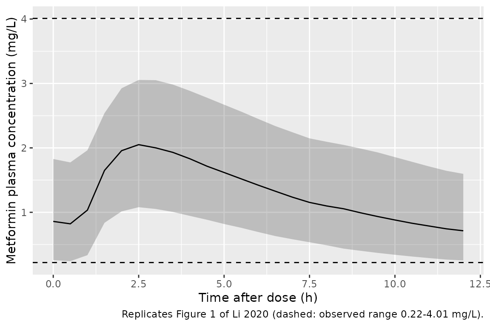
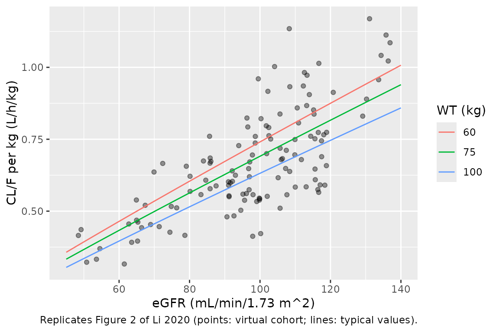

# Metformin (Li 2020)

## Model and source

- Citation: Li L, Guan Z, Li R, Zhao W, Hao G, Yan Y, Xu Y, Liao L, Wang
  H, Gao L, Wu K, Gao Y, Li Y. Population pharmacokinetics and dosing
  optimization of metformin in Chinese patients with type 2 diabetes
  mellitus. Medicine (Baltimore). 2020;99(46):e23212.
  <doi:10.1097/MD.0000000000023212>
- Description: One-compartment population pharmacokinetic model with
  first-order oral absorption and an absorption-lag time for
  immediate-release metformin hydrochloride at steady state in Chinese
  adults with type 2 diabetes mellitus (Li 2020). Apparent oral
  clearance scales as a power function of body weight (reference 75 kg)
  and of CKD-EPI estimated glomerular filtration rate (reference 102.5
  mL/min/1.73 m^2); between-subject variability is estimated on CL/F
  only. OCT1, OCT2 and MATE1 polymorphisms were screened and not
  retained.
- Article: <https://doi.org/10.1097/MD.0000000000023212> (open access,
  PMC7668473)

## Population

Li 2020 enrolled 130 hospitalized Chinese adults with type 2 diabetes
mellitus (1999 WHO criteria) at Shandong Provincial Qianfoshan Hospital,
Jinan, between February and September 2017 (ChiCTR1800014273). All had
taken immediate-release metformin hydrochloride (Glucophage film-coated
tablets) for at least 7 days, so sampling was at pharmacokinetic steady
state. Five patients were excluded for irregular regimens or
non-adherence, leaving 125 (85 male / 40 female) with 160 plasma samples
(1-2 per patient, aimed at the 2-4 h peak and the 10-12 h trough).
Median (range) age was 56 (27-83) years, body weight 75 (51-113) kg, BMI
26.4 (18.1-35.3) kg/m^2 and CKD-EPI eGFR 102.5 (46.9-137.7) mL/min/1.73
m^2 (Table 1). Regimens were 1000 mg b.i.d. (n = 55), 500 mg t.i.d. (n =
29), 500 mg b.i.d. (n = 28), 500 mg q.i.d. (n = 12) and 850 mg q.d. (n
= 1) (Results section 3.1). Table 2 splits the cohort into eGFR strata
of 45-59, 60-89, 90-120 and \>= 120 mL/min/1.73 m^2 (5, 26, 73 and 10
patients).

The same information is available programmatically via
`readModelDb("Li_2020_metformin")()$population`.

## Source trace

The per-parameter origin is recorded as an in-file comment next to each
`ini()` entry in `inst/modeldb/specificDrugs/Li_2020_metformin.R`. The
table below collects them in one place for review.

| Equation / parameter | Value | Source location |
|----|----|----|
| Structural model | 1-compartment, first-order absorption with lag time | Results section 3.3; Discussion paragraph 1 |
| `lka` = log(1.4) | 1.4 1/h | Table 4, ka (RSE 51.5%) |
| `lcl` = log(53.0) | 53.0 L/h | Table 4, theta1 (RSE 4.6%); final CL/F equation, Results section 3.4 |
| `lvc` = log(438) | 438 L | Table 4, V/F (RSE 15.0%); Results section 3.4 |
| `ltlag` = log(0.914) | 0.914 h | Table 4, tlag (RSE 30.3%) |
| `e_wt_cl` | 0.688 | Table 4, theta2 (RSE 24.6%) |
| `e_crcl_cl` | 0.914 | Table 4, theta3 (RSE 19.9%) |
| CL/F = theta1 (WT/75)^theta2 (eGFR/102.5)^theta3 exp(eta) | n/a | Table 4 row header; Results section 3.4; abstract |
| `etalcl` variance | 0.0323 | Table 4 IIV CL/F 18.0%; eta term printed as EXP(0.1797) in the CL/F equation (0.1797^2 = 0.0323) |
| `propSd` | 0.3507 | Table 4, residual variability 35.07% (exponential model, Results section 3.3) |
| Reference WT = 75 kg, eGFR = 102.5 | n/a | Table 1 cohort medians, used as the equation’s normalisers |

## Deterministic checks against reported values

The Results report a median (range) individual weight-normalised CL/F of
0.71 (0.31-0.99) L/h/kg (section 3.4). A typical 75 kg patient at the
reference eGFR has CL/F/WT = 53.0/75 = 0.707 L/h/kg, which reproduces
the median. The printed CL/F equation also carries a literal
`EXP(0.1797)` term; read as a fixed multiplier it would raise the
typical CL/F to 53.0 x 1.197 = 63.4 L/h and the median to 0.85 L/h/kg,
contradicting both this median and the abstract’s “apparent clearance
53.0 L/h”. The term is therefore the eta, written with its standard
deviation (see Assumptions).

``` r

mod <- readModelDb("Li_2020_metformin")
mod_typ <- mod |> rxode2::zeroRe()
th <- rxode2::rxode(mod)$theta

typ_cl <- function(wt, crcl) {
  exp(th[["lcl"]]) * (wt / 75)^th[["e_wt_cl"]] * (crcl / 102.5)^th[["e_crcl_cl"]]
}

cl_ref <- typ_cl(75, 102.5)
cl_per_kg_ref <- cl_ref / 75
cl_literal_multiplier <- cl_ref * exp(0.1797) / 75

knitr::kable(
  data.frame(
    Quantity = c(
      "Typical CL/F at WT 75 kg, eGFR 102.5 (L/h)",
      "Typical CL/F / WT (L/h/kg)",
      "Reported median individual CL/F / WT (L/h/kg)",
      "CL/F / WT if EXP(0.1797) were a fixed multiplier (L/h/kg)"
    ),
    Value = signif(c(cl_ref, cl_per_kg_ref, 0.71, cl_literal_multiplier), 3)
  ),
  caption = "Reference-point checks against Li 2020 Results section 3.4."
)
```

| Quantity                                                  |  Value |
|:----------------------------------------------------------|-------:|
| Typical CL/F at WT 75 kg, eGFR 102.5 (L/h)                | 53.000 |
| Typical CL/F / WT (L/h/kg)                                |  0.707 |
| Reported median individual CL/F / WT (L/h/kg)             |  0.710 |
| CL/F / WT if EXP(0.1797) were a fixed multiplier (L/h/kg) |  0.846 |

Reference-point checks against Li 2020 Results section 3.4. {.table}

``` r


stopifnot(
  abs(cl_ref - 53.0) < 1e-8,
  abs(cl_per_kg_ref / 0.71 - 1) < 0.01,
  abs(cl_literal_multiplier / 0.71 - 1) > 0.15
)
```

## Virtual cohort

Original observed data are not publicly available. The virtual cohort
keeps the paper’s regimen mix exactly (125 patients). Body weight is
drawn from a normal distribution centred on the median 75 kg (SD 12 kg,
an assumption) and redrawn until it falls in the observed 51-113 kg
range. eGFR is drawn by first picking a Table 2 stratum in proportion to
its size (5 / 26 / 73 / 10) and then drawing uniformly within that
stratum’s observed range. Weight and eGFR are drawn independently.

``` r

# set.seed() fixes R's draws (covariates); rxode2's eta draws are partitioned
# per solver thread, so every assertion below holds for any cohort.
set.seed(20200716)
rxode2::rxSetSeed(20200716)

regimens <- tibble::tribble(
  ~treatment,      ~dose, ~tau, ~n,
  "1000 mg b.i.d.", 1000,   12, 55L,
  "500 mg t.i.d.",   500,    8, 29L,
  "500 mg b.i.d.",   500,   12, 28L,
  "500 mg q.i.d.",   500,    6, 12L,
  "850 mg q.d.",     850,   24,  1L
)
stopifnot(sum(regimens$n) == 125L)

egfr_strata <- tibble::tribble(
  ~lo,   ~hi,   ~n,
  46.9,  55.4,  5,
  60.6,  89.0,  26,
  90.1,  119.0, 73,
  120.4, 137.7, 10
)

draw_truncnorm <- function(n, mean, sd, lo, hi) {
  x <- rnorm(n, mean, sd)
  bad <- x < lo | x > hi
  while (any(bad)) {
    x[bad] <- rnorm(sum(bad), mean, sd)
    bad <- x < lo | x > hi
  }
  x
}

draw_egfr <- function(n) {
  s <- sample(seq_len(nrow(egfr_strata)), n, replace = TRUE, prob = egfr_strata$n)
  runif(n, egfr_strata$lo[s], egfr_strata$hi[s])
}

subjects <- regimens |>
  tidyr::uncount(n) |>
  mutate(
    id = seq_len(dplyr::n()),
    WT = draw_truncnorm(dplyr::n(), 75, 12, 51, 113),
    CRCL = draw_egfr(dplyr::n())
  )

# Steady state: one ss = 1 dose at time 0, then the full dosing interval
# observed densely on the central compartment.
dose_rows <- subjects |>
  mutate(time = 0, amt = dose, ii = tau, ss = 1L, evid = 1L, cmt = "depot")
obs_rows <- subjects |>
  group_by(id) |>
  reframe(
    treatment = treatment, dose = dose, tau = tau, WT = WT, CRCL = CRCL,
    time = seq(0, tau, by = 0.05)
  ) |>
  mutate(amt = NA_real_, ii = 0, ss = 0L, evid = 0L, cmt = "central")

events <- bind_rows(dose_rows, obs_rows) |>
  arrange(id, time, desc(evid)) |>
  select(id, time, evid, amt, ii, ss, cmt, WT, CRCL, treatment, dose, tau)

stopifnot(!anyDuplicated(events[, c("id", "time", "evid")]))
```

## Simulation

``` r

sim <- rxode2::rxSolve(
  mod,
  events = events,
  keep = c("treatment", "dose", "tau", "WT", "CRCL"),
  rtol = 1e-10, atol = 1e-12, ssRtol = 1e-10, ssAtol = 1e-12,
  maxsteps = 1e6,
  returnType = "data.frame"
)
stopifnot(!anyNA(sim$Cc))
```

### Individual clearance

``` r

ind <- sim |>
  distinct(id, treatment, dose, tau, WT, CRCL, cl) |>
  mutate(cl_per_kg = cl / WT, auc24_expected = dose * 24 / tau / cl)

summary(ind$cl_per_kg)
#>    Min. 1st Qu.  Median    Mean 3rd Qu.    Max. 
#>  0.3162  0.5501  0.6463  0.6690  0.7737  1.1690

# Median individual CL/F/WT is reported as 0.71 L/h/kg. The cohort median is
# a covariate-distribution statistic, not an extreme, so a 10% band is robust
# to the draw yet breaks on a mis-scaled clearance or exponent.
stopifnot(abs(median(ind$cl_per_kg) / 0.71 - 1) < 0.10)
```

## Replicate published figures

Figure 1 of Li 2020 shows the 160 observed concentrations (0.22-4.01
mg/L) against time after dose, pooled across regimens. The ribbon below
is the simulated 5th-95th percentile band of the same pooled cohort at
steady state, with the observed range drawn as dashed lines.

``` r

sim |>
  mutate(tad_bin = round(time * 2) / 2) |>
  filter(tad_bin <= 12) |>
  group_by(tad_bin) |>
  summarise(
    Q05 = quantile(Cc, 0.05), Q50 = median(Cc), Q95 = quantile(Cc, 0.95),
    .groups = "drop"
  ) |>
  ggplot(aes(tad_bin, Q50)) +
  geom_ribbon(aes(ymin = Q05, ymax = Q95), alpha = 0.25) +
  geom_line() +
  geom_hline(yintercept = c(0.22, 4.01), linetype = "dashed") +
  labs(
    x = "Time after dose (h)", y = "Metformin plasma concentration (mg/L)",
    caption = "Replicates Figure 1 of Li 2020 (dashed: observed range 0.22-4.01 mg/L)."
  )
```



``` r

# Medians in the paper's two sampling windows sit inside the observed range.
win <- sim |>
  mutate(window = case_when(
    time >= 2 & time <= 4 ~ "peak (2-4 h)",
    time >= 10 & time <= 12 ~ "trough (10-12 h)"
  )) |>
  filter(!is.na(window)) |>
  group_by(window) |>
  summarise(median_Cc = median(Cc), .groups = "drop")
knitr::kable(win, digits = 2, caption = "Simulated median concentration in each sampling window.")
```

| window           | median_Cc |
|:-----------------|----------:|
| peak (2-4 h)     |      1.96 |
| trough (10-12 h) |      0.80 |

Simulated median concentration in each sampling window. {.table}

``` r

stopifnot(nrow(win) == 2L, all(win$median_Cc > 0.22 & win$median_Cc < 4.01))
```

Figure 2 of Li 2020 plots individual CL/F per kg against eGFR and shows
a roughly proportional rise. The typical-value curves below are drawn at
60, 75 and 100 kg over the observed eGFR range, with the virtual cohort
overlaid.

``` r

curves <- tidyr::crossing(WT = c(60, 75, 100), CRCL = seq(45, 140, by = 1)) |>
  mutate(cl_per_kg = typ_cl(WT, CRCL) / WT, WT = factor(WT))
ggplot() +
  geom_point(data = ind, aes(CRCL, cl_per_kg), alpha = 0.4) +
  geom_line(data = curves, aes(CRCL, cl_per_kg, colour = WT)) +
  labs(
    x = "eGFR (mL/min/1.73 m^2)", y = "CL/F per kg (L/h/kg)", colour = "WT (kg)",
    caption = "Replicates Figure 2 of Li 2020 (points: virtual cohort; lines: typical values)."
  )
```



## PKNCA validation

NCA is run on the steady-state dosing interval of each simulated
patient, grouped by regimen. AUC over one interval is scaled to 24 h to
compare with the paper’s reported AUC0-24 range.

``` r

sim_nca <- sim |>
  filter(!is.na(Cc)) |>
  select(id, time, Cc, treatment)

# Every subject already has its time-zero (pre-dose trough) observation; the
# bind_rows + distinct guard keeps that true if the grid is ever changed.
sim_nca <- bind_rows(
  sim_nca,
  sim |> filter(time == 0) |> distinct(id, treatment, .keep_all = TRUE) |>
    select(id, time, Cc, treatment)
) |>
  distinct(id, treatment, time, .keep_all = TRUE) |>
  arrange(id, treatment, time)

conc_obj <- PKNCA::PKNCAconc(sim_nca, Cc ~ time | treatment + id)
dose_obj <- PKNCA::PKNCAdose(
  events |> filter(evid == 1) |> select(id, time, amt, treatment),
  amt ~ time | treatment + id
)
intervals <- regimens |>
  transmute(treatment, start = 0, end = tau, cmax = TRUE, cmin = TRUE, tmax = TRUE, auclast = TRUE)

nca_res <- PKNCA::pk.nca(PKNCA::PKNCAdata(conc_obj, dose_obj, intervals = as.data.frame(intervals)))

nca_wide <- as.data.frame(nca_res) |>
  select(treatment, id, PPTESTCD, PPORRES) |>
  tidyr::pivot_wider(names_from = PPTESTCD, values_from = PPORRES) |>
  left_join(ind |> select(id, tau, auc24_expected), by = "id") |>
  mutate(auc24 = auclast * 24 / tau)

nca_wide |>
  group_by(treatment) |>
  summarise(
    n = dplyr::n(),
    cmax = median(cmax), cmin = median(cmin), tmax = median(tmax),
    auc24 = median(auc24), .groups = "drop"
  ) |>
  dplyr::rename(
    Regimen = treatment, N = n, "Median Cmax (mg/L)" = cmax,
    "Median Cmin (mg/L)" = cmin, "Median Tmax (h)" = tmax,
    "Median AUC0-24 (mg*h/L)" = auc24
  ) |>
  knitr::kable(digits = 2, caption = "Simulated steady-state NCA by regimen.")
```

| Regimen | N | Median Cmax (mg/L) | Median Cmin (mg/L) | Median Tmax (h) | Median AUC0-24 (mg\*h/L) |
|:---|---:|---:|---:|---:|---:|
| 1000 mg b.i.d. | 55 | 2.61 | 0.93 | 2.65 | 42.29 |
| 500 mg b.i.d. | 28 | 1.30 | 0.46 | 2.65 | 21.03 |
| 500 mg q.i.d. | 12 | 2.09 | 1.39 | 2.35 | 43.04 |
| 500 mg t.i.d. | 29 | 1.61 | 0.85 | 2.45 | 30.39 |
| 850 mg q.d. | 1 | 1.49 | 0.04 | 2.65 | 11.68 |

Simulated steady-state NCA by regimen. {.table style="width:100%;"}

``` r

# Same drawn parameters on both sides: the trapezoidal AUC over a 0.05 h grid
# must equal Dose * (24 / tau) / CL up to numerical error only.
auc_err <- nca_wide$auc24 / nca_wide$auc24_expected - 1
stopifnot(nrow(nca_wide) == 125L, max(abs(auc_err)) < 0.005)

auc_range <- range(nca_wide$auc24)
knitr::kable(
  data.frame(
    Source = c("Li 2020 Results section 3.4 (individual estimates)", "Virtual cohort"),
    "Min AUC0-24" = c(12.35, auc_range[1]),
    "Max AUC0-24" = c(71.23, auc_range[2]),
    check.names = FALSE
  ),
  digits = 2,
  caption = "Steady-state AUC0-24 (mg*h/L) range."
)
```

| Source                                             | Min AUC0-24 | Max AUC0-24 |
|:---------------------------------------------------|------------:|------------:|
| Li 2020 Results section 3.4 (individual estimates) |       12.35 |       71.23 |
| Virtual cohort                                     |       11.48 |       74.25 |

Steady-state AUC0-24 (mg\*h/L) range. {.table}

``` r

# The median sits inside the published range; the extremes are draw-dependent
# and are displayed, not asserted.
stopifnot(median(nca_wide$auc24) > 12.35, median(nca_wide$auc24) < 71.23)
```

### Comparison against published NCA

Li 2020 reports no central NCA values (no Cmax, Cmin or AUC by regimen),
only the AUC0-24 range of the individual estimates shown above, so no
[`ncaComparisonTable()`](https://nlmixr2.github.io/nlmixr2lib/reference/ncaComparisonTable.md)
is rendered.

## Dosing recommendations (Table 5)

Li 2020 chose, for each eGFR stratum, the smallest regimen at which the
simulated 95th percentile of steady-state Cmax stayed below 5 mg/L and
the 5th percentile of Cmin stayed above 0.4 mg/L (Methods section 2.6).
The Table 5 values are total daily doses: 2550 mg/day t.i.d. and 3000
mg/day b.i.d. for augmented renal clearance, as the abstract and
Discussion state.

The percentiles are reproduced deterministically here. Both Cmax and
Cmin fall monotonically with CL/F, and CL/F carries the model’s only
eta, so at fixed covariates the 5th percentile of Cmin is the solve at
eta = +1.645 omega and the 95th percentile of Cmax is the solve at eta =
-1.645 omega. Covariates are the Table 2 stratum medians. Residual error
is excluded, since the criterion concerns true concentrations.

``` r

omega_sd <- sqrt(rxode2::rxode(mod)$omega["etalcl", "etalcl"])

table5 <- tibble::tribble(
  ~stage,  ~egfr_label, ~WT,  ~CRCL,  ~daily8, ~daily12,
  "G3a",   "45-59",     71.5, 50.4,   750,     1000,
  "G2",    "60-89",     75,   79.7,   1275,    1700,
  "G1",    "90-119",    75,   105,    1500,    2000,
  "ARC",   ">=120",     87,   123.7,  2550,    3000
) |>
  tidyr::pivot_longer(c(daily8, daily12), names_to = "interval", values_to = "daily_dose") |>
  mutate(tau = ifelse(interval == "daily8", 8, 12), dose = daily_dose * tau / 24)

make_q_events <- function(tbl, eta) {
  subj <- tbl |> mutate(id = seq_len(dplyr::n()), etalcl = eta)
  ev <- bind_rows(
    subj |> mutate(time = 0, amt = dose, ii = tau, ss = 1L, evid = 1L, cmt = "depot"),
    subj |>
      group_by(id) |>
      reframe(WT = WT, CRCL = CRCL, tau = tau, time = seq(0, tau, by = 0.01)) |>
      mutate(amt = NA_real_, ii = 0, ss = 0L, evid = 0L, cmt = "central")
  ) |>
    arrange(id, time, desc(evid)) |>
    select(id, time, evid, amt, ii, ss, cmt, WT, CRCL)
  list(ev = ev, params = subj |> select(id, etalcl))
}

solve_q <- function(tbl, eta) {
  q <- make_q_events(tbl, eta)
  rxode2::rxSolve(
    mod_typ, events = q$ev, params = q$params,
    rtol = 1e-10, atol = 1e-12, ssRtol = 1e-10, ssAtol = 1e-12,
    maxsteps = 1e6, returnType = "data.frame"
  ) |>
    group_by(id) |>
    summarise(cmax = max(Cc), cmin = min(Cc), .groups = "drop")
}

hi <- solve_q(table5, -qnorm(0.95) * omega_sd) # low CL -> 95th pct Cmax
#> Warning: multi-subject simulation without without 'omega'
lo <- solve_q(table5, qnorm(0.95) * omega_sd)  # high CL -> 5th pct Cmin
#> Warning: multi-subject simulation without without 'omega'
t5 <- table5 |>
  mutate(id = seq_len(dplyr::n()), p95_cmax = hi$cmax, p5_cmin = lo$cmin)

# Alternative reading: Table 5 values as per-administration doses.
per_admin <- solve_q(table5 |> mutate(dose = daily_dose), -qnorm(0.95) * omega_sd)
#> Warning: multi-subject simulation without without 'omega'
t5$p95_cmax_per_admin <- per_admin$cmax

t5 |>
  transmute(
    stage, egfr_label, interval = paste0("q", tau, "h"), daily_dose, dose,
    p95_cmax, p5_cmin, p95_cmax_per_admin
  ) |>
  dplyr::rename(
    Stage = stage, "eGFR (mL/min/1.73 m^2)" = egfr_label, Interval = interval,
    "Daily dose (mg)" = daily_dose, "Dose per administration (mg)" = dose,
    "P95 Cmax (mg/L)" = p95_cmax, "P5 Cmin (mg/L)" = p5_cmin,
    "P95 Cmax if Table 5 were per administration (mg/L)" = p95_cmax_per_admin
  ) |>
  knitr::kable(digits = 2, caption = "Reproduction of Li 2020 Table 5 at stratum-median covariates.")
```

| Stage | eGFR (mL/min/1.73 m^2) | Interval | Daily dose (mg) | Dose per administration (mg) | P95 Cmax (mg/L) | P5 Cmin (mg/L) | P95 Cmax if Table 5 were per administration (mg/L) |
|:---|:---|:---|---:|---:|---:|---:|---:|
| G3a | 45-59 | q8h | 750 | 250 | 1.73 | 0.65 | 5.20 |
| G3a | 45-59 | q12h | 1000 | 500 | 2.49 | 0.72 | 4.98 |
| G2 | 60-89 | q8h | 1275 | 425 | 1.98 | 0.59 | 5.95 |
| G2 | 60-89 | q12h | 1700 | 850 | 2.96 | 0.58 | 5.91 |
| G1 | 90-119 | q8h | 1500 | 500 | 1.89 | 0.47 | 5.68 |
| G1 | 90-119 | q12h | 2000 | 1000 | 2.90 | 0.41 | 5.80 |
| ARC | \>=120 | q8h | 2550 | 850 | 2.64 | 0.51 | 7.92 |
| ARC | \>=120 | q12h | 3000 | 1500 | 3.69 | 0.34 | 7.37 |

Reproduction of Li 2020 Table 5 at stratum-median covariates. {.table}

``` r

stopifnot(nrow(t5) == 8L)
# Upper criterion: met in every cell under the daily-dose reading...
stopifnot(all(t5$p95_cmax < 5))
# ...and violated under the per-administration reading, which rules it out.
stopifnot(any(t5$p95_cmax_per_admin > 5))
# Lower criterion: met everywhere except ARC q12h (see Assumptions).
arc12 <- t5$stage == "ARC" & t5$tau == 12
# Deterministic (no draws): measured 0.41-0.72 for the seven cells and 0.34
# for ARC q12h.
stopifnot(all(t5$p5_cmin[!arc12] > 0.4), t5$p5_cmin[arc12] < 0.4)
stopifnot(sum(t5$p95_cmax_per_admin > 5) == 7L)
```

The daily-dose reading keeps the 95th percentile of Cmax below 5 mg/L in
every cell; read as per-administration doses, seven of the eight cells
exceed it. The 5th percentile of Cmin is above 0.4 mg/L in seven of the
eight cells, and the G1 cells sit close to the threshold (about 0.47 and
0.41 mg/L), as a minimum-dose search would produce. The exception is ARC
at 1500 mg q12h (about 0.34 mg/L at the stratum median), where the
recommendation is not reproduced; see Assumptions.

## Assumptions and deviations

- **The `EXP(0.1797)` term in the CL/F equation.** Table 4, the Results
  and the abstract all print CL/F = 53.0 (WT/75)^0.688
  (eGFR/102.5)^0.914 EXP(0.1797). Read literally, the constant would
  multiply the typical CL/F by 1.197. It is interpreted as the eta term
  written with its standard deviation: 0.1797 equals the Table 4 IIV of
  18.0% to rounding, the abstract gives the population CL/F as 53.0 L/h,
  and the reported median CL/F/WT of 0.71 L/h/kg matches 53.0/75 = 0.707
  but not 63.4/75 = 0.85 (checked above). The between-subject variance
  is therefore omega^2 = 0.1797^2 = 0.0323.
- **Residual error.** The paper describes an exponential residual model
  with 35.07% variability (Results section 3.3, Table 4). It is encoded
  as proportional error with `propSd = 0.3507`, the first-order
  equivalent of NONMEM `Y = F * EXP(EPS)`.
- **Dose units.** Doses are metformin hydrochloride as labelled
  (Glucophage tablets). The paper does not state whether concentrations
  are reported as the base or the salt; CL/F and V/F are apparent
  parameters for the labelled hydrochloride dose, so use hydrochloride
  doses with this model.
- **No IIV on V/F, ka or tlag.** Only CL/F carried IIV in the final
  model (Results section 3.3); with 1-2 samples per patient the
  absorption parameters were poorly determined (ka RSE 51.5%).
- **Virtual cohort.** The body-weight SD (12 kg) is assumed; the paper
  gives only the median and range. Weight and eGFR are drawn
  independently, whereas in the source cohort the ARC stratum was
  heavier and younger (Table 2). The Table 2 stratum counts sum to 114,
  not 125; they are used as relative weights.
- **Table 5 reproduction.** Li 2020 ran 1000 replicate simulations of
  the original dataset (5 to 73 patients per stratum), which is not
  available. The reproduction above uses deterministic percentiles at
  stratum-median covariates, excluding residual error. Seven of eight
  cells meet both criteria; ARC at 3000 mg/day b.i.d. gives a
  5th-percentile Cmin of about 0.34 mg/L rather than above 0.4 mg/L. The
  model parameters are not adjusted to close this gap. The likely cause
  is the paper’s simulation method (the specific ARC patients, and
  whether residual error or covariate spread entered the percentiles),
  which the paper does not describe in enough detail to replicate.
- **Genetic and demographic covariates not retained.** Age, BMI and the
  OCT1 rs622342, OCT2 rs316019 and MATE1 rs2289669 / rs2252281 variants
  were screened on CL/F and dropped (delta OFV \< 3.84). They are
  recorded in the model’s `covariatesDataExcluded` metadata.
- **Errata.** No erratum or correction for this article was found in the
  EuropePMC record (checked 2026-09-27).
