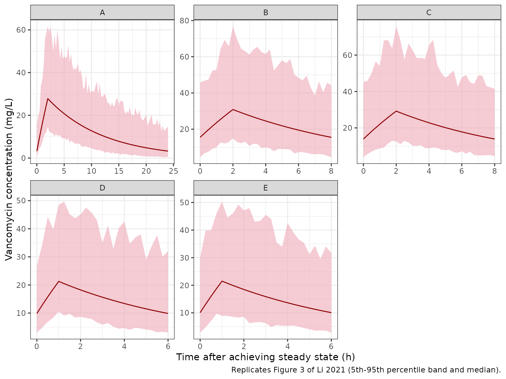

# Vancomycin (Li 2021)

## Model and source

- Citation: Li Z, Li H, Wang C, Jiao Z, Xu F, Sun H. Establishment of a
  population pharmacokinetics model of vancomycin in 94 infants with
  septicemia and its application in individualized therapy. BMC
  Pharmacol Toxicol. 2021;22(1):26. <doi:10.1186/s40360-021-00489-8>
- Description: One-compartment IV-infusion population PK model for
  vancomycin in Chinese infants younger than one year with septicemia
  (Li 2021). CL scales with body weight (reference 70 kg, estimated
  exponent 1.06), as a power of serum creatinine (reference 20 umol/L,
  exponent -0.315) and is multiplied by 1.46 with concomitant
  ceftriaxone. V scales linearly with body weight (reference 70 kg). IIV
  is on CL only; residual error is exponential (log-normal).
- Article: [BMC Pharmacol Toxicol
  2021;22:26](https://doi.org/10.1186/s40360-021-00489-8) (open access)

## Population

The model was developed from 205 routine therapeutic-drug-monitoring
trough and peak vancomycin concentrations in 94 Chinese infants younger
than one year (58 male, 36 female) treated for septicemia at Shanghai
Children’s Hospital between January 2009 and December 2015 (Li 2021
Methods and Table 1). Postnatal age ranged from 1 to 345 days (median
88.5), body weight from 1.4 to 18 kg (median 4 kg), gestational age at
birth from 25.7 to 41.4 weeks, and serum creatinine (SCR) from 5.5 to 50
umol/L (median 18.25). Daily vancomycin doses were 20-200 mg/day (median
60 mg/day). Serum vancomycin was measured by fluorescence polarization
immunoassay (AxSYM, lower limit 2 mg/L). The same information is
available programmatically via
`readModelDb("Li_2021_vancomycin")$population`.

## Source trace

Every numeric value in `ini()` carries an in-file comment pointing to
its source location. The table below collects them in one place.

| Equation / parameter | Value | Source location |
|----|----|----|
| `lcl` | log(10.3) L/h | Table 2, row ‘CL’ |
| `lvc` | log(50.6) L | Table 2, row ‘V’ |
| `e_wt_cl` | 1.06 | Table 2, row ‘Theta 1’ (weight coefficient on CL) |
| `e_creat_cl` | -0.315 | Table 2, row ‘Theta 2’ (serum creatinine coefficient) |
| `e_conmed_ceftriaxone_cl` | 1.46 | Table 2, row ‘Theta 3’ (ceftriaxone co-therapy on CL) |
| `etalcl` | 0.145 (variance) | Table 2, row ‘eta 1’ |
| `expSd` | sqrt(0.194) | Table 2, row ‘epsilon 1’ |
| CL equation | n/a | Results ‘Final model’: CL = 10.3 (WT/70)^1.06 (SCR/20)^-0.315 1.46^DC |
| V equation | n/a | Results ‘Final model’: V = 50.6 (WT/70) |
| DC coding | n/a | Results ‘Final model’: DC = 1 with ceftriaxone, else 0 |
| One-compartment, first-order elimination | n/a | Methods ‘PopPK modeling’; Table 3 footnote (ADVAN1 TRANS2) |
| No IIV on V | n/a | Table 3 model 2; Results ‘Basic model’ |
| Exponential residual error | n/a | Methods ‘PopPK modeling’; Results ‘Basic model’ |

## Virtual cohort and simulation

Individual data are not available. The simulations below reproduce the
five typical-patient Monte Carlo scenarios of Li 2021 Figure 3, each at
steady state and without ceftriaxone:

``` r

scenarios <- tibble::tribble(
  ~panel, ~label,                                    ~WT,  ~CREAT, ~amt, ~ii, ~dur,
  "A",    "0.95 kg, GA 29 wk, SCR 100, 19 mg q24h",  0.95, 100,    19,   24,  2,
  "B",    "2.4 kg, GA 39 wk, SCR 70, 36 mg q8h",     2.4,  70,     36,   8,   2,
  "C",    "4 kg, 28 days, SCR 60, 60 mg q8h",        4,    60,     60,   8,   2,
  "D",    "5 kg, 3 months, SCR 32, 50 mg q6h",       5,    32,     50,   6,   1,
  "E",    "8 kg, 9 months, SCR 28, 80 mg q6h",       8,    28,     80,   6,   1
)
knitr::kable(scenarios)
```

| panel | label                                  |   WT | CREAT | amt |  ii | dur |
|:------|:---------------------------------------|-----:|------:|----:|----:|----:|
| A     | 0.95 kg, GA 29 wk, SCR 100, 19 mg q24h | 0.95 |   100 |  19 |  24 |   2 |
| B     | 2.4 kg, GA 39 wk, SCR 70, 36 mg q8h    | 2.40 |    70 |  36 |   8 |   2 |
| C     | 4 kg, 28 days, SCR 60, 60 mg q8h       | 4.00 |    60 |  60 |   8 |   2 |
| D     | 5 kg, 3 months, SCR 32, 50 mg q6h      | 5.00 |    32 |  50 |   6 |   1 |
| E     | 8 kg, 9 months, SCR 28, 80 mg q6h      | 8.00 |    28 |  80 |   6 |   1 |

The infusion duration is not stated in the paper. The median curves in
Figure 3 peak at 2 h in panels A-C and at 1 h in panels D-E, which is
where a one-compartment model peaks when the infusion ends, so those
durations are used.

Each scenario is a cohort of 200 virtual infants. Every subject receives
a steady-state (`ss = 1`) infusion at time 0 and is observed over one
dosing interval.

``` r

n_sub <- 200L

build_arm <- function(s, id_offset) {
  ids <- id_offset + seq_len(n_sub)
  obs_times <- sort(unique(c(seq(0, s$ii, by = 0.25), s$dur)))
  dose <- tibble(
    id = ids, time = 0, evid = 1L, amt = s$amt, rate = s$amt / s$dur,
    ii = s$ii, ss = 1L, cmt = "central"
  )
  obs <- tidyr::expand_grid(id = ids, time = obs_times) |>
    mutate(evid = 0L, amt = 0, rate = 0, ii = 0, ss = 0L, cmt = "central")
  bind_rows(dose, obs) |>
    mutate(
      panel = s$panel, WT = s$WT, CREAT = s$CREAT,
      CONMED_CEFTRIAXONE = 0L
    ) |>
    arrange(id, time, desc(evid))
}

events <- bind_rows(lapply(seq_len(nrow(scenarios)), function(i) {
  build_arm(scenarios[i, ], id_offset = (i - 1L) * n_sub)
}))

mod <- rxode2::rxode(readModelDb("Li_2021_vancomycin"))

rxode2::rxSetSeed(20210426)
sim <- rxode2::rxSolve(
  mod, events = events, keep = "panel", maxsteps = 1e6,
  returnType = "data.frame"
)
stopifnot(!anyNA(sim$Cc))

# Observation-level concentrations: the individual prediction times the
# model's own log-normal residual, generated explicitly so the convention is
# visible.
expSd <- mod$theta[["expSd"]]
set.seed(20210426)
sim$obs <- sim$Cc * exp(expSd * rnorm(nrow(sim)))
```

## Typical-value check

With the random effects removed, a one-compartment steady-state infusion
has a closed form. The solved typical profile should reproduce it to
numerical precision, and the resulting peak and trough are the median
curves of Figure 3.

``` r

typ_events <- events |> filter(id %in% ((0:4) * n_sub + 1L))
sim_typ <- rxode2::rxSolve(
  rxode2::zeroRe(mod), events = typ_events, keep = "panel",
  maxsteps = 1e6, rtol = 1e-10, atol = 1e-12, ssRtol = 1e-10, ssAtol = 1e-12,
  returnType = "data.frame"
)
#> ℹ omega/sigma items treated as zero: 'etalcl'
#> Warning: multi-subject simulation without without 'omega'

closed_form <- function(time, amt, dur, ii, cl, vc) {
  k <- cl / vc
  r <- amt / dur
  c_end <- r / cl * (1 - exp(-k * dur)) / (1 - exp(-k * ii))
  c_trough <- c_end * exp(-k * (ii - dur))
  ifelse(
    time <= dur,
    r / cl * (1 - exp(-k * time)) + c_trough * exp(-k * time),
    c_end * exp(-k * (time - dur))
  )
}

typ_chk <- sim_typ |>
  left_join(scenarios, by = "panel") |>
  mutate(cf = closed_form(time, amt, dur, ii, cl, vc))
# Measured about 1e-9 with these solver tolerances.
stopifnot(max(abs(typ_chk$Cc / typ_chk$cf - 1)) < 1e-6)

typ_tab <- typ_chk |>
  group_by(panel) |>
  summarise(
    `CL (L/h)` = signif(first(cl), 3),
    `V (L)` = signif(first(vc), 3),
    `t1/2 (h)` = signif(log(2) * first(vc) / first(cl), 3),
    `Median peak (mg/L)` = signif(max(Cc), 3),
    `Median trough (mg/L)` = signif(Cc[time == 0], 3)
  )
knitr::kable(typ_tab)
```

| panel | CL (L/h) | V (L) | t1/2 (h) | Median peak (mg/L) | Median trough (mg/L) |
|:------|---------:|------:|---------:|-------------------:|---------------------:|
| A     |    0.065 | 0.687 |     7.32 |               28.1 |                 3.50 |
| B     |    0.194 | 1.730 |     6.19 |               31.4 |                16.00 |
| C     |    0.351 | 2.890 |     5.71 |               29.7 |                14.30 |
| D     |    0.542 | 3.610 |     4.63 |               21.7 |                10.20 |
| E     |    0.930 | 5.780 |     4.31 |               20.7 |                 9.24 |

The paper states that the median trough concentration for the 29-week
preterm neonate of panel A was 3.66 mg/L (Conclusions). The model gives:

``` r

trough_a <- typ_tab$`Median trough (mg/L)`[typ_tab$panel == "A"]
trough_a
#> [1] 3.5
# Structural check: a mis-transcribed CL, V or covariate exponent moves this
# trough by far more than 10%.
stopifnot(abs(trough_a / 3.66 - 1) < 0.10)
```

The remaining median peaks and troughs (read from the Figure 3 median
curves: about 31/17, 30/14, 22/10 and 21/10 mg/L for panels B-E) are
also reproduced.

## Replicate Figure 3

``` r

bands <- sim |>
  group_by(panel, time) |>
  summarise(
    p05 = quantile(obs, 0.05), p95 = quantile(obs, 0.95),
    median = median(Cc), .groups = "drop"
  )

ggplot(bands, aes(time)) +
  geom_ribbon(aes(ymin = p05, ymax = p95), fill = "pink2", alpha = 0.6) +
  geom_line(aes(y = median), colour = "darkred") +
  facet_wrap(~panel, scales = "free") +
  labs(
    x = "Time after achieving steady state (h)",
    y = "Vancomycin concentration (mg/L)",
    caption = "Replicates Figure 3 of Li 2021 (5th-95th percentile band and median)."
  ) +
  theme_bw()
```



### Figure 3 percentile annotations

Figure 3 marks the 95th-percentile peak and the 5th-percentile trough of
each scenario with dotted lines, and the Results quote the panel C pair
(“trough concentrations in 28-day-old neonates were only 4.3 mg/L, the
peak concentrations were up to 72 mg/L”). Panel A’s lower line sits at 0
and is not compared.

``` r

published <- tibble::tribble(
  ~panel, ~metric,         ~published,
  "A",    "95th pct peak",  58,
  "B",    "95th pct peak",  72,
  "B",    "5th pct trough", 5,
  "C",    "95th pct peak",  72,
  "C",    "5th pct trough", 4.3,
  "D",    "95th pct peak",  50,
  "D",    "5th pct trough", 3.2,
  "E",    "95th pct peak",  50,
  "E",    "5th pct trough", 3
)

simulated <- bands |>
  left_join(scenarios, by = "panel") |>
  group_by(panel) |>
  summarise(
    `95th pct peak` = p95[time == first(dur)],
    `5th pct trough` = p05[time == 0]
  ) |>
  pivot_longer(-panel, names_to = "metric", values_to = "simulated")

pct_chk <- published |>
  left_join(simulated, by = c("panel", "metric")) |>
  mutate(pct_diff = 100 * (simulated / published - 1))

pct_chk |>
  mutate(simulated = signif(simulated, 3), pct_diff = round(pct_diff, 1)) |>
  rename(
    Panel = panel, Metric = metric, `Published (mg/L)` = published,
    `Simulated (mg/L)` = simulated, `Difference (%)` = pct_diff
  ) |>
  knitr::kable()
```

| Panel | Metric         | Published (mg/L) | Simulated (mg/L) | Difference (%) |
|:------|:---------------|-----------------:|-----------------:|---------------:|
| A     | 95th pct peak  |             58.0 |            61.70 |            6.4 |
| B     | 95th pct peak  |             72.0 |            76.80 |            6.7 |
| B     | 5th pct trough |              5.0 |             4.47 |          -10.7 |
| C     | 95th pct peak  |             72.0 |            75.80 |            5.3 |
| C     | 5th pct trough |              4.3 |             3.84 |          -10.7 |
| D     | 95th pct peak  |             50.0 |            48.60 |           -2.9 |
| D     | 5th pct trough |              3.2 |             2.99 |           -6.5 |
| E     | 95th pct peak  |             50.0 |            50.30 |            0.5 |
| E     | 5th pct trough |              3.0 |             2.79 |           -7.0 |

``` r


# With 2000 subjects per panel the model-true differences are about -12% to
# +7%. At 200 subjects per panel the Monte Carlo SE of a 5th/95th percentile
# is about 8-11%; this cohort gave a median of -2.9% and a 90th-percentile
# absolute difference of 10.7% at 1, 2 and 4 threads. Reading omega and sigma
# as SDs instead of variances moves the median to about -35% (troughs about
# +90%); a normal proportional residual of the same size moves the trough
# rows to about -40%, which the trough-only bound catches.
trough_rows <- pct_chk$metric == "5th pct trough"
stopifnot(
  abs(median(pct_chk$pct_diff)) < 15,
  quantile(abs(pct_chk$pct_diff), 0.9) < 45,
  abs(median(pct_chk$pct_diff[trough_rows])) < 25
)
```

These annotations are what settles the scale of the Table 2
random-effect estimates (see Assumptions and deviations).

## PKNCA validation

PKNCA is run over the steady-state dosing interval on the individual
predictions (`Cc`, no residual error), grouped by scenario.

``` r

conc <- sim |>
  filter(!is.na(Cc)) |>
  select(id, time, Cc, panel)

dose_df <- events |>
  filter(evid == 1) |>
  select(id, time, amt, panel)

tau_by_panel <- scenarios |> select(panel, ii)

conc_obj <- PKNCA::PKNCAconc(conc, Cc ~ time | panel + id)
dose_obj <- PKNCA::PKNCAdose(dose_df, amt ~ time | panel + id)

intervals <- tau_by_panel |>
  transmute(
    panel, start = 0, end = ii,
    cmax = TRUE, tmax = TRUE, cmin = TRUE, auclast = TRUE
  )

nca <- PKNCA::pk.nca(PKNCA::PKNCAdata(conc_obj, dose_obj, intervals = intervals))
nca_res <- as.data.frame(nca$result)

nca_res |>
  filter(PPTESTCD %in% c("cmax", "tmax", "cmin", "auclast")) |>
  group_by(panel, PPTESTCD) |>
  summarise(median = signif(median(PPORRES), 3), .groups = "drop") |>
  pivot_wider(names_from = PPTESTCD, values_from = median) |>
  rename(
    Panel = panel, `Cmax (mg/L)` = cmax, `Tmax (h)` = tmax,
    `Cmin (mg/L)` = cmin, `AUCtau (mg*h/L)` = auclast
  ) |>
  knitr::kable()
```

| Panel | AUCtau (mg\*h/L) | Cmax (mg/L) | Cmin (mg/L) | Tmax (h) |
|:------|-----------------:|------------:|------------:|---------:|
| A     |            284.0 |        27.8 |        3.27 |        2 |
| B     |            181.0 |        30.9 |       15.50 |        2 |
| C     |            167.0 |        29.2 |       13.90 |        2 |
| D     |             89.9 |        21.3 |        9.85 |        1 |
| E     |             91.3 |        21.5 |       10.10 |        1 |

At steady state the AUC over one dosing interval equals dose / CL for
each subject. The two sides use the same drawn parameters, so the only
difference is the trapezoidal error of PKNCA on a 15-minute grid.

``` r

cl_ind <- sim |> group_by(id) |> summarise(cl = first(cl))
auc_chk <- nca_res |>
  filter(PPTESTCD == "auclast") |>
  left_join(cl_ind, by = "id") |>
  left_join(dose_df |> select(id, amt), by = "id") |>
  mutate(ratio = PPORRES / (amt / cl))
summary(auc_chk$ratio)
#>    Min. 1st Qu.  Median    Mean 3rd Qu.    Max. 
#>  0.9987  0.9999  0.9999  0.9999  1.0000  1.0000
stopifnot(all(abs(auc_chk$ratio - 1) < 0.02))
```

The paper reports no NCA parameters, so there is no published NCA table
to compare against.

## Ceftriaxone effect

Concomitant ceftriaxone multiplies CL by 1.46 (Table 2). For a typical
4-kg infant with SCR 18.25 umol/L (the Table 1 medians):

``` r

cl_typ <- function(WT, CREAT, cef) 10.3 * (WT / 70)^1.06 * (CREAT / 20)^-0.315 * 1.46^cef
c(without = cl_typ(4, 18.25, 0), with = cl_typ(4, 18.25, 1))
#>   without      with 
#> 0.5102036 0.7448973
```

## Assumptions and deviations

- **Omega and sigma are variances.** Table 2 prints eta 1 = 0.145 and
  epsilon 1 = 0.194 without saying whether they are variances or
  standard deviations. They are taken as NONMEM variances (CV about 39%
  on CL, residual log-SD 0.44). The Figure 3 percentile annotations
  decide it: on the variance reading the simulated 95th-percentile peaks
  and 5th-percentile troughs match the published ones to within about
  12%; reading both as SDs gives 5th-percentile troughs about twice the
  published values and peaks about 40% too low.
- **Exponential residual error.** Table 2 labels epsilon 1
  “proportional”, the Results say the proportional residual model was
  adopted, and the Methods say the residual “was better described by the
  exponential model”. In NONMEM, `Y = F*EXP(EPS(1))` on untransformed
  data is estimated as a proportional error under FOCE-I, which
  reconciles the wording, but a simulation from it is log-normal. The
  model uses `lnorm(expSd)` because only the log-normal form reproduces
  the Figure 3 troughs; a normal proportional error of the same size
  puts the 5th-percentile troughs about 40% low.
- **Infusion duration.** Not reported. 2 h for panels A-C and 1 h for
  panels D-E is inferred from where the Figure 3 median curves peak. It
  affects only the simulations, not the model.
- **Linear V scaling.** The final-model equation prints V = 50.6 (WT/70)
  with no exponent; V is scaled linearly with weight, with no estimated
  exponent.
- **No ceftriaxone in Figure 3.** The Figure 3 caption does not give
  ceftriaxone status; the scenarios use CONMED_CEFTRIAXONE = 0, and the
  median troughs match the figure on that assumption. The number of
  infants who received ceftriaxone is not reported.
- **Figure 3 values.** The percentile annotations and median peaks and
  troughs were read from Figure 3 by the maintainers; panel A’s upper
  line (58 mg/L) is read from the axis, the other upper and lower lines
  carry printed axis labels.
