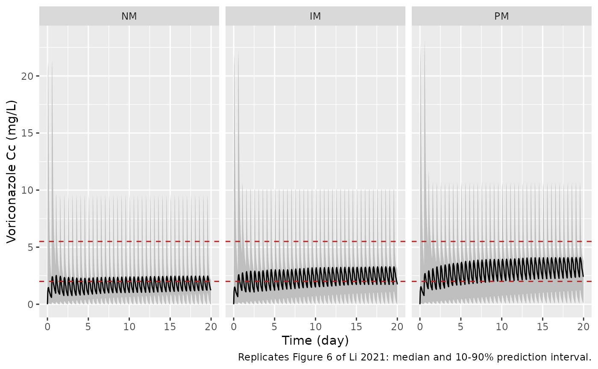

# Voriconazole and voriconazole N-oxide (Li 2021)

## Model and source

- Citation: Li S, Wu S, Gong W, Cao P, Chen X, Liu W, Xiang L, Wang Y,
  Huang J. Application of Population Pharmacokinetic Analysis to
  Characterize CYP2C19 Mediated Metabolic Mechanism of Voriconazole and
  Support Dose Optimization. Front Pharmacol. 2021;12:730826 (published
  3 January 2022). <doi:10.3389/fphar.2021.730826>. PMCID PMC8762230.
- Description: Joint parent-metabolite population pharmacokinetic model
  for oral voriconazole and voriconazole N-oxide in Chinese
  immunocompromised patients with invasive fungal infection (Li 2021).
  Voriconazole: one compartment with first-order absorption (ka and F
  fixed) and parallel linear plus Michaelis-Menten elimination, where
  the Michaelis-Menten pathway forms the N-oxide and is inhibited by the
  N-oxide concentration through a fixed Imax/IC50 term. Voriconazole
  N-oxide: one compartment with first-order elimination. CYP2C19
  metabolizer phenotype (IM, PM vs NM) acts exponentially on Vmax.
- Article: <https://doi.org/10.3389/fphar.2021.730826> (open access)
- Supplement (Table S1, post-hoc exposures by CYP2C19 phenotype):
  <https://www.frontiersin.org/articles/10.3389/fphar.2021.730826/full#supplementary-material>

The article is volume 12 (2021) of *Frontiers in Pharmacology*; it was
published online on 3 January 2022, which is why the journal’s own
citation line reads “(2022)”. The model is named for the volume year,
which is also the year in the DOI.

## Population

Li 2021 analysed 427 plasma concentrations (214 voriconazole, 213
voriconazole N-oxide) from 78 immunocompromised patients treated with
oral voriconazole 200 mg twice daily (no loading dose) for possible,
probable or proven invasive fungal infection at Union Hospital, Wuhan,
China, between February 2017 and July 2018 (Methods; Table 1). Patients
were 14-70 years old (median 36.5; four adolescents aged 14-17) and
weighed 44-111 kg (median 64); 57 were male and 21 female. Almost all
samples were pre-dose troughs, taken 23-4,223 h after the first dose. Of
the 75 genotyped patients, 27 were CYP2C19 normal metabolizers (NM,
*1/*1), 32 intermediate metabolizers (IM) and 16 poor metabolizers (PM);
no \*17 allele was found. Proton-pump inhibitors and glucocorticoids
were recorded as co-medications but were not retained.

The same information is available programmatically via
`readModelDb("Li_2021_voriconazole")()$population`.

## Source trace

Every `ini()` value carries an in-file comment pointing at its source.
The table below collects them. The equations come from Li 2021 Equations
8-13, which the maintainers read from the typeset article (they did not
survive text extraction of the PDF).

| Equation / parameter | Value | Source location |
|----|----|----|
| `lka` (ka) | `fixed(log(1.1))` 1/h | Table 2 ‘Ka 1.1 Fix’; Methods ‘Base Model’ (from Pascual 2012 / Wang 2014) |
| `lfdepot` (F) | `fixed(log(0.895))` | Table 2 ‘F 0.895 Fix’ |
| `lvc` (V1) | `log(207.29)` L | Table 2 |
| `lcl` (CL1) | `log(1.91)` L/h | Table 2 |
| `lvmax` (Vmax, NM) | `log(18.80)` mg/h | Table 2 and footnote a |
| `lkm` (km) | `fixed(log(1.15))` mg/L | Table 2 ‘Km 1.15 Fix’; units from Results text below Table 2 |
| `imax` (Imax) | `fixed(0.75)` | Table 2 ‘Imax 0.75 Fix’ |
| `lic50` (IC50) | `fixed(log(14.6))` mg/L | Table 2 ‘IC50 14.6 Fix’ |
| `lvc_noxvori` (V2) | `log(10.01)` L | Table 2 |
| `lcl_noxvori` (CL2) | `log(4.65)` L/h | Table 2 |
| `e_cyp2c19_im_vmax` | `-0.31` | Table 2 ‘theta IM’; footnote a `Vmax = 18.80 * exp(theta_CYP2C19)`, theta_NM = 0 FIX |
| `e_cyp2c19_pm_vmax` | `-0.61` | Table 2 ‘theta PM’ |
| `etalvc` | `2.4077^2 = 5.797` | Table 2 ‘omega V1 (%) 240.77’ (omega = SD of eta; see below) |
| `etalcl` | `0.0602^2` | Table 2 ‘omega CL1 (%) 6.02’ |
| `etalcl_noxvori` | `0.2557^2` | Table 2 ‘omega CL2 (%) 25.57’ |
| `etalvmax` | `0.2113^2` | Table 2 ‘omega Vmax (%) 21.13’ |
| `propSd` | `0.4697` | Table 2 ‘VCZ-sigma (%) 46.97’ |
| `propSd_noxvori` | `0.2793` | Table 2 ‘VNO-sigma (%) 27.93’ |
| `d/dt(depot)` | `-ka * depot` | Equation 8 |
| `d/dt(central)` | `ka*depot - CL1/V1*A1 - CLnonlin/V1*A1` (F via `f(depot)`) | Equation 9 |
| `d/dt(central_noxvori)` | `k_n*CLnonlin/V1*A1 - CL2/V2*A2` | Equation 10 |
| `cl_nonlin` | `Vmax/(C1 + km) * (1 - Imax*C2/(IC50 + C2))` | Equation 11 |
| `Cc`, `Cc_noxvori` | `A1/V1`, `A2/V2` | Equations 12-13 |
| `mw_ratio` (k_n) | `365.31/349.31 = 1.0458` | not printed; see Assumptions |

``` r

mod <- readModelDb("Li_2021_voriconazole")
ui <- rxode2::rxode(mod)
#> ℹ parameter labels from comments will be replaced by 'label()'
# The explicit ODEs must be integrated as written, not replaced by an
# automatic linear-compartment solution.
stopifnot(is.null(ui$linCmt))
om <- ui$omega
```

### Structural self-checks

The Discussion states that Vmax “decreased by 26.7 and 45.7% in patients
with CYP2C19 IM and PM genotypes”. Those are exactly `1 - exp(theta)` of
the two Table 2 coefficients:

``` r

th <- ui$theta
red <- 100 * (1 - exp(th[c("e_cyp2c19_im_vmax", "e_cyp2c19_pm_vmax")]))
red
#> e_cyp2c19_im_vmax e_cyp2c19_pm_vmax 
#>          26.65530          45.66491
stopifnot(abs(red - c(26.7, 45.7)) < 0.05)
```

Mass balance of Equation 10 at steady state: over one dosing interval,
the N-oxide eliminated (`CL2 * AUC_VNO`) must equal `k_n` times the
voriconazole that was not cleared by the linear route
(`F * Dose - CL1 * AUC_VCZ`). The check is on a typical NM patient given
200 mg every 12 h for 60 days, so it exercises the N-oxide feedback term
at steady state.

``` r

ev_mb <- rbind(
  data.frame(time = seq(0, 1428, by = 12), evid = 1L, amt = 200, cmt = "depot", dvid = NA_integer_),
  data.frame(time = seq(1428, 1440, by = 0.05), evid = 0L, amt = NA, cmt = NA, dvid = 1L)
)
ev_mb <- ev_mb[order(ev_mb$time, -ev_mb$evid), ]
ev_mb$CYP2C19_IM <- 0L
ev_mb$CYP2C19_PM <- 0L
mb <- rxode2::rxSolve(
  rxode2::zeroRe(mod), ev_mb,
  returnType = "data.frame", rtol = 1e-10, atol = 1e-12, maxsteps = 1e6
)
#> ℹ parameter labels from comments will be replaced by 'label()'
#> ℹ omega/sigma items treated as zero: 'etalvc', 'etalcl', 'etalcl_noxvori', 'etalvmax'
trap <- function(t, y) sum(diff(t) * (head(y, -1) + tail(y, -1)) / 2)
auc_vcz <- trap(mb$time, mb$Cc)
auc_vno <- trap(mb$time, mb$Cc_noxvori)
lhs <- exp(th[["lcl_noxvori"]]) * auc_vno
rhs <- (365.31 / 349.31) * (0.895 * 200 - exp(th[["lcl"]]) * auc_vcz)
c(auc_vcz = auc_vcz, auc_vno = auc_vno, rel_diff = lhs / rhs - 1)
#>       auc_vcz       auc_vno      rel_diff 
#>  2.547577e+01  2.931422e+01 -2.899868e-06
# Trapezoid on a 0.05 h grid over a slowly varying profile; measured ~1e-6.
stopifnot(abs(lhs / rhs - 1) < 1e-3)
```

## Virtual cohort

The published Monte Carlo simulations (Table 3, Figure 6) drew 1,000
virtual patients per scenario. Here each phenotype arm has 196 virtual
patients whose random effects are a Latin-hypercube design: every eta
takes the 196 mid-point quantiles of its normal distribution exactly
once (rescaled so the design reproduces the published variance), and the
pairing across etas is a fixed permutation from R’s own generator. No
random numbers are drawn by the simulation engine, so every number below
is identical on any machine and any thread count, and the assertions can
be tight. The same virtual patients are reused in every scenario, as in
a common-random-numbers design.

``` r

n_sub <- 196L
q <- qnorm((seq_len(n_sub) - 0.5) / n_sub)
q <- q / sqrt(mean(q^2))
set.seed(20210730)
etas <- data.frame(
  etalvc = q * sqrt(om["etalvc", "etalvc"]),
  etalvmax = sample(q) * sqrt(om["etalvmax", "etalvmax"]),
  etalcl = sample(q) * sqrt(om["etalcl", "etalcl"]),
  etalcl_noxvori = sample(q) * sqrt(om["etalcl_noxvori", "etalcl_noxvori"])
)
# The design reproduces each published variance exactly.
design_var <- vapply(etas, function(x) mean(x^2), numeric(1))
stopifnot(max(abs(design_var / diag(om)[names(etas)] - 1)) < 1e-12)

pheno_levels <- c("NM", "IM", "PM")

# One arm: `ev` is a single-subject event table (doses and observations); it is
# replicated for every virtual patient, the patient's etas are attached as data
# columns, and the phenotype indicators are set.
make_arm <- function(ev, pheno, id_offset = 0L) {
  d <- ev[rep(seq_len(nrow(ev)), times = n_sub), ]
  d$id <- id_offset + rep(seq_len(n_sub), each = nrow(ev))
  d <- cbind(d, etas[rep(seq_len(n_sub), each = nrow(ev)), ])
  d$CYP2C19_IM <- as.integer(pheno == "IM")
  d$CYP2C19_PM <- as.integer(pheno == "PM")
  d$pheno <- pheno
  d
}

# Doses on `depot`; observations nominate the voriconazole endpoint through
# `dvid` (the model has two error endpoints, and both `Cc` and `Cc_noxvori`
# are returned as columns on every observation row).
dose_obs <- function(dose_times, amt, obs_times) {
  ev <- rbind(
    data.frame(time = dose_times, evid = 1L, amt = amt, cmt = "depot", dvid = NA_integer_),
    data.frame(time = obs_times, evid = 0L, amt = NA_real_, cmt = NA_character_, dvid = 1L)
  )
  ev[order(ev$time, -ev$evid), ]
}

solve_lhs <- function(events) {
  rxode2::rxSolve(
    mod, events,
    omega = NA, sigma = NA, keep = c("pheno", "regimen"),
    returnType = "data.frame", maxsteps = 1e6
  )
}
```

## Replicate Table 3: trough attainment by regimen and phenotype

Table 3 lists, for 21 maintenance regimens, the median simulated
voriconazole steady-state trough and the percentage of patients at or
above 1, 2 and 5.5 mg/L. The paper does not say at which day the trough
was read. Its Figure 6 simulations run for 20 days, and the published
medians are reproduced by the trough at 480 h (day 20): reading the
trough at 960 h raises every median by 10-16%, because patients with a
large V1 are still accumulating at day 20. The comparison below uses the
day-20 trough and, like the published medians, no residual error.

``` r

table3 <- tibble::tribble(
  ~pheno, ~dose, ~tau, ~pub_median, ~pub_ge1, ~pub_ge2, ~pub_ge5.5,
  "NM", 200, 12, 1.20, 56.09, 29.69, 2.48,
  "NM", 300, 12, 2.73, 78.36, 61.06, 19.78,
  "NM", 325, 12, 3.20, 81.05, 66.11, 25.76,
  "NM", 350, 12, 3.70, 83.59, 70.76, 32.00,
  "NM", 400, 12, 4.79, 86.91, 77.73, 43.66,
  "NM", 200, 8, 3.01, 82.27, 65.52, 22.59,
  "NM", 250, 8, 4.62, 88.69, 78.50, 41.84,
  "IM", 200, 12, 1.79, 69.08, 45.52, 6.12,
  "IM", 250, 12, 2.70, 79.58, 61.36, 17.50,
  "IM", 275, 12, 3.21, 82.74, 67.43, 23.95,
  "IM", 300, 12, 3.74, 85.21, 72.47, 30.81,
  "IM", 400, 12, 6.07, 90.36, 83.82, 54.67,
  "IM", 175, 8, 3.21, 84.95, 68.83, 23.32,
  "IM", 200, 8, 4.06, 88.35, 76.32, 34.34,
  "PM", 200, 12, 2.44, 78.83, 58.29, 11.99,
  "PM", 225, 12, 2.97, 82.81, 65.94, 19.30,
  "PM", 250, 12, 3.53, 85.56, 71.70, 26.56,
  "PM", 300, 12, 4.68, 89.14, 79.42, 41.36,
  "PM", 125, 8, 2.39, 80.20, 58.08, 10.56,
  "PM", 150, 8, 3.21, 86.04, 70.06, 21.63,
  "PM", 175, 8, 4.09, 89.56, 77.86, 34.00
) |>
  mutate(regimen = sprintf("%s %d mg q%dh", pheno, dose, tau))

t_trough <- 480
ev_t3 <- bind_rows(lapply(seq_len(nrow(table3)), function(i) {
  r <- table3[i, ]
  ev <- dose_obs(seq(0, t_trough - r$tau, by = r$tau), r$dose, t_trough)
  make_arm(ev, r$pheno, id_offset = (i - 1L) * n_sub) |>
    mutate(regimen = r$regimen)
}))
stopifnot(!anyDuplicated(unique(ev_t3[, c("id", "time", "evid")])))

sim_t3 <- solve_lhs(ev_t3) |> filter(time == t_trough)
#> ℹ parameter labels from comments will be replaced by 'label()'
stopifnot(nrow(sim_t3) == nrow(table3) * n_sub, !anyNA(sim_t3$Cc))

t3 <- sim_t3 |>
  group_by(regimen) |>
  summarise(
    sim_median = median(Cc),
    sim_ge1 = 100 * mean(Cc >= 1),
    sim_ge2 = 100 * mean(Cc >= 2),
    sim_ge5.5 = 100 * mean(Cc >= 5.5),
    .groups = "drop"
  ) |>
  inner_join(table3, by = "regimen") |>
  mutate(median_pct_diff = 100 * (sim_median / pub_median - 1)) |>
  arrange(match(pheno, pheno_levels), tau == 8, dose)
stopifnot(nrow(t3) == 21L)

t3 |>
  select(regimen, pub_median, sim_median, median_pct_diff,
         pub_ge1, sim_ge1, pub_ge2, sim_ge2, pub_ge5.5, sim_ge5.5) |>
  rename(
    "Regimen" = regimen,
    "Median (paper, mg/L)" = pub_median,
    "Median (sim, mg/L)" = sim_median,
    "Median % diff" = median_pct_diff,
    ">=1 paper (%)" = pub_ge1, ">=1 sim (%)" = sim_ge1,
    ">=2 paper (%)" = pub_ge2, ">=2 sim (%)" = sim_ge2,
    ">=5.5 paper (%)" = pub_ge5.5, ">=5.5 sim (%)" = sim_ge5.5
  ) |>
  knitr::kable(digits = 2, caption = "Replicates Table 3 of Li 2021 (day-20 trough).")
```

| Regimen | Median (paper, mg/L) | Median (sim, mg/L) | Median % diff | \>=1 paper (%) | \>=1 sim (%) | \>=2 paper (%) | \>=2 sim (%) | \>=5.5 paper (%) | \>=5.5 sim (%) |
|:---|---:|---:|---:|---:|---:|---:|---:|---:|---:|
| NM 200 mg q12h | 1.20 | 1.21 | 0.94 | 56.09 | 58.16 | 29.69 | 12.76 | 2.48 | 0.00 |
| NM 300 mg q12h | 2.73 | 2.71 | -0.67 | 78.36 | 75.00 | 61.06 | 61.73 | 19.78 | 2.04 |
| NM 325 mg q12h | 3.20 | 3.22 | 0.72 | 81.05 | 75.51 | 66.11 | 66.84 | 25.76 | 8.67 |
| NM 350 mg q12h | 3.70 | 3.66 | -0.99 | 83.59 | 78.06 | 70.76 | 69.90 | 32.00 | 21.43 |
| NM 400 mg q12h | 4.79 | 4.55 | -5.08 | 86.91 | 80.61 | 77.73 | 73.47 | 43.66 | 41.84 |
| NM 200 mg q8h | 3.01 | 3.01 | 0.15 | 82.27 | 78.57 | 65.52 | 67.35 | 22.59 | 3.57 |
| NM 250 mg q8h | 4.62 | 4.74 | 2.62 | 88.69 | 83.67 | 78.50 | 77.04 | 41.84 | 39.29 |
| IM 200 mg q12h | 1.79 | 1.74 | -3.06 | 69.08 | 68.88 | 45.52 | 43.37 | 6.12 | 0.00 |
| IM 250 mg q12h | 2.70 | 2.68 | -0.91 | 79.58 | 75.00 | 61.36 | 61.22 | 17.50 | 1.53 |
| IM 275 mg q12h | 3.21 | 3.10 | -3.36 | 82.74 | 77.55 | 67.43 | 67.86 | 23.95 | 4.59 |
| IM 300 mg q12h | 3.74 | 3.58 | -4.39 | 85.21 | 78.57 | 72.47 | 69.90 | 30.81 | 18.88 |
| IM 400 mg q12h | 6.07 | 5.99 | -1.25 | 90.36 | 83.16 | 83.82 | 77.04 | 54.67 | 55.10 |
| IM 175 mg q8h | 3.21 | 3.23 | 0.70 | 84.95 | 81.12 | 68.83 | 70.41 | 23.32 | 4.08 |
| IM 200 mg q8h | 4.06 | 4.15 | 2.13 | 88.35 | 82.65 | 76.32 | 75.00 | 34.34 | 25.51 |
| PM 200 mg q12h | 2.44 | 2.35 | -3.76 | 78.83 | 73.98 | 58.29 | 58.16 | 11.99 | 0.00 |
| PM 225 mg q12h | 2.97 | 2.83 | -4.79 | 82.81 | 77.04 | 65.94 | 64.29 | 19.30 | 1.53 |
| PM 250 mg q12h | 3.53 | 3.41 | -3.29 | 85.56 | 79.08 | 71.70 | 68.37 | 26.56 | 8.16 |
| PM 300 mg q12h | 4.68 | 4.58 | -2.04 | 89.14 | 81.12 | 79.42 | 73.98 | 41.36 | 37.76 |
| PM 125 mg q8h | 2.39 | 2.36 | -1.22 | 80.20 | 77.55 | 58.08 | 59.18 | 10.56 | 0.00 |
| PM 150 mg q8h | 3.21 | 3.26 | 1.43 | 86.04 | 81.12 | 70.06 | 68.37 | 21.63 | 1.53 |
| PM 175 mg q8h | 4.09 | 4.22 | 3.06 | 89.56 | 83.67 | 77.86 | 74.49 | 34.00 | 21.43 |

Replicates Table 3 of Li 2021 (day-20 trough). {.table}

The medians are the load-bearing check: a mis-transcribed Vmax, CL1, F,
CYP2C19 coefficient or IIV scale moves them by tens of percent. The
design is deterministic, so the bounds are set from the achieved values
(median difference -1.0%, median \|difference\| 2.0%, largest
\|difference\| 5.1%). The 1 and 2 mg/L attainment percentages are
reproduced to within about 8 percentage points, except for the NM 200 mg
q12h row at 2 mg/L (see Assumptions and deviations), which is excluded
from that gate.

``` r

ge2_rows <- t3$regimen != "NM 200 mg q12h"
stopifnot(
  abs(median(t3$median_pct_diff)) < 3,
  max(abs(t3$median_pct_diff)) < 7,
  max(abs(t3$sim_ge1 - t3$pub_ge1)) < 10,
  max(abs(t3$sim_ge2 - t3$pub_ge2)[ge2_rows]) < 8
)
```

### Why Table 2’s omega is an SD

Table 2 reports the between-subject variability as “omega (%)” and its
footnote defines omega as the “square root of interindividual variance”,
so the model uses `(omega / 100)^2` as the variance. For the V1 value of
240.77% this matters: read as a coefficient of variation instead, the
variance would be `log(1 + 2.4077^2) = 1.92` rather than 5.80. The Table
3 medians adjudicate between the two readings, because a smaller V1
spread raises the median trough at day 20:

``` r

cv_var <- log(1 + 2.4077^2)
etas_cv <- etas
etas_cv$etalvc <- q * sqrt(cv_var)
adj_rows <- c("NM 200 mg q12h", "NM 400 mg q12h", "IM 200 mg q12h", "PM 200 mg q12h", "PM 150 mg q8h")
ev_cv <- ev_t3 |>
  filter(regimen %in% adj_rows) |>
  mutate(etalvc = etas_cv$etalvc[((id - 1L) %% n_sub) + 1L])
cv_tab <- solve_lhs(ev_cv) |>
  filter(time == t_trough) |>
  group_by(regimen) |>
  summarise(median_cv_reading = median(Cc), .groups = "drop") |>
  inner_join(t3 |> select(regimen, pub_median, sim_median), by = "regimen") |>
  mutate(
    pct_sd_reading = 100 * (sim_median / pub_median - 1),
    pct_cv_reading = 100 * (median_cv_reading / pub_median - 1)
  )
cv_tab |>
  rename(
    "Regimen" = regimen, "Paper median" = pub_median,
    "SD reading" = sim_median, "CV reading" = median_cv_reading,
    "SD reading % diff" = pct_sd_reading, "CV reading % diff" = pct_cv_reading
  ) |>
  knitr::kable(digits = 2, caption = "Median day-20 trough under the two readings of 'omega V1 (%) 240.77'.")
```

| Regimen | CV reading | Paper median | SD reading | SD reading % diff | CV reading % diff |
|:---|---:|---:|---:|---:|---:|
| IM 200 mg q12h | 2.32 | 1.79 | 1.74 | -3.06 | 29.75 |
| NM 200 mg q12h | 1.58 | 1.20 | 1.21 | 0.94 | 31.51 |
| NM 400 mg q12h | 6.27 | 4.79 | 4.55 | -5.08 | 31.00 |
| PM 150 mg q8h | 4.01 | 3.21 | 3.26 | 1.43 | 25.06 |
| PM 200 mg q12h | 3.12 | 2.44 | 2.35 | -3.76 | 27.97 |

Median day-20 trough under the two readings of ‘omega V1 (%) 240.77’.
{.table}

``` r

stopifnot(all(cv_tab$pct_cv_reading > 15), all(abs(cv_tab$pct_sd_reading) < 7))
```

## Replicate Figure 6: the standard regimen over 20 days

Figure 6 shows the simulated voriconazole profile over the first 20 days
of the standard regimen (400 mg every 12 h for two doses, then 200 mg
every 12 h) for each phenotype, as a median and a 10-90% band. The
Results state that the steady-state troughs reach the 2-5.5 mg/L range
in PMs while those of IMs and NMs stay below it.

``` r

fig6_times <- sort(unique(c(seq(0, 480, by = 1), seq(12, 480, by = 12))))
fig6_doses <- seq(0, 468, by = 12)
fig6_amt <- ifelse(fig6_doses < 24, 400, 200)
ev_f6 <- bind_rows(lapply(seq_along(pheno_levels), function(i) {
  make_arm(dose_obs(fig6_doses, fig6_amt, fig6_times), pheno_levels[i], id_offset = (i - 1L) * n_sub) |>
    mutate(regimen = "standard")
}))
sim_f6 <- solve_lhs(ev_f6) |>
  mutate(pheno = factor(pheno, levels = pheno_levels))
stopifnot(!anyNA(sim_f6$Cc))

sim_f6 |>
  group_by(pheno, time) |>
  summarise(
    lo = quantile(Cc, 0.1), med = median(Cc), hi = quantile(Cc, 0.9),
    .groups = "drop"
  ) |>
  ggplot(aes(time / 24, med)) +
  geom_ribbon(aes(ymin = lo, ymax = hi), fill = "grey75") +
  geom_line() +
  geom_hline(yintercept = c(2, 5.5), linetype = "dashed", colour = "firebrick") +
  facet_wrap(~pheno, nrow = 1) +
  labs(
    x = "Time (day)", y = "Voriconazole Cc (mg/L)",
    caption = "Replicates Figure 6 of Li 2021: median and 10-90% prediction interval."
  )
```



``` r


trough_d20 <- sim_f6 |>
  filter(time == 480) |>
  group_by(pheno) |>
  summarise(median_trough = median(Cc), .groups = "drop")
knitr::kable(trough_d20, digits = 2, caption = "Median day-20 trough, standard regimen.")
```

| pheno | median_trough |
|:------|--------------:|
| NM    |          1.24 |
| IM    |          1.74 |
| PM    |          2.42 |

Median day-20 trough, standard regimen. {.table}

``` r

# Deterministic design; realised 1.24 / 1.74 / 2.42 mg/L.
stopifnot(
  trough_d20$median_trough[trough_d20$pheno == "NM"] < 2,
  trough_d20$median_trough[trough_d20$pheno == "IM"] < 2,
  trough_d20$median_trough[trough_d20$pheno == "PM"] > 2,
  trough_d20$median_trough[trough_d20$pheno == "PM"] < 5.5
)
```

## PKNCA: day-7 exposure of voriconazole and its N-oxide

Supplementary Table S1 reports the day-7 steady-state exposure of both
analytes (AUC over 144-168 h, Cmax and Cmin, mean (SD)) per phenotype
for 200 mg every 12 h without a loading dose, the regimen the patients
actually received. Those values are post-hoc (empirical Bayes)
predictions for the 74 genotyped study patients, not a population
simulation, so they are expected to agree only approximately with the
virtual cohort: the study data were almost all troughs, so the
individual V1 estimates shrink toward the typical value, and the
post-hoc Cmax is correspondingly less extreme than a simulated one whose
V1 spread is the full published omega.

``` r

obs_d7 <- seq(144, 168, by = 0.25)
ev_d7 <- bind_rows(lapply(seq_along(pheno_levels), function(i) {
  make_arm(dose_obs(seq(0, 156, by = 12), 200, obs_d7), pheno_levels[i], id_offset = (i - 1L) * n_sub) |>
    mutate(regimen = "200 mg q12h")
}))
sim_d7 <- solve_lhs(ev_d7)
stopifnot(!anyNA(sim_d7$Cc), !anyNA(sim_d7$Cc_noxvori))

dose_d7 <- ev_d7 |>
  filter(evid == 1) |>
  select(id, time, amt, pheno)

nca_one <- function(conc_col) {
  conc <- sim_d7 |>
    filter(!is.na(.data[[conc_col]])) |>
    transmute(id, time, pheno, conc = .data[[conc_col]])
  conc_obj <- PKNCA::PKNCAconc(conc, conc ~ time | pheno + id)
  dose_obj <- PKNCA::PKNCAdose(dose_d7, amt ~ time | pheno + id)
  intervals <- data.frame(start = 144, end = 168, auclast = TRUE, cmax = TRUE, cmin = TRUE)
  PKNCA::pk.nca(PKNCA::PKNCAdata(conc_obj, dose_obj, intervals = intervals))
}
nca_vcz <- nca_one("Cc")
nca_vno <- nca_one("Cc_noxvori")

# Table S1 reports means; aggregate the simulated per-subject values the same way.
mean_wide <- function(res) {
  as.data.frame(res) |>
    filter(PPTESTCD %in% c("auclast", "cmax", "cmin")) |>
    group_by(pheno, PPTESTCD) |>
    summarise(value = mean(PPORRES), .groups = "drop") |>
    pivot_wider(names_from = PPTESTCD, values_from = value)
}
sim_vcz <- mean_wide(nca_vcz)
sim_vno <- mean_wide(nca_vno)

s1_vcz <- tibble::tribble(
  ~pheno, ~cmin, ~cmax, ~auclast,
  "NM", 1.34, 2.83, 51.37,
  "IM", 1.99, 3.06, 62.18,
  "PM", 2.84, 4.30, 88.10
)
s1_vno <- tibble::tribble(
  ~pheno, ~cmin, ~cmax, ~auclast,
  "NM", 2.22, 2.49, 57.46,
  "IM", 2.01, 2.19, 51.09,
  "PM", 2.51, 2.64, 62.14
)
nca_units <- c(cmin = "mg/L", cmax = "mg/L", auclast = "mg*h/L")

cmp_vcz <- nlmixr2lib::ncaComparisonTable(
  simulated = sim_vcz, reference = s1_vcz, by = "pheno",
  units = nca_units, tolerance_pct = 20
)
knitr::kable(cmp_vcz, caption = "Voriconazole, day 7 (144-168 h): simulated mean vs Table S1 mean. * differs by >20%.")
```

| NCA parameter     | pheno | Reference | Simulated | % diff   |
|:------------------|:------|:----------|:----------|:---------|
| Cmax (mg/L)       | NM    | 2.83      | 4.76      | +68.1%\* |
| Cmax (mg/L)       | IM    | 3.06      | 5.29      | +73.0%\* |
| Cmax (mg/L)       | PM    | 4.3       | 5.79      | +34.7%\* |
| Cmin (mg/L)       | NM    | 1.34      | 0.869     | -35.1%\* |
| Cmin (mg/L)       | IM    | 1.99      | 1.24      | -37.5%\* |
| Cmin (mg/L)       | PM    | 2.84      | 1.63      | -42.7%\* |
| AUClast (mg\*h/L) | NM    | 51.4      | 47.3      | -8.0%    |
| AUClast (mg\*h/L) | IM    | 62.2      | 59.1      | -5.0%    |
| AUClast (mg\*h/L) | PM    | 88.1      | 70.4      | -20.1%\* |

Voriconazole, day 7 (144-168 h): simulated mean vs Table S1 mean. \*
differs by \>20%. {.table}

``` r


cmp_vno <- nlmixr2lib::ncaComparisonTable(
  simulated = sim_vno, reference = s1_vno, by = "pheno",
  units = nca_units, tolerance_pct = 20
)
knitr::kable(cmp_vno, caption = "Voriconazole N-oxide, day 7 (144-168 h): simulated mean vs Table S1 mean. * differs by >20%.")
```

| NCA parameter     | pheno | Reference | Simulated | % diff   |
|:------------------|:------|:----------|:----------|:---------|
| Cmax (mg/L)       | NM    | 2.49      | 2.25      | -9.5%    |
| Cmax (mg/L)       | IM    | 2.19      | 1.81      | -17.4%   |
| Cmax (mg/L)       | PM    | 2.64      | 1.43      | -45.8%\* |
| Cmin (mg/L)       | NM    | 2.22      | 1.57      | -29.3%\* |
| Cmin (mg/L)       | IM    | 2.01      | 1.37      | -31.8%\* |
| Cmin (mg/L)       | PM    | 2.51      | 1.14      | -54.4%\* |
| AUClast (mg\*h/L) | NM    | 57.5      | 47        | -18.2%   |
| AUClast (mg\*h/L) | IM    | 51.1      | 39        | -23.7%\* |
| AUClast (mg\*h/L) | PM    | 62.1      | 31.5      | -49.4%\* |

Voriconazole N-oxide, day 7 (144-168 h): simulated mean vs Table S1
mean. \* differs by \>20%. {.table}

The voriconazole AUC, the quantity the paper uses to show the CYP2C19
effect, agrees within about 20% in every phenotype and preserves the NM
\< IM \< PM ordering (Table S1: p = 0.005 for PM vs IM and \< 0.001 for
PM vs NM). That is gated:

``` r

auc_cmp <- inner_join(
  sim_vcz |> select(pheno, sim = auclast),
  s1_vcz |> select(pheno, pub = auclast),
  by = "pheno"
) |>
  mutate(pct = 100 * (sim / pub - 1))
auc_cmp
#> # A tibble: 3 × 4
#>   pheno   sim   pub    pct
#>   <chr> <dbl> <dbl>  <dbl>
#> 1 IM     59.1  62.2  -5.03
#> 2 NM     47.3  51.4  -7.98
#> 3 PM     70.4  88.1 -20.1
# Deterministic design; realised -8.0 / -5.0 / -20.1 %.
stopifnot(
  nrow(auc_cmp) == 3L,
  max(abs(auc_cmp$pct)) < 22,
  sim_vcz$auclast[sim_vcz$pheno == "NM"] < sim_vcz$auclast[sim_vcz$pheno == "IM"],
  sim_vcz$auclast[sim_vcz$pheno == "IM"] < sim_vcz$auclast[sim_vcz$pheno == "PM"]
)
```

The remaining rows are shown for completeness and are not gated. The
simulated mean Cmax is higher and the mean Cmin lower than the post-hoc
values, as expected from the shrinkage of the post-hoc V1 described
above. The simulated N-oxide exposure falls from NM to PM because the
model routes the N-oxide formation through the CYP2C19-dependent Vmax,
while the post-hoc N-oxide exposures in Table S1 do not differ between
phenotypes (p \> 0.2), a point the Discussion attributes to other
enzymes contributing to N-oxidation. The published model has no such
second formation route, so the population simulation cannot reproduce
that flat pattern; in the fitted data the individual CL2 estimates
absorb it.

## Assumptions and deviations

- **The factor `k_n` in Equation 10 is not given.** Equation 10
  multiplies the N-oxide formation flux by `k_n`, which is neither
  defined nor valued in the article or its supplement and is not one of
  the 11 (base) / 13 (final) estimated parameters. The Results define
  the N-oxide input rate as “the same as the conversion rate from VCZ to
  VNO”, and both analytes are measured in mg/L, so the maintainers took
  `k_n` as the stoichiometric molar-mass ratio 365.31 / 349.31 = 1.0458
  (voriconazole C16H14F3N5O plus one oxygen). If the authors instead
  used `k_n = 1`, N-oxide concentrations would be 4.4% lower and
  voriconazole concentrations essentially unchanged (only through the
  N-oxide inhibition term).
- **IIV scale.** Table 2’s “omega (%)” is read as 100 times the SD of
  eta, as the table footnote defines it; the CV reading is rejected by
  Table 3 (see “Why Table 2’s omega is an SD”). The V1 variance is
  therefore 5.80, which spans V1 from about 2 L to over 20,000 L between
  the 2.5th and 97.5th percentiles. That spread is as published and
  reflects that V1 was estimated from trough data only (Discussion,
  limitations).
- **Day of the Table 3 trough.** The article does not state when the
  simulated “steady-state” trough was read. The day-20 trough (the
  Figure 6 horizon) reproduces the published medians; later days do not,
  because patients with a large V1 are far from steady state at day 20.
- **Attainment tails not reproduced.** The simulated share of troughs at
  or above 5.5 mg/L is below the published value in every regimen whose
  median trough is under about 3.5 mg/L (for 200 mg q12h it is 0% in
  every phenotype, against 2.48%, 6.12% and 11.99% published), and the
  NM 200 mg q12h share at or above 2 mg/L is 13% against 29.69%. The
  published medians are reproduced, so the published Monte Carlo
  distribution has a wider upper tail than the Table 2 between-subject
  variability alone produces. Adding the 47% proportional residual error
  widens the tail but lowers the median by about 20%, so no single
  reading reproduces all four columns; the article does not describe how
  its percentages were computed. These cells are shown in the Table 3
  comparison but excluded from its gate.
- **Units of km.** Table 2 prints km without a unit; the Results text
  below it states that “km, Imax, and IC50 were fixed at 1.15 mg/L, 0.75
  and 14.6 mg/L”, so km is in mg/L like both concentrations.
- **Bioavailability.** Equation 9 applies F to the absorption flux
  (`F * Agut * ka`); the model applies it to the dose through
  `f(depot)`, which is equivalent for a first-order depot.
- **Virtual cohort.** Only the CYP2C19 phenotype enters the model, so no
  other covariates are simulated. Each phenotype arm is simulated
  separately, as in the article.
- **Errata.** No correction notice for this article was found on the
  journal’s page or on PubMed as of 2026-09-30.
