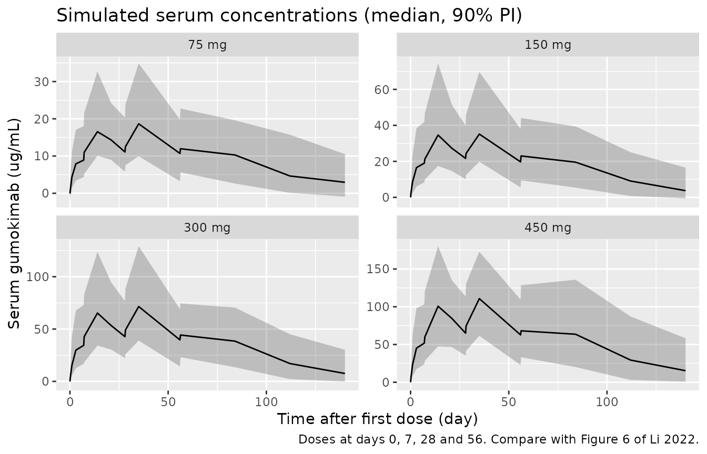
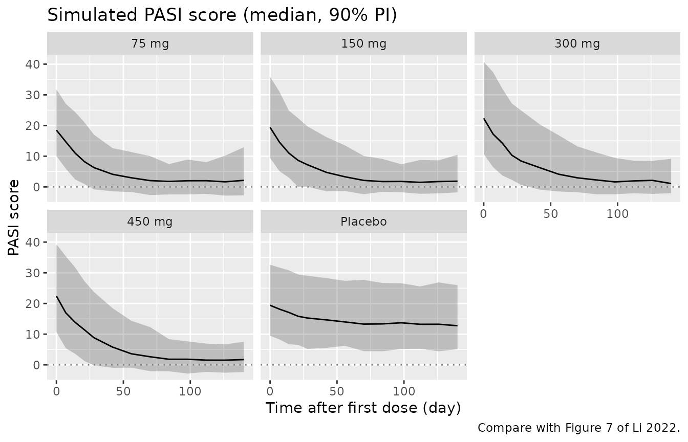
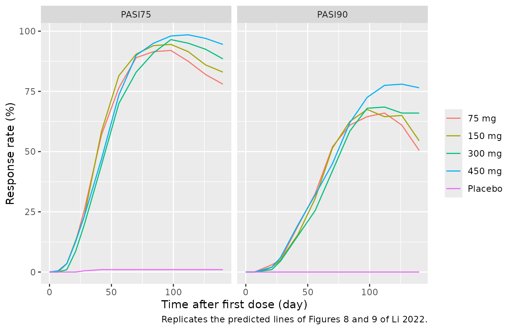
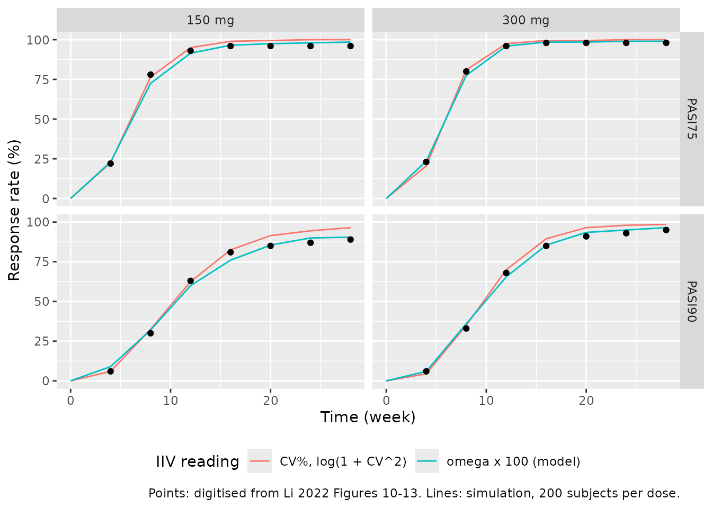

# Gumokimab (Li 2022)

## Model and source

- Citation: Li Q, Qiao J, Jin H, Chen B, He Z, Wang G, Ni X, Wang M, Xia
  M, Li B, Chen R, Hu P. Population pharmacokinetic/pharmacodynamic
  analysis of AK111, an IL-17A monoclonal antibody, in subjects with
  moderate-to-severe plaque psoriasis. Front Pharmacol. 2022;13:966176.
  <doi:10.3389/fphar.2022.966176>
- Description: Sequential population PK/PD model for gumokimab (AK111, a
  humanized anti-IL-17A IgG1 monoclonal antibody) in Chinese adults with
  moderate-to-severe plaque psoriasis (Li 2022 phase 1b). PK:
  one-compartment disposition with first-order SC absorption and
  first-order elimination (apparent CL 0.182 L/day, V 6.65 L). PD:
  indirect-response model for the Psoriasis Area and Severity Index
  (PASI) in which serum gumokimab inhibits plaque formation (Imax fixed
  at 1, IC50 0.52 ug/mL) and a placebo effect multiplies the plaque-loss
  rate by 1 + PLBmax (Kplb fixed at 0, so the placebo effect is constant
  from the first dose). Baseline PASI is the steady state kin / kout,
  and the percentage of body surface area affected by psoriasis enters
  kout as a power covariate normalized to 31%.
- Article: <https://doi.org/10.3389/fphar.2022.966176> (open access)
- Companion clinical report of the same phase 1b study (NCA and observed
  response rates used below): Dermatol Ther (Heidelb) 2023,
  <https://doi.org/10.1007/s13555-022-00880-1>

AK111 is the development code of gumokimab (Akeso Biopharma), a
humanized anti-IL-17A IgG1 kappa monoclonal antibody. The model is
registered under the INN.

## Population

Li 2022 analysed a single-centre, randomized, double-blind,
placebo-controlled phase 1b study in Chinese adults with
moderate-to-severe plaque psoriasis (Table 1). Forty-eight patients were
enrolled into four dose cohorts of 12 (9 AK111 : 3 placebo) receiving
75, 150, 300 or 450 mg SC at weeks 0, 1, 4 and 8. One 450 mg subject was
excluded for delayed administration, so 47 patients (35 AK111, 12
placebo) contributed 516 serum concentrations and 344 PASI scores. Mean
(SD) age was 38.2 (8.9) years, weight 67.5 (10.0) kg, 21% were female,
mean baseline PASI was 20 (5.6) and the mean body surface area (BSA)
affected by psoriasis was 33.3% (14.7%).

The same information is available programmatically via
`readModelDb("Li_2022_gumokimab")()$population`.

## Source trace

| Equation / parameter | Value | Source location |
|----|----|----|
| `d/dt(depot)`, `d/dt(central)` | one compartment, first-order absorption and elimination | Eqs 4-5; Figure 1 |
| `d/dt(pasi)` | `kin * (1 - imax*C/(ic50 + C)) - kout * plb * pasi` | Eq 6 |
| `kout` covariate | `tvKout * (BSA/31)^thetaBSA * exp(eta)` | Eq 7 |
| `plb` | `1 + PLBmax * exp(-Kplb * t)` | Eq 8 |
| `pasi(0)` | `kin / kout` (baseline at steady state) | Results, model description |
| `lka` | log(0.463) 1/day | Table 2 |
| `lcl` | log(0.182) L/day | Table 2 |
| `lvc` | log(6.65) L | Table 2 |
| `lkin` | log(0.474) PASI/day | Table 2 |
| `lkout` | log(0.024) 1/day | Table 2 |
| `imax` | 1 (fixed) | Table 2 |
| `lic50` | log(0.52) ug/mL | Table 2 |
| `lpmax` | log(0.429) | Table 2 (PLBmax) |
| `kplb` | 0 (fixed) | Table 2; Discussion |
| `e_bsa_affected_pct_kout` | -0.572 | Table 2 (thetaBSA) |
| IIV Ka, CL, V | 50.1%, 42.2%, 46.4% -\> omega^2 = (IIV/100)^2 | Table 2 |
| IIV Kin, Kout, IC50, PLBmax | 16.0%, 23.3%, 161.2%, 98.7% -\> omega^2 = (IIV/100)^2 | Table 2 |
| `propSd` | sqrt(0.0144) = 0.12 | Table 2 (sigma prop, a variance) |
| `addSd` | sqrt(1.48) = 1.217 ug/mL | Table 2 (sigma addi, a variance) |
| `addSd_pasi` | sqrt(4.53) = 2.128 PASI | Table 2 (sigma PASI, a variance) |

## Structural checks

All checks in this section use typical values
(`omega = NA, sigma = NA`). `zeroRe()` is avoided because this model has
two endpoints.

``` r

# Protocol PK schedule (Methods): pre-dose and study days 2, 4, 8, 15, 22, 29,
# 36, 57, 85, 113 and 141, plus 6 h after the doses on days 1, 8, 29 and 57.
# Study day D is time D - 1 here.
pk_grid <- c(0, 0.25, 1, 3, 7, 7.25, 14, 21, 28, 28.25, 35, 56, 56.25, 84, 112, 140)
pd_grid <- c(0, 7, 14, 21, 28, 42, 56, 70, 84, 98, 112, 126, 140)
trial_doses <- c(0, 7, 28, 56) # weeks 0, 1, 4 and 8

# One event table per arm. PK rows observe `central` (dvid 1, Cc) and PD rows
# observe `pasi` (dvid 2). `id_offset` keeps ids disjoint across arms.
make_arm <- function(n, amt, label, bsa, dose_days = trial_doses,
                     pk_days = pk_grid, pd_days = pd_grid, id_offset = 0L) {
  ids <- id_offset + seq_len(n)
  dose <- if (is.na(amt)) NULL else
    tidyr::expand_grid(id = ids, time = dose_days) |>
      dplyr::mutate(amt = amt, evid = 1L, cmt = "depot", dvid = NA_integer_,
                    endpoint = "dose")
  pk <- if (length(pk_days) == 0) NULL else
    tidyr::expand_grid(id = ids, time = pk_days) |>
      dplyr::mutate(amt = NA_real_, evid = 0L, cmt = "central", dvid = 1L,
                    endpoint = "Cc")
  pd <- tidyr::expand_grid(id = ids, time = pd_days) |>
    dplyr::mutate(amt = NA_real_, evid = 0L, cmt = "pasi", dvid = 2L,
                  endpoint = "pasi")
  dplyr::bind_rows(dose, pk, pd) |>
    dplyr::left_join(tibble::tibble(id = ids, BSA_AFFECTED_PCT = bsa), by = "id") |>
    dplyr::mutate(treatment = label) |>
    dplyr::arrange(id, time, dplyr::desc(evid))
}

solve_typ <- function(m, ev) {
  rxode2::rxSolve(m, ev, omega = NA, sigma = NA, returnType = "data.frame",
                  keep = c("endpoint", "treatment"),
                  atol = 1e-10, rtol = 1e-10)
}
```

``` r

th <- mod$theta

# Identity 1: the baseline is the steady state kin / kout; at the reference
# 31% BSA affected it is 0.474 / 0.024 = 19.75 PASI (Table 1 mean: 20).
typ_pbo <- solve_typ(mod, make_arm(1L, NA, "placebo", bsa = 31))
base_typ <- typ_pbo$pasi[typ_pbo$time == 0][1]
stopifnot(abs(base_typ - 0.474 / 0.024) < 1e-8)

# Identity 2: with no drug, the constant placebo multiplier (kplb = 0) moves
# PASI from B to B / (1 + PLBmax) at rate kout * (1 + PLBmax).
kout <- exp(th[["lkout"]]); pmax <- exp(th[["lpmax"]])
pd_pbo <- typ_pbo |> dplyr::filter(endpoint == "pasi")
closed <- base_typ / (1 + pmax) +
  (base_typ - base_typ / (1 + pmax)) * exp(-kout * (1 + pmax) * pd_pbo$time)
stopifnot(max(abs(pd_pbo$pasi - closed) / closed) < 1e-6)

# Identity 3: with the placebo effect removed the drug-free state stays at
# baseline.
mod_nopbo <- rxode2::ini(mod, lpmax = log(1e-12))
#> ℹ change initial estimate of `lpmax` to `-27.6310211159285`
flat <- solve_typ(mod_nopbo, make_arm(1L, NA, "none", bsa = 31)) |>
  dplyr::filter(endpoint == "pasi")
stopifnot(max(abs(flat$pasi - base_typ)) < 1e-6)

# Identity 4: one SC dose against the Bateman closed form.
ka <- exp(th[["lka"]]); cl <- exp(th[["lcl"]]); vc <- exp(th[["lvc"]])
kel <- cl / vc
sd1 <- solve_typ(mod, make_arm(1L, 300, "300 mg", bsa = 31, dose_days = 0)) |>
  dplyr::filter(endpoint == "Cc")
bateman <- 300 / vc * ka / (ka - kel) * (exp(-kel * sd1$time) - exp(-ka * sd1$time))
stopifnot(max(abs(sd1$Cc - bateman)) < 1e-6 * max(bateman))

# Half-life quoted in the Discussion: 0.693 * V / CL = 25.3 days.
thalf <- log(2) * vc / cl
stopifnot(abs(thalf - 25.3) < 0.05)

tibble::tibble(
  Quantity = c("Baseline PASI at 31% BSA (kin/kout)",
               "Placebo plateau PASI (B / (1 + PLBmax))",
               "Elimination half-life (day)"),
  Value = c(base_typ, base_typ / (1 + pmax), thalf)
) |>
  knitr::kable(digits = 2, caption = "Typical-value structural quantities.")
```

| Quantity                                | Value |
|:----------------------------------------|------:|
| Baseline PASI at 31% BSA (kin/kout)     | 19.75 |
| Placebo plateau PASI (B / (1 + PLBmax)) | 13.82 |
| Elimination half-life (day)             | 25.33 |

Typical-value structural quantities. {.table}

## Virtual cohort

Original observed data are not publicly available. Each arm has 200
virtual subjects. The percentage of BSA affected is drawn log-normally
with the arm means of Li 2022 Table 1 and the pooled coefficient of
variation (14.7 / 33.3), truncated to 10-90%. Placebo subjects are
pooled into a single arm, as in Table 1.

``` r

set.seed(20220816)
n_arm <- 200L
draw_bsa <- function(n, mean_pct) {
  sdl <- sqrt(log(1 + (14.7 / 33.3)^2))
  pmin(pmax(exp(log(mean_pct) - sdl^2 / 2 + sdl * rnorm(n)), 10), 90)
}
arms <- tibble::tribble(
  ~treatment, ~amt, ~bsa_mean,
  "75 mg",    75,   30.6,
  "150 mg",   150,  30.8,
  "300 mg",   300,  38.7,
  "450 mg",   450,  36.5,
  "Placebo",  NA,   30.8
)
events <- dplyr::bind_rows(lapply(seq_len(nrow(arms)), function(i) {
  make_arm(n_arm, arms$amt[i], arms$treatment[i],
           bsa = draw_bsa(n_arm, arms$bsa_mean[i]),
           id_offset = (i - 1L) * n_arm)
})) |>
  dplyr::mutate(treatment = factor(treatment, levels = arms$treatment))
stopifnot(!anyDuplicated(events[, c("id", "time", "evid", "endpoint")]))
```

## Simulation

``` r

rxode2::rxSetSeed(20220816)
sim <- rxode2::rxSolve(mod, events,
                       keep = c("treatment", "endpoint", "BSA_AFFECTED_PCT"),
                       returnType = "data.frame")
stopifnot(!anyNA(sim$Cc), !anyNA(sim$pasi),
          dplyr::n_distinct(round(sim$ic50, 8)) > 1L)

sim_pk <- sim |> dplyr::filter(endpoint == "Cc", treatment != "Placebo")
sim_pd <- sim |>
  dplyr::filter(endpoint == "pasi") |>
  dplyr::group_by(id) |>
  dplyr::mutate(base = pasi[time == 0][1]) |>
  dplyr::ungroup() |>
  dplyr::mutate(
    pasi_obs = pmax(sim, 0),
    PASI75 = pasi <= 0.25 * base,
    PASI90 = pasi <= 0.10 * base
  )
```

## Replicate published figures

``` r

# Replicates Figure 6 of Li 2022 (PK VPC), stratified by dose instead of
# prediction-corrected.
sim_pk |>
  dplyr::group_by(treatment, time) |>
  dplyr::summarise(Q05 = quantile(sim, 0.05), Q50 = quantile(sim, 0.5),
                   Q95 = quantile(sim, 0.95), .groups = "drop") |>
  ggplot(aes(time, Q50)) +
  geom_ribbon(aes(ymin = Q05, ymax = Q95), alpha = 0.25) +
  geom_line() +
  facet_wrap(~treatment, scales = "free_y") +
  labs(x = "Time after first dose (day)", y = "Serum gumokimab (ug/mL)",
       title = "Simulated serum concentrations (median, 90% PI)",
       caption = "Doses at days 0, 7, 28 and 56. Compare with Figure 6 of Li 2022.")
```



``` r

# Replicates Figure 7 of Li 2022 (PASI VPC), stratified by arm.
sim_pd |>
  dplyr::group_by(treatment, time) |>
  dplyr::summarise(Q05 = quantile(sim, 0.05), Q50 = quantile(sim, 0.5),
                   Q95 = quantile(sim, 0.95), .groups = "drop") |>
  ggplot(aes(time, Q50)) +
  geom_ribbon(aes(ymin = Q05, ymax = Q95), alpha = 0.25) +
  geom_line() +
  geom_hline(yintercept = 0, colour = "grey50", linetype = "dotted") +
  facet_wrap(~treatment) +
  labs(x = "Time after first dose (day)", y = "PASI score",
       title = "Simulated PASI score (median, 90% PI)",
       caption = "Compare with Figure 7 of Li 2022.")
```



### PASI75 and PASI90 response rates in the trial (Figures 8-9)

Response is defined against each subject’s own baseline. Following the
paper’s response-rate simulations, the rates are computed on the
individual predicted PASI (no residual error); see the Assumptions
section for why.

``` r

rates <- sim_pd |>
  dplyr::group_by(treatment, time) |>
  dplyr::summarise(PASI75 = 100 * mean(PASI75), PASI90 = 100 * mean(PASI90),
                   .groups = "drop")
rates |>
  tidyr::pivot_longer(c(PASI75, PASI90), names_to = "endpoint", values_to = "rate") |>
  ggplot(aes(time, rate, colour = treatment)) +
  geom_line() +
  facet_wrap(~endpoint) +
  labs(x = "Time after first dose (day)", y = "Response rate (%)", colour = NULL,
       caption = "Replicates the predicted lines of Figures 8 and 9 of Li 2022.")
```



The companion clinical report gives the observed week-20 response rates
(Table 3, n = 9 per AK111 arm and 12 on placebo). Day 140 is the nearest
simulated visit.

``` r

obs_w20 <- tibble::tribble(
  ~treatment, ~obs75, ~obs90,
  "75 mg",    88.9,   44.4,
  "150 mg",   88.9,   88.9,
  "300 mg",   100,    55.6,
  "450 mg",   100,    100,
  "Placebo",  8.3,    8.3
)
w20 <- rates |>
  dplyr::filter(time == 140) |>
  dplyr::mutate(treatment = as.character(treatment)) |>
  dplyr::left_join(obs_w20, by = "treatment")
w20 |>
  dplyr::select(treatment, PASI75, obs75, PASI90, obs90) |>
  dplyr::rename("Arm" = treatment,
                "Simulated PASI75 (%)" = PASI75, "Observed PASI75 (%)" = obs75,
                "Simulated PASI90 (%)" = PASI90, "Observed PASI90 (%)" = obs90) |>
  knitr::kable(digits = 1, caption = "Week-20 response rates: simulation vs observed.")
```

| Arm | Simulated PASI75 (%) | Observed PASI75 (%) | Simulated PASI90 (%) | Observed PASI90 (%) |
|:---|---:|---:|---:|---:|
| 75 mg | 78.0 | 88.9 | 50.5 | 44.4 |
| 150 mg | 83.0 | 88.9 | 54.5 | 88.9 |
| 300 mg | 88.5 | 100.0 | 66.0 | 55.6 |
| 450 mg | 94.5 | 100.0 | 76.5 | 100.0 |
| Placebo | 1.0 | 8.3 | 0.0 | 8.3 |

Week-20 response rates: simulation vs observed. {.table}

``` r


stopifnot(
  # Active arms all respond strongly, placebo barely.
  all(w20$PASI75[w20$treatment != "Placebo"] > 70),
  w20$PASI75[w20$treatment == "Placebo"] < 15
)
```

With 9 subjects per arm one responder moves an observed rate by 11
percentage points, so only the overall level is meaningful. The paper
notes the same under-prediction of PASI90 at the highest dose.

### Dosing-regimen simulations (Figures 10-13)

Li 2022 simulated 150 and 300 mg under eight loading and maintenance
schedules and reported the median PASI75 and PASI90 response rates over
1,000 trial replicates. The regimens barely differ, so the comparison
below uses the “weeks 0, 1, 4, then Q4W” schedule, whose curves the
maintainers digitised from Figures 10-13 (read to about 2 percentage
points; the paper’s curves step in units of one virtual patient out of
47, about 2.1 points).

The same simulation also shows how the reported IIV percentages must be
read. The tail of non-responders, set mostly by the 161% IIV on IC50,
fixes the PASI90 plateau. Reading the percentages as `omega x 100`, the
reading used here, reproduces the plateaus. Reading them as CV% with
`omega^2 = log(1 + CV^2)` gives a smaller IC50 variance and plateaus
about 5-7 points too high.

``` r

reg_doses <- 7 * c(0, 1, 4, seq(8, 28, by = 4))
wk <- c(0, 4, 8, 12, 16, 20, 24, 28)
make_reg <- function(amt, label, id_offset) {
  make_arm(n_arm, amt, label, bsa = draw_bsa(n_arm, 33.3),
           dose_days = reg_doses, pk_days = numeric(0), pd_days = 7 * wk,
           id_offset = id_offset)
}
set.seed(20220817)
ev_reg <- dplyr::bind_rows(make_reg(150, "150 mg", 0L),
                           make_reg(300, "300 mg", n_arm))

cv_pct <- c(etalka = 50.1, etalcl = 42.2, etalvc = 46.4, etalkin = 16.0,
            etalkout = 23.3, etalic50 = 161.2, etalpmax = 98.7) / 100
omega_cv <- diag(log(1 + cv_pct^2))
dimnames(omega_cv) <- list(names(cv_pct), names(cv_pct))
stopifnot(isTRUE(all.equal(unname(diag(mod$omega)[names(cv_pct)]),
                           unname(cv_pct^2), tolerance = 1e-5)))

reg_rates <- function(omega, reading) {
  rxode2::rxSetSeed(20220817)
  rxode2::rxSolve(mod, ev_reg, omega = omega, keep = c("treatment", "endpoint"),
                  returnType = "data.frame") |>
    dplyr::filter(endpoint == "pasi") |>
    dplyr::group_by(id) |>
    dplyr::mutate(base = pasi[time == 0][1]) |>
    dplyr::group_by(treatment, week = time / 7) |>
    dplyr::summarise(PASI75 = 100 * mean(pasi <= 0.25 * base),
                     PASI90 = 100 * mean(pasi <= 0.10 * base), .groups = "drop") |>
    tidyr::pivot_longer(c(PASI75, PASI90), names_to = "response",
                        values_to = "simulated") |>
    dplyr::mutate(reading = reading)
}
reg <- dplyr::bind_rows(
  reg_rates(mod$omega, "omega x 100 (model)"),
  reg_rates(omega_cv, "CV%, log(1 + CV^2)")
)

digitised <- tibble::tribble(
  ~treatment, ~response, ~week, ~published,
  "150 mg", "PASI75",  4, 22, "150 mg", "PASI75",  8, 78, "150 mg", "PASI75", 12, 93,
  "150 mg", "PASI75", 16, 96, "150 mg", "PASI75", 20, 96, "150 mg", "PASI75", 24, 96,
  "150 mg", "PASI75", 28, 96,
  "300 mg", "PASI75",  4, 23, "300 mg", "PASI75",  8, 80, "300 mg", "PASI75", 12, 96,
  "300 mg", "PASI75", 16, 98, "300 mg", "PASI75", 20, 98, "300 mg", "PASI75", 24, 98,
  "300 mg", "PASI75", 28, 98,
  "150 mg", "PASI90",  4,  6, "150 mg", "PASI90",  8, 30, "150 mg", "PASI90", 12, 63,
  "150 mg", "PASI90", 16, 81, "150 mg", "PASI90", 20, 85, "150 mg", "PASI90", 24, 87,
  "150 mg", "PASI90", 28, 89,
  "300 mg", "PASI90",  4,  6, "300 mg", "PASI90",  8, 33, "300 mg", "PASI90", 12, 68,
  "300 mg", "PASI90", 16, 85, "300 mg", "PASI90", 20, 91, "300 mg", "PASI90", 24, 93,
  "300 mg", "PASI90", 28, 95
)
cmp_reg <- reg |>
  dplyr::inner_join(digitised, by = c("treatment", "response", "week")) |>
  dplyr::mutate(diff = simulated - published)
```

``` r

# Replicates Figures 10-13 of Li 2022 (weeks 0, 1, 4 then Q4W).
reg |>
  ggplot(aes(week, simulated, colour = reading)) +
  geom_line() +
  geom_point(data = digitised, aes(week, published), inherit.aes = FALSE) +
  facet_grid(response ~ treatment) +
  labs(x = "Time (week)", y = "Response rate (%)", colour = "IIV reading",
       caption = "Points: digitised from Li 2022 Figures 10-13. Lines: simulation, 200 subjects per dose.") +
  theme(legend.position = "bottom")
```



``` r

plateau <- cmp_reg |>
  dplyr::filter(response == "PASI90", week >= 20) |>
  dplyr::group_by(reading, treatment) |>
  dplyr::summarise(simulated = mean(simulated), published = mean(published),
                   .groups = "drop") |>
  dplyr::mutate(diff = simulated - published)
fit <- cmp_reg |>
  dplyr::group_by(reading) |>
  dplyr::summarise(mean_abs_diff = mean(abs(diff)), median_diff = median(diff),
                   .groups = "drop")

plateau |>
  dplyr::rename("IIV reading" = reading, "Dose" = treatment,
                "Simulated PASI90, weeks 20-28 (%)" = simulated,
                "Published (%)" = published, "Difference (pp)" = diff) |>
  knitr::kable(digits = 1, caption = "PASI90 plateau under the two IIV readings.")
```

| IIV reading | Dose | Simulated PASI90, weeks 20-28 (%) | Published (%) | Difference (pp) |
|:---|:---|---:|---:|---:|
| CV%, log(1 + CV^2) | 150 mg | 94.2 | 87 | 7.2 |
| CV%, log(1 + CV^2) | 300 mg | 97.7 | 93 | 4.7 |
| omega x 100 (model) | 150 mg | 88.7 | 87 | 1.7 |
| omega x 100 (model) | 300 mg | 95.0 | 93 | 2.0 |

PASI90 plateau under the two IIV readings. {.table}

``` r

fit |>
  dplyr::rename("IIV reading" = reading,
                "Mean |difference| over all 28 points (pp)" = mean_abs_diff,
                "Median difference (pp)" = median_diff) |>
  knitr::kable(digits = 1)
```

| IIV reading | Mean \|difference\| over all 28 points (pp) | Median difference (pp) |
|:---|---:|---:|
| CV%, log(1 + CV^2) | 2.9 | 2.0 |
| omega x 100 (model) | 1.8 | 0.8 |

``` r


fit_model <- fit[fit$reading == "omega x 100 (model)", ]
stopifnot(
  # The packaged model tracks the published curves.
  fit_model$mean_abs_diff < 6,
  abs(fit_model$median_diff) < 5,
  # Paper: week-12 PASI75 > 90% and week-24 PASI90 > 80% at both doses.
  all(cmp_reg$simulated[cmp_reg$reading == "omega x 100 (model)" &
                          cmp_reg$response == "PASI75" & cmp_reg$week == 12] > 85),
  all(cmp_reg$simulated[cmp_reg$reading == "omega x 100 (model)" &
                          cmp_reg$response == "PASI90" & cmp_reg$week == 24] > 75)
)
```

## PKNCA validation

The companion clinical report tabulates NCA after the fourth dose (day
56 to day 140; its Table 2, arithmetic means, Tmax as median). The same
interval is computed on the simulated concentrations including residual
error.

``` r

sim_nca <- sim_pk |>
  dplyr::filter(!is.na(sim)) |>
  dplyr::mutate(Cc = pmax(sim, 0)) |>
  dplyr::select(id, time, Cc, treatment)
sim_nca <- dplyr::bind_rows(
  sim_nca,
  sim_nca |> dplyr::distinct(id, treatment) |> dplyr::mutate(time = 0, Cc = 0)
) |>
  dplyr::distinct(id, treatment, time, .keep_all = TRUE) |>
  dplyr::arrange(id, time)

dose_df <- events |>
  dplyr::filter(evid == 1) |>
  dplyr::select(id, time, amt, treatment)

conc_obj <- PKNCA::PKNCAconc(sim_nca, Cc ~ time | treatment + id)
dose_obj <- PKNCA::PKNCAdose(dose_df, amt ~ time | treatment + id)
intervals <- data.frame(start = 56, end = 140, cmax = TRUE, tmax = TRUE,
                        auclast = TRUE, half.life = TRUE)
nca_res <- PKNCA::pk.nca(PKNCA::PKNCAdata(conc_obj, dose_obj, intervals = intervals))
#> Warning: Too few points for half-life calculation (min.hl.points=3 with only 2 points)
#> Too few points for half-life calculation (min.hl.points=3 with only 2 points)
#> Too few points for half-life calculation (min.hl.points=3 with only 2 points)
#> Too few points for half-life calculation (min.hl.points=3 with only 2 points)
#> Too few points for half-life calculation (min.hl.points=3 with only 2 points)
#> Too few points for half-life calculation (min.hl.points=3 with only 2 points)
#> Too few points for half-life calculation (min.hl.points=3 with only 2 points)
#> Too few points for half-life calculation (min.hl.points=3 with only 2 points)
#> Too few points for half-life calculation (min.hl.points=3 with only 2 points)
#> Too few points for half-life calculation (min.hl.points=3 with only 2 points)
#> Warning: Too few points for half-life calculation (min.hl.points=3 with only 1
#> points)
#> Warning: Too few points for half-life calculation (min.hl.points=3 with only 2 points)
#> Too few points for half-life calculation (min.hl.points=3 with only 2 points)
#> Too few points for half-life calculation (min.hl.points=3 with only 2 points)
#> Too few points for half-life calculation (min.hl.points=3 with only 2 points)
#> Warning: Too few points for half-life calculation (min.hl.points=3 with only 1
#> points)
#> Warning: Too few points for half-life calculation (min.hl.points=3 with only 2 points)
#> Too few points for half-life calculation (min.hl.points=3 with only 2 points)
#> Too few points for half-life calculation (min.hl.points=3 with only 2 points)
#> Too few points for half-life calculation (min.hl.points=3 with only 2 points)
#> Too few points for half-life calculation (min.hl.points=3 with only 2 points)
#> Too few points for half-life calculation (min.hl.points=3 with only 2 points)
#> Too few points for half-life calculation (min.hl.points=3 with only 2 points)
#> Too few points for half-life calculation (min.hl.points=3 with only 2 points)
#> Too few points for half-life calculation (min.hl.points=3 with only 2 points)
#> Too few points for half-life calculation (min.hl.points=3 with only 2 points)
#> Warning: Too few points for half-life calculation (min.hl.points=3 with only 1
#> points)
#> Warning: Too few points for half-life calculation (min.hl.points=3 with only 2 points)
#> Too few points for half-life calculation (min.hl.points=3 with only 2 points)
#> Too few points for half-life calculation (min.hl.points=3 with only 2 points)
#> Too few points for half-life calculation (min.hl.points=3 with only 2 points)
#> Too few points for half-life calculation (min.hl.points=3 with only 2 points)
#> Too few points for half-life calculation (min.hl.points=3 with only 2 points)
#> Too few points for half-life calculation (min.hl.points=3 with only 2 points)
#> Too few points for half-life calculation (min.hl.points=3 with only 2 points)
#> Too few points for half-life calculation (min.hl.points=3 with only 2 points)
#> Too few points for half-life calculation (min.hl.points=3 with only 2 points)
#> Too few points for half-life calculation (min.hl.points=3 with only 2 points)
#> Too few points for half-life calculation (min.hl.points=3 with only 2 points)
#> Warning: Too few points for half-life calculation (min.hl.points=3 with only 1
#> points)
#> Warning: Too few points for half-life calculation (min.hl.points=3 with only 2 points)
#> Too few points for half-life calculation (min.hl.points=3 with only 2 points)
#> Too few points for half-life calculation (min.hl.points=3 with only 2 points)
#> Too few points for half-life calculation (min.hl.points=3 with only 2 points)
#> Too few points for half-life calculation (min.hl.points=3 with only 2 points)
#> Too few points for half-life calculation (min.hl.points=3 with only 2 points)
#> Too few points for half-life calculation (min.hl.points=3 with only 2 points)
#> Too few points for half-life calculation (min.hl.points=3 with only 2 points)
#> Too few points for half-life calculation (min.hl.points=3 with only 2 points)
#> Too few points for half-life calculation (min.hl.points=3 with only 2 points)
#> Too few points for half-life calculation (min.hl.points=3 with only 2 points)
#> Too few points for half-life calculation (min.hl.points=3 with only 2 points)
#> Too few points for half-life calculation (min.hl.points=3 with only 2 points)
#> Too few points for half-life calculation (min.hl.points=3 with only 2 points)
#> Too few points for half-life calculation (min.hl.points=3 with only 2 points)
#> Too few points for half-life calculation (min.hl.points=3 with only 2 points)
#> Too few points for half-life calculation (min.hl.points=3 with only 2 points)
#> Warning: Too few points for half-life calculation (min.hl.points=3 with only 0
#> points)
#> Warning: Too few points for half-life calculation (min.hl.points=3 with only 2 points)
#> Too few points for half-life calculation (min.hl.points=3 with only 2 points)
#> Too few points for half-life calculation (min.hl.points=3 with only 2 points)
#> Too few points for half-life calculation (min.hl.points=3 with only 2 points)
#> Too few points for half-life calculation (min.hl.points=3 with only 2 points)
#> Too few points for half-life calculation (min.hl.points=3 with only 2 points)
#> Too few points for half-life calculation (min.hl.points=3 with only 2 points)
#> Too few points for half-life calculation (min.hl.points=3 with only 2 points)
#> Too few points for half-life calculation (min.hl.points=3 with only 2 points)
#> Too few points for half-life calculation (min.hl.points=3 with only 2 points)
#> Too few points for half-life calculation (min.hl.points=3 with only 2 points)
#> Too few points for half-life calculation (min.hl.points=3 with only 2 points)
#> Too few points for half-life calculation (min.hl.points=3 with only 2 points)
#> Too few points for half-life calculation (min.hl.points=3 with only 2 points)
#> Too few points for half-life calculation (min.hl.points=3 with only 2 points)
#> Too few points for half-life calculation (min.hl.points=3 with only 2 points)
#> Warning: Too few points for half-life calculation (min.hl.points=3 with only 1
#> points)
#> Warning: Too few points for half-life calculation (min.hl.points=3 with only 2 points)
#> Too few points for half-life calculation (min.hl.points=3 with only 2 points)
#> Too few points for half-life calculation (min.hl.points=3 with only 2 points)
#> Too few points for half-life calculation (min.hl.points=3 with only 2 points)
#> Too few points for half-life calculation (min.hl.points=3 with only 2 points)
#> Too few points for half-life calculation (min.hl.points=3 with only 2 points)
#> Too few points for half-life calculation (min.hl.points=3 with only 2 points)
#> Too few points for half-life calculation (min.hl.points=3 with only 2 points)
#> Too few points for half-life calculation (min.hl.points=3 with only 2 points)
#> Too few points for half-life calculation (min.hl.points=3 with only 2 points)
#> Too few points for half-life calculation (min.hl.points=3 with only 2 points)
#> Too few points for half-life calculation (min.hl.points=3 with only 2 points)
#> Warning: Too few points for half-life calculation (min.hl.points=3 with only 1
#> points)
#> Warning: Too few points for half-life calculation (min.hl.points=3 with only 2 points)
#> Too few points for half-life calculation (min.hl.points=3 with only 2 points)
#> Too few points for half-life calculation (min.hl.points=3 with only 2 points)
#> Too few points for half-life calculation (min.hl.points=3 with only 2 points)
#> Too few points for half-life calculation (min.hl.points=3 with only 2 points)
#> Too few points for half-life calculation (min.hl.points=3 with only 2 points)
#> Too few points for half-life calculation (min.hl.points=3 with only 2 points)
#> Too few points for half-life calculation (min.hl.points=3 with only 2 points)
#> Too few points for half-life calculation (min.hl.points=3 with only 2 points)
#> Too few points for half-life calculation (min.hl.points=3 with only 2 points)
#> Too few points for half-life calculation (min.hl.points=3 with only 2 points)
#> Too few points for half-life calculation (min.hl.points=3 with only 2 points)
#> Too few points for half-life calculation (min.hl.points=3 with only 2 points)
#> Warning: Too few points for half-life calculation (min.hl.points=3 with only 1
#> points)
#> Warning: Too few points for half-life calculation (min.hl.points=3 with only 2 points)
#> Too few points for half-life calculation (min.hl.points=3 with only 2 points)
#> Too few points for half-life calculation (min.hl.points=3 with only 2 points)
#> Too few points for half-life calculation (min.hl.points=3 with only 2 points)
#> Too few points for half-life calculation (min.hl.points=3 with only 2 points)
#> Too few points for half-life calculation (min.hl.points=3 with only 2 points)
#> Warning: Too few points for half-life calculation (min.hl.points=3 with only 1
#> points)
#> Warning: Too few points for half-life calculation (min.hl.points=3 with only 2 points)
#> Too few points for half-life calculation (min.hl.points=3 with only 2 points)
#> Too few points for half-life calculation (min.hl.points=3 with only 2 points)
#> Too few points for half-life calculation (min.hl.points=3 with only 2 points)
#> Too few points for half-life calculation (min.hl.points=3 with only 2 points)
#> Too few points for half-life calculation (min.hl.points=3 with only 2 points)
#> Too few points for half-life calculation (min.hl.points=3 with only 2 points)
#> Too few points for half-life calculation (min.hl.points=3 with only 2 points)
#> Too few points for half-life calculation (min.hl.points=3 with only 2 points)
#> Too few points for half-life calculation (min.hl.points=3 with only 2 points)
#> Too few points for half-life calculation (min.hl.points=3 with only 2 points)
#> Too few points for half-life calculation (min.hl.points=3 with only 2 points)
#> Too few points for half-life calculation (min.hl.points=3 with only 2 points)
#> Too few points for half-life calculation (min.hl.points=3 with only 2 points)
#> Too few points for half-life calculation (min.hl.points=3 with only 2 points)
#> Too few points for half-life calculation (min.hl.points=3 with only 2 points)
#> Too few points for half-life calculation (min.hl.points=3 with only 2 points)
#> Too few points for half-life calculation (min.hl.points=3 with only 2 points)
#> Too few points for half-life calculation (min.hl.points=3 with only 2 points)
#> Too few points for half-life calculation (min.hl.points=3 with only 2 points)
#> Too few points for half-life calculation (min.hl.points=3 with only 2 points)
#> Too few points for half-life calculation (min.hl.points=3 with only 2 points)
#> Too few points for half-life calculation (min.hl.points=3 with only 2 points)
#> Too few points for half-life calculation (min.hl.points=3 with only 2 points)
#> Too few points for half-life calculation (min.hl.points=3 with only 2 points)
#> Too few points for half-life calculation (min.hl.points=3 with only 2 points)
#> Too few points for half-life calculation (min.hl.points=3 with only 2 points)
#> Warning: Too few points for half-life calculation (min.hl.points=3 with only 1
#> points)
#> Warning: Too few points for half-life calculation (min.hl.points=3 with only 2 points)
#> Too few points for half-life calculation (min.hl.points=3 with only 2 points)
#> Too few points for half-life calculation (min.hl.points=3 with only 2 points)
#> Too few points for half-life calculation (min.hl.points=3 with only 2 points)
#> Too few points for half-life calculation (min.hl.points=3 with only 2 points)
#> Too few points for half-life calculation (min.hl.points=3 with only 2 points)
#> Too few points for half-life calculation (min.hl.points=3 with only 2 points)
#> Too few points for half-life calculation (min.hl.points=3 with only 2 points)
#> Too few points for half-life calculation (min.hl.points=3 with only 2 points)
#> Too few points for half-life calculation (min.hl.points=3 with only 2 points)
#> Too few points for half-life calculation (min.hl.points=3 with only 2 points)
#> Too few points for half-life calculation (min.hl.points=3 with only 2 points)
#> Too few points for half-life calculation (min.hl.points=3 with only 2 points)
#> Too few points for half-life calculation (min.hl.points=3 with only 2 points)
#> Too few points for half-life calculation (min.hl.points=3 with only 2 points)
#> Too few points for half-life calculation (min.hl.points=3 with only 2 points)
#> Too few points for half-life calculation (min.hl.points=3 with only 2 points)
#> Too few points for half-life calculation (min.hl.points=3 with only 2 points)
#> Too few points for half-life calculation (min.hl.points=3 with only 2 points)
#> Too few points for half-life calculation (min.hl.points=3 with only 2 points)
#> Too few points for half-life calculation (min.hl.points=3 with only 2 points)
#> Too few points for half-life calculation (min.hl.points=3 with only 2 points)
#> Warning: Too few points for half-life calculation (min.hl.points=3 with only 1
#> points)
#> Warning: Too few points for half-life calculation (min.hl.points=3 with only 2 points)
#> Too few points for half-life calculation (min.hl.points=3 with only 2 points)
#> Too few points for half-life calculation (min.hl.points=3 with only 2 points)
#> Too few points for half-life calculation (min.hl.points=3 with only 2 points)
#> Too few points for half-life calculation (min.hl.points=3 with only 2 points)
#> Too few points for half-life calculation (min.hl.points=3 with only 2 points)
#> Too few points for half-life calculation (min.hl.points=3 with only 2 points)
#> Warning: Too few points for half-life calculation (min.hl.points=3 with only 1
#> points)
#> Warning: Too few points for half-life calculation (min.hl.points=3 with only 2 points)
#> Too few points for half-life calculation (min.hl.points=3 with only 2 points)
#> Too few points for half-life calculation (min.hl.points=3 with only 2 points)
#> Too few points for half-life calculation (min.hl.points=3 with only 2 points)
#> Too few points for half-life calculation (min.hl.points=3 with only 2 points)
#> Too few points for half-life calculation (min.hl.points=3 with only 2 points)
#> Too few points for half-life calculation (min.hl.points=3 with only 2 points)
#> Too few points for half-life calculation (min.hl.points=3 with only 2 points)
#> Too few points for half-life calculation (min.hl.points=3 with only 2 points)
#> Too few points for half-life calculation (min.hl.points=3 with only 2 points)
#> Too few points for half-life calculation (min.hl.points=3 with only 2 points)
#> Too few points for half-life calculation (min.hl.points=3 with only 2 points)
#> Too few points for half-life calculation (min.hl.points=3 with only 2 points)
#> Too few points for half-life calculation (min.hl.points=3 with only 2 points)
#> Too few points for half-life calculation (min.hl.points=3 with only 2 points)
#> Too few points for half-life calculation (min.hl.points=3 with only 2 points)
#> Too few points for half-life calculation (min.hl.points=3 with only 2 points)
#> Too few points for half-life calculation (min.hl.points=3 with only 2 points)
#> Too few points for half-life calculation (min.hl.points=3 with only 2 points)
#> Too few points for half-life calculation (min.hl.points=3 with only 2 points)
#> Too few points for half-life calculation (min.hl.points=3 with only 2 points)
#> Too few points for half-life calculation (min.hl.points=3 with only 2 points)
#> Too few points for half-life calculation (min.hl.points=3 with only 2 points)
#> Too few points for half-life calculation (min.hl.points=3 with only 2 points)
#> Too few points for half-life calculation (min.hl.points=3 with only 2 points)
#> Too few points for half-life calculation (min.hl.points=3 with only 2 points)
#> Too few points for half-life calculation (min.hl.points=3 with only 2 points)
#> Too few points for half-life calculation (min.hl.points=3 with only 2 points)
#> Too few points for half-life calculation (min.hl.points=3 with only 2 points)
#> Too few points for half-life calculation (min.hl.points=3 with only 2 points)
#> Too few points for half-life calculation (min.hl.points=3 with only 2 points)
#> Too few points for half-life calculation (min.hl.points=3 with only 2 points)
#> Too few points for half-life calculation (min.hl.points=3 with only 2 points)
#> Too few points for half-life calculation (min.hl.points=3 with only 2 points)
#> Too few points for half-life calculation (min.hl.points=3 with only 2 points)
#> Too few points for half-life calculation (min.hl.points=3 with only 2 points)
#> Too few points for half-life calculation (min.hl.points=3 with only 2 points)
#> Too few points for half-life calculation (min.hl.points=3 with only 2 points)
#> Too few points for half-life calculation (min.hl.points=3 with only 2 points)
#> Too few points for half-life calculation (min.hl.points=3 with only 2 points)
#> Too few points for half-life calculation (min.hl.points=3 with only 2 points)
#> Too few points for half-life calculation (min.hl.points=3 with only 2 points)
#> Too few points for half-life calculation (min.hl.points=3 with only 2 points)
#> Too few points for half-life calculation (min.hl.points=3 with only 2 points)
#> Too few points for half-life calculation (min.hl.points=3 with only 2 points)
#> Too few points for half-life calculation (min.hl.points=3 with only 2 points)
#> Too few points for half-life calculation (min.hl.points=3 with only 2 points)
#> Too few points for half-life calculation (min.hl.points=3 with only 2 points)
#> Too few points for half-life calculation (min.hl.points=3 with only 2 points)
#> Too few points for half-life calculation (min.hl.points=3 with only 2 points)
#> Too few points for half-life calculation (min.hl.points=3 with only 2 points)
#> Too few points for half-life calculation (min.hl.points=3 with only 2 points)
#> Too few points for half-life calculation (min.hl.points=3 with only 2 points)
```

``` r

published <- tibble::tribble(
  ~treatment, ~cmax,  ~tmax,  ~auclast, ~half.life,
  "75 mg",    18.379, 0.238,  1001.072, 27.789,
  "150 mg",   24.300, 0.239,  1240.978, 26.291,
  "300 mg",   43.822, 0.242,  2280.001, 26.319,
  "450 mg",   73.850, 11.956, 3960.608, NA
)
cmp <- nlmixr2lib::ncaComparisonTable(
  simulated = nca_res,
  reference = published,
  by = "treatment",
  units = c(cmax = "ug/mL", tmax = "day", auclast = "day*ug/mL", half.life = "day"),
  tolerance_pct = 20
)
knitr::kable(cmp, caption = "Fourth-dose NCA (day 56-140): simulated median vs companion-report mean. * differs by >20%.")
```

| NCA parameter        | treatment | Reference | Simulated | % diff   |
|:---------------------|:----------|:----------|:----------|:---------|
| Cmax (ug/mL)         | 75 mg     | 18.4      | 13.6      | -26.1%\* |
| Cmax (ug/mL)         | 150 mg    | 24.3      | 24.3      | -0.1%    |
| Cmax (ug/mL)         | 300 mg    | 43.8      | 45.3      | +3.4%    |
| Cmax (ug/mL)         | 450 mg    | 73.8      | 72.6      | -1.7%    |
| Tmax (day)           | 75 mg     | 0.238     | 0.25      | +5.0%    |
| Tmax (day)           | 150 mg    | 0.239     | 0.25      | +4.6%    |
| Tmax (day)           | 300 mg    | 0.242     | 0.25      | +3.3%    |
| Tmax (day)           | 450 mg    | 12        | 0.25      | -97.9%\* |
| AUClast (day\*ug/mL) | 75 mg     | 1000      | 645       | -35.6%\* |
| AUClast (day\*ug/mL) | 150 mg    | 1240      | 1140      | -7.9%    |
| AUClast (day\*ug/mL) | 300 mg    | 2280      | 2310      | +1.4%    |
| AUClast (day\*ug/mL) | 450 mg    | 3960      | 3800      | -4.0%    |
| t½ (day)             | 75 mg     | 27.8      | 30.4      | +9.4%    |
| t½ (day)             | 150 mg    | 26.3      | 25        | -4.9%    |
| t½ (day)             | 300 mg    | 26.3      | 23.1      | -12.3%   |
| t½ (day)             | 450 mg    | —         | 24.1      | —        |

Fourth-dose NCA (day 56-140): simulated median vs companion-report mean.
\* differs by \>20%. {.table}

``` r

nca_sim <- as.data.frame(nca_res) |>
  dplyr::filter(PPTESTCD %in% c("auclast", "cmax", "half.life")) |>
  dplyr::group_by(treatment, PPTESTCD) |>
  dplyr::summarise(med = median(PPORRES, na.rm = TRUE), .groups = "drop")
ratios <- nca_sim |>
  dplyr::filter(PPTESTCD %in% c("auclast", "cmax")) |>
  dplyr::mutate(treatment = as.character(treatment)) |>
  dplyr::left_join(
    tidyr::pivot_longer(published, -treatment, names_to = "PPTESTCD",
                        values_to = "ref"),
    by = c("treatment", "PPTESTCD")
  ) |>
  dplyr::mutate(ratio = med / ref)
stopifnot(
  # 150-450 mg: fourth-dose Cmax and AUC on the protocol schedule within 25%.
  all(abs(log(ratios$ratio[ratios$treatment != "75 mg"])) < log(1.25)),
  # Terminal half-life consistent with 0.693 * V / CL = 25.3 days.
  abs(median(nca_sim$med[nca_sim$PPTESTCD == "half.life"]) - 25.3) < 5
)
```

The comparison uses the protocol sampling schedule. After the fourth
dose the trial sampled only at 6 hours and on days 85, 113 and 141,
which misses the true peak several days after the dose. That is why the
companion report’s median Tmax is the 6-hour sample (0.24 day), and why
its Cmax is lower than the true peak. On the same schedule the
simulation reproduces Cmax, Tmax and AUC at 150, 300 and 450 mg. On a
dense grid the true fourth-dose peak is 60-70% higher than the protocol
Cmax.

The 75 mg arm is under-predicted by about 25-35%. The model is linear,
so simulated exposure is dose-proportional, but the trial NCA is not:
dose-normalised fourth-dose AUC is 13.3 day\*ug/mL per mg at 75 mg and
7.6-8.8 at 150-450 mg. Li 2022 tested for target-mediated disposition,
found none, and reports only the linear model. The 450 mg Tmax of 12
days in the companion report is the median of eight values split between
the 6-hour and day-85 samples.

## Assumptions and deviations

- **IIV scale.** Table 2 prints IIV as a percentage with no stated
  convention. The maintainers read it as `omega x 100`, the SD of the
  exponential random effect, so `omega^2 = (IIV/100)^2`. The deciding
  evidence is the PASI90 plateau of the paper’s own regimen simulations
  (Figures 10-13, reproduced above). For IC50 (161%) and PLBmax (99%)
  the two readings differ by a factor of 2 and 1.4 in variance, and only
  `omega x 100` reproduces the plateau. For the narrow rows (Kin, Kout)
  the two readings agree within a few percent.
- **Residual error is a variance.** The three sigma rows of Table 2 are
  read as NONMEM `$SIGMA` variances. Three things support this. The
  proportional value 0.0144 is exactly 0.12^2, i.e. a 12% proportional
  error; read as an SD it would be a 1.4% error, implausible for an
  ELISA. One table should use one scale. And the simulated 90% band at
  baseline in the PASI pcVPC (Figure
  7.  is about +/- 4.5 PASI wide, which an additive SD of 4.53 alone
      (+/- 7.5) would already exceed. The SDs used are sqrt(0.0144) =
      0.12, sqrt(1.48) = 1.217 ug/mL and sqrt(4.53) = 2.128 PASI.
- **Response rates without residual error.** The simulated PASI90
  plateaus in Figures 10-13 (above 90% at 300 mg) cannot be reached once
  the additive PASI residual error is added. With an SD of 2.1 PASI, a
  subject whose true score is 0 still reads at or below a tenth of a
  baseline of 20 only about 83% of the time. The rates in this article
  are therefore computed on the individual predicted PASI.
- **Placebo effect applies to every subject.** Eq 6 has no treatment
  switch, so the placebo multiplier `1 + PLBmax` acts on `kout` in both
  the placebo and active arms. Because Kplb is fixed at 0, it is
  constant from the first dose. Time `t` is time since the first dose.
- **Table 2 wording errors.** The `V` row is labelled “volume of the
  peripheral compartment”, but the model has one compartment and the
  abstract calls it the central volume. The Kin and Kout definitions
  swap “first-order” and “zero-order”. Figure 1 and Eq 6 make Kin the
  zero-order formation rate (PASI/day) and Kout the first-order loss
  rate (1/day). The figure files numbered 11 and 13 carry legends (150
  mg and 300 mg PASI90) that are the reverse of their captions. The
  legends were used.
- **Covariate.** `BSA_AFFECTED_PCT` is the percentage of body surface
  area affected by psoriasis (the paper’s “BSA (%)” / “BSA
  involvement”), not body surface area in m^2. It is a baseline value.
  Eq 7 normalises it to 31%. The virtual cohort draws it log-normally
  from the Table 1 means and pooled CV.
- **Baseline variability.** With 23% IIV on Kout, 16% on Kin and the BSA
  covariate, the simulated baseline PASI has an SD of about 8. The
  observed SD in Table 1 is 5.6. Kin IIV carries 98.8% shrinkage. No
  correlation between the Kin and Kout random effects was reported, so
  none is included.
- **Sequential fit.** The PD parameters were estimated on individual
  post hoc PK estimates. The packaged model simulates PK and PD jointly
  from the same random effects. This is the standard way to use a
  sequential PK/PD model for simulation.
- No erratum or correction notice for Li 2022 was found in Europe PMC as
  of 2026-10-05.
