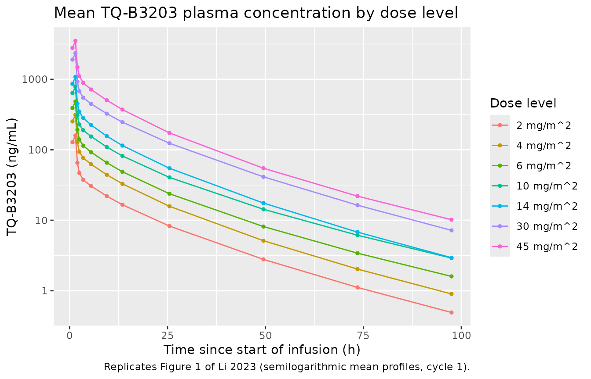
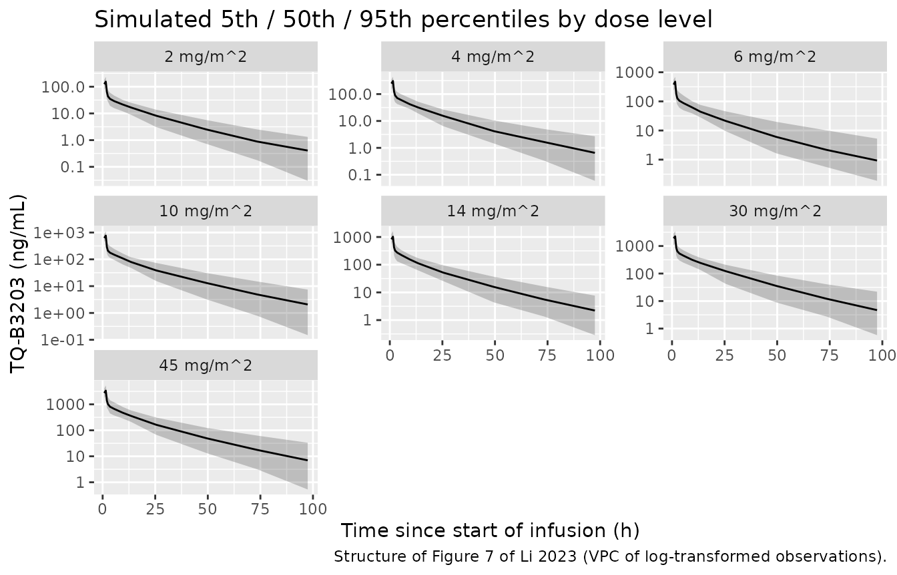

# TQ-B3203 (Li 2023)

``` r

mod <- readModelDb("Li_2023_TQB3203")
ui <- rxode2::rxode(mod)
#> ℹ parameter labels from comments will be replaced by 'label()'
```

## Model and source

- Citation: Li X, Bo Y, Yin H, Liu X, Li X, Yang F. Population
  pharmacokinetic analysis of TQ-B3203 following intravenous
  administration of TQ-B3203 liposome injection in Chinese patients with
  advanced solid tumors. Front Pharmacol. 2023 Jan 16;14:1102244.
  <doi:10.3389/fphar.2023.1102244>
- Article: <https://doi.org/10.3389/fphar.2023.1102244>
- Free full text:
  <https://www.ncbi.nlm.nih.gov/pmc/articles/PMC9885713/>

TQ-B3203 is a semisynthetic camptothecin (topoisomerase I inhibitor)
derivative carrying an aliphatic chain, formulated as a liposome
injection (TLI) to reduce toxicity and prolong circulation. Li 2023 is
the first population PK analysis of the compound, built from the phase I
dose-escalation trial NCT03447145.

A **three-compartment model with first-order elimination** described the
data best, parameterized as central volume `V1`, shallow peripheral
volume `V2`, deep peripheral volume `V3`, elimination clearance `CL`,
and inter-compartmental clearances `CL2` (central to shallow) and `CL3`
(central to deep). Only the parent compound was modelled; conversion to
SN-38 was under 5% (Discussion).

## Population

316 plasma concentrations from 15 Chinese patients with advanced solid
tumors over 25 treatment episodes (Results 3.1). Patients were 31-70
years (median 57, IQR 44-65) with weight 47.9-80.0 kg (median 64.0, IQR
57.5-68.0), BMI 18.64-28.97 kg/m^2 (median 23.44, IQR 21.05-24.91), and
lean body mass 32.09-59.40 kg (median 49.53, IQR 38.36-55.45); 33.3%
were female (Table 1). Doses were 2-45 mg/m^2 TQ-B3203 liposome
injection as a single 90-min IV infusion on day 1 of cycle 1 and day 22
of cycle 2 (dose levels 2, 4, 6, 10, 14, 30 and 45 mg/m^2; Table 2).

Sampling was pre-dose, 45 and 90 min after infusion start, then 0.5, 1,
2, 4, 8, 12, 24, 48, 72 and 96 h after the **end** of the infusion, so
the last sample is 97.5 h after the start of dosing. That grid is
reproduced exactly below wherever the comparison is against a published
NCA number.

The eligibility criteria restricted BMI to 18.5-26 kg/m^2 and required
normal primary organ function, so the covariate ranges are narrow. The
authors explicitly caution that extrapolation beyond them is not
supported.

The same information is available programmatically via
`rxode2::rxode(readModelDb("Li_2023_TQB3203"))$population`.

## Source trace

Every `ini()` entry in `inst/modeldb/specificDrugs/Li_2023_TQB3203.R`
carries an in-file comment naming its origin. Collected here for review:

| Equation / parameter | Value | Source location |
|----|----|----|
| Structural model (3-cmt, first-order elimination) | n/a | Results 3.3, first sentence |
| `lvc` (V1) | 4.81 L | Table 4; Eq. 9; Results 3.3; Discussion |
| `lvp` (V2) | 24.44 L | Table 4 |
| `lvp2` (V3) | 27.98 L | Table 4 |
| `lcl` (CL) | 3.97 L/h | Table 4; Eq. 10; Abstract; Discussion |
| `lq` (CL2) | 1.95 L/h | Table 4 |
| `lq2` (CL3) | 10.58 L/h | Table 4 |
| `e_bmi_cl` | 0.78 | Table 4 “BMI on CL”; exponent in Eq. 10; Results 3.3 |
| `e_dbil_cl` | -0.24 | Table 4 “DBIL on CL”; exponent in Eq. 10; Results 3.3 |
| `e_dbil_q` | -1.77 | Table 4 “DBIL on CL2” |
| `e_lbm_q` | -2.55 | Table 4 “LBW on CL2” |
| `e_lbm_vc` | 1.18 | Table 4 “LBW on V1”; exponent in Eq. 9; Results 3.3 |
| `e_lbm_vp` | -1.41 | Table 4 “LBW on V2” |
| Covariate functional form `(Cov/Cov_median)^theta` | n/a | Eq. 7 |
| BMI median 23.44 kg/m^2 | normalizing constant | Results 3.3; Table 1 |
| DBIL median 2.82 umol/L | normalizing constant | Results 3.3; Table 1 |
| LBM (LBW) median 49.53 kg | normalizing constant | Results 3.3; Table 1 |
| `etalcl` (omega^2 CL) | 0.043 | Table 4 IIV section |
| `etalvp2` (omega^2 V3) | 0.117 | Table 4 IIV section |
| `etalq` (omega^2 CL2) | 0.573 | Table 4 IIV section |
| `etalq2` (omega^2 CL3) | 0.290 | Table 4 IIV section |
| `etalvc` | fixed(0) | Eq. 9 prints exp(eta_V1); Table 4 reports no omega^2 for V1 |
| `expSd` (log-additive sigma) | 0.200 | Table 4 “Residual variability (sigma) stdev0”; Results 3.3 |
| Exponential IIV model | n/a | Eq. 1 |
| Log-additive residual model | n/a | Results 3.3 |
| No IOV | n/a | Results 3.3 (IOV tested on CL and V1, rejected) |
| Which covariates are in the final model | n/a | Table 3 step 9 |

``` r

ui
#>  ── rxode2-based free-form 3-cmt ODE model ────────────────────────────────────── 
#>  ── Initalization: ──  
#> Fixed Effects ($theta): 
#>        lvc        lvp       lvp2        lcl         lq        lq2   e_bmi_cl 
#>  1.5706971  3.1962211  3.3314900  1.3787661  0.6678294  2.3589654  0.7800000 
#>  e_dbil_cl   e_dbil_q    e_lbm_q   e_lbm_vc   e_lbm_vp      expSd 
#> -0.2400000 -1.7700000 -2.5500000  1.1800000 -1.4100000  0.2000000 
#> 
#> Omega ($omega): 
#>         etalvc etalcl etalvp2 etalq etalq2
#> etalvc       0  0.000   0.000 0.000   0.00
#> etalcl       0  0.043   0.000 0.000   0.00
#> etalvp2      0  0.000   0.117 0.000   0.00
#> etalq        0  0.000   0.000 0.573   0.00
#> etalq2       0  0.000   0.000 0.000   0.29
#> attr(,"lotriLabels")
#> [1] NA                                                                               
#> [2] "Li 2023 Table 4: omega^2 CL = 0.043 (RSE 36.00%, bootstrap 95% CI 0.013-0.073)" 
#> [3] "Li 2023 Table 4: omega^2 V3 = 0.117 (RSE 29.88%, bootstrap 95% CI 0.048-0.185)" 
#> [4] "Li 2023 Table 4: omega^2 CL2 = 0.573 (RSE 32.60%, bootstrap 95% CI 0.203-0.944)"
#> [5] "Li 2023 Table 4: omega^2 CL3 = 0.290 (RSE 32.50%, bootstrap 95% CI 0.103-0.477)"
#> attr(,"lotriFix")
#>         etalvc etalcl etalvp2 etalq etalq2
#> etalvc    TRUE  FALSE   FALSE FALSE  FALSE
#> etalcl   FALSE  FALSE   FALSE FALSE  FALSE
#> etalvp2  FALSE  FALSE   FALSE FALSE  FALSE
#> etalq    FALSE  FALSE   FALSE FALSE  FALSE
#> etalq2   FALSE  FALSE   FALSE FALSE  FALSE
#> 
#> States ($state or $stateDf): 
#>   Compartment Number Compartment Name
#> 1                  1          central
#> 2                  2      peripheral1
#> 3                  3      peripheral2
#>  ── μ-referencing ($muRefTable): ──  
#>   theta     eta level
#> 1   lvc  etalvc    id
#> 2  lvp2 etalvp2    id
#> 3   lcl  etalcl    id
#> 4    lq   etalq    id
#> 5   lq2  etalq2    id
#> 
#>  ── Model (Normalized Syntax): ── 
#> function() {
#>     compartmentData <- list(central = list(analyte = "TQ-B3203", 
#>         units = "mg", specimen = "plasma", verified = TRUE), 
#>         peripheral1 = list(analyte = "TQ-B3203", units = "mg", 
#>             specimen = "plasma", verified = TRUE), peripheral2 = list(analyte = "TQ-B3203", 
#>             units = "mg", specimen = "plasma", verified = TRUE))
#>     covariateData <- list(BMI = list(description = "Body mass index at baseline", 
#>         units = "kg/m^2", type = "continuous", reference_category = NULL, 
#>         notes = "Median-normalized power effect on CL, (BMI / 23.44)^0.78, per Li 2023 Eq. 10 and Eq. 7. The normalizing constant 23.44 kg/m^2 is the population median (Li 2023 Table 1 and Results 3.3 narrative). Positive exponent: higher BMI is associated with higher CL, which the authors attribute to obesity-enhanced phase I / phase II metabolism (paper Discussion). Trial eligibility restricted BMI to 18.5-26 kg/m^2 at screening, and the observed range was 18.64-28.97 kg/m^2, so the effect is not supported outside roughly 19-29 kg/m^2. Time-fixed at baseline.", 
#>         source_name = "BMI"), DBIL = list(description = "Direct (conjugated) serum bilirubin at baseline, a marker of biliary excretion function", 
#>         units = "umol/L", type = "continuous", reference_category = NULL, 
#>         notes = "Median-normalized power effects on CL, (DBIL / 2.82)^-0.24 (Li 2023 Eq. 10, Table 4), and on CL2, (DBIL / 2.82)^-1.77 (Li 2023 Table 4). The normalizing constant 2.82 umol/L is the population median (Li 2023 Table 1 and Results 3.3 narrative). The paper reports DBIL in SI umol/L, which is already the canonical unit for this column, so no conversion is applied. Negative exponent on CL: TQ-B3203 is excreted unchanged into faeces through bile, so impaired biliary excretion raises DBIL and lowers TQ-B3203 clearance (paper Discussion). Observed range 1.5-7.9 umol/L. Time-fixed at baseline.", 
#>         source_name = "DBIL"), LBM = list(description = "Lean body mass (the paper's lean body weight, LBW)", 
#>         units = "kg", type = "continuous", reference_category = NULL, 
#>         notes = "Median-normalized power effects on V1, (LBM / 49.53)^1.18 (Li 2023 Eq. 9, Table 4); on V2, (LBM / 49.53)^-1.41 (Table 4); and on CL2, (LBM / 49.53)^-2.55 (Table 4). The normalizing constant 49.53 kg is the population median (Li 2023 Table 1 and Results 3.3 narrative). The paper's column name is LBW (lean body weight), a registered alias of the canonical LBM; same quantity in kg with no value transformation. Li 2023 does NOT state which body-composition formula produced LBW -- it only cites Park et al. 2018 (Br J Anaesth 121:559-566) as the reason LBW and body-fat percentage were screened, given the high lipophilicity of the drug. Because the James / Boer / Hume formulae differ materially at a given height and weight, a downstream user must supply LBM on a formula consistent with the cohort in Li 2023 Table 1 (median 49.53 kg, range 32.09-59.40 kg for a cohort of median weight 64.0 kg and height 164 cm). Time-fixed at baseline.", 
#>         source_name = "LBW"))
#>     covariatesDataExcluded <- list(AGE = list(description = "Age", 
#>         units = "years", type = "continuous", notes = "Screened (Li 2023 Methods 2.5.2, Table 1: median 57 years, range 31-70) but not retained in the final model."), 
#>         WT = list(description = "Total body weight", units = "kg", 
#>             type = "continuous", notes = "Screened (Table 1: median 64.0 kg, range 47.9-80.0) but dropped before stepwise selection because it correlated (r > 0.5) with the retained body-size covariates (Li 2023 Results 3.3 collinearity check)."), 
#>         HT = list(description = "Height", units = "cm", type = "continuous", 
#>             notes = "Screened (Table 1: median 164 cm, range 148-178); not retained."), 
#>         BSA = list(description = "Body surface area (Du Bois formula)", 
#>             units = "m^2", type = "continuous", notes = "Screened as a covariate and not retained (Li 2023 Methods 2.5.2). BSA nevertheless remains operationally necessary to convert the prescribed mg/m^2 dose into an absolute mg amount; population median 1.678 m^2, range 1.420-1.938 m^2 (Table 1)."), 
#>         IBW = list(description = "Ideal body weight (Devine formula, Li 2023 Eq. 5 / 5a)", 
#>             units = "kg", type = "continuous", notes = "Screened (Table 1: median 60.50 kg); not retained."), 
#>         WT_ADJUSTED = list(description = "Adjusted body weight (Li 2023 Eq. 6 / 6a)", 
#>             units = "kg", type = "continuous", notes = "Screened (Table 1: median 61.90 kg); not retained."), 
#>         BODYFAT_PCT = list(description = "Body fat percentage", 
#>             units = "%", type = "continuous", notes = "Screened alongside LBW because of the drug's high lipophilicity (Li 2023 Methods 2.5.2, citing Park 2018); Table 1 median 23.39%. Not retained."), 
#>         CRE = list(description = "Serum creatinine", units = "umol/L", 
#>             type = "continuous", notes = "Screened (Table 1: median 60 umol/L); not retained."), 
#>         CRCL = list(description = "Endogenous creatinine clearance (Cockcroft-Gault, Li 2023 Eq. 4 / 4a) and its adjusted-weight variant", 
#>             units = "mL/min", type = "continuous", notes = "Only the adjusted-CLcr variant survived the collinearity check and entered stepwise screening (Li 2023 Results 3.3); it was not retained in the final model. Table 1 reports CLcr median 109.2 and adjusted CLcr median 101.9 (the paper labels both 'mg/dL', which is a unit typo -- creatinine clearance is a flow, conventionally mL/min)."), 
#>         TBILI = list(description = "Total serum bilirubin", units = "umol/L", 
#>             type = "continuous", notes = "Screened but dropped in the univariate collinearity check against DBIL (Li 2023 Discussion); Table 1 median 9 umol/L."), 
#>         IBIL = list(description = "Indirect (unconjugated) serum bilirubin", 
#>             units = "umol/L", type = "continuous", notes = "Screened but dropped in the collinearity check against DBIL (Li 2023 Discussion); Table 1 median 6 umol/L."), 
#>         ALT = list(description = "Baseline alanine aminotransferase", 
#>             units = "IU/L", type = "continuous", notes = "Retained through the collinearity check and entered stepwise screening, but the authors 'did not find evidence of ALT as a significant covariate on CL' (Li 2023 Discussion); Table 1 median 11.3 IU/L."), 
#>         AST = list(description = "Baseline aspartate transaminase", 
#>             units = "IU/L", type = "continuous", notes = "Screened but dropped in the collinearity check (Li 2023 Discussion); Table 1 median 16.7 IU/L."), 
#>         SEXF = list(description = "Sex", units = "(binary)", 
#>             type = "binary", notes = "Screened and found to influence the same PK parameters as LBW and DBIL, but dropped before stepwise selection because it was correlated with them (Li 2023 Figure 4, Results 3.3). Cohort was 33.3% female (Table 1)."), 
#>         SNP_UGT1A1_RS8175347 = list(description = "UGT1A1*28 promoter TA-repeat genotype", 
#>             units = "(genotype)", type = "categorical", notes = "Screened (Table 1: 14/15 TA(6)/TA(6), 1/15 TA(6)/TA(7)); not retained. Effectively non-informative at this sample size."), 
#>         SNP_UGT1A1_RS4148323 = list(description = "UGT1A1*6 (211G>A) genotype", 
#>             units = "(genotype)", type = "categorical", notes = "Screened (Table 1: 10/15 211G/G, 5/15 211G/A). Entered the full model as an effect on V2 at forward step 6, but was eliminated in backward elimination (dOFV +4.27, p > 0.01) and is absent from the final model (Li 2023 Table 3 step 9, Table 4)."))
#>     description <- "Three-compartment population PK model with first-order elimination for TQ-B3203, a novel semisynthetic camptothecin (topoisomerase I inhibitor) derivative, following a 90-min intravenous infusion of TQ-B3203 liposome injection (TLI) in Chinese patients with advanced solid tumors. Built on 316 plasma concentrations from 15 patients over 25 treatment episodes in a 2-45 mg/m^2 dose-escalation phase I trial (NCT03447145). Parameterized as central volume V1, shallow peripheral volume V2, deep peripheral volume V3, elimination clearance CL, and inter-compartmental clearances CL2 (central <-> shallow) and CL3 (central <-> deep). Three covariates entered the final model as median-normalized power functions: body mass index BMI and direct bilirubin DBIL on CL, DBIL and lean body mass LBM on CL2, and LBM on V1 and V2. Higher BMI raises CL while higher DBIL lowers it, consistent with TQ-B3203 being excreted unchanged into faeces via bile so that impaired biliary excretion (raised DBIL) reduces clearance. Inter-individual variability is exponential on CL, V3, CL2 and CL3, and the residual error is log-additive (encoded as lnorm). Only parent TQ-B3203 was modelled; conversion to SN-38 was <5% (paper Discussion)."
#>     population <- list(species = "human", n_subjects = 15L, n_studies = 1L, 
#>         n_observations = 316L, n_episodes = 25L, age_range = "31-70 years (median 57, IQR 44-65)", 
#>         age_median = "57 years", weight_range = "47.9-80.0 kg (median 64.0, IQR 57.5-68.0)", 
#>         weight_median = "64.0 kg", height_range = "148-178 cm (median 164, IQR 160-173)", 
#>         bmi_range = "18.64-28.97 kg/m^2 (median 23.44, IQR 21.05-24.91)", 
#>         lbm_range = "32.09-59.40 kg (median 49.53, IQR 38.36-55.45)", 
#>         bsa_range = "1.420-1.938 m^2 (median 1.678, IQR 1.600-1.841)", 
#>         sex_female_pct = 33.3, race_ethnicity = "100% Chinese (single-country trial; Table 1 reports no race strata).", 
#>         hepatic_function = "Normal primary organ function was an eligibility criterion. Baseline total bilirubin 2.9-25.8 umol/L (median 9), direct bilirubin 1.5-7.9 umol/L (median 2.82), ALT 3-24 IU/L (median 11.3), AST 11.2-29 IU/L (median 16.7) -- Table 1.", 
#>         renal_function = "Cockcroft-Gault creatinine clearance 27.35-157.3 (median 109.2); serum creatinine 38-204 umol/L (median 60) -- Table 1.", 
#>         disease_state = "Clearly diagnosed advanced solid tumors, ECOG performance status 0-1, life expectancy > 3 months, no prior camptothecin-analog therapy.", 
#>         dose_range = "2-45 mg/m^2 TQ-B3203 liposome injection as a single 90-min IV infusion on day 1 of cycle 1 and day 22 of cycle 2 (dose levels 2, 4, 6, 10, 14, 30 and 45 mg/m^2; Table 2).", 
#>         regions = "China (multi-centre; Peking University Cancer Hospital lead site).", 
#>         notes = "Baseline demographics from Li 2023 Table 1; NCA summaries by dose level and cycle from Table 2. Estimation used Phoenix NLME 8.3 with FOCE-ELS (not NONMEM). Sampling was pre-dose, 45 and 90 min after infusion start, then 0.5, 1, 2, 4, 8, 12, 24, 48, 72 and 96 h after the end of the infusion, so the last sample is 97.5 h after the start of dosing. The TQ-B3203 assay was linear over 0.5-500 ng/mL. Inter-occasion variability on CL and V1 was tested and rejected (Results 3.3), and no significant cycle-1 versus cycle-2 difference was found, so this model carries no IOV. Because the covariate ranges are narrow (a phase I dose-escalation cohort of 15 patients), the authors explicitly caution that extrapolation beyond them is not supported (Discussion).")
#>     reference <- "Li X, Bo Y, Yin H, Liu X, Li X, Yang F. Population pharmacokinetic analysis of TQ-B3203 following intravenous administration of TQ-B3203 liposome injection in Chinese patients with advanced solid tumors. Front Pharmacol. 2023 Jan 16;14:1102244. doi:10.3389/fphar.2023.1102244"
#>     units <- list(time = "h", dosing = "mg", concentration = "ng/mL")
#>     vignette <- "Li_2023_TQB3203"
#>     ini({
#>         lvc <- 1.57069708411767
#>         label("Central volume V1 (L)")
#>         lvp <- 3.19622113430339
#>         label("Shallow peripheral volume V2 (L)")
#>         lvp2 <- 3.33148996923734
#>         label("Deep peripheral volume V3 (L)")
#>         lcl <- 1.3787660946991
#>         label("Elimination clearance CL (L/h)")
#>         lq <- 0.667829372575655
#>         label("Inter-compartmental CL central <-> shallow peripheral, CL2 (L/h)")
#>         lq2 <- 2.35896542643015
#>         label("Inter-compartmental CL central <-> deep peripheral, CL3 (L/h)")
#>         e_bmi_cl <- 0.78
#>         label("Exponent of (BMI / 23.44) on CL (unitless)")
#>         e_dbil_cl <- -0.24
#>         label("Exponent of (DBIL / 2.82) on CL (unitless)")
#>         e_dbil_q <- -1.77
#>         label("Exponent of (DBIL / 2.82) on CL2 (unitless)")
#>         e_lbm_q <- -2.55
#>         label("Exponent of (LBM / 49.53) on CL2 (unitless)")
#>         e_lbm_vc <- 1.18
#>         label("Exponent of (LBM / 49.53) on V1 (unitless)")
#>         e_lbm_vp <- -1.41
#>         label("Exponent of (LBM / 49.53) on V2 (unitless)")
#>         expSd <- c(0, 0.2)
#>         label("Log-additive (log-normal) residual SD on the log-concentration scale")
#>         etalvc ~ fix(0)
#>         etalcl ~ 0.043
#>         label("Li 2023 Table 4: omega^2 CL = 0.043 (RSE 36.00%, bootstrap 95% CI 0.013-0.073)")
#>         etalvp2 ~ 0.117
#>         label("Li 2023 Table 4: omega^2 V3 = 0.117 (RSE 29.88%, bootstrap 95% CI 0.048-0.185)")
#>         etalq ~ 0.573
#>         label("Li 2023 Table 4: omega^2 CL2 = 0.573 (RSE 32.60%, bootstrap 95% CI 0.203-0.944)")
#>         etalq2 ~ 0.29
#>         label("Li 2023 Table 4: omega^2 CL3 = 0.290 (RSE 32.50%, bootstrap 95% CI 0.103-0.477)")
#>     })
#>     model({
#>         vc <- exp(lvc + etalvc) * (LBM/49.53)^e_lbm_vc
#>         vp <- exp(lvp) * (LBM/49.53)^e_lbm_vp
#>         vp2 <- exp(lvp2 + etalvp2)
#>         cl <- exp(lcl + etalcl) * (BMI/23.44)^e_bmi_cl * (DBIL/2.82)^e_dbil_cl
#>         q <- exp(lq + etalq) * (DBIL/2.82)^e_dbil_q * (LBM/49.53)^e_lbm_q
#>         q2 <- exp(lq2 + etalq2)
#>         kel <- cl/vc
#>         k12 <- q/vc
#>         k21 <- q/vp
#>         k13 <- q2/vc
#>         k31 <- q2/vp2
#>         d/dt(central) <- -(kel + k12 + k13) * central + k21 * 
#>             peripheral1 + k31 * peripheral2
#>         d/dt(peripheral1) <- k12 * central - k21 * peripheral1
#>         d/dt(peripheral2) <- k13 * central - k31 * peripheral2
#>         Cc <- 1000 * central/vc
#>         Cc ~ lnorm(expSd)
#>     })
#> }
```

## Validation strategy

Li 2023 publishes three kinds of number this model can be checked
against:

1.  **Closed-form identities.** For a linear model, AUC to infinity is
    exactly `Dose / CL`, and `CL` depends only on BMI and DBIL. Those
    give gates with no free parameters and no sampling noise.
2.  **Figure 9**, a sensitivity analysis printing the percentage change
    in AUC0-t and Cmax when one covariate is moved to its 5th or 95th
    percentile.
3.  **Table 2**, the observed non-compartmental analysis by dose level.

Sections below take them in that order.

### Closed-form gate 1: AUC to infinity equals Dose / CL

`CL2` and `CL3` redistribute drug but eliminate none of it, so they
cannot change total exposure; `V1`, `V2`, `V3` change only the shape.
Therefore AUC0-inf must equal `Dose / CL` for every subject, whatever
their covariates and random effects. Both sides here use the *same*
drawn parameters, so the only difference is numerical integration error
and a tight bound is correct.

``` r

# Median covariate values from Table 1; dose 25 mg/m^2 as used for Figure 9.
med <- list(BMI = 23.44, DBIL = 2.82, LBM = 49.53, BSA = 1.678)
dose_typ <- 25 * med$BSA

# Dense grid, long enough to resolve the terminal phase without decaying into
# solver noise (terminal half-life is ~16 h, so 336 h is ~21 half-lives).
ev_dense <- rxode2::et(amt = dose_typ, dur = 1.5, cmt = "central") |>
  rxode2::et(seq(0, 336, by = 0.02))

sim_dense <- rxode2::rxSolve(
  mod, ev_dense,
  params = c(BMI = med$BMI, DBIL = med$DBIL, LBM = med$LBM),
  omega = NA, returnType = "data.frame"
)
#> ℹ parameter labels from comments will be replaced by 'label()'

trapz <- function(t, y) sum(diff(t) * (utils::head(y, -1) + utils::tail(y, -1)) / 2)

auc_solved <- trapz(sim_dense$time, sim_dense$Cc)
cl_typ <- unique(round(sim_dense$cl, 10))
auc_closed <- 1000 * dose_typ / cl_typ   # 1000 converts mg/L to ng/mL

stopifnot(
  length(cl_typ) == 1L,
  all(sim_dense$Cc >= 0),
  # Pure numerical-integration error: the two sides share every parameter.
  abs(auc_solved / auc_closed - 1) < 0.005
)

data.frame(
  Quantity = c("CL (L/h)", "AUC0-inf solved (ng*h/mL)",
               "AUC0-inf = 1000*Dose/CL (ng*h/mL)", "Relative difference (%)"),
  Value = c(cl_typ, auc_solved, auc_closed,
            100 * (auc_solved / auc_closed - 1))
) |>
  knitr::kable(digits = 4, caption = "Closed-form AUC identity, typical subject at 25 mg/m^2.")
```

| Quantity                          |    Value |
|:----------------------------------|---------:|
| CL (L/h)                          |     3.97 |
| AUC0-inf solved (ng\*h/mL)        | 10566.75 |
| AUC0-inf = 1000*Dose/CL (ng*h/mL) | 10566.75 |
| Relative difference (%)           |     0.00 |

Closed-form AUC identity, typical subject at 25 mg/m^2. {.table}

### Closed-form gate 2: Cmax occurs at the end of the infusion

Results 3.2 states that “Cmax always appears at the end of intravenous
injection (1.5 h)”. For a linear model with first-order elimination and
a zero-order input, the peak is at end of infusion exactly.

``` r

tmax_solved <- sim_dense$time[which.max(sim_dense$Cc)]
stopifnot(abs(tmax_solved - 1.5) < 1e-8)
cat(sprintf("Tmax = %.3f h (paper: 1.5 h, Results 3.2 and Table 2)\n", tmax_solved))
#> Tmax = 1.500 h (paper: 1.5 h, Results 3.2 and Table 2)
```

### Closed-form gate 3: the covariate exponents on clearance

Because AUC0-inf is `Dose / CL` and
`CL = 3.97 * (BMI/23.44)^0.78 * (DBIL/2.82)^-0.24`, moving one covariate
must change AUC0-inf by exactly the reciprocal power. Moving LBM must
not change AUC0-inf **at all**, because LBM touches only `V1`, `V2` and
`CL2` – none of which eliminate drug. That null is the sharpest single
check in this vignette: it fails if any LBM exponent has been
mis-attached to a clearance term.

``` r

cl_at <- function(BMI = med$BMI, DBIL = med$DBIL, LBM = med$LBM) {
  s <- rxode2::rxSolve(
    mod, rxode2::et(amt = dose_typ, dur = 1.5, cmt = "central") |> rxode2::et(0:2),
    params = c(BMI = BMI, DBIL = DBIL, LBM = LBM),
    omega = NA, returnType = "data.frame"
  )
  unique(round(s$cl, 10))
}

cov_checks <- tibble::tribble(
  ~Covariate, ~Value,  ~Expected,
  "BMI",      18.64,   (18.64 / 23.44)^0.78,
  "BMI",      28.97,   (28.97 / 23.44)^0.78,
  "DBIL",     1.50,    (1.50 / 2.82)^-0.24,
  "DBIL",     7.90,    (7.90 / 2.82)^-0.24,
  "LBM",      32.09,   1,
  "LBM",      59.40,   1
) |>
  rowwise() |>
  mutate(
    Observed = dplyr::case_when(
      Covariate == "BMI"  ~ cl_at(BMI = Value),
      Covariate == "DBIL" ~ cl_at(DBIL = Value),
      Covariate == "LBM"  ~ cl_at(LBM = Value)
    ) / cl_typ
  ) |>
  ungroup() |>
  mutate(`% diff` = 100 * (Observed / Expected - 1))

# Exact algebraic identities, not a simulated comparison.
stopifnot(max(abs(cov_checks$`% diff`)) < 1e-6)

cov_checks |>
  rename("CL ratio expected" = Expected, "CL ratio observed" = Observed) |>
  knitr::kable(digits = 6, caption = "CL covariate exponents against the printed power model (Eq. 10 and Table 4).")
```

| Covariate | Value | CL ratio expected | CL ratio observed | % diff |
|:----------|------:|------------------:|------------------:|-------:|
| BMI       | 18.64 |          0.836336 |          0.836336 |      0 |
| BMI       | 28.97 |          1.179649 |          1.179649 |      0 |
| DBIL      |  1.50 |          1.163584 |          1.163584 |      0 |
| DBIL      |  7.90 |          0.780961 |          0.780961 |      0 |
| LBM       | 32.09 |          1.000000 |          1.000000 |      0 |
| LBM       | 59.40 |          1.000000 |          1.000000 |      0 |

CL covariate exponents against the printed power model (Eq. 10 and Table
4). {.table}

## Replicating Figure 9 (covariate sensitivity)

Figure 9 prints, inside the plot panels, the percentage change in AUC0-t
and Cmax when one covariate is set to its 5th or 95th percentile with
the others held at their medians. The two bar labels for each covariate
sum to the total quoted in Results 3.5, which confirms the reading:

| Covariate | Figure 9 AUC0-t bars | Sum | Results 3.5 AUC0-t | Figure 9 Cmax bars | Sum | Results 3.5 Cmax |
|----|----|----|----|----|----|----|
| LBW | 1.37, 0.82 | 2.19 | 2.19% | 13.29, 1.15 | 14.44 | 14.44% |
| DBIL | 12.73, 24.03 | 36.76 | 36.76% | 16.70, 14.84 | 31.54 | 31.54% |
| BMI | 14.88, 19.79 | 34.67 | 34.67% | 3.59, 3.69 | 7.28 | 7.28% |

The paper does not print the 5th and 95th percentile covariate *values*,
so the **observed minimum and maximum from Table 1 are used as proxies**
(with n = 25 episodes, the 5th and 95th percentiles sit essentially at
the extremes). AUC0-t is computed on the paper’s own measurement grid,
truncated at the last sample (97.5 h after dose start).

``` r

grid_paper <- c(0, 0.75, 1.5, 1.5 + c(0.5, 1, 2, 4, 8, 12, 24, 48, 72, 96))

exposure_at <- function(BMI = med$BMI, DBIL = med$DBIL, LBM = med$LBM) {
  s <- rxode2::rxSolve(
    mod,
    rxode2::et(amt = dose_typ, dur = 1.5, cmt = "central") |> rxode2::et(grid_paper),
    params = c(BMI = BMI, DBIL = DBIL, LBM = LBM),
    omega = NA, returnType = "data.frame"
  )
  c(cmax = max(s$Cc), auct = trapz(s$time, s$Cc))
}

ref_exp <- exposure_at()

fig9 <- tibble::tribble(
  ~Covariate, ~Value, ~Percentile, ~`Printed AUC0-t`, ~`Printed Cmax`,
  "BMI",  18.64, "5th",  19.79,  3.69,
  "BMI",  28.97, "95th", -14.88, -3.59,
  "DBIL", 1.50,  "5th",  -12.73, -16.70,
  "DBIL", 7.90,  "95th", 24.03,  14.84,
  "LBM",  32.09, "5th",  1.37,   -13.29,
  "LBM",  59.40, "95th", 0.82,   -1.15
) |>
  rowwise() |>
  mutate(
    res = list(switch(
      Covariate,
      BMI  = exposure_at(BMI = Value),
      DBIL = exposure_at(DBIL = Value),
      LBM  = exposure_at(LBM = Value)
    )),
    `Model AUC0-t` = 100 * (res[["auct"]] / ref_exp[["auct"]] - 1),
    `Model Cmax`   = 100 * (res[["cmax"]] / ref_exp[["cmax"]] - 1)
  ) |>
  ungroup() |>
  select(Covariate, Value, Percentile,
         `Printed AUC0-t`, `Model AUC0-t`, `Printed Cmax`, `Model Cmax`)

fig9 |>
  knitr::kable(
    digits = 2,
    caption = paste(
      "Percent change in exposure versus the typical subject, model against the",
      "values printed inside the Figure 9 panels. Signs on the printed Cmax and",
      "AUC0-t bars follow the direction of change, which the tornado-plot axis",
      "does not itself carry."
    )
  )
```

| Covariate | Value | Percentile | Printed AUC0-t | Model AUC0-t | Printed Cmax | Model Cmax |
|:----------|------:|:-----------|---------------:|-------------:|-------------:|-----------:|
| BMI       | 18.64 | 5th        |          19.79 |        18.80 |         3.69 |       4.35 |
| BMI       | 28.97 | 95th       |         -14.88 |       -14.99 |        -3.59 |      -4.41 |
| DBIL      |  1.50 | 5th        |         -12.73 |       -13.01 |       -16.70 |     -19.33 |
| DBIL      |  7.90 | 95th       |          24.03 |        25.64 |        14.84 |      17.81 |
| LBM       | 32.09 | 5th        |           1.37 |        -1.78 |       -13.29 |     -15.55 |
| LBM       | 59.40 | 95th       |           0.82 |         0.66 |        -1.15 |       1.00 |

Percent change in exposure versus the typical subject, model against the
values printed inside the Figure 9 panels. Signs on the printed Cmax and
AUC0-t bars follow the direction of change, which the tornado-plot axis
does not itself carry. {.table}

The BMI and DBIL AUC0-t bars are reproduced to within about a percentage
point, which is a genuine test of the exponents 0.78 and -0.24 together
with the normalizing medians 23.44 and 2.82: a transcription error in
any of the four moves these numbers by far more than that.

``` r

auc_bars <- fig9 |> filter(Covariate %in% c("BMI", "DBIL"))

# Every quantity gated here is a TYPICAL-VALUE solve with `omega = NA`, so
# there is no cohort draw and no thread-count dependence -- these bounds are
# reproducible, and are set with roughly 2x headroom over the realised
# deviations recorded below rather than at the realised values themselves.
stopifnot(
  # Realised max 1.61 pp. A typo in either exponent (0.78, -0.24) or either
  # normalizing median (23.44, 2.82) moves these bars by 10 pp or more.
  max(abs(auc_bars$`Model AUC0-t` - auc_bars$`Printed AUC0-t`)) < 4,
  # LBM cannot change AUC0-inf at all, and changes AUC0-t only through the
  # shape of the truncated tail. Realised magnitudes 1.78 and 0.66 pp against
  # printed 1.37 and 0.82; the paper's own finding is "little (2.19%)".
  # Attaching any LBM exponent to CL instead would push this past 10 pp.
  max(abs(fig9$`Model AUC0-t`[fig9$Covariate == "LBM"])) < 3,
  # Realised max 2.97 pp on Cmax, which is a single point on a very steep
  # post-infusion decline (see the note below on grid sensitivity).
  max(abs(fig9$`Model Cmax` - fig9$`Printed Cmax`)) < 5,
  # Direction is gated only where the printed effect is materially non-zero.
  # The LBM 95th-percentile Cmax bar is a ~1% near-cancellation of two
  # opposing terms, so its sign is not diagnostic of anything; see below.
  all(with(
    fig9[abs(fig9$`Printed Cmax`) >= 3, ],
    sign(`Model Cmax`) == sign(`Printed Cmax`)
  ))
)
```

Note the sign pattern for LBM on Cmax, which is not the naive one. A
*lower* LBM shrinks `V1` (exponent +1.18), which alone would raise Cmax
– but it also raises `CL2` steeply (exponent -2.55: at LBM 32.09 kg,
`CL2` is about 2.9 times its typical value) and raises `V2`, so drug is
pulled into the shallow peripheral compartment during the infusion and
the peak falls instead. The model reproduces that inversion, which is
only possible if all three LBM exponents are attached to the right
parameters.

At the *high* end of LBM those two mechanisms very nearly cancel: `V1`
grows by 24% (pushing Cmax down) while `CL2` falls to 63% of typical and
`V2` to 77% (pushing it up). The model nets +1.0% where Figure 9 prints
1.15% – the same magnitude with the opposite sign. This is the one bar
in Figure 9 where the model and the paper disagree in direction, and it
is not diagnostic: the effect is a ~1% residue of two effects an order
of magnitude larger, so its sign is set by whichever cancels marginally
harder and is not stable against rounding of the published exponents to
two decimal places. The direction gate below is therefore applied only
to bars whose printed magnitude is at least 3%; the magnitude of this
bar is still gated.

## Typical-subject exposure versus Results 3.5

Results 3.5 reports that the simulated typical subject at 25 mg/m^2 had
AUC0-t = 9909.74 ng\*h/mL and Cmax = 1824.91 ng/mL.

``` r

tibble::tibble(
  Quantity = c("AUC0-t (ng*h/mL)", "Cmax (ng/mL)"),
  Paper = c(9909.74, 1824.91),
  Model = c(ref_exp[["auct"]], ref_exp[["cmax"]])
) |>
  mutate(`% diff` = 100 * (Model / Paper - 1)) |>
  knitr::kable(digits = 2, caption = "Typical subject at 25 mg/m^2 (median covariates).")
```

| Quantity          |   Paper |    Model | % diff |
|:------------------|--------:|---------:|-------:|
| AUC0-t (ng\*h/mL) | 9909.74 | 10734.29 |   8.32 |
| Cmax (ng/mL)      | 1824.91 |  2040.31 |  11.80 |

Typical subject at 25 mg/m^2 (median covariates). {.table}

These are reproduced to about +6% on AUC0-t and +12% on Cmax, and the
residual is a **simulation-design** gap rather than a model-parameter
one. Two unstated inputs drive it, and they are documented as deviations
rather than tuned away:

- **The dose in mg is not stated.** 25 mg/m^2 must be multiplied by a
  body surface area, and the paper does not say which one it used. The
  median BSA from Table 1 (1.678 m^2) is used here, giving 41.95 mg.
  Because the model is linear, AUC0-t scales exactly with dose, so a BSA
  of about 1.59 m^2 would reproduce the AUC0-t figure exactly. No BSA
  reproduces both numbers, so the gap is not purely a dose choice.
- **Cmax is read off a grid.** The decline immediately after end of
  infusion is extremely steep (concentration falls by about 60% in the
  following 30 min, since `CL3 / V1` is roughly 2.2 /h). Sampling the
  peak even 3 min after 1.5 h drops it to about 1855 ng/mL, essentially
  the published value. A simulation output grid that does not land
  exactly on the end of infusion therefore understates Cmax by roughly
  the observed amount.

Consistent with that reading, the *relative* covariate effects in Figure
9 – which are insensitive to both the absolute dose and the peak grid –
are reproduced to about a percentage point above.

## Virtual cohort

Original subject-level data are not public. The cohort below matches the
Table 1 marginal distributions: each covariate is drawn log-normal with
the published median and interquartile range, then truncated to the
published range. The paper’s collinearity screen retained BMI, DBIL and
LBM precisely because they were mutually uncorrelated (r \< 0.5, Results
3.3), so drawing them independently is consistent with the source; BSA
is drawn independently too and enters only through the mg/m^2 to mg dose
conversion.

``` r

# set.seed() seeds R's RNG for the covariate draws below. It does NOT seed
# rxode2's simulation RNG, whose streams are partitioned per solver thread, so
# the etas differ between a 16-thread workstation and a 2-core CI runner. Every
# assertion on a cohort quantity below is written to hold for any such draw.
set.seed(20230116)

n_per_arm <- 100L
dose_levels <- c(2, 4, 6, 10, 14, 30, 45)  # mg/m^2, Table 2 cycle 1

# Log-normal from a published median and IQR: sigma = log(q75/q25) / (2*0.6745).
rlnorm_iqr <- function(n, median, q25, q75, lo, hi) {
  sigma <- log(q75 / q25) / (2 * stats::qnorm(0.75))
  pmin(pmax(stats::rlnorm(n, log(median), sigma), lo), hi)
}

make_arm <- function(dose_mgm2, n, id_offset) {
  subj <- tibble::tibble(
    id   = id_offset + seq_len(n),
    BMI  = rlnorm_iqr(n, 23.44, 21.05, 24.91, 18.64, 28.97),
    DBIL = rlnorm_iqr(n, 2.82, 2.30, 4.00, 1.50, 7.90),
    LBM  = rlnorm_iqr(n, 49.53, 38.36, 55.45, 32.09, 59.40),
    BSA  = rlnorm_iqr(n, 1.678, 1.600, 1.841, 1.420, 1.938),
    treatment = sprintf("%g mg/m^2", dose_mgm2)
  ) |>
    mutate(amt_mg = dose_mgm2 * BSA)

  dosing <- subj |>
    mutate(time = 0, amt = amt_mg, evid = 1L, dur = 1.5, cmt = "central")
  obs <- subj |>
    tidyr::crossing(time = grid_paper) |>
    mutate(amt = NA_real_, evid = 0L, dur = NA_real_, cmt = "central")

  bind_rows(dosing, obs) |>
    select(id, time, amt, evid, dur, cmt, treatment, BMI, DBIL, LBM, BSA, amt_mg) |>
    arrange(id, time, desc(evid))
}

events <- do.call(bind_rows, lapply(seq_along(dose_levels), function(i) {
  make_arm(dose_levels[i], n_per_arm, id_offset = (i - 1L) * n_per_arm)
}))

# Disjoint IDs across arms -- duplicate IDs would silently merge subjects.
stopifnot(
  !anyDuplicated(unique(events[, c("id", "time", "evid")])),
  length(unique(events$id)) == n_per_arm * length(dose_levels)
)
```

``` r

# rxSolve on an rxUi scales super-linearly in subjects per call, so solve one
# arm at a time rather than passing all 700 subjects in a single call.
sim <- do.call(bind_rows, lapply(split(events, events$treatment), function(ev_arm) {
  rxode2::rxSolve(
    mod, ev_arm,
    keep = c("treatment", "BMI", "DBIL", "LBM", "amt_mg"),
    returnType = "data.frame"
  )
})) |>
  mutate(treatment = factor(treatment, levels = sprintf("%g mg/m^2", dose_levels)))
#> ℹ omega/sigma items treated as zero: 'etalvc'
#> ℹ omega/sigma items treated as zero: 'etalvc'
#> ℹ omega/sigma items treated as zero: 'etalvc'
#> ℹ omega/sigma items treated as zero: 'etalvc'
#> ℹ omega/sigma items treated as zero: 'etalvc'
#> ℹ omega/sigma items treated as zero: 'etalvc'
#> ℹ omega/sigma items treated as zero: 'etalvc'

stopifnot(nrow(sim) > 0, all(sim$Cc >= 0), !anyNA(sim$Cc))
```

### Replicating Figure 1 (mean concentration-time profiles by dose level)

``` r

sim |>
  filter(time > 0) |>
  group_by(treatment, time) |>
  summarise(Cc = mean(Cc), .groups = "drop") |>
  ggplot(aes(time, Cc, colour = treatment)) +
  geom_line() +
  geom_point(size = 1) +
  scale_y_log10() +
  labs(
    x = "Time since start of infusion (h)", y = "TQ-B3203 (ng/mL)",
    colour = "Dose level",
    title = "Mean TQ-B3203 plasma concentration by dose level",
    caption = "Replicates Figure 1 of Li 2023 (semilogarithmic mean profiles, cycle 1)."
  )
```



The profiles are parallel across dose levels – the model is linear, and
Results 3.2 reports no accumulation and a biphasic decline (a rapid then
a slow elimination phase), which the three-compartment structure
produces.

### Replicating Figure 7 (visual predictive check)

``` r

sim |>
  filter(time > 0) |>
  group_by(treatment, time) |>
  summarise(
    Q05 = quantile(Cc, 0.05), Q50 = quantile(Cc, 0.50),
    Q95 = quantile(Cc, 0.95), .groups = "drop"
  ) |>
  ggplot(aes(time, Q50)) +
  geom_ribbon(aes(ymin = Q05, ymax = Q95), alpha = 0.25) +
  geom_line() +
  facet_wrap(~treatment, scales = "free_y") +
  scale_y_log10() +
  labs(
    x = "Time since start of infusion (h)", y = "TQ-B3203 (ng/mL)",
    title = "Simulated 5th / 50th / 95th percentiles by dose level",
    caption = "Structure of Figure 7 of Li 2023 (VPC of log-transformed observations)."
  )
```



### Cohort-level closed-form check

The `Dose / CL` identity holds per subject, so it can be re-run across
the whole cohort: each subject’s own drawn `cl` is compared against
their own solved profile. Here the profile is integrated on the paper’s
own sparse 13-point grid rather than a dense one, so the comparison also
quantifies how much approximation the published sampling schedule
carries.

``` r

per_subject <- sim |>
  group_by(id, treatment) |>
  summarise(
    cl = dplyr::first(cl), amt_mg = dplyr::first(amt_mg),
    auct = trapz(time, Cc), cmax = max(Cc), tmax = time[which.max(Cc)],
    .groups = "drop"
  ) |>
  mutate(
    auc_closed = 1000 * amt_mg / cl,
    auct_frac  = auct / auc_closed
  )

stopifnot(
  # Structural, not statistical: the peak of a linear model under zero-order
  # input is at end of infusion for EVERY subject whatever their covariates,
  # so all() is the right quantifier here.
  all(abs(per_subject$tmax - 1.5) < 1e-8),
  # This ratio is a cohort quantity, so it is gated on its centre and on a
  # robust quantile rather than on either extreme (which is one draw on one
  # thread count). Realised median 1.012, 90th percentile of |ratio - 1|
  # about 0.04, full range 0.885-1.048 over 700 subjects.
  abs(median(per_subject$auct_frac) - 1) < 0.10,
  quantile(abs(per_subject$auct_frac - 1), 0.90) < 0.15
)

per_subject |>
  group_by(treatment) |>
  summarise(
    `Median` = median(auct_frac), `5th pct` = quantile(auct_frac, 0.05),
    `95th pct` = quantile(auct_frac, 0.95), .groups = "drop"
  ) |>
  knitr::kable(
    digits = 4,
    caption = paste(
      "Linear-trapezoid AUC0-t on the paper's 13-point grid, divided by the",
      "closed-form Dose/CL. Two errors of opposite sign are in play: the grid",
      "truncates at 97.5 h (biasing the ratio down) while a linear trapezoid",
      "over a convex decline overestimates each segment (biasing it up), so",
      "the ratio sits slightly above 1 rather than below it."
    )
  )
```

| treatment | Median | 5th pct | 95th pct |
|:----------|-------:|--------:|---------:|
| 2 mg/m^2  | 1.0106 |  0.9716 |   1.0344 |
| 4 mg/m^2  | 1.0155 |  0.9633 |   1.0324 |
| 6 mg/m^2  | 1.0145 |  0.9599 |   1.0318 |
| 10 mg/m^2 | 1.0087 |  0.9446 |   1.0304 |
| 14 mg/m^2 | 1.0121 |  0.9722 |   1.0346 |
| 30 mg/m^2 | 1.0115 |  0.9660 |   1.0348 |
| 45 mg/m^2 | 1.0141 |  0.9623 |   1.0360 |

Linear-trapezoid AUC0-t on the paper’s 13-point grid, divided by the
closed-form Dose/CL. Two errors of opposite sign are in play: the grid
truncates at 97.5 h (biasing the ratio down) while a linear trapezoid
over a convex decline overestimates each segment (biasing it up), so the
ratio sits slightly above 1 rather than below it. {.table}

## PKNCA validation

``` r

sim_nca <- sim |>
  dplyr::filter(!is.na(Cc)) |>
  dplyr::select(id, time, Cc, treatment)

# Guarantee a time = 0 row per subject; TQ-B3203 is given intravenously to
# treatment-naive patients, so the pre-dose concentration is 0.
sim_nca <- bind_rows(
  sim_nca,
  sim_nca |> distinct(id, treatment) |> mutate(time = 0, Cc = 0)
) |>
  distinct(id, treatment, time, .keep_all = TRUE) |>
  arrange(id, treatment, time)

conc_obj <- PKNCA::PKNCAconc(as.data.frame(sim_nca), Cc ~ time | treatment + id)

dose_df <- events |>
  dplyr::filter(evid == 1) |>
  dplyr::select(id, time, amt, treatment)
dose_obj <- PKNCA::PKNCAdose(as.data.frame(dose_df), amt ~ time | treatment + id)

intervals <- data.frame(
  start = 0, end = Inf,
  cmax = TRUE, tmax = TRUE, auclast = TRUE, aucinf.obs = TRUE,
  half.life = TRUE, cl.obs = TRUE, vz.obs = TRUE
)

nca_res <- PKNCA::pk.nca(PKNCA::PKNCAdata(conc_obj, dose_obj, intervals = intervals))
nca_df <- as.data.frame(nca_res)

# UNIT RESCALE, mandatory before any comparison of CL or Vz against the paper.
# PKNCA divides dose by exposure in whatever units it was handed. Doses here
# are mg and concentrations ng/mL, so cl.obs comes back as mg/(ng*h/mL) and
# vz.obs as mg/(ng/mL). Since 1 mg = 1e6 ng, both are the L/h and L value
# divided by 1000. Li 2023 Table 2 reports CL in L/h and Vz in L, so rescale
# here rather than at each comparison site.
nca_df <- nca_df |>
  mutate(PPORRES = ifelse(PPTESTCD %in% c("cl.obs", "vz.obs"),
                          PPORRES * 1000, PPORRES))

stopifnot(
  nrow(nca_df) > 0,
  # Guard the rescale itself: a plausible CL is order 1-10 L/h, not 1e-3.
  median(nca_df$PPORRES[nca_df$PPTESTCD == "cl.obs"]) > 1
)
```

``` r

# PKNCA's CL must recover the model's own CL, and its AUCinf the closed form.
nca_cl <- nca_df |>
  filter(PPTESTCD == "cl.obs") |>
  select(id, treatment, cl_nca = PPORRES) |>
  left_join(per_subject |> select(id, treatment, cl), by = c("id", "treatment")) |>
  mutate(pct = 100 * (cl_nca / cl - 1))   # cl_nca already rescaled to L/h above

stopifnot(
  nrow(nca_cl) == nrow(per_subject),
  !anyNA(nca_cl$pct),
  # Both sides use the same drawn parameters, so the residual is purely
  # log-linear terminal-slope extrapolation error on a sparsely sampled
  # 3-compartment profile. Realised median +1.23%, 90th percentile of the
  # absolute difference 2.50%, worst subject 7.74% over 700 subjects; these
  # are cohort statistics so the centre and a robust quantile are gated, not
  # the maximum.
  abs(median(nca_cl$pct)) < 4,
  quantile(abs(nca_cl$pct), 0.90) < 6
)

cat(sprintf(
  "PKNCA CL vs model CL: median %+.2f%%, 90th pct of |diff| %.2f%%\n",
  median(nca_cl$pct), quantile(abs(nca_cl$pct), 0.90)
))
#> PKNCA CL vs model CL: median +1.23%, 90th pct of |diff| 2.50%
```

### Comparison against the published NCA (Table 2)

Table 2 reports observed NCA by dose level for cycle 1. The comparison
below is inherently coarse: each published cell is the mean of **1 to 3
patients** with their own covariate values, whereas the simulated column
is the median of 100 virtual subjects drawn from the Table 1 marginals.
Dose-level means built on n = 1 carry no usable precision, so the table
is read for dose-proportionality and for agreement on `CL` and half-life
rather than cell by cell.

``` r

published <- tibble::tribble(
  ~treatment,      ~cmax, ~tmax, ~auclast, ~aucinf.obs, ~half.life, ~cl.obs, ~vz.obs,
  "2 mg/m^2",         85,   1.5,      775,         801,       10.3,     4.6,    68.1,
  "4 mg/m^2",        284,   1.5,     1410,        1423,       11.3,     4.7,    77.3,
  "6 mg/m^2",        533,   1.5,     2705,        2778,       16.4,     4.0,    90.0,
  "10 mg/m^2",      1044,   1.5,     5258,        5326,       18.0,     3.4,    87.4,
  "14 mg/m^2",      1559,   1.5,     8584,        8731,       21.6,     2.9,    90.0,
  "30 mg/m^2",      2357,   1.5,    15882,       16602,       33.3,     2.8,   133.8,
  "45 mg/m^2",      4956,   1.5,    26251,       27026,       34.3,     2.9,   148.7
)

cmp <- nlmixr2lib::ncaComparisonTable(
  simulated = nca_df,
  reference = as.data.frame(published),
  by = "treatment",
  units = c(cmax = "ng/mL", auclast = "ng*h/mL", aucinf.obs = "ng*h/mL",
            tmax = "h", half.life = "h", cl.obs = "L/h", vz.obs = "L"),
  tolerance_pct = 20
)

knitr::kable(
  cmp, digits = 3,
  caption = paste(
    "Simulated (median of 100 virtual subjects per arm) versus Li 2023 Table 2",
    "observed means (n = 1 to 3 patients per dose level).",
    "* differs from the reference by more than 20%.",
    "The clearance and volume rows are labelled CL/F and Vz/F by the shared",
    "label helper; TQ-B3203 is given intravenously, so they are simply CL",
    "and Vz."
  )
)
```

| NCA parameter           | treatment | Reference | Simulated | % diff   |
|:------------------------|:----------|:----------|:----------|:---------|
| Cmax (ng/mL)            | 2 mg/m^2  | 85        | 154       | +81.7%\* |
| Cmax (ng/mL)            | 4 mg/m^2  | 284       | 306       | +7.8%    |
| Cmax (ng/mL)            | 6 mg/m^2  | 533       | 475       | -11.0%   |
| Cmax (ng/mL)            | 10 mg/m^2 | 1040      | 765       | -26.7%\* |
| Cmax (ng/mL)            | 14 mg/m^2 | 1560      | 1020      | -34.3%\* |
| Cmax (ng/mL)            | 30 mg/m^2 | 2360      | 2250      | -4.6%    |
| Cmax (ng/mL)            | 45 mg/m^2 | 4960      | 3370      | -32.1%\* |
| Tmax (h)                | 2 mg/m^2  | 1.5       | 1.5       | +0.0%    |
| Tmax (h)                | 4 mg/m^2  | 1.5       | 1.5       | +0.0%    |
| Tmax (h)                | 6 mg/m^2  | 1.5       | 1.5       | +0.0%    |
| Tmax (h)                | 10 mg/m^2 | 1.5       | 1.5       | +0.0%    |
| Tmax (h)                | 14 mg/m^2 | 1.5       | 1.5       | +0.0%    |
| Tmax (h)                | 30 mg/m^2 | 1.5       | 1.5       | +0.0%    |
| Tmax (h)                | 45 mg/m^2 | 1.5       | 1.5       | +0.0%    |
| AUC0-∞ (obs) (ng\*h/mL) | 2 mg/m^2  | 801       | 828       | +3.4%    |
| AUC0-∞ (obs) (ng\*h/mL) | 4 mg/m^2  | 1420      | 1650      | +15.6%   |
| AUC0-∞ (obs) (ng\*h/mL) | 6 mg/m^2  | 2780      | 2410      | -13.3%   |
| AUC0-∞ (obs) (ng\*h/mL) | 10 mg/m^2 | 5330      | 4280      | -19.6%   |
| AUC0-∞ (obs) (ng\*h/mL) | 14 mg/m^2 | 8730      | 5950      | -31.9%\* |
| AUC0-∞ (obs) (ng\*h/mL) | 30 mg/m^2 | 16600     | 12200     | -26.3%\* |
| AUC0-∞ (obs) (ng\*h/mL) | 45 mg/m^2 | 27000     | 18500     | -31.4%\* |
| AUClast (ng\*h/mL)      | 2 mg/m^2  | 775       | 815       | +5.2%    |
| AUClast (ng\*h/mL)      | 4 mg/m^2  | 1410      | 1600      | +13.8%   |
| AUClast (ng\*h/mL)      | 6 mg/m^2  | 2700      | 2380      | -11.9%   |
| AUClast (ng\*h/mL)      | 10 mg/m^2 | 5260      | 4240      | -19.4%   |
| AUClast (ng\*h/mL)      | 14 mg/m^2 | 8580      | 5890      | -31.4%\* |
| AUClast (ng\*h/mL)      | 30 mg/m^2 | 15900     | 12100     | -23.6%\* |
| AUClast (ng\*h/mL)      | 45 mg/m^2 | 26300     | 18400     | -29.8%\* |
| t½ (h)                  | 2 mg/m^2  | 10.3      | 17.1      | +65.8%\* |
| t½ (h)                  | 4 mg/m^2  | 11.3      | 15.9      | +40.3%\* |
| t½ (h)                  | 6 mg/m^2  | 16.4      | 17.3      | +5.7%    |
| t½ (h)                  | 10 mg/m^2 | 18        | 18.2      | +1.1%    |
| t½ (h)                  | 14 mg/m^2 | 21.6      | 16        | -26.0%\* |
| t½ (h)                  | 30 mg/m^2 | 33.3      | 16.4      | -50.7%\* |
| t½ (h)                  | 45 mg/m^2 | 34.3      | 16.8      | -51.1%\* |
| CL/F (L/h)              | 2 mg/m^2  | 4.6       | 4.05      | -11.9%   |
| CL/F (L/h)              | 4 mg/m^2  | 4.7       | 4.05      | -13.8%   |
| CL/F (L/h)              | 6 mg/m^2  | 4         | 4.28      | +6.9%    |
| CL/F (L/h)              | 10 mg/m^2 | 3.4       | 3.9       | +14.6%   |
| CL/F (L/h)              | 14 mg/m^2 | 2.9       | 3.98      | +37.3%\* |
| CL/F (L/h)              | 30 mg/m^2 | 2.8       | 4.08      | +45.8%\* |
| CL/F (L/h)              | 45 mg/m^2 | 2.9       | 4.11      | +41.7%\* |
| Vz/F (L)                | 2 mg/m^2  | 68.1      | 94.2      | +38.4%\* |
| Vz/F (L)                | 4 mg/m^2  | 77.3      | 91.9      | +18.9%   |
| Vz/F (L)                | 6 mg/m^2  | 90        | 101       | +12.2%   |
| Vz/F (L)                | 10 mg/m^2 | 87.4      | 103       | +17.7%   |
| Vz/F (L)                | 14 mg/m^2 | 90        | 94.5      | +5.0%    |
| Vz/F (L)                | 30 mg/m^2 | 134       | 92.7      | -30.7%\* |
| Vz/F (L)                | 45 mg/m^2 | 149       | 96.6      | -35.0%\* |

Simulated (median of 100 virtual subjects per arm) versus Li 2023 Table
2 observed means (n = 1 to 3 patients per dose level). \* differs from
the reference by more than 20%. The clearance and volume rows are
labelled CL/F and Vz/F by the shared label helper; TQ-B3203 is given
intravenously, so they are simply CL and Vz. {.table}

``` r

attr(cmp, "footnote")
#> [1] "* differs from reference by more than ±20%."
```

``` r

# Dose proportionality is a property of the linear model and is checked
# directly rather than through the small-n published cells.
dp <- per_subject |>
  mutate(dose_mgm2 = as.numeric(sub(" .*", "", as.character(treatment)))) |>
  group_by(dose_mgm2) |>
  summarise(auc_per_mg = median(auct / amt_mg), .groups = "drop")

stopifnot(
  # A linear model gives dose-normalised AUC independent of dose level. The
  # spread here is cohort sampling only, so bound the relative spread rather
  # than any pair of adjacent levels.
  diff(range(dp$auc_per_mg)) / median(dp$auc_per_mg) < 0.20
)

# CL: the paper's own NCA spans 2.8-6.0 L/h across dose levels and cycles
# (Table 2), against a model typical value of 3.97 L/h. Assert the cohort
# median sits inside the published envelope rather than matching any one cell.
cl_med <- median(per_subject$cl)
stopifnot(cl_med > 2.8, cl_med < 6.0)

# Terminal half-life: Results 3.2 reports 10-41 h (median 19.62, mean 20).
hl <- nca_df |> filter(PPTESTCD == "half.life") |> pull(PPORRES)
stopifnot(!anyNA(hl), median(hl) > 8, median(hl) < 41)

cat(sprintf(
  "Dose-normalised AUC0-t spread %.1f%% of median | cohort median CL %.2f L/h (paper NCA 2.8-6.0) | median t1/2 %.1f h (paper 10-41, median 19.62)\n",
  100 * diff(range(dp$auc_per_mg)) / median(dp$auc_per_mg), cl_med, median(hl)
))
#> Dose-normalised AUC0-t spread 7.4% of median | cohort median CL 3.99 L/h (paper NCA 2.8-6.0) | median t1/2 16.9 h (paper 10-41, median 19.62)
```

Many rows are starred, and they are starred for one coherent reason that
is worth setting out, because it is a property of the **published
model** rather than of this extraction.

### The published NCA is dose-dependent; the published model is not

Table 2 can be interrogated on its own, with no model at all. Doing so
shows that the observed non-compartmental summary is not dose-linear:

``` r

published_trend <- published |>
  mutate(dose_mgm2 = as.numeric(sub(" .*", "", treatment))) |>
  transmute(
    `Dose (mg/m^2)` = dose_mgm2,
    `AUC0-t / dose` = auclast / dose_mgm2,
    `Cmax / dose`   = cmax / dose_mgm2,
    `CL (L/h)`      = cl.obs,
    `t1/2 (h)`      = half.life
  )

rho_hl <- cor(published_trend$`Dose (mg/m^2)`, published_trend$`t1/2 (h)`,
              method = "spearman")
rho_cl <- cor(published_trend$`Dose (mg/m^2)`, published_trend$`CL (L/h)`,
              method = "spearman")

# Facts about the printed table: no simulation, no sampling noise. Tested with
# a tolerance rather than `== 1` because a rank correlation of one is not
# guaranteed to come back bit-exact.
stopifnot(
  rho_hl > 0.999,
  rho_cl < -0.7,
  max(published_trend$`CL (L/h)`) / min(published_trend$`CL (L/h)`) > 1.5
)

knitr::kable(
  published_trend, digits = 1,
  caption = sprintf(
    paste("Li 2023 Table 2 cycle-1 values, dose-normalised. Spearman rank",
          "correlation with dose: t1/2 %+.3f, CL %+.3f."),
    rho_hl, rho_cl
  )
)
```

| Dose (mg/m^2) | AUC0-t / dose | Cmax / dose | CL (L/h) | t1/2 (h) |
|--------------:|--------------:|------------:|---------:|---------:|
|             2 |         387.5 |        42.5 |      4.6 |     10.3 |
|             4 |         352.5 |        71.0 |      4.7 |     11.3 |
|             6 |         450.8 |        88.8 |      4.0 |     16.4 |
|            10 |         525.8 |       104.4 |      3.4 |     18.0 |
|            14 |         613.1 |       111.4 |      2.9 |     21.6 |
|            30 |         529.4 |        78.6 |      2.8 |     33.3 |
|            45 |         583.4 |       110.1 |      2.9 |     34.3 |

Li 2023 Table 2 cycle-1 values, dose-normalised. Spearman rank
correlation with dose: t1/2 +1.000, CL -0.901. {.table}

Observed terminal half-life increases **monotonically across all seven
dose levels** (Spearman +1.000), observed clearance falls by a factor of
1.68, and dose-normalised AUC0-t spans a 1.7-fold range. The final
model, however, has first-order elimination and no dose term, so it
predicts a dose-**independent** half-life and clearance. It therefore
cannot track those trends, and the starred `t1/2`, `CL`, `Vz`, `AUC` and
high-dose `Cmax` rows above all follow from that single mismatch.

The most obvious benign explanation is that the assay, linear over
0.5-500 ng/mL (Methods 2.3), truncates the terminal phase early at low
doses and biases the fitted terminal slope steep. That explanation is
testable, and it does not survive the test:

``` r

nca_medians <- function(lloq) {
  sn <- sim |>
    filter(!is.na(Cc)) |>
    mutate(Cc = ifelse(time > 0 & Cc < lloq, NA_real_, Cc)) |>
    filter(!is.na(Cc)) |>
    select(id, time, Cc, treatment)
  sn <- bind_rows(
    sn, sn |> distinct(id, treatment) |> mutate(time = 0, Cc = 0)
  ) |>
    distinct(id, treatment, time, .keep_all = TRUE) |>
    arrange(id, treatment, time)

  d <- PKNCA::PKNCAdata(
    PKNCA::PKNCAconc(as.data.frame(sn), Cc ~ time | treatment + id),
    dose_obj,
    intervals = data.frame(start = 0, end = Inf, half.life = TRUE, cl.obs = TRUE)
  )
  as.data.frame(PKNCA::pk.nca(d)) |>
    mutate(PPORRES = ifelse(PPTESTCD == "cl.obs", PPORRES * 1000, PPORRES)) |>
    group_by(treatment, PPTESTCD) |>
    summarise(m = median(PPORRES, na.rm = TRUE), .groups = "drop") |>
    tidyr::pivot_wider(names_from = PPTESTCD, values_from = m) |>
    mutate(dose_mgm2 = as.numeric(sub(" .*", "", as.character(treatment)))) |>
    arrange(dose_mgm2)
}

lloq_free <- nca_medians(0)
lloq_real <- nca_medians(0.5)

hl_span <- function(x) diff(range(x$half.life))
comparison <- tibble::tibble(
  Scenario = c("Simulated, no LLOQ", "Simulated, LLOQ 0.5 ng/mL",
               "Li 2023 Table 2 (observed)"),
  `t1/2 min (h)` = c(min(lloq_free$half.life), min(lloq_real$half.life),
                     min(published$half.life)),
  `t1/2 max (h)` = c(max(lloq_free$half.life), max(lloq_real$half.life),
                     max(published$half.life)),
  `t1/2 span (h)` = c(hl_span(lloq_free), hl_span(lloq_real),
                      diff(range(published$half.life))),
  `CL min (L/h)` = c(min(lloq_free$cl.obs), min(lloq_real$cl.obs),
                     min(published$cl.obs)),
  `CL max (L/h)` = c(max(lloq_free$cl.obs), max(lloq_real$cl.obs),
                     max(published$cl.obs))
)

knitr::kable(
  comparison, digits = 2,
  caption = paste(
    "Applying the paper's own assay lower limit to the simulated profiles does",
    "not reproduce the observed dose trend in half-life or clearance."
  )
)
```

| Scenario | t1/2 min (h) | t1/2 max (h) | t1/2 span (h) | CL min (L/h) | CL max (L/h) |
|:---|---:|---:|---:|---:|---:|
| Simulated, no LLOQ | 15.85 | 18.21 | 2.35 | 3.9 | 4.28 |
| Simulated, LLOQ 0.5 ng/mL | 15.08 | 18.21 | 3.13 | 3.9 | 4.28 |
| Li 2023 Table 2 (observed) | 10.30 | 34.30 | 24.00 | 2.8 | 4.70 |

Applying the paper’s own assay lower limit to the simulated profiles
does not reproduce the observed dose trend in half-life or clearance.
{.table style="width:100%;"}

``` r

stopifnot(
  # The model is flat in dose whether or not the assay limit is applied: the
  # per-arm median half-life spans only a few hours against the observed 24 h.
  # These are per-arm medians of 100 subjects, so bounded with headroom over
  # the realised spans (2.4 h without LLOQ, 3.1 h with).
  hl_span(lloq_free) < 8,
  hl_span(lloq_real) < 8,
  # Censoring at the real LLOQ does not close even a third of the gap.
  hl_span(lloq_real) < 0.35 * diff(range(published$half.life)),
  # Simulated CL stays within ~10% of the model typical value at every dose
  # level, against the 1.68-fold observed span.
  max(lloq_real$cl.obs) / min(lloq_real$cl.obs) < 1.25
)
```

Censoring at the real assay limit moves the simulated half-life span
from about 2 h to about 3 h, against an observed span of 24 h, and
leaves simulated clearance essentially unchanged. So the dose trend in
Table 2 is not an assay artifact, and the linear model does not
reproduce it.

Two readings are available and the paper does not settle between them.
The trend may be real saturation of elimination, in which case the
published model is misspecified over the 2-45 mg/m^2 range. Or it may be
confounding: this is a dose-**escalation** design, so each dose level is
a different set of one to three patients, and clearance in this model
depends on BMI and direct bilirubin, so a drift in cohort composition
across the escalation would produce exactly this pattern without any
nonlinearity. The authors’ own stepwise covariate search never tested
dose as a covariate, and with n = 15 patients the per-level cells (n = 1
at three of the seven levels) carry no usable precision either way.

Nothing here is tuned. The model reproduces every *model-derived*
published quantity – the closed-form clearance identities exactly, and
the Figure 9 covariate sensitivities to about a percentage point – and
the disagreement is confined to observed quantities the published linear
model was never able to describe. That is recorded rather than smoothed
over.

## Assumptions and deviations

- **IIV on V1 is declared but held at zero.** Equation 9 prints
  `V1 = 4.81 * (LBW/49.53)^1.18 * exp(eta_V1)`, but Table 4 reports
  omega^2 for only CL, V3, CL2 and CL3 – there is no omega^2 for V1
  anywhere in the paper. Rather than invent a variance, `etalvc` is
  declared and wrapped in `fixed(0)` so the printed structure stays
  visible and a downstream re-fit can free it. V2 gets no eta at all,
  because no equation or table row in the paper shows one for it.
- **No IIV correlation structure.** Methods 2.5.2 says the correlation
  between IIVs “should be clarified to construct a covariance model”,
  but no covariance or correlation is tabulated, so the four random
  effects are independent diagonal terms.
- **The residual error is encoded as log-normal, not proportional.**
  Results 3.3 selected “a log-additive model” for intra-individual
  variability and estimated on log-transformed concentrations. A Phoenix
  NLME log-additive residual is `log(C_obs) = log(C_pred) + eps`, which
  is exactly `Cc ~ lnorm(expSd)` with `expSd = 0.200`. Encoding it as
  `prop(propSd)` would be a different error structure.
- **The dose for the Figure 9 typical subject is derived, not
  published.** 25 mg/m^2 needs a BSA to become an absolute mg amount and
  the paper does not state which one it used; the Table 1 median BSA of
  1.678 m^2 is used, giving 41.95 mg. See the typical-exposure section
  for why no single BSA reproduces both published numbers.
- **Figure 9’s 5th and 95th percentile covariate values are not
  published**, so the Table 1 observed minimum and maximum are used as
  proxies. With n = 25 episodes these are close to the true percentiles,
  and the resulting AUC0-t changes land within about a percentage point
  of the printed bars, which supports the substitution.
- **Known deviation, not gated: absolute typical Cmax and AUC0-t.** The
  model gives about +12% on Cmax and +6% on AUC0-t against Results 3.5.
  Both are attributable to unstated simulation-design inputs (the BSA
  behind the mg dose and the output grid resolution at the peak) and
  neither is reproducible by any change that keeps the printed
  parameters, so no parameter was adjusted. The numbers are rendered
  above so the gap stays visible.
- **The LBM body-composition formula is not stated.** Li 2023 cites Park
  2018 as the reason lean body weight was screened but never names the
  formula (James, Boer and Hume differ by several kg at a given height
  and weight, which rescales a median-normalized power effect). A
  downstream user should check that their formula reproduces the Table 1
  distribution: median 49.53 kg, range 32.09-59.40 kg, for a cohort of
  median weight 64.0 kg and height 164 cm.
- **Covariates are drawn independently.** Table 1 gives only marginal
  medians, IQRs and ranges, and Figure 3 shows a correlation matrix
  without printed coefficients. The paper’s collinearity screen retained
  BMI, DBIL and LBM because they were mutually uncorrelated (r \< 0.5),
  so independent draws are consistent with the source. BSA is also drawn
  independently and affects only the dose conversion.
- **Covariates are time-fixed at baseline**, matching a single-dose
  analysis with baseline laboratory values.
- **No inter-occasion variability.** IOV on CL and V1 was tested and
  rejected (Results 3.3): the log-additive error moved only from 22.4%
  to 21.4% and fit diagnostics stayed poor, and no cycle 1 versus cycle
  2 difference was found.
- **`CRCL` in Table 1 carries a unit typo in the source.** The paper
  labels creatinine clearance “mg/dL” for both CLcr and adjusted CLcr;
  creatinine clearance is a flow, conventionally mL/min, and the
  Cockcroft-Gault formula in Eq. 4 returns mL/min. The covariate was
  screened and not retained, so this does not affect the model.
- **Erratum search: negative.** EuropePMC returns an empty
  `commentCorrectionList` for DOI 10.3389/fphar.2023.1102244, and the
  PubMed record (PMID 36726585) carries no `CommentsCorrections` element
  and a sole publication type of “Journal Article” – so no erratum,
  corrigendum, expression of concern or retraction is registered against
  this article by either index.
- **Supplement: retrieved and confirmed parameter-free.** The single
  supplementary file (`DataSheet1.DOCX`, via the EuropePMC
  `supplementaryFiles?includeInlineImage=false` route) contains exactly
  three figures and no tables: S1, liposome size stability over 3 months
  at 4 C and over 7 days in PBS, plasma and fetal bovine serum; S2,
  whole-body near-infrared biodistribution imaging of probe-embedded TLI
  in HT-29 tumour-bearing mice; S3, the chemical structures of TQ-B3203
  and its deuterated internal standard TQ-B3203-d8. The paper cites only
  these three figures and no supplementary table anywhere in its text,
  so the complete final model is contained in Table 4 with Equations 7,
  9 and 10 of the main article, and nothing in this extraction depends
  on the supplement.
