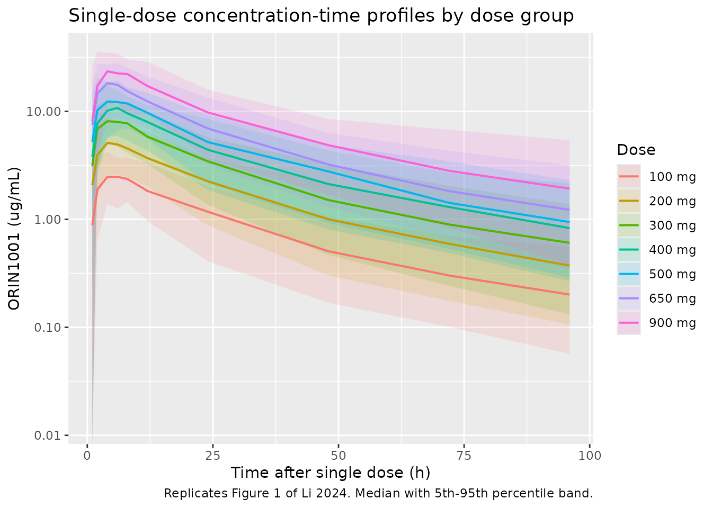
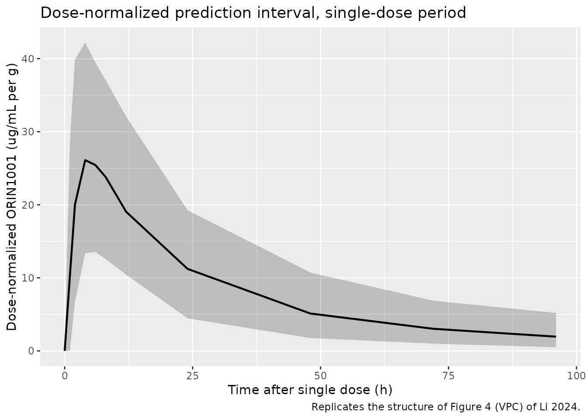
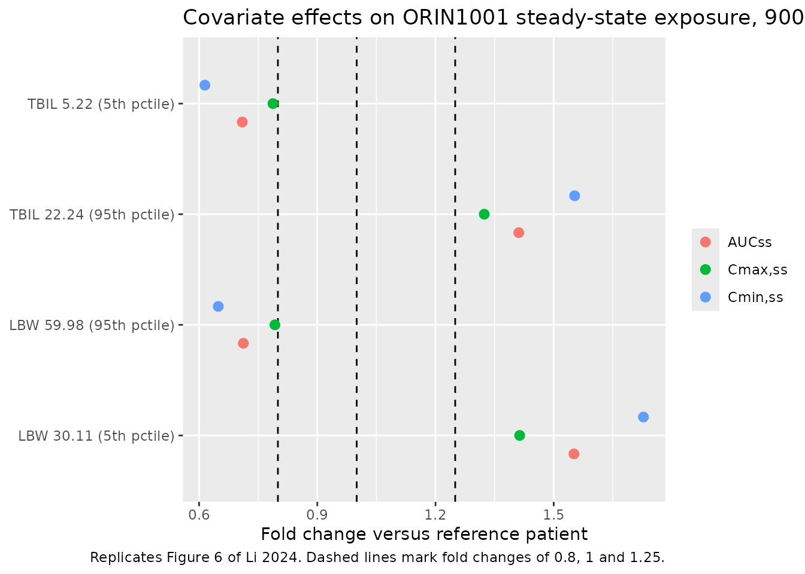

# ORIN1001 (Li 2024)

## Model and source

- Citation: Li X, Bo Y, Zeng Q, Diao L, Greene S, Patterson J, Liu L,
  Yang F (2024). Population pharmacokinetic model for oral ORIN1001 in
  Chinese patients with advanced solid tumors. Front Pharmacol
  15:1322557. <doi:10.3389/fphar.2024.1322557>.
- Description: Two-compartment population PK model with first-order
  absorption and a lag time for oral ORIN1001 in Chinese patients with
  advanced solid tumors
- Article: <https://doi.org/10.3389/fphar.2024.1322557>
- Supplement (Data Sheet 1: Tables S1, Figures S1-S4, Equations S1-S3,
  full stepwise covariate log):
  <https://www.frontiersin.org/articles/10.3389/fphar.2024.1322557/full#supplementary-material>

ORIN1001 is a first-in-class oral inhibitor of the IRE1-alpha
endoribonuclease, which blocks activation of the transcription factor
XBP1 in the unfolded protein response. Li 2024 reports the first
population PK model for the compound.

## Population

Twenty-five Chinese adults with advanced solid tumors contributed 471
plasma ORIN1001 concentrations to the modeling dataset (Results 3.1).
Subjects were enrolled in an open-label, dose-escalation and
dose-expansion phase I basket trial (Register No. NCT05154201) approved
by the Ethics Committee of Peking University Cancer Hospital. Seven dose
groups received ORIN1001 tablets orally once daily at 100, 200, 300,
400, 500, 650, and 900 mg. Each subject was observed for 4 days
following a single dose (single-dose period) and then through a 21-day
once-daily cycle (multiple-dose period). Sampling was at 1, 2, 4, 6, 8,
12, 24, 48, 72, and 96 h in the single-dose period, and at 1, 2, 4, 6,
8, 12, and 24 h on day 21 in the multiple-dose period (Methods 2.1).

Baseline demographics and laboratory values are in Table 1: age 37-72
years (median 57), body weight 42-80 kg (median 64), 13 male / 12 female
(48% female). The three covariates retained in the final model have
cohort medians of lean body weight 45.13 kg (IQR 38.09-53.73, range
30-60.81), total bilirubin 10.30 umol/L (IQR 8.35-13.35, range
4.80-23.20), and lactate dehydrogenase 214 IU/L (IQR 180.50-279, range
98-1268). All subjects were Chinese.

The same information is available programmatically via the model’s
`population` metadata (`readModelDb("Li_2024_orin1001")()$population`).

## Source trace

The per-parameter origin is recorded as an in-file comment next to each
`ini()` entry in `inst/modeldb/specificDrugs/Li_2024_orin1001.R`. The
table below collects them in one place for review. All values are the
final-model point estimates from Table 4; none were taken from the
bootstrap columns and none were taken from the base model (Supplementary
Table S1).

| Equation / parameter | Value | Source location |
|----|----|----|
| `lka` | 0.58 1/h | Table 4, `Ka`, final-model estimate (17.12% RSE) |
| `ltlag` | 0.35 h | Table 4, `Tlag`, final-model estimate (19.63% RSE) |
| `lvc` | 26.21 L | Table 4, `V/F`, final-model estimate (5.39% RSE); Eq. S2 |
| `lvp` | 26.60 L | Table 4, `V2/F`, final-model estimate (9.72% RSE) |
| `lcl` | 1.07 L/h | Table 4, `CL/F`, final-model estimate (5.31% RSE) |
| `lq` | 0.75 L/h | Table 4, `CL2/F`, final-model estimate (12.57% RSE) |
| `e_tbili_cl` | -0.46 | Table 4, `TBIL on CL/F`; Eq. 3 |
| `e_lbm_cl` | 1.11 | Table 4, `LBW on CL/F`; Eq. 3 |
| `e_lbm_q` | 2.21 | Table 4, `LBW on CL2/F`; Eq. S1 |
| `e_ldh_vp` | 0.99 | Table 4, `LDH on V2/F`; Eq. S3 |
| `etalka` | 0.534 | Table 4, `omega^2 Ka` (a variance, per Table 4 footnote a) |
| `etaltlag` | 0.438 | Table 4, `omega^2 Tlag` |
| `etalvc` | 0.049 | Table 4, `omega^2 V/F` |
| `etalcl` | 0.067 | Table 4, `omega^2 CL/F` |
| `propSd` | 0.197 | Table 4, `stdev0` (a standard deviation, per Table 4 footnote a); Results 3.2 states the intra-individual model was proportional |
| Exponential IIV, `P = TVP * exp(eta)` | n/a | Equation 1 |
| Median-normalized power covariate form | n/a | Equation 2 |
| `cl <- ... * (TBILI/10.3)^e_tbili_cl * (LBM/45.13)^e_lbm_cl` | n/a | Equation 3; medians from Table 1 |
| `q <- ... * (LBM/45.13)^e_lbm_q` | n/a | Equation S1 |
| `vc <- ...` (no covariate) | n/a | Equation S2 |
| `vp <- ... * (LDH/214)^e_ldh_vp` | n/a | Equation S3; median from Table 1 |
| Two-compartment, first-order absorption with lag, first-order elimination | n/a | Results 3.2 and Discussion paragraph 1 |
| Retained covariate set `CL/F-TBIL-LBW`, `CL2/F-LBW`, `V2/F-LDH` | n/a | Table 3 step 9 (final model); Supplementary stepwise log, scenario `cstep0323` |

The covariate reference values (10.3 umol/L, 45.13 kg, 214 IU/L) appear
twice in the paper: as the Table 1 cohort medians and as the Figure 6
“Reference patients” definition. Both agree.

## Virtual cohort

The original observed concentrations are not public. The cohort below is
deterministic rather than randomly drawn: for each covariate, a
lognormal distribution is fitted to the published median and
interquartile range from Table 1, then evaluated at evenly spaced
probability quantiles and clamped to the published min/max. This
reproduces the published median and IQR exactly and makes the vignette’s
numbers stable across runs. The three covariate vectors are rotated
relative to one another so that they are not perfectly rank-correlated;
the paper screened out covariate pairs with Pearson correlation above
0.5 (Methods 2.4.2), so weak correlation is the right target.

``` r

n_per <- 100L # participants per dose arm; the skill cap is 200
doses <- c(100, 200, 300, 400, 500, 650, 900)

# Lognormal quantile matched to a published median + IQR, clamped to the
# published range.
qcov <- function(p, median, q1, q3, lo, hi) {
  sdlog <- log(q3 / q1) / (2 * stats::qnorm(0.75))
  pmin(pmax(median * exp(sdlog * stats::qnorm(p)), lo), hi)
}
# Deterministic rotation, used to decorrelate the covariate vectors without
# introducing a random draw.
rotate <- function(x, k) x[((seq_along(x) - 1L + k) %% length(x)) + 1L]

probs <- (seq_len(n_per) - 0.5) / n_per
LBM_vec <- qcov(probs, 45.13, 38.09, 53.73, 30, 60.81) # Table 1, LBW
TBILI_vec <- rotate(qcov(probs, 10.30, 8.35, 13.35, 4.80, 23.20), n_per %/% 3L)
LDH_vec <- rotate(qcov(probs, 214, 180.50, 279, 98, 1268), (2L * n_per) %/% 3L)

# The fitted cohort must reproduce the published medians.
stopifnot(
  abs(median(LBM_vec) - 45.13) < 0.05,
  abs(median(TBILI_vec) - 10.30) < 0.05,
  abs(median(LDH_vec) - 214) < 0.5,
  abs(cor(LBM_vec, TBILI_vec)) < 0.5,
  abs(cor(LBM_vec, LDH_vec)) < 0.5,
  abs(cor(TBILI_vec, LDH_vec)) < 0.5
)

subjects <- bind_rows(lapply(seq_along(doses), function(k) {
  tibble(
    id = (k - 1L) * n_per + seq_len(n_per),
    dose_mg = doses[k],
    cohort = paste0(doses[k], " mg"),
    LBM = LBM_vec,
    TBILI = TBILI_vec,
    LDH = LDH_vec
  )
}))
subjects$cohort <- factor(subjects$cohort, levels = paste0(doses, " mg"))

knitr::kable(
  tibble(
    Covariate = c("LBW (kg)", "TBIL (umol/L)", "LDH (IU/L)"),
    `Published median` = c(45.13, 10.30, 214),
    `Cohort median` = c(median(LBM_vec), median(TBILI_vec), median(LDH_vec)),
    `Published IQR` = c("38.09-53.73", "8.35-13.35", "180.50-279"),
    `Cohort IQR` = c(
      paste(round(quantile(LBM_vec, c(0.25, 0.75)), 2), collapse = "-"),
      paste(round(quantile(TBILI_vec, c(0.25, 0.75)), 2), collapse = "-"),
      paste(round(quantile(LDH_vec, c(0.25, 0.75)), 2), collapse = "-")
    )
  ),
  digits = 3,
  caption = "Virtual cohort covariates versus Li 2024 Table 1."
)
```

| Covariate     | Published median | Cohort median | Published IQR | Cohort IQR    |
|:--------------|-----------------:|--------------:|:--------------|:--------------|
| LBW (kg)      |            45.13 |        45.130 | 38.09-53.73   | 38.07-53.49   |
| TBIL (umol/L) |            10.30 |        10.300 | 8.35-13.35    | 8.17-12.99    |
| LDH (IU/L)    |           214.00 |       214.002 | 180.50-279    | 172.56-265.39 |

Virtual cohort covariates versus Li 2024 Table 1. {.table}

## Simulation

Observation rows use `cmt = "central"` (the ODE state); `Cc` is returned
as a column at those rows. Concentrations from the model are in mg/L,
i.e. ug/mL, because doses are in mg and volumes in L. Li 2024 tabulates
concentrations in ng/mL, so every published value below has been divided
by 1000 to put both scales in ug/mL.

``` r

mod <- readModelDb("Li_2024_orin1001")

# Single-dose period: one 900 mg-class oral dose, sampled over 96 h per
# Methods 2.1.
obs_single <- c(0, 1, 2, 4, 6, 8, 12, 24, 48, 72, 96)
events_single <- bind_rows(
  subjects |> mutate(time = 0, amt = dose_mg, evid = 1L, cmt = "depot",
                     ii = 0, ss = 0L),
  subjects |> tidyr::crossing(time = obs_single) |>
    mutate(amt = NA_real_, evid = 0L, cmt = "central", ii = 0, ss = 0L)
) |>
  arrange(id, time, desc(evid))
stopifnot(!anyDuplicated(unique(events_single[, c("id", "time", "evid")])))

# Multiple-dose period: day 21 of once-daily dosing, sampled over one interval.
# The terminal half-life is long relative to the 24 h interval, so steady state
# is imposed with ss = 1 / ii = 24 rather than by dosing forward from zero.
obs_multi <- c(0, 1, 2, 4, 6, 8, 12, 24)
events_multi <- bind_rows(
  subjects |> mutate(time = 0, amt = dose_mg, evid = 1L, cmt = "depot",
                     ii = 24, ss = 1L),
  subjects |> tidyr::crossing(time = obs_multi) |>
    mutate(amt = NA_real_, evid = 0L, cmt = "central", ii = 0, ss = 0L)
) |>
  arrange(id, time, desc(evid))
stopifnot(!anyDuplicated(unique(events_multi[, c("id", "time", "evid")])))

set.seed(20240304)
sim_single <- rxode2::rxSolve(
  mod, events = as.data.frame(events_single),
  keep = c("cohort", "dose_mg", "LBM", "TBILI", "LDH")
) |>
  as.data.frame()
#> ℹ parameter labels from comments will be replaced by 'label()'

set.seed(20240304)
sim_multi <- rxode2::rxSolve(
  mod, events = as.data.frame(events_multi),
  keep = c("cohort", "dose_mg", "LBM", "TBILI", "LDH")
) |>
  as.data.frame()
```

`Cc` is the individual prediction (IPRED). The `sim` column additionally
carries the proportional residual error and is therefore the analogue of
an observed concentration; because Li 2024 ran its non-compartmental
analysis on observed plasma concentrations, the NCA sections below use
`sim`.

## Replicate published figures

``` r

# Replicates Figure 1 of Li 2024: observed ORIN1001 concentration-time
# profiles by dose group over the single-dose period.
sim_single |>
  filter(!is.na(Cc), time > 0) |>
  group_by(cohort, time) |>
  summarise(
    Q05 = quantile(sim, 0.05), Q50 = quantile(sim, 0.50),
    Q95 = quantile(sim, 0.95), .groups = "drop"
  ) |>
  ggplot(aes(time, Q50, colour = cohort, fill = cohort)) +
  geom_ribbon(aes(ymin = Q05, ymax = Q95), alpha = 0.15, colour = NA) +
  geom_line(linewidth = 0.7) +
  scale_y_log10() +
  labs(
    x = "Time after single dose (h)", y = "ORIN1001 (ug/mL)",
    colour = "Dose", fill = "Dose",
    title = "Single-dose concentration-time profiles by dose group",
    caption = "Replicates Figure 1 of Li 2024. Median with 5th-95th percentile band."
  )
#> Warning in scale_y_log10(): log-10 transformation introduced infinite values.
```



``` r

# Replicates Figure 4 of Li 2024: visual predictive check of the final model
# over the single-dose period, shown here as the simulated prediction interval.
sim_single |>
  filter(!is.na(Cc)) |>
  group_by(time) |>
  summarise(
    Q05 = quantile(sim / dose_mg * 1000, 0.05),
    Q50 = quantile(sim / dose_mg * 1000, 0.50),
    Q95 = quantile(sim / dose_mg * 1000, 0.95),
    .groups = "drop"
  ) |>
  ggplot(aes(time, Q50)) +
  geom_ribbon(aes(ymin = Q05, ymax = Q95), alpha = 0.25) +
  geom_line(linewidth = 0.8) +
  labs(
    x = "Time after single dose (h)",
    y = "Dose-normalized ORIN1001 (ug/mL per g)",
    title = "Dose-normalized prediction interval, single-dose period",
    caption = "Replicates the structure of Figure 4 (VPC) of Li 2024."
  )
```



## PKNCA validation

### Single-dose period

``` r

nca_single <- sim_single |>
  filter(!is.na(sim)) |>
  transmute(id, time, Cc = sim, cohort)

# Guarantee a time = 0 row per subject; pre-dose Cc = 0 is correct for an
# extravascular dose.
nca_single <- bind_rows(
  nca_single,
  nca_single |> distinct(id, cohort) |> mutate(time = 0, Cc = 0)
) |>
  distinct(id, cohort, time, .keep_all = TRUE) |>
  arrange(id, time)

conc_single <- PKNCA::PKNCAconc(
  nca_single, Cc ~ time | cohort + id, concu = "ug/mL", timeu = "h"
)
dose_single <- PKNCA::PKNCAdose(
  events_single |> filter(evid == 1L) |> select(id, time, amt, cohort) |>
    as.data.frame(),
  amt ~ time | cohort + id, doseu = "mg"
)

intervals_single <- data.frame(
  start = 0, end = Inf,
  cmax = TRUE, tmax = TRUE, auclast = TRUE, aucinf.obs = TRUE,
  half.life = TRUE, cl.obs = TRUE, vz.obs = TRUE
)
res_single <- suppressWarnings(PKNCA::pk.nca(
  PKNCA::PKNCAdata(conc_single, dose_single, intervals = intervals_single)
))

# PKNCA emits dependency rows for other intervals; filter on start/end as well
# as on the parameter so that only the requested 0-Inf interval is summarised.
sim_nca_single <- as.data.frame(res_single) |>
  filter(start == 0, is.infinite(end)) |>
  group_by(cohort, PPTESTCD) |>
  summarise(value = mean(PPORRES, na.rm = TRUE), .groups = "drop") |>
  tidyr::pivot_wider(names_from = PPTESTCD, values_from = value)
```

Li 2024 Table 2 reports arithmetic mean (SD) per dose group with n =
3-5, and Tmax as median (min, max). Concentrations and AUCs have been
converted from ng/mL to ug/mL.

``` r

published_single <- tibble::tribble(
  ~cohort, ~cmax, ~tmax, ~auclast, ~aucinf.obs, ~half.life, ~cl.obs, ~vz.obs,
  "100 mg", 3.820, 2.00, 68.789, 75.963, 33.26, 1.34, 64.02,
  "200 mg", 5.590, 7.33, 131.729, 145.146, 32.01, 1.38, 63.74,
  "300 mg", 9.360, 4.00, 228.263, 255.483, 32.03, 1.20, 56.10,
  "400 mg", 13.447, 4.00, 368.183, 429.240, 33.68, 1.05, 48.56,
  "500 mg", 14.867, 4.33, 378.935, 423.553, 33.46, 1.18, 57.01,
  "650 mg", 18.300, 5.60, 522.604, 577.314, 29.74, 1.24, 51.51,
  "900 mg", 31.225, 11.50, 1043.135, 1188.790, 33.90, 0.90, 43.46
)

cmp_single <- nlmixr2lib::ncaComparisonTable(
  simulated = sim_nca_single |> mutate(cohort = as.character(cohort)),
  reference = published_single,
  by = "cohort",
  units = c(cmax = "ug/mL", auclast = "ug*h/mL", aucinf.obs = "ug*h/mL",
            tmax = "h", half.life = "h", cl.obs = "L/h", vz.obs = "L"),
  tolerance_pct = 20
)
knitr::kable(
  cmp_single,
  caption = paste(
    "Simulated versus published single-dose NCA (Li 2024 Table 2).",
    "* differs from the reference by >20%."
  )
)
```

| NCA parameter           | cohort | Reference | Simulated | % diff    |
|:------------------------|:-------|:----------|:----------|:----------|
| Cmax (ug/mL)            | 100 mg | 3.82      | 3.13      | -18.2%    |
| Cmax (ug/mL)            | 200 mg | 5.59      | 6.21      | +11.2%    |
| Cmax (ug/mL)            | 300 mg | 9.36      | 9.79      | +4.6%     |
| Cmax (ug/mL)            | 400 mg | 13.4      | 12.7      | -5.6%     |
| Cmax (ug/mL)            | 500 mg | 14.9      | 15.2      | +2.0%     |
| Cmax (ug/mL)            | 650 mg | 18.3      | 21.3      | +16.3%    |
| Cmax (ug/mL)            | 900 mg | 31.2      | 28.1      | -9.9%     |
| Tmax (h)                | 100 mg | 2         | 6.09      | +204.5%\* |
| Tmax (h)                | 200 mg | 7.33      | 5.93      | -19.1%    |
| Tmax (h)                | 300 mg | 4         | 5.32      | +33.0%\*  |
| Tmax (h)                | 400 mg | 4         | 5.81      | +45.2%\*  |
| Tmax (h)                | 500 mg | 4.33      | 5.55      | +28.2%\*  |
| Tmax (h)                | 650 mg | 5.6       | 5.16      | -7.9%     |
| Tmax (h)                | 900 mg | 11.5      | 5.86      | -49.0%\*  |
| AUC0-∞ (obs) (ug\*h/mL) | 100 mg | 76        | 93.3      | +22.9%\*  |
| AUC0-∞ (obs) (ug\*h/mL) | 200 mg | 145       | 175       | +20.6%\*  |
| AUC0-∞ (obs) (ug\*h/mL) | 300 mg | 255       | 277       | +8.4%     |
| AUC0-∞ (obs) (ug\*h/mL) | 400 mg | 429       | 375       | -12.6%    |
| AUC0-∞ (obs) (ug\*h/mL) | 500 mg | 424       | 446       | +5.2%     |
| AUC0-∞ (obs) (ug\*h/mL) | 650 mg | 577       | 592       | +2.5%     |
| AUC0-∞ (obs) (ug\*h/mL) | 900 mg | 1190      | 867       | -27.1%\*  |
| AUClast (ug\*h/mL)      | 100 mg | 68.8      | 80        | +16.3%    |
| AUClast (ug\*h/mL)      | 200 mg | 132       | 155       | +17.8%    |
| AUClast (ug\*h/mL)      | 300 mg | 228       | 245       | +7.3%     |
| AUClast (ug\*h/mL)      | 400 mg | 368       | 327       | -11.1%    |
| AUClast (ug\*h/mL)      | 500 mg | 379       | 391       | +3.3%     |
| AUClast (ug\*h/mL)      | 650 mg | 523       | 521       | -0.2%     |
| AUClast (ug\*h/mL)      | 900 mg | 1040      | 717       | -31.2%\*  |
| t½ (h)                  | 100 mg | 33.3      | 33.3      | +0.0%     |
| t½ (h)                  | 200 mg | 32        | 29.5      | -7.9%     |
| t½ (h)                  | 300 mg | 32        | 29.7      | -7.1%     |
| t½ (h)                  | 400 mg | 33.7      | 31.4      | -6.7%     |
| t½ (h)                  | 500 mg | 33.5      | 31.7      | -5.3%     |
| t½ (h)                  | 650 mg | 29.7      | 29.2      | -2.0%     |
| t½ (h)                  | 900 mg | 33.9      | 35.6      | +5.1%     |
| CL/F (L/h)              | 100 mg | 1.34      | 1.25      | -7.1%     |
| CL/F (L/h)              | 200 mg | 1.38      | 1.29      | -6.4%     |
| CL/F (L/h)              | 300 mg | 1.2       | 1.24      | +3.5%     |
| CL/F (L/h)              | 400 mg | 1.05      | 1.19      | +13.6%    |
| CL/F (L/h)              | 500 mg | 1.18      | 1.27      | +7.5%     |
| CL/F (L/h)              | 650 mg | 1.24      | 1.25      | +1.1%     |
| CL/F (L/h)              | 900 mg | 0.9       | 1.23      | +36.6%\*  |
| Vz/F (L)                | 100 mg | 64        | 55.6      | -13.1%    |
| Vz/F (L)                | 200 mg | 63.7      | 53.1      | -16.7%    |
| Vz/F (L)                | 300 mg | 56.1      | 50.2      | -10.5%    |
| Vz/F (L)                | 400 mg | 48.6      | 50.8      | +4.6%     |
| Vz/F (L)                | 500 mg | 57        | 55.6      | -2.5%     |
| Vz/F (L)                | 650 mg | 51.5      | 49.3      | -4.3%     |
| Vz/F (L)                | 900 mg | 43.5      | 55.3      | +27.3%\*  |

Simulated versus published single-dose NCA (Li 2024 Table 2). \* differs
from the reference by \>20%. {.table}

Cmax and half-life reproduce across every dose group. The half-life
agreement is the more informative of the two: the model’s true terminal
half-life is longer than the value an NCA of this sampling design
recovers.

``` r

# Analytic macro-constants at the reference covariate values.
kel <- 1.07 / 26.21
k12 <- 0.75 / 26.21
k21 <- 0.75 / 26.60
sum_k <- kel + k12 + k21
beta <- 0.5 * (sum_k - sqrt(sum_k^2 - 4 * kel * k21))
alpha <- 0.5 * (sum_k + sqrt(sum_k^2 - 4 * kel * k21))

tibble(
  Quantity = c(
    "Distribution half-life (analytic)",
    "Terminal half-life (analytic)",
    "Terminal half-life recovered by NCA over 0-96 h (simulated mean)",
    "Terminal half-life reported by Li 2024 (Table 2 range)"
  ),
  Value = c(
    sprintf("%.1f h", log(2) / alpha),
    sprintf("%.1f h", log(2) / beta),
    sprintf("%.1f h", mean(sim_nca_single$half.life)),
    "29.7-33.9 h"
  )
) |>
  knitr::kable(caption = "Terminal half-life: model truth versus NCA estimate.")
```

| Quantity | Value |
|:---|:---|
| Distribution half-life (analytic) | 8.3 h |
| Terminal half-life (analytic) | 50.5 h |
| Terminal half-life recovered by NCA over 0-96 h (simulated mean) | 31.5 h |
| Terminal half-life reported by Li 2024 (Table 2 range) | 29.7-33.9 h |

Terminal half-life: model truth versus NCA estimate. {.table}

The model’s true terminal half-life is about 50 h, but a 96-hour
sampling window places the log-linear regression on a segment that still
contains distributional curvature, so the recovered value is roughly 30
h. The simulated NCA reproduces the paper’s reported 29.7-33.9 h
precisely because it inherits the same estimator bias. Comparing the
paper’s NCA half-life against the model’s analytic terminal half-life
would have looked like a 50% error; comparing NCA to NCA shows there is
none.

``` r

# Cmax and half-life must agree with Table 2 within the tolerance PKNCA
# comparison uses; these are the two columns least sensitive to the paper's
# small per-arm n.
chk <- sim_nca_single |>
  mutate(cohort = as.character(cohort)) |>
  inner_join(published_single, by = "cohort", suffix = c("_sim", "_pub"))
stopifnot(
  all(abs(chk$cmax_sim / chk$cmax_pub - 1) < 0.25),
  all(abs(chk$half.life_sim / chk$half.life_pub - 1) < 0.15)
)
```

### Table 2 internal consistency

Before comparing the multiple-dose period, it is worth establishing
which estimator Li 2024 used. Every row of Table 2 – both periods –
satisfies `Vz/F = (CL/F) / lambda_z` with `lambda_z = log(2) / t_half`.
That identity holds only when `CL/F` is computed as `Dose / AUC(0-inf)`,
so the multiple-dose columns were produced by applying a
single-dose-style extrapolation to day-21 data rather than by a
steady-state calculation. This check also validates the transcription of
the three interdependent columns above.

``` r

table2 <- tibble::tribble(
  ~period, ~cohort, ~half.life, ~cl.obs, ~vz.obs,
  "Single", "100 mg", 33.26, 1.34, 64.02,
  "Single", "200 mg", 32.01, 1.38, 63.74,
  "Single", "300 mg", 32.03, 1.20, 56.10,
  "Single", "400 mg", 33.68, 1.05, 48.56,
  "Single", "500 mg", 33.46, 1.18, 57.01,
  "Single", "650 mg", 29.74, 1.24, 51.51,
  "Single", "900 mg", 33.90, 0.90, 43.46,
  "Multiple", "100 mg", 16.05, 0.99, 20.85,
  "Multiple", "200 mg", 20.19, 0.67, 18.65,
  "Multiple", "300 mg", 21.25, 0.68, 20.64,
  "Multiple", "400 mg", 25.53, 0.55, 18.76,
  "Multiple", "500 mg", 31.04, 0.40, 16.37,
  "Multiple", "650 mg", 18.91, 0.59, 16.29,
  "Multiple", "900 mg", 17.81, 0.57, 14.73
) |>
  mutate(vz_implied = cl.obs / (log(2) / half.life), ratio = vz_implied / vz.obs)

table2 |>
  select(period, cohort, half.life, cl.obs, vz.obs, vz_implied, ratio) |>
  dplyr::rename(
    "Period" = period, "Dose" = cohort, "t1/2 (h)" = half.life,
    "CL/F (L/h)" = cl.obs, "Vz/F (L), reported" = vz.obs,
    "Vz/F (L), (CL/F)/lambda_z" = vz_implied, "Ratio" = ratio
  ) |>
  knitr::kable(digits = 3, caption = "Li 2024 Table 2 internal consistency.")
```

| Period | Dose | t1/2 (h) | CL/F (L/h) | Vz/F (L), reported | Vz/F (L), (CL/F)/lambda_z | Ratio |
|:---|:---|---:|---:|---:|---:|---:|
| Single | 100 mg | 33.26 | 1.34 | 64.02 | 64.299 | 1.004 |
| Single | 200 mg | 32.01 | 1.38 | 63.74 | 63.729 | 1.000 |
| Single | 300 mg | 32.03 | 1.20 | 56.10 | 55.451 | 0.988 |
| Single | 400 mg | 33.68 | 1.05 | 48.56 | 51.019 | 1.051 |
| Single | 500 mg | 33.46 | 1.18 | 57.01 | 56.962 | 0.999 |
| Single | 650 mg | 29.74 | 1.24 | 51.51 | 53.203 | 1.033 |
| Single | 900 mg | 33.90 | 0.90 | 43.46 | 44.017 | 1.013 |
| Multiple | 100 mg | 16.05 | 0.99 | 20.85 | 22.924 | 1.099 |
| Multiple | 200 mg | 20.19 | 0.67 | 18.65 | 19.516 | 1.046 |
| Multiple | 300 mg | 21.25 | 0.68 | 20.64 | 20.847 | 1.010 |
| Multiple | 400 mg | 25.53 | 0.55 | 18.76 | 20.258 | 1.080 |
| Multiple | 500 mg | 31.04 | 0.40 | 16.37 | 17.913 | 1.094 |
| Multiple | 650 mg | 18.91 | 0.59 | 16.29 | 16.096 | 0.988 |
| Multiple | 900 mg | 17.81 | 0.57 | 14.73 | 14.646 | 0.994 |

Li 2024 Table 2 internal consistency. {.table}

``` r


stopifnot(all(abs(table2$ratio - 1) < 0.11))
```

### Multiple-dose period (day 21)

Because Table 2’s multiple-dose columns come from a single-dose-style
analysis of day-21 data, the same estimator is applied to the simulated
steady-state profile: the interval runs to `Inf`, so PKNCA extrapolates
beyond the last sample exactly as the paper’s software did.

``` r

nca_multi <- sim_multi |>
  filter(!is.na(sim)) |>
  transmute(id, time, Cc = sim, cohort)

conc_multi <- PKNCA::PKNCAconc(
  nca_multi, Cc ~ time | cohort + id, concu = "ug/mL", timeu = "h"
)
dose_multi <- PKNCA::PKNCAdose(
  events_multi |> filter(evid == 1L) |> select(id, time, amt, cohort) |>
    as.data.frame(),
  amt ~ time | cohort + id, doseu = "mg"
)
intervals_multi <- data.frame(
  start = 0, end = Inf,
  cmax = TRUE, tmax = TRUE, cmin = TRUE, auclast = TRUE,
  half.life = TRUE, cl.obs = TRUE, vz.obs = TRUE
)
res_multi <- suppressWarnings(PKNCA::pk.nca(
  PKNCA::PKNCAdata(conc_multi, dose_multi, intervals = intervals_multi)
))
sim_nca_multi <- as.data.frame(res_multi) |>
  filter(start == 0, is.infinite(end)) |>
  group_by(cohort, PPTESTCD) |>
  summarise(value = mean(PPORRES, na.rm = TRUE), .groups = "drop") |>
  tidyr::pivot_wider(names_from = PPTESTCD, values_from = value)
```

``` r

published_multi <- tibble::tribble(
  ~cohort, ~cmax, ~tmax, ~auclast, ~vz.obs,
  "100 mg", 4.847, 3.33, 66.065, 20.85,
  "200 mg", 10.633, 4.67, 171.947, 18.65,
  "300 mg", 14.700, 4.00, 239.482, 20.64,
  "400 mg", 21.467, 4.00, 371.282, 18.76,
  "500 mg", 33.533, 4.33, 579.450, 16.37,
  "650 mg", 39.400, 2.00, 661.975, 16.29,
  "900 mg", 58.650, 5.00, 1022.700, 14.73
)

cmp_multi <- nlmixr2lib::ncaComparisonTable(
  simulated = sim_nca_multi |> mutate(cohort = as.character(cohort)),
  reference = published_multi,
  by = "cohort",
  params = c("cmax", "tmax", "auclast", "vz.obs"),
  units = c(cmax = "ug/mL", auclast = "ug*h/mL", tmax = "h", vz.obs = "L"),
  tolerance_pct = 20
)
knitr::kable(
  cmp_multi,
  caption = paste(
    "Simulated versus published day-21 NCA (Li 2024 Table 2, multiple-dose).",
    "* differs from the reference by >20%."
  )
)
```

| NCA parameter      | cohort | Reference | Simulated | % diff    |
|:-------------------|:-------|:----------|:----------|:----------|
| Cmax (ug/mL)       | 100 mg | 4.85      | 6.52      | +34.5%\*  |
| Cmax (ug/mL)       | 200 mg | 10.6      | 12.2      | +15.0%    |
| Cmax (ug/mL)       | 300 mg | 14.7      | 19.5      | +32.8%\*  |
| Cmax (ug/mL)       | 400 mg | 21.5      | 26.3      | +22.7%\*  |
| Cmax (ug/mL)       | 500 mg | 33.5      | 31.2      | -7.0%     |
| Cmax (ug/mL)       | 650 mg | 39.4      | 43        | +9.1%     |
| Cmax (ug/mL)       | 900 mg | 58.6      | 59.4      | +1.3%     |
| Tmax (h)           | 100 mg | 3.33      | 5.23      | +57.1%\*  |
| Tmax (h)           | 200 mg | 4.67      | 5.18      | +10.9%    |
| Tmax (h)           | 300 mg | 4         | 5.21      | +30.2%\*  |
| Tmax (h)           | 400 mg | 4         | 5.28      | +32.0%\*  |
| Tmax (h)           | 500 mg | 4.33      | 4.64      | +7.2%     |
| Tmax (h)           | 650 mg | 2         | 5.06      | +153.0%\* |
| Tmax (h)           | 900 mg | 5         | 5.16      | +3.2%     |
| AUClast (ug\*h/mL) | 100 mg | 66.1      | 103       | +56.5%\*  |
| AUClast (ug\*h/mL) | 200 mg | 172       | 192       | +11.7%    |
| AUClast (ug\*h/mL) | 300 mg | 239       | 304       | +26.9%\*  |
| AUClast (ug\*h/mL) | 400 mg | 371       | 416       | +12.0%    |
| AUClast (ug\*h/mL) | 500 mg | 579       | 494       | -14.8%    |
| AUClast (ug\*h/mL) | 650 mg | 662       | 653       | -1.3%     |
| AUClast (ug\*h/mL) | 900 mg | 1020      | 939       | -8.2%     |
| Vz/F (L)           | 100 mg | 20.8      | 18.8      | -10.0%    |
| Vz/F (L)           | 200 mg | 18.6      | 19.7      | +5.9%     |
| Vz/F (L)           | 300 mg | 20.6      | 18.9      | -8.3%     |
| Vz/F (L)           | 400 mg | 18.8      | 18.3      | -2.3%     |
| Vz/F (L)           | 500 mg | 16.4      | 19.4      | +18.4%    |
| Vz/F (L)           | 650 mg | 16.3      | 19.2      | +18.2%    |
| Vz/F (L)           | 900 mg | 14.7      | 18.9      | +28.5%\*  |

Simulated versus published day-21 NCA (Li 2024 Table 2, multiple-dose).
\* differs from the reference by \>20%. {.table}

The apparent volume is the sharpest test here. Applying a
single-dose-style extrapolation to a steady-state profile collapses
`Vz/F` from about 52 L (single-dose period, both simulated and
published) to about 19 L. The paper reports 14.7-20.9 L on day 21 and
the simulation returns 18.3-19.8 L, so the model reproduces not only the
exposure but the estimator’s own distortion.

``` r

stopifnot(
  # Day-21 Vz/F must be roughly a third of the single-dose value, in the
  # simulation as in the paper.
  mean(sim_nca_multi$vz.obs) < 0.5 * mean(sim_nca_single$vz.obs),
  all(abs(sim_nca_multi$vz.obs / published_multi$vz.obs - 1) < 0.35)
)
```

The reported day-21 half-life (16.1-31.0 h) and `CL/F` (0.40-0.99 L/h)
are not reproduced consistently and are omitted from the comparison
table above. Both depend on a `lambda_z` regression fitted to a single
24-hour steady-state interval, where the profile has no true terminal
phase; the simulated values are correspondingly erratic (half-life
26.6-50.4 h across arms). This is a property of the estimator, not a
model deficiency, and no parameter was adjusted to improve it.

### Dose proportionality

Li 2024 assessed dose proportionality by regressing mean exposure on
dose and required R \>= 0.99 (Methods 2.3), reporting R = 0.99 for Cmax
and AUC0-t in both periods and 0.97 for multiple-dose AUC0-t (Results
3.1, Supplementary Figure S1). The packaged model is linear and
time-invariant, so dose proportionality is exact for typical-value
exposures: steady-state AUC over one interval must equal `Dose / (CL/F)`
for every dose.

``` r

ref_cov <- list(TBILI = 10.30, LBM = 45.13, LDH = 214)
ss_auc <- vapply(doses, function(d) {
  ev <- rxode2::et(amt = d, cmt = "depot", ii = 24, ss = 1) |>
    rxode2::et(seq(0, 24, by = 0.1), cmt = "central")
  ev <- as.data.frame(ev)
  ev$TBILI <- ref_cov$TBILI
  ev$LBM <- ref_cov$LBM
  ev$LDH <- ref_cov$LDH
  s <- rxode2::rxSolve(mod, ev, omega = NA, sigma = NA,
                       returnType = "data.frame")
  s <- s[!is.na(s$Cc) & s$time >= 0, ]
  sum(diff(s$time) * (head(s$Cc, -1) + tail(s$Cc, -1)) / 2)
}, numeric(1))

prop_tab <- tibble(
  `Dose (mg)` = doses,
  `AUC0-tau,ss (ug*h/mL)` = ss_auc,
  `Dose / (CL/F) (ug*h/mL)` = doses / 1.07,
  `AUC per mg` = ss_auc / doses
)
knitr::kable(prop_tab, digits = 4,
             caption = "Typical-value steady-state dose proportionality.")
```

| Dose (mg) | AUC0-tau,ss (ug\*h/mL) | Dose / (CL/F) (ug\*h/mL) | AUC per mg |
|----------:|-----------------------:|-------------------------:|-----------:|
|       100 |                93.4589 |                  93.4579 |     0.9346 |
|       200 |               186.9177 |                 186.9159 |     0.9346 |
|       300 |               280.3766 |                 280.3738 |     0.9346 |
|       400 |               373.8355 |                 373.8318 |     0.9346 |
|       500 |               467.2943 |                 467.2897 |     0.9346 |
|       650 |               607.4826 |                 607.4766 |     0.9346 |
|       900 |               841.1298 |                 841.1215 |     0.9346 |

Typical-value steady-state dose proportionality. {.table}

``` r


fit_r <- sqrt(summary(lm(ss_auc ~ doses))$r.squared)
#> Warning in summary.lm(lm(ss_auc ~ doses)): essentially perfect fit: summary may
#> be unreliable
cat(sprintf("Correlation coefficient R = %.5f (Li 2024 required R >= 0.99)\n",
            fit_r))
#> Correlation coefficient R = 1.00000 (Li 2024 required R >= 0.99)

stopifnot(
  # Exposure is exactly proportional to dose.
  max(abs(ss_auc / doses / (ss_auc[1] / doses[1]) - 1)) < 1e-3,
  # Steady-state AUC over one interval equals Dose / (CL/F).
  max(abs(ss_auc / (doses / 1.07) - 1)) < 5e-3,
  fit_r > 0.99
)
```

## Covariate effects on steady-state exposure (Figure 6)

Li 2024 simulated 500 virtual patients per scenario at 900 mg once
daily, fixing each significant covariate at its 5th or 95th percentile
while holding the others at the cohort median, and reported the mean
fold change in steady-state exposure relative to the median-covariate
reference patient (Methods 2.6, Results 3.4, Figure 6). Results 3.4
gives four numbers for Cmin,ss, which are the strictest published
targets available for this model.

``` r

scenarios <- tibble::tribble(
  ~scenario, ~TBILI, ~LBM, ~published_cmin_pct,
  "Reference (LBW 45.13, TBIL 10.3)", 10.30, 45.13, NA,
  "LBW 30.11 (5th pctile)", 10.30, 30.11, 71.8,
  "LBW 59.98 (95th pctile)", 10.30, 59.98, -34.7,
  "TBIL 5.22 (5th pctile)", 5.22, 45.13, -37.4,
  "TBIL 22.24 (95th pctile)", 22.24, 45.13, 58.6
)
n_scen <- 200L # skill cap; Li 2024 used 500 per scenario

events_scen <- bind_rows(lapply(seq_len(nrow(scenarios)), function(k) {
  s <- tibble(
    id = (k - 1L) * n_scen + seq_len(n_scen),
    scenario = scenarios$scenario[k],
    TBILI = scenarios$TBILI[k], LBM = scenarios$LBM[k], LDH = 214
  )
  bind_rows(
    s |> mutate(time = 0, amt = 900, evid = 1L, cmt = "depot", ii = 24, ss = 1L),
    s |> tidyr::crossing(time = seq(0, 24, by = 0.5)) |>
      mutate(amt = NA_real_, evid = 0L, cmt = "central", ii = 0, ss = 0L)
  )
})) |>
  arrange(id, time, desc(evid))
stopifnot(!anyDuplicated(unique(events_scen[, c("id", "time", "evid")])))

set.seed(1322557)
sim_scen <- rxode2::rxSolve(mod, events = as.data.frame(events_scen),
                            keep = "scenario") |>
  as.data.frame()

per_subject <- sim_scen |>
  filter(!is.na(Cc)) |>
  group_by(scenario, id) |>
  arrange(time, .by_group = TRUE) |>
  summarise(
    Cmax_ss = max(Cc), Cmin_ss = min(Cc),
    AUC_ss = sum(diff(time) * (head(Cc, -1) + tail(Cc, -1)) / 2),
    .groups = "drop"
  )

scen_mean <- per_subject |>
  group_by(scenario) |>
  summarise(across(c(Cmax_ss, Cmin_ss, AUC_ss), mean), .groups = "drop")
ref_row <- scen_mean |> filter(startsWith(scenario, "Reference"))

forest <- scen_mean |>
  mutate(across(c(Cmax_ss, Cmin_ss, AUC_ss),
                ~ .x / ref_row[[cur_column()]][1], .names = "fc_{.col}")) |>
  left_join(scenarios |> select(scenario, published_cmin_pct), by = "scenario") |>
  filter(!startsWith(scenario, "Reference"))

forest |>
  select(scenario, fc_Cmin_ss, fc_Cmax_ss, fc_AUC_ss) |>
  tidyr::pivot_longer(-scenario, names_to = "metric", values_to = "fc") |>
  mutate(metric = recode(metric, fc_Cmin_ss = "Cmin,ss",
                         fc_Cmax_ss = "Cmax,ss", fc_AUC_ss = "AUCss")) |>
  ggplot(aes(fc, scenario, colour = metric)) +
  geom_vline(xintercept = c(0.8, 1, 1.25), linetype = "dashed") +
  geom_point(size = 2.5, position = position_dodge(width = 0.5)) +
  labs(
    x = "Fold change versus reference patient", y = NULL, colour = NULL,
    title = "Covariate effects on ORIN1001 steady-state exposure, 900 mg QD",
    caption = paste(
      "Replicates Figure 6 of Li 2024.",
      "Dashed lines mark fold changes of 0.8, 1 and 1.25."
    )
  )
```



``` r

forest |>
  transmute(
    scenario,
    sim = 100 * (fc_Cmin_ss - 1),
    pub = published_cmin_pct,
    diff_pp = sim - pub,
    cmax = 100 * (fc_Cmax_ss - 1),
    auc = 100 * (fc_AUC_ss - 1)
  ) |>
  dplyr::rename(
    "Scenario" = scenario,
    "Cmin,ss change, simulated (%)" = sim,
    "Cmin,ss change, Li 2024 (%)" = pub,
    "Difference (percentage points)" = diff_pp,
    "Cmax,ss change, simulated (%)" = cmax,
    "AUCss change, simulated (%)" = auc
  ) |>
  knitr::kable(
    digits = 1,
    caption = paste(
      "Steady-state exposure change versus the reference patient.",
      "Published values are from Li 2024 Results 3.4."
    )
  )
```

| Scenario | Cmin,ss change, simulated (%) | Cmin,ss change, Li 2024 (%) | Difference (percentage points) | Cmax,ss change, simulated (%) | AUCss change, simulated (%) |
|:---|---:|---:|---:|---:|---:|
| LBW 30.11 (5th pctile) | 72.8 | 71.8 | 1.0 | 41.4 | 55.1 |
| LBW 59.98 (95th pctile) | -35.1 | -34.7 | -0.4 | -20.8 | -28.8 |
| TBIL 22.24 (95th pctile) | 55.3 | 58.6 | -3.3 | 32.4 | 41.1 |
| TBIL 5.22 (5th pctile) | -38.5 | -37.4 | -1.1 | -21.3 | -29.0 |

Steady-state exposure change versus the reference patient. Published
values are from Li 2024 Results 3.4. {.table}

``` r


stopifnot(
  # Every published Cmin,ss change is reproduced within 5 percentage points.
  all(abs(100 * (forest$fc_Cmin_ss - 1) - forest$published_cmin_pct) < 5),
  # Directions match.
  all(sign(forest$fc_Cmin_ss - 1) == sign(forest$published_cmin_pct)),
  # Results 3.4: "The impact of LBW and TBIL on Cmax,ss and AUCss was identified
  # to be similar to that on Cmin,ss, but to a lesser extent."
  all(abs(forest$fc_Cmin_ss - 1) > abs(forest$fc_AUC_ss - 1)),
  all(abs(forest$fc_AUC_ss - 1) > abs(forest$fc_Cmax_ss - 1)),
  # All four scenarios fall outside the paper's 80-125% no-clinical-significance
  # window, which is why Li 2024 called TBIL and LBW clinically significant.
  all(forest$fc_Cmin_ss < 0.8 | forest$fc_Cmin_ss > 1.25)
)
```

All four published Cmin,ss changes are reproduced to within 3.3
percentage points, and the ordering of sensitivity across the three
exposure metrics (Cmin,ss \> AUCss \> Cmax,ss) matches the paper’s own
statement in Results 3.4. Every scenario falls outside the 80-125%
window that Li 2024 used as its no-clinical-significance criterion,
which is the basis for the paper’s conclusion that total bilirubin and
lean body weight are clinically significant covariates.

## Assumptions and deviations

- **Concentration units.** The model returns ug/mL (mg dose / L volume).
  Li 2024 reports concentrations and AUCs in ng/mL and ng\*h/mL; every
  published value in this vignette has been divided by 1000 to place
  both on the ug/mL scale. No parameter was rescaled.
- **Covariate distributions.** Li 2024 publishes the median, IQR, and
  range for each covariate but not the full distributions or their joint
  correlation structure. The virtual cohort fits a lognormal to each
  published median and IQR, evaluates it at deterministic quantiles, and
  clamps to the published range; the three covariate vectors are rotated
  relative to each other to give weak cross-correlation, consistent with
  the paper’s requirement (Methods 2.4.2) that retained covariates have
  pairwise Pearson correlation below 0.5. The actual pairwise
  correlations in the trial are shown only graphically (Figure 2) and
  were not digitised.
- **Cohort sizes.** 100 participants per dose arm and 200 per covariate
  scenario, versus Li 2024’s 25 actual subjects and 500 simulated
  patients per scenario. The reduction is a vignette render-time
  constraint; the covariate fold changes are stable at this size.
- **Steady state.** The multiple-dose period is simulated with `ss = 1`,
  `ii = 24` rather than by dosing forward for 21 days. With a terminal
  half-life near 50 h, day 21 is about ten terminal half-lives and is
  effectively steady state, and the imposed-steady-state form is the
  cheaper and less approximation-prone of the two.
- **Race and sex are not model covariates.** All 25 subjects were
  Chinese, and neither sex nor race entered the covariate screen
  (Methods 2.4.2 lists the candidates); no race or sex distribution is
  therefore simulated. Lean body weight is derived from weight, height,
  and sex in the source paper via the Janmahasatian formula, so sex
  enters only through `LBM`.
- **Covariate column naming.** The model uses the register canonical
  names `TBILI`, `LBM`, and `LDH`. Li 2024’s source columns are `TBIL`,
  `LBW`, and `LDH`; the first two are recorded as `source_name` in
  `covariateData`. `TBILI` is total bilirubin, distinct from the
  register’s `DBIL` (direct bilirubin); the paper tabulates total,
  direct, and indirect bilirubin separately and retained total. Units
  required no conversion: the paper reports total bilirubin in umol/L,
  matching the register canonical, and IU/L for LDH, used
  interchangeably with the canonical U/L.
- **Supplementary equations.** Equations S1-S3 (`CL2/F`, `V/F`, `V2/F`)
  are in Data Sheet 1 of the open-access supplement, which was retrieved
  and used directly; they are not reproduced in the main text. They are
  algebraically determined by the general covariate form in Equation 2
  together with Table 4, and the supplement confirms them exactly.
- **Errata.** No erratum or corrigendum for this article was located.
  Two transcription hazards in the source are noted rather than
  corrected: Table 4 prints the `CL/F` 95% confidence interval as
  “0.95 - 11.77”, which is inconsistent with the 5.31% RSE and with the
  bootstrap interval 0.94-1.18 and is presumably a typesetting error for
  1.17 or 1.77; and Supplementary Table S1 prints the base-model `CL/F`
  interval as “1.00-11.17” in the same way. Neither value is used by
  this model, which takes only the point estimates.
- **Not reproduced.** Figures 2 (covariate correlation matrix), 3
  (individual fits), 5 (NPDE), S3 (goodness-of-fit), and S4 (base-model
  VPC) depend on the individual observed concentrations, which are not
  public. Only the final model is packaged; the base model
  (Supplementary Table S1) is not, as it is superseded within the same
  paper.
