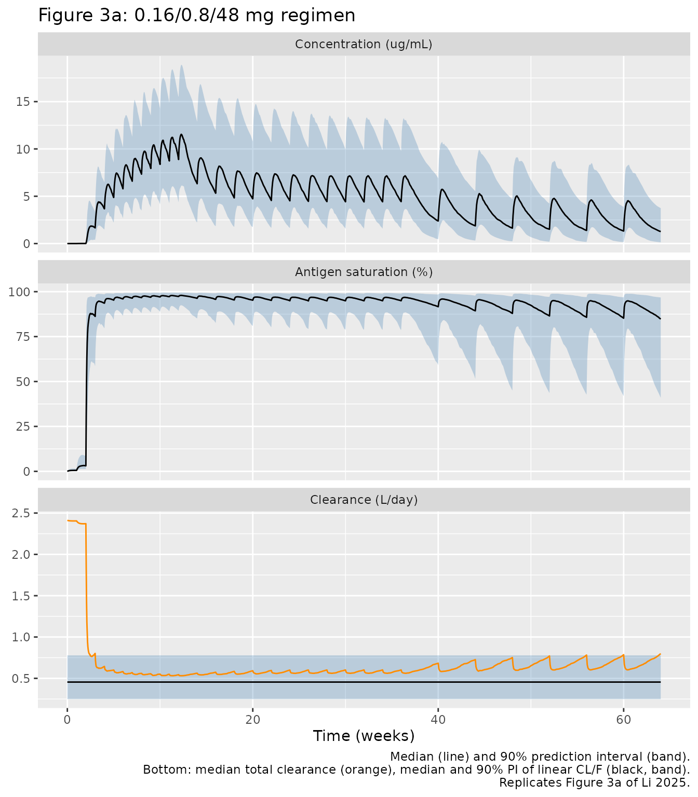
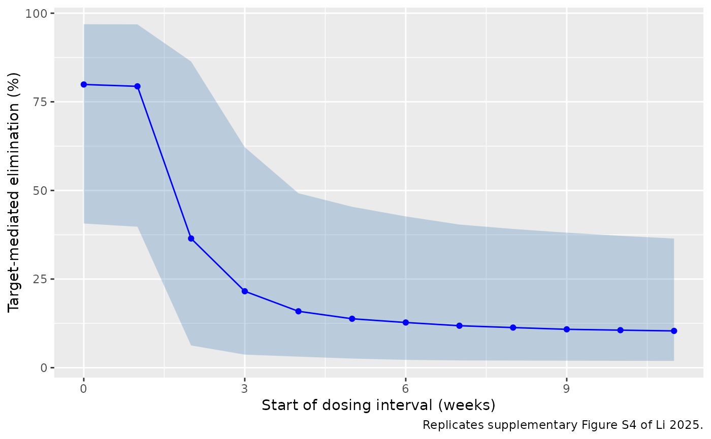
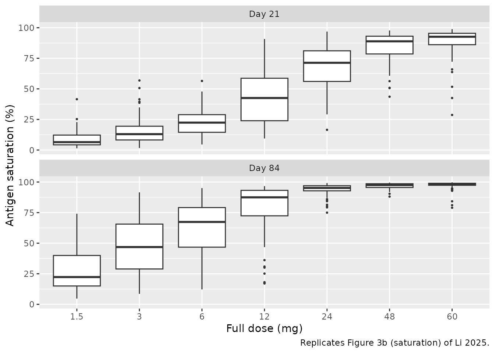
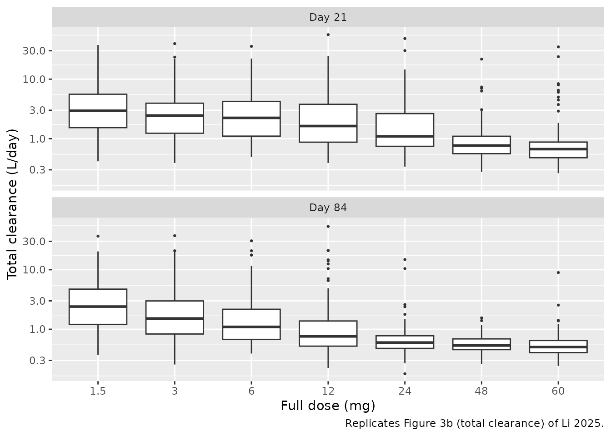
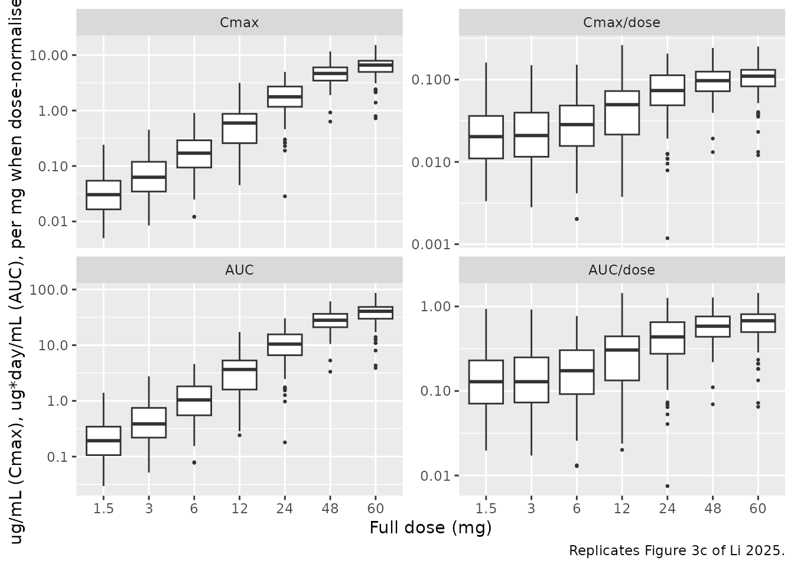

# Epcoritamab (Li 2025)

## Model and source

- Citation: Li T, Gibiansky L, Parikh A, van der Linden M, Sanghavi K,
  Putnins M, Sacchi M, Feng H, Ahmadi T, Gupta M, Xu S. Population
  Pharmacokinetics of Epcoritamab Following Subcutaneous Administration
  in Relapsed or Refractory B Cell Non-Hodgkin Lymphoma. Clin
  Pharmacokinet. 2025;64(1):127-141. <doi:10.1007/s40262-024-01464-2>
- Description: Two-compartment quasi-steady-state (QSS) target-mediated
  drug disposition population PK model with first-order subcutaneous
  absorption and constant total target for epcoritamab (CD3xCD20
  bispecific antibody) in adults with relapsed or refractory B cell
  non-Hodgkin lymphoma (Li 2025). Body weight (reference 75 kg) scales
  CL/F, Q/F, Vc/F and Vp/F by power laws, age (reference 65 years)
  lowers ka, and the combined additive + proportional residual error
  carries a per-subject random effect on its magnitude.
- Article: <https://doi.org/10.1007/s40262-024-01464-2>

Epcoritamab is a subcutaneously administered CD3xCD20 bispecific IgG1
antibody. Li et al. pooled the EPCORE NHL-1 (NCT03625037) and EPCORE
NHL-3 (NCT04542824) phase 1/2 trials and described the plasma
concentrations with a quasi-steady-state (QSS) approximation of a
two-compartment target-mediated drug disposition (TMDD) model with
first-order absorption from the injection site and a constant total
target concentration (`BASE`). The model equations are in supplementary
Fig. S1 and the final estimates in Table 2.

## Population

The analysis data set held 6819 quantifiable concentrations from 327
adults with relapsed or refractory B cell non-Hodgkin lymphoma (Section
3.1, Table 1): 212 (64.8%) with large B cell lymphoma, 97 (29.7%) with
indolent B-NHL and 18 (5.5%) with mantle cell lymphoma. Median age was
67 years (range 20-89) and median body weight 70 kg (range 39-144);
40.4% were female. The cohort was 56.6% White, 30.3% Asian (all 60
EPCORE NHL-3 patients were Japanese), 0.3% Native American and 12.8%
other race. Most patients had mild (45.0%) or moderate (20.8%) renal
impairment by Cockcroft-Gault creatinine clearance, and 82.6% had normal
hepatic function. Subcutaneous doses spanned 0.004-60 mg; 298 patients
followed the approved regimen of step-up doses of 0.16 mg (cycle 1
day 1) and 0.8 mg (cycle 1 day 8) followed by 48 mg weekly in cycles
1-3, every 2 weeks in cycles 4-9 and every 4 weeks from cycle 10 (28-day
cycles).

The same information is available programmatically:

``` r

str(rxode2::rxode(readModelDb("Li_2025_epcoritamab"))$population)
#> ℹ parameter labels from comments will be replaced by 'label()'
#> List of 16
#>  $ species         : chr "human"
#>  $ n_subjects      : num 327
#>  $ n_studies       : num 2
#>  $ n_observations  : num 6819
#>  $ age_range       : chr "20-89 years"
#>  $ age_median      : chr "67 years"
#>  $ weight_range    : chr "39-144 kg"
#>  $ weight_median   : chr "70 kg"
#>  $ sex_female_pct  : num 40.4
#>  $ race_ethnicity  : Named num [1:4] 56.6 30.3 0.3 12.8
#>   ..- attr(*, "names")= chr [1:4] "White" "Asian" "Native American" "Other"
#>  $ disease_state   : chr "Relapsed or refractory B cell non-Hodgkin lymphoma: large B cell lymphoma (64.8%), indolent B-NHL (29.7%), mant"| __truncated__
#>  $ dose_range      : chr "Subcutaneous step-up dosing then full doses of 0.0128-60 mg (overall 0.004-60 mg); 298 patients on the approved"| __truncated__
#>  $ regions         : chr "Europe (52.0%), Asia (29.4%), Australia (9.5%), North America (9.2%)"
#>  $ renal_function  : chr "CrCl >= 90 mL/min 33.6%, 60-<90 mL/min 45.0%, 30-<60 mL/min 20.8%, missing 0.6%"
#>  $ hepatic_function: chr "Normal 82.6%, mild 16.2%, moderate 0.3%, missing 0.9%"
#>  $ notes           : chr "EPCORE NHL-1 (NCT03625037; dose escalation n = 35, expansion n = 232) and EPCORE NHL-3 (NCT04542824; Japan, n ="| __truncated__
```

## Source trace

The per-parameter origin is recorded as an in-file comment next to each
`ini()` entry in `inst/modeldb/specificDrugs/Li_2025_epcoritamab.R`. The
table below collects them in one place.

| Equation / parameter | Value | Source location |
|----|----|----|
| `lcl` (CL/F) | 0.481 L/day | Table 2 |
| `lq` (Q/F) | 0.488 L/day | Table 2 |
| `lvc` (Vc/F) | 9.33 L | Table 2 |
| `lvp` (Vp/F) | 14.1 L | Table 2 |
| `lka` (ka) | 0.584 1/day | Table 2 |
| `lrbase_target` (BASE) | 2.03 ug/mL | Table 2 |
| `lkss` (KSS) | 0.214 ug/mL | Table 2 |
| `lkint` (kint) | 0.0278 1/day | Table 2 |
| `e_wt_cl` | 0.875 | Table 2; supplementary Fig. S1 (theta11) |
| `e_wt_q` | 0.75 (fixed) | Table 2; supplementary Fig. S1 (COVQ) |
| `e_wt_vc` | 0.603 | Table 2; supplementary Fig. S1 (theta13) |
| `e_wt_vp` | 1 (fixed) | Table 2; supplementary Fig. S1 (COVVp) |
| `e_age_ka` | -0.503 | Table 2; supplementary Fig. S1 (theta15) |
| `etalcl`, `etalq`, `etalvc`, `etalvp`, `etalka` | CV 25.7, 87.0, 31.2, 137.5, 54.7% | Table 2 (omega^2 = log(1 + CV^2)) |
| `etalrbase_target`, `etalkss`, `etalkint` | CV 62.4, 84.7, 75.5% | Table 2 (omega^2 = log(1 + CV^2)) |
| `etaRUV` | CV 21.2% | Table 2 footnote a; supplementary Fig. S1 (eta9) |
| `propSd` | 0.189 | Table 2 |
| `addSd` | 0.0133 ug/mL | Table 2 |
| Reference weight / age | 75 kg / 65 years | Supplementary Fig. S1; Table 2 footnote |
| `d/dt(depot)`, `d/dt(central)`, `d/dt(peripheral1)` | n/a | Supplementary Fig. S1 (A1, A2, A3) |
| QSS free concentration `cfree` | n/a | Supplementary Fig. S1 (equation for C) |
| Residual SD `sqrt(C^2 propSd^2 + addSd^2) exp(etaRUV)` | n/a | Supplementary Fig. S1 |
| `target_saturation`, `cltot` | n/a | Figure 3 caption |

The reference weight and age are confirmed by the Table 2 footnote: a
44.7 kg patient has `(44.7/75)^0.875 = 0.636`, i.e. 36.4% lower CL/F,
and a 33.3-year-old patient has `(33.3/65)^-0.503 = 1.40`, i.e. 39.9%
higher ka, both as printed.

``` r

stopifnot(
  abs((1 - (44.7 / 75)^0.875) * 100 - 36.4) < 0.1,
  abs((1 - (44.7 / 75)^0.603) * 100 - 26.8) < 0.1,
  abs((1 - (44.7 / 75)^0.75) * 100 - 32.2) < 0.1,
  abs((1 - (44.7 / 75)^1) * 100 - 40.4) < 0.1,
  abs(((110 / 75)^0.875 - 1) * 100 - 39.8) < 0.1,
  abs(((33.3 / 65)^-0.503 - 1) * 100 - 39.9) < 0.1,
  abs((1 - (82 / 65)^-0.503) * 100 - 11.0) < 0.1
)
```

## Virtual cohort

The observed data are not public. The virtual patients below draw body
weight and age to match the Table 1 medians and ranges (weight median 70
kg, range 39-144; age median 67 years, range 20-89).

``` r

set.seed(20250101)
rxode2::rxSetSeed(20250101)

n_sub <- 200

draw_covariates <- function(n, id_offset = 0L) {
  wt <- exp(rnorm(n * 3, log(70), 0.2))
  wt <- wt[wt >= 39 & wt <= 144][seq_len(n)]
  age <- rnorm(n * 3, 66, 12)
  age <- age[age >= 20 & age <= 89][seq_len(n)]
  tibble(id = id_offset + seq_len(n), WT = wt, AGE = age)
}

# Approved regimen: 0.16 mg (day 0), 0.8 mg (day 7), then 48 mg QW in cycles
# 1-3 (days 14-77), Q2W in cycles 4-9 (days 84-238) and Q4W from cycle 10
# (day 252 onward).
approved_times <- c(0, 7, seq(14, 77, by = 7), seq(84, 238, by = 14),
                    seq(252, 448, by = 28))
approved_amts <- c(0.16, 0.8, rep(48, length(approved_times) - 2))

make_events <- function(cov, dose_times, dose_amts, obs_times, regimen) {
  doses <- tidyr::crossing(
    cov,
    tibble(time = dose_times, amt = dose_amts)
  ) |>
    mutate(evid = 1L, cmt = "depot")
  obs <- tidyr::crossing(cov, tibble(time = obs_times)) |>
    mutate(evid = 0L, amt = 0, cmt = "central")
  bind_rows(doses, obs) |>
    mutate(regimen = regimen) |>
    arrange(id, time, desc(evid))
}

obs_main <- sort(unique(c(seq(0, 90, by = 0.25), seq(90, 476, by = 0.5))))
cov_main <- draw_covariates(n_sub)
events_main <- make_events(cov_main, approved_times, approved_amts, obs_main,
                           "0.16/0.8/48 mg")

summary(cov_main[, c("WT", "AGE")])
#>        WT              AGE       
#>  Min.   : 39.10   Min.   :31.09  
#>  1st Qu.: 60.65   1st Qu.:55.82  
#>  Median : 68.35   Median :63.47  
#>  Mean   : 70.89   Mean   :63.75  
#>  3rd Qu.: 80.26   3rd Qu.:73.14  
#>  Max.   :123.76   Max.   :88.10
```

## Simulation

``` r

mod <- readModelDb("Li_2025_epcoritamab")

sim_main <- rxode2::rxSolve(mod, events = events_main,
                            keep = c("regimen", "WT", "AGE")) |>
  as.data.frame()
#> ℹ parameter labels from comments will be replaced by 'label()'

# Typical patient (75 kg, 65 years) without random effects.
events_typ <- make_events(tibble(id = 1L, WT = 75, AGE = 65), approved_times,
                          approved_amts, obs_main, "0.16/0.8/48 mg")
sim_typ <- rxode2::rxSolve(rxode2::zeroRe(mod), events = events_typ) |>
  as.data.frame()
#> ℹ parameter labels from comments will be replaced by 'label()'
#> Warning: No sigma parameters in the model
#> ℹ omega/sigma items treated as zero: 'etalcl', 'etalq', 'etalvc', 'etalvp', 'etalka', 'etalrbase_target', 'etalkss', 'etalkint', 'etaRUV'
if (is.null(sim_typ$id)) sim_typ$id <- 1L
```

## Replicate published figures

### Figure 3a: concentration, target saturation and total clearance

``` r

# Replicates Figure 3a of Li 2025: median and 90% prediction interval of the
# free concentration, target saturation C / (KSS + C) and total clearance
# CLtot/F for the 0.16/0.8/48 mg regimen.
fig3a <- sim_main |>
  filter(time <= 448) |>
  select(id, time, Cc = cfree, target_saturation, cltot, cl) |>
  mutate(target_saturation = 100 * target_saturation) |>
  pivot_longer(c(Cc, target_saturation, cltot, cl), names_to = "quantity") |>
  group_by(time, quantity) |>
  summarise(
    Q05 = quantile(value, 0.05),
    Q50 = quantile(value, 0.50),
    Q95 = quantile(value, 0.95),
    .groups = "drop"
  ) |>
  mutate(
    week = time / 7,
    panel = factor(
      case_when(
        quantity == "Cc" ~ "Concentration (ug/mL)",
        quantity == "target_saturation" ~ "Antigen saturation (%)",
        TRUE ~ "Clearance (L/day)"
      ),
      levels = c("Concentration (ug/mL)", "Antigen saturation (%)",
                 "Clearance (L/day)")
    )
  )

ggplot(fig3a |> filter(quantity != "cltot"), aes(week, Q50)) +
  geom_ribbon(aes(ymin = Q05, ymax = Q95), fill = "steelblue", alpha = 0.3) +
  geom_line() +
  geom_line(data = fig3a |> filter(quantity == "cltot"), colour = "darkorange") +
  facet_wrap(~panel, ncol = 1, scales = "free_y") +
  labs(x = "Time (weeks)", y = NULL,
       title = "Figure 3a: 0.16/0.8/48 mg regimen",
       caption = paste0("Median (line) and 90% prediction interval (band).\n",
                        "Bottom: median total clearance (orange), median and ",
                        "90% PI of linear CL/F (black, band).\n",
                        "Replicates Figure 3a of Li 2025."))
```



Target-mediated clearance saturates during cycle 1, after which the
total clearance approaches the linear clearance, as the paper describes.
The geometric-mean total clearance at the end of cycle 3 (day 84) is
compared with the published 0.53 L/day (CV 40%):

``` r

cltot_d84 <- sim_main |> filter(time == 84) |> pull(cltot)
cltot_gm <- exp(mean(log(cltot_d84)))
cltot_gm
#> [1] 0.547288
stopifnot(abs(cltot_gm / 0.53 - 1) < 0.2)
```

### Supplementary Figure 4: fraction eliminated by the target-mediated pathway

The paper integrates the nonspecific (`CL/F * C`) and target-mediated
(`kint * BASE * C * Vc/F / (KSS + C)`) elimination rates over each
dosing interval. It reports that target-mediated elimination accounted
for more than 80% of elimination after the two step-up doses, about
30-40% after the first and second full doses, and about 20% by the start
of cycle 2.

``` r

tm_by_interval <- function(sim) {
  sim |>
    filter(time < 84) |>
    mutate(
      rate_ns = cl * cfree,
      rate_tm = (cltot - cl) * cfree,
      interval_start = approved_times[findInterval(time, approved_times)]
    ) |>
    group_by(id, interval_start) |>
    arrange(time, .by_group = TRUE) |>
    summarise(
      tm = sum(diff(time) * (head(rate_tm, -1) + tail(rate_tm, -1)) / 2),
      ns = sum(diff(time) * (head(rate_ns, -1) + tail(rate_ns, -1)) / 2),
      .groups = "drop"
    ) |>
    mutate(fraction_tm = tm / (tm + ns))
}
tm_fraction <- tm_by_interval(sim_main)
tm_typical <- tm_by_interval(sim_typ) |>
  select(interval_start, typical = fraction_tm)

tm_summary <- tm_fraction |>
  group_by(interval_start) |>
  summarise(
    median = median(fraction_tm),
    Q05 = quantile(fraction_tm, 0.05),
    Q95 = quantile(fraction_tm, 0.95),
    .groups = "drop"
  ) |>
  left_join(tm_typical, by = "interval_start")

ggplot(tm_summary, aes(interval_start / 7, 100 * median)) +
  geom_ribbon(aes(ymin = 100 * Q05, ymax = 100 * Q95), fill = "steelblue",
              alpha = 0.3) +
  geom_line(colour = "blue") +
  geom_point(colour = "blue") +
  labs(x = "Start of dosing interval (weeks)",
       y = "Target-mediated elimination (%)",
       caption = "Replicates supplementary Figure S4 of Li 2025.")
```



``` r


tm_summary |>
  mutate(across(c(median, Q05, Q95, typical), \(x) round(100 * x, 1))) |>
  rename("Interval start (day)" = interval_start,
         "Median (%)" = median, "5th pct (%)" = Q05, "95th pct (%)" = Q95,
         "Typical patient (%)" = typical) |>
  knitr::kable(caption = "Share of elimination through the target-mediated pathway per dosing interval.")
```

| Interval start (day) | Median (%) | 5th pct (%) | 95th pct (%) | Typical patient (%) |
|---------------------:|-----------:|------------:|-------------:|--------------------:|
|                    0 |       79.9 |        40.7 |         96.9 |                83.6 |
|                    7 |       79.4 |        39.8 |         96.8 |                83.2 |
|                   14 |       36.5 |         6.3 |         86.4 |                35.7 |
|                   21 |       21.6 |         3.7 |         62.2 |                19.9 |
|                   28 |       15.9 |         3.1 |         49.2 |                15.5 |
|                   35 |       13.8 |         2.6 |         45.4 |                13.6 |
|                   42 |       12.8 |         2.2 |         42.7 |                12.4 |
|                   49 |       11.8 |         2.1 |         40.4 |                11.6 |
|                   56 |       11.3 |         2.0 |         39.1 |                11.0 |
|                   63 |       10.8 |         2.0 |         38.1 |                10.6 |
|                   70 |       10.6 |         1.9 |         37.2 |                10.2 |
|                   77 |       10.4 |         1.9 |         36.4 |                 9.8 |

Share of elimination through the target-mediated pathway per dosing
interval. {.table style="width:100%;"}

``` r


# The typical-patient values are deterministic (no random draw); the cohort
# medians carry sampling noise, so their bounds leave headroom.
typ_tm <- setNames(tm_summary$typical, tm_summary$interval_start)
med_tm <- setNames(tm_summary$median, tm_summary$interval_start)
stopifnot(
  typ_tm[["0"]] > 0.8, typ_tm[["7"]] > 0.8,
  med_tm[["0"]] > 0.7, med_tm[["7"]] > 0.7,
  typ_tm[["14"]] > 0.3, typ_tm[["14"]] < 0.4,
  med_tm[["14"]] > 0.25, med_tm[["14"]] < 0.45,
  med_tm[["28"]] < 0.3
)
```

The step-up doses (above 80% for the typical patient) and the first full
dose (about 36%) reproduce the published shares, and by the start of
cycle 2 about 85% of elimination is linear. The second full dose (day
21) gives about 20%, below the “approximately 30-40%” quoted for the
first and second full doses; this is listed under Assumptions and
deviations and is not gated.

### Figures 3b and 3c: dependence on the full dose

Figure 3b shows target saturation and total clearance at days 21 and 84
for full doses of 1.5 to 60 mg (each with its own step-up doses), and
Figure 3c the week-4 (second full dose) exposure. The virtual cohort
below uses 100 patients per regimen.

``` r

regimens <- tibble::tribble(
  ~full, ~sud1, ~sud2,
  1.5, 0.04, 0.25,
  3, 0.04, 0.5,
  6, 0.04, 0.5,
  12, 0.04, 0.8,
  24, 0.08, 0.8,
  48, 0.16, 0.8,
  60, 0.16, 0.8
)
qw_times <- c(0, 7, seq(14, 77, by = 7))
obs_dose <- seq(0, 84, by = 0.25)
n_dose <- 100

events_dose <- bind_rows(lapply(seq_len(nrow(regimens)), function(i) {
  r <- regimens[i, ]
  make_events(
    draw_covariates(n_dose, id_offset = (i - 1L) * n_dose),
    qw_times, c(r$sud1, r$sud2, rep(r$full, length(qw_times) - 2)),
    obs_dose, paste(r$full, "mg")
  ) |>
    mutate(full_dose = r$full)
}))
stopifnot(!anyDuplicated(unique(events_dose[, c("id", "time", "evid")])))

sim_dose <- rxode2::rxSolve(mod, events = events_dose,
                            keep = c("regimen", "full_dose")) |>
  as.data.frame()
```

``` r

# Replicates Figure 3b of Li 2025.
fig3b <- sim_dose |>
  filter(time %in% c(21, 84)) |>
  mutate(day = paste("Day", time))

ggplot(fig3b, aes(factor(full_dose), 100 * target_saturation)) +
  geom_boxplot(outlier.size = 0.5) +
  facet_wrap(~day, ncol = 1) +
  labs(x = "Full dose (mg)", y = "Antigen saturation (%)",
       caption = "Replicates Figure 3b (saturation) of Li 2025.")
```



``` r


ggplot(fig3b, aes(factor(full_dose), cltot)) +
  geom_boxplot(outlier.size = 0.5) +
  facet_wrap(~day, ncol = 1) +
  scale_y_log10() +
  labs(x = "Full dose (mg)", y = "Total clearance (L/day)",
       caption = "Replicates Figure 3b (total clearance) of Li 2025.")
```



``` r


sat_d21 <- sim_dose |>
  filter(time == 21) |>
  group_by(full_dose) |>
  summarise(median_saturation = median(target_saturation), .groups = "drop")
knitr::kable(sat_d21, digits = 3,
             caption = "Median target saturation at day 21 by full dose.")
```

| full_dose | median_saturation |
|----------:|------------------:|
|       1.5 |             0.065 |
|       3.0 |             0.130 |
|       6.0 |             0.224 |
|      12.0 |             0.425 |
|      24.0 |             0.713 |
|      48.0 |             0.889 |
|      60.0 |             0.926 |

Median target saturation at day 21 by full dose. {.table}

The paper states that 48 mg reaches nearly complete antigen saturation
by day 21 while 24 mg reaches only about 70%.

``` r

sat <- setNames(sat_d21$median_saturation, sat_d21$full_dose)
stopifnot(sat[["48"]] > 0.85, sat[["24"]] > 0.55, sat[["24"]] < 0.85,
          sat[["48"]] > sat[["24"]] + 0.05)
```

``` r

# Replicates Figure 3c of Li 2025: week 4 = the second full dose, days 21-28.
wk4 <- sim_dose |>
  filter(time >= 21, time <= 28) |>
  group_by(id, full_dose) |>
  arrange(time, .by_group = TRUE) |>
  summarise(
    Cmax = max(Cc),
    AUC = sum(diff(time) * (head(Cc, -1) + tail(Cc, -1)) / 2),
    .groups = "drop"
  ) |>
  mutate(`Cmax/dose` = Cmax / full_dose, `AUC/dose` = AUC / full_dose) |>
  pivot_longer(c(Cmax, `Cmax/dose`, AUC, `AUC/dose`), names_to = "metric") |>
  mutate(metric = factor(metric, levels = c("Cmax", "Cmax/dose", "AUC",
                                            "AUC/dose")))

ggplot(wk4, aes(factor(full_dose), value)) +
  geom_boxplot(outlier.size = 0.5) +
  facet_wrap(~metric, scales = "free_y") +
  scale_y_log10() +
  labs(x = "Full dose (mg)",
       y = "ug/mL (Cmax), ug*day/mL (AUC), per mg when dose-normalised",
       caption = "Replicates Figure 3c of Li 2025.")
```



Dose-normalised week-4 exposure rises with dose below 48 mg (more than
dose-proportional) and is roughly flat between 48 and 60 mg:

``` r

dn_auc <- wk4 |>
  filter(metric == "AUC/dose") |>
  group_by(full_dose) |>
  summarise(gm = exp(mean(log(value))), .groups = "drop")
knitr::kable(dn_auc, digits = 3,
             caption = "Geometric-mean dose-normalised week-4 AUC (ug*day/mL per mg).")
```

| full_dose |    gm |
|----------:|------:|
|       1.5 | 0.125 |
|       3.0 | 0.138 |
|       6.0 | 0.160 |
|      12.0 | 0.233 |
|      24.0 | 0.371 |
|      48.0 | 0.545 |
|      60.0 | 0.587 |

Geometric-mean dose-normalised week-4 AUC (ug\*day/mL per mg). {.table}

``` r

gm <- setNames(dn_auc$gm, dn_auc$full_dose)
stopifnot(gm[["48"]] / gm[["1.5"]] > 3, gm[["48"]] / gm[["12"]] > 1.2,
          abs(gm[["60"]] / gm[["48"]] - 1) < 0.2)
```

## PKNCA validation

Section 3.3 reports geometric-mean Cavg, Cmax and Ctrough for four
dosing intervals of the approved regimen, computed from the individual
empirical Bayes estimates of the 327 patients. Each interval is
re-anchored to its own dose so every PKNCA interval starts at zero.

``` r

periods <- tibble::tribble(
  ~period, ~start, ~end,
  "First 48 mg dose (days 14-21)", 14, 21,
  "End of QW dosing (days 77-84)", 77, 84,
  "End of Q2W dosing (days 238-252)", 238, 252,
  "Q4W, approximate steady state (days 420-448)", 420, 448
)

nca_conc <- bind_rows(lapply(seq_len(nrow(periods)), function(i) {
  p <- periods[i, ]
  sim_main |>
    filter(!is.na(Cc), time >= p$start, time <= p$end) |>
    transmute(id, time = time - p$start, Cc, period = p$period)
}))
nca_dose <- periods |>
  tidyr::crossing(id = cov_main$id) |>
  transmute(id, time = 0, amt = 48, period)

conc_obj <- PKNCA::PKNCAconc(nca_conc, Cc ~ time | period + id)
dose_obj <- PKNCA::PKNCAdose(nca_dose, amt ~ time | period + id)
intervals <- periods |>
  transmute(period, tau = end - start) |>
  transmute(period, start = 0, end = tau, cmax = TRUE, tmax = TRUE,
            cav = TRUE, ctrough = TRUE)
stopifnot(identical(intervals$end, c(7, 7, 14, 28)))
nca_res <- PKNCA::pk.nca(PKNCA::PKNCAdata(conc_obj, dose_obj,
                                          intervals = as.data.frame(intervals)))

nca_long <- as.data.frame(nca_res$result)
stopifnot(!anyNA(nca_long$PPORRES[nca_long$PPTESTCD %in% c("cmax", "cav", "ctrough")]))
```

### Comparison against published values

The paper reports geometric means, so the simulated values are
summarised the same way before the comparison.

``` r

sim_gm <- nca_long |>
  filter(PPTESTCD %in% c("cmax", "cav", "ctrough")) |>
  group_by(period, PPTESTCD) |>
  summarise(PPORRES = exp(mean(log(PPORRES))), .groups = "drop")

published <- tibble::tribble(
  ~period, ~cav, ~cmax, ~ctrough,
  "First 48 mg dose (days 14-21)", 1.6, 2.2, 1.7,
  "End of QW dosing (days 77-84)", 9.9, 10.8, 8.4,
  "End of Q2W dosing (days 238-252)", 5.9, 7.5, 4.1,
  "Q4W, approximate steady state (days 420-448)", 2.7, 4.8, 1.2
)

cmp <- nlmixr2lib::ncaComparisonTable(
  simulated = sim_gm,
  reference = published,
  by = "period",
  units = c(cmax = "ug/mL", cav = "ug/mL", ctrough = "ug/mL"),
  tolerance_pct = 20
)
knitr::kable(cmp, caption = paste(
  "Simulated vs. published geometric means (Section 3.3).",
  "* differs from the published value by more than 20%."
))
```

| NCA parameter | period | Reference | Simulated | % diff |
|:---|:---|:---|:---|:---|
| Cmax (ug/mL) | First 48 mg dose (days 14-21) | 2.2 | 1.76 | -20.1%\* |
| Cmax (ug/mL) | End of QW dosing (days 77-84) | 10.8 | 10.6 | -1.7% |
| Cmax (ug/mL) | End of Q2W dosing (days 238-252) | 7.5 | 7.16 | -4.6% |
| Cmax (ug/mL) | Q4W, approximate steady state (days 420-448) | 4.8 | 4.29 | -10.7% |
| Cavg (ug/mL) | First 48 mg dose (days 14-21) | 1.6 | 1.3 | -19.0% |
| Cavg (ug/mL) | End of QW dosing (days 77-84) | 9.9 | 9.74 | -1.6% |
| Cavg (ug/mL) | End of Q2W dosing (days 238-252) | 5.9 | 5.7 | -3.3% |
| Cavg (ug/mL) | Q4W, approximate steady state (days 420-448) | 2.7 | 2.46 | -8.9% |
| Ctrough (ug/mL) | First 48 mg dose (days 14-21) | 1.7 | 1.44 | -15.1% |
| Ctrough (ug/mL) | End of QW dosing (days 77-84) | 8.4 | 8.45 | +0.6% |
| Ctrough (ug/mL) | End of Q2W dosing (days 238-252) | 4.1 | 4 | -2.4% |
| Ctrough (ug/mL) | Q4W, approximate steady state (days 420-448) | 1.2 | 1.1 | -8.0% |

Simulated vs. published geometric means (Section 3.3). \* differs from
the published value by more than 20%. {.table}

``` r


pct <- (sim_gm |>
  inner_join(pivot_longer(published, -period, names_to = "PPTESTCD",
                          values_to = "ref"),
             by = c("period", "PPTESTCD")) |>
  mutate(pct = 100 * (PPORRES / ref - 1)))$pct
# Centre and envelope, not per-row extremes: the per-row spread depends on
# which virtual patients are drawn.
stopifnot(abs(median(pct)) < 15, max(abs(pct)) < 35)
```

From the end of weekly dosing onward every metric agrees within about
11%. The first 48 mg interval (days 14-21) is the exception: Cmax is
flagged at about 20% below the published value and Cavg and Ctrough are
15-19% low. The typical patient (75 kg, 65 years, no random effects)
gives Cavg, Cmax and Ctrough of about 1.8, 2.3 and 2.0 ug/mL for this
interval, bracketing the published 1.6, 2.2 and 1.7 ug/mL from the other
side. Early exposure is dominated by target binding, whose parameters
carry large IIV (BASE CV 62%, KSS CV 85%) and 25-43% shrinkage; the
published values are geometric means of empirical Bayes predictions,
which shrink toward the typical patient, while a population
re-simulation samples the full variability. The gap is therefore
expected rather than a transcription error, and it closes once the
target is saturated.

Time to maximum concentration is compared with the median tmax reported
for patients with large B cell lymphoma in EPCORE NHL-1 (4 days after
the first full dose, 2.3 days at the end of QW dosing):

``` r

tmax_med <- nca_long |>
  filter(PPTESTCD == "tmax") |>
  group_by(period) |>
  summarise(median_tmax = median(PPORRES), .groups = "drop")
knitr::kable(tmax_med, digits = 2, caption = "Median simulated tmax (days).")
```

| period                                       | median_tmax |
|:---------------------------------------------|------------:|
| End of Q2W dosing (days 238-252)             |        3.00 |
| End of QW dosing (days 77-84)                |        2.25 |
| First 48 mg dose (days 14-21)                |        4.00 |
| Q4W, approximate steady state (days 420-448) |        3.50 |

Median simulated tmax (days). {.table}

``` r

tm <- setNames(tmax_med$median_tmax, tmax_med$period)
stopifnot(abs(tm[["First 48 mg dose (days 14-21)"]] - 4) < 1,
          abs(tm[["End of QW dosing (days 77-84)"]] - 2.3) < 1)
```

The highest geometric-mean Cmax, 11.1 ug/mL (CV 41.5%), occurred after
the first dose of cycle 4 (day 84), and the week-12 to week-3
accumulation ratios were 5.99 (AUC) and 4.93 (Cmax):

``` r

per_subject <- sim_main |>
  mutate(win = case_when(time >= 14 & time <= 21 ~ "wk3",
                         time >= 77 & time <= 84 ~ "wk12",
                         time >= 84 & time <= 98 ~ "c4d1")) |>
  filter(!is.na(win)) |>
  group_by(id, win) |>
  arrange(time, .by_group = TRUE) |>
  summarise(cmax = max(Cc),
            auc = sum(diff(time) * (head(Cc, -1) + tail(Cc, -1)) / 2),
            .groups = "drop")
gm_of <- function(w, v) exp(mean(log(per_subject[[v]][per_subject$win == w])))
acc <- c(
  cmax_c4d1 = gm_of("c4d1", "cmax"),
  ratio_auc = gm_of("wk12", "auc") / gm_of("wk3", "auc"),
  ratio_cmax = gm_of("wk12", "cmax") / gm_of("wk3", "cmax")
)
round(acc, 2)
#>  cmax_c4d1  ratio_auc ratio_cmax 
#>      10.90       7.52       6.03
# The accumulation ratios are not matched to the published values: their
# denominator is the first-full-dose interval, which runs 15-20% below the
# paper in the comparison table above (see Assumptions and deviations). The
# gate only checks that accumulation is several-fold, as published.
stopifnot(abs(acc[["cmax_c4d1"]] / 11.1 - 1) < 0.2,
          acc[["ratio_auc"]] > 4, acc[["ratio_cmax"]] > 3.5)
```

The cycle 4 day 1 maximum matches the published 11.1 ug/mL. The
simulated accumulation ratios are higher than the published 5.99 and
4.93 because the first-full-dose exposure (the denominator) is lower in
this re-simulation; dividing the paper’s own week-12 by week-3 geometric
means (9.9 / 1.6 = 6.2 for Cavg, 10.8 / 2.2 = 4.9 for Cmax) reproduces
its ratios, so the difference is carried entirely by the first-dose
interval.

### Washout after 12 weeks of QW dosing

The paper stopped dosing at week 12 and defined the washout time as the
time for the concentration to fall 32-fold from Cmax; the geometric-mean
washout time was 109 days, i.e. a washout half-life of about 22 days
(one fifth of the washout time).

``` r

cov_wash <- draw_covariates(n_sub, id_offset = 10000L)
qw_amts <- c(0.16, 0.8, rep(48, length(qw_times) - 2))
# Slow-clearing patients (high Vp/F, low CL/F) need well over a year to fall
# 32-fold, so the tail of the grid is daily.
obs_wash <- c(seq(77, 120, by = 0.25), seq(121, 2000, by = 1))
events_wash <- make_events(cov_wash, qw_times, qw_amts, obs_wash, "washout")
sim_wash <- rxode2::rxSolve(mod, events = events_wash, keep = "regimen") |>
  as.data.frame()

washout <- sim_wash |>
  group_by(id) |>
  arrange(time, .by_group = TRUE) |>
  summarise(
    t_cmax = time[which.max(Cc)],
    cmax = max(Cc),
    t_wash = min(time[time > t_cmax & Cc <= cmax / 32]) - t_cmax,
    .groups = "drop"
  )
stopifnot(all(is.finite(washout$t_wash)))
wash_gm <- exp(mean(log(washout$t_wash)))
c(washout_days = wash_gm, half_life_days = wash_gm / 5)
#>   washout_days half_life_days 
#>      107.33327       21.46665
stopifnot(abs(wash_gm / 109 - 1) < 0.2)
```

## Assumptions and deviations

- **Random effect on Q/F.** The supplementary Fig. S1 equation prints
  `Q = theta2 * COVQ` without `exp(eta2)`, but Table 2 reports an
  estimated IIV on Q/F (CV 87.0%, RSE 14.2%, shrinkage 30.0%), the Fig.
  S1 variable list defines eta2 as the random effect of Q, and
  supplementary Fig. S3 plots the ETA2 distribution. The maintainers
  treated the missing factor as a typesetting omission and included
  `etalq`.
- **Residual error equation.** Supplementary Fig. S1 prints
  `Observed = C * (1 + sigma * eps)` with
  `sigma = sqrt(C^2 * theta9^2 + theta10^2) * exp(eta9)`. Read
  literally, the residual SD would scale with `C^2` and theta10 would be
  dimensionless, which contradicts Table 2 (a proportional CV of 0.189
  and an additive SD of 0.0133 ug/mL). The model uses the standard
  combined form `Observed = C + sigma * eps`, i.e. SD
  `sqrt(C^2 propSd^2 + addSd^2) * exp(etaRUV)`. It is encoded by
  multiplying both `propSd` and `addSd` by `exp(etaRUV)` under
  `combined2()`, which is algebraically the same.
- **IIV scale.** Table 2 reports IIV as CV%. The variances use
  `omega^2 = log(1 + CV^2)`, the convention of the analysing laboratory
  (for example Gibiansky 2014 obinutuzumab, whose Table 3 pairs each
  omega^2 with `sqrt(exp(omega^2) - 1)`). No covariance between random
  effects was reported, so all etas are independent.
- **Constant total target.** Following the final model (run 110 in
  supplementary Table S2, “QSS with constant Rtot”), the total target is
  fixed at `BASE` and there is no target state; synthesis and
  degradation parameters shown in the Figure 1 schematic are not
  separately estimated.
- **Covariates.** Body weight and age are baseline values. The virtual
  cohort uses a log-normal weight (median 70 kg, truncated to 39-144 kg)
  and a normal age (mean 66 years, SD 12, truncated to 20-89 years); the
  regional weight differences between EPCORE NHL-1 and EPCORE NHL-3 are
  not reproduced.
- **Comparison statistics.** The published exposure metrics are
  geometric means of individual predictions from the empirical Bayes
  estimates of the real patients (and tmax is reported for the LBCL
  subgroup only). The comparisons above use a population re-simulation
  of a virtual cohort, so agreement to within about 20% is the expected
  level. The first 48 mg interval is 15-20% below the published
  geometric means (the typical patient is 8-16% above them), and the
  week-12 to week-3 accumulation ratios are correspondingly about 25%
  above the published 5.99 (AUC) and 4.93 (Cmax); these ratios are
  reported but not gated.
- **Target-mediated share after the second full dose.** Section 3.2
  quotes “approximately 30-40%” of elimination through the
  target-mediated pathway after the first and second full doses. The
  packaged model gives about 36% for the first full dose but about 20%
  for the second (typical patient and cohort median alike). The paper
  does not state whether its supplementary Fig. S4 fractions are per
  interval, cumulative, or means over patients, and a cumulative reading
  does not reach 30% either; the difference is reported here rather than
  gated. All other published exposure metrics above agree to within
  about 20%.
- No correction notice for the article was found as of 2026-09-29.
