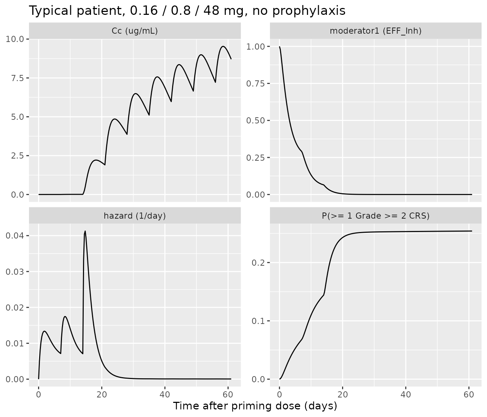
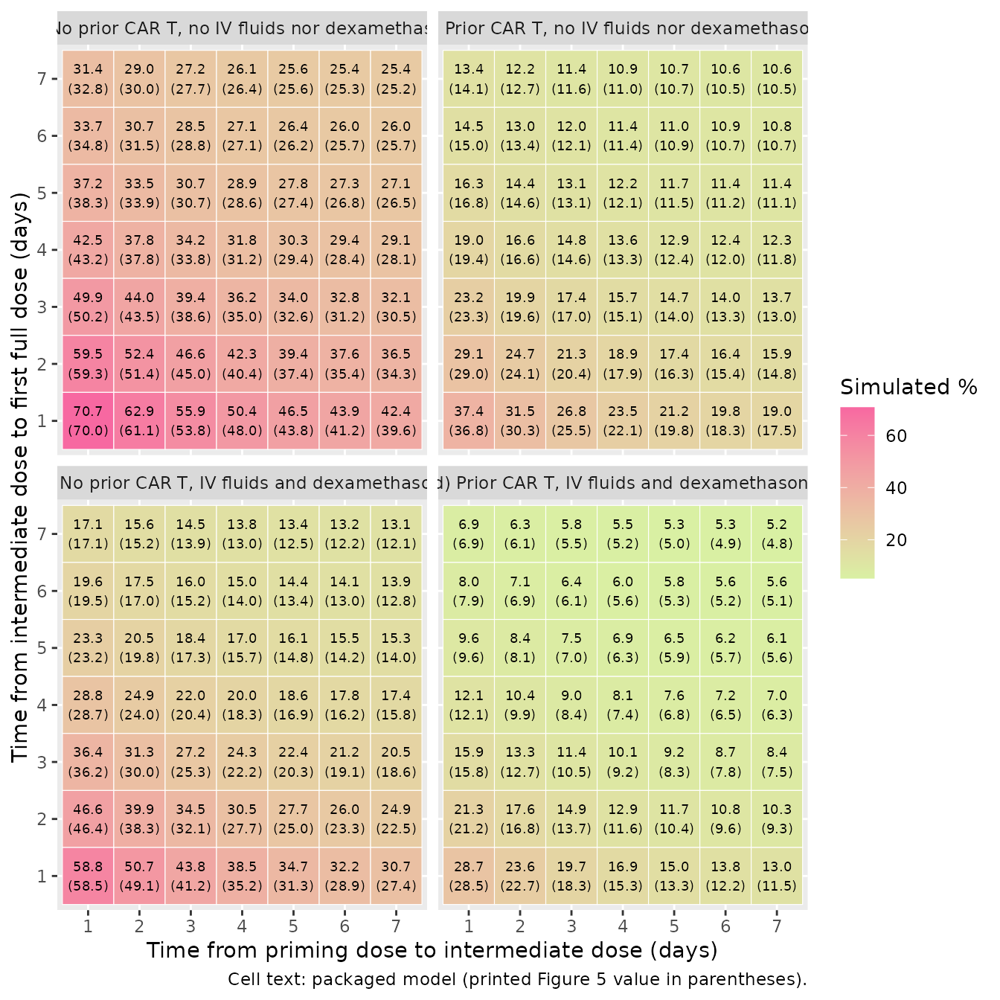
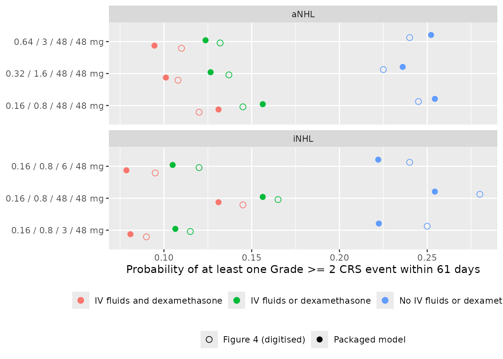
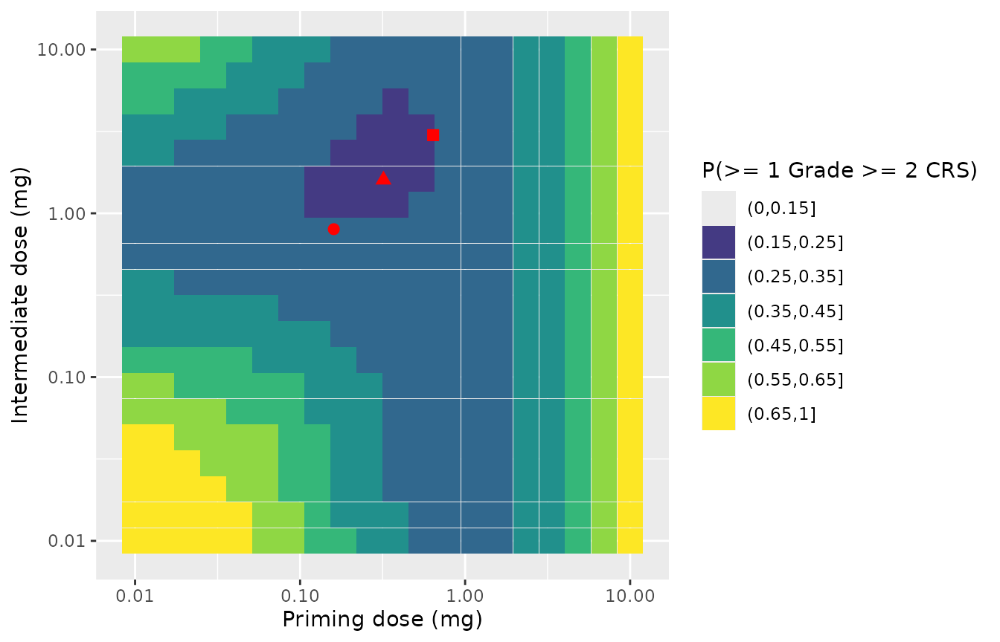
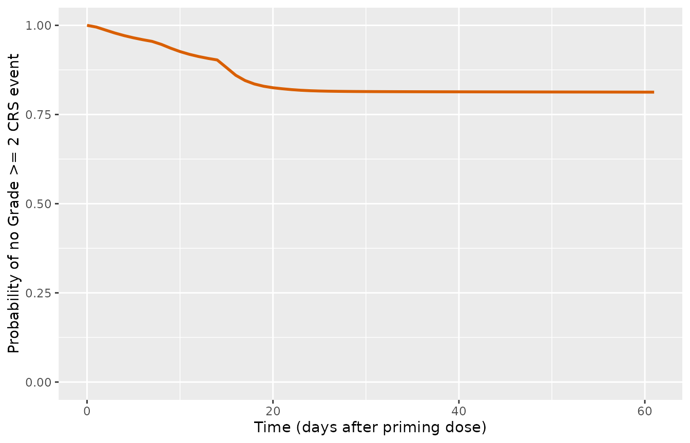

# Epcoritamab cytokine release syndrome (Li 2026)

## Model and source

- Citation: Li T, Tredennick A, Polhamus D, Putnins M, Liu S, Sanghavi
  K, Thalhauser CJ, Parikh A, Noorani B, Mohamed MEF, Le Gallo C,
  Elliott B, Gupta M, Xu S. Epcoritamab Step-Up Dosing Regimen Selection
  and Optimization Using Repeated Time-to-Event Modeling for Cytokine
  Release Syndrome Risk Mitigation. Clin Pharmacol Ther.
  2026;120(2):542-551. <doi:10.1002/cpt.70362>. Hazard equations in the
  Supplementary Methods; final estimates in Table 2. Embedded PK model:
  Li T, Gibiansky L, Parikh A, et al. Population Pharmacokinetics of
  Epcoritamab Following Subcutaneous Administration in Relapsed or
  Refractory B Cell Non-Hodgkin Lymphoma. Clin Pharmacokinet.
  2025;64(1):127-141. <doi:10.1007/s40262-024-01464-2> (reference 15 of
  the CRS paper; modellib(‘Li_2025_epcoritamab’)).
- Description: Repeated time-to-event (RTTE) model for the hazard of
  Grade \>= 2 cytokine release syndrome (CRS) after subcutaneous
  epcoritamab (CD3xCD20 bispecific antibody) in adults with relapsed or
  refractory aggressive or indolent B cell non-Hodgkin lymphoma (Li
  2026). The hazard is the product of a stimulatory sigmoid Emax
  function of plasma epcoritamab concentration (SMAX, S50, SHILL) and a
  tolerance moderator: a turnover pool starting at 1 whose zero-order
  input is inhibited by concentration (Imax = 1, I50, Hill = 1) with kin
  = kout, so the hazard falls as exposure accumulates. Prior CAR T cell
  therapy lowers SMAX; Cycle 1 prophylaxis with intravenous fluids or
  dexamethasone, or with both, raises S50. No between-subject
  variability on the hazard. The concentration comes from the embedded
  two-compartment quasi-steady-state TMDD population PK model of Li 2025
  (modellib(‘Li_2025_epcoritamab’)), reproduced unchanged; body weight
  and age act only through that PK model. The model exposes the
  instantaneous hazard (per day), the cumulative hazard and the survival
  function sur = exp(-cumhaz); 1 - sur is the probability of at least
  one Grade \>= 2 CRS event.
- Article: <https://doi.org/10.1002/cpt.70362>
- Embedded PK model: <https://doi.org/10.1007/s40262-024-01464-2>
  (`modellib("Li_2025_epcoritamab")`, vignette `Li_2025_epcoritamab`)

Epcoritamab is a subcutaneous CD3xCD20 T-cell-engaging bispecific
antibody. Cytokine release syndrome (CRS) is its most common adverse
event and occurs mostly early, after the first full dose, which is why
it is given with step-up doses (SUD) and with corticosteroid
premedication. Li et al. built a repeated time-to-event (RTTE) model for
the hazard of Grade \>= 2 CRS driven by the plasma epcoritamab
concentration predicted by their earlier population PK model (Li 2025),
and used it to choose the step-up regimens and the Cycle 1 prophylaxis
(IV fluids and dexamethasone) that are now approved.

The hazard is the product of two components (main-text Model
development, Figure 1, and the Supplementary Methods):

- a stimulatory sigmoid Emax term,
  `STIM(t) = SMAX * Cp(t)^SHILL / (S50^SHILL + Cp(t)^SHILL)`;
- a tolerance term `EFF_Inh(t)`, a turnover pool with `Kin = Kout` that
  starts at 1 and whose zero-order input is inhibited by concentration,
  `dEFF/dt = Kin * (1 - IMAX * Cp^IHILL / (I50^IHILL + Cp^IHILL)) - Kout * EFF`.

`h(t) = STIM(t) * EFF_Inh(t)`. Because I50 (0.000446 mg/L) is about
200-fold lower than S50 (0.0943 mg/L), a low priming dose builds
tolerance before the full dose produces a high stimulation, which is the
mechanism by which step-up dosing lowers the risk. The packaged model
carries the tolerance pool as the state `moderator1`, the cumulative
hazard as `cumhaz`, and exposes `hazard` (per day) and the survival
function `sur = exp(-cumhaz)`. The probability of at least one Grade \>=
2 CRS event by time `t`, the quantity the paper plots, is `1 - sur`.

## Population

The analysis pooled 600 adults with relapsed or refractory B cell
non-Hodgkin lymphoma treated with subcutaneous epcoritamab monotherapy
in 28-day cycles: 536 from EPCORE NHL-1 (364 in dose escalation and
expansion, 172 in dose optimisation) and 64 from the Japanese EPCORE
NHL-3 trial (Table 1). 331 (55.2%) had aggressive NHL, including
(D)LBCL, and 269 (44.8%) indolent NHL, including FL; 125 (20.8%) had
received CAR T cell therapy. Cycle 1 CRS prophylaxis was neither
dexamethasone nor IV fluids in 373 (62.2%), IV fluids only in 30 (5.0%),
dexamethasone only in 91 (15.2%) and both in 106 (17.7%); patients
premedicated with prednisolone count as having no dexamethasone. Median
age was 66 years (range 33-83) and median body weight 72.8 kg (range
46.0-109.4) (supplementary Table S1). Sex and race are not reported in
the CRS paper.

``` r

str(rxode2::rxode(readModelDb("Li_2026_epcoritamab"))$population)
#> ℹ parameter labels from comments will be replaced by 'label()'
#> List of 12
#>  $ species      : chr "human"
#>  $ n_subjects   : int 600
#>  $ n_studies    : int 2
#>  $ age_range    : chr "33-83 years"
#>  $ age_median   : chr "66 years"
#>  $ weight_range : chr "45.99-109.41 kg"
#>  $ weight_median: chr "72.80 kg"
#>  $ disease_state: chr "Relapsed or refractory B cell non-Hodgkin lymphoma: aggressive NHL including (D)LBCL 331 (55.2%), indolent NHL "| __truncated__
#>  $ dose_range   : chr "Subcutaneous epcoritamab in 28-day cycles; priming, intermediate and full doses 0.0128-60 mg in dose escalation"| __truncated__
#>  $ co_medication: chr "Cycle 1 CRS prophylaxis: no dexamethasone and no IV fluids 373 (62.2%), IV fluids only 30 (5.0%), dexamethasone"| __truncated__
#>  $ regions      : chr "EPCORE NHL-1 (US/EU) and EPCORE NHL-3 (Japan)"
#>  $ notes        : chr "Pooled EPCORE NHL-1 (NCT03625037; dose escalation/expansion n = 364, dose optimisation n = 172) and EPCORE NHL-"| __truncated__
```

## Source trace

The per-parameter origin is also recorded next to each `ini()` entry in
`inst/modeldb/specificDrugs/Li_2026_epcoritamab.R`. Table 2 of Li 2026
prints the estimates on the log scale; the packaged values are those
log-scale estimates and the transformed values are
[`exp()`](https://rdrr.io/r/base/Log.html) of them.

| Equation / parameter | Value | Source location |
|----|----|----|
| PK model (all `lcl`…`lkint`, `e_wt_*`, `e_age_ka`, etas, residual error) | as `Li_2025_epcoritamab` | Li 2025 Table 2 and supplementary Fig. S1; cited as the PPK model in Li 2026 Methods (reference 15) |
| `lkin_moderator1` (Kin = Kout) | -0.832 (0.435 1/day) | Li 2026 Table 2, theta1 |
| `lemax` (SMAX) | 0.0539 (1.06 1/day) | Table 2, theta2 |
| `lec50` (S50) | -2.36 (0.0943 mg/L) | Table 2, theta3 |
| `lic50` (I50) | -7.72 (0.000446 mg/L) | Table 2, theta4 |
| `limax` (IMAX) | fixed, IMAX = 1 | Table 2, theta5, ‘1.0 (-)’ |
| `lhill_inh` (IHILL) | fixed, IHILL = 1 | Table 2, theta6, ‘1.0 (-)’ |
| `lhill` (SHILL) | -0.124 (0.884) | Table 2, theta7 |
| `e_prior_cart_emax` | -0.964 (x 0.382 on SMAX) | Table 2, theta9; Results text |
| `e_proph_either_ec50` | 1.19 (x 3.28 on S50) | Table 2, theta12; Results text |
| `e_proph_both_ec50` | 1.63 (x 5.10 on S50) | Table 2, theta13; Results text |
| No IIV on the hazard | omega = 0 | Table 2, omega1,1-omega4,4 = 0 |
| `h(t) = STIM(t) * EFF_Inh(t)` | n/a | main text, Model development; Figure 1 |
| `STIM(t)` | n/a | Supplementary Methods, STIM equation |
| `d/dt(moderator1)`, `moderator1(0) = 1` | n/a | Supplementary Methods, EFF_Inh equation; ‘Kin was set equal to Kout … EFF_Inh -\> 1’ |
| Covariates as exponentiated linear terms | n/a | main text, Model development |
| Prophylaxis categories | n/a | Methods, Study design and input data; Table 1 |
| `Cp` = PK-predicted plasma concentration | n/a | Methods; Figure 1 |

## Embedded PK model is the Li 2025 model

The CRS model is driven by the Li 2025 PPK model (the paper used
individual empirical Bayes estimates to calibrate it and typical PK
parameters with sampled covariates to simulate). The packaged file
reproduces that model unchanged; this check solves both packaged models
on the same events.

``` r

mod <- readModelDb("Li_2026_epcoritamab")
mod_typ <- rxode2::zeroRe(mod)
#> ℹ parameter labels from comments will be replaced by 'label()'
#> Warning: No sigma parameters in the model
mod_pk_typ <- rxode2::zeroRe(readModelDb("Li_2025_epcoritamab"))
#> ℹ parameter labels from comments will be replaced by 'label()'
#> Warning: No sigma parameters in the model

# Regimen helper: the listed step-up doses, then full 48 mg doses every week
# until the end of the horizon (Cycle 1-3 weekly dosing, Methods).
regimen_doses <- function(times, amts, horizon = 61, full = 48) {
  extra <- seq(max(times) + 7, horizon, by = 7)
  data.frame(time = c(times, extra), amt = c(amts, rep(full, length(extra))))
}

# Expand a cohort (one row per subject: id + covariates + labels) and a dose
# data frame into an rxode2 event table. Observations are on the `central`
# ODE state; Cc, hazard and sur are returned at those rows.
build_events <- function(cohort, doses, obs_times) {
  dose_rows <- tidyr::crossing(cohort, doses) |>
    mutate(evid = 1L, cmt = "depot")
  obs_rows <- tidyr::crossing(cohort, time = obs_times) |>
    mutate(evid = 0L, amt = 0, cmt = "central")
  bind_rows(dose_rows, obs_rows) |>
    arrange(id, time, desc(evid)) |>
    as.data.frame()
}

typical_patient <- data.frame(
  id = 1L, WT = 72.8, AGE = 66, PRIOR_CART = 0L,
  CONMED_DEXAMETHASONE = 0L, CONMED_IV_FLUIDS = 0L
)
sud2 <- regimen_doses(c(0, 7, 14), c(0.16, 0.8, 48))
ev_typ <- build_events(typical_patient, sud2, seq(0, 61, by = 0.25))

sim_crs <- rxode2::rxSolve(mod_typ, events = ev_typ, returnType = "data.frame")
#> ℹ omega/sigma items treated as zero: 'etalcl', 'etalq', 'etalvc', 'etalvp', 'etalka', 'etalrbase_target', 'etalkss', 'etalkint', 'etaRUV'
sim_pk <- rxode2::rxSolve(mod_pk_typ, events = ev_typ, returnType = "data.frame")
#> ℹ omega/sigma items treated as zero: 'etalcl', 'etalq', 'etalvc', 'etalvp', 'etalka', 'etalrbase_target', 'etalkss', 'etalkint', 'etaRUV'
pk_rel_diff <- max(abs(sim_crs$Cc - sim_pk$Cc) / pmax(sim_pk$Cc, 1e-12))
pk_rel_diff
#> [1] 1.02608e-06
# Same parameters, same equations: the difference is ODE-solver tolerance
# only (about 1e-6; the CRS model's two extra states change the adaptive step
# sequence). A transcription error in any PK value would be orders larger.
stopifnot(pk_rel_diff < 1e-4)
```

## Typical-patient hazard dynamics

The figure shows the four model quantities for a typical patient (72.8
kg, 66 years, no prior CAR T cell therapy, no IV fluids or
dexamethasone) on the approved 2-SUD regimen, 0.16 mg on day 1, 0.8 mg
on day 8 and 48 mg weekly from day 15 (time 0 = day 1). The tolerance
pool is already well below 1 when the first full dose arrives, so the
hazard spike at the first full dose is blunted and subsequent full doses
add little.

``` r

sim_crs |>
  mutate(`1 - sur` = 1 - sur) |>
  select(time, Cc, moderator1, hazard, `1 - sur`) |>
  pivot_longer(-time, names_to = "quantity", values_to = "value") |>
  mutate(quantity = factor(quantity, levels = c("Cc", "moderator1", "hazard", "1 - sur"),
    labels = c("Cc (ug/mL)", "moderator1 (EFF_Inh)", "hazard (1/day)",
      "P(>= 1 Grade >= 2 CRS)"))) |>
  ggplot(aes(time, value)) +
  geom_line() +
  facet_wrap(~quantity, scales = "free_y", ncol = 2) +
  labs(x = "Time after priming dose (days)", y = NULL,
    title = "Typical patient, 0.16 / 0.8 / 48 mg, no prophylaxis")
```



## Replicating Figure 5: accelerated step-up regimens

Figure 5 prints the model-predicted Grade \>= 2 CRS rate (%) in aNHL for
every combination of 1-7 days from the priming dose (0.16 mg) to the
intermediate dose (0.8 mg) and 1-7 days from the intermediate dose to
the first full dose (48 mg), in four subgroups. The paper does not
restate the horizon in the Figure 5 caption; the 61-day window of Figure
4 is used, with weekly 48 mg full doses after the first full dose. The
packaged model is solved for the typical patient.

``` r

# Printed values, Figure 5, read row by row from the top (7 days from
# intermediate dose to first full dose) to the bottom (1 day); within a row,
# 1 to 7 days from priming to intermediate dose.
fig5_printed <- list(
  a = c(32.8, 30, 27.7, 26.4, 25.6, 25.3, 25.2, 34.8, 31.5, 28.8, 27.1, 26.2, 25.7, 25.7,
    38.3, 33.9, 30.7, 28.6, 27.4, 26.8, 26.5, 43.2, 37.8, 33.8, 31.2, 29.4, 28.4, 28.1,
    50.2, 43.5, 38.6, 35, 32.6, 31.2, 30.5, 59.3, 51.4, 45, 40.4, 37.4, 35.4, 34.3,
    70, 61.1, 53.8, 48, 43.8, 41.2, 39.6),
  b = c(14.1, 12.7, 11.6, 11, 10.7, 10.5, 10.5, 15, 13.4, 12.1, 11.4, 10.9, 10.7, 10.7,
    16.8, 14.6, 13.1, 12.1, 11.5, 11.2, 11.1, 19.4, 16.6, 14.6, 13.3, 12.4, 12, 11.8,
    23.3, 19.6, 17, 15.1, 14, 13.3, 13, 29, 24.1, 20.4, 17.9, 16.3, 15.4, 14.8,
    36.8, 30.3, 25.5, 22.1, 19.8, 18.3, 17.5),
  c = c(17.1, 15.2, 13.9, 13, 12.5, 12.2, 12.1, 19.5, 17, 15.2, 14, 13.4, 13, 12.8,
    23.2, 19.8, 17.3, 15.7, 14.8, 14.2, 14, 28.7, 24, 20.4, 18.3, 16.9, 16.2, 15.8,
    36.2, 30, 25.3, 22.2, 20.3, 19.1, 18.6, 46.4, 38.3, 32.1, 27.7, 25, 23.3, 22.5,
    58.5, 49.1, 41.2, 35.2, 31.3, 28.9, 27.4),
  d = c(6.9, 6.1, 5.5, 5.2, 5, 4.9, 4.8, 7.9, 6.9, 6.1, 5.6, 5.3, 5.2, 5.1,
    9.6, 8.1, 7, 6.3, 5.9, 5.7, 5.6, 12.1, 9.9, 8.4, 7.4, 6.8, 6.5, 6.3,
    15.8, 12.7, 10.5, 9.2, 8.3, 7.8, 7.5, 21.2, 16.8, 13.7, 11.6, 10.4, 9.6, 9.3,
    28.5, 22.7, 18.3, 15.3, 13.3, 12.2, 11.5)
)
fig5_panels <- data.frame(
  panel = c("a", "b", "c", "d"),
  panel_label = c("(a) No prior CAR T, no IV fluids nor dexamethasone",
    "(b) Prior CAR T, no IV fluids nor dexamethasone",
    "(c) No prior CAR T, IV fluids and dexamethasone",
    "(d) Prior CAR T, IV fluids and dexamethasone"),
  PRIOR_CART = c(0L, 1L, 0L, 1L),
  proph = c(0L, 0L, 1L, 1L)
)
fig5_ref <- bind_rows(lapply(names(fig5_printed), function(p) {
  expand.grid(x = 1:7, y = 7:1) |>
    mutate(panel = p, printed = fig5_printed[[p]])
}))
fig5_cohort <- fig5_ref |>
  left_join(fig5_panels, by = "panel") |>
  mutate(id = row_number(), WT = 72.8, AGE = 66,
    CONMED_DEXAMETHASONE = proph, CONMED_IV_FLUIDS = proph)
```

``` r

# One subject per cell; each subject has its own step-up timing.
fig5_doses <- bind_rows(lapply(seq_len(nrow(fig5_cohort)), function(i) {
  r <- fig5_cohort[i, ]
  cbind(id = r$id, regimen_doses(c(0, r$x, r$x + r$y), c(0.16, 0.8, 48)))
}))
ev_fig5 <- bind_rows(
  fig5_doses |> mutate(evid = 1L, cmt = "depot"),
  data.frame(id = fig5_cohort$id, time = 61, amt = 0, evid = 0L, cmt = "central")
) |>
  left_join(fig5_cohort |> select(id, WT, AGE, PRIOR_CART, CONMED_DEXAMETHASONE,
    CONMED_IV_FLUIDS), by = "id") |>
  arrange(id, time, desc(evid)) |>
  as.data.frame()

solve_fig5 <- function(model) {
  rxode2::rxSolve(model, events = ev_fig5, returnType = "data.frame") |>
    filter(time == 61) |>
    transmute(id, simulated = 100 * (1 - sur)) |>
    right_join(fig5_cohort, by = "id") |>
    mutate(pct_diff = 100 * (simulated - printed) / printed)
}
fig5_res <- solve_fig5(mod_typ)
#> ℹ omega/sigma items treated as zero: 'etalcl', 'etalq', 'etalvc', 'etalvp', 'etalka', 'etalrbase_target', 'etalkss', 'etalkint', 'etaRUV'
#> Warning: multi-subject simulation without without 'omega'

fig5_summary <- fig5_res |>
  group_by(panel_label) |>
  summarise(
    `Median % difference` = round(median(pct_diff), 1),
    `90th pct of |% difference|` = round(quantile(abs(pct_diff), 0.9), 1),
    `Standard regimen (7, 7): printed` = printed[x == 7 & y == 7],
    `Standard regimen (7, 7): simulated` = round(simulated[x == 7 & y == 7], 1),
    `Fastest (1, 1): printed` = printed[x == 1 & y == 1],
    `Fastest (1, 1): simulated` = round(simulated[x == 1 & y == 1], 1),
    .groups = "drop"
  ) |>
  rename(Subgroup = panel_label)
knitr::kable(fig5_summary, caption = "Packaged model vs the rates printed in Figure 5 of Li 2026 (Grade >= 2 CRS, %).")
```

| Subgroup | Median % difference | 90th pct of \|% difference\| | Standard regimen (7, 7): printed | Standard regimen (7, 7): simulated | Fastest (1, 1): printed | Fastest (1, 1): simulated |
|:---|---:|---:|---:|---:|---:|---:|
| \(a\) No prior CAR T, no IV fluids nor dexamethasone | 1.3 | 5.5 | 25.2 | 25.4 | 70.0 | 70.7 |
| \(b\) Prior CAR T, no IV fluids nor dexamethasone | 1.6 | 6.7 | 10.5 | 10.6 | 36.8 | 37.4 |
| \(c\) No prior CAR T, IV fluids and dexamethasone | 7.8 | 11.0 | 12.1 | 13.1 | 58.5 | 58.8 |
| \(d\) Prior CAR T, IV fluids and dexamethasone | 8.6 | 11.7 | 4.8 | 5.2 | 28.5 | 28.7 |

Packaged model vs the rates printed in Figure 5 of Li 2026 (Grade \>= 2
CRS, %). {.table}

``` r

fig5_res |>
  ggplot(aes(factor(x), factor(y), fill = simulated)) +
  geom_tile(colour = "white") +
  geom_text(aes(label = sprintf("%.1f\n(%.1f)", simulated, printed)), size = 2.4) +
  scale_fill_gradient(low = "#d9f0a3", high = "#f768a1", name = "Simulated %") +
  facet_wrap(~panel_label, ncol = 2) +
  labs(x = "Time from priming dose to intermediate dose (days)",
    y = "Time from intermediate dose to first full dose (days)",
    caption = "Cell text: packaged model (printed Figure 5 value in parentheses).")
```



Replicates Figure 5 of Li 2026. The packaged model reproduces all 196
printed rates: panels (a) and (b) within a median of about 1.5%, panels
(c) and (d), which carry the prophylaxis effect on S50, about 8% high.
The residual is consistent with the paper’s simulation design (virtual
patients with sampled body weight and age, and parameter sets drawn from
the estimation uncertainty), which a typical-patient solve does not
reproduce.

``` r

fig5_gate <- fig5_res |>
  group_by(panel) |>
  summarise(med = median(pct_diff), q90 = quantile(abs(pct_diff), 0.9))
fig5_gate
#> # A tibble: 4 × 3
#>   panel   med   q90
#>   <chr> <dbl> <dbl>
#> 1 a      1.30  5.47
#> 2 b      1.59  6.65
#> 3 c      7.83 11.0 
#> 4 d      8.62 11.7
stopifnot(
  # A transcription error in any hazard parameter or covariate effect moves a
  # whole panel by tens of percent.
  all(abs(fig5_gate$med) < 10),
  all(fig5_gate$q90 < 15)
)
```

### Table 2 versus the abstract

The abstract reports, for “the calibrated model”, a 69.7% reduction in
SMAX with prior CAR T cell therapy (0.303-fold) and 2.89-fold and
3.79-fold increases in S50 with one or both prophylaxis measures. Table
2 and the Results text give 0.382, 3.28 and 5.10, and Table 2 is the
only complete parameter set the paper prints. Swapping the three
abstract coefficients into the packaged model and repeating the Figure 5
comparison shows that Figure 5 was produced with the Table 2 values, so
Table 2 is what the package ships.

``` r

mod_abstract <- mod_typ |>
  rxode2::ini(
    e_prior_cart_emax = log(0.303),
    e_proph_either_ec50 = log(2.89),
    e_proph_both_ec50 = log(3.79)
  )
#> ℹ change initial estimate of `e_prior_cart_emax` to `-1.19402247347277`
#> ℹ change initial estimate of `e_proph_either_ec50` to `1.06125650212434`
#> ℹ change initial estimate of `e_proph_both_ec50` to `1.33236601909433`
fig5_abstract <- solve_fig5(mod_abstract)
#> ℹ omega/sigma items treated as zero: 'etalcl', 'etalq', 'etalvc', 'etalvp', 'etalka', 'etalrbase_target', 'etalkss', 'etalkint', 'etaRUV'
#> Warning: multi-subject simulation without without 'omega'
abstract_cmp <- bind_rows(
  fig5_res |> mutate(coefficients = "Table 2 (packaged)"),
  fig5_abstract |> mutate(coefficients = "Abstract")
) |>
  group_by(coefficients, panel) |>
  summarise(med = median(pct_diff), .groups = "drop")
abstract_cmp |>
  mutate(med = round(med, 1)) |>
  pivot_wider(names_from = panel, values_from = med) |>
  rename(`Coefficients` = coefficients, `(a)` = a, `(b)` = b, `(c)` = c, `(d)` = d) |>
  knitr::kable(caption = "Median % difference from the printed Figure 5 rates, by panel.")
```

| Coefficients       | \(a\) | \(b\) | \(c\) | \(d\) |
|:-------------------|------:|------:|------:|------:|
| Abstract           |   1.3 | -17.7 |  18.9 |  -3.4 |
| Table 2 (packaged) |   1.3 |   1.6 |   7.8 |   8.6 |

Median % difference from the printed Figure 5 rates, by panel. {.table}

``` r

med_of <- function(coef, p) abstract_cmp$med[abstract_cmp$coefficients == coef & abstract_cmp$panel == p]
stopifnot(
  # Panel (b) isolates the prior-CAR-T effect, panel (c) the both-prophylaxis
  # effect; Table 2 fits both clearly better than the abstract values.
  abs(med_of("Table 2 (packaged)", "b")) < abs(med_of("Abstract", "b")) - 5,
  abs(med_of("Table 2 (packaged)", "c")) < abs(med_of("Abstract", "c")) - 5
)
```

## Virtual cohort

For the population-level figures, virtual patients are built the way the
paper describes its simulations: typical PK parameters, with body weight
and age drawn from distributions matching the pooled population (Table
S1 medians and ranges; the paper reports means and variances it does not
print, so a log-normal weight with 18% spread and a normal age with SD
10 years, truncated to the observed ranges, are assumed). 200 virtual
patients are reused across every regimen and prophylaxis arm.

``` r

set.seed(20261001)
n_vp <- 200L
vp <- data.frame(
  vp = seq_len(n_vp),
  WT = pmin(pmax(72.8 * exp(rnorm(n_vp, 0, 0.18)), 46), 109.4),
  AGE = pmin(pmax(rnorm(n_vp, 66, 10), 33), 83)
)
summary(vp[, c("WT", "AGE")])
#>        WT              AGE       
#>  Min.   : 46.00   Min.   :37.70  
#>  1st Qu.: 65.10   1st Qu.:60.89  
#>  Median : 73.46   Median :66.80  
#>  Mean   : 74.30   Mean   :67.26  
#>  3rd Qu.: 80.96   3rd Qu.:73.97  
#>  Max.   :109.40   Max.   :83.00
```

## Replicating Figure 4: step-up regimens and prophylaxis

Figure 4 shows the probability of at least one Grade \>= 2 CRS event
within 61 days for three 2-SUD regimens in aNHL and for 2-SUD vs 3-SUD
regimens in iNHL, under the three prophylaxis categories, for patients
without prior CAR T cell therapy. The point estimates below were read
from Figure 4 by the maintainers (about +/- 0.01). Hazard parameters do
not depend on disease type, so aNHL and iNHL differ only in the regimens
simulated.

``` r

fig4_arms <- tribble(
  ~indication, ~regimen, ~times, ~amts,
  "aNHL", "0.16 / 0.8 / 48 / 48 mg", c(0, 7, 14), c(0.16, 0.8, 48),
  "aNHL", "0.32 / 1.6 / 48 / 48 mg", c(0, 7, 14), c(0.32, 1.6, 48),
  "aNHL", "0.64 / 3 / 48 / 48 mg", c(0, 7, 14), c(0.64, 3, 48),
  "iNHL", "0.16 / 0.8 / 48 / 48 mg", c(0, 7, 14), c(0.16, 0.8, 48),
  "iNHL", "0.16 / 0.8 / 6 / 48 mg", c(0, 7, 14, 21), c(0.16, 0.8, 6, 48),
  "iNHL", "0.16 / 0.8 / 3 / 48 mg", c(0, 7, 14, 21), c(0.16, 0.8, 3, 48)
) |>
  mutate(arm_regimen = row_number())
proph_levels <- tribble(
  ~prophylaxis, ~CONMED_DEXAMETHASONE, ~CONMED_IV_FLUIDS,
  "No IV fluids or dexamethasone", 0L, 0L,
  "IV fluids or dexamethasone", 1L, 0L,
  "IV fluids and dexamethasone", 1L, 1L
)
fig4_cohort <- tidyr::crossing(fig4_arms |> select(indication, regimen, arm_regimen),
  proph_levels, vp) |>
  mutate(id = row_number(), PRIOR_CART = 0L)
fig4_doses <- bind_rows(lapply(seq_len(nrow(fig4_arms)), function(i) {
  cbind(arm_regimen = i, regimen_doses(fig4_arms$times[[i]], fig4_arms$amts[[i]]))
}))
ev_fig4 <- bind_rows(
  inner_join(fig4_cohort, fig4_doses, by = "arm_regimen", relationship = "many-to-many") |>
    mutate(evid = 1L, cmt = "depot"),
  fig4_cohort |> mutate(time = 61, amt = 0, evid = 0L, cmt = "central")
) |>
  arrange(id, time, desc(evid)) |>
  as.data.frame()
sim_fig4 <- rxode2::rxSolve(mod_typ, events = ev_fig4,
  keep = c("indication", "regimen", "prophylaxis"), returnType = "data.frame") |>
  filter(time == 61)
#> ℹ omega/sigma items treated as zero: 'etalcl', 'etalq', 'etalvc', 'etalvp', 'etalka', 'etalrbase_target', 'etalkss', 'etalkint', 'etaRUV'
#> Warning: multi-subject simulation without without 'omega'

fig4_digitised <- tribble(
  ~indication, ~regimen, ~prophylaxis, ~published,
  "aNHL", "0.16 / 0.8 / 48 / 48 mg", "No IV fluids or dexamethasone", 0.245,
  "aNHL", "0.16 / 0.8 / 48 / 48 mg", "IV fluids or dexamethasone", 0.145,
  "aNHL", "0.16 / 0.8 / 48 / 48 mg", "IV fluids and dexamethasone", 0.12,
  "aNHL", "0.32 / 1.6 / 48 / 48 mg", "No IV fluids or dexamethasone", 0.225,
  "aNHL", "0.32 / 1.6 / 48 / 48 mg", "IV fluids or dexamethasone", 0.137,
  "aNHL", "0.32 / 1.6 / 48 / 48 mg", "IV fluids and dexamethasone", 0.108,
  "aNHL", "0.64 / 3 / 48 / 48 mg", "No IV fluids or dexamethasone", 0.24,
  "aNHL", "0.64 / 3 / 48 / 48 mg", "IV fluids or dexamethasone", 0.132,
  "aNHL", "0.64 / 3 / 48 / 48 mg", "IV fluids and dexamethasone", 0.11,
  "iNHL", "0.16 / 0.8 / 48 / 48 mg", "No IV fluids or dexamethasone", 0.28,
  "iNHL", "0.16 / 0.8 / 48 / 48 mg", "IV fluids or dexamethasone", 0.165,
  "iNHL", "0.16 / 0.8 / 48 / 48 mg", "IV fluids and dexamethasone", 0.145,
  "iNHL", "0.16 / 0.8 / 6 / 48 mg", "No IV fluids or dexamethasone", 0.24,
  "iNHL", "0.16 / 0.8 / 6 / 48 mg", "IV fluids or dexamethasone", 0.12,
  "iNHL", "0.16 / 0.8 / 6 / 48 mg", "IV fluids and dexamethasone", 0.095,
  "iNHL", "0.16 / 0.8 / 3 / 48 mg", "No IV fluids or dexamethasone", 0.25,
  "iNHL", "0.16 / 0.8 / 3 / 48 mg", "IV fluids or dexamethasone", 0.115,
  "iNHL", "0.16 / 0.8 / 3 / 48 mg", "IV fluids and dexamethasone", 0.09
)
fig4_res <- sim_fig4 |>
  group_by(indication, regimen, prophylaxis) |>
  summarise(simulated = mean(1 - sur), .groups = "drop") |>
  left_join(fig4_digitised, by = c("indication", "regimen", "prophylaxis")) |>
  mutate(diff = simulated - published)

fig4_res |>
  mutate(simulated = round(simulated, 3), diff = round(diff, 3)) |>
  rename(Indication = indication, Regimen = regimen, Prophylaxis = prophylaxis,
    `Simulated P(>= 1 event, 61 d)` = simulated,
    `Figure 4 (digitised)` = published, Difference = diff) |>
  knitr::kable(caption = "Probability of at least one Grade >= 2 CRS event within 61 days, no prior CAR T cell therapy.")
```

| Indication | Regimen | Prophylaxis | Simulated P(\>= 1 event, 61 d) | Figure 4 (digitised) | Difference |
|:---|:---|:---|---:|---:|---:|
| aNHL | 0.16 / 0.8 / 48 / 48 mg | IV fluids and dexamethasone | 0.131 | 0.120 | 0.011 |
| aNHL | 0.16 / 0.8 / 48 / 48 mg | IV fluids or dexamethasone | 0.156 | 0.145 | 0.011 |
| aNHL | 0.16 / 0.8 / 48 / 48 mg | No IV fluids or dexamethasone | 0.254 | 0.245 | 0.009 |
| aNHL | 0.32 / 1.6 / 48 / 48 mg | IV fluids and dexamethasone | 0.101 | 0.108 | -0.007 |
| aNHL | 0.32 / 1.6 / 48 / 48 mg | IV fluids or dexamethasone | 0.127 | 0.137 | -0.010 |
| aNHL | 0.32 / 1.6 / 48 / 48 mg | No IV fluids or dexamethasone | 0.236 | 0.225 | 0.011 |
| aNHL | 0.64 / 3 / 48 / 48 mg | IV fluids and dexamethasone | 0.095 | 0.110 | -0.015 |
| aNHL | 0.64 / 3 / 48 / 48 mg | IV fluids or dexamethasone | 0.124 | 0.132 | -0.008 |
| aNHL | 0.64 / 3 / 48 / 48 mg | No IV fluids or dexamethasone | 0.252 | 0.240 | 0.012 |
| iNHL | 0.16 / 0.8 / 3 / 48 mg | IV fluids and dexamethasone | 0.081 | 0.090 | -0.009 |
| iNHL | 0.16 / 0.8 / 3 / 48 mg | IV fluids or dexamethasone | 0.106 | 0.115 | -0.009 |
| iNHL | 0.16 / 0.8 / 3 / 48 mg | No IV fluids or dexamethasone | 0.222 | 0.250 | -0.028 |
| iNHL | 0.16 / 0.8 / 48 / 48 mg | IV fluids and dexamethasone | 0.131 | 0.145 | -0.014 |
| iNHL | 0.16 / 0.8 / 48 / 48 mg | IV fluids or dexamethasone | 0.156 | 0.165 | -0.009 |
| iNHL | 0.16 / 0.8 / 48 / 48 mg | No IV fluids or dexamethasone | 0.254 | 0.280 | -0.026 |
| iNHL | 0.16 / 0.8 / 6 / 48 mg | IV fluids and dexamethasone | 0.079 | 0.095 | -0.016 |
| iNHL | 0.16 / 0.8 / 6 / 48 mg | IV fluids or dexamethasone | 0.105 | 0.120 | -0.015 |
| iNHL | 0.16 / 0.8 / 6 / 48 mg | No IV fluids or dexamethasone | 0.222 | 0.240 | -0.018 |

Probability of at least one Grade \>= 2 CRS event within 61 days, no
prior CAR T cell therapy. {.table}

``` r

fig4_res |>
  pivot_longer(c(simulated, published), names_to = "source", values_to = "p") |>
  mutate(source = recode(source, simulated = "Packaged model", published = "Figure 4 (digitised)")) |>
  ggplot(aes(p, regimen, colour = prophylaxis, shape = source)) +
  geom_point(size = 2.5, position = position_dodge(width = 0.5)) +
  scale_shape_manual(values = c(1, 16)) +
  facet_wrap(~indication, ncol = 1, scales = "free_y") +
  labs(x = "Probability of at least one Grade >= 2 CRS event within 61 days",
    y = NULL, colour = NULL, shape = NULL) +
  theme(legend.position = "bottom", legend.box = "vertical")
```



Replicates Figure 4 of Li 2026. All 18 arms land within 0.03 of the
published point, and the packaged model reproduces the paper’s
conclusions: prophylaxis lowers the risk under every regimen, the two
alternative aNHL regimens change it little, and the 3-SUD regimens lower
it in iNHL. The largest differences are in iNHL without prophylaxis
(about -0.03). Figure 4 plots the iNHL 0.16 / 0.8 / 48 mg arms 0.02-0.04
above the identical aNHL arms although the hazard parameters do not
depend on disease type; the paper’s iNHL simulations may have used
iNHL-specific covariate distributions, which this model (whose PK
covariates are body weight and age only) does not reproduce.

``` r

stopifnot(
  abs(median(fig4_res$diff)) < 0.02,
  max(abs(fig4_res$diff)) < 0.06,
  # Direction checks the paper draws its conclusions from: prophylaxis lowers
  # risk in every regimen, and 3-SUD beats 2-SUD in iNHL.
  all(with(fig4_res |> select(indication, regimen, prophylaxis, simulated) |>
    pivot_wider(names_from = prophylaxis, values_from = simulated),
  `No IV fluids or dexamethasone` > `IV fluids or dexamethasone` &
    `IV fluids or dexamethasone` > `IV fluids and dexamethasone`))
)
```

## Replicating Figure 3: the 2-SUD dose grid

Figure 3 maps the probability of at least one Grade \>= 2 CRS event over
a grid of priming and intermediate doses (aNHL, no IV fluids or
dexamethasone, 2-SUD with full 48 mg doses from day 15). Twenty
log-spaced doses from 0.01 to 10 mg are used on each axis, matching the
plotted range, for the typical patient.

``` r

dose_grid <- signif(10^seq(-2, 1, length.out = 20), 3)
fig3_cohort <- expand.grid(priming = dose_grid, intermediate = dose_grid) |>
  mutate(id = row_number(), WT = 72.8, AGE = 66, PRIOR_CART = 0L,
    CONMED_DEXAMETHASONE = 0L, CONMED_IV_FLUIDS = 0L)
fig3_doses <- bind_rows(lapply(seq_len(nrow(fig3_cohort)), function(i) {
  cbind(id = i, regimen_doses(c(0, 7, 14),
    c(fig3_cohort$priming[i], fig3_cohort$intermediate[i], 48)))
}))
ev_fig3 <- bind_rows(
  fig3_doses |> mutate(evid = 1L, cmt = "depot"),
  data.frame(id = fig3_cohort$id, time = 61, amt = 0, evid = 0L, cmt = "central")
) |>
  left_join(fig3_cohort |> select(-priming, -intermediate), by = "id") |>
  arrange(id, time, desc(evid)) |>
  as.data.frame()
fig3_res <- rxode2::rxSolve(mod_typ, events = ev_fig3, returnType = "data.frame") |>
  filter(time == 61) |>
  transmute(id, p = 1 - sur) |>
  left_join(fig3_cohort |> select(id, priming, intermediate), by = "id") |>
  mutate(band = cut(p, breaks = c(0, 0.15, 0.25, 0.35, 0.45, 0.55, 0.65, 1)))
#> ℹ omega/sigma items treated as zero: 'etalcl', 'etalq', 'etalvc', 'etalvp', 'etalka', 'etalrbase_target', 'etalkss', 'etalkint', 'etaRUV'
#> Warning: multi-subject simulation without without 'omega'

ggplot(fig3_res, aes(priming, intermediate, fill = band)) +
  geom_tile() +
  scale_x_log10() +
  scale_y_log10() +
  scale_fill_viridis_d(name = "P(>= 1 Grade >= 2 CRS)", drop = FALSE) +
  annotate("point", x = c(0.16, 0.32, 0.64), y = c(0.8, 1.6, 3), colour = "red",
    shape = c(16, 17, 15), size = 2.5) +
  labs(x = "Priming dose (mg)", y = "Intermediate dose (mg)")
```



Replicates the shape of Figure 3 of Li 2026, but not its levels. As in
the paper, the lowest risk lies in a valley around priming 0.1-1 mg and
intermediate about 1-3 mg, which contains the three marked regimens;
very low step-up doses build little tolerance before the full dose, and
high priming doses produce a large stimulation before tolerance has
built up. Away from that valley, the packaged model is about one colour
band (0.1) higher than Figure 3: 0.78 vs (0.55, 0.65\] at 0.01 / 0.01 mg
and 0.65 vs (0.45, 0.55\] at a 10 mg priming dose, and the darkest band
(\<= 0.25) covers only a few grid cells rather than a broad region. The
paper used Figure 3 to choose the alternative regimens (0.32 / 1.6 and
0.64 / 3 mg) that were then tested in the dose-optimisation part of
EPCORE NHL-1, and it describes Figure 4, not Figure 3, as “based on the
final model – including data from the optimization arm”. Figure 3 was
therefore most likely produced with an earlier fit, before the
optimisation data existed. The packaged Table 2 values reproduce Figures
4 and 5, so nothing is adjusted to match Figure 3.

``` r

p_at <- function(pr, im) {
  fig3_res$p[which.min(abs(log(fig3_res$priming / pr)) + abs(log(fig3_res$intermediate / im)))]
}
fig3_check <- data.frame(
  point = c("0.01 / 0.01 mg (bottom-left corner)", "10 / 1 mg (right edge)",
    "grid minimum", "0.16 / 0.8 mg"),
  simulated = c(p_at(0.01, 0.01), p_at(10, 1), min(fig3_res$p), p_at(0.16, 0.8)),
  figure_3_band = c("(0.55, 0.65]", "(0.45, 0.55]", "(0.15, 0.25]", "(0.15, 0.25]")
)
knitr::kable(fig3_check, digits = 3)
```

| point                               | simulated | figure_3_band |
|:------------------------------------|----------:|:--------------|
| 0.01 / 0.01 mg (bottom-left corner) |     0.778 | (0.55, 0.65\] |
| 10 / 1 mg (right edge)              |     0.653 | (0.45, 0.55\] |
| grid minimum                        |     0.235 | (0.15, 0.25\] |
| 0.16 / 0.8 mg                       |     0.253 | (0.15, 0.25\] |

``` r

fig3_min <- fig3_res[which.min(fig3_res$p), ]
fig3_min
#>      id        p priming intermediate        band
#> 290 290 0.235189   0.264         1.62 (0.15,0.25]
stopifnot(
  # Shape: the minimum lies in the valley that holds the marked regimens ...
  fig3_min$priming > 0.1, fig3_min$priming < 1,
  fig3_min$intermediate > 0.5, fig3_min$intermediate < 5,
  min(fig3_res$p) > 0.15, min(fig3_res$p) < 0.27,
  # ... the approved and alternative regimens sit near that minimum ...
  p_at(0.16, 0.8) - min(fig3_res$p) < 0.03,
  p_at(0.32, 1.6) - min(fig3_res$p) < 0.03,
  p_at(0.64, 3) - min(fig3_res$p) < 0.03,
  # ... and both extremes of the grid are much riskier.
  p_at(0.01, 0.01) > 0.5,
  p_at(10, 1) > 0.45
)
```

## Pooled-population check against Figure 2

Figure 2 compares the observed and simulated time to the first Grade \>=
2 CRS event and the number of events per patient in all 600 patients.
The observed cohort received many different regimens, including the
dose-escalation doses, which the paper does not tabulate, so this is an
approximate check: the 200 virtual patients receive the prior-CAR-T and
prophylaxis mix of Table 1, the 2-SUD regimen if aNHL or in the
expansion part and the 3-SUD (0.16 / 0.8 / 3 / 48 mg) regimen for the
iNHL patients of the dose-optimisation part. Because the hazard does not
depend on the event history, the number of events by day 61 is Poisson
with mean `cumhaz(61)`, so the expected count distribution is computed
exactly rather than by sampling.

``` r

set.seed(20261002)
pooled <- vp |>
  mutate(
    id = vp,
    PRIOR_CART = rbinom(n_vp, 1, 125 / 600),
    proph = sample(c("none", "ivf", "dex", "both"), n_vp, replace = TRUE,
      prob = c(373, 30, 91, 106) / 600),
    CONMED_DEXAMETHASONE = as.integer(proph %in% c("dex", "both")),
    CONMED_IV_FLUIDS = as.integer(proph %in% c("ivf", "both")),
    # 81 of 600 were iNHL in the dose-optimisation part (Table 1).
    sud3 = rbinom(n_vp, 1, 81 / 600)
  )
pooled_doses <- bind_rows(
  cbind(sud3 = 0L, regimen_doses(c(0, 7, 14), c(0.16, 0.8, 48))),
  cbind(sud3 = 1L, regimen_doses(c(0, 7, 14, 21), c(0.16, 0.8, 3, 48)))
)
ev_pooled <- bind_rows(
  inner_join(pooled, pooled_doses, by = "sud3", relationship = "many-to-many") |>
    mutate(evid = 1L, cmt = "depot"),
  tidyr::crossing(pooled, time = 0:61) |> mutate(amt = 0, evid = 0L, cmt = "central")
) |>
  select(id, time, amt, evid, cmt, WT, AGE, PRIOR_CART, CONMED_DEXAMETHASONE, CONMED_IV_FLUIDS) |>
  arrange(id, time, desc(evid)) |>
  as.data.frame()
sim_pooled <- rxode2::rxSolve(mod_typ, events = ev_pooled, returnType = "data.frame")
#> ℹ omega/sigma items treated as zero: 'etalcl', 'etalq', 'etalvc', 'etalvp', 'etalka', 'etalrbase_target', 'etalkss', 'etalkint', 'etaRUV'
#> Warning: multi-subject simulation without without 'omega'

km_sim <- sim_pooled |>
  group_by(time) |>
  summarise(sur = mean(sur), .groups = "drop")
ggplot(km_sim, aes(time, sur)) +
  geom_line(colour = "#d95f02", linewidth = 1) +
  coord_cartesian(ylim = c(0, 1)) +
  labs(x = "Time (days after priming dose)",
    y = "Probability of no Grade >= 2 CRS event")
```



``` r

h61 <- sim_pooled$cumhaz[sim_pooled$time == 61]
expected_counts <- data.frame(events = 0:4) |>
  rowwise() |>
  mutate(`Expected patients (of 600)` = round(600 * mean(dpois(events, h61)), 1)) |>
  ungroup()
knitr::kable(expected_counts, caption = "Expected number of patients by number of Grade >= 2 CRS events within 61 days, scaled to 600.")
```

| events | Expected patients (of 600) |
|-------:|---------------------------:|
|      0 |                      487.6 |
|      1 |                       99.2 |
|      2 |                       12.0 |
|      3 |                        1.1 |
|      4 |                        0.1 |

Expected number of patients by number of Grade \>= 2 CRS events within
61 days, scaled to 600. {.table}

``` r

p_free_61 <- km_sim$sur[km_sim$time == 61]
p_free_61
#> [1] 0.8127143
stopifnot(
  # Figure 2 top panel: the observed and simulated event-free fraction
  # plateaus near 0.80 by day 30-61 (read from the figure).
  p_free_61 > 0.72, p_free_61 < 0.88,
  # Figure 2 bottom panel: about 470 patients with no event and about 100
  # with one; very few with three or more.
  expected_counts$`Expected patients (of 600)`[1] > 430,
  expected_counts$`Expected patients (of 600)`[4] < 10
)
```

Replicates Figure 2 of Li 2026 approximately: the simulated event-free
probability falls mainly between the first full dose (day 15) and day 30
and plateaus near 0.8 (0.81 at day 61). The expected numbers of patients
with 0, 1 and 2 events (about 488, 99 and 12 of 600) compare with
roughly 470, 105 and 20 in the bottom panel; this approximate cohort has
slightly fewer patients with repeated events.

## PKNCA: exposure delivered by the step-up doses

The CRS paper reports no NCA values. PKNCA is used here to summarise the
epcoritamab exposure (free plasma concentration, the hazard driver)
during the priming, intermediate and first full-dose weeks of the
approved 2-SUD regimen in the virtual cohort, and the mean hazard in
each week, which shows how tolerance from the low step-up doses limits
the hazard after the first full dose.

``` r

ev_nca <- build_events(
  vp |> mutate(id = vp, PRIOR_CART = 0L, CONMED_DEXAMETHASONE = 0L,
    CONMED_IV_FLUIDS = 0L, treatment = "0.16 / 0.8 / 48 mg"),
  regimen_doses(c(0, 7, 14), c(0.16, 0.8, 48), horizon = 21),
  seq(0, 21, by = 0.25)
)
sim_nca <- rxode2::rxSolve(mod_typ, events = ev_nca, keep = "treatment",
  returnType = "data.frame")
#> ℹ omega/sigma items treated as zero: 'etalcl', 'etalq', 'etalvc', 'etalvp', 'etalka', 'etalrbase_target', 'etalkss', 'etalkint', 'etaRUV'
#> Warning: multi-subject simulation without without 'omega'

nca_conc <- sim_nca |>
  filter(!is.na(Cc)) |>
  select(id, time, Cc, treatment)
nca_dose <- ev_nca |>
  filter(evid == 1, time <= 14) |>
  select(id, time, amt, treatment)
nca_intervals <- data.frame(
  start = c(0, 7, 14), end = c(7, 14, 21),
  cmax = TRUE, tmax = TRUE, auclast = TRUE
)
conc_obj <- PKNCA::PKNCAconc(nca_conc, Cc ~ time | treatment + id)
dose_obj <- PKNCA::PKNCAdose(nca_dose, amt ~ time | treatment + id)
nca_res <- PKNCA::pk.nca(PKNCA::PKNCAdata(conc_obj, dose_obj, intervals = nca_intervals))
nca_tab <- as.data.frame(nca_res$result) |>
  mutate(week = factor(start, levels = c(0, 7, 14),
    labels = c("Priming 0.16 mg (days 0-7)", "Intermediate 0.8 mg (days 7-14)",
      "First full 48 mg (days 14-21)"))) |>
  group_by(week, PPTESTCD) |>
  summarise(median = signif(median(PPORRES), 3), .groups = "drop") |>
  pivot_wider(names_from = PPTESTCD, values_from = median)

hazard_week <- sim_nca |>
  mutate(week = cut(time, c(0, 7, 14, 21), include.lowest = TRUE,
    labels = levels(nca_tab$week))) |>
  group_by(week) |>
  summarise(mean_hazard = signif(mean(hazard), 3), .groups = "drop")

nca_tab |>
  left_join(hazard_week, by = "week") |>
  rename(Week = week, `Cmax (ug/mL)` = cmax, `Tmax (day)` = tmax,
    `AUClast (ug*day/mL)` = auclast, `Mean hazard (1/day)` = mean_hazard) |>
  knitr::kable(caption = "Median free-epcoritamab NCA by step-up week (PKNCA) and the cohort-mean Grade >= 2 CRS hazard.")
```

| Week | AUClast (ug\*day/mL) | Cmax (ug/mL) | Tmax (day) | Mean hazard (1/day) |
|:---|---:|---:|---:|---:|
| Priming 0.16 mg (days 0-7) | 0.00792 | 0.00139 | 5.25 | 0.00976 |
| Intermediate 0.8 mg (days 7-14) | 0.04960 | 0.00836 | 5.00 | 0.01220 |
| First full 48 mg (days 14-21) | 11.70000 | 2.19000 | 4.25 | 0.01800 |

Median free-epcoritamab NCA by step-up week (PKNCA) and the cohort-mean
Grade \>= 2 CRS hazard. {.table}

``` r

stopifnot(
  # The 48 mg full dose raises Cmax by three orders of magnitude over the
  # priming dose ...
  nca_tab$cmax[3] > 300 * nca_tab$cmax[1],
  # ... but, because tolerance has built up, the mean hazard rises far less.
  hazard_week$mean_hazard[3] < 3 * hazard_week$mean_hazard[1]
)
```

Free-epcoritamab Cmax rises more than a thousand-fold from the priming
week to the first full-dose week, while the mean hazard rises less than
two-fold: by the time the full dose arrives, the low step-up doses have
already pushed the tolerance pool far below 1.

## Model self-consistency

The cumulative hazard state must equal the time integral of the hazard,
and without drug the tolerance pool must stay at 1 and the hazard at 0.

``` r

fine <- build_events(typical_patient, sud2, seq(0, 61, by = 0.01))
sim_fine <- rxode2::rxSolve(mod_typ, events = fine, returnType = "data.frame")
#> ℹ omega/sigma items treated as zero: 'etalcl', 'etalq', 'etalvc', 'etalvp', 'etalka', 'etalrbase_target', 'etalkss', 'etalkint', 'etaRUV'
trap <- sum(diff(sim_fine$time) * (head(sim_fine$hazard, -1) + tail(sim_fine$hazard, -1)) / 2)
rel_err <- abs(trap - tail(sim_fine$cumhaz, 1)) / tail(sim_fine$cumhaz, 1)
rel_err
#> [1] 7.801493e-06

no_drug <- rxode2::rxSolve(mod_typ,
  events = build_events(typical_patient, data.frame(time = 0, amt = 0), 0:30),
  returnType = "data.frame")
#> ℹ omega/sigma items treated as zero: 'etalcl', 'etalq', 'etalvc', 'etalvp', 'etalka', 'etalrbase_target', 'etalkss', 'etalkint', 'etaRUV'
stopifnot(
  rel_err < 1e-3,
  all(abs(no_drug$moderator1 - 1) < 1e-8),
  all(no_drug$hazard == 0),
  all(sim_fine$moderator1 > 0 & sim_fine$moderator1 <= 1 + 1e-8)
)
```

## Assumptions and deviations

- **Table 2 values, not the abstract’s.** The abstract’s covariate
  effects (0.303-fold SMAX with prior CAR T cell therapy; 2.89-fold and
  3.79-fold S50 with one or both prophylaxis measures) differ from Table
  2 and the Results text (0.382, 3.28, 5.10). Only Table 2 gives a
  complete parameter set, and the Figure 5 comparison above shows the
  paper’s own simulations used the Table 2 values. The Results text also
  refers to the both-prophylaxis coefficient as “theta14”; it is theta13
  in Table 2.
- **Driving concentration.** `Cp` is taken as the free plasma
  concentration `Cc` predicted by the Li 2025 QSS-TMDD model, the
  quantity that model was fitted to. Driving the hazard with the total
  (free + bound) concentration instead reproduces Figure 5 much worse
  (about +30% in panel (a) for the standard regimen), which supports
  this reading.
- **PK covariates.** The Methods state that simulations varied body
  weight, age and baseline tumour size; the published Li 2025 final
  model, embedded here unchanged, has body weight and age as covariates
  only, so tumour size plays no part. The covariate distributions
  (log-normal weight, normal age) are assumptions because only medians
  and ranges are printed.
- **Typical PK values.** The paper calibrated the hazard with individual
  EBEs and simulated with typical PK parameters; the figures here use
  [`rxode2::zeroRe()`](https://nlmixr2.github.io/rxode2/reference/zeroRe.html).
  The Li 2025 PK IIV is kept in the model file so the PK layer can be
  simulated stochastically; the hazard itself has no random effects
  (Table 2, all omegas 0).
- **Prophylaxis encoding.** The paper’s three-level Cycle 1 prophylaxis
  covariate (neither / IV fluids or dexamethasone / both) is rebuilt
  from the two binary columns `CONMED_DEXAMETHASONE` and
  `CONMED_IV_FLUIDS`, so users give the facts and the model derives the
  category. The covariate is a per-patient category and applies
  throughout the simulated period, as in the source. Prednisolone
  premedication counts as no dexamethasone.
- **Dosing after the step-up doses.** Simulations give full 48 mg doses
  weekly after the first full dose (Cycle 1-3 schedule). The Figure 5
  horizon is not stated in its caption; 61 days, as in Figure 4, is
  assumed.
- **Unused parameters.** Table 2 lists theta8 (prior CAR T on Kin),
  theta10 (prior CAR T on S50) and theta11 (NHL-3 study on S50) at 0;
  the footnote says these were not used, so they are not in the model.
  Disease type and study are recorded under `covariatesDataExcluded`.
- **Figures 2 and 4** are compared against values read from the figures
  by the maintainers; Figure 5 values are printed in the paper.
- **Figure 3** is reproduced in shape but runs about 0.1 higher than the
  published colour bands away from the low-risk valley. It was most
  likely produced with a pre-optimisation fit (see the Figure 3
  section); the Table 2 parameters are kept as published.
