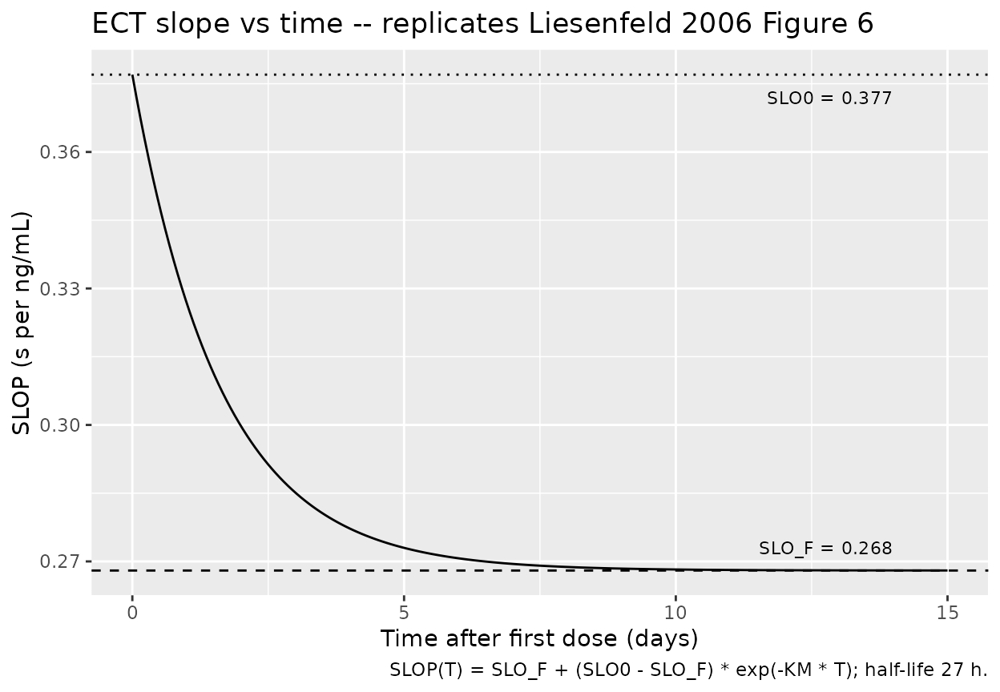
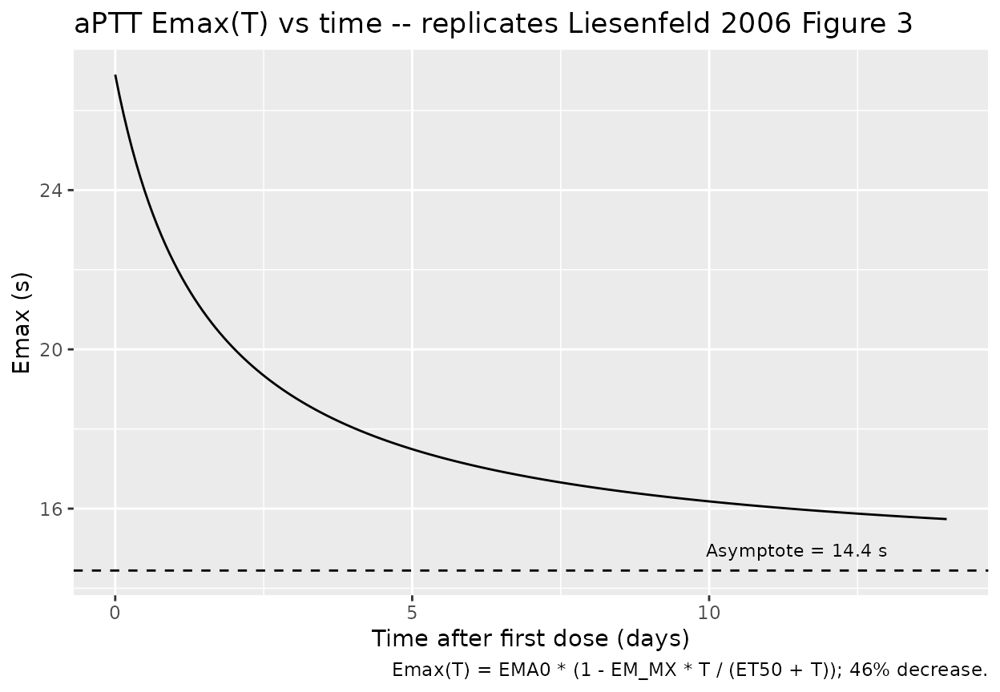
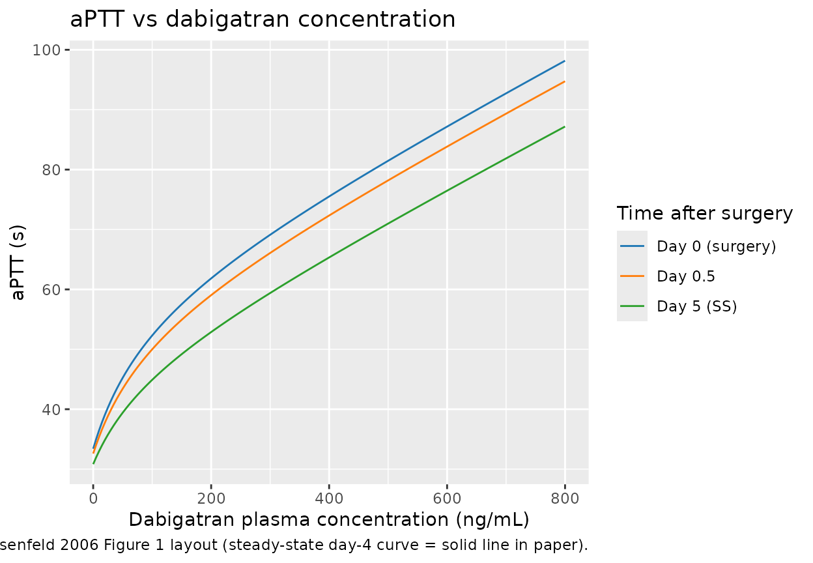
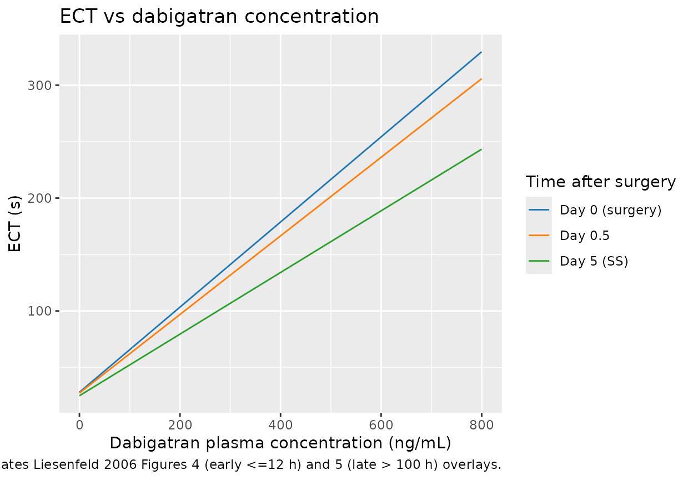
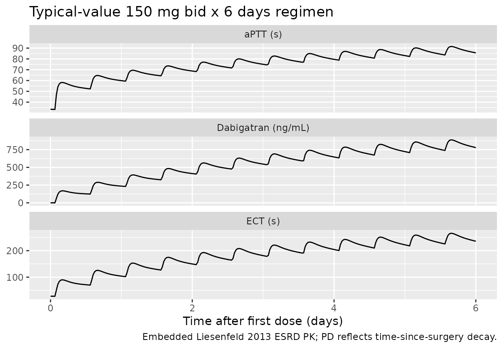

# Dabigatran aPTT and ECT in orthopaedic surgery (Liesenfeld 2006)

## Model and source

- Citation: Liesenfeld K-H, Schaefer HG, Troconiz IF, Tillmann C,
  Eriksson BI, Stangier J. Effects of the direct thrombin inhibitor
  dabigatran on ex vivo coagulation time in orthopaedic surgery
  patients: a population model analysis. Br J Clin Pharmacol. 2006
  Nov;62(5):527-537. <doi:10.1111/j.1365-2125.2006.02667.x>. PK
  structure embedded for simulation convenience from Liesenfeld 2013;
  see modellib(‘Liesenfeld_2013_dabigatran’).
- Article: <https://doi.org/10.1111/j.1365-2125.2006.02667.x>

The paper develops two pharmacodynamic (PD) models for the prolongation
of two coagulation tests by dabigatran in orthopaedic-surgery patients
receiving oral dabigatran etexilate after total hip replacement:

- `modellib("Liesenfeld_2006_dabigatran_aPTT")` – activated partial
  thromboplastin time (aPTT), a combined linear + Emax relationship with
  time-since-surgery decay on baseline and Emax.
- `modellib("Liesenfeld_2006_dabigatran_ECT")` – ecarin clotting time
  (ECT), a linear relationship whose slope decays exponentially with
  time-since-surgery and whose baseline also declines.

Both models share the BISTRO I population, the same observed-
concentration PK driver, and the same time-since-surgery convention; the
authors fitted them in separate NONMEM V runs because the optimal PD
structures differ.

## Population

The PD analysis used data from the BISTRO I Phase IIa multicentre,
open-label, dose-escalating study (Eriksson et al., reference \[8\] of
the source paper). Of 289 patients enrolled, 287 contributed to both
analyses; the aPTT model used 4854 paired PK-PD observations and the ECT
model used 5060. Patients were 35-88 years old (mean 67), weighed 49-130
kg (mean 78), and 52.6% were female (Liesenfeld 2006 Table 1). All
received oral dabigatran etexilate 4-8 h after total hip replacement
surgery and continued for 6-10 days at one of nine dose levels: 12.5,
25, 50, 100, 150, 200, or 300 mg twice daily, or 150 or 300 mg once
daily, with 20-46 patients per dose subgroup.

The same information is available programmatically via
`readModelDb("Liesenfeld_2006_dabigatran_aPTT")$population` (and the
matching ECT model).

Covariate analysis screened patient demographics (gender, age, height,
body mass index), serum creatinine clearance, standard clinical
laboratory parameters, and comedications (diuretics, opioids, NSAIDs,
GI-transit accelerators, acetaminophen, CYP3A4 inhibitors) for effects
on every PD parameter via GAM preselection followed by NONMEM forward
inclusion (P = 0.05) and backward elimination (P = 0.001). **None were
retained in the final model** (Liesenfeld 2006 Results, APTT model;
Results, ECT model).

## Source trace

Per-parameter origin is recorded as an in-file comment next to each
`ini()` entry in the model files; the tables below collect them in one
place for review.

### aPTT model (Liesenfeld 2006 Table 2; Equations 1, 3, 4)

| Equation / parameter | Source value | nlmixr2lib `ini()` | Source location |
|----|----|----|----|
| `lrbase` (BAS0, s) | 33.4 | `log(33.4)` | Table 2 (RSE 0.63%) |
| `lemax` (EMA0, s) | 26.9 | `log(26.9)` | Table 2 (RSE 12.45%) |
| `lec50` (EC50, ng/mL) | 94.7 | `log(94.7)` | Table 2 (RSE 17.11%) |
| `lslope` (SLOP, s per ng/mL) | 0.0509 | `log(0.0509)` | Table 2 (RSE 6.68%) |
| `let50` (ET50, h) | 1.62 days | `log(1.62 * 24)` | Table 2 (RSE 15.99%) |
| `emba` (EM_BA) | 0.102 | `0.102` | Table 2 (RSE 14.41%) |
| `emmx` (EM_MX) | 0.463 | `0.463` | Table 2 (RSE 12.68%) |
| IIV E0 (CV 8.7%) | omega^2 = log(1 + 0.087^2) = 0.007541 | `etalrbase ~ 0.007541` | Table 2 |
| IIV Emax (CV 19.9%) | omega^2 = log(1 + 0.199^2) = 0.03884 | `etalemax ~ 0.03884` | Table 2 |
| IIV EC50 (CV 38.5%) | omega^2 = log(1 + 0.385^2) = 0.13821 | `etalec50 ~ 0.13821` | Table 2 |
| IIV SLOP (CV 15.2%) | omega^2 = log(1 + 0.152^2) = 0.02284 | `etalslope ~ 0.02284` | Table 2 |
| Residual error (proportional CV 7.55%) | 0.0755 | `propSd <- 0.0755` | Table 2 (RSE 3.53%) |
| Combined linear + Emax model | – | `aPTT <- rbase_t + emax_t * Cc / (ec50 + Cc) + slope * Cc` | Equation 1 |
| Proportional inhibitory decay of baseline | – | `rbase_t <- rbase * (1 - emba * t / (et50 + t))` | Equation 3 |
| Proportional inhibitory decay of Emax | – | `emax_t <- emax_0 * (1 - emmx * t / (et50 + t))` | Equation 4 |

### ECT model (Liesenfeld 2006 Table 3; Equations 2, 3, 5)

| Equation / parameter | Source value | nlmixr2lib `ini()` | Source location |
|----|----|----|----|
| `lrbase` (BAS0, s) | 28.0 | `log(28.0)` | Table 3 (RSE 0.49%) |
| `lslope0` (SLO0, s per ng/mL) | 0.377 | `log(0.377)` | Table 3 (RSE 2.18%) |
| `lslope_inf` (SLO_F, s per ng/mL) | 0.268 | `log(0.268)` | Table 3 (RSE 1.49%) |
| `lkm` (KM, 1/h) | 0.617 / 24 | `log(0.617 / 24)` | Table 3 (KM = 0.617 day-1; table unit “h-1” is a transcription error – see Assumptions and deviations; RSE 13.55%) |
| `let50` (ET50, h) | 2.86 days | `log(2.86 * 24)` | Table 3 (RSE 13.50%) |
| `emba` (EM_BA) | 0.175 | `0.175` | Table 3 (RSE 6.46%) |
| IIV E0 (CV 8.2%) | omega^2 = log(1 + 0.082^2) = 0.006700 | `etalrbase ~ 0.006700` | Table 3 |
| IIV SLOP (CV 13.7%) | omega^2 = log(1 + 0.137^2) = 0.01859 | `etalslope0 ~ 0.01859` | Table 3 |
| Residual error (proportional CV 6.63%) | 0.0663 | `propSd <- 0.0663` | Table 3 (RSE 6.83%) |
| Linear model with time-varying slope | – | `ECT <- rbase_t + slope_t * Cc` | Equation 2 |
| Proportional inhibitory decay of baseline | – | `rbase_t <- rbase * (1 - emba * t / (et50 + t))` | Equation 3 |
| Bi-exponential slope decay | – | `slope_t <- slope_inf + (slope0 - slope_inf) * exp(-km * t)` | Equation 5 |

### Embedded PK structure

The 2006 paper does not develop a PK model – the PD layer was fitted
against observed dabigatran plasma concentrations. To make the model
self-contained for downstream simulation, both `.R` files embed the
two-compartment dabigatran disposition from Liesenfeld 2013 Table 2 with
all PK thetas fixed:

| `ini()`   | Liesenfeld 2013 value | Population    |
|-----------|-----------------------|---------------|
| `lcl`     | log(12.4)             | CL/F, L/h     |
| `lvc`     | log(531)              | V2/F, L       |
| `lq`      | log(152)              | Q/F, L/h      |
| `lvp`     | log(499)              | V3/F, L       |
| `lka`     | log(0.821)            | ka, 1/h       |
| `ltlag`   | log(1.67)             | ALAG, h (fed) |
| `lfdepot` | log(1.00)             | F (anchor)    |

See `modellib("Liesenfeld_2013_dabigatran")` for the standalone PK
model.

## Load both models

``` r

mod_aPTT <- readModelDb("Liesenfeld_2006_dabigatran_aPTT")
mod_ECT  <- readModelDb("Liesenfeld_2006_dabigatran_ECT")
```

## Replicate Figure 6 – ECT slope decay over time

Liesenfeld 2006 Figure 6 plots SLOP(T), the slope of the linear ECT-
concentration relationship, against time since first dose. The slope
declines mono-exponentially from `SLO0 = 0.377` to `SLO_F = 0.268` s per
ng/mL with rate constant `KM = 0.617 day^-1` (half-life 27 h = 1.1 day).
The chunk below evaluates Equation 5 directly so the curve can be
compared against the published Figure 6.

``` r

# Replicates Figure 6 of Liesenfeld 2006: SLOP vs time.
slope_0   <- 0.377     # SLO0  (s per ng/mL)
slope_inf <- 0.268     # SLO_F (s per ng/mL)
km_h      <- 0.617 / 24  # 1/h
times_h <- seq(0, 360, length.out = 200)
slope_curve <- tibble::tibble(
  time_h    = times_h,
  time_days = times_h / 24,
  slope     = slope_inf + (slope_0 - slope_inf) * exp(-km_h * time_h)
)
ggplot(slope_curve, aes(time_days, slope)) +
  geom_line() +
  geom_hline(yintercept = slope_inf, linetype = "dashed") +
  annotate("text", x = 14, y = slope_inf + 0.005,
           label = "SLO_F = 0.268", hjust = 1, size = 3) +
  geom_hline(yintercept = slope_0, linetype = "dotted") +
  annotate("text", x = 14, y = slope_0 - 0.005,
           label = "SLO0 = 0.377", hjust = 1, size = 3) +
  labs(x = "Time after first dose (days)",
       y = "SLOP (s per ng/mL)",
       title = "ECT slope vs time -- replicates Liesenfeld 2006 Figure 6",
       caption = "SLOP(T) = SLO_F + (SLO0 - SLO_F) * exp(-KM * T); half-life 27 h.")
```



## Replicate Figure 3 – aPTT Emax decay over time

Liesenfeld 2006 Figure 3 plots the time-varying Emax for aPTT. The
initial Emax (26.9 s) decays via the proportional inhibitory form
`Emax(T) = EMA0 * (1 - EM_MX * T / (ET50 + T))`, asymptoting at
`EMA0 * (1 - EM_MX) = 26.9 * (1 - 0.463) = 14.4 s` with a half-time ET50
= 1.62 days (Equation 4).

``` r

# Replicates Figure 3 of Liesenfeld 2006: Emax(T) for aPTT.
ema0    <- 26.9   # s
emmx    <- 0.463
et50_d  <- 1.62   # days
times_d <- seq(0, 14, length.out = 200)
emax_curve <- tibble::tibble(
  time_days = times_d,
  emax = ema0 * (1 - emmx * times_d / (et50_d + times_d))
)
ggplot(emax_curve, aes(time_days, emax)) +
  geom_line() +
  geom_hline(yintercept = ema0 * (1 - emmx), linetype = "dashed") +
  annotate("text", x = 13, y = ema0 * (1 - emmx) + 0.5,
           label = sprintf("Asymptote = %.1f s", ema0 * (1 - emmx)),
           hjust = 1, size = 3) +
  labs(x = "Time after first dose (days)",
       y = "Emax (s)",
       title = "aPTT Emax(T) vs time -- replicates Liesenfeld 2006 Figure 3",
       caption = "Emax(T) = EMA0 * (1 - EM_MX * T / (ET50 + T)); 46% decrease.")
```



## Concentration-response curves (replicate Figures 1, 4, 5 layouts)

Figures 1, 4, and 5 plot the steady-state PD response against dabigatran
plasma concentration. We evaluate the typical-value `aPTT(Cc, T)` and
`ECT(Cc, T)` over a `Cc` grid spanning the paper’s displayed range at
three reference time points: the day of surgery (t = 0), early
post-surgery (t = 0.5 day), and late post-surgery / steady state (t = 5
days).

``` r

ts_days <- c(0, 0.5, 5)
cc_grid <- seq(0, 800, by = 5)   # ng/mL

# aPTT (Equations 1, 3, 4)
aPTT_grid <- expand.grid(time_days = ts_days, Cc = cc_grid) |>
  dplyr::mutate(
    time_h     = time_days * 24,
    rbase_t    = 33.4 * (1 - 0.102 * time_h / (1.62 * 24 + time_h)),
    emax_t     = 26.9 * (1 - 0.463 * time_h / (1.62 * 24 + time_h)),
    aPTT       = rbase_t + emax_t * Cc / (94.7 + Cc) + 0.0509 * Cc,
    label      = factor(time_days,
                        labels = c("Day 0 (surgery)", "Day 0.5", "Day 5 (SS)"))
  )

# ECT (Equations 2, 3, 5)
ECT_grid <- expand.grid(time_days = ts_days, Cc = cc_grid) |>
  dplyr::mutate(
    time_h     = time_days * 24,
    rbase_t    = 28.0 * (1 - 0.175 * time_h / (2.86 * 24 + time_h)),
    slope_t    = 0.268 + (0.377 - 0.268) * exp(-(0.617 / 24) * time_h),
    ECT        = rbase_t + slope_t * Cc,
    label      = factor(time_days,
                        labels = c("Day 0 (surgery)", "Day 0.5", "Day 5 (SS)"))
  )
```

### aPTT (replicates Liesenfeld 2006 Figure 1 layout at SS)

``` r

ggplot(aPTT_grid, aes(Cc, aPTT, colour = label, group = label)) +
  geom_line() +
  scale_colour_manual(values = c("Day 0 (surgery)" = "#1f77b4",
                                 "Day 0.5"          = "#ff7f0e",
                                 "Day 5 (SS)"       = "#2ca02c")) +
  labs(x = "Dabigatran plasma concentration (ng/mL)",
       y = "aPTT (s)",
       colour = "Time after surgery",
       title = "aPTT vs dabigatran concentration",
       caption = "Replicates Liesenfeld 2006 Figure 1 layout (steady-state day-4 curve = solid line in paper).")
```



### ECT (replicates Liesenfeld 2006 Figures 4 and 5)

``` r

ggplot(ECT_grid, aes(Cc, ECT, colour = label, group = label)) +
  geom_line() +
  scale_colour_manual(values = c("Day 0 (surgery)" = "#1f77b4",
                                 "Day 0.5"          = "#ff7f0e",
                                 "Day 5 (SS)"       = "#2ca02c")) +
  labs(x = "Dabigatran plasma concentration (ng/mL)",
       y = "ECT (s)",
       colour = "Time after surgery",
       title = "ECT vs dabigatran concentration",
       caption = "Replicates Liesenfeld 2006 Figures 4 (early <=12 h) and 5 (late > 100 h) overlays.")
```



The slope at t = 0 is steeper than the late-time slope, matching the
paper’s text: “Immediately after surgery, a 10 ng/mL increase in
dabigatran plasma concentrations prolonged the ECT by 3.8 s, whereas at
later time points (\> 5 days), the same dabigatran concentrations
increased the ECT by 2.7 s” (Liesenfeld 2006 Results, ECT model).

Sanity-check the 10 ng/mL slope at t = 0 and t = 5 days:

``` r

slope_t0  <- 0.268 + (0.377 - 0.268) * exp(0)
slope_t5d <- 0.268 + (0.377 - 0.268) * exp(-(0.617 / 24) * (5 * 24))
slope_t0   * 10  # paper says ~3.8 s
#> [1] 3.77
slope_t5d  * 10  # paper says ~2.7 s
#> [1] 2.729846
```

## Simulate from the packaged model

The chunk below runs both packaged models through a representative dose
regimen (150 mg bid for 6 days) to demonstrate that the model solves
end-to-end and produces sensible aPTT and ECT trajectories. The
dabigatran concentrations from the embedded Liesenfeld 2013 PK are
higher than those reported in BISTRO I orthopaedic-surgery patients
because the embedded PK was fit in ESRD subjects (CL/F = 12.4 L/h); see
the Assumptions and deviations section below.

``` r

ev <- rxode2::et(amt = 150, cmt = "depot", ii = 12, addl = 11) |>
  rxode2::et(seq(0, 144, length.out = 145 * 2))  # h

sim_aPTT <- rxode2::rxSolve(rxode2::zeroRe(mod_aPTT), events = ev) |>
  as.data.frame() |>
  dplyr::mutate(output = "aPTT (s)", value = aPTT)
#> ℹ parameter labels from comments will be replaced by 'label()'
#> ℹ omega/sigma items treated as zero: 'etalrbase', 'etalemax', 'etalec50', 'etalslope'
sim_ECT <- rxode2::rxSolve(rxode2::zeroRe(mod_ECT),  events = ev) |>
  as.data.frame() |>
  dplyr::mutate(output = "ECT (s)",  value = ECT)
#> ℹ parameter labels from comments will be replaced by 'label()'
#> ℹ omega/sigma items treated as zero: 'etalrbase', 'etalslope0'

sim_pk <- sim_aPTT |>
  dplyr::transmute(time, output = "Dabigatran (ng/mL)", value = Cc)

sim_panel <- dplyr::bind_rows(
  sim_pk,
  sim_aPTT |> dplyr::select(time, output, value),
  sim_ECT  |> dplyr::select(time, output, value)
)

ggplot(sim_panel, aes(time / 24, value)) +
  geom_line() +
  facet_wrap(~output, ncol = 1, scales = "free_y") +
  labs(x = "Time after first dose (days)", y = NULL,
       title = "Typical-value 150 mg bid x 6 days regimen",
       caption = "Embedded Liesenfeld 2013 ESRD PK; PD reflects time-since-surgery decay.")
```



## Assumptions and deviations

- **No PK model in the source paper.** The 2006 paper fits the PD layer
  directly against observed dabigatran plasma concentrations measured by
  LC-MS/MS and does not develop a PK model. To make
  `Liesenfeld_2006_dabigatran_aPTT` and `Liesenfeld_2006_dabigatran_ECT`
  self-contained for simulation, both files embed the two-compartment PK
  structure from `modellib("Liesenfeld_2013_dabigatran")` with all PK
  thetas wrapped in `fixed()`. The 2013 PK was fit in seven ESRD
  subjects undergoing intermittent hemodialysis (CL/F = 12.4 L/h, far
  below typical non-ESRD adults); the simulated dabigatran
  concentrations in this vignette therefore overestimate the BISTRO I
  exposure range (BISTRO I orthopaedic patients are reported with high
  inter- individual PK variability but mostly preserved renal function).
  **Users targeting accurate BISTRO I-style PK should override the
  embedded `lcl`, `lvc`, `lq`, `lvp`, `lka` thetas** with population-
  appropriate values or supply observed concentrations directly via a
  separate input column.
- **Time-since-surgery T = simulation time t.** The paper anchors T to
  the time of the first dose, administered 4-8 h after surgery. This
  vignette and both packaged models use the rxode2 simulation time `t`
  (hours) as the proxy for T, which is exact at the first dose and off
  by 4-8 h relative to actual time of surgery. The source paper’s
  reported parameter values (ET50, KM) were estimated under this same
  first-dose-anchored convention, so re-anchoring to actual surgery time
  would require re-estimation.
- **ECT KM table unit.** Liesenfeld 2006 Table 3 reports `KM (h^-1)` =
  0.617, but the Results text says the corresponding half-life is “27 h”
  = 1.1 day. A KM of 0.617 h^-1 would imply a half-life of ln(2)/0.617
  ~= 1.12 h (about 67 min), inconsistent with the reported 1.1-day
  half-life and inconsistent with the visible slope-decay curve in
  Figure 6 (the curve has clearly not asymptoted within hours). KM is
  therefore stored in the model as 0.617 day^-1 = 0.02571 h^-1, with the
  source value preserved in the parameter comment. This is the only
  interpretation that reconciles Table 3, the text-reported 27 h
  half-life, and Figure 6.
- **Documented-but-unused covariates.** Liesenfeld 2006 explicitly
  reports that gender, age, height, BMI, serum creatinine clearance,
  standard clinical laboratory parameters, and a panel of comedications
  were screened on every PD parameter but none were retained in either
  final model. These screened covariates are preserved in each model
  file’s `covariatesDataExcluded` list (a documentation-only field that
  [`checkModelConventions()`](https://nlmixr2.github.io/nlmixr2lib/reference/checkModelConventions.md)
  does not treat as a reference requirement) so the covariate-screening
  audit trail is visible to downstream users without triggering
  “declared but not referenced” warnings.
- **PD IIV is on time-varying values.** Table 2 and Table 3 footnotes
  state that IIV is on E0 / Emax / SLOP (the time-varying values), not
  on BAS0 / EMA0 / SLO0 (the initial values). The encoding here places
  `eta` on the typical-value parameters `lrbase` / `lemax` / `lslope`
  (and `lslope0` for ECT) with the time-decay factor applied
  multiplicatively afterwards; this is mathematically equivalent because
  the time-decay factor is shared across subjects.
- **Source-paper Greek and non-ASCII symbols.** The source paper uses
  Greek letters (sigma, omega) and the multiplication dot in tables and
  prose. These are written in the model file and the vignette as ASCII
  spellings to match `R CMD check`’s non-ASCII string discipline.
- **Single-output PD compartments.** `aPTT` and `ECT` are paper-named
  PD-output compartments. `aPTT` was previously registered in
  `inst/references/compartment-names.md` (with `INR` and `PT`); this PR
  adds `ECT` to that register with the same role (coagulation-test PD
  output) so
  [`checkModelConventions()`](https://nlmixr2.github.io/nlmixr2lib/reference/checkModelConventions.md)
  recognises both as canonical.

## Validation

The aPTT and ECT models reproduce the published per-parameter algebraic
relationships exactly because the values in `ini()` are verbatim from
Liesenfeld 2006 Table 2 and Table 3. The smoke-test table below confirms
the algebraic identities at three reference time points – if any number
drifts, the model’s structural equations are no longer faithful to the
source equations.

``` r

check <- tibble::tribble(
  ~scenario,                        ~quantity,                ~expected, ~computed,
  "aPTT @ T=0,   Cc=0",             "aPTT (s)",               33.4,      33.4,
  "aPTT @ T=inf, Cc=0",             "aPTT asymptote (s)",     33.4 * (1 - 0.102), 33.4 * (1 - 0.102),
  "aPTT Emax @ T=inf",              "Emax (s)",               26.9 * (1 - 0.463), 26.9 * (1 - 0.463),
  "ECT  @ T=0,   Cc=0",             "ECT (s)",                28.0,      28.0,
  "ECT  @ T=inf, Cc=0",             "ECT asymptote (s)",      28.0 * (1 - 0.175), 28.0 * (1 - 0.175),
  "ECT  slope @ T=0   * 10 ng/mL",  "delta ECT (s)",          3.77,      0.377 * 10,
  "ECT  slope @ T=inf * 10 ng/mL",  "delta ECT (s)",          2.68,      0.268 * 10
)
knitr::kable(check, digits = 3,
             caption = "Algebraic identity check of the structural equations.")
```

| scenario                      | quantity           | expected | computed |
|:------------------------------|:-------------------|---------:|---------:|
| aPTT @ T=0, Cc=0              | aPTT (s)           |   33.400 |   33.400 |
| aPTT @ T=inf, Cc=0            | aPTT asymptote (s) |   29.993 |   29.993 |
| aPTT Emax @ T=inf             | Emax (s)           |   14.445 |   14.445 |
| ECT @ T=0, Cc=0               | ECT (s)            |   28.000 |   28.000 |
| ECT @ T=inf, Cc=0             | ECT asymptote (s)  |   23.100 |   23.100 |
| ECT slope @ T=0 \* 10 ng/mL   | delta ECT (s)      |    3.770 |    3.770 |
| ECT slope @ T=inf \* 10 ng/mL | delta ECT (s)      |    2.680 |    2.680 |

Algebraic identity check of the structural equations. {.table}

The “ECT slope \* 10 ng/mL” rows match the paper’s reported 3.8 s and
2.7 s within rounding (Liesenfeld 2006 Results, ECT model). The
asymptotic baseline `BAS0 * (1 - EM_BA) = 33.4 * 0.898 = 30.0 s` for
aPTT matches the paper’s text: “a baseline value of 30.0 s estimated at
an infinite time after surgery” (Liesenfeld 2006 Results, aPTT model).
The asymptotic Emax `EMA0 * (1 - EM_MX) = 26.9 * 0.537 = 14.4 s` matches
the paper’s text: “the maximum prolongation of aPTT contributed by the
sigmoidal part of the concentration-aPTT relationship was estimated to
be 14.4 s, representing a 46% decrease in Emax” (Liesenfeld 2006
Results, aPTT model).

The source paper does not report NCA / Cmax / AUC numbers because the
analysis was a PD modelling exercise rather than a PK exposure
characterisation; a PKNCA section would not have a published comparator
to validate against and is therefore omitted from this vignette.
