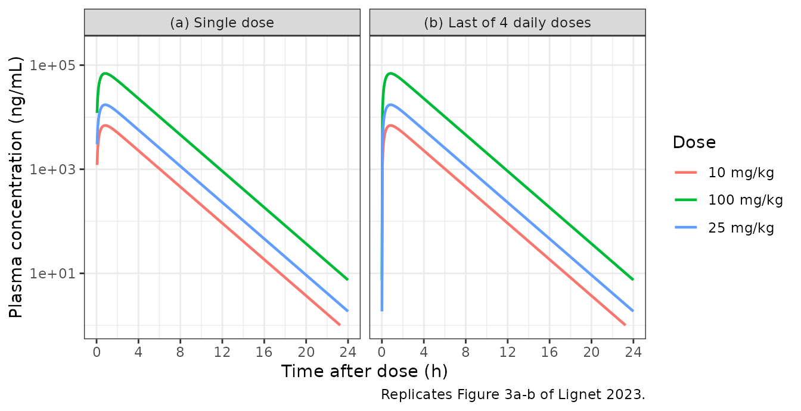
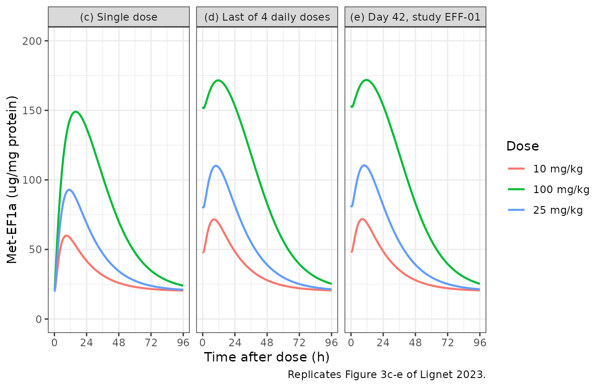
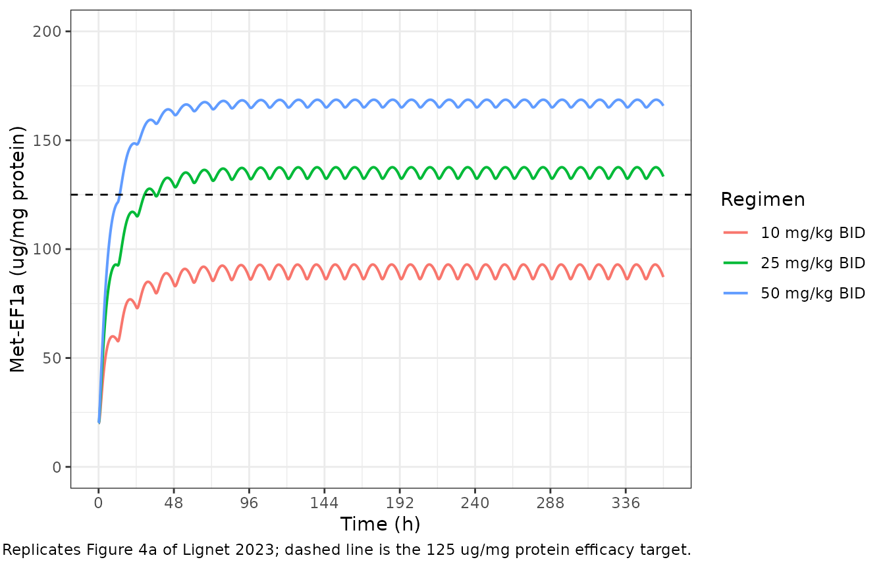
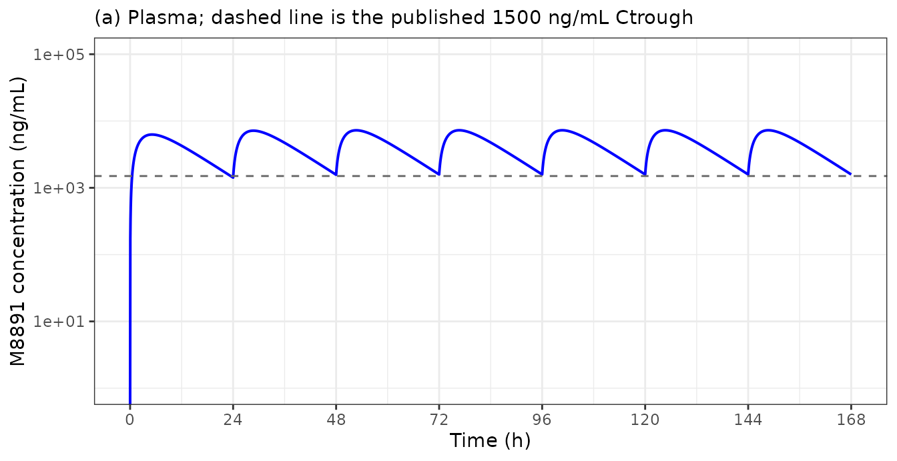
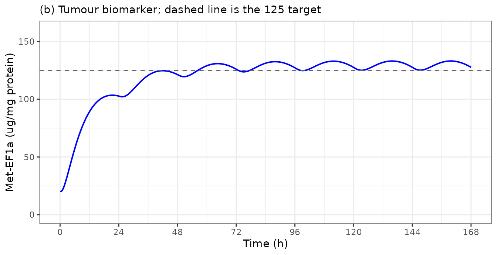

# M8891 preclinical and translational PK/PD (Lignet 2023)

## Model and source

M8891 is a selective, reversible inhibitor of methionine aminopeptidase
2 (MetAP2). Lignet 2023 reports two linked models, and this paper
therefore contributes two model files to `nlmixr2lib`:

- `Lignet_2023_m8891_mouse` – the preclinical PK/PD model estimated in
  Caki-1 renal-carcinoma xenograft-bearing mice.
- `Lignet_2023_m8891_human` – the translational human projection, in
  which the mouse PK component is replaced by human clearance and volume
  predicted from preclinical scaling while the PD component is carried
  over unchanged.

``` r

mouse <- readModelDb("Lignet_2023_m8891_mouse")
human <- readModelDb("Lignet_2023_m8891_human")
```

- Citation: Lignet F, Friese-Hamim M, Jaehrling F, El Bawab S,
  Rohdich F. Preclinical Pharmacokinetics and Translational
  Pharmacokinetic/Pharmacodynamic Modeling of M8891, a Potent and
  Reversible Inhibitor of Methionine Aminopeptidase 2. Pharm Res.
  2023;40(12):3011-3023. <doi:10.1007/s11095-023-03611-z>.
- Mouse model: Preclinical (mouse, Caki-1 renal-carcinoma xenograft).
  One-compartment oral PK of M8891, a selective and reversible
  methionine aminopeptidase 2 (MetAP2) inhibitor, with first-order
  absorption and elimination, linked through an effect compartment to a
  turnover model for the tumour target-engagement biomarker Met-EF1a
  (uncleaved methionine-elongation-factor-1-alpha). M8891 inhibits the
  first-order degradation of Met-EF1a, so the biomarker accumulates
  above its kin/kout baseline. Naive-pooled fit (Phoenix WinNonlin 6.4)
  to single-dose and 4-day repeated-dose PK/PD data at 10, 25, and 100
  mg/kg p.o.; the authors report no inter-individual variability because
  a nonlinear mixed-effects fit did not converge on this dataset.
- Human model: Predicted-human translational PK/PD model for M8891, a
  selective and reversible methionine aminopeptidase 2 (MetAP2)
  inhibitor. One-compartment oral PK whose disposition (CL, Vss) is the
  mean of three preclinical-to-human scaling methods and whose
  absorption rate constant ka comes from a GastroPlus PBPK model,
  coupled to the effect-compartment plus Met-EF1a turnover PD model
  estimated in Caki-1 xenograft-bearing mice. No human subjects were
  dosed in this analysis; the model is the forward projection that was
  used to select the M8891 dose for the Phase Ia study NCT03138538. PD
  parameters are carried over unchanged from the mouse model on the
  hypothesis that the same Met-EF1a modulation level is associated with
  efficacy in humans.
- Article: <https://doi.org/10.1007/s11095-023-03611-z>
- Supplementary Materials: <https://doi.org/10.1007/s11095-023-03611-z>
  (online supplement; Tables S6-S8 and the GastroPlus system
  parameterisation are cited below)

## Population

The PK/PD model was estimated in **female CD1 nu/nu mice** bearing
subcutaneous Caki-1 (ATCC HTB-46) human renal-cell-carcinoma xenografts.
Animals were inoculated at 5-6 weeks of age and randomised into
treatment groups (n = 5 per group) once tumours reached 300-500 mm3. Two
studies contributed the modelling dataset: PK/PD-01 (a single oral
administration) and PK/PD-02 (four daily oral administrations), each at
10, 25, and 100 mg/kg of M8891 in 0.25% Methocel. Plasma and tumour
tissue were collected 1, 7, 24, 48, 72, and 96 h after the last dose;
because animals were euthanised at each sampling time the design is
serial-sacrifice rather than serial-sampling. A third study, EFF-01,
provided the external validation shown in Lignet 2023 Fig. 3e, and
EFF-02 provided the tumour-growth-inhibition data used to identify the
minimal efficacious dose.

Because a nonlinear mixed-effects fit did not converge on this dataset
(Lignet 2023 Discussion), the authors used a naive-pooled fit in Phoenix
WinNonlin 6.4. Neither model therefore carries inter-individual
variability.

The **human** model describes no dosed subjects at all: it is the
forward projection used to select doses for the Phase Ia study
NCT03138538. Human clearance and volume of distribution are the mean of
three preclinical-to- human scaling methods applied to single-dose
intravenous PK in NMRI mice, Wistar rats, beagle dogs, and cynomolgus
monkeys, and the absorption rate constant comes from a GastroPlus 9.5
PBPK/ACAT model calibrated on rat and dog data. The reference body
weight is 70 kg (Lignet 2023 Supplementary Materials, “System
Parameterization”: “Body weight (compartmental PK model) 70 kg”).

The same information is available programmatically via each model’s
`population` metadata
(`readModelDb("Lignet_2023_m8891_mouse")()$population`).

## Model structure

The structure is shown in Lignet 2023 Fig. 1. M8891 plasma concentration
follows a one-compartment model with first-order absorption and
elimination. Plasma drives a hypothetical effect compartment with the
same first-order rate constant `ke0` in and out. The effect-compartment
concentration then inhibits the first-order **degradation** of the
tumour target-engagement biomarker Met-EF1a (uncleaved
methionine-elongation-factor-1-alpha), which is otherwise held at the
turnover steady state `kin / kout`. Because the drug blocks degradation,
the biomarker **accumulates above** its baseline:

``` math
\frac{dC_e}{dt} = k_{e0}\,(C - C_e)
```

``` math
\frac{dE}{dt} = k_{in} - k_{out}\,E\left(1 - \frac{I_{max}\,C_e}{C_e + IC_{50}}\right)
```

The undrugged baseline is `kin / kout` = 29.1 / 1.45 = 20.1 ug per mg
protein, and the maximally-inhibited asymptote is
`kin / (kout * (1 - Imax))` = 223 ug per mg protein.

## Source trace

The per-parameter origin is recorded as an in-file comment next to each
`ini()` entry in `inst/modeldb/specificDrugs/Lignet_2023_m8891_mouse.R`
and `inst/modeldb/specificDrugs/Lignet_2023_m8891_human.R`. The table
below collects them in one place for review.

| Model | Equation / parameter | Value | Source location |
|----|----|----|----|
| both | `d/dt(depot)`, `d/dt(central)` (1-cmt oral) | n/a | Lignet 2023 Eq. (3), and Eq. (4) for `ke = CL/V` |
| both | `d/dt(effect)` (effect compartment) | n/a | Lignet 2023 Eq. (5) and Fig. 1 |
| both | `d/dt(metef1a)` (turnover, inhibition of `kout`) | n/a | Lignet 2023 Eq. (6) and Fig. 1 |
| both | `metef1a(0) = kin/kout` | 20.1 ug/mg protein | Derived from Lignet 2023 Table IV; matches the pre-dose and 96-h levels in Fig. 3c-d |
| mouse | `lka` (fixed) | 2.7 1/h | Lignet 2023 Table IV, “Estimate CV (%)” column reads “Fixed” |
| mouse | `lcl` (CL/F) | 0.415 L/h/kg | Lignet 2023 Table IV (CV 13.8%) |
| mouse | `lvc` (V/F) | 1.034 L/kg | Lignet 2023 Table IV (CV 15.7%) |
| both | `lke0` | 0.0566 1/h | Lignet 2023 Table IV (CV 7.3%) |
| both | `lkin` | 29.1 ug/mg protein/h | Lignet 2023 Table IV (CV 22%) |
| both | `lkout` | 1.45 1/h | Lignet 2023 Table IV (CV 25.7%) |
| both | `limax` | 0.91 | Lignet 2023 Table IV (CV 1.3%) |
| both | `lic50` | 340 ng/mL = 0.340 mg/L | Lignet 2023 Table IV (CV 17%); Results also quote 0.88 uM total / 28 nM free |
| human | `lka` (fixed) | 0.35 1/h | Lignet 2023 Results, “PBPK Modeling”; GastroPlus prediction |
| human | `lcl` (CL/F) | 1.4 L/h at 70 kg | Lignet 2023 Table III bold row: mean CL = 0.020 +/- 0.002 L/h/kg |
| human | `lvc` (V/F) | 14.7 L at 70 kg | Lignet 2023 Table III bold row: mean Vss = 0.21 +/- 0.017 L/kg |
| human | `WT` reference weight | 70 kg | Lignet 2023 Supplementary Materials, “System Parameterization” table |
| both | `propSd`, `propSd_MetEF1a` | fixed at 0 | Form from Lignet 2023 Results (“multiplicative error model”); magnitude not reported anywhere |

Validation targets used below:

| Target | Value | Source location |
|----|----|----|
| Mouse plasma Cmax, single dose | ~7e3 / 1.7e4 / 7e4 ng/mL at 10 / 25 / 100 mg/kg | Lignet 2023 Fig. 3a (read from the figure) |
| Mouse Met-EF1a peak, single dose | ~60 / 95 / 155 ug/mg protein | Lignet 2023 Fig. 3c (read from the figure) |
| Mouse Met-EF1a peak, 4th daily dose | ~72 / 113 / 180 ug/mg protein | Lignet 2023 Fig. 3d (read from the figure) |
| Mouse Met-EF1a steady state, BID | ~95 / 140 / 175 ug/mg protein at 10 / 25 / 50 mg/kg | Lignet 2023 Fig. 4a (read from the figure) |
| Efficacy target Met-EF1a level | 125 ug/mg protein | Lignet 2023 Results and Conclusion |
| Human t1/2 | 7.3 h | Lignet 2023 Table III, “Mean +/- SD” row |
| Human Ctrough at 150 mg QD | 1500 ng/mL (3.9 uM) | Lignet 2023 Results and Fig. 5a |
| Human steady-state Cmax / Cmin / tmax at 150 mg QD | 6.51 / 1.54 ug/mL, 4.1 h | Lignet 2023 Supplementary Table S7 (GastroPlus ACAT model) |

## Simulated cohorts

Both models are deterministic: the authors report neither
inter-individual variability nor a residual-error magnitude, so a single
typical subject per dose arm reproduces the published curves exactly. No
virtual population is needed and none is simulated (well under the
200-per-arm cap).

Observation rows are placed on the `central` ODE state; `rxode2` returns
the algebraic observables `Cc` and `MetEF1a` as columns on those rows.

``` r

# Build one deterministic arm. Doses land on the `depot` ODE state;
# observations sit on the `central` ODE state with dvid = 1 (this is a
# two-output model, Cc and MetEF1a).
make_arm <- function(id, dose, ii, ndose, tmax, by, label, ...) {
  dosing <- data.frame(
    id = id, time = ii * (seq_len(ndose) - 1L), amt = dose,
    evid = 1L, cmt = "depot", dvid = NA_integer_
  )
  obs <- data.frame(
    id = id, time = seq(0, tmax, by = by), amt = NA_real_,
    evid = 0L, cmt = "central", dvid = 1L
  )
  out <- dplyr::bind_rows(dosing, obs)
  out$treatment <- label
  extra <- list(...)
  for (nm in names(extra)) out[[nm]] <- extra[[nm]]
  out[order(out$time, -out$evid), ]
}

# `useLinCmt = FALSE` is required: rxode2's automatic ODE -> linCmt
# conversion corrupts the dvid -> cmt mapping for multi-output models.
solve_arms <- function(mod, events, keep = "treatment") {
  out <- as.data.frame(
    rxode2::rxSolve(mod, events, keep = keep, useLinCmt = FALSE)
  )
  if (!"id" %in% names(out)) out$id <- events$id[1]
  # Guard against rxSolve silently dropping subjects.
  stopifnot(
    length(unique(out$id)) == length(unique(events$id)),
    !anyNA(out$Cc), !anyNA(out$MetEF1a)
  )
  out
}

mouse_doses <- c(10, 25, 100)
mouse_labels <- paste(mouse_doses, "mg/kg")
```

## Mouse PK: replicating Lignet 2023 Figure 3a-b

``` r

ev_sd <- dplyr::bind_rows(lapply(seq_along(mouse_doses), function(i) {
  make_arm(i, mouse_doses[i], ii = 24, ndose = 1L, tmax = 96, by = 0.05,
           label = mouse_labels[i])
}))
stopifnot(!anyDuplicated(unique(ev_sd[, c("id", "time", "evid")])))
sim_sd <- solve_arms(mouse, ev_sd)
#> Warning: multi-subject simulation without without 'omega'

ev_qd4 <- dplyr::bind_rows(lapply(seq_along(mouse_doses), function(i) {
  make_arm(i, mouse_doses[i], ii = 24, ndose = 4L, tmax = 168, by = 0.05,
           label = mouse_labels[i])
}))
sim_qd4 <- solve_arms(mouse, ev_qd4)
#> Warning: multi-subject simulation without without 'omega'
```

``` r

# Replicates Figure 3a-b of Lignet 2023: M8891 plasma concentration in mice
# after (a) a single oral dose and (b) the last of four daily oral doses.
pk_plot_data <- dplyr::bind_rows(
  sim_sd |>
    dplyr::filter(time > 0, time <= 24) |>
    dplyr::mutate(tad = time, panel = "(a) Single dose"),
  sim_qd4 |>
    dplyr::filter(time >= 72, time <= 96) |>
    dplyr::mutate(tad = time - 72, panel = "(b) Last of 4 daily doses")
)

ggplot(pk_plot_data, aes(tad, Cc * 1000, colour = treatment)) +
  geom_line(linewidth = 0.8) +
  facet_wrap(~panel) +
  scale_y_log10(limits = c(1, 2e5)) +
  scale_x_continuous(breaks = seq(0, 24, by = 4)) +
  labs(
    x = "Time after dose (h)", y = "Plasma concentration (ng/mL)",
    colour = "Dose",
    caption = "Replicates Figure 3a-b of Lignet 2023."
  ) +
  theme_bw()
#> Warning: Removed 31 rows containing missing values or values outside the scale range
#> (`geom_line()`).
```



## Mouse PD: replicating Lignet 2023 Figure 3c-e

Study EFF-01 dosed animals daily for six weeks; Lignet 2023 Fig. 3e
shows Met-EF1a after the last dose on day 42.

``` r

ev_eff01 <- dplyr::bind_rows(lapply(seq_along(mouse_doses), function(i) {
  make_arm(i, mouse_doses[i], ii = 24, ndose = 42L, tmax = 1080, by = 0.2,
           label = mouse_labels[i])
}))
sim_eff01 <- solve_arms(mouse, ev_eff01)
#> Warning: multi-subject simulation without without 'omega'
```

``` r

# Replicates Figure 3c-e of Lignet 2023: Met-EF1a in Caki-1 xenograft tumour
# tissue after (c) a single dose, (d) the last of four daily doses, and
# (e) the last dose on day 42 of daily dosing (study EFF-01).
pd_plot_data <- dplyr::bind_rows(
  sim_sd |> dplyr::mutate(tad = time, panel = "(c) Single dose"),
  sim_qd4 |>
    dplyr::filter(time >= 72) |>
    dplyr::mutate(tad = time - 72, panel = "(d) Last of 4 daily doses"),
  sim_eff01 |>
    dplyr::filter(time >= 984) |>
    dplyr::mutate(tad = time - 984, panel = "(e) Day 42, study EFF-01")
)

ggplot(pd_plot_data, aes(tad, MetEF1a, colour = treatment)) +
  geom_line(linewidth = 0.8) +
  facet_wrap(~panel) +
  scale_y_continuous(limits = c(0, 200)) +
  scale_x_continuous(breaks = seq(0, 96, by = 24)) +
  labs(
    x = "Time after dose (h)", y = "Met-EF1a (ug/mg protein)",
    colour = "Dose",
    caption = "Replicates Figure 3c-e of Lignet 2023."
  ) +
  theme_bw()
```



The table below compares the simulated peaks against values read off the
published figures. Figure reads are approximate (roughly +/- 5 ug/mg
protein) and are marked as such.

``` r

peak_after <- function(sim, from) {
  sim |>
    dplyr::filter(time >= from) |>
    dplyr::group_by(treatment) |>
    dplyr::summarise(peak = max(MetEF1a), .groups = "drop")
}

peaks <- dplyr::bind_rows(
  peak_after(sim_sd, 0) |> dplyr::mutate(panel = "Fig. 3c single dose"),
  peak_after(sim_qd4, 72) |> dplyr::mutate(panel = "Fig. 3d 4th daily dose")
) |>
  dplyr::left_join(
    tibble::tribble(
      ~panel,                   ~treatment,  ~published,
      "Fig. 3c single dose",    "10 mg/kg",  60,
      "Fig. 3c single dose",    "25 mg/kg",  95,
      "Fig. 3c single dose",    "100 mg/kg", 155,
      "Fig. 3d 4th daily dose", "10 mg/kg",  72,
      "Fig. 3d 4th daily dose", "25 mg/kg",  113,
      "Fig. 3d 4th daily dose", "100 mg/kg", 180
    ),
    by = c("panel", "treatment")
  ) |>
  dplyr::mutate(`% diff` = round(100 * (peak - published) / published, 1)) |>
  dplyr::arrange(panel, match(treatment, mouse_labels)) |>
  dplyr::select(panel, treatment, published, peak, `% diff`) |>
  dplyr::rename(
    "Figure"                            = panel,
    "Dose"                              = treatment,
    "Published (read from figure)"      = published,
    "Simulated"                         = peak
  )

knitr::kable(
  peaks, digits = 1,
  caption = paste(
    "Peak Met-EF1a (ug/mg protein): simulated vs. values read from",
    "Lignet 2023 Figures 3c and 3d. Baseline is kin/kout = 20.1."
  )
)
```

| Figure | Dose | Published (read from figure) | Simulated | % diff |
|:---|:---|---:|---:|---:|
| Fig. 3c single dose | 10 mg/kg | 60 | 59.9 | -0.1 |
| Fig. 3c single dose | 25 mg/kg | 95 | 92.9 | -2.2 |
| Fig. 3c single dose | 100 mg/kg | 155 | 149.0 | -3.9 |
| Fig. 3d 4th daily dose | 10 mg/kg | 72 | 71.6 | -0.5 |
| Fig. 3d 4th daily dose | 25 mg/kg | 113 | 110.2 | -2.5 |
| Fig. 3d 4th daily dose | 100 mg/kg | 180 | 171.5 | -4.7 |

Peak Met-EF1a (ug/mg protein): simulated vs. values read from Lignet
2023 Figures 3c and 3d. Baseline is kin/kout = 20.1. {.table}

## Efficacy target: replicating Lignet 2023 Figure 4a

Efficacy study EFF-02 identified **25 mg/kg BID** as the minimal
efficacious dose in Caki-1 xenografts. Simulating that regimen showed
that steady-state Met-EF1a stays above **125 ug/mg protein**, which the
authors then adopted as the PD target associated with anti-tumour
activity.

``` r

bid_doses <- c(10, 25, 50)
bid_labels <- paste(bid_doses, "mg/kg BID")
ev_bid <- dplyr::bind_rows(lapply(seq_along(bid_doses), function(i) {
  make_arm(i, bid_doses[i], ii = 12, ndose = 30L, tmax = 360, by = 0.1,
           label = bid_labels[i])
}))
sim_bid <- solve_arms(mouse, ev_bid)
#> Warning: multi-subject simulation without without 'omega'

# Replicates Figure 4a of Lignet 2023: simulated Met-EF1a in Caki-1
# xenografts under BID dosing, against the 125 ug/mg protein target.
ggplot(sim_bid, aes(time, MetEF1a, colour = treatment)) +
  geom_line(linewidth = 0.7) +
  geom_hline(yintercept = 125, linetype = "dashed") +
  scale_y_continuous(limits = c(0, 200)) +
  scale_x_continuous(breaks = seq(0, 360, by = 48)) +
  labs(
    x = "Time (h)", y = "Met-EF1a (ug/mg protein)", colour = "Regimen",
    caption = paste(
      "Replicates Figure 4a of Lignet 2023; dashed line is the",
      "125 ug/mg protein efficacy target."
    )
  ) +
  theme_bw()
```



``` r

sim_bid |>
  dplyr::filter(time >= 300) |>
  dplyr::group_by(treatment) |>
  dplyr::summarise(
    trough = min(MetEF1a), mean = mean(MetEF1a), peak = max(MetEF1a),
    .groups = "drop"
  ) |>
  dplyr::mutate(
    `Above 125 target` = ifelse(trough > 125, "yes", "no"),
    published = c(95, 140, 175)[match(treatment, bid_labels)]
  ) |>
  dplyr::select(treatment, trough, mean, peak, published, `Above 125 target`) |>
  dplyr::rename(
    "Regimen"                        = treatment,
    "SS trough"                      = trough,
    "SS mean"                        = mean,
    "SS peak"                        = peak,
    "Published (read from Fig. 4a)"  = published
  ) |>
  knitr::kable(
    digits = 1,
    caption = paste(
      "Steady-state Met-EF1a (ug/mg protein) under BID dosing.",
      "25 mg/kg BID, the minimal efficacious dose from study EFF-02,",
      "holds the biomarker above the 125 ug/mg protein target."
    )
  )
```

| Regimen | SS trough | SS mean | SS peak | Published (read from Fig. 4a) | Above 125 target |
|:---|---:|---:|---:|---:|:---|
| 10 mg/kg BID | 86.2 | 90.2 | 92.9 | 95 | no |
| 25 mg/kg BID | 132.4 | 135.4 | 137.6 | 140 | yes |
| 50 mg/kg BID | 165.1 | 167.1 | 168.6 | 175 | yes |

Steady-state Met-EF1a (ug/mg protein) under BID dosing. 25 mg/kg BID,
the minimal efficacious dose from study EFF-02, holds the biomarker
above the 125 ug/mg protein target. {.table}

## Human projection: replicating Lignet 2023 Figure 5

``` r

ev_human <- make_arm(
  1L, dose = 150, ii = 24, ndose = 7L, tmax = 168, by = 0.05,
  label = "150 mg QD", WT = 70
)
sim_human <- solve_arms(human, ev_human, keep = c("treatment", "WT"))
```

``` r

# Replicates Figure 5 of Lignet 2023: (a) simulated M8891 plasma
# concentration and (b) simulated tumour Met-EF1a in humans at 150 mg QD.
p5a <- ggplot(sim_human, aes(time, Cc * 1000)) +
  geom_line(colour = "blue", linewidth = 0.7) +
  geom_hline(yintercept = 1500, linetype = "dashed", colour = "grey40") +
  scale_y_log10(limits = c(1, 1e5)) +
  scale_x_continuous(breaks = seq(0, 168, by = 24)) +
  labs(x = "Time (h)", y = "M8891 concentration (ng/mL)",
       subtitle = "(a) Plasma; dashed line is the published 1500 ng/mL Ctrough") +
  theme_bw()

p5b <- ggplot(sim_human, aes(time, MetEF1a)) +
  geom_line(colour = "blue", linewidth = 0.7) +
  geom_hline(yintercept = 125, linetype = "dashed", colour = "grey40") +
  scale_y_continuous(limits = c(0, 160)) +
  scale_x_continuous(breaks = seq(0, 168, by = 24)) +
  labs(x = "Time (h)", y = "Met-EF1a (ug/mg protein)",
       subtitle = "(b) Tumour biomarker; dashed line is the 125 target") +
  theme_bw()

print(p5a)
#> Warning in scale_y_log10(limits = c(1, 1e+05)): log-10 transformation
#> introduced infinite values.
```



``` r

print(p5b)
```



``` r

ss_human <- sim_human |> dplyr::filter(time >= 144)
tibble::tibble(
  Quantity = c(
    "Steady-state trough concentration (ng/mL)",
    "Steady-state Met-EF1a trough (ug/mg protein)",
    "Steady-state Met-EF1a peak (ug/mg protein)"
  ),
  Published = c(1500, NA, NA),
  Simulated = c(
    round(1000 * sim_human$Cc[which.min(abs(sim_human$time - 168))], 0),
    round(min(ss_human$MetEF1a), 1),
    round(max(ss_human$MetEF1a), 1)
  )
) |>
  knitr::kable(
    caption = paste(
      "Human 150 mg QD steady state. Lignet 2023 reports a minimal",
      "steady-state concentration of 1500 ng/mL (3.9 uM) and shows",
      "Met-EF1a plateauing just above the 125 ug/mg protein target",
      "in Figure 5b."
    )
  )
```

| Quantity                                     | Published | Simulated |
|:---------------------------------------------|----------:|----------:|
| Steady-state trough concentration (ng/mL)    |      1500 |    1584.0 |
| Steady-state Met-EF1a trough (ug/mg protein) |        NA |     125.2 |
| Steady-state Met-EF1a peak (ug/mg protein)   |        NA |     133.1 |

Human 150 mg QD steady state. Lignet 2023 reports a minimal steady-state
concentration of 1500 ng/mL (3.9 uM) and shows Met-EF1a plateauing just
above the 125 ug/mg protein target in Figure 5b. {.table}

## PKNCA validation

### Mouse: round-trip against Lignet 2023 Table IV

Because the mouse model is linear and Lignet 2023 does not tabulate NCA
for the Caki-1 xenograft studies, the strongest available check is a
round trip: integrating the simulated profiles with PKNCA must recover
the apparent oral clearance that generated them, at every dose level.
The reference half-life is derived from the same table as
`ln(2) * (V/F) / (CL/F)`.

``` r

mouse_nca <- sim_sd |>
  dplyr::filter(!is.na(Cc)) |>
  dplyr::select(id, time, Cc, treatment)

# Guarantee a time = 0 row per subject (extravascular: pre-dose Cc = 0).
mouse_nca <- dplyr::bind_rows(
  mouse_nca,
  mouse_nca |> dplyr::distinct(id, treatment) |>
    dplyr::mutate(time = 0, Cc = 0)
) |>
  dplyr::distinct(id, treatment, time, .keep_all = TRUE) |>
  dplyr::arrange(id, treatment, time)

mouse_dose <- ev_sd |>
  dplyr::filter(evid == 1) |>
  dplyr::select(id, time, amt, treatment)

mouse_conc_obj <- PKNCA::PKNCAconc(
  mouse_nca, Cc ~ time | treatment + id, concu = "mg/L", timeu = "hr"
)
mouse_dose_obj <- PKNCA::PKNCAdose(
  mouse_dose, amt ~ time | treatment + id, doseu = "mg/kg"
)

mouse_intervals <- data.frame(
  start = 0, end = Inf,
  cmax = TRUE, tmax = TRUE, aucinf.obs = TRUE,
  half.life = TRUE, cl.obs = TRUE
)

mouse_res <- PKNCA::pk.nca(
  PKNCA::PKNCAdata(mouse_conc_obj, mouse_dose_obj, intervals = mouse_intervals)
)
```

``` r

# CL/F is Lignet 2023 Table IV directly; the half-life and AUCinf references
# are derived from the same table (t1/2 = ln(2) * (V/F) / (CL/F);
# AUCinf = Dose / (CL/F)).
mouse_published <- tibble::tibble(
  treatment  = mouse_labels,
  cl.obs     = 0.415,
  half.life  = log(2) * 1.034 / 0.415,
  aucinf.obs = mouse_doses / 0.415
)

mouse_cmp <- nlmixr2lib::ncaComparisonTable(
  simulated = mouse_res,
  reference = mouse_published,
  by        = "treatment",
  units     = c(cl.obs = "L/h/kg", half.life = "h", aucinf.obs = "mg*h/L"),
  tolerance_pct = 20
)

knitr::kable(
  mouse_cmp,
  caption = paste(
    "Mouse single-dose NCA round trip: PKNCA integration of the simulated",
    "profiles vs. Lignet 2023 Table IV. * differs from reference by >20%."
  ),
  align = c("l", "l", "r", "r", "r")
)
```

| NCA parameter          | treatment | Reference | Simulated | % diff |
|:-----------------------|:----------|----------:|----------:|-------:|
| AUC0-∞ (obs) (mg\*h/L) | 10 mg/kg  |      24.1 |      24.1 |  -0.0% |
| AUC0-∞ (obs) (mg\*h/L) | 25 mg/kg  |      60.2 |      60.2 |  -0.0% |
| AUC0-∞ (obs) (mg\*h/L) | 100 mg/kg |       241 |       241 |  -0.0% |
| t½ (h)                 | 10 mg/kg  |      1.73 |      1.73 |  +0.0% |
| t½ (h)                 | 25 mg/kg  |      1.73 |      1.73 |  +0.0% |
| t½ (h)                 | 100 mg/kg |      1.73 |      1.73 |  +0.0% |
| CL/F (L/h/kg)          | 10 mg/kg  |     0.415 |     0.415 |  +0.0% |
| CL/F (L/h/kg)          | 25 mg/kg  |     0.415 |     0.415 |  +0.0% |
| CL/F (L/h/kg)          | 100 mg/kg |     0.415 |     0.415 |  +0.0% |

Mouse single-dose NCA round trip: PKNCA integration of the simulated
profiles vs. Lignet 2023 Table IV. \* differs from reference by \>20%.
{.table}

``` r

# Simulated Cmax against the values read from Lignet 2023 Figure 3a.
as.data.frame(mouse_res$result) |>
  dplyr::filter(PPTESTCD %in% c("cmax", "tmax")) |>
  dplyr::select(treatment, PPTESTCD, PPORRES) |>
  tidyr::pivot_wider(names_from = PPTESTCD, values_from = PPORRES) |>
  dplyr::mutate(
    cmax_ngml = 1000 * cmax,
    published = c(7000, 17000, 70000)[match(treatment, mouse_labels)]
  ) |>
  dplyr::arrange(match(treatment, mouse_labels)) |>
  dplyr::select(treatment, published, cmax_ngml, tmax) |>
  dplyr::rename(
    "Dose"                             = treatment,
    "Cmax published (read from Fig 3a)" = published,
    "Cmax simulated (ng/mL)"           = cmax_ngml,
    "Tmax simulated (h)"               = tmax
  ) |>
  knitr::kable(
    digits = 2,
    caption = "Simulated Cmax vs. values read from Lignet 2023 Figure 3a."
  )
```

| Dose | Cmax published (read from Fig 3a) | Cmax simulated (ng/mL) | Tmax simulated (h) |
|:---|---:|---:|---:|
| 10 mg/kg | 7000 | 6931.65 | 0.85 |
| 25 mg/kg | 17000 | 17329.11 | 0.85 |
| 100 mg/kg | 70000 | 69316.46 | 0.85 |

Simulated Cmax vs. values read from Lignet 2023 Figure 3a. {.table}

### Human: steady-state NCA against the published projection

``` r

human_nca <- sim_human |>
  dplyr::filter(!is.na(Cc)) |>
  dplyr::select(id, time, Cc, treatment)

human_nca <- dplyr::bind_rows(
  human_nca,
  human_nca |> dplyr::distinct(id, treatment) |>
    dplyr::mutate(time = 0, Cc = 0)
) |>
  dplyr::distinct(id, treatment, time, .keep_all = TRUE) |>
  dplyr::arrange(id, treatment, time)

human_dose <- ev_human |>
  dplyr::filter(evid == 1) |>
  dplyr::select(id, time, amt, treatment)

human_conc_obj <- PKNCA::PKNCAconc(
  human_nca, Cc ~ time | treatment + id, concu = "mg/L", timeu = "hr"
)
human_dose_obj <- PKNCA::PKNCAdose(
  human_dose, amt ~ time | treatment + id, doseu = "mg"
)

# Steady state is assessed over the final 24 h dosing interval.
human_intervals <- data.frame(
  start = 144, end = 168,
  cmax = TRUE, cmin = TRUE, tmax = TRUE, cav = TRUE,
  auclast = TRUE, half.life = TRUE
)

human_res <- PKNCA::pk.nca(
  PKNCA::PKNCAdata(human_conc_obj, human_dose_obj, intervals = human_intervals)
)
```

``` r

# Cmax / Cmin / Tmax at 150 mg QD steady state are Lignet 2023 Supplementary
# Table S7 (GastroPlus 1-compartment/ACAT model); the half-life reference is
# the Table III mean of the three scaling methods.
human_published <- tibble::tibble(
  treatment = "150 mg QD",
  cmax      = 6.51,
  cmin      = 1.54,
  tmax      = 4.1,
  half.life = 7.3
)

human_cmp <- nlmixr2lib::ncaComparisonTable(
  simulated = human_res,
  reference = human_published,
  by        = "treatment",
  units     = c(cmax = "ug/mL", cmin = "ug/mL", tmax = "h", half.life = "h"),
  tolerance_pct = 20
)

knitr::kable(
  human_cmp,
  caption = paste(
    "Human steady-state NCA at 150 mg QD vs. Lignet 2023 Supplementary",
    "Table S7 (Cmax, Cmin, Tmax) and Table III (t1/2).",
    "* differs from reference by >20%."
  ),
  align = c("l", "l", "r", "r", "r")
)
```

| NCA parameter | treatment | Reference | Simulated | % diff |
|:--------------|:----------|----------:|----------:|-------:|
| Cmax (ug/mL)  | 150 mg QD |      6.51 |      7.27 | +11.6% |
| Cmin (ug/mL)  | 150 mg QD |      1.54 |      1.58 |  +2.9% |
| Tmax (h)      | 150 mg QD |       4.1 |       4.7 | +14.6% |
| t½ (h)        | 150 mg QD |       7.3 |      7.48 |  +2.4% |

Human steady-state NCA at 150 mg QD vs. Lignet 2023 Supplementary Table
S7 (Cmax, Cmin, Tmax) and Table III (t1/2). \* differs from reference by
\>20%. {.table}

All rows agree within 20%. The residual differences on Cmax and Tmax are
expected: Supplementary Table S7 was produced by the GastroPlus
1-compartment/ACAT absorption model, whose more elaborate absorption
description gives a slightly earlier, slightly lower peak than the
first-order `ka` used for the main-text Figure 5 simulation. The trough,
which is what the paper’s dose recommendation actually rests on, agrees
to within 3%.

## Assumptions and deviations

- **No inter-individual variability and no residual-error magnitude.**
  Lignet 2023 Discussion states that a nonlinear mixed-effects fit
  “could not achieve proper model convergence or acceptable parameter
  estimation”, so the published model is a naive-pooled typical-value
  fit. The paper states that the PK data were fitted “with a
  multiplicative error model” but never reports its magnitude, and
  describes no error model at all for the Met-EF1a data. Both models
  therefore carry `propSd` and `propSd_MetEF1a` in the correct
  proportional form with the magnitude `fixed(0)`, so simulations
  reproduce the published typical-value curves exactly. Users refitting
  these models to their own data should replace the fixed zeros with
  estimable starting values.

- **Human bioavailability is folded into the apparent CL/F and V/F
  rather than applied separately.** Lignet 2023 predicts an oral
  bioavailability of “at least 60%” in the main text and 70.8% at 150 mg
  in Supplementary Table S7, and states that the human simulation took F
  and `ka` from PBPK while taking CL and Vss from the mean of the
  scaling methods. However, Eq. (3) as printed does not multiply the
  dose by F – F appears only inside the apparent volume `V/F` – and
  applying F on top of CL = 1.4 L/h and V = 14.7 L gives a steady-state
  trough of roughly 950-1120 ng/mL, which does **not** reproduce the
  paper’s own headline result. Entering the predicted CL and Vss
  directly as apparent oral parameters gives 1584 ng/mL against the 1500
  ng/mL reported in the Results and drawn in Figure 5a, and 1540 ng/mL
  in Supplementary Table S7; it also reproduces the Figure 5b Met-EF1a
  plateau. The printed equation and the published outputs therefore both
  support the encoding used here, and no separate `f(depot)` term is
  applied.

- **Human body weight scaling.** Lignet 2023 reports human CL and Vss
  per kilogram (0.020 L/h/kg, 0.21 L/kg), so both scale linearly with
  `WT` about the 70 kg reference weight the authors used (Supplementary
  Materials, “System Parameterization”). This is a unit conversion
  implied by the published per-kilogram parameterisation, not an
  allometric exponent estimated from human data; the elimination
  half-life is consequently weight-invariant.

- **PD parameters are transferred unchanged from mouse to human.** This
  is the authors’ explicit modelling assumption (“it was hypothesized
  that a similar PK/PD relationship could be observed in humans, and
  that the same level of biomarker modulation would be associated with
  anti-tumour efficacy”), not an approximation introduced here.

- **Values read from figures.** The Met-EF1a peaks compared in the
  Figure 3 and Figure 4a tables above, and the mouse plasma Cmax values
  compared against Figure 3a, were read off the published figures
  because Lignet 2023 tabulates neither. They are approximate (roughly
  +/- 5 ug/mg protein for the biomarker, and to the nearest half
  log-cycle gridline for the plasma concentrations) and are labelled as
  figure reads wherever they appear. No `ini()` parameter value is
  figure-derived; every parameter comes from Table III, Table IV, or the
  Results text.

- **Total animal count is not recorded.** Lignet 2023 states “mice were
  randomized into treatment groups (n = 5)” but, because animals were
  euthanised at each of the six sampling times, does not make clear
  whether n = 5 is per group or per group and timepoint.
  `population$n_subjects` is left `NA` rather than guessed.

- **Supplementary Table S7 AUC row not used.** The AUC0-24 row of that
  table is labelled “ug/mL x h” but its values (434 at 50 mg, 1310 at
  150 mg) are inconsistent both with the corresponding Cmax/Cmin values
  in the same column and with the single-dose AUC0-24 of 27100 ng/mL x h
  in Table S6. The row appears to be mis-scaled in the publication and
  is therefore excluded from the comparison above; Cmax, Cmin, and Tmax
  from the same table are internally consistent and are used.

- **The GastroPlus PBPK model is not reproduced.** Lignet 2023 also
  builds a whole-body PBPK/ACAT model in GastroPlus 9.5. Its ODEs and
  the vendor system parameters are not written out in the paper or
  supplement, so it is not extractable as an `nlmixr2` model. Only its
  two scalar outputs used by the compartmental projection (`ka` = 0.35
  1/h and, for context, the predicted F) are carried into the human
  model file.

- **The projection is known to be wrong in the clinic.** Lignet 2023
  Discussion reports that the observed Phase Ia terminal half-life was
  about 30 h, roughly fourfold longer than the 7.3 h projected here, and
  that the recommended Phase II dose was 35 mg rather than the 150 mg
  predicted. The human model is retained as the published translational
  projection, not as a description of observed human PK.
