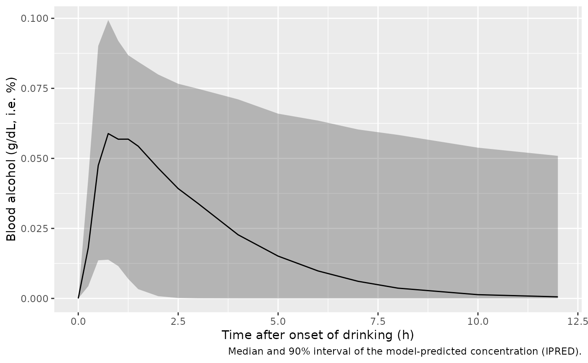

# Ethanol (Lim 2017)

## Model and source

- Citation: Lim HS, Soung JH, Bae KS. Forensic science meets clinical
  pharmacology: pharmacokinetic model based estimation of alcohol
  concentration of a defendant as requested by a local prosecutor’s
  office. Transl Clin Pharmacol. 2017;25(1):5-9.
  <doi:10.12793/tcp.2017.25.1.5>
- Description: Population PK model for orally ingested ethanol (alcohol)
  in 24 healthy Korean adult males (Lim 2017, the ‘original alcohol PK
  model’ used for a forensic Bayesian back-estimation). One-compartment
  model with first-order absorption and Michaelis-Menten elimination;
  body weight scales the volume and Vmax linearly (reference 70 kg).
  Concentrations are blood alcohol concentrations in percent
  weight/volume (g/dL) estimated by breath alcohol test.
- Article: <https://doi.org/10.12793/tcp.2017.25.1.5> (open access, CC
  BY-NC)

Lim 2017 is a forensic case report. A Korean prosecutor’s office asked
the authors to estimate a defendant’s blood alcohol concentration while
driving, from the defendant’s drinking history and a single breath
alcohol test taken after the drive. The authors used a population PK
model of alcohol they had previously developed from a phase 1 trial (the
“original alcohol PK model”, OAPKM), whose parameter estimates are
published for the first time in Table 1 of this paper. That population
model is packaged here. The defendant’s individual MAP Bayesian
estimates (Table 2) and the resulting profile (Table 3, Figure 2) are
used below as a validation of the model structure.

No erratum or correction for this article was found in Europe PMC
(checked 2026-09-25).

## Population

The OAPKM was fit to 178 blood alcohol concentrations (percent) measured
by breath alcohol test in 24 healthy Korean adult males in a phase 1
clinical trial, after a single oral dose of alcohol printed as “32 mg”
(Lim 2017 Methods and Table 1 title). Age and body weight of the trial
subjects are not reported; the model is referenced to a 70 kg subject.

``` r

rxode2::rxode(readModelDb("Lim_2017_ethanol"))$meta$population
#> ℹ parameter labels from comments will be replaced by 'label()'
#> $species
#> [1] "human"
#> 
#> $n_subjects
#> [1] 24
#> 
#> $n_observations
#> [1] 178
#> 
#> $n_studies
#> [1] 1
#> 
#> $age_range
#> [1] "adults; not reported"
#> 
#> $weight_range
#> [1] "not reported; reference weight 70 kg"
#> 
#> $sex_female_pct
#> [1] 0
#> 
#> $race_ethnicity
#> [1] "Korean"
#> 
#> $disease_state
#> [1] "Healthy adult male volunteers (phase 1 clinical trial)"
#> 
#> $dose_range
#> [1] "Single oral ethanol dose printed as '32 mg' (Table 1 title); numerically 32 dose units, interpreted as 32 g ethanol"
#> 
#> $regions
#> [1] "Republic of Korea"
#> 
#> $notes
#> [1] "The original alcohol PK model (OAPKM) of Lim 2017 Methods and Table 1: 178 blood alcohol concentrations (percent) estimated by breath alcohol test in 24 healthy Korean adult males. Structure follows Bruno et al. 1983 (linear absorption, saturable elimination). The paper's application is a MAP Bayesian estimation, over 1,000 bootstrap replicates, of one defendant's individual parameters (Table 2) and blood alcohol profile (Table 3, Figure 2)."
```

## Source trace

| Quantity | Value | Source location |
|----|----|----|
| `lka` (ka) | log(5.62), 1/h | Table 1, row “Ka, 1/hour” |
| `lvc` (V at 70 kg) | log(372) | Table 1, row “V, L” |
| `lvmax` (Vmax at 70 kg) | log(72.4) | Table 1, row “Vmax, %/hour” |
| `lkm` (Km) | log(0.47) | Table 1, row “Km, %” |
| `etalka` | omega^2 = 1.420 | Table 1, row “IIVKa (CV %)” |
| `etalvc` | omega^2 = 0.026 | Table 1, row “IIVV (CV %)” |
| `etalvmax` | omega^2 = 1.090 | Table 1, row “IIVVmax (CV %)” |
| `etalkm` | omega^2 = 0.416 | Table 1, row “IIVKm (CV %)” |
| `addSd` | 0.005 | Table 1, row “epsilon (additive)”; footnote: epsilon is an SD |
| `propSd` | 0.041 | Table 1, row “epsilon (proportional)” |
| Weight scaling | V = V(70) x (WT/70), Vmax = Vmax(70) x (WT/70) | Table 1 footnote |
| Structure | one compartment, linear absorption, Michaelis-Menten elimination | Methods (following Bruno et al. 1983) |
| Elimination term | `vmax * Cc / (km + Cc)` on the amount in `central` | Methods; confirmed against Table 3 below |

## Units

The paper’s unit labels (“32 mg” dose, V in L, Vmax in %/hour, Km in %)
are not mutually consistent: 32 mg of ethanol in 372 L cannot give a
concentration near 0.1%. The numerical model maps dose to concentration
as Cc = amount / V, and the Table 3 replication below shows that the
paper simulated with a dose of 32 per subject. Reading that dose as 32 g
of ethanol (4 cups x 8 g, per Methods) and Cc as percent weight/volume
(g/dL) makes V dimensionally dL (372 dL = 37.2 L, about 0.53 L/kg at 70
kg) and Vmax an amount rate in g/h. The model is therefore declared with
dose in g and concentration in g/dL; the numeric values are exactly as
printed.

## Replicating Table 3 (defendant profile)

Table 2 reports the medians of the defendant’s 1,000 bootstrap MAP
estimates (ka 2.50 1/h, V 143.09, Vmax 604.30, Km 14.31) and Table 3 the
median blood alcohol profile. The defendant stated that he drank four
cups of soju over about 30 minutes; that is simulated as 32 g given at a
constant rate into the depot over 0.5 h. The individual values are set
directly (the weight normalisation is neutralised by `WT = 70`, since
Table 2 reports the defendant’s individual V and Vmax).

``` r

mod <- readModelDb("Lim_2017_ethanol")
modDefendant <- rxode2::zeroRe(mod) |>
  rxode2::ini(
    lka = log(2.50), lvc = log(143.09), lvmax = log(604.30), lkm = log(14.31)
  )
#> ℹ parameter labels from comments will be replaced by 'label()'
#> ℹ change initial estimate of `lka` to `0.916290731874155`
#> ℹ change initial estimate of `lvc` to `4.96347380291864`
#> ℹ change initial estimate of `lvmax` to `6.40407076336751`
#> ℹ change initial estimate of `lkm` to `2.66095859356836`

table3 <- data.frame(
  time = c(0, 0.17, 0.33, 0.5, 0.58, 0.67, 0.75, 0.83, 0.92, 1, 1.1, 1.2,
           1.3, 1.4, 1.5, 1.6, 1.7),
  median_pub = c(0, 0.019624, 0.049542, 0.088048, 0.110615, 0.129615,
                 0.14208, 0.15129, 0.158545, 0.16292, 0.166265, 0.167835,
                 0.16792, 0.16702, 0.165515, 0.16314, 0.160255)
)

evDef <- rxode2::et(amt = 32, dur = 0.5, cmt = "depot") |>
  rxode2::et(time = sort(unique(c(table3$time, seq(0, 3, by = 0.05))))) |>
  as.data.frame() |>
  mutate(WT = 70)

simDef <- rxode2::rxSolve(modDefendant, evDef, returnType = "data.frame")
#> ℹ omega/sigma items treated as zero: 'etalka', 'etalvc', 'etalvmax', 'etalkm'

chk <- table3 |>
  left_join(simDef |> select(time, Cc), by = "time") |>
  mutate(pct_diff = 100 * (Cc - median_pub) / median_pub)

chk |>
  dplyr::rename(
    "Time (h)" = time,
    "Table 3 median (g/dL)" = median_pub,
    "Simulated (g/dL)" = Cc,
    "Difference (%)" = pct_diff
  ) |>
  knitr::kable(digits = 4)
```

| Time (h) | Table 3 median (g/dL) | Simulated (g/dL) | Difference (%) |
|---------:|----------------------:|-----------------:|---------------:|
|     0.00 |                0.0000 |           0.0000 |            NaN |
|     0.17 |                0.0196 |           0.0139 |       -29.4129 |
|     0.33 |                0.0495 |           0.0455 |        -8.1376 |
|     0.50 |                0.0880 |           0.0910 |         3.3875 |
|     0.58 |                0.1106 |           0.1118 |         1.0553 |
|     0.67 |                0.1296 |           0.1296 |         0.0262 |
|     0.75 |                0.1421 |           0.1416 |        -0.3391 |
|     0.83 |                0.1513 |           0.1506 |        -0.4796 |
|     0.92 |                0.1585 |           0.1578 |        -0.4835 |
|     1.00 |                0.1629 |           0.1621 |        -0.4803 |
|     1.10 |                0.1663 |           0.1654 |        -0.4944 |
|     1.20 |                0.1678 |           0.1669 |        -0.5620 |
|     1.30 |                0.1679 |           0.1669 |        -0.5916 |
|     1.40 |                0.1670 |           0.1659 |        -0.6760 |
|     1.50 |                0.1655 |           0.1641 |        -0.8838 |
|     1.60 |                0.1631 |           0.1616 |        -0.9335 |
|     1.70 |                0.1603 |           0.1587 |        -0.9414 |

The simulated profile at the Table 2 median parameters reproduces the
published median profile. The published profile is a median over 1,000
MAP profiles, not the profile at median parameters, so small differences
are expected. They are largest during drinking (0.17 and 0.33 h), where
the result depends on how the 30-minute drinking period is represented
(four 8 g boluses at 10-minute intervals match those points more closely
and the later points slightly less well). The alternative reading of the
elimination term as a concentration rate
(`d/dt(Cc) = -Vmax Cc / (Km + Cc)`) eliminates almost all of the dose
within minutes and cannot produce the Table 3 profile.

``` r

post <- chk |> filter(time >= 0.5)
stopifnot(
  # Same drawn parameters on both sides; the difference is the median-of-profiles
  # versus profile-at-median-parameters gap, not random-cohort noise.
  max(abs(post$pct_diff)) < 5,
  abs(max(simDef$Cc) - max(table3$median_pub)) / max(table3$median_pub) < 0.02
)
```

``` r

ggplot(simDef, aes(time, Cc)) +
  geom_line() +
  geom_point(data = table3, aes(time, median_pub), colour = "firebrick") +
  geom_hline(yintercept = 0.05, linetype = "dashed") +
  labs(x = "Time after onset of drinking (h)", y = "Blood alcohol (g/dL, i.e. %)")
```


Replicates the median line of Figure 2 of Lim 2017 (defendant profile at
the Table 2 median parameters). Points: Table 3 medians. Dashed line:
0.05% legal limit.

## Population simulation (OAPKM)

A virtual cohort of 200 Korean adult males receives the Table 1 study
dose (32 g, taken over 30 minutes). Body weights are not reported for
the trial, so they are drawn from a normal distribution with mean 70 kg
and SD 10 kg, truncated to 50-100 kg.

``` r

set.seed(2017)
rxode2::rxSetSeed(2017)
nSub <- 200
wts <- pmin(pmax(rnorm(nSub, 70, 10), 50), 100)
obsTimes <- c(0, 0.25, 0.5, 0.75, 1, 1.25, 1.5, 2, 2.5, 3, 4, 5, 6, 7, 8, 10, 12)

evPop <- rxode2::et(amt = 32, dur = 0.5, cmt = "depot") |>
  rxode2::et(time = obsTimes) |>
  rxode2::et(id = seq_len(nSub)) |>
  as.data.frame() |>
  left_join(data.frame(id = seq_len(nSub), WT = wts), by = "id") |>
  mutate(treatment = "32 g over 0.5 h")

simPop <- rxode2::rxSolve(mod, evPop, keep = c("treatment", "WT"),
                          returnType = "data.frame")
#> ℹ parameter labels from comments will be replaced by 'label()'

vpc <- simPop |>
  group_by(time) |>
  summarise(
    q05 = quantile(Cc, 0.05), q50 = median(Cc), q95 = quantile(Cc, 0.95),
    .groups = "drop"
  )

ggplot(vpc, aes(time, q50)) +
  geom_ribbon(aes(ymin = q05, ymax = q95), alpha = 0.3) +
  geom_line() +
  labs(x = "Time after onset of drinking (h)", y = "Blood alcohol (g/dL, i.e. %)",
       caption = "Median and 90% interval of the model-predicted concentration (IPRED).")
```



Typical-value profile for a 70 kg subject:

``` r

evTyp <- rxode2::et(amt = 32, dur = 0.5, cmt = "depot") |>
  rxode2::et(time = seq(0, 12, by = 0.05)) |>
  as.data.frame() |>
  mutate(WT = 70)
simTyp <- rxode2::rxSolve(rxode2::zeroRe(mod), evTyp, returnType = "data.frame")
#> ℹ parameter labels from comments will be replaced by 'label()'
#> ℹ omega/sigma items treated as zero: 'etalka', 'etalvc', 'etalvmax', 'etalkm'
typ <- simTyp[which.max(simTyp$Cc), c("time", "Cc")]
typ
#>    time         Cc
#> 18 0.85 0.06954989
# The first-order elimination limit of the model: CL = Vmax/Km; at low Cc the
# elimination rate constant is Vmax / (Km V).
72.4 / 0.47 / 372
#> [1] 0.4140929
# The peak cannot exceed the dose over the typical volume, 32 / 372.
stopifnot(typ$Cc < 32 / 372, typ$Cc > 0.05)
```

The typical 70 kg subject peaks near 0.07 g/dL at 0.85 h, above the
0.05% legal limit. For comparison, the Widmark estimate for a 70 kg man
(r = 0.68 L/kg) with no elimination is 32 / (0.68 x 70 x 10) = 0.067
g/dL; the model’s smaller volume (0.53 L/kg) roughly offsets the
elimination during the drinking period.

## PKNCA validation

The paper reports no NCA results, so this section documents the model’s
simulated exposure for the study dose.

``` r

# Floor the integrator's round-off undershoot (below 1e-10 g/dL) once a
# subject has eliminated the dose, so PKNCA does not see negative values.
concDat <- simPop |>
  dplyr::filter(!is.na(Cc)) |>
  mutate(Cc = pmax(Cc, 0)) |>
  select(id, time, Cc, treatment)
doseDat <- evPop |>
  dplyr::filter(evid == 1) |>
  select(id, time, amt, treatment)

concObj <- PKNCA::PKNCAconc(concDat, Cc ~ time | treatment + id)
doseObj <- PKNCA::PKNCAdose(doseDat, amt ~ time | treatment + id,
                            duration = 0.5)
intervals <- data.frame(start = 0, end = Inf, cmax = TRUE, tmax = TRUE,
                        auclast = TRUE)
ncaRes <- PKNCA::pk.nca(PKNCA::PKNCAdata(concObj, doseObj,
                                         intervals = intervals))
summary(ncaRes)
#>  start end       treatment   N     auclast          cmax                tmax
#>      0 Inf 32 g over 0.5 h 200 0.182 [148] 0.0588 [49.9] 0.750 [0.500, 5.00]
#> 
#> Caption: auclast, cmax: geometric mean and geometric coefficient of variation; tmax: median and range; N: number of subjects
```

## Assumptions and deviations

- **Units.** The paper’s unit labels are internally inconsistent (see
  “Units”). The model uses the printed numbers with dose in g and
  concentration in g/dL (percent w/v); V is dimensionally dL and Vmax
  g/h under that reading. The labels in `ini()` note the printed units.
- **IIV scale.** Table 1 prints omega^2 values with a CV% in
  parentheses. For Ka (1.420, 177.1%) and Km (0.416, 71.8%), and for the
  bootstrap V entry (0.023, 15.4%), the CV% equals sqrt(exp(omega^2) -
  1), so the printed numbers are log-normal variances. The single-run V
  (35.7%) and Vmax (40.1%) CV entries do not match any transform of
  their variances and are treated as typographical; the variances are
  used.
- **Residual error.** The Table 1 footnote states that epsilon is
  reported as a standard deviation; both the additive (0.005 g/dL) and
  proportional (0.041) terms are encoded as SDs in a combined additive +
  proportional model. The exact NONMEM error form is not printed.
- **Covariates.** Only body weight (linear on V and Vmax, reference 70
  kg) is in the model. The trial’s weight distribution is not reported;
  the virtual cohort assumes 70 +/- 10 kg.
- **Drinking period.** For the replication of Table 3, four cups over
  about 30 minutes are simulated as a 0.5 h zero-order input into the
  depot.
