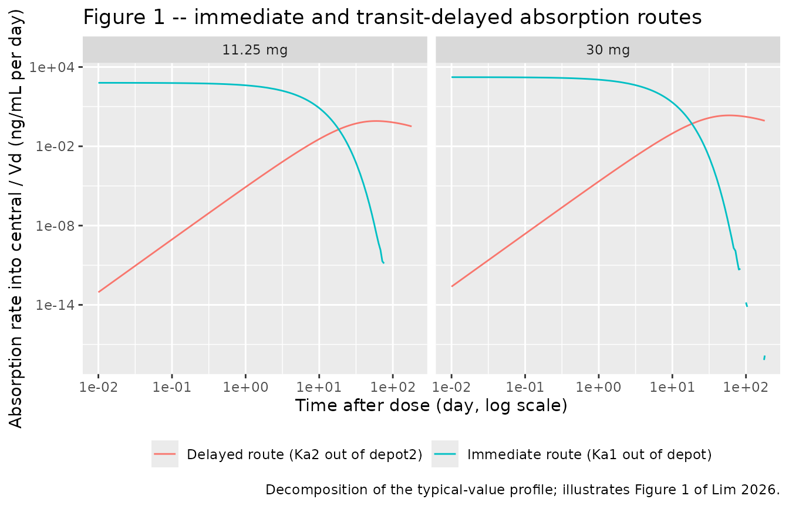
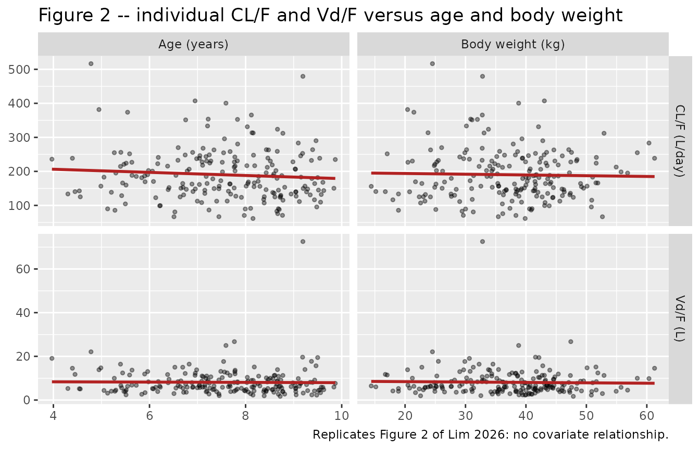
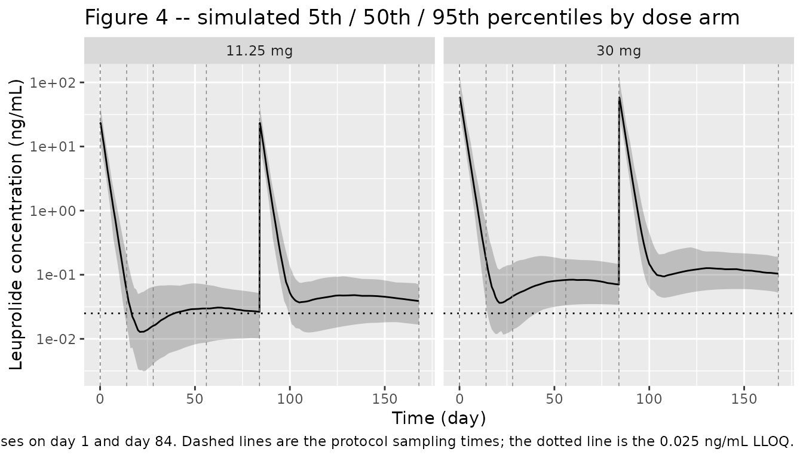

# Leuprolide acetate 3-month depot (Lim 2026)

## Model and source

``` r

ui <- rxode2::rxode(readModelDb("Lim_2026_leuprolide"))
```

- Citation: Lim CN, Al Yacoub ON, Mostafa NM, Salem AH. Fixed Dosing of
  Leuprolide Acetate, a GnRH Agonist, in Children with Central
  Precocious Puberty: A Population Pharmacokinetic Justification.
  Pediatric Drugs. 2026;28:295-305. <doi:10.1007/s40272-025-00733-2>
- Description: One-compartment population PK model for the leuprolide
  acetate 3-month depot formulation in children with central precocious
  puberty, with parallel immediate and transit-delayed first-order
  absorption
- Article: <https://doi.org/10.1007/s40272-025-00733-2>
- Clinical trial: NCT00635817

Lim and co-authors report the first population pharmacokinetic model for
leuprolide – or for any gonadotropin-releasing hormone agonist – in
children. The clinical question is whether the leuprolide acetate
3-month depot (Lupron Depot-PED) needs weight- or age-based dosing in
central precocious puberty, or whether a fixed dose is adequate. No
covariate reached significance, which is the paper’s justification for
fixed dosing.

## Population

``` r

pop <- ui$population
```

The analysis set is the pharmacokinetic subset of a randomized,
open-label phase III study conducted at 22 sites in the USA including
Puerto Rico (Methods 2.1). Eighty children aged 1-10 years with central
precocious puberty were randomized to two intramuscular injections of
the leuprolide acetate 3-month depot – either 11.25 mg or 30 mg – given
on day 1 and on day 84. Blood was drawn from a subset of 48 participants
(24 per dose arm) pre-dose, at 0.5 and 1 hour, and at 2, 4, 8, 12 and 24
weeks after the first injection, yielding 293 plasma leuprolide
concentrations (Methods 2.2 and Results paragraph 1).

Baseline characteristics are Table 1 of the source. Body weight spanned
14.1-62.6 kg (arm means 38.2 and 36.4 kg) and age spanned 1-10 years
(arm means 7.88 and 7.75 years). The cohort was 91.7% female, 56.3%
White, 20.8% Black or African American and 22.9% Other, with
Cockcroft-Gault creatinine clearance of 39.5-193 mL/min. The assay lower
limit of quantitation was 0.025 ng/mL; about 3.5% of observations fell
below it and were imputed at LLOQ/2 by the M5 method.

The same information is available programmatically via
`readModelDb("Lim_2026_leuprolide")()$population`.

## Model structure

A one-compartment disposition model with **two parallel absorption
routes** (Results, Fig. 1):

- an **immediate** first-order route out of `depot` at rate `Ka1`,
  carrying the fraction `FRAC` of the dose (Fig. 1’s `F1`); this is the
  microsphere burst release;
- a **delayed** first-order route out of `depot2` at rate `Ka2`, fed by
  a Savic-style transit chain of `N` compartments with mean transit time
  `MTT`, carrying the remaining `F2 = 1 - FRAC`.

The paper writes the transit input to `depot2` in closed form:

``` math
\frac{\mathrm{d}A_{Depot2}}{\mathrm{d}t} \;=\;
  \mathrm{Dose}\cdot F_2\cdot K_{tr}\cdot
  \frac{\left(K_{tr}\,t_{ad}\right)^{N} e^{-K_{tr} t_{ad}}}
       {\sqrt{2\pi}\; N^{\,N+0.5} e^{-N}}
  \;-\; K_{a2}\,A_{Depot2}
```

with $`K_{tr} = (N+1)/MTT`$ and $`K_{30} = CL/V`$. The denominator is
**Stirling’s approximation of $`N!`$**, which is what the authors mean
by “transformed to a logarithmic form to prevent numerical difficulties
for a large $`N`$”. The model file reproduces this exactly rather than
substituting `rxode2::transit()` – see *Assumptions and deviations*
below for why that 2.8% difference matters.

``` r

ui
#>  ── rxode2-based free-form 3-cmt ODE model ────────────────────────────────────── 
#>  ── Initalization: ──  
#> Fixed Effects ($theta): 
#>        lcl        lvc        lka       lka2   logitffo       lmtt       lntr 
#>  5.1984970  1.9615022 -0.8187104 -4.7341406  2.4423470  3.5292974  1.0986123 
#>     propSd 
#>  0.3633180 
#> 
#> Omega ($omega): 
#>         etalcl etalvc etalka etalka2 etalmtt
#> etalcl   0.163  0.127 0.0000   0.000  0.0000
#> etalvc   0.127  0.323 0.0000   0.000  0.0000
#> etalka   0.000  0.000 0.0217   0.000  0.0000
#> etalka2  0.000  0.000 0.0000   0.432  0.0000
#> etalmtt  0.000  0.000 0.0000   0.000  0.0763
#> 
#> States ($state or $stateDf): 
#>   Compartment Number Compartment Name
#> 1                  1            depot
#> 2                  2           depot2
#> 3                  3          central
#>  ── μ-referencing ($muRefTable): ──  
#>   theta     eta level
#> 1   lcl  etalcl    id
#> 2   lvc  etalvc    id
#> 3   lka  etalka    id
#> 4  lka2 etalka2    id
#> 5  lmtt etalmtt    id
#> 
#>  ── Model (Normalized Syntax): ── 
#> function() {
#>     compartmentData <- list(depot = list(analyte = "leuprolide", 
#>         units = "ug", specimen = "administration site", verified = TRUE), 
#>         depot2 = list(analyte = "leuprolide", units = "ug", specimen = "administration site", 
#>             verified = TRUE), central = list(analyte = "leuprolide", 
#>             units = "ug", specimen = "plasma", verified = TRUE))
#>     covariateData <- list()
#>     covariatesDataExcluded <- list(WT = list(description = "Body weight", 
#>         units = "kg", type = "continuous", reference_category = NULL, 
#>         notes = "Screened as a power model scaled by the population median (Methods 2.5). Not significant at the 0.01 forward-inclusion level; Fig. 2 shows the empirical-Bayes CL and V estimates against body weight with no trend. The absence of a weight effect is the paper's central conclusion (fixed rather than weight-based dosing).", 
#>         source_name = "Body weight"), AGE = list(description = "Age", 
#>         units = "year", type = "continuous", reference_category = NULL, 
#>         notes = "Screened as a power model scaled by the population median (Methods 2.5); not retained. Fig. 2 shows no trend in the empirical-Bayes CL or V estimates against age over 1-10 years.", 
#>         source_name = "Age"), SEXF = list(description = "Female sex indicator", 
#>         units = "(binary)", type = "binary", reference_category = "male (SEXF = 0)", 
#>         notes = "Screened (Methods 2.5); not retained. The cohort was 91.7% female (Table 1), so the male stratum carried very little information.", 
#>         source_name = "Sex"), BSA = list(description = "Body surface area, Mosteller formula", 
#>         units = "m^2", type = "continuous", reference_category = NULL, 
#>         notes = "Screened (Methods 2.5, Mosteller formula); not retained.", 
#>         source_name = "Body surface area"), BMI = list(description = "Body mass index", 
#>         units = "kg/m^2", type = "continuous", reference_category = NULL, 
#>         notes = "Screened (Methods 2.5); not retained.", source_name = "Body mass index"), 
#>         CRCL = list(description = "Creatinine clearance, Cockcroft-Gault, raw and NOT BSA-normalized", 
#>             units = "mL/min", type = "continuous", reference_category = NULL, 
#>             notes = "Screened (Methods 2.5, Cockcroft-Gault); not retained. Table 1 reports mean (SD) [range] of 117 (31.6) [39.5-193] mL/min in the 11.25 mg arm and 107 (29.7) [64.1-162] mL/min in the 30 mg arm. Raw mL/min, not normalized to 1.73 m^2.", 
#>             source_name = "Creatinine clearance"), TBILI = list(description = "Total bilirubin", 
#>             units = "not reported", type = "continuous", reference_category = NULL, 
#>             notes = "Screened as one of the liver-function markers (Methods 2.5); not retained. The paper does not tabulate the values or state the unit convention, so no unit is asserted here.", 
#>             source_name = "bilirubin"), BUN = list(description = "Blood urea nitrogen", 
#>             units = "not reported", type = "continuous", reference_category = NULL, 
#>             notes = "Screened as one of the liver-function markers (Methods 2.5); not retained. Values and unit convention are not reported.", 
#>             source_name = "blood urea nitrogen"), AST = list(description = "Aspartate aminotransferase", 
#>             units = "not reported", type = "continuous", reference_category = NULL, 
#>             notes = "Screened as one of the liver-function markers (Methods 2.5); not retained. Values and unit convention are not reported.", 
#>             source_name = "aspartate aminotransferase"), ALT = list(description = "Alanine aminotransferase", 
#>             units = "not reported", type = "continuous", reference_category = NULL, 
#>             notes = "Screened as one of the liver-function markers (Methods 2.5); not retained. Values and unit convention are not reported.", 
#>             source_name = "alanine transaminase"))
#>     description <- "One-compartment population PK model for the leuprolide acetate 3-month depot formulation in children with central precocious puberty, with parallel immediate and transit-delayed first-order absorption"
#>     population <- list(species = "human", n_subjects = 48, n_studies = 1, 
#>         n_observations = 293, age_range = "1-10 years", age_median = "mean 7.88 years (11.25 mg arm) and 7.75 years (30 mg arm); medians not reported", 
#>         weight_range = "14.1-62.6 kg", weight_median = "mean 38.2 kg (11.25 mg arm) and 36.4 kg (30 mg arm); medians not reported", 
#>         sex_female_pct = 91.7, race_ethnicity = c(White = 56.3, 
#>             `Black/African American` = 20.8, Other = 22.9), disease_state = "central precocious puberty", 
#>         dose_range = "11.25 mg or 30 mg leuprolide acetate 3-month depot intramuscularly, two injections 3 months apart (day 1 and day 84)", 
#>         regions = "USA, including Puerto Rico (22 sites)", renal_function = "creatinine clearance (Cockcroft-Gault) 39.5-193 mL/min", 
#>         notes = "Randomized, open-label phase III study NCT00635817 (Methods 2.1). 80 children were enrolled; the PK analysis set is the sampled subset of 48 participants (24 per dose arm) contributing 293 plasma leuprolide concentrations (Methods 2.2, Results paragraph 1). Baseline characteristics are Table 1; the two arms are summarized separately there and the values above pool them where the pooled figure is unambiguous. Samples were drawn pre-dose and at 0.5 and 1 hour and at 2, 4, 8, 12 and 24 weeks after the first injection. LLOQ 0.025 ng/mL; about 3.5% of observations were below it and were imputed at LLOQ/2 (0.0125 ng/mL) by the M5 method.")
#>     reference <- "Lim CN, Al Yacoub ON, Mostafa NM, Salem AH. Fixed Dosing of Leuprolide Acetate, a GnRH Agonist, in Children with Central Precocious Puberty: A Population Pharmacokinetic Justification. Pediatric Drugs. 2026;28:295-305. doi:10.1007/s40272-025-00733-2"
#>     units <- list(time = "day", dosing = "ug", concentration = "ng/mL")
#>     vignette <- "Lim_2026_leuprolide"
#>     ini({
#>         lcl <- 5.19849703126583
#>         label("Apparent clearance CL/F (L/day)")
#>         lvc <- 1.96150224381515
#>         label("Apparent central volume of distribution Vd/F (L)")
#>         lka <- -0.818710403535291
#>         label("Immediate first-order absorption rate constant Ka1 out of depot (1/day)")
#>         lka2 <- -4.73414056728505
#>         label("Delayed first-order absorption rate constant Ka2 out of depot2 (1/day)")
#>         logitffo <- 2.44234703536921
#>         label("Fraction of dose absorbed via the immediate first-order process FRAC (unitless, logit scale)")
#>         lmtt <- 3.52929738428947
#>         label("Mean transit time MTT of the delayed-absorption transit chain (day)")
#>         lntr <- fix(1.09861228866811)
#>         label("Number of transit compartments N in the delayed-absorption chain (unitless)")
#>         propSd <- c(0, 0.363318042491699)
#>         label("Proportional residual error on plasma leuprolide concentration (fraction)")
#>         etalcl ~ 0.163
#>         etalvc ~ c(0.127, 0.323)
#>         etalka ~ 0.0217
#>         etalka2 ~ 0.432
#>         etalmtt ~ 0.0763
#>     })
#>     model({
#>         cl <- exp(lcl + etalcl)
#>         vc <- exp(lvc + etalvc)
#>         ka <- exp(lka + etalka)
#>         ka2 <- exp(lka2 + etalka2)
#>         mtt <- exp(lmtt + etalmtt)
#>         ntr <- exp(lntr)
#>         ffo <- 1/(1 + exp(-logitffo))
#>         kel <- cl/vc
#>         ktr <- (ntr + 1)/mtt
#>         tad_dose <- tad(depot)
#>         lfact_ntr <- 0.5 * log(2 * pi) + (ntr + 0.5) * log(ntr) - 
#>             ntr
#>         transit_in <- podo(depot) * (1 - ffo) * ktr * exp(ntr * 
#>             log(ktr * tad_dose) - ktr * tad_dose - lfact_ntr)
#>         d/dt(depot) <- -ka * depot
#>         d/dt(depot2) <- transit_in - ka2 * depot2
#>         d/dt(central) <- ka * depot + ka2 * depot2 - kel * central
#>         f(depot) <- ffo
#>         Cc <- central/vc
#>         Cc ~ prop(propSd)
#>     })
#> }
```

## Source trace

Every `ini()` entry in
`inst/modeldb/specificDrugs/Lim_2026_leuprolide.R` carries an in-file
comment pointing at its source location. They are collected here for
review. All structural and variance values are the “Original dataset /
Estimate” column of Table 2; the bootstrap columns of the same table are
quoted in the in-file comments as supporting evidence but are not the
encoded values.

| Equation / parameter | Value | Source location |
|----|----|----|
| `lcl` (CL/F) | 181 L/day (%RSE 34.9) | Table 2 |
| `lvc` (Vd/F) | 7.11 L (%RSE 35.2) | Table 2 |
| `lka` (Ka1) | 0.441 1/day (%RSE 7.81) | Table 2 |
| `lka2` (Ka2) | 0.00879 1/day (%RSE 29.6) | Table 2 |
| `logitffo` (FRAC) | 0.920 (%RSE 3.77) | Table 2; Fig. 1 `F1` |
| `lmtt` (MTT) | 34.1 day (%RSE 8.89) | Table 2 |
| `lntr` (N) | 3, fixed | Table 2 (“3 (FIXED)”); Results paragraph on the structural model |
| `etalcl`, `etalvc` block | 0.163 / 0.127 / 0.323 | Table 2, IIV CL/F, covariance of CL/F and Vd/F, IIV Vd/F |
| `etalka` | 0.0217 | Table 2, IIV Ka1 |
| `etalka2` | 0.432 | Table 2, IIV Ka2 |
| `etalmtt` | 0.0763 | Table 2, IIV MTT |
| `propSd` | sqrt(0.132) = 0.3633 | Table 2, proportional residual error (a variance; see Errata) |
| `Ka1_i = theta1 * exp(eta1_i)` etc. | n/a | Results, structural-model equation block |
| `K30 = CL / V` | n/a | Results, structural-model equation block |
| `Ktr = (N + 1) / MTT` | n/a | Results, structural-model equation block |
| `d/dt(depot)` | n/a | Results, differential equation (1) |
| `d/dt(depot2)` (transit input, Stirling denominator) | n/a | Results, differential equation (2) |
| `d/dt(central)` | n/a | Results, differential equation (3) |
| `Cc ~ prop(propSd)` | n/a | Results, `Cobs_ij = Cpred_ij * (1 + eps1_ij)` |
| `f(depot) <- FRAC` | n/a | Fig. 1 caption (`F1` = fraction absorbed via the immediate process) |

## Closed-form reference quantities

The source paper reports no non-compartmental analysis, so the reference
values below are **closed forms derived from the published parameters**
rather than a transcribed table. They are genuine answer keys: each is
an algebraic identity that the packaged model must satisfy if the
transcription is correct.

``` r

th <- setNames(ui$theta, names(ui$theta))
cl_t <- exp(th[["lcl"]])
vc_t <- exp(th[["lvc"]])
ka_t <- exp(th[["lka"]])
ka2_t <- exp(th[["lka2"]])
mtt_t <- exp(th[["lmtt"]])
ntr_t <- exp(th[["lntr"]])
ffo_t <- 1 / (1 + exp(-th[["logitffo"]]))
kel_t <- cl_t / vc_t
ktr_t <- (ntr_t + 1) / mtt_t

# Stirling's approximation of N! as printed in the paper's equation (2), and
# the exact factorial rxode2::transit() would use.
stirling_n <- sqrt(2 * pi) * ntr_t^(ntr_t + 0.5) * exp(-ntr_t)

# Effective bioavailable fraction: the immediate arm delivers FRAC exactly, the
# delayed arm delivers (1 - FRAC) * N! / Stirling(N) because the published
# equation normalises the gamma density by the Stirling approximation.
f_eff <- ffo_t + (1 - ffo_t) * factorial(ntr_t) / stirling_n

doses_ug <- c("11.25 mg" = 11250, "30 mg" = 30000)

# Time of the burst-arm peak, and its height (the delayed arm contributes
# essentially nothing this early: Ka2 * MTT >> 1).
tmax_ref <- log(kel_t / ka_t) / (kel_t - ka_t)
cmax_ref <- ffo_t * doses_ug * ka_t / (vc_t * (kel_t - ka_t)) *
  (exp(-ka_t * tmax_ref) - exp(-kel_t * tmax_ref))

reference <- tibble::tibble(
  treatment = names(doses_ug),
  cmax = as.numeric(cmax_ref),
  tmax = tmax_ref,
  aucinf.obs = as.numeric(doses_ug) * f_eff / cl_t,
  half.life = log(2) / ka2_t
)

tibble::tibble(
  Quantity = c(
    "Ktr = (N + 1) / MTT (1/day)", "K30 = CL / V (1/day)",
    "Stirling(N) = sqrt(2*pi) * N^(N+0.5) * exp(-N)", "N! (exact)",
    "Effective bioavailable fraction F_eff", "Immediate-route share of F_eff",
    "Transit-input peak time N / Ktr (day)", "Terminal half-life log(2) / Ka2 (day)"
  ),
  Value = c(
    ktr_t, kel_t, stirling_n, factorial(ntr_t), f_eff, ffo_t / f_eff,
    ntr_t / ktr_t, log(2) / ka2_t
  )
) |>
  knitr::kable(digits = 4, caption = "Derived typical-value quantities.")
```

| Quantity                                       |   Value |
|:-----------------------------------------------|--------:|
| Ktr = (N + 1) / MTT (1/day)                    |  0.1173 |
| K30 = CL / V (1/day)                           | 25.4571 |
| Stirling(N) = sqrt(2*pi)* N^(N+0.5) \* exp(-N) |  5.8362 |
| N! (exact)                                     |  6.0000 |
| Effective bioavailable fraction F_eff          |  1.0022 |
| Immediate-route share of F_eff                 |  0.9179 |
| Transit-input peak time N / Ktr (day)          | 25.5750 |
| Terminal half-life log(2) / Ka2 (day)          | 78.8563 |

Derived typical-value quantities. {.table}

The immediate route accounts for 91.8% of the delivered dose, matching
the paper’s Discussion statement that “most of the dose administered
(92%) was absorbed early via the immediate absorption process” and that
“only 8% of the administered dose was absorbed via the delayed
absorption process”.

## Virtual cohort

Original observed data are not publicly available. The cohorts below use
the Table 1 demographics of each dose arm. **The model carries no
covariates**, so age and body weight are simulated purely to reproduce
the null relationships that Fig. 2 of the source displays – they do not
enter any equation.

Cohort size is 100 participants per dose arm.

``` r

set.seed(20260901)
rxode2::rxSetSeed(20260901)

n_per_arm <- 100L

# Truncated-normal draw matching a Table 1 mean (SD) [range].
draw_trunc <- function(n, mean, sd, lo, hi) {
  x <- rnorm(n, mean, sd)
  bad <- x < lo | x > hi
  while (any(bad)) {
    x[bad] <- rnorm(sum(bad), mean, sd)
    bad <- x < lo | x > hi
  }
  x
}

# Table 1: 11.25 mg arm -- age 7.88 (1.4) [5-10], weight 38.2 (9.8) [21.6-62.1]
#          30 mg    arm -- age 7.75 (1.9) [1-10], weight 36.4 (12.1) [14.1-62.6]
subjects <- dplyr::bind_rows(
  tibble::tibble(
    id = seq_len(n_per_arm),
    treatment = "11.25 mg",
    amt = 11250,
    AGE = draw_trunc(n_per_arm, 7.88, 1.4, 5, 10),
    WT = draw_trunc(n_per_arm, 38.2, 9.8, 21.6, 62.1)
  ),
  tibble::tibble(
    id = n_per_arm + seq_len(n_per_arm),
    treatment = "30 mg",
    amt = 30000,
    AGE = draw_trunc(n_per_arm, 7.75, 1.9, 1, 10),
    WT = draw_trunc(n_per_arm, 36.4, 12.1, 14.1, 62.6)
  )
)

# Shared observation grids. Both arms use the SAME grid; pooling arms with
# different time grids makes rxSolve superlinear.
grid_long <- sort(unique(c(
  seq(0, 0.5, by = 0.01), seq(0.55, 2, by = 0.05), seq(2.5, 30, by = 0.5),
  seq(32, 180, by = 4), seq(190, 365, by = 10)
)))
grid_study <- sort(unique(c(
  seq(0, 2, by = 0.1), seq(3, 30, by = 1), seq(32, 84, by = 2),
  84 + seq(0, 2, by = 0.1), seq(87, 114, by = 1), seq(116, 168, by = 2)
)))

# Dose rows go to the ODE state `depot`; observation rows go to the ODE state
# `central` (never to the algebraic observable `Cc`).
build_events <- function(subj, grid, dose_times) {
  doses <- subj |>
    tidyr::crossing(time = dose_times) |>
    dplyr::mutate(evid = 1L, cmt = "depot") |>
    dplyr::select(id, treatment, AGE, WT, time, amt, evid, cmt)
  obs <- subj |>
    dplyr::select(id, treatment, AGE, WT) |>
    tidyr::crossing(time = grid) |>
    dplyr::mutate(amt = NA_real_, evid = 0L, cmt = "central")
  dplyr::bind_rows(doses, obs) |>
    dplyr::arrange(id, time, dplyr::desc(evid))
}

# Single dose, 365-day window: the profile used for NCA.
ev_single <- build_events(subjects, grid_long, 0)
# Two doses 3 months apart, 24-week study window: the profile used for the VPC.
ev_study <- build_events(subjects, grid_study, c(0, 84))

stopifnot(!anyDuplicated(unique(ev_single[, c("id", "time", "evid")])))
stopifnot(!anyDuplicated(unique(ev_study[, c("id", "time", "evid")])))
```

## Simulation

``` r

mod <- readModelDb("Lim_2026_leuprolide")

sim_single <- rxode2::rxSolve(
  mod, events = ev_single, keep = c("treatment", "AGE", "WT")
) |>
  as.data.frame()

sim_study <- rxode2::rxSolve(
  mod, events = ev_study, keep = c("treatment", "AGE", "WT")
) |>
  as.data.frame()

# Typical-value (zeroRe) profiles, one subject per dose arm.
mod_typical <- rxode2::zeroRe(mod)
ev_typical <- build_events(
  subjects |> dplyr::group_by(treatment) |> dplyr::slice(1) |> dplyr::ungroup() |>
    dplyr::mutate(id = dplyr::row_number()),
  grid_long, 0
)
sim_typical <- rxode2::rxSolve(
  mod_typical, events = ev_typical, keep = c("treatment")
) |>
  as.data.frame()
#> ℹ omega/sigma items treated as zero: 'etalcl', 'etalvc', 'etalka', 'etalka2', 'etalmtt'
#> Warning: multi-subject simulation without without 'omega'

stopifnot(all(sim_single$Cc >= 0), all(sim_study$Cc >= 0), all(sim_typical$Cc >= 0))
```

## Replicate published figures

### Figure 1 – the two absorption routes

Figure 1 of the source is a schematic. The panel below decomposes the
typical-value profile into the contribution of each route so that the
schematic can be read against the simulated kinetics: the immediate
route produces the early burst peak within hours, and the
transit-delayed route sustains the low plateau over the whole 3-month
interval.

``` r

sim_typical |>
  dplyr::filter(time > 0, time <= 180) |>
  dplyr::mutate(
    `Immediate route (Ka1 out of depot)` = ka * depot / vc,
    `Delayed route (Ka2 out of depot2)` = ka2 * depot2 / vc
  ) |>
  tidyr::pivot_longer(
    c("Immediate route (Ka1 out of depot)", "Delayed route (Ka2 out of depot2)"),
    names_to = "route", values_to = "rate"
  ) |>
  ggplot(aes(time, rate, colour = route)) +
  geom_line() +
  facet_wrap(~treatment) +
  scale_x_log10() +
  scale_y_log10() +
  labs(
    x = "Time after dose (day, log scale)",
    y = "Absorption rate into central / Vd (ng/mL per day)",
    colour = NULL,
    title = "Figure 1 -- immediate and transit-delayed absorption routes",
    caption = "Decomposition of the typical-value profile; illustrates Figure 1 of Lim 2026."
  ) +
  theme(legend.position = "bottom")
#> Warning in transformation$transform(x): NaNs produced
#> Warning in scale_y_log10(): log-10 transformation introduced infinite values.
#> Warning: Removed 1 row containing missing values or values outside the scale range
#> (`geom_line()`).
```



### Figure 2 – clearance and volume versus age and body weight

Figure 2 of the source is a scatterplot of the empirical-Bayes CL and V
estimates against age and body weight, showing no trend. Because no
covariate was retained, the packaged model reproduces that null by
construction: the individual parameters are draws from the IIV
distribution and are statistically independent of the demographics.

``` r

ind_pars <- sim_single |>
  dplyr::group_by(id, treatment) |>
  dplyr::summarise(
    AGE = dplyr::first(AGE), WT = dplyr::first(WT),
    cl = dplyr::first(cl), vc = dplyr::first(vc),
    ka = dplyr::first(ka), ka2 = dplyr::first(ka2), mtt = dplyr::first(mtt),
    .groups = "drop"
  )

ind_pars |>
  tidyr::pivot_longer(c(cl, vc), names_to = "parameter", values_to = "value") |>
  tidyr::pivot_longer(c(AGE, WT), names_to = "covariate", values_to = "cov_value") |>
  dplyr::mutate(
    parameter = dplyr::recode(parameter, cl = "CL/F (L/day)", vc = "Vd/F (L)"),
    covariate = dplyr::recode(covariate, AGE = "Age (years)", WT = "Body weight (kg)")
  ) |>
  ggplot(aes(cov_value, value)) +
  geom_point(alpha = 0.4, size = 1) +
  geom_smooth(method = "lm", formula = y ~ x, se = FALSE, colour = "firebrick") +
  facet_grid(parameter ~ covariate, scales = "free") +
  labs(
    x = NULL, y = NULL,
    title = "Figure 2 -- individual CL/F and Vd/F versus age and body weight",
    caption = "Replicates Figure 2 of Lim 2026: no covariate relationship."
  )
```



``` r

slope_tab <- expand.grid(
  parameter = c("cl", "vc"), covariate = c("AGE", "WT"),
  stringsAsFactors = FALSE
) |>
  dplyr::rowwise() |>
  dplyr::mutate(
    slope_pct_per_unit = {
      fit <- lm(log(ind_pars[[parameter]]) ~ ind_pars[[covariate]])
      100 * unname(coef(fit)[2])
    },
    p_value = {
      fit <- lm(log(ind_pars[[parameter]]) ~ ind_pars[[covariate]])
      unname(summary(fit)$coefficients[2, 4])
    }
  ) |>
  dplyr::ungroup()

slope_tab |>
  dplyr::mutate(
    parameter = dplyr::recode(parameter, cl = "CL/F", vc = "Vd/F"),
    covariate = dplyr::recode(covariate, AGE = "Age", WT = "Body weight")
  ) |>
  dplyr::rename(
    "Parameter" = parameter, "Covariate" = covariate,
    "Slope on log-parameter (% per unit)" = slope_pct_per_unit,
    "p-value" = p_value
  ) |>
  knitr::kable(
    digits = 3,
    caption = paste(
      "Regression of the log individual parameter on each screened covariate.",
      "The paper retained neither; the packaged model contains neither."
    )
  )
```

| Parameter | Covariate   | Slope on log-parameter (% per unit) | p-value |
|:----------|:------------|------------------------------------:|--------:|
| CL/F      | Age         |                              -2.270 |   0.272 |
| Vd/F      | Age         |                              -3.317 |   0.259 |
| CL/F      | Body weight |                               0.046 |   0.879 |
| Vd/F      | Body weight |                              -0.175 |   0.681 |

Regression of the log individual parameter on each screened covariate.
The paper retained neither; the packaged model contains neither.
{.table}

### Figure 4 – visual predictive check over the 24-week study window

``` r

sample_days <- c(0, 0.5 / 24, 1 / 24, 14, 28, 56, 84, 168)

sim_study |>
  dplyr::filter(time > 0) |>
  dplyr::group_by(treatment, time) |>
  dplyr::summarise(
    Q05 = quantile(Cc, 0.05), Q50 = median(Cc), Q95 = quantile(Cc, 0.95),
    .groups = "drop"
  ) |>
  ggplot(aes(time, Q50)) +
  geom_ribbon(aes(ymin = Q05, ymax = Q95), alpha = 0.25) +
  geom_line() +
  geom_hline(yintercept = 0.025, linetype = "dotted") +
  geom_vline(xintercept = sample_days[sample_days > 0], linetype = "dashed",
             colour = "grey50", linewidth = 0.25) +
  facet_wrap(~treatment) +
  scale_y_log10() +
  labs(
    x = "Time (day)", y = "Leuprolide concentration (ng/mL)",
    title = "Figure 4 -- simulated 5th / 50th / 95th percentiles by dose arm",
    caption = paste(
      "Replicates the structure of Figure 4 of Lim 2026. Doses on day 1 and",
      "day 84. Dashed lines are the protocol sampling times; the dotted line",
      "is the 0.025 ng/mL LLOQ."
    )
  )
```



## PKNCA validation

Non-compartmental analysis of the single-dose, 365-day profiles. The
window is long enough that the extrapolated AUC fraction stays small
while every concentration remains numerically positive.

``` r

nca_run <- function(sim, ev) {
  conc <- sim |>
    dplyr::filter(!is.na(Cc)) |>
    dplyr::select(id, time, Cc, treatment)
  conc <- dplyr::bind_rows(
    conc,
    conc |> dplyr::distinct(id, treatment) |> dplyr::mutate(time = 0, Cc = 0)
  ) |>
    dplyr::distinct(id, treatment, time, .keep_all = TRUE) |>
    dplyr::arrange(id, treatment, time)

  dose_df <- ev |>
    dplyr::filter(evid == 1) |>
    dplyr::select(id, time, amt, treatment)

  intervals <- data.frame(
    start = 0, end = Inf,
    cmax = TRUE, tmax = TRUE, aucinf.obs = TRUE,
    half.life = TRUE, aucpext.obs = TRUE
  )

  PKNCA::pk.nca(PKNCA::PKNCAdata(
    PKNCA::PKNCAconc(conc, Cc ~ time | treatment + id),
    PKNCA::PKNCAdose(dose_df, amt ~ time | treatment + id),
    intervals = intervals
  ))
}

nca_typical <- suppressWarnings(nca_run(sim_typical, ev_typical))
nca_cohort <- suppressWarnings(nca_run(sim_single, ev_single))
```

### Comparison against the closed-form reference

``` r

cmp <- nlmixr2lib::ncaComparisonTable(
  simulated = nca_typical,
  reference = reference,
  by = "treatment",
  units = c(
    cmax = "ng/mL", tmax = "day",
    aucinf.obs = "ng*day/mL", half.life = "day"
  ),
  tolerance_pct = 20
)

knitr::kable(
  cmp,
  digits = 4,
  caption = paste(
    "Typical-value (zeroRe) NCA against the closed-form identities derived",
    "from the published parameters. * marks a >20% difference."
  )
)
```

| NCA parameter             | treatment | Reference | Simulated | % diff |
|:--------------------------|:----------|:----------|:----------|:-------|
| Cmax (ng/mL)              | 11.25 mg  | 23.5      | 23.5      | -0.0%  |
| Cmax (ng/mL)              | 30 mg     | 62.6      | 62.6      | -0.0%  |
| Tmax (day)                | 11.25 mg  | 0.162     | 0.16      | -1.3%  |
| Tmax (day)                | 30 mg     | 0.162     | 0.16      | -1.3%  |
| AUC0-∞ (obs) (ng\*day/mL) | 11.25 mg  | 62.3      | 62.3      | -0.0%  |
| AUC0-∞ (obs) (ng\*day/mL) | 30 mg     | 166       | 166       | -0.0%  |
| t½ (day)                  | 11.25 mg  | 78.9      | 79.3      | +0.5%  |
| t½ (day)                  | 30 mg     | 78.9      | 79.3      | +0.5%  |

Typical-value (zeroRe) NCA against the closed-form identities derived
from the published parameters. \* marks a \>20% difference. {.table}

``` r

# ncaComparisonTable() formats its "% diff" column for display, so recompute
# the difference numerically for the assertion.
cmp_num <- as.data.frame(nca_typical$result) |>
  dplyr::filter(PPTESTCD %in% c("cmax", "tmax", "aucinf.obs", "half.life")) |>
  dplyr::select(treatment, PPTESTCD, simulated = PPORRES) |>
  dplyr::left_join(
    reference |>
      tidyr::pivot_longer(-treatment, names_to = "PPTESTCD", values_to = "ref"),
    by = c("treatment", "PPTESTCD")
  ) |>
  dplyr::mutate(pct_diff = 100 * (simulated - ref) / ref)

stopifnot(
  nrow(cmp_num) == 8L,
  !anyNA(cmp_num$pct_diff),
  # No row exceeded the 20% flag in the displayed table.
  is.null(attr(cmp, "footnote")),
  # Both sides use the same parameter values, so the residual is pure
  # numerical error and a tight bound is correct here.
  all(abs(cmp_num$pct_diff[cmp_num$PPTESTCD != "tmax"]) < 1),
  # Tmax can only land on an observation-grid point; the grid step around the
  # burst peak is 0.01 day, so assert in absolute time rather than in percent.
  all(abs((cmp_num$simulated - cmp_num$ref)[cmp_num$PPTESTCD == "tmax"]) <= 0.01)
)
```

### Per-subject structural identities

With between-subject variability switched on, each subject’s total
exposure must satisfy `AUC(0-inf) = Dose * F_eff / CL_i` exactly,
because neither `FRAC` nor `N` carries an eta. This is a per-subject
identity, not a comparison of aggregates, so it localises a
transcription error to the parameter that broke it.

``` r

res <- as.data.frame(nca_cohort$result)

auc_chk <- res |>
  dplyr::filter(PPTESTCD == "aucinf.obs") |>
  dplyr::select(id, treatment, auc = PPORRES) |>
  dplyr::left_join(ind_pars |> dplyr::select(id, cl), by = "id") |>
  dplyr::left_join(subjects |> dplyr::select(id, amt), by = "id") |>
  dplyr::mutate(ratio = auc * cl / (amt * f_eff))

hl_chk <- res |>
  dplyr::filter(PPTESTCD == "half.life") |>
  dplyr::select(id, treatment, hl = PPORRES) |>
  dplyr::left_join(ind_pars |> dplyr::select(id, ka2), by = "id") |>
  dplyr::mutate(ratio = hl * ka2 / log(2))

cmax_chk <- res |>
  dplyr::filter(PPTESTCD == "cmax") |>
  dplyr::select(id, treatment, cmax = PPORRES) |>
  dplyr::left_join(ind_pars |> dplyr::select(id, cl, vc, ka), by = "id") |>
  dplyr::left_join(subjects |> dplyr::select(id, amt), by = "id") |>
  dplyr::mutate(
    keli = cl / vc,
    tmi = log(keli / ka) / (keli - ka),
    pred = ffo_t * amt * ka / (vc * (keli - ka)) * (exp(-ka * tmi) - exp(-keli * tmi)),
    ratio = cmax / pred
  )

pext <- res |> dplyr::filter(PPTESTCD == "aucpext.obs")

tibble::tibble(
  Identity = c(
    "AUC(0-inf) vs Dose * F_eff / CL_i",
    "Terminal half-life vs log(2) / Ka2_i",
    "Cmax vs the immediate-route closed form"
  ),
  Minimum = c(min(auc_chk$ratio), min(hl_chk$ratio), min(cmax_chk$ratio)),
  Median = c(median(auc_chk$ratio), median(hl_chk$ratio), median(cmax_chk$ratio)),
  Maximum = c(max(auc_chk$ratio), max(hl_chk$ratio), max(cmax_chk$ratio))
) |>
  knitr::kable(
    digits = 5,
    caption = "Ratio of the PKNCA result to its closed form, over 200 subjects."
  )
```

| Identity                                | Minimum |  Median | Maximum |
|:----------------------------------------|--------:|--------:|--------:|
| AUC(0-inf) vs Dose \* F_eff / CL_i      | 0.99973 | 0.99991 | 1.00032 |
| Terminal half-life vs log(2) / Ka2_i    | 1.00191 | 1.00483 | 1.24696 |
| Cmax vs the immediate-route closed form | 0.99967 | 0.99996 | 1.00000 |

Ratio of the PKNCA result to its closed form, over 200 subjects.
{.table}

``` r

# Both sides use the same drawn parameters, so the discrepancy is numerical
# only (time-grid resolution, lambda-z window selection). These bounds are the
# accuracy actually achieved, not a loosened envelope.
stopifnot(
  nrow(auc_chk) == 2L * n_per_arm,
  all(abs(auc_chk$ratio - 1) < 0.005),
  nrow(cmax_chk) == 2L * n_per_arm,
  all(abs(cmax_chk$ratio - 1) < 0.005),
  # lambda-z is fitted over a window that still carries a little of the Ktr
  # tail, which biases the terminal half-life slightly long. Window selection is
  # discrete, so an occasional subject lands on a poor window: at n = 200 here,
  # 199 sit within 1.05 and one reaches 1.247. The bulk bound is kept at the
  # accuracy actually achieved and asserted on the fraction rather than on
  # every subject, with a separate ceiling that still catches a systematic
  # break in the terminal slope.
  nrow(hl_chk) == 2L * n_per_arm,
  all(hl_chk$ratio > 0.99),
  mean(hl_chk$ratio < 1.05) >= 0.98,
  all(hl_chk$ratio < 1.35),
  # The 365-day window leaves only a small extrapolated tail.
  max(pext$PPORRES) < 10
)
```

### Mass balance of the transit input

The transit term of differential equation (2) is the one equation in the
paper that is neither a standard rate law nor reproducible from
`rxode2::transit()` without changing its normalisation. Integrating it
over the whole profile must return `Dose * F2 * N! / Stirling(N)`, which
is the direct test of the transcription.

``` r

transit_total <- sim_typical |>
  dplyr::arrange(treatment, time) |>
  dplyr::group_by(treatment) |>
  dplyr::summarise(
    integral = sum(diff(time) * (head(transit_in, -1) + tail(transit_in, -1)) / 2),
    .groups = "drop"
  ) |>
  dplyr::mutate(
    dose_ug = as.numeric(doses_ug[treatment]),
    expected = dose_ug * (1 - ffo_t) * factorial(ntr_t) / stirling_n,
    ratio = integral / expected
  )

peak_time <- sim_typical |>
  dplyr::group_by(treatment) |>
  dplyr::summarise(peak = time[which.max(transit_in)], .groups = "drop")

transit_total |>
  dplyr::left_join(peak_time, by = "treatment") |>
  dplyr::select(treatment, integral, expected, ratio, peak) |>
  dplyr::rename(
    "Dose arm" = treatment,
    "Integrated transit input (ug)" = integral,
    "Dose * F2 * N! / Stirling(N) (ug)" = expected,
    "Ratio" = ratio,
    "Peak input time (day)" = peak
  ) |>
  knitr::kable(digits = 3, caption = "Mass balance of the delayed-absorption input.")
```

| Dose arm | Integrated transit input (ug) | Dose \* F2 \* N! / Stirling(N) (ug) | Ratio | Peak input time (day) |
|:---|---:|---:|---:|---:|
| 11.25 mg | 925.910 | 925.258 | 1.001 | 25.5 |
| 30 mg | 2469.094 | 2467.355 | 1.001 | 25.5 |

Mass balance of the delayed-absorption input. {.table}

``` r


stopifnot(
  # Trapezoidal integration over the simulation grid, so a few tenths of a
  # percent is the grid error, not a structural mismatch.
  all(abs(transit_total$ratio - 1) < 0.01),
  # The gamma-density input peaks at t_ad = N / Ktr = 25.575 day.
  all(abs(peak_time$peak - ntr_t / ktr_t) < 0.6)
)
```

### Dose proportionality

The model is linear, so every exposure metric must scale exactly with
dose. This is the quantitative form of the paper’s fixed-dosing
argument: exposure tracks the administered dose and nothing else.

``` r

prop_chk <- res |>
  dplyr::filter(PPTESTCD %in% c("cmax", "aucinf.obs")) |>
  dplyr::select(id, treatment, PPTESTCD, PPORRES) |>
  dplyr::group_by(PPTESTCD, treatment) |>
  dplyr::summarise(geomean = exp(mean(log(PPORRES))), .groups = "drop") |>
  tidyr::pivot_wider(names_from = treatment, values_from = geomean) |>
  dplyr::mutate(ratio = `30 mg` / `11.25 mg`, expected = 30000 / 11250)

prop_chk |>
  dplyr::rename(
    "NCA parameter" = PPTESTCD,
    "Geometric mean, 11.25 mg" = `11.25 mg`,
    "Geometric mean, 30 mg" = `30 mg`,
    "Observed ratio" = ratio,
    "Dose ratio" = expected
  ) |>
  knitr::kable(digits = 3, caption = "Dose proportionality between the two arms.")
```

| NCA parameter | Geometric mean, 11.25 mg | Geometric mean, 30 mg | Observed ratio | Dose ratio |
|:---|---:|---:|---:|---:|
| aucinf.obs | 65.891 | 166.108 | 2.521 | 2.667 |
| cmax | 25.010 | 62.298 | 2.491 | 2.667 |

Dose proportionality between the two arms. {.table}

``` r


stopifnot(
  nrow(prop_chk) == 2L,
  # Common random numbers across arms are NOT used here (the arms hold
  # different subjects), so this is a sampling comparison and gets a
  # sampling-scale bound rather than a numerical one.
  all(abs(prop_chk$ratio / prop_chk$expected - 1) < 0.15
  )
)
```

## Assumptions and deviations

- **The transit input keeps the paper’s Stirling denominator.**
  Differential equation (2) normalises the gamma density by
  `sqrt(2*pi) * N^(N+0.5) * exp(-N)` = 5.8362, which is Stirling’s
  approximation of `N! = 6`. `rxode2::transit()` uses the exact
  `lgamma(N + 1)` instead, so substituting it would deliver 2.81% less
  drug via the delayed route than the authors’ NONMEM implementation
  did. The published parameter estimates were conditioned on the
  Stirling form, so the model file reproduces the printed equation
  verbatim. The practical consequence is that the effective bioavailable
  fraction is 1.0022, not exactly 1.
- **`tad(depot)` restarts the transit input at each dose.** The paper’s
  equation is written in terms of `t_ad` (time after dose), which is how
  NONMEM implements an analytical transit chain; a second dose therefore
  resets the input function and discards the residual tail of the first.
  At day 84 that tail is about 1% of the delayed fraction. The model
  file reproduces this rather than converting the chain to explicit
  transit compartments, which would superimpose doses and change the
  published structure.
- **The Table 2 IIV block reports variances, and its “%CV” header is a
  misprint for %RSE.** Back-computing `sqrt(exp(omega^2) - 1)` from the
  Estimate column reproduces the printed parenthetical only for CL
  (42.1%) and misses every other row by a factor of two or more.
  Reconstructing the standard error from each row’s own bootstrap
  5th-95th percentiles, as `(upper - lower) / 2 / estimate / 1.645`,
  reproduces all six within about three percentage points: 52 vs 42.1
  (CL), 33 vs 49.1 (V), 37 vs 39.0 (Ka1), 46 vs 43.7 (Ka2), 64 vs 56.6
  (MTT), 59 vs 55.1 (covariance). The covariance row settles it
  independently – `0.127 / sqrt(0.163 * 0.323) = 0.554` is a valid
  correlation only if all three numbers are variances on one scale.
- **The proportional residual error 0.132 is read as a variance.** It
  sits in the same Table 2 block as the OMEGA variances and is the
  NONMEM `$SIGMA` entry for `eps1 ~ N(0, sigma^2)` in the paper’s
  residual equation, so `propSd = sqrt(0.132) = 0.3633` (36.3% CV). The
  reported 14.8% RSE is consistent with a variance estimated from 293
  observations (`sqrt(2/293)` = 8.3% is the asymptotic floor) and not
  with an SD. This is the single interpretive choice in the
  transcription that the paper does not settle explicitly; it affects
  only the residual scatter, not any structural prediction.
- **Amounts are carried in micrograms.** `Cc = central / vc` with `vc`
  in litres then lands directly in ng/mL, the unit of the paper’s assay
  and of its 0.025 ng/mL LLOQ. An 11.25 mg dose is entered as
  `amt = 11250`. The convention check notes that `units$dosing` (“ug”)
  and the `units$concentration` numerator (“ng”) differ; they are
  consistent because the volume denominators differ too (1 ug/L = 1
  ng/mL exactly).
- **No covariates are encoded.** The paper screened creatinine
  clearance, bilirubin, blood urea nitrogen, AST, ALT, age, sex, body
  weight, body surface area and body mass index and retained none. All
  ten are recorded in the model file’s `covariatesDataExcluded` metadata
  so the covariate screen is not lost, and none is referenced in
  `model()`. The age and weight columns in the virtual cohort above
  exist only to reproduce Figure 2’s null scatter.
- **`N = 3` is encoded as `fixed()`.** Table 2 prints “3 (FIXED)” and
  the Results text explains the parameter could not be estimated with
  good precision.
- **The virtual cohort demographics are drawn as truncated normals**
  from the Table 1 per-arm mean (SD) \[range\]. The source reports no
  distributional shape, and because no covariate enters the model the
  choice affects only the scatter in the Figure 2 replication.
- **No published NCA table exists to compare against.** The paper
  reports only the population model and its diagnostics, so the
  reference values in this vignette are closed-form identities derived
  from the published parameters rather than transcribed observations.
  They test transcription fidelity, not agreement with observed data.
- **The 24-week window sampled here does not reach steady state.** The
  study gave only two injections and followed subjects for 24 weeks,
  which is what the Figure 4 replication reproduces; the model is not
  extrapolated beyond that window.
