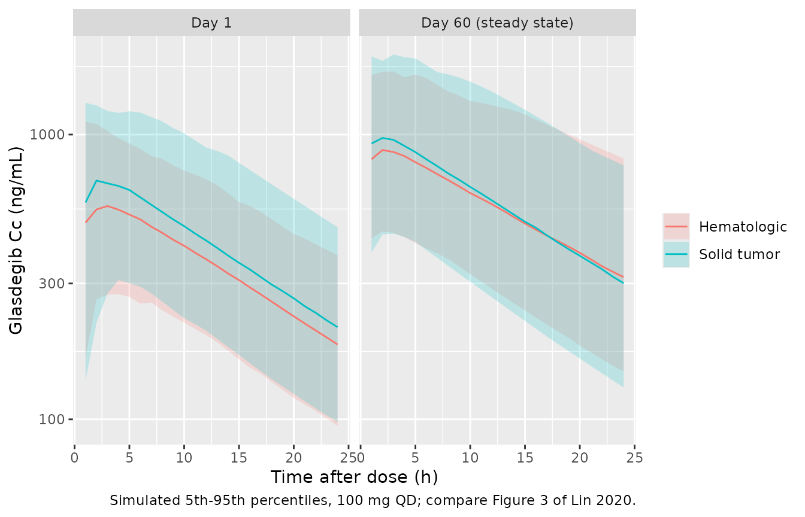
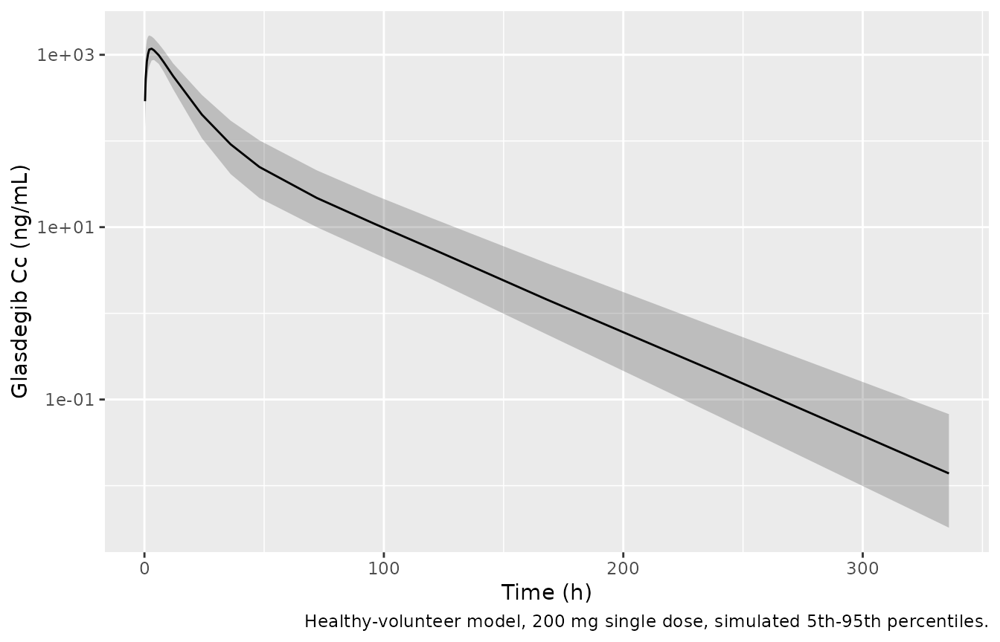

# Glasdegib (Lin 2020)

## Models and source

Lin 2020 developed a population PK model for oral glasdegib in patients
with cancer. Table 3 of the paper also reports, for comparison, a
separately fitted model from healthy volunteers. The two models were
fitted to different cohorts, so the paper contributes two model files.

``` r

mod_pat <- rxode2::rxode(readModelDb("Lin_2020_glasdegib"))
#> ℹ parameter labels from comments will be replaced by 'label()'
mod_hv <- rxode2::rxode(readModelDb("Lin_2020_glasdegib_healthy"))
#> ℹ parameter labels from comments will be replaced by 'label()'

tibble::tibble(
  Model = c("Lin_2020_glasdegib", "Lin_2020_glasdegib_healthy"),
  Cohort = c(
    "269 patients with hematologic malignancies or solid tumors (final model)",
    "49 healthy volunteers (exploratory comparison model, Table 3 footnote b)"
  )
) |>
  knitr::kable()
```

| Model | Cohort |
|:---|:---|
| Lin_2020_glasdegib | 269 patients with hematologic malignancies or solid tumors (final model) |
| Lin_2020_glasdegib_healthy | 49 healthy volunteers (exploratory comparison model, Table 3 footnote b) |

- Citation: Lin S, Shaik N, Martinelli G, Wagner AJ, Cortes J,
  Ruiz-Garcia A. Population Pharmacokinetics of Glasdegib in Patients
  With Advanced Hematologic Malignancies and Solid Tumors. J Clin
  Pharmacol. 2020;60(5):605-616. <doi:10.1002/jcph.1556>. Studies
  B1371001 (NCT00953758), B1371002 (NCT01286467) and B1371003
  (NCT01546038).
- Article: <https://doi.org/10.1002/jcph.1556> (open access, PMC7187372)
- Supplement (Supplemental Tables S1-S5, Figures S1-S2):
  <https://europepmc.org/article/PMC/PMC7187372>

Both models are two-compartment models with first-order absorption. The
patient model’s covariates are baseline body weight (allometric), the
weight-standardized creatinine clearance, the baseline percentage of
bone marrow blasts and concomitant CYP3A inhibitors on CL/F, and tumor
type (solid vs hematologic) on Vp/F and Q/F.

The steady-state exposures from this model were used in the
exposure-response analyses of the same group; the overall-survival
models from that work are packaged as `Lin_2020_glasdegib_treatment`,
`Lin_2020_glasdegib_exposure` and `Lin_2020_glasdegib_decitabine`.

## Population

The analysis pooled three studies: B1371001 (47 patients with
hematologic malignancies, 5-600 mg QD), B1371002 (23 patients with solid
tumors, 80-640 mg QD) and B1371003 (202 patients with AML or high-risk
MDS, 100 or 200 mg QD combined with low-dose cytarabine, decitabine or
7 + 3 chemotherapy). Of the 272 enrolled patients, 3 had no PK samples,
which left 269 patients (246 hematologic, 23 solid tumor) and 3616
concentrations. Table 2 gives the baseline characteristics of all 272:
median age 69 years (25-92), median weight 78.6 kg (43.5-145.6), 181
male and 91 female, 86% White. Median Cockcroft-Gault creatinine
clearance was 80.9 mL/min (31.4-238.4), and 62 and 56 patients took a
moderate or a strong CYP3A inhibitor. 187 patients (69%) received the
clinical dose of 100 mg QD.

The healthy-volunteer model used 1937 concentrations from 49 noncancer
subjects of studies B1371010 (a ketoconazole interaction study with a
200 mg single dose of glasdegib) and B1371014. The paper does not report
their demographics.

``` r

str(readModelDb("Lin_2020_glasdegib")()$population[c("n_subjects", "age_range", "weight_range")])
#> List of 3
#>  $ n_subjects  : int 269
#>  $ age_range   : chr "25-92 years (median 69) (Table 2, all 272 enrolled patients)"
#>  $ weight_range: chr "43.5-145.6 kg (median 78.6) (Table 2)"
```

## Source trace

Every `ini()` value has a comment in the model file giving its source.
The covariate coefficients are taken from the final-model equations in
Results (“Covariate Analyses and Final Model”), which print more digits
than Table 3.

| Parameter | Value | Source |
|----|----|----|
| `lka` | log(0.06) | Table 3, ka = 0.06 1/h |
| `lcl` | log(6.27) | Table 3 and CL/F equation |
| `lvc` | log(3.32) | Table 3 and Vc/F equation |
| `lvp` | log(279.21) | Table 3 and Vp/F equation |
| `lq` | log(1.29) | Table 3 and Q/F equation |
| `e_wt_cl_q`, `e_wt_vc_vp` | 0.75, 1 (fixed) | Results “Base Model”; final-model equations |
| `e_crcl_cl` | 0.406 | CL/F equation, `(WNCL/71.23)^0.406` |
| `e_bmblast_pct_cl` | -0.004 | CL/F equation, `(1 - 0.004 (BPBL - 38.20))` |
| `e_cyp3a4_inh_mod_cl` | -0.173 | CL/F equation, `(1 - 0.173 CYPmoderate)` |
| `e_cyp3a4_inh_strong_cl` | -0.303 | CL/F equation, `(1 - 0.303 CYPstrong)` |
| `e_tumtp_solid_vp` | -0.825 | Vp/F equation, `(1 - 0.825 Solid)` |
| `e_tumtp_solid_q` | -0.653 | Q/F equation, `(1 - 0.653 Solid)` |
| IIV CL/F, Vc/F, Vp/F, Q/F, ka | 43.0, 215.3, 112.8, 65.8, 13.5 %CV | Table 3; `omega^2 = log(1 + CV^2)` |
| `expSdHeme`, `expSdSolid` | 0.658, 0.595 | Table 3 residual error; Methods (log-transformed data, thetarized sigma) |
| WNCL = CRCL x 70 / WT | n/a | Table 1 footnote a |
| Two-compartment ODEs, first-order absorption | n/a | Methods; Figure 1 |
| Healthy-volunteer model: CL/F, Vc/F, Vp/F, Q/F, ka | 10.1, 112, 53.5, 1.92, 0.79 | Table 3, “Healthy Volunteer Model” column |
| Healthy-volunteer IIV CL/F, Vc/F, Vp/F, Q/F, ka | 19.6, 11.0, 3.2 (fixed), 3.2 (fixed), 53.4 %CV | Table 3 |
| Healthy-volunteer proportional residual error | 58.6% | Table 3, footnote b |

## Typical-value covariate effects (Table 4)

Table 4 lists the typical CL/F, Vc/F, Vp/F and Q/F for a 70 kg
hematologic patient with 38.2% marrow blasts and no CYP3A inhibitor,
then changes one covariate at a time. The chunk below computes the same
quantities from the packaged model: it solves the model with the random
effects set to zero and reads the individual parameters from the output.

``` r

mod_pat_typ <- rxode2::zeroRe(mod_pat)
#> Warning: No sigma parameters in the model

# Reference: WT 70 kg and WNCL = 71.23 mL/min, i.e. raw CRCL = 71.23 at 70 kg.
t4 <- tibble::tribble(
  ~scenario, ~WT, ~wncl, ~BMBLAST_PCT, ~CONMED_CYP3A4_INH_MOD, ~CONMED_CYP3A4_INH_STRONG, ~TUMTP_SOLID,
  "Typical patient", 70, 71.23, 38.2, 0, 0, 0,
  "Body weight 61.24 kg", 61.24, 71.23, 38.2, 0, 0, 0,
  "Body weight 102.1 kg", 102.1, 71.23, 38.2, 0, 0, 0,
  "Marrow blasts 15%", 70, 71.23, 15, 0, 0, 0,
  "Marrow blasts 83%", 70, 71.23, 83, 0, 0, 0,
  "Moderate CYP3A inhibitor", 70, 71.23, 38.2, 1, 0, 0,
  "Strong CYP3A inhibitor", 70, 71.23, 38.2, 0, 1, 0,
  "Solid tumor", 70, 71.23, 38.2, 0, 0, 1
) |>
  mutate(id = row_number(), CRCL = wncl * WT / 70)

ev_t4 <- t4 |>
  select(id, WT, CRCL, BMBLAST_PCT, CONMED_CYP3A4_INH_MOD, CONMED_CYP3A4_INH_STRONG, TUMTP_SOLID) |>
  mutate(time = 0, evid = 0, amt = 0, cmt = "central")

par_t4 <- rxode2::rxSolve(mod_pat_typ, events = ev_t4, returnType = "data.frame") |>
  select(id, cl, vc, vp, q) |>
  left_join(t4 |> select(id, scenario), by = "id")
#> ℹ omega/sigma items treated as zero: 'etalcl', 'etalvc', 'etalvp', 'etalq', 'etalka'
#> Warning: multi-subject simulation without without 'omega'

# Published Table 4 values (rounded to 0.1 in the paper); NA where Table 4 has
# no entry for that parameter in that scenario.
pub_t4 <- tibble::tribble(
  ~scenario, ~cl_pub, ~vc_pub, ~vp_pub, ~q_pub,
  "Typical patient", 6.3, 3.3, 279.2, 1.3,
  "Body weight 61.24 kg", 5.7, 2.9, NA, NA,
  "Body weight 102.1 kg", 8.3, 4.8, NA, NA,
  "Marrow blasts 15%", 6.9, NA, NA, NA,
  "Marrow blasts 83%", 5.1, NA, NA, NA,
  "Moderate CYP3A inhibitor", 5.2, NA, NA, NA,
  "Strong CYP3A inhibitor", 4.4, NA, NA, NA,
  "Solid tumor", NA, NA, 48.9, 0.4
)

t4_cmp <- par_t4 |> left_join(pub_t4, by = "scenario")

t4_cmp |>
  select(scenario, cl, cl_pub, vc, vc_pub, vp, vp_pub, q, q_pub) |>
  dplyr::rename(
    Scenario = scenario,
    "CL/F model" = cl, "CL/F Table 4" = cl_pub,
    "Vc/F model" = vc, "Vc/F Table 4" = vc_pub,
    "Vp/F model" = vp, "Vp/F Table 4" = vp_pub,
    "Q/F model" = q, "Q/F Table 4" = q_pub
  ) |>
  knitr::kable(digits = 2, caption = "Replicates Table 4 of Lin 2020 (L/h and L).")
```

| Scenario | CL/F model | CL/F Table 4 | Vc/F model | Vc/F Table 4 | Vp/F model | Vp/F Table 4 | Q/F model | Q/F Table 4 |
|:---|---:|---:|---:|---:|---:|---:|---:|---:|
| Typical patient | 6.27 | 6.3 | 3.32 | 3.3 | 279.21 | 279.2 | 1.29 | 1.3 |
| Body weight 61.24 kg | 5.67 | 5.7 | 2.90 | 2.9 | 244.27 | NA | 1.17 | NA |
| Body weight 102.1 kg | 8.32 | 8.3 | 4.84 | 4.8 | 407.25 | NA | 1.71 | NA |
| Marrow blasts 15% | 6.85 | 6.9 | 3.32 | NA | 279.21 | NA | 1.29 | NA |
| Marrow blasts 83% | 5.15 | 5.1 | 3.32 | NA | 279.21 | NA | 1.29 | NA |
| Moderate CYP3A inhibitor | 5.19 | 5.2 | 3.32 | NA | 279.21 | NA | 1.29 | NA |
| Strong CYP3A inhibitor | 4.37 | 4.4 | 3.32 | NA | 279.21 | NA | 1.29 | NA |
| Solid tumor | 6.27 | NA | 3.32 | NA | 48.86 | 48.9 | 0.45 | 0.4 |

Replicates Table 4 of Lin 2020 (L/h and L). {.table}

``` r


# Deterministic check: the model values must round to the published values.
# Table 4 prints one decimal place, so the tolerance is half a unit in that
# place (0.05) plus a little slack for the paper's own rounding of inputs.
long_cmp <- bind_rows(
  t4_cmp |> transmute(scenario, model = cl, pub = cl_pub),
  t4_cmp |> transmute(scenario, model = vc, pub = vc_pub),
  t4_cmp |> transmute(scenario, model = vp, pub = vp_pub),
  t4_cmp |> transmute(scenario, model = q, pub = q_pub)
) |>
  filter(!is.na(pub))
stopifnot(nrow(long_cmp) == 14, all(abs(long_cmp$model - long_cmp$pub) <= 0.06))
```

All fourteen Table 4 entries are reproduced to the printed precision.
Table 4 also lists CL/F by renal-function group (6.5, 6.2 and 4.8 L/h at
median raw CRCL 110.2, 75.5 and 51.1 mL/min). Its footnote and the
Discussion describe these as body-weight-normalized post hoc estimates,
not typical values from the equation, so they are not a check on the
equation and are left out of the comparison above.

## Steady-state exposure by covariate scenario (Figure 4)

Figure 4 shows the median steady-state Cmax and AUCtau for each
covariate scenario (500 simulated patients each). The caption does not
state the dose; the clinical dose of 100 mg QD is assumed, and the
agreement below supports it. The caption describes the reference as “a
70-kg male hematology patient” but also as having “the median values for
baseline weight”. The printed numbers fit the median, 78.6 kg: at 70 kg
every non-weight row would be about 9% above the printed value. Sex is
not a covariate, so the “Female” row is the reference patient: 78.6 kg,
median WNCL and median marrow blasts, hematologic malignancy and no
CYP3A inhibitor. The typical-value model below uses these reference
covariates and changes one of them per row. PKNCA computes Cmax and AUC
over the dosing interval on day 60.

``` r

fig4 <- tibble::tribble(
  ~scenario, ~WT, ~wncl, ~BMBLAST_PCT, ~CONMED_CYP3A4_INH_MOD, ~CONMED_CYP3A4_INH_STRONG, ~TUMTP_SOLID, ~cmax_pub, ~auc_pub,
  "Female (reference)", 78.6, 71.23, 38.2, 0, 0, 0, 995.5, 14980.2,
  "Solid tumor", 78.6, 71.23, 38.2, 0, 0, 1, 1021.4, 15269.9,
  "Strong CYP inhibitor", 78.6, 71.23, 38.2, 0, 1, 0, 1327.1, 20317.5,
  "Moderate CYP inhibitor", 78.6, 71.23, 38.2, 1, 0, 0, 1103.0, 16829.0,
  "BPBL 80.0", 78.6, 71.23, 80.0, 0, 0, 0, 1099.1, 16759.5,
  "BPBL 60.0", 78.6, 71.23, 60.0, 0, 0, 0, 1043.3, 15749.1,
  "BPBL 25.0", 78.6, 71.23, 25.0, 0, 0, 0, 922.4, 13988.1,
  "BPBL 17.8", 78.6, 71.23, 17.8, 0, 0, 0, 904.9, 13512.3,
  "WNCL 109.59", 78.6, 109.59, 38.2, 0, 0, 0, 821.2, 12250.7,
  "WNCL 88.48", 78.6, 88.48, 38.2, 0, 0, 0, 899.6, 13538.4,
  "WNCL 57.45", 78.6, 57.45, 38.2, 0, 0, 0, 1047.4, 15800.2,
  "WNCL 46.95", 78.6, 46.95, 38.2, 0, 0, 0, 1126.3, 17102.6,
  "BWT 102.28", 102.28, 71.23, 38.2, 0, 0, 0, 748.0, 11371.7,
  "BWT 89.00", 89.00, 71.23, 38.2, 0, 0, 0, 853.2, 12874.9,
  "BWT 78.60", 78.60, 71.23, 38.2, 0, 0, 0, 871.8, 13285.4,
  "BWT 68.00", 68.00, 71.23, 38.2, 0, 0, 0, 1017.1, 15327.3,
  "BWT 61.26", 61.26, 71.23, 38.2, 0, 0, 0, 1099.0, 16480.8
) |>
  mutate(id = row_number(), CRCL = wncl * WT / 70)

tau <- 24
ss_start <- 59 * tau
obs_times <- ss_start + seq(0, tau, by = 0.25)

ev_fig4 <- bind_rows(
  fig4 |> select(id) |>
    tidyr::crossing(time = seq(0, ss_start, by = tau)) |>
    mutate(evid = 1, amt = 100, cmt = "depot"),
  fig4 |> select(id) |>
    tidyr::crossing(time = obs_times) |>
    mutate(evid = 0, amt = 0, cmt = "central")
) |>
  left_join(fig4 |> select(id, scenario, WT, CRCL, BMBLAST_PCT, CONMED_CYP3A4_INH_MOD,
                           CONMED_CYP3A4_INH_STRONG, TUMTP_SOLID), by = "id") |>
  arrange(id, time, desc(evid))

sim_fig4 <- rxode2::rxSolve(mod_pat_typ, events = ev_fig4, keep = "scenario",
                            returnType = "data.frame")
#> ℹ omega/sigma items treated as zero: 'etalcl', 'etalvc', 'etalvp', 'etalq', 'etalka'
#> Warning: multi-subject simulation without without 'omega'
```

``` r

conc4 <- sim_fig4 |>
  dplyr::filter(!is.na(Cc)) |>
  select(id, time, Cc, scenario)
dose4 <- ev_fig4 |>
  dplyr::filter(evid == 1) |>
  select(id, time, amt, scenario)

nca4 <- PKNCA::pk.nca(PKNCA::PKNCAdata(
  PKNCA::PKNCAconc(conc4, Cc ~ time | scenario + id),
  PKNCA::PKNCAdose(dose4, amt ~ time | scenario + id),
  intervals = data.frame(start = ss_start, end = ss_start + tau, cmax = TRUE, auclast = TRUE)
))

res4 <- as.data.frame(nca4) |>
  dplyr::filter(PPTESTCD %in% c("cmax", "auclast")) |>
  select(scenario, PPTESTCD, PPORRES) |>
  tidyr::pivot_wider(names_from = PPTESTCD, values_from = PPORRES) |>
  left_join(fig4 |> select(scenario, cmax_pub, auc_pub), by = "scenario") |>
  mutate(
    cmax_pct = 100 * (cmax / cmax_pub - 1),
    auc_pct = 100 * (auclast / auc_pub - 1)
  )

res4 |>
  select(scenario, cmax, cmax_pub, cmax_pct, auclast, auc_pub, auc_pct) |>
  dplyr::rename(
    Scenario = scenario,
    "Cmax,ss model (ng/mL)" = cmax, "Cmax,ss Figure 4" = cmax_pub, "Cmax diff (%)" = cmax_pct,
    "AUCtau,ss model (ng*h/mL)" = auclast, "AUCtau,ss Figure 4" = auc_pub, "AUC diff (%)" = auc_pct
  ) |>
  knitr::kable(digits = 1, caption = "Replicates the printed medians of Figure 4 of Lin 2020 (100 mg QD, day 60).")
```

| Scenario | Cmax,ss model (ng/mL) | Cmax,ss Figure 4 | Cmax diff (%) | AUCtau,ss model (ng\*h/mL) | AUCtau,ss Figure 4 | AUC diff (%) |
|:---|---:|---:|---:|---:|---:|---:|
| BPBL 17.8 | 906.1 | 904.9 | 0.1 | 13499.7 | 13512.3 | -0.1 |
| BPBL 25.0 | 928.1 | 922.4 | 0.6 | 13868.7 | 13988.1 | -0.9 |
| BPBL 60.0 | 1052.1 | 1043.3 | 0.8 | 15993.5 | 15749.1 | 1.6 |
| BPBL 80.0 | 1140.9 | 1099.1 | 3.8 | 17527.5 | 16759.5 | 4.6 |
| BWT 102.28 | 793.3 | 748.0 | 6.1 | 11979.9 | 11371.7 | 5.3 |
| BWT 61.26 | 1175.5 | 1099.0 | 7.0 | 17605.1 | 16480.8 | 6.8 |
| BWT 68.00 | 1085.3 | 1017.1 | 6.7 | 16278.2 | 15327.3 | 6.2 |
| BWT 78.60 | 971.2 | 871.8 | 11.4 | 14600.3 | 13285.4 | 9.9 |
| BWT 89.00 | 882.8 | 853.2 | 3.5 | 13299.3 | 12874.9 | 3.3 |
| Female (reference) | 971.2 | 995.5 | -2.4 | 14600.3 | 14980.2 | -2.5 |
| Moderate CYP inhibitor | 1147.9 | 1103.0 | 4.1 | 17650.2 | 16829.0 | 4.9 |
| Solid tumor | 1009.3 | 1021.4 | -1.2 | 14612.8 | 15269.9 | -4.3 |
| Strong CYP inhibitor | 1331.6 | 1327.1 | 0.3 | 20934.3 | 20317.5 | 3.0 |
| WNCL 109.59 | 830.8 | 821.2 | 1.2 | 12258.7 | 12250.7 | 0.1 |
| WNCL 46.95 | 1127.3 | 1126.3 | 0.1 | 17288.9 | 17102.6 | 1.1 |
| WNCL 57.45 | 1048.4 | 1047.4 | 0.1 | 15930.6 | 15800.2 | 0.8 |
| WNCL 88.48 | 898.4 | 899.6 | -0.1 | 13370.7 | 13538.4 | -1.2 |

Replicates the printed medians of Figure 4 of Lin 2020 (100 mg QD, day
60). {.table}

The CYP3A, marrow-blast, renal-function and tumor-type rows agree with
the printed medians to within about 5%. The body-weight rows are 3-11%
higher than printed. Figure 4 has its own internal noise of about that
size. The “Female” row and the “BWT 78.60” row describe the same
patient, since sex is not a covariate and 78.6 kg is the median weight,
yet the figure prints AUCs of 14980 and 13285 ng\*h/mL for them, 11%
apart. Each scenario appears to be a separate 500-patient Monte Carlo
simulation. The median AUC over log-normal clearance is the typical
value, so the typical-value solve here has no such noise. The fold
changes relative to the “Female” row are:

``` r

ref_row <- res4 |> dplyr::filter(scenario == "Female (reference)")
fold4 <- res4 |>
  mutate(
    fold_model = auclast / ref_row$auclast,
    fold_pub = auc_pub / ref_row$auc_pub,
    fold_pct = 100 * (fold_model / fold_pub - 1)
  )
fold4 |>
  select(scenario, fold_model, fold_pub, fold_pct) |>
  dplyr::rename(
    Scenario = scenario, "AUC fold, model" = fold_model,
    "AUC fold, Figure 4" = fold_pub, "Difference (%)" = fold_pct
  ) |>
  knitr::kable(digits = 3, caption = "AUCtau,ss fold change relative to the reference patient.")
```

| Scenario               | AUC fold, model | AUC fold, Figure 4 | Difference (%) |
|:-----------------------|----------------:|-------------------:|---------------:|
| BPBL 17.8              |           0.925 |              0.902 |          2.506 |
| BPBL 25.0              |           0.950 |              0.934 |          1.726 |
| BPBL 60.0              |           1.095 |              1.051 |          4.194 |
| BPBL 80.0              |           1.200 |              1.119 |          7.303 |
| BWT 102.28             |           0.821 |              0.759 |          8.089 |
| BWT 61.26              |           1.206 |              1.100 |          9.601 |
| BWT 68.00              |           1.115 |              1.023 |          8.967 |
| BWT 78.60              |           1.000 |              0.887 |         12.757 |
| BWT 89.00              |           0.911 |              0.859 |          5.984 |
| Female (reference)     |           1.000 |              1.000 |          0.000 |
| Moderate CYP inhibitor |           1.209 |              1.123 |          7.608 |
| Solid tumor            |           1.001 |              1.019 |         -1.813 |
| Strong CYP inhibitor   |           1.434 |              1.356 |          5.716 |
| WNCL 109.59            |           0.840 |              0.818 |          2.669 |
| WNCL 46.95             |           1.184 |              1.142 |          3.719 |
| WNCL 57.45             |           1.091 |              1.055 |          3.448 |
| WNCL 88.48             |           0.916 |              0.904 |          1.331 |

AUCtau,ss fold change relative to the reference patient. {.table
style="width:100%;"}

``` r


# Typical-value solve, so the model side is deterministic (no rxode2 RNG);
# the tolerance covers the Monte Carlo noise in the published medians, which
# the Female / BWT 78.60 pair puts at about 11%. Realised on authoring: median
# AUC difference +1.6%, median Cmax difference +0.8%, 90th percentile of the
# absolute fold difference about 9.2%. A mis-transcribed clearance, dose or
# unit moves these by tens of percent.
stopifnot(
  abs(median(res4$auc_pct)) < 10,
  abs(median(res4$cmax_pct)) < 10,
  quantile(abs(fold4$fold_pct), 0.9) < 15
)
```

The fold changes all point in the published direction and have the
published magnitudes. The largest differences are in the body-weight
rows, which inherit the offset described above. The CYP3A rows follow
the equation exactly: 1 / (1 - 0.303) = 1.43-fold and 1 / (1 - 0.173) =
1.21-fold. Figure 4 prints 1.36 and 1.12. The Results and Table 4 quote
the same 17% and 30% CL/F reductions as the equation, so the equation is
carried as published.

## Concentration-time profiles (Figure 3)

Figure 3 is a prediction-corrected VPC of the observed data by study,
which cannot be reproduced without the data. The chunk below shows the
simulated 5th, 50th and 95th percentiles for 100 mg QD, the clinical
dose, over the first day and at steady state, for 200 hematologic and
200 solid-tumor patients.

``` r

rxode2::rxSetSeed(20200501)
set.seed(20200501)

make_cohort <- function(n, solid, id_offset) {
  tibble(
    id = id_offset + seq_len(n),
    WT = pmin(pmax(exp(rnorm(n, log(78.6), 0.22)), 43.5), 145.6),
    CRCL = pmin(pmax(exp(rnorm(n, log(80.9), 0.35)), 31.4), 238.4),
    BMBLAST_PCT = if (solid) 38.2 else pmin(pmax(rnorm(n, 39.3, 25), 0), 100),
    CONMED_CYP3A4_INH_MOD = 0,
    CONMED_CYP3A4_INH_STRONG = 0,
    TUMTP_SOLID = as.integer(solid),
    group = if (solid) "Solid tumor" else "Hematologic"
  )
}
cohort <- bind_rows(
  make_cohort(200, solid = FALSE, id_offset = 0L),
  make_cohort(200, solid = TRUE, id_offset = 200L)
)
stopifnot(!anyDuplicated(cohort$id))

vpc_times <- c(seq(0, 24, by = 1), ss_start + seq(0, 24, by = 1))
ev_vpc <- bind_rows(
  cohort |> tidyr::crossing(time = seq(0, ss_start, by = tau)) |>
    mutate(evid = 1, amt = 100, cmt = "depot"),
  cohort |> tidyr::crossing(time = vpc_times) |>
    mutate(evid = 0, amt = 0, cmt = "central")
) |>
  arrange(id, time, desc(evid))

sim_vpc <- rxode2::rxSolve(mod_pat, events = ev_vpc, keep = "group", returnType = "data.frame")
```

``` r

sim_vpc |>
  mutate(day = ifelse(time < ss_start, "Day 1", "Day 60 (steady state)"),
         tad = ifelse(time < ss_start, time, time - ss_start)) |>
  group_by(group, day, tad) |>
  summarise(
    Q05 = quantile(Cc, 0.05, na.rm = TRUE),
    Q50 = quantile(Cc, 0.50, na.rm = TRUE),
    Q95 = quantile(Cc, 0.95, na.rm = TRUE),
    .groups = "drop"
  ) |>
  dplyr::filter(tad > 0) |>
  ggplot(aes(tad, Q50, colour = group, fill = group)) +
  geom_ribbon(aes(ymin = Q05, ymax = Q95), alpha = 0.2, colour = NA) +
  geom_line() +
  facet_wrap(~day) +
  scale_y_log10() +
  labs(x = "Time after dose (h)", y = "Glasdegib Cc (ng/mL)", colour = NULL, fill = NULL,
       caption = "Simulated 5th-95th percentiles, 100 mg QD; compare Figure 3 of Lin 2020.")
```



Figure 3C, study B1371003 where most patients took 100 mg QD, has its
prediction-corrected median at roughly 500-1000 ng/mL, with most
observations between about 100 and 3000 ng/mL. The simulated profiles
fall in the same range.

## Healthy-volunteer model

The Discussion states that the healthy-volunteer CL/F is “over 1.6-fold
higher” and ka “over 13-fold higher” than in patients. Both follow from
the two parameter sets:

``` r

hv_ratio <- c(
  cl = exp(mod_hv$theta[["lcl"]] - mod_pat$theta[["lcl"]]),
  ka = exp(mod_hv$theta[["lka"]] - mod_pat$theta[["lka"]])
)
round(hv_ratio, 2)
#>    cl    ka 
#>  1.61 13.17
stopifnot(hv_ratio[["cl"]] > 1.6, hv_ratio[["ka"]] > 13)
```

For a 70 kg subject, a 200 mg single dose (the B1371010 regimen) is
simulated with the typical healthy-volunteer model and with 200
simulated volunteers. PKNCA’s AUC0-inf from the typical-value profile
must equal Dose / (CL/F).

``` r

mod_hv_typ <- rxode2::zeroRe(mod_hv)
hv_times <- c(0, 0.25, 0.5, 1, 1.5, 2, 3, 4, 6, 8, 12, 24, 36, 48, 72, 96, 120, 168, 240, 336)
ev_hv <- bind_rows(
  tibble(id = 1L, time = 0, evid = 1, amt = 200, cmt = "depot"),
  tibble(id = 1L, time = hv_times, evid = 0, amt = 0, cmt = "central")
) |>
  mutate(WT = 70, arm = "200 mg single dose") |>
  arrange(id, time, desc(evid))
sim_hv_typ <- rxode2::rxSolve(mod_hv_typ, events = ev_hv, returnType = "data.frame") |>
  # a one-subject solve returns no id column
  mutate(id = 1L, arm = "200 mg single dose")
#> ℹ omega/sigma items treated as zero: 'etalcl', 'etalvc', 'etalvp', 'etalq', 'etalka'

nca_hv <- PKNCA::pk.nca(PKNCA::PKNCAdata(
  PKNCA::PKNCAconc(sim_hv_typ |> dplyr::filter(!is.na(Cc)) |> select(id, time, Cc, arm),
                   Cc ~ time | arm + id),
  PKNCA::PKNCAdose(ev_hv |> dplyr::filter(evid == 1) |> select(id, time, amt, arm),
                   amt ~ time | arm + id),
  intervals = data.frame(start = 0, end = Inf, cmax = TRUE, tmax = TRUE,
                         aucinf.obs = TRUE, half.life = TRUE)
))
hv_nca <- as.data.frame(nca_hv) |>
  dplyr::filter(PPTESTCD %in% c("cmax", "tmax", "aucinf.obs", "half.life")) |>
  select(PPTESTCD, PPORRES)
knitr::kable(hv_nca, digits = 2, caption = "Typical healthy volunteer, 70 kg, 200 mg single dose.")
```

| PPTESTCD   |  PPORRES |
|:-----------|---------:|
| cmax       |  1306.36 |
| tmax       |     3.00 |
| half.life  |    24.61 |
| aucinf.obs | 19898.74 |

Typical healthy volunteer, 70 kg, 200 mg single dose. {.table}

``` r


auc_closed <- 200 / 10.1 * 1000
auc_nca <- hv_nca$PPORRES[hv_nca$PPTESTCD == "aucinf.obs"]
stopifnot(abs(auc_nca / auc_closed - 1) < 0.02)
```

``` r

set.seed(20200502)
hv_cohort <- tibble(id = 1:200, WT = pmin(pmax(rnorm(200, 75, 12), 50), 110))
ev_hv_vpc <- bind_rows(
  hv_cohort |> mutate(time = 0, evid = 1, amt = 200, cmt = "depot"),
  hv_cohort |> tidyr::crossing(time = hv_times) |> mutate(evid = 0, amt = 0, cmt = "central")
) |>
  arrange(id, time, desc(evid))
sim_hv <- rxode2::rxSolve(mod_hv, events = ev_hv_vpc, returnType = "data.frame")
sim_hv |>
  dplyr::filter(time > 0) |>
  group_by(time) |>
  summarise(
    Q05 = quantile(Cc, 0.05), Q50 = quantile(Cc, 0.5), Q95 = quantile(Cc, 0.95),
    .groups = "drop"
  ) |>
  ggplot(aes(time, Q50)) +
  geom_ribbon(aes(ymin = Q05, ymax = Q95), alpha = 0.25) +
  geom_line() +
  scale_y_log10() +
  labs(x = "Time (h)", y = "Glasdegib Cc (ng/mL)",
       caption = "Healthy-volunteer model, 200 mg single dose, simulated 5th-95th percentiles.")
```



## Assumptions and deviations

- **IIV scale.** Table 3 gives IIV as “CV (%)” without saying how it was
  computed. The maintainers converted with the log-normal relation
  `omega^2 = log(1 + CV^2)`. For Vc/F (215.3%) this matters: reading the
  value as `100 x omega` instead would give `omega^2 = 4.64` rather than
  1.73. The paper gives no second number that could tell the two
  readings apart.
- **Residual error.** The Methods describe a proportional error on
  log-transformed concentrations with a thetarized sigma, so the patient
  model uses `lnorm()` with the Table 3 percentages as log-scale SDs
  (0.658 hematologic, 0.595 solid tumor).
- **Coefficient precision.** The printed final-model equations give the
  covariate coefficients to three digits (0.173, 0.303, 0.406, 0.825,
  0.653) where Table 3 rounds to two. The equation values are used.
- **Creatinine clearance input.** The model takes the raw
  Cockcroft-Gault CRCL (mL/min) and forms the paper’s
  weight-standardized WNCL = CRCL x 70 / WT internally.
- **Marrow blasts in solid-tumor patients.** Not collected (“Not
  applicable”, Table 2). The paper imputes missing continuous covariates
  at the population median, so the simulations here set 38.2% for
  solid-tumor patients, which makes the term neutral.
- **CYP3A inhibitor indicators.** The paper does not say whether they
  were time-varying. They are simple 0/1 columns, so either use works. A
  subject with both flags gets both factors, as in the published
  equation.
- **Healthy-volunteer model.** Table 3 footnote b states only
  “allometric body weight scaling”. The exponents and the 70 kg
  reference are assumed to be the same as in the patient model. The food
  effect on ka was “empirically added … by linear function”, but its
  coefficient and reference food state are not reported, so it is
  omitted; ka = 0.79 1/h is the typical value in the unstated reference
  state. The paper does not say how the ketoconazole period of B1371010
  was handled; no CYP3A inhibitor covariate is reported. The residual
  error is taken as proportional on the linear scale (“proportional
  error model”, FOCEI).
- **Cohorts.** The Figure 3 cohort draws log-normal weight and CRCL
  around the Table 2 medians, truncated to the Table 2 ranges, and
  excludes CYP3A inhibitors. The healthy-volunteer weights are an
  assumption, as the paper gives none.
- No correction notice for this article was found in Europe PMC as of
  2026-09-26.
