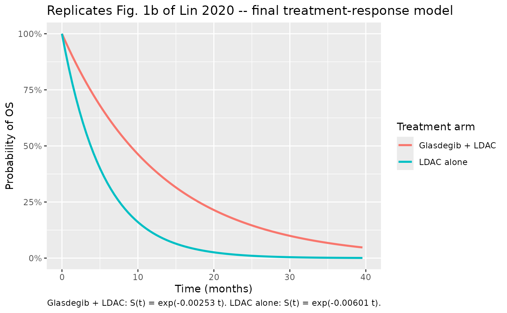
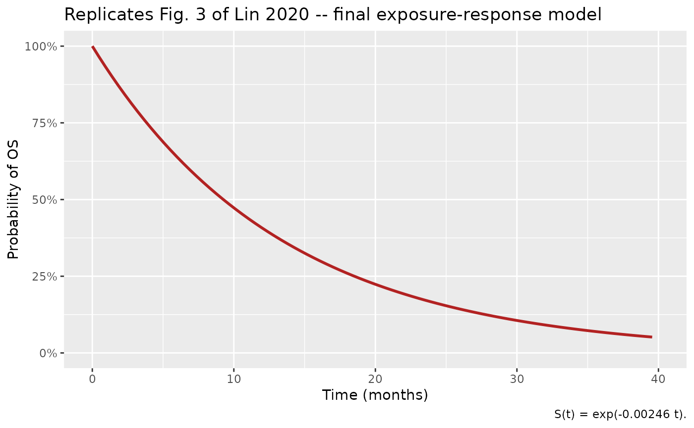
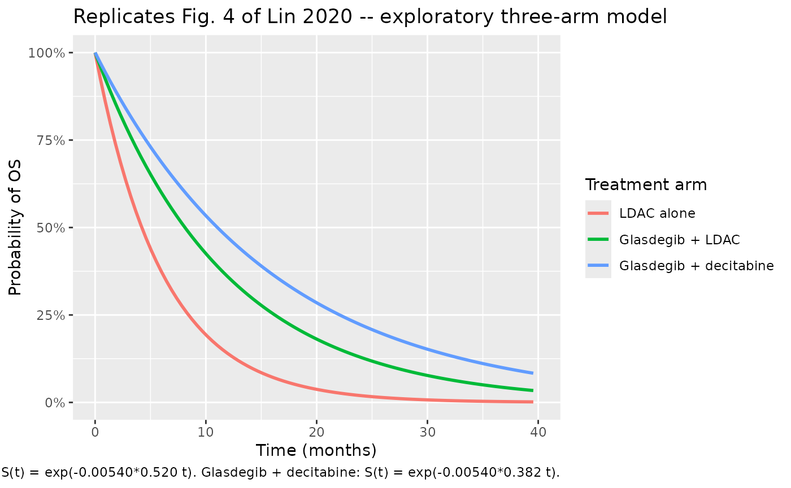

# Glasdegib overall survival in AML (Lin 2020)

## Model and source

- Citation: Lin S, Shaik N, Chan G, Cortes JE, Ruiz-Garcia A. An
  evaluation of overall survival in patients with newly diagnosed acute
  myeloid leukemia and the relationship with glasdegib treatment and
  exposure. Cancer Chemother Pharmacol. 2020;86(4):451-459.
- Article: <https://doi.org/10.1007/s00280-020-04132-x>
- Trial: BRIGHT AML 1003, ClinicalTrials.gov
  [NCT01546038](https://clinicaltrials.gov/ct2/show/NCT01546038)

This vignette packages and validates three parametric exponential
time-to-event (TTE) overall-survival (OS) models from Lin 2020 of the
BRIGHT AML 1003 Phase 1b/2 trial in older adults with newly diagnosed
AML who were ineligible for intensive chemotherapy:

- `Lin_2020_glasdegib_treatment` – Phase 2 treatment-response analysis
  (n = 116; glasdegib + LDAC vs LDAC alone). Treatment arm is the only
  retained covariate.
- `Lin_2020_glasdegib_exposure` – Phase 2 exposure-response analysis (n
  = 75; glasdegib + LDAC subset with PK). Intercept-only exponential; no
  glasdegib exposure metric and no covariate was significant.
- `Lin_2020_glasdegib_decitabine` – exploratory pooled Phase 1b + Phase
  2 analysis (n = 162) including the small glasdegib + decitabine cohort
  (n = 7) alongside glasdegib + LDAC (n = 117) and LDAC alone (n = 38).

All three were fit in NONMEM 7.3.0 with the likelihood-based parametric
TTE formulation (no estimated IIV, no residual error). For each, the
hazard is constant in time (exponential distribution) and modulated
multiplicatively by treatment arm where applicable. nlmixr2lib expresses
these via the canonical TTE pattern
`d/dt(cumhaz) = hazard; sur = exp(-cumhaz)`.

## Population

Phase 2 of BRIGHT AML 1003 randomised 116 older adults (\>= 55 years)
with newly diagnosed AML who were ineligible for intensive chemotherapy:
78 to glasdegib 100 mg orally once daily plus low-dose cytarabine (LDAC;
20 mg SC BID for 10 days per 28-day cycle), and 38 to LDAC alone. Lin
2020 Table 1 reports a median age of 76 years (range 58-92), median
weight 78.2 kg (47.5-118.0), 71% male, 97% White (with 1% Black and 2%
Asian); median baseline creatinine clearance (Cockcroft-Gault) of 62.7
mL/min, suggesting mild renal impairment in most patients; 52% had
secondary AML and 40% had poor cytogenetic risk. Phase 1b added 39
patients to Arm A (glasdegib + LDAC) and 7 patients to Arm B
(glasdegib + decitabine; 5 AML + 2 MDS), giving the n = 162 exploratory
pooled cohort.

## Source trace

The full per-parameter origin is recorded as in-file comments next to
each `ini()` entry in
`inst/modeldb/therapeuticArea/oncology/Lin_2020_glasdegib_*.R`. The
tables below collect them.

### Lin_2020_glasdegib_treatment (Phase 2 treatment-response, n = 116)

| Equation / parameter | Value | Source location |
|----|----|----|
| `S(t) = exp(-lambda * (1 + theta_ldac_alone * LDAC_alone) * t)` | n/a | Lin 2020 Results page 4 typeset equation; Fig. 1b annotation |
| `llam_haz` (lambda for glasdegib + LDAC) | log(0.00253) (1/day) | Lin 2020 page 4: 0.00253, RSE 13.82% |
| `e_ldac_alone` (theta_ldac_alone) | 1.376 | Lin 2020 page 4: 1.376, RSE 37.74% (138% increase in base hazard for LDAC alone) |
| Hazard ratio glasdegib + LDAC vs LDAC alone | 0.421 (computed) | Lin 2020 abstract / page 4: published HR 0.42 (95% CI 0.28-0.66) |
| Estimated IIV on lambda | none | Source NONMEM TTE fit with no subject-level random effects |
| Residual error | none | Source uses NONMEM `LIKE` / `F_FLAG` parametric-TTE branch |

### Lin_2020_glasdegib_exposure (Phase 2 exposure-response subset, n = 75)

| Equation / parameter | Value | Source location |
|----|----|----|
| `S(t) = exp(-lambda * t)` | n/a | Lin 2020 Results page 5; Fig. 3 annotation |
| `llam_haz` (lambda) | log(0.00246) (1/day) | Lin 2020 page 5: 0.00246, RSE 14.19% |
| Covariates retained after SCM backward elimination | none | Lin 2020 page 5: seven glasdegib exposure metrics (raw and log-transformed) plus ECOG and cytogenetic risk were tested; none survived |

### Lin_2020_glasdegib_decitabine (exploratory pooled Phase 1b + Phase 2, n = 162)

| Equation / parameter | Value | Source location |
|----|----|----|
| `S(t) = exp(-lambda * (1 - theta_gl_ldac * GL_LDAC_arm) * (1 - theta_gl_dec * GL_DEC_arm) * t)` | n/a | Lin 2020 Results page 6 typeset equation |
| `llam_haz` (lambda for LDAC alone) | log(0.00540) (1/day) | Lin 2020 page 6: 0.00540, RSE 14.1% |
| `e_gl_ldac_haz` (theta_gl_ldac) | 0.480 | Lin 2020 page 6 equation: 0.480 (= 48.0% hazard reduction for glasdegib + LDAC) |
| `e_gl_dec_haz` (theta_gl_dec) | 0.618 | Lin 2020 page 6 prose / equation: ~61.8% hazard reduction for glasdegib + decitabine (95% CI of change in base hazard -95.0% to -28.6%) |

## Virtual cohort

The published trial-level individual data are not redistributed. The
virtual cohort below assigns each subject to one of the three trial arms
in proportions matching the BRIGHT AML 1003 pooled cohort, and observes
the survival probability `sur` on a daily grid out to 40 months (1216
days). The exponential-hazard structure produces a deterministic
typical-value `S(t)` per arm; per the Lin 2020 source NONMEM fit, no
subject-level IIV is added, so all subjects in an arm follow the same
`S(t)` trajectory.

Per the vignette template’s cohort-size cap, each arm uses \<= 200
subjects.

``` r

set.seed(20260624)

# One observation row per subject per visit day. Observation grid: every 14
# days out to 1216 days (~40 months), matching the Lin 2020 Fig. 1 / Fig. 4
# x-axis range; a time = 0 anchor row is included.
obs_times <- c(0, seq(14, 1216, by = 14))

make_arm <- function(arm_label, n, id_offset, CONMED_GLASDEGIB, CONMED_DECITABINE) {
  ids <- id_offset + seq_len(n)
  tidyr::crossing(
    id = ids,
    time = obs_times
  ) |>
    dplyr::mutate(
      evid  = 0L,
      amt   = 0,
      cmt   = NA_character_,
      arm   = arm_label,
      CONMED_GLASDEGIB  = CONMED_GLASDEGIB,
      CONMED_DECITABINE = CONMED_DECITABINE
    ) |>
    dplyr::select(id, time, evid, amt, cmt, arm,
                  CONMED_GLASDEGIB, CONMED_DECITABINE)
}

events <- dplyr::bind_rows(
  make_arm("LDAC alone",            n = 38,  id_offset =   0L,
           CONMED_GLASDEGIB = 0, CONMED_DECITABINE = 0),
  make_arm("Glasdegib + LDAC",      n = 117, id_offset = 100L,
           CONMED_GLASDEGIB = 1, CONMED_DECITABINE = 0),
  make_arm("Glasdegib + decitabine", n = 7,   id_offset = 300L,
           CONMED_GLASDEGIB = 1, CONMED_DECITABINE = 1)
)

stopifnot(!anyDuplicated(unique(events[, c("id", "time", "evid")])))
cat("Arms:\n"); print(events |> dplyr::distinct(id, arm) |> dplyr::count(arm))
#> Arms:
#> # A tibble: 3 × 2
#>   arm                        n
#>   <chr>                  <int>
#> 1 Glasdegib + LDAC         117
#> 2 Glasdegib + decitabine     7
#> 3 LDAC alone                38
```

## Treatment-response model (Lin_2020_glasdegib_treatment, n = 116)

The treatment-response model uses only `CONMED_GLASDEGIB` (1 =
glasdegib + LDAC arm, 0 = LDAC alone). Subjects in the glasdegib +
decitabine arm of the exploratory cohort are not part of this analysis,
so the simulation below is restricted to the LDAC alone and glasdegib +
LDAC arms.

``` r

mod_trt <- readModelDb("Lin_2020_glasdegib_treatment")

events_trt <- events |> dplyr::filter(arm != "Glasdegib + decitabine")

sim_trt <- rxode2::rxSolve(mod_trt, events = events_trt, keep = c("arm")) |>
  as.data.frame()

# All subjects within an arm share the same typical-value S(t); pick one.
typ_trt <- sim_trt |>
  dplyr::group_by(arm, time) |>
  dplyr::summarise(sur = mean(sur), hazard = mean(hazard), .groups = "drop")
```

``` r

# Replicates Fig. 1b of Lin 2020: predicted S(t) for the final treatment-
# response model by treatment arm.
month_per_day <- 12 / 365.25

ggplot(typ_trt, aes(time * month_per_day, sur, colour = arm)) +
  geom_line(linewidth = 1) +
  scale_x_continuous(breaks = seq(0, 40, by = 10), limits = c(0, 40)) +
  scale_y_continuous(limits = c(0, 1), labels = scales::percent_format(accuracy = 1)) +
  labs(x = "Time (months)", y = "Probability of OS",
       title = "Replicates Fig. 1b of Lin 2020 -- final treatment-response model",
       caption = "Glasdegib + LDAC: S(t) = exp(-0.00253 t). LDAC alone: S(t) = exp(-0.00601 t).",
       colour = "Treatment arm")
```



### Validation against the published survival functions and median OS

Both arms have an exponential survival function `S(t) = exp(-h * t)`
with analytical median OS `ln(2) / h`. The table below compares the
implementation against the published hazards and median OS.

``` r

trt_check <- tibble::tribble(
  ~arm,                ~h_published_per_day, ~h_simulated_per_day,
  "Glasdegib + LDAC",  0.00253,              typ_trt |> dplyr::filter(arm == "Glasdegib + LDAC", time == 0) |> dplyr::pull(hazard),
  "LDAC alone",        0.00253 * (1 + 1.376),
                                              typ_trt |> dplyr::filter(arm == "LDAC alone", time == 0) |> dplyr::pull(hazard)
) |>
  dplyr::mutate(
    median_OS_pub_months = log(2) / h_published_per_day * month_per_day,
    median_OS_sim_months = log(2) / h_simulated_per_day * month_per_day,
    abs_pct_diff_h       = abs(h_simulated_per_day - h_published_per_day) /
                           h_published_per_day * 100
  )
knitr::kable(trt_check, digits = 5,
             caption = "Treatment-response model: published vs simulated hazards and median OS.")
```

| arm | h_published_per_day | h_simulated_per_day | median_OS_pub_months | median_OS_sim_months | abs_pct_diff_h |
|:---|---:|---:|---:|---:|---:|
| Glasdegib + LDAC | 0.00253 | 0.00253 | 9.00111 | 9.00111 | 0 |
| LDAC alone | 0.00601 | 0.00601 | 3.78835 | 3.78835 | 0 |

Treatment-response model: published vs simulated hazards and median OS.
{.table}

``` r


# Hard checks: simulated hazards within 0.1% of published, and median OS
# difference within 5 months of the paper's headline (~5 month gain).
stopifnot(all(trt_check$abs_pct_diff_h < 0.1))
stopifnot(abs(trt_check$median_OS_pub_months[1] - trt_check$median_OS_pub_months[2]) > 4)
stopifnot(abs(trt_check$median_OS_pub_months[1] - trt_check$median_OS_pub_months[2]) < 6)

# Hazard ratio glasdegib + LDAC vs LDAC alone should match the published 0.42.
hr_sim <- trt_check$h_simulated_per_day[1] / trt_check$h_simulated_per_day[2]
cat(sprintf("Hazard ratio glasdegib+LDAC vs LDAC alone: %.3f (paper: 0.42 [0.28-0.66])\n",
            hr_sim))
#> Hazard ratio glasdegib+LDAC vs LDAC alone: 0.421 (paper: 0.42 [0.28-0.66])
stopifnot(abs(hr_sim - 0.42) < 0.01)
```

## Exposure-response model (Lin_2020_glasdegib_exposure, n = 75)

This is an intercept-only exponential model fit to the n = 75
glasdegib + LDAC subset with PK data. The hazard does not depend on any
covariate.

``` r

mod_exp <- readModelDb("Lin_2020_glasdegib_exposure")

# A single typical subject is sufficient because no covariate enters the
# hazard.
events_exp <- tibble::tibble(
  id   = 1L,
  time = obs_times,
  evid = 0L,
  amt  = 0,
  cmt  = NA_character_
)
sim_exp <- rxode2::rxSolve(mod_exp, events = events_exp) |> as.data.frame()
```

``` r

# Replicates Fig. 3 of Lin 2020: predicted S(t) for the final exposure-
# response model (intercept-only).
ggplot(sim_exp, aes(time * month_per_day, sur)) +
  geom_line(linewidth = 1, colour = "firebrick") +
  scale_x_continuous(breaks = seq(0, 40, by = 10), limits = c(0, 40)) +
  scale_y_continuous(limits = c(0, 1), labels = scales::percent_format(accuracy = 1)) +
  labs(x = "Time (months)", y = "Probability of OS",
       title = "Replicates Fig. 3 of Lin 2020 -- final exposure-response model",
       caption = "S(t) = exp(-0.00246 t).")
```



``` r

h_exp_pub <- 0.00246
h_exp_sim <- sim_exp$hazard[1]
exp_check <- tibble::tibble(
  source              = c("published", "simulated"),
  h_per_day           = c(h_exp_pub, h_exp_sim),
  median_OS_months    = log(2) / c(h_exp_pub, h_exp_sim) * month_per_day
)
knitr::kable(exp_check, digits = 5,
             caption = "Exposure-response model: published vs simulated hazard and median OS.")
```

| source    | h_per_day | median_OS_months |
|:----------|----------:|-----------------:|
| published |   0.00246 |          9.25724 |
| simulated |   0.00246 |          9.25724 |

Exposure-response model: published vs simulated hazard and median OS.
{.table}

``` r

stopifnot(abs(h_exp_sim - h_exp_pub) / h_exp_pub * 100 < 0.1)
```

## Exploratory pooled model (Lin_2020_glasdegib_decitabine, n = 162)

The exploratory model includes all three trial arms. The published
per-arm median OS is approximately 11.1 months for glasdegib +
decitabine, 9.1 months for glasdegib + LDAC (computed from
`log(2) / (0.00540 * (1 - 0.480))`), and 4.2 months for LDAC alone
(computed from `log(2) / 0.00540`).

``` r

mod_dec <- readModelDb("Lin_2020_glasdegib_decitabine")

sim_dec <- rxode2::rxSolve(mod_dec, events = events, keep = c("arm")) |>
  as.data.frame()

typ_dec <- sim_dec |>
  dplyr::group_by(arm, time) |>
  dplyr::summarise(sur = mean(sur), hazard = mean(hazard), .groups = "drop")
```

``` r

# Replicates Fig. 4 of Lin 2020: predicted S(t) for the exploratory three-arm
# model.
arm_levels <- c("LDAC alone", "Glasdegib + LDAC", "Glasdegib + decitabine")
ggplot(typ_dec |> dplyr::mutate(arm = factor(arm, levels = arm_levels)),
       aes(time * month_per_day, sur, colour = arm)) +
  geom_line(linewidth = 1) +
  scale_x_continuous(breaks = seq(0, 40, by = 10), limits = c(0, 40)) +
  scale_y_continuous(limits = c(0, 1), labels = scales::percent_format(accuracy = 1)) +
  labs(x = "Time (months)", y = "Probability of OS",
       title = "Replicates Fig. 4 of Lin 2020 -- exploratory three-arm model",
       caption = paste("LDAC alone: S(t) = exp(-0.00540 t).",
                       "Glasdegib + LDAC: S(t) = exp(-0.00540*0.520 t).",
                       "Glasdegib + decitabine: S(t) = exp(-0.00540*0.382 t)."),
       colour = "Treatment arm")
```



``` r

h_ldac     <- 0.00540
h_gl_ldac  <- 0.00540 * (1 - 0.480)
h_gl_dec   <- 0.00540 * (1 - 0.618)

dec_check <- tibble::tribble(
  ~arm,                     ~h_published_per_day, ~h_simulated_per_day,
  "LDAC alone",             h_ldac,
                            typ_dec |> dplyr::filter(arm == "LDAC alone", time == 0) |> dplyr::pull(hazard),
  "Glasdegib + LDAC",       h_gl_ldac,
                            typ_dec |> dplyr::filter(arm == "Glasdegib + LDAC", time == 0) |> dplyr::pull(hazard),
  "Glasdegib + decitabine", h_gl_dec,
                            typ_dec |> dplyr::filter(arm == "Glasdegib + decitabine", time == 0) |> dplyr::pull(hazard)
) |>
  dplyr::mutate(
    median_OS_pub_months = log(2) / h_published_per_day * month_per_day,
    median_OS_sim_months = log(2) / h_simulated_per_day * month_per_day,
    abs_pct_diff_h       = abs(h_simulated_per_day - h_published_per_day) /
                           h_published_per_day * 100
  )

knitr::kable(dec_check, digits = 5,
             caption = "Exploratory three-arm model: published vs simulated hazards and median OS.")
```

| arm | h_published_per_day | h_simulated_per_day | median_OS_pub_months | median_OS_sim_months | abs_pct_diff_h |
|:---|---:|---:|---:|---:|---:|
| LDAC alone | 0.00540 | 0.00540 | 4.21719 | 4.21719 | 0 |
| Glasdegib + LDAC | 0.00281 | 0.00281 | 8.10997 | 8.10997 | 0 |
| Glasdegib + decitabine | 0.00206 | 0.00206 | 11.03975 | 11.03975 | 0 |

Exploratory three-arm model: published vs simulated hazards and median
OS. {.table}

``` r


stopifnot(all(dec_check$abs_pct_diff_h < 0.1))

# Paper reports glasdegib + decitabine median OS = 11.1 months. Computed
# value should agree within 0.5 months.
dec_median <- dec_check$median_OS_pub_months[dec_check$arm == "Glasdegib + decitabine"]
cat(sprintf("Glasdegib + decitabine median OS: %.2f months (paper: 11.1 months)\n",
            dec_median))
#> Glasdegib + decitabine median OS: 11.04 months (paper: 11.1 months)
stopifnot(abs(dec_median - 11.1) < 0.5)
```

## Assumptions and deviations

- **Treatment arm encoded via canonical drug indicators.** Lin 2020
  expresses the treatment-response model with the binary covariate
  `LDAC_alone` (1 = LDAC alone, 0 = glasdegib + LDAC), and the
  exploratory three-arm model with two binary covariates
  `glasdegib+LDAC` and `glasdegib+decitabine` (reference = LDAC alone).
  The nlmixr2lib model files use the canonical covariates
  `CONMED_GLASDEGIB` and `CONMED_DECITABINE` (1 if the named drug is
  present in the subject’s treatment regimen) and derive the paper’s arm
  indicators inside `model()` – `ldac_alone = 1 - CONMED_GLASDEGIB` for
  the treatment-response model, and
  `gl_ldac_arm = CONMED_GLASDEGIB * (1 - CONMED_DECITABINE)`,
  `gl_dec_arm = CONMED_GLASDEGIB * CONMED_DECITABINE` for the
  exploratory model. Published parameter values (lambda,
  theta_ldac_alone, theta_gl_ldac, theta_gl_dec) are preserved verbatim;
  the substitution is purely a column-naming choice that aligns with the
  canonical register.

- **No estimated IIV.** All three source NONMEM runs were fit without
  subject-level random effects (parametric population TTE). The packaged
  models therefore produce a single typical-value `S(t)` per covariate
  setting; per-subject survival trajectories within an arm are
  identical.

- **No residual error.** The source NONMEM `$ERROR` / `$EST` framework
  for parametric TTE uses the `LIKE` / `F_FLAG` branch (the likelihood
  is the survival / event-density itself). The packaged models expose
  `sur` and `hazard` as derived outputs intended for forward simulation;
  downstream users who want stochastic event-time sampling should layer
  a survival- sampling step on top (e.g. inverse-CDF sampling of an
  exponential with rate `hazard`).

- **Documented-but-unused covariates.** All baseline demographics,
  baseline safety laboratory values, and disease characteristics that
  Lin 2020 screened in SCM forward inclusion but did not retain after
  backward elimination are documented in each model file’s
  `covariatesDataExcluded` list (with the cohort-level summary
  statistics from Table 1). The `covariatesDataExcluded` mechanism
  preserves the screening provenance without flagging the entries as
  model-required.

- **Exposure-response cohort size.** The exposure-response analysis (n
  = 75) is a strict subset of the treatment-response analysis
  glasdegib + LDAC arm (n = 78); the difference of 3 patients is those
  without available glasdegib PK information.

- **Phase 1b Arm A subjects.** Phase 1b Arm A evaluated glasdegib at 100
  or 200 mg QD plus LDAC; Phase 2 used the 100 mg QD dose. The
  exploratory pooled analysis pools both phases into the glasdegib +
  LDAC arm because the exposure-response analysis showed no significant
  glasdegib dose / exposure effect on OS. The packaged exploratory model
  encodes a single `CONMED_GLASDEGIB = 1` for all glasdegib-containing
  subjects regardless of dose level.

- **No errata.** A search of the journal landing page, publisher
  corrections feed, and PubMed at extraction time (2026-06-24) found no
  errata or corrigenda for Lin 2020.
