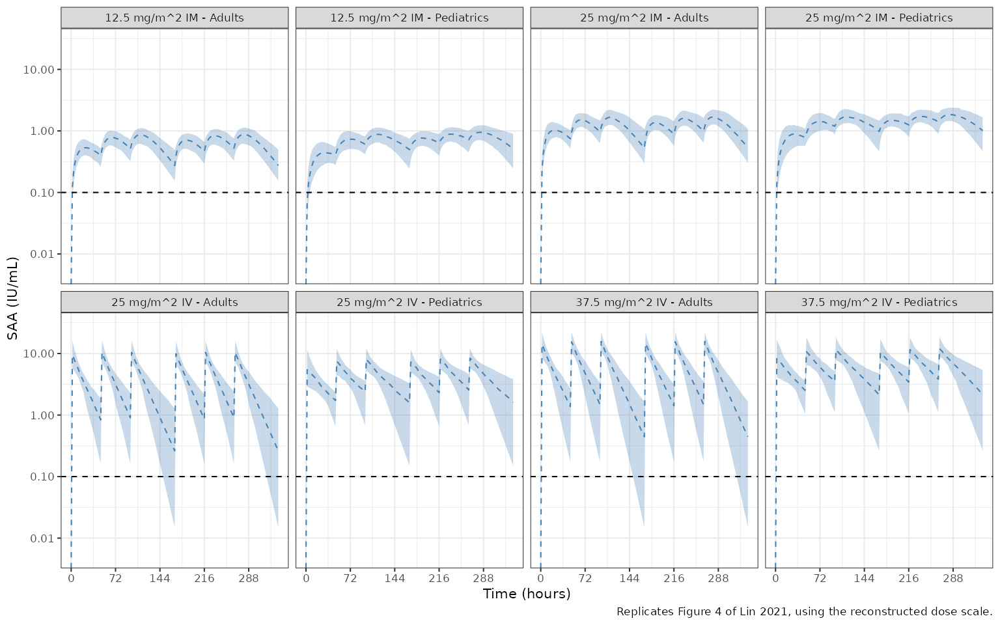

# Recombinant Erwinia chrysanthemi asparaginase in healthy adults (Lin 2021)

``` r

mod <- rxode2::rxode(readModelDb("Lin_2021_asparaginaseErwiniaRecombinant"))
#> ℹ parameter labels from comments will be replaced by 'label()'
```

## Model and source

- Citation: Lin T, Dumas T, Kaullen J, Berry NS, Choi MR, Zomorodi K,
  Silverman JA. Population pharmacokinetic model development and
  simulation for recombinant Erwinia asparaginase produced in
  Pseudomonas fluorescens (JZP-458). Clin Pharmacol Drug Dev.
  2021;10(12):1503-1513. <doi:10.1002/cpdd.1002>
- Description: One-compartment population PK model for recombinant
  Erwinia chrysanthemi asparaginase (JZP-458, marketed as Rylaze) given
  intramuscularly or as a 2-hour intravenous infusion to healthy adults
  (Lin 2021, phase 1 study JZP458-101). The measured quantity is serum
  asparaginase activity (SAA), so all amounts are activity units (IU)
  rather than mass. Intravenous doses enter the central compartment
  directly. Intramuscular doses use sequential mixed-order absorption:
  the bioavailable fraction F enters the depot as a zero-order input at
  a constant rate R1 while first-order absorption ka drains the depot
  into the central compartment, which makes the terminal phase
  absorption rate limited (flip-flop) after intramuscular dosing. Body
  weight is an allometric (power) covariate on clearance;
  interindividual variability is exponential on clearance and volume,
  with a proportional residual error.
- Article: <https://doi.org/10.1002/cpdd.1002>
- Later patient model that reused this paper’s absorption structure:
  `Lin_2023_asparaginaseErwiniaRecombinant` (<doi:10.1111/cts.13499>).

JZP-458 (marketed as Rylaze) is a recombinant *Erwinia chrysanthemi*
asparaginase produced in a *Pseudomonas fluorescens* expression
platform. It is given to patients with acute lymphoblastic leukemia
(ALL) or lymphoblastic lymphoma (LBL) who have developed
hypersensitivity to *E. coli*-derived asparaginases. The measured
quantity is **serum asparaginase activity (SAA)**, and the therapeutic
target is a nadir SAA (NSAA) of at least 0.1 IU/mL.

This phase 1 model was fit jointly to intramuscular (IM) and intravenous
(IV) data, so – unlike the later patient model – it estimates the IM
bioavailability relative to IV and the IV volume and clearance directly.

## Population

The model was fit to 331 quantifiable SAA observations from 24 healthy
adults in the phase 1, single-center, open-label study JZP458-101
(Miami, Florida, November 2018 to May 2019). Participants received a
single dose of JZP-458 at 12.5 or 25 mg/m^2 IM, or 25 or 37.5 mg/m^2 as
a 2-hour IV infusion (six per arm), with intensive sampling to 96 h.
Mean (SD) age was 38.3 (8.6) years, weight 78.3 (9.6) kg and body
surface area 1.9 (0.1) m^2; 71% were male, 83% White and 17%
Black/African American, and 96% Hispanic/Latino (Lin 2021 Table 1).

``` r

str(mod$population, max.level = 1)
#> List of 13
#>  $ species       : chr "human"
#>  $ n_subjects    : int 24
#>  $ n_studies     : int 1
#>  $ n_observations: int 331
#>  $ age_range     : chr "18-55 years (eligibility); mean 38.3 +/- 8.6 years"
#>  $ weight_range  : chr "mean 78.3 +/- 9.6 kg"
#>  $ bsa_range     : chr "mean 1.9 +/- 0.1 m^2"
#>  $ sex_female_pct: num 29.2
#>  $ race_ethnicity: Named num [1:3] 83 17 96
#>   ..- attr(*, "names")= chr [1:3] "White" "Black/African American" "Hispanic/Latino"
#>  $ disease_state : chr "Healthy adult volunteers (body mass index 19.0-30.0 kg/m^2)."
#>  $ dose_range    : chr "Single dose of JZP-458: 12.5 or 25 mg/m^2 intramuscular (n = 6 each; dorsogluteal or deltoid, at most 2 mL per "| __truncated__
#>  $ regions       : chr "United States (single center, Miami, Florida)"
#>  $ notes         : chr "Lin 2021 Methods (Study design) and Table 1. Phase 1, randomized, single-center, open-label study JZP458-101 (N"| __truncated__
```

## Source trace

Every `ini()` entry in
`inst/modeldb/specificDrugs/Lin_2021_asparaginaseErwiniaRecombinant.R`
carries an in-file comment naming its origin. They are collected here
for review.

| Equation / parameter | Value | Source location |
|----|----|----|
| `lcl` (CL, 70 kg) | 146 mL/h | Lin 2021 Table 2 (95% CI 128.4-163.6, RSE 6.15%); Results final CL equation |
| `e_wt_cl` | 0.863 | Lin 2021 Table 2 CL row `146 x (WT/70)^0.863`; Results final CL equation |
| `lvc` (Vd) | 3030 mL | Lin 2021 Table 2 (95% CI 2655-3405, RSE 6.32%) |
| `lfdepot` (F, IM) | 0.365 | Lin 2021 Table 2 (95% CI 0.3074-0.4226, RSE 8.05%); Results “bioavailability at 36.5%” |
| `lka` (ka) | 0.0348 1/h | Lin 2021 Table 2 (95% CI 0.02942-0.04018, RSE 7.89%) |
| `lr1` (zero-order input) | 4000 IU/h | Lin 2021 Table 2 (95% CI 1569-6431, RSE 31.01%) |
| `etalcl` | 0.03502 (BSV 18.88%) | Lin 2021 Table 2 BSV% column, `log(1 + 0.1888^2)` |
| `etalvc` | 0.09783 (BSV 32.06%) | Lin 2021 Table 2 BSV% column, `log(1 + 0.3206^2)` |
| `propSd` | 0.206 | Lin 2021 Table 2 “Error model proportional 20.6%” |
| One compartment, linear elimination | n/a | Lin 2021 Results, Base model and final covariate model |
| Sequential mixed-order IM absorption | n/a | Lin 2021 Results, Base model |
| IM-only bioavailability relative to IV | n/a | Lin 2021 Results, Base model; Table 2 footnote |
| Exponential BSV, allometric weight on CL | n/a | Lin 2021 Table 2 footnotes |
| IV infusion duration 2 h | n/a | Lin 2021 Methods, Study design |

## Model structure

IV doses enter `central` directly. IM doses enter `depot` with
**sequential mixed-order absorption**: the bioavailable fraction
`F * amt` fills the depot as a zero-order input at the constant rate
`R1`, while first-order absorption `ka` drains the depot into `central`
at the same time. `R1` is the NONMEM reserved zero-order input rate for
the dosing compartment, so the input duration is `F * amt / R1`; the
same encoding is used by the later
`Lin_2023_asparaginaseErwiniaRecombinant` model.

After IV dosing the terminal slope reports `kel = CL / Vd`; after IM
dosing `ka` (0.0348 /h) is smaller than `kel` (0.048 /h for a 70 kg
adult), so the IM terminal phase is absorption rate limited (flip-flop).
This is why Lin 2021 reports a half-life only for the IV route.

### Intramuscular dose records must set `rate = -1`

rxode2 only consults a modelled `rate()` when the dose record asks for
it. With the default `rate = 0` the modelled rate is silently ignored
and the IM dose becomes an instantaneous bolus into the depot. The check
below confirms that, with `rate = -1`, the depot fills for exactly
`F * amt / R1` hours.

``` r

tv <- rxode2::zeroRe(mod)
theta <- mod$theta
cl70 <- exp(theta[["lcl"]])
v_i <- exp(theta[["lvc"]])
f_i <- exp(theta[["lfdepot"]])
ka_i <- exp(theta[["lka"]])
r1_i <- exp(theta[["lr1"]])

# Typical-value single-dose solve. route = "IM" doses the depot with the
# modelled zero-order rate; route = "IV" is a 2-hour infusion into central.
solve_one <- function(dose, route, wt = 70, times = seq(0, 240, by = 0.25),
                      im_rate = -1) {
  ev <- if (route == "IM") {
    rxode2::et(amt = dose, cmt = "depot", rate = im_rate)
  } else {
    rxode2::et(amt = dose, cmt = "central", dur = 2)
  }
  ev <- rxode2::et(ev, times, cmt = "central")
  ev <- as.data.frame(ev)
  ev$WT <- wt
  out <- rxode2::rxSolve(tv, ev, returnType = "data.frame",
                         rtol = 1e-10, atol = 1e-12)
  if (is.null(out$id)) out$id <- 1L
  out[!is.na(out$Cc), ]
}

probe_dose <- 30000   # IU; see "Dose units" below
s_im <- solve_one(probe_dose, "IM", times = seq(0, 240, by = 0.05))
#> ℹ omega/sigma items treated as zero: 'etalcl', 'etalvc'
s_im_bolus <- solve_one(probe_dose, "IM", times = seq(0, 240, by = 0.05),
                        im_rate = 0)
#> ℹ omega/sigma items treated as zero: 'etalcl', 'etalvc'
dur_expected <- f_i * probe_dose / r1_i

rate_check <- data.frame(
  Quantity = c("depot peak time (h)", "Tmax of Cc (h)", "Cmax (IU/mL)"),
  `rate = -1` = c(s_im$time[which.max(s_im$depot)],
                  s_im$time[which.max(s_im$Cc)], max(s_im$Cc)),
  `rate = 0` = c(s_im_bolus$time[which.max(s_im_bolus$depot)],
                 s_im_bolus$time[which.max(s_im_bolus$Cc)],
                 max(s_im_bolus$Cc)),
  check.names = FALSE
)
knitr::kable(rate_check, digits = 3,
             caption = "The modelled zero-order rate is active only with rate = -1.")
```

| Quantity            | rate = -1 | rate = 0 |
|:--------------------|----------:|---------:|
| depot peak time (h) |     2.750 |     0.00 |
| Tmax of Cc (h)      |    25.700 |    24.30 |
| Cmax (IU/mL)        |     1.119 |     1.12 |

The modelled zero-order rate is active only with rate = -1. {.table}

``` r

sprintf("expected zero-order duration F * amt / R1 = %.3f h", dur_expected)
#> [1] "expected zero-order duration F * amt / R1 = 2.738 h"

stopifnot(
  abs(s_im$time[which.max(s_im$depot)] - dur_expected) < 0.06,
  s_im_bolus$time[which.max(s_im_bolus$depot)] == 0
)
```

## Dose units: activity units, not mass

The model’s amount unit is **IU of asparaginase activity, not mg**. The
zero-order absorption rate is reported in IU/h (Lin 2021 Table 2) and
`Cc = central / vc` is IU/mL only if `central` holds IU. Lin 2021 doses
in mg/m^2 but does not state the mg-to-IU specific activity of JZP-458,
so **dose this model in IU**; no conversion factor is built into the
model file.

The checks in the next three sections use only dose-independent
quantities. A reconstruction of the dose scale from the paper’s own
simulation table follows them and is labelled as such.

## Validation 1: derived quantities printed in Table 2

The Table 2 footnotes print the apparent IM clearance and volume for a
70 kg adult (`CL/F = 0.4 L/h`, `Vd/F = 8.30 L`) and the IV half-life
(`t1/2 = ln(2) / (CL / Vd) = 14.4 h`). All three follow from the `ini()`
values by arithmetic, and the half-life is also recovered from a
simulated IV profile.

``` r

s_iv <- solve_one(probe_dose, "IV")
#> ℹ omega/sigma items treated as zero: 'etalcl', 'etalvc'
tail_iv <- s_iv[s_iv$time >= 24 & s_iv$time <= 96, ]
thalf_iv_sim <- log(2) /
  -stats::coef(stats::lm(log(tail_iv$Cc) ~ tail_iv$time))[[2]]

derived <- data.frame(
  Quantity = c("CL/F, 70 kg (L/h)", "Vd/F (L)", "IV t1/2 (h), arithmetic",
               "IV t1/2 (h), simulated terminal slope"),
  Model = c(cl70 / f_i / 1000, v_i / f_i / 1000, log(2) * v_i / cl70,
            thalf_iv_sim),
  Published = c(0.4, 8.30, 14.4, 14.4)
)
derived$`Difference (%)` <- 100 * (derived$Model - derived$Published) /
  derived$Published
knitr::kable(derived, digits = 3,
             caption = "Model versus the derived values printed in Lin 2021 Table 2.")
```

| Quantity                              |  Model | Published | Difference (%) |
|:--------------------------------------|-------:|----------:|---------------:|
| CL/F, 70 kg (L/h)                     |  0.400 |       0.4 |          0.000 |
| Vd/F (L)                              |  8.301 |       8.3 |          0.017 |
| IV t1/2 (h), arithmetic               | 14.385 |      14.4 |         -0.103 |
| IV t1/2 (h), simulated terminal slope | 14.385 |      14.4 |         -0.103 |

Model versus the derived values printed in Lin 2021 Table 2. {.table
style="width:100%;"}

``` r


# Deterministic; the published values are rounded to 2-3 significant figures.
stopifnot(all(abs(derived$`Difference (%)`) < 1))
```

## Validation 2: exact bioavailability and weight identities

Elimination is linear, so the IM-to-IV AUC ratio at equal dose must
equal `F`, and halving body weight must raise AUC by `2^0.863` (AUC =
dose / CL, with `CL` proportional to `WT^0.863`).

``` r

auc_of <- function(s) {
  sum(diff(s$time) * (utils::head(s$Cc, -1) + utils::tail(s$Cc, -1)) / 2)
}
grid_long <- seq(0, 1500, by = 0.25)
auc_iv70 <- auc_of(solve_one(probe_dose, "IV", times = grid_long))
#> ℹ omega/sigma items treated as zero: 'etalcl', 'etalvc'
auc_im70 <- auc_of(solve_one(probe_dose, "IM", times = grid_long))
#> ℹ omega/sigma items treated as zero: 'etalcl', 'etalvc'
auc_iv35 <- auc_of(solve_one(probe_dose, "IV", wt = 35, times = grid_long))
#> ℹ omega/sigma items treated as zero: 'etalcl', 'etalvc'

id_check <- data.frame(
  Comparison = c("AUC IM / AUC IV (= F)", "AUC IV 35 kg / 70 kg (= 2^0.863)",
                 "AUC IV x CL / dose (= 1)"),
  Observed = c(auc_im70 / auc_iv70, auc_iv35 / auc_iv70,
               auc_iv70 * cl70 / probe_dose),
  Expected = c(0.365, 2^0.863, 1)
)
knitr::kable(id_check, digits = 5,
             caption = "Exposure identities reproduce F and the weight exponent.")
```

| Comparison                       | Observed | Expected |
|:---------------------------------|---------:|---------:|
| AUC IM / AUC IV (= F)            |  0.36500 |  0.36500 |
| AUC IV 35 kg / 70 kg (= 2^0.863) |  1.81882 |  1.81882 |
| AUC IV x CL / dose (= 1)         |  1.00000 |  1.00000 |

Exposure identities reproduce F and the weight exponent. {.table}

``` r

stopifnot(max(abs(id_check$Observed / id_check$Expected - 1)) < 1e-3)
```

## Validation 3: PKNCA on typical single-dose profiles

NCA is run on the typical-value (no IIV, no residual error) single-dose
profile for each route, at the 70 kg reference weight to which Table 2’s
half-life refers. Lin 2021 reports a half-life for the IV route only;
the IM terminal phase is absorption rate limited and reports
`ln(2) / ka`.

``` r

nca_sim <- dplyr::bind_rows(
  dplyr::mutate(solve_one(probe_dose, "IV", wt = 70), treatment = "IV"),
  dplyr::mutate(solve_one(probe_dose, "IM", wt = 70), treatment = "IM")
) |>
  dplyr::filter(!is.na(Cc)) |>
  dplyr::select(id, treatment, time, Cc) |>
  dplyr::mutate(Cc = pmax(Cc, 0)) |>
  dplyr::group_by(treatment) |>
  dplyr::filter(time <= time[which.max(Cc)] | Cc >= 1e-6 * max(Cc)) |>
  dplyr::ungroup()
#> ℹ omega/sigma items treated as zero: 'etalcl', 'etalvc'
#> ℹ omega/sigma items treated as zero: 'etalcl', 'etalvc'
stopifnot(all(nca_sim$time[!duplicated(nca_sim$treatment)] == 0))

dose_df <- data.frame(id = 1L, treatment = c("IV", "IM"), time = 0,
                      amt = probe_dose)
o_conc <- PKNCA::PKNCAconc(nca_sim, Cc ~ time | treatment + id)
o_dose <- PKNCA::PKNCAdose(dose_df, amt ~ time | treatment + id)
o_data <- PKNCA::PKNCAdata(
  o_conc, o_dose,
  intervals = data.frame(start = 0, end = 240, cmax = TRUE, tmax = TRUE,
                         half.life = TRUE, auclast = TRUE)
)
nca_res <- as.data.frame(PKNCA::pk.nca(o_data))
nca_res |>
  dplyr::filter(PPTESTCD %in% c("cmax", "tmax", "half.life", "auclast")) |>
  dplyr::select(treatment, PPTESTCD, PPORRES) |>
  tidyr::pivot_wider(names_from = PPTESTCD, values_from = PPORRES) |>
  dplyr::rename("Route" = treatment, "Cmax (IU/mL)" = cmax, "Tmax (h)" = tmax,
                "t1/2 (h)" = half.life, "AUC0-240 (IU*h/mL)" = auclast) |>
  knitr::kable(digits = 3,
               caption = "PKNCA on the typical single-dose profile (30000 IU probe dose).")
```

| Route | AUC0-240 (IU\*h/mL) | Cmax (IU/mL) | Tmax (h) | t1/2 (h) |
|:------|--------------------:|-------------:|---------:|---------:|
| IM    |              74.935 |        1.119 |    25.75 |   20.789 |
| IV    |             205.475 |        9.439 |     2.00 |   14.385 |

PKNCA on the typical single-dose profile (30000 IU probe dose). {.table}

``` r

hl <- nca_res |> dplyr::filter(PPTESTCD == "half.life")
stopifnot(nrow(hl) == 2L)
simulated <- data.frame(treatment = hl$treatment, PPTESTCD = "half.life",
                        PPORRES = hl$PPORRES)
reference <- data.frame(treatment = "IV", half.life = 14.4)
knitr::kable(
  nlmixr2lib::ncaComparisonTable(simulated, reference, by = "treatment",
                                 units = c(half.life = "h")),
  caption = "Typical-value IV half-life versus Lin 2021 Table 2."
)
```

| NCA parameter | treatment | Reference | Simulated | % diff |
|:--------------|:----------|:----------|:----------|:-------|
| t½ (h)        | IV        | 14.4      | 14.4      | -0.1%  |

Typical-value IV half-life versus Lin 2021 Table 2. {.table}

``` r


hl_iv <- hl$PPORRES[hl$treatment == "IV"]
hl_im <- hl$PPORRES[hl$treatment == "IM"]
stopifnot(
  abs(hl_iv - 14.4) / 14.4 < 0.02,
  abs(hl_im - log(2) / ka_i) / (log(2) / ka_i) < 0.05
)
```

At the phase 1 mean weight of 78.3 kg the IV half-life would be shorter,
13.1 h, because `CL` scales with weight while `Vd` does not.

## Validation 4: the Table 3 simulation summary

Lin 2021 Table 3 reports, for adult and pediatric virtual populations
(1000 each, drawn from NHANES), the mean SAA and the percentage of
participants with SAA at or above 0.1 IU/mL at three times on a
Monday/Wednesday/Friday schedule (doses at 0, 48, 96, 168, 216 and 264
h): 72 h after dose 3 (t = 168 h), 48 h after dose 5 (t = 264 h) and 72
h after dose 6 (t = 336 h).

### Virtual cohorts

The NHANES records are not published, so the cohorts are approximated:
200 adults per arm (18-85 years, weight log-normal around 80 kg, height
normal around 168 cm) and 200 children per arm (2-17 years, weight and
height drawn around age-specific CDC median growth values). BSA, which
sets the mg/m^2 dose, uses the Mosteller formula; the paper does not
name a BSA formula.

``` r

set.seed(2021)
n_per_arm <- 200
cdc_age <- c(2, 4, 6, 8, 10, 12, 14, 16, 17)
wt_med <- stats::approxfun(cdc_age, c(12.5, 16.3, 20.7, 25.6, 32, 40.5, 50, 58, 61),
                           rule = 2)
ht_med <- stats::approxfun(cdc_age, c(87, 102, 116, 128, 138, 150, 162, 169, 171),
                           rule = 2)
make_pop <- function(pop, n) {
  if (pop == "Adults") {
    wt <- stats::rlnorm(n, log(80), 0.22)
    ht <- stats::rnorm(n, 168, 10)
  } else {
    age <- stats::runif(n, 2, 17.99)
    wt <- wt_med(age) * stats::rlnorm(n, 0, 0.2)
    ht <- ht_med(age) * stats::rlnorm(n, 0, 0.04)
  }
  data.frame(pop = pop, WT = wt, BSA = sqrt(wt * ht / 3600))
}
regimens <- data.frame(
  regimen = c("12.5 mg/m^2 IM", "25 mg/m^2 IM", "25 mg/m^2 IV", "37.5 mg/m^2 IV"),
  mgm2 = c(12.5, 25, 25, 37.5),
  route = c("IM", "IM", "IV", "IV")
)
cohort <- tidyr::expand_grid(regimens, pop = c("Adults", "Pediatrics")) |>
  dplyr::group_by(regimen, pop) |>
  dplyr::group_modify(~ dplyr::bind_cols(.x, make_pop(.y$pop, n_per_arm)) |>
                        dplyr::select(-pop)) |>
  dplyr::ungroup() |>
  dplyr::mutate(id = dplyr::row_number())

cohort |>
  dplyr::group_by(pop) |>
  dplyr::summarise(`Median WT (kg)` = stats::median(WT),
                   `Median BSA (m^2)` = stats::median(BSA), .groups = "drop") |>
  dplyr::rename("Population" = pop) |>
  knitr::kable(digits = 2, caption = "Virtual cohort body size (per population).")
```

| Population | Median WT (kg) | Median BSA (m^2) |
|:-----------|---------------:|-----------------:|
| Adults     |          78.59 |             1.91 |
| Pediatrics |          32.61 |             1.13 |

Virtual cohort body size (per population). {.table}

### Simulation at a unit dose scale

Because the model is linear in dose, the cohort is simulated with the
dose entered as `mg/m^2 x BSA` numerically (one model unit per mg).
Every concentration then scales by the same unknown specific activity
`k` (IU/mg).

``` r

dose_times <- c(0, 48, 96, 168, 216, 264)
obs_times <- seq(0, 336, by = 2)
ev_cohort <- lapply(seq_len(nrow(cohort)), function(i) {
  amt <- cohort$mgm2[i] * cohort$BSA[i]
  dose <- if (cohort$route[i] == "IM") {
    data.frame(time = dose_times, amt = amt, cmt = "depot", rate = -1, evid = 1L)
  } else {
    data.frame(time = dose_times, amt = amt, cmt = "central", rate = amt / 2,
               evid = 1L)
  }
  obs <- data.frame(time = obs_times, amt = 0, cmt = "central", rate = 0,
                    evid = 0L)
  e <- rbind(dose, obs)
  e$id <- cohort$id[i]
  e$WT <- cohort$WT[i]
  e
}) |>
  dplyr::bind_rows() |>
  dplyr::arrange(id, time, dplyr::desc(evid))

rxode2::rxSetSeed(2021)
sim <- rxode2::rxSolve(mod, ev_cohort, returnType = "data.frame")
stopifnot(!anyNA(sim$Cc))
sim <- dplyr::left_join(sim, dplyr::select(cohort, id, regimen, pop), by = "id")
```

### Dose-scale reconstruction (not a published value)

`k` is calibrated on a single Table 3 cell – the adult 37.5 mg/m^2 IV
mean SAA 48 h after dose 5 (1.6 IU/mL, the largest adult mean and so the
one with the smallest relative rounding error). The other 11 adult
mean-SAA cells and all 12 adult percentage cells are **held out**.

``` r

calib <- sim |>
  dplyr::filter(regimen == "37.5 mg/m^2 IV", pop == "Adults", time == 264)
k_iu_per_mg <- 1.6 / mean(calib$Cc)
sprintf("reconstructed specific activity ~ %.0f IU/mg (NOT a published value)",
        k_iu_per_mg)
#> [1] "reconstructed specific activity ~ 647 IU/mg (NOT a published value)"
sim$SAA <- sim$Cc * k_iu_per_mg
```

``` r

landmarks <- data.frame(
  time = c(168, 264, 336),
  landmark = c("Dose 3 72-Hour", "Dose 5 48-Hour", "Dose 6 72-Hour")
)
published <- tibble::tribble(
  ~regimen, ~pop, ~landmark, ~pct_pub, ~mean_pub,
  "12.5 mg/m^2 IM", "Adults", "Dose 3 72-Hour", 99.5, 0.3,
  "12.5 mg/m^2 IM", "Adults", "Dose 5 48-Hour", 100.0, 0.5,
  "12.5 mg/m^2 IM", "Adults", "Dose 6 72-Hour", 99.5, 0.3,
  "12.5 mg/m^2 IM", "Pediatrics", "Dose 3 72-Hour", 99.9, 0.4,
  "12.5 mg/m^2 IM", "Pediatrics", "Dose 5 48-Hour", 100.0, 0.6,
  "12.5 mg/m^2 IM", "Pediatrics", "Dose 6 72-Hour", 99.9, 0.5,
  "25 mg/m^2 IM", "Adults", "Dose 3 72-Hour", 100.0, 0.6,
  "25 mg/m^2 IM", "Adults", "Dose 5 48-Hour", 100.0, 1.0,
  "25 mg/m^2 IM", "Adults", "Dose 6 72-Hour", 100.0, 0.6,
  "25 mg/m^2 IM", "Pediatrics", "Dose 3 72-Hour", 100.0, 0.9,
  "25 mg/m^2 IM", "Pediatrics", "Dose 5 48-Hour", 100.0, 1.3,
  "25 mg/m^2 IM", "Pediatrics", "Dose 6 72-Hour", 100.0, 0.9,
  "25 mg/m^2 IV", "Adults", "Dose 3 72-Hour", 74.5, 0.4,
  "25 mg/m^2 IV", "Adults", "Dose 5 48-Hour", 95.3, 1.1,
  "25 mg/m^2 IV", "Adults", "Dose 6 72-Hour", 74.5, 0.4,
  "25 mg/m^2 IV", "Pediatrics", "Dose 3 72-Hour", 91.7, 1.2,
  "25 mg/m^2 IV", "Pediatrics", "Dose 5 48-Hour", 99.2, 2.1,
  "25 mg/m^2 IV", "Pediatrics", "Dose 6 72-Hour", 91.7, 1.3,
  "37.5 mg/m^2 IV", "Adults", "Dose 3 72-Hour", 80.9, 0.6,
  "37.5 mg/m^2 IV", "Adults", "Dose 5 48-Hour", 97.4, 1.6,
  "37.5 mg/m^2 IV", "Adults", "Dose 6 72-Hour", 80.9, 0.6,
  "37.5 mg/m^2 IV", "Pediatrics", "Dose 3 72-Hour", 94.5, 1.8,
  "37.5 mg/m^2 IV", "Pediatrics", "Dose 5 48-Hour", 99.5, 3.2,
  "37.5 mg/m^2 IV", "Pediatrics", "Dose 6 72-Hour", 94.5, 2.0
)
tab3 <- sim |>
  dplyr::inner_join(landmarks, by = "time") |>
  dplyr::group_by(regimen, pop, landmark) |>
  dplyr::summarise(pct_sim = 100 * mean(SAA >= 0.1), mean_sim = mean(SAA),
                   .groups = "drop") |>
  dplyr::inner_join(published, by = c("regimen", "pop", "landmark")) |>
  dplyr::mutate(calibration = regimen == "37.5 mg/m^2 IV" & pop == "Adults" &
                  landmark == "Dose 5 48-Hour")
stopifnot(nrow(tab3) == 24L)

tab3 |>
  dplyr::select(regimen, pop, landmark, pct_pub, pct_sim, mean_pub, mean_sim,
                calibration) |>
  dplyr::rename("Dose/route" = regimen, "Population" = pop, "Time" = landmark,
                "% >= 0.1 (Lin 2021)" = pct_pub, "% >= 0.1 (model)" = pct_sim,
                "Mean SAA (Lin 2021)" = mean_pub, "Mean SAA (model)" = mean_sim,
                "Calibration cell" = calibration) |>
  knitr::kable(digits = 2,
               caption = "Replicates Lin 2021 Table 3 (mean SAA in IU/mL).")
```

| Dose/route | Population | Time | % \>= 0.1 (Lin 2021) | % \>= 0.1 (model) | Mean SAA (Lin 2021) | Mean SAA (model) | Calibration cell |
|:---|:---|:---|---:|---:|---:|---:|:---|
| 12.5 mg/m^2 IM | Adults | Dose 3 72-Hour | 99.5 | 100.0 | 0.3 | 0.30 | FALSE |
| 12.5 mg/m^2 IM | Adults | Dose 5 48-Hour | 100.0 | 100.0 | 0.5 | 0.53 | FALSE |
| 12.5 mg/m^2 IM | Adults | Dose 6 72-Hour | 99.5 | 100.0 | 0.3 | 0.30 | FALSE |
| 12.5 mg/m^2 IM | Pediatrics | Dose 3 72-Hour | 99.9 | 100.0 | 0.4 | 0.49 | FALSE |
| 12.5 mg/m^2 IM | Pediatrics | Dose 5 48-Hour | 100.0 | 100.0 | 0.6 | 0.71 | FALSE |
| 12.5 mg/m^2 IM | Pediatrics | Dose 6 72-Hour | 99.9 | 100.0 | 0.5 | 0.53 | FALSE |
| 25 mg/m^2 IM | Adults | Dose 3 72-Hour | 100.0 | 100.0 | 0.6 | 0.58 | FALSE |
| 25 mg/m^2 IM | Adults | Dose 5 48-Hour | 100.0 | 100.0 | 1.0 | 1.02 | FALSE |
| 25 mg/m^2 IM | Adults | Dose 6 72-Hour | 100.0 | 100.0 | 0.6 | 0.59 | FALSE |
| 25 mg/m^2 IM | Pediatrics | Dose 3 72-Hour | 100.0 | 100.0 | 0.9 | 0.98 | FALSE |
| 25 mg/m^2 IM | Pediatrics | Dose 5 48-Hour | 100.0 | 100.0 | 1.3 | 1.41 | FALSE |
| 25 mg/m^2 IM | Pediatrics | Dose 6 72-Hour | 100.0 | 100.0 | 0.9 | 1.05 | FALSE |
| 25 mg/m^2 IV | Adults | Dose 3 72-Hour | 74.5 | 72.5 | 0.4 | 0.38 | FALSE |
| 25 mg/m^2 IV | Adults | Dose 5 48-Hour | 95.3 | 97.0 | 1.1 | 1.02 | FALSE |
| 25 mg/m^2 IV | Adults | Dose 6 72-Hour | 74.5 | 72.5 | 0.4 | 0.39 | FALSE |
| 25 mg/m^2 IV | Pediatrics | Dose 3 72-Hour | 91.7 | 97.5 | 1.2 | 1.60 | FALSE |
| 25 mg/m^2 IV | Pediatrics | Dose 5 48-Hour | 99.2 | 100.0 | 2.1 | 2.65 | FALSE |
| 25 mg/m^2 IV | Pediatrics | Dose 6 72-Hour | 91.7 | 97.5 | 1.3 | 1.74 | FALSE |
| 37.5 mg/m^2 IV | Adults | Dose 3 72-Hour | 80.9 | 81.0 | 0.6 | 0.61 | FALSE |
| 37.5 mg/m^2 IV | Adults | Dose 5 48-Hour | 97.4 | 97.5 | 1.6 | 1.60 | TRUE |
| 37.5 mg/m^2 IV | Adults | Dose 6 72-Hour | 80.9 | 81.0 | 0.6 | 0.61 | FALSE |
| 37.5 mg/m^2 IV | Pediatrics | Dose 3 72-Hour | 94.5 | 98.5 | 1.8 | 2.23 | FALSE |
| 37.5 mg/m^2 IV | Pediatrics | Dose 5 48-Hour | 99.5 | 100.0 | 3.2 | 3.76 | FALSE |
| 37.5 mg/m^2 IV | Pediatrics | Dose 6 72-Hour | 94.5 | 98.5 | 2.0 | 2.39 | FALSE |

Replicates Lin 2021 Table 3 (mean SAA in IU/mL). {.table}

``` r

adults_held <- dplyr::filter(tab3, pop == "Adults", !calibration)
# Adult held-out cells. The published means are rounded to 0.1 IU/mL and the
# model means carry ~3-4% Monte-Carlo error (200 subjects per arm), as does k.
# Realised max |diff| 0.07 IU/mL; 0.2 still breaks on a mis-transcribed CL, Vd,
# F, ka or R1, each of which moves these troughs by tens of percent.
# Percentages: binomial SE at p = 0.75, n = 200 is ~3 points; 10 is > 3 SE.
stopifnot(
  max(abs(adults_held$mean_sim - adults_held$mean_pub)) < 0.2,
  stats::median(abs(adults_held$mean_sim / adults_held$mean_pub - 1)) < 0.1,
  max(abs(adults_held$pct_sim - adults_held$pct_pub)) < 10
)
```

Every adult cell is reproduced: the held-out mean SAA values agree to
within the table’s 0.1 IU/mL rounding, and the IV percentages at or
above target (74.5% and 80.9% after dose 3) are matched to within
Monte-Carlo error. Those two IV percentages are sensitive to the IIV
magnitudes as well as to `CL`, `Vd` and `k`, so they also support the
BSV% reading used for `etalcl` and `etalvc`.

#### Scale-free checks

Two ratios in Table 3 cancel `k` entirely, so they test the structural
model without the reconstruction: the IM-to-IV mean SAA ratio at the
shared 25 mg/m^2 dose, and the IV trough decay from 48 h to 72 h post
dose. Each published ratio is compared against the interval implied by
the table’s 0.1 IU/mL rounding.

``` r

mean_of <- function(reg, lm) {
  tab3$mean_sim[tab3$regimen == reg & tab3$pop == "Adults" & tab3$landmark == lm]
}
ratios <- data.frame(
  Ratio = c("IM / IV, 25 mg/m^2, Dose 3 72-Hour",
            "IV 25 mg/m^2, Dose 3 72-Hour / Dose 5 48-Hour"),
  Model = c(mean_of("25 mg/m^2 IM", "Dose 3 72-Hour") /
              mean_of("25 mg/m^2 IV", "Dose 3 72-Hour"),
            mean_of("25 mg/m^2 IV", "Dose 3 72-Hour") /
              mean_of("25 mg/m^2 IV", "Dose 5 48-Hour")),
  Published = c(0.6 / 0.4, 0.4 / 1.1),
  Lower = c(0.55 / 0.45, 0.35 / 1.15),
  Upper = c(0.65 / 0.35, 0.45 / 1.05)
)
knitr::kable(ratios, digits = 3,
             caption = "Dose-scale-free ratios versus Lin 2021 Table 3 (adults).")
```

| Ratio                                         | Model | Published | Lower | Upper |
|:----------------------------------------------|------:|----------:|------:|------:|
| IM / IV, 25 mg/m^2, Dose 3 72-Hour            | 1.511 |     1.500 | 1.222 | 1.857 |
| IV 25 mg/m^2, Dose 3 72-Hour / Dose 5 48-Hour | 0.375 |     0.364 | 0.304 | 0.429 |

Dose-scale-free ratios versus Lin 2021 Table 3 (adults). {.table}

``` r

stopifnot(all(ratios$Model > ratios$Lower & ratios$Model < ratios$Upper))
```

#### Pediatric cells

The pediatric cells are reproduced only qualitatively. The model gives
the paper’s direction and order of magnitude – children reach higher SAA
than adults on the same mg/m^2 dose, most strongly on the IV route,
because `Vd` has no body-size covariate while the dose scales with BSA
and `CL` with `WT^0.863` – but it overshoots the published pediatric
means by roughly 5-25% on IM and 20-35% on IV. The pediatric cohort here
is built from CDC median growth values, not from the NHANES records the
paper resampled, and pediatric exposure in this model is sensitive to
the weight-to-BSA relationship. The gap is therefore attributed to the
cohort, not to the model, but it is recorded in the Errata rather than
gated tightly.

``` r

ped <- dplyr::filter(tab3, pop == "Pediatrics")
ped_iv_ratio <- ped$mean_sim[grepl("IV", ped$regimen)] /
  tab3$mean_sim[tab3$pop == "Adults" & grepl("IV", tab3$regimen)]
stopifnot(
  # Children above adults on IV: the model gives ~2.5-4x, far from 1.
  all(ped_iv_ratio > 1.5),
  # Pediatric means within a factor of 1.6 of the published values.
  all(ped$mean_sim / ped$mean_pub > 1 / 1.6 & ped$mean_sim / ped$mean_pub < 1.6),
  all(ped$pct_sim > 85)
)
```

### Figure 4: median SAA with 90% prediction interval

``` r

fig4 <- sim |>
  dplyr::group_by(regimen, pop, time) |>
  dplyr::summarise(lo = stats::quantile(SAA, 0.05), med = stats::median(SAA),
                   hi = stats::quantile(SAA, 0.95), .groups = "drop") |>
  dplyr::mutate(panel = paste(regimen, "-", pop),
                lo = pmax(lo, 1e-3))

ggplot2::ggplot(fig4, ggplot2::aes(time)) +
  ggplot2::geom_ribbon(ggplot2::aes(ymin = lo, ymax = hi), alpha = 0.3,
                       fill = "steelblue") +
  ggplot2::geom_line(ggplot2::aes(y = med), colour = "steelblue",
                     linetype = "dashed") +
  ggplot2::geom_hline(yintercept = 0.1, linetype = "dashed") +
  ggplot2::scale_y_log10(limits = c(0.005, 30)) +
  ggplot2::scale_x_continuous(breaks = seq(0, 288, by = 72)) +
  ggplot2::facet_wrap(~panel, nrow = 2) +
  ggplot2::labs(x = "Time (hours)", y = "SAA (IU/mL)",
                caption = paste("Replicates Figure 4 of Lin 2021, using the",
                                "reconstructed dose scale.")) +
  ggplot2::theme_bw(base_size = 8)
#> Warning in ggplot2::scale_y_log10(limits = c(0.005, 30)): log-10 transformation introduced infinite values.
#> log-10 transformation introduced infinite values.
#> Warning: Removed 8 rows containing missing values or values outside the scale range
#> (`geom_ribbon()`).
```



The reconstructed specific activity can be compared with the independent
reconstruction in the `Lin_2023_asparaginaseErwiniaRecombinant` article,
which calibrated the later patient model to a figure of that paper and
landed near 580 IU/mg. The two agree to within the precision either can
claim.

``` r

stopifnot(k_iu_per_mg > 450, k_iu_per_mg < 900)
```

## Assumptions and deviations / Errata

1.  **The model’s amount unit is IU, and no mg-to-IU conversion is
    published.** The zero-order absorption rate is reported in IU/h and
    `Cc = central / vc` is IU/mL only if the dose is in IU. Lin 2021
    doses in mg/m^2 but does not state the specific activity of JZP-458.
    **Dose this model in IU.** No conversion factor is present in the
    model file.

2.  **The dose scale used for the Table 3 and Figure 4 replications is
    reconstructed, not published.** It is calibrated on one Table 3 cell
    and implies about 650 IU/mg. It then reproduces the 11 held-out
    adult mean-SAA cells and 12 adult percentage cells, and two
    dose-scale-free ratios confirm the structural model independently of
    it.

3.  **BSV% read as a coefficient of variation.** Table 2 prints `BSV%`
    of 18.88 (CL) and 32.06 (Vd) and states that BSV was exponential.
    These are converted with `omega^2 = log(1 + CV^2)` (0.03502 and
    0.09783). Reading the column as `100 * omega` instead would give
    0.03565 and 0.1028; at these magnitudes the two readings differ by
    under 5% in variance and cannot be separated by the published
    results. No CL-Vd covariance is reported, so the etas are
    uncorrelated.

4.  **The weight exponent is encoded as estimated.** 0.863 appears only
    inside the CL row of Table 2 and in the printed final CL equation,
    with no separate RSE or CI. It is not a conventional value such as
    0.75 and the Methods describe weight as a covariate retained by the
    OFV-drop criterion, so it is not wrapped in `fixed()`.

5.  **Absorption structure inferred from prose plus the parameter set.**
    Lin 2021 describes “a sequential mixed order absorption function”
    estimating “both zero- and first-order absorption rate constant
    parameters” and reports a zero-order rate in IU/h, but prints no
    absorption equation. The encoding – the bioavailable dose filling
    the depot at `R1` while `ka` drains it – uses exactly the reported
    `ka`, `R1` and `F`, matches NONMEM’s reserved `R1` semantics, and is
    the same encoding as the later Lin 2023 patient model.

6.  **IV infusion duration.** The IV doses are 2-hour infusions (Lin
    2021 Methods, Study design), encoded as `dur = 2` / `rate = amt / 2`
    on records into `central`. The bioavailability `F` applies to the IM
    depot only.

7.  **Virtual cohorts approximate NHANES.** The paper resampled 2000
    NHANES subjects (1000 adults, 1000 aged 2-17 years); those records
    are not published. The cohorts here (200 per arm and population) use
    simple distributional approximations and the Mosteller BSA formula,
    which the paper does not name. The pediatric cohort is the likely
    cause of the 5-35% overshoot of the published pediatric means (see
    “Pediatric cells”).

8.  **`Cc` is the individual prediction, without residual error.** Table
    3’s percentages may include residual error in the paper’s
    simulation; the adult percentages are matched within Monte-Carlo
    error without it.

9.  **Table 2 parameter differences from the Lin 2023 patient model.**
    Lin 2023 reports `ka` 0.0369 1/h, zero-order rate 1810 IU/h and `F`
    0.359 as fixed from “a PopPK model developed with intensive phase I
    data”. Those values differ from this paper’s Table 2 (0.0348 1/h,
    4000 IU/h, 0.365). This model uses the values printed here.

10. **Screened-but-not-retained covariates are documented, not
    modelled.** BSA (significant but not chosen over weight), age, sex
    and race are recorded in the model file’s `covariatesDataExcluded`
    list.
