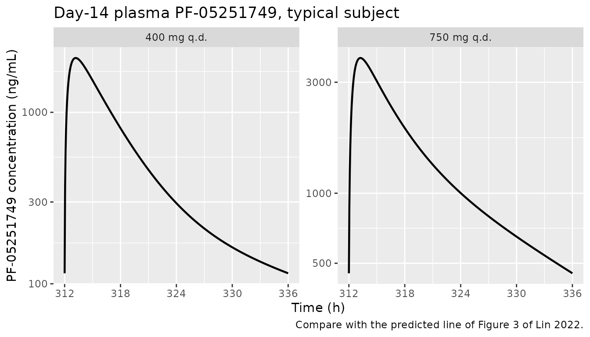
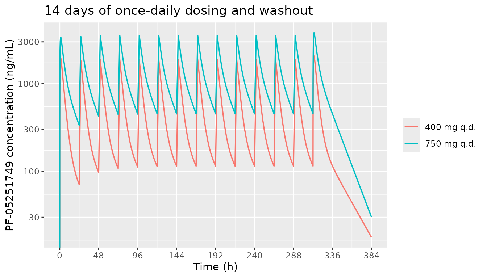

# PF-05251749 (Lin 2022)

## Model and source

- Citation: Lin J, Gaudreault F, Johnson N, Lin Z, Nouri P, Goosen TC,
  Sawant-Basak A. (2022). Investigation of CYP3A induction by
  PF-05251749 in early clinical development: comparison of linear slope
  physiologically based pharmacokinetic prediction and biomarker
  response. Clin Transl Sci 15(9):2184-2194. <doi:10.1111/cts.13352>.
- 400 mg model: Two-compartment oral pharmacokinetic reduction of the
  Simcyp minimal-PBPK-with-single-adjusting-compartment (SAC) base model
  for the casein kinase 1 delta/epsilon inhibitor PF-05251749 at 400 mg
  q.d. in healthy adults (Lin 2022). The authors built separate
  dose-specific Simcyp models at 400 and 750 mg q.d. because exposure
  was less than dose-proportional above 200 mg; this file is the 400 mg
  model and Lin_2022_PF05251749_750mg is its sibling. The Simcyp
  whole-body equations are not published, but the compound layer (Table
  2: ka, fa, fu, B:P, observed oral clearance CLpo, Vss, Vsac and the
  SAC inter-compartmental clearance Q) is enough to rebuild the
  disposition as first-order absorption into a systemic compartment
  exchanging with the SAC (peripheral1). Systemic clearance and
  bioavailability follow from CLpo through the well-stirred liver model;
  the systemic volume is (Vss - Vsac) x 70 kg minus a liver volume.
  Hepatic blood flow (90 L/h) and liver volume (1.648 L) are not printed
  in the paper and are standard Simcyp healthy-adult values. Nothing is
  fitted. The reduction reproduces the paper’s predicted day-14 Tmax to
  within 3% and gives AUCtau 7% and Cmax 12% below the paper’s
  geometric-mean predictions (see the validation vignette).
  Typical-value model: the source reports no variance components and no
  residual-error model, so there are no etas and propSd is zero. The
  CYP3A-induction (midazolam DDI) layer depends on the proprietary
  Simcyp midazolam compound file and enzyme-turnover defaults and is not
  encoded.
- 750 mg model: Two-compartment oral pharmacokinetic reduction of the
  Simcyp minimal-PBPK-with-single-adjusting-compartment (SAC) base model
  for the casein kinase 1 delta/epsilon inhibitor PF-05251749 at 750 mg
  q.d. in healthy adults (Lin 2022). The authors built separate
  dose-specific Simcyp models at 400 and 750 mg q.d. because exposure
  was less than dose-proportional above 200 mg; this file is the 750 mg
  model and Lin_2022_PF05251749_400mg is its sibling. The Simcyp
  whole-body equations are not published, but the compound layer (Table
  2: ka, fa, fu, B:P, observed oral clearance CLpo, Vss, Vsac and the
  SAC inter-compartmental clearance Q) is enough to rebuild the
  disposition as first-order absorption into a systemic compartment
  exchanging with the SAC (peripheral1). Systemic clearance and
  bioavailability follow from CLpo through the well-stirred liver model;
  the systemic volume is (Vss - Vsac) x 70 kg minus a liver volume.
  Hepatic blood flow (90 L/h) and liver volume (1.648 L) are not printed
  in the paper and are standard Simcyp healthy-adult values. Nothing is
  fitted. The reduction reproduces the paper’s predicted day-14 Tmax to
  within 3% and gives Cmax and AUCtau 7% below the paper’s
  geometric-mean predictions (see the validation vignette).
  Typical-value model: the source reports no variance components and no
  residual-error model, so there are no etas and propSd is zero. The
  CYP3A-induction (midazolam DDI) layer depends on the proprietary
  Simcyp midazolam compound file and enzyme-turnover defaults and is not
  encoded.
- Article: <https://doi.org/10.1111/cts.13352>
- Supplement (Tables S1-S5, Figures S1-S5):
  <https://www.ncbi.nlm.nih.gov/pmc/articles/PMC9468555/>

## What these models are, and what they are not

PF-05251749 is a dual casein kinase 1 delta/epsilon inhibitor that was
developed for disrupted circadian rhythm in Alzheimer’s and Parkinson’s
disease. It induced CYP3A in human hepatocytes in vitro. Lin 2022 asked
whether that induction matters clinically, using two lines of evidence:
the 4-beta-hydroxycholesterol/cholesterol ratio measured in the
multiple-dose study B8001002, and a Simcyp physiologically based
pharmacokinetic (PBPK) model that predicted the interaction with oral
midazolam.

The PBPK work had two steps. First, **base models** of PF-05251749 were
built in Simcyp version 18 as a minimal PBPK model with a single
adjusting compartment (SAC) and first-order absorption, one model per
dose (400 and 750 mg q.d.), because exposure was less than
dose-proportional above 200 mg q.d. The volume of the SAC and its
inter-compartmental clearance were fitted to the day-14 profile of each
dose cohort, and the observed oral clearance was entered directly.
Second, each base model was given a CYP3A **induction** term, calibrated
from the in vitro mRNA induction slope with rifampin as reference, and
used to simulate midazolam 2 mg alone and at PF-05251749 steady state.

Simcyp’s whole-body equations are not published, so the platform model
cannot be encoded as written. The PF-05251749 compound layer in Table 2
is, however, complete enough to rebuild each base model as an ordinary
two-compartment oral model with no fitted parameter. Those two
reductions are what this package ships:

- `Lin_2022_PF05251749_400mg`
- `Lin_2022_PF05251749_750mg`

**The midazolam interaction is not reproducible.** Table 4 and Figure S5
depend on the Simcyp midazolam compound file and on Simcyp’s CYP3A
enzyme-turnover defaults (hepatic and intestinal degradation rate
constants), none of which is printed. See [Assumptions and
deviations](#assumptions-and-deviations).

## Population

The clinical data come from Part A of study B8001002 (NCT02691702), a
randomized, double-blind, sequential, placebo-controlled multiple-dose
study in healthy adults aged 18-55 years (Lin 2022 Methods). Five
cohorts of 12 subjects were randomized 4:1:1 to PF-05251749, placebo, or
melatonin, with PF-05251749 given at 50, 100, 200, 400, or 750 mg q.d.
for 14 days, fasted. The 400 and 750 mg cohorts had 8 subjects on
PF-05251749 each (Table S4). Across all 61 Part A participants (Table
S3), 83.6% were male, 85.2% White and 14.8% Black, mean age 42.5 years
(SD 10.5), and mean weight 76.4 kg (SD 9.5).

The Simcyp simulations used a virtual healthy population of 10 trials of
10 subjects, aged 20-50 years, 50% female, fasted, sampled every 0.2 h
(Lin 2022 Methods).

The same information is available programmatically via
`readModelDb("Lin_2022_PF05251749_400mg")()$population`.

## Source trace

Every `ini()` value is either a Lin 2022 Table 2 input or an arithmetic
consequence of one. Two physiological constants that the reduction needs
are not printed in the paper, the hepatic blood flow and the liver
volume. Both use the standard Simcyp healthy-adult values printed in
Hanley 2024 (<doi:10.1002/psp4.13106>, Appendix S1 Equation S2): QH = 90
L/h and a liver of 1648 g. Nothing was fitted.

| Parameter / equation | 400 mg | 750 mg | Source location |
|----|----|----|----|
| `lka` | 2 1/h | 2 1/h | Table 2 `Ka`, from the sensitivity analysis in Figure S4 |
| `lcl` | 19.9989 L/h | 16.5789 L/h | Derived: fH x CLpo, where fH = QH / (QH + CLpo / B:P). Table 2 CLpo 29.3 / 22.5 L/h (= Table S5 steady-state CL/F), B:P 0.7, fa 1 |
| `lvc` | 103.352 L | 124.352 L | Derived: (Vss - Vsac) x 70 kg - 1.648 L. Table 2 Vss 3.1 L/kg, Vsac 1.6 / 1.3 L/kg |
| `lvp` | 112 L | 91 L | Derived: Vsac x 70 kg. Table 2 Vsac 1.6 / 1.3 L/kg |
| `lq` | 5.8 L/h | 11 L/h | Table 2 `Q` 5.8 / 11 L/h |
| `lfdepot` | 0.682557 | 0.736842 | Derived: fa x fG x fH = 1 x 1 x fH. Table 2 fa 1, F u,gut 1 |
| `propSd` | 0 | 0 | Not reported; PBPK simulation analysis with no residual-error model |
| `d/dt(depot)`, `d/dt(central)`, `d/dt(peripheral1)` |  |  | Table 2 “Minimal PBPK”, first-order absorption; the liver and portal vein are lumped into the systemic compartment and the SAC is `peripheral1` |
| `Cc <- 1000 * central / vc` |  |  | Doses in mg, volumes in L, concentrations in ng/mL as in Table 3 |

### Reproducing the derivations

The derived values are recomputed here from the published inputs and
checked against what the packaged models carry.

``` r

# Lin 2022 Table 2
bp <- 0.7 # blood-to-plasma ratio
fa <- 1 # fraction absorbed (assumed by the authors)
vss_per_kg <- 3.1 # L/kg, both doses
inputs <- tibble::tibble(
  model = c("Lin_2022_PF05251749_400mg", "Lin_2022_PF05251749_750mg"),
  clpo = c(29.3, 22.5), # L/h, observed CL/F
  vsac_per_kg = c(1.6, 1.3), # L/kg
  q = c(5.8, 11) # L/h
)
# Not printed in Lin 2022; standard Simcyp healthy-adult values
qh <- 90 # L/h
liver_l <- 1.648 # L
bw_ref <- 70 # kg

derived <- inputs |>
  dplyr::mutate(
    fub_clint = clpo / bp,
    fh = qh / (qh + fub_clint),
    cl = fh * clpo,
    fbio = fa * fh,
    vc = (vss_per_kg - vsac_per_kg) * bw_ref - liver_l,
    vp = vsac_per_kg * bw_ref
  )

derived |>
  dplyr::select(model, fub_clint, fh, cl, fbio, vc, vp, q) |>
  dplyr::mutate(dplyr::across(where(is.numeric), ~ signif(.x, 6))) |>
  dplyr::rename(
    Model = model,
    "fu,b x CLint (L/h)" = fub_clint,
    fH = fh,
    "CL (L/h)" = cl,
    F = fbio,
    "vc (L)" = vc,
    "vp (L)" = vp,
    "Q (L/h)" = q
  ) |>
  knitr::kable(caption = "Derived parameters recomputed from the Table 2 inputs.")
```

| Model | fu,b x CLint (L/h) | fH | CL (L/h) | F | vc (L) | vp (L) | Q (L/h) |
|:---|---:|---:|---:|---:|---:|---:|---:|
| Lin_2022_PF05251749_400mg | 41.8571 | 0.682557 | 19.9989 | 0.682557 | 103.352 | 112 | 5.8 |
| Lin_2022_PF05251749_750mg | 32.1429 | 0.736842 | 16.5789 | 0.736842 | 124.352 | 91 | 11.0 |

Derived parameters recomputed from the Table 2 inputs. {.table}

``` r

for (i in seq_len(nrow(derived))) {
  ini_df <- rxode2::rxode(readModelDb(derived$model[i]))$iniDf
  packaged <- setNames(exp(ini_df$est), ini_df$name)
  stopifnot(
    abs(packaged[["lcl"]] / derived$cl[i] - 1) < 1e-5,
    abs(packaged[["lvc"]] / derived$vc[i] - 1) < 1e-5,
    abs(packaged[["lvp"]] / derived$vp[i] - 1) < 1e-5,
    abs(packaged[["lq"]] / derived$q[i] - 1) < 1e-8,
    abs(packaged[["lfdepot"]] / derived$fbio[i] - 1) < 1e-5,
    abs(packaged[["lka"]] - 2) < 1e-8
  )
}
cat("Packaged ini() values match the derivation from the Table 2 inputs.\n")
#> Packaged ini() values match the derivation from the Table 2 inputs.
```

Because the apparent oral clearance of the reduction is `cl / F`, which
equals the Table 2 CLpo whatever hepatic blood flow is assumed, the
steady-state AUCtau of the reduction is exactly dose / CLpo.

## Virtual cohort

The models have no random effects and no covariates, so each is
deterministic: one subject per dose fully characterises it. Each subject
receives 14 once-daily oral doses, as in B8001002 Part A, and is
observed densely over day 1 (0-24 h) and day 14 (312-336 h).
Observations are placed on the `central` ODE state, and `Cc` is returned
as an algebraic observable on those rows.

``` r

dose_times <- seq(0, 13 * 24, by = 24)
obs_grid <- sort(unique(c(
  seq(0, 24, by = 0.05),
  seq(24, 312, by = 2),
  seq(312, 336, by = 0.05),
  seq(336, 384, by = 1)
)))

make_subject <- function(id, dose, label) {
  dplyr::bind_rows(
    tibble::tibble(
      id = id, time = dose_times, amt = dose, evid = 1L,
      cmt = "depot", treatment = label
    ),
    tibble::tibble(
      id = id, time = obs_grid, amt = NA_real_, evid = 0L,
      cmt = "central", treatment = label
    )
  ) |>
    dplyr::arrange(time, dplyr::desc(evid))
}

events <- list(
  "400 mg q.d." = make_subject(1L, 400, "400 mg q.d."),
  "750 mg q.d." = make_subject(2L, 750, "750 mg q.d.")
)
```

## Simulation

``` r

sim <- dplyr::bind_rows(
  as.data.frame(rxode2::rxSolve(
    readModelDb("Lin_2022_PF05251749_400mg"),
    events = events[["400 mg q.d."]], keep = "treatment"
  )) |> dplyr::mutate(id = 1L),
  as.data.frame(rxode2::rxSolve(
    readModelDb("Lin_2022_PF05251749_750mg"),
    events = events[["750 mg q.d."]], keep = "treatment"
  )) |> dplyr::mutate(id = 2L)
)
stopifnot(!anyNA(sim$Cc))
```

## Replicate published figures

``` r

# Replicates the predicted line of Figure 3 of Lin 2022 (day-14 profile of
# PF-05251749 at 400 and 750 mg q.d.). The paper's line is the arithmetic
# mean of a Simcyp virtual population and its 5th/95th percentile band comes
# from unpublished population files, so only the typical profile is shown.
sim |>
  dplyr::filter(time >= 312, time <= 336) |>
  ggplot(aes(time, Cc)) +
  geom_line(linewidth = 0.8) +
  facet_wrap(~treatment, scales = "free_y") +
  scale_y_log10() +
  scale_x_continuous(breaks = seq(312, 336, by = 6)) +
  labs(
    x = "Time (h)", y = "PF-05251749 concentration (ng/mL)",
    title = "Day-14 plasma PF-05251749, typical subject",
    caption = "Compare with the predicted line of Figure 3 of Lin 2022."
  )
```



``` r

sim |>
  dplyr::filter(time <= 384) |>
  ggplot(aes(time, Cc, colour = treatment)) +
  geom_line(linewidth = 0.6) +
  scale_y_log10() +
  scale_x_continuous(breaks = seq(0, 384, by = 48)) +
  labs(
    x = "Time (h)", y = "PF-05251749 concentration (ng/mL)",
    colour = NULL,
    title = "14 days of once-daily dosing and washout"
  )
#> Warning in scale_y_log10(): log-10 transformation introduced infinite values.
```



## PKNCA validation

``` r

conc <- sim |>
  dplyr::filter(!is.na(Cc)) |>
  dplyr::select(id, time, Cc, treatment)

dose <- dplyr::bind_rows(events) |>
  dplyr::filter(evid == 1L) |>
  dplyr::mutate(id = ifelse(treatment == "400 mg q.d.", 1L, 2L)) |>
  dplyr::select(id, time, amt, treatment)

conc_obj <- PKNCA::PKNCAconc(conc, Cc ~ time | treatment + id,
  concu = "ng/mL", timeu = "h"
)
dose_obj <- PKNCA::PKNCAdose(dose, amt ~ time | treatment + id, doseu = "mg")

# Day 1, day 14, and the 48 h after the last dose for the terminal
# half-life (B8001002 sampled to 48 h after the day-14 dose, Figure S2).
intervals <- data.frame(
  start = c(0, 312, 312),
  end = c(24, 336, 360),
  cmax = c(TRUE, TRUE, FALSE),
  tmax = c(TRUE, TRUE, FALSE),
  auclast = c(TRUE, TRUE, FALSE),
  cmin = c(FALSE, TRUE, FALSE),
  half.life = c(FALSE, FALSE, TRUE)
)

nca <- PKNCA::pk.nca(PKNCA::PKNCAdata(conc_obj, dose_obj, intervals = intervals))
nca_df <- as.data.frame(nca)

nca_df |>
  dplyr::filter(
    end - start == 24,
    PPTESTCD %in% c("cmax", "tmax", "auclast", "cmin")
  ) |>
  dplyr::mutate(PPORRES = signif(PPORRES, 4)) |>
  dplyr::select(treatment, start, end, PPTESTCD, PPORRES) |>
  tidyr::pivot_wider(names_from = PPTESTCD, values_from = PPORRES) |>
  dplyr::rename(
    Treatment = treatment, Start = start, End = end,
    "Cmax (ng/mL)" = cmax, "Tmax (h)" = tmax,
    "AUC0-24 (ng*h/mL)" = auclast, "Cmin (ng/mL)" = cmin
  ) |>
  knitr::kable(caption = "PKNCA results for day 1 (0-24 h) and day 14 (312-336 h).")
```

| Treatment   | Start | End | AUC0-24 (ng\*h/mL) | Cmax (ng/mL) | Tmax (h) | Cmin (ng/mL) |
|:------------|------:|----:|-------------------:|-------------:|---------:|-------------:|
| 400 mg q.d. |     0 |  24 |              11900 |         1966 |     1.20 |           NA |
| 400 mg q.d. |   312 | 336 |              13650 |         2074 |     1.20 |        115.2 |
| 750 mg q.d. |     0 |  24 |              27410 |         3393 |     1.25 |           NA |
| 750 mg q.d. |   312 | 336 |              33330 |         3814 |     1.25 |        452.8 |

PKNCA results for day 1 (0-24 h) and day 14 (312-336 h). {.table}

### Comparison against the published predictions

Lin 2022 Table 3 reports the day-14 Simcyp-predicted geometric-mean Cmax
and AUCtau and the median Tmax. These are the validation target: the
reduction is meant to reproduce the paper’s model, not the clinical
data.

``` r

published <- tibble::tribble(
  ~treatment, ~start, ~end, ~cmax, ~tmax, ~auclast,
  "400 mg q.d.", 312, 336, 2351, 1.17, 14672,
  "750 mg q.d.", 312, 336, 4094, 1.28, 35833
)

sim_day14 <- nca_df |>
  dplyr::filter(start == 312, end == 336, PPTESTCD %in% c("cmax", "tmax", "auclast"))

cmp <- nlmixr2lib::ncaComparisonTable(
  simulated = sim_day14,
  reference = dplyr::select(published, -start, -end),
  by = "treatment",
  units = c(cmax = "ng/mL", tmax = "h", auclast = "ng*h/mL"),
  tolerance_pct = 20
)

knitr::kable(
  cmp,
  caption = paste(
    "Day-14 typical-subject reduction vs. Lin 2022 Table 3 Simcyp predictions.",
    "* differs from the reference by >20%."
  )
)
```

| NCA parameter      | treatment   | Reference | Simulated | % diff |
|:-------------------|:------------|:----------|:----------|:-------|
| Cmax (ng/mL)       | 400 mg q.d. | 2350      | 2070      | -11.8% |
| Cmax (ng/mL)       | 750 mg q.d. | 4090      | 3810      | -6.8%  |
| Tmax (h)           | 400 mg q.d. | 1.17      | 1.2       | +2.6%  |
| Tmax (h)           | 750 mg q.d. | 1.28      | 1.25      | -2.3%  |
| AUClast (ng\*h/mL) | 400 mg q.d. | 14700     | 13700     | -7.0%  |
| AUClast (ng\*h/mL) | 750 mg q.d. | 35800     | 33300     | -7.0%  |

Day-14 typical-subject reduction vs. Lin 2022 Table 3 Simcyp
predictions. \* differs from the reference by \>20%. {.table}

``` r

sim_wide <- sim_day14 |>
  dplyr::select(treatment, PPTESTCD, PPORRES) |>
  tidyr::pivot_wider(names_from = PPTESTCD, values_from = PPORRES) |>
  dplyr::inner_join(published, by = "treatment", suffix = c("_sim", "_pub"))

ratios <- sim_wide |>
  dplyr::transmute(
    treatment,
    cmax = cmax_sim / cmax_pub,
    tmax = tmax_sim / tmax_pub,
    auc = auclast_sim / auclast_pub,
    shape = (cmax_sim / auclast_sim) / (cmax_pub / auclast_pub)
  )
knitr::kable(ratios, digits = 3, caption = "Simulated / published ratios.")
```

| treatment   |  cmax |  tmax |  auc | shape |
|:------------|------:|------:|-----:|------:|
| 400 mg q.d. | 0.882 | 1.026 | 0.93 | 0.948 |
| 750 mg q.d. | 0.932 | 0.977 | 0.93 | 1.002 |

Simulated / published ratios. {.table}

``` r


# The models are deterministic, so these bounds are not subject to
# cohort-to-cohort sampling noise.
stopifnot(
  all(abs(ratios$auc - 1) < 0.10),
  all(abs(ratios$tmax - 1) < 0.10),
  all(abs(ratios$cmax - 1) < 0.15),
  all(abs(ratios$shape - 1) < 0.06)
)
```

Tmax agrees to within 3% at both doses, and AUCtau is 7% below the
paper’s prediction at both doses. Cmax is 7% low at 750 mg and 12% low
at 400 mg.

The AUCtau offset is the same 7% at both doses, which suggests a
population effect rather than a structural one. The reduction’s AUCtau
is exactly dose / CLpo by construction (13,652 and 33,333 ng*h/mL). The
paper’s predicted geometric means sit 7.5% above those values, and they
also sit above the* observed\* geometric means (13,640 and 33,290
ng\*h/mL, Table S5) that CLpo was taken from. So the Simcyp virtual
population’s geometric-mean oral clearance came out about 7% lower than
the CLpo that was entered. A typical-value model cannot carry that. Once
the exposure offset is removed, the Cmax/AUCtau ratio, which depends on
shape alone, agrees to within 6% at 400 mg and within 0.2% at 750 mg.
The remaining 400 mg Cmax gap is mostly the assumed 70 kg reference
weight (see the sensitivity analysis below). No parameter was tuned to
close it.

### Comparison against the observed clinical data

The paper reports the observed steady-state NCA of B8001002 in Table S5.
Because CLpo is the observed CL/F, observed AUCtau is matched by
construction. The accumulation ratios and the terminal half-life are
independent checks of the fitted Vsac and Q.

``` r

rac <- nca_df |>
  dplyr::filter(end - start == 24, PPTESTCD %in% c("cmax", "auclast")) |>
  dplyr::select(treatment, start, PPTESTCD, PPORRES) |>
  tidyr::pivot_wider(names_from = c(PPTESTCD, start), values_from = PPORRES) |>
  dplyr::transmute(
    treatment,
    rac_cmax_sim = cmax_312 / cmax_0,
    rac_auc_sim = auclast_312 / auclast_0
  )

thalf <- nca_df |>
  dplyr::filter(PPTESTCD == "half.life") |>
  dplyr::select(treatment, thalf_sim = PPORRES)

observed <- tibble::tribble(
  ~treatment, ~cmax_obs, ~auc_obs, ~rac_cmax_obs, ~rac_auc_obs, ~thalf_obs,
  "400 mg q.d.", 2613, 13640, 1.0, 1.0, 9.9,
  "750 mg q.d.", 4726, 33290, 1.3, 1.2, 11.2
)

sim_wide |>
  dplyr::select(treatment, cmax_sim, auclast_sim) |>
  dplyr::left_join(rac, by = "treatment") |>
  dplyr::left_join(thalf, by = "treatment") |>
  dplyr::left_join(observed, by = "treatment") |>
  dplyr::transmute(
    Treatment = treatment,
    "Cmax sim" = round(cmax_sim), "Cmax obs" = cmax_obs,
    "AUCtau sim" = round(auclast_sim), "AUCtau obs" = auc_obs,
    "Rac,Cmax sim" = round(rac_cmax_sim, 2), "Rac,Cmax obs" = rac_cmax_obs,
    "Rac,AUC sim" = round(rac_auc_sim, 2), "Rac,AUC obs" = rac_auc_obs,
    "t1/2 sim (h)" = round(thalf_sim, 1), "t1/2 obs (h)" = thalf_obs
  ) |>
  knitr::kable(caption = paste(
    "Typical-subject reduction vs. B8001002 observed day-14 geometric means",
    "(Table S5; Rac geometric mean, t1/2 arithmetic mean)."
  ))
```

| Treatment | Cmax sim | Cmax obs | AUCtau sim | AUCtau obs | Rac,Cmax sim | Rac,Cmax obs | Rac,AUC sim | Rac,AUC obs | t1/2 sim (h) | t1/2 obs (h) |
|:---|---:|---:|---:|---:|---:|---:|---:|---:|---:|---:|
| 400 mg q.d. | 2074 | 2613 | 13651 | 13640 | 1.06 | 1.0 | 1.15 | 1.0 | 17.9 | 9.9 |
| 750 mg q.d. | 3814 | 4726 | 33331 | 33290 | 1.12 | 1.3 | 1.22 | 1.2 | 12.1 | 11.2 |

Typical-subject reduction vs. B8001002 observed day-14 geometric means
(Table S5; Rac geometric mean, t1/2 arithmetic mean). {.table}

At 750 mg the AUC accumulation ratio and the terminal half-life agree
with the observed values (1.22 against 1.2, and 12.1 h against 11.2 h),
while the Cmax accumulation ratio is lower (1.12 against 1.3). At 400 mg
the reduction accumulates slightly more than observed (Rac,AUC 1.15
against 1.0), and its terminal half-life over 0-48 h after the last dose
is longer than the observed 9.9 h, because the slower SAC exchange of
the 400 mg model (Q 5.8 L/h, against 11 L/h at 750 mg) leaves a shallow
late phase. The paper’s own predicted 400 mg line in Figure 3 shows the
same shallow decline: it falls by less than half between 12 and 24 h
after the dose, while the observed means fall by more. So this is
inherited from the fitted Vsac and Q, not introduced by the reduction.
The observed Cmax is higher than both the reduction and the paper’s own
prediction (Table 3 predicted/observed 0.90 and 0.87), and that gap also
comes from the source model.

### Sensitivity to the two unprinted constants

Hepatic blood flow and the reference body weight are not printed in Lin
2022. The table below varies each one around the values used here and
reports the day-14 Cmax relative to Table 3.

``` r

reduce_cmax <- function(dose, clpo, vsac, q, bw, qh_val) {
  fh <- qh_val / (qh_val + clpo / bp)
  m <- readModelDb(ifelse(dose == 400, "Lin_2022_PF05251749_400mg",
    "Lin_2022_PF05251749_750mg"
  ))
  m <- rxode2::ini(rxode2::rxode(m),
    lcl = log(fh * clpo), lfdepot = log(fh),
    lvc = log((vss_per_kg - vsac) * bw - liver_l), lvp = log(vsac * bw)
  )
  ev <- make_subject(1L, dose, "x") |> dplyr::filter(evid == 1L | time >= 312)
  s <- as.data.frame(rxode2::rxSolve(m, events = ev))
  max(s$Cc[s$time >= 312 & s$time <= 336])
}

sens <- tidyr::expand_grid(bw = c(65, 70, 75), qh_val = c(80, 90, 100)) |>
  dplyr::rowwise() |>
  dplyr::mutate(
    "Cmax 400 / Table 3" = reduce_cmax(400, 29.3, 1.6, 5.8, bw, qh_val) / 2351,
    "Cmax 750 / Table 3" = reduce_cmax(750, 22.5, 1.3, 11, bw, qh_val) / 4094
  ) |>
  dplyr::ungroup() |>
  dplyr::rename("Body weight (kg)" = bw, "QH (L/h)" = qh_val)
#> ℹ change initial estimate of `lcl` to `2.95676475226054`
#> ℹ change initial estimate of `lfdepot` to `-0.420822763762484`
#> ℹ change initial estimate of `lvc` to `4.56280533521032`
#> ℹ change initial estimate of `lvp` to `4.64439089914137`
#> ℹ change initial estimate of `lcl` to `2.99567810090575`
#> ℹ change initial estimate of `lfdepot` to `-0.381909415117274`
#> ℹ change initial estimate of `lvc` to `4.56280533521032`
#> ℹ change initial estimate of `lvp` to `4.64439089914137`
#> ℹ change initial estimate of `lcl` to `3.02793718702125`
#> ℹ change initial estimate of `lfdepot` to `-0.349650329001768`
#> ℹ change initial estimate of `lvc` to `4.56280533521032`
#> ℹ change initial estimate of `lvp` to `4.64439089914137`
#> ℹ change initial estimate of `lcl` to `2.95676475226054`
#> ℹ change initial estimate of `lfdepot` to `-0.420822763762484`
#> ℹ change initial estimate of `lvc` to `4.638140637658`
#> ℹ change initial estimate of `lvp` to `4.71849887129509`
#> ℹ change initial estimate of `lcl` to `2.99567810090575`
#> ℹ change initial estimate of `lfdepot` to `-0.381909415117274`
#> ℹ change initial estimate of `lvc` to `4.638140637658`
#> ℹ change initial estimate of `lvp` to `4.71849887129509`
#> ℹ change initial estimate of `lcl` to `3.02793718702125`
#> ℹ change initial estimate of `lfdepot` to `-0.349650329001768`
#> ℹ change initial estimate of `lvc` to `4.638140637658`
#> ℹ change initial estimate of `lvp` to `4.71849887129509`
#> ℹ change initial estimate of `lcl` to `2.95676475226054`
#> ℹ change initial estimate of `lfdepot` to `-0.420822763762484`
#> ℹ change initial estimate of `lvc` to `4.7081959782992`
#> ℹ change initial estimate of `lvp` to `4.78749174278205`
#> ℹ change initial estimate of `lcl` to `2.99567810090575`
#> ℹ change initial estimate of `lfdepot` to `-0.381909415117274`
#> ℹ change initial estimate of `lvc` to `4.7081959782992`
#> ℹ change initial estimate of `lvp` to `4.78749174278205`
#> ℹ change initial estimate of `lcl` to `3.02793718702125`
#> ℹ change initial estimate of `lfdepot` to `-0.349650329001768`
#> ℹ change initial estimate of `lvc` to `4.7081959782992`
#> ℹ change initial estimate of `lvp` to `4.78749174278205`
#> ℹ change initial estimate of `lcl` to `2.77576837515716`
#> ℹ change initial estimate of `lfdepot` to `-0.337746934053213`
#> ℹ change initial estimate of `lvc` to `4.74798832300435`
#> ℹ change initial estimate of `lvp` to `4.43675153436313`
#> ℹ change initial estimate of `lcl` to `2.80813365965919`
#> ℹ change initial estimate of `lfdepot` to `-0.305381649551182`
#> ℹ change initial estimate of `lvc` to `4.74798832300435`
#> ℹ change initial estimate of `lvp` to `4.43675153436313`
#> ℹ change initial estimate of `lcl` to `2.83480190674135`
#> ℹ change initial estimate of `lfdepot` to `-0.27871340246902`
#> ℹ change initial estimate of `lvc` to `4.74798832300435`
#> ℹ change initial estimate of `lvp` to `4.43675153436313`
#> ℹ change initial estimate of `lcl` to `2.77576837515716`
#> ℹ change initial estimate of `lfdepot` to `-0.337746934053213`
#> ℹ change initial estimate of `lvc` to `4.82311625375497`
#> ℹ change initial estimate of `lvp` to `4.51085950651685`
#> ℹ change initial estimate of `lcl` to `2.80813365965919`
#> ℹ change initial estimate of `lfdepot` to `-0.305381649551182`
#> ℹ change initial estimate of `lvc` to `4.82311625375497`
#> ℹ change initial estimate of `lvp` to `4.51085950651685`
#> ℹ change initial estimate of `lcl` to `2.83480190674135`
#> ℹ change initial estimate of `lfdepot` to `-0.27871340246902`
#> ℹ change initial estimate of `lvc` to `4.82311625375497`
#> ℹ change initial estimate of `lvp` to `4.51085950651685`
#> ℹ change initial estimate of `lcl` to `2.77576837515716`
#> ℹ change initial estimate of `lfdepot` to `-0.337746934053213`
#> ℹ change initial estimate of `lvc` to `4.89299224864079`
#> ℹ change initial estimate of `lvp` to `4.5798523780038`
#> ℹ change initial estimate of `lcl` to `2.80813365965919`
#> ℹ change initial estimate of `lfdepot` to `-0.305381649551182`
#> ℹ change initial estimate of `lvc` to `4.89299224864079`
#> ℹ change initial estimate of `lvp` to `4.5798523780038`
#> ℹ change initial estimate of `lcl` to `2.83480190674135`
#> ℹ change initial estimate of `lfdepot` to `-0.27871340246902`
#> ℹ change initial estimate of `lvc` to `4.89299224864079`
#> ℹ change initial estimate of `lvp` to `4.5798523780038`
knitr::kable(sens, digits = 3, caption = "Day-14 Cmax ratio vs. reference weight and hepatic blood flow.")
```

| Body weight (kg) | QH (L/h) | Cmax 400 / Table 3 | Cmax 750 / Table 3 |
|-----------------:|---------:|-------------------:|-------------------:|
|               65 |       80 |              0.905 |              0.956 |
|               65 |       90 |              0.932 |              0.977 |
|               65 |      100 |              0.955 |              0.996 |
|               70 |       80 |              0.857 |              0.912 |
|               70 |       90 |              0.882 |              0.932 |
|               70 |      100 |              0.904 |              0.949 |
|               75 |       80 |              0.815 |              0.873 |
|               75 |       90 |              0.839 |              0.891 |
|               75 |      100 |              0.859 |              0.907 |

Day-14 Cmax ratio vs. reference weight and hepatic blood flow. {.table}

Hepatic blood flow matters little: a 10 L/h change in QH moves Cmax by
about 3%, and it cannot change AUCtau, because QH changes F and the
systemic clearance together. Body weight matters more, because the
volumes are given per kg. The 70 kg reference is a convention, not a
fitted value, and it was not chosen to match Table 3.

## The induction layer and the midazolam interaction

The induction model used the linear-fit in vitro CYP3A mRNA induction
slope (Equation 2 of Lin 2022, fold induction = 1 + slope x C). Slopes
were estimated in three hepatocyte donor lots (Table S2: 0.124, 0.385
and 0.036 per uM). Each was calibrated against rifampin, by multiplying
it by the ratio of rifampin’s in vivo slope (21.9 per uM) to its in
vitro slope in the same lot. The most potent calibrated slope, 0.18 per
uM from lot HC7-4 (Table S1), was used in Simcyp. With it, Table 4
predicts midazolam Cmax and AUCinf geometric-mean ratios of 0.86 and
0.83 at 400 mg q.d., and 0.71 and 0.66 at 750 mg q.d.

``` r

tibble::tibble(
  Lot = c("HH1025", "HC7-4", "FOS"),
  in_vitro = c(0.124, 0.385, 0.0361),
  rif_in_vitro = c(24.45, 46.5, 52.3),
  printed = c(0.11, 0.18, 0.015)
) |>
  dplyr::mutate(recomputed = in_vitro * 21.9 / rif_in_vitro) |>
  dplyr::rename(
    "PF-05251749 in vitro slope (/uM)" = in_vitro,
    "Rifampin in vitro slope (/uM)" = rif_in_vitro,
    "Calibrated slope, Table S1 (/uM)" = printed,
    "Calibrated slope, recomputed (/uM)" = recomputed
  ) |>
  knitr::kable(digits = 3, caption = "Rifampin calibration of the induction slopes (Table S1).")
```

| Lot | PF-05251749 in vitro slope (/uM) | Rifampin in vitro slope (/uM) | Calibrated slope, Table S1 (/uM) | Calibrated slope, recomputed (/uM) |
|:---|---:|---:|---:|---:|
| HH1025 | 0.124 | 24.45 | 0.110 | 0.111 |
| HC7-4 | 0.385 | 46.50 | 0.180 | 0.181 |
| FOS | 0.036 | 52.30 | 0.015 | 0.015 |

Rifampin calibration of the induction slopes (Table S1). {.table}

This layer is not encoded. In Simcyp the calibrated slope drives a CYP3A
enzyme-turnover equation through the unbound concentration in the liver
and the gut wall. The enzyme degradation rate constants that set its
time course, and the gut-wall concentration, are Simcyp defaults that
Lin 2022 does not print. The victim drug, midazolam, is a Simcyp library
compound with no parameter given in the paper. Neither the enzyme time
course nor the midazolam exposure can therefore be rebuilt from the
paper. The 4-beta-hydroxycholesterol/cholesterol ratios in Table 1 are
least-squares-mean fold changes from a statistical comparison, not a
model, and the authors did not undertake an exposure-response analysis
of them.

## Assumptions and deviations

- **The Simcyp platform model is not encoded.** Each file is a
  two-compartment *reduction* of the minimal PBPK model with an SAC. The
  liver and portal vein are lumped into the systemic compartment, and
  hepatic first-pass extraction is folded into the bioavailability
  through the well-stirred model. The reductions are validated by
  reproducing the paper’s predictions, not its internal structure.
- **Hepatic blood flow (90 L/h) and liver volume (1.648 L) are not
  printed** in Lin 2022. Both are the standard Simcyp healthy-adult
  values printed in Hanley 2024 Appendix S1. A 10 L/h change in QH moves
  Cmax by about 3% (see the sensitivity table), and the liver volume
  changes the systemic volume by about 1.5%.
- **fG = 1.** Table 2 gives F u,gut = 1 and an in vivo clearance with no
  enzyme pathways, so no gut-wall extraction is applied. fa = 1 is the
  authors’ assumption (Table 2).
- **The V_sys convention is imported, not sourced.** The systemic volume
  is taken as (Vss - Vsac) x body weight - liver volume, the convention
  used for other Simcyp minimal-PBPK reductions in this package
  (`Hanley_2024_brigatinib`). The reduction’s own steady-state volume is
  close to, but not identical to, the Table 2 Vss.
- **A 70 kg reference weight** is used for the L/kg volumes. The paper
  does not state the weight of its virtual population. The B8001002 mean
  weight was 76.4 kg (Table S3), which would lower Cmax by about 6%.
- **Two files, as the authors built two models.** The 400 and 750 mg
  base models share Vss and ka but have separate CLpo, Vsac and Q (Table
  2), because PF-05251749 PK was less than dose-proportional above 200
  mg q.d. Neither model should be used to interpolate to other doses.
  The Simcyp models were qualified at steady state only.
- **No inter-individual variability and no residual error.** The %CV
  values in Table 3 are the spread of the Simcyp virtual population.
  There are no etas, and `propSd` is zero.
- **The predicted geometric means sit 7% above dose / CLpo.** The
  paper’s virtual population had a geometric-mean clearance about 7%
  below the entered CLpo. The typical-value reduction uses CLpo itself.
- **Table 2 permeability.** Table 2 labels the permeability input as
  MDCK P app 30.4 x 10^-6 cm/s, while the Methods text gives the RRCK
  permeability as 31.6 x 10^-6 cm/s. Absorption here is driven by the
  first-order `ka` alone, so the discrepancy does not affect either
  model.
- **The CYP3A induction and midazolam DDI layer are not encoded**, for
  the reasons given above.
