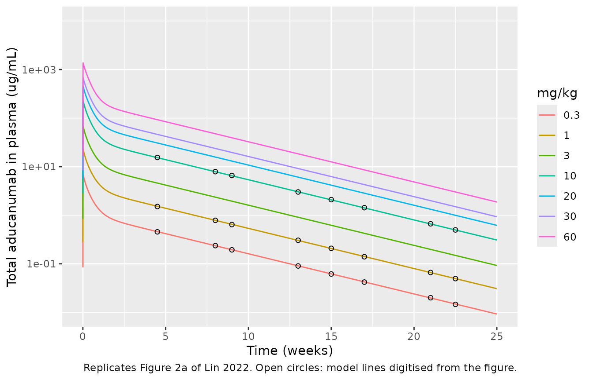
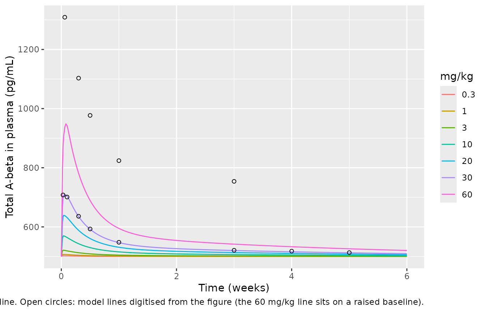
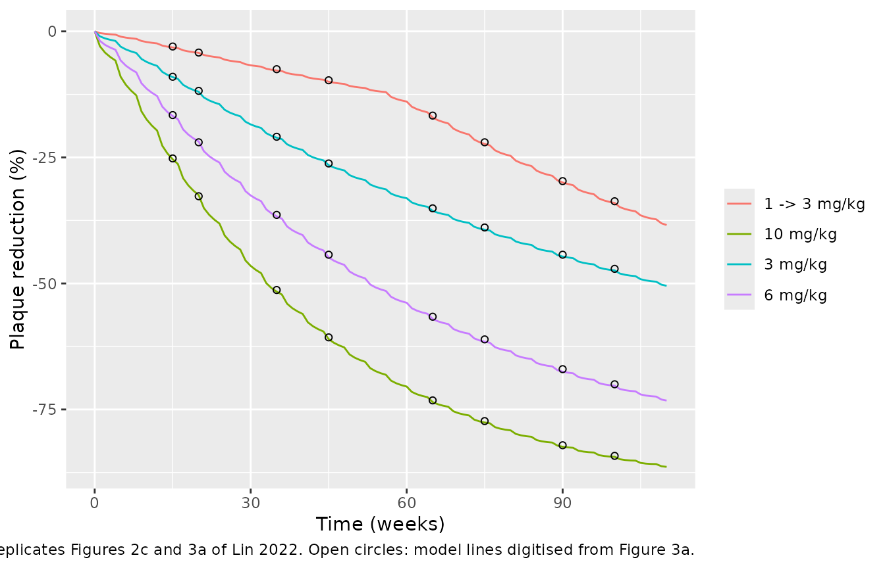
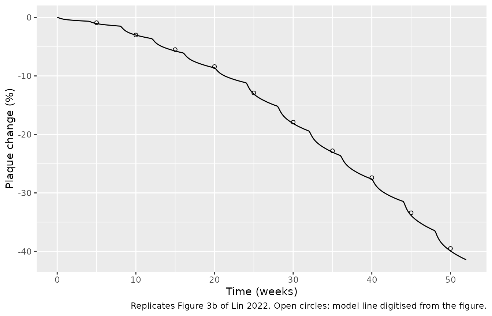
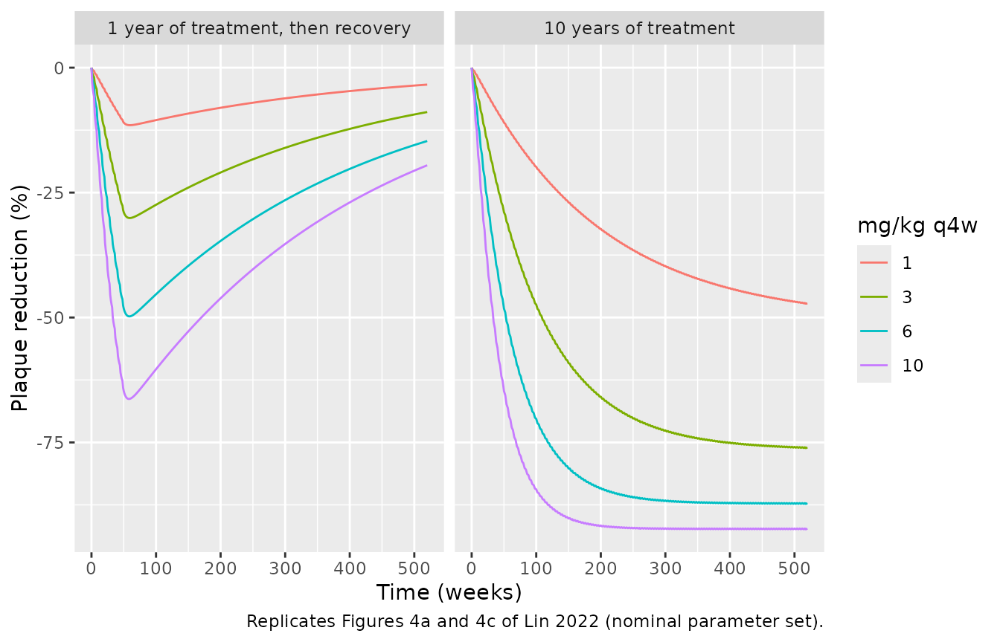
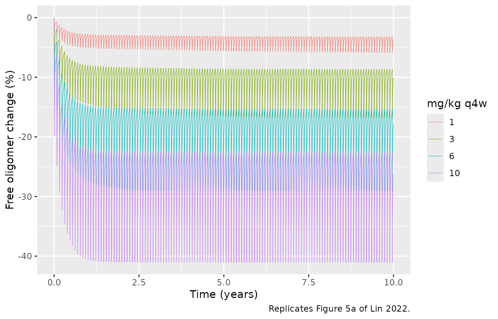
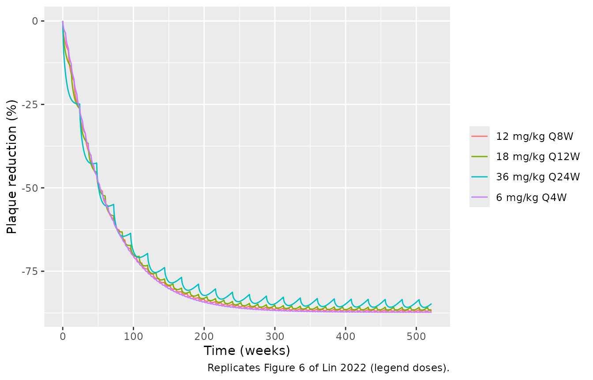
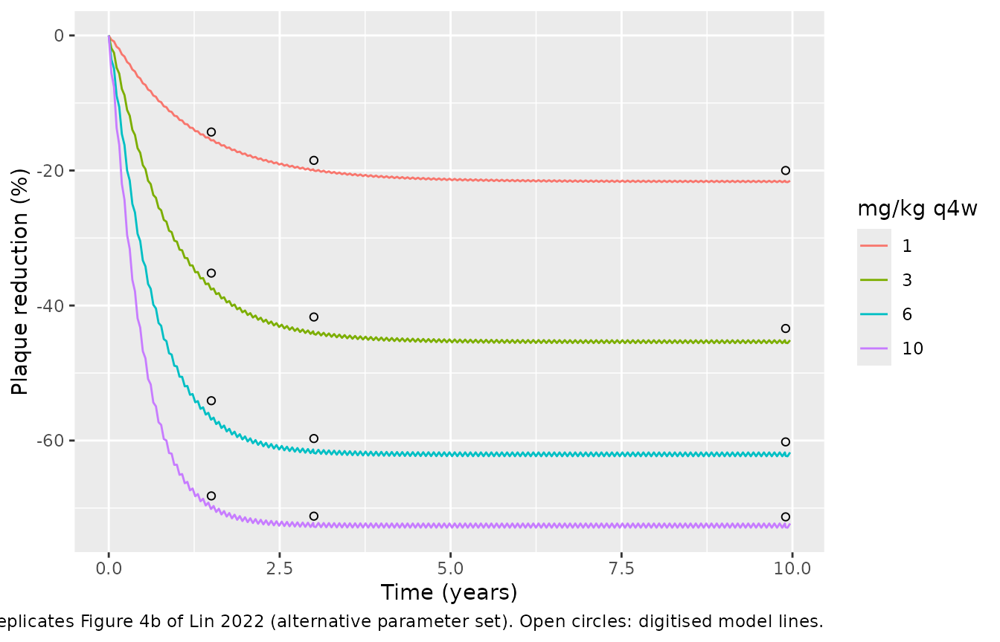

# Aducanumab amyloid-beta QSP (Lin 2022)

## Model and source

Lin and colleagues (Biogen and Applied BioMath) built a quantitative
systems pharmacology (QSP) model of the amyloid-beta (A-beta) pathway in
Alzheimer’s disease and of the mechanism of action of aducanumab, a
human IgG1 antibody that binds aggregated A-beta. The model was
calibrated to literature A-beta biology, single-ascending-dose (SAD) PK
and plasma A-beta, and one year of amyloid-PET SUVR from the phase Ib
PRIME study, then validated against multiple-dose PK, two-year SUVR and
a dose-titration cohort.

``` r

mod <- readModelDb("Lin_2022_aducanumab_qsp")
ui <- rxode2::rxode(mod)
```

- Citation: Lin L, Hua F, Salinas C, Young C, Bussiere T, Apgar JF,
  Burke JM, Kandadi Muralidharan K, Rajagovindan R, Nestorov I.
  Quantitative systems pharmacology model for Alzheimer’s disease to
  predict the effect of aducanumab on brain amyloid. CPT Pharmacometrics
  Syst Pharmacol. 2022;11(3):362-372. <doi:10.1002/psp4.12759>. Reaction
  network, compartment volumes and parameter values from Supplementary
  Model Code (S2, KroneckerBio model file); parameter provenance and
  units from Table S2; pretreatment steady state from the
  Supplementary_Initial_Condition sheet (S3); equations from S4.
- Article: <https://doi.org/10.1002/psp4.12759>
- Supplementary material (Tables S1-S3, model code, initial conditions,
  equations):
  <https://www.ebi.ac.uk/europepmc/webservices/rest/PMC8923729/supplementaryFiles>

QSP. Amyloid-beta (A-beta) pathway and aducanumab mechanism-of-action
model in early Alzheimer’s disease. Thirty-six mass-action ODE states in
three physiologic compartments (plasma 3 L, CSF 0.139 L, brain
interstitial fluid 0.261 L) plus a peripheral aducanumab compartment:
APP synthesis and sequential beta-secretase (BACE) and gamma-secretase
cleavage to A-beta monomer in plasma and brain ISF, shedding of soluble
BACE, monomer-oligomer exchange in every compartment, oligomer-plaque
exchange in brain ISF, inter-compartment transport of monomer, oligomer,
soluble BACE, drug and soluble drug-A-beta complexes, two-compartment
aducanumab disposition, drug binding to monomer, oligomer and plaque,
and FcR-mediated antibody-dependent cellular phagocytosis (ADCP) that
clears drug-oligomer and drug-plaque complexes in brain ISF. States are
amounts in nmol; second-order rates divide by the volume of the
compartment in which the reaction occurs. The primary PD output is the
percent change in total brain plaque, which the paper equates with the
percent change in amyloid-PET composite SUVR above a cutoff of 1.0.
Deterministic: no between-subject variability or residual error is
reported. Nominal (final) parameter set; the paper’s alternative
faster-plaque-turnover set (Table S3) is reproduced in the vignette. The
system is stiff and badly scaled (states span 1e-3 to 1.5e5 nmol): solve
with tight tolerances, e.g. rxSolve(…, atol = 1e-14, rtol = 1e-10,
maxsteps = 5e6); rxode2’s defaults fail.

The model is built as mass-action reactions between amounts (nmol). A
zero-order synthesis is an amount rate, a first-order reaction acts on
an amount, and a bimolecular reaction in a compartment of volume `V`
runs at `k * x1 * x2 / V`. This is the convention of the KroneckerBio
model file the authors deposited, and it can be checked directly against
the published initial conditions: for example the APP-BACE complex in
plasma sits at `konPP * APP * BACE / V / (koffBACE + kcatBACE)` =
`1e-3 * 28.936 * 88.529 / 3 / 120` = 0.0071157 nmol, which is the
published value to five digits.

**Solver settings.** Gamma-secretase sits at 150,000 nmol while the
enzyme-substrate complexes are near 0.001 nmol, and several binding
reactions equilibrate in milliseconds (the plasma oligomer dissociates
at 1.4e5 /s). The solve is therefore stiff and badly scaled. rxode2’s
default tolerances fail, and so do some intermediate settings
(`atol = 1e-12, rtol = 1e-10` fails at 0.3 mg/kg). The maintainers
tested every simulation in this article at several tolerance pairs.
`atol = 1e-14, rtol = 1e-10`, `atol = 1e-13, rtol = 1e-10` and
`atol = 1e-14, rtol = 1e-12` each solved all of them, and gave the same
results. The last of these emits step-size warnings on multi-decade
horizons. The helper below uses the first pair and falls back to the
other two. Use tolerances at least this tight for any simulation with
this model.

``` r

solve <- function(model, events, ...) {
  tols <- list(c(1e-14, 1e-10), c(1e-13, 1e-10), c(1e-14, 1e-12))
  for (i in seq_along(tols)) {
    out <- tryCatch(
      rxode2::rxSolve(
        model, events, ...,
        atol = tols[[i]][1], rtol = tols[[i]][2], maxsteps = 5e6,
        returnType = "data.frame"
      ),
      error = function(e) if (i == length(tols)) stop(e) else NULL
    )
    if (!is.null(out)) {
      return(out)
    }
  }
}
```

## Population

The model represents a typical patient with early Alzheimer’s disease
rather than a fitted population. It was calibrated to group means (Table
S1): baseline concentrations of A-beta monomer, oligomer and plaque in
plasma, CSF and brain interstitial fluid (ISF) from the literature; SILK
A-beta kinetics in CSF; serum aducanumab PK and plasma A-beta from the
SAD study (0.3-60 mg/kg, mild to moderate AD); CSF aducanumab
concentrations; and 1-year SUVR from the placebo-controlled period of
PRIME (1-10 mg/kg every 4 weeks, prodromal or mild AD). The paper
reports no subject counts or demographics. Doses are converted from
mg/kg at a body weight of 70 kg, which the maintainers inferred from
Figure 2a (below).

``` r

str(ui$population, give.attr = FALSE)
#> List of 7
#>  $ species      : chr "human"
#>  $ n_subjects   : int NA
#>  $ n_studies    : int 3
#>  $ disease_state: chr "Mild-to-moderate Alzheimer's disease (single-ascending-dose study) and prodromal or mild Alzheimer's disease wi"| __truncated__
#>  $ dose_range   : chr "Calibration: 0.3-60 mg/kg single i.v. dose (SAD) and 1-10 mg/kg i.v. q4w for 1 year (MAD placebo-controlled per"| __truncated__
#>  $ regions      : chr "Not reported (Biogen clinical program)"
#>  $ notes        : chr "QSP calibrated to group-mean data, not a population fit. Table S1 lists the calibration and validation data: li"| __truncated__
```

## Source trace

Every `ini()` value in the model file carries a comment naming its
source. The values are those of the deposited model code (Supplementary
Model Code, `% Parameters`), which prints four or five significant
figures; Table S2 prints three and gives the provenance (“Fitted”, a
literature reference, or “assumed”). The rows where the two sources
disagree, and how each was settled, are listed under *Parameter
conflicts* below.

| Element | Value used | Source |
|----|----|----|
| Plasma, CSF, brain ISF volumes | 3, 0.139, 0.261 L | Model code, `% Compartments` |
| Reaction network (36 states, 65 reactions) | – | Model code, `% Reactions`; Equations in S4 |
| APP synthesis (plasma, ISF), degradation | 1.44405e-3, 2.5127e-4 nmol/s; 4.8135e-5 /s | Model code / Table S2; plasma rate from the S3 steady state |
| BACE synthesis (plasma, ISF), degradation, shedding | 1.08306e-3, 1.0365e-4 nmol/s; 1.2034e-5, 2.0e-7 /s | Model code / Table S2; plasma rate from the S3 steady state |
| Soluble BACE clearance | 6.4180e-5 /s | Model code / Table S2 |
| Gamma-secretase synthesis (plasma, ISF), clearance | 28.8811, 2.5127 nmol/s; 1.9254e-4 /s | Model code / Table S2 |
| `konPP`, `konPD`, `konPF` | 1e-3 /nM/s | Model code / Table S2 |
| `koffBACE`, `kcatBACE`, `koffGamma`, `kcatGamma` | 119.9928, 0.0072, 215.9983, 0.0017 /s | Model code / Table S2 |
| A-beta clearance: monomer, oligomer (plasma); monomer, oligomer, plaque (ISF) | 9.627e-5, 9.627e-5, 1.9254e-5, 2.204e-8, 4.408e-9 /s | Model code / Table S2 |
| `kM2G`; `kG2M` plasma, CSF, ISF | 1.4e-5; 1.4e5, 0.0028, 1.4e-8 /s | Model code (ISF value, see below) |
| `kG2P`, `kP2G_bisf` | 7e-8, 7e-11 /s | Model code / Table S2 |
| Transport plasma to/from CSF (all species) | 1.7222e-9 / 4.1667e-5 /s | Model code / Table S2 |
| Transport plasma to/from ISF: monomer, oligomer, sBACE, drug, drug-oligomer | 1.4811e-4/1.4811e-5, 1.4811e-6/1.4811e-8, 2.0056e-8/8.0226e-5, 1.6045e-6/0.0032, 1.6045e-6/1.4811e-8 /s | Model code / Table S2 |
| Transport ISF to CSF: monomer, oligomer, sBACE, drug, drug-oligomer | 1.5509e-5, 2.3264e-8, 1.5509e-5, 1.5509e-5, 2.3264e-8 /s | Model code / Table S2 |
| Aducanumab elimination, `k12mAb`, `k21mAb` | 1.4586e-6, 2.5e-6, 1e-6 /s | Model code / Table S2 |
| `koffma0` (monomer) | 10 /s | Model code (see below) |
| `koffma1` (oligomer), `koffma2` (plaque) | 0.02 /s | Table S2 and text (see below) |
| FcR synthesis, degradation; `koffPF`; `kcatADCP` | 5.0253e-5 nmol/s, 1.9254e-4 /s; 10 /s; 0.0036 /s | Model code / Table S2 |
| Infusion | dose over 2 h into plasma | Table S2 (`kinfusion`); S4 |
| Initial conditions (pretreatment steady state) | 23 non-zero states | S3, `Supplementary_Initial_Condition` |
| % plaque reduction | 100 (P(t) - P(0)) / P(0) | Methods, ‘SUVR data processing’ |
| Aducanumab molar mass | 150,000 g/mol | Not printed; back-solved from Figure 3a (below) |
| A-beta molar mass | 4,330 g/mol | Not printed; back-solved from Figure 2b (below) |

### Parameter conflicts between the model code and Table S2

The deposited model code and Table S2 disagree on five values. Each was
settled against a published output of the model rather than by
preference for one document:

| Parameter | Model code | Table S2 | Used | Deciding evidence |
|----|----|----|----|----|
| `ksynthAPP_plasma` | 0.0014 | 1.40e-3 | 1.44405e-3 nmol/s | S3 steady state |
| `ksynthBACE_plasma` | 0.0011 | 1.10e-3 | 1.08306e-3 nmol/s | S3 steady state |
| `kG2M_bisf` | 1.4000e-08 | 1.48e-08 | 1.40e-8 /s | S3 steady state |
| `koffma0` | 10 | 1.00 | 10 /s | Figure 2b |
| `koffma1`, `koffma2` | 0.0180 | 2.00e-2 | 0.02 /s | Figures 2c and 3a; text “20 nM” |

- **The two synthesis rates.** The model code prints every value at or
  above 0.001 with four decimals, so `0.0014` and `0.0011` carry only
  two significant figures. Table S2 appears to transcribe that display.
  At steady state, APP synthesis must equal
  `kclearAPP * APP + kcatBACE * APP_BACE` and BACE synthesis must equal
  `(kclearBACE + kcleave) * BACE`. The published S3 state therefore
  fixes them at 1.44405e-3 and 1.08306e-3 nmol/s. With these two values
  the S3 state is a steady state of the model (checked below); with the
  printed `0.0014` every A-beta species drifts by about 1.2%, and plasma
  A-beta settles at 493 rather than the 500 pg/mL baseline drawn in
  Figure 2b.
- **`kG2M_bisf`.** With the code value 1.40e-8, every A-beta species in
  the S3 state is uniformly consistent. With the Table S2 value 1.48e-8
  the ISF oligomer and plaque states drift away from the rest.
- **`koffma0`.** Monomer binding is what raises total plasma A-beta
  after a 60 mg/kg dose (Figure 2b). With the code value 10 /s the model
  reproduces the published curve; with 1 /s the simulated peak is about
  4,600 pg/mL against a published peak of about 1,300.
- **`koffma1`, `koffma2`.** The text states that the drug-plaque
  affinity “was estimated to be 20 nM” (0.02 / 1e-3), matching Table S2.
  The code prints 0.0180. The 1-year and 2-year plaque curves of Figures
  2c and 3a are reproduced with 0.02 (root-mean-square error 0.3
  percentage points against the digitised curves), and are
  systematically overpredicted with 0.018 (error 2.8 points). Table S2
  assumes the oligomer affinity equals the plaque affinity, so both are
  set to 0.02.

## Pretreatment steady state

The model starts from the published pretreatment steady state (S3). The
paper states that plaque had reached steady state before treatment
(Results, ‘Model calibration’), so the untreated model should not move.
The check below runs it for 1000 years. States that S3 prints with only
three significant figures near 1e-11 nmol are excluded from the relative
comparison.

``` r

ss <- solve(ui, rxode2::et(c(0, 1000 * 365.25)))
states <- ui$state
start <- unlist(ss[1, states])
end <- unlist(ss[2, states])
big <- abs(start) > 1e-6
drift <- abs(end[big] - start[big]) / abs(start[big])
signif(max(drift), 3)
#> [1] 9.86e-05
stopifnot(max(drift) < 2e-4)

baseline <- tibble::tribble(
  ~species, ~state, ~volume, ~paper_nM,
  "A-beta monomer, plasma", "abeta_plasma", 3, 0.1,
  "A-beta monomer, CSF", "abeta_csf", 0.139, 3,
  "A-beta oligomer, brain ISF", "aolig_bisf", 0.261, 370,
  "A-beta plaque, brain ISF", "aplaq_bisf", 0.261, 5500
) |>
  mutate(model_nM = start[state] / volume)
baseline |>
  dplyr::rename(
    "Species" = species, "State" = state, "Volume (L)" = volume,
    "Paper (approx., nM)" = paper_nM, "Model (nM)" = model_nM
  ) |>
  knitr::kable(digits = 3, caption = "Baseline concentrations stated in the Results, 'Model calibration'.")
```

| Species | State | Volume (L) | Paper (approx., nM) | Model (nM) |
|:---|:---|---:|---:|---:|
| A-beta monomer, plasma | abeta_plasma | 3.000 | 0.1 | 0.115 |
| A-beta monomer, CSF | abeta_csf | 0.139 | 3.0 | 2.995 |
| A-beta oligomer, brain ISF | aolig_bisf | 0.261 | 370.0 | 368.306 |
| A-beta plaque, brain ISF | aplaq_bisf | 0.261 | 5500.0 | 5756.847 |

Baseline concentrations stated in the Results, ‘Model calibration’.
{.table}

``` r

stopifnot(all(abs(baseline$model_nM / baseline$paper_nM - 1) < 0.2))
```

## Aducanumab PK (Figure 2a)

Figure 2a shows total plasma aducanumab after single 2-hour infusions of
0.3-60 mg/kg. The paper does not state the body weight used to convert
mg/kg to an amount. The maintainers digitised the model lines of Figure
2a at times free of data symbols. In ug/mL the plotted concentration
depends on body weight and not on the molar mass (which cancels between
dose and output). A 70 kg patient reproduces the lines to within about
1%.

``` r

fig2a <- tibble::tribble(
  ~mgkg, ~week, ~Cc_fig,
  0.3, 4.5, 0.4549, 0.3, 8, 0.2364, 0.3, 9, 0.1936, 0.3, 13, 0.0902,
  0.3, 15, 0.0616, 0.3, 17, 0.0420, 0.3, 21, 0.0200, 0.3, 22.5, 0.0146,
  1, 4.5, 1.5099, 1, 8, 0.7848, 1, 9, 0.6425, 1, 13, 0.3049,
  1, 15, 0.2082, 1, 17, 0.1396, 1, 21, 0.0662, 1, 22.5, 0.0495,
  10, 4.5, 15.4694, 10, 8, 7.8953, 10, 9, 6.5830, 10, 13, 3.0126,
  10, 15, 2.0944, 10, 17, 1.4298, 10, 21, 0.6663, 10, 22.5, 0.4982
)
```

``` r

wt <- 70
sad_doses <- c(0.3, 1, 3, 10, 20, 30, 60)
sad_times <- sort(unique(c(0, 10^seq(-3, log10(25 * 7), length.out = 150), fig2a$week * 7)))
sad <- bind_rows(lapply(sad_doses, function(d) {
  ev <- rxode2::et(amt = d * wt, dur = 2 / 24, cmt = "central") |>
    rxode2::et(sad_times)
  solve(ui, ev) |> mutate(mgkg = d)
}))

# The time-0 row (no drug yet) cannot be drawn on a log axis.
ggplot(sad[sad$time != 0, ], aes(time / 7, Cc, colour = factor(mgkg))) +
  geom_line() +
  geom_point(data = fig2a, aes(week, Cc_fig), inherit.aes = FALSE, shape = 1) +
  scale_y_log10() +
  coord_cartesian(ylim = c(1e-2, 1e4)) +
  labs(
    x = "Time (weeks)", y = "Total aducanumab in plasma (ug/mL)", colour = "mg/kg",
    caption = "Replicates Figure 2a of Lin 2022. Open circles: model lines digitised from the figure."
  )
```



``` r


cmp2a <- fig2a |>
  left_join(sad |> mutate(week = round(time / 7, 6)) |> select(mgkg, week, Cc), by = c("mgkg", "week")) |>
  mutate(ratio = Cc_fig / Cc)
stopifnot(nrow(cmp2a) == nrow(fig2a), !anyNA(cmp2a$Cc))
summary(cmp2a$ratio)
#>    Min. 1st Qu.  Median    Mean 3rd Qu.    Max. 
#>  0.9829  0.9922  1.0013  0.9997  1.0073  1.0121
stopifnot(abs(median(cmp2a$ratio) - 1) < 0.02, all(abs(cmp2a$ratio - 1) < 0.05))
```

### Non-compartmental analysis of the SAD simulation

The paper reports no NCA. The check below confirms two properties of the
PK layer. First, exposure is nearly dose-proportional across the
200-fold SAD range (Figure 2a’s lines are parallel). The small departure
is target-mediated: binding to plaque and ADCP in brain ISF consume a
fixed amount of drug, which is a slightly larger fraction of a small
dose. AUC per mg therefore rises monotonically with dose, by about 1.4%
from 0.3 to 60 mg/kg. Second, the drug is lost almost entirely through
first-order plasma elimination, so `AUC0-inf` is 96-98% of
`Dose / (kclearmAb * Vplasma)`.

``` r

# 750 days is about 29 terminal half-lives; a longer grid decays into solver
# noise and gives PKNCA non-positive concentrations to log.
nca_times <- sort(unique(c(0, 10^seq(-3, log10(750), length.out = 300))))
sad_nca <- bind_rows(lapply(sad_doses, function(d) {
  ev <- rxode2::et(amt = d * wt, dur = 2 / 24, cmt = "central") |>
    rxode2::et(nca_times)
  solve(ui, ev) |> mutate(treatment = paste(d, "mg/kg"), id = 1L)
})) |>
  filter(!is.na(Cc)) |>
  select(id, treatment, time, Cc)
stopifnot(all(sad_nca$Cc >= 0))

dose_df <- tibble(
  id = 1L, treatment = paste(sad_doses, "mg/kg"),
  time = 0, amt = sad_doses * wt, dur = 2 / 24
)
conc_obj <- PKNCA::PKNCAconc(sad_nca, Cc ~ time | treatment + id)
dose_obj <- PKNCA::PKNCAdose(dose_df, amt ~ time | treatment + id, duration = "dur")
intervals <- data.frame(
  start = 0, end = Inf, cmax = TRUE, tmax = TRUE,
  aucinf.obs = TRUE, half.life = TRUE
)
nca_res <- PKNCA::pk.nca(PKNCA::PKNCAdata(conc_obj, dose_obj, intervals = intervals))

nca_tab <- as.data.frame(nca_res) |>
  filter(PPTESTCD %in% c("cmax", "tmax", "aucinf.obs", "half.life")) |>
  select(treatment, PPTESTCD, PPORRES) |>
  tidyr::pivot_wider(names_from = PPTESTCD, values_from = PPORRES) |>
  mutate(
    dose_mg = as.numeric(sub(" mg/kg", "", treatment)) * wt,
    auc_per_mg = aucinf.obs / dose_mg,
    fraction_plasma_elim = aucinf.obs * 1.4586e-6 * 86400 * 3 / dose_mg
  ) |>
  arrange(dose_mg)
nca_tab |>
  dplyr::rename(
    "Dose" = treatment, "Cmax (ug/mL)" = cmax, "Tmax (day)" = tmax,
    "AUC0-inf (ug*day/mL)" = aucinf.obs, "t1/2 (day)" = half.life,
    "Dose (mg)" = dose_mg, "AUC0-inf / dose" = auc_per_mg,
    "AUC x kclearmAb x V / dose" = fraction_plasma_elim
  ) |>
  knitr::kable(digits = 3, caption = "PKNCA on the simulated SAD profiles (70 kg).")
```

| Dose | Cmax (ug/mL) | Tmax (day) | t1/2 (day) | AUC0-inf (ug\*day/mL) | Dose (mg) | AUC0-inf / dose | AUC x kclearmAb x V / dose |
|:---|---:|---:|---:|---:|---:|---:|---:|
| 0.3 mg/kg | 6.860 | 0.084 | 25.383 | 53.603 | 21 | 2.553 | 0.965 |
| 1 mg/kg | 22.866 | 0.084 | 25.384 | 178.730 | 70 | 2.553 | 0.965 |
| 3 mg/kg | 68.598 | 0.084 | 25.386 | 536.641 | 210 | 2.555 | 0.966 |
| 10 mg/kg | 228.659 | 0.084 | 25.393 | 1793.529 | 700 | 2.562 | 0.969 |
| 20 mg/kg | 457.318 | 0.084 | 25.401 | 3598.151 | 1400 | 2.570 | 0.972 |
| 30 mg/kg | 685.979 | 0.084 | 25.407 | 5410.641 | 2100 | 2.576 | 0.974 |
| 60 mg/kg | 1371.964 | 0.084 | 25.411 | 10877.773 | 4200 | 2.590 | 0.979 |

PKNCA on the simulated SAD profiles (70 kg). {.table}

``` r


stopifnot(
  nrow(nca_tab) == length(sad_doses),
  # near dose proportionality over 0.3-60 mg/kg ...
  diff(range(nca_tab$auc_per_mg)) / mean(nca_tab$auc_per_mg) < 0.02,
  # ... with the target-mediated sink shrinking as dose rises
  all(diff(nca_tab$auc_per_mg) > 0),
  # nearly all of the dose is eliminated from plasma at kclearmAb
  all(nca_tab$fraction_plasma_elim > 0.95 & nca_tab$fraction_plasma_elim <= 1)
)
```

### Brain penetration (Figure S2)

The model was calibrated to a CSF-to-plasma aducanumab concentration
ratio of about 0.5% at steady state (Results; Figure S2).

``` r

ev <- rxode2::et(amt = 10 * wt, dur = 2 / 24, cmt = "central", ii = 28, addl = 12) |>
  rxode2::et(seq(0, 364, by = 1))
csf <- solve(ui, ev) |> mutate(ratio_pct = 100 * Ccsf / Cc)
trough_ratio <- csf$ratio_pct[csf$time == 363]
trough_ratio
#> [1] 0.5017325
stopifnot(length(trough_ratio) == 1, abs(trough_ratio - 0.5) < 0.05)
```

## Plasma A-beta (Figure 2b)

Total plasma A-beta (free plus drug-bound monomer and oligomer) rises
after dosing because the drug-A-beta complex is cleared about 66-fold
more slowly than free monomer. Figure 2b reports concentrations in
pg/mL; the S3 plasma A-beta state (0.1155 nM) is drawn at 500 pg/mL,
which corresponds to a molar mass of 4,330 g/mol (A-beta 1-40).

The 60 mg/kg group had a higher baseline (about 700 pg/mL), and the
figure caption states that beta-secretase was raised for that group
alone. The paper does not give the adjusted value. Total A-beta is
linear in the amount of A-beta produced (drug binding to monomer is far
from saturation), so the published 60 mg/kg curve should equal the
nominal-baseline simulation times a constant. It does: the ratio stays
within about 1.37-1.41 throughout.

``` r

fig2b <- tibble::tribble(
  ~mgkg, ~week, ~abeta_fig,
  30, 0.03, 708, 30, 0.1, 701, 30, 0.3, 636, 30, 0.5, 593,
  30, 1, 548, 30, 3, 521, 30, 4, 518, 30, 5, 513,
  # The 60 mg/kg line is not used at 0.03 weeks: it is still rising steeply
  # there, so a one-pixel error in time moves the digitised value by >5%.
  60, 0.06, 1309, 60, 0.3, 1103, 60, 0.5, 977,
  60, 1, 824, 60, 3, 754
)
b_times <- sort(unique(c(0, seq(0, 6 * 7, length.out = 300), fig2b$week * 7)))
sim2b <- bind_rows(lapply(sad_doses, function(d) {
  ev <- rxode2::et(amt = d * wt, dur = 2 / 24, cmt = "central") |>
    rxode2::et(b_times)
  solve(ui, ev) |> mutate(mgkg = d)
}))

ggplot(sim2b, aes(time / 7, abeta_plasma_total, colour = factor(mgkg))) +
  geom_line() +
  geom_point(data = fig2b, aes(week, abeta_fig), inherit.aes = FALSE, shape = 1) +
  labs(
    x = "Time (weeks)", y = "Total A-beta in plasma (pg/mL)", colour = "mg/kg",
    caption = paste(
      "Replicates Figure 2b of Lin 2022 at the nominal baseline. Open circles:",
      "model lines digitised from the figure (the 60 mg/kg line sits on a raised baseline)."
    )
  )
```



``` r


cmp2b <- fig2b |>
  left_join(sim2b |> mutate(week = round(time / 7, 6)) |> select(mgkg, week, abeta_plasma_total),
    by = c("mgkg", "week")
  ) |>
  mutate(ratio = abeta_fig / abeta_plasma_total)
stopifnot(nrow(cmp2b) == nrow(fig2b), !anyNA(cmp2b$ratio))
cmp2b |>
  dplyr::rename(
    "mg/kg" = mgkg, "Week" = week, "Figure 2b (pg/mL)" = abeta_fig,
    "Model (pg/mL)" = abeta_plasma_total, "Figure / model" = ratio
  ) |>
  knitr::kable(digits = 2)
```

| mg/kg | Week | Figure 2b (pg/mL) | Model (pg/mL) | Figure / model |
|------:|-----:|------------------:|--------------:|---------------:|
|    30 | 0.03 |               708 |        697.64 |           1.01 |
|    30 | 0.10 |               701 |        703.17 |           1.00 |
|    30 | 0.30 |               636 |        635.13 |           1.00 |
|    30 | 0.50 |               593 |        592.16 |           1.00 |
|    30 | 1.00 |               548 |        546.88 |           1.00 |
|    30 | 3.00 |               521 |        520.16 |           1.00 |
|    30 | 4.00 |               518 |        515.80 |           1.00 |
|    30 | 5.00 |               513 |        512.33 |           1.00 |
|    60 | 0.06 |              1309 |        937.30 |           1.40 |
|    60 | 0.30 |              1103 |        781.20 |           1.41 |
|    60 | 0.50 |               977 |        689.27 |           1.42 |
|    60 | 1.00 |               824 |        594.86 |           1.39 |
|    60 | 3.00 |               754 |        541.72 |           1.39 |

``` r

r30 <- cmp2b$ratio[cmp2b$mgkg == 30]
r60 <- cmp2b$ratio[cmp2b$mgkg == 60]
stopifnot(
  abs(sim2b$abeta_plasma_total[1] - 500) < 1,
  all(abs(r30 - 1) < 0.03),
  # constant scale factor on the raised 60 mg/kg baseline
  abs(median(r60) - 1.39) < 0.03, diff(range(r60)) < 0.06
)
```

## Plaque reduction over one and two years (Figures 2c and 3a)

The paper compares the percent change of total brain plaque with the
percent change of composite SUVR above a cutoff of 1.0. PRIME dosed
every 4 weeks for one year (14 doses) and continued into a long-term
extension (LTE) to week 110. In the LTE the 1 mg/kg group was switched
to 3 mg/kg. The model curves of Figure 3a were digitised by the
maintainers at times free of data symbols.

``` r

fig3a <- tibble::tribble(
  ~arm, ~week, ~pct_fig,
  "1 -> 3 mg/kg", 15, -3.0, "1 -> 3 mg/kg", 20, -4.2, "1 -> 3 mg/kg", 35, -7.5,
  "1 -> 3 mg/kg", 45, -9.7, "1 -> 3 mg/kg", 65, -16.7, "1 -> 3 mg/kg", 75, -22.0,
  "1 -> 3 mg/kg", 90, -29.7, "1 -> 3 mg/kg", 100, -33.7,
  "3 mg/kg", 15, -9.0, "3 mg/kg", 20, -11.8, "3 mg/kg", 35, -20.9, "3 mg/kg", 45, -26.2,
  "3 mg/kg", 65, -35.1, "3 mg/kg", 75, -38.9, "3 mg/kg", 90, -44.3, "3 mg/kg", 100, -47.1,
  "6 mg/kg", 15, -16.6, "6 mg/kg", 20, -22.0, "6 mg/kg", 35, -36.4, "6 mg/kg", 45, -44.3,
  "6 mg/kg", 65, -56.6, "6 mg/kg", 75, -61.1, "6 mg/kg", 90, -67.0, "6 mg/kg", 100, -70.0,
  "10 mg/kg", 15, -25.2, "10 mg/kg", 20, -32.7, "10 mg/kg", 35, -51.3, "10 mg/kg", 45, -60.7,
  "10 mg/kg", 65, -73.2, "10 mg/kg", 75, -77.3, "10 mg/kg", 90, -82.1, "10 mg/kg", 100, -84.2
)
arms <- list(
  "1 -> 3 mg/kg" = c(rep(1, 14), rep(3, 14)),
  "3 mg/kg" = rep(3, 28), "6 mg/kg" = rep(6, 28), "10 mg/kg" = rep(10, 28)
)
p_times <- sort(unique(c(seq(0, 110 * 7, by = 7), fig3a$week * 7)))
sim3a <- bind_rows(lapply(names(arms), function(a) {
  mg <- arms[[a]]
  ev <- rxode2::et(time = (seq_along(mg) - 1) * 28, amt = mg * wt, dur = 2 / 24, cmt = "central") |>
    rxode2::et(p_times)
  solve(ui, ev) |> mutate(arm = a)
}))

ggplot(sim3a, aes(time / 7, pct_plaque, colour = arm)) +
  geom_line() +
  geom_point(data = fig3a, aes(week, pct_fig), inherit.aes = FALSE, shape = 1) +
  labs(
    x = "Time (weeks)", y = "Plaque reduction (%)", colour = NULL,
    caption = "Replicates Figures 2c and 3a of Lin 2022. Open circles: model lines digitised from Figure 3a."
  )
```



``` r


cmp3a <- fig3a |>
  left_join(sim3a |> mutate(week = round(time / 7, 6)) |> select(arm, week, pct_plaque), by = c("arm", "week")) |>
  mutate(diff = pct_plaque - pct_fig)
stopifnot(nrow(cmp3a) == nrow(fig3a), !anyNA(cmp3a$diff))
c(mean = mean(cmp3a$diff), rms = sqrt(mean(cmp3a$diff^2)), max_abs = max(abs(cmp3a$diff)))
#>       mean        rms    max_abs 
#> -0.2756460  0.3225926  0.5365600
stopifnot(sqrt(mean(cmp3a$diff^2)) < 1, max(abs(cmp3a$diff)) < 2)
```

### Dose titration (Figure 3b)

The titration cohort received 1 mg/kg for two doses, 3 mg/kg for four, 6
mg/kg for five and 10 mg/kg for two, all every 4 weeks. It was not used
for calibration.

``` r

fig3b <- tibble::tribble(
  ~week, ~pct_fig,
  5, -0.9, 10, -3.0, 15, -5.5, 20, -8.4, 25, -12.9,
  30, -17.9, 35, -22.8, 40, -27.4, 45, -33.4, 50, -39.5
)
titr <- c(1, 1, 3, 3, 3, 3, 6, 6, 6, 6, 6, 10, 10)
ev <- rxode2::et(time = (seq_along(titr) - 1) * 28, amt = titr * wt, dur = 2 / 24, cmt = "central") |>
  rxode2::et(sort(unique(c(seq(0, 52 * 7, by = 1), fig3b$week * 7))))
sim3b <- solve(ui, ev)

ggplot(sim3b, aes(time / 7, pct_plaque)) +
  geom_line() +
  geom_point(data = fig3b, aes(week, pct_fig), shape = 1) +
  labs(
    x = "Time (weeks)", y = "Plaque change (%)",
    caption = "Replicates Figure 3b of Lin 2022. Open circles: model line digitised from the figure."
  )
```



``` r


cmp3b <- fig3b |>
  left_join(sim3b |> mutate(week = round(time / 7, 6)) |> select(week, pct_plaque), by = "week") |>
  mutate(diff = pct_plaque - pct_fig)
stopifnot(nrow(cmp3b) == nrow(fig3b), !anyNA(cmp3b$diff), max(abs(cmp3b$diff)) < 1.5)
```

## Long-term treatment and recovery (Figure 4)

Figure 4a extends every-4-week dosing to 10 years, and Figure 4c stops
after one year of treatment (13 doses) and follows plaque recovery to
week 519. The endogenous plaque turnover is slow (about 25 years to
steady state), so plaque recovers slowly.

``` r

fig4a <- tibble::tribble(
  ~mgkg, ~year, ~pct_fig,
  1, 1.5, -16.1, 1, 3, -27.4, 1, 5, -37.0, 1, 9.9, -46.8,
  3, 1.5, -40.2, 3, 3, -59.7, 3, 5, -70.5, 3, 9.9, -75.9,
  6, 1.5, -62.5, 6, 3, -80.7, 6, 5, -86.2, 6, 9.9, -87.2,
  10, 1.5, -78.2, 10, 3, -90.4, 10, 5, -92.2, 10, 9.9, -92.4
)
fig4c <- tibble::tribble(
  ~mgkg, ~week, ~pct_fig,
  1, 56, -11.3, 1, 100, -10.3, 1, 200, -7.9, 1, 300, -5.9, 1, 519, -3.5,
  3, 56, -29.7, 3, 100, -27.2, 3, 200, -20.7, 3, 300, -15.9, 3, 519, -8.7,
  6, 56, -49.1, 6, 100, -45.1, 6, 200, -34.3, 6, 300, -26.2, 6, 519, -14.7,
  10, 56, -65.7, 10, 100, -59.9, 10, 200, -45.8, 10, 300, -35.1, 10, 519, -19.5
)
yr <- 365.25
sim4a <- bind_rows(lapply(c(1, 3, 6, 10), function(d) {
  ev <- rxode2::et(amt = d * wt, dur = 2 / 24, cmt = "central", ii = 28, addl = 130) |>
    rxode2::et(sort(unique(c(seq(0, 10 * yr, by = 14), fig4a$year * yr))))
  solve(ui, ev) |> mutate(mgkg = d, regimen = "10 years of treatment")
}))
sim4c <- bind_rows(lapply(c(1, 3, 6, 10), function(d) {
  ev <- rxode2::et(amt = d * wt, dur = 2 / 24, cmt = "central", ii = 28, addl = 12) |>
    rxode2::et(sort(unique(c(seq(0, 520 * 7, by = 7), fig4c$week * 7))))
  solve(ui, ev) |> mutate(mgkg = d, regimen = "1 year of treatment, then recovery")
}))

bind_rows(sim4a, sim4c) |>
  ggplot(aes(time / 7, pct_plaque, colour = factor(mgkg))) +
  geom_line() +
  facet_wrap(~regimen) +
  labs(
    x = "Time (weeks)", y = "Plaque reduction (%)", colour = "mg/kg q4w",
    caption = "Replicates Figures 4a and 4c of Lin 2022 (nominal parameter set)."
  )
```



``` r


cmp4 <- bind_rows(
  fig4a |>
    left_join(sim4a |> mutate(year = round(time / yr, 6)) |> select(mgkg, year, pct_plaque), by = c("mgkg", "year")) |>
    mutate(panel = "4a"),
  fig4c |>
    left_join(sim4c |> mutate(week = round(time / 7, 6)) |> select(mgkg, week, pct_plaque), by = c("mgkg", "week")) |>
    mutate(panel = "4c")
) |>
  mutate(diff = pct_plaque - pct_fig)
stopifnot(nrow(cmp4) == nrow(fig4a) + nrow(fig4c), !anyNA(cmp4$diff))
cmp4 |>
  group_by(panel) |>
  summarise(rms = sqrt(mean(diff^2)), max_abs = max(abs(diff)))
#> # A tibble: 2 × 3
#>   panel   rms max_abs
#>   <chr> <dbl>   <dbl>
#> 1 4a    0.355   0.674
#> 2 4c    0.293   0.578
stopifnot(sqrt(mean(cmp4$diff^2)) < 1.5, max(abs(cmp4$diff)) < 3)
```

## Soluble oligomer (Figure 5)

The model assumes that aducanumab clears soluble oligomer through ADCP
with the same rate constants as plaque. Figure 5 shows the resulting
band of free oligomer in brain ISF, which oscillates with each 4-weekly
dose. The published 10 mg/kg band spans about -22% to -43% at steady
state.

``` r

sim5 <- bind_rows(lapply(c(1, 3, 6, 10), function(d) {
  ev <- rxode2::et(amt = d * wt, dur = 2 / 24, cmt = "central", ii = 28, addl = 130) |>
    rxode2::et(seq(0, 10 * yr, by = 1))
  solve(ui, ev) |> mutate(mgkg = d)
}))
ggplot(sim5, aes(time / yr, pct_aolig_free, colour = factor(mgkg))) +
  geom_line(linewidth = 0.2) +
  labs(
    x = "Time (years)", y = "Free oligomer change (%)", colour = "mg/kg q4w",
    caption = "Replicates Figure 5a of Lin 2022."
  )
```



``` r

# The trough of free oligomer falls within hours of each infusion, so the band
# is measured on a fine grid over the last year rather than the daily grid
# used for the plot.
ev10 <- rxode2::et(amt = 10 * wt, dur = 2 / 24, cmt = "central", ii = 28, addl = 130) |>
  rxode2::et(seq(9 * yr, 10 * yr, by = 0.02))
band10 <- range(solve(ui, ev10)$pct_aolig_free)
band10
#> [1] -43.70380 -22.57304
stopifnot(abs(band10[1] - (-43)) < 1.5, abs(band10[2] - (-22)) < 1.5)
```

## Regimens with the same total dose (Figure 6)

Figure 6 compares regimens with the same total dose and shows that they
give nearly the same plaque reduction over 10 years. The figure legend
lists 6 mg/kg every 4 weeks, 12 mg/kg every 8 weeks, 18 mg/kg every 12
weeks and 36 mg/kg every 24 weeks. The Results text and the caption
instead list 10/20/30/60 mg/kg. The plotted plateau near -88% is the 6
mg/kg every-4-weeks plateau of Figure 4a; 10 mg/kg every 4 weeks
plateaus at -92%. So the legend is correct, and the text and caption are
in error.

``` r

regs <- tibble::tribble(
  ~label, ~mgkg, ~ii,
  "6 mg/kg Q4W", 6, 28, "12 mg/kg Q8W", 12, 56,
  "18 mg/kg Q12W", 18, 84, "36 mg/kg Q24W", 36, 168
)
sim6 <- bind_rows(lapply(seq_len(nrow(regs)), function(i) {
  n <- ceiling(10 * yr / regs$ii[i])
  ev <- rxode2::et(amt = regs$mgkg[i] * wt, dur = 2 / 24, cmt = "central", ii = regs$ii[i], addl = n - 1) |>
    rxode2::et(seq(0, 10 * yr, by = 3))
  solve(ui, ev) |> mutate(regimen = regs$label[i])
}))
ggplot(sim6, aes(time / 7, pct_plaque, colour = regimen)) +
  geom_line() +
  labs(
    x = "Time (weeks)", y = "Plaque reduction (%)", colour = NULL,
    caption = "Replicates Figure 6 of Lin 2022 (legend doses)."
  )
```



``` r

late6 <- sim6 |>
  filter(time > 8 * yr) |>
  group_by(regimen) |>
  summarise(min = min(pct_plaque), max = max(pct_plaque))
late6
#> # A tibble: 4 × 3
#>   regimen         min   max
#>   <chr>         <dbl> <dbl>
#> 1 12 mg/kg Q8W  -87.0 -86.5
#> 2 18 mg/kg Q12W -86.6 -85.8
#> 3 36 mg/kg Q24W -85.8 -83.4
#> 4 6 mg/kg Q4W   -87.3 -87.1
q4w_late <- late6$min[late6$regimen == "6 mg/kg Q4W"]
stopifnot(length(q4w_late) == 1, abs(q4w_late - (-88)) < 1.5, all(late6$min < -85))
```

## Alternative parameter set (Figure 4b, Table S3)

To show that the 1-year SUVR data cannot identify the endogenous plaque
turnover, the authors recalibrated the model with plaque clearance fixed
at five times its nominal value (Table S3). They then adjusted seven
other parameters so that the 1-year data were still matched. This
alternative set is a robustness exploration, not the final model: it
fails to predict the week-110 SUVR data. It is not shipped as a separate
model but can be applied with `ini()`.

The alternative set has a different pretreatment steady state, and S3
gives only the nominal one. The simulation below therefore first runs
the model untreated for 200 years. It then starts the dosing simulation
from that state (passed as `inits`), and measures plaque change relative
to the plaque at the first dose.

``` r

s2d <- 86400
alt <- suppressMessages(mod |>
  rxode2::ini(
    lkclearaplaq = log(5 * 4.4080e-09 * s2d),
    lkoffma2 = log(2.0e-02 / 1.5 * s2d),
    lkm2g = log(3 * 1.4e-05 * s2d),
    lkg2p = log(5 * 7.0e-08 * s2d),
    lk31abeta = log(4.1667e-05 / 1.5 * s2d),
    lk31aolig = log(4.1667e-05 / 1.5 * s2d),
    lk31bace = log(4.1667e-05 / 1.5 * s2d),
    lk31mab = log(4.1667e-05 / 1.5 * s2d),
    lk31mix = log(4.1667e-05 / 1.5 * s2d),
    lk43abeta = log(1.5509e-05 / 1.5 * s2d),
    lk43aolig = log(2.3264e-08 / 1.5 * s2d),
    lk43bace = log(1.5509e-05 / 1.5 * s2d),
    lk43mab = log(1.5509e-05 / 1.5 * s2d),
    lk43mix = log(2.3264e-08 / 1.5 * s2d),
    lksynthapp_plasma = log(1.2 * 1.44405e-03 * s2d),
    lksynthapp_bisf = log(3 * 2.5127e-04 * s2d)
  ))
runin <- solve(alt, rxode2::et(c(0, 200 * yr)))
alt_ss <- unlist(runin[2, ui$state])
fig4b <- tibble::tribble(
  ~mgkg, ~year, ~pct_fig,
  1, 1.5, -14.3, 1, 3, -18.5, 1, 9.9, -20.0,
  3, 1.5, -35.2, 3, 3, -41.7, 3, 9.9, -43.4,
  6, 1.5, -54.1, 6, 3, -59.7, 6, 9.9, -60.2,
  10, 1.5, -68.2, 10, 3, -71.2, 10, 9.9, -71.3
)
sim4b <- bind_rows(lapply(c(1, 3, 6, 10), function(d) {
  ev <- rxode2::et(amt = d * wt, dur = 2 / 24, cmt = "central", ii = 28, addl = 130) |>
    rxode2::et(sort(unique(c(seq(0, 10 * yr, by = 14), fig4b$year * yr))))
  solve(alt, ev, inits = alt_ss) |>
    mutate(
      mgkg = d, year = round(time / yr, 6),
      pct = 100 * (plaque_bisf / plaque_bisf[1] - 1)
    )
}))
alt_base <- sim4b$plaque_bisf[sim4b$mgkg == 1][1]
c(alt_baseline_plaque_nM = alt_base, nominal_baseline_plaque_nM = 1502.537143 / 0.261)
#>     alt_baseline_plaque_nM nominal_baseline_plaque_nM 
#>                   6015.912                   5756.847

ggplot(sim4b, aes(year, pct, colour = factor(mgkg))) +
  geom_line() +
  geom_point(data = fig4b, aes(year, pct_fig), inherit.aes = FALSE, shape = 1) +
  labs(
    x = "Time (years)", y = "Plaque reduction (%)", colour = "mg/kg q4w",
    caption = "Replicates Figure 4b of Lin 2022 (alternative parameter set). Open circles: digitised model lines."
  )
```



``` r

cmp4b <- fig4b |>
  left_join(sim4b |> select(mgkg, year, pct), by = c("mgkg", "year")) |>
  mutate(diff = pct - pct_fig)
stopifnot(nrow(cmp4b) == nrow(fig4b), !anyNA(cmp4b$diff))
c(mean = mean(cmp4b$diff), max_abs = max(abs(cmp4b$diff)))
#>      mean   max_abs 
#> -1.948578  2.788940
stopifnot(max(abs(cmp4b$diff)) < 4)
```

The alternative set reproduces Figure 4b to within a few percentage
points. It is less exact than the nominal set because Table S3 reports
the adjustments only as rounded fold changes (“1.5-fold decrease”,
“3-fold increase”).

## Assumptions and deviations

- **Parameter conflicts.** The deposited model code and Table S2
  disagree on `ksynthAPP_plasma`, `ksynthBACE_plasma`, `kG2M_bisf`,
  `koffma0` and `koffma1`/`koffma2`. Each was settled against a
  published model output (the S3 steady state, Figure 2b, or Figures
  2c/3a and the text); see *Parameter conflicts* above. No value was
  tuned: every value used is printed in the code, in Table S2, or
  follows exactly from the published steady state.
- **Body weight and molar masses (non-paper-derived).** The paper gives
  doses in mg/kg and simulated in nmol but prints neither the body
  weight nor the molar masses. The maintainers inferred all three from
  the paper’s own figures: 70 kg from the Figure 2a lines (within about
  1%); 150,000 g/mol for aducanumab from the Figure 3a plaque curves
  (root-mean-square error 0.3 percentage points, against 1.0 at the
  sequence-derived 145,912 g/mol that another model in this library
  uses); and 4,330 g/mol for A-beta from the 500 pg/mL baseline of
  Figure 2b. The model takes doses in mg; for a mg/kg regimen, multiply
  by the patient’s weight.
- **APP input.** The model code writes APP synthesis through an input
  `APP_IN`. The paper switches this input off only to simulate the SILK
  labelling experiment used in calibration (Figure S1). Every other
  simulation has it on, so it is encoded here as a constant synthesis
  rate. The SILK simulation is not reproduced.
- **60 mg/kg baseline.** Figure 2b’s 60 mg/kg group was simulated with a
  raised beta-secretase level that the paper does not report. This
  article compares that curve after scaling by a constant factor (see
  Figure 2b above).
- **Figure 6 doses.** The Results text and the Figure 6 caption give 10,
  20, 30 and 60 mg/kg; the legend and the plotted plateau correspond to
  6, 12, 18 and 36 mg/kg. The legend doses are used.
- **Equation typos in S4.** The typeset equations (S4) differ from the
  model code in a few places. They show a negative sign on A-beta
  formation in brain ISF, drug-oligomer binding in brain ISF driven by
  CSF oligomer, and no oligomer-FcR binding term in the FcR equation.
  The model follows the reaction list of the deposited code, which is
  internally consistent and reproduces the published steady state and
  figures.
- **Deterministic model.** No between-subject variability or residual
  error is reported, and none is included.
- **Errata.** No correction notice for this article was found as of
  2026-09-30.
