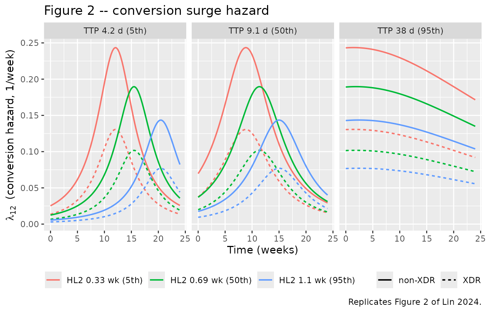
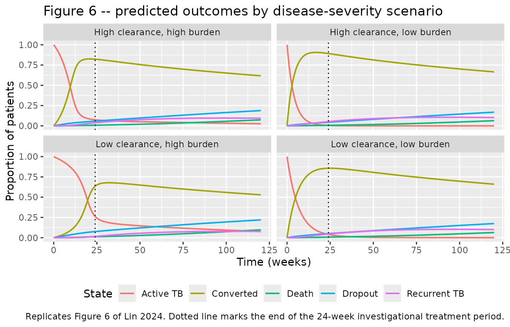
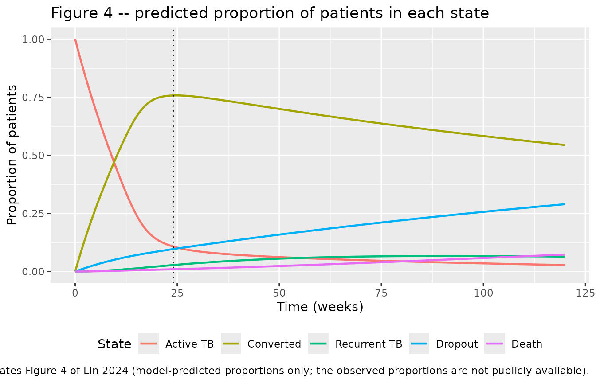

# Pulmonary TB treatment-outcome multistate model (Lin 2024)

## Model and source

- Citation: Lin YJ, Zou Y, Karlsson MO, Svensson EM. A pharmacometric
  multistate model for predicting long-term treatment outcomes of
  patients with pulmonary TB. J Antimicrob Chemother.
  2024;79(10):2561-2569. <doi:10.1093/jac/dkae256>. PMCID: PMC11441995.
  Open Access under CC BY. Structural equations from Supplementary Data
  ‘Model equations’ (equations 1-9) and the verbatim NONMEM control
  stream in Supplementary Data ‘NONMEM code’ (pages 12-16); parameter
  values from Supplementary Table S2 cross-checked against the control
  stream \$THETA block. The two model-derived covariates are secondary
  metrics of Svensson EM, Karlsson MO. J Antimicrob Chemother.
  2017;72(12):3398-3405; see modellib(‘Svensson_2017_bedaquiline’).
- Article: <https://doi.org/10.1093/jac/dkae256>
- PMC record (open access):
  <https://www.ncbi.nlm.nih.gov/pmc/articles/PMC11441995/>
- Supplementary data (model equations, Tables S1-S4, and the full NONMEM
  control stream): <https://doi.org/10.1093/jac/dkae256>, “Supplementary
  data” at JAC Online

This is a **pharmacometric multistate model**, not a pharmacokinetic
model. It carries no drug in any compartment: the five ODE states hold
the marginal *state-occupancy probability* of a patient being in each of
five clinical states at time `t`, and the ODEs are the Kolmogorov
forward equations of a continuous-time Markov process whose transition
intensities are the estimated hazards. Bedaquiline exposure never enters
the model directly; it reaches the model through two model-derived
covariates that are secondary metrics of the upstream mycobacterial-load
model
[`modellib("Svensson_2017_bedaquiline")`](https://nlmixr2.github.io/nlmixr2lib/articles/Svensson_2017_bedaquiline.md).

Because there is no drug concentration and no dosing event, the usual
PKNCA validation does not apply. This vignette validates the model the
way the source paper does: by checking that its state-occupancy
predictions reproduce the published hazard shapes, hazard ratios,
scenario percentages and 120-week population proportions, and that the
probability mass is conserved.

### Model structure

The five states and the transitions between them (Lin 2024 Figure 1):

| State | Name | Definition (Lin 2024 Methods) |
|----|----|----|
| `s_activeTb` | Active TB | Active tuberculosis after initial infection; all patients start here |
| `s_converted` | Converted | Day of the first of two negative sputum cultures at least 25 days apart, not interrupted by a positive culture |
| `s_recurrentTb` | Recurrent TB | Day of the first of two consecutive positive cultures (or a single positive before study completion) after conversion |
| `s_dropout` | Dropout | Discontinued study visits for any reason except death; absorbing |
| `s_death` | Death | Death from any state; absorbing |

Transitions: `1 -> 2` (conversion), `2 -> 3` (recurrence), `3 -> 2`
(re-conversion), `1 -> 4`, `2 -> 4`, `3 -> 4` (dropout), and `1 -> 5`,
`2 -> 5`, `3 -> 5` (death). Active TB is never re-entered.

## Population

The model was developed on 402 patients pooled from two Janssen phase
IIb bedaquiline trials: **TMC207-C208** (NCT00449644, randomized,
double-blind, placebo-controlled, newly diagnosed MDR-TB, n = 195) and
**TMC207-C209** (NCT00910871, open-label, single-arm, MDR-TB and XDR-TB
including treatment-experienced patients, n = 207). Of 439 enrolled
patients, 35 with negative cultures at both screening and baseline and 2
with only pre-treatment observations were excluded.

Baseline characteristics (Lin 2024 Table 1): median age 33 years
(18-68), median weight 55 kg (30-113), 35% female, median baseline MGIT
time-to-positivity 9.1 days (2.3-42). Drug-resistance profile: 3%
drug-sensitive, 54% MDR, 28% pre-XDR, 14% XDR (pre-2021 WHO
definitions); ~16% had a missing profile and were assigned to the MDR
group. Comorbidity and severity: 96% had lung cavitation, 9% were living
with HIV, 46% had prior anti-TB treatment, 75% came from a
high-TB-burden country. Bedaquiline was given to 75% of patients (400 mg
once daily for 2 weeks, then 200 mg three times weekly for 22 more
weeks) on top of a multidrug background regimen; the remainder received
placebo plus background regimen. Follow-up ran to 120 weeks: a 24-week
investigational treatment period plus a 96-week follow-up period.

The dataset holds 6984 state observations with 364 conversion events (25
of them a second conversion after a recurrence), 63 recurrences, 114
dropouts and 30 deaths (Lin 2024 Figure 1).

The same information is available programmatically via
`readModelDb("Lin_2024_TB_multistate")()$population`.

## Source trace

Every `ini()` entry in
`inst/modeldb/therapeuticArea/Lin_2024_TB_multistate.R` carries an
in-file comment naming its source. The table below collects them.

Two conventions are worth stating up front, because they explain every
apparent mismatch between this file and the published table:

1.  **Rates vs. mean transit times.** Supplementary Table S2 reports the
    constant hazards as **rates in week^-1**. The NONMEM control stream
    parameterises the same quantities as **mean transit times (MTT) in
    weeks**, converted to hours (`THETA(n)*24*7`) because the estimation
    dataset runs on an hour axis. This model file uses Table S2’s
    week^-1 rate form, so each structural value below is the reciprocal
    of the corresponding `$THETA`. Worked example: `THETA(1) = 295.375`
    weeks, so `lambda23 = 1/295.375 = 0.00338554` week^-1, which rounds
    to the `0.00339` printed in Table S2.
2.  **Unrounded values.** Where the control stream `$THETA` block
    carries more digits than Table S2, the unrounded value is used. The
    two agree on every parameter after rounding, which is itself a
    useful check that the printed control stream is the final run and
    not an earlier one.

| Equation / parameter | Value in this model | Source location |
|----|----|----|
| Multistate ODE system (5 states) | n/a | Supplement “Model equations”, equations 1-5; control stream `$DES` `DADT(1)`-`DADT(5)` |
| Surge hazard form for `lambda12` | `SA/(((t-PT)/SW)^2+1)` | Supplement equation 8; control stream `$DES` `HZ12` |
| Weibull hazard form for `lambda15`/`lambda35` | `scale*shape*(scale*t)^(shape-1)` | Supplement equation 7; control stream `$DES` `WB15` |
| Proportional-hazard covariate form | `lambda_ij,p = lambda_ij * exp(beta*(X_p - X_median))` | Supplement equation 9 |
| `lsa12` | `log(0.18967032)` | Table S2 `SA12` = 0.190 /week (RSE 9.5%); `$THETA 7`/10000\*168 |
| `lpt12` | `log(11.3799)` | Table S2 `PT12` = 11.4 week (RSE 6.4%); `$THETA 8` |
| `lsw12` | `log(5.58883)` | Table S2 `SW12` = 5.59 week (RSE 12%); `$THETA 9` |
| `llambda23` | `log(1/295.375)` | Table S2 `lambda23` = 0.00339 /week (RSE 14%); `$THETA 1` (MTT23) |
| `llambda32` | `log(1/61.8711)` | Table S2 `lambda32` = 0.0162 /week (RSE 21%); `$THETA 2` (MTT32) |
| `llambda14` | `log(1/260.086)` | Table S2 `lambda14` = 0.00384 /week (RSE 21%); `$THETA 3` (MTT14) |
| `llambda24` | `log(1/667.209)` | Table S2 `lambda24/34` = 0.00150 /week (RSE 18%); `$THETA 4` (MTT24); `MTT34 = MTT24` |
| `llambda25` | `log(1/3803.44)` | Table S2 `lambda25` = 0.000263 /week (RSE 38%); `$THETA 6` (MTT25) |
| `lscale15` | `log(1/192.364)` | Table S2 `Scale15/35` = 0.00520 /week (RSE 18%); `$THETA 5` (MTT15); `MTT35 = MTT15` |
| `lshape15` | `log(1.96131)` | Table S2 `Shape15/35` = 1.96 (RSE 19%); `$THETA 10` |
| `e_hl2_sa12pt12` | `-0.686145` | Table S2 `betaHL2 on SA12, PT12` = -0.686 (RSE 16%); `$THETA 12` |
| `e_ttp_pt12sw12` | `0.442668` | Table S2 `betabasTTP on PT12, SW12` = 0.443 (RSE 20%); `$THETA 11` |
| `e_xdr_sa12` | `-0.622792` | Table S2 `betaXDR-TB on SA12` = -0.623 (RSE 29%); `$THETA 13` |
| `e_sexf_lambda23` | `-0.812999` | Table S2 `betasex on lambda23` = -0.813 (RSE 41%); `$THETA 17` |
| `e_mblend_lambda23` | `0.0371081` | Table S2 `betaMMBLend on lambda23` = 0.0371 (RSE 41%); `$THETA 18` |
| `e_study_lambda1424` | `0.909188` | Table S2 `betastudy on lambda14/24/34` = 0.910 (RSE 22%); `$THETA 14` |
| `e_age_lambda1424` | `-0.0230092` | Table S2 `betaage on lambda14/24/34` = -0.0230 (RSE 38%); `$THETA 15` |
| `e_baswt_lambda1525` | `-0.0838138` | Table S2 `betabasWT on lambda15/25/35` = -0.0838 (RSE 26%); `$THETA 16` |
| `MBL_HL_WK2` centering 0.69443 week | n/a | Control stream `$PK`; Lin 2024 Figure 3 reference individual |
| `TTP_MGIT_BASE` centering 9.06944 day | n/a | Control stream `$PK` (217.6667 h / 24); Lin 2024 Table 1 median 9.1 days |
| `MBL_END` centering 5.5726e-05 | n/a | Control stream `$DES` `LOG(0.000055726)`; Figure 3 reference `-4.3 log10` |
| `AGE` centering 33 year | n/a | Control stream `$DES`; Lin 2024 Table 1 median |
| `WT` centering 55 kg | n/a | Control stream `$DES`; Lin 2024 Table 1 median |
| No IIV (no eta parameters) | n/a | Control stream `$OMEGA 0 FIX`; `BSV = ETA(1)` is an explicit “place holder” |
| `addSd` placeholder residual | `0.001` | **Not from the source** – see Assumptions and deviations |

## The reference individual

Lin 2024 Figure 3 defines a reference individual against which all
covariate effects are expressed: a 33-year-old male weighing 55 kg,
infected with MDR tuberculosis, enrolled in the C209 study, with 9.1
days of baseline time-to-positivity, 0.69 weeks of half-life of
bacterial clearance at week 2, and -4.3 log10(MMBLend).

``` r

mod <- readModelDb("Lin_2024_TB_multistate")

reference_individual <- data.frame(
  AGE               = 33,        # years                (Figure 3: "33-year-old")
  WT                = 55,        # kg                   (Figure 3: "weighing 55 kg")
  SEXF              = 0,         # male                 (Figure 3: "male")
  STUDY_C208        = 0,         # C209                 (Figure 3: "enrolled in the C209 study")
  DIS_TB_XDR_STRICT = 0,         # MDR, not XDR         (Figure 3: "infected with MDR tuberculosis")
  TTP_MGIT_BASE     = 9.1,       # days                 (Figure 3: "9.1 days of baseline time-to-positivity")
  MBL_HL_WK2        = 0.69443,   # weeks                (Figure 3: "0.69 weeks of half-life")
  MBL_END           = 10^(-4.3)  # n bacteria/inoculum  (Figure 3: "-4.3 log10(MMBLend)")
)

knitr::kable(
  reference_individual |>
    tidyr::pivot_longer(everything(), names_to = "Covariate", values_to = "Value"),
  digits  = 5,
  caption = "Reference individual of Lin 2024 Figure 3."
)
```

| Covariate         |    Value |
|:------------------|---------:|
| AGE               | 33.00000 |
| WT                | 55.00000 |
| SEXF              |  0.00000 |
| STUDY_C208        |  0.00000 |
| DIS_TB_XDR_STRICT |  0.00000 |
| TTP_MGIT_BASE     |  9.10000 |
| MBL_HL_WK2        |  0.69443 |
| MBL_END           |  0.00005 |

Reference individual of Lin 2024 Figure 3. {.table}

Note that `MBL_END` is stored on the **natural** scale. The paper’s
figures are labelled in `log10(MMBLend)` while the model coefficient is
per unit of **natural** log, so `10^(-4.3) = 5.01e-05` here is the
natural-scale value corresponding to the figure’s `-4.3`. It is within
rounding of the control stream’s centering constant `5.5726e-05` (whose
log10 is -4.2537).

``` r

# Weekly observation grid over the full 120-week study, on the s_converted ODE
# state. rxode2 returns every algebraic observable (prob_scc, prob_death, the
# individual hazards, ...) as a column at these rows.
obs_times <- seq(0, 120, by = 0.25)

make_events <- function(cov, id_offset = 0L) {
  cov |>
    dplyr::mutate(id = id_offset + dplyr::row_number()) |>
    tidyr::crossing(time = obs_times) |>
    dplyr::mutate(evid = 0L, amt = NA_real_, cmt = "s_converted") |>
    dplyr::arrange(id, time)
}
```

## Replicate Figure 2 – the conversion surge hazard

Lin 2024 Figure 2 plots the conversion hazard `lambda12` over the first
24 weeks, stratified by the half-life of bacterial clearance at week 2
(5th / 50th / 95th percentiles), baseline time-to-positivity (5th / 50th
/ 95th percentiles) and XDR status. Figure 6 gives the percentile values
used: `MBL_HL_WK2` 0.33 / 0.69 / 1.1 weeks and `TTP_MGIT_BASE` 4.2 / 9.1
/ 38 days.

``` r

fig2_grid <- tidyr::expand_grid(
  MBL_HL_WK2        = c(0.33, 0.69443, 1.1),
  TTP_MGIT_BASE     = c(4.2, 9.1, 38),
  DIS_TB_XDR_STRICT = c(0, 1)
) |>
  dplyr::mutate(
    AGE = 33, WT = 55, SEXF = 0, STUDY_C208 = 0, MBL_END = 10^(-4.3),
    hl_lab  = factor(MBL_HL_WK2,
                     labels = c("HL2 0.33 wk (5th)", "HL2 0.69 wk (50th)", "HL2 1.1 wk (95th)")),
    ttp_lab = factor(TTP_MGIT_BASE,
                     labels = c("TTP 4.2 d (5th)", "TTP 9.1 d (50th)", "TTP 38 d (95th)")),
    xdr_lab = ifelse(DIS_TB_XDR_STRICT == 1, "XDR", "non-XDR")
  )

fig2_sim <- rxode2::rxSolve(
  mod, events = make_events(fig2_grid),
  keep = c("hl_lab", "ttp_lab", "xdr_lab")
) |>
  as.data.frame()
#> Warning: multi-subject simulation without without 'omega'

fig2_sim |>
  dplyr::filter(time <= 24) |>
  ggplot(aes(time, lambda12, colour = hl_lab, linetype = xdr_lab)) +
  geom_line(linewidth = 0.7) +
  facet_wrap(~ttp_lab) +
  labs(
    x = "Time (weeks)", y = expression(lambda[12] ~ " (conversion hazard, 1/week)"),
    colour = NULL, linetype = NULL,
    title = "Figure 2 -- conversion surge hazard",
    caption = "Replicates Figure 2 of Lin 2024."
  ) +
  theme(legend.position = "bottom")
```



Two published quantities are checked exactly.

``` r

# 1. Peak time of the conversion hazard for the reference individual.
ref_sim  <- rxode2::rxSolve(mod, events = make_events(reference_individual)) |> as.data.frame()
peak_obs <- ref_sim$time[which.max(ref_sim$lambda12)]

# 2. XDR effect on the surge amplitude: the paper reports a 46% decrease.
xdr_hr <- exp(rxode2::rxode(mod)$theta[["e_xdr_sa12"]])

surge_checks <- tibble::tibble(
  Quantity  = c("Peak time of lambda12 (weeks)", "XDR-TB reduction in lambda12 (%)"),
  Simulated = c(peak_obs, 100 * (1 - xdr_hr)),
  Published = c(11.4, 46),
  `Published interval` = c("95% CI 10.0-12.8", "95% CI 24-62")
)

knitr::kable(surge_checks, digits = 2,
             caption = "Figure 2 / Results checks against Lin 2024.")
```

| Quantity                         | Simulated | Published | Published interval |
|:---------------------------------|----------:|----------:|:-------------------|
| Peak time of lambda12 (weeks)    |     11.25 |      11.4 | 95% CI 10.0-12.8   |
| XDR-TB reduction in lambda12 (%) |     46.36 |      46.0 | 95% CI 24-62       |

Figure 2 / Results checks against Lin 2024. {.table}

The simulated peak sits marginally below the printed 11.4 weeks because
the reference individual’s baseline TTP of 9.1 days is very slightly
above the model’s centering constant of 9.06944 days, which shifts
`PT12` down by `exp(-0.442668 * (9.1 - 9.06944)/7) = 0.998`; the
remaining difference is the 0.25-week resolution of the observation
grid.

## Replicate Figure 3 – predictor hazard ratios

Figure 3 is a forest plot of hazard ratios relative to the reference
individual for recurrence, dropout and death. The hazard ratios are pure
functions of the estimated coefficients, so they can be checked in
closed form.

``` r

th <- rxode2::rxode(mod)$theta

hazard_ratios <- tibble::tribble(
  ~Transition,        ~Predictor,                          ~Contrast,                  ~`Hazard ratio`,
  "Recurrence",       "Sex",                               "female vs male",           exp(th[["e_sexf_lambda23"]]),
  "Recurrence",       "log10(MMBLend)",                    "+1 log10 unit",            exp(th[["e_mblend_lambda23"]] * log(10)),
  "Dropout (any)",    "Study",                             "C208 vs C209",             exp(th[["e_study_lambda1424"]]),
  "Dropout (any)",    "Age",                               "-10 years (23 vs 33)",     exp(th[["e_age_lambda1424"]] * -10),
  "Death (any)",      "Baseline weight",                   "-10 kg (45 vs 55)",        exp(th[["e_baswt_lambda1525"]] * -10),
  "Conversion (SA12)","XDR-TB",                            "XDR vs non-XDR",           exp(th[["e_xdr_sa12"]])
)

knitr::kable(hazard_ratios, digits = 3,
             caption = paste("Figure 3 -- hazard ratios relative to the reference individual.",
                             "Directions match Lin 2024 Results: men and higher end-of-treatment",
                             "mycobacterial load raise recurrence; C208 enrollment and younger age",
                             "raise dropout; lower baseline weight raises death."))
```

| Transition        | Predictor       | Contrast             | Hazard ratio |
|:------------------|:----------------|:---------------------|-------------:|
| Recurrence        | Sex             | female vs male       |        0.444 |
| Recurrence        | log10(MMBLend)  | +1 log10 unit        |        1.089 |
| Dropout (any)     | Study           | C208 vs C209         |        2.482 |
| Dropout (any)     | Age             | -10 years (23 vs 33) |        1.259 |
| Death (any)       | Baseline weight | -10 kg (45 vs 55)    |        2.312 |
| Conversion (SA12) | XDR-TB          | XDR vs non-XDR       |        0.536 |

Figure 3 – hazard ratios relative to the reference individual.
Directions match Lin 2024 Results: men and higher end-of-treatment
mycobacterial load raise recurrence; C208 enrollment and younger age
raise dropout; lower baseline weight raises death. {.table}

Each direction reproduces a statement in Lin 2024 Results and
Discussion: women have 0.444 times the recurrence hazard of men (“the
risk of recurrence was higher for men”); C208 patients have 2.48 times
the dropout hazard of C209 patients (“The dropout rate in patients from
the C208 study was higher than in C209”); a 10 kg lower baseline weight
raises the death hazard 2.31-fold (“lower weight at baseline was
correlated with a higher risk of death”).

## Replicate Figure 6 – scenario simulations

Figure 6 is the paper’s most sharply specified prediction, and therefore
the strongest available falsification test: it names the exact covariate
values of each scenario **and** reports the resulting percentage of
patients who had reached sputum culture conversion at 24 weeks. Every
covariate other than half-life and time-to-positivity is set to the
reference individual’s value.

Because the model has no between-subject variability, each scenario is a
single deterministic trajectory, so the published median percentages are
directly reproducible without simulating a cohort.

``` r

scenarios <- tidyr::expand_grid(
  MBL_HL_WK2    = c(`high clearance` = 0.33, `low clearance` = 1.1),
  TTP_MGIT_BASE = c(`high burden` = 4.2, `low burden` = 38)
) |>
  dplyr::mutate(
    AGE = 33, WT = 55, SEXF = 0, STUDY_C208 = 0,
    DIS_TB_XDR_STRICT = 0, MBL_END = 10^(-4.3),
    scenario = paste0(
      ifelse(MBL_HL_WK2 == 0.33, "High clearance", "Low clearance"), ", ",
      ifelse(TTP_MGIT_BASE == 4.2, "high burden", "low burden")
    )
  )

scen_sim <- rxode2::rxSolve(mod, events = make_events(scenarios), keep = "scenario") |>
  as.data.frame()
#> Warning: multi-subject simulation without without 'omega'

scen_sim |>
  dplyr::select(time, scenario, `Active TB` = prob_active_tb, Converted = prob_scc,
                `Recurrent TB` = prob_recurrent_tb, Dropout = prob_dropout, Death = prob_death) |>
  tidyr::pivot_longer(-c(time, scenario), names_to = "State", values_to = "Probability") |>
  ggplot(aes(time, Probability, colour = State)) +
  geom_line(linewidth = 0.7) +
  geom_vline(xintercept = 24, linetype = "dotted") +
  facet_wrap(~scenario) +
  labs(x = "Time (weeks)", y = "Proportion of patients",
       title = "Figure 6 -- predicted outcomes by disease-severity scenario",
       caption = paste("Replicates Figure 6 of Lin 2024. Dotted line marks the end of the",
                       "24-week investigational treatment period.")) +
  theme(legend.position = "bottom")
```



``` r

scc_24 <- scen_sim |>
  dplyr::filter(time == 24) |>
  dplyr::transmute(scenario, `SCC at 24 weeks (%)` = 100 * prob_scc)

scc_compare <- scc_24 |>
  dplyr::mutate(
    Published = dplyr::case_when(
      scenario == "Low clearance, high burden"  ~ 62,   # "the most severe scenario"
      scenario == "High clearance, low burden"  ~ 89,   # "the least severe scenario"
      TRUE                                      ~ NA_real_
    ),
    `Published interval` = dplyr::case_when(
      scenario == "Low clearance, high burden"  ~ "90% PI 51-69",
      scenario == "High clearance, low burden"  ~ "90% PI 86-90",
      TRUE                                      ~ NA_character_
    ),
    `Difference (pp)` = `SCC at 24 weeks (%)` - Published
  ) |>
  dplyr::rename("Scenario" = scenario, "Published (%)" = Published)

knitr::kable(scc_compare, digits = 1,
             caption = paste("Sputum culture conversion at 24 weeks, simulated vs. Lin 2024",
                             "Results: 'the proportions of patients who reached SCC ranged from",
                             "62% (90% PI, 51%-69%) (the most severe scenario) to 89% (90% PI,",
                             "86%-90%) (the least severe scenario)'. Only the two extreme",
                             "scenarios carry published point estimates."))
```

| Scenario | SCC at 24 weeks (%) | Published (%) | Published interval | Difference (pp) |
|:---|---:|---:|:---|---:|
| High clearance, high burden | 82.2 | NA | NA | NA |
| High clearance, low burden | 89.2 | 89 | 90% PI 86-90 | 0.2 |
| Low clearance, high burden | 63.5 | 62 | 90% PI 51-69 | 1.5 |
| Low clearance, low burden | 85.7 | NA | NA | NA |

Sputum culture conversion at 24 weeks, simulated vs. Lin 2024 Results:
‘the proportions of patients who reached SCC ranged from 62% (90% PI,
51%-69%) (the most severe scenario) to 89% (90% PI, 86%-90%) (the least
severe scenario)’. Only the two extreme scenarios carry published point
estimates. {.table style="width:100%;"}

Both published extremes are reproduced to within about one percentage
point, and the two intermediate scenarios fall between them, as Figure 6
shows. The paper’s qualitative conclusion also reproduces: recurrence
rises substantially after 24 weeks in the low-clearance scenarios
irrespective of baseline bacterial burden, whereas conversion at 24
weeks depends on both.

## Replicate Figure 4 – population predictions over 120 weeks

Figure 4 is a visual predictive check of the proportion of patients in
each state over the full study. Reproducing it needs a cohort whose
covariate distribution approximates Table 1. Lin 2024 publishes medians
and ranges but not the joint covariate distribution, so the cohort below
is an approximation – see Assumptions and deviations.

``` r

set.seed(20240701)
n_cohort <- 200  # per the 200-per-arm cap; this is a single-arm cohort

# Log-normal SD implied by a median and a published 95th percentile.
sd_from_p95 <- function(median, p95) (log(p95) - log(median)) / qnorm(0.95)

cohort <- data.frame(
  AGE               = pmin(pmax(round(rlnorm(n_cohort, log(33), 0.28)), 18), 68),
  WT                = pmin(pmax(round(rlnorm(n_cohort, log(55), 0.21)), 30), 113),
  SEXF              = rbinom(n_cohort, 1, 0.35),
  STUDY_C208        = rbinom(n_cohort, 1, 0.485),
  DIS_TB_XDR_STRICT = rbinom(n_cohort, 1, 0.12),
  TTP_MGIT_BASE     = pmin(pmax(rlnorm(n_cohort, log(9.1), sd_from_p95(9.1, 38)), 2.3), 42),
  MBL_HL_WK2        = rlnorm(n_cohort, log(0.69443), sd_from_p95(0.69443, 1.1)),
  MBL_END           = rlnorm(n_cohort, log(5.5726e-05), 1.8)
)

cohort_events <- make_events(cohort)
stopifnot(!anyDuplicated(unique(cohort_events[, c("id", "time", "evid")])))

cohort_sim <- rxode2::rxSolve(mod, events = cohort_events) |> as.data.frame()
#> Warning: multi-subject simulation without without 'omega'

# rxSolve silently drops subjects on some failure modes -- assert the count.
stopifnot(dplyr::n_distinct(cohort_sim$id) == n_cohort)
```

``` r

state_labels <- c(prob_active_tb = "Active TB", prob_scc = "Converted",
                  prob_recurrent_tb = "Recurrent TB", prob_dropout = "Dropout",
                  prob_death = "Death")

cohort_long <- cohort_sim |>
  dplyr::select(id, time, dplyr::all_of(names(state_labels))) |>
  tidyr::pivot_longer(-c(id, time), names_to = "state", values_to = "p") |>
  dplyr::mutate(State = factor(state_labels[state], levels = unname(state_labels)))

cohort_long |>
  dplyr::group_by(time, State) |>
  dplyr::summarise(Mean = mean(p), .groups = "drop") |>
  ggplot(aes(time, Mean, colour = State)) +
  geom_line(linewidth = 0.8) +
  geom_vline(xintercept = 24, linetype = "dotted") +
  labs(x = "Time (weeks)", y = "Proportion of patients",
       title = "Figure 4 -- predicted proportion of patients in each state",
       caption = paste("Replicates Figure 4 of Lin 2024 (model-predicted proportions only;",
                       "the observed proportions are not publicly available).")) +
  theme(legend.position = "bottom")
```



``` r

at_120 <- cohort_sim |> dplyr::filter(time == 120)

pop_compare <- tibble::tibble(
  State       = c("Converted", "Recurrent TB", "Death", "Dropout"),
  `Simulated (%)` = 100 * c(mean(at_120$prob_scc), mean(at_120$prob_recurrent_tb),
                            mean(at_120$prob_death), mean(at_120$prob_dropout)),
  `Published (%)` = c(55, 6.5, 7.5, 28.4),
  `Published interval` = c("95% PI 50-60", "95% PI 4.2-9.0", "95% PI 5.2-10",
                           "observed 114/402")
) |>
  dplyr::mutate(`Difference (pp)` = `Simulated (%)` - `Published (%)`)

knitr::kable(pop_compare, digits = 1,
             caption = paste("Predicted proportion of patients in each state at 120 weeks.",
                             "Converted, recurrent TB and death are the model-predicted values",
                             "with prediction intervals from Lin 2024 Results; the dropout row",
                             "is the observed 114 of 402 patients from Lin 2024 Figure 1."))
```

| State        | Simulated (%) | Published (%) | Published interval | Difference (pp) |
|:-------------|--------------:|--------------:|:-------------------|----------------:|
| Converted    |          54.5 |          55.0 | 95% PI 50-60       |            -0.5 |
| Recurrent TB |           6.4 |           6.5 | 95% PI 4.2-9.0     |            -0.1 |
| Death        |           7.3 |           7.5 | 95% PI 5.2-10      |            -0.2 |
| Dropout      |          29.0 |          28.4 | observed 114/402   |             0.6 |

Predicted proportion of patients in each state at 120 weeks. Converted,
recurrent TB and death are the model-predicted values with prediction
intervals from Lin 2024 Results; the dropout row is the observed 114 of
402 patients from Lin 2024 Figure 1. {.table}

All three published model predictions and the observed dropout
proportion are reproduced within about one percentage point.

## Structural checks

PKNCA is not applicable to this model (no concentration, no dose). The
checks below are the multistate analogues: conservation of probability
mass, correct absorbing behaviour, and the sign and shape of each
hazard.

``` r

# 1. Mass balance. The five state-occupancy probabilities are a partition of
#    a probability space and must sum to exactly 1 at every time, for every
#    subject. This is the single strongest structural check available.
max_mass_error <- max(abs(cohort_sim$prob_state_sum - 1))

# 2. Every probability must stay within [0, 1].
probs <- cohort_sim[, names(state_labels)]
in_unit_interval <- all(probs >= -1e-10 & probs <= 1 + 1e-10)

# 3. Absorbing states must be monotone non-decreasing; the transient states
#    need not be (a patient can leave and re-enter the converted state).
monotone <- cohort_sim |>
  dplyr::arrange(id, time) |>
  dplyr::group_by(id) |>
  dplyr::summarise(
    dropout_monotone = all(diff(prob_dropout) >= -1e-10),
    death_monotone   = all(diff(prob_death)   >= -1e-10),
    active_monotone  = all(diff(prob_active_tb) <=  1e-10),  # never re-entered
    .groups = "drop"
  )

# 4. Initial conditions: everyone starts in active TB.
t0 <- cohort_sim |> dplyr::filter(time == 0)

structural <- tibble::tibble(
  Check = c(
    "max |sum of the 5 state probabilities - 1| over all subjects and times",
    "all state probabilities within [0, 1]",
    "s_dropout monotone non-decreasing in every subject",
    "s_death monotone non-decreasing in every subject",
    "s_activeTb monotone non-increasing in every subject (never re-entered)",
    "prob_active_tb == 1 at t = 0 in every subject",
    "all other state probabilities == 0 at t = 0"
  ),
  Result = c(
    format(max_mass_error, digits = 3),
    in_unit_interval,
    all(monotone$dropout_monotone),
    all(monotone$death_monotone),
    all(monotone$active_monotone),
    isTRUE(all.equal(t0$prob_active_tb, rep(1, nrow(t0)))),
    isTRUE(all.equal(sum(t0$prob_scc, t0$prob_recurrent_tb, t0$prob_dropout, t0$prob_death), 0))
  ) |> as.character()
)

knitr::kable(structural, caption = "Structural checks on the multistate ODE system.")
```

| Check | Result |
|:---|:---|
| max \|sum of the 5 state probabilities - 1\| over all subjects and times | 3.77e-15 |
| all state probabilities within \[0, 1\] | TRUE |
| s_dropout monotone non-decreasing in every subject | TRUE |
| s_death monotone non-decreasing in every subject | TRUE |
| s_activeTb monotone non-increasing in every subject (never re-entered) | TRUE |
| prob_active_tb == 1 at t = 0 in every subject | TRUE |
| all other state probabilities == 0 at t = 0 | TRUE |

Structural checks on the multistate ODE system. {.table}

``` r

stopifnot(max_mass_error < 1e-8, in_unit_interval,
          all(monotone$dropout_monotone), all(monotone$death_monotone))
```

``` r

# The Weibull death hazard has shape 1.96 > 1, so it must increase over time;
# the conversion surge must rise to a single interior peak and fall away.
haz <- ref_sim |> dplyr::filter(time > 0)

hazard_shape <- tibble::tibble(
  Check = c(
    "lambda15 (Weibull, shape 1.96) strictly increasing over time",
    "lambda12 (surge) has a single interior maximum",
    "lambda12 at t = 0 is below its peak",
    "lambda23 steps up at week 26 when MBL_END is above its reference",
    "constant hazards lambda32, lambda14, lambda24, lambda25 are time-invariant"
  ),
  Result = as.character(c(
    all(diff(haz$lambda15) > 0),
    which.max(haz$lambda12) > 1 && which.max(haz$lambda12) < nrow(haz),
    haz$lambda12[1] < max(haz$lambda12),
    {
      hi <- reference_individual; hi$MBL_END <- 1e-3   # above the 5.57e-05 reference
      s  <- rxode2::rxSolve(mod, events = make_events(hi)) |> as.data.frame()
      before <- s$lambda23[which.min(abs(s$time - 25))]
      after  <- s$lambda23[which.min(abs(s$time - 27))]
      after > before
    },
    all(sapply(c("lambda32", "lambda14", "lambda24", "lambda25"),
               function(v) diff(range(haz[[v]])) < 1e-12))
  ))
)

knitr::kable(hazard_shape, caption = "Hazard-shape checks against the source's stated forms.")
```

| Check | Result |
|:---|:---|
| lambda15 (Weibull, shape 1.96) strictly increasing over time | TRUE |
| lambda12 (surge) has a single interior maximum | TRUE |
| lambda12 at t = 0 is below its peak | TRUE |
| lambda23 steps up at week 26 when MBL_END is above its reference | TRUE |
| constant hazards lambda32, lambda14, lambda24, lambda25 are time-invariant | TRUE |

Hazard-shape checks against the source’s stated forms. {.table}

## Assumptions and deviations

- **Placeholder residual error.** Lin 2024 fits the exact multistate
  event likelihood (`$ESTIMATION METHOD=0 LIKE`) on the observed
  categorical state and has no observation-error model (`$SIGMA 0 FIX`
  in the simulation variant of the control stream). This translation is
  intended for forward simulation, so a tiny additive residual
  (`addSd = 0.001`) is attached to `prob_scc` – the paper’s primary
  endpoint – purely so the nlmixr2 likelihood machinery accepts the
  model. **This value is not from the source** and should not be
  interpreted.
- **No between-subject variability.** The control stream declares
  `BSV = ETA(1) ; place holder` and sets `$OMEGA 0 FIX`, so the fitted
  model carries no IIV. No `eta` parameters were invented, and every
  simulation in this vignette is deterministic given the covariates.
- **MMBLend time gate: 26 weeks, not 24.** The main text says the
  end-of-treatment mycobacterial load acts on recurrence “after 24
  weeks” and “after the completion of 24 week treatment”, but the
  control stream gates it at `IF(WEEK.GT.26) FLAG_MMBL = 1`. The control
  stream value (26 weeks) is used here, per the standing convention that
  a printed equation or control stream beats a prose gloss. The choice
  affects only a two-week window and, because the recurrence coefficient
  is small, moves the 120-week recurrence proportion by well under 0.1
  percentage points.
- **XDR encoding is strict, not pooled.** The control stream encodes
  `XDR = 0; IF(TBTYPE.EQ.4) XDR = 1`, which places the 95 pre-XDR
  patients (28% of the cohort) in the *reference* group. This model
  therefore uses the new `DIS_TB_XDR_STRICT` covariate rather than the
  existing `DIS_TB_XDR`, which pools pre-XDR with XDR for the Svensson
  2017 bedaquiline model. The two are not interchangeable and
  substituting one for the other would misclassify more than a quarter
  of the cohort.
- **`TTP_MGIT_BASE` units and reference.** The source data column `MTTP`
  is in hours, centered at 217.6667 h. This model uses the canonical
  `TTP_MGIT_BASE` column in days, so the identical arithmetic is written
  as `(TTP_MGIT_BASE - 9.06944)/7`; the divisor 7 reproduces the control
  stream’s `/24/7`, making the coefficient per week of baseline TTP. The
  9.06944-day centering value is this cohort’s median and differs from
  the 6.8 days recorded for the Svensson 2017 C208-only cohort in the
  covariate register.
- **`MBL_END` scale.** Stored on the natural scale and log-transformed
  inside `model()`. The coefficient is per unit of natural log, so the
  per-log10-unit hazard ratio is `exp(0.0371081 * ln(10)) = 1.089`.
  `MBL_END` must be strictly positive: `log(0)` is undefined and would
  propagate `NaN` through the whole solve even before the week-26 gate
  opens.
- **Virtual cohort distributions are approximate.** Lin 2024 Table 1
  publishes medians and ranges but not the joint covariate distribution,
  and reports no correlation structure. The cohort here draws age,
  weight, baseline TTP and week-2 half-life as independent log-normals
  calibrated to the published median and (where available) the 95th
  percentile from Figure 6, truncated to the published ranges; binary
  covariates are independent Bernoulli draws at the Table 1 marginal
  frequencies. `MBL_END` has no published dispersion at all, so its
  log-scale SD of 1.8 is a plausible-but-unverified choice; because the
  recurrence coefficient is small, the 120-week proportions are
  insensitive to it. Real covariates are correlated (XDR status,
  baseline TTP and bacterial clearance in particular), so the cohort
  understates the true spread. The scenario checks against Figure 6 do
  not depend on any of these assumptions, because the paper specifies
  those covariate values exactly.
- **Placebo and bedaquiline arms are not distinguished.** Bedaquiline
  treatment was screened as a covariate and not retained on any
  transition; its effect reaches the model only through `MBL_HL_WK2` and
  `MBL_END`. A user who wants an exposure-driven simulation should
  generate those two covariates from
  `modellib("Svensson_2017_bedaquiline")` rather than looking for a
  treatment flag here.
- **Screened but unused covariates.** HIV status, lung cavitation, prior
  anti-TB treatment, bedaquiline treatment and time-varying albumin were
  all evaluated by Lin 2024 and not retained. They are recorded in the
  model file’s `covariatesDataExcluded` metadata for provenance rather
  than in `covariateData`, so they do not appear in `model()`.
- **Observed data are not reproduced.** Lin 2024 Figure 4 overlays
  observed state proportions on the predicted intervals. The individual
  patient data from TMC207-C208 and TMC207-C209 are not publicly
  available, so only the predicted proportions are shown here.
