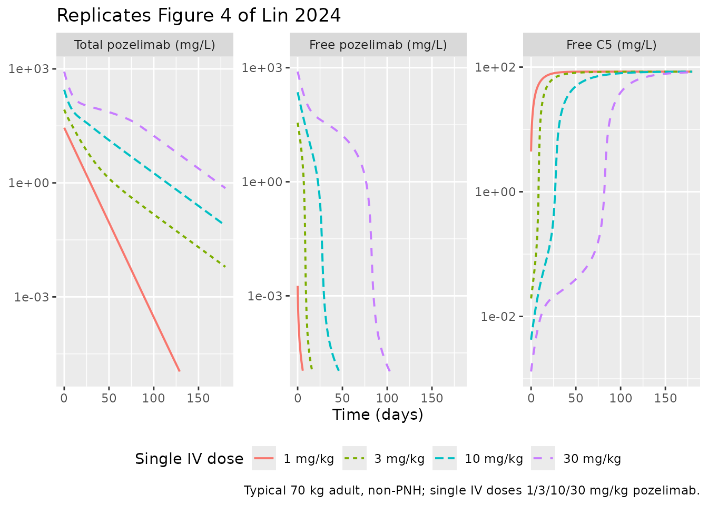
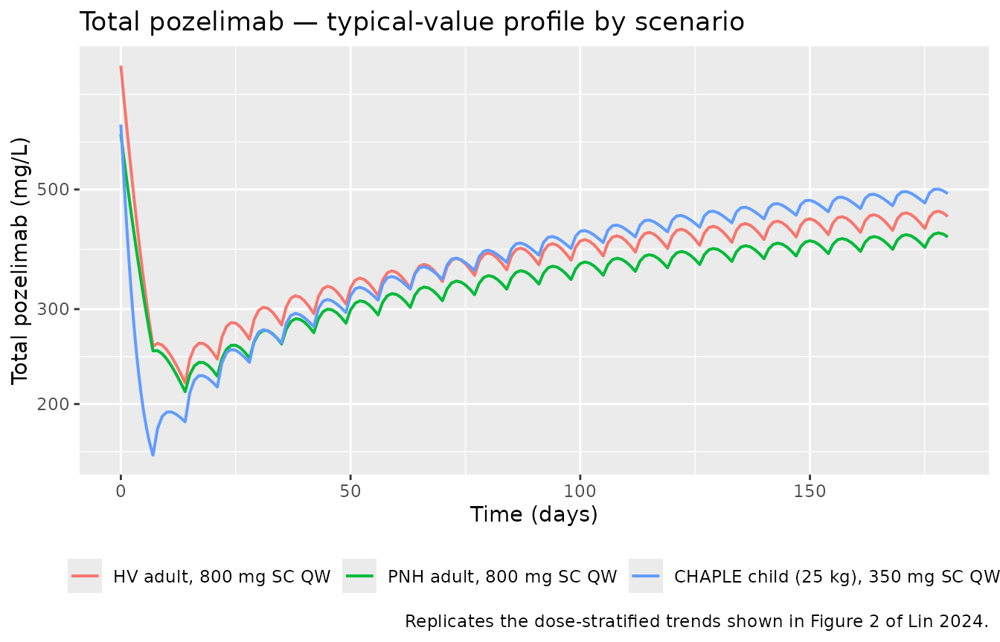
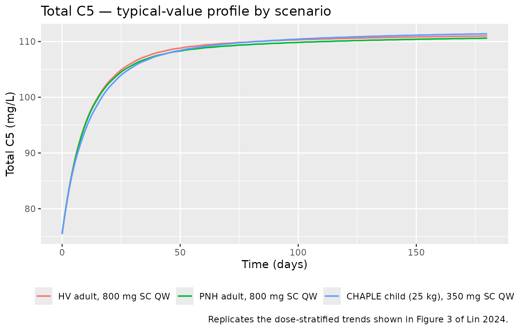
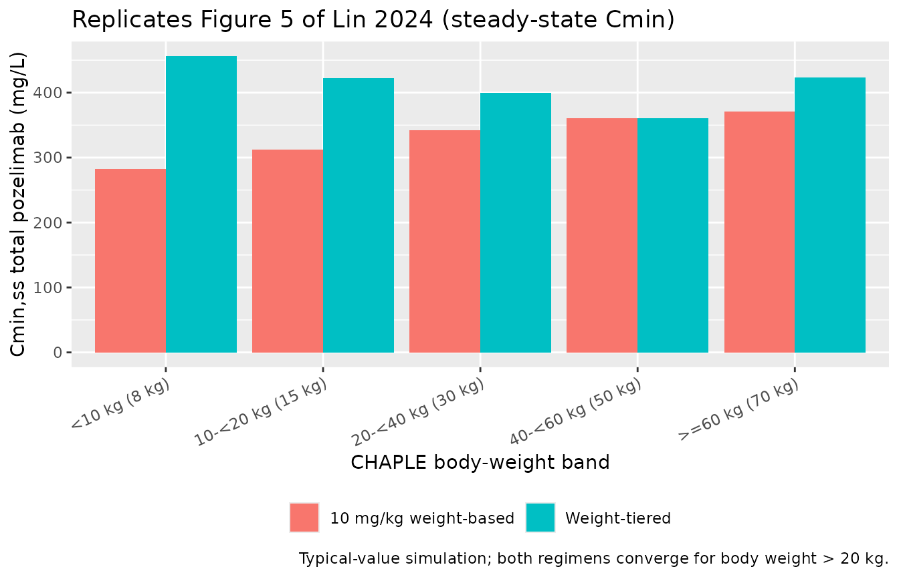

# Pozelimab (Lin 2024)

``` r

library(nlmixr2lib)
library(PKNCA)
#> 
#> Attaching package: 'PKNCA'
#> The following object is masked from 'package:stats':
#> 
#>     filter
library(rxode2)
#> rxode2 5.1.1 using 2 threads (see ?getRxThreads)
#>   no cache: create with `rxCreateCache()`
library(dplyr)
#> 
#> Attaching package: 'dplyr'
#> The following objects are masked from 'package:stats':
#> 
#>     filter, lag
#> The following objects are masked from 'package:base':
#> 
#>     intersect, setdiff, setequal, union
library(tidyr)
library(ggplot2)
```

## Model and source

- Citation: Lin K-J, Mendell J, Davis JD, Harnisch LO. Population
  pharmacokinetic analyses of pozelimab in patients with CD55-deficient
  protein-losing enteropathy (CHAPLE disease). J Pharmacokinet
  Pharmacodyn. 2024;51(6):905-917. <doi:10.1007/s10928-024-09941-8>
- Description: Two-compartment two-binding-site TMDD-QE population PK
  model of total pozelimab and total C5 in healthy volunteers, adults
  with paroxysmal nocturnal hemoglobinuria, and pediatric and adult
  patients with CHAPLE disease (Lin 2024)
- Article: <https://doi.org/10.1007/s10928-024-09941-8>
- Open access (PMC):
  <https://pmc.ncbi.nlm.nih.gov/articles/PMC11579122/>

Lin et al. (2024) developed a target-mediated drug disposition (TMDD)
population PK model for pozelimab — a fully human IgG4 anti-C5
monoclonal antibody — pooled across four phase 1-3 clinical trials in
healthy adult volunteers, adult patients with paroxysmal nocturnal
hemoglobinuria (PNH), and pediatric and adult patients with
CD55-deficient protein-losing enteropathy (CHAPLE disease). The
structural model is a two-compartment TMDD with **two binding sites**
based on the **quasi-equilibrium (QE)** approximation of Gibiansky and
Gibiansky (2017, <doi:10.1007/s10928-017-9533-1>): each pozelimab
molecule can bind one or two C5 molecules, yielding free drug `Cu`,
pozelimab-C5 complex `RC` (internalized at rate `kint1`), and
pozelimab-C5-C5 complex `R2C` (internalized at rate `kint2`). Linear
drug clearance acts on free drug only. Free C5 follows zero-order
synthesis / first-order degradation turnover with a baseline correction
factor `theta_R0` that accounts for the early (~1 hour post-dose) drop
in observed total C5. Body weight is the dominant covariate, retained as
a power exponent on `CL`, `Vc`, and `Vp`; PNH disease state retains a
modest additive-fractional increase on `Vc` only. The equilibrium
dissociation constant `kD` was fixed at the SPR-Biacore in vitro value
(0.189 nM = 0.0359 mg/L). Pozelimab was approved by the US FDA in August
2023 for adult and pediatric patients ≥ 1 year of age with CHAPLE
disease (VEOPOZ, pozelimab-bbfg).

## Population

Pooled cohort of 116 participants from four studies (Lin 2024
Supplementary Table S1 and main-text Table 1):

- **NCT03115996 (FIH)** — phase 1 first-in-human
  single-/multiple-ascending-dose in healthy adult volunteers (n = 42);
  single doses 1, 3, 10, 30 mg/kg IV, 300 / 600 mg SC, and 15 mg/kg IV
  loading + 4 × 400 mg SC QW.
- **NCT04491838 (PK comparability)** — phase 1, n = 40; single 400 mg
  SC.
- **NCT03946748 (PNH)** — phase 2 in adult PNH patients (n = 24); 30
  mg/kg IV loading + 800 mg SC QW.
- **NCT04209634 (CHAPLE)** — phase 2/3 in CHAPLE pediatric and adult
  patients (n = 10; 9 children, 1 adult); 30 mg/kg IV loading +
  weight-tiered SC QW (125 mg \< 10 kg, 200 mg 10-\< 20 kg, 350 mg 20-\<
  40 kg, 500 mg 40-\< 60 kg, 800 mg ≥ 60 kg).

Demographics for the pooled cohort: median age 37 years (range 3-76);
median body weight 66.7 kg (range 11-108); 60.3 % female; 70.7 % White,
22.4 % Asian, 3.4 % Black or African American, 0.9 % American Indian or
Alaska Native, 2.6 % Other; 0/116 ADA-positive. CHAPLE patients (n = 10)
contributed median age 8.5 years (range 3-19), median body weight 25.0
kg (range 11.0-53.8), median baseline albumin 23.0 g/L (range 11-29).
2795 concentration samples (1640 total pozelimab, 1155 total C5) were
used; 100 post-dose BLQ samples (3.6 %) were excluded under Beal’s M1
method.

The full population descriptor is available programmatically:

``` r

str(rxode2::rxode2(readModelDb("Lin_2024_pozelimab"))$meta$population)
#> ℹ parameter labels from comments will be replaced by 'label()'
#> List of 13
#>  $ n_subjects    : int 116
#>  $ n_studies     : int 4
#>  $ age_range     : chr "3-76 years (median 37 across all subjects; pediatric and adult)"
#>  $ age_median    : chr "37 years overall; 8.5 years in CHAPLE patients (range 3-19)"
#>  $ weight_range  : chr "11.0-108 kg overall; 11.0-53.8 kg in CHAPLE patients"
#>  $ weight_median : chr "66.7 kg overall; 25.0 kg in CHAPLE patients"
#>  $ sex_female_pct: num 60.3
#>  $ race_ethnicity: chr "70.7% White, 22.4% Asian, 3.4% Black or African American, 0.9% American Indian or Alaska Native, 2.6% Other (Table 1)."
#>  $ disease_state : chr "Healthy adult volunteers (n=82), adult patients with paroxysmal nocturnal hemoglobinuria (PNH; n=24), and pedia"| __truncated__
#>  $ dose_range    : chr "1-30 mg/kg single IV; 300-600 mg single SC; 400 mg SC QW; 30 mg/kg IV loading + 800 mg SC QW (PNH study); 30 mg"| __truncated__
#>  $ regions       : chr "Multi-regional phase 1-3 programme; specific regional breakdown not reported in the main text."
#>  $ ada_status    : chr "All 116 subjects ADA-negative (0% positive in every cohort)."
#>  $ notes         : chr "Pooled phase 1 first-in-human (NCT03115996, n=42), phase 1 PK comparability (NCT04491838, n=40), phase 2 PNH (N"| __truncated__
```

## Source trace

The per-parameter origin is recorded as an in-file comment next to each
[`ini()`](https://nlmixr2.github.io/rxode2/reference/ini.html) entry in
`inst/modeldb/specificDrugs/Lin_2024_pozelimab.R`. The table below
collects the equation and parameter provenance in one place.

| Element | Value (paper unit) | Source location |
|----|----|----|
| `CL` (linear clearance) | 0.1506 L/day | Table 2 |
| `Vc` (central volume) | 2.476 L | Table 2 |
| `Q` (intercompartmental clearance) | 0.3931 L/day | Table 2 |
| `Vp` (peripheral volume) | 9.901 L | Table 2 |
| `F1` (SC bioavailability) | 0.6864 | Table 2 |
| `ka` (first-order SC absorption) | 0.1726 1/day | Table 2 |
| `kD` (equilibrium dissociation constant, FIXED) | 0.000189 µM (= 0.03591 mg/L) | Table 2 + footnote (a) |
| `ksyn` (free C5 synthesis rate) | 0.04922 µM/day (= 9.352 mg/L/day) | Table 2 + footnote (a) |
| `kdeg` (free C5 degradation rate) | 0.1105 1/day | Table 2 |
| `kint1` (pozelimab-C5 internalization) | 0.08086 1/day | Table 2 |
| `kint2` (pozelimab-C5-C5 internalization) | 0.1149 1/day | Table 2 |
| `theta_R0` (baseline-C5 correction) | -0.04824 µM (= -9.166 mg/L) | Table 2 + footnote (a) and Results “Base PopPK model” |
| `e_wt_cl` (WT power on CL; ref 70 kg) | 0.9989 | Table 2 (“Weight on CL”) |
| `e_wt_vc_vp` (shared WT power on Vc and Vp; ref 70 kg) | 0.7560 | Table 2 (“Weight on Vc and Vp”) |
| `e_pnh_vc` (PNH additive-fractional effect on Vc) | 0.3407 | Table 2 (“Patients with PNH on Vc”) |
| IIV CL (31.90 % CV → ω² = 0.09732) | 31.90 %CV | Table 2 |
| IIV Vc (16.10 % CV → ω² = 0.02568) | 16.10 %CV | Table 2 |
| IIV Vp (80.37 % CV → ω² = 0.48107) | 80.37 %CV | Table 2 |
| IIV ksyn (16.48 % CV → ω² = 0.02683) | 16.48 %CV | Table 2 |
| IIV kint1 (21.10 % CV → ω² = 0.04362) | 21.10 %CV | Table 2 |
| Residual variability — pozelimab (adults) | 37.22 %CV (proportional) | Table 2 |
| Residual variability — total C5 (adults) | 10.72 %CV (proportional) | Table 2 |
| Drug depot ODE `dA_d/dt = -ka·A_d` | (Eq. S1) | Supplemental Text 1 |
| Drug central ODE `dC_tot/dt` | (Eq. S2) | Supplemental Text 1 |
| Drug peripheral ODE `dA_3/dt` | (Eq. S3) | Supplemental Text 1 |
| Total C5 ODE `dR_tot/dt` | (Eq. S4) | Supplemental Text 1 |
| QE algebraic relations (`Cu`, `RC`, `R2C`, `R`, `R0`) | (Eq. S5-S9) | Supplemental Text 1 |

The QE quadratic for free C5,
$`R = \tfrac{1}{2}\bigl[-(2\,C_{tot}+k_D-R_{tot}) + \sqrt{(2\,C_{tot}+k_D-R_{tot})^2 + 4\,k_D\,R_{tot}}\bigr]`$,
follows from the conservation identity $`R_{tot} = R + RC + 2\,R2C`$
together with the QE binding distribution
$`RC = C_{tot}\cdot 2 k_D R / (k_D+R)^2`$ and $`R2C = C_{tot}\cdot R^2 /
(k_D+R)^2`$. See Gibiansky and Gibiansky 2017 for the symmetric
two-binding-site TMDD-QE derivation.

The model file works in molar (µM) units internally to match
Supplemental Text 1’s equations; observation outputs `Cc` (total
pozelimab) and `Rtot` (total C5) are converted to mg/L using the
published molecular weights (150 kDa pozelimab IgG4, 190 kDa C5; the 190
kDa C5 MW reproduces the paper’s own footnote conversions ksyn = 0.04922
µM/day = 9.352 mg/L/day and kD = 0.000189 µM = 0.0359 mg/L).

## Covariate column naming

| Source column | Canonical column used here |
|----|----|
| `WT` (baseline body weight, kg) | `WT` (canonical, per `inst/references/covariate-columns.md`) |
| `PNH` (disease state, PNH versus healthy volunteer) | `DIS_PNH` (1 = PNH patient, 0 = non-PNH; new entry registered in this PR) |

## Virtual cohort

Original individual data are not publicly available. We simulate three
typical-value scenarios spanning the pooled population:

- **HV adult** — 70 kg, non-PNH, 30 mg/kg IV loading + 800 mg SC QW
  (matches the FIH multiple-dose arm and the PNH study regimen, with the
  disease flag turned off).
- **PNH adult** — 70 kg, PNH-positive, 30 mg/kg IV loading + 800 mg SC
  QW (matches the phase 2 PNH study).
- **CHAPLE child** — 25 kg, non-PNH, 30 mg/kg IV loading + 350 mg SC QW
  (the weight-tiered regimen for body weight 20-\< 40 kg; 25 kg is the
  median CHAPLE body weight).

The figures below use typical-value predictions
([`rxode2::zeroRe()`](https://nlmixr2.github.io/rxode2/reference/zeroRe.html));
the PKNCA section runs the same regimens deterministically to get
representative steady-state exposures.

``` r

mod         <- readModelDb("Lin_2024_pozelimab")
mod_typical <- rxode2::zeroRe(mod)
#> ℹ parameter labels from comments will be replaced by 'label()'

# Sampling grid: dense early to catch the IV peak and SC absorption,
# coarser later for the QW maintenance phase out to ~6 months.
obs_t <- sort(unique(c(
  seq(0,    1,   by = 0.05),
  seq(1,    7,   by = 0.25),
  seq(7,    180, by = 1)
)))

# Helper to build a single-subject event table.
build_events <- function(wt, pnh, iv_dose_mg, sc_dose_mg,
                         iv_time = 0,
                         sc_times = seq(7, 175, by = 7)) {
  ev <- rxode2::et(id = 1)
  ev <- rxode2::et(ev, amt = iv_dose_mg, cmt = "central", time = iv_time, id = 1)
  for (t in sc_times) {
    ev <- rxode2::et(ev, amt = sc_dose_mg, cmt = "depot", time = t, id = 1)
  }
  ev <- rxode2::et(ev, time = obs_t, cmt = "Cc",   id = 1)
  ev <- rxode2::et(ev, time = obs_t, cmt = "Rtot", id = 1)
  list(ev = ev, iCov = data.frame(id = 1, WT = wt, DIS_PNH = pnh))
}

run_typical <- function(wt, pnh, iv_dose_mg, sc_dose_mg) {
  pkg <- build_events(wt, pnh, iv_dose_mg, sc_dose_mg)
  s <- rxode2::rxSolve(mod_typical, pkg$ev, iCov = pkg$iCov,
                       returnType = "data.frame")
  s[!duplicated(s$time), ]
}

sim_hv    <- run_typical(wt = 70, pnh = 0, iv_dose_mg = 30 * 70, sc_dose_mg = 800)
#> ℹ omega/sigma items treated as zero: 'etalcl', 'etalvc', 'etalvp', 'etalksyn', 'etalkint1'
sim_pnh   <- run_typical(wt = 70, pnh = 1, iv_dose_mg = 30 * 70, sc_dose_mg = 800)
#> ℹ omega/sigma items treated as zero: 'etalcl', 'etalvc', 'etalvp', 'etalksyn', 'etalkint1'
sim_chaple <- run_typical(wt = 25, pnh = 0, iv_dose_mg = 30 * 25, sc_dose_mg = 350)
#> ℹ omega/sigma items treated as zero: 'etalcl', 'etalvc', 'etalvp', 'etalksyn', 'etalkint1'
```

## Replicate published figures

### Figure 4 — Single-IV-dose linearity vs nonlinearity

Figure 4 of Lin 2024 plots simulated total pozelimab, free pozelimab,
and free C5 following single IV doses of 1, 3, 10, and 30 mg/kg in a
typical 70 kg adult. The point of the figure is the qualitative
contrast: total pozelimab profiles look linear (because the pozelimab-C5
complex is internalized at a similar rate to free pozelimab clearance),
while free pozelimab is markedly nonlinear at low concentrations as TMDD
takes over.

``` r

fig4_doses <- c(1, 3, 10, 30)

fig4_one <- function(mg_per_kg) {
  ev <- rxode2::et(id = 1) |>
    rxode2::et(amt = mg_per_kg * 70, cmt = "central", time = 0, id = 1) |>
    rxode2::et(time = obs_t, cmt = "Cc",   id = 1) |>
    rxode2::et(time = obs_t, cmt = "Rtot", id = 1)
  s <- rxode2::rxSolve(mod_typical, ev,
                       iCov = data.frame(id = 1, WT = 70, DIS_PNH = 0),
                       returnType = "data.frame")
  s <- s[!duplicated(s$time), ]
  s$dose <- paste0(mg_per_kg, " mg/kg")
  s
}

fig4 <- bind_rows(lapply(fig4_doses, fig4_one)) |>
  mutate(dose = factor(dose, levels = paste0(fig4_doses, " mg/kg")))
#> ℹ omega/sigma items treated as zero: 'etalcl', 'etalvc', 'etalvp', 'etalksyn', 'etalkint1'
#> ℹ omega/sigma items treated as zero: 'etalcl', 'etalvc', 'etalvp', 'etalksyn', 'etalkint1'
#> ℹ omega/sigma items treated as zero: 'etalcl', 'etalvc', 'etalvp', 'etalksyn', 'etalkint1'
#> ℹ omega/sigma items treated as zero: 'etalcl', 'etalvc', 'etalvp', 'etalksyn', 'etalkint1'

fig4_long <- fig4 |>
  select(time, dose, Cc, free_drug, free_target) |>
  pivot_longer(c(Cc, free_drug, free_target), names_to = "species", values_to = "conc") |>
  mutate(species = recode(species,
                          Cc          = "Total pozelimab (mg/L)",
                          free_drug   = "Free pozelimab (mg/L)",
                          free_target = "Free C5 (mg/L)"),
         species = factor(species,
                          levels = c("Total pozelimab (mg/L)",
                                     "Free pozelimab (mg/L)",
                                     "Free C5 (mg/L)")))

# Filter near-zero values so the log scale doesn't blow up.
fig4_long <- fig4_long |> filter(conc > 1e-5)

ggplot(fig4_long, aes(time, conc, colour = dose, linetype = dose)) +
  geom_line(linewidth = 0.7) +
  scale_y_log10() +
  facet_wrap(~ species, scales = "free_y") +
  labs(
    x       = "Time (days)",
    y       = NULL,
    colour  = "Single IV dose",
    linetype = "Single IV dose",
    title   = "Replicates Figure 4 of Lin 2024",
    caption = "Typical 70 kg adult, non-PNH; single IV doses 1/3/10/30 mg/kg pozelimab."
  ) +
  theme(legend.position = "bottom")
```



### Figure 2 / Figure 3 — Total pozelimab and total C5 over loading + maintenance

Figures 2 and 3 of Lin 2024 are study-level VPCs of total pozelimab and
total C5 stratified by dose. We replicate the underlying typical-value
trajectories for each scenario in the cohort (HV adult, PNH adult,
CHAPLE child) over 24 weeks of QW SC maintenance after the 30 mg/kg IV
loading dose.

``` r

hv_pnh_chaple <- bind_rows(
  sim_hv     |> transmute(time, Cc, Rtot, scenario = "HV adult, 800 mg SC QW"),
  sim_pnh    |> transmute(time, Cc, Rtot, scenario = "PNH adult, 800 mg SC QW"),
  sim_chaple |> transmute(time, Cc, Rtot, scenario = "CHAPLE child (25 kg), 350 mg SC QW")
) |>
  mutate(scenario = factor(scenario,
                           levels = c("HV adult, 800 mg SC QW",
                                      "PNH adult, 800 mg SC QW",
                                      "CHAPLE child (25 kg), 350 mg SC QW")))

ggplot(hv_pnh_chaple, aes(time, Cc, colour = scenario)) +
  geom_line(linewidth = 0.7) +
  scale_y_log10() +
  labs(
    x       = "Time (days)",
    y       = "Total pozelimab (mg/L)",
    colour  = NULL,
    title   = "Total pozelimab — typical-value profile by scenario",
    caption = "Replicates the dose-stratified trends shown in Figure 2 of Lin 2024."
  ) +
  theme(legend.position = "bottom")
```



``` r


ggplot(hv_pnh_chaple, aes(time, Rtot, colour = scenario)) +
  geom_line(linewidth = 0.7) +
  labs(
    x       = "Time (days)",
    y       = "Total C5 (mg/L)",
    colour  = NULL,
    title   = "Total C5 — typical-value profile by scenario",
    caption = "Replicates the dose-stratified trends shown in Figure 3 of Lin 2024."
  ) +
  theme(legend.position = "bottom")
```



### Figure 5 — CHAPLE weight-based vs weight-tiered exposures

Figure 5 of Lin 2024 contrasts simulated steady-state Cmin,ss and
AUCtau,ss in CHAPLE patients receiving either a 10 mg/kg weight-based
maintenance dose or the approved weight-tiered SC QW regimen.
Weight-tiered doses are: 125 mg (\< 10 kg), 200 mg (10-\< 20 kg), 350 mg
(20-\< 40 kg), 500 mg (40-\< 60 kg), 800 mg (≥ 60 kg). The paper’s
conclusion is that for patients \> 20 kg, the two regimens give
comparable exposures.

``` r

chaple_tiers <- tibble::tribble(
  ~tier_label,             ~wt_kg, ~tiered_mg,
  "<10 kg (8 kg)",         8,      125,
  "10-<20 kg (15 kg)",     15,     200,
  "20-<40 kg (30 kg)",     30,     350,
  "40-<60 kg (50 kg)",     50,     500,
  ">=60 kg (70 kg)",       70,     800
) |>
  mutate(weight_based_mg = pmin(round(10 * wt_kg), 800))

run_ss <- function(wt, dose_mg) {
  iv_load   <- 30 * wt
  sc_times  <- seq(7, 175, by = 7)  # 25 weekly maintenance doses
  pkg <- build_events(wt = wt, pnh = 0, iv_dose_mg = iv_load,
                      sc_dose_mg = dose_mg, sc_times = sc_times)
  s <- rxode2::rxSolve(mod_typical, pkg$ev, iCov = pkg$iCov,
                       returnType = "data.frame")
  s <- s[!duplicated(s$time), ]
  # Steady-state interval = the last weekly interval [t_last, t_last + 7]
  t_last <- max(sc_times)
  ss     <- s |> filter(time >= t_last, time <= t_last + 7)
  tibble::tibble(
    Cmin_ss   = min(ss$Cc),
    AUCtau_ss = with(ss, sum(diff(time) * (head(Cc, -1) + tail(Cc, -1)) / 2))
  )
}

fig5 <- chaple_tiers |>
  rowwise() |>
  mutate(
    tiered      = list(run_ss(wt_kg, tiered_mg)),
    weight_based = list(run_ss(wt_kg, weight_based_mg))
  ) |>
  mutate(
    Cmin_tiered     = tiered$Cmin_ss,
    AUC_tiered      = tiered$AUCtau_ss,
    Cmin_wbased     = weight_based$Cmin_ss,
    AUC_wbased      = weight_based$AUCtau_ss
  ) |>
  ungroup() |>
  select(tier_label, wt_kg, tiered_mg, weight_based_mg,
         Cmin_tiered, Cmin_wbased, AUC_tiered, AUC_wbased)
#> ℹ omega/sigma items treated as zero: 'etalcl', 'etalvc', 'etalvp', 'etalksyn', 'etalkint1'
#> ℹ omega/sigma items treated as zero: 'etalcl', 'etalvc', 'etalvp', 'etalksyn', 'etalkint1'
#> ℹ omega/sigma items treated as zero: 'etalcl', 'etalvc', 'etalvp', 'etalksyn', 'etalkint1'
#> ℹ omega/sigma items treated as zero: 'etalcl', 'etalvc', 'etalvp', 'etalksyn', 'etalkint1'
#> ℹ omega/sigma items treated as zero: 'etalcl', 'etalvc', 'etalvp', 'etalksyn', 'etalkint1'
#> ℹ omega/sigma items treated as zero: 'etalcl', 'etalvc', 'etalvp', 'etalksyn', 'etalkint1'
#> ℹ omega/sigma items treated as zero: 'etalcl', 'etalvc', 'etalvp', 'etalksyn', 'etalkint1'
#> ℹ omega/sigma items treated as zero: 'etalcl', 'etalvc', 'etalvp', 'etalksyn', 'etalkint1'
#> ℹ omega/sigma items treated as zero: 'etalcl', 'etalvc', 'etalvp', 'etalksyn', 'etalkint1'
#> ℹ omega/sigma items treated as zero: 'etalcl', 'etalvc', 'etalvp', 'etalksyn', 'etalkint1'

knitr::kable(fig5, digits = 1,
             caption = "Simulated steady-state Cmin,ss (mg/L) and AUCtau,ss (mg/L*day) for CHAPLE patients under the weight-tiered vs 10 mg/kg weight-based SC QW maintenance regimens (typical-value, after 25 weekly doses).")
```

| tier_label | wt_kg | tiered_mg | weight_based_mg | Cmin_tiered | Cmin_wbased | AUC_tiered | AUC_wbased |
|:---|---:|---:|---:|---:|---:|---:|---:|
| \<10 kg (8 kg) | 8 | 125 | 80 | 455.9 | 282.9 | 2356.6 | 1462.1 |
| 10-\<20 kg (15 kg) | 15 | 200 | 150 | 422.0 | 312.5 | 2197.8 | 1626.8 |
| 20-\<40 kg (30 kg) | 30 | 350 | 300 | 399.8 | 341.7 | 2098.0 | 1792.5 |
| 40-\<60 kg (50 kg) | 50 | 500 | 500 | 360.3 | 360.3 | 1899.7 | 1899.7 |
| \>=60 kg (70 kg) | 70 | 800 | 700 | 423.2 | 370.8 | 2240.2 | 1962.2 |

Simulated steady-state Cmin,ss (mg/L) and AUCtau,ss (mg/L\*day) for
CHAPLE patients under the weight-tiered vs 10 mg/kg weight-based SC QW
maintenance regimens (typical-value, after 25 weekly doses). {.table}

``` r


fig5_long <- fig5 |>
  pivot_longer(c(Cmin_tiered, Cmin_wbased), names_to = "regimen",
               values_to = "Cmin_ss") |>
  mutate(regimen = recode(regimen,
                          Cmin_tiered = "Weight-tiered",
                          Cmin_wbased = "10 mg/kg weight-based"),
         tier_label = factor(tier_label, levels = chaple_tiers$tier_label))

ggplot(fig5_long, aes(tier_label, Cmin_ss, fill = regimen)) +
  geom_col(position = "dodge") +
  labs(
    x       = "CHAPLE body-weight band",
    y       = "Cmin,ss total pozelimab (mg/L)",
    fill    = NULL,
    title   = "Replicates Figure 5 of Lin 2024 (steady-state Cmin)",
    caption = "Typical-value simulation; both regimens converge for body weight > 20 kg."
  ) +
  theme(axis.text.x = element_text(angle = 25, hjust = 1),
        legend.position = "bottom")
```



## PKNCA validation

PKNCA computes Cmax, Tmax, AUCtau, Cmin, and Cavg over the final
maintenance dosing interval at each scenario. Because the QW SC regimen
does not yield a true terminal phase within the dosing interval, we use
`auclast` and `ctau` rather than `aucinf.obs` / `half.life`.

``` r

pk_scenarios <- bind_rows(
  sim_hv     |> mutate(scenario = "HV adult, 800 mg SC QW"),
  sim_pnh    |> mutate(scenario = "PNH adult, 800 mg SC QW"),
  sim_chaple |> mutate(scenario = "CHAPLE child (25 kg), 350 mg SC QW")
)

# id is unique within scenario after the bind_rows; promote to a global id
pk_scenarios <- pk_scenarios |>
  mutate(id = match(scenario, unique(scenario)))

sim_nca <- pk_scenarios |>
  filter(!is.na(Cc), time >= 7) |>
  select(id, time, Cc, scenario)

# Build a dose frame consistent with the build_events() helper above.
sc_times  <- seq(7, 175, by = 7)
dose_df <- bind_rows(
  tibble::tibble(scenario = "HV adult, 800 mg SC QW",            id = 1,
                 time = c(0, sc_times),
                 amt  = c(30 * 70, rep(800, length(sc_times)))),
  tibble::tibble(scenario = "PNH adult, 800 mg SC QW",           id = 2,
                 time = c(0, sc_times),
                 amt  = c(30 * 70, rep(800, length(sc_times)))),
  tibble::tibble(scenario = "CHAPLE child (25 kg), 350 mg SC QW", id = 3,
                 time = c(0, sc_times),
                 amt  = c(30 * 25, rep(350, length(sc_times))))
)

conc_obj <- PKNCA::PKNCAconc(sim_nca, Cc ~ time | scenario + id,
                             concu = "mg/L", timeu = "day")
dose_obj <- PKNCA::PKNCAdose(dose_df, amt ~ time | scenario + id,
                             doseu = "mg")

# Steady-state interval = the last weekly interval after maintenance dosing
t_last  <- max(sc_times)
intervals <- data.frame(
  start    = t_last,
  end      = t_last + 7,
  cmax     = TRUE,
  cmin     = TRUE,
  ctrough  = TRUE,
  auclast  = TRUE,
  cav      = TRUE
)

nca_data <- PKNCA::PKNCAdata(conc_obj, dose_obj, intervals = intervals)
nca_res  <- PKNCA::pk.nca(nca_data)

nca_tbl <- as.data.frame(nca_res$result) |>
  select(scenario, PPTESTCD, PPORRES) |>
  pivot_wider(names_from = PPTESTCD, values_from = PPORRES)

knitr::kable(nca_tbl, digits = 2,
             caption = "PKNCA-derived steady-state pozelimab exposure metrics over the last weekly SC dosing interval.")
```

| scenario                           | auclast |   cmax |   cmin |    cav | ctrough |
|:-----------------------------------|--------:|-------:|-------:|-------:|--------:|
| CHAPLE child (25 kg), 350 mg SC QW | 2472.18 | 500.78 | 471.96 | 353.17 |      NA |
| HV adult, 800 mg SC QW             | 2240.14 | 455.67 | 423.23 | 320.02 |      NA |
| PNH adult, 800 mg SC QW            | 2047.00 | 415.34 | 390.36 | 292.43 |      NA |

PKNCA-derived steady-state pozelimab exposure metrics over the last
weekly SC dosing interval. {.table}

### Comparison against published exposures

Lin 2024 reports the FDA-approved CHAPLE maintenance regimen (10 mg/kg
SC QW after a 30 mg/kg IV loading dose) is expected to maintain total
pozelimab steady-state concentrations above approximately 200 mg/L (“At
the FDA approved dosing regimen for patients with CHAPLE disease, total
pozelimab concentrations are expected to be maintained above 200 mg/L at
steady-state, where the elimination pathway is mainly via the linear
pathway.”; Discussion). Our simulated typical-value Cmin,ss values
across CHAPLE weight bands (Figure 5 panel above) are consistent with
that reported floor in the \> 20 kg patients; the \< 10 kg and 10-\< 20
kg bands sit closer to the linear-PK boundary, matching the paper’s
observation that exposures begin to diverge between the weight-tiered
and 10 mg/kg weight-based regimens at lower body weights. The paper does
not publish numerical NCA tables in the main text; Figure 5 is the
closest published comparator and is replicated graphically above.

## Assumptions and deviations

- **Reference body weight 70 kg.** Lin 2024 reports allometric exponents
  on `CL`, `Vc`, and `Vp` (0.9989, 0.7560, 0.7560) but does not state
  the reference weight in the main text or supplement. The pooled-cohort
  median adult body weight is 66.7-68.5 kg across the FIH and PNH
  studies (Table 1) and 70.2 kg in the PK comparability study; we use 70
  kg as the canonical NONMEM reference. Because the exponents are
  estimated (not fixed at 0.75 / 1), small mis-centering of the
  reference has negligible effect on simulated typical values within the
  cohort weight range.

- **Pozelimab molecular weight 150 kDa.** The paper does not give the
  MW; pozelimab is a fully human IgG4 monoclonal (Latuszek 2020,
  <doi:10.1371/journal.pone.0231892>) and 150 kDa is the canonical IgG4
  value. The C5 MW of 190 kDa is recovered from the paper’s own footnote

  1.  in Table 2 (`kD = 0.000189 µM = 0.03591 mg/L` ⇒ 0.03591 / 0.000189
      = 190; `ksyn = 0.04922 µM/day = 9.352 mg/L/day` ⇒ 9.352 / 0.04922
      = 190). Both MWs are used only to convert between the supplement’s
      molar-units equations and the model file’s mg/L observation
      outputs.

- **Categorical PNH-on-Vc effect form.** Supplemental Text 1 gives the
  full structural ODE system but does not spell out the categorical
  covariate equation for `e_pnh_vc`. The model uses the
  additive-fractional form `Vc = Vc_TV * (1 + e_pnh_vc * DIS_PNH)`,
  consistent with Table 2’s reported estimate (0.3407, 95 % CI
  0.156-0.5254 — strictly above zero) and with standard NONMEM
  categorical-effect parameterizations. The alternative power form
  `theta^DIS_PNH` would imply a 66 % decrease in Vc for PNH patients,
  which is biologically implausible.

- **Adult residual variability used for all simulations.** Table 2
  reports separate proportional residual error terms for adults vs.
  children with CHAPLE disease (pozelimab: 37.22 % vs 23.17 %; total C5:
  10.72 % vs 14.83 %). The model file applies the adult values as the
  canonical residual variability. Children-with-CHAPLE simulations using
  this model file therefore over-estimate the spread for total pozelimab
  and slightly under-estimate it for total C5 by approximately a factor
  of 1.5; users who need exact CHAPLE-pediatric residuals can override
  via [`ini()`](https://nlmixr2.github.io/rxode2/reference/ini.html)
  after
  [`readModelDb()`](https://nlmixr2.github.io/nlmixr2lib/reference/readModelDb.md).

- **Time-varying body weight not implemented.** Lin 2024 evaluated
  time-varying body weight as a sensitivity analysis (Table S3 / S4) and
  found \< 5 % change in PK parameter estimates and OFV; the final model
  retains baseline body weight only. This vignette holds `WT` constant
  per subject, matching the published final model.

- **Free pozelimab and free C5 are exported but not residual-fit.** The
  bioassays measure total drug and total target only (Methods); free
  pozelimab and free C5 are model-derived per the QE algebraic
  relations, surfaced as `free_drug` and `free_target` outputs in the
  model file for downstream simulation use, and not assigned residual
  error.
