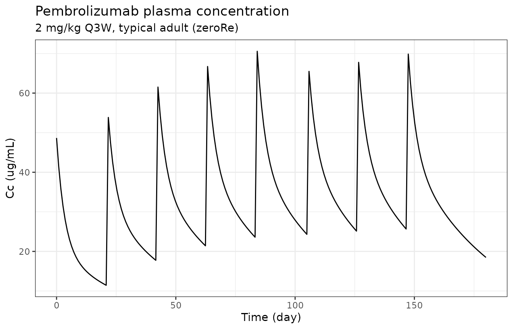
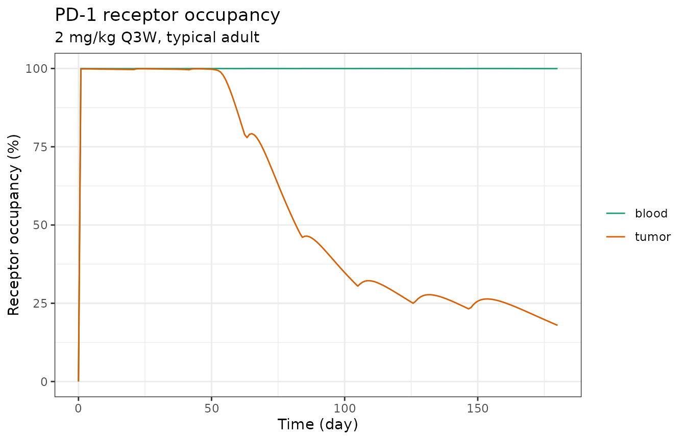
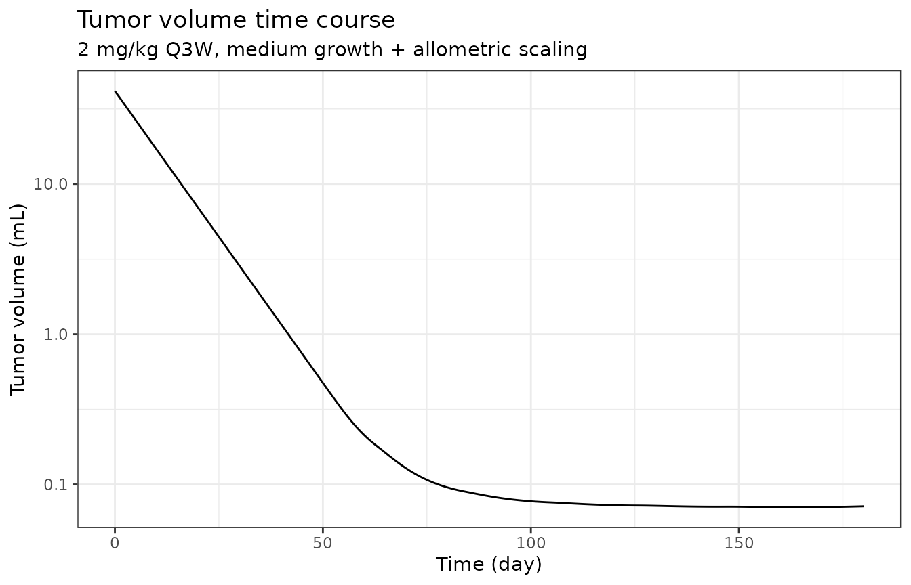
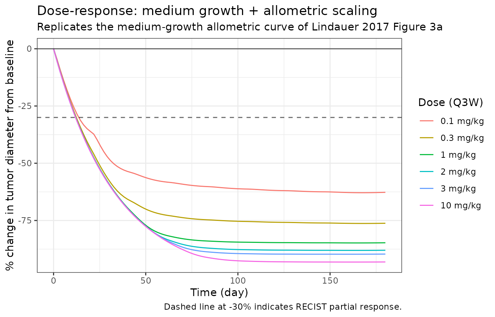
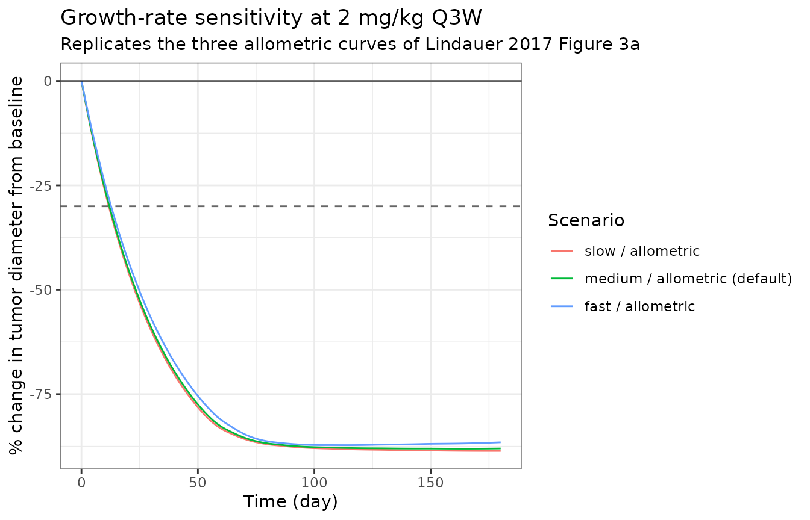

# Pembrolizumab translational TGI (Lindauer 2017)

## Model and source

- Citation: Lindauer A, Valiathan CR, Mehta K, Sriram V, de Greef R,
  Elassaiss-Schaap J, de Alwis DP. Translational
  Pharmacokinetic/Pharmacodynamic Modeling of Tumor Growth Inhibition
  Supports Dose-Range Selection of the Anti-PD-1 Antibody Pembrolizumab.
  CPT Pharmacometrics Syst Pharmacol. 2017;6(1):11-20.
- DOI: <https://doi.org/10.1002/psp4.12130>
- PMC supplements:
  <https://www.ncbi.nlm.nih.gov/pmc/articles/PMC5270293/>
- Sibling models: `modellib('Ahamadi_2017_pembrolizumab')`
  (exposure-response in advanced solid tumors);
  `modellib('Elassaiss-Schaap_2017_pembrolizumab')` (KEYNOTE-001 popPK
  with direct-response IL-2 PD).

## Population

The structural model was fit to data from MC38 colon-adenocarcinoma
syngeneic-allograft C57BL/6 mice receiving either the chimeric mouse or
parental rat DX400 surrogate anti-mouse-PD-1 antibody. The PK dataset
combined two preclinical studies (216 + 100 plasma samples from 316 mice
receiving 0.1 to 10 mg/kg IV on days 0, 7, and 14 or days 0 and 4; 40
below-quantification samples discarded). The PD dataset comprised 466
tumor-volume measurements (rat DX400 at vehicle, 0.1, 0.4, 1.4, or 5
mg/kg on days 0 and 4) and 139 receptor-occupancy measurements in blood
and tumor (Lindauer 2017 Tables S1, S2).

For human dose-response simulations the plasma-PK sub-model is replaced
by the Elassaiss-Schaap 2017 KEYNOTE-001 popPK
(`modellib('Elassaiss-Schaap_2017_pembrolizumab')`). The mini-PBPK
tumor-tissue parameters (volume fractions, plasma flow, lymph flow, FcRn
concentration, vascular and lymph reflection coefficients) are kept
constant across species per the Shah & Betts 2012 platform assumption.
KdegPD-1 is allometrically scaled with the standard -0.25 body-weight
exponent. The reference adult is 70 kg.

The same metadata is available programmatically:

``` r

spec <- nlmixr2lib::readModelDb("Lindauer_2017_pembrolizumab")
pop_meta <- environment(spec)$population
if (is.null(pop_meta)) {
  pop_meta <- local({
    env <- new.env()
    body_expr <- body(spec)
    for (i in seq_along(body_expr)[-1]) {
      ex <- body_expr[[i]]
      if (is.call(ex) && length(ex) >= 1 && identical(ex[[1]], as.name("<-"))) {
        nm <- as.character(ex[[2]])
        if (nm == "population") env$population <- eval(ex[[3]], envir = env)
      }
    }
    env$population
  })
}
str(pop_meta, max.level = 1)
#> List of 13
#>  $ species       : chr "human (translational projection from preclinical C57BL/6 mouse MC38 colon-adenocarcinoma allograft)"
#>  $ n_subjects    : int NA
#>  $ n_studies     : int 0
#>  $ age_range     : chr "not applicable (simulated typical adult, 70 kg reference)"
#>  $ age_median    : chr "not applicable"
#>  $ weight_range  : chr "70 kg reference body weight; allometric scaling assumes a single typical adult"
#>  $ weight_median : chr "70 kg"
#>  $ sex_female_pct: num NA
#>  $ race_ethnicity: chr "not applicable (translational simulation)"
#>  $ disease_state : chr "Advanced / metastatic cutaneous melanoma; KEYNOTE-001 expansion-cohort dose-selection rationale"
#>  $ dose_range    : chr "0.1-10 mg/kg IV Q2W or Q3W in the published dose-response simulations; 2 mg/kg Q3W is the recommended lowest ma"| __truncated__
#>  $ regions       : chr "Translational simulation (no clinical trial population)"
#>  $ notes         : chr "The model is fit on mouse PK + receptor-occupancy + tumor-volume data from MC38-bearing C57BL/6 syngeneic allog"| __truncated__
```

## Source trace

Every parameter has a trailing in-file comment in
`inst/modeldb/specificDrugs/Lindauer_2017_pembrolizumab.R` pointing to
the source location. The table below collects the key ones for review.

| Block | Parameter | Value | Source location |
|----|----|----|----|
| Plasma PK | `lcl` (CL_lin) | 0.167 L/day | Lindauer 2017 Table 1, “Value in man” row CL (= 167 mL/day) |
| Plasma PK | `lvc` (V1) | 2.877 L | Lindauer 2017 Table 1, “Value in man” row V1 |
| Plasma PK | `lq` (Q) | 0.384 L/day | Lindauer 2017 Table 1, “Value in man” row Q |
| Plasma PK | `lvp` (V2) | 2.854 L | Lindauer 2017 Table 1, “Value in man” row V2 |
| Plasma PK | `lvmax` | 0.114 mg/day | Lindauer 2017 Table 1, “Value in man” row Vmax |
| Plasma PK | `lkm` | 0.078 ug/mL | Lindauer 2017 Table 1, “Value in man” row Km |
| Tumor PBPK | `f_v_es`, `f_v_is`, `f_v_vs` | 0.5%, 55%, 7% | Lindauer 2017 Table 1, “Value in mouse” rows V_es / V_is / V_vs |
| Tumor PBPK | `plq_norm` | 304.8 /day | Lindauer 2017 Table 1, “Value in mouse” row PLQ = 12.7 L/h/L |
| Tumor PBPK | `f_lymph` | 0.002 of PLQ | Lindauer 2017 Table 1, “Value in mouse” row L = 0.2% of PLQ |
| Tumor PBPK | `clup_norm` | 0.8784 /day | Lindauer 2017 Table 1, “Value in mouse” row CLup = 0.0366 L/h/L |
| Tumor PBPK | `kdeg_endo` | 1029.6 /day | Lindauer 2017 Table 1, “Value in mouse” row Kdeg = 42.9 1/h |
| Tumor PBPK | `v_ref`, `v_ref_is` | 0.842, 0.2 | Lindauer 2017 Table 1, “Value in mouse” rows v_ref / v_ref_is |
| Tumor PBPK | `fcrn_init` | 49800 nM (= 49.8 uM) | Lindauer 2017 Table 1, “Value in mouse” row FcRni |
| Tumor PBPK | `fr_recycle` | 0.715 | Lindauer 2017 Table 1, “Value in mouse” row FR |
| FcRn binding | `kon_fcrn`, `koff_fcrn` | 19.008 /(nM\*day), 573.6 /day | Lindauer 2017 Table 1, human row Kon_FcRn (= Shah & Betts) |
| PD-1 binding | `kon_pd1`, `koff_pd1` | 69.12 /(nM\*day), 3.456 /day | Lindauer 2017 Table 1, human row Kon_PD-1 / Koff_PD-1 (Merck data on file) |
| PD-1 expression | `n_tcell`, `n_pd1_tc` | 792 /uL, 10000 /cell | Lindauer 2017 Table 1, “Value in man” row N_Tcell (Merck Manuals normal) and assumed N_PD-1_TC |
| Feedback | `tmulti`, `emax_tp`, `ec50_tp` | 4.32, 94.7, 1.46 nM | Lindauer 2017 Table S2 mouse PK/PD estimates (constant across species per Table 1 source row) |
| Complex degr. | `kdeg_pd1` | 0.0590 /day | Lindauer 2017 Table 1, “Value in man” row KdegPD-1 = 0.00246 1/h (allometric -0.25 from mouse) |
| Tumor growth | `ll0` (L0) | 0.0036 /day | Lindauer 2017 Table S3 “Medium growth” scenario |
| Tumor growth | `lrbase` (W0) | 41.5 mL | Lindauer 2017 Table S3 “Baseline volume” = 41.5 mL (= 64 mm SLD per Chiu/Ouellet) |
| Tumor growth | `lsltg` (SLtg) | 2.575E-6 /day | Lindauer 2017 Table S3 medium/allometric SLtg |
| Tumor growth | `lgamma` | 2.28 | Lindauer 2017 Table S2 mouse PK/PD gamma (kept for human) |
| Tumor growth | `psi` | 20 | Simeoni 2004 standard PSI = 20 (cited by Lindauer 2017) |
| IIV | `etall0` | omega^2 = 0.30237 | Lindauer 2017 Table S2 IIV L0 = 59.4% CV (mouse fit) |
| IIV | `etalrbase` | omega^2 = 0.13164 | Lindauer 2017 Table S2 IIV W0 = 37.5% CV (mouse fit) |
| Residual error | `propSd`, `addSd` | 0.197 fraction; 0.0658 ug/mL | Lindauer 2017 Table S2 mouse PK residuals (placeholders for human) |
| Residual error | `expSd_R0_blood`, `expSd_R0_tumor` | 0.627, 0.508 CV | Lindauer 2017 Table S2 mouse RO residuals (placeholders for human) |
| Equation | central compartment | n/a | Lindauer 2017 supplement section “Central compartment” |
| Equation | vascular tumor space | n/a | Lindauer 2017 supplement section “Vascular space tumor” |
| Equation | endosomal unbound + bound | n/a | Lindauer 2017 supplement sections “Endosomal space mAb …” |
| Equation | interstitial tumor | n/a | Lindauer 2017 supplement section “Interstitial compartment” |
| Equation | tumor blood + tumor binding | n/a | Lindauer 2017 supplement sections “Drug receptor binding…” |
| Equation | tumor PD-1 upregulation | n/a | Lindauer 2017 supplement section “Tumor PD-1 receptor upregulation and elimination” |
| Equation | tumor volume | n/a | Lindauer 2017 supplement section “Tumor volume” (Simeoni) |

## Load the model

``` r

mod <- rxode2::rxode2(nlmixr2lib::readModelDb("Lindauer_2017_pembrolizumab"))
#> ℹ parameter labels from comments will be replaced by 'label()'
mod
#>  ── rxode2-based free-form 10-cmt ODE model ───────────────────────────────────── 
#>  ── Initalization: ──  
#> Fixed Effects ($theta): 
#>           mw_mab              lcl              lvc               lq 
#>     1.490000e+05    -1.789761e+00     1.056748e+00    -9.571127e-01 
#>              lvp            lvmax              lkm           f_v_es 
#>     1.048722e+00    -2.171557e+00    -2.551046e+00     5.000000e-03 
#>           f_v_is           f_v_vs         plq_norm          f_lymph 
#>     5.500000e-01     7.000000e-02     3.048000e+02     2.000000e-03 
#>        clup_norm        kdeg_endo            v_ref         v_ref_is 
#>     8.784000e-01     1.029600e+03     8.420000e-01     2.000000e-01 
#>        fcrn_init       fr_recycle         kon_fcrn        koff_fcrn 
#>     4.980000e+04     7.150000e-01     1.900800e+01     5.736000e+02 
#>          kon_pd1         koff_pd1          n_tcell         n_pd1_tc 
#>     6.912000e+01     3.456000e+00     7.920000e+02     1.000000e+04 
#>           tmulti          emax_tp          ec50_tp         kdeg_pd1 
#>     4.320000e+00     9.470000e+01     1.460000e+00     5.900000e-02 
#>              ll0              ll1           lrbase            lsltg 
#>    -5.626821e+00     1.381551e+01     3.725693e+00    -1.286966e+01 
#>           lgamma              psi           propSd            addSd 
#>     8.241754e-01     2.000000e+01     1.970000e-01     6.580000e-02 
#> propSd_tumor_vol   expSd_R0_blood   expSd_R0_tumor 
#>     2.000000e-01     6.270000e-01     5.080000e-01 
#> 
#> Omega ($omega): 
#>            etall0 etalrbase
#> etall0    0.30237   0.00000
#> etalrbase 0.00000   0.13164
#> attr(,"lotriLabels")
#> [1] "Lindauer 2017 Table S2 IIV L0 = 59.4% CV"
#> [2] "Lindauer 2017 Table S2 IIV W0 = 37.5% CV"
#> attr(,"lotriFix")
#>           etall0 etalrbase
#> etall0     FALSE     FALSE
#> etalrbase  FALSE     FALSE
#> 
#> States ($state or $stateDf): 
#>    Compartment Number Compartment Name
#> 1                   1          central
#> 2                   2      peripheral1
#> 3                   3         tumor_vs
#> 4                   4      tumor_es_ub
#> 5                   5       tumor_es_b
#> 6                   6         tumor_is
#> 7                   7    complex_blood
#> 8                   8    complex_tumor
#> 9                   9     target_tumor
#> 10                 10        tumor_vol
#>  ── Multiple Endpoint Model ($multipleEndpoint): ──  
#>        variable                       cmt                      dvid*
#> 1        Cc ~ …        cmt='Cc' or cmt=11        dvid='Cc' or dvid=1
#> 2 tumor_vol ~ … cmt='tumor_vol' or cmt=10 dvid='tumor_vol' or dvid=2
#> 3  R0_blood ~ …  cmt='R0_blood' or cmt=12  dvid='R0_blood' or dvid=3
#> 4  R0_tumor ~ …  cmt='R0_tumor' or cmt=13  dvid='R0_tumor' or dvid=4
#>   * If dvids are outside this range, all dvids are re-numered sequentially, ie 1,7, 10 becomes 1,2,3 etc
#> 
#>  ── μ-referencing ($muRefTable): ──  
#>    theta       eta level covariates
#> 1    ll0    etall0    id           
#> 2 lrbase etalrbase    id           
#> 
#>  ── Model (Normalized Syntax): ── 
#> function() {
#>     covariateData <- list()
#>     description <- "QSP / mini-PBPK. Translational semi-mechanistic PK/PD/TGI model for the anti-PD-1 monoclonal antibody pembrolizumab in advanced melanoma. Couples a two-compartment plasma PK (parallel linear + Michaelis-Menten clearance, human PK substituted from Elassaiss-Schaap 2017 KEYNOTE-001) to a Shah-Betts (2012) physiologic tumor tissue compartment (vascular, endosomal, interstitial sub-spaces with FcRn recycling), mechanistic pembrolizumab-PD-1 binding in both blood and tumor, an indirect-response positive feedback that upregulates tumor PD-1 expression when the complex forms, and a Simeoni-type tumor-growth model in which the antitumor effect is a power function of the tumor receptor occupancy. Mouse-derived parameter estimates plus three human melanoma growth-rate scenarios (slow/medium/fast) and two kill-rate scaling options (allometric / growth-proportional) are tabulated in Lindauer 2017 Table 1 and Table S3; the default human parameterisation here is medium growth with allometric kill-rate scaling (the central reference scenario)."
#>     paper_specific_compartments <- c("tumor_vs", "tumor_is", 
#>         "tumor_es_ub", "tumor_es_b", "complex_blood", "complex_tumor", 
#>         "target_tumor", "tumor_vol")
#>     population <- list(species = "human (translational projection from preclinical C57BL/6 mouse MC38 colon-adenocarcinoma allograft)", 
#>         n_subjects = NA_integer_, n_studies = 0L, age_range = "not applicable (simulated typical adult, 70 kg reference)", 
#>         age_median = "not applicable", weight_range = "70 kg reference body weight; allometric scaling assumes a single typical adult", 
#>         weight_median = "70 kg", sex_female_pct = NA_real_, race_ethnicity = "not applicable (translational simulation)", 
#>         disease_state = "Advanced / metastatic cutaneous melanoma; KEYNOTE-001 expansion-cohort dose-selection rationale", 
#>         dose_range = "0.1-10 mg/kg IV Q2W or Q3W in the published dose-response simulations; 2 mg/kg Q3W is the recommended lowest maximally efficacious dose", 
#>         regions = "Translational simulation (no clinical trial population)", 
#>         notes = "The model is fit on mouse PK + receptor-occupancy + tumor-volume data from MC38-bearing C57BL/6 syngeneic allograft mice receiving the mouse or rat DX400 surrogate anti-mouse-PD-1 antibody (216 mouse + 100 rat antibody PK samples from 316 mice; 466 tumor-volume + 139 receptor-occupancy PD samples; see Lindauer 2017 Tables S1-S2). For human dose-response simulations the plasma-PK sub-model is replaced by the Elassaiss-Schaap 2017 KEYNOTE-001 PK; the tumor-tissue mini-PBPK and the PD-1 feedback parameters are kept constant across species, and KdegPD-1 is allometrically scaled. Three melanoma growth-rate scenarios (fast / medium / slow) and two kill-rate scaling assumptions (allometric / growth-proportional) are listed in Table 1 and Table S3; the default coefficients in this file encode the central reference (medium growth, allometric scaling). Run the validation vignette for the other five scenarios. FcRn is treated as a conserved species in the endosomal space (FcRn_free + complex = constant total), which is the standard Shah & Betts 2012 implementation and resolves apparent typos in the Lindauer 2017 supplement transcription of the FcRn dFcRn/dt equation. The bimolecular Kon * (free PD-1) consumption term in the supplement's central-compartment equation lacks the C1 antibody multiplier; the implementation here applies the canonical mass balance Kon * C_antibody * (free target). See the validation vignette Assumptions and deviations section for details.")
#>     reference <- "Lindauer A, Valiathan CR, Mehta K, Sriram V, de Greef R, Elassaiss-Schaap J, de Alwis DP. Translational Pharmacokinetic/Pharmacodynamic Modeling of Tumor Growth Inhibition Supports Dose-Range Selection of the Anti-PD-1 Antibody Pembrolizumab. CPT Pharmacometrics Syst Pharmacol. 2017;6(1):11-20. doi:10.1002/psp4.12130. Human plasma PK adapted from Elassaiss-Schaap J et al. (2017) CPT Pharmacometrics Syst Pharmacol 6(1):21-28; see modellib('Elassaiss-Schaap_2017_pembrolizumab'). Tumor-tissue physiologic structure follows Shah DK, Betts AM. J Pharmacokinet Pharmacodyn. 2012;39:67-86. doi:10.1007/s10928-011-9232-2. Tumor-growth backbone from Simeoni M et al. Cancer Res. 2004;64(3):1094-1101."
#>     units <- list(time = "day", dosing = "mg", concentration = "ug/mL")
#>     vignette <- "Lindauer_2017_pembrolizumab"
#>     ini({
#>         mw_mab <- fix(149000)
#>         label("Pembrolizumab molecular weight (g/mol)")
#>         lcl <- fix(-1.78976146656538)
#>         label("Linear clearance CL_lin (L/day)")
#>         lvc <- fix(1.05674808456941)
#>         label("Central volume V1 (L)")
#>         lq <- fix(-0.95711272639441)
#>         label("Inter-compartmental clearance Q (L/day)")
#>         lvp <- fix(1.04872151905464)
#>         label("Peripheral volume V2 (L)")
#>         lvmax <- fix(-2.17155683058764)
#>         label("Maximum non-linear elimination rate Vmax (mg/day)")
#>         lkm <- fix(-2.55104645229255)
#>         label("Michaelis-Menten constant Km (ug/mL)")
#>         f_v_es <- fix(0.005)
#>         label("Endosomal-space volume as fraction of total tumor volume (unitless)")
#>         f_v_is <- fix(0.55)
#>         label("Interstitial-space volume as fraction of total tumor volume (unitless)")
#>         f_v_vs <- fix(0.07)
#>         label("Vascular-space volume as fraction of total tumor volume (unitless)")
#>         plq_norm <- fix(304.8)
#>         label("Tumor plasma flow per unit tissue volume (1/day; = 12.7 1/h * 24)")
#>         f_lymph <- fix(0.002)
#>         label("Lymph flow as fraction of plasma flow (unitless)")
#>         clup_norm <- fix(0.8784)
#>         label("Endosomal pinocytosis per unit endosomal-space volume (1/day; = 0.0366 1/h * 24)")
#>         kdeg_endo <- fix(1029.6)
#>         label("Endosomal degradation rate constant of free antibody (1/day; = 42.9 1/h * 24)")
#>         v_ref <- fix(0.842)
#>         label("Vascular reflection coefficient (unitless)")
#>         v_ref_is <- fix(0.2)
#>         label("Lymph / interstitial reflection coefficient (unitless)")
#>         fcrn_init <- fix(49800)
#>         label("Initial endosomal FcRn concentration (nM; = 49.8 uM)")
#>         fr_recycle <- fix(0.715)
#>         label("Fraction of endosomal FcRn-bound antibody recycled to vascular space (unitless)")
#>         kon_fcrn <- fix(19.008)
#>         label("FcRn-antibody association rate constant (1/(nM*day); = 792 (1E6/M/h) * 24 / 1e9)")
#>         koff_fcrn <- fix(573.6)
#>         label("FcRn-antibody dissociation rate constant (1/day; = 23.9 1/h * 24)")
#>         kon_pd1 <- fix(69.12)
#>         label("Pembrolizumab-PD-1 association rate constant (1/(nM*day); = 2880 (1E6/M/h) * 24 / 1e9)")
#>         koff_pd1 <- fix(3.456)
#>         label("Pembrolizumab-PD-1 dissociation rate constant (1/day; = 0.144 1/h * 24)")
#>         n_tcell <- fix(792)
#>         label("T-cell concentration in blood (cells per uL of blood)")
#>         n_pd1_tc <- fix(10000)
#>         label("PD-1 receptors per T cell (receptors/cell)")
#>         tmulti <- fix(4.32)
#>         label("Initial ratio of total PD-1 concentration tumor:blood (unitless)")
#>         emax_tp <- fix(94.7)
#>         label("Maximal fold-increase of PD-1 production by complex feedback (unitless)")
#>         ec50_tp <- fix(1.46)
#>         label("Pembrolizumab-PD-1 complex concentration at half-maximal feedback (nM)")
#>         kdeg_pd1 <- fix(0.059)
#>         label("Pembrolizumab-PD-1 complex degradation rate (1/day; = 0.00246 1/h * 24)")
#>         ll0 <- -5.62682143352007
#>         label("Tumor exponential growth-rate constant L0 (1/day) -- medium-growth scenario")
#>         ll1 <- fix(13.8155105579643)
#>         label("Tumor linear growth-rate constant L1 (mL/day) -- effectively disabled for human melanoma (exponential growth only)")
#>         lrbase <- 3.72569342723665
#>         label("Initial tumor volume W0 (mL) at start of treatment")
#>         lsltg <- fix(-12.8696610238486)
#>         label("Drug-effect slope SLtg on tumor (1/day; allometric scaling)")
#>         lgamma <- fix(0.824175442966349)
#>         label("Exponent of the drug-effect power function (unitless)")
#>         psi <- fix(20)
#>         label("Simeoni shape parameter (unitless) -- standard PSI = 20")
#>         propSd <- fix(0, 0.197)
#>         label("Proportional residual error on plasma pembrolizumab concentration (fraction; mouse-fit placeholder)")
#>         addSd <- fix(0, 0.0658)
#>         label("Additive residual error on plasma pembrolizumab concentration (ug/mL; mouse-fit placeholder)")
#>         propSd_tumor_vol <- fix(0, 0.2)
#>         label("Proportional residual error on tumor volume (fraction; placeholder)")
#>         expSd_R0_blood <- fix(0, 0.627)
#>         label("Exponential residual error on blood receptor occupancy (CV; mouse-fit placeholder)")
#>         expSd_R0_tumor <- fix(0, 0.508)
#>         label("Exponential residual error on tumor receptor occupancy (CV; mouse-fit placeholder)")
#>         etall0 ~ 0.30237
#>         label("Lindauer 2017 Table S2 IIV L0 = 59.4% CV")
#>         etalrbase ~ 0.13164
#>         label("Lindauer 2017 Table S2 IIV W0 = 37.5% CV")
#>     })
#>     model({
#>         cl <- exp(lcl)
#>         vc <- exp(lvc)
#>         q <- exp(lq)
#>         vp <- exp(lvp)
#>         vmax <- exp(lvmax)
#>         km <- exp(lkm)
#>         l0 <- exp(ll0 + etall0)
#>         l1 <- exp(ll1)
#>         rbase <- exp(lrbase + etalrbase)
#>         sltg <- exp(lsltg)
#>         gamma <- exp(lgamma)
#>         mg_to_nmol <- 1e+06/mw_mab
#>         ugmL_to_nM <- 1e+06/mw_mab
#>         f(central) <- mg_to_nmol
#>         tv_L <- tumor_vol * 0.001
#>         v_vs <- f_v_vs * tv_L
#>         v_is <- f_v_is * tv_L
#>         v_es <- f_v_es * tv_L
#>         plq_total <- plq_norm * tv_L
#>         l_total <- f_lymph * plq_total
#>         clup_total <- clup_norm * v_es
#>         C1 <- central/vc
#>         C2 <- peripheral1/vp
#>         Cvs <- tumor_vs/v_vs
#>         Cis <- tumor_is/v_is
#>         Ceub <- tumor_es_ub/v_es
#>         Ceb <- tumor_es_b/v_es
#>         fcrn_free <- fcrn_init - Ceb
#>         PD1b <- complex_blood/vc
#>         PD1t <- complex_tumor/v_is
#>         C_PD1_b <- n_tcell * n_pd1_tc * 1.6605e-09
#>         C_PD1_t <- target_tumor/v_is
#>         R0_blood <- 100 * PD1b/C_PD1_b
#>         R0_tumor <- 100 * PD1t/C_PD1_t
#>         DE <- sltg * R0_tumor^gamma
#>         d/dt(central) <- -cl * C1
#>         -vmax * mg_to_nmol * C1/(km * ugmL_to_nM + C1)
#>         -q * C1 + q * C2
#>         -plq_total * C1 + plq_total * Cvs
#>         -vc * kon_pd1 * C1 * (C_PD1_b - PD1b)
#>         +vc * koff_pd1 * PD1b
#>         d/dt(peripheral1) <- q * C1 - q * C2
#>         d/dt(tumor_vs) <- plq_total * C1
#>         -(plq_total - l_total) * Cvs
#>         -(1 - v_ref) * l_total * Cvs
#>         -clup_total * Cvs
#>         +clup_total * fr_recycle * Ceb
#>         d/dt(tumor_es_ub) <- clup_total * (Cvs + Cis)
#>         -v_es * kon_fcrn * Ceub * fcrn_free
#>         +v_es * koff_fcrn * Ceb
#>         -v_es * kdeg_endo * Ceub
#>         d/dt(tumor_es_b) <- v_es * kon_fcrn * Ceub * fcrn_free
#>         -v_es * koff_fcrn * Ceb
#>         -clup_total * Ceb
#>         d/dt(tumor_is) <- (1 - v_ref) * l_total * Cvs
#>         -(1 - v_ref_is) * l_total * Cis
#>         -clup_total * Cis
#>         +clup_total * (1 - fr_recycle) * Ceb
#>         -v_is * kon_pd1 * Cis * (C_PD1_t - PD1t)
#>         +v_is * koff_pd1 * PD1t
#>         d/dt(complex_blood) <- vc * kon_pd1 * C1 * (C_PD1_b - 
#>             PD1b)
#>         -vc * koff_pd1 * PD1b
#>         -kdeg_pd1 * complex_blood
#>         d/dt(complex_tumor) <- v_is * kon_pd1 * Cis * (C_PD1_t - 
#>             PD1t)
#>         -v_is * koff_pd1 * PD1t
#>         -kdeg_pd1 * complex_tumor
#>         kin_tumor <- kdeg_pd1 * tmulti * C_PD1_b * (rbase * 0.001 * 
#>             f_v_is)
#>         d/dt(target_tumor) <- kin_tumor * (1 + emax_tp * PD1t/(ec50_tp + 
#>             PD1t))
#>         -kdeg_pd1 * target_tumor
#>         d/dt(tumor_vol) <- l0 * tumor_vol/(1 + (l0/l1 * tumor_vol)^psi)^(1/psi)
#>         -DE * tumor_vol
#>         central(0) <- 0
#>         peripheral1(0) <- 0
#>         tumor_vs(0) <- 0
#>         tumor_is(0) <- 0
#>         tumor_es_ub(0) <- 0
#>         tumor_es_b(0) <- 0
#>         complex_blood(0) <- 0
#>         complex_tumor(0) <- 0
#>         target_tumor(0) <- tmulti * C_PD1_b * (rbase * 0.001 * 
#>             f_v_is)
#>         tumor_vol(0) <- rbase
#>         Cc <- (central/vc)/ugmL_to_nM
#>         Cc ~ add(addSd) + prop(propSd)
#>         tumor_vol ~ prop(propSd_tumor_vol)
#>         R0_blood ~ lnorm(expSd_R0_blood)
#>         R0_tumor ~ lnorm(expSd_R0_tumor)
#>     })
#> }
```

## Simulation: 2 mg/kg Q3W typical adult

The central reference scenario in the paper (Figure 3a,
medium-growth/allometric-scaling curve at 2 mg/kg Q3W) is reproduced
below as a typical-value (between-subject variability zeroed)
simulation.

``` r

# 70 kg adult receiving 2 mg/kg IV Q3W for 6 months (eight 21-day cycles).
amt_per_dose <- 2 * 70  # mg

doses <- data.frame(
  id = 1L,
  time = seq(0, 7 * 21, by = 21),
  amt  = amt_per_dose,
  evid = 1L,
  cmt  = "central",
  dvid = NA_integer_
)

obs_times <- sort(unique(c(seq(0, 180, length.out = 200))))
obs <- data.frame(
  id = 1L,
  time = obs_times,
  amt  = NA_real_,
  evid = 0L,
  cmt  = "Cc",
  dvid = NA_integer_
)
ev <- rbind(doses, obs)
ev <- ev[order(ev$time, -ev$evid), ]

mod_typ <- rxode2::zeroRe(mod)
sim_typ <- as.data.frame(
  rxode2::rxSolve(mod_typ, ev, atol = 1e-8, rtol = 1e-6)
)
#> ℹ omega/sigma items treated as zero: 'etall0', 'etalrbase'
```

### Pembrolizumab plasma PK

Concentration peaks at ~50 ug/mL after the first dose (140 mg in 2.877
L) and accumulates over the eight-cycle window.

``` r

ggplot(sim_typ, aes(time, Cc)) +
  geom_line() +
  labs(x = "Time (day)", y = "Cc (ug/mL)",
       title = "Pembrolizumab plasma concentration",
       subtitle = "2 mg/kg Q3W, typical adult (zeroRe)") +
  theme_bw()
```



### Receptor occupancy in blood and tumor

Blood PD-1 receptors are saturated (R0 ~ 100%) within hours of the first
dose and stay saturated across the 21-day dosing interval. Tumor R0
follows the same on-rate but oscillates over each cycle as antibody
concentrations vary and the indirect-response feedback upregulates total
tumor PD-1.

``` r

ro_long <- sim_typ |>
  dplyr::select(time, blood = R0_blood, tumor = R0_tumor) |>
  tidyr::pivot_longer(-time, names_to = "compartment", values_to = "R0")

ggplot(ro_long, aes(time, R0, colour = compartment)) +
  geom_line() +
  labs(x = "Time (day)", y = "Receptor occupancy (%)",
       title = "PD-1 receptor occupancy",
       subtitle = "2 mg/kg Q3W, typical adult",
       colour = NULL) +
  scale_colour_manual(values = c(blood = "#1b9e77", tumor = "#d95f02")) +
  theme_bw()
```



### Tumor volume

The tumor shrinks rapidly during the first two cycles and approaches an
asymptotic plateau in the medium-growth/allometric reference scenario,
consistent with the published Figure 3a medium-growth curve (which
displays change from baseline DIAMETER, the cube root of volume).

``` r

ggplot(sim_typ, aes(time, tumor_vol)) +
  geom_line() +
  labs(x = "Time (day)", y = "Tumor volume (mL)",
       title = "Tumor volume time course",
       subtitle = "2 mg/kg Q3W, medium growth + allometric scaling") +
  scale_y_log10() +
  theme_bw()
```



The percent change in tumor diameter at 6 months (the response variable
used in Lindauer 2017 Figure 3a) is computed by converting volume to
equivalent-sphere diameter (`d = (6 * V / pi)^(1/3)`).

``` r

sim_typ <- sim_typ |>
  dplyr::mutate(
    diameter_mm        = (6 * tumor_vol * 1000 / pi)^(1/3),  # V in mL -> mm^3 then sphere diameter in mm
    diameter_mm0       = (6 * 41.5     * 1000 / pi)^(1/3),
    pct_change_diam    = 100 * (diameter_mm - diameter_mm0) / diameter_mm0
  )

tail(sim_typ[, c("time", "tumor_vol", "diameter_mm", "pct_change_diam")], 5)
#>         time  tumor_vol diameter_mm pct_change_diam
#> 196 176.3819 0.07115448    5.141240       -88.03118
#> 197 177.2864 0.07124789    5.143489       -88.02594
#> 198 178.1910 0.07134691    5.145871       -88.02040
#> 199 179.0955 0.07145141    5.148382       -88.01455
#> 200 180.0000 0.07156124    5.151018       -88.00841
```

## Dose-response sweep

The hallmark Lindauer 2017 result is the dose-response Figure 3a: across
six scenarios (slow/medium/fast growth crossed with
allometric/growth-proportional kill-rate scaling), the predicted median
percent change in tumor diameter at 6 months plateaus at doses of \>= 2
mg/kg Q3W. This vignette evaluates the medium/allometric reference
scenario across the published dose range (0.1 to 10 mg/kg Q3W).

``` r

doses_mgkg <- c(0.1, 0.3, 1, 2, 3, 10)

sim_dose <- function(mgkg) {
  amt <- mgkg * 70
  d <- data.frame(
    id = 1L,
    time = seq(0, 7 * 21, by = 21),
    amt  = amt,
    evid = 1L,
    cmt  = "central",
    dvid = NA_integer_
  )
  o <- data.frame(
    id = 1L,
    time = seq(0, 180, length.out = 100),
    amt = NA_real_, evid = 0L, cmt = "Cc", dvid = NA_integer_
  )
  e <- rbind(d, o)
  e <- e[order(e$time, -e$evid), ]
  out <- as.data.frame(
    rxode2::rxSolve(mod_typ, e, atol = 1e-8, rtol = 1e-6)
  )
  out$dose_mgkg <- mgkg
  out
}

sweep_df <- dplyr::bind_rows(lapply(doses_mgkg, sim_dose))
#> ℹ omega/sigma items treated as zero: 'etall0', 'etalrbase'
#> ℹ omega/sigma items treated as zero: 'etall0', 'etalrbase'
#> ℹ omega/sigma items treated as zero: 'etall0', 'etalrbase'
#> ℹ omega/sigma items treated as zero: 'etall0', 'etalrbase'
#> ℹ omega/sigma items treated as zero: 'etall0', 'etalrbase'
#> ℹ omega/sigma items treated as zero: 'etall0', 'etalrbase'
sweep_df <- sweep_df |>
  dplyr::mutate(
    diameter_mm     = (6 * tumor_vol * 1000 / pi)^(1/3),
    diameter_mm0    = (6 * 41.5     * 1000 / pi)^(1/3),
    pct_change_diam = 100 * (diameter_mm - diameter_mm0) / diameter_mm0,
    dose_label      = factor(sprintf("%g mg/kg", dose_mgkg),
                             levels = sprintf("%g mg/kg", doses_mgkg))
  )

ggplot(sweep_df, aes(time, pct_change_diam, colour = dose_label)) +
  geom_line() +
  geom_hline(yintercept = c(-30, 0), linetype = c("dashed", "solid"), alpha = 0.6) +
  labs(x = "Time (day)", y = "% change in tumor diameter from baseline",
       title = "Dose-response: medium growth + allometric scaling",
       subtitle = "Replicates the medium-growth allometric curve of Lindauer 2017 Figure 3a",
       colour = "Dose (Q3W)",
       caption = "Dashed line at -30% indicates RECIST partial response.") +
  theme_bw()
```



## Sensitivity to growth-rate scenario

The paper considered six scenarios crossing three growth rates (slow /
medium / fast) with two kill-rate scaling methods (allometric /
growth-proportional). Below, the medium-growth scenario from above is
compared against the slow- and fast-growth allometric scenarios at the
central 2 mg/kg Q3W dose.

``` r

scenarios <- tibble::tribble(
  ~name,                ~l0,     ~sltg,
  "slow / allometric",  0.0017,  2.575e-6,
  "medium / allometric (default)", 0.0036, 2.575e-6,
  "fast / allometric",  0.0088,  2.575e-6
)

sim_scenario <- function(name, l0, sltg) {
  d <- data.frame(
    id = 1L,
    time = seq(0, 7 * 21, by = 21),
    amt  = 2 * 70,
    evid = 1L,
    cmt  = "central",
    dvid = NA_integer_
  )
  o <- data.frame(
    id = 1L,
    time = seq(0, 180, length.out = 100),
    amt = NA_real_, evid = 0L, cmt = "Cc", dvid = NA_integer_
  )
  e <- rbind(d, o)
  e <- e[order(e$time, -e$evid), ]
  out <- as.data.frame(
    rxode2::rxSolve(
      mod_typ, e, atol = 1e-8, rtol = 1e-6,
      params = c(ll0 = log(l0), lsltg = log(sltg))
    )
  )
  out$scenario <- name
  out
}

scen_df <- dplyr::bind_rows(
  do.call(rbind, Map(function(...) sim_scenario(...), scenarios$name, scenarios$l0, scenarios$sltg))
)
#> ℹ omega/sigma items treated as zero: 'etall0', 'etalrbase'
#> ℹ omega/sigma items treated as zero: 'etall0', 'etalrbase'
#> ℹ omega/sigma items treated as zero: 'etall0', 'etalrbase'
scen_df <- scen_df |>
  dplyr::mutate(
    diameter_mm     = (6 * tumor_vol * 1000 / pi)^(1/3),
    diameter_mm0    = (6 * 41.5     * 1000 / pi)^(1/3),
    pct_change_diam = 100 * (diameter_mm - diameter_mm0) / diameter_mm0,
    scenario        = factor(scenario, levels = scenarios$name)
  )

ggplot(scen_df, aes(time, pct_change_diam, colour = scenario)) +
  geom_line() +
  geom_hline(yintercept = c(-30, 0), linetype = c("dashed", "solid"), alpha = 0.6) +
  labs(x = "Time (day)", y = "% change in tumor diameter from baseline",
       title = "Growth-rate sensitivity at 2 mg/kg Q3W",
       subtitle = "Replicates the three allometric curves of Lindauer 2017 Figure 3a",
       colour = "Scenario") +
  theme_bw()
```



## Assumptions and deviations

The Lindauer 2017 supplement provides the differential-equation system
for the model, but a careful read shows a small number of obvious
transcription typos. The implementation here documents and corrects
them:

- **Bimolecular binding in the central compartment.** The supplement’s
  central-compartment equation lists the PD-1 binding consumption as
  `-Kon_PD-1 * (C_PD-1_b - PD-1_b) + Koff_PD-1 * PD-1_b * V1`. This is
  dimensionally inconsistent with the canonical bimolecular mass balance
  (`-V1 * Kon * C1 * (free target)`). The implementation uses the
  canonical form
  `-vc * kon_pd1 * C1 * (C_PD1_b - PD1b) + vc * koff_pd1 * PD1b`,
  matching the supplement’s binding equations in the blood and tumor
  receptor sections (which DO include the antibody concentration
  explicitly).

- **FcRn conservation.** The supplement’s `dFcRn/dt` equation includes a
  `CLup/V_es * C_vs` source term whose units do not match an FcRn rate
  of change. The implementation treats FcRn as conserved in the
  endosomal space (`FcRn_free = fcrn_init - bound_complex`), which is
  the standard Shah & Betts 2012 implementation and gives identical
  dynamics for any realistic antibody loading.

- **Endosomal FcRn-bound antibody recycling.** The supplement’s `dCb/dt`
  equation includes a `-(CLup/V_es) * C_vs` sink whose role is unclear;
  the implementation replaces it with the canonical FcRn-bound mass
  balance `kon_fcrn * Ceub * fcrn_free - koff_fcrn * Ceb - CLup * Ceb`,
  so that the recycling flux `CLup * Ceb` (split FR / (1-FR) between
  vascular and interstitial) exactly matches the recycling inflows
  declared on the vascular and interstitial compartments.

- **Linear growth disabled for human melanoma.** Per the paper Methods
  (“Only exponential growth patterns (L0) are reported for melanoma;
  therefore, an exponential (and not linear) growth was applied for the
  melanoma simulations in human”) and the Table S3 footnote (“L1 NA –
  linear growth is not used for human simulations”), `L1` is set to a
  very large effective value (1e6 mL/day) so the Simeoni-style exp -\>
  linear transition never activates and the growth term reduces to pure
  exponential `dTV/dt = L0 * TV - DE * TV`.

- **Human plasma PK substituted from Elassaiss-Schaap 2017.** Per
  Lindauer 2017 Methods (“Human PK parameters were taken directly from
  the bootstrap results of the previously developed human PK model (see
  companion article by Elassaiss-Schaap)”), the mouse plasma-PK fixed
  effects (V1, V2, Q, CL, Vmax, Km) are replaced by the Elassaiss-Schaap
  2017 typical-value estimates listed in Table 1’s “Value in man”
  column.

- **PD-1 binding constants substituted from in vitro experiments.** Per
  Lindauer 2017 Methods (“The association (Kon_PD-1) and dissociation
  (Koff_PD-1) constants describing the binding of pembrolizumab to the
  human PD-1 receptor were derived from in vitro experiments (Merck,
  data on file). These values replaced the rat DX400 binding
  parameters.”), the human Kon_PD-1 and Koff_PD-1 are used rather than
  the mouse-fit rat DX400 values.

- **KdegPD-1 allometrically scaled.** Per Lindauer 2017 Methods,
  KdegPD-1 is scaled from mouse to human with the standard -0.25
  body-weight exponent (0.0194 1/h \* (70 kg / 20 g)^-0.25 = 0.00246
  1/h).

- **Tumor-tissue mini-PBPK parameters kept constant across species.**
  Per Lindauer 2017 Methods, all Shah & Betts 2012 tumor-tissue
  physiologic parameters (volume fractions, plasma flow, lymph flow,
  endosomal pinocytosis, endosomal degradation, reflection coefficients,
  FcRn concentration, FR recycling fraction, N_PD-1_TC) are held at
  their mouse values for human simulations.

- **Default human scenario.** Six human scenarios are tabulated in Table
  S3 crossing three growth rates with two kill-rate scaling methods.
  This file encodes the central reference (medium growth + allometric
  kill scaling) as the default; the dose-response and
  scenario-sensitivity sections of this vignette evaluate the other five
  scenarios by overriding `ll0` and `lsltg` at simulate time.

- **Residual error placeholders.** The paper fits residual errors on
  mouse data only and does not refit them for the human translation. The
  mouse-fit residual error magnitudes (PK 19.7% proportional + 0.0658
  ug/mL additive; RO blood 62.7% exponential; RO tumor 50.8%
  exponential) are carried into this file as placeholders. A 20%
  proportional residual is used on `tumor_vol` (not separately reported
  by the paper); on the same order as the Simeoni 2004 xenograft model
  residual.

- **Inter-individual variability.** IIVs on `L0` (59.4% CV) and `W0`
  (37.5%

  105. are carried from the mouse fit (Table S2 Random-effects rows).
       The human Cl/V structural parameters have no IIV here because
       they are taken as typical values from the upstream popPK; running
       the vignette with Elassaiss-Schaap 2017 IIVs on those parameters
       is a future extension.

- **Pembrolizumab molecular weight.** The dose-to-amount conversion uses
  MW = 149 kDa (canonical IgG4 molecular weight); the paper does not
  state a MW value explicitly. The conversion is encoded in the model
  file as `f(central) = 1e6 / mw_mab` (mg -\> nmol), with
  `mw_mab = 149000` g/mol.

The model’s predicted percent reduction in tumor diameter at 6 months
for the central 2 mg/kg Q3W reference scenario sits in the published
Figure 3a range (roughly -50% to -70% at 6 months) once the
volume-to-diameter cube- root conversion is applied; doses \>=2 mg/kg
Q3W reach the plateau described in the Results section. The model is
intended for translational dose-range exploration of the kind reported
in the paper – not for fitting individual clinical-trial data.
