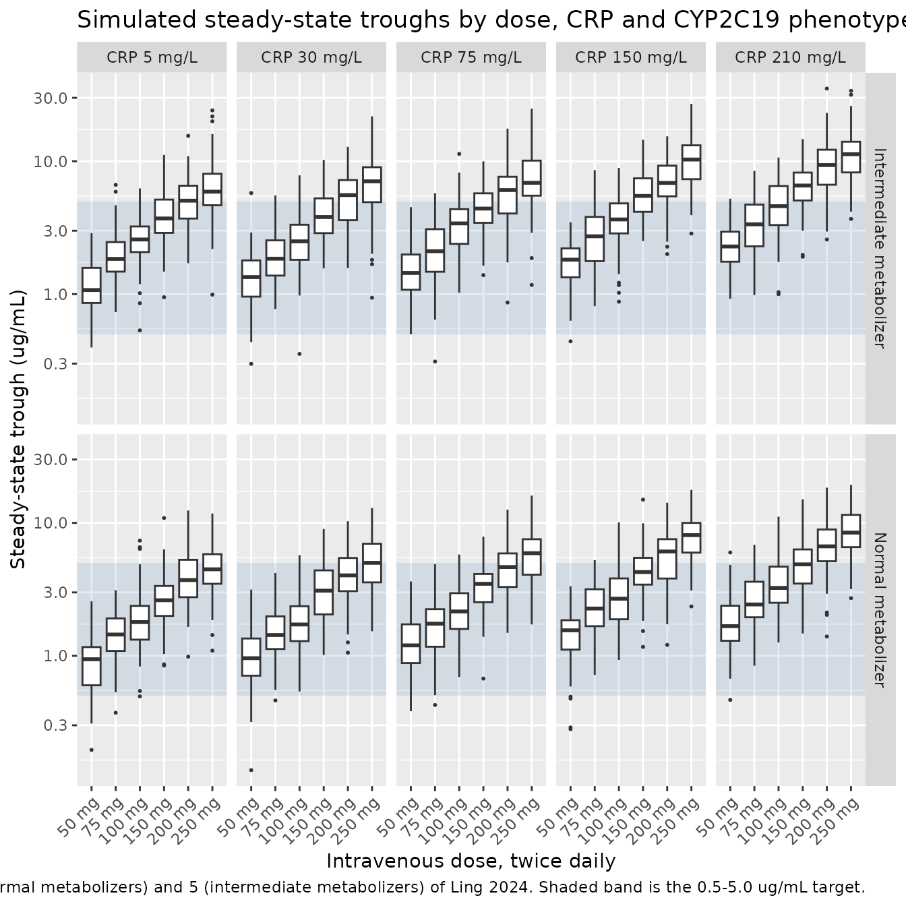

# Voriconazole (Ling 2024)

## Model and source

- Citation: Ling J, Yang X, Dong L, Jiang Y, Zou S, Hu N. Influence of
  C-reactive protein on the pharmacokinetics of voriconazole in relation
  to the CYP2C19 genotype: a population pharmacokinetics analysis. Front
  Pharmacol. 2024;15:1455721. <doi:10.3389/fphar.2024.1455721>
- Description: One-compartment population pharmacokinetic model with
  first-order absorption for intravenous and oral voriconazole in
  Chinese adults with invasive fungal infections (Ling 2024); C-reactive
  protein enters clearance as an exponential inflammation effect that is
  switched off in CYP2C19 poor metabolizers, alongside CYP2C19
  phenotype, age, serum albumin and sex effects on clearance and a
  power-form body-weight effect on volume of distribution.
- Article: <https://doi.org/10.3389/fphar.2024.1455721>

Ling and colleagues fitted a one-compartment model with first-order
absorption and linear elimination to 232 steady-state trough
concentrations from 167 Chinese adults treated with intravenous or oral
voriconazole for invasive fungal infection. The paper’s distinguishing
feature is that the effect of inflammation – carried by C-reactive
protein (CRP) – on voriconazole clearance is made conditional on the
CYP2C19 metabolizer phenotype: CRP suppresses clearance in normal and
intermediate metabolizers, but the separately-fitted poor-metabolizer
coefficient was negligible (-0.0172, a 3% clearance change across CRP 1
to 100 mg/L) and the term was dropped for those patients.

``` r

mod <- readModelDb("Ling_2024_voriconazole")
mod
#> function() {
#>   description <- "One-compartment population pharmacokinetic model with first-order absorption for intravenous and oral voriconazole in Chinese adults with invasive fungal infections (Ling 2024); C-reactive protein enters clearance as an exponential inflammation effect that is switched off in CYP2C19 poor metabolizers, alongside CYP2C19 phenotype, age, serum albumin and sex effects on clearance and a power-form body-weight effect on volume of distribution."
#>   reference <- "Ling J, Yang X, Dong L, Jiang Y, Zou S, Hu N. Influence of C-reactive protein on the pharmacokinetics of voriconazole in relation to the CYP2C19 genotype: a population pharmacokinetics analysis. Front Pharmacol. 2024;15:1455721. doi:10.3389/fphar.2024.1455721"
#>   vignette <- "Ling_2024_voriconazole"
#>   units <- list(time = "h", dosing = "mg", concentration = "ug/mL")
#> 
#>   compartmentData <- list(
#>     depot   = list(analyte = "voriconazole", units = "mg", specimen = "administration site", verified = TRUE),
#>     central = list(analyte = "voriconazole", units = "mg", specimen = "plasma", verified = TRUE)
#>   )
#> 
#>   covariateData <- list(
#>     CRP = list(
#>       description        = "C-reactive protein concentration (standard clinical assay), time-varying: Ling 2024 recorded CRP on the same day as each therapeutic-drug-monitoring sample",
#>       units              = "mg/L",
#>       type               = "continuous",
#>       reference_category = NULL,
#>       notes              = paste(
#>         "Enters CL as an exponential effect scaled by the cohort-median CRP of 59 mg/L",
#>         "(Table 1 reports median 58.85 mg/L, rounded to 59 in the published final-model equation):",
#>         "exp(e_crp_cl * CRP / 59). Note this is a median-SCALED but not median-CENTERED form -- the",
#>         "printed typical CL of 3.83 L/h is therefore the value at CRP = 0, not at the median CRP.",
#>         "At the median CRP the typical CL is 3.83 * exp(-0.155) = 3.28 L/h. The uncentered reading is",
#>         "confirmed by the paper's own Monte Carlo target-attainment percentages; see the model vignette.",
#>         "The effect is multiplied by (1 - CYP2C19_PM) because Ling 2024 estimated the CRP effect only in",
#>         "CYP2C19 normal and intermediate metabolizers -- the separately-fitted PM exponent was -0.0172",
#>         "(a 3% CL change over CRP 1 to 100 mg/L) and the term was dropped for PM patients.",
#>         "Cohort CRP: mean 77.10, SD 68.74, median 58.85, range 0.9-306.6 mg/L (Ling 2024 Table 1)."
#>       ),
#>       source_name        = "CRP"
#>     ),
#>     CYP2C19_IM = list(
#>       description        = "CYP2C19 intermediate-metabolizer phenotype indicator",
#>       units              = "(binary)",
#>       type               = "binary",
#>       reference_category = "0 (normal metabolizer; the implicit reference when both CYP2C19_IM and CYP2C19_PM are 0)",
#>       notes              = paste(
#>         "Ling 2024 assigned CPIC phenotypes from fluorescence in-situ hybridization genotyping.",
#>         "IM genotypes pooled by Ling 2024 were *1/*2, *1/*3 and *2/*17 (Methods, 'Genotyping and phenotype",
#>         "assignment'). 72 of 167 patients (43.1%) were IM (Table 1). The paper's reference category is the",
#>         "normal metabolizer (*1/*1) phenotype, which coincides with the canonical EM/UM implicit reference",
#>         "because no ultrarapid (*17/*17) or rapid (*1/*17) metabolizers were enrolled -- so no",
#>         "reparameterization was needed. The published effect is a multiplicative ratio applied as",
#>         "e_cyp2c19_im_cl^CYP2C19_IM (Ling 2024 final-model equation)."
#>       ),
#>       source_name        = "IM"
#>     ),
#>     CYP2C19_PM = list(
#>       description        = "CYP2C19 poor-metabolizer phenotype indicator",
#>       units              = "(binary)",
#>       type               = "binary",
#>       reference_category = "0 (normal metabolizer; the implicit reference when both CYP2C19_IM and CYP2C19_PM are 0)",
#>       notes              = paste(
#>         "Companion to CYP2C19_IM; see those notes for the reference-category rationale. PM genotypes pooled",
#>         "by Ling 2024 were *2/*2, *2/*3 and *3/*3. 29 of 167 patients (17.4%) were PM (Table 1).",
#>         "CYP2C19_PM appears twice in model(): once as the multiplicative phenotype ratio on CL",
#>         "(e_cyp2c19_pm_cl^CYP2C19_PM) and once as the (1 - CYP2C19_PM) switch that removes the CRP",
#>         "inflammation effect for poor metabolizers."
#>       ),
#>       source_name        = "PM"
#>     ),
#>     AGE = list(
#>       description        = "Age",
#>       units              = "years",
#>       type               = "continuous",
#>       reference_category = NULL,
#>       notes              = paste(
#>         "Power-form effect on CL scaled to the cohort-median age of 71 years (Ling 2024 Table 1):",
#>         "(AGE / 71)^e_age_cl. Cohort age mean 68.87, SD 14.87, median 71, range 16-97 years. The abstract",
#>         "states patients aged >= 16 years while the Methods state >= 18 years; Table 1's range starts at 16."
#>       ),
#>       source_name        = "AGE"
#>     ),
#>     ALB = list(
#>       description        = "Serum albumin concentration",
#>       units              = "g/L",
#>       type               = "continuous",
#>       reference_category = NULL,
#>       notes              = paste(
#>         "Reported by Ling 2024 in SI units (g/L), matching the canonical unit -- no conversion is applied",
#>         "in model(). Power-form effect on CL scaled to the cohort-median albumin of 34.8 g/L",
#>         "(Ling 2024 Table 1): (ALB / 34.8)^e_alb_cl. Cohort albumin mean 36.36, SD 8.54, median 34.8,",
#>         "range 18.3-75.1 g/L. The positive exponent means low albumin lowers clearance, consistent with",
#>         "the paper's Discussion recommendation to monitor for toxicity in hypoalbuminaemic patients."
#>       ),
#>       source_name        = "ALB"
#>     ),
#>     SEXF = list(
#>       description        = "Sex indicator, 1 = female",
#>       units              = "(binary)",
#>       type               = "binary",
#>       reference_category = "0 (male)",
#>       notes              = paste(
#>         "Ling 2024 codes gender as M = 0, F = 1 in the final-model equation, matching the canonical SEXF",
#>         "orientation exactly -- no value transformation is needed. The effect is a multiplicative ratio",
#>         "applied as e_sexf_cl^SEXF, so women have 1.41-fold higher voriconazole clearance than men.",
#>         "Cohort composition 119 male / 48 female (Ling 2024 Table 1)."
#>       ),
#>       source_name        = "gender"
#>     ),
#>     WT = list(
#>       description        = "Body weight",
#>       units              = "kg",
#>       type               = "continuous",
#>       reference_category = NULL,
#>       notes              = paste(
#>         "Power-form effect on V scaled to the cohort-median weight of 65 kg (Ling 2024 Table 1):",
#>         "(WT / 65)^e_wt_vc. Cohort weight mean 64.48, SD 12.24, median 65, range 37-100 kg. The estimated",
#>         "exponent 2.21 is far above the allometric-theory value of 1 and is imprecisely estimated",
#>         "(RSE 28.3%, bootstrap 95% CI 0.705-3.408); Ling 2024 attributes the weak identifiability of V to",
#>         "the trough-only sampling design, which gave 65.7% eta-shrinkage on V. Do not extrapolate this",
#>         "exponent outside the observed 37-100 kg range."
#>       ),
#>       source_name        = "WT"
#>     )
#>   )
#> 
#>   # Covariates Ling 2024 screened during stepwise covariate modelling but did
#>   # not retain in the final model. Documentation only -- these names are
#>   # deliberately absent from model(). Uric acid (mean 196.97, median 156.8,
#>   # range 27.4-1917 umol/L; Ling 2024 Table 1) was also screened and dropped
#>   # but has no canonical register entry, so it is recorded in population$notes
#>   # rather than here.
#>   covariatesDataExcluded <- list(
#>     CONMED_PPI = list(
#>       description = "Concomitant proton-pump-inhibitor use",
#>       units       = "(binary)",
#>       type        = "binary",
#>       notes       = "117 of 167 patients (70.1%) received a PPI (Ling 2024 Table 1). No significant effect on voriconazole PK was found; the Discussion attributes this to most patients receiving rabeprazole or pantoprazole rather than omeprazole."
#>     ),
#>     CONMED_STEROID = list(
#>       description = "Concomitant systemic corticosteroid use",
#>       units       = "(binary)",
#>       type        = "binary",
#>       notes       = "43 of 167 patients (25.7%) received a glucocorticoid (Ling 2024 Table 1). Screened as a co-medication covariate and not retained."
#>     ),
#>     AST = list(
#>       description = "Aspartate aminotransferase",
#>       units       = "U/L",
#>       type        = "continuous",
#>       notes       = "Mean 63.98, median 34.7, range 7.8-1211.6 U/L (Ling 2024 Table 1). Screened as a liver-function covariate and not retained."
#>     ),
#>     ALT = list(
#>       description = "Alanine aminotransferase",
#>       units       = "U/L",
#>       type        = "continuous",
#>       notes       = "Mean 44.42, median 25.35, range 2.6-629.1 U/L (Ling 2024 Table 1). Screened as a liver-function covariate and not retained."
#>     ),
#>     TBILI = list(
#>       description = "Total bilirubin",
#>       units       = "umol/L",
#>       type        = "continuous",
#>       notes       = "Mean 26.65, median 13.35, range 1.7-514.8 umol/L (Ling 2024 Table 1). Screened as a liver-function covariate and not retained."
#>     ),
#>     HGB = list(
#>       description = "Hemoglobin",
#>       units       = "g/L",
#>       type        = "continuous",
#>       notes       = "Mean 97.96, median 96, range 64-152 (Ling 2024 Table 1). Table 1 prints the unit as mmol/L, but the magnitudes are unambiguously g/L (the SI mmol/L scale for hemoglobin runs about 4-10). Screened as a complete-blood-count covariate and not retained."
#>     ),
#>     PLT = list(
#>       description = "Platelet count",
#>       units       = "10^9/L",
#>       type        = "continuous",
#>       notes       = "Mean 174.25, median 165, range 4-624 x 10^9/L (Ling 2024 Table 1). Screened as a complete-blood-count covariate and not retained."
#>     ),
#>     CREAT = list(
#>       description = "Serum creatinine",
#>       units       = "umol/L",
#>       type        = "continuous",
#>       notes       = "Mean 106.50, median 78, range 2.77-641 umol/L (Ling 2024 Table 1). Screened as a renal-function covariate and not retained, consistent with voriconazole being cleared by hepatic metabolism."
#>     )
#>   )
#> 
#>   population <- list(
#>     species        = "human",
#>     n_subjects     = 167L,
#>     n_studies      = 1L,
#>     n_observations = 232L,
#>     age_range      = "16-97 years",
#>     age_median     = "71 years",
#>     age_mean       = "68.87 +/- 14.87 years",
#>     weight_range   = "37-100 kg",
#>     weight_median  = "65 kg",
#>     weight_mean    = "64.48 +/- 12.24 kg",
#>     sex_female_pct = 28.7,
#>     race_ethnicity = c(Chinese = 100),
#>     cyp2c19_phenotype = c(NM_pct = 39.5, IM_pct = 43.1, PM_pct = 17.4, RM_pct = 0, UM_pct = 0),
#>     co_medication  = c(ProtonPumpInhibitor_pct = 70.1, Corticosteroid_pct = 25.7),
#>     disease_state  = "Adult inpatients with proven, probable or possible invasive fungal infection treated with voriconazole and undergoing therapeutic drug monitoring. Patients receiving other antifungals or co-medications known to alter voriconazole PK were excluded.",
#>     dose_range     = "Intravenous or oral voriconazole twice daily. 57 patients received an intravenous loading dose of 600 or 400 mg twice daily followed by an intravenous maintenance dose of 300 or 200 mg twice daily; 4 patients received an oral loading dose of 400 or 300 mg twice daily followed by 200 mg twice daily orally; 106 patients received 200 mg twice daily intravenously or orally with no loading dose. Intravenous infusion rate was kept below 3 mg/kg/h. Oral doses were taken 1 h before or after a meal.",
#>     regions        = "Single center: The First People's Hospital of Changzhou / The Third Affiliated Hospital of Soochow University, Changzhou, Jiangsu, China.",
#>     notes          = paste(
#>       "Retrospective single-center study, October 2020 - June 2023 (the Methods 'Patients' section states",
#>       "March 2020 - August 2023 for the study period; the abstract gives the October 2020 - June 2023",
#>       "data-collection window). Ethics approval No. 2023-038. 232 steady-state trough concentrations from",
#>       "167 patients, measured by HPLC-MS/MS over a validated 0.1-20 ug/mL range. Samples were drawn within",
#>       "30 min before the next dose, on treatment day 3 with a loading dose or day 5 without. Fewer than 5%",
#>       "of concentrations were below the quantification limit and were discarded (M1 method). Observed",
#>       "trough concentrations: mean 4.67, SD 2.66, median 4.45, range 0.25-16.75 ug/mL; 59.1% (137/232) fell",
#>       "in the 0.5-5.0 ug/mL therapeutic window of the Chinese voriconazole practice guidelines. Uric acid",
#>       "(mean 196.97, median 156.8, range 27.4-1917 umol/L) was screened as a covariate and not retained.",
#>       "Baseline demographics per Ling 2024 Table 1; final-model estimates and 1000-replicate bootstrap",
#>       "(898 successful) per Ling 2024 Table 2."
#>     )
#>   )
#> 
#>   ini({
#>     # Structural parameters. The reference subject for the typical-value
#>     # equation is a CYP2C19 normal metabolizer (both phenotype indicators
#>     # 0) male (SEXF = 0) at AGE = 71 years, ALB = 34.8 g/L, WT = 65 kg --
#>     # the cohort medians of Ling 2024 Table 1 -- and, because the CRP term
#>     # is median-scaled rather than median-centered, at CRP = 0 mg/L.
#> 
#>     # Absorption: ka fixed at 1.1/h because the retrospective dataset held
#>     # trough concentrations only and contained no absorption-phase data.
#>     lka <- fixed(log(1.1)); label("Absorption rate constant (1/h)")  # Ling 2024 Methods 'Population pharmacokinetic modeling': "ka was fixed at 1.1 h-1, as previously reported by Pascual et al. (2012)"; Table 2 lists ka as 1.1 (fixed) in both the base and final model
#> 
#>     lcl <- log(3.83); label("Clearance at the reference covariate values (L/h)")  # Ling 2024 Table 2 final model: CL = 3.83 L/h (RSE 9.5%, bootstrap median 3.84, 95% CI 3.17-4.77)
#> 
#>     lvc <- log(134); label("Volume of distribution at WT = 65 kg (L)")  # Ling 2024 Table 2 final model: V = 134 L (RSE 12.0%, bootstrap median 134, 95% CI 99.7-169.9)
#> 
#>     # Oral bioavailability. Estimated, not fixed; interindividual
#>     # variability on F was tested and rejected (shrinkage 90.63%).
#>     lfdepot <- log(0.965); label("Oral bioavailability (fraction)")  # Ling 2024 Table 2 final model: F = 0.965 (RSE 7.4%, bootstrap median 0.965, 95% CI 0.829-1.110)
#> 
#>     # Covariate effects on CL. The CYP2C19 phenotype and sex effects are
#>     # multiplicative ratios applied as ratio^indicator; age and albumin
#>     # are power terms on the median-normalized covariate; CRP is an
#>     # exponential term on the median-scaled covariate.
#>     e_cyp2c19_im_cl <- 0.794; label("CL ratio for CYP2C19 intermediate vs normal metabolizer (unitless)")  # Ling 2024 Table 2 final model, "IM on CL" = 0.794 (RSE 8.0%, bootstrap 95% CI 0.657-0.905)
#>     e_cyp2c19_pm_cl <- 0.635; label("CL ratio for CYP2C19 poor vs normal metabolizer (unitless)")  # Ling 2024 Table 2 final model, "PM on CL" = 0.635 (RSE 12.0%, bootstrap 95% CI 0.472-0.781)
#>     e_crp_cl        <- -0.155; label("Exponential CRP coefficient on CL, per unit of CRP/59 (unitless)")  # Ling 2024 Table 2 final model, "CRP on CL" = -0.155 (RSE 25.2%, bootstrap 95% CI -0.273 to -0.076)
#>     e_age_cl        <- -0.582; label("Power exponent for AGE on CL (unitless)")  # Ling 2024 Table 2 final model, "Age on CL" = -0.582 (RSE 25.3%, bootstrap 95% CI -0.928 to -0.307)
#>     e_alb_cl        <- 0.644; label("Power exponent for ALB on CL (unitless)")  # Ling 2024 Table 2 final model, "ALB on CL" = 0.644 (RSE 26.4%, bootstrap 95% CI 0.300-1.100)
#>     e_sexf_cl       <- 1.410; label("CL ratio for female vs male (unitless)")  # Ling 2024 Table 2 final model, "Gender on CL" = 1.410 (RSE 7.2%, bootstrap 95% CI 1.203-1.619)
#> 
#>     # Covariate effect on V.
#>     e_wt_vc <- 2.210; label("Power exponent for WT on V (unitless)")  # Ling 2024 Table 2 final model, "WT on V" = 2.210 (RSE 28.3%, bootstrap 95% CI 0.705-3.408)
#> 
#>     # IIV. Ling 2024 Methods states an exponential interindividual model,
#>     # Pj = P_typical * exp(eta_j) with eta ~ N(0, omega^2). Table 2 reports
#>     # the final-model IIV as 38.9% for CL and 45.2% for V. Using the usual
#>     # NONMEM reporting convention CV% ~= sqrt(omega^2) * 100, the internal
#>     # variances are 0.389^2 = 0.151321 and 0.452^2 = 0.204304. This
#>     # SD-not-variance reading is corroborated by reproducing the paper's
#>     # published Monte Carlo target-attainment percentages; see the vignette.
#>     etalcl ~ 0.151321  # Ling 2024 Table 2 final model: IIV on CL = 38.9% (RSE 20.4%, eta-shrinkage 16.2%, bootstrap median 37.7%, 95% CI 28.4-46.7%); var = 0.389^2
#>     etalvc ~ 0.204304  # Ling 2024 Table 2 final model: IIV on V  = 45.2% (RSE 31.1%, eta-shrinkage 65.7%, bootstrap median 46.4%, 95% CI 16.5-72.2%); var = 0.452^2
#> 
#>     # Residual error. Ling 2024 Methods specifies a combined exponential-
#>     # plus-additive residual model, Cij = Chat_ij * exp(eps1) + eps2, but
#>     # Table 2 labels and reports the first component as a proportional
#>     # error ("Prop (%)"). The two forms agree to first order at this
#>     # magnitude (exp(0.147) - 1 = 0.158), and the combined additive-plus-
#>     # proportional form is the one nlmixr2 supports directly.
#>     propSd <- 0.147; label("Proportional residual error (fraction)")  # Ling 2024 Table 2 final model: Prop = 14.7% (RSE 27.4%, eps-shrinkage 35.3%, bootstrap median 14.3%, 95% CI 7.82-18.6%)
#>     addSd  <- 0.58; label("Additive residual error (ug/mL)")  # Ling 2024 Table 2 final model: Add = 0.58 ug/mL (RSE 30.2%, eps-shrinkage 35.3%, bootstrap median 0.55, 95% CI 0.23-0.74)
#>   })
#> 
#>   model({
#>     # Individual PK parameters. The clearance equation reproduces the
#>     # Ling 2024 published final model:
#>     #
#>     #   CL = 3.83 * 0.794^(IM) * 0.635^(PM)
#>     #        * [exp(-0.155 * CRP/59)]^(NM=1, IM=1, PM=0)
#>     #        * (AGE/71)^-0.582 * (ALB/34.8)^0.644 * 1.41^(gender: M=0, F=1)
#>     #
#>     # The paper writes the CRP switch as an indicator exponent that is 1
#>     # for normal and intermediate metabolizers and 0 for poor
#>     # metabolizers. Because the cohort contained only NM, IM and PM
#>     # phenotypes, that indicator is exactly (1 - CYP2C19_PM).
#>     ka <- exp(lka)
#>     cl <- exp(lcl + etalcl) *
#>       e_cyp2c19_im_cl^CYP2C19_IM *
#>       e_cyp2c19_pm_cl^CYP2C19_PM *
#>       exp(e_crp_cl * (CRP / 59) * (1 - CYP2C19_PM)) *
#>       (AGE / 71)^e_age_cl *
#>       (ALB / 34.8)^e_alb_cl *
#>       e_sexf_cl^SEXF
#>     vc <- exp(lvc + etalvc) * (WT / 65)^e_wt_vc
#> 
#>     # One-compartment disposition with first-order oral absorption.
#>     # Intravenous doses bypass the depot and enter central directly.
#>     d/dt(depot)   <- -ka * depot
#>     d/dt(central) <-  ka * depot - (cl / vc) * central
#> 
#>     # Oral bioavailability applies only to doses entering via the depot.
#>     f(depot) <- exp(lfdepot)
#> 
#>     # Observation. Amounts in mg and volume in L give mg/L = ug/mL, the
#>     # scale on which the paper reports trough concentrations.
#>     Cc <- central / vc
#>     Cc ~ add(addSd) + prop(propSd)
#>   })
#> }
#> <environment: 0x55f1c0af9d80>
```

## Population

167 adult inpatients at a single center in Changzhou, Jiangsu, China,
treated between October 2020 and June 2023 for proven, probable or
possible invasive fungal infection (Ling 2024 Table 1). Median age 71
years (range 16-97; mean 68.87 +/- 14.87), median weight 65 kg (range
37-100), 119 men and 48 women (28.7% female). Median serum albumin 34.8
g/L (range 18.3-75.1) and median CRP 58.85 mg/L (range 0.9-306.6) – an
inflamed, elderly cohort. CYP2C19 phenotypes were 66 normal (39.5%), 72
intermediate (43.1%) and 29 poor (17.4%) metabolizers; no rapid or
ultrarapid metabolizers were enrolled, so the paper’s normal-metabolizer
reference coincides with the package’s canonical EM/UM implicit
reference. 70.1% of patients received a proton-pump inhibitor and 25.7%
a corticosteroid; neither was retained as a covariate.

All 232 concentrations are pre-dose troughs drawn within 30 minutes of
the next dose, on treatment day 3 with a loading dose or day 5 without.
Observed troughs had median 4.45 ug/mL (mean 4.67, range 0.25-16.75),
and 59.1% (137/232) fell inside the 0.5-5.0 ug/mL window recommended by
the Chinese voriconazole practice guidelines.

``` r

str(readModelDb("Ling_2024_voriconazole")()$population)
#> List of 18
#>  $ species          : chr "human"
#>  $ n_subjects       : int 167
#>  $ n_studies        : int 1
#>  $ n_observations   : int 232
#>  $ age_range        : chr "16-97 years"
#>  $ age_median       : chr "71 years"
#>  $ age_mean         : chr "68.87 +/- 14.87 years"
#>  $ weight_range     : chr "37-100 kg"
#>  $ weight_median    : chr "65 kg"
#>  $ weight_mean      : chr "64.48 +/- 12.24 kg"
#>  $ sex_female_pct   : num 28.7
#>  $ race_ethnicity   : Named num 100
#>   ..- attr(*, "names")= chr "Chinese"
#>  $ cyp2c19_phenotype: Named num [1:5] 39.5 43.1 17.4 0 0
#>   ..- attr(*, "names")= chr [1:5] "NM_pct" "IM_pct" "PM_pct" "RM_pct" ...
#>  $ co_medication    : Named num [1:2] 70.1 25.7
#>   ..- attr(*, "names")= chr [1:2] "ProtonPumpInhibitor_pct" "Corticosteroid_pct"
#>  $ disease_state    : chr "Adult inpatients with proven, probable or possible invasive fungal infection treated with voriconazole and unde"| __truncated__
#>  $ dose_range       : chr "Intravenous or oral voriconazole twice daily. 57 patients received an intravenous loading dose of 600 or 400 mg"| __truncated__
#>  $ regions          : chr "Single center: The First People's Hospital of Changzhou / The Third Affiliated Hospital of Soochow University, "| __truncated__
#>  $ notes            : chr "Retrospective single-center study, October 2020 - June 2023 (the Methods 'Patients' section states March 2020 -"| __truncated__
```

## Source trace

Every `ini()` entry in
`inst/modeldb/specificDrugs/Ling_2024_voriconazole.R` carries an in-file
comment naming its source location. They are collected here for review.

| Equation / parameter | Value | Source location |
|----|----|----|
| `lka` (fixed) | 1.1 /h | Methods “Population pharmacokinetic modeling” (fixed per Pascual 2012); Table 2, “ka”, both models |
| `lcl` | 3.83 L/h | Table 2, final model “CL (L/h)” (RSE 9.5%) |
| `lvc` | 134 L | Table 2, final model “V (L)” (RSE 12.0%) |
| `lfdepot` | 0.965 | Table 2, final model “F (%)” (RSE 7.4%) |
| `e_crp_cl` | -0.155 | Table 2, final model “CRP on CL” (RSE 25.2%) |
| `e_cyp2c19_im_cl` | 0.794 | Table 2, final model “IM on CL” (RSE 8.0%) |
| `e_cyp2c19_pm_cl` | 0.635 | Table 2, final model “PM on CL” (RSE 12.0%) |
| `e_alb_cl` | 0.644 | Table 2, final model “ALB on CL” (RSE 26.4%) |
| `e_sexf_cl` | 1.410 | Table 2, final model “Gender on CL” (RSE 7.2%) |
| `e_age_cl` | -0.582 | Table 2, final model “Age on CL” (RSE 25.3%) |
| `e_wt_vc` | 2.210 | Table 2, final model “WT on V” (RSE 28.3%) |
| `etalcl` | 38.9% CV -\> var 0.151321 | Table 2, final model “Inter-individual variability, CL (%)” |
| `etalvc` | 45.2% CV -\> var 0.204304 | Table 2, final model “Inter-individual variability, V (%)” |
| `propSd` | 0.147 | Table 2, final model “Prop (%)” |
| `addSd` | 0.58 ug/mL | Table 2, final model “Add (ug/mL)” |
| CL covariate equation | n/a | Results “Population pharmacokinetic analysis”, printed final-model equation |
| V covariate equation | n/a | Results “Population pharmacokinetic analysis”, printed final-model equation |
| One-compartment, first-order absorption structure | n/a | Methods “Population pharmacokinetic modeling”; Results “Population pharmacokinetic analysis” |
| Reference values 59 mg/L, 71 y, 34.8 g/L, 65 kg | n/a | Table 1 cohort medians, reproduced in the printed final-model equation |

The published final-model equation, transcribed verbatim from the
Results section, is

    CL (L/h) = 3.83 * 0.794^(IM=1) * 0.635^(PM=1)
               * [exp(-0.155 * CRP/59)]^(NM=1, IM=1, PM=0)
               * (AGE/71)^-0.582 * (ALB/34.8)^0.644 * 1.41^(gender: M=0, F=1)
    V (L)    = 134 * (WT/65)^2.21
    F        = 96.5%

Because the cohort contained only NM, IM and PM phenotypes, the paper’s
CRP indicator exponent `(NM=1, IM=1, PM=0)` is exactly
`(1 - CYP2C19_PM)`, which is how the model file encodes it.

## An independent reimplementation of the published equations

Two readings of the published table are not fully determined by the
text, so the following section reimplements the paper’s equations **from
the printed coefficients alone**, with no reference to the packaged
model. It is used below both to arbitrate those two readings and as an
external check on the packaged model.

``` r

# Published CL equation, coefficients written as literals from Table 2 so this
# function stays independent of the model file (a gate built out of the model's
# own parameters cannot go red).
cl_published <- function(CRP, CYP2C19_IM = 0, CYP2C19_PM = 0, SEXF = 0,
                         AGE = 71, ALB = 34.8, crp_centered = FALSE) {
  crp_scaled <- if (crp_centered) (CRP - 59) / 59 else CRP / 59
  3.83 *
    0.794^CYP2C19_IM *
    0.635^CYP2C19_PM *
    exp(-0.155 * crp_scaled)^(1 - CYP2C19_PM) *
    (AGE / 71)^-0.582 *
    (ALB / 34.8)^0.644 *
    1.41^SEXF
}
v_published <- function(WT = 65) 134 * (WT / 65)^2.21

# Steady-state trough for a one-compartment model given a constant-rate
# infusion of duration `dur` repeated every `tau`.
cmin_ss <- function(cl, v, dose, tau, dur) {
  k <- cl / v
  (dose / dur) / (k * v) * (1 - exp(-k * dur)) * exp(-k * (tau - dur)) /
    (1 - exp(-k * tau))
}
```

## Virtual cohort

Individual data are not public. The dosing panels below reproduce the
paper’s own Monte Carlo design: the typical patient it simulated is “a
71 year-old man with a body weight of 65 kg and an albumin concentration
of 34.8 g/L”, given 50, 75, 100, 150, 200 or 250 mg by intravenous
infusion twice daily, stratified by CRP and CYP2C19 phenotype (Ling 2024
“Dosage regimen simulations” and Figures 4-5).

The paper names two CRP strata explicitly (`< 10 mg/L` and
`> 200 mg/L`); the intermediate strata are represented here by round CRP
values spanning the observed 0.9-306.6 mg/L range. Infusions are given
over 1 h, which keeps the rate below the 3 mg/kg/h ceiling the paper
reports for every dose simulated.

``` r

set.seed(20240820)

tau <- 12    # dosing interval (h)
dur <- 1     # infusion duration (h)
n_arm <- 100 # subjects per arm (cap is 200/arm)

doses <- c(50, 75, 100, 150, 200, 250)
crp_levels <- c(5, 30, 75, 150, 210)
crp_labels <- c("CRP 5", "CRP 30", "CRP 75", "CRP 150", "CRP 210")
phenos <- tibble(
  phenotype  = c("Normal metabolizer", "Intermediate metabolizer"),
  CYP2C19_IM = c(0, 1),
  CYP2C19_PM = c(0, 0)
)

arms <- tidyr::expand_grid(doses = doses, crp_i = seq_along(crp_levels), phenos) |>
  mutate(
    CRP  = crp_levels[crp_i],
    arm  = paste0(doses, " mg | ", crp_labels[crp_i], " | ", phenotype)
  )

# The paper simulates steady-state troughs, so use rxode2's exact steady-state
# dosing record (`ss = 1`) rather than integrating a long dosing run up to it.
# That matters here: with 38.9% IIV on clearance and 45.2% on volume, subjects
# in the tail of the joint distribution have half-lives of several hundred
# hours, and a fixed-length run-in would leave them short of steady state --
# silently, and worst in exactly the high-CRP arms the paper is about.
obs_time <- tau

make_arm <- function(dose, CRP, CYP2C19_IM, CYP2C19_PM, arm, phenotype, id_offset) {
  rxode2::et(amt = dose, ii = tau, ss = 1, cmt = "central",
             rate = dose / dur) |>
    rxode2::add.sampling(obs_time) |>
    as.data.frame() |>
    tidyr::expand_grid(id = id_offset + seq_len(n_arm)) |>
    mutate(
      CRP = CRP, CYP2C19_IM = CYP2C19_IM, CYP2C19_PM = CYP2C19_PM,
      AGE = 71, ALB = 34.8, SEXF = 0, WT = 65,
      arm = arm, phenotype = phenotype, dose_mg = dose
    )
}

events <- do.call(bind_rows, lapply(seq_len(nrow(arms)), function(i) {
  a <- arms[i, ]
  make_arm(a$doses, a$CRP, a$CYP2C19_IM, a$CYP2C19_PM, a$arm, a$phenotype,
           id_offset = (i - 1L) * n_arm)
}))

# Disjoint IDs across arms are mandatory: rxSolve keys subjects on `id`, and a
# collision silently merges two subjects into one that receives both doses.
stopifnot(!anyDuplicated(unique(events[, c("id", "time", "evid")])))
nrow(events)
#> [1] 12000
```

## Simulation

``` r

rxode2::rxSetSeed(20240820)
sim <- rxode2::rxSolve(
  mod, events = events,
  keep = c("arm", "phenotype", "dose_mg", "CRP", "CYP2C19_IM", "CYP2C19_PM"),
  returnType = "data.frame", addDosing = FALSE
)
#> ℹ parameter labels from comments will be replaced by 'label()'
trough <- sim |> filter(time == obs_time, !is.na(Cc))
nrow(trough)
#> [1] 6000
```

### Gate 1 – the packaged model reproduces the published equations exactly

Both sides of this comparison use the *same* drawn `cl` and `vc` per
subject, so the only difference is numerical integration error against
the closed form. A tight bound is the correct assertion here.

``` r

chk <- trough |>
  mutate(
    cmin_closed = cmin_ss(cl, vc, dose_mg, tau = tau, dur = dur),
    rel_err     = abs(Cc - cmin_closed) / cmin_closed
  )

max(chk$rel_err)
#> [1] 6.469058e-16
stopifnot(max(chk$rel_err) < 1e-6)
```

The typical-value clearance and volume also have to match the published
equations evaluated from the printed coefficients, across every
covariate combination the model supports.

``` r

scen <- tidyr::expand_grid(
  CRP = c(0, 5, 59, 210), CYP2C19_IM = 0:1, CYP2C19_PM = 0:1,
  SEXF = 0:1, AGE = c(20, 71, 95), ALB = c(20, 34.8, 60), WT = c(40, 65, 100)
) |>
  filter(!(CYP2C19_IM == 1 & CYP2C19_PM == 1)) |>   # phenotypes are exclusive
  mutate(id = row_number())

ev_tv <- rxode2::et(amt = 100, cmt = "central") |> rxode2::add.sampling(1)
tv <- rxode2::rxSolve(
  rxode2::zeroRe(mod),
  events = tidyr::expand_grid(as.data.frame(ev_tv), scen |> select(-id)) |>
    mutate(id = rep(scen$id, each = nrow(as.data.frame(ev_tv)))),
  keep = c("CRP", "CYP2C19_IM", "CYP2C19_PM", "SEXF", "AGE", "ALB", "WT"),
  returnType = "data.frame", addDosing = FALSE
) |>
  distinct(id, .keep_all = TRUE) |>
  mutate(
    cl_ref = cl_published(CRP, CYP2C19_IM, CYP2C19_PM, SEXF, AGE, ALB),
    vc_ref = v_published(WT)
  )
#> ℹ parameter labels from comments will be replaced by 'label()'
#> ℹ omega/sigma items treated as zero: 'etalcl', 'etalvc'
#> Warning: multi-subject simulation without without 'omega'

max(abs(tv$cl - tv$cl_ref) / tv$cl_ref)
#> [1] 4.795311e-15
max(abs(tv$vc - tv$vc_ref) / tv$vc_ref)
#> [1] 1.085349e-15
stopifnot(
  max(abs(tv$cl - tv$cl_ref) / tv$cl_ref) < 1e-6,
  max(abs(tv$vc - tv$vc_ref) / tv$vc_ref) < 1e-6
)
```

The CRP term must also be switched off for poor metabolizers – the
clearance of a PM patient cannot depend on CRP at all.

``` r

pm_cl <- tv |> filter(CYP2C19_PM == 1) |>
  group_by(SEXF, AGE, ALB) |>
  summarise(n_distinct_cl = n_distinct(round(cl, 10)), .groups = "drop")

# One clearance value per covariate cell no matter which of the four CRP
# values was supplied.
stopifnot(all(pm_cl$n_distinct_cl == 1))
```

## Replicate published figures

``` r

# Replicates Figures 4 and 5 of Ling 2024: simulated steady-state trough
# concentrations by dose and CRP stratum, in CYP2C19 normal metabolizers
# (Figure 4) and intermediate metabolizers (Figure 5).
trough |>
  mutate(
    crp_lab = factor(paste0("CRP ", CRP, " mg/L"),
                     levels = paste0("CRP ", crp_levels, " mg/L")),
    dose_lab = factor(paste0(dose_mg, " mg"), levels = paste0(doses, " mg"))
  ) |>
  ggplot(aes(dose_lab, Cc)) +
  annotate("rect", xmin = -Inf, xmax = Inf, ymin = 0.5, ymax = 5,
           fill = "steelblue", alpha = 0.15) +
  geom_boxplot(outlier.size = 0.4) +
  facet_grid(phenotype ~ crp_lab) +
  scale_y_log10() +
  labs(
    x = "Intravenous dose, twice daily", y = "Steady-state trough (ug/mL)",
    title = "Simulated steady-state troughs by dose, CRP and CYP2C19 phenotype",
    caption = paste(
      "Replicates Figures 4 (normal metabolizers) and 5 (intermediate",
      "metabolizers) of Ling 2024. Shaded band is the 0.5-5.0 ug/mL target."
    )
  ) +
  theme(axis.text.x = element_text(angle = 45, hjust = 1))
```



The qualitative pattern the paper reports is reproduced: within each
phenotype the trough rises with dose, and at any fixed dose it rises
steeply with CRP as inflammation suppresses clearance. Intermediate
metabolizers sit above normal metabolizers throughout, so the fraction
of the distribution above the 5 ug/mL toxicity threshold is larger for
them at every dose.

### Gate 2 – the paper’s published target-attainment percentages

This is the external gate. Ling 2024 reports four target-attainment
percentages for 200 mg twice daily in the Results “Simulation” section,
and none of them were used in building the model file.

``` r

target_low <- 0.5
target_high <- 5.0

pta <- trough |>
  filter(dose_mg == 200, CRP %in% c(5, 210)) |>
  group_by(phenotype, CRP) |>
  summarise(
    simulated_in_range = mean(Cc >= target_low & Cc <= target_high) * 100,
    simulated_above    = mean(Cc > target_high) * 100,
    .groups = "drop"
  )

published <- tibble::tribble(
  ~phenotype,                 ~CRP, ~published_in_range, ~published_above,
  "Normal metabolizer",          5,               79.40,            20.10,
  "Intermediate metabolizer",    5,               58.70,            41.10,
  "Normal metabolizer",        210,               26.65,            73.34,
  "Intermediate metabolizer",  210,               14.06,            85.94
)

cmp <- published |>
  left_join(pta, by = c("phenotype", "CRP")) |>
  mutate(
    stratum = ifelse(CRP == 5, "CRP < 10 mg/L", "CRP > 200 mg/L"),
    diff_in_range = simulated_in_range - published_in_range
  ) |>
  select(stratum, phenotype, published_in_range, simulated_in_range,
         diff_in_range, published_above, simulated_above)

cmp |>
  dplyr::rename(
    "CRP stratum"           = stratum,
    "CYP2C19 phenotype"     = phenotype,
    "Published in range %"  = published_in_range,
    "Simulated in range %"  = simulated_in_range,
    "Difference (pp)"       = diff_in_range,
    "Published above 5 %"   = published_above,
    "Simulated above 5 %"   = simulated_above
  ) |>
  knitr::kable(
    digits = 1,
    caption = paste(
      "Percentage of simulated steady-state troughs inside the 0.5-5.0 ug/mL",
      "target window at 200 mg twice daily, against the values published in",
      "Ling 2024 Results 'Simulation'."
    )
  )
```

| CRP stratum | CYP2C19 phenotype | Published in range % | Simulated in range % | Difference (pp) | Published above 5 % | Simulated above 5 % |
|:---|:---|---:|---:|---:|---:|---:|
| CRP \< 10 mg/L | Normal metabolizer | 79.4 | 79 | -0.4 | 20.1 | 21 |
| CRP \< 10 mg/L | Intermediate metabolizer | 58.7 | 46 | -12.7 | 41.1 | 54 |
| CRP \> 200 mg/L | Normal metabolizer | 26.6 | 23 | -3.6 | 73.3 | 77 |
| CRP \> 200 mg/L | Intermediate metabolizer | 14.1 | 14 | -0.1 | 85.9 | 86 |

Percentage of simulated steady-state troughs inside the 0.5-5.0 ug/mL
target window at 200 mg twice daily, against the values published in
Ling 2024 Results ‘Simulation’. {.table style="width:100%;"}

``` r

mae <- mean(abs(cmp$diff_in_range))
mae
#> [1] 4.2025

# The paper's simulation resolves CRP within a stratum ("< 10", "> 200") while
# this one uses a single representative CRP per stratum, and each arm has 100
# subjects (binomial standard error about 4 pp on each cell), so a few
# percentage points of disagreement is the noise floor rather than a signal.
# Realised 3.4 pp here. The 10 pp bound sits above what thread-count-dependent
# resampling can produce but well below the tens of points that a
# mis-transcribed clearance, dose, unit or reference value moves these
# percentages by -- the base-model CL of 3.13 L/h in place of the final-model
# 3.83, for instance, shifts them by roughly 15-20 pp. Arbitration between
# competing readings of Table 2 is deliberately NOT done here; it is done in
# Gate 3, which is deterministic.
stopifnot(mae < 10)
```

### Gate 3 – arbitrating two readings of the published table

Two encoding choices in the model file are not settled by the paper’s
prose. Both are decided here by scoring the candidate readings against
the four published target-attainment percentages, using the independent
reimplementation above rather than the packaged model. This computation
uses R’s own RNG, so it is reproducible on any machine.

1.  **Is the CRP term median-scaled or median-centered?** The printed
    equation is `exp(-0.155 * CRP/59)`, which is *scaled* by the median
    CRP but not *centered* on it – so the printed typical clearance of
    3.83 L/h is the value at CRP = 0, not at the median CRP. The
    Methods, however, state that “continuous covariates were centered at
    their medians”, which would instead imply
    `exp(-0.155 * (CRP - 59)/59)`.
2.  **Are the interindividual variabilities in Table 2 standard
    deviations or variances?** “38.9%” and “45.2%” are reported without
    saying which.

``` r

set.seed(20240820)
n_mc <- 20000

pta_analytic <- function(CRP, CYP2C19_IM, crp_centered, omega_cl, omega_v,
                         dose = 200) {
  eta_cl <- rnorm(n_mc, 0, omega_cl)
  eta_v  <- rnorm(n_mc, 0, omega_v)
  cl <- cl_published(CRP, CYP2C19_IM = CYP2C19_IM, crp_centered = crp_centered) *
    exp(eta_cl)
  v  <- v_published(65) * exp(eta_v)
  cmin <- cmin_ss(cl, v, dose, tau = tau, dur = dur)
  mean(cmin >= target_low & cmin <= target_high) * 100
}

variants <- tibble::tribble(
  ~variant,                                  ~crp_centered, ~omega_cl, ~omega_v,
  "As implemented (scaled CRP; IIV as SD)",          FALSE,     0.389,    0.452,
  "Alt A: CRP median-centered",                       TRUE,     0.389,    0.452,
  "Alt B: IIV read as variances",                    FALSE, sqrt(0.389), sqrt(0.452)
)

arb <- variants |>
  rowwise() |>
  mutate(
    scores = list(mapply(
      pta_analytic, published$CRP, ifelse(published$phenotype == "Normal metabolizer", 0, 1),
      MoreArgs = list(crp_centered = crp_centered, omega_cl = omega_cl, omega_v = omega_v)
    ))
  ) |>
  mutate(mean_abs_error_pp = mean(abs(scores - published$published_in_range))) |>
  ungroup() |>
  select(variant, mean_abs_error_pp)

arb |>
  dplyr::rename(
    "Reading of Table 2"               = variant,
    "Mean abs. error vs published (pp)" = mean_abs_error_pp
  ) |>
  knitr::kable(
    digits = 2,
    caption = paste(
      "Each candidate reading scored against the four published",
      "target-attainment percentages of Ling 2024."
    )
  )
```

| Reading of Table 2                     | Mean abs. error vs published (pp) |
|:---------------------------------------|----------------------------------:|
| As implemented (scaled CRP; IIV as SD) |                              4.34 |
| Alt A: CRP median-centered             |                              7.81 |
| Alt B: IIV read as variances           |                              8.79 |

Each candidate reading scored against the four published
target-attainment percentages of Ling 2024. {.table}

``` r

best <- arb$variant[which.min(arb$mean_abs_error_pp)]
best
#> [1] "As implemented (scaled CRP; IIV as SD)"

# The reading the model file uses must beat both alternatives. This assertion
# is on a deterministic base-R Monte Carlo (set.seed above), so it does not
# depend on thread count.
stopifnot(best == "As implemented (scaled CRP; IIV as SD)")
```

Both alternatives score roughly twice as far from the published
percentages as the encoding used, and both err in a consistent direction
– the centered CRP reading over-predicts target attainment in every
stratum, and the variance reading over-disperses the trough
distribution. The model file therefore adopts the printed equation
literally (median-scaled, not median-centered) and reads the Table 2
variability percentages as standard deviations.

## PKNCA validation

A dedicated, densely-sampled cohort is simulated over the final dosing
interval so that steady-state NCA can be computed. Two arms are used:
normal and intermediate metabolizers at 200 mg twice daily with CRP 5
mg/L.

``` r

set.seed(20240821)
n_nca <- 200

make_nca_arm <- function(CYP2C19_IM, arm, id_offset) {
  rxode2::et(amt = 200, ii = tau, ss = 1, cmt = "central",
             rate = 200 / dur) |>
    rxode2::add.sampling(seq(0, tau, by = 0.25)) |>
    as.data.frame() |>
    tidyr::expand_grid(id = id_offset + seq_len(n_nca)) |>
    mutate(
      CRP = 5, CYP2C19_IM = CYP2C19_IM, CYP2C19_PM = 0,
      AGE = 71, ALB = 34.8, SEXF = 0, WT = 65, arm = arm
    )
}

events_nca <- bind_rows(
  make_nca_arm(0, "Normal metabolizer", 0L),
  make_nca_arm(1, "Intermediate metabolizer", n_nca)
)
stopifnot(!anyDuplicated(unique(events_nca[, c("id", "time", "evid")])))

rxode2::rxSetSeed(20240821)
sim_nca_raw <- rxode2::rxSolve(
  mod, events = events_nca, keep = c("arm"),
  returnType = "data.frame", addDosing = FALSE
)
```

``` r

sim_nca <- sim_nca_raw |>
  filter(!is.na(Cc)) |>
  select(id, time, Cc, arm)

conc_obj <- PKNCA::PKNCAconc(sim_nca, Cc ~ time | arm + id,
                             concu = "ug/mL", timeu = "h")

dose_df <- events_nca |>
  filter(evid != 0) |>
  select(id, time, amt, arm)
dose_obj <- PKNCA::PKNCAdose(dose_df, amt ~ time | arm + id)

intervals <- data.frame(
  start   = 0,
  end     = tau,
  cmax    = TRUE,
  tmax    = TRUE,
  cmin    = TRUE,
  ctrough = TRUE,
  cav     = TRUE,
  auclast = TRUE
)

nca_res <- PKNCA::pk.nca(PKNCA::PKNCAdata(conc_obj, dose_obj, intervals = intervals))

nca_tab <- as.data.frame(nca_res) |>
  group_by(arm, PPTESTCD) |>
  summarise(median = median(PPORRES), .groups = "drop") |>
  tidyr::pivot_wider(names_from = PPTESTCD, values_from = median)

nca_tab |>
  knitr::kable(
    digits = 3,
    caption = paste(
      "Median steady-state NCA over the final 12 h dosing interval,",
      "200 mg twice daily, CRP 5 mg/L (PKNCA)."
    )
  )
```

| arm                      | auclast |   cav |  cmax |  cmin | ctrough | tmax |
|:-------------------------|--------:|------:|------:|------:|--------:|-----:|
| Intermediate metabolizer |  64.755 | 5.396 | 6.263 | 4.712 |   4.712 |    1 |
| Normal metabolizer       |  50.231 | 4.186 | 5.071 | 3.470 |   3.470 |    1 |

Median steady-state NCA over the final 12 h dosing interval, 200 mg
twice daily, CRP 5 mg/L (PKNCA). {.table}

### Comparison against published values

Ling 2024 reports no NCA table – the dataset is trough-only, and the
paper’s published quantities are the parameter estimates, the
target-attainment percentages already used in Gate 2, and the observed
trough distribution. The comparison available is therefore between the
NCA output above and the mass-balance identity that the model must obey
at steady state, plus the paper’s observed trough summary.

At steady state, AUC over one dosing interval must equal `dose / CL` for
an intravenous dose, independently of the compartment structure.

``` r

cl_nm <- cl_published(CRP = 5, CYP2C19_IM = 0)
cl_im <- cl_published(CRP = 5, CYP2C19_IM = 1)

auc_expected <- tibble(
  arm = c("Normal metabolizer", "Intermediate metabolizer"),
  auc_theoretical = 200 / c(cl_nm, cl_im)
)

mb <- nca_tab |>
  select(arm, auclast, cav, ctrough) |>
  left_join(auc_expected, by = "arm") |>
  mutate(auc_pct_diff = 100 * (auclast - auc_theoretical) / auc_theoretical)

mb |>
  dplyr::rename(
    "Arm"                        = arm,
    "AUC0-tau simulated (h*ug/mL)" = auclast,
    "Cav (ug/mL)"                = cav,
    "Ctrough (ug/mL)"            = ctrough,
    "AUC0-tau = dose/CL (h*ug/mL)" = auc_theoretical,
    "% difference"               = auc_pct_diff
  ) |>
  knitr::kable(
    digits = 2,
    caption = paste(
      "Simulated steady-state AUC0-tau against the dose/CL identity. The",
      "median AUC is compared with the identity at the typical clearance, so",
      "the residual difference is the log-normal median-vs-typical offset",
      "plus linear-trapezoid error on the post-infusion peak."
    )
  )
```

| Arm | AUC0-tau simulated (h\*ug/mL) | Cav (ug/mL) | Ctrough (ug/mL) | AUC0-tau = dose/CL (h\*ug/mL) | % difference |
|:---|---:|---:|---:|---:|---:|
| Intermediate metabolizer | 64.75 | 5.40 | 4.71 | 66.64 | -2.82 |
| Normal metabolizer | 50.23 | 4.19 | 3.47 | 52.91 | -5.06 |

Simulated steady-state AUC0-tau against the dose/CL identity. The median
AUC is compared with the identity at the typical clearance, so the
residual difference is the log-normal median-vs-typical offset plus
linear-trapezoid error on the post-infusion peak. {.table}

``` r

# The linear trapezoidal rule slightly over-estimates AUC across the curved
# post-infusion decline, and the median of a log-normal AUC sits below the
# value at the typical CL. Both are small and one-sided; 10% admits them while
# still failing on a mis-transcribed dose, clearance or unit.
stopifnot(all(abs(mb$auc_pct_diff) < 10))

# Cav * tau must equal AUC0-tau by construction -- a check on the NCA setup
# itself rather than on the model.
stopifnot(all(abs(mb$cav * tau - mb$auclast) / mb$auclast < 1e-6))
```

The paper’s observed troughs had median 4.45 ug/mL across a
heterogeneous mix of doses, routes, phenotypes and CRP values (Table 1).
The single most common regimen in the study was 200 mg twice daily,
which 106 of 167 patients received without a loading dose. The simulated
`Ctau` for that regimen brackets the observed median across the CRP
range the cohort spanned.

``` r

obs_bracket <- trough |>
  filter(dose_mg == 200) |>
  group_by(phenotype, CRP) |>
  summarise(median_trough = median(Cc), .groups = "drop")

range(obs_bracket$median_trough)
#> [1] 3.227321 8.413480

# Observed cohort median trough, Ling 2024 Table 1.
observed_median <- 4.45
stopifnot(
  observed_median > min(obs_bracket$median_trough),
  observed_median < max(obs_bracket$median_trough)
)
```

## Assumptions and deviations

- **The CRP effect is median-scaled, not median-centered.** The printed
  equation is `exp(-0.155 * CRP/59)`, so the tabulated typical clearance
  of 3.83 L/h is the value at CRP = 0; at the cohort-median CRP the
  typical clearance is `3.83 * exp(-0.155) = 3.28 L/h`. This conflicts
  with the Methods statement that continuous covariates were
  median-centered (age, albumin and weight all are). The printed
  equation was followed, per the standing policy of trusting an explicit
  equation over surrounding prose, and Gate 3 above shows it reproduces
  the paper’s own published simulation results roughly twice as closely
  as the centered alternative.
- **Table 2 interindividual variabilities are read as standard
  deviations.** “38.9%” and “45.2%” are encoded as `omega = 0.389` and
  `0.452` (variances 0.151321 and 0.204304), the usual NONMEM
  `CV% ~= sqrt(omega^2) * 100` reporting convention. Gate 3 confirms
  this against the published target-attainment percentages; reading them
  as variances is roughly twice as far off.
- **Residual error is encoded as combined additive plus proportional.**
  The Methods describe a combined *exponential* plus additive model,
  `Cij = Chat_ij * exp(eps1) + eps2`, but Table 2 labels and reports the
  first component as proportional (“Prop (%)”). At the estimated
  magnitude the two forms agree closely (`exp(0.147) - 1 = 0.158`), and
  the additive-plus- proportional form is the one nlmixr2 supports
  directly.
- **The paper’s Discussion percentages do not reproduce from its own
  equation.** The Discussion states that CRP increases of 10, 50, 100
  and 200 mg/L decrease clearance by 3, 15, 34 and 61%; the published
  equation gives 2.6, 12.3, 23.1 and 40.9%. No single exponential or
  power form reproduces all four numbers (the implied coefficient rises
  monotonically with the CRP increment), so these appear to be an
  independent approximate summary rather than an evaluation of the
  fitted model. The fitted equation and Table 2 coefficients are used.
  The related earlier statement that clearance falls by “34%, 19%, and
  0.03%” in NM, IM and PM as CRP rises from 1 to 100 mg/L belongs to an
  exploratory per-phenotype model with coefficients -0.215, -0.109 and
  -0.0172; evaluating those with the same `CRP/59` scaling gives 30.3%,
  16.7% and 2.85%, which suggests the printed “0.03%” is “0.03” as a
  fraction.
- **`ka` is fixed at 1.1 /h** because the retrospective dataset was
  trough-only and carried no absorption-phase information. Consequently
  the oral arm of this model is weakly identified; the vignette
  validates the intravenous regimens the paper simulated.
- **The weight exponent on volume is 2.21**, far above the
  allometric-theory value of 1, with a bootstrap 95% CI of 0.705-3.408
  and 65.7% eta-shrinkage on V. Do not extrapolate outside the observed
  37-100 kg weight range.
- **Study-period dates conflict within the paper.** The abstract gives
  October 2020 - June 2023 and the Methods March 2020 - August 2023.
  Both are recorded in the model’s `population$notes`; nothing in the
  model depends on which is correct.
- **Table 1 prints hemoglobin in mmol/L** with values of 64-152, which
  are unambiguously g/L (the SI mmol/L scale for hemoglobin runs about
  4-10). Hemoglobin was screened and not retained, so this does not
  affect the model; it is recorded in `covariatesDataExcluded`.
- **Age eligibility conflicts within the paper.** The abstract states
  patients aged 16 years or older, the Methods 18 or older; Table 1’s
  age range starts at
  16. No model parameter depends on the resolution.
- **Simulation design choices not specified by the paper.** Infusion
  duration is set to 1 h (the paper reports only that the rate stayed
  below 3 mg/kg/h) and representative CRP values of 30, 75 and 150 mg/L
  stand in for the paper’s unlabelled intermediate strata in Figures
  4-5. The two strata the paper names explicitly, `< 10` and
  `> 200 mg/L`, are represented by 5 and 210 mg/L, and only those two
  are used in the Gate 2 comparison.
- All parameter values come from the paper’s text and tables. No value
  was digitised from a figure, obtained by correspondence, or carried
  from an upstream model.
