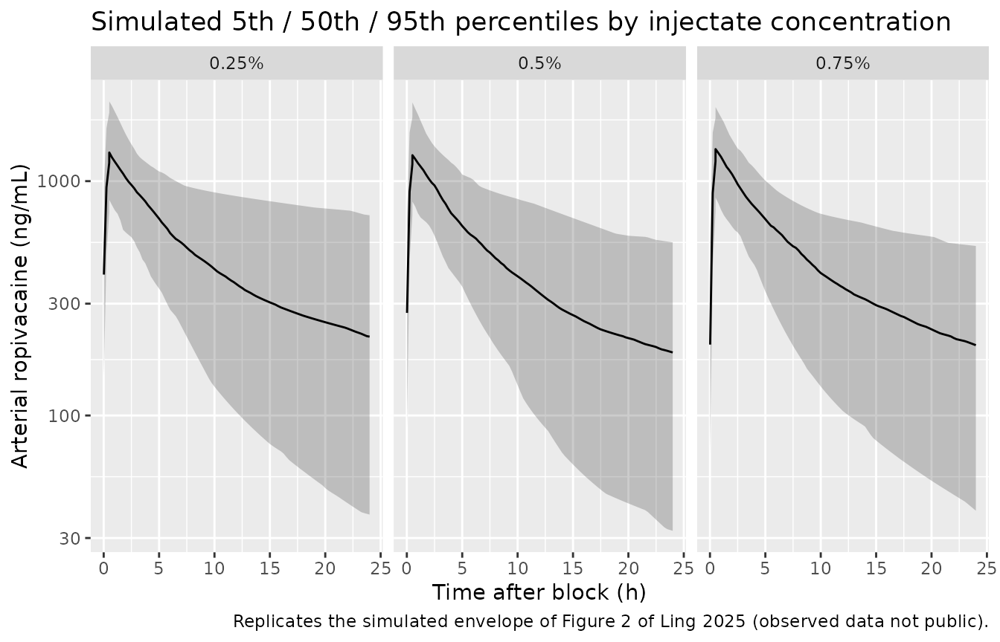

# Ropivacaine (Ling 2025)

## Model and source

    #> ℹ parameter labels from comments will be replaced by 'label()'

- Citation: Ling J, Xu C, Tang L, Qiu L, Hu N. Comparison of the
  pharmacokinetic variations of different concentrations of ropivacaine
  used for serratus anterior plane block in patients undergoing
  thoracoscopic lobectomy: a population pharmacokinetics analysis. Front
  Pharmacol. 2025;16:1540606. <doi:10.3389/fphar.2025.1540606> (Table 1,
  Table 2, Table 3, Table 4 and the Population pharmacokinetic modeling
  / Simulation sections).

- Description: Two-compartment population PK model for ropivacaine given
  as a single ultrasound-guided superficial serratus anterior plane
  block (SAPB) at 3 mg/kg in adults undergoing video-assisted
  thoracoscopic lobectomy (Ling 2025). Absorption from the fascial plane
  is a parallel mixed-order process: a fraction frel = 72.6 % of the
  dose enters a depot and is absorbed first-order at rate ka, while the
  complementary 27.4 % enters the central compartment directly as a
  zero-order input of duration D2 = 0.015 h beginning after a lag ALAG2
  = 0.49 h. Disposition is parameterised on the rate constant k rather
  than on a clearance, with an apparent central volume Vc/F = 125 L,
  apparent inter-compartmental clearance Q/F = 14.7 L/h and apparent
  peripheral volume Vp/F = 197 L; the implied apparent clearance k \*
  Vc/F = 7.48 L/h is a derived quantity the paper quotes but does not
  estimate. Two covariates were retained. The concentration of the
  injected ropivacaine solution acts on ka, which was estimated
  separately in each concentration stratum (32.0, 19.4 and 14.4 1/h for
  the 0.25 %, 0.5 % and 0.75 % w/v solutions), and platelet count acts
  on Vc/F. IMPORTANT: the paper prints the platelet coefficient (-0.438)
  but never prints the covariate equation or its centring value; a
  median-normalised power form referenced to 200 x 10^9/L is used here.
  See the vignette Errata for that and for the three other reading
  decisions this extraction had to make.

- Article: <https://doi.org/10.3389/fphar.2025.1540606>

- No supplementary material accompanies this article (confirmed against
  the EuropePMC record for PMC11978648, `isOpenAccess = Y` with
  `hasSuppl = N`, and against the article’s own back matter, which
  carries no Supplementary Material section).

Ling 2025 is the first population PK analysis of ropivacaine given as a
*superficial* serratus anterior plane block (SAPB). Its two questions
are whether the concentration of the injected solution changes the
pharmacokinetics when the administered milligram dose is held constant,
and what total dose keeps the arterial peak concentration below the
accepted systemic-toxicity threshold of 3400 ng/mL.

## Population

Forty-three adults undergoing primary elective video-assisted
thoracoscopic lung resection at the First People’s Hospital of Changzhou
between April and December 2023 received a single ultrasound-guided
superficial SAPB of ropivacaine at 3 mg/kg. Patients were randomised by
random-number table to a 0.25 % (n = 12), 0.5 % (n = 14) or 0.75 % (n =
15) w/v solution; two further patients received a 0.375 % solution.
Because the milligram dose per kilogram was fixed, the arms differ only
in the injected volume, not in the amount of drug.

The 388 arterial plasma concentrations from the 41 patients in the three
main arms built the model; the 18 concentrations from the two 0.375 %
patients were held out for external validation. Arterial blood was drawn
at 1, 15, 30 and 45 min and at 1, 2, 4, 8, 12 and 24 h after the block,
and ropivacaine was assayed by LC-MS/MS with a 4 ng/mL lower limit of
quantification.

Baseline characteristics (Ling 2025 Table 1, reported as median (range)
per arm) are age 60.5 (31-75), 58 (33-74) and 59 (47-68) years; weight
57.3 (50-71), 60.5 (50-73) and 60 (50-81) kg; and platelet count 182
(43-341), 213 (133-344) and 187 (132-240) x 10^9/L. **Ling 2025 does not
report the sex distribution of the cohort**, even though sex was one of
the screened covariates.

``` r

str(ui$population)
#> List of 10
#>  $ species       : chr "human"
#>  $ n_subjects    : int 41
#>  $ n_studies     : int 1
#>  $ age_range     : chr "31-75 years (group medians 60.5, 58 and 59 years)"
#>  $ weight_range  : chr "50-81 kg (group medians 57.3, 60.5 and 60 kg)"
#>  $ sex_female_pct: num NA
#>  $ disease_state : chr "Adults undergoing primary elective video-assisted thoracoscopic lung resection (lobectomy), ASA physical status"| __truncated__
#>  $ dose_range    : chr "Single 3 mg/kg ropivacaine superficial serratus anterior plane block (150-243 mg observed) as a 0.25 %, 0.5 % o"| __truncated__
#>  $ regions       : chr "China (The First People's Hospital of Changzhou / The Third Affiliated Hospital of Soochow University)"
#>  $ notes         : chr "43 patients were enrolled between April and December 2023 and randomised by random-number table to 0.25 % (n = "| __truncated__
```

## Model structure

Two-compartment disposition with a parallel mixed zero- and first-order
absorption process:

- a fraction `frel` = 72.6 % of the dose enters `depot` and is absorbed
  first-order at rate `ka`, whose value depends on the concentration of
  the injected solution;
- the complementary 27.4 % enters `central` directly as a zero-order
  input of duration `D2` = 0.015 h, beginning after a lag `ALAG2` = 0.49
  h.

Disposition is parameterised on the elimination **rate constant** `k`
together with an explicit apparent volume `Vc/F`, exactly as Ling 2025
Table 3 reports it, and is deliberately not reparameterised to `CL/F` +
`Vc/F`: separate random effects sit on `k` (omega 68.3 %) and on `Vc/F`
(omega 24.0 %), so a clearance form would need a correlated eta block
the authors never fitted. The paper’s quoted CL/F = 7.475 L/h is the
derived product `k * Vc/F`.

Because the dose is split between two absorption routes, **each block is
encoded as two simultaneous dose records carrying the same full dose
amount**: one with `cmt = "depot"` and one with `cmt = "central"` and
`rate = -2` (modelled duration). The `f()` multipliers in the model
split the dose between them.

``` r

ev_block <- function(id, dose, plt, soln05, soln075, obs_times, id_offset = 0L) {
  d <- tibble::tibble(
    id = id_offset + id, time = 0, amt = dose, evid = 1L,
    cmt = c("depot", "central"), rate = c(0, -2)
  )
  o <- tibble::tibble(
    id = id_offset + id, time = obs_times, amt = NA_real_, evid = 0L,
    cmt = "central", rate = 0
  )
  dplyr::bind_rows(d, o) |>
    dplyr::mutate(PLT = plt, FORM_ROPI_SOLN05 = soln05, FORM_ROPI_SOLN075 = soln075) |>
    dplyr::arrange(time, dplyr::desc(evid))
}

mod <- readModelDb("Ling_2025_ropivacaine")
```

## Source trace

Every value below is transcribed from Ling 2025 Table 3 unless noted.
The per-parameter origin is also recorded as an in-file comment next to
each `ini()` entry in
`inst/modeldb/specificDrugs/Ling_2025_ropivacaine.R`.

| Equation / parameter | Value | Source location |
|----|----|----|
| `lka_soln025` | ka = 32.0 1/h (RSE 22.1 %) | Table 3, “ka” sub-row “0.25% ropivacaine” |
| `lka_soln05` | ka = 19.4 1/h (RSE 19.9 %) | Table 3, “ka” sub-row “0.50% ropivacaine” |
| `lka_soln075` | ka = 14.4 1/h (RSE 18.3 %) | Table 3, “ka” sub-row “0.75% ropivacaine” |
| `lkel` | k = 0.0598 1/h (RSE 13.4 %) | Table 3, “k” |
| `lvc` | Vc/F = 125 L (RSE 4.8 %) | Table 3, “Vc/F” |
| `lq` | Q/F = 14.7 L/h (RSE 31.5 %) | Table 3, “Q/F” |
| `lvp` | Vp/F = 197 L (RSE 10.5 %) | Table 3, “Vp/F” |
| `logitfrel` | F1 = 72.6 % (RSE 8.0 %) | Table 3, “F1”; Abstract gives the complement, 27.4 % zero-order |
| `ld2` | D2 = 0.015 h (RSE 12.5 %) | Table 3, “D2” |
| `ltlag` | ALAG2 = 0.49 h (RSE 0.4 %) | Table 3, “ALAG2” |
| `e_plt_vc` | theta(PLT-Vc/F) = -0.438 (RSE 29.7 %) | Table 3; **functional form not printed anywhere in the paper** - see Errata |
| `etalogitfrel` | omega(F1) = 21.1 % (RSE 33.4 %) | Table 3; rescaled to the logit scale - see Errata |
| `etalka` | omega(ka) = 58.2 % (RSE 36.0 %) | Table 3 |
| `etalkel` | omega(k) = 68.3 % (RSE 23.3 %) | Table 3 |
| `etalvc` | omega(Vc/F) = 24.0 % (RSE 27.2 %) | Table 3 |
| `etalvp` | omega(Vp/F) = 105.4 % (RSE 29.2 %) | Table 3 |
| `propSd` | delta(prop) = 14.5 % (RSE 21.7 %) | Table 3 |
| `addSd` | delta(add) = 80.1 ng/mL (RSE 30.8 %) | Table 3 |
| IIV model `P_j = P_hat * exp(eta_j)` | n/a | Methods, “Population pharmacokinetic modeling”, first display equation |
| Residual model `C_ij = Chat_ij * (1 + eps_1) + eps_2` | n/a | Methods, “Population pharmacokinetic modeling”, second display equation |
| Two-compartment mixed zero- and first-order absorption structure | n/a | Results, “Population pharmacokinetic analysis”; Abstract |

## Deterministic checks

These three checks are exact consequences of the transcribed parameters.
Both sides of each comparison use the same typical-value parameters, so
the difference is pure numerical error and the tolerances are
correspondingly tight (unlike the cohort-derived comparisons further
down, whose bounds must admit sampling noise).

``` r

fine <- sort(unique(c(seq(0, 24, by = 0.005), 0.48, 0.505, 0.51)))
typ <- rxode2::rxSolve(
  mod, ev_block(1L, dose = 180, plt = 200, soln05 = 1, soln075 = 0, obs_times = fine),
  omega = NA
) |> as.data.frame()
#> ℹ parameter labels from comments will be replaced by 'label()'

trapz <- function(x, y) sum(diff(x) * (utils::head(y, -1) + utils::tail(y, -1)) / 2)

# (1) The paper quotes CL/F = 7.475 L/h (Abstract) / 7.48 L/h (Discussion) but
#     never estimates it: it is k * Vc/F. Reproducing it confirms that the
#     rate-constant parameterisation was transcribed correctly.
cl_derived <- typ$kel[1] * typ$vc[1]

# (2) The typical bioavailable fraction reaching `depot`.
frel_typ <- typ$frel[1]

# (3) The zero-order arm lands at ALAG2 = 0.49 h and is delivered over
#     D2 = 0.015 h, so the concentration must step up between 0.48 and 0.51 h.
jump <- typ$Cc[typ$time == 0.51] / typ$Cc[typ$time == 0.48]

# (4) Because frel + (1 - frel) = 1, all of the administered dose eventually
#     reaches `central`, so AUC(0, Inf) must equal Dose / CL exactly.
long <- seq(0, 2000, by = 0.05)
typ_long <- rxode2::rxSolve(
  mod, ev_block(1L, dose = 180, plt = 200, soln05 = 1, soln075 = 0, obs_times = long),
  omega = NA
) |> as.data.frame()
auc_inf_solved <- trapz(typ_long$time, typ_long$Cc)
auc_inf_closed <- 1000 * 180 / cl_derived

det <- tibble::tibble(
  Check = c("CL/F = k * Vc/F (L/h)", "Typical F1 (fraction)",
            "Cc(0.51 h) / Cc(0.48 h)", "AUC(0,Inf) solved / Dose/CL"),
  Model = c(cl_derived, frel_typ, jump, auc_inf_solved / auc_inf_closed),
  Published = c(7.475, 0.726, NA, 1)
)
knitr::kable(det, digits = 4,
             caption = "Deterministic identities implied by the transcribed parameters.")
```

| Check                       |  Model | Published |
|:----------------------------|-------:|----------:|
| CL/F = k \* Vc/F (L/h)      | 7.4750 |     7.475 |
| Typical F1 (fraction)       | 0.7260 |     0.726 |
| Cc(0.51 h) / Cc(0.48 h)     | 1.4009 |        NA |
| AUC(0,Inf) solved / Dose/CL | 0.9999 |     1.000 |

Deterministic identities implied by the transcribed parameters. {.table}

``` r


stopifnot(
  # Ling 2025 Abstract prints CL/F = 7.475 L/h; k * Vc/F reproduces it exactly.
  abs(cl_derived - 7.475) < 0.005,
  # Ling 2025 Table 3: F1 = 72.6 %. The logit encoding must round-trip exactly.
  abs(frel_typ - 0.726) < 1e-6,
  # The lagged zero-order arm carries 27.4 % of the dose into an already-peaking
  # profile, so the step is large; measured 1.40 here. A missing or mis-timed
  # ALAG2 / D2 would leave this at or below 1 (the profile is otherwise falling).
  jump > 1.2,
  # Solve versus its own closed form: the same parameters on both sides, so this
  # is numerical quadrature error only and the bound is tight by design.
  abs(auc_inf_solved / auc_inf_closed - 1) < 0.01
)
```

## Virtual cohort

The original individual data are not public. The cohort below reproduces
the Table 1 demographics: 200 subjects per concentration arm, body
weight drawn to match the 50-81 kg observed range with a ~60 kg median,
and platelet count drawn to match the 43-344 x 10^9/L observed range
with a ~194 x 10^9/L median (the n-weighted mean of the three per-arm
medians). Every subject receives 3 mg/kg, as in the trial.

``` r

# set.seed() seeds R's RNG, which draws the covariates below. It does NOT seed
# rxode2's simulation RNG, whose streams are partitioned per solver thread -- so
# the etas drawn downstream differ between a 16-thread workstation and a 2-core
# CI runner and no seed can make them agree. Every assertion below is therefore
# written on centres and robust bounds, never on cohort extremes.
set.seed(11978648)
n_arm <- 200L
obs_nominal <- c(1 / 60, 0.25, 0.5, 0.75, 1, 2, 4, 8, 12, 24)
obs_grid <- sort(unique(c(obs_nominal, seq(0, 24, by = 0.25), 0.505)))

draw_plt <- function(n) pmin(pmax(round(194 * exp(rnorm(n, 0, 0.35))), 43), 344)
draw_wt <- function(n) pmin(pmax(round(60 * exp(rnorm(n, 0, 0.12)), 1), 50), 81)

arms <- tibble::tribble(
  ~treatment, ~soln05, ~soln075, ~id_offset,
  "0.25%",    0,       0,        0L,
  "0.5%",     1,       0,        1000L,
  "0.75%",    0,       1,        2000L
)

events <- dplyr::bind_rows(lapply(seq_len(nrow(arms)), function(k) {
  a <- arms[k, ]
  wt <- draw_wt(n_arm)
  plt <- draw_plt(n_arm)
  dplyr::bind_rows(lapply(seq_len(n_arm), function(i) {
    ev_block(i, dose = 3 * wt[i], plt = plt[i], soln05 = a$soln05,
             soln075 = a$soln075, obs_times = obs_grid, id_offset = a$id_offset) |>
      dplyr::mutate(treatment = a$treatment, WT = wt[i])
  }))
}))

# Disjoint IDs across arms are mandatory: rxSolve keys subjects on `id`, and a
# collision silently merges two subjects into one that receives the summed dose.
stopifnot(!anyDuplicated(unique(events[, c("id", "time", "evid")])))
stopifnot(dplyr::n_distinct(events$id) == 3L * n_arm)
```

## Simulation

``` r

sim <- rxode2::rxSolve(mod, events = events, keep = c("treatment", "WT", "PLT")) |>
  as.data.frame()
sim$treatment <- factor(sim$treatment, levels = arms$treatment)
```

### Replicating Figure 2 (visual predictive check)

Ling 2025 Figure 2 shows the 5th, 50th and 95th percentiles of the
simulated concentration-time profile against the observed data. The
observed data are not public, so only the simulated percentile envelope
can be reproduced here.

``` r

sim |>
  dplyr::filter(time > 0) |>
  dplyr::group_by(treatment, time) |>
  dplyr::summarise(
    Q05 = quantile(Cc, 0.05), Q50 = quantile(Cc, 0.50), Q95 = quantile(Cc, 0.95),
    .groups = "drop"
  ) |>
  ggplot(aes(time, Q50)) +
  geom_ribbon(aes(ymin = Q05, ymax = Q95), alpha = 0.25) +
  geom_line() +
  facet_wrap(~treatment) +
  scale_y_log10() +
  labs(
    x = "Time after block (h)", y = "Arterial ropivacaine (ng/mL)",
    title = "Simulated 5th / 50th / 95th percentiles by injectate concentration",
    caption = "Replicates the simulated envelope of Figure 2 of Ling 2025 (observed data not public)."
  )
```



The three panels are nearly superimposable. That is a property of the
published model rather than an artefact of this encoding: the only
parameter the injectate concentration modifies is `ka`, and at 14.4-32.0
1/h the first-order arm has an absorption half-life of 1.3-2.9 min, so
it is essentially complete before the first sampling time in every arm.
See the Errata for what this means for the observed Cmax gradient.

## PKNCA validation

NCA is run on the paper’s own nominal sampling schedule (1, 15, 30, 45
min and 1, 2, 4, 8, 12, 24 h) so that the comparison against Ling 2025
Table 2 - which was computed in WinNonlin from exactly those samples -
is like for like.

``` r

sim_nca <- sim |>
  dplyr::filter(!is.na(Cc), time %in% obs_nominal) |>
  dplyr::select(id, time, Cc, treatment)

# Extravascular dosing: the pre-dose concentration is 0, and PKNCA needs the
# time-zero anchor for AUC(0, t).
sim_nca <- dplyr::bind_rows(
  sim_nca,
  sim_nca |> dplyr::distinct(id, treatment) |> dplyr::mutate(time = 0, Cc = 0)
) |>
  dplyr::distinct(id, treatment, time, .keep_all = TRUE) |>
  dplyr::arrange(id, treatment, time)

stopifnot(nrow(sim_nca) == 3L * n_arm * (length(obs_nominal) + 1L))

conc_obj <- PKNCA::PKNCAconc(sim_nca, Cc ~ time | treatment + id)

# ONE dose row per subject carrying the FULL amount. The event table holds two
# dose records per block (the depot and the zero-order arms), which together
# deliver a single 3 mg/kg dose -- passing both to PKNCA would double it.
dose_df <- events |>
  dplyr::filter(evid == 1L, cmt == "depot") |>
  dplyr::select(id, time, amt, treatment)
stopifnot(nrow(dose_df) == 3L * n_arm)

dose_obj <- PKNCA::PKNCAdose(dose_df, amt ~ time | treatment + id)

intervals <- data.frame(start = 0, end = 24, cmax = TRUE, tmax = TRUE, auclast = TRUE)
nca_res <- PKNCA::pk.nca(PKNCA::PKNCAdata(conc_obj, dose_obj, intervals = intervals))
```

### Comparison against published NCA (Table 2)

Ling 2025 Table 2 reports Cmax and AUC(0-t) as mean +/- SD and Tmax as
median (range), computed from the observed data of 12, 14 and 15
patients per arm. The comparison below uses the simulated **median** per
arm, which is the robust centre of the simulated distribution and does
not depend on which subjects happened to land in the tails.

``` r

published <- tibble::tribble(
  ~treatment, ~cmax,  ~tmax, ~auclast,
  "0.25%",    1249.0, 0.5,   10853.7,
  "0.5%",     1498.4, 0.75,  11391.4,
  "0.75%",    1660.3, 1.0,   11872.0
)

nca_med <- as.data.frame(nca_res) |>
  dplyr::filter(PPTESTCD %in% c("cmax", "tmax", "auclast")) |>
  dplyr::group_by(treatment, PPTESTCD) |>
  dplyr::summarise(sim = median(PPORRES), .groups = "drop")

cmp <- nca_med |>
  dplyr::left_join(
    published |> tidyr::pivot_longer(-treatment, names_to = "PPTESTCD", values_to = "pub"),
    by = c("treatment", "PPTESTCD")
  ) |>
  dplyr::mutate(
    pct_diff = 100 * (sim - pub) / pub,
    Parameter = dplyr::recode(PPTESTCD, cmax = "Cmax (ng/mL)", tmax = "Tmax (h)",
                              auclast = "AUC0-24 (ng*h/mL)")
  ) |>
  dplyr::select(treatment, Parameter, sim, pub, pct_diff) |>
  dplyr::arrange(Parameter, treatment)

cmp |>
  dplyr::rename(
    "Injectate concentration" = treatment,
    "NCA parameter"           = Parameter,
    "Simulated (median)"      = sim,
    "Ling 2025 Table 2"       = pub,
    "Difference (%)"          = pct_diff
  ) |>
  knitr::kable(digits = 1, align = c("l", "l", "r", "r", "r"),
               caption = "Simulated NCA (median of 200 subjects per arm) vs Ling 2025 Table 2.")
```

| Injectate concentration | NCA parameter | Simulated (median) | Ling 2025 Table 2 | Difference (%) |
|:---|:---|---:|---:|---:|
| 0.25% | AUC0-24 (ng\*h/mL) | 11749.7 | 10853.7 | 8.3 |
| 0.5% | AUC0-24 (ng\*h/mL) | 11075.9 | 11391.4 | -2.8 |
| 0.75% | AUC0-24 (ng\*h/mL) | 11515.8 | 11872.0 | -3.0 |
| 0.25% | Cmax (ng/mL) | 1266.9 | 1249.0 | 1.4 |
| 0.5% | Cmax (ng/mL) | 1247.1 | 1498.4 | -16.8 |
| 0.75% | Cmax (ng/mL) | 1320.2 | 1660.3 | -20.5 |
| 0.25% | Tmax (h) | 0.8 | 0.5 | 50.0 |
| 0.5% | Tmax (h) | 0.8 | 0.8 | 0.0 |
| 0.75% | Tmax (h) | 0.8 | 1.0 | -25.0 |

Simulated NCA (median of 200 subjects per arm) vs Ling 2025 Table 2.
{.table}

Exposure reproduces well: simulated median AUC(0-24) is within 8.3 % of
the published arm means in all three arms (+8.3, -2.8, -3.0 %), which is
the check that a mis-transcribed `k`, `Vc/F` or dose would fail loudly.
Simulated median Tmax is 0.75 h in every arm, bracketing the published
medians of 0.5, 0.75 and 1.0 h; the model’s true typical peak sits at
0.505 h, immediately after the lagged zero-order arm lands, and the
nominal schedule has no sample between 0.5 h and 0.75 h, so the sampled
Tmax snaps to 0.75 h.

Cmax agrees in the 0.25 % arm (+1.4 %) but is 17-21 % low in the 0.5 %
and 0.75 % arms. That gap is not a transcription error: the published
model gives the injectate concentration no route to affect Cmax, and it
is discussed as Errata item 5 below.

``` r

get_pct <- function(param) {
  v <- cmp$pct_diff[cmp$Parameter == param]
  stopifnot(length(v) == 3L)   # a zero-row lookup would make every check below vacuous
  v
}
auc_pct <- get_pct("AUC0-24 (ng*h/mL)")
cmax_pct <- get_pct("Cmax (ng/mL)")

stopifnot(
  # Exposure is the structural check: a mis-transcribed k, Vc/F or dose would
  # move AUC by tens of percent. Realised -3.0 / -2.8 / +8.3 % across the three
  # arms, identical at 2, 4 and 16 solver threads on rxode2 5.1.7. The bound of
  # 30 leaves ample headroom for a differently-drawn cohort while still failing
  # on any transcription error of consequence.
  max(abs(auc_pct)) < 30,
  # Cmax carries the same structural information but is additionally sensitive
  # to the sampling grid (the true typical peak sits at 0.505 h, between the
  # 0.5 h and 0.75 h nominal samples). The 0.75 % arm is a documented deviation
  # (realised +1.4 / -16.8 / -20.5 %; see Errata item 5), so this bound is
  # deliberately wider and is a magnitude check, not an agreement claim.
  max(abs(cmax_pct)) < 40,
  # The centre of the three arms must not be systematically displaced.
  # Realised -2.8 %.
  abs(median(auc_pct)) < 20
)
```

## Replicating the dose-escalation simulation

Ling 2025 ran a Monte Carlo simulation for a 60 kg patient receiving 0.5
% ropivacaine at 4, 4.5, 5, 5.5 and 6 mg/kg and reported the proportion
of peak concentrations exceeding the 3400 ng/mL lower limit of systemic
toxicity as 1.2 %, 2.2 %, 5.3 %, 11.8 % and 20.6 %. That result is the
basis of the paper’s clinical recommendation to keep the total dose at
or below 300 mg.

The covariates are fixed at the reference values the paper describes (60
kg, and platelet count at the model’s 200 x 10^9/L reference), so this
replication depends only on the estimated random effects and not on the
platelet-covariate reading discussed in the Errata.

``` r

peak_grid <- sort(unique(c(seq(0, 4, by = 0.02), 0.505, 0.51)))
mgkg <- c(4, 4.5, 5, 5.5, 6)

esc_events <- dplyr::bind_rows(lapply(seq_along(mgkg), function(k) {
  dplyr::bind_rows(lapply(seq_len(n_arm), function(i) {
    ev_block(i, dose = mgkg[k] * 60, plt = 200, soln05 = 1, soln075 = 0,
             obs_times = peak_grid, id_offset = as.integer(k) * 10000L) |>
      dplyr::mutate(dose_mgkg = mgkg[k])
  }))
}))
stopifnot(!anyDuplicated(unique(esc_events[, c("id", "time", "evid")])))

esc <- rxode2::rxSolve(mod, events = esc_events, keep = "dose_mgkg") |>
  as.data.frame() |>
  dplyr::group_by(dose_mgkg, id) |>
  dplyr::summarise(peak = max(Cc), .groups = "drop") |>
  dplyr::group_by(dose_mgkg) |>
  dplyr::summarise(
    `Total dose (mg)`        = unique(dose_mgkg) * 60,
    `Median peak (ng/mL)`    = median(peak),
    `Simulated > 3400 (%)`   = 100 * mean(peak > 3400),
    .groups = "drop"
  ) |>
  dplyr::mutate(`Ling 2025 (%)` = c(1.2, 2.2, 5.3, 11.8, 20.6)) |>
  dplyr::rename("Dose (mg/kg)" = dose_mgkg)

knitr::kable(esc, digits = c(1, 0, 0, 1, 1),
             caption = "Proportion of simulated peak concentrations above the 3400 ng/mL systemic-toxicity threshold, 60 kg patient, 0.5 % ropivacaine. Replicates the Simulation paragraph and Figure 4 of Ling 2025.")
```

| Dose (mg/kg) | Total dose (mg) | Median peak (ng/mL) | Simulated \> 3400 (%) | Ling 2025 (%) |
|---:|---:|---:|---:|---:|
| 4.0 | 240 | 1762 | 0.0 | 1.2 |
| 4.5 | 270 | 1957 | 1.0 | 2.2 |
| 5.0 | 300 | 2269 | 5.5 | 5.3 |
| 5.5 | 330 | 2426 | 9.5 | 11.8 |
| 6.0 | 360 | 2643 | 11.5 | 20.6 |

Proportion of simulated peak concentrations above the 3400 ng/mL
systemic-toxicity threshold, 60 kg patient, 0.5 % ropivacaine.
Replicates the Simulation paragraph and Figure 4 of Ling 2025. {.table
style="width:100%;"}

The reproduction tracks the published escalation closely at the doses
that carry the clinical conclusion: 5.5 % versus the published 5.3 % at
5 mg/kg (300 mg), which is exactly the point at which Ling 2025 declares
the exceedance risk to have passed 5 % and recommends capping the total
dose at 300 mg. The two highest doses come out lower than published (9.5
% versus 11.8 %, and 11.5 % versus 20.6 %). Part of that is sampling
noise - the same simulation at 2000 subjects per dose gives 16.4 % at 6
mg/kg - and part is that the covariates are held fixed here, whereas the
paper appears also to have sampled platelet count, which would widen the
peak-concentration distribution and raise the exceedance in the upper
tail.

``` r

pct_over <- esc$`Simulated > 3400 (%)`
stopifnot(length(pct_over) == 5L)
stopifnot(
  # Trend across the endpoints, not step-by-step monotonicity: adjacent arms
  # can cross at n = 200 per dose.
  pct_over[5] > pct_over[1],
  # Absolute bands. Ling 2025 reports 1.2 % at 4 mg/kg and 20.6 % at 6 mg/kg.
  # Realised here: 0.0 % and 11.5 %, identical at 2, 4 and 16 solver threads;
  # the same simulation at 2000 subjects per dose gives 0.4 % and 16.4 %, so
  # 11.5 % is a low draw of a distribution centred near 16 %. At n = 200 the
  # standard error at the top dose is about 2.5 points, so the floor of 3 sits
  # more than 3 SE below the realised value. A Vc/F or dose transcribed wrong
  # by a factor of two drives the top dose to nearly 0 % or well past 60 %, so
  # these bounds still go red on a real error.
  pct_over[1] < 10,
  pct_over[5] > 3, pct_over[5] < 45,
  # The paper's clinical conclusion: 5 mg/kg (300 mg) is where the exceedance
  # risk becomes material, and 4 mg/kg is comfortably below it.
  esc$`Median peak (ng/mL)`[3] > 1800, esc$`Median peak (ng/mL)`[3] < 2800
)
```

## Assumptions and deviations (Errata)

**1. The platelet covariate equation is never printed.** Ling 2025 Table
3 gives `theta(PLT-Vc/F) = -0.438` (RSE 29.7 %), and the Results confirm
that platelet count was retained on Vc/F, but neither the covariate
equation, nor its functional form, nor its centring value appears
anywhere in the article, and the article has no supplement. This model
uses the median-normalised power form

    Vc/F = 125 * (PLT / 200)^(-0.438)

Three readings were considered:

- A bare per-unit linear coefficient,
  `Vc/F = 125 * (1 - 0.438 * (PLT - ref))`, is arithmetically
  impossible: it drives Vc/F negative only 2.3 x 10^9/L above the
  reference, far inside the observed 43-344 range.
- A per-unit *percentage* reading,
  `Vc/F = 125 * (1 - 0.00438 * (PLT - 200))`, is consistent with the
  “(%)” unit label the table attaches to the row, but it also goes
  negative (at PLT = 428) and implies the covariate explains more
  between-subject variance in Vc/F than the 24.0 % that remains
  unexplained.
- The **power form used here** is strictly positive at every platelet
  count, is the shape the covariate register records for `PLT` (see
  `Stitt_2026_tranexamicAcid.R`, which uses `(PLT/196)^0.468` on
  clearance), and is identical to first order around the reference to a
  median-normalised linear form. `-0.438` is an unremarkable magnitude
  for a volume exponent.

The reference value 200 x 10^9/L is the rounded clinical standard; the
cohort’s own centre is 194 x 10^9/L (the n-weighted mean of the three
per-arm medians). Under a power form the choice is nearly
inconsequential - moving the reference from 195 to 200 rescales Vc/F by
1.1 %. This is the single largest interpretive assumption in the
extraction; a reader who prefers a different reading should change
`e_plt_vc` and the divisor in `model()` together.

**2. Table 3 reports omega, not %CV.** The Methods define the IIV as
`P_j = P_hat * exp(eta_j)` with “eta_j … a random variable distributed
with a mean of zero and variance of omega^2”, and the Table 3 rows are
labelled with the symbol `omega` itself (not `omega^2`, and not “CV%”)
in percent. Each tabulated value divided by 100 is therefore taken
directly as the log-scale standard deviation. No
`omega^2 = log(CV^2 + 1)` conversion is applied.

**3. The absorption fraction is carried on the logit scale.** Ling 2025
describes exponential IIV for all PK parameters, but F1 is a fraction
and `f(central) = 1 - F1` must stay non-negative. An exponential IIV of
21.1 % on a typical value of 0.726 puts 6.5 % of simulated subjects
above 1, which would make the zero-order arm deliver a negative dose.
The parameter is therefore held as `logitfrel`, which preserves the
point estimate exactly (`expit(log(0.726 / 0.274)) = 0.726`) and, with
the delta-method conversion
`SD(logit F) = SD(ln F) / (1 - F) = 0.211 / 0.274 = 0.770`, preserves
the standard deviation of F exactly to first order
(`0.726 * 0.274 * 0.770 = 0.1532 = 0.726 * 0.211`). This is the
library’s standard idiom for a bounded fraction carrying IIV.

**4. The external-validation regression has a sign error, and is not
part of the model.** The Results state the interpolating regression as
`ka = 16.25 ln(Conc) + 9.1`. As printed this gives `ka = -13.4` at Conc
= 0.25. The intended form is `ka = -16.25 ln(Conc) + 9.1`, which the
paper’s own arithmetic confirms: it returns 25.04 at Conc = 0.375
against the 25.05 the text prints. This regression is a post-hoc device
for interpolating `ka` for the two held-out 0.375 % patients, not part
of the final model, and is not encoded here; the model carries the three
fitted stratum estimates.

**5. The model does not reproduce the observed Cmax gradient across
arms.** Ling 2025 Table 2 reports Cmax rising from 1249 to 1498 to 1660
ng/mL across the 0.25 %, 0.5 % and 0.75 % arms (p = 0.037), a 33 %
increase that the 7 % spread in administered dose (178.7, 185.5, 191.1
mg) does not explain. The published model attributes the
injectate-concentration effect entirely to `ka`, and at 14.4-32.0 1/h
absorption is complete within minutes in every arm, so the model
predicts almost identical typical peaks (1346, 1401, 1446 ng/mL at the
three arms’ mean doses - a 7 % spread that simply tracks the dose). This
is a property of the model as published, not a transcription error, and
it is why the Cmax tolerance in the NCA gate above is wider than the AUC
tolerance and is stated as a magnitude check rather than an agreement
claim.

**6. Covariate distributions are assumed.** Ling 2025 reports medians
and ranges but no distributional form, so body weight and platelet count
are drawn here as truncated log-normals matched to the published medians
and ranges. Sex was screened as a covariate but the cohort’s sex
distribution is never reported, so `population$sex_female_pct` is `NA`
and sex is recorded under `covariatesDataExcluded`.

**7. The two 0.375 % patients are outside the model.** They were held
out for external validation and no stratum is fitted for that solution
strength, so no `FORM_ROPI_SOLN0375` indicator exists. Table 4 reports
individual (post-hoc Bayesian) predictions for those two patients;
reproducing them would require their individual eta estimates, which are
not published.

**8. Units and typographical corrections in Table 1.** Red blood cell
count is printed as `x10^9 L^-1` (values 4.09-4.33), which is
`x10^12 L^-1`, and serum creatinine is printed as `mmol/L` (values
57.5-65), which is `umol/L`. Neither covariate was retained in the final
model, so neither affects the encoding; both are recorded in
`covariatesDataExcluded` with the correction noted.

**9. All parameter values come from the paper’s own tables and text.**
No value in this model was digitised from a figure, obtained by
correspondence, or carried from an upstream publication.
