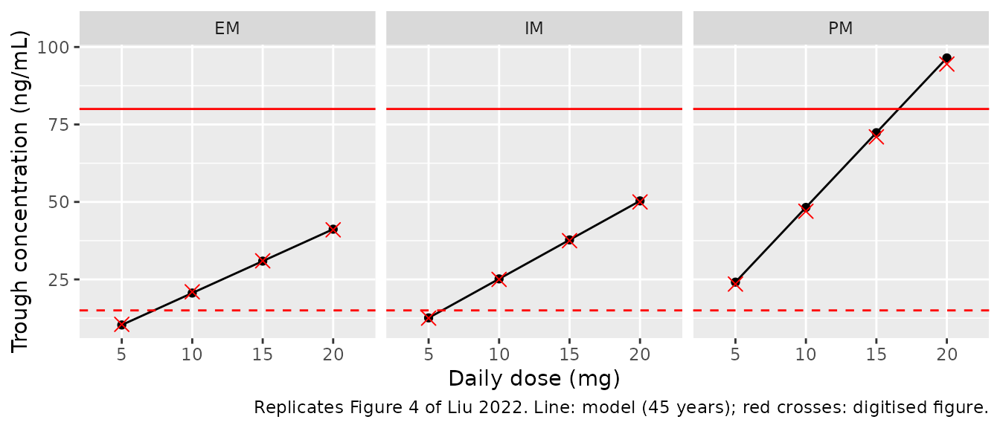
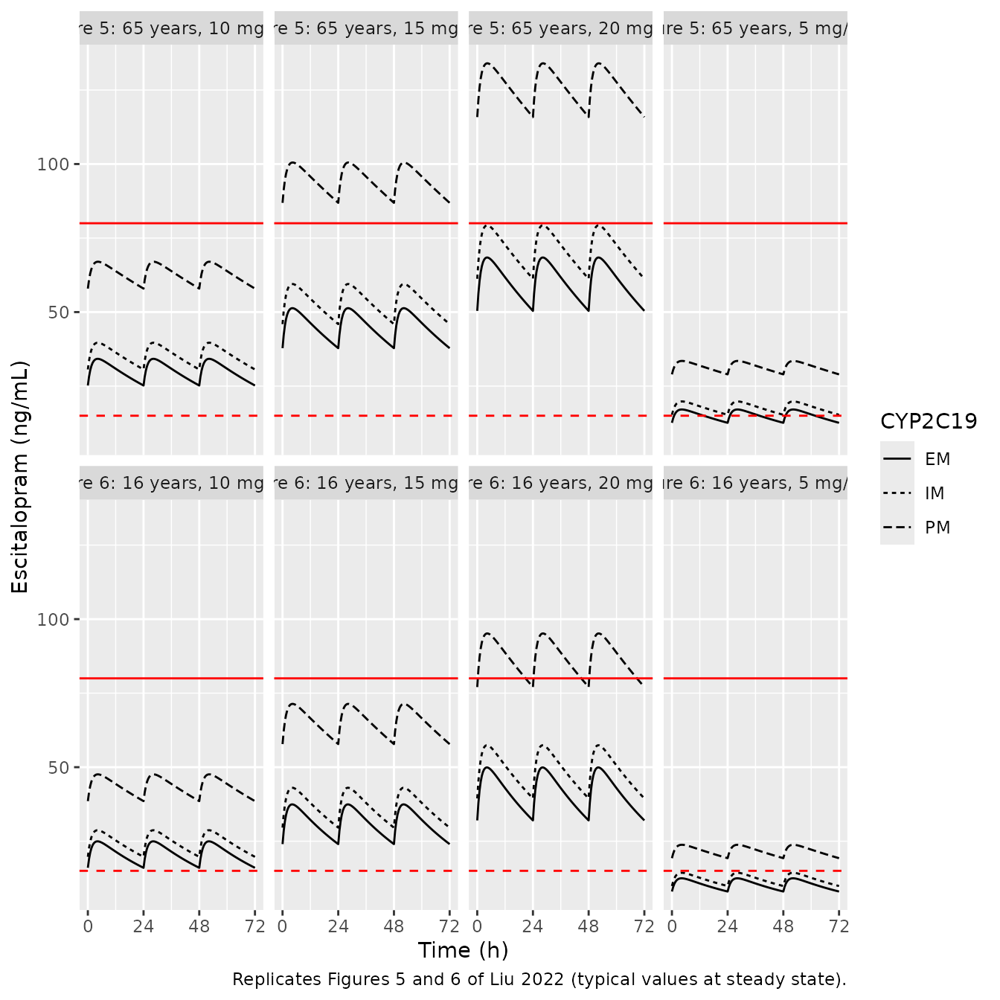
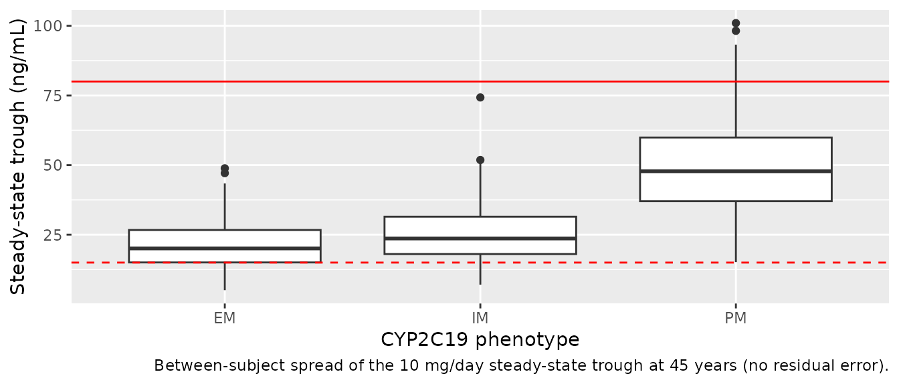

# Escitalopram (Liu 2022)

## Model and source

- Citation: Liu S, Xiao T, Huang S, Li X, Kong W, Yang Y, Zhang Z, Ni X,
  Lu H, Zhang M, Shang D, Wen Y. Population pharmacokinetics model for
  escitalopram in Chinese psychiatric patients: effect of CYP2C19 and
  age. Front Pharmacol. 2022;13:964758. <doi:10.3389/fphar.2022.964758>.
- Description: One-compartment population PK model with first-order
  absorption (ka fixed at 0.6 1/h) for oral escitalopram in 106 Chinese
  psychiatric inpatients (adolescents to older adults) sampled sparsely
  around trough during routine therapeutic drug monitoring (Liu 2022).
  Apparent clearance decreases linearly with age about the cohort median
  of 45 years and is multiplied by 0.847 in CYP2C19 intermediate and
  0.479 in poor metabolizers relative to extensive metabolizers;
  exponential IIV on CL/F and V/F and a proportional residual error.
- Article: <https://doi.org/10.3389/fphar.2022.964758> (open access)

Liu et al. built a one-compartment model with first-order absorption
from routine therapeutic drug monitoring (TDM) of escitalopram in
Chinese psychiatric inpatients. Because the samples were taken mostly
around trough, the absorption rate constant was not estimable and was
fixed at 0.6 1/h from an earlier Chinese model (Chen 2013). Age and
CYP2C19 phenotype were the only retained covariates, both on apparent
clearance:

``` math
CL/F = 16.3 \times \left[1 - 0.0077\,(\mathrm{AGE} - 45)\right]
\times 0.847^{\mathrm{IM}} \times 0.479^{\mathrm{PM}} \times e^{\eta_{CL}}
```

## Population

The model was fitted to 337 serum concentrations from 106 psychiatric
inpatients treated at the Affiliated Brain Hospital of Guangzhou Medical
University between 2018 and 2021 (Liu 2022 Table 1). Median age was 45
years (range 12-83), median weight 61 kg (37-97) and 44.3% were female.
CYP2C19 phenotype was inferred from genotype: 47 extensive metabolizers
(EM, `*1/*1`), 49 intermediate metabolizers (IM, `*1/*2` or `*1/*3`) and
10 poor metabolizers (PM, `*2/*2` or `*2/*3`) (Table 2). No `*17`
carriers were genotyped. Patients took conventional tablets at 5-20 mg
once daily or 5-10 mg twice daily (median 10 mg/day, range 5-30 mg/day).
Only 3 patients smoked, and concomitant medications (Table 1) included
valproic acid (34%), olanzapine (37%), risperidone (25%) and omeprazole
(6%); none was retained as a covariate.

The same information is available programmatically via
`readModelDb("Liu_2022_escitalopram")()$population`.

## Source trace

| Equation / parameter | Value | Source location |
|----|----|----|
| Structure: 1-compartment, first-order absorption and elimination | n/a | Methods ‘PopPK model development’; Results ‘PopPK model for escitalopram’ |
| `lka` | `fixed(log(0.6))` 1/h | Table 4 ‘Ka 0.6, FIX’ (from Chen 2013) |
| `lcl` | `log(16.3)` L/h | Table 4 ‘CL/F 16.3’ |
| `lvc` | `log(815)` L | Table 4 ‘V/F 815’ |
| `e_age_cl` | 0.0077 1/year | Table 4 ‘theta Age’; Eq 3 centred on the Table 1 median age 45 years; sign: see Assumptions |
| `e_cyp2c19_im_cl` | 0.847 | Table 4 ‘theta IM’; Eq 6 |
| `e_cyp2c19_pm_cl` | 0.479 | Table 4 ‘theta PM’; Eq 7 |
| EM reference (theta_EM = 1) | n/a | Eq 5; theta_EM not in Table 4 |
| `etalcl` | 0.0877 (variance) | Table 4 ‘Random effect CL/F’; Eq 1 |
| `etalvc` | 0.235 (variance) | Table 4 ‘Random effect V/F’; Eq 1 |
| `propSd` | `sqrt(0.0287)` = 0.169 | Table 4 ‘Proportional error 0.0287’ (variance); Eq 2 |
| Additive error | 0 (omitted) | Table 4 ‘Additive error 0, FIX’ |
| `Cc = 1000 * central / vc` | n/a | mg / L to ng/mL |

## Typical-value replication of the dosing simulations

Figures 4-6 of Liu 2022 are deterministic typical-value simulations at
steady state: Figure 4 plots the steady-state trough for adults by
phenotype and daily dose, Figure 5 the concentration-time course over
three once-daily dosing intervals for a 65-year-old, and Figure 6 the
same for a 16-year-old. The values in the `digitised` tables below were
read off those figures by the maintainers (about +/- 1 ng/mL reading
precision).

``` r

mod <- rxode2::rxode(readModelDb("Liu_2022_escitalopram"))
#> ℹ parameter labels from comments will be replaced by 'label()'
mod_typical <- rxode2::zeroRe(mod)

pheno_cov <- tibble::tribble(
  ~pheno, ~CYP2C19_IM, ~CYP2C19_PM,
  "EM",   0L,          0L,
  "IM",   1L,          0L,
  "PM",   0L,          1L
)

grid <- tidyr::expand_grid(
  AGE = c(16, 45, 65),
  pheno = c("EM", "IM", "PM"),
  dose_mg = c(5, 10, 15, 20)
) |>
  dplyr::left_join(pheno_cov, by = "pheno") |>
  dplyr::mutate(id = dplyr::row_number())

obs_times <- seq(0, 72, by = 0.5)
ev_typical <- dplyr::bind_rows(
  # Steady-state once-daily dosing: an ss = 1 dose at time 0 followed by two
  # further doses gives three steady-state intervals, as in Figures 5 and 6.
  grid |>
    dplyr::mutate(time = 0, amt = dose_mg, evid = 1L, cmt = "depot", ii = 24, ss = 1L, addl = 2L),
  grid |>
    tidyr::crossing(time = obs_times) |>
    dplyr::mutate(amt = 0, evid = 0L, cmt = "central", ii = 0, ss = 0L, addl = 0L)
) |>
  dplyr::arrange(id, time, dplyr::desc(evid))

sim_typical <- rxode2::rxSolve(
  mod_typical,
  events = ev_typical,
  keep = c("AGE", "pheno", "dose_mg"),
  maxsteps = 1e6,
  ssRtol = 1e-10, ssAtol = 1e-12
) |>
  as.data.frame()
#> ℹ omega/sigma items treated as zero: 'etalcl', 'etalvc'
#> Warning: multi-subject simulation without without 'omega'
stopifnot(!anyNA(sim_typical$Cc))

# Peak and trough over the first steady-state interval (0-24 h)
pk_typical <- sim_typical |>
  dplyr::filter(time <= 24) |>
  dplyr::group_by(AGE, pheno, dose_mg) |>
  dplyr::summarise(
    peak = max(Cc),
    trough = Cc[time == 24],
    .groups = "drop"
  )
```

### Figure 4: adult steady-state troughs

``` r

# Digitised from Liu 2022 Figure 4 (points; adults >= 18 and < 65 years).
fig4 <- tibble::tribble(
  ~pheno, ~dose_mg, ~digitised,
  "EM", 5, 10.5, "EM", 10, 21, "EM", 15, 31, "EM", 20, 41,
  "IM", 5, 12.5, "IM", 10, 25, "IM", 15, 37.5, "IM", 20, 50,
  "PM", 5, 23.5, "PM", 10, 47, "PM", 15, 71, "PM", 20, 94.5
)

fig4_cmp <- pk_typical |>
  dplyr::filter(AGE == 45) |>
  dplyr::select(pheno, dose_mg, model = trough) |>
  dplyr::inner_join(fig4, by = c("pheno", "dose_mg")) |>
  dplyr::mutate(pct_diff = 100 * (model / digitised - 1))
stopifnot(nrow(fig4_cmp) == 12L)

fig4_cmp |>
  dplyr::mutate(model = signif(model, 3), pct_diff = round(pct_diff, 1)) |>
  dplyr::rename(
    "Phenotype" = pheno,
    "Dose (mg/day)" = dose_mg,
    "Model trough, 45 years (ng/mL)" = model,
    "Figure 4 (ng/mL)" = digitised,
    "Difference (%)" = pct_diff
  ) |>
  knitr::kable(caption = "Typical steady-state trough at the median age (45 years) versus Liu 2022 Figure 4.")
```

| Phenotype | Dose (mg/day) | Model trough, 45 years (ng/mL) | Figure 4 (ng/mL) | Difference (%) |
|:---|---:|---:|---:|---:|
| EM | 5 | 10.3 | 10.5 | -1.9 |
| EM | 10 | 20.6 | 21.0 | -1.9 |
| EM | 15 | 30.9 | 31.0 | -0.3 |
| EM | 20 | 41.2 | 41.0 | 0.5 |
| IM | 5 | 12.6 | 12.5 | 0.7 |
| IM | 10 | 25.2 | 25.0 | 0.7 |
| IM | 15 | 37.8 | 37.5 | 0.7 |
| IM | 20 | 50.3 | 50.0 | 0.7 |
| PM | 5 | 24.1 | 23.5 | 2.6 |
| PM | 10 | 48.2 | 47.0 | 2.6 |
| PM | 15 | 72.4 | 71.0 | 1.9 |
| PM | 20 | 96.5 | 94.5 | 2.1 |

Typical steady-state trough at the median age (45 years) versus Liu 2022
Figure 4. {.table}

``` r

fig4_cmp |>
  ggplot(aes(factor(dose_mg), model, group = pheno)) +
  geom_line() +
  geom_point() +
  geom_point(aes(y = digitised), shape = 4, colour = "red", size = 3) +
  geom_hline(yintercept = 15, colour = "red", linetype = "dashed") +
  geom_hline(yintercept = 80, colour = "red") +
  facet_wrap(~pheno) +
  labs(
    x = "Daily dose (mg)", y = "Trough concentration (ng/mL)",
    caption = "Replicates Figure 4 of Liu 2022. Line: model (45 years); red crosses: digitised figure."
  )
```



The figure’s adult troughs coincide with the typical value at the cohort
median age of 45 years, which is the age the maintainers infer the
authors simulated (the caption gives only the age band).

### Figures 5 and 6: older adults and adolescents

``` r

sim_typical |>
  dplyr::filter(AGE %in% c(16, 65)) |>
  dplyr::mutate(
    panel = paste0(ifelse(AGE == 65, "Figure 5: 65 years", "Figure 6: 16 years"), ", ", dose_mg, " mg/day")
  ) |>
  ggplot(aes(time, Cc, linetype = pheno)) +
  geom_line() +
  geom_hline(yintercept = 15, colour = "red", linetype = "dashed") +
  geom_hline(yintercept = 80, colour = "red") +
  facet_wrap(~panel, ncol = 4) +
  scale_x_continuous(breaks = seq(0, 72, 24)) +
  labs(
    x = "Time (h)", y = "Escitalopram (ng/mL)", linetype = "CYP2C19",
    caption = "Replicates Figures 5 and 6 of Liu 2022 (typical values at steady state)."
  )
```



``` r

# Digitised from Liu 2022 Figures 5B/5D (65 years) and 6B/6D (16 years):
# peak (about 4 h post-dose) and trough (24 h) of the steady-state interval.
fig56 <- tibble::tribble(
  ~AGE, ~dose_mg, ~pheno, ~peak_dig, ~trough_dig,
  65, 10, "EM", 34, 25,
  65, 10, "IM", 39.5, 30.5,
  65, 10, "PM", 66, 57,
  65, 20, "EM", 68, 50.5,
  65, 20, "IM", 79.5, 61.5,
  65, 20, "PM", 132, 114,
  16, 10, "EM", 25, 16,
  16, 10, "IM", 29, 20,
  16, 10, "PM", 47.5, 38.5,
  16, 20, "EM", 50, 32,
  16, 20, "IM", 57.5, 39.5,
  16, 20, "PM", 95, 77
)

fig56_cmp <- pk_typical |>
  dplyr::inner_join(fig56, by = c("AGE", "pheno", "dose_mg")) |>
  dplyr::mutate(
    peak_pct = 100 * (peak / peak_dig - 1),
    trough_pct = 100 * (trough / trough_dig - 1)
  )
stopifnot(nrow(fig56_cmp) == 12L)

fig56_cmp |>
  dplyr::mutate(dplyr::across(c(peak, trough), ~ signif(.x, 3)), dplyr::across(dplyr::ends_with("_pct"), ~ round(.x, 1))) |>
  dplyr::select(AGE, dose_mg, pheno, peak, peak_dig, peak_pct, trough, trough_dig, trough_pct) |>
  dplyr::rename(
    "Age (years)" = AGE, "Dose (mg/day)" = dose_mg, "Phenotype" = pheno,
    "Model peak" = peak, "Figure peak" = peak_dig, "Peak diff (%)" = peak_pct,
    "Model trough" = trough, "Figure trough" = trough_dig, "Trough diff (%)" = trough_pct
  ) |>
  knitr::kable(caption = "Typical steady-state peak and trough (ng/mL) versus Liu 2022 Figures 5 and 6.")
```

| Age (years) | Dose (mg/day) | Phenotype | Model peak | Figure peak | Peak diff (%) | Model trough | Figure trough | Trough diff (%) |
|---:|---:|:---|---:|---:|---:|---:|---:|---:|
| 16 | 10 | EM | 25.0 | 25.0 | -0.2 | 16.0 | 16.0 | 0.1 |
| 16 | 20 | EM | 49.9 | 50.0 | -0.2 | 32.0 | 32.0 | 0.1 |
| 16 | 10 | IM | 28.7 | 29.0 | -1.0 | 19.7 | 20.0 | -1.4 |
| 16 | 20 | IM | 57.4 | 57.5 | -0.2 | 39.4 | 39.5 | -0.1 |
| 16 | 10 | PM | 47.6 | 47.5 | 0.2 | 38.5 | 38.5 | 0.1 |
| 16 | 20 | PM | 95.2 | 95.0 | 0.2 | 77.1 | 77.0 | 0.1 |
| 65 | 10 | EM | 34.2 | 34.0 | 0.6 | 25.2 | 25.0 | 0.8 |
| 65 | 20 | EM | 68.4 | 68.0 | 0.6 | 50.4 | 50.5 | -0.2 |
| 65 | 10 | IM | 39.6 | 39.5 | 0.4 | 30.6 | 30.5 | 0.4 |
| 65 | 20 | IM | 79.3 | 79.5 | -0.3 | 61.2 | 61.5 | -0.4 |
| 65 | 10 | PM | 67.0 | 66.0 | 1.5 | 57.9 | 57.0 | 1.6 |
| 65 | 20 | PM | 134.0 | 132.0 | 1.5 | 116.0 | 114.0 | 1.6 |

Typical steady-state peak and trough (ng/mL) versus Liu 2022 Figures 5
and 6. {.table}

``` r

# Deterministic typical-value predictions compared with digitised figures,
# so the only noise is the digitisation (about +/- 1 ng/mL, i.e. up to ~10%
# on the 10 ng/mL troughs). The largest difference achieved is 2.6%. A
# mis-transcribed CL, V, covariate coefficient or a flipped age sign moves
# these by 15-50% (see the next section).
all_pct <- c(fig4_cmp$pct_diff, fig56_cmp$peak_pct, fig56_cmp$trough_pct)
stopifnot(
  length(all_pct) == 36L,
  abs(median(all_pct)) < 3,
  max(abs(all_pct)) < 10
)
```

### Direction of the age effect

Table 4 prints `theta Age = 0.0077` with no sign and Eq 3 writes the
continuous covariate model as `1 + theta * (COV - median)`, which taken
literally would make clearance rise with age. The Abstract and Results
state the opposite (“CL/F of escitalopram decreased with increased
age”), and Figures 5 and 6 settle it: a 65-year-old has higher
concentrations than a 16-year-old at the same dose. The model applies
`1 - 0.0077 * (AGE - 45)`. Encoding the printed form literally instead
gives:

``` r

mod_literal <- mod_typical |> rxode2::ini(e_age_cl = -0.0077)
#> ℹ change initial estimate of `e_age_cl` to `-0.0077`
sim_literal <- rxode2::rxSolve(
  mod_literal,
  events = ev_typical |> dplyr::filter(AGE %in% c(16, 65), dose_mg == 10),
  keep = c("AGE", "pheno", "dose_mg"),
  maxsteps = 1e6, ssRtol = 1e-10, ssAtol = 1e-12
) |>
  as.data.frame()
#> ℹ omega/sigma items treated as zero: 'etalcl', 'etalvc'
#> Warning: multi-subject simulation without without 'omega'

literal_cmp <- sim_literal |>
  dplyr::filter(time == 24) |>
  dplyr::select(AGE, pheno, dose_mg, literal_trough = Cc) |>
  dplyr::inner_join(fig56_cmp |> dplyr::select(AGE, pheno, dose_mg, trough, trough_dig), by = c("AGE", "pheno", "dose_mg")) |>
  dplyr::mutate(literal_pct = 100 * (literal_trough / trough_dig - 1))
stopifnot(nrow(literal_cmp) == 6L)

literal_cmp |>
  dplyr::mutate(dplyr::across(c(literal_trough, trough), ~ signif(.x, 3)), literal_pct = round(literal_pct, 1)) |>
  dplyr::select(AGE, pheno, trough_dig, trough, literal_trough, literal_pct) |>
  dplyr::rename(
    "Age (years)" = AGE, "Phenotype" = pheno, "Figure trough" = trough_dig,
    "Model (decreasing CL with age)" = trough, "Literal Eq 3 (increasing CL)" = literal_trough,
    "Literal diff (%)" = literal_pct
  ) |>
  knitr::kable(caption = "10 mg/day steady-state trough (ng/mL): shipped model versus the literal Eq 3 sign.")
```

| Age (years) | Phenotype | Figure trough | Model (decreasing CL with age) | Literal Eq 3 (increasing CL) | Literal diff (%) |
|---:|:---|---:|---:|---:|---:|
| 16 | EM | 16.0 | 16.0 | 27.9 | 74.2 |
| 16 | IM | 20.0 | 19.7 | 33.8 | 68.9 |
| 16 | PM | 38.5 | 38.5 | 63.5 | 65.1 |
| 65 | EM | 25.0 | 25.2 | 17.2 | -31.0 |
| 65 | IM | 30.5 | 30.6 | 21.2 | -30.5 |
| 65 | PM | 57.0 | 57.9 | 41.1 | -27.8 |

10 mg/day steady-state trough (ng/mL): shipped model versus the literal
Eq 3 sign. {.table}

``` r


# The literal sign misses every 65- and 16-year-old trough by 30% or more.
stopifnot(min(abs(literal_cmp$literal_pct)) > 25)
```

### Clearance values quoted in the Results

The Results quote CL/F at three ages and per phenotype. These do not
match the Table 4 typical values exactly (for example 15.84 L/h at 45
years, where the typical EM value is 16.3 L/h and the cohort-weighted
typical value is lower), so they are most likely summaries of the
individual post-hoc estimates. They are shown for information and are
not used as a gate.

``` r

cl_typ <- function(age, im = 0, pm = 0) {
  16.3 * (1 - 0.0077 * (age - 45)) * 0.847^im * 0.479^pm
}
tibble::tribble(
  ~quantity, ~paper, ~model,
  "CL/F, 15 years (model: EM)", 20.83, cl_typ(15),
  "CL/F, 45 years (model: EM)", 15.84, cl_typ(45),
  "CL/F, 75 years (model: EM)", 11.89, cl_typ(75),
  "CL/F, EM (45 years)", 16.73, cl_typ(45),
  "CL/F, IM (45 years)", 13.96, cl_typ(45, im = 1),
  "CL/F, PM (45 years)", 8.56, cl_typ(45, pm = 1)
) |>
  dplyr::mutate(model = round(model, 2), pct_diff = round(100 * (model / paper - 1), 1)) |>
  dplyr::rename("Quantity" = quantity, "Paper (L/h)" = paper, "Typical value (L/h)" = model, "Difference (%)" = pct_diff) |>
  knitr::kable(caption = "Clearance values quoted in the Liu 2022 Results versus the typical values implied by Table 4.")
```

| Quantity                   | Paper (L/h) | Typical value (L/h) | Difference (%) |
|:---------------------------|------------:|--------------------:|---------------:|
| CL/F, 15 years (model: EM) |       20.83 |               20.07 |           -3.6 |
| CL/F, 45 years (model: EM) |       15.84 |               16.30 |            2.9 |
| CL/F, 75 years (model: EM) |       11.89 |               12.53 |            5.4 |
| CL/F, EM (45 years)        |       16.73 |               16.30 |           -2.6 |
| CL/F, IM (45 years)        |       13.96 |               13.81 |           -1.1 |
| CL/F, PM (45 years)        |        8.56 |                7.81 |           -8.8 |

Clearance values quoted in the Liu 2022 Results versus the typical
values implied by Table 4. {.table}

## Stochastic simulation and PKNCA

A virtual adult cohort of 200 patients per phenotype, all 45 years old,
takes 10 mg once daily to steady state. Per-subject NCA over the
steady-state interval gives Cmax, Cmin (trough) and AUC0-24.

``` r

n_per_arm <- 200L
# One row per subject; ids are disjoint across the three phenotype arms.
cohort <- tidyr::crossing(pheno_cov, subject = seq_len(n_per_arm)) |>
  dplyr::mutate(
    id = dplyr::row_number(),
    AGE = 45,
    treatment = paste0(pheno, ", 10 mg QD")
  ) |>
  dplyr::select(-subject)
stopifnot(nrow(cohort) == 3L * n_per_arm, !anyDuplicated(cohort$id))

nca_times <- c(0, 0.5, 1, 1.5, 2, 3, 4, 5, 6, 8, 10, 12, 16, 20, 24)
ev_stoch <- dplyr::bind_rows(
  cohort |> dplyr::mutate(time = 0, amt = 10, evid = 1L, cmt = "depot", ii = 24, ss = 1L),
  cohort |>
    tidyr::crossing(time = nca_times) |>
    dplyr::mutate(amt = 0, evid = 0L, cmt = "central", ii = 0, ss = 0L)
) |>
  dplyr::arrange(id, time, dplyr::desc(evid))
stopifnot(!anyDuplicated(unique(ev_stoch[, c("id", "time", "evid")])))

rxode2::rxSetSeed(20220718)
sim_stoch <- rxode2::rxSolve(
  mod,
  events = ev_stoch,
  keep = c("treatment", "pheno"),
  maxsteps = 1e6
) |>
  as.data.frame()
stopifnot(!anyNA(sim_stoch$ipredSim))
```

``` r

sim_stoch |>
  dplyr::filter(time == 24) |>
  ggplot(aes(pheno, ipredSim)) +
  geom_boxplot() +
  geom_hline(yintercept = 15, colour = "red", linetype = "dashed") +
  geom_hline(yintercept = 80, colour = "red") +
  labs(
    x = "CYP2C19 phenotype", y = "Steady-state trough (ng/mL)",
    caption = "Between-subject spread of the 10 mg/day steady-state trough at 45 years (no residual error)."
  )
```



``` r

sim_nca <- sim_stoch |>
  dplyr::select(id, time, Cc = ipredSim, treatment) |>
  dplyr::filter(!is.na(Cc))
stopifnot(all(sim_nca$Cc >= -1e-6 * max(sim_nca$Cc)))
sim_nca <- sim_nca |> dplyr::mutate(Cc = pmax(Cc, 0))

dose_df <- ev_stoch |>
  dplyr::filter(evid == 1) |>
  dplyr::select(id, time, amt, treatment)

conc_obj <- PKNCA::PKNCAconc(sim_nca, Cc ~ time | treatment + id)
dose_obj <- PKNCA::PKNCAdose(dose_df, amt ~ time | treatment + id)
intervals <- data.frame(
  start = 0, end = 24,
  cmax = TRUE, tmax = TRUE, cmin = TRUE, auclast = TRUE
)
nca_res <- PKNCA::pk.nca(PKNCA::PKNCAdata(conc_obj, dose_obj, intervals = intervals))
```

At steady state AUC0-24 equals dose / CL for every subject, which checks
the dose and unit handling independently of any figure:

``` r

cl_ind <- sim_stoch |>
  dplyr::distinct(id, cl)
auc_chk <- as.data.frame(nca_res) |>
  dplyr::filter(PPTESTCD == "auclast") |>
  dplyr::inner_join(cl_ind, by = "id") |>
  dplyr::mutate(pct_diff = 100 * (PPORRES / (1000 * 10 / cl) - 1))
stopifnot(nrow(auc_chk) == 3L * n_per_arm)
# Same drawn parameters on both sides, so the only error is the trapezoid
# over a 15-point grid (well under 1% for this slow, smooth profile).
stopifnot(
  abs(median(auc_chk$pct_diff)) < 1,
  quantile(abs(auc_chk$pct_diff), 0.9) < 2
)
```

### Comparison against published values

Liu 2022 reports no NCA table. The closest published quantity is the
adult steady-state trough in Figure 4, which the median simulated Cmin
should match (log-normal IIV on CL/F leaves the median trough close to
the typical value).

``` r

published <- tibble::tribble(
  ~treatment, ~cmin,
  "EM, 10 mg QD", 21,
  "IM, 10 mg QD", 25,
  "PM, 10 mg QD", 47
)

cmp <- nlmixr2lib::ncaComparisonTable(
  simulated = nca_res,
  reference = published,
  by = "treatment",
  params = c("cmax", "cmin", "auclast"),
  units = c(cmax = "ng/mL", cmin = "ng/mL", auclast = "ng*h/mL"),
  tolerance_pct = 20
)
knitr::kable(
  cmp,
  caption = "Simulated steady-state NCA (median) versus the Figure 4 trough. * differs by >20%."
)
```

| NCA parameter | treatment    | Reference | Simulated | % diff |
|:--------------|:-------------|:----------|:----------|:-------|
| Cmin (ng/mL)  | EM, 10 mg QD | 21        | 20.1      | -4.3%  |
| Cmin (ng/mL)  | IM, 10 mg QD | 25        | 23.7      | -5.4%  |
| Cmin (ng/mL)  | PM, 10 mg QD | 47        | 47.8      | +1.6%  |

Simulated steady-state NCA (median) versus the Figure 4 trough. \*
differs by \>20%. {.table}

``` r


cmin_med <- as.data.frame(nca_res) |>
  dplyr::filter(PPTESTCD == "cmin") |>
  dplyr::group_by(treatment) |>
  dplyr::summarise(cmin = median(PPORRES), .groups = "drop") |>
  dplyr::inner_join(published, by = "treatment", suffix = c("_sim", "_pub")) |>
  dplyr::mutate(pct_diff = 100 * (cmin_sim / cmin_pub - 1))
stopifnot(nrow(cmin_med) == 3L)
# The median of 200 subjects with sqrt(0.0877) = 30% IIV on CL/F has a
# standard error of about 2.5%; a 15% bound leaves room for that and for
# digitisation, and still catches a mis-transcribed clearance or phenotype
# factor (PM vs IM differ by 77%).
stopifnot(max(abs(cmin_med$pct_diff)) < 15)
```

## Assumptions and deviations

- **Sign of the age effect.** Table 4 prints `theta Age = 0.0077` and Eq
  3 writes `1 + theta * (COV - median)`; taken literally, clearance
  would rise with age. The Abstract, the Results (“a decrease in CL/F of
  escitalopram with increased patient age”) and the typical-value
  simulations in Figures 5 and 6 all require clearance to fall with age,
  and the model reproduces those figures only with
  `1 - 0.0077 * (AGE - 45)` (the literal form misses every 65- and
  16-year-old trough by 30% or more). The coefficient is therefore
  stored as the printed magnitude and the minus sign sits in `model()`.
- **Centring age.** Eq 3 centres continuous covariates on the population
  median; the Table 1 median age of 45 years is used. The reproduction
  of Figures 4-6 supports this value.
- **EM reference.** Eq 5 multiplies EM clearance by `theta_EM`, which is
  not in Table 4; it is taken as 1, so the Table 4 CL/F of 16.3 L/h is
  the typical value for a 45-year-old extensive metabolizer.
- **Variance scale.** The Table 4 random-effect and residual-error
  values are read as NONMEM OMEGA / SIGMA variances (Eqs 1 and 2 define
  them as variances), giving 30% and 48% CV-equivalent IIV on CL/F and
  V/F and a 17% proportional residual error. Read as standard deviations
  they would imply a 3% residual error, implausibly small for sparse TDM
  data, and could not produce the reported seven-fold CL/F range
  (6.26-38.93 L/h).
- **Inconsistent prose summaries.** The Discussion’s “10% decrease in
  clearance of escitalopram for every 20 years of age” does not follow
  from Table 4 (0.0077 x 20 = 15%), and the Results’ clearance values
  per age and per phenotype differ from the Table 4 typical values by up
  to 9% (table above). Table 4 and the figures, which agree with each
  other, were treated as authoritative.
- **Absorption.** `ka` is fixed at 0.6 1/h, taken by the authors from
  Chen 2013; no bioavailability term is estimated, so CL and V are
  apparent oral values.
- **Screened but not retained.** Sex, weight, height, BMI, smoking,
  liver and renal markers and concomitant CYP2C19 inhibitors or inducers
  (including omeprazole) were tested and not retained; they are listed
  in the model’s `covariatesDataExcluded` for documentation only.
- **No errata.** No correction notice for this article was found on the
  Europe PMC record (no linked comment or correction) as of 2026-10-04.
