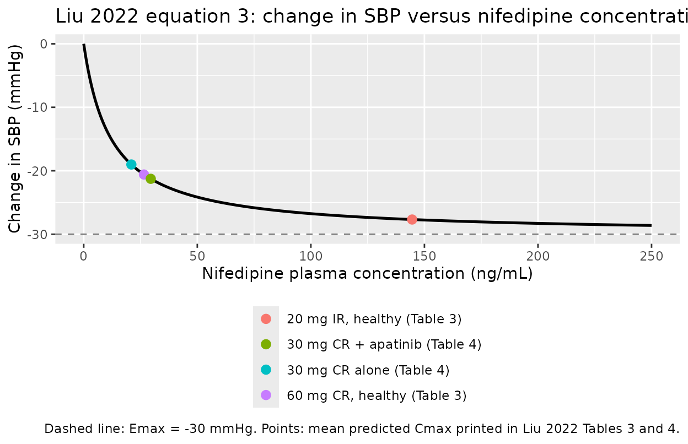
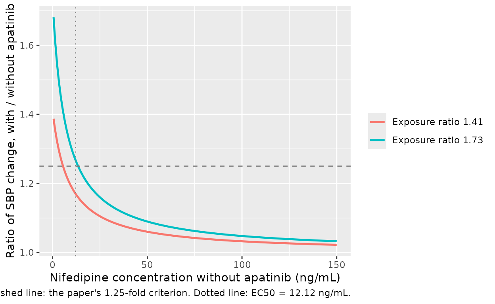

# Nifedipine (Liu 2022)

## Model and source

- Citation: Liu H, Yu Y, Liu L, Wang C, Guo N, Wang X, Xiang X, Han B.
  (2022). Application of physiologically-based
  pharmacokinetic/pharmacodynamic models to evaluate the interaction
  between nifedipine and apatinib. Frontiers in Pharmacology 13:970539.
  <doi:10.3389/fphar.2022.970539>.
- Description: Direct (ordinary, hyperbolic) Emax pharmacodynamic model
  of the change in systolic blood pressure (SBP) produced by the
  nifedipine plasma concentration in adults, the PD layer of the Liu
  2022 nifedipine PBPK/PD model used to evaluate the CYP3A4-mediated
  drug-drug interaction with apatinib (Liu 2022 equation 3). The
  concentration-effect relationship is direct, with no effect
  compartment and no baseline term: the output dsbp is the drug-induced
  change in SBP (mmHg), negative for a reduction. Only this PD layer is
  reproduced here: the PK layer is a Simcyp minimal-PBPK model whose
  clearance is entered as recombinant CYP3A4 / CYP3A5 Vmax and Km per
  pmol of enzyme and whose controlled- release absorption uses an ADAM
  model with an unprinted Weibull dissolution profile, so it cannot be
  reproduced from the publication (see the vignette ‘Assumptions and
  deviations’). The nifedipine plasma concentration is therefore
  supplied by the user as the canonical PD-driver covariate CEFFECT
  (ng/mL). Emax and EC50 were set by the authors (EC50 from the
  literature, Emax chosen as the best of a range of literature values)
  rather than estimated, and no inter-individual variability or
  residual-error model is reported, so the model is typical-value only.
- Article: <https://doi.org/10.3389/fphar.2022.970539> (open access,
  PMC9462537)

Apatinib, a VEGFR-2 tyrosine kinase inhibitor, causes hypertension in
most treated patients, and nifedipine is the antihypertensive most often
used for it. Apatinib also inhibits CYP3A4, the main clearance pathway
of nifedipine, and raises nifedipine exposure. Liu 2022 asks whether
that pharmacokinetic interaction also produces a clinically important
*pharmacodynamic* interaction – an excessive fall in blood pressure – by
chaining three pieces:

1.  a Simcyp v16 minimal-PBPK model of nifedipine (immediate-release
    tablet with first-order absorption; controlled-release tablet with
    the ADAM absorption model and a Weibull dissolution profile);
2.  the authors’ previously published Simcyp PBPK model of apatinib (Liu
    2021), linked to nifedipine through competitive CYP3A4 inhibition
    (`Ki = 0.12 uM`, `fu,mic = 0.65`);
3.  an **ordinary Emax model** (equation 3) relating the nifedipine
    plasma concentration to the change in systolic blood pressure (SBP).

**Only the third component, the PD layer, is packaged in nlmixr2lib.**
The reasoning is in [Assumptions and
deviations](#assumptions-and-deviations): the two PBPK layers are Simcyp
platform models whose clearance is entered per pmol of recombinant
enzyme and whose controlled-release absorption depends on a dissolution
profile the paper does not print, so they cannot be reproduced from the
publication. The PD layer is fully specified by the paper and is
self-contained once the nifedipine plasma concentration is supplied
through the `CEFFECT` covariate.

``` r

mod <- readModelDb("Liu_2022_nifedipine")
mod
#> function() {
#>   description <- paste(
#>     "Direct (ordinary, hyperbolic) Emax pharmacodynamic model of the change in",
#>     "systolic blood pressure (SBP) produced by the nifedipine plasma",
#>     "concentration in adults, the PD layer of the Liu 2022 nifedipine",
#>     "PBPK/PD model used to evaluate the CYP3A4-mediated drug-drug",
#>     "interaction with apatinib (Liu 2022 equation 3). The concentration-effect",
#>     "relationship is direct, with no effect compartment and no baseline term:",
#>     "the output dsbp is the drug-induced change in SBP (mmHg), negative for a",
#>     "reduction. Only this PD layer is reproduced here: the PK layer is a",
#>     "Simcyp minimal-PBPK model whose clearance is entered as recombinant",
#>     "CYP3A4 / CYP3A5 Vmax and Km per pmol of enzyme and whose controlled-",
#>     "release absorption uses an ADAM model with an unprinted Weibull",
#>     "dissolution profile, so it cannot be reproduced from the publication",
#>     "(see the vignette 'Assumptions and deviations'). The nifedipine plasma",
#>     "concentration is therefore supplied by the user as the canonical PD-driver",
#>     "covariate CEFFECT (ng/mL). Emax and EC50 were set by the authors (EC50",
#>     "from the literature, Emax chosen as the best of a range of literature",
#>     "values) rather than estimated, and no inter-individual variability or",
#>     "residual-error model is reported, so the model is typical-value only.",
#>     sep = " "
#>   )
#>   reference <- paste(
#>     "Liu H, Yu Y, Liu L, Wang C, Guo N, Wang X, Xiang X, Han B. (2022).",
#>     "Application of physiologically-based pharmacokinetic/pharmacodynamic",
#>     "models to evaluate the interaction between nifedipine and apatinib.",
#>     "Frontiers in Pharmacology 13:970539. doi:10.3389/fphar.2022.970539.",
#>     sep = " "
#>   )
#>   vignette <- "Liu_2022_nifedipine"
#>   units <- list(
#>     time = "h",
#>     dosing = "(not applicable; nifedipine plasma concentration is supplied as the CEFFECT covariate, not as a dose record)",
#>     concentration = "ng/mL (nifedipine plasma concentration via CEFFECT; the PD output dsbp is in mmHg)"
#>   )
#> 
#>   covariateData <- list(
#>     CEFFECT = list(
#>       description = "Nifedipine plasma concentration (ng/mL), supplied as the direct driver of the Emax reduction in systolic blood pressure",
#>       units = "ng/mL",
#>       type = "continuous",
#>       reference_category = NULL,
#>       notes = paste(
#>         "Member of the canonical PD-driver family CEFFECT; here the biophase is",
#>         "plasma itself, because Liu 2022 relates the change in SBP directly to",
#>         "the nifedipine concentration through an ordinary Emax model (equation",
#>         "3) with no effect compartment, citing 'a close and direct relationship",
#>         "between circulating drug concentrations and antihypertensive effect'",
#>         "(Discussion). EC50 is given as 12.12 ng/mL, so CEFFECT must be in",
#>         "ng/mL; the paper does not say whether this is total or unbound",
#>         "concentration, and every nifedipine concentration it reports",
#>         "(Tables 3 and 4, Figures 1 and 2) is total plasma, so total plasma is",
#>         "assumed. In the source study CEFFECT is the plasma profile predicted",
#>         "by the authors' Simcyp v16 minimal-PBPK model (Table 1: fu 0.039,",
#>         "B/P 0.685, Vss 0.57 L/kg, IR first-order ka 4.6 1/h with fa 1, CR",
#>         "tablet via ADAM, rCYP3A4 Vmax 22 pmol/min/pmol and Km 10.95 uM,",
#>         "rCYP3A5 Vmax 3.5 pmol/min/pmol and Km 31.9 uM). Its predicted mean",
#>         "Cmax was 26.51 ng/mL after 60 mg CR and 144.59 ng/mL after 20 mg IR",
#>         "in healthy volunteers (Table 3), and 20.97 ng/mL (alone) versus",
#>         "29.51 ng/mL (with apatinib 750 mg once daily, competitive CYP3A4",
#>         "inhibition, Ki 0.12 uM, fu,mic 0.65) after 30 mg CR (Table 4). That",
#>         "model is not reproduced in this file and cannot be reproduced from",
#>         "the publication. Users supply CEFFECT from their own nifedipine PK",
#>         "model or from observed plasma concentrations; set it to 0 for",
#>         "drug-free records."
#>       ),
#>       source_name = "C (Liu 2022 equation 3)"
#>     )
#>   )
#> 
#>   population <- list(
#>     species = "human",
#>     n_subjects = NA_integer_,
#>     n_studies = NA_integer_,
#>     age_range = "26-65 years (Simcyp virtual populations)",
#>     weight_range = "not reported",
#>     sex_female_pct = 50,
#>     disease_state = paste(
#>       "PD layer checked against published mean SBP changes in hypertensive",
#>       "patients (Figure 3; Toal 2012 for 60 mg CR, single 10 mg IR dose) and",
#>       "then applied to virtual cancer patients and patients with Child-Pugh",
#>       "A / B / C hepatic impairment receiving apatinib"
#>     ),
#>     dose_range = paste(
#>       "Nifedipine single oral doses: 60 mg and 30 mg controlled-release (CR)",
#>       "tablet, 10 mg, 20 mg and 30 mg immediate-release (IR) tablet; with or",
#>       "without apatinib 750 mg orally once daily for 8 days (nifedipine on",
#>       "day 6)."
#>     ),
#>     regions = "China (authors' institution; Sim-Chinese population for the DDI verification)",
#>     notes = paste(
#>       "No subject-level data were fitted. The PD parameters are literature",
#>       "values: EC50 12.12 ng/mL 'reported ... for nifedipine at the regular",
#>       "doses' (Hirasawa 1985; Levine 2003; Meredith and Elliott 2004;",
#>       "Niu 2021), and Emax -30 mmHg selected as the best-fitting value from",
#>       "the literature range against observed mean SBP changes after 60 mg CR",
#>       "and 10 mg IR nifedipine in hypertensive patients (Results",
#>       "'Verification of pharmacodynamic model for nifedipine'; Table 5).",
#>       "All simulations in the paper used Simcyp virtual populations of",
#>       "100 subjects aged 26-65 years, 50% female (24 subjects for the",
#>       "Sim-Chinese DDI verification), so n_subjects and n_studies are not",
#>       "applicable."
#>     )
#>   )
#> 
#>   ini({
#>     # ------------------------------------------------------------------
#>     # Liu 2022 equation 3 (Methods, 'Development and verification of
#>     # pharmacodynamic model for nifedipine'):
#>     #
#>     #          Emax * C
#>     #   E = -----------
#>     #        EC50 + C
#>     #
#>     # 'An ordinary Emax model (Eq. 3) was used to describe the relationship
#>     # between nifedipine concentration and the change of SBP ... The Emax
#>     # and EC50 were obtained from literature, which were set at -30 mmHg
#>     # and 12.12 ng/ml, respectively.'
#>     #
#>     # The paper's Emax is signed (-30 mmHg, a reduction). Here the magnitude
#>     # 30 mmHg is carried on the log scale and the sign is applied in
#>     # model(), so dsbp = -emax * C / (ec50 + C) reproduces equation 3.
#>     # ------------------------------------------------------------------
#> 
#>     lemax <- fixed(log(30))
#>     label("Log of the Emax magnitude, maximum nifedipine-induced reduction in systolic blood pressure (mmHg)")
#>     # Liu 2022 Methods PD paragraph: Emax 'set at -30 mmHg'. Results,
#>     # 'Verification of pharmacodynamic model for nifedipine': 'When the Emax
#>     # was set to -30 mmHg, the PD model fitted best.' Discussion: chosen from
#>     # the 'range of Emax values reported in the literature' by comparing
#>     # predicted and observed SBP changes. A selected value with no standard
#>     # error, so it is fixed.
#> 
#>     lec50 <- fixed(log(12.12))
#>     label("Log of EC50, nifedipine plasma concentration giving half the maximum SBP reduction (ng/mL)")
#>     # Liu 2022 Methods PD paragraph: EC50 'set at ... 12.12 ng/ml'.
#>     # Discussion: 'The EC50 was reported to be 12.12 ng/ml for nifedipine at
#>     # the regular doses ... So, the EC50 value was set to 12.12 ng/ml in this
#>     # study.' A literature value, not estimated, so it is fixed.
#> 
#>     addSd <- fixed(0)
#>     label("Additive residual SD on the change in systolic blood pressure (mmHg; zero, no residual-error model is reported)")
#>   })
#> 
#>   model({
#>     # 1. Nifedipine plasma concentration for this record, ng/mL, supplied
#>     #    through the canonical CEFFECT covariate column. The link is direct
#>     #    (no effect compartment), as in Liu 2022 equation 3.
#>     conc <- CEFFECT
#> 
#>     # 2. Typical-value PD parameters; no IIV is reported.
#>     emax <- exp(lemax)
#>     ec50 <- exp(lec50)
#> 
#>     # 3. Liu 2022 equation 3 with the signed Emax of -30 mmHg: the
#>     #    drug-induced change in SBP (mmHg), negative for a reduction.
#>     dsbp <- -emax * conc / (ec50 + conc)
#> 
#>     # 4. Observation. addSd is fixed at zero because the source reports no
#>     #    residual-error model; free it to refit to individual SBP data.
#>     dsbp ~ add(addSd)
#>   })
#> }
#> <environment: 0x5613d92a95c8>
```

## Population

No subject-level data were fitted. Every simulation in the paper used
Simcyp virtual populations of 100 subjects aged 26-65 years, half of
them female (24 subjects of the Sim-Chinese population for the DDI
verification against Zhu 2020). The PD layer was checked against
published mean SBP changes in hypertensive patients after a single 60 mg
controlled-release (CR) tablet and a single 10 mg immediate-release (IR)
tablet (Figure 3, Table 5), and was then applied to virtual cancer
patients (Table 6, Figure 4) and to patients with Child-Pugh A, B and C
hepatic impairment (Table 7), each with and without apatinib 750 mg once
daily.

``` r

str(rxode2::rxode(readModelDb("Liu_2022_nifedipine"))$population)
#> List of 10
#>  $ species       : chr "human"
#>  $ n_subjects    : int NA
#>  $ n_studies     : int NA
#>  $ age_range     : chr "26-65 years (Simcyp virtual populations)"
#>  $ weight_range  : chr "not reported"
#>  $ sex_female_pct: num 50
#>  $ disease_state : chr "PD layer checked against published mean SBP changes in hypertensive patients (Figure 3; Toal 2012 for 60 mg CR,"| __truncated__
#>  $ dose_range    : chr "Nifedipine single oral doses: 60 mg and 30 mg controlled-release (CR) tablet, 10 mg, 20 mg and 30 mg immediate-"| __truncated__
#>  $ regions       : chr "China (authors' institution; Sim-Chinese population for the DDI verification)"
#>  $ notes         : chr "No subject-level data were fitted. The PD parameters are literature values: EC50 12.12 ng/mL 'reported ... for "| __truncated__
```

## Source trace

The per-parameter origin is recorded as an in-file comment next to each
`ini()` entry in `inst/modeldb/specificDrugs/Liu_2022_nifedipine.R`. The
table below collects them in one place.

| Equation / parameter | Value | Source location |
|----|----|----|
| `dsbp <- -emax * conc / (ec50 + conc)` | n/a | Equation 3, Methods “Development and verification of pharmacodynamic model for nifedipine” |
| `conc <- CEFFECT` (direct link, no effect compartment) | n/a | Equation 3 uses the concentration `C` directly; Discussion: “a close and direct relationship between circulating drug concentrations and antihypertensive effect” |
| `lemax` (Emax) | 30 mmHg magnitude (paper: -30 mmHg), fixed | Methods PD paragraph “set at -30 mmHg”; Results “When the Emax was set to -30 mmHg, the PD model fitted best” |
| `lec50` (EC50) | 12.12 ng/mL, fixed | Methods PD paragraph “set at … 12.12 ng/ml”; Discussion “the EC50 value was set to 12.12 ng/ml in this study” |
| `addSd` | 0 (fixed) | No residual-error model is reported |
| (no IIV) | n/a | No inter-individual variability is reported for the PD parameters |

### Units

| Symbol | Quantity | Units |
|----|----|----|
| `CEFFECT` / `conc` | nifedipine plasma concentration | ng/mL (EC50 is given in ng/ml) |
| `ec50` | half-maximal plasma concentration | ng/mL |
| `emax`, `dsbp` | reduction / change in systolic blood pressure | mmHg (Table 5 and Figure 3 units) |
| `time` | time | h (Figures 3 and 4) |

`conc / (ec50 + conc)` is a ratio of concentrations and therefore
unitless, so `dsbp` carries the units of `emax` (mmHg). The model has no
ODE state and no dose record; `time` only orders the records and does
not enter any equation.

## Simulation

The model is an algebraic map from a nifedipine plasma concentration to
a change in SBP. A simulation is therefore a set of observation records
carrying the `CEFFECT` covariate. Because the model declares no `eta`,
do **not** pass `omega = NA` or apply
[`rxode2::zeroRe()`](https://nlmixr2.github.io/rxode2/reference/zeroRe.html).

``` r

conc_values <- seq(0, 250, by = 0.5)
conc_grid <- data.frame(
  id = 1L,
  time = seq_along(conc_values),
  CEFFECT = conc_values,
  evid = 0L,
  amt = 0
)

sim <- rxode2::rxSolve(mod, events = conc_grid) |>
  as.data.frame()

head(sim[, c("CEFFECT", "dsbp")])
#>   CEFFECT      dsbp
#> 1     0.0  0.000000
#> 2     0.5 -1.188590
#> 3     1.0 -2.286585
#> 4     1.5 -3.303965
#> 5     2.0 -4.249292
#> 6     2.5 -5.129959
```

### Concentration-effect curve

The paper does not plot the concentration-effect curve itself, so the
figure below marks on it the mean predicted nifedipine Cmax values the
paper prints for its PBPK simulations (Tables 3 and 4).

``` r

printed_cmax <- tibble::tribble(
  ~scenario, ~CEFFECT,
  "60 mg CR, healthy (Table 3)", 26.51,
  "20 mg IR, healthy (Table 3)", 144.59,
  "30 mg CR alone (Table 4)", 20.97,
  "30 mg CR + apatinib (Table 4)", 29.51
) |>
  mutate(dsbp = -30 * CEFFECT / (12.12 + CEFFECT))

ggplot(sim, aes(CEFFECT, dsbp)) +
  geom_line(linewidth = 0.9) +
  geom_hline(yintercept = -30, linetype = "dashed", colour = "grey50") +
  geom_point(data = printed_cmax, aes(colour = scenario), size = 2.6) +
  labs(
    x = "Nifedipine plasma concentration (ng/mL)",
    y = "Change in SBP (mmHg)",
    colour = NULL,
    title = "Liu 2022 equation 3: change in SBP versus nifedipine concentration",
    caption = paste(
      "Dashed line: Emax = -30 mmHg.",
      "Points: mean predicted Cmax printed in Liu 2022 Tables 3 and 4."
    )
  ) +
  theme(legend.position = "bottom", legend.direction = "vertical")
```



## Validation

NCA is not an applicable validation for this model: there is no dose, no
compartment and no concentration-time profile to integrate. The checks
below follow the pattern for mechanistic models: definitional
identities, boundary behaviour, and agreement with the summary values
the paper prints. Every quantity is **deterministic** (the model has no
random effects), so the identity checks use tight tolerances; where a
bound is looser it is because the paper’s value comes from a different
calculation, explained alongside.

### Definitional identities

These hold by algebra and must match to solver precision. A wrong `ec50`
moves the half-maximal point and breaks the second identity immediately;
a wrong `emax` breaks the second and third.

``` r

anchor <- rxode2::rxSolve(
  mod,
  events = data.frame(
    id = 1L, time = 1:3, evid = 0L, amt = 0,
    CEFFECT = c(0, 12.12, 1e9)
  )
) |>
  as.data.frame()

identities <- tibble::tibble(
  Property = c(
    "C = 0 gives no change",
    "C = EC50 gives Emax / 2",
    "C -> infinity gives Emax"
  ),
  Expected = c(0, -15, -30),
  Model = anchor$dsbp
)
knitr::kable(identities, digits = 6,
             caption = "Definitional identities of the ordinary Emax model.")
```

| Property                  | Expected | Model |
|:--------------------------|---------:|------:|
| C = 0 gives no change     |        0 |     0 |
| C = EC50 gives Emax / 2   |      -15 |   -15 |
| C -\> infinity gives Emax |      -30 |   -30 |

Definitional identities of the ordinary Emax model. {.table}

``` r


stopifnot(
  isTRUE(all.equal(anchor$dsbp[1], 0)),
  isTRUE(all.equal(anchor$dsbp[2], -15, tolerance = 1e-10)),
  isTRUE(all.equal(anchor$dsbp[3], -30, tolerance = 1e-6))
)
```

The change in SBP must also fall monotonically with concentration and
can never go beyond Emax:

``` r

stopifnot(
  all(diff(sim$dsbp) < 0),
  all(sim$dsbp > -30)
)
```

### Maximum SBP reduction against the paper’s printed exposures

With a direct Emax link the largest SBP reduction a subject experiences,
`Rmax`, occurs at that subject’s Cmax, so `Rmax_i = f(Cmax_i)`. The
paper prints mean predicted Cmax for the 30 mg CR DDI design (Table 4)
and mean predicted Rmax for 30 mg CR in virtual cancer patients with and
without apatinib (Table 6). Because `f` is concave, the mean of the
individual `Rmax` values is *smaller in magnitude* than `f(mean Cmax)`
(Jensen’s inequality), so the model evaluated at the printed mean Cmax
should slightly overshoot the printed mean Rmax, never undershoot it.

``` r

ddi <- tibble::tibble(
  Arm = c("30 mg CR alone", "30 mg CR + apatinib"),
  `Mean Cmax, Table 4 (ng/mL)` = c(20.97, 29.51),
  `Mean Rmax, Table 6 (mmHg)` = c(-18.62, -20.30)
)

ddi_sim <- rxode2::rxSolve(
  mod,
  events = data.frame(
    id = 1L, time = 1:2, evid = 0L, amt = 0,
    CEFFECT = ddi$`Mean Cmax, Table 4 (ng/mL)`
  )
) |>
  as.data.frame()

ddi <- ddi |>
  mutate(
    `Model f(mean Cmax) (mmHg)` = ddi_sim$dsbp,
    `Difference (%)` = 100 * (`Model f(mean Cmax) (mmHg)` -
      `Mean Rmax, Table 6 (mmHg)`) / `Mean Rmax, Table 6 (mmHg)`
  )
knitr::kable(ddi, digits = 2,
             caption = "Model SBP reduction at the printed mean Cmax versus the printed mean Rmax.")
```

| Arm | Mean Cmax, Table 4 (ng/mL) | Mean Rmax, Table 6 (mmHg) | Model f(mean Cmax) (mmHg) | Difference (%) |
|:---|---:|---:|---:|---:|
| 30 mg CR alone | 20.97 | -18.62 | -19.01 | 2.10 |
| 30 mg CR + apatinib | 29.51 | -20.30 | -21.27 | 4.76 |

Model SBP reduction at the printed mean Cmax versus the printed mean
Rmax. {.table}

``` r


stopifnot(
  # Jensen direction: the model at the mean Cmax is at least as large a
  # reduction as the paper's mean of individual maxima.
  all(ddi$`Model f(mean Cmax) (mmHg)` <= ddi$`Mean Rmax, Table 6 (mmHg)`),
  # Size: a wrong EC50 or Emax moves these by tens of percent. Achieved:
  # +2.1% and +4.8%.
  all(abs(ddi$`Difference (%)`) < 10)
)
```

Table 4 comes from the Sim-Chinese DDI-verification population (24
subjects) and Table 6 from the virtual cancer-patient population (100
subjects), so the two tables do not describe exactly the same cohort;
the agreement within 5% is nevertheless what the paper’s Emax and EC50
imply.

### The pharmacodynamic interaction is attenuated by saturation

The paper’s central conclusion is that a 1.41-fold rise in nifedipine
Cmax (and 1.73-fold rise in AUC) with apatinib changes the SBP response
by no more than 1.25-fold. Equation 3 alone explains why: for a
concentration increase by a factor R, the effect increases by the factor
R (EC50 + C) / (EC50 + R C), which is R at very low concentration and
falls towards 1 as `C` approaches and passes EC50.

``` r

ratio_model <- ddi_sim$dsbp[2] / ddi_sim$dsbp[1]
attenuation <- tibble::tibble(
  Quantity = c(
    "Cmax ratio, with / without apatinib (Table 4)",
    "Rmax ratio, paper (Table 6, 30 mg CR)",
    "Rmax ratio, model at the Table 4 mean Cmax"
  ),
  Value = c(1.41, 1.09, ratio_model)
)
knitr::kable(attenuation, digits = 3)
```

| Quantity                                      | Value |
|:----------------------------------------------|------:|
| Cmax ratio, with / without apatinib (Table 4) | 1.410 |
| Rmax ratio, paper (Table 6, 30 mg CR)         | 1.090 |
| Rmax ratio, model at the Table 4 mean Cmax    | 1.119 |

``` r


stopifnot(
  isTRUE(all.equal(
    ratio_model,
    1.41 * (12.12 + 20.97) / (12.12 + 1.41 * 20.97),
    tolerance = 1e-2
  )),
  ratio_model < 1.25,
  abs(ratio_model - 1.09) < 0.05
)
```

``` r

base_conc <- seq(0.5, 150, by = 0.5)
atten_curve <- bind_rows(
  tibble::tibble(CEFFECT = base_conc, r = 1.41),
  tibble::tibble(CEFFECT = base_conc, r = 1.73)
) |>
  mutate(
    effect_ratio = r * (12.12 + CEFFECT) / (12.12 + r * CEFFECT),
    label = paste0("Exposure ratio ", r)
  )

ggplot(atten_curve, aes(CEFFECT, effect_ratio, colour = label)) +
  geom_line(linewidth = 0.9) +
  geom_hline(yintercept = 1.25, linetype = "dashed", colour = "grey50") +
  geom_vline(xintercept = 12.12, linetype = "dotted", colour = "grey50") +
  labs(
    x = "Nifedipine concentration without apatinib (ng/mL)",
    y = "Ratio of SBP change, with / without apatinib",
    colour = NULL,
    caption = paste(
      "Dashed line: the paper's 1.25-fold criterion.",
      "Dotted line: EC50 = 12.12 ng/mL."
    )
  )
```



### Comparison with the PD-verification table (Table 5)

Table 5 compares predicted and observed Rmax in hypertensive patients.
The paper does not print the nifedipine Cmax of the hypertensive-patient
simulations, so the nearest printed exposures are the healthy-volunteer
predictions of Table 3. For the 10 mg IR tablet, the 20 mg IR Cmax is
halved (the PBPK model has linear clearance at these doses). These are
indicative comparisons across populations, not validation gates.

``` r

t5 <- tibble::tibble(
  `Dose (Table 5)` = c("60 mg CR", "10 mg IR"),
  `Exposure used (ng/mL)` = c(26.51, 144.59 / 2),
  `Exposure source` = c("Table 3, 60 mg CR Cmax", "Table 3, 20 mg IR Cmax / 2"),
  `Predicted Rmax, Table 5 (mmHg)` = c(-22.21, -30.13),
  `Observed Rmax, Table 5 (mmHg)` = c(-23.09, -33.20)
) |>
  mutate(`Model f(Cmax) (mmHg)` = -30 * `Exposure used (ng/mL)` /
    (12.12 + `Exposure used (ng/mL)`))
knitr::kable(t5, digits = 2)
```

| Dose (Table 5) | Exposure used (ng/mL) | Exposure source | Predicted Rmax, Table 5 (mmHg) | Observed Rmax, Table 5 (mmHg) | Model f(Cmax) (mmHg) |
|:---|---:|:---|---:|---:|---:|
| 60 mg CR | 26.51 | Table 3, 60 mg CR Cmax | -22.21 | -23.09 | -20.59 |
| 10 mg IR | 72.30 | Table 3, 20 mg IR Cmax / 2 | -30.13 | -33.20 | -25.69 |

The printed predicted Rmax of -30.13 mmHg for 10 mg IR is *beyond* the
model’s Emax of -30 mmHg, and the 5th percentile of the predicted curve
in Figure 3B reaches about -33 mmHg. No concentration can produce that
with a single deterministic Emax of -30 mmHg, so the paper’s Simcyp PD
simulation must have carried between-subject variability on Emax and/or
EC50 that the paper does not report. This is recorded under [Assumptions
and deviations](#assumptions-and-deviations).

## Assumptions and deviations

- **PBPK layers not reproduced.** The nifedipine PK layer is a Simcyp
  v16 minimal-PBPK model. Its clearance is entered as recombinant CYP3A4
  and CYP3A5 Vmax (pmol/min/pmol of enzyme) and Km (Table 1). Turning
  those into a hepatic and gut-wall clearance needs the enzyme
  abundances, microsomal protein per gram of liver, liver weight,
  hepatic blood flow and the intersystem extrapolation factors of the
  Simcyp population library, none of which the paper prints, and no
  in-vivo clearance is given to anchor them. The CR tablet is absorbed
  through the ADAM model with a Weibull dissolution profile taken from
  Doki 2017 whose parameters are not printed either. The apatinib layer
  is a separate Simcyp model (Liu 2021) whose clearance is also entered
  per mg of microsomal protein. The PK layers therefore cannot be
  reproduced from the publication, and the nifedipine plasma
  concentration is supplied through `CEFFECT`. The printed Table 1
  compound inputs are kept in the `CEFFECT` notes of the model file for
  provenance.
- **Total plasma concentration.** Equation 3 uses “nifedipine
  concentration” without saying total or unbound. Every concentration
  the paper reports is total plasma (Tables 3 and 4, Figures 1 and 2),
  and the EC50 of 12.12 ng/mL is a total-plasma literature value, so
  `CEFFECT` is total plasma.
- **Emax and EC50 are fixed.** Both were set rather than estimated: EC50
  from the literature, Emax chosen as the best of a range of literature
  values by comparing predicted with observed SBP changes. Neither
  carries a standard error, so both are wrapped in `fixed()`.
- **No between-subject variability.** The paper reports none for the PD
  layer, but its predicted mean Rmax for 10 mg IR (-30.13 mmHg, Table 5)
  is beyond Emax, and Figures 3 and 4 show 5th-95th percentile bands, so
  the Simcyp PD simulation must have included variability on Emax and/or
  EC50 (probably the platform default). Its magnitude is not reported
  and is not invented here; the model is typical-value only and `addSd`
  is fixed at zero.
- **Sign convention.** The paper’s Emax is signed (-30 mmHg). The model
  carries the magnitude on the log scale (`lemax = log(30)`) and applies
  the sign in `model()`, so `dsbp` is negative for a reduction, matching
  equation 3 and Figures 3 and 4.
- **AUE is not checked.** The area under the effect-time curve (Tables 5
  to 7) depends on the full predicted concentration-time course of the
  virtual populations, which the paper shows only as raster mean curves
  for a different population (Figure 2, Sim-Chinese DDI design) than its
  AUE tables. The windows over which AUE was integrated are also not
  stated (Tables 5 and 6 give 433.98 and 787.55 mmHg\*h for the same 60
  mg CR Rmax of -22.21 mmHg).
- **No erratum.** A Europe PMC search on 2026-10-09 found no correction
  notice for this article and no supplementary material.
