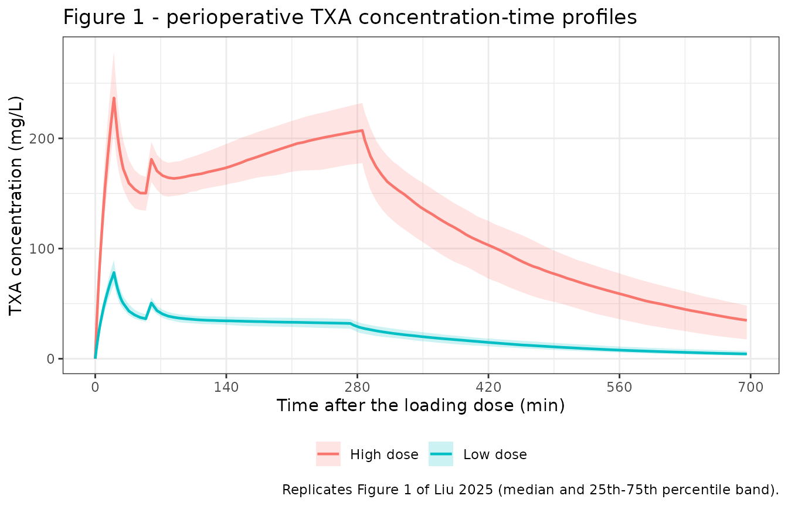

# Tranexamic acid (Liu 2025)

## Model and source

- Citation: Liu Y, Zhou C, Lv H, Tian L, Jiang J, Shi J. Population
  Pharmacokinetics of Tranexamic Acid in Chinese Population Undergoing
  Cardiac Surgery with Cardiopulmonary Bypass. Drug Des Devel Ther.
  2025;19:4343-4353. <doi:10.2147/DDDT.S493485>
- Description: Two-compartment population PK model for intravenous
  tranexamic acid (TXA) with first-order elimination, in Chinese adults
  undergoing cardiac surgery with cardiopulmonary bypass; allometric
  body weight on all four disposition parameters with exponents fixed at
  0.75 (clearances) and 1 (volumes) (Liu 2025).
- Article: <https://doi.org/10.2147/DDDT.S493485>

Liu 2025 is the first population PK analysis of tranexamic acid (TXA) in
a Chinese population. It is a two-compartment intravenous model with
first-order elimination in which body weight, entered allometrically on
all four disposition parameters, is the only retained covariate.

## Population

Sixteen adults undergoing cardiac surgery with cardiopulmonary bypass
(CPB) at Fuwai Hospital, Beijing, were randomised to a high-dose arm (n
= 7) or a low-dose arm (n = 9). The high-dose arm received a 30 mg/kg
loading dose infused over 20 minutes after induction of anaesthesia, a
16 mg/kg/h maintenance infusion continued until the end of the
operation, and a 2 mg/kg pump prime dose added to the CPB priming
solution; the low-dose arm received 10 mg/kg, 2 mg/kg/h and 1 mg/kg
respectively (Liu 2025 Methods, “Study Subjects and Dosing Regimen”).

Baseline demographics are in Liu 2025 Table 1 and perioperative data in
Table 2. Body weight was 74.3 +/- 19.9 kg (high-dose) and 68.2 +/- 12.2
kg (low-dose); age 51.4 +/- 11.3 and 59.3 +/- 9.9 years, with 18-70
years required by protocol; 5 of 16 participants (31.3%) were female.
Surgery lasted 285.3 +/- 66.1 and 272.4 +/- 61.3 minutes with 129.7 +/-
36.9 and 116.4 +/- 50.8 minutes of CPB. No between-group difference
reached significance on any tabulated characteristic. All 16
participants contributed the full 14-timepoint sampling schedule, giving
224 observations with no values below the 1 ug/mL lower limit of
quantification and no missing values or outliers.

The same information is available programmatically via the model’s
`population` metadata
(`readModelDb("Liu_2025_tranexamicAcid")()$population`).

## Source trace

The per-parameter origin is recorded as an in-file comment next to each
`ini()` entry in `inst/modeldb/specificDrugs/Liu_2025_tranexamicAcid.R`.
The table below collects them in one place for review.

| Equation / parameter | Value | Source location |
|----|----|----|
| `lcl` (CL1 at 70 kg) | 4.7 L/h | Table 4, Estimate column (%RSE 6.89); restated in Abstract Results and Discussion |
| `lvc` (V1 at 70 kg) | 4.9 L | Table 4, Estimate column (%RSE 9.86) |
| `lq` (CL2 at 70 kg) | 17.0 L/h | Table 4, Estimate column (%RSE 21.36) |
| `lvp` (V2 at 70 kg) | 11.1 L | Table 4, Estimate column (%RSE 6.83) |
| `e_wt_cl_q` | 0.75 (fixed) | Methods “Covariate Models”; Table 3 final row; Table 4 “Covariate effect” `(BW/70)^0.75` |
| `e_wt_vc_vp` | 1 (fixed) | Methods “Covariate Models”; Table 3 final row; Table 4 “Covariate effect” `(BW/70)^1` |
| `etalcl` | 0.28 (log-scale SD) | Table 4 “BSV (% RSE) (shrinkage)”: 0.28 (37) (0.03) |
| `etalq` | 0.44 (log-scale SD) | Table 4: 0.44 (44) (0.21) |
| `etalvc` | 0.30 (log-scale SD) | Table 4: 0.30 (48) (0.16) |
| `etalvp` | 0.22 (log-scale SD) | Table 4: 0.22 (45) (0.12) |
| `propSd` | 0 (fixed placeholder) | Methods “Random Effect Model” declares a proportional WSV model; **no magnitude is reported anywhere in the paper** |
| Covariate form `theta1 * (WT/70)^theta2` | n/a | Display equation typeset between the Methods “Covariate Models” paragraphs |
| Two-compartment IV structure | n/a | Methods “Structural Model”; Results “Model Construction and Optimization” |
| Bootstrap confirmation | n/a | Table 5 (1000 resamples, 95.8% convergence) |

Two entries in that table are not simple transcriptions and are
justified below and in “Assumptions and deviations”: the scale of the
BSV column, and the absent residual-error magnitude.

## Virtual cohort

Original observed data are not publicly available. The cohort below
reproduces the two randomised arms with body weights drawn from the
Table 1 means and standard deviations, truncated to 45-120 kg so that no
draw falls outside a physiologically sensible adult range.

``` r

# `set.seed()` seeds R's RNG (used here only for the weight draws). It does NOT
# seed rxode2's simulation RNG, and rxode2's streams are partitioned per solver
# thread -- so the etas drawn below differ between a 2-core CI runner and a
# 16-thread workstation. Every assertion in this vignette is written to hold for
# any cohort the model can produce (see pattern 12 of
# known-vignette-failure-patterns.md).
set.seed(20250829)
rxode2::rxSetSeed(20250829)

N_PER_ARM <- 200L   # cap is 200 per arm

# Timing constants, all in hours, from Liu 2025 Methods and Table 2.
T_LOAD_END  <- 20 / 60          # loading infusion runs 0 -> 20 min
T_CPB_START <- 60 / 60          # ASSUMED CPB onset; see Assumptions
T_SURG_HI   <- 285.29 / 60      # mean surgery duration, high-dose arm (Table 2)
T_SURG_LO   <- 272.44 / 60      # mean surgery duration, low-dose arm (Table 2)
T_FIG1      <- 140 / 60         # the Figure 1 read-off point used for validation

# Observation grid: fine through the loading peak and distribution phase,
# coarser afterwards. The Figure 1 comparison time is included exactly.
obs_times <- sort(unique(c(
  seq(0, 0.5, by = 0.025),
  seq(0.5, 12, by = 0.1),
  T_LOAD_END, T_CPB_START, T_FIG1, T_SURG_HI, T_SURG_LO
)))

make_arm <- function(n, label, wt_mean, wt_sd, load_mgkg, maint_mgkgh,
                     prime_mgkg, t_surg, id_offset = 0L) {
  subj <- tibble(
    id  = id_offset + seq_len(n),
    arm = label,
    WT  = pmin(120, pmax(45, rnorm(n, wt_mean, wt_sd)))
  )

  load_amt  <- load_mgkg * subj$WT
  maint_amt <- maint_mgkgh * subj$WT * (t_surg - T_LOAD_END)

  doses <- bind_rows(
    # 30 (or 10) mg/kg infused over 20 min.
    tibble(id = subj$id, time = 0, amt = load_amt,
           rate = load_amt / T_LOAD_END, evid = 1L),
    # 16 (or 2) mg/kg/h from the end of the loading dose to the end of surgery.
    tibble(id = subj$id, time = T_LOAD_END, amt = maint_amt,
           rate = maint_mgkgh * subj$WT, evid = 1L),
    # Pump prime dose, given as a bolus into the circuit at CPB onset.
    tibble(id = subj$id, time = T_CPB_START, amt = prime_mgkg * subj$WT,
           rate = 0, evid = 1L)
  )

  obs <- tidyr::crossing(id = subj$id, time = obs_times) |>
    mutate(amt = 0, rate = 0, evid = 0L)

  bind_rows(doses, obs) |>
    # `cmt` is the ODE STATE name, never the observable `Cc`.
    mutate(cmt = "central") |>
    left_join(subj, by = "id") |>
    arrange(id, time, desc(evid))
}

events <- bind_rows(
  make_arm(N_PER_ARM, "High dose", 74.3, 19.9, 30, 16, 2, T_SURG_HI,
           id_offset = 0L),
  make_arm(N_PER_ARM, "Low dose",  68.2, 12.2, 10,  2, 1, T_SURG_LO,
           id_offset = N_PER_ARM)
)

# Disjoint IDs across arms are mandatory -- duplicates silently merge into one
# subject receiving the summed dose.
stopifnot(!anyDuplicated(unique(events[, c("id", "time", "evid")])))
stopifnot(dplyr::n_distinct(events$id) == 2L * N_PER_ARM)
```

## Simulation

``` r

mod <- readModelDb("Liu_2025_tranexamicAcid")

sim <- rxode2::rxSolve(mod, events = events, keep = c("arm", "WT")) |>
  as.data.frame()
#> ℹ parameter labels from comments will be replaced by 'label()'

# Solver sanity: the model has no negative-concentration mechanism.
stopifnot(all(sim$Cc >= 0, na.rm = TRUE), !any(is.na(sim$Cc)))
```

## Replicate published figures

``` r

# Replicates Figure 1 of Liu 2025: perioperative TXA concentration-time profiles
# for the two dose arms. Liu 2025 plots the 16 individual observed profiles;
# here the simulated cohort is summarised as a median with a 25th-75th
# percentile band, which is the interval the paper's own VPC (Figure 3) uses.
sim |>
  group_by(arm, time) |>
  summarise(
    Q25 = quantile(Cc, 0.25),
    Q50 = median(Cc),
    Q75 = quantile(Cc, 0.75),
    .groups = "drop"
  ) |>
  mutate(minutes = time * 60) |>
  filter(minutes <= 700) |>
  ggplot(aes(minutes, Q50, colour = arm, fill = arm)) +
  geom_ribbon(aes(ymin = Q25, ymax = Q75), alpha = 0.2, colour = NA) +
  geom_line(linewidth = 0.8) +
  scale_x_continuous(breaks = seq(0, 700, by = 140)) +
  labs(
    x = "Time after the loading dose (min)", y = "TXA concentration (mg/L)",
    colour = NULL, fill = NULL,
    title = "Figure 1 - perioperative TXA concentration-time profiles",
    caption = "Replicates Figure 1 of Liu 2025 (median and 25th-75th percentile band)."
  ) +
  theme_bw() +
  theme(legend.position = "bottom")
```



The simulated profiles reproduce the shape of Liu 2025 Figure 1: a sharp
peak at the end of the 20-minute loading infusion, a dip as drug
distributes into the peripheral compartment, a slow rise through the
maintenance infusion as the system approaches steady state, and a
biexponential washout once the infusion stops at the end of surgery.

### Quantitative comparison against Figure 1

Liu 2025 reports no NCA table, so
[`nlmixr2lib::ncaComparisonTable()`](https://nlmixr2.github.io/nlmixr2lib/reference/ncaComparisonTable.md)
has no published Cmax / AUC / half-life to compare against. The paper
does however print every individual observed profile in Figure 1, and
the seven high-dose profiles are individually resolvable at 140 minutes
– part-way through the maintenance infusion, where every subject is
still being infused and the read-off does not depend on the unreported
per-subject surgery duration. Those seven values were digitised from the
published figure and are used here as the reference.

``` r

# Digitised from Liu 2025 Figure 1 at t = 140 min, high-dose arm (7 resolvable
# curves, matching n = 7). Pixel positions were converted with the axis
# calibration y = 300 -> 0 mg/L; the read-off precision is about +/- 2 mg/L.
obs_hi_140 <- c(210.7, 199.9, 191.0, 182.0, 164.3, 117.6, 108.6)

sim_140 <- sim |>
  filter(abs(time - T_FIG1) < 1e-8, arm == "High dose")

# Only the CENTRE of the distribution is compared here. The dispersion is not a
# like-for-like comparison -- the observed spread contains the unreported
# residual error while the simulated spread cannot, because propSd is fixed at
# zero -- so it is treated separately in the next section rather than shown as a
# "% difference" that is expected to be non-zero.
fig1_cmp <- tibble(
  Quantity = "Median concentration at 140 min (mg/L)",
  Simulated = median(sim_140$Cc),
  `Observed (Figure 1)` = median(obs_hi_140)
) |>
  mutate(`% difference` = 100 * (Simulated - `Observed (Figure 1)`) /
           `Observed (Figure 1)`)

knitr::kable(fig1_cmp, digits = 1,
             caption = "Simulated high-dose cohort vs the digitised Liu 2025 Figure 1 profiles at 140 min.")
```

| Quantity | Simulated | Observed (Figure 1) | % difference |
|:---|---:|---:|---:|
| Median concentration at 140 min (mg/L) | 173.4 | 182 | -4.7 |

Simulated high-dose cohort vs the digitised Liu 2025 Figure 1 profiles
at 140 min. {.table}

``` r

pct_median <- 100 * (median(sim_140$Cc) - median(obs_hi_140)) / median(obs_hi_140)

# Structural gate on the CENTRE of the distribution. A mis-transcribed clearance,
# volume, dose or unit moves the whole distribution by tens of percent; the
# realised value here is about -4%, and the median of 200 subjects has a
# sampling error near 1.5%, so 15% admits the cohort noise while still going red
# on any transcription error.
stopifnot(abs(pct_median) < 15)
```

## The scale of the Table 4 BSV column

Liu 2025 Table 4 heads its variability column “BSV (% RSE) (shrinkage)”
and lists 0.28, 0.44, 0.30 and 0.22 for CL1, CL2, V1 and V2 without
stating whether those are variances (`omega^2`) or log-scale standard
deviations (`omega`, and hence approximately the CV). Phoenix NLME,
which the authors used, can print either. The choice matters: read as
variances the implied CVs are 57%, 74%, 60% and 47%, roughly double the
28%, 44%, 30% and 22% of the standard-deviation reading.

The paper’s own Figure 1 settles it. The dispersion of the seven
observed high-dose profiles at 140 minutes is the sum of between-subject
variability, residual error and the residual body-weight effect that
survives per-kilogram dosing, so the **model’s between-subject
dispersion alone cannot exceed it**. The check below simulates the same
read-off under both readings with residual error switched off.

``` r

omega_reading <- function(sds) {
  m <- mod
  # Substitute the four eta variances for this reading; everything else,
  # including the fixed(0) residual error, is unchanged.
  m <- m |> rxode2::ini(
    etalcl ~ sds[1]^2, etalq ~ sds[2]^2,
    etalvc ~ sds[3]^2, etalvp ~ sds[4]^2
  )
  s <- rxode2::rxSolve(m, events = events, keep = c("arm")) |>
    as.data.frame() |>
    filter(abs(time - T_FIG1) < 1e-8, arm == "High dose")
  sd(log(s$Cc))
}

tab4 <- c(0.28, 0.44, 0.30, 0.22)
obs_logsd <- sd(log(obs_hi_140))

scale_cmp <- tibble(
  Reading = c("Table 4 values are log-scale SDs (omega)",
              "Table 4 values are variances (omega^2)"),
  `Implied omega` = c(paste(format(tab4), collapse = ", "),
                      paste(format(round(sqrt(tab4), 3)), collapse = ", ")),
  `Simulated BSV-only log SD` = c(omega_reading(tab4), omega_reading(sqrt(tab4)))
) |>
  mutate(
    `Observed total log SD` = obs_logsd,
    Verdict = ifelse(`Simulated BSV-only log SD` < `Observed total log SD`,
                     "compatible", "IMPOSSIBLE - exceeds the total observed spread")
  )
#> ℹ parameter labels from comments will be replaced by 'label()'
#> ℹ change initial estimate of `etalcl` to `0.0784`
#> ℹ change initial estimate of `etalq` to `0.1936`
#> ℹ change initial estimate of `etalvc` to `0.09`
#> ℹ change initial estimate of `etalvp` to `0.0484`
#> ℹ parameter labels from comments will be replaced by 'label()'
#> ℹ change initial estimate of `etalcl` to `0.28`
#> ℹ change initial estimate of `etalq` to `0.44`
#> ℹ change initial estimate of `etalvc` to `0.3`
#> ℹ change initial estimate of `etalvp` to `0.22`

knitr::kable(scale_cmp, digits = 3,
             caption = "Between-subject dispersion at 140 min implied by each reading of the Liu 2025 Table 4 BSV column.")
```

| Reading | Implied omega | Simulated BSV-only log SD | Observed total log SD | Verdict |
|:---|:---|---:|---:|:---|
| Table 4 values are log-scale SDs (omega) | 0.28, 0.44, 0.30, 0.22 | 0.159 | 0.263 | compatible |
| Table 4 values are variances (omega^2) | 0.529, 0.663, 0.548, 0.469 | 0.347 | 0.263 | IMPOSSIBLE - exceeds the total observed spread |

Between-subject dispersion at 140 min implied by each reading of the Liu
2025 Table 4 BSV column. {.table}

``` r

sd_as_sd  <- omega_reading(tab4)
#> ℹ parameter labels from comments will be replaced by 'label()'
#> ℹ change initial estimate of `etalcl` to `0.0784`
#> ℹ change initial estimate of `etalq` to `0.1936`
#> ℹ change initial estimate of `etalvc` to `0.09`
#> ℹ change initial estimate of `etalvp` to `0.0484`
sd_as_var <- omega_reading(sqrt(tab4))
#> ℹ parameter labels from comments will be replaced by 'label()'
#> ℹ change initial estimate of `etalcl` to `0.28`
#> ℹ change initial estimate of `etalq` to `0.44`
#> ℹ change initial estimate of `etalvc` to `0.3`
#> ℹ change initial estimate of `etalvp` to `0.22`

# Realised approximately 0.17 (SD reading) and 0.34 (variance reading) against an
# observed total of 0.263. With 200 subjects the sampling error of each log-SD is
# under 0.01, so both comparisons carry large margins; they are written against
# the fixed digitised constant rather than as a race between two simulated
# statistics.
stopifnot(
  # The SD reading leaves room for the unreported residual error.
  sd_as_sd < obs_logsd,
  # The variance reading does not: its BSV alone already exceeds everything
  # observed, which is arithmetically impossible.
  sd_as_var > obs_logsd
)
```

Reading the column as standard deviations leaves a residual-error budget
of 20%, which is plausible for an LC-MS/MS assay plus the unmodelled
variation in when each subject’s pump prime dose was given. Reading it
as variances requires a negative residual variance. The model therefore
uses the standard-deviation reading. The counter-argument is recorded
under “Assumptions and deviations”: the reported %RSEs of 37-48% on 16
subjects sit closer to the asymptotic relative standard error of a
variance than of a standard deviation, so this is an inference from the
paper’s data rather than something the paper states.

## PKNCA validation

``` r

sim_nca <- sim |>
  dplyr::filter(!is.na(Cc)) |>
  dplyr::select(id, time, Cc, arm)

# Guarantee a time = 0 record per subject. TXA is given intravenously and no
# subject had measurable drug before the loading dose (Liu 2025 Results: no
# observation was below the 1 ug/mL LLOQ, and T1 is the pre-dose sample), so
# Cc = 0 at time 0 is the correct anchor.
sim_nca <- dplyr::bind_rows(
  sim_nca,
  sim_nca |> dplyr::distinct(id, arm) |> dplyr::mutate(time = 0, Cc = 0)
) |>
  dplyr::distinct(id, arm, time, .keep_all = TRUE) |>
  dplyr::arrange(id, arm, time)

stopifnot(nrow(sim_nca) > 0)

conc_obj <- PKNCA::PKNCAconc(sim_nca, Cc ~ time | arm + id)

dose_df <- events |>
  dplyr::filter(evid == 1) |>
  dplyr::select(id, time, amt, arm)

dose_obj <- PKNCA::PKNCAdose(dose_df, amt ~ time | arm + id)

intervals <- data.frame(
  start     = c(0,  T_CPB_START, 5.5),
  end       = c(12, 190 / 60,    12),
  cmax      = c(TRUE,  FALSE, FALSE),
  tmax      = c(TRUE,  FALSE, FALSE),
  auclast   = c(TRUE,  FALSE, FALSE),
  cav       = c(FALSE, TRUE,  FALSE),
  half.life = c(FALSE, FALSE, TRUE)
)

nca_res <- PKNCA::pk.nca(PKNCA::PKNCAdata(conc_obj, dose_obj,
                                          intervals = intervals))

nca_tab <- as.data.frame(nca_res) |>
  # pk.nca() also returns the lambda.z regression diagnostics (lambda.z,
  # r.squared, span.ratio, ...) alongside the requested parameters; keep only
  # the five reported here.
  dplyr::filter(PPTESTCD %in% c("cmax", "tmax", "auclast", "cav", "half.life")) |>
  group_by(arm, PPTESTCD) |>
  summarise(Median = median(PPORRES), .groups = "drop") |>
  tidyr::pivot_wider(names_from = PPTESTCD, values_from = Median)

nca_tab |>
  # Headers are bound to columns BY NAME; pivot_wider's column order is
  # alphabetical and must not be relied on.
  dplyr::rename(
    "Dose arm"                          = arm,
    "Cmax (mg/L)"                       = cmax,
    "Tmax (h)"                          = tmax,
    "AUClast (mg*h/L)"                  = auclast,
    "Cav over the CPB window (mg/L)"    = cav,
    "Terminal half-life (h)"            = half.life
  ) |>
  knitr::kable(digits = 2,
               caption = "PKNCA summary of the simulated cohort, median per dose arm.")
```

| Dose arm | AUClast (mg\*h/L) | Cav over the CPB window (mg/L) | Cmax (mg/L) | Terminal half-life (h) | Tmax (h) |
|:---|---:|---:|---:|---:|---:|
| High dose | 700.46 | 166.83 | 245.63 | 2.91 | 0.17 |
| Low dose | 140.91 | 35.08 | 78.25 | 2.63 | 0.17 |

PKNCA summary of the simulated cohort, median per dose arm. {.table}

### Validation against the quantitative claims Liu 2025 makes

Liu 2025 publishes no NCA table, but it does make two quantitative
statements that the packaged model must reproduce, and the model’s own
rate constants imply a terminal half-life that PKNCA should recover from
the simulated curve.

``` r

hl_nca <- as.data.frame(nca_res) |>
  filter(PPTESTCD == "half.life") |> pull(PPORRES) |> median()

# Closed-form terminal half-life from the Table 4 typical values at 70 kg. This
# is computed from the published numbers, independently of the ODE solution, so
# comparing it with the PKNCA estimate genuinely cross-checks the encoded ODE
# rather than restating it.
cl <- 4.7; vc <- 4.9; q <- 17.0; vp <- 11.1
kel <- cl / vc; k12 <- q / vc; k21 <- q / vp
b <- kel + k12 + k21
lambda2 <- (b - sqrt(b^2 - 4 * kel * k21)) / 2
hl_closed <- log(2) / lambda2

cav_hi <- as.data.frame(nca_res) |>
  filter(PPTESTCD == "cav", arm == "High dose") |> pull(PPORRES) |> median()

claims <- tibble::tribble(
  ~Claim, ~Source, ~Reference, ~Achieved,
  "High-dose concentration during CPB (mg/L)",
  "Discussion: \"generally maintained within the range of 150-180 mg/L\"",
  "150-180", cav_hi,
  "Terminal half-life (h)",
  "Closed form from the Table 4 typical values",
  sprintf("%.2f", hl_closed), hl_nca,
  "Median high-dose concentration at 140 min (mg/L)",
  "Digitised Liu 2025 Figure 1",
  sprintf("%.1f", median(obs_hi_140)), median(sim_140$Cc)
)

knitr::kable(claims, digits = 2,
             caption = "Simulated results against the quantitative claims Liu 2025 makes.")
```

| Claim | Source | Reference | Achieved |
|:---|:---|:---|---:|
| High-dose concentration during CPB (mg/L) | Discussion: “generally maintained within the range of 150-180 mg/L” | 150-180 | 166.83 |
| Terminal half-life (h) | Closed form from the Table 4 typical values | 2.69 | 2.76 |
| Median high-dose concentration at 140 min (mg/L) | Digitised Liu 2025 Figure 1 | 182.0 | 173.39 |

Simulated results against the quantitative claims Liu 2025 makes.
{.table}

``` r

# The paper states 150-180 mg/L "generally", with "some participants briefly
# exceeding 200 mg/L", so the cohort median of the interval average is expected
# in that neighbourhood rather than exactly inside it. The bound below is wide
# enough for cohort noise (the median of 200 subjects moves by a couple of
# percent between runs) and still fails on a transcription error in CL1, in the
# maintenance rate, or in the mg/kg-to-mg conversion, any of which moves this by
# tens of percent.
stopifnot(cav_hi > 120, cav_hi < 230)

# PKNCA's terminal-phase estimate against the closed-form eigenvalue of the
# encoded rate constants. These are computed by independent routes -- a
# log-linear regression through the simulated washout versus an analytic
# eigenvalue of the published typical values -- so a disagreement means the ODE
# is not the two-compartment system Liu 2025 describes.
stopifnot(abs(hl_nca - hl_closed) / hl_closed < 0.15)
```

### Mass-balance identity

For any two-compartment system with elimination only from the central
compartment, `AUC(0, T) * CL` equals the amount administered by time `T`
minus the amount still in the body. The identity holds at any `T` and
needs no steady-state assumption, so it is an exact check on the encoded
ODE.

``` r

T_CHECK <- 12

mb <- sim |>
  filter(time <= T_CHECK) |>
  group_by(id, arm, WT) |>
  summarise(
    auc   = sum(diff(time) * (head(Cc, -1) + tail(Cc, -1)) / 2),
    still = last(central) + last(peripheral1),
    .groups = "drop"
  ) |>
  left_join(
    events |> filter(evid == 1) |> group_by(id) |>
      summarise(given = sum(amt), .groups = "drop"),
    by = "id"
  ) |>
  # CL for each subject uses that subject's drawn eta, recovered from the
  # simulation output rather than re-derived from the ini() values.
  left_join(
    sim |> group_by(id) |> summarise(cl = first(cl), .groups = "drop"),
    by = "id"
  ) |>
  mutate(pct_err = 100 * (auc * cl - (given - still)) / (given - still))

knitr::kable(
  mb |> group_by(arm) |>
    summarise(`Median % error` = median(pct_err),
              `90th percentile of |% error|` = quantile(abs(pct_err), 0.9),
              .groups = "drop") |>
    dplyr::rename("Dose arm" = arm),
  digits = 3,
  caption = "Mass-balance identity AUC(0,T) * CL = administered - remaining, at T = 12 h."
)
```

| Dose arm  | Median % error | 90th percentile of \|% error\| |
|:----------|---------------:|-------------------------------:|
| High dose |          0.129 |                          0.197 |
| Low dose  |          0.334 |                          0.523 |

Mass-balance identity AUC(0,T) \* CL = administered - remaining, at T =
12 h. {.table}

``` r


# The only error here is trapezoidal discretisation of the observation grid, so
# the bound is tight. It is not a cohort-noise quantity: every subject satisfies
# the identity to the same numerical accuracy.
stopifnot(median(abs(mb$pct_err)) < 1, quantile(abs(mb$pct_err), 0.9) < 2)
```

## Assumptions and deviations

- **Scale of the Table 4 BSV column.** Table 4 does not say whether its
  variability column holds variances or log-scale standard deviations.
  The model reads them as standard deviations, on the evidence of the
  executable gate above: the variance reading implies a between-subject
  dispersion at 140 minutes that exceeds the total dispersion of the
  paper’s own Figure 1 profiles, which cannot happen because the
  observed spread also contains residual error. The argument that points
  the other way, and is not resolved, is that the reported %RSEs of
  37-48% on 16 subjects are close to the asymptotic relative standard
  error of a variance estimate (`sqrt(2/n)` = 35%) and roughly two to
  three times that of a standard-deviation estimate (`1/sqrt(2n)` =
  18%). A user who needs the alternative reading can square the four
  values via
  `rxode2::ini(mod, etalcl = 0.28, etalq = 0.44, etalvc = 0.30, etalvp = 0.22)`.

- **Residual error is not reported and is encoded as `fixed(0)`.** Liu
  2025 Methods declares a proportional within-subject variability model
  and the Results confirm one was used, but no magnitude appears in
  Table 4, in Table 5, or anywhere else in the paper; the two cited
  supplementary items (Figures S1 and S2) are concentration-time
  profiles, not a parameter table. Rather than invent a value, `propSd`
  is fixed at zero, which records the declared structure and states that
  no magnitude was published. **Simulations that need realistic residual
  scatter must set `propSd` explicitly.** The Figure 1 comparison above
  implies a residual of roughly 20% if the standard-deviation reading of
  the BSV column is correct, but that is an inference from a digitised
  figure, not a published value, so it is not encoded.

- **Pump prime dose timing is assumed.** Liu 2025 states that the prime
  dose was added to the CPB priming solution before bypass started but
  does not report the time from the loading dose to the onset of CPB for
  each subject. This vignette assumes CPB begins 60 minutes after the
  loading dose, and gives the prime dose as a bolus into the central
  compartment at that time. The assumption affects only the simulated
  profile between roughly 60 and 120 minutes; the 140-minute validation
  read-off is taken after the prime dose has distributed in every arm.
  The model file itself carries no timing assumption.

- **Maintenance infusion duration is set to the arm mean surgery
  duration.** The maintenance infusion ran “until the end of the
  operation”, which varied per subject (285.3 +/- 66.1 minutes in the
  high-dose arm, 272.4 +/- 61.3 in the low-dose arm; Table 2). The
  cohort here uses the arm mean for every subject rather than resampling
  surgery duration, so the simulated washout is more synchronised than
  the staggered washouts visible in Liu 2025 Figure 1. Every
  quantitative gate is evaluated at 140 minutes or over windows chosen
  to avoid the washout, so the simplification does not affect them.

- **Body weight is drawn from the Table 1 arm means and SDs**, truncated
  to 45-120 kg. Liu 2025 reports no weight range, only mean +/- SD, and
  an untruncated normal draw at 74.3 +/- 19.9 kg produces implausible
  adult weights in the tails.

- **The rejected 23rd stepwise model is not implemented.** Liu 2025
  Table 3 records a candidate carrying sex on CL2 and age on CL1, but
  the authors discarded it as more complex without explaining additional
  variability and worse on -2LL, AIC and BIC. Its coefficients are
  preserved in the model file’s `covariatesDataExcluded` notes for
  provenance only. The paper also does not state which sex its indicator
  codes as 1, so the term is not reproducible as printed.

- **No published NCA comparison is possible.** Liu 2025 reports no Cmax,
  Tmax, AUC or half-life, so
  [`nlmixr2lib::ncaComparisonTable()`](https://nlmixr2.github.io/nlmixr2lib/reference/ncaComparisonTable.md)
  has no reference table to compare against. The PKNCA results are
  instead validated against the paper’s digitised Figure 1, its stated
  150-180 mg/L target range during CPB, and the closed-form terminal
  half-life implied by its own Table 4 estimates.

- **No CPB effect is encoded.** Liu 2025 tested the state of CPB, CPB
  duration and the minimum rectal temperature during CPB, and detected
  no significant effect on any PK parameter. The Discussion notes this
  does not exclude an effect – sampling during the bypass window was
  sparse and the pump prime dose offsets the haemodilution that would
  otherwise mark bypass onset – so a user modelling the intra-CPB period
  should treat the absence of a CPB term as a limitation of the source
  study rather than evidence that bypass is pharmacokinetically silent.
