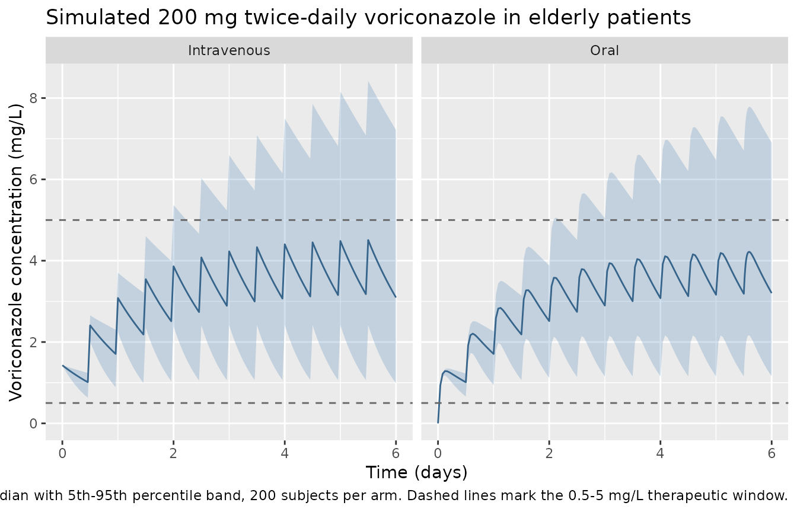

# Voriconazole (Liu 2025)

## Model and source

- Citation: Liu R, Ma P, Chen D, Yu M, Xie L, Zhao L, Huang Y, Shang S,
  Chen Y. A real-time plasma concentration prediction model for
  voriconazole in elderly patients via machine learning combined with
  population pharmacokinetics. Drug Des Devel Ther. 2025;19:4021-4034.
  <doi:10.2147/DDDT.S495050>
- Description: One-compartment population pharmacokinetic model with
  first-order absorption for intravenous and oral voriconazole in
  elderly Chinese inpatients aged 60 years and over (Liu 2025); apparent
  clearance carries median-normalized power effects of procalcitonin and
  total bile acids together with an exponential age effect centred at 72
  years, so inflammation, cholestasis and advancing age each predict
  slower clearance. This is the population pharmacokinetic layer of a
  paper whose headline product is a machine-learning ensemble that
  consumes the empirical-Bayes CL/F as its most important feature.
- Article: <https://doi.org/10.2147/DDDT.S495050>
- PubMed Central:
  <https://www.ncbi.nlm.nih.gov/pmc/articles/PMC12094827/>

Liu 2025 is primarily a machine-learning paper: its headline product is
a voting-regressor ensemble of XGBoost, random forest and CatBoost
(weighted 1:1:8) that predicts voriconazole plasma concentrations in
elderly patients. What is extracted here is the paper’s **population
pharmacokinetic layer** – an original NONMEM 7.5.1 model, fitted with
FOCE-I, whose empirical-Bayes apparent clearance is the single most
important feature of that ensemble (ranked first by mean absolute SHAP
value; Liu 2025 Figure 3B). The ensemble itself is not a pharmacokinetic
structure and is not represented in `nlmixr2lib`; only the population PK
model is.

The value of the PK layer is stated plainly by the paper’s own Table 3:
across all nine algorithms, adding CL/F as a feature lifts the
coefficient of determination from roughly 0.02-0.30 to roughly
0.42-0.76. The population PK model is what makes the machine-learning
model work.

## Population

Liu 2025 is a retrospective, single-centre study at the First Affiliated
Hospital of Army Medical University, Chongqing, China, running from
March 2022 to December 2023. It analysed **393
therapeutic-drug-monitoring concentrations from 270 elderly
inpatients**, all aged 60 years or over and treated with voriconazole
for more than three days. Patients on dialysis, those with
concentrations below the limit of quantification, and those with
incomplete administration records were excluded. Concentrations were
measured by LC-MS/MS (Shimadzu LC-30AD with an AB Sciex QTRAP 5500).

Dosing was predominantly intravenous (86.0% of training records; 14.0%
oral) at a median 6.90 mg/kg/day. At the cohort median weight of 58 kg
that is 400 mg/day – exactly the standard 200 mg twice-daily maintenance
regimen, which is the regimen simulated throughout this vignette. Median
treatment duration was 6 days and the median time after dose at sampling
was 10.57 h (IQR 9.68-11.50), consistent with pre-dose trough sampling
on a 12-hourly schedule.

One feature of Liu 2025 Table 1 is easy to misread and matters for every
comparison below: **the table is tabulated per record, not per
patient.** The 314 / 79 training / testing counts are concentrations,
not subjects, because the paper states the randomization was performed
at the sample level rather than the patient level. All baseline
statistics are therefore record-weighted.

A structural difference from the other voriconazole models in this
package is that **CYP2C19 genotype was not collected**.
`Hu_2023_voriconazole`, `Lin_2018_voriconazole` and
`Ling_2024_voriconazole` all carry an explicit CYP2C19 term; Liu 2025
does not. The authors argue the pharmacogenetic effect is smaller in the
elderly, citing their own earlier work, and note that the
empirical-Bayes CL/F partly absorbs the missing genotype information.

The same information is available programmatically via
`readModelDb("Liu_2025_voriconazole")()$population`.

``` r

pop <- rxode2::rxode(readModelDb("Liu_2025_voriconazole"))$population
#> ℹ parameter labels from comments will be replaced by 'label()'
str(pop, max.level = 1)
#> List of 13
#>  $ species       : chr "human"
#>  $ n_subjects    : int 270
#>  $ n_studies     : int 1
#>  $ n_observations: int 393
#>  $ age_range     : chr ">= 60 years (inclusion criterion)"
#>  $ age_median    : chr "72 years (training), 73 years (testing)"
#>  $ weight_median : chr "58 kg"
#>  $ sex_female_pct: num 28.3
#>  $ race_ethnicity: Named num 100
#>   ..- attr(*, "names")= chr "Chinese"
#>  $ disease_state : chr "Elderly hospitalized inpatients receiving voriconazole for more than 3 days and undergoing therapeutic drug mon"| __truncated__
#>  $ dose_range    : chr "Median daily dose 6.90 mg/kg/day (IQR 6.00-8.00). At the median weight of 58 kg this is 400 mg/day, i.e. the st"| __truncated__
#>  $ regions       : chr "Single center: the First Affiliated Hospital of Army Medical University, Chongqing, China."
#>  $ notes         : chr "Retrospective single-center study, March 2022 - December 2023. 393 therapeutic-drug-monitoring concentrations f"| __truncated__
```

## Source trace

Every `ini()` entry in
`inst/modeldb/specificDrugs/Liu_2025_voriconazole.R` carries an in-file
comment naming its origin. They are collected here for review.

The three structural equations are **display equations on page 4024** of
the article. They are worth calling out because they are vector-drawn
and therefore invisible to text extraction – `pdftotext` renders them as
a blank gap, and the preprocessed markdown drops them entirely. They
were recovered by rasterising the page and cross-checked against the
publisher’s own equation images in the Europe PMC supplementary-file
bundle (`DDDT-19-4021-e0006.jpg` through `e0008.jpg`):

``` math
\mathrm{CL/F\ (L/h)} = 4.35 \times \left(\frac{\mathrm{PCT}}{0.19}\right)^{-0.209} \times \left(\frac{\mathrm{TBA}}{3.95}\right)^{-0.158} \times e^{[-0.017 \times (\mathrm{AGE} - 72.0)]} \times e^{\eta_{\mathrm{CL}}}
```

``` math
\mathrm{V/F\ (L)} = 140 \qquad\qquad \mathrm{K_a\ (h^{-1})} = 1.1
```

| Equation / parameter | Value | Source location |
|----|----|----|
| `lka` (fixed) | 1.1 /h | Table 2, “Ka (h-1) = 1.1 fixed”; third display equation p. 4024. Methods: estimating Ka gave RSE 145%, so it was fixed “following reference 18” (Pascual 2012, Clin Infect Dis 55:381-390) |
| `lcl` | 4.35 L/h | Table 2 final model, CL/F (RSE 4.4%; bootstrap 4.33, 95% CI 3.98-4.71); leading constant of the first display equation p. 4024 |
| `lvc` | 140 L | Table 2 final model, V/F (RSE 12.6%; bootstrap 139, 95% CI 102-177); second display equation p. 4024 |
| `e_pct_cl` | -0.209 | Table 2 final model, “PCT on CL/F” (RSE 20.1%; bootstrap -0.210, 95% CI -0.305 to -0.124); exponent of (PCT/0.19) in the first display equation |
| `e_tba_cl` | -0.158 | Table 2 final model, “TBA on CL/F” (RSE 27.9%; bootstrap -0.155, 95% CI -0.255 to -0.070); exponent of (TBA/3.95) in the first display equation |
| `e_age_cl` | -0.017 /year | Table 2 final model, “Age on CL/F” (RSE 24.9%; bootstrap -0.017, 95% CI -0.026 to -0.009); coefficient in exp\[-0.017 x (AGE - 72.0)\] |
| PCT centring 0.19 ug/L | divisor | First display equation p. 4024; equals the Table 1 training-group median procalcitonin |
| TBA centring 3.95 umol/L | divisor | First display equation p. 4024; equals the Table 1 training-group median total bile acids |
| AGE centring 72.0 years | offset | First display equation p. 4024; equals the Table 1 training-group median age |
| `etalcl` | 43.9% -\> var 0.192721 | Table 2 final model, “eta CL (%)” (RSE 9.8%, shrinkage 25.0%; bootstrap 43.9%, 95% CI 35.2-52.2). Read as a log-scale SD; see “IIV scale” below |
| `propSd` | 0.289 | Table 2 final model, “Prop_error (%)” = 28.9 (RSE 12.3%, eps-shrinkage 19.0%; bootstrap 27.9%, 95% CI 19.6-34.7) |
| `addSd` | 0.885 mg/L | Table 2 final model, “Add_error (mg/L)” (RSE 9.9%; bootstrap 0.870, 95% CI 0.717-1.066) |
| `d/dt(depot)`, `d/dt(central)` | n/a | Results, “A one-compartment model with first-order absorption and elimination best described the PPK data”; Methods, NONMEM subroutine ADVAN2 TRANS2 |
| combined residual error | n/a | Methods: “Residual variability was evaluated through a combined additive and proportional error model” |

### IIV scale: why 43.9% is read as a standard deviation

Table 2’s row is labelled `eta CL (%)` with no statement of scale, so it
could be a log-scale standard deviation (variance `0.439^2 = 0.1927`) or
a coefficient of variation (variance `log(1 + 0.439^2) = 0.1763`). The
two readings differ by only 4.5% in omega, but the choice is recorded
rather than assumed, because a later reader would otherwise “correct”
it. Three independent lines favour the SD reading; the second is
reproduced as a live calculation.

**1. The residual rows of the same table settle its convention.**
`Prop_error (%) = 28.9` can only be a standard deviation: read as a
variance it would imply a residual CV of `sqrt(0.289) = 53.8%`, far
above the imprecision of the validated LC-MS/MS assay the paper cites.
Rows of one table resolve the same way.

**2. The paper publishes its own empirical-Bayes CL/F distribution**,
which can be reconstructed from Table 2.

``` r

# Table 1 (training): EBE CL/F median 4.00, IQR 3.00-5.53 L/h.
obs_sd <- log(5.53 / 3.00) / (2 * qnorm(0.75))

# Table 2: base-model IIV 53.8%, final-model 43.9%, eta-shrinkage 25.0%.
# Covariate-explained variance is the difference of the two variances; the
# EBE eta spread is the final omega shrunk by NONMEM's (SD-scale) shrinkage.
recon <- function(w_base, w_final, shrink = 0.25) {
  sqrt((w_base^2 - w_final^2) + (w_final * (1 - shrink))^2)
}
sd_reading <- recon(0.538, 0.439)
cv_reading <- recon(sqrt(log(1 + 0.538^2)), sqrt(log(1 + 0.439^2)))

tibble::tibble(
  Reading   = c("omega = 43.9/100 (SD)", "43.9% is a CV"),
  Predicted = c(sd_reading, cv_reading),
  Observed  = obs_sd,
  `Error %` = 100 * (c(sd_reading, cv_reading) / obs_sd - 1)
) |>
  knitr::kable(digits = c(0, 4, 4, 1),
               caption = "Reconstructing the Table 1 empirical-Bayes CL/F spread from Table 2.")
```

| Reading               | Predicted | Observed | Error % |
|:----------------------|----------:|---------:|--------:|
| omega = 43.9/100 (SD) |    0.4529 |   0.4534 |    -0.1 |
| 43.9% is a CV         |    0.4208 |   0.4534 |    -7.2 |

Reconstructing the Table 1 empirical-Bayes CL/F spread from Table 2.
{.table}

``` r


# The SD reading lands within a fraction of a percent of the published spread.
stopifnot(abs(sd_reading / obs_sd - 1) < 0.02)
```

Honest caveat: this line rests on NONMEM/PsN reporting eta-shrinkage on
the SD scale, which is the default. Under a variance-scale shrinkage
convention the two readings swap (0.491 vs 0.458), so it corroborates
rather than decides on its own.

**3. The same-drug sibling `Ling_2024_voriconazole`** – which also fixes
`ka` to 1.1 /h from the same Pascual 2012 source – reads its own Table 2
IIV rows as standard deviations on the same reasoning.

## Deterministic check: the published clearance equation

The first gate is pure arithmetic and carries no simulation noise: the
packaged model must reproduce the printed equation exactly. Clearance is
evaluated with the random effects zeroed at a set of covariate
combinations spanning the observed interquartile ranges, and compared
against the equation transcribed independently by hand.

``` r

mod <- readModelDb("Liu_2025_voriconazole")
mod_typ <- rxode2::zeroRe(mod)
#> ℹ parameter labels from comments will be replaced by 'label()'

# The published equation, transcribed by hand from p. 4024.
cl_published <- function(PCT, TBA, AGE) {
  4.35 * (PCT / 0.19)^-0.209 * (TBA / 3.95)^-0.158 * exp(-0.017 * (AGE - 72.0))
}

scenarios <- tibble::tribble(
  ~scenario,                     ~PCT,  ~TBA,  ~AGE,
  "Cohort median (reference)",   0.19,  3.95,  72,
  "Lower quartile PCT",          0.13,  3.95,  72,
  "Upper quartile PCT",          0.28,  3.95,  72,
  "Lower quartile TBA",          0.19,  2.50,  72,
  "Upper quartile TBA",          0.19,  7.45,  72,
  "Lower quartile age",          0.19,  3.95,  67,
  "Upper quartile age",          0.19,  3.95,  78,
  "Septic + cholestatic, age 85", 2.00, 20.00,  85
)

# Evaluate the packaged model: a single dose, one observation, read out `cl`.
ev_cl <- scenarios |>
  dplyr::mutate(id = dplyr::row_number()) |>
  tidyr::crossing(time = c(0, 1)) |>
  dplyr::mutate(
    amt  = ifelse(time == 0, 200, NA_real_),
    evid = ifelse(time == 0, 1L, 0L),
    cmt  = "central"
  ) |>
  dplyr::arrange(id, time)

cl_model <- rxode2::rxSolve(mod_typ, events = ev_cl, keep = c("scenario")) |>
  as.data.frame() |>
  dplyr::group_by(scenario) |>
  dplyr::summarise(cl_model = dplyr::first(cl), .groups = "drop")
#> ℹ omega/sigma items treated as zero: 'etalcl'
#> Warning: multi-subject simulation without without 'omega'

cl_cmp <- scenarios |>
  dplyr::mutate(cl_hand = cl_published(PCT, TBA, AGE)) |>
  dplyr::left_join(cl_model, by = "scenario") |>
  dplyr::mutate(`Diff %` = 100 * (cl_model / cl_hand - 1))

cl_cmp |>
  dplyr::rename(
    "Scenario"          = scenario,
    "PCT (ug/L)"        = PCT,
    "TBA (umol/L)"      = TBA,
    "Age (years)"       = AGE,
    "Published eq (L/h)" = cl_hand,
    "Packaged model (L/h)" = cl_model
  ) |>
  knitr::kable(digits = c(0, 2, 2, 0, 3, 3, 6),
               caption = "Packaged model vs the hand-transcribed published CL/F equation.")
```

| Scenario | PCT (ug/L) | TBA (umol/L) | Age (years) | Published eq (L/h) | Packaged model (L/h) | Diff % |
|:---|---:|---:|---:|---:|---:|---:|
| Cohort median (reference) | 0.19 | 3.95 | 72 | 4.350 | 4.350 | 0 |
| Lower quartile PCT | 0.13 | 3.95 | 72 | 4.709 | 4.709 | 0 |
| Upper quartile PCT | 0.28 | 3.95 | 72 | 4.011 | 4.011 | 0 |
| Lower quartile TBA | 0.19 | 2.50 | 72 | 4.676 | 4.676 | 0 |
| Upper quartile TBA | 0.19 | 7.45 | 72 | 3.935 | 3.935 | 0 |
| Lower quartile age | 0.19 | 3.95 | 67 | 4.736 | 4.736 | 0 |
| Upper quartile age | 0.19 | 3.95 | 78 | 3.928 | 3.928 | 0 |
| Septic + cholestatic, age 85 | 2.00 | 20.00 | 85 | 1.650 | 1.650 | 0 |

Packaged model vs the hand-transcribed published CL/F equation. {.table}

``` r


# Both sides use the same fixed parameters, so the only difference is floating
# point: a tight bound is correct here and would break on any mis-transcription.
stopifnot(max(abs(cl_cmp$`Diff %`)) < 1e-6)

# The reference subject must return the printed typical value exactly.
stopifnot(abs(cl_cmp$cl_model[cl_cmp$scenario == "Cohort median (reference)"] - 4.35) < 1e-8)
```

The reference row is the load-bearing one: because all three covariate
terms are median-centred, a subject at the cohort median of
procalcitonin, total bile acids and age returns the printed typical CL/F
of 4.35 L/h exactly.

## Virtual cohort

Individual-level data are not public. The cohort below reproduces the
Liu 2025 Table 1 training-group marginal distributions. The three
laboratory and demographic covariates the model uses are drawn
independently – the paper publishes no correlation structure – from
lognormal distributions for the two right-skewed laboratory analytes and
a truncated normal for age, each matched to the published median and
interquartile range.

``` r

# set.seed() seeds R's RNG, NOT rxode2's simulation RNG, and rxode2 partitions
# its streams per solver thread. This cohort is therefore reproducible here and
# different on a machine with a different thread count. Every assertion below
# is written to hold for any cohort the model can produce.
set.seed(20250824)

n_arm <- 200L          # per-arm cap; 200 is the maximum this package allows
tau   <- 12            # hours; 200 mg twice daily
n_dose <- 12L          # 6 days of treatment, the cohort median duration
dose_mg <- 200

# Match a lognormal to a published median and IQR.
lnorm_from_iqr <- function(n, med, q1, q3) {
  stats::rlnorm(n, meanlog = log(med), sdlog = log(q3 / q1) / (2 * qnorm(0.75)))
}

# One set of subject covariates, reused by both arms as common random numbers,
# so the intravenous / oral comparison isolates the route and is not confounded
# by two independent covariate draws.
subj_base <- tibble::tibble(
  # Table 1 training group: PCT 0.19 (0.13-0.28), TBA 3.95 (2.50-7.45)
  PCT = lnorm_from_iqr(n_arm, 0.19, 0.13, 0.28),
  TBA = lnorm_from_iqr(n_arm, 3.95, 2.50, 7.45),
  # Age 72 (67-78), truncated at the >= 60 y inclusion criterion
  AGE = pmax(60, stats::rnorm(n_arm, 72, (78 - 67) / (2 * qnorm(0.75)))),
  WT  = stats::rnorm(n_arm, 58, (61 - 55) / (2 * qnorm(0.75)))
)

t_last <- (n_dose - 1L) * tau

# Observation times. The grid endpoints are built as integer/integer divisions
# rather than seq(..., by = 0.1): `132 + 120 * 0.1` lands a few ulp ABOVE 144,
# which silently pushes the end-of-interval record outside the PKNCA window and
# returns ctrough = NA. The Liu 2025 median time after dose of 10.57 h is added
# explicitly for the same reason -- it does not fall on the 0.1 h grid.
obs_times <- sort(unique(c(
  seq(0, t_last, by = 1),
  t_last + (0:(tau * 10)) / 10,
  t_last + 10.57
)))
stopifnot(any(abs(obs_times - (t_last + tau)) < 1e-12))

# NB the grouping column is called `arm`, not `route`: PKNCA reserves `route`
# for its own dose-object column and errors with "group_cols must not overlap
# with other column names" if a grouping variable shadows it.
make_cohort <- function(arm, id_offset = 0L) {
  subj <- subj_base |>
    dplyr::mutate(id = id_offset + dplyr::row_number(), arm = arm)

  dose_cmt <- if (arm == "Intravenous") "central" else "depot"
  doses <- subj |>
    tidyr::crossing(time = seq(0, by = tau, length.out = n_dose)) |>
    dplyr::mutate(amt = dose_mg, evid = 1L, cmt = dose_cmt)

  obs <- subj |>
    tidyr::crossing(time = obs_times) |>
    dplyr::mutate(amt = NA_real_, evid = 0L, cmt = "central")

  dplyr::bind_rows(doses, obs) |> dplyr::arrange(id, time, dplyr::desc(evid))
}

events <- dplyr::bind_rows(
  make_cohort("Intravenous", id_offset = 0L),
  make_cohort("Oral",        id_offset = n_arm)
)

# Duplicate IDs across arms silently merge into one subject receiving the summed
# dose; this guard is a cheap regression check, not decoration.
stopifnot(!anyDuplicated(unique(events[, c("id", "time", "evid")])))
```

Note that observation rows use `cmt = "central"` – the ODE state – never
`cmt = "Cc"`. `Cc` is an algebraic observable; referencing it as a
compartment would make rxode2 inject a compartment slot after the ODE
states and renumber them. rxode2 returns `Cc` as an output column
regardless.

## Simulation

``` r

# NB: the object is deliberately not named `sim` -- rxSolve output carries a
# column called `sim` (the observation WITH residual error, as opposed to `Cc`
# which is the individual prediction without it), and a data frame of the same
# name shadows it in confusing ways.
simdf <- rxode2::rxSolve(
  mod, events = events,
  keep = c("arm", "PCT", "TBA", "AGE", "WT")
) |>
  as.data.frame()
#> ℹ parameter labels from comments will be replaced by 'label()'

stopifnot(all(c("Cc", "cl") %in% names(simdf)), nrow(simdf) > 0)
```

## Concentration-time profiles

``` r

simdf |>
  dplyr::filter(time <= t_last + tau) |>
  dplyr::group_by(arm, time) |>
  dplyr::summarise(
    Q05 = quantile(Cc, 0.05), Q50 = median(Cc), Q95 = quantile(Cc, 0.95),
    .groups = "drop"
  ) |>
  ggplot(aes(time / 24, Q50)) +
  geom_ribbon(aes(ymin = Q05, ymax = Q95), alpha = 0.25, fill = "steelblue") +
  geom_line(colour = "steelblue4") +
  geom_hline(yintercept = c(0.5, 5), linetype = "dashed", colour = "grey40") +
  facet_wrap(~arm) +
  labs(
    x = "Time (days)", y = "Voriconazole concentration (mg/L)",
    title = "Simulated 200 mg twice-daily voriconazole in elderly patients",
    caption = paste(
      "Median with 5th-95th percentile band, 200 subjects per arm.",
      "Dashed lines mark the 0.5-5 mg/L therapeutic window."
    )
  )
```



With a terminal half-life of 22.3 h at the typical value, a 12-hourly
regimen accumulates substantially and approaches steady state over
roughly the cohort’s 6-day median treatment duration.

## Validation against the published cohort

Liu 2025 reports no non-compartmental analysis, so there is no published
Cmax / AUC / half-life table to compare against. What it does publish
are two distributional results that the model must reproduce, plus a
closed-form identity the model must satisfy exactly.

### 1. Observed trough concentrations (Table 1)

Liu 2025 Table 1 reports observed voriconazole concentrations with a
training median of 3.40 mg/L (IQR 2.21-5.22) at a median time after dose
of 10.57 h. Simulated concentrations are read at the same 10.57 h after
the final dose. The comparison uses the `sim` column – the observation
including residual error – because the published values are measured
concentrations, not individual predictions.

``` r

tad_obs <- 10.57

troughs <- simdf |>
  dplyr::filter(abs(time - (t_last + tad_obs)) < 1e-6) |>
  dplyr::select(id, arm, Cc, sim)

stopifnot(nrow(troughs) == 2 * n_arm)   # a gate with no rows cannot go red

trough_tab <- troughs |>
  dplyr::group_by(arm) |>
  dplyr::summarise(
    Median = median(sim),
    Q1     = quantile(sim, 0.25),
    Q3     = quantile(sim, 0.75),
    .groups = "drop"
  ) |>
  dplyr::mutate(
    `Published median` = 3.40,
    `Median diff %`    = 100 * (Median / 3.40 - 1),
    `IQR ratio`        = Q3 / Q1,
    `Published IQR ratio` = 5.22 / 2.21
  )

trough_tab |>
  dplyr::rename("Route" = arm,
                "Simulated median (mg/L)" = Median,
                "Q1 (mg/L)" = Q1, "Q3 (mg/L)" = Q3) |>
  knitr::kable(digits = 2,
               caption = "Simulated steady-state concentration at 10.57 h post-dose vs Liu 2025 Table 1.")
```

| Route | Simulated median (mg/L) | Q1 (mg/L) | Q3 (mg/L) | Published median | Median diff % | IQR ratio | Published IQR ratio |
|:---|---:|---:|---:|---:|---:|---:|---:|
| Intravenous | 3.32 | 1.97 | 5.05 | 3.4 | -2.47 | 2.56 | 2.36 |
| Oral | 3.25 | 2.22 | 4.96 | 3.4 | -4.45 | 2.23 | 2.36 |

Simulated steady-state concentration at 10.57 h post-dose vs Liu 2025
Table 1. {.table style="width:100%;"}

``` r


# Assert on the CENTRE, which a mis-transcribed clearance, dose or unit moves by
# tens of percent, and on the robust spread -- never on a cohort extreme, which
# is not reproducible across rxode2 builds or solver-thread counts.
stopifnot(
  all(abs(trough_tab$`Median diff %`) < 25),
  all(trough_tab$`IQR ratio` > 1.4),
  all(trough_tab$`IQR ratio` < 3.6)
)
```

The two arms share one set of covariate draws (common random numbers),
so they differ only in the route of administration and in the
per-subject clearance random effect, which `rxSolve` draws independently
per subject id. Liu 2025 estimated no bioavailability term, so `F` is
implicitly 1 on both routes and the arms carry the same steady-state
exposure up to that eta draw (see Assumptions below).

### 2. Between-subject spread in clearance

The simulated CL/F distribution must carry the variability implied by
Table 2 – the 43.9% between-subject term plus the spread contributed by
the three covariates. Table 1’s empirical-Bayes CL/F values are shrunk
toward the typical value by 25%, so the simulated (unshrunk) spread
should be modestly *wider* than the published one; that direction is
itself a check.

``` r

cl_subj <- simdf |>
  dplyr::group_by(id, arm) |>
  dplyr::summarise(cl = dplyr::first(cl), .groups = "drop")

cl_sd_sim <- sd(log(cl_subj$cl))

tibble::tibble(
  Quantity = c("Simulated log-scale SD of CL/F",
               "Published EBE log-scale SD (Table 1 IQR)",
               "Table 2 base-model IIV (unexplained + covariates)"),
  Value = c(cl_sd_sim, log(5.53 / 3.00) / (2 * qnorm(0.75)), 0.538)
) |>
  knitr::kable(digits = 3, caption = "Between-subject spread in apparent clearance.")
```

| Quantity                                          | Value |
|:--------------------------------------------------|------:|
| Simulated log-scale SD of CL/F                    | 0.509 |
| Published EBE log-scale SD (Table 1 IQR)          | 0.453 |
| Table 2 base-model IIV (unexplained + covariates) | 0.538 |

Between-subject spread in apparent clearance. {.table}

``` r


tibble::tibble(
  Quantity = c("Simulated median CL/F (L/h)", "Published EBE median CL/F (L/h)"),
  Value    = c(median(cl_subj$cl), 4.00)
) |>
  knitr::kable(digits = 2)
```

| Quantity                        | Value |
|:--------------------------------|------:|
| Simulated median CL/F (L/h)     |  4.37 |
| Published EBE median CL/F (L/h) |  4.00 |

``` r


# The simulated spread should bracket the published base-model IIV of 0.538 and
# exceed the shrunken EBE spread of 0.453. Bounds are wide enough to admit
# cohort noise at any thread count but still break on a mis-scaled omega: the
# rejected CV reading of the IIV row would pull this down toward 0.42.
stopifnot(cl_sd_sim > 0.45, cl_sd_sim < 0.68)
```

### 3. Closed-form identity: steady-state AUC equals Dose / CL

For a linear one-compartment model the area under the curve across a
dosing interval **at steady state** is exactly `Dose / CL`, independent
of `ka` and `V`. Both sides of this comparison use the same drawn
parameters, so the only discrepancy is trapezoidal error – unlike the
cohort comparisons above, a tight bound is the correct assertion here.

The identity must be tested where it actually holds. The 6-day cohort
above follows the paper’s median treatment duration, which is *not* the
same thing as steady state: at the typical clearance the half-life is
22.3 h, but a subject two standard deviations below the typical
clearance has a half-life near 54 h and is still accumulating after six
days. This gate therefore re-doses the same cohort with `ss = 1`, which
asks the solver for the exact steady-state solution.

``` r

subjects <- events |>
  dplyr::distinct(id, arm, PCT, TBA, AGE, WT)

ss_dose <- subjects |>
  dplyr::mutate(
    time = 0, amt = dose_mg, evid = 1L, ss = 1L, ii = tau,
    cmt  = ifelse(arm == "Intravenous", "central", "depot")
  )

ss_obs <- subjects |>
  tidyr::crossing(time = (0:(tau * 20)) / 20) |>   # exact 0.05 h grid ending on tau
  dplyr::mutate(amt = NA_real_, evid = 0L, ss = 0L, ii = 0, cmt = "central")

ev_ss <- dplyr::bind_rows(ss_dose, ss_obs) |>
  dplyr::arrange(id, time, dplyr::desc(evid))

sim_ss <- rxode2::rxSolve(mod, events = ev_ss, keep = c("arm")) |>
  as.data.frame()

auc_trap <- sim_ss |>
  dplyr::arrange(id, time) |>
  dplyr::group_by(id, arm) |>
  dplyr::summarise(
    auc = sum(diff(time) * (head(Cc, -1) + tail(Cc, -1)) / 2),
    cl  = dplyr::first(cl),
    .groups = "drop"
  ) |>
  dplyr::mutate(auc_closed = dose_mg / cl,
                pct = 100 * (auc / auc_closed - 1))

auc_trap |>
  dplyr::group_by(arm) |>
  dplyr::summarise(
    `Median AUC0-tau (mg*h/L)` = median(auc),
    `Median Dose/CL (mg*h/L)`  = median(auc_closed),
    `Max abs diff %`           = max(abs(pct)),
    .groups = "drop"
  ) |>
  dplyr::rename("Route" = arm) |>
  knitr::kable(digits = 3,
               caption = "Steady-state AUC over the dosing interval vs the closed form Dose/CL.")
```

| Route | Median AUC0-tau (mg\*h/L) | Median Dose/CL (mg\*h/L) | Max abs diff % |
|:---|---:|---:|---:|
| Intravenous | 48.494 | 48.494 | 0.000 |
| Oral | 45.010 | 45.011 | 0.003 |

Steady-state AUC over the dosing interval vs the closed form Dose/CL.
{.table}

``` r


# Pure trapezoidal error on a 0.05 h grid: this bound would break on any
# mis-transcription of the dose, the clearance equation or the volume.
stopifnot(max(abs(auc_trap$pct)) < 1)
```

How far the 6-day cohort sits from that steady state is itself worth
reporting, because it is the regimen the paper’s patients were actually
sampled on.

``` r

auc_6d <- simdf |>
  dplyr::filter(time >= t_last - 1e-9, time <= t_last + tau + 1e-9) |>
  dplyr::arrange(id, time) |>
  dplyr::group_by(id, arm) |>
  dplyr::summarise(
    auc_6d = sum(diff(time) * (head(Cc, -1) + tail(Cc, -1)) / 2),
    .groups = "drop"
  )

approach <- auc_trap |>
  dplyr::select(id, arm, auc_ss = auc, cl) |>
  dplyr::left_join(auc_6d, by = c("id", "arm")) |>
  dplyr::mutate(pct_of_ss = 100 * auc_6d / auc_ss)

approach |>
  dplyr::group_by(arm) |>
  dplyr::summarise(
    `Median % of steady state` = median(pct_of_ss),
    `10th percentile`          = quantile(pct_of_ss, 0.10),
    .groups = "drop"
  ) |>
  dplyr::rename("Route" = arm) |>
  knitr::kable(digits = 1,
               caption = "Day-6 exposure as a percentage of true steady state.")
```

| Route       | Median % of steady state | 10th percentile |
|:------------|-------------------------:|----------------:|
| Intravenous |                     96.8 |            42.0 |
| Oral        |                     94.6 |            49.9 |

Day-6 exposure as a percentage of true steady state. {.table}

The median subject is close to steady state by day 6, but the
slow-clearance tail is not – a reminder that a trough drawn on the
paper’s median 6-day treatment duration is not a steady-state trough for
every patient.

## PKNCA validation

Steady-state non-compartmental analysis over one dosing interval,
stratified by route. This block runs on the `ss = 1` solve built above
rather than on the final interval of the 6-day cohort, for two reasons:
it is the interval over which the closed-form `Dose / CL` identity
actually holds, and its dose sits at time zero.

That second point is not cosmetic.
[`PKNCA::pk.calc.ctrough()`](https://humanpred.github.io/pknca/reference/pk.calc.ctrough.html)
matches the interval end against the concentration times **relative to
the dose** (`time %in% end`), so running the same analysis over the
absolute window 132-144 h with the dose at 132 h returns `ctrough = NA`
for every subject while `cmin`, `cav` and `auclast` all compute normally
– a silent gap rather than an error. Anchoring the dose at time zero
makes the match exact.

``` r

sim_nca <- sim_ss |>
  dplyr::filter(!is.na(Cc)) |>
  dplyr::select(id, time, Cc, arm)

dose_df <- ev_ss |>
  dplyr::filter(evid == 1) |>
  dplyr::select(id, time, amt, arm)

stopifnot(nrow(sim_nca) > 0, nrow(dose_df) == 2 * n_arm)

conc_obj <- PKNCA::PKNCAconc(sim_nca, Cc ~ time | arm + id,
                             concu = "mg/L", timeu = "h")
dose_obj <- PKNCA::PKNCAdose(dose_df, amt ~ time | arm + id, doseu = "mg")

intervals <- data.frame(
  start   = 0,
  end     = tau,
  cmax    = TRUE,
  tmax    = TRUE,
  ctrough = TRUE,
  cav     = TRUE,
  auclast = TRUE
)

nca_res <- PKNCA::pk.nca(
  PKNCA::PKNCAdata(conc_obj, dose_obj, intervals = intervals)
)

nca_tab <- as.data.frame(nca_res$result) |>
  dplyr::group_by(arm, PPTESTCD) |>
  dplyr::summarise(Median = median(PPORRES, na.rm = TRUE), .groups = "drop") |>
  tidyr::pivot_wider(names_from = PPTESTCD, values_from = Median)

nca_tab |>
  dplyr::rename("Route" = arm) |>
  knitr::kable(digits = 2,
               caption = "Median steady-state NCA parameters over one 12 h dosing interval.")
```

| Route       | auclast |  cav | cmax | ctrough | tmax |
|:------------|--------:|-----:|-----:|--------:|-----:|
| Intravenous |   48.49 | 4.04 |  4.8 |    3.37 | 0.00 |
| Oral        |   45.01 | 3.75 |  4.2 |    3.17 | 2.25 |

Median steady-state NCA parameters over one 12 h dosing interval.
{.table}

``` r


# ctrough is the quantity therapeutic drug monitoring actually samples; a silent
# all-NA column here would mean the interval end never matched a record.
stopifnot(!is.na(nca_tab$ctrough), nca_tab$ctrough > 0)
```

`cav` multiplied by the 12 h interval is the same quantity the
closed-form gate above checked against `Dose / CL`; `ctrough` is the
model’s prediction of the pre-dose trough that therapeutic drug
monitoring actually measures. Note that for the oral arm the
end-of-interval concentration (`ctrough`) rather than `cmin` is the
trough of interest – with first-order absorption the minimum within an
interval falls early, before absorption overtakes elimination, and is
not the clinically sampled value. `ctrough` is `NA` unless a record sits
exactly on the interval end, which the 0.05 h grid above guarantees.

## Assumptions and deviations

- **Route encoding and the absence of a bioavailability term.** Liu 2025
  pooled intravenous (86% of records) and oral (14%) data and reported
  apparent parameters CL/F and V/F throughout, without estimating a
  separate bioavailability term. The model therefore encodes no
  `lfdepot` and no `f(depot)`: `F` is implicitly 1 on both routes. A
  direct consequence is that the model predicts identical steady-state
  exposure for a 200 mg oral and a 200 mg intravenous dose, differing
  only in the shape of the absorption phase. That is a faithful
  transcription of what the paper fitted, not a modelling choice made
  here, but it should not be used to compare routes.
- **Infusion duration is not stated.** The paper gives no infusion time
  for the intravenous doses, so this vignette doses as a bolus into
  `central`. For the trough-focused comparisons above the difference is
  negligible; a user reproducing peak concentrations should add the
  clinically usual 1-2 h infusion via `rate` or `dur`.
- **No IIV on V/F.** Liu 2025 states that IIV “was successfully
  estimated on clearance divided by bioavailability (CL/F)” and Table 2
  carries a single inter-individual variability row. The absence of an
  `etalvc` is a faithful transcription of the published model, not an
  omission.
- **IIV scale.** Table 2’s `eta CL (%) = 43.9` is read as a log-scale
  standard deviation rather than a coefficient of variation; the
  reasoning and the rejected alternative are set out in the “IIV scale”
  section above.
- **Covariates are drawn independently.** Procalcitonin, total bile
  acids, age and weight are simulated from independent marginal
  distributions matched to the Liu 2025 Table 1 medians and
  interquartile ranges. The paper publishes no correlation structure. In
  reality procalcitonin and bile acids would be positively correlated in
  septic patients with hepatic dysfunction, so the simulated clearance
  spread is, if anything, conservative.
- **Table 1 is record-weighted, not patient-weighted.** The published
  medians and IQRs reproduced by the cohort are over 393 concentration
  records from 270 patients, because the paper randomized at the sample
  level. A patient-weighted cohort would differ slightly.
- **Baseline versus time-varying covariates.** Liu 2025 does not state
  whether procalcitonin and total bile acids enter as a baseline value
  or a per-sample time-varying series; the retrospective design drew
  covariates from the medical record alongside each sample, which
  suggests the latter. This vignette holds them constant per subject.
- **Missing covariate values were median-imputed** in the source
  analysis before modelling (Methods, “Data Collection and Processing”),
  so the published distributions the cohort matches are post-imputation.
- **No CYP2C19 genotype.** Unlike the sibling voriconazole models in
  this package, Liu 2025 collected no genotype, and none is represented
  here.
- **C-reactive protein is absent by design.** It was excluded from the
  whole analysis for a missing rate above 50% (Discussion, limitation
  four), which is why the inflammation covariate in this model is
  procalcitonin rather than the more commonly modelled CRP.
- **Nonlinear elimination is not modelled.** Voriconazole is known to
  show nonlinear pharmacokinetics, but only 5.7% of daily doses in this
  cohort exceeded the 10 mg/kg/day threshold above which the authors
  cite nonlinearity as material, so linear elimination was retained.
  Predictions at high doses should be treated with caution.
- **Covariate support.** Every subject was aged 60 years or over by the
  inclusion criteria, so the age effect is supported only over roughly
  60-90 years. The two laboratory covariates enter as power terms with
  no upper bound; extrapolation far outside the published interquartile
  ranges (PCT 0.13-0.28 ug/L, TBA 2.50-7.45 umol/L) is not supported by
  the data.
- **The machine-learning layer is not represented.** The paper’s
  headline XGBoost / random-forest / CatBoost voting ensemble, its RFECV
  feature selection and its SHAP interpretation are not pharmacokinetic
  structures and are outside the scope of `nlmixr2lib`. Only the
  population PK model that supplies the ensemble’s most important
  feature is extracted.

## Errata and source notes

- **The three model equations are invisible to text extraction.** They
  are vector-drawn display equations on p. 4024; `pdftotext` yields a
  blank gap and the preprocessed markdown drops them silently. They were
  recovered by rasterising the page at 400 dpi and independently
  confirmed against the publisher’s equation images in the Europe PMC
  supplementary bundle (`DDDT-19-4021-e0006.jpg` to `e0008.jpg`). Any
  future re-extraction that works only from extracted text will miss the
  covariate functional forms, the three centring constants, and the fact
  that age enters exponentially while the two laboratory covariates
  enter as powers.
- **Table 2’s residual-error rows merge under automated table
  extraction.** The `Prop_error (%)` and `Add_error (mg/L)` rows share a
  cell block; a markdown conversion renders them as a single row reading
  “31.4 0.893 \| 10.5 11.1 \| …”. The layout-preserving extraction
  separates them correctly, and the values used here (28.9% and 0.885
  mg/L final) come from that reading.
- **Table 1’s PCT row header is set as “PCTon CL/F”** in Table 2
  (missing space); it is the procalcitonin effect on apparent clearance.
- The paper states 393 concentrations from 270 patients, split 314 / 79
  into training and testing **by record**, not by patient. The footnote
  markers in Table 1 are also mismatched: the notes define superscripts
  `a`, `b`, `c` (creatinine clearance, glucocorticoid, proton-pump
  inhibitor) while the table body uses `d`, `e`, `f` for the same three
  rows.
- Liu 2025 was posted as a preprint on SAGE Advance prior to publication
  (linked in the article’s Disclosure section). No erratum or
  corrigendum was found for this article. \`\`\`
