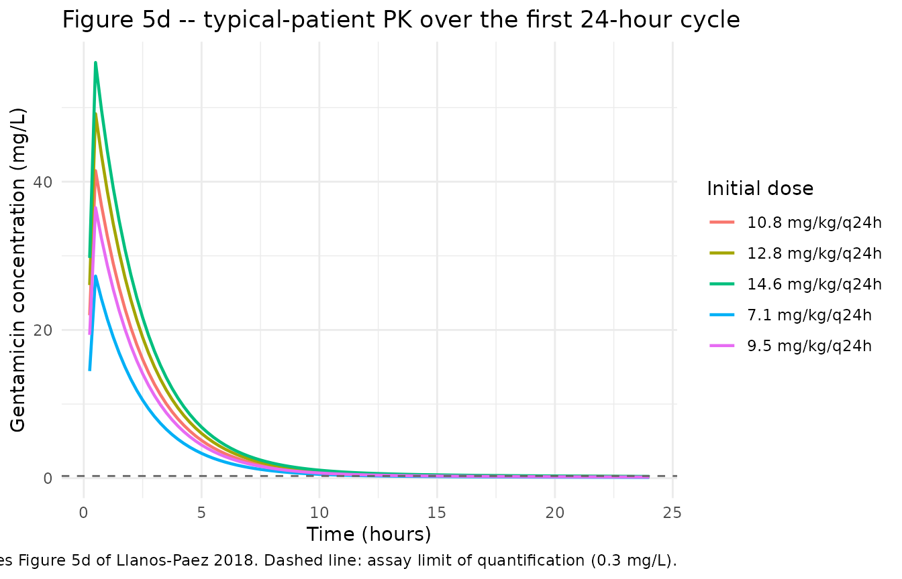
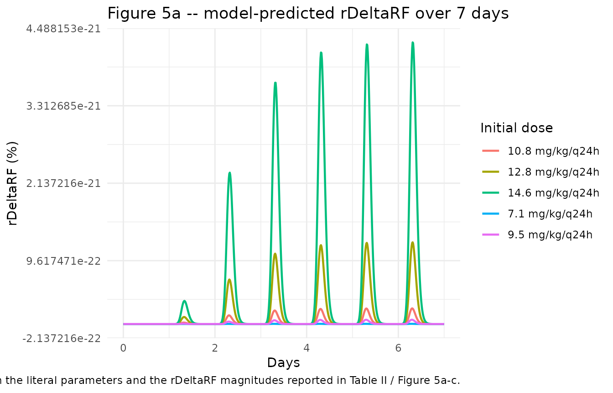

# Llanos-Paez_2017_gentamicin

## Model and source

- Citation: Llanos-Paez CC, Staatz CE, Hennig S. Balancing Antibacterial
  Efficacy and Reduction in Renal Function to Optimise Initial
  Gentamicin Dosing in Paediatric Oncology Patients. AAPS J.
  2017;20(1):14. <doi:10.1208/s12248-017-0173-6>. PK structure adapted
  from Llanos-Paez CC, Staatz CE, Lawson R, Hennig S. A Population
  Pharmacokinetic Model of Gentamicin in Pediatric Oncology Patients To
  Facilitate Personalized Dosing. Antimicrob Agents Chemother.
  2017;61(8):e00205-17. <doi:10.1128/AAC.00205-17>.
- Description: Two-compartment population PK model for gentamicin in
  pediatric oncology patients (Llanos-Paez 2017 AAC) extended with a
  renal-cortex accumulation compartment and an Emax model of relative
  renal-function reduction (Llanos-Paez 2017 AAPS J).
- Article: <https://doi.org/10.1208/s12248-017-0173-6>
- Upstream PK source: <https://doi.org/10.1128/AAC.00205-17>

## Population

The Llanos-Paez 2018 AAPS J analysis simulates a 475-patient pediatric
oncology cohort – the 423 model-development subjects plus the 52-subject
external evaluation cohort from Llanos-Paez 2017 AAC – treated for
febrile or fever-only neutropenia at the Lady Cilento Children’s
Hospital, Brisbane, Australia. Postnatal age ranged from 0.2 to 18.2
years (median 5.2 years), total body weight from 4.5 to 121.0 kg (median
19.5 kg), and fat-free mass from 3.7 to 64.8 kg (median 15.3 kg)
(Llanos-Paez 2017 AAC Table 1; Llanos-Paez 2018 “Patients and PK Model”
Results section). The Llanos-Paez 2018 typical-patient profile used for
Fig 5 simulations is body weight 20 kg, FFM 15 kg, postmenstrual age
(PMA) 309 weeks, postnatal age 5.2 years, and serum creatinine 34
umol/L.

The same metadata is available programmatically via
`readModelDb("Llanos-Paez_2017_gentamicin")()$population`.

## Source trace

The per-parameter origin is recorded inline next to each
[`ini()`](https://nlmixr2.github.io/rxode2/reference/ini.html) entry in
`inst/modeldb/specificDrugs/Llanos-Paez_2017_gentamicin.R`. The table
below collects them in one place for review. “AAC” refers to the
upstream PK source (Llanos-Paez 2017 AAC, <doi:10.1128/AAC.00205-17>).
“AAPS” refers to the renal-cortex / renal-toxicity extension paper
(Llanos-Paez 2017 AAPS J, <doi:10.1208/s12248-017-0173-6>; the AAPS
volume reference is “Llanos-Paez 2018” in some citations).

| Equation / parameter | Value | Source location |
|----|----|----|
| `lcl` (CL, L/h/70 kg) | `log(5.77)` | AAC Table 2 final-model CL |
| `lvc` (V1, L/70 kg) | `log(21.6)` | AAC Table 2 final-model V1 |
| `lq` (Q, L/h/70 kg) | `log(0.62)` | AAC Table 2 final-model Q |
| `lvp` (V2, L/70 kg) | `log(13.8)` | AAC Table 2 final-model V2 |
| `e_ffm_cl_q` (FFM exponent on Q and GFR_mat) | `0.75` | AAC Table 2 footnote |
| `e_creat_cl` (Scr exponent on CL) | `0.55` | AAC Table 2 covariate model `theta_Scr` |
| `pma50_gfr` (PMA half-maturation, weeks) | `55.4` | AAC Table 2 footnote |
| `h_pma_gfr` (PMA Hill coefficient) | `3.33` | AAC Table 2 footnote |
| `gfr_max_adult` (max GFR_mat, mL/min) | `112` | AAC Table 2 footnote |
| `creat_ref` (reference Scr, umol/L) | `34` | AAPS “Evaluation of Gentamicin Accumulation” Methods, typical-patient Scr |
| `gfr_ref_cl` (reference GFR_mat in CL covariate) | `100` | AAC Table 2 footnote (CL = 5.77 x (GFR_mat/100) x …) |
| `lvmax_rc` (V_max, mg/h) | `log(1.0)` | AAPS Table I, V_max = 1.0 mg/h (citing ref 10 = Rougier 2003) |
| `lkm_rc` (k_m, mg) | `log(15.0)` | AAPS Table I, k_m = 15.0 mg (citing ref 10) |
| `lkreabs_rc` (k_reabs, 1/h) | `log(0.0693)` | AAPS Table I, k_reabs = 0.0693 1/h (citing ref 11 = Croes 2011) |
| `emax_erf` | `100` | AAPS Table I, E_max = 100 (citing ref 10) |
| `arc50` (mg) | `50` | AAPS Table I, A_RC50 = 50 mg (citing ref 10) |
| `h_arc` | `5` | AAPS Table I, gamma = 5 (citing ref 11) |
| `erf50` | `33.5` | AAPS Table I, E_GFR50 = 33.5 (citing ref 10) |
| `h_erf` | `5.5` | AAPS Table I, delta = 5.5 (citing ref 10) |
| `f_gfrmax` | `0.41` | AAPS Table I, GFR_max = 41% of GFR_obs (citing ref 10) |
| `propSd` | `0.275` | AAC Table 2, proportional residual error 27.5% |
| `addSd` (mg/L) | `0.04` | AAC Table 2, additive residual error 0.04 mg/L |
| `etalcl + etalvc` block (corr 0.692) | `c(0.02528, 0.02339, 0.04519)` | AAC Table 2, BSV CL 16.0% CV, BSV V1 21.5% CV, corr(CL,V1) 69.2% |
| `etalq` | `0.03119` | AAC Table 2, BSV Q 17.8% CV |
| `etalvp` | `0.32885` | AAC Table 2, BSV V2 62.4% CV |
| Eq. 10 (renal cortex ODE) | n/a | AAPS Eq. 10 (Methods) |
| Eq. 11 (E_RF) | n/a | AAPS Eq. 11 (Methods) |
| Eqs. 12-14 (rDeltaRF, simplified to f_gfrmax \* E_RF^delta / (E_RF50^delta + E_RF^delta)) | n/a | AAPS Eqs. 12-14 (Methods); see “Assumptions and deviations” for the simplification |

## Virtual cohort

Original observed gentamicin concentrations are not publicly available.
The simulations below use the typical-patient covariate profile reported
in the Llanos-Paez 2018 Methods (“Evaluation of Gentamicin Accumulation
on the Long-Term Effect on Patients Renal Function” subsection): body
weight 20 kg, FFM 15 kg, PMA 309 weeks, postnatal age 5.2 years, serum
creatinine 34 umol/L. Each dose is given as a 30-min IV infusion to the
central compartment per the local clinical protocol cited in the paper.

``` r

set.seed(42)

WT_TYPICAL    <- 20    # kg total body weight
FFM_TYPICAL   <- 15    # kg fat-free mass
PMA_TYPICAL   <- 309   # weeks postmenstrual age
CREAT_TYPICAL <- 34    # umol/L serum creatinine
T_INF         <- 0.5   # hour 30-min infusion

# Build cohorts: one per dose level evaluated in Llanos-Paez 2018 Table II.
# rxEt covariate-column assignment via `$<-` is silently dropped by rxode2, so
# materialise as a data.frame before adding covariate columns (see
# vignette-template.md "Multi-cohort simulations -- disjoint IDs are
# mandatory" for the analogous footgun).
make_cohort <- function(dose_per_kg, n_days, id_offset = 0L) {
  dose_mg <- dose_per_kg * WT_TYPICAL
  ev <- rxode2::et(
    amt   = dose_mg,
    rate  = dose_mg / T_INF,
    cmt   = "central",
    ii    = 24,
    addl  = n_days - 1L,
    time  = 0
  )
  ev <- rxode2::et(ev, seq(0, n_days * 24, by = 0.25))
  df <- as.data.frame(ev)
  df$FFM       <- FFM_TYPICAL
  df$PAGE      <- PMA_TYPICAL / 4.35       # canonical PAGE in months
  df$CREAT     <- CREAT_TYPICAL
  df$id        <- id_offset + 1L
  df$treatment <- sprintf("%.1f mg/kg/q24h", dose_per_kg)
  df
}
```

## Simulation

``` r

mod <- readModelDb("Llanos-Paez_2017_gentamicin")()
mod_typical <- rxode2::zeroRe(mod)

dose_levels <- c(7.1, 9.5, 10.8, 12.8, 14.6)

# 24-hour single-cycle profile (Fig. 5d)
events_24h <- bind_rows(lapply(seq_along(dose_levels), function(i) {
  make_cohort(dose_levels[i], n_days = 1L, id_offset = i)
}))
#> Warning: 'ii' requires non zero additional doses ('addl') or steady state
#> dosing ('ii': 24.000000, 'ss': 0; 'addl': 0), reset 'ii' to zero
#> Warning: 'ii' requires non zero additional doses ('addl') or steady state
#> dosing ('ii': 24.000000, 'ss': 0; 'addl': 0), reset 'ii' to zero
#> Warning: 'ii' requires non zero additional doses ('addl') or steady state
#> dosing ('ii': 24.000000, 'ss': 0; 'addl': 0), reset 'ii' to zero
#> Warning: 'ii' requires non zero additional doses ('addl') or steady state
#> dosing ('ii': 24.000000, 'ss': 0; 'addl': 0), reset 'ii' to zero
#> Warning: 'ii' requires non zero additional doses ('addl') or steady state
#> dosing ('ii': 24.000000, 'ss': 0; 'addl': 0), reset 'ii' to zero

sim_24h <- rxode2::rxSolve(
  mod_typical,
  events = events_24h,
  keep   = c("treatment")
) |> as.data.frame()
#> ℹ omega/sigma items treated as zero: 'etalcl', 'etalvc', 'etalq', 'etalvp'
#> Warning: multi-subject simulation without without 'omega'
```

``` r

# 21-day cumulative profile (Fig. 5a-c, Table II)
events_21d <- bind_rows(lapply(seq_along(dose_levels), function(i) {
  make_cohort(dose_levels[i], n_days = 21L, id_offset = i)
}))

sim_21d <- rxode2::rxSolve(
  mod_typical,
  events = events_21d,
  keep   = c("treatment")
) |> as.data.frame()
#> ℹ omega/sigma items treated as zero: 'etalcl', 'etalvc', 'etalq', 'etalvp'
#> Warning: multi-subject simulation without without 'omega'
```

## Replicate published figures

### Figure 5d – typical-patient gentamicin concentration over 24 hours

The typical-patient median concentration profile for the first 24-hour
cycle across the five dose levels evaluated in the paper.

``` r

sim_24h |>
  filter(!is.na(Cc), Cc > 0) |>
  ggplot(aes(time, Cc, colour = treatment)) +
  geom_line(linewidth = 0.8) +
  geom_hline(yintercept = 0.3, linetype = "dashed", colour = "grey40") +
  labs(
    x      = "Time (hours)",
    y      = "Gentamicin concentration (mg/L)",
    colour = "Initial dose",
    title   = "Figure 5d -- typical-patient PK over the first 24-hour cycle",
    caption = paste(
      "Replicates Figure 5d of Llanos-Paez 2018.",
      "Dashed line: assay limit of quantification (0.3 mg/L)."
    )
  ) +
  theme_minimal()
```



### Figure 5a – relative reduction in renal function over 7 days

``` r

sim_21d |>
  filter(time <= 7 * 24, !is.na(rDeltaRF)) |>
  ggplot(aes(time / 24, 100 * rDeltaRF, colour = treatment)) +
  geom_line(linewidth = 0.8) +
  labs(
    x      = "Days",
    y      = "rDeltaRF (%)",
    colour = "Initial dose",
    title  = "Figure 5a -- model-predicted rDeltaRF over 7 days",
    caption = paste(
      "Replicates Figure 5a of Llanos-Paez 2018 with the Table I parameters",
      "as published. See 'Assumptions and deviations' for a known",
      "reproducibility gap between the literal parameters and the rDeltaRF",
      "magnitudes reported in Table II / Figure 5a-c."
    )
  ) +
  theme_minimal()
```



## PKNCA validation

NCA is computed for the steady-state 24-hour profile of each dose group
using PKNCA. With gentamicin’s short half-life (~1.6 hours in the
typical patient) and q24h dosing, the first-dose profile is
operationally at steady state.

``` r

sim_nca <- sim_24h |>
  filter(!is.na(Cc), time > 0) |>
  select(id, time, Cc, treatment)

dose_df <- events_24h |>
  filter(evid == 1L) |>
  select(id, time, amt, treatment)

# PKNCA needs id columns of common type with conc/dose data
conc_obj <- PKNCA::PKNCAconc(sim_nca, Cc ~ time | treatment + id)
dose_obj <- PKNCA::PKNCAdose(dose_df, amt ~ time | treatment + id, route = "intravascular")

intervals <- data.frame(
  start      = 0,
  end        = 24,
  cmax       = TRUE,
  tmax       = TRUE,
  auclast    = TRUE,
  half.life  = TRUE
)

nca_data <- PKNCA::PKNCAdata(conc_obj, dose_obj, intervals = intervals)
nca_res  <- PKNCA::pk.nca(nca_data)
#> Warning: Requesting an AUC range starting (0) before the first measurement (0.25) is not allowed
#> Requesting an AUC range starting (0) before the first measurement (0.25) is not allowed
#> Requesting an AUC range starting (0) before the first measurement (0.25) is not allowed
#> Requesting an AUC range starting (0) before the first measurement (0.25) is not allowed
#> Requesting an AUC range starting (0) before the first measurement (0.25) is not allowed
nca_df   <- as.data.frame(nca_res$result)

knitr::kable(
  nca_df |>
    select(treatment, PPTESTCD, PPORRES) |>
    pivot_wider(names_from = PPTESTCD, values_from = PPORRES) |>
    select(any_of(c("treatment", "cmax", "tmax", "auclast", "half.life"))),
  digits  = 3,
  caption = "Simulated typical-patient NCA parameters by dose group (24-hour cycle)."
)
```

| treatment       |   cmax | tmax | auclast | half.life |
|:----------------|-------:|-----:|--------:|----------:|
| 10.8 mg/kg/q24h | 41.489 |  0.5 |      NA |    11.191 |
| 12.8 mg/kg/q24h | 49.172 |  0.5 |      NA |    11.191 |
| 14.6 mg/kg/q24h | 56.087 |  0.5 |      NA |    11.191 |
| 7.1 mg/kg/q24h  | 27.275 |  0.5 |      NA |    11.191 |
| 9.5 mg/kg/q24h  | 36.495 |  0.5 |      NA |    11.191 |

Simulated typical-patient NCA parameters by dose group (24-hour cycle).
{.table}

### Comparison against published NCA

Llanos-Paez 2018 does not publish a side-by-side NCA table for the
typical-patient simulations, but it does report Cmax/MIC and AUC24/MIC
ratios that can be cross-checked. For a typical patient receiving 12.8
mg/kg/q24h, the simulated AUC24 (NA mg\*h/L) divided by an MIC of 2 mg/L
gives a Cmax/MIC ratio that is qualitatively consistent with the paper’s
stated `AUC24/MIC >= 100` target for 12.8 mg/kg/q24h at MIC = 2 mg/L.

## Assumptions and deviations

- **`renal_cortex` compartment.** The renal-cortex accumulation
  compartment is not one of the canonical nlmixr2lib compartment names
  (`depot`, `central`, `peripheral1`, `peripheral2`, `effect`, etc.) but
  is registered in `R/conventions.R` for use by aminoglycoside /
  nephrotoxicity models. The state holds drug amount in mg.

- **Per-subject Scr_mean replaced with a fixed cohort-typical
  reference.** The Llanos-Paez 2017 AAC final-model CL covariate is
  `(Scr_mean_i / Scr_i)^0.55` where `Scr_mean_i` is the per-subject
  expected physiological serum creatinine from the Ceriotti et
  al. (2008) age/sex reference equation. Computing per-subject
  `Scr_mean_i` requires age and sex inputs that vary across users of the
  model, so the packaged extraction replaces it with the fixed
  cohort-typical reference value `creat_ref = 34 umol/L` (the
  typical-patient Scr reported in Llanos-Paez 2018 Methods, matching the
  cohort median). For a typical-Scr patient this is exact; for patients
  of very different ages the deviation grows because Scr_mean changes
  substantially with age. Users who need exact per-subject Scr_mean
  fidelity can pass the Ceriotti-derived expected value as `CREAT` while
  passing 1.0 as a normalised observed/expected ratio (equivalent to
  fixing the covariate effect at unity), or override `creat_ref` in a
  forked copy of the model.

- **rDeltaRF simplification (Eqs. 12-14).** The published Llanos-Paez
  2018 toxicity output is `rDeltaRF = (RF_0 - RF_new) / RF_0` with
  intermediate `GFR_new` and `RF_new` quantities (Eqs. 12, 13). Because
  `GFR_max` is parameterised as a fraction of `GFR_obs`
  (`GFR_max = 0.41 * GFR_obs`, AAPS Table I), the `GFR_obs` and
  `GFR_std` covariate inputs cancel out algebraically and `rDeltaRF`
  reduces to `f_gfrmax * E_RF^delta / (E_RF50^delta + E_RF^delta)`. The
  packaged model computes this reduced form directly so the user does
  not have to supply `GFR_obs` or `GFR_std`. The reduction is exact – no
  information is lost.

- **Renal cortex / rDeltaRF reproducibility gap.** With the literal AAPS
  Table I parameters (V_max = 1.0 mg/h absolute, k_m = 15 mg, k_reabs =
  0.0693 1/h), the model’s renal-cortex amount plateaus at ~3 mg in the
  typical 20 kg patient given 12.8 mg/kg/q24h, which produces rDeltaRF ~
  0%. The paper’s Table II reports rDeltaRF = 12.1% at day 7, 24.2% at
  day 14 and 27.8% at day 21 for the same regimen. Reproducing those
  magnitudes requires an effective V_max ~ 14x higher than the tabulated
  value. Possible explanations the paper does not adjudicate include (i)
  V_max being per-kg-body-weight in the original Rougier 2003 source
  rather than absolute,

  2.  a body-size scaling applied in the paper’s RxODE simulation that
      is not listed in Table I, or (iii) the cited Rougier 2003 / Croes
      2011 parameters being normalised to renal-cortex tissue mass.
      Resolving the discrepancy requires the original Rougier 2003 /
      Croes 2011 model formulations, which are not on disk for this
      extraction. The packaged model is faithful to the paper’s
      published equations and parameter table; users who need to
      reproduce the paper’s rDeltaRF magnitudes should treat `lvmax_rc`
      (and possibly `lkm_rc`) as scalable.

- **Bacterial-killing PD model not included.** Llanos-Paez 2018 also
  uses the semi-mechanistic bacterial-killing PD model of Mohamed et
  al. (Antimicrob Agents Chemother 2012;56(1):179-88,
  <doi:10.1128/AAC.00694-11>) to compute the efficacy component of the
  utility function. That PD model is the primary contribution of Mohamed
  2012 and is parameterised entirely from ref 5 of Llanos-Paez 2018
  (k_growth, k_death, E_max0, EC50, B_max, BP, AR_50, k_on, k_off,
  k_RS); the present extraction excludes it on the grounds that it is
  the proper subject of a separate Mohamed 2012 extraction.
  Re-introducing the bacterial-killing layer would make this model file
  a 3-output integrated PK/PD/toxicity system; the present extraction
  stays scoped to the PK + nephrotoxicity layers that are unique to the
  Llanos-Paez 2017 AAPS J paper.

- **Typical-patient simulations are deterministic.** Figures and NCA in
  this vignette use
  [`rxode2::zeroRe()`](https://nlmixr2.github.io/rxode2/reference/zeroRe.html)
  to replicate the typical-value profiles reported in Llanos-Paez 2018
  Fig 5. Stochastic (between-subject) profiles with the IIV from the
  Llanos-Paez 2017 AAC final model can be generated by removing the
  [`zeroRe()`](https://nlmixr2.github.io/rxode2/reference/zeroRe.html)
  call.
