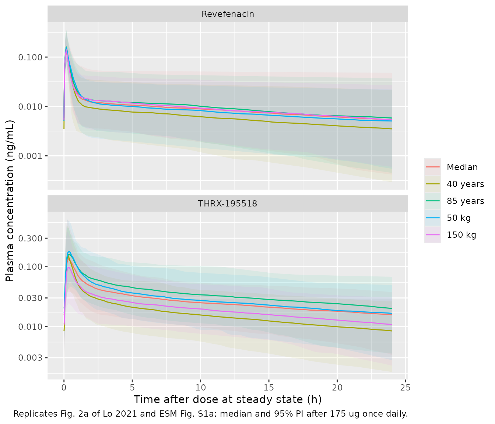

# Revefenacin (Lo 2021)

## Model and source

- Citation: Lo A, Borin MT, Bourdet DL. Population Pharmacokinetics of
  Revefenacin in Patients with Chronic Obstructive Pulmonary Disease.
  Clin Pharmacokinet. 2021;60(3):391-401.
  <doi:10.1007/s40262-020-00938-3>. Parameter estimates are from Table
  2; covariate equations from Methods 2.4; covariate medians (age 64
  years, weight 81 kg) from Results 3.4. The omega variances, the
  population median weight (81.2 kg) and the shared-eta form of the
  CLmet/V3 ‘correlation’ are confirmed against the FDA Clinical
  Pharmacology Review of NDA 210598 (Yupelri, 2018), Tables 4.1.2.2.2
  and 4.1.2.4.1.
- Article (open access, CC BY-NC 4.0):
  <https://doi.org/10.1007/s40262-020-00938-3>
- Electronic supplementary material (EuropePMC `PMC7932972`):
  <https://europepmc.org/article/PMC/PMC7932972>
- FDA Clinical Pharmacology Review of NDA 210598 (Yupelri), used to
  confirm the variance scale, the population median weight and the form
  of the metabolite “correlation” term:
  <https://www.accessdata.fda.gov/drugsatfda_docs/nda/2018/210598Orig1s000ClinPharmR.pdf>

Revefenacin is a lung-selective long-acting muscarinic antagonist given
once daily by jet nebulizer for the maintenance treatment of chronic
obstructive pulmonary disease (COPD). It is rapidly hydrolysed to its
major metabolite THRX-195518. Lo 2021 pooled plasma revefenacin and
THRX-195518 concentrations from three phase II and two phase III studies
and described them with a two-compartment parent model absorbed from a
“lung” dosing depot, feeding a two-compartment metabolite model through
a fixed fraction (21%) of the individual revefenacin clearance (Fig. 1
of the paper).

The paper fitted the metabolite *sequentially*: the individual (post
hoc) revefenacin parameters were fixed and only the THRX-195518
parameters were estimated. This implementation couples both analytes in
one rxode2 model with the same structure, so a simulation draws the
parent and metabolite random effects together.

## Population

935 patients with moderate to very severe COPD (Table 1, Results 3.1):
age 41-88 years (mean 63.5, median 64), weight 38.5-192 kg (mean 83.3,
median 81.2), 52.2% men, 90.3% White, 46% current smokers and 32.5% on
concomitant LABA/ICS therapy; estimated creatinine clearance 22-151
mL/min. Doses were 22-700 ug once daily for 1, 7 or 28 days in the phase
II studies 0059, 0091 and 0117 (Lo 2021 Studies 1-3) and 88 or 175 ug
once daily for 12 weeks in the phase III studies 0126 and 0127 (Studies
4 and 5). Nebulization lasted 10.3 (SD 2.08) minutes on average (Table
1).

``` r

str(readModelDb("Lo_2021_revefenacin")()$population)
#> List of 16
#>  $ species       : chr "human"
#>  $ n_subjects    : int 935
#>  $ n_studies     : int 5
#>  $ n_observations: chr "10043 revefenacin and 10717 THRX-195518 measurable plasma concentrations (Results 3)"
#>  $ age_range     : chr "41-88 years"
#>  $ age_median    : chr "64 years"
#>  $ weight_range  : chr "38.5-192 kg"
#>  $ weight_median : chr "81.2 kg"
#>  $ sex_female_pct: num 47.8
#>  $ race_ethnicity: Named num 90.3
#>   ..- attr(*, "names")= chr "White"
#>  $ disease_state : chr "Moderate to very severe chronic obstructive pulmonary disease"
#>  $ dose_range    : chr "22-700 ug once daily by jet nebulizer for 1, 7 or 28 days (phase II); 88 or 175 ug once daily for 12 weeks (phase III)"
#>  $ renal_function: chr "Estimated creatinine clearance 22-151 mL/min, mean 71.7 (SD 20.7)"
#>  $ co_medication : chr "32.5% concomitant LABA/ICS therapy"
#>  $ regions       : chr "Multinational (USA, New Zealand, South Africa, UK and others)"
#>  $ notes         : chr "Baseline demographics from Lo 2021 Table 1 and Results 3.1 (488 men, 447 women). Studies: 0059 (Study 1, single"| __truncated__
```

## Source trace

| Model element | Value | Source location |
|----|----|----|
| Two-compartment parent, first-order absorption from a lung depot | structure | Results 3.2; Fig. 1 |
| `lcl` CL/F | 668 L/h | Table 2 |
| `lvc` V1/F | 867 L | Table 2 |
| `lq` Q/F | 2607 L/h | Table 2 |
| `lvp` V2/F | 15,495 L | Table 2 |
| `lka` ka | 200 1/h (fixed) | Table 2 (unit printed ‘L/h’); Results 3.2, 3.5 |
| `lfdepot` F1 reference | 1 (fixed) | Results 3.2 (F1 carries only the covariate terms) |
| `e_study0059_fdepot` | 0.553 | Table 2 ‘Study 1 effect on F1’ |
| `e_dose_fdepot` | 0.0987 | Table 2 ‘Dose effect on F1’ |
| `e_age_cl` | -0.559 | Table 2 ‘Age effect on CL/F’ |
| `e_wt_q` | 0.485 | Table 2 ‘Weight effect on Q/F’ |
| `etalcl`, `etalvc`, `etalq`, `etalvp`, `etalfdepot` | 0.316, 0.0722, 0.0962, 0.272, 0.114 | Table 2 IIV (56.2, 26.9, 31.0, 52.2, 33.7%); FDA review Table 4.1.2.4.1 variances |
| Two-compartment metabolite formed from Fmet x CL/F | structure | Results 3.3; Fig. 1 |
| `lcl_thrx195518` CLmet/F | 53.2 L/h | Table 2 |
| `lvc_thrx195518` V3/F | 20.4 L | Table 2 |
| `lq_thrx195518` Qmet/F | 36.3 L/h | Table 2 |
| `lvp_thrx195518` V4/F | 35.8 L | Table 2 |
| `fm` Fmet | 0.21 (fixed) | Table 2; Results 3.3 (ADME recovery) |
| `vc_thrx195518_eta_scale` | 1.45 | Table 2 ‘Correlation between CLmet and V3’; FDA review (‘an additional THETA term’) |
| `e_age_cl_thrx195518` | -0.777 | Table 2 ‘Age effect on CLmet/F’ |
| `e_wt_fm` | -0.406 | Table 2 ‘Weight effect on Fmet’ |
| `etalcl_thrx195518` | 0.13 | Table 2 IIV 36.0%; FDA review variance 0.13 |
| Continuous covariate form `(Cov / median)^theta` | equation | Methods 2.4 |
| Categorical covariate form `theta^K` | equation | Methods 2.4 |
| Age median 64 years; weight median 81.2 kg | centring | Results 3.4 (64 y, 81 kg); FDA review Table 4.1.2.2.2 (64.0, 81.2) |
| Dose reference 175 ug | centring | not printed – see Assumptions |
| `propSd`, `addSd`, `propSd_thrx195518`, `addSd_thrx195518` | 0 (fixed) | not reported – see Assumptions |
| 10-minute nebulization into the depot | dosing | Methods 2.6 |

## Model

``` r

mod <- rxode2::rxode2(readModelDb("Lo_2021_revefenacin"))
#> ℹ parameter labels from comments will be replaced by 'label()'
# The explicit ODEs must be kept (a cl/vc pair can trigger rxode2's linear
# compartment auto-solve); a NULL linCmt confirms the ODE system is used.
stopifnot(is.null(mod$linCmt))
mod_typical <- rxode2::zeroRe(mod)
```

## Event tables

Revefenacin is dosed as a 10-minute zero-order input into the lung depot
(Methods 2.6: “The duration of nebulization … was assumed to be 10
min”), once daily for 21 days so that the slow terminal phase (half-life
about a day) reaches steady state. The model has two endpoints (`Cc` and
`Cc_thrx195518`), so observation rows name the ODE state `central` and
carry `dvid = 1`; the solve returns both concentrations on every
observation row.

``` r

tau <- 24
n_dose <- 21
t_last <- (n_dose - 1) * tau
# Dense grid over the steady-state interval, finer through the 10-minute
# nebulization and the rapid distribution phase.
obs_times <- sort(unique(c(
  0,
  t_last + c(seq(0, 0.5, by = 1 / 120), seq(0.5, 4, by = 0.05), seq(4, 24, by = 0.25))
)))

make_events <- function(ids, dose, covariates) {
  doses <- tidyr::expand_grid(id = ids, time = (seq_len(n_dose) - 1) * tau) |>
    dplyr::mutate(amt = dose, evid = 1L, cmt = "depot", dur = 10 / 60, dvid = NA_integer_)
  obs <- tidyr::expand_grid(id = ids, time = obs_times) |>
    dplyr::mutate(amt = 0, evid = 0L, cmt = "central", dur = 0, dvid = 1L)
  ev <- dplyr::bind_rows(doses, obs) |>
    dplyr::arrange(id, time, dplyr::desc(evid))
  # Covariate columns go after the event columns (see rxode2 5.1.8 note in
  # the DOSE_REVEFENACIN_UG register entry).
  ev$DOSE_REVEFENACIN_UG <- dose
  for (nm in names(covariates)) ev[[nm]] <- covariates[[nm]][match(ev$id, ids)]
  ev
}

median_subject <- list(AGE = 64, WT = 81.2, STUDY_0059 = 0)
```

## Typical-value steady state and mass balance

With no residual error and a linear system, the steady-state `AUC0-24`
of the parent must equal `F x Dose / CL` and that of the metabolite
`Fmet x F x Dose / CLmet` (everything cleared from the parent’s central
compartment, times the formed fraction, is eliminated by `CLmet`). These
are exact identities of the implemented equations, checked here with
PKNCA.

``` r

scenarios <- tibble::tribble(
  ~scenario,        ~dose, ~AGE, ~WT,   ~STUDY_0059,
  "median, 175 ug", 175,   64,   81.2,  0,
  "median, 88 ug",  88,    64,   81.2,  0,
  "40 years",       175,   40,   81.2,  0,
  "85 years",       175,   85,   81.2,  0,
  "50 kg",          175,   64,   50,    0,
  "150 kg",         175,   64,   150,   0,
  "Study 0059",     175,   64,   81.2,  1
) |>
  dplyr::mutate(id = dplyr::row_number())

ev_typ <- dplyr::bind_rows(lapply(seq_len(nrow(scenarios)), function(i) {
  s <- scenarios[i, ]
  make_events(s$id, s$dose, list(AGE = s$AGE, WT = s$WT, STUDY_0059 = s$STUDY_0059))
}))

sim_typ <- rxode2::rxSolve(mod_typical, events = ev_typ, returnType = "data.frame") |>
  dplyr::left_join(dplyr::select(scenarios, id, scenario), by = "id")
#> ℹ omega/sigma items treated as zero: 'etalcl', 'etalvc', 'etalq', 'etalvp', 'etalfdepot', 'etalcl_thrx195518'
#> Warning: multi-subject simulation without without 'omega'

nca_long <- function(sim) {
  sim |>
    dplyr::filter(time >= t_last) |>
    dplyr::select(id, scenario, time, Cc, Cc_thrx195518) |>
    tidyr::pivot_longer(c(Cc, Cc_thrx195518), names_to = "analyte", values_to = "conc") |>
    dplyr::mutate(analyte = ifelse(analyte == "Cc", "revefenacin", "THRX-195518")) |>
    dplyr::filter(!is.na(conc))
}

run_nca <- function(sim, dose_df) {
  conc_obj <- PKNCA::PKNCAconc(nca_long(sim), conc ~ time | scenario + analyte + id,
                               concu = "ng/mL", timeu = "h")
  dose_obj <- PKNCA::PKNCAdose(dose_df, amt ~ time | scenario + analyte + id,
                               doseu = "ug")
  intervals <- data.frame(start = t_last, end = t_last + tau,
                          auclast = TRUE, cmax = TRUE, tmax = TRUE)
  res <- PKNCA::pk.nca(PKNCA::PKNCAdata(conc_obj, dose_obj, intervals = intervals))
  as.data.frame(res$result)
}

dose_typ <- tidyr::expand_grid(scenarios, analyte = c("revefenacin", "THRX-195518")) |>
  dplyr::transmute(id, scenario, analyte, time = t_last, amt = dose)
nca_typ <- run_nca(sim_typ, dose_typ)

auc_typ <- nca_typ |>
  dplyr::filter(PPTESTCD == "auclast") |>
  dplyr::select(scenario, analyte, auc = PPORRES)

auc_of <- function(scn, an) auc_typ$auc[auc_typ$scenario == scn & auc_typ$analyte == an]

closed_parent <- 1 * 175 / 668
closed_metab <- 0.21 * 1 * 175 / 53.2
mass_balance <- data.frame(
  analyte = c("revefenacin", "THRX-195518"),
  closed_form = c(closed_parent, closed_metab),
  pknca = c(auc_of("median, 175 ug", "revefenacin"), auc_of("median, 175 ug", "THRX-195518"))
) |>
  dplyr::mutate(pct_diff = 100 * (pknca - closed_form) / closed_form)
mass_balance |>
  dplyr::rename("Analyte" = analyte, "F x Dose / CL (ng*h/mL)" = closed_form,
                "PKNCA AUC0-24,ss (ng*h/mL)" = pknca, "% diff" = pct_diff) |>
  knitr::kable(digits = 4)
```

| Analyte     | F x Dose / CL (ng\*h/mL) | PKNCA AUC0-24,ss (ng\*h/mL) | % diff |
|:------------|-------------------------:|----------------------------:|-------:|
| revefenacin |                   0.2620 |                      0.2620 | 0.0044 |
| THRX-195518 |                   0.6908 |                      0.6908 | 0.0023 |

``` r


# Same parameters on both sides -> pure numerical error (trapezoid on a dense
# grid), so a tight bound is appropriate.
stopifnot(all(abs(mass_balance$pct_diff) < 0.5))
```

A mutation control confirms the gate is not vacuous: a 10% change in the
formed fraction moves the metabolite AUC by 10%, well outside the 0.5%
bound.

``` r

mod_mut <- rxode2::zeroRe(rxode2::ini(mod, fm = 0.21 * 1.1))
#> ℹ change initial estimate of `fm` to `0.231`
ev_mut <- make_events(1L, 175, median_subject)
sim_mut <- rxode2::rxSolve(mod_mut, events = ev_mut, returnType = "data.frame")
#> ℹ omega/sigma items treated as zero: 'etalcl', 'etalvc', 'etalq', 'etalvp', 'etalfdepot', 'etalcl_thrx195518'
if (is.null(sim_mut$id)) sim_mut$id <- 1L
ss_mut <- dplyr::filter(sim_mut, time >= t_last)
auc_mut <- sum(diff(ss_mut$time) * (utils::head(ss_mut$Cc_thrx195518, -1) +
  utils::tail(ss_mut$Cc_thrx195518, -1)) / 2)
stopifnot(abs(100 * (auc_mut - closed_metab) / closed_metab) > 9)
```

## Covariate effects (Results 3.4 and ESM)

The paper reports, for steady state after 175 ug, the change in exposure
of a typical 64-year-old, 81-kg patient when age or weight is moved to
the edges of the observed range. The paper’s percentages come from
2000-subject simulations; the implemented model’s are typical-value
ratios, which is what those simulations estimate when only one covariate
differs.

``` r

paper_cov <- tibble::tribble(
  ~scenario,   ~analyte,      ~paper_pct, ~source,
  "40 years",  "revefenacin", -24,        "Results 3.4",
  "85 years",  "revefenacin", 18,         "Results 3.4",
  "50 kg",     "revefenacin", -3,         "Results 3.4",
  "150 kg",    "revefenacin", 0,          "Results 3.4",
  "40 years",  "THRX-195518", -30,        "ESM, Fig. S1 text",
  "85 years",  "THRX-195518", 24,         "ESM, Fig. S1 text",
  "50 kg",     "THRX-195518", 21,         "ESM, Fig. S1 text",
  "150 kg",    "THRX-195518", -24,        "ESM, Fig. S1 text",
  "median, 88 ug", "revefenacin", -100 * (1 - 88 / 175 / 1.07), "Discussion (175 ug absorbed 7% more than 88 ug)"
) |>
  dplyr::rowwise() |>
  dplyr::mutate(model_pct = 100 * (auc_of(scenario, analyte) / auc_of("median, 175 ug", analyte) - 1)) |>
  dplyr::ungroup() |>
  dplyr::mutate(diff_pp = model_pct - paper_pct)

paper_cov |>
  dplyr::rename("Scenario" = scenario, "Analyte" = analyte, "Paper (% vs median)" = paper_pct,
                "Model (% vs median)" = model_pct, "Difference (pp)" = diff_pp, "Source" = source) |>
  knitr::kable(digits = 1)
```

| Scenario | Analyte | Paper (% vs median) | Source | Model (% vs median) | Difference (pp) |
|:---|:---|---:|:---|---:|---:|
| 40 years | revefenacin | -24 | Results 3.4 | -23.1 | 0.9 |
| 85 years | revefenacin | 18 | Results 3.4 | 17.2 | -0.8 |
| 50 kg | revefenacin | -3 | Results 3.4 | 0.0 | 3.0 |
| 150 kg | revefenacin | 0 | Results 3.4 | 0.0 | 0.0 |
| 40 years | THRX-195518 | -30 | ESM, Fig. S1 text | -30.6 | -0.6 |
| 85 years | THRX-195518 | 24 | ESM, Fig. S1 text | 24.7 | 0.7 |
| 50 kg | THRX-195518 | 21 | ESM, Fig. S1 text | 21.8 | 0.8 |
| 150 kg | THRX-195518 | -24 | ESM, Fig. S1 text | -22.1 | 1.9 |
| median, 88 ug | revefenacin | -53 | Discussion (175 ug absorbed 7% more than 88 ug) | -53.0 | 0.0 |

``` r


# Deterministic (typical-value) solve, so the bound only has to absorb the
# Monte Carlo noise and rounding in the paper's own percentages; the largest
# gap (weight on parent exposure) is a 2000-subject simulation reporting a -3%
# change for a covariate that cannot move revefenacin AUC (Q/F only).
stopifnot(
  median(abs(paper_cov$diff_pp)) < 1.5,
  all(abs(paper_cov$diff_pp) < 3.5)
)
```

The dose row checks the 7% figure directly: `(175 / 88)^0.0987 = 1.070`.
Study 0059 exposure is lower by the factor 0.553 for both analytes:

``` r

study_ratio <- c(
  revefenacin = auc_of("Study 0059", "revefenacin") / auc_of("median, 175 ug", "revefenacin"),
  metabolite = auc_of("Study 0059", "THRX-195518") / auc_of("median, 175 ug", "THRX-195518")
)
study_ratio
#> revefenacin  metabolite 
#>   0.5530000   0.5529999
stopifnot(all(abs(study_ratio - 0.553) < 0.005))
```

## Mean exposure in a median patient

Results 3.4 and the ESM report the mean steady-state `AUC0-24` of 2000
simulated median (64-year-old, 81-kg) patients after 175 ug: 0.332
ng*h/mL (CV 74.8%) for revefenacin and 0.797 ng*h/mL (CV 50.7%) for
THRX-195518. Because steady-state `AUC0-24` is `F x Dose / CL`, its
distribution is log-normal with log-variance equal to the sum of the
random-effect variances on the numerator and denominator, so the
population mean and CV are exact closed forms of the implemented
parameters:

``` r

om <- c(cl = 0.316, f = 0.114, clm = 0.13)
moments <- tibble::tibble(
  analyte = c("revefenacin", "THRX-195518"),
  typical = c(closed_parent, closed_metab),
  omega2 = c(om[["cl"]] + om[["f"]], om[["clm"]] + om[["f"]]),
  paper_mean = c(0.332, 0.797),
  paper_cv = c(74.8, 50.7)
) |>
  dplyr::mutate(
    model_mean = typical * exp(omega2 / 2),
    model_cv = 100 * sqrt(exp(omega2) - 1),
    mean_pct_diff = 100 * (model_mean - paper_mean) / paper_mean
  )
moments |>
  dplyr::select(analyte, paper_mean, model_mean, mean_pct_diff, paper_cv, model_cv) |>
  dplyr::rename("Analyte" = analyte, "Paper mean (ng*h/mL)" = paper_mean,
                "Model mean (ng*h/mL)" = model_mean, "Mean % diff" = mean_pct_diff,
                "Paper CV %" = paper_cv, "Model CV %" = model_cv) |>
  knitr::kable(digits = 3)
```

| Analyte | Paper mean (ng\*h/mL) | Model mean (ng\*h/mL) | Mean % diff | Paper CV % | Model CV % |
|:---|---:|---:|---:|---:|---:|
| revefenacin | 0.332 | 0.325 | -2.164 | 74.8 | 73.298 |
| THRX-195518 | 0.797 | 0.780 | -2.080 | 50.7 | 52.568 |

``` r


stopifnot(
  all(abs(moments$mean_pct_diff) < 5),
  all(abs(moments$model_cv - moments$paper_cv) < 5)
)
```

Both means sit about 2% below the paper’s and by the same amount; this
is the evidence behind the 175 ug dose-reference assumption (see
Assumptions). The metabolite CV (52.6% vs 50.7%) is reproduced only when
the Table 2 IIV percentages are read as omega SDs, which the FDA review
variances confirm.

## Simulated steady-state profiles (Fig. 2a and ESM Fig. S1a)

``` r

n_per_arm <- 200
arms <- tibble::tribble(
  ~arm,       ~AGE, ~WT,
  "Median",   64,   81.2,
  "40 years", 40,   81.2,
  "85 years", 85,   81.2,
  "50 kg",    64,   50,
  "150 kg",   64,   150
)
ev_cohort <- dplyr::bind_rows(lapply(seq_len(nrow(arms)), function(i) {
  ids <- (i - 1) * n_per_arm + seq_len(n_per_arm)
  make_events(ids, 175, list(AGE = rep(arms$AGE[i], n_per_arm),
                             WT = rep(arms$WT[i], n_per_arm),
                             STUDY_0059 = rep(0, n_per_arm)))
}))
rxode2::rxSetSeed(20210301)
sim_cohort <- rxode2::rxSolve(mod, events = ev_cohort, returnType = "data.frame") |>
  dplyr::mutate(arm = arms$arm[(id - 1) %/% n_per_arm + 1])
```

``` r

pi_df <- sim_cohort |>
  dplyr::filter(time >= t_last) |>
  dplyr::mutate(tad = time - t_last) |>
  tidyr::pivot_longer(c(Cc, Cc_thrx195518), names_to = "analyte", values_to = "conc") |>
  dplyr::mutate(analyte = ifelse(analyte == "Cc", "Revefenacin", "THRX-195518")) |>
  dplyr::group_by(arm, analyte, tad) |>
  dplyr::summarise(lo = quantile(conc, 0.025), md = median(conc), hi = quantile(conc, 0.975),
                   .groups = "drop") |>
  dplyr::mutate(arm = factor(arm, levels = arms$arm))

ggplot(pi_df, aes(tad, md, colour = arm, fill = arm)) +
  geom_ribbon(aes(ymin = lo, ymax = hi), alpha = 0.08, colour = NA) +
  geom_line() +
  scale_y_log10() +
  facet_wrap(~analyte, ncol = 1, scales = "free_y") +
  labs(x = "Time after dose at steady state (h)", y = "Plasma concentration (ng/mL)",
       colour = NULL, fill = NULL,
       caption = "Replicates Fig. 2a of Lo 2021 and ESM Fig. S1a: median and 95% PI after 175 ug once daily.")
```



Read by eye from Fig. 2a (median patient, revefenacin), the upper 95%
bound peaks near 0.25 ng/mL at the end of nebulization and is near 0.03
ng/mL at 24 h, and the lower bound is near 0.0007 ng/mL at 24 h. The
simulated bounds for the same patient are below; they are 2.5th / 97.5th
percentiles of 200 subjects, so they are shown for comparison rather
than asserted.

``` r

pi_df |>
  dplyr::filter(arm == "Median", analyte == "Revefenacin") |>
  dplyr::summarise(
    upper_peak = max(hi),
    upper_0.25h = hi[which.min(abs(tad - 0.25))],
    upper_24h = hi[which.max(tad)],
    lower_24h = lo[which.max(tad)]
  ) |>
  dplyr::rename("Upper 95% bound, peak (ng/mL)" = upper_peak,
                "Upper 95% bound, 0.25 h (ng/mL)" = upper_0.25h,
                "Upper 95% bound, 24 h (ng/mL)" = upper_24h,
                "Lower 95% bound, 24 h (ng/mL)" = lower_24h) |>
  knitr::kable(digits = 4)
```

| Upper 95% bound, peak (ng/mL) | Upper 95% bound, 0.25 h (ng/mL) | Upper 95% bound, 24 h (ng/mL) | Lower 95% bound, 24 h (ng/mL) |
|---:|---:|---:|---:|
| 0.316 | 0.2415 | 0.048 | 4e-04 |

The simulated upper bound at its true peak (the end of the 10-minute
nebulization) is higher than the figure’s, but at 0.25 h it matches the
figure’s peak; the paper’s simulation grid (Methods 2.6: 0, 0.01, 0.25,
0.5 h, …) has no time point at the end of nebulization, so its plotted
peak is the 0.25-h value. At 24 h the simulated band is wider than the
figure’s on both sides (roughly 0.05 vs 0.03 ng/mL above and 0.0004 vs
0.0007 ng/mL below). The trough depends mostly on the peripheral volume
and the clearance, whose variances are taken as printed; the reason for
the narrower published band is not stated in the paper and was not
identified.

## NCA of the simulated cohort

``` r

dose_cohort <- tidyr::expand_grid(
  dplyr::distinct(sim_cohort, id, arm),
  analyte = c("revefenacin", "THRX-195518")
) |>
  dplyr::transmute(id, scenario = arm, analyte, time = t_last, amt = 175)
nca_cohort <- run_nca(dplyr::rename(sim_cohort, scenario = arm), dose_cohort)

# The paper reports MEANS, so the simulated values are aggregated to the mean
# before the comparison (ncaComparisonTable would otherwise take medians).
sim_mean <- nca_cohort |>
  dplyr::filter(scenario == "Median", PPTESTCD == "auclast") |>
  dplyr::group_by(analyte, PPTESTCD) |>
  dplyr::summarise(PPORRES = mean(PPORRES), .groups = "drop")
ref_mean <- data.frame(analyte = c("revefenacin", "THRX-195518"), auclast = c(0.332, 0.797))
cmp <- nlmixr2lib::ncaComparisonTable(
  sim_mean, ref_mean, by = "analyte",
  units = c(auclast = "ng*h/mL")
)
knitr::kable(cmp, caption = paste(
  "Mean steady-state AUC0-24 after 175 ug in a median patient:",
  "Lo 2021 Results 3.4 (2000 subjects) vs 200 simulated subjects."
))
```

| NCA parameter      | analyte     | Reference | Simulated | % diff |
|:-------------------|:------------|:----------|:----------|:-------|
| AUClast (ng\*h/mL) | revefenacin | 0.332     | 0.338     | +1.8%  |
| AUClast (ng\*h/mL) | THRX-195518 | 0.797     | 0.763     | -4.3%  |

Mean steady-state AUC0-24 after 175 ug in a median patient: Lo 2021
Results 3.4 (2000 subjects) vs 200 simulated subjects. {.table}

The 200-subject means are a stochastic estimate (standard error roughly
5% for revefenacin); the deterministic check of the same quantity is the
moments table above.

## Assumptions and deviations

- **Dose reference for bioavailability (175 ug).** Methods 2.4
  normalizes every continuous covariate to its population median, but
  the median dose is not printed in the paper, its ESM or the FDA
  review. 175 ug is used: it is the approved dose; the phase III studies
  (808 of the 935 patients) randomized patients between 88 ug and 175
  ug, and the phase II studies (ESM Table S1) add more patients at or
  above 175 ug than below it, so 175 ug is the likely median; and it
  reproduces both analytes’ published mean steady-state `AUC0-24` to
  within about 2% (the moments table). An 88 ug reference would raise
  both by 7% and put the metabolite 5% above the paper. The 7%
  difference between 175 and 88 ug that the Discussion quotes does not
  depend on the reference.
- **Power form of the dose effect.** The FDA review calls the dose
  effect “exponential”; the paper’s covariate equation (Methods 2.4) is
  a power function of `Cov / median`, and the power form reproduces the
  Discussion’s 7% (a linear-exponential form on dose / 175 would give
  5%). The paper’s equation is used.
- **Residual error held at zero.** Results 3.2 and 3.3 describe a
  combined additive + proportional error for the phase II data and a
  separate proportional error for the phase III data for each analyte,
  but no magnitude is printed in the paper, the ESM or the FDA review.
  All residual parameters are `fixed(0)`, so simulations give individual
  predictions only; a single combined error per analyte is declared (the
  phase II form) so the estimated values can be added if they become
  available.
- **IIV scale.** Table 2 prints IIV as omega SD x 100; the FDA review
  lists the variances (0.316, 0.0722, 0.0962, 0.272, 0.13, 0.114), which
  are the squares of the Table 2 numbers, and those variances are used.
- **V3 random effect.** Table 2’s “Correlation between CLmet and V3” =
  1.45 is the scale of a shared random effect
  (`eta_V3 = 1.45 x eta_CLmet`), not a correlation coefficient: 1.45 x
  36.0% = 52.2%, the IIV Table 2 prints for V3/F, and the FDA review
  describes it as “an additional THETA term to represent this
  correlation”.
- **IIV on F1.** Table 2 prints the 33.7% IIV on the “Study 1 effect on
  F1” row; Results 3.2 lists F1 among the parameters carrying IIV, and
  the FDA review names it “Revefenacin Bioavailability Variance”. It is
  applied to F1 for every patient.
- **Covariate medians.** Age 64 years (paper and FDA review) and weight
  81.2 kg (FDA review; the paper rounds it to 81 kg).
- **Joint rather than sequential fit.** The paper estimated THRX-195518
  parameters conditional on post hoc revefenacin parameters; the model
  file couples the two analytes. Simulated typical values are identical
  under either approach.
- **Metabolite formation mass for mass.** Formation is
  `Fmet x CL/F x Cc` in ug; the paper does not state a molecular-weight
  correction, and the amide-to-acid hydrolysis changes molecular weight
  by less than 0.2%.
- **Nebulization.** Dosing is a 10-minute zero-order input into the
  depot, as the paper assumed for its phase III exposure simulations
  (Methods 2.6).
- **Pre-dose phase III concentrations.** The paper discusses
  unexpectedly quantifiable pre-dose samples (sensitivity analysis with
  an additive error estimate of 0.0072 ng/mL); that sensitivity model is
  not the final model and is not implemented.
- **Errata.** No erratum or correction to Lo 2021 was found (EuropePMC
  and Crossref checked 2026-09-28).
