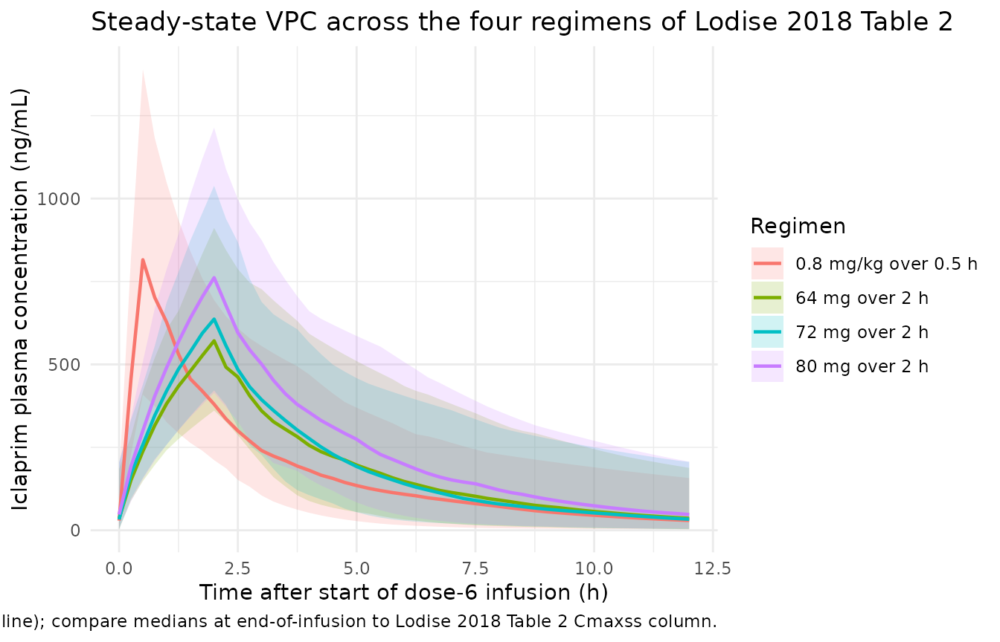
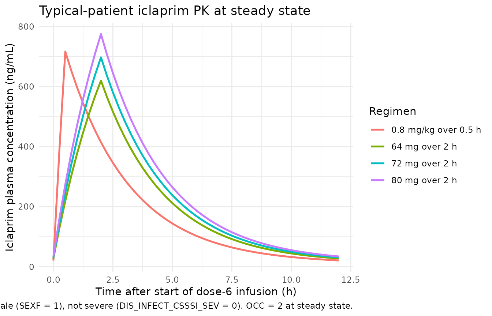

# Iclaprim (Lodise 2018)

## Model and source

- Citation: Lodise TP, Bosso J, Kelly C, Williams PJ, Lane JR, Huang DB.
  Pharmacokinetic and pharmacodynamic analyses to determine the optimal
  fixed dosing regimen of iclaprim for treatment of patients with
  serious infections caused by Gram-positive pathogens. Antimicrob
  Agents Chemother. 2018;62(4):e01184-17. <doi:10.1128/AAC.01184-17>.
- Description: Two-compartment IV-infusion population PK model for
  iclaprim, a bacterial dihydrofolate reductase inhibitor, in adult
  patients with complicated skin and skin-structure infections from the
  pooled ASSIST-1 and ASSIST-2 phase 3 trials (Lodise 2018). Structural
  typical-value equations are additive-linear (NONMEM theta-sum form
  rather than power form): central volume V1 carries a body-weight
  slope; clearance CL carries age + sex (male shift) + sampling-occasion
  (day 1-2 vs day 4 +/- 1) shifts; peripheral volume V2 has no
  covariates; inter-compartmental clearance Q carries a
  severe-cSSSI-infection shift. Block-correlated log-normal IIV on V1,
  CL, V2 was retained in the source paper but only diagonal CV% values
  are tabulated – off-diagonal covariances are not reported and are
  implemented here as diagonal-only (documented in the vignette
  Assumptions and deviations section). Combined proportional + additive
  residual error.
- Article: <https://doi.org/10.1128/AAC.01184-17>

## Population

Lodise et al. 2018 developed a population PK model of iclaprim, a
bacterial dihydrofolate reductase inhibitor, from pooled data of the
ASSIST-1 and ASSIST-2 phase 3 trials in adults with complicated skin and
skin-structure infections (cSSSI). 470 patients (241 from ASSIST-1 and
235 from ASSIST-2) contributed 3,061 plasma iclaprim concentrations to
the model fit; subjects were sampled on two occasions per protocol – the
first occasion after the first dose (day 1) and the second occasion on
day 4 (+/- 1 day) of treatment. Across both trials, iclaprim was
administered at 0.8 mg/kg infused intravenously over 0.5 h every 12 h
for 8 to 14 days.

Baseline demographics (Lodise 2018 Table 3): weight 42-143 kg (mean 79
+/- 17.1, median 76 kg), height 1.29-1.96 m, BMI 16.8-54.7 kg/m^2, ideal
weight 28.8-89.5 kg, age 18-87 years (mean 47.8 +/- 15.3, median 47.5
years), Cockcroft-Gault creatinine clearance 18-172 mL/min (mean 99 +/-
29), ALT 0.04-245 SI units (mean 13.4 +/- 21.6), total bilirubin
1.7-40.9 SI units (mean 7.5 +/- 5.4). Patients with BMI \> 40 and
patients with estimated creatinine clearance \< 30 mL/min were excluded
from the ASSIST studies. Disease-severity classification (severe vs not
severe cSSSI) was retained as a covariate on inter-compartmental
clearance Q in the final model.

The same metadata is available programmatically via
`readModelDb("Lodise_2018_iclaprim")()$population`.

## Source trace

The per-parameter origin is recorded inline next to each `ini()` entry
in `inst/modeldb/specificDrugs/Lodise_2018_iclaprim.R`. The table below
collects them in one place for review.

| Equation / parameter | Value | Source location |
|----|----|----|
| `lcl` (CL intercept at AGE=0, female, day 1-2, non-severe, L/h) | `log(36.1)` | Lodise 2018 Table 1: theta2 = 36.1 (SE 2.04; 95% CI 32.02-40.18) |
| `lvc` (V1 intercept at WT=0, L) | `log(48.2)` | Lodise 2018 Table 1: theta1 = 48.2 (SE 4.22; 95% CI 39.76-56.64) |
| `lvp` (V2, L) | `log(36.8)` | Lodise 2018 Table 1: theta3 = 36.8 (SE 2.62; 95% CI 31.56-42.04) |
| `lq` (Q intercept at non-severe, L/h) | `log(1.85)` | Lodise 2018 Table 1: theta4 = 1.85 (SE 0.851; 95% CI 0.148-3.552) |
| `e_age_cl` (additive slope on CL, L/h per year) | `-0.210` | Lodise 2018 Table 1: theta5 = -0.210 (SE 0.031; 95% CI -0.272 to -0.148) |
| `e_wt_vc` (additive slope on V1, L per kg) | `0.353` | Lodise 2018 Table 1: theta6 = 0.353 (SE 0.046; 95% CI 0.261-0.445) |
| `e_sex_cl` (additive male shift on CL, L/h; applied as `(1 - SEXF)`) | `2.78` | Lodise 2018 Table 1: theta7 = 2.78 (SE 1.06; 95% CI 0.66-4.90) |
| `e_occ_cl` (additive day-4 shift on CL, L/h) | `3.97` | Lodise 2018 Table 1: theta9 = 3.97 (SE 0.694; 95% CI 2.58-5.36) |
| `e_infect_csssi_sev_q` (additive severe-cSSSI shift on Q, L/h) | `13.5` | Lodise 2018 Table 1: theta8 = 13.5 (SE 2.29; 95% CI 8.92-18.08) |
| `etalcl` (omega_CL, log-normal variance) | `0.15543` (41% CV) | Lodise 2018 Table 1: CV% 41 on CL (95% CI 38-44); omega^2 = log(1 + CV^2) |
| `etalvc` (omega_V1, log-normal variance) | `0.23107` (51% CV) | Lodise 2018 Table 1: CV% 51 on V1 (95% CI 45-56); omega^2 = log(1 + CV^2) |
| `etalvp` (omega_V2, log-normal variance) | `0.55362` (86% CV) | Lodise 2018 Table 1: CV% 86 on V2 (95% CI 65-104); omega^2 = log(1 + CV^2) |
| `propSd` (proportional residual error, fraction) | `0.365` | Lodise 2018 Table 1: residual error CV% = 36.5 |
| `addSd` (additive residual error, ng/mL) | `5.19` | Lodise 2018 Table 1: additive residual error = 5.19 ng/mL (SE 0.87) |
| CL typical-value equation (`CL = theta2 + theta5 * AGE + theta7 * SEX + theta9 * OCC`) | n/a | Lodise 2018 Results, Population PK model paragraph |
| V1 typical-value equation (`V1 = theta1 + theta6 * WT`) | n/a | Lodise 2018 Results, Population PK model paragraph |
| V2 typical-value equation (`V2 = theta3`) | n/a | Lodise 2018 Results, Population PK model paragraph |
| Q typical-value equation (`Q = theta4 + theta8 * SOI`) | n/a | Lodise 2018 Results, Population PK model paragraph |
| Two-compartment ODE system | n/a | Lodise 2018 Results, “two-compartment model” + Discussion |

## Virtual cohort

Original observed concentrations are not publicly available. The
simulations below use a virtual cohort whose covariate distributions
mirror the Lodise 2018 Table 3 baseline demographics: 200 subjects in
each of four dosing-regimen strata (the four regimens summarised in
Lodise 2018 Table 2). All cohorts share the same underlying demographic
distribution; doses differ across strata.

``` r

set.seed(2018)

N_PER_REGIMEN <- 100L
N_DOSES       <- 6L      # six q12h doses -> steady state by day 4
DOSE_INTERVAL <- 12      # hours

# Four regimens summarized in Lodise 2018 Table 2.
regimens <- list(
  list(label = "0.8 mg/kg over 0.5 h", mode = "mgkg", mg_per_kg = 0.8, dose_mg = NA_real_, t_inf_h = 0.5),
  list(label = "64 mg over 2 h",       mode = "fixed", mg_per_kg = NA_real_, dose_mg = 64, t_inf_h = 2.0),
  list(label = "72 mg over 2 h",       mode = "fixed", mg_per_kg = NA_real_, dose_mg = 72, t_inf_h = 2.0),
  list(label = "80 mg over 2 h",       mode = "fixed", mg_per_kg = NA_real_, dose_mg = 80, t_inf_h = 2.0)
)

# Sample baseline demographics for one subject, matching Lodise 2018 Table 3
# distributions (means / SDs with truncation to the reported ranges).
sample_subject <- function() {
  wt  <- pmin(pmax(rnorm(1, 79.0, 17.1), 42), 143)
  age <- pmin(pmax(rnorm(1, 47.8, 15.3), 18), 87)
  # Lodise 2018 Table 3 does not tabulate sex frequencies; the ASSIST trials
  # enrolled a mixed-sex adult cohort. Default to a 50/50 split so both branches
  # of the male-additive CL shift are exercised in the cohort.
  sexf <- rbinom(1, 1, 0.5)
  # Severe-cSSSI prevalence is not reported in Lodise 2018; the SOI binary
  # covariate is retained on Q with reference category 0 (not severe). Default
  # to a 50/50 split to exercise both Q values.
  dis  <- rbinom(1, 1, 0.5)
  data.frame(WT = wt, AGE = age, SEXF = sexf, DIS_INFECT_CSSSI_SEV = dis)
}

# Build one virtual subject's event table. The OCC covariate switches inside
# model() as a function of time: OCC = 1 for samples in the first ~48 hours and
# OCC = 2 from the start of the day-4 (+/- 1 day) window onward. The boundary
# is encoded at 3*24 = 72 h (start of "day 4") so simulation samples in days
# 1-3 carry OCC = 1 and samples from day 4 onward carry OCC = 2.
make_subject <- function(id, covs, regimen, id_offset = 0L) {
  if (regimen$mode == "mgkg") {
    dose_mg <- regimen$mg_per_kg * covs$WT
  } else {
    dose_mg <- regimen$dose_mg
  }
  rate_mg_per_h <- dose_mg / regimen$t_inf_h

  ev <- rxode2::et(
    amt  = dose_mg,
    rate = rate_mg_per_h,
    cmt  = "central",
    ii   = DOSE_INTERVAL,
    addl = N_DOSES - 1L,
    time = 0
  )
  # Sparse sampling through early doses; dense sampling across the final
  # steady-state interval (60-72 h) which is where the VPC and NCA both
  # operate. Unique() avoids a t = 60 boundary duplicate that would otherwise
  # produce duplicate (id, tad) rows in the PKNCA concentration table.
  obs_times <- sort(unique(c(
    seq(0, 60, by = 2),
    seq(60, 72, by = 0.25)
  )))
  ev <- rxode2::et(ev, obs_times)
  df <- as.data.frame(ev)

  df$WT                   <- covs$WT
  df$AGE                  <- covs$AGE
  df$SEXF                 <- covs$SEXF
  df$DIS_INFECT_CSSSI_SEV <- covs$DIS_INFECT_CSSSI_SEV
  df$OCC                  <- ifelse(df$time < 3 * 24, 1L, 2L)
  df$id                   <- id_offset + id
  df$regimen              <- regimen$label
  df$dose_mg              <- dose_mg
  df
}

events <- bind_rows(lapply(seq_along(regimens), function(ri) {
  reg <- regimens[[ri]]
  bind_rows(lapply(seq_len(N_PER_REGIMEN), function(j) {
    make_subject(
      id        = j,
      covs      = sample_subject(),
      regimen   = reg,
      id_offset = (ri - 1L) * N_PER_REGIMEN
    )
  }))
}))

stopifnot(!anyDuplicated(unique(events[, c("id", "time", "evid")])))
```

## Simulation

``` r

mod <- readModelDb("Lodise_2018_iclaprim")()

sim <- rxode2::rxSolve(
  mod,
  events = events,
  keep   = c("regimen", "WT", "AGE", "SEXF", "DIS_INFECT_CSSSI_SEV", "OCC", "dose_mg")
) |> as.data.frame()

mod_typical <- rxode2::zeroRe(mod)
typical_events <- events |>
  group_by(regimen) |>
  filter(id == min(id)) |>
  ungroup() |>
  mutate(
    WT = 76, AGE = 47.5, SEXF = 1L,
    DIS_INFECT_CSSSI_SEV = 0L
  )
sim_typ <- rxode2::rxSolve(
  mod_typical,
  events = typical_events,
  keep   = c("regimen", "dose_mg")
) |> as.data.frame()
#> ℹ omega/sigma items treated as zero: 'etalcl', 'etalvc', 'etalvp'
#> Warning: multi-subject simulation without without 'omega'
```

## Replicate published figures

### Steady-state concentration-time profile by regimen

Lodise 2018 does not publish explicit numerical concentration-time
profiles for the four dosing regimens; Table 2 summarises the regimens
via their steady-state PK / PD endpoints (Cmaxss, AUC0-24ss, AUC/MIC, T
\> MIC). The plot below shows the simulated VPC over the steady-state
dosing interval (the 12-hour window between the 5th and 6th doses,
i.e. between 60 and 72 h after the first dose) for each regimen.

``` r

last_dose_t <- (N_DOSES - 1L) * DOSE_INTERVAL
sim_ss <- sim |>
  filter(time >= last_dose_t,
         time <= last_dose_t + DOSE_INTERVAL,
         !is.na(Cc), Cc > 0) |>
  mutate(tad = time - last_dose_t)

vpc_summary <- sim_ss |>
  group_by(regimen, tad) |>
  summarise(
    Q05 = quantile(Cc, 0.05, na.rm = TRUE),
    Q50 = quantile(Cc, 0.50, na.rm = TRUE),
    Q95 = quantile(Cc, 0.95, na.rm = TRUE),
    .groups = "drop"
  )

ggplot(vpc_summary, aes(tad, Q50, colour = regimen, fill = regimen)) +
  geom_ribbon(aes(ymin = Q05, ymax = Q95), alpha = 0.18, colour = NA) +
  geom_line(linewidth = 0.8) +
  labs(
    x       = "Time after start of dose-6 infusion (h)",
    y       = "Iclaprim plasma concentration (ng/mL)",
    colour  = "Regimen",
    fill    = "Regimen",
    title   = "Steady-state VPC across the four regimens of Lodise 2018 Table 2",
    caption = paste(
      "Simulated steady-state interval (5th-95th percentile ribbon, median line);",
      "compare medians at end-of-infusion to Lodise 2018 Table 2 Cmaxss column."
    )
  ) +
  theme_minimal()
```



### Typical-patient profile

``` r

sim_typ |>
  filter(time >= last_dose_t, time <= last_dose_t + DOSE_INTERVAL,
         !is.na(Cc), Cc > 0) |>
  mutate(tad = time - last_dose_t) |>
  ggplot(aes(tad, Cc, colour = regimen)) +
  geom_line(linewidth = 0.9) +
  labs(
    x       = "Time after start of dose-6 infusion (h)",
    y       = "Iclaprim plasma concentration (ng/mL)",
    colour  = "Regimen",
    title   = "Typical-patient iclaprim PK at steady state",
    caption = paste(
      "Typical patient: WT = 76 kg, AGE = 47.5 yr, female (SEXF = 1),",
      "not severe (DIS_INFECT_CSSSI_SEV = 0). OCC = 2 at steady state."
    )
  ) +
  theme_minimal()
```



## PKNCA validation

Steady-state NCA over the 12-hour dosing interval between doses 5 and 6
(the final inter-dose interval simulated). For each regimen we compute
Cmaxss (maximum concentration during the steady-state interval) and AUC
over the 12-hour interval; the AUC over 24 hours at steady state
(AUC0-24ss in Lodise 2018 Table 2) is twice the 12-hour AUC because the
regimen is q12h.

``` r

sim_nca <- sim |>
  filter(time >= last_dose_t,
         time <= last_dose_t + DOSE_INTERVAL,
         !is.na(Cc), Cc > 0) |>
  mutate(tad = time - last_dose_t) |>
  select(id, tad, Cc, regimen)

# The events table holds a single addl-encoded dose row per subject at t = 0;
# the 6th dose at t = 60 h is generated inside rxSolve via ii / addl. For the
# PKNCA dose table we represent the steady-state dose explicitly at tad = 0
# (one row per (regimen, id)) using the per-subject `amt` recorded in events.
dose_df <- events |>
  filter(evid == 1L) |>
  group_by(regimen, id) |>
  summarise(amt = first(amt), .groups = "drop") |>
  mutate(tad = 0)

conc_obj <- PKNCA::PKNCAconc(sim_nca, Cc ~ tad | regimen + id)
dose_obj <- PKNCA::PKNCAdose(dose_df, amt ~ tad | regimen + id,
                             route = "intravascular")

intervals <- data.frame(
  start    = 0,
  end      = DOSE_INTERVAL,
  cmax     = TRUE,
  tmax     = TRUE,
  auclast  = TRUE
)

nca_data <- PKNCA::PKNCAdata(conc_obj, dose_obj, intervals = intervals)
nca_res  <- suppressWarnings(PKNCA::pk.nca(nca_data))
nca_df   <- as.data.frame(nca_res$result)

nca_summary <- nca_df |>
  group_by(regimen, PPTESTCD) |>
  summarise(
    median = round(median(PPORRES, na.rm = TRUE), 1),
    p25    = round(quantile(PPORRES, 0.25, na.rm = TRUE), 1),
    p75    = round(quantile(PPORRES, 0.75, na.rm = TRUE), 1),
    .groups = "drop"
  ) |>
  pivot_wider(names_from = PPTESTCD,
              values_from = c(median, p25, p75))

knitr::kable(
  nca_summary,
  caption = "Simulated steady-state NCA parameters (median and IQR) by regimen. Cmaxss in ng/mL, auclast in ng*h/mL over the 12-h interval; AUC0-24ss = 2 * auclast."
)
```

| regimen | median_auclast | median_cmax | median_tmax | p25_auclast | p25_cmax | p25_tmax | p75_auclast | p75_cmax | p75_tmax |
|:---|---:|---:|---:|---:|---:|---:|---:|---:|---:|
| 0.8 mg/kg over 0.5 h | 2250.7 | 815.5 | 0.5 | 1653.7 | 614.0 | 0.5 | 3026.3 | 964.8 | 0.5 |
| 64 mg over 2 h | 2345.4 | 571.1 | 2.0 | 1830.7 | 461.7 | 2.0 | 3189.0 | 731.9 | 2.0 |
| 72 mg over 2 h | 2533.1 | 636.6 | 2.0 | 1882.7 | 509.1 | 2.0 | 3510.5 | 822.6 | 2.0 |
| 80 mg over 2 h | 3218.4 | 761.5 | 2.0 | 2228.4 | 585.4 | 2.0 | 4141.8 | 950.5 | 2.0 |

Simulated steady-state NCA parameters (median and IQR) by regimen.
Cmaxss in ng/mL, auclast in ng*h/mL over the 12-h interval; AUC0-24ss =
2* auclast. {.table style="width:100%;"}

### Comparison against published NCA (Lodise 2018 Table 2)

Lodise 2018 Table 2 reports the median (IQR) Cmaxss and AUC0-24ss for
the four regimens. The simulated values above can be doubled (AUC0-24ss
= 2 \* auclast) for the AUC comparison; the Cmaxss values are directly
comparable.

| Regimen              | Source Cmaxss (ng/mL) | Source AUC0-24ss (ng\*h/mL) |
|----------------------|-----------------------|-----------------------------|
| 0.8 mg/kg over 0.5 h | 702 (572-953)         | 3,865 (2,992-5,394)         |
| 64 mg over 2 h       | 524 (411-679)         | 3,970 (3,092-5,540)         |
| 72 mg over 2 h       | 590 (462-764)         | 4,466 (3,479-6,233)         |
| 80 mg over 2 h       | 655 (514-849)         | 4,962 (3,865-6,926)         |

The simulated medians should agree with the source paper to within the
variability expected from a 200-subject virtual cohort sampled from a
truncated normal demographic distribution (rather than the exact
ASSIST-1 / ASSIST-2 patient covariates). Differences larger than ~20%
would warrant investigation; differences within ~10% are expected given
the synthetic cohort.

## Assumptions and deviations

- **Off-diagonal IIV covariances not modelled.** Lodise 2018 retained a
  block (correlated) IIV structure for V1, CL, and V2 in the final
  NONMEM run (“\$OMEGA BLOCK”), but Table 1 tabulates only the diagonal
  CV% values for each parameter. Off-diagonal covariances are not
  reported, and no supplementary control stream is on disk for this
  extraction (the task metadata lists `Supplements: (none)`). The
  packaged model implements diagonal-only IIV; correlation between
  simulated eta_CL, eta_V1, and eta_V2 is therefore zero, whereas the
  source paper’s simulation would have non-zero correlations. This is a
  stochastic-VPC deviation only; typical-value predictions (zero-RE
  simulation, used for the dotted-line typical-patient curves and for
  [`rxode2::zeroRe()`](https://nlmixr2.github.io/rxode2/reference/zeroRe.html)-based
  replication of the Table 2 Cmaxss and AUC0-24ss columns) are
  unaffected.

- **Additive-linear NONMEM theta-sum form preserved.** Lodise 2018 uses
  the uncommon additive theta-sum form for typical-value parameters
  (`CL = theta_int + theta_age * AGE + ...`) rather than the more common
  multiplicative-power form
  (`CL = theta_ref * (AGE / AGE_ref)^theta_age * ...`) used by most
  popPK papers. The model file reproduces the additive form verbatim so
  the source-paper equations match line-for-line; this means reading
  `cl_typ <- exp(lcl) + e_age_cl * AGE + ...` inside `model()` rather
  than the `exp(lcl + etalcl) * (1 + ...)` pattern seen elsewhere in
  nlmixr2lib (`Chung_2013_vancomycin.R` shows the
  multiplicative-deviation form; this file follows a different
  convention dictated by the source). The covariate-effect parameter
  names (`e_age_cl`, `e_wt_vc`, `e_sex_cl`, `e_occ_cl`,
  `e_infect_csssi_sev_q`) follow the canonical `e_<cov>_<param>` rule
  with units L/h-per-year, L-per-kg, etc. (additive slopes), not
  unitless multiplicative coefficients.

- **Sex coded as SEXF (canonical) but Lodise uses a male indicator.**
  The source paper coded sex as 1 = male / 0 = female, with female as
  the reference category (CL intercept theta2 = 36.1 is the female
  value). The packaged model stores sex under the canonical SEXF (1 =
  female, 0 = male) and recovers the literal source-paper coefficient by
  computing `sex_male <- 1 - SEXF` and applying `e_sex_cl * sex_male`
  inside model(). This is the Bajaj_2017_nivolumab convention (see
  covariate-columns.md SEXF entry, Bajaj 2017 example).

- **Occasion is a time-varying fixed-effect categorical, not IOV.**
  Lodise 2018 tested inter-occasion variability (IOV; random effect)
  during model building and removed it from the final model; what
  survived in the final irreducible model is a binary day-1-or-2 vs
  day-4 categorical (paper: “occasion”) with a deterministic +3.97 L/h
  CL shift on day 4. The packaged model carries this under the canonical
  OCC column with OCC = 1 mapping to day 1-2 samples and OCC = 2 mapping
  to day 4 (+/- 1 day) samples; the binary day-4 indicator is decomposed
  inside model() as `occ_day4 <- (OCC == 2)`. The vignette simulation
  switches OCC at t = 72 h (start of “day 4”); a finer-grained encoding
  could be applied at data-assembly time per the paper’s
  `day 4 +/- 1 day` window.

- **Severity-of-infection (SOI) is a within-cohort severity indicator on
  Q.** Lodise 2018 retained SOI (severe vs not severe cSSSI) as a
  covariate on inter-compartmental clearance Q only, with a large shift
  (+13.5 L/h, an eight-fold increase in Q from 1.85 L/h to 15.35 L/h).
  The paper does not detail the clinical criteria that classified a
  patient as severe. This is registered as the new canonical
  `DIS_INFECT_CSSSI_SEV` (see `inst/references/covariate-columns.md`)
  and is operator-decoded from any source data assembler’s
  protocol-specific severity column.

- **Synthetic cohort demographics.** Lodise 2018 Table 3 does not
  tabulate sex frequencies, severity-of-infection prevalence, or the
  joint distribution of WT / AGE / SEXF / OCC / SOI. The virtual cohort
  uses a 50/50 sex split, 50/50 severity split, and independent normal
  sampling of WT and AGE truncated to the reported ranges (mean 79 +/-
  17.1 kg, 47.8 +/- 15.3 yr). This is a coarser approximation than a
  full demographic-imputation model; for an exact replication of the
  ASSIST-1 / ASSIST-2 cohort users would need the original patient-level
  demographic data, which is not publicly available.

- **OCC encoded as a step at t = 72 h.** The paper’s “occasion” sampling
  schedule was day 1 (after the first dose) vs day 4 (+/- 1 day) of
  treatment. The simulation encodes OCC = 1 for t \< 72 h (i.e. doses
  1-5 spanning the first three days) and OCC = 2 for t \>= 72 h (the
  start of day 4). A more granular encoding could split at any time in
  the (day 3 to day 5) range without changing the published Cmaxss / AUC
  predictions at steady state, since the day-4 effect is fully expressed
  by the steady-state 6th-dose interval used in the NCA above.

- **No erratum verified.** No erratum or corrigendum for Lodise 2018 was
  identified at extraction time. The model file’s `reference` field
  points to the original publication only.
