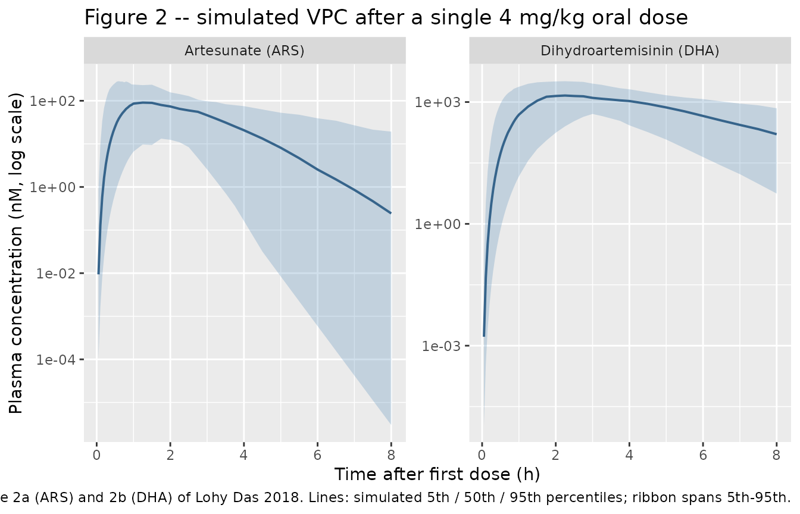
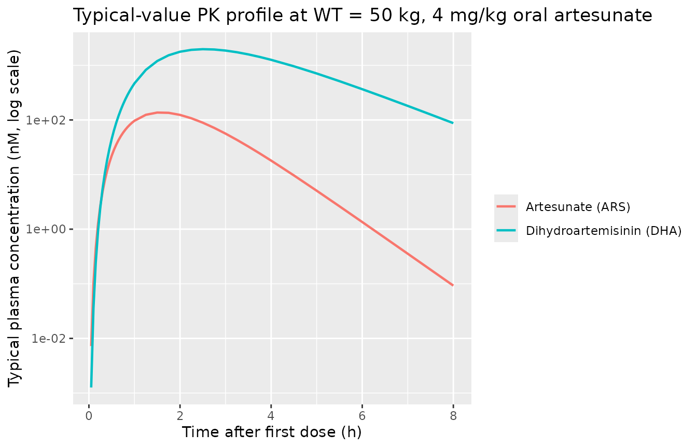

# Artesunate (Lohy Das 2018)

## Model and source

- Citation: Lohy Das JP, Kyaw MP, Nyunt MH, Chit K, Aye KH, Aye MM,
  Karlsson MO, Bergstrand M, Tarning J (2018). Population
  pharmacokinetic and pharmacodynamic properties of artesunate in
  patients with artemisinin sensitive and resistant infections in
  Southern Myanmar. *Malaria Journal* 17:126.
  <doi:%5B10.1186/s12936-018-2278-5>\](<https://doi.org/10.1186/s12936-018-2278-5>).
- Open Access (Springer Nature / BMC).

This is the joint parent-metabolite popPK component of Lohy Das 2018,
covering oral artesunate (ARS) and its active metabolite
dihydroartemisinin (DHA) in adult patients with uncomplicated
*Plasmodium falciparum* malaria from southern Myanmar. ARS absorption is
described by a 3-transit-compartment chain (n = 3 fixed) followed by a
one-compartment ARS disposition; complete in-vivo conversion of ARS to
DHA is assumed (the only ARS elimination pathway), and DHA is
one-compartment. Body weight scales both species’ CL and Vc
allometrically (fixed exponents 0.75 and 1.0; cohort-median 50 kg
reference). F is fixed at 1 with log-normal IIV. The packaged model file
omits the published time-varying parasite-density covariates on MTT and
on F (Eqs. 3 and 4) and the entire PD layer (mixture-Emax
parasite-killing model with delayed-effect compartment); see the
Assumptions and deviations section for the rationale.

``` r

mod_fn  <- readModelDb("LohyDas_2018_artesunate")
mod     <- rxode2::rxode2(mod_fn())
mod_typ <- rxode2::rxode2(rxode2::zeroRe(mod_fn()))
```

## Population

The model was developed from 50 adult patients (Table 1 median age 25.5
years, IQR 21.5-39.5; age range 18-55 years per the inclusion criteria)
with uncomplicated *P. falciparum* mono-infection and asexual parasite
densities 10,000-100,000/uL at enrollment. Median body weight was 50.0
kg (IQR 46.0-53.5), the allometric reference. Median admission oral
temperature was 38.4 degrees C (IQR 37.6-39.1), median haemoglobin 12.4
g/dL (IQR 10.6-13.7), and median baseline parasite density 29,900/uL
(IQR 15,200-129,000). The study took place at the Palm Tree plantation
site hospital in Kawthaung, southern Myanmar (ANZCTR
ACTRN12610000896077; conducted in 2011).

All patients received directly observed oral artesunate monotherapy 4
mg/kg/day once daily for 7 days (Guilin Pharmaceutical Co. Ltd lot
AS091001), administered with 8 oz of milk. Plasma concentration
measurements were taken pre-dose and at 0.25, 0.5, 0.75, 1, 1.25, 1.5,
3, 4, 6, and 8 h **after the first dose only**; the popPK fit therefore
describes single-dose disposition (Methods p.3).

Of 53 patients recruited, 1 was excluded for not meeting
inclusion/exclusion criteria and 2 were excluded from the PK analysis
for missing covariates and PK/PD data, leaving 50 patients in the final
PK analysis (Results p.5). 56.1% of patients were estimated to have
artemisinin-resistant infections in the original paper’s mixture model;
the PD mixture layer is not encoded in this PK-only extraction (see
Assumptions and deviations).

The same information is available programmatically via
`readModelDb("LohyDas_2018_artesunate")$population`.

## Source trace

Per-parameter origins are recorded as in-file comments in
`inst/modeldb/specificDrugs/LohyDas_2018_artesunate.R`; the table below
collects them in one place for review.

| Item | Value (typical) | Source |
|----|----|----|
| 3-transit-compartment ARS absorption (n = 3 fix) | structural | Results p.5 (“The absorption was described by a transit compartment (n = 3) model”) |
| One-compartment ARS and DHA disposition; complete in-vivo conversion | structural | Results p.5; Methods p.4 (“Complete metabolic in vivo conversion of ARS into DHA was assumed throughout modelling”) |
| Allometric WT scaling, exponent 0.75 (CL) and 1.0 (V), reference 50 kg | structural | Methods p.4; Results p.5 (“Allometric scaling of all disposition parameters, centered by the median weight of 50 kg improved the model fit”) |
| `lfdepot` -\> F (%) = 100 fix | 1.00 | Table 2 (“F (%) 100 fix”) |
| `lmtt` -\> MTT = 1.34 h | 1.34 | Table 2 (MTT, %RSE 18.8, 95% CI 1.04-1.96) |
| `lcl` -\> CL_ARS/F = 1750 L/h at WT = 50 kg | 1750 | Table 2 (CL_ARS/F, %RSE 8.55, 95% CI 1570-2090) |
| `lvc` -\> V_ARS/F = 1300 L at WT = 50 kg | 1300 | Table 2 (V_ARS/F, %RSE 12.6, 95% CI 1110-1660) |
| `lcl_dihydroart` -\> CL_DHA/F = 76.7 L/h at WT = 50 kg | 76.7 | Table 2 (CL_DHA/F, %RSE 6.99, 95% CI 69.9-87.8) |
| `lvc_dihydroart` -\> V_DHA/F = 102 L at WT = 50 kg | 102 | Table 2 (V_DHA/F, %RSE 8.95, 95% CI 89.5-119.0) |
| IIV `var(etalfdepot)` (from BSV F = 31.2%) | 0.0929 | Table 2 (%CV 31.2, %RSE 29.4); derived as log(1 + 0.312^2) per Table 2 footnote |
| IIV `var(etalmtt)` (from BSV MTT = 85.3%) | 0.5468 | Table 2 (%CV 85.3, %RSE 24.9) |
| IIV `var(etalcl)` (from BSV CL_ARS = 26.8%) | 0.0693 | Table 2 (%CV 26.8, %RSE 44.3) |
| IIV `var(etalvc)` (from BSV V_ARS = 74.7%) | 0.4434 | Table 2 (%CV 74.7, %RSE 27.3) |
| IIV `var(etalcl_dihydroart)` (from BSV CL_DHA = 21.3%) | 0.0444 | Table 2 (%CV 21.3, %RSE 30.3) |
| IIV `var(etalvc_dihydroart)` (from BSV V_DHA = 31.6%) | 0.0953 | Table 2 (%CV 31.6, %RSE 40.5) |
| Residual `propSd` (ARS) (from RUV ARS = 73.2%) | 0.732 | Table 2 (%RSE 3.95) |
| Residual `propSd_dihydroart` (from RUV DHA = 58.5%) | 0.585 | Table 2 (%RSE 3.34) |

## Virtual cohort

The original observed data are not publicly available. The simulation
below uses a virtual cohort whose covariate distribution approximates
the published demographics: 200 adult patients with body weight drawn
uniformly from the 40-60 kg range (matching the Table 1 IQR plus
moderate tails). Each subject receives a single oral artesunate dose at
4 mg/kg (matching the trial protocol’s daily dose; only the first dose
is simulated, consistent with the fitting window of Lohy Das 2018).
Sampling times mirror the protocol design out to 8 h post-dose.

The artesunate molar mass (`MW_ARS = 384.42 g/mol`) is used to convert
the mass-per-kg dose to nmol for the model’s molar unit declaration: 4
mg/kg x WT (kg) x (1 / 384.42 g/mol) x 1e6 nmol/mol = WT x 10405 nmol.

``` r

set.seed(2026)

n_subjects <- 200L
MW_ARS     <- 384.42

subjects <- tibble::tibble(
  id = seq_len(n_subjects),
  WT = stats::runif(n_subjects, 40, 60)
)

build_events <- function(subjects, obs_times, mg_per_kg = 4) {
  dose_rows <- subjects |>
    dplyr::transmute(
      id,
      time = 0,
      evid = 1L,
      amt  = mg_per_kg * WT * 1e6 / MW_ARS,
      cmt  = "depot",
      WT
    )
  obs_rows <- tidyr::expand_grid(
    id   = subjects$id,
    time = obs_times
  ) |>
    dplyr::left_join(dplyr::select(subjects, id, WT), by = "id") |>
    dplyr::mutate(evid = 0L, amt = 0, cmt = "Cc")
  dplyr::bind_rows(dose_rows, obs_rows) |>
    dplyr::arrange(id, time, dplyr::desc(evid))
}

obs_times <- c(seq(0.05, 1, by = 0.05),
               seq(1.25, 4, by = 0.25),
               seq(4.5, 8, by = 0.5))

events <- build_events(subjects, obs_times)
stopifnot(!anyDuplicated(unique(events[, c("id", "time", "evid", "cmt")])))

dplyr::glimpse(subjects)
#> Rows: 200
#> Columns: 2
#> $ id <int> 1, 2, 3, 4, 5, 6, 7, 8, 9, 10, 11, 12, 13, 14, 15, 16, 17, 18, 19, …
#> $ WT <dbl> 53.97347, 51.13061, 42.80280, 45.71447, 51.10738, 40.50262, 49.3246…
```

## Simulation

Stochastic simulation (full omega / sigma) for the visual predictive
plot and PKNCA:

``` r

sim <- rxode2::rxSolve(
  mod,
  events = events,
  keep   = c("WT")
) |>
  as.data.frame() |>
  dplyr::mutate(
    Cc_nM     = Cc,
    Cc_dha_nM = Cc_dihydroart
  )
```

Typical-value simulation (omega/sigma zeroed) for direct comparison with
the typical estimates in Table 2 at WT = 50 kg:

``` r

typical_subjects <- tibble::tibble(id = 1L, WT = 50)
typical_events   <- build_events(typical_subjects, obs_times)
sim_typical <- rxode2::rxSolve(
  mod_typ,
  events = typical_events,
  keep   = c("WT")
) |>
  as.data.frame() |>
  dplyr::mutate(
    Cc_nM     = Cc,
    Cc_dha_nM = Cc_dihydroart
  )
#> ℹ omega/sigma items treated as zero: 'etalfdepot', 'etalmtt', 'etalcl', 'etalvc', 'etalcl_dihydroart', 'etalvc_dihydroart'
```

## Replicate published figures

### Figure 2a / 2b – Visual predictive check of ARS and DHA after first dose

Lohy Das 2018 Figure 2a (ARS) and 2b (DHA) show VPCs of plasma
concentration versus time after the first dose, with observed
concentrations overlaid on the simulated 5th, 50th, and 95th
percentiles. The simulation below reproduces the VPC structure for the
typical cohort. Concentrations are plotted in nM (the paper’s modelling
unit).

``` r

vpc_df <- sim |>
  dplyr::filter(time > 0) |>
  dplyr::group_by(time) |>
  dplyr::summarise(
    Q05_ars = stats::quantile(Cc_nM,     0.05, na.rm = TRUE),
    Q50_ars = stats::quantile(Cc_nM,     0.50, na.rm = TRUE),
    Q95_ars = stats::quantile(Cc_nM,     0.95, na.rm = TRUE),
    Q05_dihydroart = stats::quantile(Cc_dha_nM, 0.05, na.rm = TRUE),
    Q50_dihydroart = stats::quantile(Cc_dha_nM, 0.50, na.rm = TRUE),
    Q95_dihydroart = stats::quantile(Cc_dha_nM, 0.95, na.rm = TRUE),
    .groups = "drop"
  )

vpc_long <- dplyr::bind_rows(
  vpc_df |>
    dplyr::transmute(time, species = "Artesunate (ARS)",
                     Q05 = Q05_ars, Q50 = Q50_ars, Q95 = Q95_ars),
  vpc_df |>
    dplyr::transmute(time, species = "Dihydroartemisinin (DHA)",
                     Q05 = Q05_dihydroart, Q50 = Q50_dihydroart, Q95 = Q95_dihydroart)
)

ggplot(vpc_long, aes(time, Q50)) +
  geom_ribbon(aes(ymin = Q05, ymax = Q95), alpha = 0.25, fill = "steelblue") +
  geom_line(colour = "steelblue4", size = 0.7) +
  facet_wrap(~ species, nrow = 1, scales = "free_y") +
  scale_y_log10() +
  labs(
    x = "Time after first dose (h)",
    y = "Plasma concentration (nM, log scale)",
    title = "Figure 2 -- simulated VPC after a single 4 mg/kg oral dose",
    caption = paste0(
      "Replicates Figure 2a (ARS) and 2b (DHA) of Lohy Das 2018. ",
      "Lines: simulated 5th / 50th / 95th percentiles; ribbon spans 5th-95th."
    )
  )
#> Warning: Using `size` aesthetic for lines was deprecated in ggplot2 3.4.0.
#> ℹ Please use `linewidth` instead.
#> This warning is displayed once per session.
#> Call `lifecycle::last_lifecycle_warnings()` to see where this warning was
#> generated.
```



### Typical concentration-time profile at WT = 50 kg

The typical-value trajectory at the median 50 kg patient sets a
reference for the published Cmax and Tmax expectations.

``` r

typical_long <- sim_typical |>
  dplyr::select(time, Cc_nM, Cc_dha_nM) |>
  tidyr::pivot_longer(
    cols      = c(Cc_nM, Cc_dha_nM),
    names_to  = "species",
    values_to = "Cp_nM"
  ) |>
  dplyr::mutate(species = dplyr::recode(species,
                                        Cc_nM     = "Artesunate (ARS)",
                                        Cc_dha_nM = "Dihydroartemisinin (DHA)"))

ggplot(typical_long, aes(time, Cp_nM, colour = species)) +
  geom_line(size = 0.8) +
  scale_y_log10() +
  labs(
    x = "Time after first dose (h)",
    y = "Typical plasma concentration (nM, log scale)",
    title = "Typical-value PK profile at WT = 50 kg, 4 mg/kg oral artesunate",
    colour = NULL
  )
```



## PKNCA validation

Single-dose, dense-sampling NCA with PKNCA. There is no per-subject NCA
table in Lohy Das 2018 (only the VPC in Fig. 2), so this NCA serves to
confirm that the simulated cohort produces sensible exposures that
respect the structural assumptions of the model. Treatment grouping is
the cohort itself (single-arm trial); a coarse weight band is added so
the NCA output has a non-trivial stratification variable for the PKNCA
formula.

``` r

sim_nca <- sim |>
  dplyr::filter(!is.na(Cc), time > 0) |>
  dplyr::mutate(
    band = cut(WT,
               breaks = c(40, 47, 53, 60),
               labels = c("40-47", "47-53", "53-60"),
               include.lowest = TRUE)
  ) |>
  dplyr::select(id, time, Cc = Cc_nM, band)

dose_df <- events |>
  dplyr::filter(evid == 1L) |>
  dplyr::left_join(
    dplyr::distinct(sim_nca, id, band),
    by = "id"
  ) |>
  dplyr::select(id, time, amt, band)

conc_obj <- PKNCA::PKNCAconc(sim_nca, Cc ~ time | band + id,
                             concu = "nmol/L", timeu = "h")
#> Warning in assert_conc(conc, any_missing_conc = any_missing_conc): Negative
#> concentrations found
dose_obj <- PKNCA::PKNCAdose(dose_df, amt ~ time | band + id,
                             doseu = "nmol")

intervals <- data.frame(
  start      = 0,
  end        = 8,
  cmax       = TRUE,
  tmax       = TRUE,
  auclast    = TRUE,
  half.life  = TRUE
)

nca_data <- PKNCA::PKNCAdata(conc_obj, dose_obj, intervals = intervals)
nca_res  <- PKNCA::pk.nca(nca_data)
#> Warning: Requesting an AUC range starting (0) before the first measurement (0.05) is not allowed
#> Negative concentrations found
#> Warning: Requesting an AUC range starting (0) before the first measurement
#> (0.05) is not allowed
#> Warning in assert_conc(conc = conc): Negative concentrations found
#> Warning in assert_conc(conc, any_missing_conc = any_missing_conc): Negative
#> concentrations found
#> Warning in assert_conc(conc, any_missing_conc = any_missing_conc): Negative
#> concentrations found
#> Warning in assert_conc(conc, any_missing_conc = any_missing_conc): Negative
#> concentrations found
#> Warning in assert_conc(conc, any_missing_conc = any_missing_conc): Negative
#> concentrations found
#> Warning in log(data$conc): NaNs produced
#> Warning: Requesting an AUC range starting (0) before the first measurement (0.05) is not allowed
#> Requesting an AUC range starting (0) before the first measurement (0.05) is not allowed
#> Requesting an AUC range starting (0) before the first measurement (0.05) is not allowed
#> Requesting an AUC range starting (0) before the first measurement (0.05) is not allowed
#> Warning in assert_conc(conc, any_missing_conc = any_missing_conc): Negative
#> concentrations found
#> Warning: Requesting an AUC range starting (0) before the first measurement
#> (0.05) is not allowed
#> Warning in assert_conc(conc = conc): Negative concentrations found
#> Warning in assert_conc(conc, any_missing_conc = any_missing_conc): Negative
#> concentrations found
#> Warning in assert_conc(conc, any_missing_conc = any_missing_conc): Negative
#> concentrations found
#> Warning in assert_conc(conc, any_missing_conc = any_missing_conc): Negative
#> concentrations found
#> Warning in assert_conc(conc, any_missing_conc = any_missing_conc): Negative
#> concentrations found
#> Warning in log(data$conc): NaNs produced
#> Warning: Requesting an AUC range starting (0) before the first measurement (0.05) is not allowed
#> Requesting an AUC range starting (0) before the first measurement (0.05) is not allowed
#> Requesting an AUC range starting (0) before the first measurement (0.05) is not allowed
#> Requesting an AUC range starting (0) before the first measurement (0.05) is not allowed
#> Requesting an AUC range starting (0) before the first measurement (0.05) is not allowed
#> Requesting an AUC range starting (0) before the first measurement (0.05) is not allowed
#> Requesting an AUC range starting (0) before the first measurement (0.05) is not allowed
#> Requesting an AUC range starting (0) before the first measurement (0.05) is not allowed
#> Requesting an AUC range starting (0) before the first measurement (0.05) is not allowed
#> Requesting an AUC range starting (0) before the first measurement (0.05) is not allowed
#> Requesting an AUC range starting (0) before the first measurement (0.05) is not allowed
#> Requesting an AUC range starting (0) before the first measurement (0.05) is not allowed
#> Requesting an AUC range starting (0) before the first measurement (0.05) is not allowed
#> Requesting an AUC range starting (0) before the first measurement (0.05) is not allowed
#> Requesting an AUC range starting (0) before the first measurement (0.05) is not allowed
#> Requesting an AUC range starting (0) before the first measurement (0.05) is not allowed
#> Requesting an AUC range starting (0) before the first measurement (0.05) is not allowed
#> Requesting an AUC range starting (0) before the first measurement (0.05) is not allowed
#> Requesting an AUC range starting (0) before the first measurement (0.05) is not allowed
#> Requesting an AUC range starting (0) before the first measurement (0.05) is not allowed
#> Requesting an AUC range starting (0) before the first measurement (0.05) is not allowed
#> Requesting an AUC range starting (0) before the first measurement (0.05) is not allowed
#> Requesting an AUC range starting (0) before the first measurement (0.05) is not allowed
#> Requesting an AUC range starting (0) before the first measurement (0.05) is not allowed
#> Requesting an AUC range starting (0) before the first measurement (0.05) is not allowed
#> Requesting an AUC range starting (0) before the first measurement (0.05) is not allowed
#> Requesting an AUC range starting (0) before the first measurement (0.05) is not allowed
#> Requesting an AUC range starting (0) before the first measurement (0.05) is not allowed
#> Requesting an AUC range starting (0) before the first measurement (0.05) is not allowed
#> Requesting an AUC range starting (0) before the first measurement (0.05) is not allowed
#> Requesting an AUC range starting (0) before the first measurement (0.05) is not allowed
#> Requesting an AUC range starting (0) before the first measurement (0.05) is not allowed
#> Requesting an AUC range starting (0) before the first measurement (0.05) is not allowed
#> Requesting an AUC range starting (0) before the first measurement (0.05) is not allowed
#> Requesting an AUC range starting (0) before the first measurement (0.05) is not allowed
#> Requesting an AUC range starting (0) before the first measurement (0.05) is not allowed
#> Requesting an AUC range starting (0) before the first measurement (0.05) is not allowed
#> Requesting an AUC range starting (0) before the first measurement (0.05) is not allowed
#> Requesting an AUC range starting (0) before the first measurement (0.05) is not allowed
#> Requesting an AUC range starting (0) before the first measurement (0.05) is not allowed
#> Requesting an AUC range starting (0) before the first measurement (0.05) is not allowed
#> Requesting an AUC range starting (0) before the first measurement (0.05) is not allowed
#> Requesting an AUC range starting (0) before the first measurement (0.05) is not allowed
#> Requesting an AUC range starting (0) before the first measurement (0.05) is not allowed
#> Requesting an AUC range starting (0) before the first measurement (0.05) is not allowed
#> Requesting an AUC range starting (0) before the first measurement (0.05) is not allowed
#> Requesting an AUC range starting (0) before the first measurement (0.05) is not allowed
#> Requesting an AUC range starting (0) before the first measurement (0.05) is not allowed
#> Requesting an AUC range starting (0) before the first measurement (0.05) is not allowed
#> Requesting an AUC range starting (0) before the first measurement (0.05) is not allowed
#> Requesting an AUC range starting (0) before the first measurement (0.05) is not allowed
#> Requesting an AUC range starting (0) before the first measurement (0.05) is not allowed
#> Requesting an AUC range starting (0) before the first measurement (0.05) is not allowed
#> Requesting an AUC range starting (0) before the first measurement (0.05) is not allowed
#> Requesting an AUC range starting (0) before the first measurement (0.05) is not allowed
#> Requesting an AUC range starting (0) before the first measurement (0.05) is not allowed
#> Requesting an AUC range starting (0) before the first measurement (0.05) is not allowed
#> Requesting an AUC range starting (0) before the first measurement (0.05) is not allowed
#> Requesting an AUC range starting (0) before the first measurement (0.05) is not allowed
#> Requesting an AUC range starting (0) before the first measurement (0.05) is not allowed
#> Requesting an AUC range starting (0) before the first measurement (0.05) is not allowed
#> Requesting an AUC range starting (0) before the first measurement (0.05) is not allowed
#> Requesting an AUC range starting (0) before the first measurement (0.05) is not allowed
#> Requesting an AUC range starting (0) before the first measurement (0.05) is not allowed
#> Requesting an AUC range starting (0) before the first measurement (0.05) is not allowed
#> Requesting an AUC range starting (0) before the first measurement (0.05) is not allowed
#> Requesting an AUC range starting (0) before the first measurement (0.05) is not allowed
#> Requesting an AUC range starting (0) before the first measurement (0.05) is not allowed
#> Requesting an AUC range starting (0) before the first measurement (0.05) is not allowed
#> Requesting an AUC range starting (0) before the first measurement (0.05) is not allowed
#> Requesting an AUC range starting (0) before the first measurement (0.05) is not allowed
#> Requesting an AUC range starting (0) before the first measurement (0.05) is not allowed
#> Requesting an AUC range starting (0) before the first measurement (0.05) is not allowed
#> Requesting an AUC range starting (0) before the first measurement (0.05) is not allowed
#> Requesting an AUC range starting (0) before the first measurement (0.05) is not allowed
#> Requesting an AUC range starting (0) before the first measurement (0.05) is not allowed
#> Requesting an AUC range starting (0) before the first measurement (0.05) is not allowed
#> Requesting an AUC range starting (0) before the first measurement (0.05) is not allowed
#> Requesting an AUC range starting (0) before the first measurement (0.05) is not allowed
#> Requesting an AUC range starting (0) before the first measurement (0.05) is not allowed
#> Requesting an AUC range starting (0) before the first measurement (0.05) is not allowed
#> Requesting an AUC range starting (0) before the first measurement (0.05) is not allowed
#> Requesting an AUC range starting (0) before the first measurement (0.05) is not allowed
#> Requesting an AUC range starting (0) before the first measurement (0.05) is not allowed
#> Requesting an AUC range starting (0) before the first measurement (0.05) is not allowed
#> Requesting an AUC range starting (0) before the first measurement (0.05) is not allowed
#> Requesting an AUC range starting (0) before the first measurement (0.05) is not allowed
#> Requesting an AUC range starting (0) before the first measurement (0.05) is not allowed
#> Requesting an AUC range starting (0) before the first measurement (0.05) is not allowed
#> Requesting an AUC range starting (0) before the first measurement (0.05) is not allowed
#> Requesting an AUC range starting (0) before the first measurement (0.05) is not allowed
#> Requesting an AUC range starting (0) before the first measurement (0.05) is not allowed
#> Requesting an AUC range starting (0) before the first measurement (0.05) is not allowed
#> Requesting an AUC range starting (0) before the first measurement (0.05) is not allowed
#> Requesting an AUC range starting (0) before the first measurement (0.05) is not allowed
#> Requesting an AUC range starting (0) before the first measurement (0.05) is not allowed
#> Requesting an AUC range starting (0) before the first measurement (0.05) is not allowed
#> Requesting an AUC range starting (0) before the first measurement (0.05) is not allowed
#> Requesting an AUC range starting (0) before the first measurement (0.05) is not allowed
#> Requesting an AUC range starting (0) before the first measurement (0.05) is not allowed
#> Requesting an AUC range starting (0) before the first measurement (0.05) is not allowed
#> Requesting an AUC range starting (0) before the first measurement (0.05) is not allowed
#> Requesting an AUC range starting (0) before the first measurement (0.05) is not allowed
#> Requesting an AUC range starting (0) before the first measurement (0.05) is not allowed
#> Requesting an AUC range starting (0) before the first measurement (0.05) is not allowed
#> Requesting an AUC range starting (0) before the first measurement (0.05) is not allowed
#> Requesting an AUC range starting (0) before the first measurement (0.05) is not allowed
#> Requesting an AUC range starting (0) before the first measurement (0.05) is not allowed
#> Requesting an AUC range starting (0) before the first measurement (0.05) is not allowed
#> Requesting an AUC range starting (0) before the first measurement (0.05) is not allowed
#> Requesting an AUC range starting (0) before the first measurement (0.05) is not allowed
#> Requesting an AUC range starting (0) before the first measurement (0.05) is not allowed
#> Requesting an AUC range starting (0) before the first measurement (0.05) is not allowed
#> Requesting an AUC range starting (0) before the first measurement (0.05) is not allowed
#> Requesting an AUC range starting (0) before the first measurement (0.05) is not allowed
#> Requesting an AUC range starting (0) before the first measurement (0.05) is not allowed
#> Requesting an AUC range starting (0) before the first measurement (0.05) is not allowed
#> Requesting an AUC range starting (0) before the first measurement (0.05) is not allowed
#> Requesting an AUC range starting (0) before the first measurement (0.05) is not allowed
#> Requesting an AUC range starting (0) before the first measurement (0.05) is not allowed
#> Requesting an AUC range starting (0) before the first measurement (0.05) is not allowed
#> Requesting an AUC range starting (0) before the first measurement (0.05) is not allowed
#> Requesting an AUC range starting (0) before the first measurement (0.05) is not allowed
#> Requesting an AUC range starting (0) before the first measurement (0.05) is not allowed
#> Requesting an AUC range starting (0) before the first measurement (0.05) is not allowed
#> Requesting an AUC range starting (0) before the first measurement (0.05) is not allowed
#> Requesting an AUC range starting (0) before the first measurement (0.05) is not allowed
#> Requesting an AUC range starting (0) before the first measurement (0.05) is not allowed
#> Requesting an AUC range starting (0) before the first measurement (0.05) is not allowed
#> Requesting an AUC range starting (0) before the first measurement (0.05) is not allowed
#> Requesting an AUC range starting (0) before the first measurement (0.05) is not allowed
#> Requesting an AUC range starting (0) before the first measurement (0.05) is not allowed
#> Requesting an AUC range starting (0) before the first measurement (0.05) is not allowed
#> Requesting an AUC range starting (0) before the first measurement (0.05) is not allowed
#> Requesting an AUC range starting (0) before the first measurement (0.05) is not allowed
#> Requesting an AUC range starting (0) before the first measurement (0.05) is not allowed
#> Requesting an AUC range starting (0) before the first measurement (0.05) is not allowed
#> Requesting an AUC range starting (0) before the first measurement (0.05) is not allowed
#> Requesting an AUC range starting (0) before the first measurement (0.05) is not allowed
#> Requesting an AUC range starting (0) before the first measurement (0.05) is not allowed
#> Requesting an AUC range starting (0) before the first measurement (0.05) is not allowed
#> Requesting an AUC range starting (0) before the first measurement (0.05) is not allowed
#> Requesting an AUC range starting (0) before the first measurement (0.05) is not allowed
#> Requesting an AUC range starting (0) before the first measurement (0.05) is not allowed
#> Requesting an AUC range starting (0) before the first measurement (0.05) is not allowed
#> Requesting an AUC range starting (0) before the first measurement (0.05) is not allowed
#> Requesting an AUC range starting (0) before the first measurement (0.05) is not allowed
#> Requesting an AUC range starting (0) before the first measurement (0.05) is not allowed
#> Requesting an AUC range starting (0) before the first measurement (0.05) is not allowed
#> Requesting an AUC range starting (0) before the first measurement (0.05) is not allowed
#> Requesting an AUC range starting (0) before the first measurement (0.05) is not allowed
#> Warning: Too few points for half-life calculation (min.hl.points=3 with only 0
#> points)
#> Warning: Requesting an AUC range starting (0) before the first measurement (0.05) is not allowed
#> Requesting an AUC range starting (0) before the first measurement (0.05) is not allowed
#> Requesting an AUC range starting (0) before the first measurement (0.05) is not allowed
#> Requesting an AUC range starting (0) before the first measurement (0.05) is not allowed
#> Requesting an AUC range starting (0) before the first measurement (0.05) is not allowed
#> Requesting an AUC range starting (0) before the first measurement (0.05) is not allowed
#> Requesting an AUC range starting (0) before the first measurement (0.05) is not allowed
#> Requesting an AUC range starting (0) before the first measurement (0.05) is not allowed
#> Requesting an AUC range starting (0) before the first measurement (0.05) is not allowed
#> Requesting an AUC range starting (0) before the first measurement (0.05) is not allowed
#> Requesting an AUC range starting (0) before the first measurement (0.05) is not allowed
#> Warning in assert_conc(conc, any_missing_conc = any_missing_conc): Negative
#> concentrations found
#> Warning: Requesting an AUC range starting (0) before the first measurement
#> (0.05) is not allowed
#> Warning in assert_conc(conc = conc): Negative concentrations found
#> Warning in assert_conc(conc, any_missing_conc = any_missing_conc): Negative
#> concentrations found
#> Warning in assert_conc(conc, any_missing_conc = any_missing_conc): Negative
#> concentrations found
#> Warning in assert_conc(conc, any_missing_conc = any_missing_conc): Negative
#> concentrations found
#> Warning in assert_conc(conc, any_missing_conc = any_missing_conc): Negative
#> concentrations found
#> Warning in log(data$conc): NaNs produced
#> Warning: Requesting an AUC range starting (0) before the first measurement (0.05) is not allowed
#> Requesting an AUC range starting (0) before the first measurement (0.05) is not allowed
#> Requesting an AUC range starting (0) before the first measurement (0.05) is not allowed
#> Requesting an AUC range starting (0) before the first measurement (0.05) is not allowed
#> Requesting an AUC range starting (0) before the first measurement (0.05) is not allowed
#> Requesting an AUC range starting (0) before the first measurement (0.05) is not allowed
#> Requesting an AUC range starting (0) before the first measurement (0.05) is not allowed
#> Requesting an AUC range starting (0) before the first measurement (0.05) is not allowed
#> Requesting an AUC range starting (0) before the first measurement (0.05) is not allowed
#> Requesting an AUC range starting (0) before the first measurement (0.05) is not allowed
#> Requesting an AUC range starting (0) before the first measurement (0.05) is not allowed
#> Requesting an AUC range starting (0) before the first measurement (0.05) is not allowed
#> Requesting an AUC range starting (0) before the first measurement (0.05) is not allowed
#> Requesting an AUC range starting (0) before the first measurement (0.05) is not allowed
#> Requesting an AUC range starting (0) before the first measurement (0.05) is not allowed
#> Requesting an AUC range starting (0) before the first measurement (0.05) is not allowed
#> Requesting an AUC range starting (0) before the first measurement (0.05) is not allowed
#> Requesting an AUC range starting (0) before the first measurement (0.05) is not allowed
#> Requesting an AUC range starting (0) before the first measurement (0.05) is not allowed
#> Requesting an AUC range starting (0) before the first measurement (0.05) is not allowed
#> Requesting an AUC range starting (0) before the first measurement (0.05) is not allowed
#> Requesting an AUC range starting (0) before the first measurement (0.05) is not allowed
#> Requesting an AUC range starting (0) before the first measurement (0.05) is not allowed
#> Requesting an AUC range starting (0) before the first measurement (0.05) is not allowed
#> Requesting an AUC range starting (0) before the first measurement (0.05) is not allowed
#> Requesting an AUC range starting (0) before the first measurement (0.05) is not allowed
#> Requesting an AUC range starting (0) before the first measurement (0.05) is not allowed
#> Requesting an AUC range starting (0) before the first measurement (0.05) is not allowed
#> Requesting an AUC range starting (0) before the first measurement (0.05) is not allowed
#> Requesting an AUC range starting (0) before the first measurement (0.05) is not allowed

nca_summary_ars <- summary(nca_res)
knitr::kable(
  nca_summary_ars,
  caption = "Simulated NCA parameters (ARS) by weight band, single 4 mg/kg oral dose."
)
```

| Interval Start | Interval End | band | N | AUClast (h\*nmol/L) | Cmax (nmol/L) | Tmax (h) | Half-life (h) |
|---:|---:|:---|:---|:---|:---|:---|:---|
| 0 | 8 | 40-47 | 81 | NC | 123 \[72.1\] | 1.50 \[0.450, 6.00\] | 0.931 \[1.09\] |
| 0 | 8 | 47-53 | 63 | NC | 122 \[62.6\] | 1.50 \[0.550, 5.00\] | 0.789 \[0.581\] |
| 0 | 8 | 53-60 | 56 | NC | 120 \[71.7\] | 1.75 \[0.350, 8.00\] | 0.858 \[0.935\], n=55 |

Simulated NCA parameters (ARS) by weight band, single 4 mg/kg oral dose.
{.table}

``` r

sim_nca_dihydroart <- sim |>
  dplyr::filter(!is.na(Cc_dihydroart), time > 0) |>
  dplyr::mutate(
    band = cut(WT,
               breaks = c(40, 47, 53, 60),
               labels = c("40-47", "47-53", "53-60"),
               include.lowest = TRUE)
  ) |>
  dplyr::select(id, time, Cc_dihydroart = Cc_dha_nM, band)

conc_obj_dihydroart <- PKNCA::PKNCAconc(sim_nca_dihydroart, Cc_dihydroart ~ time | band + id,
                                 concu = "nmol/L", timeu = "h")
nca_data_dihydroart <- PKNCA::PKNCAdata(conc_obj_dihydroart, dose_obj, intervals = intervals)
nca_res_dihydroart  <- PKNCA::pk.nca(nca_data_dihydroart)
#> Warning: Requesting an AUC range starting (0) before the first measurement (0.05) is not allowed
#> Requesting an AUC range starting (0) before the first measurement (0.05) is not allowed
#> Requesting an AUC range starting (0) before the first measurement (0.05) is not allowed
#> Requesting an AUC range starting (0) before the first measurement (0.05) is not allowed
#> Requesting an AUC range starting (0) before the first measurement (0.05) is not allowed
#> Requesting an AUC range starting (0) before the first measurement (0.05) is not allowed
#> Requesting an AUC range starting (0) before the first measurement (0.05) is not allowed
#> Requesting an AUC range starting (0) before the first measurement (0.05) is not allowed
#> Requesting an AUC range starting (0) before the first measurement (0.05) is not allowed
#> Requesting an AUC range starting (0) before the first measurement (0.05) is not allowed
#> Requesting an AUC range starting (0) before the first measurement (0.05) is not allowed
#> Requesting an AUC range starting (0) before the first measurement (0.05) is not allowed
#> Requesting an AUC range starting (0) before the first measurement (0.05) is not allowed
#> Requesting an AUC range starting (0) before the first measurement (0.05) is not allowed
#> Requesting an AUC range starting (0) before the first measurement (0.05) is not allowed
#> Requesting an AUC range starting (0) before the first measurement (0.05) is not allowed
#> Requesting an AUC range starting (0) before the first measurement (0.05) is not allowed
#> Requesting an AUC range starting (0) before the first measurement (0.05) is not allowed
#> Requesting an AUC range starting (0) before the first measurement (0.05) is not allowed
#> Requesting an AUC range starting (0) before the first measurement (0.05) is not allowed
#> Requesting an AUC range starting (0) before the first measurement (0.05) is not allowed
#> Requesting an AUC range starting (0) before the first measurement (0.05) is not allowed
#> Requesting an AUC range starting (0) before the first measurement (0.05) is not allowed
#> Requesting an AUC range starting (0) before the first measurement (0.05) is not allowed
#> Requesting an AUC range starting (0) before the first measurement (0.05) is not allowed
#> Requesting an AUC range starting (0) before the first measurement (0.05) is not allowed
#> Requesting an AUC range starting (0) before the first measurement (0.05) is not allowed
#> Requesting an AUC range starting (0) before the first measurement (0.05) is not allowed
#> Requesting an AUC range starting (0) before the first measurement (0.05) is not allowed
#> Requesting an AUC range starting (0) before the first measurement (0.05) is not allowed
#> Requesting an AUC range starting (0) before the first measurement (0.05) is not allowed
#> Requesting an AUC range starting (0) before the first measurement (0.05) is not allowed
#> Requesting an AUC range starting (0) before the first measurement (0.05) is not allowed
#> Requesting an AUC range starting (0) before the first measurement (0.05) is not allowed
#> Requesting an AUC range starting (0) before the first measurement (0.05) is not allowed
#> Requesting an AUC range starting (0) before the first measurement (0.05) is not allowed
#> Warning: Too few points for half-life calculation (min.hl.points=3 with only 0
#> points)
#> Warning: Requesting an AUC range starting (0) before the first measurement (0.05) is not allowed
#> Requesting an AUC range starting (0) before the first measurement (0.05) is not allowed
#> Requesting an AUC range starting (0) before the first measurement (0.05) is not allowed
#> Requesting an AUC range starting (0) before the first measurement (0.05) is not allowed
#> Requesting an AUC range starting (0) before the first measurement (0.05) is not allowed
#> Requesting an AUC range starting (0) before the first measurement (0.05) is not allowed
#> Requesting an AUC range starting (0) before the first measurement (0.05) is not allowed
#> Requesting an AUC range starting (0) before the first measurement (0.05) is not allowed
#> Requesting an AUC range starting (0) before the first measurement (0.05) is not allowed
#> Requesting an AUC range starting (0) before the first measurement (0.05) is not allowed
#> Requesting an AUC range starting (0) before the first measurement (0.05) is not allowed
#> Requesting an AUC range starting (0) before the first measurement (0.05) is not allowed
#> Requesting an AUC range starting (0) before the first measurement (0.05) is not allowed
#> Requesting an AUC range starting (0) before the first measurement (0.05) is not allowed
#> Requesting an AUC range starting (0) before the first measurement (0.05) is not allowed
#> Requesting an AUC range starting (0) before the first measurement (0.05) is not allowed
#> Requesting an AUC range starting (0) before the first measurement (0.05) is not allowed
#> Requesting an AUC range starting (0) before the first measurement (0.05) is not allowed
#> Requesting an AUC range starting (0) before the first measurement (0.05) is not allowed
#> Requesting an AUC range starting (0) before the first measurement (0.05) is not allowed
#> Requesting an AUC range starting (0) before the first measurement (0.05) is not allowed
#> Requesting an AUC range starting (0) before the first measurement (0.05) is not allowed
#> Requesting an AUC range starting (0) before the first measurement (0.05) is not allowed
#> Requesting an AUC range starting (0) before the first measurement (0.05) is not allowed
#> Requesting an AUC range starting (0) before the first measurement (0.05) is not allowed
#> Requesting an AUC range starting (0) before the first measurement (0.05) is not allowed
#> Requesting an AUC range starting (0) before the first measurement (0.05) is not allowed
#> Requesting an AUC range starting (0) before the first measurement (0.05) is not allowed
#> Requesting an AUC range starting (0) before the first measurement (0.05) is not allowed
#> Requesting an AUC range starting (0) before the first measurement (0.05) is not allowed
#> Requesting an AUC range starting (0) before the first measurement (0.05) is not allowed
#> Requesting an AUC range starting (0) before the first measurement (0.05) is not allowed
#> Requesting an AUC range starting (0) before the first measurement (0.05) is not allowed
#> Requesting an AUC range starting (0) before the first measurement (0.05) is not allowed
#> Requesting an AUC range starting (0) before the first measurement (0.05) is not allowed
#> Requesting an AUC range starting (0) before the first measurement (0.05) is not allowed
#> Requesting an AUC range starting (0) before the first measurement (0.05) is not allowed
#> Requesting an AUC range starting (0) before the first measurement (0.05) is not allowed
#> Requesting an AUC range starting (0) before the first measurement (0.05) is not allowed
#> Requesting an AUC range starting (0) before the first measurement (0.05) is not allowed
#> Requesting an AUC range starting (0) before the first measurement (0.05) is not allowed
#> Warning: Too few points for half-life calculation (min.hl.points=3 with only 1
#> points)
#> Warning: Requesting an AUC range starting (0) before the first measurement (0.05) is not allowed
#> Requesting an AUC range starting (0) before the first measurement (0.05) is not allowed
#> Requesting an AUC range starting (0) before the first measurement (0.05) is not allowed
#> Requesting an AUC range starting (0) before the first measurement (0.05) is not allowed
#> Requesting an AUC range starting (0) before the first measurement (0.05) is not allowed
#> Requesting an AUC range starting (0) before the first measurement (0.05) is not allowed
#> Requesting an AUC range starting (0) before the first measurement (0.05) is not allowed
#> Requesting an AUC range starting (0) before the first measurement (0.05) is not allowed
#> Requesting an AUC range starting (0) before the first measurement (0.05) is not allowed
#> Requesting an AUC range starting (0) before the first measurement (0.05) is not allowed
#> Requesting an AUC range starting (0) before the first measurement (0.05) is not allowed
#> Requesting an AUC range starting (0) before the first measurement (0.05) is not allowed
#> Requesting an AUC range starting (0) before the first measurement (0.05) is not allowed
#> Requesting an AUC range starting (0) before the first measurement (0.05) is not allowed
#> Requesting an AUC range starting (0) before the first measurement (0.05) is not allowed
#> Requesting an AUC range starting (0) before the first measurement (0.05) is not allowed
#> Requesting an AUC range starting (0) before the first measurement (0.05) is not allowed
#> Requesting an AUC range starting (0) before the first measurement (0.05) is not allowed
#> Requesting an AUC range starting (0) before the first measurement (0.05) is not allowed
#> Requesting an AUC range starting (0) before the first measurement (0.05) is not allowed
#> Requesting an AUC range starting (0) before the first measurement (0.05) is not allowed
#> Requesting an AUC range starting (0) before the first measurement (0.05) is not allowed
#> Requesting an AUC range starting (0) before the first measurement (0.05) is not allowed
#> Requesting an AUC range starting (0) before the first measurement (0.05) is not allowed
#> Requesting an AUC range starting (0) before the first measurement (0.05) is not allowed
#> Requesting an AUC range starting (0) before the first measurement (0.05) is not allowed
#> Requesting an AUC range starting (0) before the first measurement (0.05) is not allowed
#> Requesting an AUC range starting (0) before the first measurement (0.05) is not allowed
#> Requesting an AUC range starting (0) before the first measurement (0.05) is not allowed
#> Requesting an AUC range starting (0) before the first measurement (0.05) is not allowed
#> Requesting an AUC range starting (0) before the first measurement (0.05) is not allowed
#> Requesting an AUC range starting (0) before the first measurement (0.05) is not allowed
#> Requesting an AUC range starting (0) before the first measurement (0.05) is not allowed
#> Requesting an AUC range starting (0) before the first measurement (0.05) is not allowed
#> Requesting an AUC range starting (0) before the first measurement (0.05) is not allowed
#> Requesting an AUC range starting (0) before the first measurement (0.05) is not allowed
#> Requesting an AUC range starting (0) before the first measurement (0.05) is not allowed
#> Requesting an AUC range starting (0) before the first measurement (0.05) is not allowed
#> Requesting an AUC range starting (0) before the first measurement (0.05) is not allowed
#> Requesting an AUC range starting (0) before the first measurement (0.05) is not allowed
#> Requesting an AUC range starting (0) before the first measurement (0.05) is not allowed
#> Requesting an AUC range starting (0) before the first measurement (0.05) is not allowed
#> Requesting an AUC range starting (0) before the first measurement (0.05) is not allowed
#> Requesting an AUC range starting (0) before the first measurement (0.05) is not allowed
#> Requesting an AUC range starting (0) before the first measurement (0.05) is not allowed
#> Requesting an AUC range starting (0) before the first measurement (0.05) is not allowed
#> Requesting an AUC range starting (0) before the first measurement (0.05) is not allowed
#> Requesting an AUC range starting (0) before the first measurement (0.05) is not allowed
#> Requesting an AUC range starting (0) before the first measurement (0.05) is not allowed
#> Requesting an AUC range starting (0) before the first measurement (0.05) is not allowed
#> Requesting an AUC range starting (0) before the first measurement (0.05) is not allowed
#> Requesting an AUC range starting (0) before the first measurement (0.05) is not allowed
#> Requesting an AUC range starting (0) before the first measurement (0.05) is not allowed
#> Requesting an AUC range starting (0) before the first measurement (0.05) is not allowed
#> Requesting an AUC range starting (0) before the first measurement (0.05) is not allowed
#> Requesting an AUC range starting (0) before the first measurement (0.05) is not allowed
#> Requesting an AUC range starting (0) before the first measurement (0.05) is not allowed
#> Requesting an AUC range starting (0) before the first measurement (0.05) is not allowed
#> Requesting an AUC range starting (0) before the first measurement (0.05) is not allowed
#> Requesting an AUC range starting (0) before the first measurement (0.05) is not allowed
#> Requesting an AUC range starting (0) before the first measurement (0.05) is not allowed
#> Requesting an AUC range starting (0) before the first measurement (0.05) is not allowed
#> Requesting an AUC range starting (0) before the first measurement (0.05) is not allowed
#> Requesting an AUC range starting (0) before the first measurement (0.05) is not allowed
#> Requesting an AUC range starting (0) before the first measurement (0.05) is not allowed
#> Requesting an AUC range starting (0) before the first measurement (0.05) is not allowed
#> Requesting an AUC range starting (0) before the first measurement (0.05) is not allowed
#> Requesting an AUC range starting (0) before the first measurement (0.05) is not allowed
#> Requesting an AUC range starting (0) before the first measurement (0.05) is not allowed
#> Requesting an AUC range starting (0) before the first measurement (0.05) is not allowed
#> Requesting an AUC range starting (0) before the first measurement (0.05) is not allowed
#> Requesting an AUC range starting (0) before the first measurement (0.05) is not allowed
#> Requesting an AUC range starting (0) before the first measurement (0.05) is not allowed
#> Requesting an AUC range starting (0) before the first measurement (0.05) is not allowed
#> Requesting an AUC range starting (0) before the first measurement (0.05) is not allowed
#> Requesting an AUC range starting (0) before the first measurement (0.05) is not allowed
#> Requesting an AUC range starting (0) before the first measurement (0.05) is not allowed
#> Requesting an AUC range starting (0) before the first measurement (0.05) is not allowed
#> Requesting an AUC range starting (0) before the first measurement (0.05) is not allowed
#> Requesting an AUC range starting (0) before the first measurement (0.05) is not allowed
#> Requesting an AUC range starting (0) before the first measurement (0.05) is not allowed
#> Warning: Too few points for half-life calculation (min.hl.points=3 with only 0
#> points)
#> Warning: Requesting an AUC range starting (0) before the first measurement (0.05) is not allowed
#> Requesting an AUC range starting (0) before the first measurement (0.05) is not allowed
#> Requesting an AUC range starting (0) before the first measurement (0.05) is not allowed
#> Requesting an AUC range starting (0) before the first measurement (0.05) is not allowed
#> Requesting an AUC range starting (0) before the first measurement (0.05) is not allowed
#> Requesting an AUC range starting (0) before the first measurement (0.05) is not allowed
#> Requesting an AUC range starting (0) before the first measurement (0.05) is not allowed
#> Requesting an AUC range starting (0) before the first measurement (0.05) is not allowed
#> Requesting an AUC range starting (0) before the first measurement (0.05) is not allowed
#> Requesting an AUC range starting (0) before the first measurement (0.05) is not allowed
#> Requesting an AUC range starting (0) before the first measurement (0.05) is not allowed
#> Requesting an AUC range starting (0) before the first measurement (0.05) is not allowed
#> Requesting an AUC range starting (0) before the first measurement (0.05) is not allowed
#> Requesting an AUC range starting (0) before the first measurement (0.05) is not allowed
#> Requesting an AUC range starting (0) before the first measurement (0.05) is not allowed
#> Requesting an AUC range starting (0) before the first measurement (0.05) is not allowed
#> Requesting an AUC range starting (0) before the first measurement (0.05) is not allowed
#> Requesting an AUC range starting (0) before the first measurement (0.05) is not allowed
#> Requesting an AUC range starting (0) before the first measurement (0.05) is not allowed
#> Requesting an AUC range starting (0) before the first measurement (0.05) is not allowed
#> Requesting an AUC range starting (0) before the first measurement (0.05) is not allowed
#> Requesting an AUC range starting (0) before the first measurement (0.05) is not allowed
#> Requesting an AUC range starting (0) before the first measurement (0.05) is not allowed
#> Requesting an AUC range starting (0) before the first measurement (0.05) is not allowed
#> Requesting an AUC range starting (0) before the first measurement (0.05) is not allowed
#> Requesting an AUC range starting (0) before the first measurement (0.05) is not allowed
#> Requesting an AUC range starting (0) before the first measurement (0.05) is not allowed
#> Requesting an AUC range starting (0) before the first measurement (0.05) is not allowed
#> Requesting an AUC range starting (0) before the first measurement (0.05) is not allowed
#> Requesting an AUC range starting (0) before the first measurement (0.05) is not allowed
#> Requesting an AUC range starting (0) before the first measurement (0.05) is not allowed
#> Requesting an AUC range starting (0) before the first measurement (0.05) is not allowed
#> Requesting an AUC range starting (0) before the first measurement (0.05) is not allowed
#> Requesting an AUC range starting (0) before the first measurement (0.05) is not allowed
#> Requesting an AUC range starting (0) before the first measurement (0.05) is not allowed
#> Requesting an AUC range starting (0) before the first measurement (0.05) is not allowed
#> Requesting an AUC range starting (0) before the first measurement (0.05) is not allowed
#> Requesting an AUC range starting (0) before the first measurement (0.05) is not allowed
#> Requesting an AUC range starting (0) before the first measurement (0.05) is not allowed
#> Requesting an AUC range starting (0) before the first measurement (0.05) is not allowed
#> Warning: Too few points for half-life calculation (min.hl.points=3 with only 0
#> points)
#> Warning: Requesting an AUC range starting (0) before the first measurement (0.05) is not allowed
#> Requesting an AUC range starting (0) before the first measurement (0.05) is not allowed

nca_summary_dihydroart <- summary(nca_res_dihydroart)
knitr::kable(
  nca_summary_dihydroart,
  caption = "Simulated NCA parameters (DHA) by weight band, single 4 mg/kg oral dose."
)
```

| Interval Start | Interval End | band | N | AUClast (h\*nmol/L) | Cmax (nmol/L) | Tmax (h) | Half-life (h) |
|---:|---:|:---|:---|:---|:---|:---|:---|
| 0 | 8 | 40-47 | 81 | NC | 1710 \[58.0\] | 2.50 \[0.900, 8.00\] | 1.44 \[0.966\], n=79 |
| 0 | 8 | 47-53 | 63 | NC | 1730 \[45.5\] | 2.50 \[1.00, 5.50\] | 1.44 \[0.753\] |
| 0 | 8 | 53-60 | 56 | NC | 1710 \[56.3\] | 2.75 \[0.800, 8.00\] | 1.38 \[0.677\], n=54 |

Simulated NCA parameters (DHA) by weight band, single 4 mg/kg oral dose.
{.table}

### Typical-value benchmarks

A simple check at the median WT = 50 kg subject under typical-value (no
random effects) conditions:

| Quantity                            | Typical-value (this model, 50 kg) |
|-------------------------------------|-----------------------------------|
| ARS Cmax (nM)                       | 137                               |
| ARS Tmax (h)                        | 1.50                              |
| ARS apparent t1/2 (h) at WT = 50 kg | 0.515                             |
| DHA Cmax (nM)                       | 1975                              |
| DHA Tmax (h)                        | 2.50                              |
| DHA apparent t1/2 (h) at WT = 50 kg | 0.922                             |

The half-life values are the apparent terminal half-lives computed
algebraically from the typical-value parameters in Table 2 at the
reference 50 kg patient (no influence of absorption / metabolite-
formation kinetics on either species’ tail).

## Assumptions and deviations

- **Time-varying parasite-density covariates on MTT and F are omitted.**
  Lohy Das 2018 carries Eqs. 3 and 4, both of which scale MTT and F by a
  function of admission log-parasitaemia minus an undefined
  `Log(PARA_min)` reference value. The reference value is inherited a
  priori from the Thailand-Cambodia popPK/PD analysis (Lohy Das 2017
  *AAPS Journal* 19:1842-54, reference \[36\] of the current paper).
  That upstream paper is not on disk in the source directory used by
  this extraction. Per the skill’s missing-parameter pathway, the
  operator decision recorded in the task’s sidecar (request-001 /
  response-001, 2026-05-30) was to drop Eqs. 3 and 4 and extract a
  self-contained PK model rather than fabricate `Log(PARA_min)`. The
  structural disposition parameters (CL, V, MTT for both species, F,
  allometric scaling) are fully reproducible from Lohy Das 2018 Table 2
  alone; the omitted covariate effects can be added in a follow-up
  extraction once the upstream paper is on disk and the reference value
  is confirmed.

- **PD layer is not encoded.** Lohy Das 2018 reports a parasite-biomass
  PD compartment with first-order growth (`KGROWTH = 10` per 48 h
  fixed), a delayed-effect compartment (`ke0 = 0.123` 1/h), and an Emax
  parasite-killing model with a mixture on Emax distinguishing
  artemisinin-sensitive (`EmaxS = 0.268` 1/h) and resistant
  (`EmaxR = 0.155` 1/h) infections, with `P(resistant) = 56.1%` of the
  cohort. `EC50` and `EmaxS` were estimated using a frequentist prior
  drawn from the same Lohy Das 2017 *AAPS J* upstream paper. The
  mixture-driven PD layer requires (a) the upstream paper’s frequentist-
  prior parameters as inputs and (b) a `MIX_RESISTANT` Bernoulli
  covariate that has no precedent in the registry. Both items were
  deferred to a follow-up extraction by the same operator decision. The
  current packaged model is therefore a **PK-only** representation.

- **Single-dose validity only.** The original paper’s PK analysis used
  plasma concentration data from the first administered dose only
  (Methods p.3, Discussion p.8: “The current study featured plasma
  concentration data from the first administered dose only and the
  effect of declining parasite densities … on pharmacokinetic parameters
  could not have been modeled beyond the first dose”). The Eqs. 3 and 4
  covariate effects on MTT and F were added a priori by the source
  authors to prevent bias in the EC50 estimate; without them, the
  packaged model’s predictions are valid for first-dose simulation but
  should not be used unmodified for multi-dose simulation that crosses
  the day-2 / day-3 disease-effect window.

- **Residual-error mapping.** Lohy Das 2018 Methods p.4: “the
  unexplained residual variability (RUV) was estimated by separate
  additive error models for log-transformed ARS and DHA concentrations
  (i.e. equal to exponential error models on an arithmetic scale).”
  Table 2 reports RUV as a CV% (73.2% for ARS, 58.5% for DHA). By the
  standing nlmixr2lib convention (`references/parameter-names.md` and
  the sibling Tan_2009_artesunate / Birgersson_2019_artesunate /
  Hendriksen_2013\_ artesunate models), NONMEM additive-on-log-scale
  residual maps to nlmixr2 proportional residual in linear space, with
  `propSd = SD on the log scale ~= CV in linear space` to first order.
  The slight bias relative to the more accurate
  `propSd = sqrt(exp(omega^2) - 1)` mapping is well within the published
  RSE on RUV.

- **Allometric exponent encoding.** Lohy Das 2018 Methods p.4 reports
  the WT scaling exponents 0.75 (CL) and 1.0 (V) as conventional
  structural choices, without explicitly marking them FIXED in the Table
  2 listing (the table does not enumerate the exponents). This
  extraction encodes both as `fixed()` in `ini()` following the encoding
  in the sibling Birgersson_2019_artesunate, Hendriksen_2013\_
  artesunate, and Morris_2011_artesunate model files where the same
  exponent values are reported.

- **Unit choice.** The packaged model carries dose in nmol, volume in L,
  and concentration in nmol/L, matching the source paper’s molar
  modelling basis (Methods p.4: “Observed concentrations of ARS and DHA
  (molar units) were transformed into their natural logarithms and
  modelled simultaneously”). A 4 mg/kg dose for a 50 kg subject (i.e.
  200 mg total) is 520,261 nmol using the artesunate molar mass 384.42
  g/mol. Conversion factors are documented in the vignette’s
  cohort-building code.

- **Time-fixed covariate.** WT is treated as time-fixed at admission,
  consistent with the source paper’s modeling assumption and the
  single-dose validity window.

## Errata

No erratum was identified at the time of extraction (no correction
notice on the Malaria Journal landing page for
<doi:10.1186/s12936-018-2278-5>; PubMed search “Lohy Das 2018 artesunate
erratum” returned no matches). The Table 2 “covariate effects” row for
`PARAmaxF (Log10 parasitaemia)` reports a 95% CI of 1.35-2.02 that
brackets the 1.51 estimate, but the adjacent
`PARA MTT (Log10 parasitaemia)` row reports an estimate of 0.115 with a
95% CI of 0.121-0.156, where the lower CI bound is above the point
estimate. This inconsistency was noted during the extraction sidecar;
because Eqs. 3 and 4 are omitted from the packaged model (see
Assumptions and deviations), it does not affect the structural
disposition parameters carried here. A future reviewer should confirm
the `PARA_MTT` reading against the Lohy Das 2017 *AAPS J* upstream paper
before adding the covariate effect.
