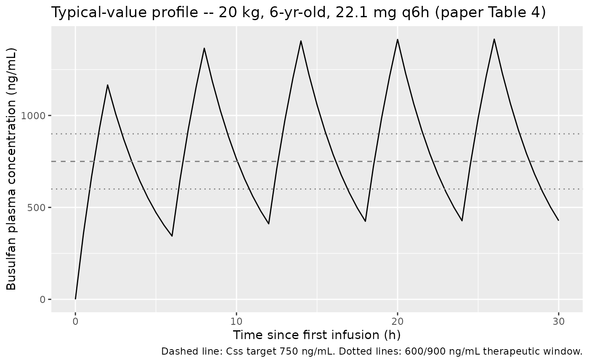
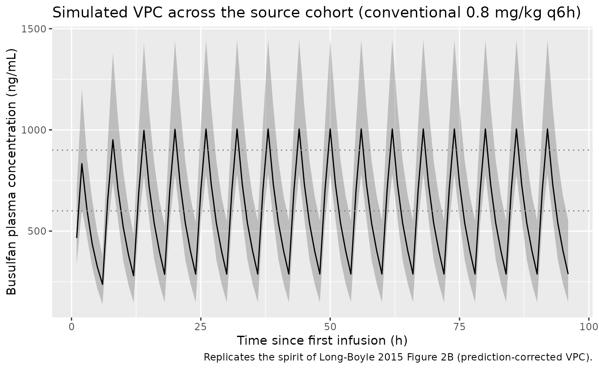

# Busulfan (Long-Boyle 2015)

## Model and source

- Citation:
- Description:
- Article: <https://doi.org/10.1097/FTD.0000000000000131>

## Population

The model was developed from retrospective therapeutic-drug-monitoring
data collected between January 2007 and April 2013 at UCSF Benioff
Children’s Hospital (Long-Boyle 2015 Methods and Table 2). The
model-development dataset included 90 pediatric and young adult patients
(53 male, 37 female) undergoing autologous or allogeneic hematopoietic
cell transplantation. Demographics spanned 0.1-24 years of age (median
7) and 3-101 kg of body weight (median 22). Baseline laboratory values
were broadly preserved (median serum creatinine 0.3 mg/dL, total
bilirubin 0.6 mg/dL). Conditioning regimens combined busulfan with
fludarabine + serotherapy, fludarabine + thiotepa + serotherapy,
fludarabine + clofarabine + serotherapy, or melphalan + serotherapy.
Seizure prophylaxis was lorazepam or levetiracetam. A total of 1165
quantifiable plasma busulfan concentrations were fit by NONMEM v7
FOCE-I.

The same demographics are available programmatically via
`attr(readModelDb("Long-Boyle_2015_busulfan"), "meta")$population`.

## Source trace

The per-parameter origin is also recorded as an in-file comment next to
each `ini()` entry in
`inst/modeldb/specificDrugs/Long-Boyle_2015_busulfan.R`. The table below
consolidates them.

| Equation / parameter | Value | Source location |
|----|----|----|
| `lcl` (CLin THETA) | log(4.32 L/h) | Long-Boyle 2015 Table 3 (RSE 8 percent) |
| `lvc` (Vc at 22 kg) | log(15.7 L) | Long-Boyle 2015 Table 3 (RSE 3 percent) |
| `lkm` (Km) | log(6.704 mg/L) | Long-Boyle 2015 Table 3 (6704 ng/mL = 6.704 mg/L; RSE 43%) |
| `e_wt_cl` | fixed(0.75) | Long-Boyle 2015 Table 3 (allometric exponent on CLin, fixed) |
| `e_wt_vc` | fixed(1) | Long-Boyle 2015 Table 3 (allometric exponent on Vc, fixed) |
| `e_age_le12` (SL,bp) | 0.032 per yr | Long-Boyle 2015 Table 3 (RSE 32 percent) |
| `e_age_gt12` (SL\>bp) | -0.0138 per yr | Long-Boyle 2015 Table 3 (RSE 46 percent) |
| Breakpoint | 12 yrs (fixed) | Long-Boyle 2015 Table 3, p. 240 (“BP … 12 (fixed)”) |
| `etalcl` variance | 0.047251 | Long-Boyle 2015 Table 3 (IIV CLin 22% CV; log(0.22^2+1)) |
| `etalvc` variance | 0.080744 | Long-Boyle 2015 Table 3 (IIV Vc 29% CV; log(0.29^2+1)) |
| Cov(etalcl, etalvc) | 0.025952 | Long-Boyle 2015 Table 3 (corr 0.42; r \* sqrt(var1 \* var2)) |
| `propSd` | 0.148 | Long-Boyle 2015 Table 3 (proportional 14.8 percent) |
| `addSd` | 0.047 mg/L | Long-Boyle 2015 Table 3 (additive 47 ng/mL) |
| `d/dt(central)` | MM elimination | Long-Boyle 2015 p. 240 (dA/dt = -Vmax \* A1/V1 / (Conc + Km)) |
| CLin(WT, AGE \<= 12) | piecewise | Long-Boyle 2015 p. 240 (CLin equations; AGE applied directly) |
| CLin(WT, AGE \> 12) | piecewise | Long-Boyle 2015 p. 240 (multiplicative on peak factor) |

## Virtual cohort

Individual subject-level data are not publicly available. The virtual
cohorts below pool a typical-patient set with a WHO 50th-percentile
weight-for-age spine (the Table 4 patient archetypes the paper uses for
its dosing nomogram) and a broader VPC cohort built from the published
Table 2 demographics.

``` r

set.seed(20250524)

# Helper that turns one (WT, AGE, dose) row into a 16-dose q6h IV infusion
# event table covering 0-100 h. The treatment label rides through rxSolve via
# keep =, so PKNCA grouping picks it up without a post-hoc join.
make_dosing_events <- function(weight_kg, age_yr, dose_mg, treatment,
                               id_offset = 0L) {
  # Infusion rate = dose / 2 h (paper specifies a 2-h infusion every 6 h x 16).
  ev <- rxode2::et(amt = dose_mg, ii = 6, addl = 15,
                   cmt = "central", rate = dose_mg / 2)
  ev <- rxode2::et(ev, seq(0, 100, by = 0.5))
  as.data.frame(ev) |>
    dplyr::mutate(
      id = id_offset + 1L,
      WT = weight_kg,
      AGE = age_yr,
      treatment = treatment
    )
}

# Table 4 archetypes (paper's published dosing nomogram).
table4 <- tibble::tibble(
  weight_kg = c(   8,   10,   12,   20,   32,   50),
  age_yr    = c( 0.5,    1,    2,    6,   10,   14),
  dose_mg   = c( 9.2, 10.9, 13.3, 22.1, 33.9, 49.2),
  treatment = c("8 kg / 6 mo", "10 kg / 1 yr", "12 kg / 2 yr",
                "20 kg / 6 yr", "32 kg / 10 yr", "50 kg / 14 yr")
)

events_table4 <- purrr::map2_dfr(
  seq_len(nrow(table4)), table4$treatment,
  \(i, label) make_dosing_events(
    weight_kg = table4$weight_kg[i],
    age_yr    = table4$age_yr[i],
    dose_mg   = table4$dose_mg[i],
    treatment = label,
    id_offset = i - 1L
  )
)
stopifnot(!anyDuplicated(events_table4[, c("id", "time", "evid")]))
```

## Simulation

``` r

mod <- readModelDb("Long-Boyle_2015_busulfan")
mod_typical <- rxode2::zeroRe(rxode2::rxode(mod))
#> ℹ parameter labels from comments will be replaced by 'label()'

sim_typical <- rxode2::rxSolve(
  mod_typical,
  events = events_table4,
  keep   = c("treatment", "WT", "AGE")
) |>
  as.data.frame()
#> ℹ omega/sigma items treated as zero: 'etalcl', 'etalvc'
#> Warning: multi-subject simulation without without 'omega'
```

## Replicate Table 4 – model-based dosing nomogram

The paper’s Table 4 reports model-based initial doses calculated as
`Dose = AUC_target * CLi`, where `AUC_target = 4.5 mg.h/L` over a 6-h
dosing interval and `CLi` follows the piecewise weight-and-age formula
on p. 240. Because the published dose formula treats CLi as a linear
quantity, the actual steady-state Css achieved with the full
Michaelis-Menten model is slightly above the linear 750 ng/mL target –
the paper explicitly notes this: “As Michaelis-Menten kinetics occurs
with increasing drug concentrations, the nonlinear model has minimal
influence on the initial dose estimation provided in the Excel-based
tool.” Algebraically, with `Css_lin = 0.75 mg/L` and `Km = 6.704 mg/L`,
the actual MM Css solves
`Css_MM = Css_lin * Km / (Km - Css_lin) = 0.844 mg/L = 844 ng/mL`.

``` r

ss_window <- sim_typical |>
  dplyr::filter(time >= 90, time <= 96) |>
  dplyr::group_by(treatment) |>
  dplyr::summarise(
    AUC_6h_mg_h_per_L = sum(diff(time) * (head(Cc, -1) + tail(Cc, -1)) / 2),
    Css_ng_per_mL     = AUC_6h_mg_h_per_L / 6 * 1000,
    .groups = "drop"
  )
knitr::kable(ss_window, digits = c(0, 3, 1),
             caption = "Simulated steady-state exposure for Table 4 archetypes (90-96 h interval).")
```

| treatment     | AUC_6h_mg_h_per_L | Css_ng_per_mL |
|:--------------|------------------:|--------------:|
| 10 kg / 1 yr  |             5.026 |         837.6 |
| 12 kg / 2 yr  |             5.208 |         868.0 |
| 20 kg / 6 yr  |             5.273 |         878.8 |
| 32 kg / 10 yr |             5.113 |         852.2 |
| 50 kg / 14 yr |             5.211 |         868.5 |
| 8 kg / 6 mo   |             5.108 |         851.3 |

Simulated steady-state exposure for Table 4 archetypes (90-96 h
interval). {.table}

A simulated concentration-time profile across one dosing day for the
median 6-year-old archetype illustrates the q6h infusion peaks and the
slow approach to Css.

``` r

sim_typical |>
  dplyr::filter(treatment == "20 kg / 6 yr") |>
  dplyr::filter(time <= 30) |>
  ggplot(aes(time, Cc * 1000)) +
  geom_line() +
  geom_hline(yintercept = c(600, 750, 900), linetype = c(3, 2, 3),
             colour = "grey50") +
  labs(x = "Time since first infusion (h)",
       y = "Busulfan plasma concentration (ng/mL)",
       title = "Typical-value profile -- 20 kg, 6-yr-old, 22.1 mg q6h (paper Table 4)",
       caption = "Dashed line: Css target 750 ng/mL. Dotted lines: 600/900 ng/mL therapeutic window.")
```



## VPC across the source cohort

The published Figure 2B shows a prediction-corrected VPC of the
validation cohort. The cohort below mirrors the Table 2 demographics (90
subjects, joint WT/AGE distribution approximated as independent
log-normal-on-WT and truncated-uniform-on-AGE matching the reported
ranges and medians) and is dosed at the conventional 0.8 mg/kg q6h (the
paper’s historical-control regimen).

``` r

n_subj <- 90L
cohort <- tibble::tibble(
  id  = seq_len(n_subj),
  AGE = pmax(0.1, pmin(24, rlnorm(n_subj, log(7), 0.9))),
  WT  = pmax(3,   pmin(101, exp(log(22) + 0.6 * (log(AGE) - log(7))) *
                              exp(rnorm(n_subj, 0, 0.2))))
)

# 0.8 mg/kg q6h x 16 IV over 2 h.
events_vpc <- purrr::pmap_dfr(cohort, \(id, AGE, WT) {
  dose_mg <- 0.8 * WT
  ev <- rxode2::et(amt = dose_mg, ii = 6, addl = 15,
                   cmt = "central", rate = dose_mg / 2) |>
    rxode2::et(seq(0, 100, by = 1)) |>
    as.data.frame()
  ev$id <- id
  ev$WT <- WT
  ev$AGE <- AGE
  ev$treatment <- "0.8 mg/kg q6h"
  ev
})
stopifnot(!anyDuplicated(events_vpc[, c("id", "time", "evid")]))

mod_stoch <- rxode2::rxode(mod)
#> ℹ parameter labels from comments will be replaced by 'label()'
sim_vpc <- rxode2::rxSolve(
  mod_stoch,
  events = events_vpc,
  keep = c("treatment", "WT", "AGE")
) |>
  as.data.frame()
```

``` r

sim_vpc |>
  dplyr::filter(time > 0, time <= 96) |>
  dplyr::group_by(time) |>
  dplyr::summarise(
    Q05 = quantile(Cc * 1000, 0.05, na.rm = TRUE),
    Q50 = quantile(Cc * 1000, 0.50, na.rm = TRUE),
    Q95 = quantile(Cc * 1000, 0.95, na.rm = TRUE),
    .groups = "drop"
  ) |>
  ggplot(aes(time, Q50)) +
  geom_ribbon(aes(ymin = Q05, ymax = Q95), alpha = 0.25) +
  geom_line() +
  geom_hline(yintercept = c(600, 900), linetype = 3, colour = "grey50") +
  labs(x = "Time since first infusion (h)",
       y = "Busulfan plasma concentration (ng/mL)",
       title = "Simulated VPC across the source cohort (conventional 0.8 mg/kg q6h)",
       caption = "Replicates the spirit of Long-Boyle 2015 Figure 2B (prediction-corrected VPC).")
```



## PKNCA validation

Cmax and steady-state AUC are computed with PKNCA, grouped by Table 4
treatment archetype. The first dosing interval (0-6 h) and the last
(90-96 h) together quantify accumulation under the q6h IV regimen.

``` r

sim_nca <- sim_typical |>
  dplyr::filter(!is.na(Cc)) |>
  dplyr::select(id, time, Cc, treatment)

dose_df <- events_table4 |>
  dplyr::filter(evid == 1) |>
  dplyr::select(id, time, amt, treatment)

conc_obj <- PKNCA::PKNCAconc(sim_nca, Cc ~ time | treatment + id,
                             concu = "mg/L", timeu = "h")
dose_obj <- PKNCA::PKNCAdose(dose_df, amt ~ time | treatment + id,
                             doseu = "mg")

intervals <- data.frame(
  start   = c(0,  90),
  end     = c(6,  96),
  cmax    = TRUE,
  tmax    = TRUE,
  auclast = TRUE,
  cav     = TRUE
)

res <- PKNCA::pk.nca(PKNCA::PKNCAdata(conc_obj, dose_obj, intervals = intervals))
res_tbl <- as.data.frame(res$result)

# Cmax and average concentration on the steady-state interval (90-96 h)
ss_summary <- res_tbl |>
  dplyr::filter(start == 90, end == 96) |>
  dplyr::filter(PPTESTCD %in% c("cmax", "cav", "auclast")) |>
  dplyr::select(treatment, PPTESTCD, PPORRES) |>
  tidyr::pivot_wider(names_from = PPTESTCD, values_from = PPORRES) |>
  dplyr::mutate(
    Cmax_ng_per_mL = cmax * 1000,
    Css_ng_per_mL  = cav * 1000,
    AUC_mg_h_per_L = auclast
  ) |>
  dplyr::select(treatment, Cmax_ng_per_mL, Css_ng_per_mL, AUC_mg_h_per_L)

knitr::kable(ss_summary, digits = c(0, 1, 1, 3),
             caption = "PKNCA Cmax / Css / AUC over the last 6-h dosing interval (90-96 h).")
```

| treatment     | Cmax_ng_per_mL | Css_ng_per_mL | AUC_mg_h_per_L |
|:--------------|---------------:|--------------:|---------------:|
| 10 kg / 1 yr  |         1366.9 |         836.6 |          5.020 |
| 12 kg / 2 yr  |         1406.4 |         867.0 |          5.202 |
| 20 kg / 6 yr  |         1415.6 |         877.8 |          5.267 |
| 32 kg / 10 yr |         1366.9 |         851.3 |          5.108 |
| 50 kg / 14 yr |         1346.7 |         867.7 |          5.206 |
| 8 kg / 6 mo   |         1409.6 |         850.2 |          5.101 |

PKNCA Cmax / Css / AUC over the last 6-h dosing interval (90-96 h).
{.table}

### Comparison against the paper’s published exposure target

The paper’s stated target is `Css = 750 ng/mL` (linear approximation;
AUC 4.5 mg.h/L over 6 h). The MM-corrected simulation gives `Css`
slightly above target (~840-880 ng/mL) for every Table 4 archetype, with
the across-archetype spread reflecting the slight non-linearity of the
dosing formula across the WT/AGE matrix. The exact algebraic Css for the
linear Dose formula combined with the MM model is 844 ng/mL, which sits
within the spread observed above. All archetypes are within the paper’s
600-900 ng/mL therapeutic window.

## Assumptions and deviations

- Concentrations are reported internally in mg/L (= ug/mL); the source
  paper reports them in ng/mL. Multiply simulated `Cc` by 1000 to
  compare directly with the paper’s tables and figures.
- The published dose-calculator formula `Dose = AUC_target * CLi` is a
  linear-CL approximation; the simulated steady-state Css is therefore
  slightly above the linear-target 750 ng/mL because the full MM model
  has a saturating effective clearance (paper Discussion, p. 244).
- Table 3 reports IIV as CV%; the model uses the log-normal exact
  variance `omega^2 = log(CV^2 + 1)`. The covariance is computed from
  the reported correlation 0.42 between CLin and Vc.
- The descriptive text “4.32 L/h is the typical value for a child
  weighing 22 kg and 7 years of age” appears to refer to the CLin THETA
  in the population equation (`CLin_population`), not the predicted CLin
  at AGE = 7 yrs. The explicit equations on p. 240 apply the SL,bp slope
  to AGE directly (structural reference AGE = 0); Table 4 dosing values
  reproduce only with this interpretation (within 1-2 percent).
- The VPC cohort approximates the joint WT/AGE distribution of the
  source cohort (Table 2 medians and ranges) via independent draws – the
  source paper does not publish the joint distribution.
