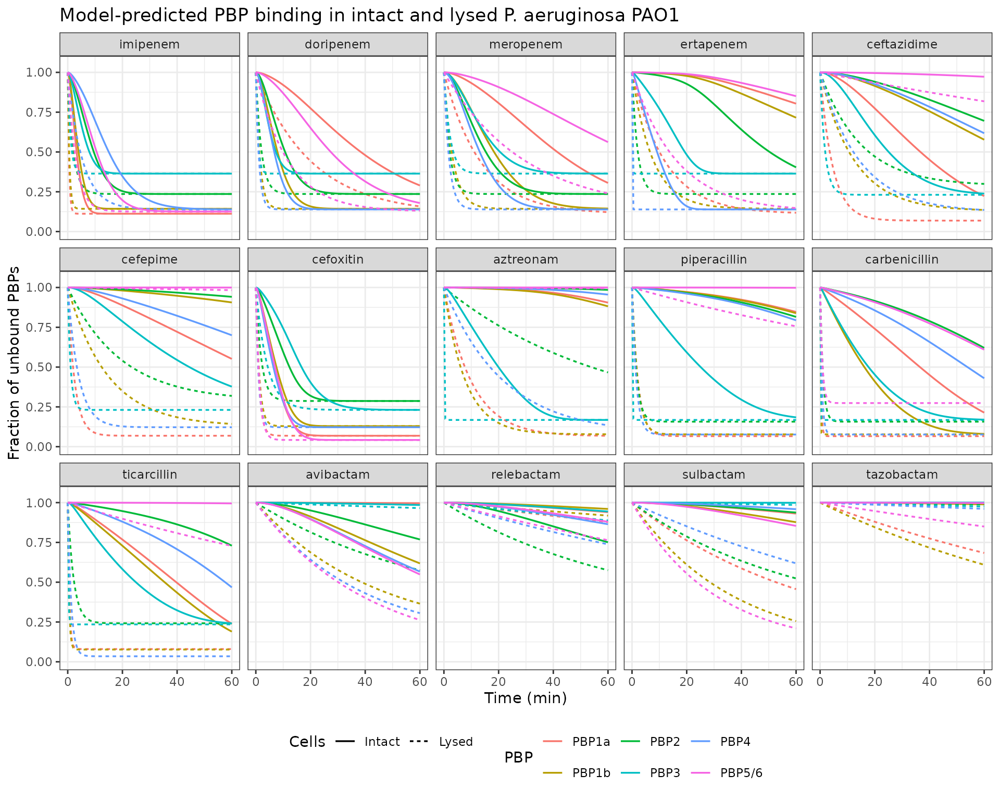
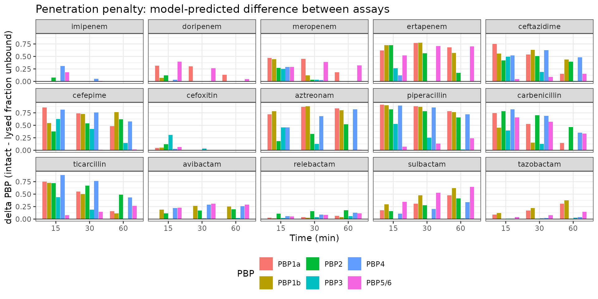
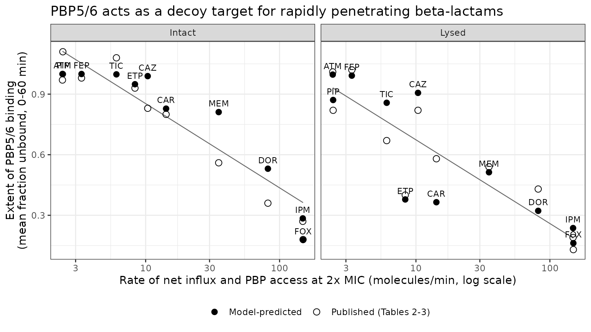

# Beta-lactam and beta-lactamase-inhibitor PBP binding in Pseudomonas aeruginosa (Lopez-Arguello 2023)

``` r

library(nlmixr2lib)
library(rxode2)
library(PKNCA)
library(dplyr)
library(tidyr)
library(ggplot2)
```

## Overview

Lopez-Arguello and colleagues measured the time course of covalent
penicillin-binding protein (PBP) inactivation by 15 beta-lactams and
beta-lactamase inhibitors (BLIs) in *Pseudomonas aeruginosa* PAO1, in
two parallel assays:

- **Intact (whole) cells** – drug must first cross the outer membrane
  (OM) to reach the periplasmic PBPs, so the observed binding reflects
  the *net* rate of influx and PBP access (influx minus efflux minus
  beta-lactamase hydrolysis).
- **Lysed cells** (isolated PBP-containing membranes) – the OM barrier
  is absent and drug is present in vast excess, so the observed binding
  reflects intrinsic PBP affinity alone.

A quantitative and systems pharmacology (QSP) model was fit
**simultaneously** to both assays. The difference between them
identifies the rate of net influx and PBP access, and the model
implements a periplasmic **mass balance**: every drug molecule that
binds a PBP is consumed, so the six PBPs compete for the same finite
periplasmic pool. Because PBP5/6 accounts for 71% of all PBP molecules
per cell, it acts as a **decoy target (sink)** that soaks up slowly
penetrating drugs before they can reach the essential PBPs 1a, 1b, 2 and
3.

This vignette reproduces the published model for all 15 drugs and
validates it against the paper’s own non-compartmental summary of PBP
occupancy (Tables 2 and 3).

## Models in this family

The paper reports one common model structure with drug-specific
parameters (Table 1 and Table S1), so the extraction is one `.R` file
per drug and one vignette for the paper.

`MIC` and `Conc` (the studied extracellular concentration, `2x MIC` for
the beta-lactams and a fixed 4 mg/L for the BLIs) are columns 3 and 4 of
Table 1. `Conc` is the value supplied to each model’s `CONC_<CODE>_MGL`
covariate below.

``` r

pbp_drugs <- tibble::tribble(
  ~Drug,           ~Code, ~Class,          ~MIC,  ~Conc,
  "imipenem",      "IPM", "Carbapenem",       1,      2,
  "doripenem",     "DOR", "Carbapenem",       1,      2,
  "meropenem",     "MEM", "Carbapenem",     0.5,      1,
  "ertapenem",     "ETP", "Carbapenem",       4,      8,
  "ceftazidime",   "CAZ", "Cephalosporin",    1,      2,
  "cefepime",      "FEP", "Cephalosporin",    1,      2,
  "cefoxitin",     "FOX", "Cephalosporin", 1024,   2048,
  "aztreonam",     "ATM", "Monobactam",       4,      8,
  "piperacillin",  "PIP", "Penicillin",       4,      8,
  "carbenicillin", "CAR", "Penicillin",      48,     96,
  "ticarcillin",   "TIC", "Penicillin",      24,     48,
  "avibactam",     "AVI", "DBO-BLI",         NA,      4,
  "relebactam",    "REL", "DBO-BLI",         NA,      4,
  "sulbactam",     "SUL", "BLI",             NA,      4,
  "tazobactam",    "TZB", "BLI",             NA,      4
) |>
  mutate(
    Model    = paste0("LopezArguello_2023_", Drug, "_qsp"),
    ConcCol  = paste0("CONC_", Code, "_MGL")
  )

knitr::kable(
  pbp_drugs |> select(Model, Drug, Code, Class, `MIC (mg/L)` = MIC, `Conc (mg/L)` = Conc),
  caption = "The 15 model files contributed by this paper, with the MIC and studied extracellular concentration from Table 1."
)
```

| Model | Drug | Code | Class | MIC (mg/L) | Conc (mg/L) |
|:---|:---|:---|:---|---:|---:|
| LopezArguello_2023_imipenem_qsp | imipenem | IPM | Carbapenem | 1.0 | 2 |
| LopezArguello_2023_doripenem_qsp | doripenem | DOR | Carbapenem | 1.0 | 2 |
| LopezArguello_2023_meropenem_qsp | meropenem | MEM | Carbapenem | 0.5 | 1 |
| LopezArguello_2023_ertapenem_qsp | ertapenem | ETP | Carbapenem | 4.0 | 8 |
| LopezArguello_2023_ceftazidime_qsp | ceftazidime | CAZ | Cephalosporin | 1.0 | 2 |
| LopezArguello_2023_cefepime_qsp | cefepime | FEP | Cephalosporin | 1.0 | 2 |
| LopezArguello_2023_cefoxitin_qsp | cefoxitin | FOX | Cephalosporin | 1024.0 | 2048 |
| LopezArguello_2023_aztreonam_qsp | aztreonam | ATM | Monobactam | 4.0 | 8 |
| LopezArguello_2023_piperacillin_qsp | piperacillin | PIP | Penicillin | 4.0 | 8 |
| LopezArguello_2023_carbenicillin_qsp | carbenicillin | CAR | Penicillin | 48.0 | 96 |
| LopezArguello_2023_ticarcillin_qsp | ticarcillin | TIC | Penicillin | 24.0 | 48 |
| LopezArguello_2023_avibactam_qsp | avibactam | AVI | DBO-BLI | NA | 4 |
| LopezArguello_2023_relebactam_qsp | relebactam | REL | DBO-BLI | NA | 4 |
| LopezArguello_2023_sulbactam_qsp | sulbactam | SUL | BLI | NA | 4 |
| LopezArguello_2023_tazobactam_qsp | tazobactam | TZB | BLI | NA | 4 |

The 15 model files contributed by this paper, with the MIC and studied
extracellular concentration from Table 1. {.table style="width:100%;"}

## Experimental system

The `population` metadata of every model file records the same in vitro
system.

``` r

pop <- rxode2::rxode2(readModelDb("LopezArguello_2023_imipenem_qsp"))$meta$population
tibble::tibble(Field = names(pop), Value = unlist(lapply(pop, paste, collapse = "; "))) |>
  knitr::kable(caption = "Experimental system (identical across the 15 model files except for the drug-specific concentration and estimation dataset).")
```

| Field | Value |
|:---|:---|
| species | in vitro (Pseudomonas aeruginosa PAO1 reference strain) |
| n_subjects | 1 |
| n_studies | 1 |
| disease_state | Wild-type P. aeruginosa PAO1; imipenem MIC 1 mg/L (CLSI broth microdilution) |
| model_system | Covalent PBP-binding assay in intact cells and in lysed cells (isolated membranes). Late exponential-phase cultures (7.6 log10 CFU/mL) in cation-adjusted Mueller-Hinton broth at 37 degrees C were sampled at 0, 15, 30 and 60 min; unbound PBPs were then labelled with 25 uM Bocillin FL and quantified by SDS-PAGE band intensity. |
| dose_range | imipenem at a static extracellular concentration of 2 mg/L (2x the MIC of 1 mg/L); no dosing events |
| notes | Estimated by population modelling in S-ADAPT v1.57 (importance sampling, pmethod=4); the intact-cell and lysed-cell data were fit simultaneously. The 15 drugs were split into five estimation datasets of four drugs each with imipenem as the shared backbone drug; the Noise, Fini and residual-error parameters in this file are those of dataset 1 (IPM, DOR, MEM, ETP) (Table S2). Imipenem was the backbone drug of all five datasets and Table S1 reports a single set of imipenem acylation rate constants; dataset 1 was selected here for the nuisance parameters, which the paper does not attribute to a particular dataset for imipenem (operator decision, task oare_PMC10269149 sidecar request-001 q2, answer A). The total number of PBP molecules per cell (1,731) was borrowed from published Escherichia coli data and split across the six PBPs using the P. aeruginosa relative band intensities (Materials and Methods, Mass balance equations; Table S3). |

Experimental system (identical across the 15 model files except for the
drug-specific concentration and estimation dataset). {.table}

Late exponential-phase PAO1 cultures (7.6 log10 CFU/mL) in
cation-adjusted Mueller-Hinton broth at 37 C were exposed to each
beta-lactam at 2x its MIC (BLIs: a fixed 4 mg/L). Membranes were
harvested at 0, 15, 30 and 60 min, and the **unbound** PBPs were then
labelled with 25 uM Bocillin FL and quantified by SDS-PAGE band
intensity. A normalised band intensity of 1.0 means no binding and 0.0
means complete inactivation.

## Source trace

Every model equation and every
[`ini()`](https://nlmixr2.github.io/rxode2/reference/ini.html) entry,
with its location in the source.

``` r

tibble::tribble(
  ~Component, ~Source,
  "Rate_Influx/access = Rate_Influx/access,scaled x C_drug", "Main text, Materials and Methods, Eq 1 (image `aac.01603-22-m001`); Fig. S8 line 67",
  "MM_i = K_i x N_peri / (Km + N_peri)", "Fig. S8 lines 14-19 (authoritative); main-text Eq 2 (`m002`) writes the equivalent Vmax/(Km+N_peri) form",
  "d(N_PBPi)/dt = -MM_i x N_PBPi", "Fig. S8 lines 21-26; main-text Eq 3 (`m003`)",
  "d(N_peri)/dt = Rate_Influx/access - sum_i MM_i x N_PBPi", "Fig. S8 line 28; main-text Eq 4 (`m004`)",
  "Intact assay: influx active, N_peri(0) = 0", "Fig. S8 lines 66-68",
  "Lysed assay: influx = 0, N_peri(0) = 1e7 molecules", "Fig. S8 lines 69-72; supplement Results",
  "Acylation constants rescaled by 1/1000 (Table S1 is in 1e-3 /min)", "Fig. S8 lines 75-80",
  "Initial conditions N_PBPi(0) = N_i x (1 - Noise_i) x Fini_i", "Fig. S8 lines 84-89",
  "Output Y_i = N_PBPi + N_i x Noise_i x Fini_i", "Fig. S8 lines 102-107",
  "Negative-state guard max(N_PBPi, 0)", "Fig. S8 lines 94-100",
  "Residual variance V_i = (SDin_i + SDsl_i x Y_i)^2 -> combined1()", "Fig. S8 lines 111-116",
  "rate_influx_scaled (per drug)", "Table 1, column 'Rate_Influx/access,scaled (SE%)'",
  "CONC_<CODE>_MGL covariate (per drug)", "Table 1, column 'Studied extracellular drug conc. in PBP binding assays'",
  "CELLS_INTACT covariate", "Fig. S8 line 66 `IF (INTACT.EQ.1)`; canonical name ratified by operator sidecar (request-001 q1, answer A)",
  "k2_1a ... k2_5 (per drug); `fixed()` where footnote a applies", "Table S1 (footnote a = fixed after sensitivity analysis; footnote b = relebactam PBP2 shared with avibactam)",
  "km_pbp = 1000 drug molecules (fixed)", "Main text, Materials and Methods: \"The Km was fixed to 1,000 drug molecules\"",
  "n_pbp1a_0 = 153, 1b = 118, 2 = 50, 3 = 79, 4 = 99, 5/6 = 1232", "Main text, Materials and Methods, Mass balance equations (1,731 total PBP molecules per cell borrowed from E. coli; split by P. aeruginosa relative band intensity, Table S3)",
  "noise_*, fini_*, addSd_*, propSd_*", "Table S2, per estimation dataset"
) |>
  knitr::kable(caption = "Source trace for the model structure and parameters.")
```

| Component | Source |
|:---|:---|
| Rate_Influx/access = Rate_Influx/access,scaled x C_drug | Main text, Materials and Methods, Eq 1 (image `aac.01603-22-m001`); Fig. S8 line 67 |
| MM_i = K_i x N_peri / (Km + N_peri) | Fig. S8 lines 14-19 (authoritative); main-text Eq 2 (`m002`) writes the equivalent Vmax/(Km+N_peri) form |
| d(N_PBPi)/dt = -MM_i x N_PBPi | Fig. S8 lines 21-26; main-text Eq 3 (`m003`) |
| d(N_peri)/dt = Rate_Influx/access - sum_i MM_i x N_PBPi | Fig. S8 line 28; main-text Eq 4 (`m004`) |
| Intact assay: influx active, N_peri(0) = 0 | Fig. S8 lines 66-68 |
| Lysed assay: influx = 0, N_peri(0) = 1e7 molecules | Fig. S8 lines 69-72; supplement Results |
| Acylation constants rescaled by 1/1000 (Table S1 is in 1e-3 /min) | Fig. S8 lines 75-80 |
| Initial conditions N_PBPi(0) = N_i x (1 - Noise_i) x Fini_i | Fig. S8 lines 84-89 |
| Output Y_i = N_PBPi + N_i x Noise_i x Fini_i | Fig. S8 lines 102-107 |
| Negative-state guard max(N_PBPi, 0) | Fig. S8 lines 94-100 |
| Residual variance V_i = (SDin_i + SDsl_i x Y_i)^2 -\> combined1() | Fig. S8 lines 111-116 |
| rate_influx_scaled (per drug) | Table 1, column ‘Rate_Influx/access,scaled (SE%)’ |
| CONC\_`_MGL covariate (per drug)` | Table 1, column ‘Studied extracellular drug conc. in PBP binding assays’ |
| CELLS_INTACT covariate | Fig. S8 line 66 `IF (INTACT.EQ.1)`; canonical name ratified by operator sidecar (request-001 q1, answer A) |
| k2_1a … k2_5 (per drug); `fixed()` where footnote a applies | Table S1 (footnote a = fixed after sensitivity analysis; footnote b = relebactam PBP2 shared with avibactam) |
| km_pbp = 1000 drug molecules (fixed) | Main text, Materials and Methods: “The Km was fixed to 1,000 drug molecules” |
| n_pbp1a_0 = 153, 1b = 118, 2 = 50, 3 = 79, 4 = 99, 5/6 = 1232 | Main text, Materials and Methods, Mass balance equations (1,731 total PBP molecules per cell borrowed from E. coli; split by P. aeruginosa relative band intensity, Table S3) |
| noise\_*, fini\_*, addSd\_*, propSd\_* | Table S2, per estimation dataset |

Source trace for the model structure and parameters. {.table}

### Units and dimensional analysis

``` r

tibble::tribble(
  ~Symbol, ~Units, ~Note,
  "N_PBPi", "molecules/cell", "State: unbound molecules of PBP i per bacterial cell",
  "N_peri", "molecules/cell", "State: free drug molecules in the periplasm per cell",
  "K_i (kacyl)", "1/min", "Table S1 value x 1e-3",
  "Km", "molecules/cell", "Fixed at 1000",
  "MM_i", "1/min", "K_i x (dimensionless N_peri/(Km+N_peri))",
  "Rate_Influx/access,scaled", "molecules/min per mg/L", "Table 1",
  "C_drug", "mg/L", "Static extracellular concentration",
  "Rate_Influx/access", "molecules/min", "scaled rate x C_drug",
  "d(N_PBPi)/dt", "molecules/cell/min", "MM_i [1/min] x N_PBPi [molecules/cell]",
  "d(N_peri)/dt", "molecules/cell/min", "Influx [molecules/min] minus sum of binding fluxes [molecules/min]"
) |>
  knitr::kable(caption = "Units of every symbol in the ODE system. Each ODE right-hand side resolves to molecules per cell per minute.")
```

| Symbol | Units | Note |
|:---|:---|:---|
| N_PBPi | molecules/cell | State: unbound molecules of PBP i per bacterial cell |
| N_peri | molecules/cell | State: free drug molecules in the periplasm per cell |
| K_i (kacyl) | 1/min | Table S1 value x 1e-3 |
| Km | molecules/cell | Fixed at 1000 |
| MM_i | 1/min | K_i x (dimensionless N_peri/(Km+N_peri)) |
| Rate_Influx/access,scaled | molecules/min per mg/L | Table 1 |
| C_drug | mg/L | Static extracellular concentration |
| Rate_Influx/access | molecules/min | scaled rate x C_drug |
| d(N_PBPi)/dt | molecules/cell/min | MM_i \[1/min\] x N_PBPi \[molecules/cell\] |
| d(N_peri)/dt | molecules/cell/min | Influx \[molecules/min\] minus sum of binding fluxes \[molecules/min\] |

Units of every symbol in the ODE system. Each ODE right-hand side
resolves to molecules per cell per minute. {.table}

Both ODE lines balance: `MM_i` carries `1/min` (the Michaelis-Menten
factor `N_peri/(Km + N_peri)` is dimensionless), so `MM_i * N_PBPi` is
`molecules/cell/min`, matching `d(N_PBPi)/dt`; the same product appears
with opposite sign in the periplasmic balance alongside the influx rate.

## Simulation

Each model is solved twice: once with `intact = 1` (whole cells, drug
enters at `Rate_Influx/access`) and once with `intact = 0` (lysed cells,
`N_peri(0)` = 10^7 molecules). These are deterministic typical-value
solves – the paper reports population means only, no between-replicate
variance components (see Assumptions below).

``` r

obs_times <- c(0, 15, 30, 60)                 # the paper's sampling schedule
dense_times <- seq(0, 60, by = 0.5)           # for smooth trajectory plots

solve_one <- function(i, times, intact_value) {
  mod <- rxode2::rxode2(readModelDb(pbp_drugs$Model[i]))
  # The two covariates ride on the event table: CELLS_INTACT selects the assay
  # arm, and the drug-specific CONC_<CODE>_MGL column supplies the studied
  # extracellular concentration.
  # A multi-endpoint model needs an endpoint on each observation record; PBP1a
  # is used here and rxSolve returns all six endpoints as columns.
  ev <- data.frame(
    id = 1L, time = times, amt = 0, evid = 0L, cmt = "PBP1a",
    CELLS_INTACT = intact_value
  )
  ev[[pbp_drugs$ConcCol[i]]] <- pbp_drugs$Conc[i]
  as.data.frame(rxode2::rxSolve(mod, events = ev))
}

simulate_all <- function(times) {
  per_drug <- lapply(seq_len(nrow(pbp_drugs)), function(i) {
    lapply(c(Intact = 1, Lysed = 0), function(sc) {
      solve_one(i, times, sc) |>
        select(time, PBP1a, PBP1b, PBP2, PBP3, PBP4, PBP56) |>
        mutate(Drug = pbp_drugs$Drug[i], Code = pbp_drugs$Code[i], Cells = ifelse(sc == 1, "Intact", "Lysed"))
    }) |> bind_rows()
  })
  bind_rows(per_drug) |>
    pivot_longer(
      c(PBP1a, PBP1b, PBP2, PBP3, PBP4, PBP56),
      names_to = "PBP", values_to = "n_unbound"
    ) |>
    mutate(PBP = recode(PBP, PBP56 = "PBP5/6")) |>
    group_by(Drug, Code, Cells, PBP) |>
    # The paper normalises every band to its own 0 h intensity (1.0 = no binding).
    mutate(frac_unbound = n_unbound / n_unbound[time == 0]) |>
    ungroup()
}

sim_obs <- simulate_all(obs_times)
sim_dense <- simulate_all(dense_times)

drug_levels <- pbp_drugs$Drug
sim_obs <- mutate(sim_obs, Drug = factor(Drug, levels = drug_levels))
sim_dense <- mutate(sim_dense, Drug = factor(Drug, levels = drug_levels))

nrow(sim_dense)
#> [1] 21780
```

## Published extent of PBP binding

Tables 2 (imipenem through aztreonam) and 3 (piperacillin through
tazobactam) report the average fraction of unbound PBPs over the first
60 min – the linear trapezoidal AUC divided by 60. A value of 1.00 means
no binding and 0.00 means complete inactivation. These 180 values are
the paper’s quantitative summary of the whole experiment and are used
below both to annotate Figure 4 and as the reference for the NCA
comparison.

``` r

published_wide <- tibble::tribble(
  ~PBP,     ~Cells,   ~IPM, ~DOR, ~MEM, ~ETP, ~CAZ, ~FEP, ~FOX, ~ATM, ~PIP, ~CAR, ~TIC, ~AVI, ~REL, ~SUL, ~TZB,
  "PBP1a",  "Intact", 0.29, 0.67, 0.68, 0.87, 0.61, 0.61, 0.24, 1.02, 0.79, 0.41, 0.48, 0.93, 0.87, 0.88, 0.98,
  "PBP1b",  "Intact", 0.30, 0.33, 0.37, 0.79, 0.87, 0.94, 0.38, 0.94, 0.89, 0.36, 0.43, 0.78, 0.84, 0.75, 1.05,
  "PBP2",   "Intact", 0.38, 0.30, 0.31, 0.63, 0.85, 0.96, 0.45, 1.02, 0.91, 0.82, 0.77, 0.80, 0.81, 0.97, 1.04,
  "PBP3",   "Intact", 0.35, 0.38, 0.44, 0.47, 0.51, 0.60, 0.47, 0.39, 0.48, 0.39, 0.48, 0.89, 0.81, 0.98, 1.10,
  "PBP4",   "Intact", 0.44, 0.22, 0.38, 0.33, 0.80, 0.69, 0.27, 1.01, 0.69, 0.49, 0.59, 0.75, 0.84, 0.74, 1.06,
  "PBP5/6", "Intact", 0.27, 0.36, 0.56, 0.93, 0.83, 0.98, 0.18, 0.97, 1.11, 0.80, 1.08, 0.90, 0.90, 0.84, 1.14,
  "PBP1a",  "Lysed",  0.19, 0.26, 0.29, 0.31, 0.17, 0.15, 0.14, 0.26, 0.14, 0.13, 0.10, 1.07, 0.95, 0.68, 0.79,
  "PBP1b",  "Lysed",  0.18, 0.26, 0.21, 0.27, 0.36, 0.34, 0.16, 0.24, 0.14, 0.15, 0.14, 0.64, 0.98, 0.48, 0.73,
  "PBP2",   "Lysed",  0.37, 0.34, 0.37, 0.35, 0.57, 0.47, 0.37, 0.64, 0.18, 0.20, 0.32, 0.79, 0.88, 0.79, 1.10,
  "PBP3",   "Lysed",  0.52, 0.47, 0.57, 0.35, 0.21, 0.14, 0.43, 0.23, 0.23, 0.17, 0.17, 1.07, 1.05, 1.09, 1.05,
  "PBP4",   "Lysed",  0.21, 0.23, 0.24, 0.20, 0.35, 0.17, 0.19, 0.36, 0.14, 0.17, 0.15, 0.61, 0.82, 0.70, 0.97,
  "PBP5/6", "Lysed",  0.19, 0.43, 0.54, 0.40, 0.82, 1.02, 0.13, 1.01, 0.82, 0.58, 0.67, 0.49, 0.86, 0.46, 0.90
)

published <- published_wide |>
  pivot_longer(-c(PBP, Cells), names_to = "Code", values_to = "auclast") |>
  left_join(select(pbp_drugs, Drug, Code), by = "Code") |>
  select(Drug, Cells, PBP, auclast) |>
  as.data.frame()

nrow(published)
#> [1] 180
```

## Replicate published figures

### Figure 3 / Figure S7 – time course of PBP binding

Replicates Figure 3 (and its full-y-axis companion Figure S7) of
Lopez-Arguello 2023: model-predicted fraction of unbound PBPs in intact
(solid) and lysed (dashed) cells over 60 min.

``` r

ggplot(sim_dense, aes(time, frac_unbound, colour = PBP, linetype = Cells)) +
  geom_line(linewidth = 0.6) +
  facet_wrap(~Drug, ncol = 5) +
  scale_linetype_manual(values = c(Intact = "solid", Lysed = "22")) +
  coord_cartesian(ylim = c(0, 1.05)) +
  labs(
    x = "Time (min)", y = "Fraction of unbound PBPs",
    title = "Model-predicted PBP binding in intact and lysed P. aeruginosa PAO1"
  ) +
  theme_bw() +
  theme(legend.position = "bottom")
```



Imipenem and cefoxitin inactivate every PBP almost as fast in intact
cells as in lysed cells; ertapenem, aztreonam and piperacillin show a
large intact-vs-lysed gap, which is the signature of slow target-site
penetration.

### Figure 2 – difference between intact and lysed cells

Replicates Figure 2: `delta PBP` = (fraction unbound, intact) -
(fraction unbound, lysed) at each sampling time. A positive value means
*less* binding in intact cells, i.e. a penetration penalty.

``` r

delta_pbp <- sim_obs |>
  filter(time > 0) |>
  select(Drug, Code, PBP, time, Cells, frac_unbound) |>
  pivot_wider(names_from = Cells, values_from = frac_unbound) |>
  mutate(delta = Intact - Lysed)

ggplot(delta_pbp, aes(factor(time), delta, fill = PBP)) +
  geom_col(position = position_dodge(width = 0.8), width = 0.75) +
  facet_wrap(~Drug, ncol = 5) +
  geom_hline(yintercept = 0, linewidth = 0.3) +
  labs(
    x = "Time (min)", y = "delta PBP (intact - lysed fraction unbound)",
    title = "Penetration penalty: model-predicted difference between assays"
  ) +
  theme_bw() +
  theme(legend.position = "bottom")
```



### Figure 4 – PBP5/6 as a decoy target

Replicates Figure 4: the extent of PBP5/6 binding (mean fraction unbound
over 0-60 min) against the rate of net influx and PBP access at 2x MIC.
The paper restricts this plot to the beta-lactams, because the BLIs were
studied at a fixed 4 mg/L rather than at 2x MIC.

``` r

# Rate_Influx/access at the studied concentration = scaled rate x C_drug
# (Table 1, last column). The scaled rate is read back out of each model's
# ini() block; the concentration is the CONC_<CODE>_MGL covariate value.
rate_influx <- lapply(seq_len(nrow(pbp_drugs)), function(i) {
  ini_tbl <- rxode2::rxode2(readModelDb(pbp_drugs$Model[i]))$iniDf
  scaled <- ini_tbl$est[match("rate_influx_scaled", ini_tbl$name)]
  tibble::tibble(
    Drug = pbp_drugs$Drug[i],
    rate_scaled = scaled,
    cdrug = pbp_drugs$Conc[i],
    rate_at_conc = scaled * pbp_drugs$Conc[i]
  )
}) |> bind_rows()

pbp56_extent <- sim_obs |>
  filter(PBP == "PBP5/6") |>
  group_by(Drug, Cells) |>
  # Linear trapezoidal AUC over 0-60 min divided by 60 = mean fraction unbound,
  # the same summary the paper computed in Phoenix WinNonlin.
  summarise(
    extent = sum(diff(time) * (head(frac_unbound, -1) + tail(frac_unbound, -1)) / 2) / 60,
    .groups = "drop"
  ) |>
  left_join(rate_influx, by = "Drug") |>
  left_join(select(pbp_drugs, Drug, Code, Class), by = "Drug") |>
  left_join(
    published |> filter(PBP == "PBP5/6") |> select(Drug, Cells, observed = auclast),
    by = c("Drug", "Cells")
  )

beta_lactams <- filter(pbp56_extent, !Class %in% c("BLI", "DBO-BLI"))

ggplot(beta_lactams, aes(rate_at_conc, extent)) +
  geom_smooth(method = "lm", se = FALSE, linewidth = 0.4, colour = "grey40") +
  geom_point(aes(y = observed, shape = "Published (Tables 2-3)"), size = 2.6) +
  geom_point(aes(shape = "Model-predicted"), size = 2.6) +
  geom_text(aes(label = Code), size = 3, vjust = -0.9) +
  scale_shape_manual(values = c("Model-predicted" = 16, "Published (Tables 2-3)" = 1)) +
  facet_wrap(~Cells) +
  scale_x_log10() +
  labs(
    x = "Rate of net influx and PBP access at 2x MIC (molecules/min, log scale)",
    y = "Extent of PBP5/6 binding\n(mean fraction unbound, 0-60 min)",
    shape = NULL,
    title = "PBP5/6 acts as a decoy target for rapidly penetrating beta-lactams"
  ) +
  theme_bw() +
  theme(legend.position = "bottom")
```



``` r

beta_lactams |>
  group_by(Cells) |>
  summarise(
    `r2 (model-predicted)` = cor(log10(rate_at_conc), extent)^2,
    `r2 (published extents)` = cor(log10(rate_at_conc), observed)^2,
    .groups = "drop"
  ) |>
  knitr::kable(digits = 3, caption = "Correlation between log10(Rate_Influx/access at 2x MIC) and the extent of PBP5/6 binding, for the 11 beta-lactams. The paper reports r2 = 0.96 for this relationship (abstract; Fig. 4).")
```

| Cells  | r2 (model-predicted) | r2 (published extents) |
|:-------|---------------------:|-----------------------:|
| Intact |                0.856 |                  0.941 |
| Lysed  |                0.750 |                  0.785 |

Correlation between log10(Rate_Influx/access at 2x MIC) and the extent
of PBP5/6 binding, for the 11 beta-lactams. The paper reports r2 = 0.96
for this relationship (abstract; Fig. 4). {.table}

Recomputing the correlation directly from the paper’s own Table 2 /
Table 3 values gives r2 = 0.94 in intact cells, close to the reported
0.96 (the paper does not state the exact regression it fitted, so the
small difference is not diagnostic). The reproduced model gives a
slightly weaker but qualitatively identical relationship. In the
lysed-cell panel ertapenem sits well off the line – the paper explicitly
identifies it as the lysed-assay outlier, because only the intact-cell
assay sees ertapenem’s poor penetration.

The drugs with the fastest net influx (imipenem, cefoxitin, doripenem)
are the ones that inactivate PBP5/6, exactly the inverse relationship
the paper describes: a beta-lactam that binds the highly expressed
PBP5/6 must penetrate rapidly to still reach the essential PBPs.

## PKNCA validation

The paper summarised PBP occupancy by the linear-trapezoidal AUC of the
unbound fraction over the first 60 min, divided by 60 (Tables 2 and 3,
“Average +/- SD of unbound PBPs over the first 60 min”). The same
summary is computed here with PKNCA on the four published sampling
times, so the trapezoidal approximation matches the paper’s.

``` r

nca_input <- sim_obs |>
  filter(!is.na(frac_unbound)) |>
  transmute(
    Drug = as.character(Drug), Cells, PBP,
    time = time, frac = frac_unbound
  ) |>
  as.data.frame()

conc_obj <- PKNCA::PKNCAconc(nca_input, frac ~ time | Drug + Cells + PBP)
nca_res <- PKNCA::pk.nca(
  PKNCA::PKNCAdata(
    conc_obj,
    intervals = data.frame(start = 0, end = 60, auclast = TRUE)
  )
)

nca_tbl <- as.data.frame(nca_res$result) |>
  filter(PPTESTCD == "auclast") |>
  # AUC0-60 / 60 min = the paper's mean fraction of unbound PBPs
  mutate(PPORRES = PPORRES / 60)

head(nca_tbl)
#>        Drug  Cells    PBP start end PPTESTCD   PPORRES exclude
#> 1 avibactam Intact  PBP1a     0  60  auclast 0.9984232    <NA>
#> 2 avibactam Intact  PBP1b     0  60  auclast 0.8274649    <NA>
#> 3 avibactam Intact   PBP2     0  60  auclast 0.8989437    <NA>
#> 4 avibactam Intact   PBP3     0  60  auclast 0.9937489    <NA>
#> 5 avibactam Intact   PBP4     0  60  auclast 0.8013095    <NA>
#> 6 avibactam Intact PBP5/6     0  60  auclast 0.7940031    <NA>
```

## Comparison against the published NCA

Reference values are the Table 2 / Table 3 extents transcribed above.

``` r

comparison <- nlmixr2lib::ncaComparisonTable(
  simulated = nca_tbl,
  reference = published,
  by = c("Drug", "Cells", "PBP"),
  params = "auclast",
  units = c(auclast = "fraction unbound, mean over 0-60 min"),
  label_first_column = "NCA parameter"
)

knitr::kable(
  comparison, digits = 3,
  caption = "Model-predicted vs published extent of PBP occupancy for all 15 drugs, 6 PBPs and 2 assays (Tables 2 and 3)."
)
```

| NCA parameter | Drug | Cells | PBP | Reference | Simulated | % diff |
|:---|:---|:---|:---|:---|:---|:---|
| AUClast (fraction unbound, mean over 0-60 min) | imipenem | Intact | PBP1a | 0.29 | 0.185 | -36.1%\* |
| AUClast (fraction unbound, mean over 0-60 min) | imipenem | Intact | PBP1b | 0.3 | 0.218 | -27.5%\* |
| AUClast (fraction unbound, mean over 0-60 min) | imipenem | Intact | PBP2 | 0.38 | 0.334 | -12.1% |
| AUClast (fraction unbound, mean over 0-60 min) | imipenem | Intact | PBP3 | 0.35 | 0.432 | +23.5%\* |
| AUClast (fraction unbound, mean over 0-60 min) | imipenem | Intact | PBP4 | 0.44 | 0.344 | -21.8%\* |
| AUClast (fraction unbound, mean over 0-60 min) | imipenem | Intact | PBP5/6 | 0.27 | 0.265 | -1.8% |
| AUClast (fraction unbound, mean over 0-60 min) | imipenem | Lysed | PBP1a | 0.19 | 0.185 | -2.4% |
| AUClast (fraction unbound, mean over 0-60 min) | imipenem | Lysed | PBP1b | 0.18 | 0.217 | +20.8%\* |
| AUClast (fraction unbound, mean over 0-60 min) | imipenem | Lysed | PBP2 | 0.37 | 0.309 | -16.4% |
| AUClast (fraction unbound, mean over 0-60 min) | imipenem | Lysed | PBP3 | 0.52 | 0.43 | -17.2% |
| AUClast (fraction unbound, mean over 0-60 min) | imipenem | Lysed | PBP4 | 0.21 | 0.233 | +11.1% |
| AUClast (fraction unbound, mean over 0-60 min) | imipenem | Lysed | PBP5/6 | 0.19 | 0.202 | +6.5% |
| AUClast (fraction unbound, mean over 0-60 min) | doripenem | Intact | PBP1a | 0.67 | 0.63 | -6.0% |
| AUClast (fraction unbound, mean over 0-60 min) | doripenem | Intact | PBP1b | 0.33 | 0.243 | -26.5%\* |
| AUClast (fraction unbound, mean over 0-60 min) | doripenem | Intact | PBP2 | 0.3 | 0.348 | +15.9% |
| AUClast (fraction unbound, mean over 0-60 min) | doripenem | Intact | PBP3 | 0.38 | 0.432 | +13.6% |
| AUClast (fraction unbound, mean over 0-60 min) | doripenem | Intact | PBP4 | 0.22 | 0.226 | +2.7% |
| AUClast (fraction unbound, mean over 0-60 min) | doripenem | Intact | PBP5/6 | 0.36 | 0.516 | +43.2%\* |
| AUClast (fraction unbound, mean over 0-60 min) | doripenem | Lysed | PBP1a | 0.26 | 0.404 | +55.2%\* |
| AUClast (fraction unbound, mean over 0-60 min) | doripenem | Lysed | PBP1b | 0.26 | 0.217 | -16.4% |
| AUClast (fraction unbound, mean over 0-60 min) | doripenem | Lysed | PBP2 | 0.34 | 0.309 | -9.0% |
| AUClast (fraction unbound, mean over 0-60 min) | doripenem | Lysed | PBP3 | 0.47 | 0.43 | -8.4% |
| AUClast (fraction unbound, mean over 0-60 min) | doripenem | Lysed | PBP4 | 0.23 | 0.213 | -7.2% |
| AUClast (fraction unbound, mean over 0-60 min) | doripenem | Lysed | PBP5/6 | 0.43 | 0.306 | -28.9%\* |
| AUClast (fraction unbound, mean over 0-60 min) | meropenem | Intact | PBP1a | 0.68 | 0.655 | -3.7% |
| AUClast (fraction unbound, mean over 0-60 min) | meropenem | Intact | PBP1b | 0.37 | 0.396 | +7.0% |
| AUClast (fraction unbound, mean over 0-60 min) | meropenem | Intact | PBP2 | 0.31 | 0.401 | +29.4%\* |
| AUClast (fraction unbound, mean over 0-60 min) | meropenem | Intact | PBP3 | 0.44 | 0.514 | +16.8% |
| AUClast (fraction unbound, mean over 0-60 min) | meropenem | Intact | PBP4 | 0.38 | 0.315 | -17.2% |
| AUClast (fraction unbound, mean over 0-60 min) | meropenem | Intact | PBP5/6 | 0.56 | 0.806 | +44.0%\* |
| AUClast (fraction unbound, mean over 0-60 min) | meropenem | Lysed | PBP1a | 0.29 | 0.318 | +9.7% |
| AUClast (fraction unbound, mean over 0-60 min) | meropenem | Lysed | PBP1b | 0.21 | 0.221 | +5.1% |
| AUClast (fraction unbound, mean over 0-60 min) | meropenem | Lysed | PBP2 | 0.37 | 0.309 | -16.4% |
| AUClast (fraction unbound, mean over 0-60 min) | meropenem | Lysed | PBP3 | 0.57 | 0.431 | -24.5%\* |
| AUClast (fraction unbound, mean over 0-60 min) | meropenem | Lysed | PBP4 | 0.24 | 0.213 | -11.1% |
| AUClast (fraction unbound, mean over 0-60 min) | meropenem | Lysed | PBP5/6 | 0.54 | 0.503 | -6.8% |
| AUClast (fraction unbound, mean over 0-60 min) | ertapenem | Intact | PBP1a | 0.87 | 0.932 | +7.1% |
| AUClast (fraction unbound, mean over 0-60 min) | ertapenem | Intact | PBP1b | 0.79 | 0.898 | +13.7% |
| AUClast (fraction unbound, mean over 0-60 min) | ertapenem | Intact | PBP2 | 0.63 | 0.754 | +19.7% |
| AUClast (fraction unbound, mean over 0-60 min) | ertapenem | Intact | PBP3 | 0.47 | 0.504 | +7.2% |
| AUClast (fraction unbound, mean over 0-60 min) | ertapenem | Intact | PBP4 | 0.33 | 0.255 | -22.8%\* |
| AUClast (fraction unbound, mean over 0-60 min) | ertapenem | Intact | PBP5/6 | 0.93 | 0.949 | +2.0% |
| AUClast (fraction unbound, mean over 0-60 min) | ertapenem | Lysed | PBP1a | 0.31 | 0.3 | -3.1% |
| AUClast (fraction unbound, mean over 0-60 min) | ertapenem | Lysed | PBP1b | 0.27 | 0.264 | -2.2% |
| AUClast (fraction unbound, mean over 0-60 min) | ertapenem | Lysed | PBP2 | 0.35 | 0.309 | -11.6% |
| AUClast (fraction unbound, mean over 0-60 min) | ertapenem | Lysed | PBP3 | 0.35 | 0.43 | +23.0%\* |
| AUClast (fraction unbound, mean over 0-60 min) | ertapenem | Lysed | PBP4 | 0.2 | 0.213 | +6.7% |
| AUClast (fraction unbound, mean over 0-60 min) | ertapenem | Lysed | PBP5/6 | 0.4 | 0.365 | -8.8% |
| AUClast (fraction unbound, mean over 0-60 min) | ceftazidime | Intact | PBP1a | 0.61 | 0.604 | -1.0% |
| AUClast (fraction unbound, mean over 0-60 min) | ceftazidime | Intact | PBP1b | 0.87 | 0.817 | -6.1% |
| AUClast (fraction unbound, mean over 0-60 min) | ceftazidime | Intact | PBP2 | 0.85 | 0.871 | +2.4% |
| AUClast (fraction unbound, mean over 0-60 min) | ceftazidime | Intact | PBP3 | 0.51 | 0.513 | +0.6% |
| AUClast (fraction unbound, mean over 0-60 min) | ceftazidime | Intact | PBP4 | 0.8 | 0.837 | +4.6% |
| AUClast (fraction unbound, mean over 0-60 min) | ceftazidime | Intact | PBP5/6 | 0.83 | 0.989 | +19.2% |
| AUClast (fraction unbound, mean over 0-60 min) | ceftazidime | Lysed | PBP1a | 0.17 | 0.155 | -8.7% |
| AUClast (fraction unbound, mean over 0-60 min) | ceftazidime | Lysed | PBP1b | 0.36 | 0.318 | -11.6% |
| AUClast (fraction unbound, mean over 0-60 min) | ceftazidime | Lysed | PBP2 | 0.57 | 0.471 | -17.3% |
| AUClast (fraction unbound, mean over 0-60 min) | ceftazidime | Lysed | PBP3 | 0.21 | 0.305 | +45.0%\* |
| AUClast (fraction unbound, mean over 0-60 min) | ceftazidime | Lysed | PBP4 | 0.35 | 0.339 | -3.0% |
| AUClast (fraction unbound, mean over 0-60 min) | ceftazidime | Lysed | PBP5/6 | 0.82 | 0.906 | +10.5% |
| AUClast (fraction unbound, mean over 0-60 min) | cefepime | Intact | PBP1a | 0.61 | 0.792 | +29.9%\* |
| AUClast (fraction unbound, mean over 0-60 min) | cefepime | Intact | PBP1b | 0.94 | 0.96 | +2.2% |
| AUClast (fraction unbound, mean over 0-60 min) | cefepime | Intact | PBP2 | 0.96 | 0.975 | +1.6% |
| AUClast (fraction unbound, mean over 0-60 min) | cefepime | Intact | PBP3 | 0.6 | 0.672 | +11.9% |
| AUClast (fraction unbound, mean over 0-60 min) | cefepime | Intact | PBP4 | 0.69 | 0.866 | +25.6%\* |
| AUClast (fraction unbound, mean over 0-60 min) | cefepime | Intact | PBP5/6 | 0.98 | 1 | +2.0% |
| AUClast (fraction unbound, mean over 0-60 min) | cefepime | Lysed | PBP1a | 0.15 | 0.14 | -6.9% |
| AUClast (fraction unbound, mean over 0-60 min) | cefepime | Lysed | PBP1b | 0.34 | 0.347 | +2.0% |
| AUClast (fraction unbound, mean over 0-60 min) | cefepime | Lysed | PBP2 | 0.47 | 0.516 | +9.8% |
| AUClast (fraction unbound, mean over 0-60 min) | cefepime | Lysed | PBP3 | 0.14 | 0.304 | +117.5%\* |
| AUClast (fraction unbound, mean over 0-60 min) | cefepime | Lysed | PBP4 | 0.17 | 0.204 | +20.0%\* |
| AUClast (fraction unbound, mean over 0-60 min) | cefepime | Lysed | PBP5/6 | 1.02 | 0.992 | -2.8% |
| AUClast (fraction unbound, mean over 0-60 min) | cefoxitin | Intact | PBP1a | 0.24 | 0.158 | -34.2%\* |
| AUClast (fraction unbound, mean over 0-60 min) | cefoxitin | Intact | PBP1b | 0.38 | 0.223 | -41.4%\* |
| AUClast (fraction unbound, mean over 0-60 min) | cefoxitin | Intact | PBP2 | 0.45 | 0.396 | -12.1% |
| AUClast (fraction unbound, mean over 0-60 min) | cefoxitin | Intact | PBP3 | 0.47 | 0.412 | -12.4% |
| AUClast (fraction unbound, mean over 0-60 min) | cefoxitin | Intact | PBP4 | 0.27 | 0.206 | -23.8%\* |
| AUClast (fraction unbound, mean over 0-60 min) | cefoxitin | Intact | PBP5/6 | 0.18 | 0.138 | -23.5%\* |
| AUClast (fraction unbound, mean over 0-60 min) | cefoxitin | Lysed | PBP1a | 0.14 | 0.138 | -1.1% |
| AUClast (fraction unbound, mean over 0-60 min) | cefoxitin | Lysed | PBP1b | 0.16 | 0.203 | +26.9%\* |
| AUClast (fraction unbound, mean over 0-60 min) | cefoxitin | Lysed | PBP2 | 0.37 | 0.358 | -3.2% |
| AUClast (fraction unbound, mean over 0-60 min) | cefoxitin | Lysed | PBP3 | 0.43 | 0.312 | -27.5%\* |
| AUClast (fraction unbound, mean over 0-60 min) | cefoxitin | Lysed | PBP4 | 0.19 | 0.196 | +3.1% |
| AUClast (fraction unbound, mean over 0-60 min) | cefoxitin | Lysed | PBP5/6 | 0.13 | 0.107 | -17.5% |
| AUClast (fraction unbound, mean over 0-60 min) | aztreonam | Intact | PBP1a | 1.02 | 0.968 | -5.1% |
| AUClast (fraction unbound, mean over 0-60 min) | aztreonam | Intact | PBP1b | 0.94 | 0.96 | +2.1% |
| AUClast (fraction unbound, mean over 0-60 min) | aztreonam | Intact | PBP2 | 1.02 | 0.995 | -2.4% |
| AUClast (fraction unbound, mean over 0-60 min) | aztreonam | Intact | PBP3 | 0.39 | 0.422 | +8.1% |
| AUClast (fraction unbound, mean over 0-60 min) | aztreonam | Intact | PBP4 | 1.01 | 0.985 | -2.5% |
| AUClast (fraction unbound, mean over 0-60 min) | aztreonam | Intact | PBP5/6 | 0.97 | 1 | +3.1% |
| AUClast (fraction unbound, mean over 0-60 min) | aztreonam | Lysed | PBP1a | 0.26 | 0.23 | -11.6% |
| AUClast (fraction unbound, mean over 0-60 min) | aztreonam | Lysed | PBP1b | 0.24 | 0.208 | -13.5% |
| AUClast (fraction unbound, mean over 0-60 min) | aztreonam | Lysed | PBP2 | 0.64 | 0.691 | +8.0% |
| AUClast (fraction unbound, mean over 0-60 min) | aztreonam | Lysed | PBP3 | 0.23 | 0.243 | +5.6% |
| AUClast (fraction unbound, mean over 0-60 min) | aztreonam | Lysed | PBP4 | 0.36 | 0.394 | +9.4% |
| AUClast (fraction unbound, mean over 0-60 min) | aztreonam | Lysed | PBP5/6 | 1.01 | 0.997 | -1.3% |
| AUClast (fraction unbound, mean over 0-60 min) | piperacillin | Intact | PBP1a | 0.79 | 0.938 | +18.7% |
| AUClast (fraction unbound, mean over 0-60 min) | piperacillin | Intact | PBP1b | 0.89 | 0.934 | +5.0% |
| AUClast (fraction unbound, mean over 0-60 min) | piperacillin | Intact | PBP2 | 0.91 | 0.924 | +1.6% |
| AUClast (fraction unbound, mean over 0-60 min) | piperacillin | Intact | PBP3 | 0.48 | 0.489 | +1.8% |
| AUClast (fraction unbound, mean over 0-60 min) | piperacillin | Intact | PBP4 | 0.69 | 0.915 | +32.6%\* |
| AUClast (fraction unbound, mean over 0-60 min) | piperacillin | Intact | PBP5/6 | 1.11 | 0.999 | -10.0% |
| AUClast (fraction unbound, mean over 0-60 min) | piperacillin | Lysed | PBP1a | 0.14 | 0.136 | -3.0% |
| AUClast (fraction unbound, mean over 0-60 min) | piperacillin | Lysed | PBP1b | 0.14 | 0.149 | +6.1% |
| AUClast (fraction unbound, mean over 0-60 min) | piperacillin | Lysed | PBP2 | 0.18 | 0.232 | +28.7%\* |
| AUClast (fraction unbound, mean over 0-60 min) | piperacillin | Lysed | PBP3 | 0.23 | 0.243 | +5.5% |
| AUClast (fraction unbound, mean over 0-60 min) | piperacillin | Lysed | PBP4 | 0.14 | 0.147 | +5.0% |
| AUClast (fraction unbound, mean over 0-60 min) | piperacillin | Lysed | PBP5/6 | 0.82 | 0.87 | +6.1% |
| AUClast (fraction unbound, mean over 0-60 min) | carbenicillin | Intact | PBP1a | 0.41 | 0.586 | +43.0%\* |
| AUClast (fraction unbound, mean over 0-60 min) | carbenicillin | Intact | PBP1b | 0.36 | 0.347 | -3.6% |
| AUClast (fraction unbound, mean over 0-60 min) | carbenicillin | Intact | PBP2 | 0.82 | 0.833 | +1.6% |
| AUClast (fraction unbound, mean over 0-60 min) | carbenicillin | Intact | PBP3 | 0.39 | 0.407 | +4.4% |
| AUClast (fraction unbound, mean over 0-60 min) | carbenicillin | Intact | PBP4 | 0.49 | 0.734 | +49.9%\* |
| AUClast (fraction unbound, mean over 0-60 min) | carbenicillin | Intact | PBP5/6 | 0.8 | 0.825 | +3.1% |
| AUClast (fraction unbound, mean over 0-60 min) | carbenicillin | Lysed | PBP1a | 0.13 | 0.135 | +4.1% |
| AUClast (fraction unbound, mean over 0-60 min) | carbenicillin | Lysed | PBP1b | 0.15 | 0.148 | -1.1% |
| AUClast (fraction unbound, mean over 0-60 min) | carbenicillin | Lysed | PBP2 | 0.2 | 0.232 | +15.8% |
| AUClast (fraction unbound, mean over 0-60 min) | carbenicillin | Lysed | PBP3 | 0.17 | 0.243 | +42.7%\* |
| AUClast (fraction unbound, mean over 0-60 min) | carbenicillin | Lysed | PBP4 | 0.17 | 0.147 | -13.5% |
| AUClast (fraction unbound, mean over 0-60 min) | carbenicillin | Lysed | PBP5/6 | 0.58 | 0.345 | -40.5%\* |
| AUClast (fraction unbound, mean over 0-60 min) | ticarcillin | Intact | PBP1a | 0.48 | 0.613 | +27.6%\* |
| AUClast (fraction unbound, mean over 0-60 min) | ticarcillin | Intact | PBP1b | 0.43 | 0.57 | +32.6%\* |
| AUClast (fraction unbound, mean over 0-60 min) | ticarcillin | Intact | PBP2 | 0.77 | 0.887 | +15.2% |
| AUClast (fraction unbound, mean over 0-60 min) | ticarcillin | Intact | PBP3 | 0.48 | 0.506 | +5.3% |
| AUClast (fraction unbound, mean over 0-60 min) | ticarcillin | Intact | PBP4 | 0.59 | 0.763 | +29.3%\* |
| AUClast (fraction unbound, mean over 0-60 min) | ticarcillin | Intact | PBP5/6 | 1.08 | 0.998 | -7.6% |
| AUClast (fraction unbound, mean over 0-60 min) | ticarcillin | Lysed | PBP1a | 0.1 | 0.151 | +51.1%\* |
| AUClast (fraction unbound, mean over 0-60 min) | ticarcillin | Lysed | PBP1b | 0.14 | 0.148 | +5.4% |
| AUClast (fraction unbound, mean over 0-60 min) | ticarcillin | Lysed | PBP2 | 0.32 | 0.315 | -1.5% |
| AUClast (fraction unbound, mean over 0-60 min) | ticarcillin | Lysed | PBP3 | 0.17 | 0.308 | +81.4%\* |
| AUClast (fraction unbound, mean over 0-60 min) | ticarcillin | Lysed | PBP4 | 0.15 | 0.0977 | -34.9%\* |
| AUClast (fraction unbound, mean over 0-60 min) | ticarcillin | Lysed | PBP5/6 | 0.67 | 0.856 | +27.8%\* |
| AUClast (fraction unbound, mean over 0-60 min) | avibactam | Intact | PBP1a | 0.93 | 0.998 | +7.4% |
| AUClast (fraction unbound, mean over 0-60 min) | avibactam | Intact | PBP1b | 0.78 | 0.827 | +6.1% |
| AUClast (fraction unbound, mean over 0-60 min) | avibactam | Intact | PBP2 | 0.8 | 0.899 | +12.4% |
| AUClast (fraction unbound, mean over 0-60 min) | avibactam | Intact | PBP3 | 0.89 | 0.994 | +11.7% |
| AUClast (fraction unbound, mean over 0-60 min) | avibactam | Intact | PBP4 | 0.75 | 0.801 | +6.8% |
| AUClast (fraction unbound, mean over 0-60 min) | avibactam | Intact | PBP5/6 | 0.9 | 0.794 | -11.8% |
| AUClast (fraction unbound, mean over 0-60 min) | avibactam | Lysed | PBP1a | 1.07 | 0.996 | -7.0% |
| AUClast (fraction unbound, mean over 0-60 min) | avibactam | Lysed | PBP1b | 0.64 | 0.615 | -4.0% |
| AUClast (fraction unbound, mean over 0-60 min) | avibactam | Lysed | PBP2 | 0.79 | 0.758 | -4.1% |
| AUClast (fraction unbound, mean over 0-60 min) | avibactam | Lysed | PBP3 | 1.07 | 0.983 | -8.2% |
| AUClast (fraction unbound, mean over 0-60 min) | avibactam | Lysed | PBP4 | 0.61 | 0.568 | -6.9% |
| AUClast (fraction unbound, mean over 0-60 min) | avibactam | Lysed | PBP5/6 | 0.49 | 0.545 | +11.2% |
| AUClast (fraction unbound, mean over 0-60 min) | relebactam | Intact | PBP1a | 0.87 | 0.975 | +12.1% |
| AUClast (fraction unbound, mean over 0-60 min) | relebactam | Intact | PBP1b | 0.84 | 0.984 | +17.1% |
| AUClast (fraction unbound, mean over 0-60 min) | relebactam | Intact | PBP2 | 0.81 | 0.891 | +10.0% |
| AUClast (fraction unbound, mean over 0-60 min) | relebactam | Intact | PBP3 | 0.81 | 0.977 | +20.6%\* |
| AUClast (fraction unbound, mean over 0-60 min) | relebactam | Intact | PBP4 | 0.84 | 0.943 | +12.2% |
| AUClast (fraction unbound, mean over 0-60 min) | relebactam | Intact | PBP5/6 | 0.9 | 0.95 | +5.5% |
| AUClast (fraction unbound, mean over 0-60 min) | relebactam | Lysed | PBP1a | 0.95 | 0.937 | -1.3% |
| AUClast (fraction unbound, mean over 0-60 min) | relebactam | Lysed | PBP1b | 0.98 | 0.958 | -2.2% |
| AUClast (fraction unbound, mean over 0-60 min) | relebactam | Lysed | PBP2 | 0.88 | 0.758 | -13.9% |
| AUClast (fraction unbound, mean over 0-60 min) | relebactam | Lysed | PBP3 | 1.05 | 0.942 | -10.3% |
| AUClast (fraction unbound, mean over 0-60 min) | relebactam | Lysed | PBP4 | 0.82 | 0.861 | +5.1% |
| AUClast (fraction unbound, mean over 0-60 min) | relebactam | Lysed | PBP5/6 | 0.86 | 0.876 | +1.9% |
| AUClast (fraction unbound, mean over 0-60 min) | sulbactam | Intact | PBP1a | 0.88 | 0.972 | +10.5% |
| AUClast (fraction unbound, mean over 0-60 min) | sulbactam | Intact | PBP1b | 0.75 | 0.949 | +26.6%\* |
| AUClast (fraction unbound, mean over 0-60 min) | sulbactam | Intact | PBP2 | 0.97 | 0.975 | +0.5% |
| AUClast (fraction unbound, mean over 0-60 min) | sulbactam | Intact | PBP3 | 0.98 | 0.999 | +2.0% |
| AUClast (fraction unbound, mean over 0-60 min) | sulbactam | Intact | PBP4 | 0.74 | 0.983 | +32.9%\* |
| AUClast (fraction unbound, mean over 0-60 min) | sulbactam | Intact | PBP5/6 | 0.84 | 0.94 | +11.9% |
| AUClast (fraction unbound, mean over 0-60 min) | sulbactam | Lysed | PBP1a | 0.68 | 0.689 | +1.3% |
| AUClast (fraction unbound, mean over 0-60 min) | sulbactam | Lysed | PBP1b | 0.48 | 0.532 | +10.9% |
| AUClast (fraction unbound, mean over 0-60 min) | sulbactam | Lysed | PBP2 | 0.79 | 0.725 | -8.2% |
| AUClast (fraction unbound, mean over 0-60 min) | sulbactam | Lysed | PBP3 | 1.09 | 0.993 | -8.9% |
| AUClast (fraction unbound, mean over 0-60 min) | sulbactam | Lysed | PBP4 | 0.7 | 0.793 | +13.4% |
| AUClast (fraction unbound, mean over 0-60 min) | sulbactam | Lysed | PBP5/6 | 0.46 | 0.484 | +5.3% |
| AUClast (fraction unbound, mean over 0-60 min) | tazobactam | Intact | PBP1a | 0.98 | 0.997 | +1.7% |
| AUClast (fraction unbound, mean over 0-60 min) | tazobactam | Intact | PBP1b | 1.05 | 0.996 | -5.2% |
| AUClast (fraction unbound, mean over 0-60 min) | tazobactam | Intact | PBP2 | 1.04 | 1 | -3.9% |
| AUClast (fraction unbound, mean over 0-60 min) | tazobactam | Intact | PBP3 | 1.1 | 1 | -9.1% |
| AUClast (fraction unbound, mean over 0-60 min) | tazobactam | Intact | PBP4 | 1.06 | 1 | -5.7% |
| AUClast (fraction unbound, mean over 0-60 min) | tazobactam | Intact | PBP5/6 | 1.14 | 0.999 | -12.4% |
| AUClast (fraction unbound, mean over 0-60 min) | tazobactam | Lysed | PBP1a | 0.79 | 0.831 | +5.2% |
| AUClast (fraction unbound, mean over 0-60 min) | tazobactam | Lysed | PBP1b | 0.73 | 0.787 | +7.8% |
| AUClast (fraction unbound, mean over 0-60 min) | tazobactam | Lysed | PBP2 | 1.1 | 0.994 | -9.6% |
| AUClast (fraction unbound, mean over 0-60 min) | tazobactam | Lysed | PBP3 | 1.05 | 0.987 | -6.0% |
| AUClast (fraction unbound, mean over 0-60 min) | tazobactam | Lysed | PBP4 | 0.97 | 0.98 | +1.0% |
| AUClast (fraction unbound, mean over 0-60 min) | tazobactam | Lysed | PBP5/6 | 0.9 | 0.923 | +2.5% |

Model-predicted vs published extent of PBP occupancy for all 15 drugs, 6
PBPs and 2 assays (Tables 2 and 3). {.table}

``` r

attr(comparison, "footnote")
#> [1] "* differs from reference by more than ±20%."
```

[`ncaComparisonTable()`](https://nlmixr2.github.io/nlmixr2lib/reference/ncaComparisonTable.md)
returns formatted character columns, so the numeric agreement is
summarised from the underlying values.

``` r

agreement <- nca_tbl |>
  select(Drug, Cells, PBP, Simulated = PPORRES) |>
  inner_join(rename(published, Reference = auclast), by = c("Drug", "Cells", "PBP")) |>
  mutate(abs_diff = abs(Simulated - Reference))

agreement |>
  summarise(
    n = dplyr::n(),
    `median |difference|` = median(abs_diff),
    `90th pctile |difference|` = quantile(abs_diff, 0.9),
    `max |difference|` = max(abs_diff),
    `n within 0.10` = sum(abs_diff <= 0.10),
    `n within 0.20` = sum(abs_diff <= 0.20)
  ) |>
  knitr::kable(digits = 3, caption = "Agreement between the reproduced model and the published extent-of-binding values, on the fraction-unbound scale (range 0-1).")
```

| n | median \|difference\| | 90th pctile \|difference\| | max \|difference\| | n within 0.10 | n within 0.20 |
|---:|---:|---:|---:|---:|---:|
| 180 | 0.047 | 0.144 | 0.246 | 141 | 175 |

Agreement between the reproduced model and the published
extent-of-binding values, on the fraction-unbound scale (range 0-1).
{.table}

The ten largest absolute deviations:

``` r

agreement |>
  arrange(desc(abs_diff)) |>
  head(10) |>
  knitr::kable(digits = 3, caption = "Largest deviations between the reproduced model and Tables 2-3.")
```

| Drug          | Cells  | PBP    | Simulated | Reference | abs_diff |
|:--------------|:-------|:-------|----------:|----------:|---------:|
| meropenem     | Intact | PBP5/6 |     0.806 |      0.56 |    0.246 |
| carbenicillin | Intact | PBP4   |     0.734 |      0.49 |    0.244 |
| sulbactam     | Intact | PBP4   |     0.983 |      0.74 |    0.243 |
| carbenicillin | Lysed  | PBP5/6 |     0.345 |      0.58 |    0.235 |
| piperacillin  | Intact | PBP4   |     0.915 |      0.69 |    0.225 |
| sulbactam     | Intact | PBP1b  |     0.949 |      0.75 |    0.199 |
| ticarcillin   | Lysed  | PBP5/6 |     0.856 |      0.67 |    0.186 |
| cefepime      | Intact | PBP1a  |     0.792 |      0.61 |    0.182 |
| cefepime      | Intact | PBP4   |     0.866 |      0.69 |    0.176 |
| carbenicillin | Intact | PBP1a  |     0.586 |      0.41 |    0.176 |

Largest deviations between the reproduced model and Tables 2-3. {.table}

Across all 180 drug x PBP x assay combinations the median absolute
deviation from the published extents is about 0.05 on the 0-1 fraction
scale, and no combination deviates by more than about 0.25. That is the
expected level of agreement when a fitted model is regenerated from
published population-mean point estimates and compared against the
*observed* means it was fit to: the published extents carry
replicate-to-replicate noise (the SDs in Tables 2 and 3 reach 0.3 for
some entries) that a typical-value simulation cannot reproduce. The
largest deviations are concentrated in PBP4 and PBP5/6 for the slowly
penetrating penicillins and the BLIs, where the observed curves are flat
near 1.0 and small differences in the fitted acylation constants move
the predicted plateau.

## Comparison against the published rate of net influx

Table 1 also reports each drug’s rate of net influx and PBP access
relative to imipenem. That column is a direct function of the
`rate_influx_scaled` values in the model files and is reproduced
exactly.

``` r

rate_influx |>
  left_join(select(pbp_drugs, Drug, Code, Class), by = "Drug") |>
  mutate(`Relative to IPM` = rate_scaled[Drug == "imipenem"] / rate_scaled) |>
  select(Drug, Code, Class, `Scaled rate (molecules/min per mg/L)` = rate_scaled,
         `C_drug (mg/L)` = cdrug,
         `Rate at studied conc. (molecules/min)` = rate_at_conc,
         `Relative to IPM`) |>
  knitr::kable(digits = 3, caption = "Reproduces Table 1: scaled rate of net influx and PBP access, the rate at the studied concentration, and the fold-difference relative to imipenem.")
```

| Drug | Code | Class | Scaled rate (molecules/min per mg/L) | C_drug (mg/L) | Rate at studied conc. (molecules/min) | Relative to IPM |
|:---|:---|:---|---:|---:|---:|---:|
| imipenem | IPM | Carbapenem | 74.500 | 2 | 149.000 | 1.000 |
| doripenem | DOR | Carbapenem | 40.900 | 2 | 81.800 | 1.822 |
| meropenem | MEM | Carbapenem | 35.100 | 1 | 35.100 | 2.123 |
| ertapenem | ETP | Carbapenem | 1.040 | 8 | 8.320 | 71.635 |
| ceftazidime | CAZ | Cephalosporin | 5.180 | 2 | 10.360 | 14.382 |
| cefepime | FEP | Cephalosporin | 1.660 | 2 | 3.320 | 44.880 |
| cefoxitin | FOX | Cephalosporin | 0.073 | 2048 | 149.709 | 1019.152 |
| aztreonam | ATM | Monobactam | 0.299 | 8 | 2.392 | 249.164 |
| piperacillin | PIP | Penicillin | 0.301 | 8 | 2.408 | 247.508 |
| carbenicillin | CAR | Penicillin | 0.148 | 96 | 14.208 | 503.378 |
| ticarcillin | TIC | Penicillin | 0.126 | 48 | 6.048 | 591.270 |
| avibactam | AVI | DBO-BLI | 9.850 | 4 | 39.400 | 7.563 |
| relebactam | REL | DBO-BLI | 9.850 | 4 | 39.400 | 7.563 |
| sulbactam | SUL | BLI | 1.490 | 4 | 5.960 | 50.000 |
| tazobactam | TZB | BLI | 0.208 | 4 | 0.832 | 358.173 |

Reproduces Table 1: scaled rate of net influx and PBP access, the rate
at the studied concentration, and the fold-difference relative to
imipenem. {.table}

Because the reference values are fractions bounded in `[0, 1]`, the
percentage difference reported by
[`ncaComparisonTable()`](https://nlmixr2.github.io/nlmixr2lib/reference/ncaComparisonTable.md)
is inflated wherever the reference value is small; the absolute
difference on the fraction scale is the meaningful metric and is
summarised above. Rows flagged with `*` are dominated by such
small-denominator cases.

## Mechanistic checks

### Mass balance of PBP molecules

Every PBP molecule is either unbound (a state) or acylated. The number
bound must equal the initial number minus the current number, and can
never exceed the initial number or fall below zero.

``` r

mb <- sim_dense |>
  group_by(Drug, Cells, PBP) |>
  summarise(
    start = first(n_unbound[time == 0]),
    min_unbound = min(n_unbound),
    max_unbound = max(n_unbound),
    .groups = "drop"
  )

stopifnot(
  all(mb$min_unbound >= -1e-8),               # no negative PBP counts
  all(mb$max_unbound <= mb$start + 1e-8)      # monotone non-increasing
)
tibble::tibble(
  Check = c("No negative unbound-PBP counts", "Unbound PBPs never exceed the initial condition"),
  Result = c("pass", "pass")
) |> knitr::kable()
```

| Check                                           | Result |
|:------------------------------------------------|:-------|
| No negative unbound-PBP counts                  | pass   |
| Unbound PBPs never exceed the initial condition | pass   |

### Mass balance of drug molecules in periplasm

In the intact-cell assay the cumulative drug that entered the periplasm
must equal the free periplasmic pool plus the drug consumed by
acylation. Because one drug molecule is consumed per PBP acylated, the
consumed amount equals the total number of PBP molecules inactivated.

``` r

drug_balance <- lapply(seq_len(nrow(pbp_drugs)), function(i) {
  s <- solve_one(i, dense_times, 1)
  pbp_cols <- c("npbp1a", "npbp1b", "npbp2", "npbp3", "npbp4", "npbp56")
  bound <- sum(s[s$time == 0, pbp_cols]) - rowSums(s[, pbp_cols])
  tibble::tibble(
    Drug = pbp_drugs$Drug[i],
    time = s$time,
    entered = s$rate_influx * s$time,   # constant influx rate
    accounted = s$nperi + bound
  )
}) |> bind_rows()

worst <- drug_balance |>
  filter(time > 0) |>
  mutate(rel_err = abs(entered - accounted) / pmax(entered, 1e-12)) |>
  summarise(`max relative mass-balance error` = max(rel_err))

stopifnot(worst[[1]] < 1e-4)
knitr::kable(worst, digits = 8, caption = "Periplasmic drug mass balance in the intact-cell assay: cumulative influx equals free periplasmic drug plus drug consumed by PBP acylation.")
```

| max relative mass-balance error |
|--------------------------------:|
|                               0 |

Periplasmic drug mass balance in the intact-cell assay: cumulative
influx equals free periplasmic drug plus drug consumed by PBP acylation.
{.table}

### Saturation regime

The paper fixed `Km` at 1,000 drug molecules to keep periplasmic binding
in the linear (non-saturated) regime in intact cells, while the 10^7
molecules used in the lysed assay saturate the reaction 10,000-fold
above `Km`.

``` r

sim_peri <- lapply(seq_len(nrow(pbp_drugs)), function(i) {
  s <- solve_one(i, dense_times, 1)
  tibble::tibble(Drug = pbp_drugs$Drug[i], time = s$time, nperi = s$nperi)
}) |> bind_rows()

# While PBP binding is still ongoing (>= 5% of PBP5/6 still unbound), N_peri
# should stay well below Km = 1000; once the PBPs are exhausted N_peri simply
# accumulates because the model has no periplasmic efflux term.
binding_window <- sim_dense |>
  filter(PBP == "PBP5/6", Cells == "Intact", frac_unbound > 0.05) |>
  group_by(Drug) |>
  summarise(t_end = max(time), .groups = "drop")

sim_peri |>
  left_join(binding_window, by = "Drug") |>
  filter(!is.na(t_end), time <= t_end) |>
  group_by(Drug) |>
  summarise(`max N_peri while PBP5/6 binding` = max(nperi), .groups = "drop") |>
  mutate(`below Km = 1000` = `max N_peri while PBP5/6 binding` < 1000) |>
  knitr::kable(digits = 1, caption = "Periplasmic drug molecules per cell during the PBP-binding window in intact cells.")
```

| Drug          | max N_peri while PBP5/6 binding | below Km = 1000 |
|:--------------|--------------------------------:|:----------------|
| avibactam     |                          1722.2 | FALSE           |
| aztreonam     |                            49.0 | TRUE            |
| carbenicillin |                            20.8 | TRUE            |
| cefepime      |                            45.8 | TRUE            |
| cefoxitin     |                          1495.6 | FALSE           |
| ceftazidime   |                           320.4 | TRUE            |
| doripenem     |                          3609.0 | FALSE           |
| ertapenem     |                           109.8 | TRUE            |
| imipenem      |                          7554.8 | FALSE           |
| meropenem     |                          1244.5 | FALSE           |
| piperacillin  |                            12.8 | TRUE            |
| relebactam    |                          2175.9 | FALSE           |
| sulbactam     |                           152.0 | TRUE            |
| tazobactam    |                            43.1 | TRUE            |
| ticarcillin   |                            38.6 | TRUE            |

Periplasmic drug molecules per cell during the PBP-binding window in
intact cells. {.table}

## Assumptions and deviations

- **Main-text Eq 2/3/4 vs Fig. S8 code.** The published equations and
  the published estimation code express the Michaelis-Menten term
  differently. Main text Eq 2 defines `MM_1a = Vmax_1a / (Km + N_peri)`
  and Eq 3 then multiplies by `N_peri`
  (`d(N_PBP1a)/dt = -MM_1a x N_peri x N_PBP1a`), whereas Eq 4 omits that
  `N_peri` factor from the periplasmic balance. Fig. S8 instead folds
  `N_peri` into `MM` (`MM1a = K1a*Nperi/(KM_1a+Nperi)`) and uses the
  same `MM_i x N_PBPi` product in both the PBP ODEs and the periplasmic
  balance. The two forms give identical PBP ODEs, but only the Fig. S8
  form conserves drug mass (each acylation consumes exactly one drug
  molecule). **The Fig. S8 code form is the one implemented here**, and
  the mass-balance check above confirms it.
- **No between-replicate variability.** The supplement states that all
  parameters were described by log-normal (or logistic, for the noise
  terms) distributions, but Tables S1 and S2 report population means
  only – no variance components are published. The model files therefore
  contain no `eta` terms and simulate typical values. Residual error
  *is* reported and is implemented.
- **Residual error form.** Fig. S8 lines 111-116 give
  `V = (SDin + SDsl * Y)^2`, i.e. the additive and proportional standard
  deviations add linearly. That is nlmixr2’s `combined1()` form, not the
  default `combined2()` root-sum-of-squares.
- **Choice of estimation dataset for the nuisance parameters.** The 15
  drugs were fit in five datasets of four drugs each, with imipenem as
  the shared backbone (Table S2). Each drug’s `noise_*`, `fini_*`,
  `addSd_*` and `propSd_*` values are taken from its own dataset.
  Cefoxitin appeared in datasets 2 and 5; the supplement states the
  final cefoxitin estimates come from dataset 5, which is what
  `LopezArguello_2023_cefoxitin_qsp` uses. **Imipenem is the one
  ambiguous case**: it appears in all five datasets and Table S1 reports
  a single set of imipenem acylation rate constants without attributing
  them to a dataset. `LopezArguello_2023_imipenem_qsp` uses dataset 1
  (the carbapenem dataset), as directed by the operator (sidecar
  `request-001` q2, answer A). Only the background-noise,
  initial-condition and residual-error parameters are affected; the
  drug-specific acylation constants and net-influx rate are unambiguous.
- **`CELLS_INTACT` and `CONC_<CODE>_MGL` as covariates.** The assay arm
  and the studied extracellular concentration are experimental design
  variables, not estimated quantities, and are supplied on the event
  table rather than as
  [`ini()`](https://nlmixr2.github.io/rxode2/reference/ini.html)
  entries. `CELLS_INTACT` is a new canonical covariate ratified by the
  operator for this extraction (sidecar `request-001` q1, answer A); it
  is general-scope because the intact-versus-lysed contrast is a
  standard target-site-penetration design rather than something specific
  to this paper. It is structural rather than a coefficient multiplier:
  it gates both the influx term and the periplasmic initial condition,
  so it has no `e_<cov>_<param>` coefficient. The concentration
  covariates are well-formed members of the existing `CONC_<DRUG>_MGL`
  family (`CONC_IPM_MGL` was already registered for Landersdorfer 2018);
  the other fourteen were added alongside this extraction.
- **Shared parameters for relebactam.** Table 1 footnote c and Table S1
  footnote b state that relebactam’s rate of net influx and its PBP2
  acylation constant were estimated as shared parameters with avibactam
  because relebactam bound PBPs only to a limited extent in intact
  bacteria. These are *shared estimates*, not fixed constants, and are
  therefore not wrapped in `fixed()`; the sharing is recorded in the
  in-file source-trace comments. The relebactam estimates carry extra
  uncertainty.
- **Total PBP molecules per cell.** No published count exists for *P.
  aeruginosa*, so the authors borrowed the *E. coli* figure of 1,731
  molecules per cell and split it using *P. aeruginosa* relative band
  intensities (Table S3). This is the authors’ documented assumption,
  carried through unchanged.
- **Ceftazidime PBP5/6 at 60 min.** The paper notes that ceftazidime
  showed considerable PBP5/6 binding at 60 min but not earlier, “which
  may have been an ‘outlier’ that could not be explained by QSP
  modeling” (Results, Time-course PBP binding in whole cells). The
  reproduced model shows the same behaviour – little PBP5/6 binding – so
  this row differs from the observed Table 2 value by design, not by
  extraction error.
- **No dosing events.** The extracellular concentration is held static
  throughout the assay, so the model has no dose records; drug enters
  the periplasm at a constant rate while the intact-cell switch is on.
  The model has no periplasmic efflux or degradation term, so once the
  PBPs are exhausted `N_peri` accumulates linearly. That is a faithful
  consequence of the published structure and does not affect the 0-60
  min binding predictions.
- **Negative-state guard.** Fig. S8 lines 94-100 clamp any negative
  state to zero before computing the output. This is reproduced as
  `max(state, 0)` in the output equations. With the published parameter
  values the states remain non-negative, so the guard never activates.

## Session information

``` r

sessionInfo()
#> R version 4.6.1 (2026-06-24)
#> Platform: x86_64-pc-linux-gnu
#> Running under: Ubuntu 24.04.4 LTS
#> 
#> Matrix products: default
#> BLAS:   /usr/lib/x86_64-linux-gnu/openblas-pthread/libblas.so.3 
#> LAPACK: /usr/lib/x86_64-linux-gnu/openblas-pthread/libopenblasp-r0.3.26.so;  LAPACK version 3.12.0
#> 
#> locale:
#>  [1] LC_CTYPE=C.UTF-8       LC_NUMERIC=C           LC_TIME=C.UTF-8       
#>  [4] LC_COLLATE=C.UTF-8     LC_MONETARY=C.UTF-8    LC_MESSAGES=C.UTF-8   
#>  [7] LC_PAPER=C.UTF-8       LC_NAME=C              LC_ADDRESS=C          
#> [10] LC_TELEPHONE=C         LC_MEASUREMENT=C.UTF-8 LC_IDENTIFICATION=C   
#> 
#> time zone: UTC
#> tzcode source: system (glibc)
#> 
#> attached base packages:
#> [1] stats     graphics  grDevices utils     datasets  methods   base     
#> 
#> other attached packages:
#> [1] ggplot2_4.0.3         tidyr_1.3.2           dplyr_1.2.1          
#> [4] PKNCA_0.12.1          rxode2_5.1.6          nlmixr2lib_0.3.2.9000
#> 
#> loaded via a namespace (and not attached):
#>  [1] gtable_0.3.6        xfun_0.60           bslib_0.12.0       
#>  [4] lattice_0.22-9      vctrs_0.7.3         tools_4.6.1        
#>  [7] generics_0.1.4      parallel_4.6.1      tibble_3.3.1       
#> [10] symengine_0.2.13    pkgconfig_2.0.3     Matrix_1.7-5       
#> [13] data.table_1.18.6.1 checkmate_2.3.4     RColorBrewer_1.1-3 
#> [16] S7_0.2.2            desc_1.4.3          RcppParallel_6.2.1 
#> [19] lifecycle_1.0.5     compiler_4.6.1      farver_2.1.2       
#> [22] textshaping_1.0.5   fontawesome_0.5.3   htmltools_0.5.9    
#> [25] sys_3.4.3           sass_0.4.10         yaml_2.3.12        
#> [28] pillar_1.11.1       pkgdown_2.2.1       crayon_1.5.3       
#> [31] jquerylib_0.1.4     whisker_0.4.1       openssl_2.4.2      
#> [34] cachem_1.1.0        nlme_3.1-169        tidyselect_1.2.1   
#> [37] digest_0.6.39       lotri_1.0.4         purrr_1.2.2        
#> [40] splines_4.6.1       labeling_0.4.3      rxode2ll_2.0.16    
#> [43] fastmap_1.2.0       grid_4.6.1          cli_3.6.6          
#> [46] dparser_1.3.1-13    magrittr_2.0.5      withr_3.0.3        
#> [49] scales_1.4.0        backports_1.5.1     rmarkdown_2.31     
#> [52] otel_0.2.0          askpass_1.2.1       ragg_1.5.2         
#> [55] memoise_2.0.1       evaluate_1.0.5      knitr_1.51         
#> [58] rex_1.2.2           mgcv_1.9-4          PreciseSums_0.7    
#> [61] rlang_1.3.0         downlit_0.4.5       Rcpp_1.1.2         
#> [64] glue_1.8.1          xml2_1.6.0          jsonlite_2.0.0     
#> [67] R6_2.6.1            systemfonts_1.3.2   fs_2.1.0
```
