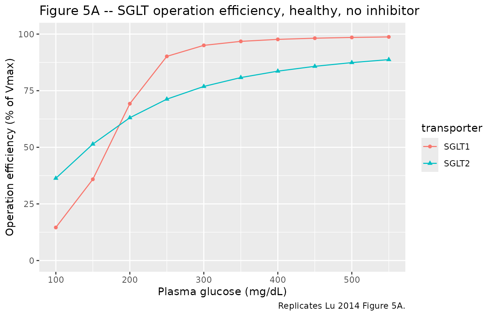
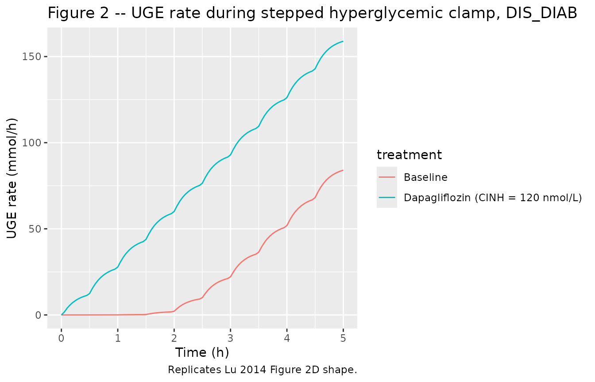
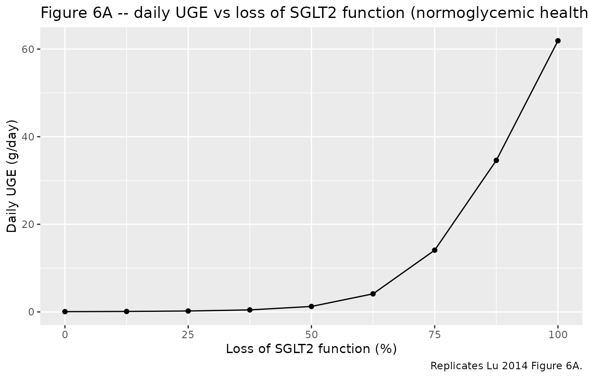

# Sglt qsp (Lu 2014)

## Model and source

- Citation: Lu Y, Griffen SC, Boulton DW, Leil TA. Use of systems
  pharmacology modeling to elucidate the operating characteristics of
  SGLT1 and SGLT2 in renal glucose reabsorption in humans. Front
  Pharmacol. 2014;5:274. <doi:10.3389/fphar.2014.00274>.
- Description: QSP. Mechanistic systems pharmacology model of renal
  glucose reabsorption by SGLT1 and SGLT2 along the proximal tubules in
  humans, with optional competitive inhibition by an SGLT2 inhibitor
  (calibrated to dapagliflozin; evaluated against canagliflozin). The
  proximal convoluted tubules (PCT) are divided into six sub-segments
  (PCT1-6, SGLT2-mediated reabsorption) and the proximal straight
  tubules into three (PST1-3, SGLT1-mediated). Filtrate drains into a
  urinary bladder. Plasma glucose (GLU, mmol/L) and plasma inhibitor
  (CINH, nmol/L) enter as time-varying regressors through glomerular
  filtration. Calibrated by hand-tuning in Berkeley Madonna v8.3.18
  against the DeFronzo et al. (2013) urinary glucose excretion data;
  evaluated against Polidori et al. (2013), Mogensen (1971), and Wolf et
  al. (2009). 23 ODE states; no fitted IIV or residual error
  (typical-individual mechanism model fit to mean per-step data).
- Article: <https://doi.org/10.3389/fphar.2014.00274>

This is a typical-individual mechanistic systems-pharmacology (QSP)
model: there is no fitted IIV, no residual-error declaration, and no
dosing event in the traditional sense. Plasma glucose and plasma
inhibitor concentrations enter the kidney via glomerular filtration as
time-varying regressors (`GLU`, `CINH`); the kidney’s reabsorption
mechanism is integrated through 23 ODE states across 9 tubular
sub-segments (PCT1-6 mediated by SGLT2, PST1-3 mediated by SGLT1), a
urinary bladder, and cumulative urine / reabsorbed-mass sinks for both
glucose and inhibitor.

## Population

Lu 2014 calibrated the model against mean urinary-glucose-excretion
(UGE) data from DeFronzo et al. (2013, 12 healthy adults + 12 T2DM
subjects, stepped hyperglycemic clamp before and after 10 mg/day
dapagliflozin for 7 days) and evaluated it against Polidori et al.
(2013, 28 T2DM, 100 mg/day canagliflozin for 8 days), Mogensen (1971, 9
healthy + 10 diabetic, glucose infusion to over 650 mg/dL), and Wolf et
al. (2009, 22 T2DM, stepped hyperglycemic clamp). The Lu 2014 main text
does not reproduce per-study demographic tables, so the model’s
`population` metadata records the pooled study counts but leaves age,
weight, sex, and race / ethnicity as `NA`; the primary publications
carry those details for readers who need them.

## Source trace

Per-parameter and per-equation origin (also recorded as in-file comments
in `inst/modeldb/specificDrugs/Lu_2014_sglt_qsp.R`):

| Equation / parameter | Value | Source location |
|----|----|----|
| `lvctx` | `log(0.216)` L | Lu 2014 Table 2 (Thelwall et al. 2011) |
| `fvptc` | `0.3` | Lu 2014 Table 2 (Moller and Skriver 1985) |
| `fvpctc` | `0.7` | Lu 2014 Table 2 (assumed) |
| `lvx` | `log(0.2)` L | Lu 2014 Table 2 (Brown et al. 2011) |
| `lgfr` | `log(6.65)` L/h | Lu 2014 Table 2 (DeFronzo et al. 2013 healthy baseline range midpoint) |
| `lkx` | `log(0.83)` L/h | Lu 2014 Table 2 (DeFronzo et al. 2013 healthy baseline range midpoint) |
| `lvmax1` | `log(20.0)` mmol/h | Lu 2014 Table 2 calibrated |
| `lvmax2` | `log(93.5)` mmol/h | Lu 2014 Table 2 calibrated (healthy) |
| `e_t2dm_vmax2` | `0.176` | Lu 2014 Table 2: Vmax2 = 110 vs 93.5 mmol/h |
| `lkm1` | `log(0.5)` mmol/L | Lu 2014 Table 2 calibrated |
| `lkm2` | `log(4.0)` mmol/L | Lu 2014 Table 2 calibrated |
| `lki1` | `log(400)` nmol/L | Lu 2014 Table 3 (dapagliflozin, Hummel et al. 2011) |
| `lki2` | `log(0.3)` nmol/L | Lu 2014 Table 3 (dapagliflozin, calibrated; Hummel et al. 2011 starting point 6 nM) |
| `lfup` | `log(0.07)` | Lu 2014 Table 3 (dapagliflozin) |
| `kpc1`-`kps3` | `0.926*GFR` -\> `0.333*GFR` decrement `0.074*GFR` | Lu 2014 Table 2 (Koeppen and Stanton 2013) |
| Filtration of glucose into PCT1 | `gfr * GLU` (mmol/h) | Lu 2014 Methods ‘Model Structure’ |
| Filtration of unbound drug into PCT1 | `gfr * fup * CINH` (nmol/h) | Lu 2014 Methods ‘Model Structure’ |
| Reabsorption MM-with-inhibition | `Vmax_sub * Cglu / (Km*(1 + Cdrug/Ki) + Cglu)` | Lu 2014 Eq. (2); collapses to Eq. (1) when Cdrug = 0 |
| Bladder voiding into urine compartment | `kx * Cglu_bladder` | Lu 2014 Figure 1 (UB to UGE arrow) |

Canagliflozin defaults are documented in the `lki1`, `lki2`, and `lfup`
labels in the model file (`lki1` = 200 nmol/L, `lki2` = 0.6 nmol/L,
`lfup` = 0.01); to simulate canagliflozin instead of dapagliflozin, edit
the model file’s `ini()` block or override the parameters at simulation
time.

## Validation strategy

The model output that the Lu 2014 paper validates against published data
is **urinary glucose excretion (UGE)** – not a plasma drug concentration
profile – so the standard PKNCA Cmax / Tmax / AUC recipe is not the
appropriate validation here. The vignette therefore follows the
endogenous-validation pattern (skill reference
`endogenous-validation.md`):

1.  **Mechanistic sanity (constant glucose, no inhibitor).** Holding
    plasma glucose at a low value drives tubular states to a
    stoichiometrically-consistent steady state with all reabsorption
    mediated by SGLT1 and SGLT2 and zero UGE.
2.  **Operation efficiency vs plasma glucose (Figure 5A).** Sweep plasma
    glucose from 100 to 550 mg/dL in a healthy subject without
    inhibitor; replicate the qualitative shape of Lu 2014 Figure 5A
    (SGLT1 saturates more steeply than SGLT2).
3.  **SGLT2 inhibition (Figure 2).** Reproduce the dapagliflozin
    inhibition of glucose reabsorption in a T2DM subject under the
    stepped hyperglycemic-clamp procedure (qualitative Figure 2 D shape
    with elevated UGE post-dose).
4.  **Loss-of-function-mutation simulation (Figure 6A).** Reduce `vmax2`
    to zero in steps and verify that the simulated UGE at normoglycemia
    tracks the published Figure 6A shape (steep rise between 80% and
    100% loss of SGLT2 function).

The simulations below use the typical-value mechanism model (no IIV, no
residual error) because that is the published model’s intended use;
[`rxode2::zeroRe()`](https://nlmixr2.github.io/rxode2/reference/zeroRe.html)
is a no-op here.

## Setup

``` r

mod <- rxode2::rxode2(readModelDb("Lu_2014_sglt_qsp"))

# Helper: convert plasma glucose mg/dL to mmol/L (model's units)
mgdl_to_mM <- function(mgdl) mgdl / 18.02
```

## 1. Mechanistic sanity at constant inputs

Hold plasma glucose at 5.5 mmol/L (about 100 mg/dL) and no inhibitor;
let the system equilibrate over 30 minutes. SGLT operation efficiency
should land near the published baseline values (about 40% for SGLT2,
about 20% for SGLT1 per Lu 2014 Figure 5A at 100 mg/dL).

``` r

ev_baseline <- rxode2::et(seq(0, 0.5, by = 0.005))
ev_baseline$GLU  <- 5.5
ev_baseline$CINH <- 0
ev_baseline$T2DM <- 0

sim_baseline <- rxode2::rxSolve(mod, ev_baseline) |>
  as.data.frame()

ss <- tail(sim_baseline, 1)
knitr::kable(
  data.frame(
    quantity = c("UGE rate (mmol/h)", "Total reabsorption (mmol/h)",
                 "SGLT1 efficiency (%)", "SGLT2 efficiency (%)",
                 "SGLT1 reabsorption (mmol/h)", "SGLT2 reabsorption (mmol/h)"),
    value    = c(ss$uge_rate, ss$r_total, ss$oe_sglt1, ss$oe_sglt2,
                 ss$r_sglt1, ss$r_sglt2)
  ),
  digits = 3,
  caption = "Steady-state at 100 mg/dL plasma glucose, healthy, no inhibitor."
)
```

| quantity                    |  value |
|:----------------------------|-------:|
| UGE rate (mmol/h)           |  0.017 |
| Total reabsorption (mmol/h) | 36.555 |
| SGLT1 efficiency (%)        | 14.337 |
| SGLT2 efficiency (%)        | 36.030 |
| SGLT1 reabsorption (mmol/h) |  2.867 |
| SGLT2 reabsorption (mmol/h) | 33.688 |

Steady-state at 100 mg/dL plasma glucose, healthy, no inhibitor.
{.table}

## 2. Operation efficiency vs plasma glucose (Figure 5A)

Sweep plasma glucose from 100 to 550 mg/dL in steps and record the
per-step steady-state SGLT operation efficiency. Each step is run for
0.5 hours – much longer than the system time constant (sub-second given
subsegment volumes of about 0.008 L and flow of about 7 L/h) – and the
final-time efficiency is reported.

``` r

mgdl_steps <- c(100, 150, 200, 250, 300, 350, 400, 450, 500, 550)
sweep_one <- function(mgdl, t2dm = 0, cinh = 0) {
  ev <- rxode2::et(seq(0, 0.5, by = 0.05))
  ev$GLU  <- mgdl_to_mM(mgdl)
  ev$CINH <- cinh
  ev$T2DM <- t2dm
  sim <- rxode2::rxSolve(mod, ev) |> as.data.frame()
  tail(sim, 1)
}

fig5a <- do.call(rbind, lapply(mgdl_steps, sweep_one, t2dm = 0, cinh = 0))
fig5a$plasma_glucose_mgdl <- mgdl_steps

knitr::kable(
  fig5a[, c("plasma_glucose_mgdl", "oe_sglt2", "oe_sglt1",
            "r_total", "uge_rate")],
  digits = 2,
  caption = "Replicates Lu 2014 Figure 5A: healthy subject, no inhibitor."
)
```

|     | plasma_glucose_mgdl | oe_sglt2 | oe_sglt1 | r_total | uge_rate |
|:----|--------------------:|---------:|---------:|--------:|---------:|
| 11  |                 100 |    36.32 |    14.60 |   36.88 |     0.02 |
| 111 |                 150 |    51.41 |    35.87 |   55.25 |     0.09 |
| 112 |                 200 |    63.06 |    69.26 |   72.81 |     0.86 |
| 113 |                 250 |    71.26 |    90.16 |   84.66 |     6.56 |
| 114 |                 300 |    76.88 |    95.02 |   90.89 |    17.12 |
| 115 |                 350 |    80.80 |    96.79 |   94.90 |    29.60 |
| 116 |                 400 |    83.63 |    97.67 |   97.73 |    43.11 |
| 117 |                 450 |    85.76 |    98.18 |   99.82 |    57.25 |
| 118 |                 500 |    87.41 |    98.52 |  101.43 |    71.82 |
| 119 |                 550 |    88.72 |    98.75 |  102.71 |    86.68 |

Replicates Lu 2014 Figure 5A: healthy subject, no inhibitor. {.table}

``` r


fig5a |>
  tidyr::pivot_longer(c(oe_sglt1, oe_sglt2),
                      names_to = "transporter",
                      values_to = "operation_efficiency") |>
  dplyr::mutate(transporter = ifelse(
    transporter == "oe_sglt1", "SGLT1", "SGLT2"
  )) |>
  ggplot(aes(plasma_glucose_mgdl, operation_efficiency,
             colour = transporter, shape = transporter)) +
  geom_line() +
  geom_point() +
  scale_y_continuous(limits = c(0, 100)) +
  labs(
    x = "Plasma glucose (mg/dL)",
    y = "Operation efficiency (% of Vmax)",
    title = "Figure 5A -- SGLT operation efficiency, healthy, no inhibitor",
    caption = "Replicates Lu 2014 Figure 5A."
  )
```



## 3. Dapagliflozin inhibition under the stepped hyperglycemic clamp (Figure 2)

Simulate the DeFronzo et al. (2013) procedure in a T2DM subject: plasma
glucose escalates from 100 to 550 mg/dL in nine steps of 30 minutes
each, first at baseline (no inhibitor) and then with a constant 10 mg/L
plasma dapagliflozin concentration approximating the post-dose mean
exposure on day 7 (DeFronzo et al. observed mean concentrations in the
50-150 ng/mL range; about 120 nmol/L at the MW of 409 g/mol). The model
is solved in two scenarios and the step-wise UGE rates are tabulated –
qualitatively replicating Lu 2014 Figure 2D (T2DM, after-treatment).

``` r

build_shc_events <- function(cinh_const) {
  steps_mgdl <- c(100, 150, 200, 250, 300, 350, 400, 450, 500, 550)
  step_dur <- 0.5  # hours per step
  times <- seq(0, length(steps_mgdl) * step_dur, by = 0.05)
  glu_mM <- mgdl_to_mM(
    steps_mgdl[pmin(pmax(floor(times / step_dur) + 1L, 1L),
                    length(steps_mgdl))]
  )
  ev <- rxode2::et(times)
  ev$GLU  <- glu_mM
  ev$CINH <- cinh_const
  ev$T2DM <- 1
  ev
}

sim_baseline_shc <- rxode2::rxSolve(mod, build_shc_events(0))     |>
  as.data.frame() |> dplyr::mutate(treatment = "Baseline")
sim_dapa_shc     <- rxode2::rxSolve(mod, build_shc_events(120)) |>
  as.data.frame() |> dplyr::mutate(treatment = "Dapagliflozin (CINH = 120 nmol/L)")

sim_shc <- dplyr::bind_rows(sim_baseline_shc, sim_dapa_shc)

ggplot(sim_shc, aes(time, uge_rate, colour = treatment)) +
  geom_line() +
  labs(
    x = "Time (h)",
    y = "UGE rate (mmol/h)",
    title = "Figure 2 -- UGE rate during stepped hyperglycemic clamp, T2DM",
    caption = "Replicates Lu 2014 Figure 2D shape."
  )
```



Step-wise UGE totals (mmol per 30-min step):

``` r

sim_shc |>
  dplyr::mutate(step = pmin(floor(time / 0.5) + 1L, 10L)) |>
  dplyr::group_by(treatment, step) |>
  dplyr::summarise(
    glucose_mgdl = round(unique(GLU) * 18.02, 0),
    mean_uge_rate_mmolh = round(mean(uge_rate), 3),
    .groups = "drop"
  ) |>
  tidyr::pivot_wider(
    names_from  = treatment,
    values_from = mean_uge_rate_mmolh
  ) |>
  knitr::kable(
    caption = "Mean UGE rate per SHC step; T2DM."
  )
```

| step | glucose_mgdl | Baseline | Dapagliflozin (CINH = 120 nmol/L) |
|-----:|-------------:|---------:|----------------------------------:|
|    1 |          100 |    0.005 |                             6.821 |
|    2 |          150 |    0.026 |                            21.312 |
|    3 |          200 |    0.137 |                            37.064 |
|    4 |          250 |    1.210 |                            53.215 |
|    5 |          300 |    6.591 |                            69.547 |
|    6 |          350 |   16.994 |                            85.995 |
|    7 |          400 |   30.389 |                           102.534 |
|    8 |          450 |   45.361 |                           119.154 |
|    9 |          500 |   61.268 |                           135.845 |
|   10 |          550 |   78.350 |                           153.176 |

Mean UGE rate per SHC step; T2DM. {.table}

## 4. Loss-of-function-mutation simulation (Figure 6A)

Reduce SGLT2 capacity in a normoglycemic healthy subject by scaling
`vmax2` to a fraction of the typical value, and record the daily UGE
(integrated `uge_rate` over 24 h) and the percent reduction in total
renal reabsorption. Replicates Lu 2014 Figure 6A shape.

``` r

fractions <- c(0, 0.125, 0.25, 0.375, 0.5, 0.625, 0.75, 0.875, 1.0)

# Approximate the "mean daily plasma glucose 90 mg/dL" condition with
# a constant 5.0 mmol/L = 90 mg/dL (Lu 2014 Figure 6 legend) over 24 h.
sweep_lof <- function(retained_fraction) {
  ev <- rxode2::et(seq(0, 24, by = 0.5))
  ev$GLU  <- mgdl_to_mM(90)
  ev$CINH <- 0
  ev$T2DM <- 0
  # Override the model's vmax2 by editing the typical value.
  # rxode2 exposes parameters via the params argument of rxSolve.
  sim <- rxode2::rxSolve(
    mod, ev,
    params = c(lvmax2 = log(93.5 * retained_fraction + 1e-9))
  ) |>
    as.data.frame()
  data.frame(
    retained_sglt2 = retained_fraction,
    loss_of_function_pct = 100 * (1 - retained_fraction),
    daily_uge_mmol = tail(sim$glu_urine, 1),
    daily_reabs_mmol = tail(sim$glu_reabs, 1)
  )
}

fig6a <- do.call(rbind, lapply(fractions, sweep_lof))
# Convert mmol/day to g/day (glucose MW 180.16 g/mol)
fig6a$daily_uge_g <- fig6a$daily_uge_mmol * 180.16 / 1000
# Percent reduction in reabsorption uses the loss-free reference
ref_reabs <- fig6a$daily_reabs_mmol[fig6a$retained_sglt2 == 1.0]
fig6a$reabs_reduction_pct <- 100 * (1 - fig6a$daily_reabs_mmol / ref_reabs)

knitr::kable(
  fig6a[, c("loss_of_function_pct", "daily_uge_g", "reabs_reduction_pct")],
  digits = 2,
  caption = "Replicates Lu 2014 Figure 6A: healthy subject, normoglycemic 90 mg/dL, 24 h. Compare with paper: 50% loss gives ~4.5 g UGE/day; 100% loss gives ~79 g/day; 75/87.5/100% loss gives 17/32/49% reabsorption reduction."
)
```

| loss_of_function_pct | daily_uge_g | reabs_reduction_pct |
|---------------------:|------------:|--------------------:|
|                100.0 |       61.90 |               43.56 |
|                 87.5 |       34.60 |               24.34 |
|                 75.0 |       14.10 |                9.90 |
|                 62.5 |        4.13 |                2.88 |
|                 50.0 |        1.25 |                0.84 |
|                 37.5 |        0.46 |                0.29 |
|                 25.0 |        0.21 |                0.11 |
|                 12.5 |        0.11 |                0.03 |
|                  0.0 |        0.07 |                0.00 |

Replicates Lu 2014 Figure 6A: healthy subject, normoglycemic 90 mg/dL,
24 h. Compare with paper: 50% loss gives ~4.5 g UGE/day; 100% loss gives
~79 g/day; 75/87.5/100% loss gives 17/32/49% reabsorption reduction.
{.table}

``` r


ggplot(fig6a, aes(loss_of_function_pct, daily_uge_g)) +
  geom_line() +
  geom_point() +
  labs(
    x = "Loss of SGLT2 function (%)",
    y = "Daily UGE (g/day)",
    title = "Figure 6A -- daily UGE vs loss of SGLT2 function (normoglycemic healthy)",
    caption = "Replicates Lu 2014 Figure 6A."
  )
```



## Assumptions and deviations

- **No PK sub-model for the inhibitor.** The Lu 2014 paper does not fit
  a PK model for dapagliflozin (it uses an interpolated observed mean
  concentration profile from DeFronzo et al. 2013) and does not report
  parameter values for the two-compartment canagliflozin PK model it
  fits to Devineni et al. (2013) mean data. The packaged model therefore
  treats plasma inhibitor concentration as an exogenous time-varying
  regressor (`CINH`); users supplying their own dosing must compute a
  plasma-concentration time course upstream (e.g., from
  `vanderWalt_2013_dapagliflozin` in this same package for
  dapagliflozin, or from a separate canagliflozin PK model).
- **Time-varying inputs `GLU`, `CINH`.** Plasma glucose and plasma
  inhibitor concentrations are time-varying covariates supplied through
  the event table and linearly interpolated by rxode2 between rows. The
  clinically conventional reporting units are mg/dL (glucose) and ng/mL
  (drug); the model uses mmol/L (glucose) and nmol/L (drug) so that the
  Michaelis-Menten Km / Ki values from Tables 2 and 3 plug in without
  unit conversions. See `covariateData` in the model file for the
  conversion factors.
- **Constant `GFR` and `KX` per simulation.** The Lu 2014 paper uses
  study-specific GFR and urine-flow ranges (Table 2). The packaged model
  exposes `gfr` and `kx` as estimable typical-value parameters with the
  DeFronzo healthy-baseline range midpoints (6.65 L/h GFR, 0.83 L/h KX);
  users can override per-simulation by passing
  `params = c(lgfr = log(X), lkx = log(Y))` to `rxSolve`. For
  time-varying GFR (clamp procedures with measured iohexol clearance
  changing over the visit), an upstream extension would add `GFR` as a
  regressor; not implemented here.
- **T2DM vs healthy Vmax2.** The typical-value Vmax2 in `ini()` is the
  calibrated healthy value (93.5 mmol/h); the T2DM = 1 cohort uses
  Vmax2_TYP \* (1 + 0.176) = 110 mmol/h via the covariate effect
  `e_t2dm_vmax2`. All other SGLT-kinetics parameters (Vmax1, Km1, Km2,
  Ki1, Ki2) are held common between T2DM and healthy per Lu 2014
  Methods.
- **Dapagliflozin defaults in `ini()`.** `lki1`, `lki2`, and `lfup`
  default to the dapagliflozin values from Lu 2014 Table 3. To simulate
  canagliflozin, override the parameters at simulation time
  (`lki1 = log(200)`, `lki2 = log(0.6)`, `lfup = log(0.01)`) or edit the
  model file. The canagliflozin values are noted in the labels of the
  relevant parameters in the model file.
- **No fitted IIV or residual error.** The Lu 2014 publication does not
  report a population-PK style estimation: the model is calibrated by
  hand-tuning typical-value parameters in Berkeley Madonna v8.3.18 to
  mean per-step UGE data, so there are no eta variances and no
  residual-error SDs to extract.
  [`rxode2::zeroRe()`](https://nlmixr2.github.io/rxode2/reference/zeroRe.html)
  is therefore a no-op on this model; the simulations above are
  deterministic.
- **Initial conditions all zero.** Tubular glucose and drug states start
  at zero per the rxode2 default. The system equilibrates within seconds
  of simulation start (sub-segment volume about 0.008 L, filtrate flow
  about 7 L/h yields a sub-second time constant), so the zero-start
  choice does not materially affect any of the downstream-displayed
  outputs.
- **Compartment names are mechanism-specific.** The 9 tubular
  sub-segments (`glu_pct1`-`glu_pst3`, `drug_pct1`-`drug_pst3`) plus
  bladder / urine / reabsorbed-mass states (`glu_bladder`, `glu_urine`,
  `glu_reabs`, `drug_bladder`, `drug_urine`) are anatomically grounded
  names that do not match the canonical PK compartment list
  (`compartment-names.md`). The
  [`checkModelConventions()`](https://nlmixr2.github.io/nlmixr2lib/reference/checkModelConventions.md)
  lint reports 23 informational warnings on these names; they are
  accepted per the precedent of other systems- pharmacology models in
  the library (`VegaVilla_2013_sodium_nitrite_qsp`, `Zuo_2016_UDCA`,
  `Aksenov_2018_uricAcid`).
- **Calibration-data-set limit.** The Lu 2014 calibration favoured the
  clinically-relevant 100-400 mg/dL plasma-glucose range; at glucose
  levels at and above 400 mg/dL the predicted UGE under dapagliflozin is
  somewhat lower than the DeFronzo et al. observed values. The paper
  Discussion attributes this to unmodelled water- reabsorption /
  hydrodynamic compensation in the proximal tubules. This model carries
  the same calibration limit.
